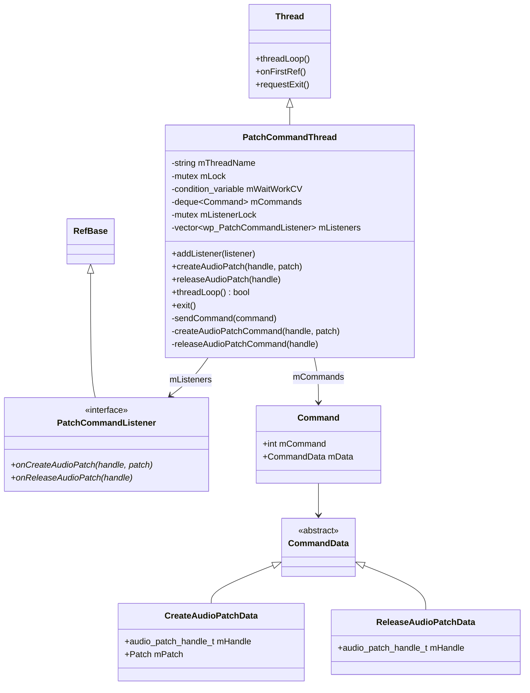
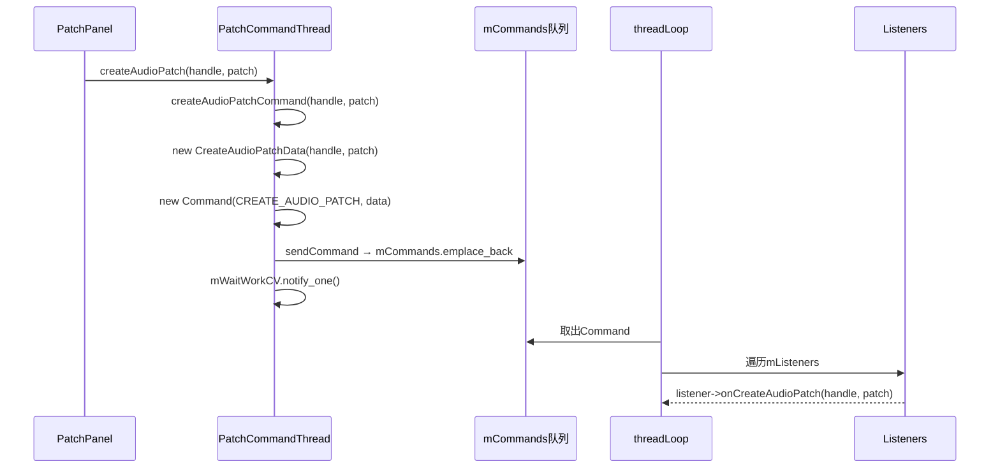
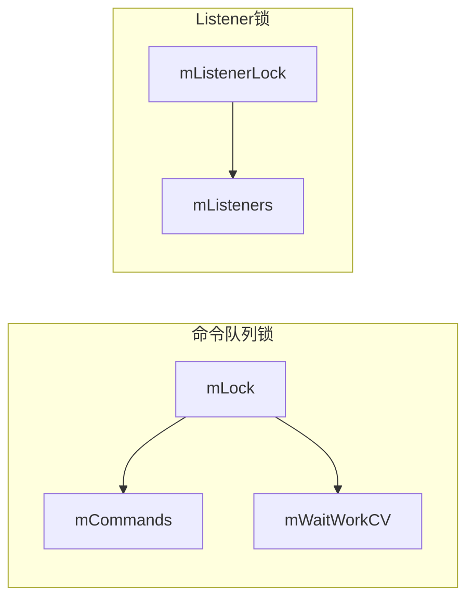
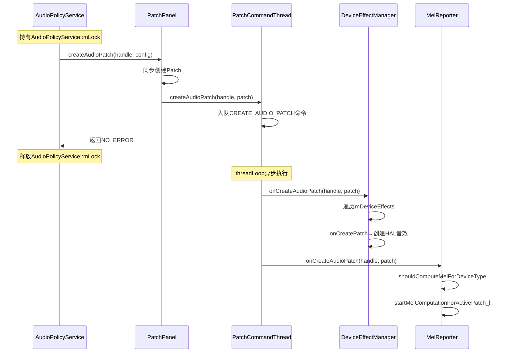

[← 5.14 SoundDoseManager](05_5.14_SoundDoseManager-CSD声剂量管理.md) | [← 返回AudioFlinger](README.md) | [返回导航](../README.md) | [5.16 BufLog →](05_5.16_BufLog-缓冲区调试日志.md)

## 5.15 PatchCommandThread - Patch异步命令线程

## 1. 概述

`PatchCommandThread`是AudioFlinger中专门处理AudioPatch创建和释放命令的异步线程。其核心目的是**解耦PatchPanel的同步操作与需要回调AudioPolicyService的异步操作**，避免死锁。

源码位置：
- [`PatchCommandThread.h`](frameworks/av/services/audioflinger/PatchCommandThread.h)
- [`PatchCommandThread.cpp`](frameworks/av/services/audioflinger/PatchCommandThread.cpp) (159行)

## 2. 设计动机：互锁问题

### 2.1 问题根源

AudioPatch的创建和释放由AudioPolicyService发起，调用链如下：

```
AudioPolicyService::mLock → PatchPanel::createAudioPatch → 设备音效管理/MEL计算 → 回调AudioPolicyService → 死锁!
```

设备级音效管理（`DeviceEffectManager`）和声暴露报告（`MelReporter`）在Patch创建时需要执行一些操作，这些操作可能需要回调AudioPolicyService查询音效策略。如果直接在PatchPanel的同步调用路径中执行，而AudioPolicyService已经持有自己的锁，就会导致死锁。

### 2.2 解决方案

`PatchCommandThread`引入一个异步命令队列，将需要回调AudioPolicyService的操作推迟到独立线程执行：

```
AudioPolicyService → PatchPanel → PatchCommandThread入队 → 返回（释放AudioPolicyService锁）
PatchCommandThread → 取出命令 → 通知Listener → DeviceEffectManager/MelReporter执行
```

## 3. 类结构与继承



## 4. 命令数据结构

### 4.1 Command

```cpp
class Command : public RefBase {
public:
    const int mCommand = -1;            // 命令类型
    const sp<CommandData> mData;        // 命令数据
};
```

`mCommand`取值：
- `CREATE_AUDIO_PATCH`（0）：创建AudioPatch
- `RELEASE_AUDIO_PATCH`（1）：释放AudioPatch

### 4.2 CreateAudioPatchData

```cpp
class CreateAudioPatchData : public CommandData {
public:
    const audio_patch_handle_t mHandle;  // Patch句柄
    const PatchPanel::Patch mPatch;      // Patch完整数据
};
```

携带Patch的完整信息，包括source/sink端口、HAL句柄等，供Listener处理。

### 4.3 ReleaseAudioPatchData

```cpp
class ReleaseAudioPatchData : public CommandData {
public:
    audio_patch_handle_t mHandle;  // 仅需Patch句柄
};
```

释放时仅需句柄，Listener通过句柄查找关联的内部状态。

## 5. PatchCommandListener接口

[`PatchCommandListener`](frameworks/av/services/audioflinger/PatchCommandThread.h:30) 是观察者模式的核心接口：

```cpp
class PatchCommandListener : public virtual RefBase {
public:
    virtual void onCreateAudioPatch(audio_patch_handle_t handle,
                                    const PatchPanel::Patch& patch) = 0;
    virtual void onReleaseAudioPatch(audio_patch_handle_t handle) = 0;
};
```

当前有两个实现者：

| 实现者 | 说明 |
|--------|------|
| `DeviceEffectManager` | 管理设备级音效，Patch创建时创建HAL音效实例 |
| `MelReporter` | 管理MEL声暴露报告，Patch创建时启动CSD计算 |

## 6. 命令发送流程

### 6.1 createAudioPatch

[`createAudioPatch()`](frameworks/av/services/audioflinger/PatchCommandThread.cpp:43) 由PatchPanel调用：



### 6.2 releaseAudioPatch

[`releaseAudioPatch()`](frameworks/av/services/audioflinger/PatchCommandThread.cpp:52) 流程类似：

```cpp
void PatchCommandThread::releaseAudioPatch(audio_patch_handle_t handle) {
    releaseAudioPatchCommand(handle);
}
```

## 7. threadLoop详解

[`threadLoop()`](frameworks/av/services/audioflinger/PatchCommandThread.cpp:57) 是命令处理的主循环：

```cpp
bool PatchCommandThread::threadLoop() {
    std::unique_lock _l(mLock);

    while (!exitPending()) {
        while (!mCommands.empty() && !exitPending()) {
            const sp<Command> command = mCommands.front();
            mCommands.pop_front();
            _l.unlock();  // 处理命令时释放锁

            // 获取Listener快照
            std::vector<wp<PatchCommandListener>> listenersCopy;
            {
                std::lock_guard _ll(mListenerLock);
                listenersCopy = mListeners;
            }

            switch (command->mCommand) {
                case CREATE_AUDIO_PATCH: {
                    const auto data = (CreateAudioPatchData*) command->mData.get();
                    for (const auto& listener : listenersCopy) {
                        auto spListener = listener.promote();
                        if (spListener) {
                            spListener->onCreateAudioPatch(data->mHandle, data->mPatch);
                        }
                    }
                    break;
                }
                case RELEASE_AUDIO_PATCH: {
                    const auto data = (ReleaseAudioPatchData*) command->mData.get();
                    for (const auto& listener : listenersCopy) {
                        auto spListener = listener.promote();
                        if (spListener) {
                            spListener->onReleaseAudioPatch(data->mHandle);
                        }
                    }
                    break;
                }
            }
            _l.lock();  // 重新获取锁
        }

        if (!exitPending()) {
            mWaitWorkCV.wait(_l);  // 等待新命令
        }
    }
    return false;
}
```

### 7.1 关键设计细节

1. **锁释放处理**：处理命令时释放`mLock`，避免Listener回调时持有锁导致死锁
2. **Listener快照**：复制`mListeners`到`listenersCopy`，避免在回调期间Listener被修改
3. **弱引用提升**：使用`listener.promote()`检查Listener是否仍然存活
4. **条件变量等待**：队列为空时通过`mWaitWorkCV.wait(_l)`阻塞，新命令入队时`notify_one()`唤醒

## 8. sendCommand与队列管理

[`sendCommand()`](frameworks/av/services/audioflinger/PatchCommandThread.cpp:120) 将命令入队并唤醒线程：

```cpp
void PatchCommandThread::sendCommand(const sp<Command>& command) {
    std::lock_guard _l(mLock);
    mCommands.emplace_back(command);
    mWaitWorkCV.notify_one();
}
```

### 8.1 mCommands双端队列

```cpp
std::deque<sp<Command>> mCommands GUARDED_BY(mLock);
```

使用`std::deque`而非`std::queue`，因为deque支持迭代和随机访问，便于调试和dump。

## 9. Listener管理

### 9.1 addListener

[`addListener()`](frameworks/av/services/audioflinger/PatchCommandThread.cpp:39) 注册新的Listener：

```cpp
void PatchCommandThread::addListener(const sp<PatchCommandListener>& listener) {
    std::lock_guard _l(mListenerLock);
    mListeners.emplace_back(listener);
}
```

Listener使用`wp<PatchCommandListener>`弱引用存储，当Listener对象被销毁时不会阻止回收。

### 9.2 Listener注册时机

| Listener | 注册时机 |
|----------|---------|
| DeviceEffectManager | `onFirstRef()`中调用`addListener(this)` |
| MelReporter | `onFirstRef()`中调用`addListener(this)` |

两者都在AudioFlinger初始化阶段注册，确保不会错过任何Patch事件。

## 10. 线程启动与退出

### 10.1 onFirstRef

[`onFirstRef()`](frameworks/av/services/audioflinger/PatchCommandThread.cpp:34) 启动线程：

```cpp
void PatchCommandThread::onFirstRef() {
    run(kPatchCommandThreadName, ANDROID_PRIORITY_AUDIO);
}
```

线程名为`"AudioFlinger_PatchCommandThread"`，优先级为`ANDROID_PRIORITY_AUDIO`（-16），与音频线程相同。

### 10.2 exit

[`exit()`](frameworks/av/services/audioflinger/PatchCommandThread.cpp:137) 优雅退出：

```cpp
void PatchCommandThread::exit() {
    {
        std::lock_guard _l(mLock);
        requestExit();
        mWaitWorkCV.notify_one();
    }
    requestExitAndWait();  // 安全等待线程退出
}
```

## 11. 双锁设计



- **mLock**：保护命令队列`mCommands`和条件变量`mWaitWorkCV`
- **mListenerLock**：保护Listener列表`mListeners`

两个锁独立运作，处理命令时先获取Listener快照（持mListenerLock），再释放mLock执行回调，避免跨锁依赖。

## 12. 与其他组件的交互全景



## 13. 总结

`PatchCommandThread`的核心设计要点：

1. **异步解耦**：将Patch事件从同步路径解耦到异步线程，避免AudioPolicyService互锁
2. **观察者模式**：PatchCommandListener接口支持多个Listener，当前有DeviceEffectManager和MelReporter
3. **生产者-消费者模式**：PatchPanel生产命令，threadLoop消费命令
4. **弱引用安全**：Listener使用wp存储，避免阻止对象回收
5. **双锁隔离**：命令队列锁和Listener锁独立，处理命令时先复制Listener快照再释放队列锁
6. **优雅退出**：通过requestExit + mWaitWorkCV.notify_one + requestExitAndWait三步退出