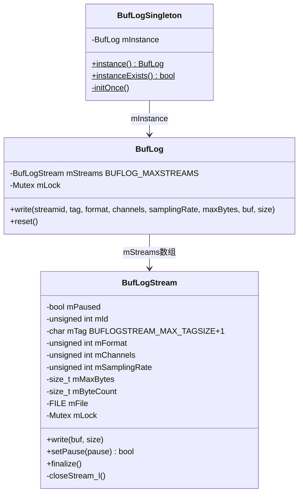
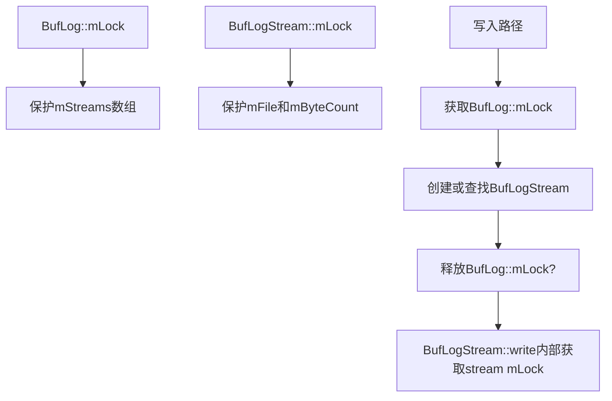

[← 5.15 PatchCommandThread](05_5.15_PatchCommandThread-Patch异步命令线程.md) | [← 返回AudioFlinger](README.md) | [返回导航](../README.md) | [5.17 SpatializerThread与BitPerfectThread →](05_5.17_SpatializerThread与BitPerfectThread-特殊输出线程.md)

## 5.16 BufLog - 缓冲区调试日志

## 1. 概述

`BufLog`是AudioFlinger中的音频缓冲区调试日志工具。它将音频PCM数据实时写入磁盘文件，用于离线分析音频处理链路中的数据变化。典型使用场景包括：调试混音算法、验证音效处理结果、排查音频断裂问题等。

源码位置：
- [`BufLog.h`](frameworks/av/services/audioflinger/BufLog.h)
- [`BufLog.cpp`](frameworks/av/services/audioflinger/BufLog.cpp) (197行)

## 2. 类结构与架构



## 3. 单例模式：BufLogSingleton

[`BufLogSingleton`](frameworks/av/services/audioflinger/BufLog.h:174) 使用`pthread_once`保证线程安全的懒初始化：

```cpp
pthread_once_t onceControl = PTHREAD_ONCE_INIT;
BufLog *BufLogSingleton::mInstance = NULL;

void BufLogSingleton::initOnce() {
    mInstance = new BufLog();
    ALOGW("Warning: BUFLOG is defined in some part of your code.\n"
          "This will create large audio dumps in %s.", BUFLOG_BASE_PATH);
}

BufLog *BufLogSingleton::instance() {
    pthread_once(&onceControl, initOnce);
    return mInstance;
}

bool BufLogSingleton::instanceExists() {
    return mInstance != NULL;
}
```

关键特性：
- 使用`pthread_once`而非C++ `static`局部变量，确保跨平台兼容
- 初始化时打印警告，提醒开发者BufLog会产生大量磁盘文件
- `instanceExists()`不触发初始化，仅检查是否已创建

## 4. BUFLOG宏

### 4.1 条件编译

BufLog通过[`BUFLOG_NDEBUG`](frameworks/av/services/audioflinger/BufLog.h:56)宏控制是否启用：

```cpp
#ifndef BUFLOG_NDEBUG
#ifdef NDEBUG
#define BUFLOG_NDEBUG 1    // Release构建：禁用BufLog
#else
#define BUFLOG_NDEBUG 0    // Debug构建：启用BufLog
#endif
#endif
```

Release构建中BufLog被完全编译为空操作：
```cpp
#define BUFLOG(STREAMID, TAG, FORMAT, CHANNELS, SAMPLINGRATE, MAXBYTES, BUF, SIZE) \
    do { if (0) { } } while (0)
```

Debug构建中BufLog正常工作：
```cpp
#define BUFLOG(STREAMID, TAG, FORMAT, CHANNELS, SAMPLINGRATE, MAXBYTES, BUF, SIZE) \
    __BUFLOG(STREAMID, TAG, FORMAT, CHANNELS, SAMPLINGRATE, MAXBYTES, BUF, SIZE)
```

### 4.2 其他宏

| 宏 | 说明 |
|----|------|
| `BUFLOG_EXISTS` | 检查BufLogSingleton是否存在实例 |
| `BUFLOG_RESET` | 重置所有BufLog流，关闭并删除所有文件 |

### 4.3 使用示例

```cpp
// 在源文件顶部添加
#define BUFLOG_NDEBUG 0
#include "BufLog.h"

// 在音频处理代码中
int format       = AUDIO_FORMAT_PCM_FLOAT;
int channels     = 2;
int samplingRate = 48000;
int frameSize    = sizeof(float) * channels;
int buffSize     = frameCount * frameSize;
long maxBytes    = 10 * samplingRate * frameSize;  // 10秒数据

BUFLOG(11, "loudness_enhancer_out", format, channels, samplingRate, maxBytes,
       outputBuffer, buffSize);
```

## 5. BufLog核心实现

### 5.1 write方法

[`BufLog::write()`](frameworks/av/services/audioflinger/BufLog.cpp:68) 是数据写入入口：

```cpp
size_t BufLog::write(int streamid, const char *tag, int format, int channels,
        int samplingRate, size_t maxBytes, const void *buf, size_t size) {
    unsigned int id = streamid % BUFLOG_MAXSTREAMS;  // 取模确保范围[0:15]
    android::Mutex::Autolock autoLock(mLock);

    BufLogStream *pBLStream = mStreams[id];

    if (pBLStream == NULL) {
        pBLStream = mStreams[id] = new BufLogStream(id, tag, format, channels,
                samplingRate, maxBytes);  // 懒创建
    }

    return pBLStream->write(buf, size);  // 委托给BufLogStream
}
```

关键设计：
- `streamid % BUFLOG_MAXSTREAMS`：streamid取模映射到0-15范围，超出范围的ID会覆盖已有流
- 懒创建：首次写入时才创建BufLogStream对象并打开文件
- 全局锁`mLock`：保护mStreams数组的并发访问

### 5.2 reset方法

[`BufLog::reset()`](frameworks/av/services/audioflinger/BufLog.cpp:83) 重置所有流：

```cpp
void BufLog::reset() {
    android::Mutex::Autolock autoLock(mLock);
    for (unsigned int id = 0; id < BUFLOG_MAXSTREAMS; id++) {
        BufLogStream *pBLStream = mStreams[id];
        if (pBLStream != NULL) {
            delete pBLStream;
            mStreams[id] = NULL;
        }
    }
}
```

删除所有BufLogStream对象（关闭文件），后续`write()`调用会创建新流和新文件。

## 6. BufLogStream核心实现

### 6.1 构造与文件命名

[`BufLogStream`](frameworks/av/services/audioflinger/BufLog.cpp:95) 构造时立即创建raw文件：

```cpp
BufLogStream::BufLogStream(unsigned int id, const char *tag, unsigned int format,
        unsigned int channels, unsigned int samplingRate, size_t maxBytes)
    : mId(id), mFormat(format), mChannels(channels),
      mSamplingRate(samplingRate), mMaxBytes(maxBytes) {
    mByteCount = 0;
    mPaused = false;
    
    // 生成时间戳
    char timeStr[16];
    struct timeval tv;
    gettimeofday(&tv, NULL);
    struct tm tm;
    localtime_r(&tv.tv_sec, &tm);
    strftime(timeStr, sizeof(timeStr), "%Y%m%d%H%M%S", &tm);
    
    // 生成文件路径
    char logPath[BUFLOG_MAX_PATH_SIZE];
    snprintf(logPath, BUFLOG_MAX_PATH_SIZE,
             "%s/%s_%d_%s_%d_%d_%d.raw",
             BUFLOG_BASE_PATH, timeStr, mId, mTag, mFormat, mChannels, mSamplingRate);
    
    mFile = fopen(logPath, "wb");
}
```

文件命名格式：`YYYYMMDDHHMMSS_id_tag_format_channels_samplingrate.raw`

示例：`20240115143022_11_loudness_enhancer_out_5_2_48000.raw`

| 字段 | 说明 | 示例值 |
|------|------|--------|
| 时间戳 | 精确到秒 | 20240115143022 |
| id | 流ID | 11 |
| tag | 自定义标签 | loudness_enhancer_out |
| format | 音频格式编码 | 5（AUDIO_FORMAT_PCM_FLOAT） |
| channels | 通道数 | 2 |
| samplingrate | 采样率 | 48000 |

### 6.2 write写入

[`BufLogStream::write()`](frameworks/av/services/audioflinger/BufLog.cpp:130) 将数据写入文件：

```cpp
size_t BufLogStream::write(const void *buf, size_t size) {
    size_t bytes = 0;
    if (!mPaused && mFile != NULL) {
        if (size > 0 && buf != NULL) {
            android::Mutex::Autolock autoLock(mLock);
            if (mMaxBytes > 0) {
                size = MIN(size, mMaxBytes - mByteCount);  // 截断到上限
            }
            bytes = fwrite(buf, 1, size, mFile);
            mByteCount += bytes;
            if (mMaxBytes > 0 && mMaxBytes == mByteCount) {
                closeStream_l();  // 达到上限自动关闭
            }
        }
    }
    return bytes;
}
```

关键行为：
- **mPaused控制**：暂停时不写入数据
- **mMaxBytes限制**：达到文件大小上限时自动关闭文件
- **mMaxBytes=0**：无大小限制，持续写入直到finalize/reset
- 写入使用`fwrite()`直接将原始PCM数据写入，无任何格式转换

### 6.3 pause/resume

[`setPause()`](frameworks/av/services/audioflinger/BufLog.cpp:158) 控制流的暂停状态：

```cpp
bool BufLogStream::setPause(bool pause) {
    bool old = mPaused;
    mPaused = pause;
    return old;  // 返回之前的暂停状态
}
```

暂停期间数据不会被写入，但文件保持打开状态。恢复后继续写入同一文件。

### 6.4 finalize

[`finalize()`](frameworks/av/services/audioflinger/BufLog.cpp:162) 关闭文件并终止流：

```cpp
void BufLogStream::finalize() {
    android::Mutex::Autolock autoLock(mLock);
    closeStream_l();  // 关闭文件，mFile设为NULL
}
```

finalize后流不可重新打开，后续write将无效。

### 6.5 closeStream_l

[`closeStream_l()`](frameworks/av/services/audioflinger/BufLog.cpp:120) 内部关闭文件：

```cpp
void BufLogStream::closeStream_l() {
    if (mFile != NULL) {
        fclose(mFile);
        mFile = NULL;
    }
}
```

## 7. 与threadLoop的集成

BufLog在AudioFlinger的`PlaybackThread::threadLoop()`中使用，记录关键节点的音频数据：


通过在不同处理阶段插入BUFLOG宏，可以捕获完整的音频处理链路数据，离线用Audacity等工具分析raw文件。

## 8. 配置常量

| 常量 | 值 | 说明 |
|------|-----|------|
| `BUFLOG_MAXSTREAMS` | 16 | 最大同时活跃的流数量 |
| `BUFLOGSTREAM_MAX_TAGSIZE` | 32 | 标签字符串最大长度 |
| `BUFLOG_BASE_PATH` | "/data/misc/audioserver" | 文件存储路径 |
| `BUFLOG_MAX_PATH_SIZE` | 300 | 文件路径最大长度 |

## 9. 文件格式说明

BufLog输出的是**原始PCM数据文件**（.raw），不包含任何文件头或元数据。分析时需要根据文件名中的format/channels/samplingrate信息手动设置：

用Audacity打开raw文件的步骤：
1. File → Import → Raw Data
2. 根据文件名设置编码格式（如PCM Float 32-bit）
3. 设置通道数（如2 = Stereo）
4. 设置采样率（如48000 Hz）
5. 设置字节序（Little Endian）

## 10. 磁盘空间风险

BufLog会在`/data/misc/audioserver`目录下持续写入文件，存在磁盘空间耗尽的风险：

- 48kHz/2通道/Float32格式：每秒约384KB
- 10秒maxBytes限制：约3.84MB
- 16个流同时活跃：最大约60MB

缓解措施：
- `mMaxBytes`参数限制单文件大小
- Release构建中BufLog被完全禁用
- `BUFLOG_RESET`宏可主动清理所有文件

## 11. 锁机制



注意：`BufLog::write()`在持有`BufLog::mLock`的情况下调用`BufLogStream::write()`，后者又会获取`BufLogStream::mLock`。这形成了锁嵌套，但由于每个BufLogStream的锁是独立的，不会导致死锁。

## 12. 调试场景示例

### 12.1 排查混音断裂

在MixerThread中记录混音前后的数据：
```cpp
BUFLOG(0, "mixer_input", AUDIO_FORMAT_PCM_FLOAT, 2, 48000, 0, inputBuf, inputSize);
// ... 混音处理 ...
BUFLOG(1, "mixer_output", AUDIO_FORMAT_PCM_FLOAT, 2, 48000, 0, outputBuf, outputSize);
```

### 12.2 验证音效处理

在EffectChain处理前后记录：
```cpp
BUFLOG(2, "effect_input", format, channels, samplingRate, maxBytes, inBuf, inSize);
// ... 音效处理 ...
BUFLOG(3, "effect_output", format, channels, samplingRate, maxBytes, outBuf, outSize);
```

### 12.3 调试重采样

在AudioResampler前后记录：
```cpp
BUFLOG(4, "resampler_in", srcFormat, srcChannels, srcRate, 0, srcBuf, srcSize);
// ... 重采样 ...
BUFLOG(5, "resampler_out", dstFormat, dstChannels, dstRate, 0, dstBuf, dstSize);
```

## 13. 总结

`BufLog`的核心设计要点：

1. **Release禁用**：通过`BUFLOG_NDEBUG`宏在Release构建中完全编译为空操作
2. **最多16流**：每个流独立文件，支持同时调试多个处理节点
3. **懒创建**：首次写入时创建流和文件，减少不必要的资源开销
4. **raw文件格式**：直接写入PCM原始数据，文件名包含格式信息便于离线分析
5. **大小限制**：mMaxBytes控制单文件最大尺寸，防止磁盘空间耗尽
6. **暂停/恢复**：setPause()允许临时暂停数据采集
7. **自动关闭**：达到mMaxBytes上限时自动关闭文件
8. **单例模式**：pthread_once保证线程安全的全局唯一实例