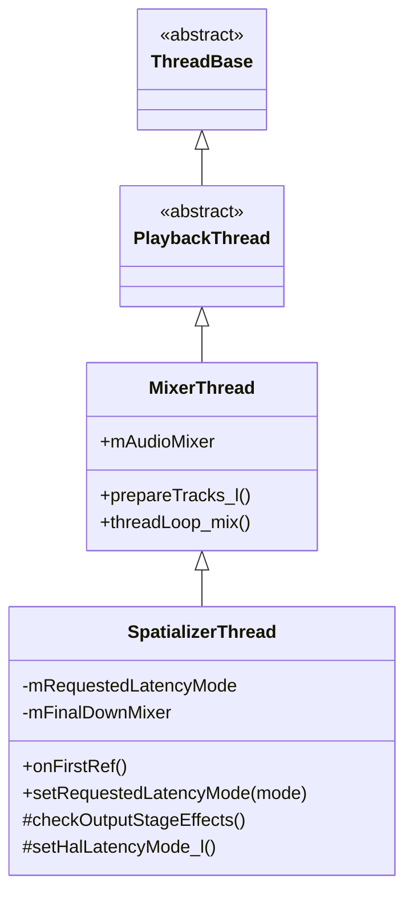
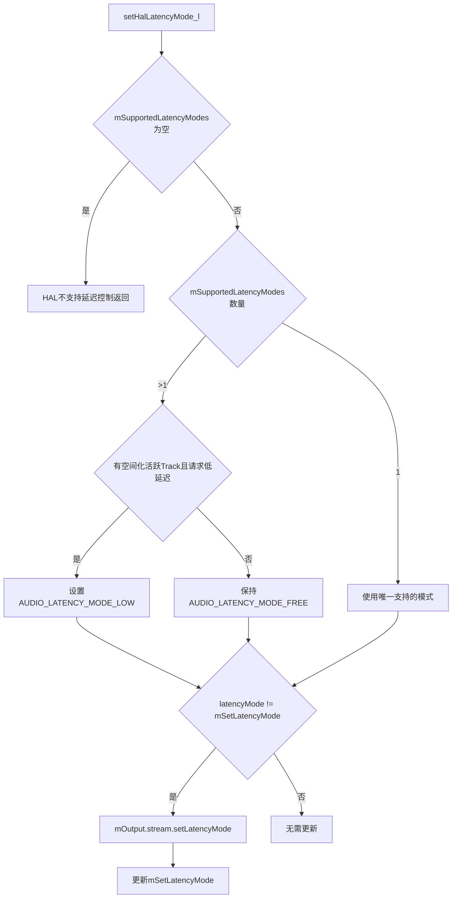
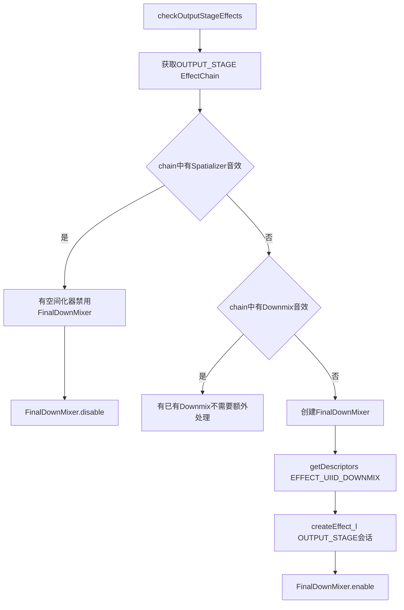
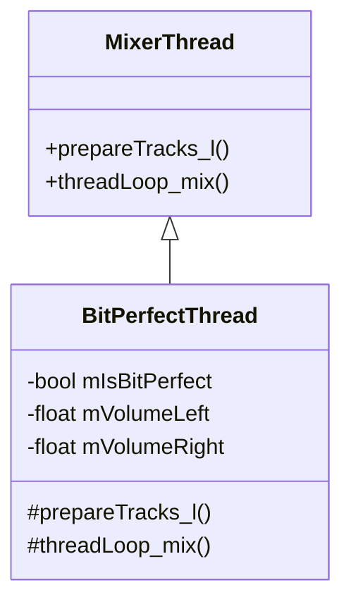
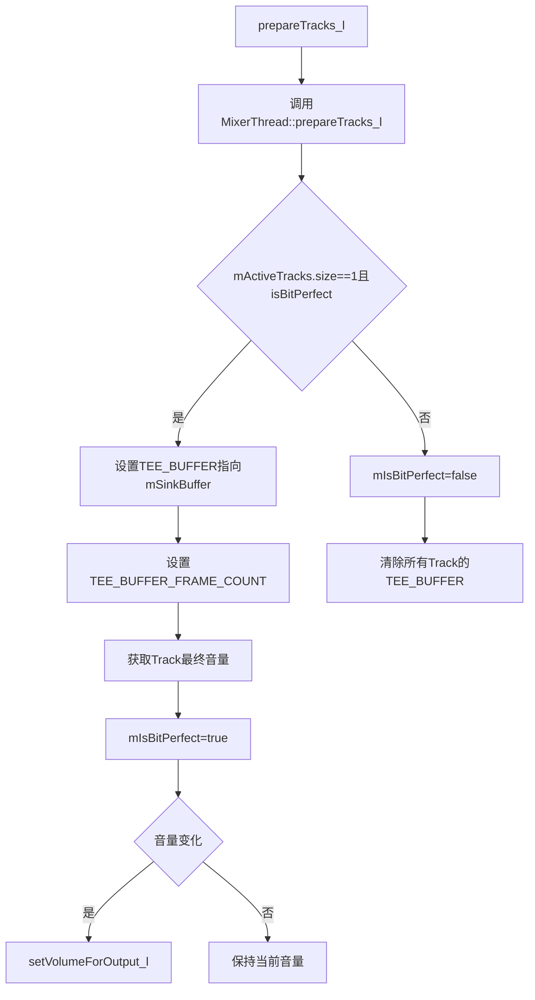
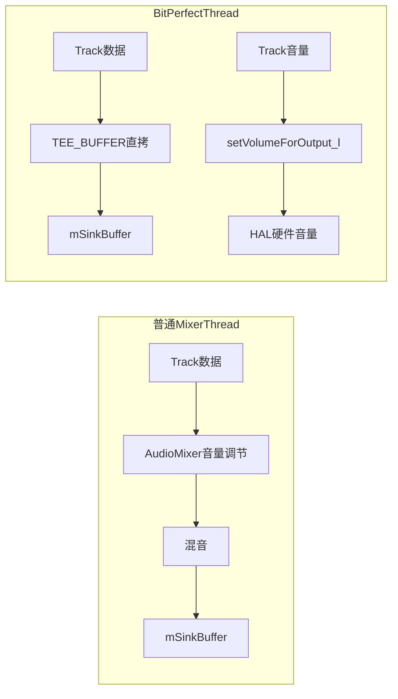
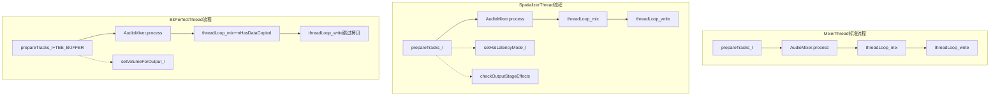
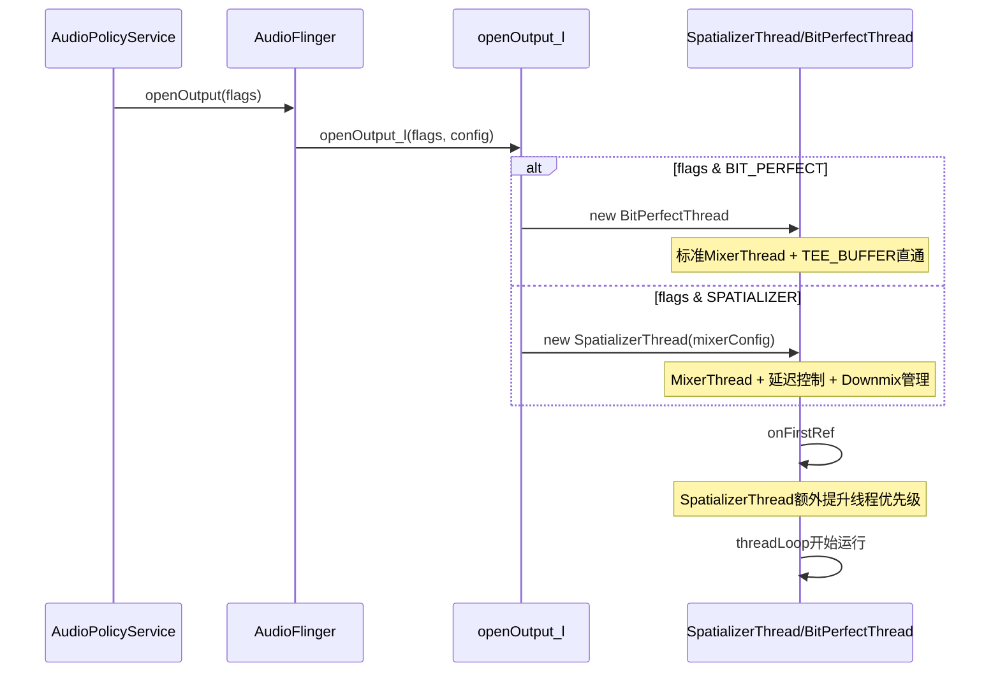

[← 5.16 BufLog](05_5.16_BufLog-缓冲区调试日志.md) | [← 返回AudioFlinger](README.md) | [返回导航](../README.md)

## 5.17 SpatializerThread与BitPerfectThread - 特殊输出线程

## 1. 概述

`SpatializerThread`和`BitPerfectThread`是AudioFlinger中两种特殊的输出线程，它们都继承自`MixerThread`，但针对特定场景进行了定制化。前者为空间音频提供低延迟模式控制和自动Downmix管理，后者为高保真音频提供比特完美的数据直通路径。

源码位置：
- [`Threads.h`](frameworks/av/services/audioflinger/Threads.h:1836-1861) (SpatializerThread)
- [`Threads.h`](frameworks/av/services/audioflinger/Threads.h:2359-2372) (BitPerfectThread)
- [`Threads.cpp`](frameworks/av/services/audioflinger/Threads.cpp:7666-7787) (SpatializerThread实现)
- [`Threads.cpp`](frameworks/av/services/audioflinger/Threads.cpp:11033-11075) (BitPerfectThread实现)

## 2. 线程创建条件

在[`openOutput_l()`](frameworks/av/services/audioflinger/AudioFlinger.cpp:3056)中，根据`audio_output_flags_t`标志位决定创建哪种线程：

```cpp
if (flags & AUDIO_OUTPUT_FLAG_BIT_PERFECT) {
    thread = sp<BitPerfectThread>::make(this, outputStream, *output, mSystemReady);
} else if (flags & AUDIO_OUTPUT_FLAG_SPATIALIZER) {
    thread = new SpatializerThread(this, outputStream, *output, mSystemReady, mixerConfig);
} else if (flags & AUDIO_OUTPUT_FLAG_COMPRESS_OFFLOAD) {
    thread = new OffloadThread(...);
} else if (flags & AUDIO_OUTPUT_FLAG_DIRECT) {
    thread = new DirectOutputThread(...);
} else {
    thread = new MixerThread(...);
}
```

优先级：BIT_PERFECT > SPATIALIZER > COMPRESS_OFFLOAD > DIRECT > MIXER

### 2.1 标志位含义

| 标志位 | 值 | 用途 |
|--------|-----|------|
| `AUDIO_OUTPUT_FLAG_SPATIALIZER` | 0x4000 | 空间音频输出，请求低延迟模式 |
| `AUDIO_OUTPUT_FLAG_BIT_PERFECT` | 0x10000 | 比特完美输出，PCM数据不经混音直接输出 |

### 2.2 MULTICHANNEL_EFFECT_CHAIN前提

SpatializerThread的创建需要`MULTICHANNEL_EFFECT_CHAIN`宏定义：

```cpp
#ifndef MULTICHANNEL_EFFECT_CHAIN
    if (flags & AUDIO_OUTPUT_FLAG_SPATIALIZER) {
        ALOGE("openOutput_l() cannot create spatializer thread "
                "without #define MULTICHANNEL_EFFECT_CHAIN");
        return nullptr;
    }
#endif
```

这是因为空间音频音效链需要多通道支持，未定义此宏时无法创建。

## 3. SpatializerThread详解

### 3.1 类定义

```cpp
class SpatializerThread : public MixerThread {
public:
    SpatializerThread(const sp<AudioFlinger>& audioFlinger,
                           AudioStreamOut* output,
                           audio_io_handle_t id,
                           bool systemReady,
                           audio_config_base_t *mixerConfig);
    ~SpatializerThread() override {}
    bool hasFastMixer() const override { return false; }
    void onFirstRef() override;
    status_t setRequestedLatencyMode(audio_latency_mode_t mode) override;

protected:
    void checkOutputStageEffects() override;
    void setHalLatencyMode_l() override;

private:
    audio_latency_mode_t mRequestedLatencyMode = AUDIO_LATENCY_MODE_FREE;
    sp<EffectHandle> mFinalDownMixer;
};
```



### 3.2 onFirstRef与线程优先级提升

[`onFirstRef()`](frameworks/av/services/audioflinger/Threads.cpp:7675) 在线程首次引用时提升优先级：

```cpp
void SpatializerThread::onFirstRef() {
    MixerThread::onFirstRef();
    const pid_t tid = getTid();
    if (tid == -1) {
        ALOGW("Cannot update Spatializer mixer thread priority, not running");
    } else {
        const int priorityBoost = requestSpatializerPriority(getpid(), tid);
        if (priorityBoost > 0) {
            stream()->setHalThreadPriority(priorityBoost);
        }
    }
}
```

- `requestSpatializerPriority()`向系统请求空间音频线程的优先级提升
- 提升后的优先级通过`setHalThreadPriority()`设置到HAL线程
- 这确保空间音频处理有足够的CPU时间，避免延迟抖动

### 3.3 hasFastMixer返回false

```cpp
bool hasFastMixer() const override { return false; }
```

SpatializerThread明确禁用FastMixer。原因：空间音频的多通道处理和音效链不适合FastMixer的快速路径设计。

### 3.4 延迟模式控制

[`setHalLatencyMode_l()`](frameworks/av/services/audioflinger/Threads.cpp:7690) 是SpatializerThread的核心功能，控制HAL的延迟模式：



关键逻辑：
1. 空闲模式（FREE）为默认，允许HAL自由选择延迟策略
2. 低延迟模式（LOW）在有空间化活跃Track且控制器请求时启用
3. 仅当模式变化时才调用HAL的`setLatencyMode()`

### 3.5 setRequestedLatencyMode

[`setRequestedLatencyMode()`](frameworks/av/services/audioflinger/Threads.cpp:7728) 由空间音频控制器调用：

```cpp
status_t SpatializerThread::setRequestedLatencyMode(audio_latency_mode_t mode) {
    if (mode != AUDIO_LATENCY_MODE_LOW && mode != AUDIO_LATENCY_MODE_FREE) {
        return BAD_VALUE;
    }
    Mutex::Autolock _l(mLock);
    mRequestedLatencyMode = mode;
    return NO_ERROR;
}
```

仅接受LOW和FREE两种模式，其他值返回BAD_VALUE。

### 3.6 checkOutputStageEffects与自动Downmix

[`checkOutputStageEffects()`](frameworks/av/services/audioflinger/Threads.cpp:7737) 是SpatializerThread的另一个核心功能，自动管理OUTPUT_STAGE会话的音效：



核心逻辑：
1. **有Spatializer音效**：不需要FinalDownMixer，因为Spatializer本身处理多通道到立体声的转换
2. **无Spatializer且无Downmix**：自动创建Downmix音效，将多通道输出降混为立体声
3. **有Downmix**：已有降混处理，不需要额外操作

这确保了空间音频关闭时，多通道数据仍能正确降混到输出设备支持的通道数。

### 3.7 mFinalDownMixer生命周期

```cpp
sp<EffectHandle> mFinalDownMixer;
```

- 在`checkOutputStageEffects()`中创建，绑定到`AUDIO_SESSION_OUTPUT_STAGE`会话
- 当Spatializer音效激活时被禁用
- 当Spatializer音效移除时被创建/启用
- 始终在OUTPUT_STAGE会话上操作，确保是音效链的最后一环

## 4. BitPerfectThread详解

### 4.1 类定义

```cpp
class BitPerfectThread : public MixerThread {
public:
    BitPerfectThread(const sp<AudioFlinger>& audioflinger, AudioStreamOut *output,
                     audio_io_handle_t id, bool systemReady);

protected:
    mixer_state prepareTracks_l(Vector<sp<Track>> *tracksToRemove) override;
    void threadLoop_mix() override;

private:
    bool mIsBitPerfect;
    float mVolumeLeft = 0.f;
    float mVolumeRight = 0.f;
};
```



### 4.2 设计理念

BitPerfect（比特完美）模式的含义：**音频PCM数据不经过任何混音或音量调节处理，直接从应用层透传到HAL输出**。这保证了音频数据的完整性，适用于高保真音频播放场景。

关键条件：
- **仅一个活跃Track**：多个Track需要混音，无法保持比特完美
- **Track标记为isBitPerfect()**：Track本身必须声明为比特完美模式

### 4.3 prepareTracks_l重写

[`prepareTracks_l()`](frameworks/av/services/audioflinger/Threads.cpp:11037) 是BitPerfectThread的核心定制：



关键代码详解：

```cpp
mixer_state BitPerfectThread::prepareTracks_l(Vector<sp<Track>> *tracksToRemove) {
    mixer_state result = MixerThread::prepareTracks_l(tracksToRemove);
    float volumeLeft = 1.0f;
    float volumeRight = 1.0f;
    
    if (mActiveTracks.size() == 1 && mActiveTracks[0]->isBitPerfect()) {
        // 比特完美模式：将Track数据直接写入sink buffer
        const int trackId = mActiveTracks[0]->id();
        mAudioMixer->setParameter(trackId, AudioMixer::TRACK, 
                                   AudioMixer::TEE_BUFFER, (void*)mSinkBuffer);
        mAudioMixer->setParameter(trackId, AudioMixer::TRACK,
                                   AudioMixer::TEE_BUFFER_FRAME_COUNT,
                                   (void*)(uintptr_t)mNormalFrameCount);
        mActiveTracks[0]->getFinalVolume(&volumeLeft, &volumeRight);
        mIsBitPerfect = true;
    } else {
        // 非比特完美模式：清除所有TEE_BUFFER设置
        mIsBitPerfect = false;
        for (const auto& track : mActiveTracks) {
            mAudioMixer->setParameter(trackId, AudioMixer::TRACK,
                                       AudioMixer::TEE_BUFFER, nullptr);
        }
    }
    // 音量变化时更新到输出
    if (mVolumeLeft != volumeLeft || mVolumeRight != volumeRight) {
        mVolumeLeft = volumeLeft;
        mVolumeRight = volumeRight;
        setVolumeForOutput_l(volumeLeft, volumeRight);
    }
    return result;
}
```

### 4.4 TEE_BUFFER机制

`TEE_BUFFER`是AudioMixer中的一个特殊参数，将Track的PCM数据直接拷贝到指定缓冲区（通常是`mSinkBuffer`），绕过正常的混音流程：

- **比特完美模式**：`TEE_BUFFER = mSinkBuffer`，Track数据直接拷贝到输出缓冲区
- **非比特完美模式**：`TEE_BUFFER = nullptr`，数据经过正常混音路径

`TEE_BUFFER_FRAME_COUNT`指定了拷贝的帧数，通常等于`mNormalFrameCount`。

### 4.5 threadLoop_mix重写

[`threadLoop_mix()`](frameworks/av/services/audioflinger/Threads.cpp:11070) 非常简洁：

```cpp
void BitPerfectThread::threadLoop_mix() {
    MixerThread::threadLoop_mix();
    mHasDataCopiedToSinkBuffer = mIsBitPerfect;
}
```

- 先调用父类`MixerThread::threadLoop_mix()`执行混音
- 如果是比特完美模式，设置`mHasDataCopiedToSinkBuffer = true`
- 这告知`threadLoop_write()`数据已通过TEE_BUFFER直接写入sink buffer，不需要从mix buffer再次拷贝

### 4.6 音量处理

BitPerfectThread的音量处理有特殊之处：

- 默认`volumeLeft = volumeRight = 1.0f`（满音量）
- 比特完美模式下获取Track的最终音量
- 音量变化时通过`setVolumeForOutput_l()`设置到HAL
- 这意味着音量调节**不是**在混音阶段完成，而是交给HAL的硬件音量控制



## 5. 两种线程对比

| 特性 | SpatializerThread | BitPerfectThread |
|------|-------------------|------------------|
| 线程类型 | SPATIALIZER | BIT_PERFECT |
| 创建标志 | AUDIO_OUTPUT_FLAG_SPATIALIZER | AUDIO_OUTPUT_FLAG_BIT_PERFECT |
| 继承 | MixerThread | MixerThread |
| 核心功能 | 延迟模式控制 + 自动Downmix | PCM数据直通 |
| hasFastMixer | false | 未重写（继承MixerThread） |
| prepareTracks_l | 未重写 | 重写（TEE_BUFFER机制） |
| threadLoop_mix | 未重写 | 重写（mHasDataCopiedToSinkBuffer） |
| 音效管理 | checkOutputStageEffects | 无特殊处理 |
| HAL交互 | setLatencyMode | setVolumeForOutput_l |
| 多Track支持 | 支持（混音） | 支持（回退到普通混音） |

## 6. 与MixerThread的区别



## 7. BitPerfect兼容性检查

在[`Effects.cpp`](frameworks/av/services/audioflinger/Effects.cpp:2970)中，音效创建时会检查BitPerfect兼容性：

```cpp
if ((*flags & AUDIO_OUTPUT_FLAG_BIT_PERFECT) != 0 && !isBitPerfectCompatible()) {
    *flags = (audio_output_flags_t)(*flags & ~AUDIO_OUTPUT_FLAG_BIT_PERFECT);
}
```

如果当前输出不兼容BitPerfect（例如有活跃的音效处理），会自动移除BIT_PERFECT标志，回退到普通MixerThread。

## 8. SpatializerThread的isSpatializer判断

Effects框架中多处使用`mThreadType == ThreadBase::SPATIALIZER`进行条件判断：

- [`isSpatializer()`](frameworks/av/services/audioflinger/Effects.cpp:3126)：判断当前线程是否为SpatializerThread
- SpatializerThread上的音效链创建逻辑有所不同
- 空间化音效只能创建在SpatializerThread上

## 9. 完整创建时序



## 10. 总结

### SpatializerThread核心要点：
1. **延迟模式控制**：根据空间化Track状态和控制器请求，动态切换FREE/LOW延迟模式
2. **自动Downmix**：无Spatializer音效时自动创建FinalDownMixer，确保多通道降混
3. **线程优先级提升**：通过`requestSpatializerPriority`获取更高CPU调度优先级
4. **禁用FastMixer**：空间音频的多通道处理不适合FastMixer快速路径
5. **需要MULTICHANNEL_EFFECT_CHAIN**：编译前提条件

### BitPerfectThread核心要点：
1. **PCM数据直通**：单Track且isBitPerfect时，通过TEE_BUFFER机制绕过混音
2. **硬件音量控制**：音量调节委托给HAL而非在混音阶段完成
3. **多Track回退**：多个活跃Track时自动回退到普通混音模式
4. **mHasDataCopiedToSinkBuffer**：告知写入路径数据已直接到位
5. **兼容性检查**：音效处理不兼容时自动移除BIT_PERFECT标志