[← 上一个](../04_Native_Framework_Layer/README.md) | [← 返回AudioFlinger](README.md) | [返回导航](../README.md) | [下一个 →](05_5.2_Thread体系-AudioFlinger的核心执行单元.md)

## 5.1 AudioFlinger — 音频数据面引擎

## 1. 模块定位与核心职责

AudioFlinger是Android音频系统的**数据面核心引擎**，运行在`audioserver`进程中（Android 7 起从 mediaserver 独立拆分），是所有音频数据流的最终汇聚点和分发中心。其核心职责涵盖：

| 职责维度 | 具体功能 | 关键方法 | 源码位置 |
|---------|---------|---------|---------|
| **混音输出** | 将多个AudioTrack的PCM数据混合到一个输出流 | [`createTrack()`](frameworks/av/services/audioflinger/AudioFlinger.cpp:1105) | AudioFlinger.cpp:1105 |
| **采集分发** | 从HAL读取输入数据分发给多个AudioRecord | [`createRecord()`](frameworks/av/services/audioflinger/AudioFlinger.cpp:2390) | AudioFlinger.cpp:2390 |
| **路由连接** | 通过PatchPanel管理音频端口之间的连接 | [`createAudioPatch()`](frameworks/av/services/audioflinger/AudioFlinger.h:261) | AudioFlinger.h:261 |
| **效果处理** | 管理EffectChain对音频数据进行效果处理 | [`createEffect()`](frameworks/av/services/audioflinger/AudioFlinger.h:236) | AudioFlinger.h:236 |
| **音量控制** | 应用MasterVolume/StreamVolume/MasterMute | [`setMasterVolume()`](frameworks/av/services/audioflinger/AudioFlinger.cpp:1369) | AudioFlinger.cpp:1369 |
| **设备管理** | 加载和管理AudioHwDevice | [`loadHwModule()`](frameworks/av/services/audioflinger/AudioFlinger.cpp:2622) | AudioFlinger.cpp:2622 |
| **模式切换** | 切换音频模式(NORMAL/RINGTONE/IN_CALL) | [`setMode()`](frameworks/av/services/audioflinger/AudioFlinger.cpp:1445) | AudioFlinger.cpp:1445 |
| **麦克风静音** | 全局麦克风静音/取消静音 | [`setMicMute()`](frameworks/av/services/audioflinger/AudioFlinger.cpp:1487) | AudioFlinger.cpp:1487 |
| **输出开闭** | 打开/关闭HAL输出流，创建对应Thread | [`openOutput()`](frameworks/av/services/audioflinger/AudioFlinger.cpp:3096) | AudioFlinger.cpp:3096 |
| **输入开闭** | 打开/关闭HAL输入流，创建对应Thread | [`openInput()`](frameworks/av/services/audioflinger/AudioFlinger.cpp:3312) | AudioFlinger.cpp:3312 |

**源码位置**：
- 头文件：[`AudioFlinger.h`](frameworks/av/services/audioflinger/AudioFlinger.h) (~1093行)
- 实现文件：[`AudioFlinger.cpp`](frameworks/av/services/audioflinger/AudioFlinger.cpp) (~4880行)

---

## 2. AudioFlinger类完整结构

### 2.1 类继承体系与Binder注册

AudioFlinger在AOSP14中不再直接继承`BinderService<AudioFlinger>`，而是通过**Adapter模式**注册为Binder服务：

```cpp
// AudioFlinger.h:139
class AudioFlinger : public AudioFlingerServerAdapter::Delegate
```

[`AudioFlingerServerAdapter`](frameworks/av/services/audioflinger/AudioFlinger.h:139) 是AIDL生成的适配器，将`IAudioFlinger`的Binder调用转换为对`AudioFlinger::Delegate`虚函数的调用。这一设计使得AudioFlinger从传统的`BinderService`模板类继承模式转变为AIDL接口的`Delegate`实现模式。

[`instantiate()`](frameworks/av/services/audioflinger/AudioFlinger.cpp:311) 方法注册Binder服务：

```cpp
// AudioFlinger.cpp:311-316
void AudioFlinger::instantiate() {
    sp<IServiceManager> sm(defaultServiceManager());
    sm->addService(String16(IAudioFlinger::DEFAULT_SERVICE_NAME),
                   new AudioFlingerServerAdapter(new AudioFlinger()), false,
                   IServiceManager::DUMP_FLAG_PRIORITY_DEFAULT);
}
```

**关键设计点**：
1. 不直接注册AudioFlinger对象，而是通过[`AudioFlingerServerAdapter`](frameworks/av/services/audioflinger/AudioFlinger.cpp:314)包装
2. 服务名称为`IAudioFlinger::DEFAULT_SERVICE_NAME`（即`"media.audio_flinger"`）
3. `DUMP_FLAG_PRIORITY_DEFAULT`确保dump时具有默认优先级
4. 第三个参数`false`表示不允许isolated进程访问

### 2.2 核心成员变量全景图

```mermaid
graph TB
    AF[AudioFlinger] --> MP[mPlaybackThreads<br/>DefaultKeyedVector io_handle_t sp PlaybackThread]
    AF --> MR[mRecordThreads<br/>DefaultKeyedVector io_handle_t sp RecordThread]
    AF --> MM[mMmapThreads<br/>DefaultKeyedVector io_handle_t sp MmapThread]
    AF --> MC[mClients<br/>DefaultKeyedVector pid_t wp Client]
    AF --> MN[mNotificationClients<br/>DefaultKeyedVector pid_t sp NotificationClient]
    AF --> MHD[mAudioHwDevs<br/>DefaultKeyedVector module_handle_t AudioHwDevice ptr]
    AF --> PHD[mPrimaryHardwareDev<br/>AudioHwDevice ptr]
    AF --> MV[mMasterVolume float<br/>mMasterMute bool<br/>mMasterBalance float]
    AF --> ST[mStreamTypes<br/>stream_type_t array AUDIO_STREAM_CNT]
    AF --> PP[mPatchPanel PatchPanel]
    AF --> DEM[mDeviceEffectManager<br/>sp DeviceEffectManager]
    AF --> MR2[mMelReporter<br/>sp MelReporter]
    AF --> PCT[mPatchCommandThread<br/>sp PatchCommandThread]
    AF --> DFH[mDevicesFactoryHal<br/>sp DevicesFactoryHalInterface]
    AF --> EFH[mEffectsFactoryHal<br/>sp EffectsFactoryHalInterface]
    AF --> NUI[mNextUniqueIds<br/>atomic_uint_fast32_t array]
    AF --> GAF[gAudioFlinger<br/>atomic AudioFlinger ptr]
    AF --> SR[mSystemReady bool<br/>mAudioPolicyReady atomic_bool]
    AF --> MNC[mMode audio_mode_t<br/>mBtNrecIsOff atomic_bool]
    AF --> ASR[mAudioSessionRefs<br/>Vector AudioSessionRef ptr]
    AF --> OEC[mOrphanEffectChains<br/>DefaultKeyedVector session_t sp EffectChain]
    AF --> HVS[mHwAvSyncIds<br/>DefaultKeyedVector session_t audio_hw_sync_t]

    MP --> PT1[MixerThread]
    MP --> PT2[DirectOutputThread]
    MP --> PT3[OffloadThread]
    MP --> PT4[DuplicatingThread]
    MP --> PT5[SpatializerThread]
    MP --> PT6[BitPerfectThread]
    MR --> RT1[RecordThread]
    MM --> MT1[MmapPlaybackThread]
    MM --> MT2[MmapCaptureThread]
```

### 2.3 三大核心锁与保护域

AudioFlinger的并发安全依赖三个层次化的互斥锁，锁获取顺序必须严格遵循以防死锁：

| 锁名称 | 保护域 | 代码位置 | 获取顺序 |
|--------|--------|---------|---------|
| [`mLock`](frameworks/av/services/audioflinger/AudioFlinger.h:918) | mPlaybackThreads, mRecordThreads, mMmapThreads, mMasterVolume, mMasterMute, mMode, mPatchPanel | AudioFlinger.h:918 | **第1层** - 最先获取 |
| [`mClientLock`](frameworks/av/services/audioflinger/AudioFlinger.h:922) | mClients, mNotificationClients | AudioFlinger.h:922 | **第2层** - 必须在mLock之后 |
| [`mHardwareLock`](frameworks/av/services/audioflinger/AudioFlinger.h:926) | mPrimaryHardwareDev, mAudioHwDevs, mHardwareStatus | AudioFlinger.h:926 | **第3层** - 在mLock之后 |

**锁获取顺序规则**（见AudioFlinger.h:927注释）：
> NOTE: If both mLock and mHardwareLock mutexes must be held, always take mLock before mHardwareLock

**mClientLock额外规则**（见AudioFlinger.h:919-921注释）：
> must be locked after mLock and ThreadBase::mLock if both must be locked. avoids acquiring AudioFlinger::mLock from inside thread loop.

**全局指针** [`gAudioFlinger`](frameworks/av/services/audioflinger/AudioFlinger.h:384) 是原子指针，在[`onFirstRef()`](frameworks/av/services/audioflinger/AudioFlinger.cpp:409)中设置，使用`memory_order_seq_cst`确保安全访问。

### 2.4 hardware_call_state状态机

[`mHardwareStatus`](frameworks/av/services/audioflinger/AudioFlinger.h:966) 记录当前硬件操作状态，主要用于dump调试：

```cpp
// AudioFlinger.h:939-964
enum hardware_call_state {
    AUDIO_HW_IDLE = 0,              // 无操作进行中
    AUDIO_HW_INIT,                  // init_check (loadHwModule_l)
    AUDIO_HW_OUTPUT_OPEN,           // open_output_stream (openOutput_l)
    AUDIO_HW_SET_MASTER_VOLUME,     // set_master_volume
    AUDIO_HW_SET_MODE,              // set_mode (setMode)
    AUDIO_HW_SET_MIC_MUTE,          // set_mic_mute (setMicMute)
    AUDIO_HW_SET_VOICE_VOLUME,      // set_voice_volume
    AUDIO_HW_SET_PARAMETER,         // set_parameters
    AUDIO_HW_SET_MASTER_MUTE,       // set_master_mute
    AUDIO_HW_GET_MASTER_MUTE,       // get_master_mute
    AUDIO_HW_GET_MICROPHONES,       // getMicrophones
    AUDIO_HW_SET_CONNECTED_STATE,   // setConnectedState
};
```

每次硬件操作前设置状态，操作完成后恢复`AUDIO_HW_IDLE`。这一机制使得dump时能精准定位哪个硬件调用正在执行。

### 2.5 stream_type_t — 流类型音量与静音

[`stream_type_t`](frameworks/av/services/audioflinger/AudioFlinger.h) 存储每个音频流类型的全局音量和静音状态：

```cpp
// AudioFlinger.h:625-633
struct stream_type_t {
    stream_type_t() : volume(1.0f), mute(false) {}
    float       volume;
    bool        mute;
};
```

AudioFlinger维护[`mStreamTypes[AUDIO_STREAM_CNT]`](frameworks/av/services/audioflinger/AudioFlinger.h:970)数组，记录全局stream音量/静音。Thread内部也有独立的stream_type_t数组，用于混音计算。[`streamMute_l()`](frameworks/av/services/audioflinger/AudioFlinger.h:803)在mLock保护下读取此数组。

### 2.6 AudioSessionRef — 会话引用追踪

[`AudioSessionRef`](frameworks/av/services/audioflinger/AudioFlinger.h:909) 追踪每个audio session的引用计数：

```cpp
// AudioFlinger.h:909-916
struct AudioSessionRef {
    AudioSessionRef(audio_session_t sessionid, pid_t pid, uid_t uid) :
        mSessionid(sessionid), mPid(pid), mUid(uid), mCnt(1) {}
    const audio_session_t mSessionid;
    const pid_t mPid;
    const uid_t mUid;
    int mCnt;  // 引用计数
};
```

[`mAudioSessionRefs`](frameworks/av/services/audioflinger/AudioFlinger.h:990) 在mLock保护下，用于`acquireAudioSessionId/releaseAudioSessionId`追踪session的生命周期。当客户端进程死亡时（[`removeNotificationClient()`](frameworks/av/services/audioflinger/AudioFlinger.cpp:2202)），会清理该pid的所有session引用。

---

## 3. 初始化与生命周期

### 3.1 完整初始化时序图

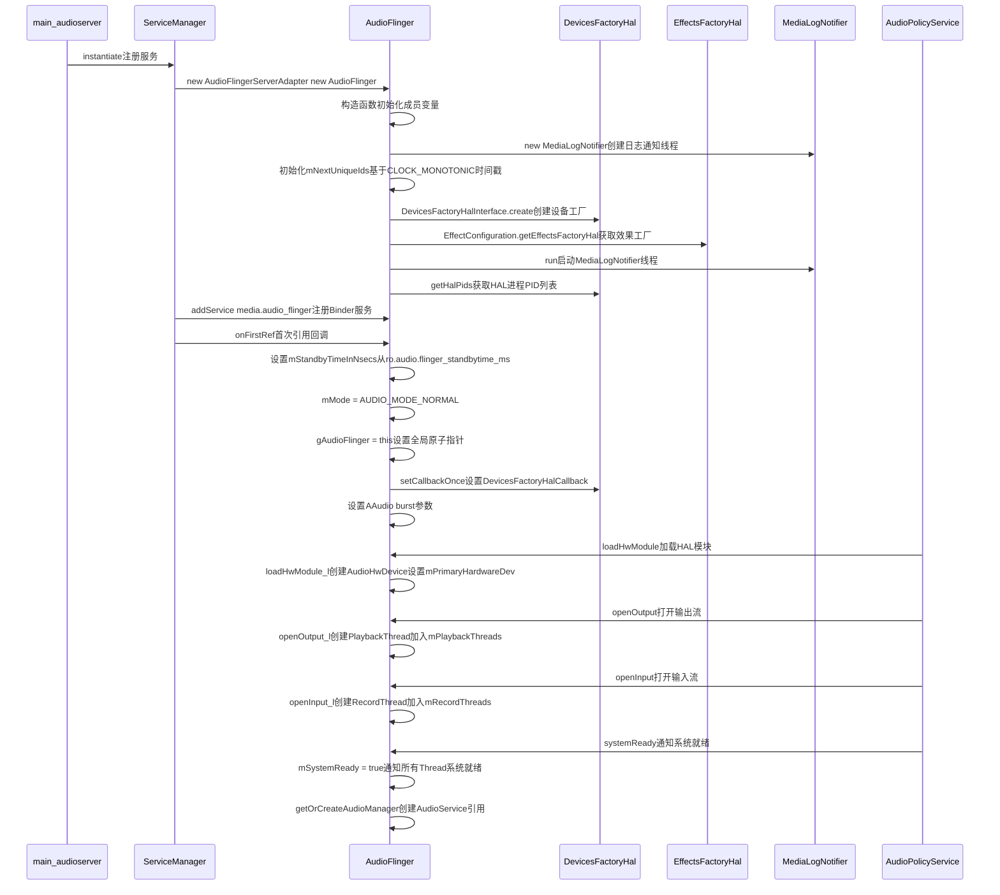

### 3.2 构造函数详解

[`AudioFlinger::AudioFlinger()`](frameworks/av/services/audioflinger/AudioFlinger.cpp:318) 构造函数完成所有成员初始化：

```cpp
// AudioFlinger.cpp:318-387 (简化)
AudioFlinger::AudioFlinger()
    : mBtNrecIsOff(false),
      mBtNrecSupported(false),
      mMasterVolume(1.f),                // 默认最大音量
      mMasterMute(false),                // 默认不静音
      mMasterBalance(0.f),               // 默认左右平衡
      mNextUniqueId(1u),                 // Track/Record唯一ID
      mNextUniqueSessionId(1u),          // Session唯一ID
      mSystemReady(false),               // 系统未就绪
      mAudioPolicyReady(false),          // AudioPolicy未就绪
      mPatchPanel(this),                 // PatchPanel初始化
      mDeviceEffectManager(this),        // DeviceEffectManager初始化
      mMelReporter(this)                 // MelReporter(CSD)初始化
{
    // 基于CLOCK_MONOTONIC时间戳初始化各ID生成器
    unsigned seed = ...; // clock_gettime(CLOCK_MONOTONIC)
    for (auto& id : mNextUniqueIds) {
        id = seed;
    }
    // 创建HAL设备工厂
    mDevicesFactoryHal = DevicesFactoryHalInterface::create();
    // 创建HAL效果工厂
    mEffectsFactoryHal = EffectConfiguration::getEffectsFactoryHal();
    // 创建并启动MediaLogNotifier线程
    mMediaLogNotifier = new MediaLogNotifier();
    mMediaLogNotifier->run("MediaLogNotifier");
    // 获取HAL进程PIDs（用于权限检查）
    if (mDevicesFactoryHal != nullptr) {
        mDevicesFactoryHal->getHalPids(&mHalPids);
    }
}
```

### 3.3 onFirstRef — 首引用回调

[`onFirstRef()`](frameworks/av/services/audioflinger/AudioFlinger.cpp:389) 在Binder服务注册后被首次引用时调用：

```cpp
// AudioFlinger.cpp:389-418 (简化)
void AudioFlinger::onFirstRef()
{
    // 1. 设置standby超时时间（来自系统属性）
    mStandbyTimeInNsecs = systemTime() + microseconds(
        property_get_int32("ro.audio.flinger_standbytime_ms", DEFAULT_STANBY_TIME_MS));

    // 2. 设置初始音频模式
    mMode = AUDIO_MODE_NORMAL;

    // 3. 设置全局AudioFlinger指针（原子操作）
    android_atomic_release_write(&gAudioFlinger, this);

    // 4. 设置DevicesFactoryHal回调
    if (mDevicesFactoryHal != nullptr) {
        mDevicesFactoryHal->setCallbackOnce(this);
    }

    // 5. 设置AAudio burst参数
    mAAudioBurstSize = property_get_int32("ro.aaudio.burst_size", 0);
    mAAudioMmapPolicy = property_get_int32("ro.aaudio.mmap_policy", 0);
    mAAudioMmapExclusivePolicy = property_get_int32("ro.aaudio.mmap_exclusive_policy", 0);
}
```

**关键设计**：[`gAudioFlinger`](frameworks/av/services/audioflinger/AudioFlinger.cpp:409) 使用`android_atomic_release_write`设置，保证后续读取时能看到完整初始化的AudioFlinger对象。

### 3.4 systemReady — 系统就绪通知

[`systemReady()`](frameworks/av/services/audioflinger/AudioFlinger.cpp:2893) 由AudioPolicyService调用，通知AudioFlinger系统已完全就绪：

```cpp
// AudioFlinger.cpp:2893-2918
void AudioFlinger::systemReady()
{
    Mutex::Autolock _l(mLock);
    mSystemReady = true;
    // 通知所有PlaybackThread系统就绪
    for (size_t i = 0; i < mPlaybackThreads.size(); i++) {
        mPlaybackThreads.valueAt(i)->systemReady();
    }
    // 通知所有RecordThread系统就绪
    for (size_t i = 0; i < mRecordThreads.size(); i++) {
        mRecordThreads.valueAt(i)->systemReady();
    }
    // 通知所有MmapThread系统就绪
    for (size_t i = 0; i < mMmapThreads.size(); i++) {
        mMmapThreads.valueAt(i)->systemReady();
    }
    // 创建AudioManager引用（用于音量通知等）
    getOrCreateAudioManager();
}
```

---

## 4. Client管理 — 进程级共享内存

### 4.1 Client类结构

[`Client`](frameworks/av/services/audioflinger/AudioFlinger.h:525) 代表一个客户端进程在AudioFlinger中的代理，负责为该进程分配共享内存：

```cpp
// AudioFlinger.h:525-540
class Client : public RefBase {
public:
    Client(AudioFlinger* audioFlinger, pid_t pid);
    ~Client();
    const sp<MemoryDealer>  memoryDealer() const { return mMemoryDealer; }
    const pid_t             pid() const { return mPid; }
    const uid_t             uid() const { return mUid; }
private:
    const pid_t                 mPid;
    const uid_t                 mUid;
    const sp<MemoryDealer>      mMemoryDealer;  // 共享内存分配器
    AudioFlinger* const         mAudioFlinger;
};
```

### 4.2 共享内存分配策略

[`Client构造函数`](frameworks/av/services/audioflinger/AudioFlinger.cpp:748) 根据设备内存大小动态调整共享内存池：

```cpp
// AudioFlinger.cpp:748-774 (简化)
AudioFlinger::Client::Client(AudioFlinger* audioFlinger, pid_t pid)
    : mPid(pid),
      mUid(IPCThreadState::self()->getCallingUid()),
      mAudioFlinger(audioFlinger)
{
    size_t heapSize = kMinimumClientMemoryHeapSize;  // 1MB默认值
    // 根据设备RAM动态调整
    if (audioFlinger->mClientSharedHeapSize > kMinimumClientMemoryHeapSize) {
        heapSize = audioFlinger->mClientSharedHeapSize;
    }
    mMemoryDealer = new MemoryDealer(heapSize);
}
```

**内存大小阶梯**：

| 设备RAM | 共享内存大小 | 源码常量 |
|---------|------------|---------|
| 低内存设备 | 1MB | [`kMinimumClientMemoryHeapSize`](frameworks/av/services/audioflinger/AudioFlinger.cpp) = 1024*1024 |
| 标准设备 | 4MB~32MB | [`mClientSharedHeapSize`](frameworks/av/services/audioflinger/AudioFlinger.h) 根据sysprop配置 |

[`mClientSharedHeapSize`](frameworks/av/services/audioflinger/AudioFlinger.h) 在构造函数中根据`ro.audio.flinger_client_shared_heap_size_kb`系统属性设置，无该属性时通过`sysconf(_SC_PHYS_PAGES)`动态计算：

```cpp
// AudioFlinger.cpp:384-387
size_t ram = sysconf(_SC_PHYS_PAGES) * sysconf(_SC_PAGE_SIZE);
mClientSharedHeapSize = (ram >= (2u * 1024u * 1024u * 1024u))  // >= 2GB
    ? kDefaultClientSharedHeapSize : kMinimumClientMemoryHeapSize;
```

### 4.3 Client注册与回收流程

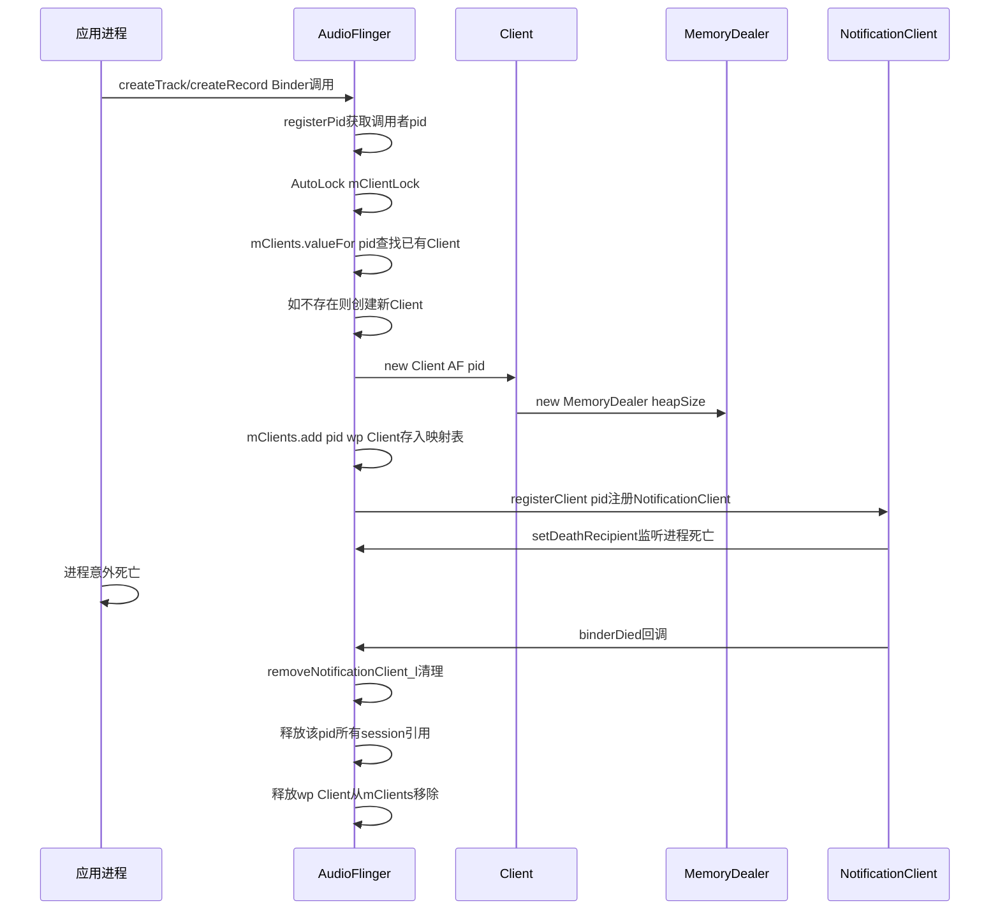

[`registerPid()`](frameworks/av/services/audioflinger/AudioFlinger.cpp:1034) 是Client注册的入口：

```cpp
// AudioFlinger.cpp:1034-1046
sp<AudioFlinger::Client> AudioFlinger::registerPid(pid_t pid) {
    Mutex::Autolock _l(mClientLock);
    // 如果Client已存在，尝试获取强引用
    sp<Client> client = mClients.valueFor(pid).promote();
    if (client != nullptr) {
        return client;
    }
    // 创建新Client
    client = new Client(this, pid);
    mClients.add(pid, client);
    return client;
}
```

**弱引用设计**：[`mClients`](frameworks/av/services/audioflinger/AudioFlinger.h:924) 使用`wp<Client>`而非`sp<Client>`，使得Client在无Track/Record引用时可自动回收。每次`registerPid()`尝试将`wp`提升为`sp`，若失败则重新创建。

### 4.4 NotificationClient — 进程死亡监听

[`NotificationClient`](frameworks/av/services/audioflinger/AudioFlinger.h:542) 监听客户端进程死亡，触发清理：

```cpp
// AudioFlinger.h:542-568
class NotificationClient : public IBinder::DeathRecipient {
public:
    NotificationClient(AudioFlinger* audioFlinger, pid_t pid);
    virtual void binderDied(const wp<IBinder>& who);
private:
    AudioFlinger* const mAudioFlinger;
    const pid_t mPid;
};
```

[`binderDied()`](frameworks/av/services/audioflinger/AudioFlinger.cpp:2131) 调用[`removeNotificationClient_l()`](frameworks/av/services/audioflinger/AudioFlinger.cpp:2202)，后者在mLock+mClientLock双重保护下执行全面清理：移除session引用、断开死亡进程的Track连接、触发ioConfigChanged通知。

---

## 5. 核心入口方法深度解析

### 5.1 createTrack — 播放Track创建全流程

[`createTrack()`](frameworks/av/services/audioflinger/AudioFlinger.cpp:1105) 是AudioFlinger最核心的入口之一，为每个AudioTrack创建服务端Track对象并建立共享内存通道。

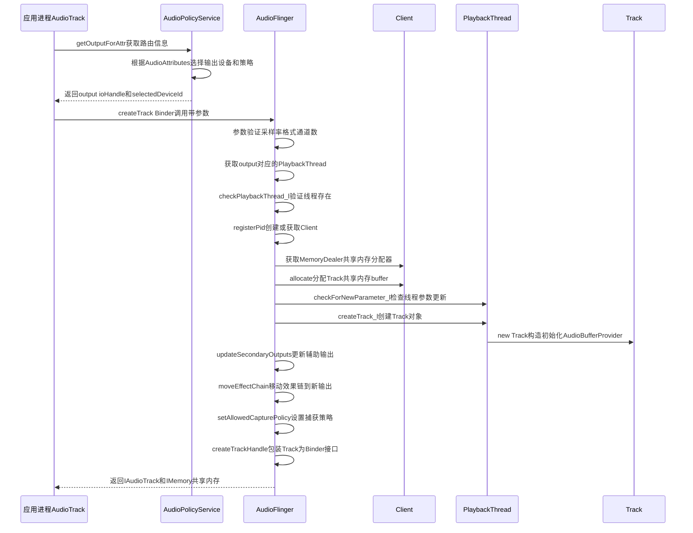

**关键源码流程** ([`AudioFlinger.cpp:1105-1310`](frameworks/av/services/audioflinger/AudioFlinger.cpp:1105))：

1. **参数验证** (L1119-1175): 验证`sampleRate`, `format`, `channelMask`, `frameCount`的合法性，不支持`AUDIO_FORMAT_IEC61937`格式
2. **获取PlaybackThread** (L1177): 通过[`checkPlaybackThread_l(output)`](frameworks/av/services/audioflinger/AudioFlinger.h)根据ioHandle查找对应Thread
3. **Client注册** (L1189): [`registerPid()`](frameworks/av/services/audioflinger/AudioFlinger.cpp:1034)获取当前pid的Client对象
4. **内存分配** (L1194-1200): 从Client的MemoryDealer分配共享内存，大小 = `frameCount * frameSize`
5. **创建Track** (L1205-1230): Thread内部`createTrack_l()`创建Track对象
6. **辅助输出** (L1233-1250): [`updateSecondaryOutputs()`](frameworks/av/services/audioflinger/AudioFlinger.cpp)处理DuplicatingThread等辅助输出
7. **效果链迁移** (L1253-1265): [`moveEffectChain_l()`](frameworks/av/services/audioflinger/AudioFlinger.cpp)将EffectChain迁移到合适的Thread
8. **捕获策略** (L1267): `setAllowedCapturePolicy`根据`flags`设置是否允许其他应用捕获
9. **TrackHandle** (L1270): 创建[`TrackHandle`](frameworks/av/services/audioflinger/AudioFlinger.h)作为Track的Binder代理返回客户端

**Track类型判定逻辑**：

```cpp
// 简化逻辑: MixerThread接受所有普通Track, DirectOutputThread只接受DIRECT Track
audio_output_flags_t flags = attr.flags;
if (thread->type() == ThreadBase::DIRECT) {
    // DirectOutputThread只接受DIRECT/OFFLOAD类型Track
} else if (thread->type() == ThreadBase::OFFLOAD) {
    // OffloadThread只接受OFFLOAD压缩数据
} else {
    // MixerThread接受所有普通Track
}
```

### 5.2 createRecord — 录音Track创建与FAST重试

[`createRecord()`](frameworks/av/services/audioflinger/AudioFlinger.cpp:2390) 为AudioRecord创建服务端RecordTrack，包含独特的**FAST模式重试机制**。

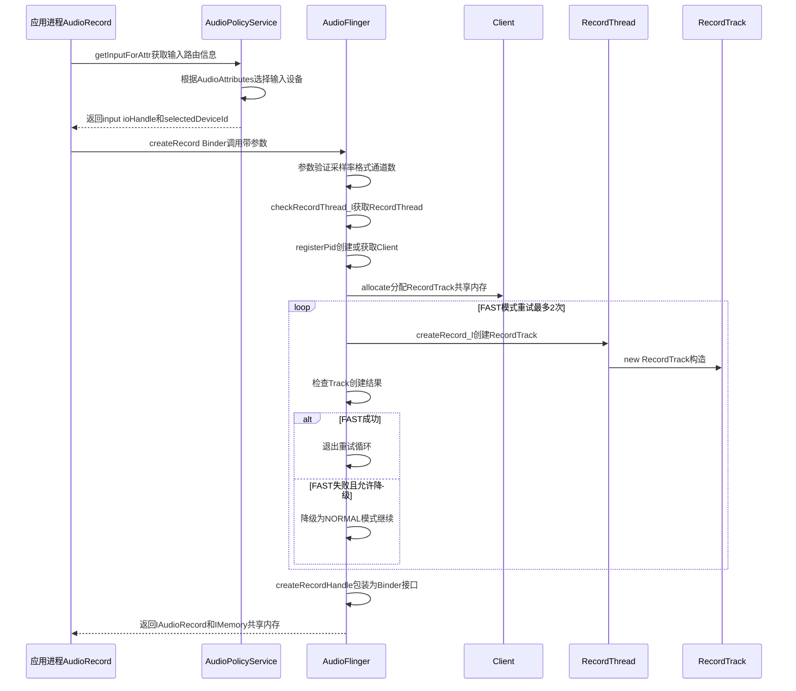

**FAST重试机制详解** ([`AudioFlinger.cpp:2390-2530`](frameworks/av/services/audioflinger/AudioFlinger.cpp:2390))：

```cpp
// 简化: FAST线程首次尝试，失败后降级
status_t status;
bool fastTrackAllowed = true;
for (int retry = 0; retry < 2; retry++) {
    status = thread->createRecordTrack_l(&track, ...);
    if (status != NO_ERROR || track == nullptr) {
        if (fastTrackAllowed) {
            fastTrackAllowed = false;
            continue;  // 第二次循环使用NORMAL模式
        }
        break;  // NORMAL模式也失败，退出
    }
    break;  // 成功创建
}
```

**设计原理**：FAST Track要求HAL支持低延迟路径（小buffer、高优先级），但某些HAL不支持或资源不足。当FAST失败时自动降级为NORMAL模式，确保录音功能仍然可用，只是延迟较高。

### 5.3 openOutput — 输出流打开与Thread创建

[`openOutput()`](frameworks/av/services/audioflinger/AudioFlinger.cpp:3096) 和 [`openOutput_l()`](frameworks/av/services/audioflinger/AudioFlinger.cpp:2982) 是AudioFlinger创建输出流和PlaybackThread的核心流程。

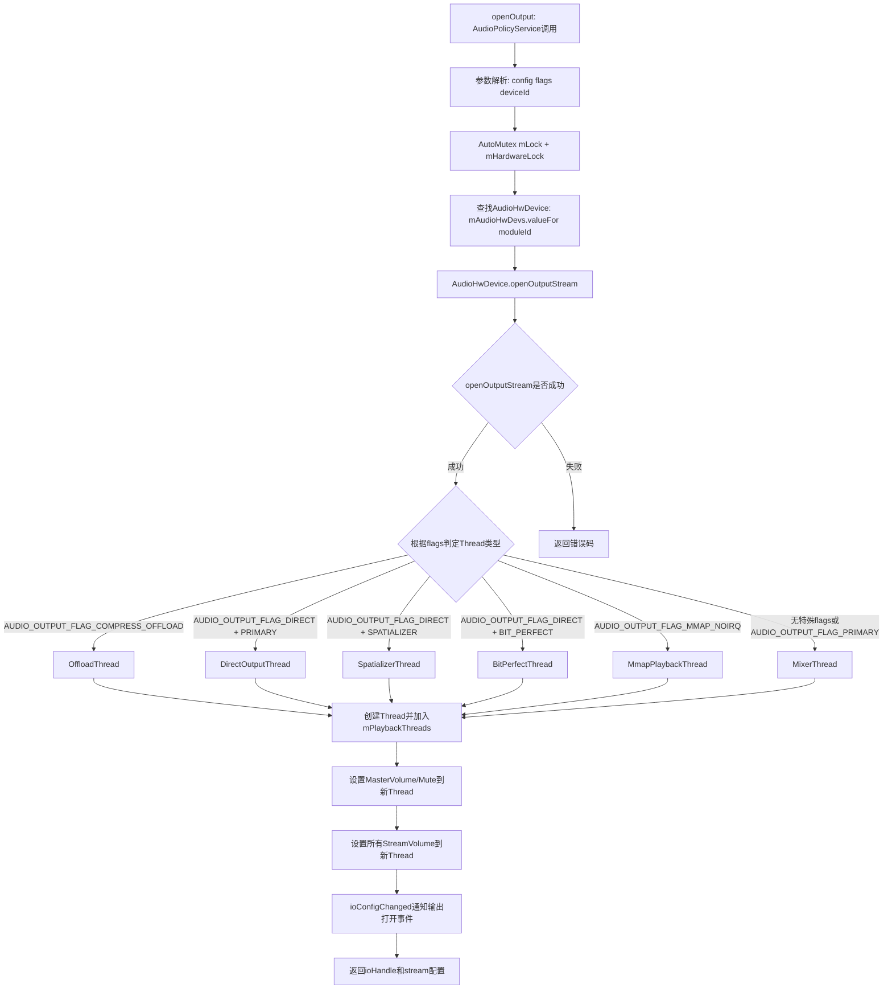

**openOutput_l源码解析** ([`AudioFlinger.cpp:2982-3094`](frameworks/av/services/audioflinger/AudioFlinger.cpp:2982))：

```cpp
// AudioFlinger.cpp:2982-3094 (核心逻辑简化)
status_t AudioFlinger::openOutput_l(audio_module_handle_t module,
    audio_output_flags_t *flags, ...) {
    // 1. 查找AudioHwDevice
    AudioHwDevice *hwDev = mAudioHwDevs.valueFor(module);
    
    // 2. 创建AudioStreamOut（包装HAL output stream）
    status_t status = hwDev->openOutputStream(..., &outputStream);
    if (status != NO_ERROR) return status;
    
    // 3. 创建AudioStreamOut对象（不可变封装）
    AudioStreamOut *outStream = new AudioStreamOut(hwDev, outputStream, *flags);
    
    // 4. 根据flags选择Thread类型
    sp<PlaybackThread> thread;
    if ((*flags & AUDIO_OUTPUT_FLAG_COMPRESS_OFFLOAD) != 0) {
        thread = new OffloadThread(outStream, this, id, *flags);
    } else if ((*flags & AUDIO_OUTPUT_FLAG_DIRECT) != 0) {
        if ((*flags & AUDIO_OUTPUT_FLAG_SPATIALIZER) != 0) {
            thread = new SpatializerThread(outStream, this, id, *flags);
        } else if ((*flags & AUDIO_OUTPUT_FLAG_BIT_PERFECT) != 0) {
            thread = new BitPerfectThread(outStream, this, id, *flags);
        } else {
            thread = new DirectOutputThread(outStream, this, id, *flags);
        }
    } else if ((*flags & AUDIO_OUTPUT_FLAG_MMAP_NOIRQ) != 0) {
        thread = new MmapPlaybackThread(outStream, this, id, *flags);
    } else {
        thread = new MixerThread(outStream, this, id, *flags);
    }
    
    // 5. 加入mPlaybackThreads映射表
    mPlaybackThreads.add(id, thread);
    
    // 6. 设置音量/Mute到新Thread
    thread->setMasterVolume(mMasterVolume);
    thread->setMasterMute(mMasterMute);
    for (int i = 0; i < AUDIO_STREAM_CNT; i++) {
        thread->setStreamVolume(i, mStreamTypes[i].volume);
        thread->setStreamMute(i, mStreamTypes[i].mute);
    }
    return id;  // 返回ioHandle作为线程唯一标识
}
```

**AudioStreamOut不可变封装** ([`AudioStreamOut.h`](frameworks/av/services/audioflinger/AudioStreamOut.h))：

```cpp
// AudioStreamOut.h:35-80
class AudioStreamOut {
public:
    AudioStreamOut(AudioHwDevice *dev, sp<StreamOutHalInterface> stream, audio_output_flags_t flags);
    // 核心字段均为const，创建后不可修改
    const AudioHwDevice* const       mAudioHwDev;     // 所属HAL设备
    const sp<StreamOutHalInterface>  mStream;         // HAL输出流接口
    const audio_output_flags_t       mFlags;          // 输出流flags
    audio_hw_sync_t                  mHwAvSyncId;     // HW同步ID
    status_t                         mStatus;         // 流状态
};
```

**不可变设计原理**：AudioStreamOut的所有核心字段均为const，确保Thread创建后其关联的HAL输出流不会被意外替换。这避免了多线程并发修改HAL流的风险。

### 5.4 openInput — 输入流打开与RecordThread创建

[`openInput()`](frameworks/av/services/audioflinger/AudioFlinger.cpp:3312) 和 [`openInput_l()`](frameworks/av/services/audioflinger/AudioFlinger.cpp:3352) 创建输入流和对应的RecordThread。

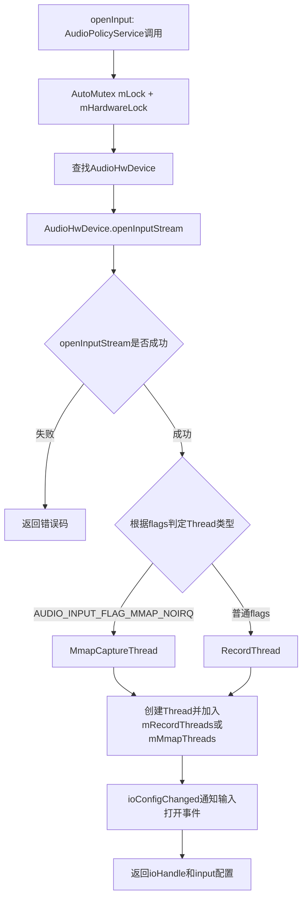

**openInput_l源码核心逻辑** ([`AudioFlinger.cpp:3352-3437`](frameworks/av/services/audioflinger/AudioFlinger.cpp:3352))：

```cpp
// AudioFlinger.cpp:3352-3437 (简化)
status_t AudioFlinger::openInput_l(audio_module_handle_t module,
    audio_input_flags_t *flags, ...) {
    AudioHwDevice *hwDev = mAudioHwDevs.valueFor(module);
    // 创建AudioStreamIn
    sp<StreamInHalInterface> inStream;
    status_t status = hwDev->openInputStream(..., &inStream);
    
    AudioStreamIn *inputStream = new AudioStreamIn(hwDev, inStream, *flags);
    
    // 根据flags选择Thread类型
    sp<RecordThread> thread;
    if ((*flags & AUDIO_INPUT_FLAG_MMAP_NOIRQ) != 0) {
        // MmapCaptureThread存入mMmapThreads
        sp<MmapCaptureThread> mmapThread = new MmapCaptureThread(inputStream, this, id, *flags);
        mMmapThreads.add(id, mmapThread);
        thread = mmapThread;
    } else {
        // RecordThread存入mRecordThreads
        thread = new RecordThread(inputStream, this, id, *flags);
        mRecordThreads.add(id, thread);
    }
    return id;
}
```

**AudioStreamIn封装** ([`AudioFlinger.h:884`](frameworks/av/services/audioflinger/AudioFlinger.h:884))：

```cpp
// AudioFlinger.h:884-908
class AudioStreamIn {
public:
    AudioStreamIn(AudioHwDevice *dev, sp<StreamInHalInterface> stream, audio_input_flags_t flags);
    const AudioHwDevice* const       mAudioHwDev;
    const sp<StreamInHalInterface>   mStream;
    const audio_input_flags_t        mFlags;
    status_t                         mStatus;
};
```

### 5.5 closeOutput/closeInput — 流的关闭流程

[`closeOutput()`](frameworks/av/services/audioflinger/AudioFlinger.cpp:3168) 关闭输出流并销毁PlaybackThread：

```cpp
// AudioFlinger.cpp:3168-3230 (简化)
status_t AudioFlinger::closeOutput(audio_io_handle_t output) {
    Mutex::Autolock _l(mLock);
    sp<PlaybackThread> thread = mPlaybackThreads.valueFor(output);
    if (thread == nullptr) return BAD_VALUE;
    
    // 1. 断开所有Track连接
    thread->disconnectAllTracks_l();
    
    // 2. 移动EffectChain到orphan列表或其他Thread
    moveEffectChains_l(thread, nullptr);
    
    // 3. 从映射表移除Thread
    mPlaybackThreads.removeItem(output);
    
    // 4. 通知AudioPolicy输出关闭
    ioConfigChanged(AUDIO_OUTPUT_CLOSED, output);
    
    // 5. 关闭HAL输出流
    thread->mOutput->stream->close();
}
```

[`closeInput()`](frameworks/av/services/audioflinger/AudioFlinger.cpp:3439) 关闭输入流并销毁RecordThread，逻辑类似：

1. 断开所有RecordTrack连接
2. 从mRecordThreads移除Thread
3. 发送ioConfigChanged通知
4. 关闭HAL输入流

---

## 6. 音量控制体系

### 6.1 三层音量架构

AudioFlinger实现**双重下发**的音量控制策略：硬件放大(HAL) + 软件mix放大(Thread)。

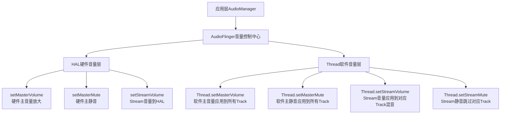

**设计原理**：某些HAL设备支持硬件音量放大（如蓝牙A2DP），此时音量直接在HAL层放大，减少软件混音的精度损失。不支持硬件音量的HAL则依赖Thread的软件音量。

### 6.2 setMasterVolume — 主音量双重下发

[`setMasterVolume()`](frameworks/av/services/audioflinger/AudioFlinger.cpp:1369) 实现主音量的双重下发：

```cpp
// AudioFlinger.cpp:1369-1409 (简化)
status_t AudioFlinger::setMasterVolume(float value) {
    AutoMutex m(mLock);
    mMasterVolume = value;
    
    // 1. 硬件层下发：设置HAL主音量
    if (mPrimaryHardwareDev != nullptr) {
        AutoMutex hwLock(mHardwareLock);
        mHardwareStatus = AUDIO_HW_SET_MASTER_VOLUME;
        if (mPrimaryHardwareDev->canSetMasterVolume()) {
            mPrimaryHardwareDev->setMasterVolume(value);
        }
        mHardwareStatus = AUDIO_HW_IDLE;
    }
    
    // 2. 软件层下发：设置所有PlaybackThread主音量
    for (size_t i = 0; i < mPlaybackThreads.size(); i++) {
        mPlaybackThreads.valueAt(i)->setMasterVolume(value);
    }
    return NO_ERROR;
}
```

**关键判断** [`canSetMasterVolume()`](frameworks/av/services/audioflinger/AudioHwDevice.h:80)：AudioHwDevice通过`AHWD_CAN_SET_MASTER_VOLUME` Flag判断HAL是否支持硬件主音量。只有在loadHwModule_l时HAL的`init_check`成功且支持`set_master_volume`才会设置此Flag。

### 6.3 setMasterMute — 主静音双重下发

[`setMasterMute()`](frameworks/av/services/audioflinger/AudioFlinger.cpp:1557) 实现与`setMasterVolume`相同的双重下发策略：

```cpp
// AudioFlinger.cpp:1557-1596 (简化)
status_t AudioFlinger::setMasterMute(bool muted) {
    AutoMutex m(mLock);
    mMasterMute = muted;
    
    // 硬件层: mPrimaryHardwareDev->setMasterMute() (如果支持)
    // 软件层: 所有PlaybackThread->setMasterMute()
}
```

[`canSetMasterMute()`](frameworks/av/services/audioflinger/AudioHwDevice.h:81) 检查`AHWD_CAN_SET_MASTER_MUTE` Flag，原理与`canSetMasterVolume`相同。

### 6.4 setStreamVolume — 流类型音量

[`setStreamVolume()`](frameworks/av/services/audioflinger/AudioFlinger.cpp:1647) 设置指定音频流类型的音量：

```cpp
// AudioFlinger.cpp:1647-1673 (简化)
status_t AudioFlinger::setStreamVolume(audio_stream_type_t stream, float value) {
    AutoMutex m(mLock);
    mStreamTypes[stream].volume = value;
    
    // 软件层: 设置所有PlaybackThread的Stream音量
    for (size_t i = 0; i < mPlaybackThreads.size(); i++) {
        mPlaybackThreads.valueAt(i)->setStreamVolume(stream, value);
    }
    return NO_ERROR;
}
```

**Stream音量不直接下发HAL**：Stream音量只作用于Thread的软件混音层。每个Track在混音时根据其stream类型查找对应的`stream_type_t.volume`值，乘以`mMasterVolume`得到最终放大系数。

### 6.5 setMode — 音频模式切换

[`setMode()`](frameworks/av/services/audioflinger/AudioFlinger.cpp:1445) 切换音频模式(NORMAL/RINGTONE/IN_CALL/IN_COMMUNICATION)：

```cpp
// AudioFlinger.cpp:1445-1485 (简化)
status_t AudioFlinger::setMode(audio_mode_t mode) {
    AutoMutex m(mLock);
    mMode = mode;
    
    // 1. 硬件层: 设置HAL模式
    AutoMutex hwLock(mHardwareLock);
    mHardwareStatus = AUDIO_HW_SET_MODE;
    for (size_t i = 0; i < mAudioHwDevs.size(); i++) {
        mAudioHwDevs.valueAt(i)->setMode(mode);
    }
    mHardwareStatus = AUDIO_HW_IDLE;
    
    // 2. 软件层: 通知所有Thread
    for (size_t i = 0; i < mPlaybackThreads.size(); i++) {
        mPlaybackThreads.valueAt(i)->setMode(mode);
    }
    for (size_t i = 0; i < mRecordThreads.size(); i++) {
        mRecordThreads.valueAt(i)->setMode(mode);
    }
    return NO_ERROR;
}
```

**模式对所有HAL模块生效**：与音量只作用于PrimaryHardwareDev不同，`setMode`对**所有**已加载的AudioHwDevice调用，因为通话模式需要所有音频HAL协同切换。

### 6.6 setMicMute — 麦克风静音

[`setMicMute()`](frameworks/av/services/audioflinger/AudioFlinger.cpp:1487) 全局麦克风静音控制：

```cpp
// AudioFlinger.cpp:1487-1519 (简化)
status_t AudioFlinger::setMicMute(bool muted) {
    AutoMutex m(mLock);
    
    // 硬件层: 设置Primary HAL的麦克风静音
    AutoMutex hwLock(mHardwareLock);
    mHardwareStatus = AUDIO_HW_SET_MIC_MUTE;
    if (mPrimaryHardwareDev != nullptr) {
        mPrimaryHardwareDev->setMicMute(muted);
    }
    mHardwareStatus = AUDIO_HW_IDLE;
    return NO_ERROR;
}
```

**setMicMute只作用于Primary HAL**：因为只有Primary音频设备（通常是内置麦克风）需要全局静音控制。其他HAL模块的输入静音由各自的Thread独立管理。

---

## 7. AudioHwDevice — HAL设备管理

### 7.1 AudioHwDevice类结构

[`AudioHwDevice`](frameworks/av/services/audioflinger/AudioHwDevice.h:33) 是AudioFlinger对HAL音频模块的封装，每个加载的HAL模块对应一个AudioHwDevice实例：

```cpp
// AudioHwDevice.h:33-113
class AudioHwDevice {
public:
    enum Flags {
        AHWD_CAN_SET_MASTER_VOLUME  = 0x1,  // HAL支持硬件主音量
        AHWD_CAN_SET_MASTER_MUTE    = 0x2,  // HAL支持硬件主静音
        AHWD_IS_INSERT              = 0x4,  // USB动态插入设备
        AHWD_SUPPORTS_BT_LATENCY_MODES = 0x8, // 支持蓝牙延迟模式
    };
    
    AudioHwDevice(audio_module_handle_t handle, const char *moduleName,
                  sp<DeviceHalInterface> hwDevice, Flags flags);
    
    // HAL接口封装方法
    status_t openOutputStream(..., sp<StreamOutHalInterface> *outStream);
    status_t openInputStream(..., sp<StreamInHalInterface> *inStream);
    status_t setMode(audio_mode_t mode);
    status_t setMasterVolume(float volume);
    status_t setMasterMute(bool muted);
    status_t setMicMute(bool muted);
    
    bool canSetMasterVolume() const { return (mFlags & AHWD_CAN_SET_MASTER_VOLUME) != 0; }
    bool canSetMasterMute() const { return (mFlags & AHWD_CAN_SET_MASTER_MUTE) != 0; }
    
    const audio_module_handle_t  mHandle;      // 模块唯一handle
    const char                   *mModuleName;  // 模块名称
    const sp<DeviceHalInterface> mHwDevice;     // HAL Device接口
    const Flags                  mFlags;        // 能力标志
};
```

### 7.2 loadHwModule_l — HAL模块加载与能力检测

[`loadHwModule_l()`](frameworks/av/services/audioflinger/AudioFlinger.cpp:2637) 加载HAL音频模块并检测其能力：

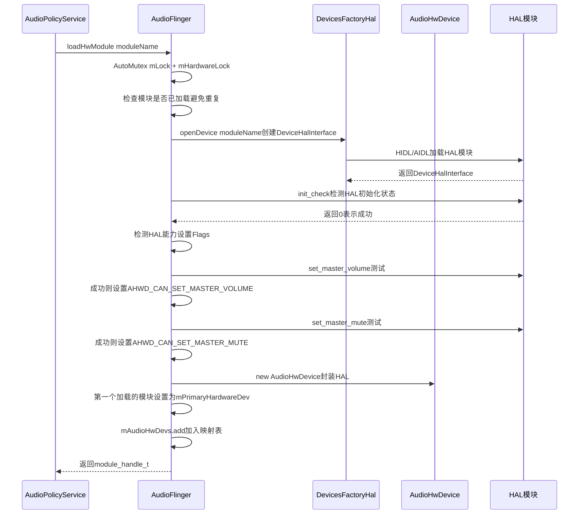

**loadHwModule_l源码解析** ([`AudioFlinger.cpp:2637-2737`](frameworks/av/services/audioflinger/AudioFlinger.cpp:2637))：

```cpp
// AudioFlinger.cpp:2637-2737 (核心逻辑简化)
audio_module_handle_t AudioFlinger::loadHwModule_l(const char *name) {
    // 1. 通过DevicesFactoryHal创建DeviceHalInterface
    sp<DeviceHalInterface> dev = mDevicesFactoryHal->openDevice(name);
    if (dev == nullptr) return AUDIO_MODULE_HANDLE_NONE;
    
    // 2. init_check: 验证HAL模块初始化成功
    mHardwareStatus = AUDIO_HW_INIT;
    status_t status = dev->initCheck();
    mHardwareStatus = AUDIO_HW_IDLE;
    if (status != NO_ERROR) return AUDIO_MODULE_HANDLE_NONE;
    
    // 3. 能力检测：测试set_master_volume
    AudioHwDevice::Flags flags = 0;
    mHardwareStatus = AUDIO_HW_SET_MASTER_VOLUME;
    if (dev->setMasterVolume(1.0f) == NO_ERROR) {
        flags |= AudioHwDevice::AHWD_CAN_SET_MASTER_VOLUME;
    }
    mHardwareStatus = AUDIO_HW_IDLE;
    
    // 4. 能力检测：测试set_master_mute
    mHardwareStatus = AUDIO_HW_SET_MASTER_MUTE;
    if (dev->setMasterMute(false) == NO_ERROR) {
        flags |= AudioHwDevice::AHWD_CAN_SET_MASTER_MUTE;
    }
    mHardwareStatus = AUDIO_HW_IDLE;
    
    // 5. 创建AudioHwDevice并加入映射表
    audio_module_handle_t handle = nextUniqueId(AUDIO_UNIQUE_ID_USE_MODULE);
    AudioHwDevice *audioHwDevice = new AudioHwDevice(handle, name, dev, flags);
    mAudioHwDevs.add(handle, audioHwDevice);
    
    // 6. 第一个加载的模块设为PrimaryHardwareDev
    if (mPrimaryHardwareDev == nullptr) {
        mPrimaryHardwareDev = audioHwDevice;
    }
    return handle;
}
```

**Primary硬件设备** [`mPrimaryHardwareDev`](frameworks/av/services/audioflinger/AudioFlinger.h:931)：第一个成功加载的HAL模块成为Primary设备。它享有特殊地位：
- `setMasterVolume` / `setMasterMute` 只对Primary设备调用
- `setMicMute` 只对Primary设备调用
- `setVoiceVolume` 只对Primary设备调用
- `setParameters` 中的某些参数（如routing）只对Primary设备生效

---

## 8. AudioFlinger与AudioPolicyService的交互

### 8.1 交互模式概述

AudioFlinger与AudioPolicyService（APS）之间存在**命令-执行**的双向交互模式：

| 交互方向 | 调用方 | 方法 | 功能 |
|---------|--------|------|------|
| APS → AF | APS | `loadHwModule` | 加载HAL模块 |
| APS → AF | APS | `openOutput/openInput` | 打开音频流 |
| APS → AF | APS | `closeOutput/closeInput` | 关闭音频流 |
| APS → AF | APS | `createAudioPatch` | 创建音频路由Patch |
| APS → AF | APS | `setStreamVolume` | 设置流音量 |
| APS → AF | APS | `setMasterVolume/setMasterMute` | 设置主音量/静音 |
| APS → AF | APS | `systemReady` | 通知系统就绪 |
| AF → APS | AF | `ioConfigChanged` | 通知流配置变化 |
| AF → AMS | AF | `getOrCreateAudioManager` | 获取AudioManager引用 |

### 8.2 ioConfigChanged — 配置变化通知机制

[`ioConfigChanged()`](frameworks/av/services/audioflinger/AudioFlinger.cpp:950) 是AudioFlinger向AudioPolicyService发送配置变化通知的机制：

```cpp
// AudioFlinger.cpp:950-1032 (简化)
void AudioFlinger::ioConfigChanged(audio_io_config_event event,
    audio_io_handle_t ioHandle, pid_t pid) {
    // 通过AudioManager发送通知
    sp<AudioManager> am = getOrCreateAudioManager();
    if (am == nullptr) return;
    
    // 构造config事件数据
    AudioIoConfigEvent configEvent;
    configEvent.event = event;
    configEvent.ioHandle = ioHandle;
    
    // 发送给所有NotificationClient
    for (size_t i = 0; i < mNotificationClients.size(); i++) {
        mNotificationClients.valueAt(i)->notify(configEvent);
    }
}
```

**事件类型**：

| 事件 | 说明 | 触发时机 |
|------|------|---------|
| `AUDIO_OUTPUT_OPENED` | 新输出流打开 | `openOutput_l()`成功创建Thread后 |
| `AUDIO_OUTPUT_CLOSED` | 输出流关闭 | `closeOutput()`销毁Thread后 |
| `AUDIO_OUTPUT_CONFIG_CHANGED` | 输出配置变化 | Thread参数更新时 |
| `AUDIO_INPUT_OPENED` | 新输入流打开 | `openInput_l()`成功创建Thread后 |
| `AUDIO_INPUT_CLOSED` | 输入流关闭 | `closeInput()`销毁Thread后 |
| `AUDIO_INPUT_CONFIG_CHANGED` | 输入配置变化 | RecordThread参数更新时 |

AudioPolicyService收到这些通知后会重新评估路由策略，可能触发输出设备切换或Patch重建。

---

## 9. SyncEvent — 跨Track同步机制

### 9.1 SyncEvent结构

[`SyncEvent`](frameworks/av/services/audioflinger/AudioFlinger.h:390) 实现多个Track之间的播放启动同步，主要用于多声道同步播放（如环绕声各声道需要同时开始）：

```cpp
// AudioFlinger.h:390-523
class SyncEvent {
public:
    SyncEvent(audio_session_t triggerSession,
              audio_session_t listenerSession,
              sync_event_t type);
    audio_session_t triggerSession() const { return mTriggerSession; }
    audio_session_t listenerSession() const { return mListenerSession; }
    sync_event_t type() const { return mType; }
    bool isCancelled() const { return mIsCancelled; }
    void cancel() { mIsCancelled = true; }
    
private:
    const audio_session_t  mTriggerSession;   // 触发同步的session
    const audio_session_t  mListenerSession;  // 监听同步的session
    const sync_event_t     mType;             // 同步类型
    bool                   mIsCancelled;       // 是否已取消
};
```

### 9.2 同步触发流程

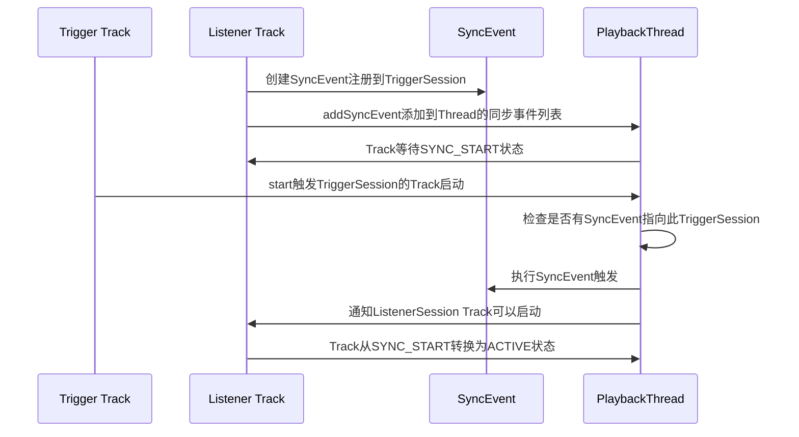

**设计场景**：当多个AudioTrack需要精确同步启动（如5.1环绕声的不同声道），每个声道Track注册SyncEvent等待触发Track的start信号。触发Track一旦start，所有等待的Track在同一时间点启动，确保声道间时间差最小化。

---

## 10. MelReporter与DeviceEffectManager

### 10.1 MelReporter — CSD声压级报告

[`MelReporter`](frameworks/av/services/audioflinger/AudioFlinger.h:1051) 实现EU标准EN 50332-3的CSD（Continuous Sound Dosimetry）声压级监测，防止长期高音量造成听力损伤：

- 定期从PlaybackThread读取输出声压级数据
- 计算累积MEL（Momentary Exposure Limit）
- 当MEL超过阈值时通知AudioManager触发警告或自动降低音量

[`mMelReporter`](frameworks/av/services/audioflinger/AudioFlinger.h:1051) 在构造函数中初始化，`onFirstRef()`后自动启动定时计算线程。

### 10.2 DeviceEffectManager — 设备级效果管理

[`DeviceEffectManager`](frameworks/av/services/audioflinger/AudioFlinger.h:1050) 管理绑定到特定音频设备的效果（如USB DAC的内置DSP效果）：

- 当设备连接时，根据AudioPolicy的配置创建DeviceEffect
- DeviceEffect绑定到所有使用该设备的Thread
- 当设备断开时，自动销毁对应的DeviceEffect

---

## 11. 并发模型总结

### 11.1 线程架构全景

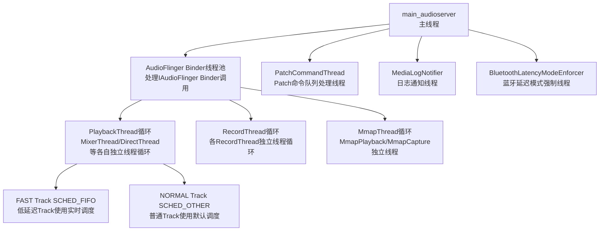

### 11.2 锁竞争与性能考量

AudioFlinger的锁设计直接影响音频数据路径的延迟：

| 锁 | 持锁时间 | 影响范围 | 优化策略 |
|----|---------|---------|---------|
| `mLock` | 短（ms级） | createTrack/createRecord/openOutput等 | Thread内部操作使用Thread自身mLock而非AF mLock |
| `mHardwareLock` | 中（可能10ms+） | loadHwModule/setMode等硬件操作 | hardware_call_state提供调试信息 |
| `mClientLock` | 极短（μs级） | Client注册/查找 | wp<Client>避免强引用阻塞 |
| Thread::mLock | Thread内部使用 | Track创建/销毁 | 不与AF mLock交叉持有 |

**关键设计原则**：Thread的threadLoop()运行在独立线程中，**绝不持有AudioFlinger::mLock**。所有Thread内部操作使用Thread自身的mLock。这确保了数据路径不被Binder调用阻塞。

---

## 12. 关键数据流路径总结

### 12.1 播放数据流路径

```
AudioTrack(Native) → IMemory共享内存写入 → Track(AudioFlinger服务端)
→ PlaybackThread.threadLoop()读取Track数据 → EffectChain处理(可选)
→ MixerThread混音 → AudioStreamOut.mStream → HAL输出流 → 音频设备
```

### 12.2 录音数据流路径

```
音频设备 → HAL输入流 → AudioStreamIn.mStream → RecordThread.threadLoop()读取
→ RecordTrack写入 → IMemory共享内存 → AudioRecord(Native)读取
```

### 12.3 路由控制流路径

```
AudioPolicyService路由决策 → createAudioPatch → PatchPanel创建Patch
→ 源端口(输入流或混合输出) → 目的端口(输出流或输入流) → HAL setAudioPatch(可选)
```

---

## 13. 全局指针与生命周期保证

[`gAudioFlinger`](frameworks/av/services/audioflinger/AudioFlinger.h:384) 是AudioFlinger的全局原子指针：

```cpp
// AudioFlinger.h:384
static Atomic<AudioFlinger*> gAudioFlinger;
```

- 在[`onFirstRef()`](frameworks/av/services/audioflinger/AudioFlinger.cpp:409)中使用`android_atomic_release_write`设置
- 在AudioFlinger析构时清除
- 供`IAudioFlinger`的实现快速访问AudioFlinger对象
- 使用`memory_order_seq_cst`保证跨线程可见性

这一设计避免了Binder调用中频繁查找ServiceManager的性能开销，直接通过原子指针访问AudioFlinger对象。

---

## 14. 总结

AudioFlinger作为Android音频系统的数据面引擎，其核心设计可总结为：

| 设计维度 | 核心原则 | 实现机制 |
|---------|---------|---------|
| **Binder服务注册** | Adapter模式隔离AIDL | AudioFlingerServerAdapter包装 |
| **Thread隔离** | 每个IO流独立线程 | PlaybackThread/RecordThread/MmapThread |
| **锁层次化** | 三层锁防死锁 | mLock → mClientLock → mHardwareLock |
| **双重音量** | HAL硬件+Thread软件 | canSetMasterVolume判定路径 |
| **共享内存** | 进程级池化分配 | Client.MemoryDealer + wp弱引用 |
| **FAST重试** | 低延迟优先，降级保底 | createRecord FAST→NORMAL重试 |
| **不可变流** | 创建后不可替换 | AudioStreamOut/AudioStreamIn const字段 |
| **HAL能力检测** | 动态探测而非硬编码 | loadHwModule_l测试set_master_volume/mute |
| **进程死亡清理** | DeathRecipient监听 | NotificationClient.binderDied触发全面清理 |
| **全局指针** | 原子访问避免Binder开销 | gAudioFlinger atomic指针 |

AudioFlinger的架构体现了Android音频系统的核心权衡：**低延迟数据面**（Thread独立循环、FAST路径）与**安全控制面**（锁层次、Binder服务、权限检查）的分离设计，确保音频数据流不受管理操作阻塞。