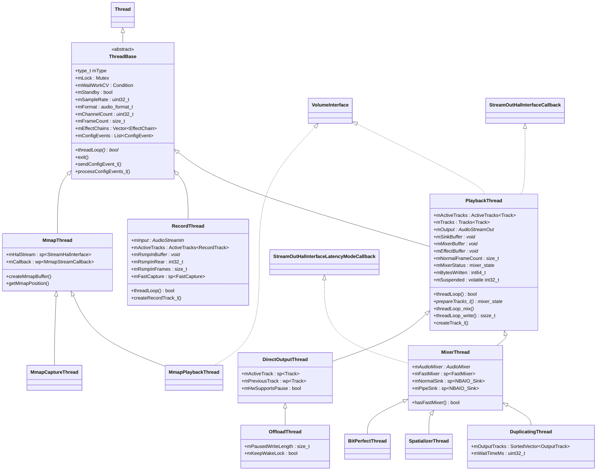
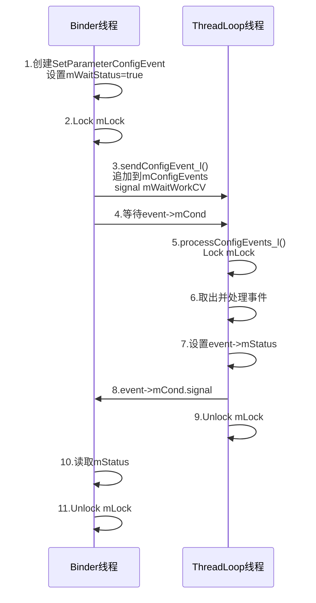
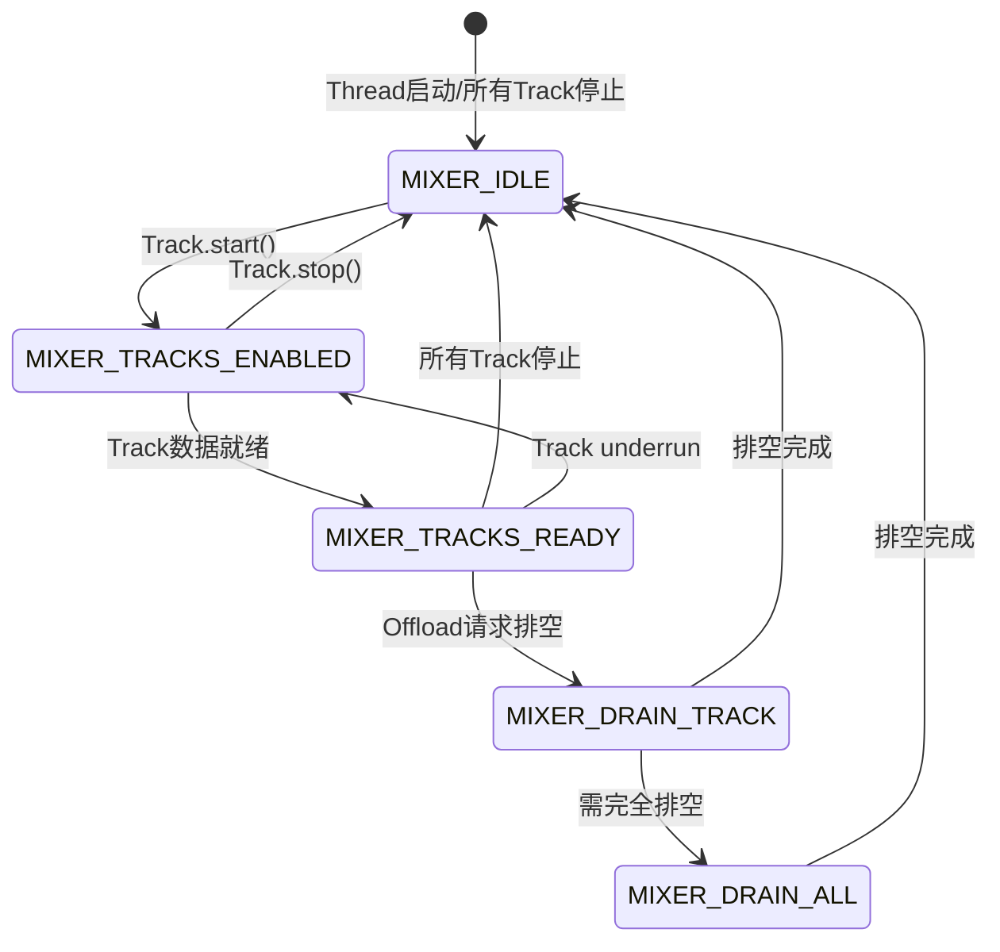
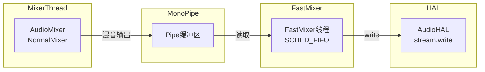
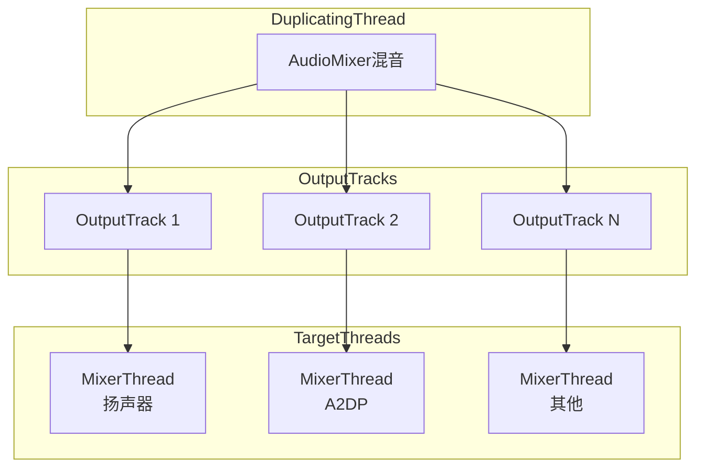
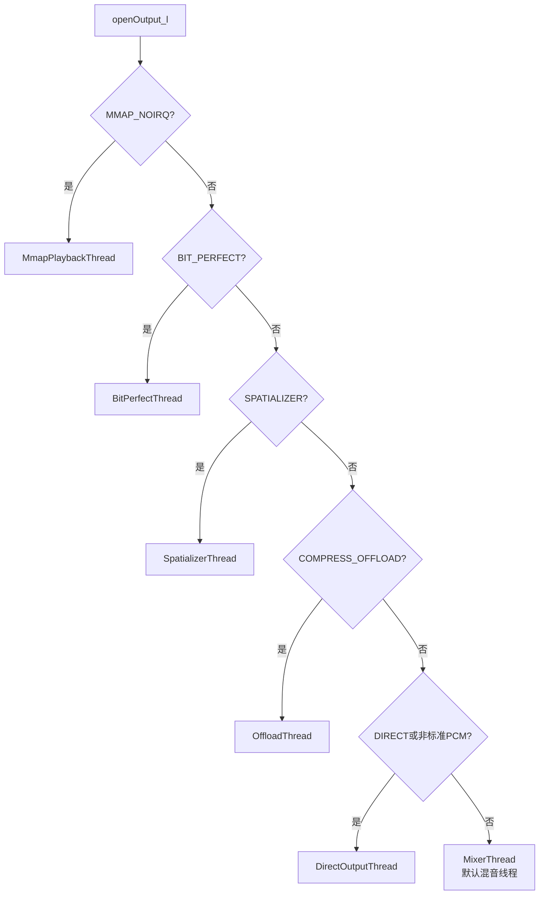
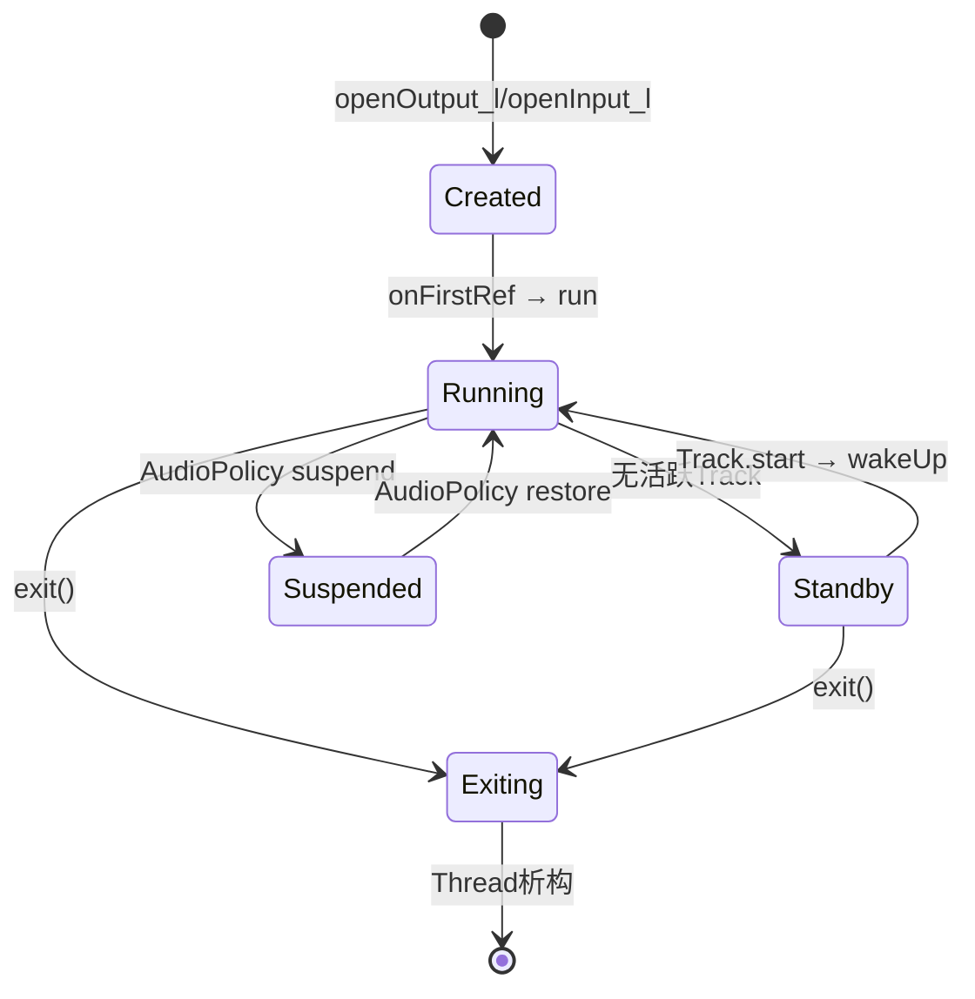

[← 5.1 AudioFlinger总览](05_5.1_AudioFlinger-音频数据面引擎.md) | [← 返回AudioFlinger](README.md) | [返回导航](../README.md) | [5.3 PlaybackThread →](05_5.3_PlaybackThread核心循环.md)

## 5.2 Thread体系 — AudioFlinger的核心执行单元

AudioFlinger中每一个音频输出/输入流都对应一个独立线程，统称为Thread体系。Thread是AudioFlinger真正的"工作引擎"——混音、读取、效果处理、HAL写入全部在Thread的`threadLoop()`中完成。理解Thread体系是理解AudioFlinger运行机制的关键入口。

## 1. Thread继承体系全景



## 2. ThreadBase — 所有Thread的根基

[`ThreadBase`](frameworks/av/services/audioflinger/Threads.h:22)继承自Android系统的[`Thread`](system/core/libutils/include/utils/Thread.h)类，是AudioFlinger所有线程的公共基类。

### 2.1 type_t枚举 — Thread类型标识

定义在[`Threads.h:27`](frameworks/av/services/audioflinger/Threads.h:27)：

| type_t值 | 对应Thread类 | 说明 |
|---|---|---|
| `MIXER` | MixerThread | 标准混音线程，多Track混合输出 |
| `DIRECT` | DirectOutputThread | 直通输出线程，单Track不混音 |
| `DUPLICATING` | DuplicatingThread | 复制线程，将混音结果写到多个输出 |
| `RECORD` | RecordThread | 录音线程，从HAL读取数据 |
| `OFFLOAD` | OffloadThread | 硬件卸载线程，压缩码流直通DSP |
| `MMAP_PLAYBACK` | MmapPlaybackThread | MMAP共享内存播放 |
| `MMAP_CAPTURE` | MmapCaptureThread | MMAP共享内存录音 |
| `SPATIALIZER` | SpatializerThread | 空间音频处理线程 |
| `BIT_PERFECT` | BitPerfectThread | AAOS位完美输出线程 |

### 2.2 ThreadBase核心成员变量

```cpp
// Threads.h - ThreadBase核心成员
Mutex                   mLock;          // Thread主锁，保护mActiveTracks/mStandby等
Condition               mWaitWorkCV;    // 等待工作条件变量
bool                    mStandby;       // 是否处于待机状态
uint32_t                mSampleRate;    // 采样率
audio_format_t          mHALFormat;     // HAL音频格式
uint32_t                mChannelCount;  // 通道数
size_t                  mFrameCount;    // 帧数(HAL级别)
size_t                  mFrameSize;     // 帧大小(字节)
Vector<sp<EffectChain>> mEffectChains;  // 效果链列表
List<sp<ConfigEvent>>   mConfigEvents;  // 配置事件队列
audio_io_handle_t       mId;            // 全局唯一IO句柄
type_t                  mType;          // 线程类型
bool                    mIsOut;         // 是否为输出线程
```

**关键成员详解**：

- **`mStandby`**：待机标志。当没有活跃Track时，Thread进入standby状态，停止向HAL写入数据。通过[`setStandby_l()`](frameworks/av/services/audioflinger/Threads.h:1124)设置：`mStandby = true; mHalStarted = false;`
- **`mLock`/`mWaitWorkCV`**：组成Thread的核心同步机制。binder线程通过`mLock`保护共享状态，Thread循环通过`mWaitWorkCV`等待唤醒
- **`mEffectChains`**：效果链列表，每个sessionId对应一条EffectChain，在threadLoop中被依次处理

### 2.3 ActiveTracks\<T\>模板 — 活跃Track管理

[`ActiveTracks`](frameworks/av/services/audioflinger/Threads.h:748)是ThreadBase内部的关键模板类，管理当前需要处理的活跃Track列表：

```cpp
template <typename T>
class ActiveTracks {
    SortedVector<sp<T>>  mActiveTracks;          // 有序Track向量
    int                  mActiveTracksGeneration; // 活跃Track变化代数
    int                  mLastActiveTracksGeneration;
    wp<T>                mLatestActiveTrack;      // 最近添加的Track(弱引用)
    std::map<uid_t, std::pair<ssize_t, ssize_t>> mBatteryCounter; // 电池统计
    bool                 mHasChanged = false;     // Track集合是否变化
};
```

**设计要点**：
- `mActiveTracks`是`SortedVector`，按Track指针排序，保证遍历顺序确定性
- `mLatestActiveTrack`使用弱引用(`wp<T>`)，不阻止Track被销毁；DirectOutputThread/OffloadThread用其检测Track切换
- `mActiveTracksGeneration`用于追踪变化，避免不必要的电源状态更新
- `updatePowerState()`在threadLoop中周期调用，更新BatteryNotifier的UID计数

### 2.4 ConfigEvent体系 — 线程间配置通信

ThreadBase定义了丰富的配置事件类型（[`Threads.h:51`](frameworks/av/services/audioflinger/Threads.h:51)），用于binder线程向ThreadLoop线程安全地传递配置变更：

| 事件类型 | 类 | 用途 |
|---|---|---|
| `CFG_EVENT_IO` | IoConfigEvent | IO配置变更通知 |
| `CFG_EVENT_PRIO` | PrioConfigEvent | 线程优先级调整 |
| `CFG_EVENT_SET_PARAMETER` | SetParameterConfigEvent | 设置音频参数 |
| `CFG_EVENT_CREATE_AUDIO_PATCH` | CreateAudioPatchConfigEvent | 创建音频路由 |
| `CFG_EVENT_RELEASE_AUDIO_PATCH` | ReleaseAudioPatchConfigEvent | 释放音频路由 |
| `CFG_EVENT_UPDATE_OUT_DEVICE` | UpdateOutDevicesConfigEvent | 更新输出设备 |
| `CFG_EVENT_RESIZE_BUFFER` | ResizeBufferConfigEvent | 调整缓冲区大小 |
| `CFG_EVENT_CHECK_OUTPUT_STAGE_EFFECTS` | CheckOutputStageEffectsEvent | 检查输出阶段效果 |
| `CFG_EVENT_HAL_LATENCY_MODES_CHANGED` | HalLatencyModesChangedEvent | HAL延迟模式变更 |

**ConfigEvent通信流程**（源码注释[`Threads.h:72-88`](frameworks/av/services/audioflinger/Threads.h:72)）：



### 2.5 effect_state — 音频会话标志位

[`hasAudioSession_l()`](frameworks/av/services/audioflinger/Threads.h:477)返回的位掩码标志：

| 标志 | 值 | 含义 |
|---|---|---|
| `EFFECT_SESSION` | 0x1 | 该session有Effect链 |
| `TRACK_SESSION` | 0x2 | 该session有Track |
| `FAST_SESSION` | 0x4 | 该session有FastTrack |
| `SPATIALIZED_SESSION` | 0x8 | 该session有空间化Track |
| `BIT_PERFECT_SESSION` | 0x10 | 该session有位完美Track |

## 3. PlaybackThread — 输出线程的核心骨架

[`PlaybackThread`](frameworks/av/services/audioflinger/Threads.h:861)继承自`ThreadBase`，同时实现了`VolumeInterface`和`StreamOutHalInterfaceCallback`接口，是所有输出线程的中间基类。

### 3.1 mixer_state枚举 — Thread循环状态机

定义在[`Threads.h:867`](frameworks/av/services/audioflinger/Threads.h:867)：

```cpp
enum mixer_state {
    MIXER_IDLE,             // 无活跃Track
    MIXER_TRACKS_ENABLED,   // 至少一个活跃Track，但无数据就绪
    MIXER_TRACKS_READY,     // 至少一个活跃Track且有数据
    MIXER_DRAIN_TRACK,      // 排空当前播放Track
    MIXER_DRAIN_ALL,        // 完全排空硬件缓冲
};
```



**状态与sleep策略的映射**：

| mixer_state | sleep策略 | 说明 |
|---|---|---|
| `MIXER_IDLE` | `idleSleepTimeUs()` | 空闲等待，较长sleep |
| `MIXER_TRACKS_ENABLED` | `activeSleepTimeUs()` | 短间隔轮询，等待数据 |
| `MIXER_TRACKS_READY` | 不sleep | 依赖HAL write阻塞 |
| `MIXER_DRAIN_TRACK` | 不sleep | 等待drain回调 |
| `MIXER_DRAIN_ALL` | 不sleep | 等待drain回调 |

### 3.2 PlaybackThread三层Buffer架构

PlaybackThread内部维护三个缓冲区，形成数据处理的流水线（[`Threads.h:1154-1212`](frameworks/av/services/audioflinger/Threads.h:1154)）：

```
┌─────────────────────────────────────────────────────────────┐
│                    PlaybackThread Buffer流                    │
│                                                              │
│  AudioMixer ──→ mMixerBuffer ──→ mEffectBuffer ──→ mSinkBuffer ──→ HAL  │
│  (float/16bit)   (float可选)      (16bit可选)       (HAL格式)     │
│                                                              │
│  mMixerBufferEnabled  mEffectBufferEnabled                   │
│  = false时直写sink    = false时直写sink                       │
└─────────────────────────────────────────────────────────────┘
```

| Buffer | 类型 | 格式 | 用途 |
|---|---|---|---|
| `mMixerBuffer` | `void*` | `AUDIO_FORMAT_PCM_FLOAT`或`PCM_16_BIT` | AudioMixer混音输出，支持高精度累积 |
| `mEffectBuffer` | `void*` | `AUDIO_FORMAT_PCM_16_BIT` | Effect处理输入/输出缓冲 |
| `mSinkBuffer` | `void*` | HAL格式 | 最终写入HAL的缓冲区 |
| `mPostSpatializerBuffer` | `void*` | HAL格式 | SpatializerThread专用后处理缓冲 |

**Buffer流转逻辑**：
1. `AudioMixer::process()`输出到`mMixerBuffer`（若`mMixerBufferEnabled=true`）或`mSinkBuffer`
2. 若`mEffectBufferEnabled=true`，数据从`mMixerBuffer`拷贝到`mEffectBuffer`，EffectChain处理后输出
3. 最终数据转换到`mSinkBuffer`（HAL格式），通过`threadLoop_write()`写入HAL

### 3.3 PlaybackThread核心成员详解

**Track管理**：

| 成员 | 类型 | 说明 |
|---|---|---|
| `mActiveTracks` | `ActiveTracks<Track>` | 活跃Track列表，threadLoop每轮遍历 |
| `mTracks` | `Tracks<Track>` | 所有Track（含inactive），SortedVector封装 |
| `mOutput` | `AudioStreamOut*` | HAL输出流 |
| `mFastTrackAvailMask` | `unsigned` | Fast Track可用位掩码 |

**写入统计**：

| 成员 | 类型 | 说明 |
|---|---|---|
| `mBytesWritten` | `int64_t` | 已写入总字节数，standby不重置 |
| `mFramesWritten` | `atomic<int64_t>` | 已写入总帧数，standby不重置 |
| `mBytesRemaining` | `size_t` | 当前写入周期剩余字节数 |
| `mCurrentWriteLength` | `size_t` | 当前写入长度 |
| `mNumWrites` | `int` | 总写入次数 |
| `mNumDelayedWrites` | `int` | 延迟写入次数 |

**NBAIO Sink体系**（[`Threads.h:1431-1435`](frameworks/av/services/audioflinger/Threads.h:1431)）：

| 成员 | 说明 |
|---|---|
| `mOutputSink` | HAL输出sink，非阻塞NBAIO封装 |
| `mPipeSink` | FastMixer的阻塞pipe sink |
| `mNormalSink` | 当前写入目标：`mOutputSink`或`mPipeSink` |

**当存在FastMixer时**，MixerThread写入`mPipeSink`（MonoPipe），FastMixer从pipe读取后写入`mOutputSink`；无FastMixer时，MixerThread直接写入`mOutputSink`。

### 3.4 Tracks\<T\>模板 — Track容器

[`Tracks`](frameworks/av/services/audioflinger/Threads.h:1318)是PlaybackThread内部对`SortedVector<sp<T>>`的封装，增加了删除TrackId追踪功能：

```cpp
template <typename T>
class Tracks {
    SortedVector<sp<T>>  mTracks;               // Track有序向量
    const bool           mSaveDeletedTrackIds;   // 是否追踪已删除TrackId
    std::set<int>        mDeletedTrackIds;       // 已删除TrackId集合
};
```

- `mSaveDeletedTrackIds`：MIXER类型Thread设为true，追踪已删除Track的ID用于元数据更新
- `processDeletedTrackIds()`：处理已删除Track的元数据通知

### 3.5 IsTimestampAdvancing — Underrun检测辅助

[`IsTimestampAdvancing`](frameworks/av/services/audioflinger/Threads.h:1476)通过周期性检查HAL presentation position是否推进来检测underrun：

```cpp
class IsTimestampAdvancing {
    const nsecs_t  mMinimumTimeBetweenChecksNs; // 检查最小间隔
    uint64_t       mPreviousPosition;           // 上次位置
    nsecs_t        mPreviousNs;                 // 上次检查时间
    bool           mLatchedValue;               // 锁存结果
};
```

- `check(output)`：如果距离上次检查超过`mMinimumTimeBetweenChecksNs`，则比较当前位置与上次位置
- 如果position未推进，返回false表示可能发生underrun
- 在`flushHw_l()`中调用`clear()`重置状态

## 4. MixerThread — 标准混音线程

[`MixerThread`](frameworks/av/services/audioflinger/Threads.h:1508)是AudioFlinger最核心的Thread实现，处理绝大多数音频输出场景。继承自`PlaybackThread`，额外实现了`StreamOutHalInterfaceLatencyModeCallback`接口（蓝牙可变延迟支持）。

### 4.1 MixerThread独有成员

```cpp
AudioMixer*         mAudioMixer;          // 标准混音器
sp<FastMixer>       mFastMixer;           // 快速混音器(可选)
FastMixerDumpState  mFastMixerDumpState;  // FastMixer调试状态
int32_t             mFastMixerFutex;      // Cold idle futex
std::atomic_bool    mMasterMono;          // 单声道混合标志
```

### 4.2 FastMixer与NormalMixer的协作



**数据流路径选择**（通过`mNormalSink`）：
- **有FastMixer**：`mNormalSink = mPipeSink`，MixerThread写入MonoPipe，FastMixer从pipe读取后写入HAL
- **无FastMixer**：`mNormalSink = mOutputSink`，MixerThread直接写入HAL

### 4.3 蓝牙可变延迟支持

MixerThread实现了`StreamOutHalInterfaceLatencyModeCallback`，支持蓝牙设备的延迟模式动态调整：

```cpp
std::vector<audio_latency_mode_t> mSupportedLatencyModes;  // HAL支持的延迟模式
audio_latency_mode_t              mSetLatencyMode;          // 当前设置的延迟模式
std::atomic_bool                  mBluetoothLatencyModesEnabled; // 蓝牙延迟控制开关
```

## 5. DirectOutputThread — 直通输出线程

[`DirectOutputThread`](frameworks/av/services/audioflinger/Threads.h:1635)用于不经过混音的单Track直通输出场景（如HDMI直通、高采样率PCM输出）。

### 5.1 核心设计差异

与MixerThread的关键区别：

| 特性 | MixerThread | DirectOutputThread |
|---|---|---|
| 活跃Track数 | 多个 | 最多1个 |
| 混音 | AudioMixer多路混音 | 无混音，单Track直写 |
| Volume处理 | AudioMixer内处理 | `processVolume_l()`硬件音量 |
| FastMixer | 可选支持 | 不支持(`hasFastMixer()=false`) |
| Track切换 | 无特殊处理 | 检测mPreviousTrack变化 |

### 5.2 单Track管理

```cpp
sp<Track>   mActiveTrack;     // 当前活跃的唯一Track
wp<Track>   mPreviousTrack;   // 上一个Track，用于检测Track切换
bool        mHwSupportsPause; // 硬件是否支持暂停
bool        mHwPaused;        // 硬件暂停状态
```

`prepareTracks_l()`中，DirectOutputThread遍历mActiveTracks但只保留一个活跃Track，通过`mPreviousTrack`检测Track切换以触发flush操作。

## 6. OffloadThread — 硬件卸载线程

[`OffloadThread`](frameworks/av/services/audioflinger/Threads.h:1716)继承自`DirectOutputThread`，用于将压缩音频码流（MP3/AAC等）直接传递给DSP解码播放，CPU不做解码工作。

### 6.1 OffloadThread独有成员

```cpp
size_t  mPausedWriteLength;     // pause时中断的写入长度
size_t  mPausedBytesRemaining;  // resume后剩余待写入字节
bool    mKeepWakeLock;          // drain期间保持wake lock
```

### 6.2 异步回调机制

OffloadThread依赖HAL的异步回调通知写入完成和排空完成：

- [`onWriteReady()`](frameworks/av/services/audioflinger/Threads.h:926)：HAL缓冲区可写入时回调
- [`onDrainReady()`](frameworks/av/services/audioflinger/Threads.h:927)：drain完成时回调
- [`onError()`](frameworks/av/services/audioflinger/Threads.h:928)：HAL错误回调

**序列号机制**：`mWriteAckSequence`和`mDrainSequence`使用bit[31:1]作为序列号、bit[0]作为等待标志，防止乱序回调。

### 6.3 重试策略

```cpp
static const int8_t kMaxTrackRetriesOffload = 20;          // underrun重试次数
static const int8_t kMaxTrackStartupRetriesOffload = 100;  // 启动重试次数
static const int8_t kMaxTrackStopRetriesOffload = 2;       // 停止重试次数
```

Offload场景需要更大的重试容忍度，因为压缩码流的buffer可能很大，客户端填充较慢。

## 7. DuplicatingThread — 多输出复制线程

[`DuplicatingThread`](frameworks/av/services/audioflinger/Threads.h:1778)继承自`MixerThread`，将混音结果同时写到多个输出（如扬声器+A2DP耳机同步输出）。

### 7.1 核心架构



**关键实现**：
- `mOutputTracks`：OutputTrack列表，每个OutputTrack作为目标MixerThread的一个Track
- `threadLoop_write()`：将混音结果分别写入所有OutputTrack
- `outputsReady()`：检查所有目标输出是否就绪
- `updateWaitTime_l()`：根据最慢的输出调整等待时间

## 8. SpatializerThread — 空间音频线程

[`SpatializerThread`](frameworks/av/services/audioflinger/Threads.h:1836)继承自`MixerThread`，为支持空间音频（如Virtualizer效果）的输出提供专用处理路径。

### 8.1 空间音频特殊处理

- 不支持FastMixer（`hasFastMixer() = false`）
- 实现`checkOutputStageEffects()`：检查输出阶段效果变化
- 使用`mPostSpatializerBuffer`：非空间化Track混入此buffer，经后处理效果后再与空间化Track合并
- 支持延迟模式选择：`setRequestedLatencyMode()`

## 9. RecordThread — 录音线程

[`RecordThread`](frameworks/av/services/audioflinger/Threads.h:1864)继承自`ThreadBase`（非PlaybackThread），负责从HAL读取音频数据并分发给各RecordTrack。

### 9.1 重采样缓冲区

```cpp
void*    mRsmpInBuffer;     // 重采样输入缓冲区
size_t   mRsmpInFrames;     // 缓冲区帧数
size_t   mRsmpInFramesP2;   // 向上取整到2的幂
size_t   mRsmpInFramesOA;   // mRsmpInFramesP2 + 过度分配
int32_t  mRsmpInRear;       // 最后填充帧+1（永不重置的滚动计数器）
```

**重采样流程**：
1. `threadLoop()`从HAL读取数据到`mRsmpInBuffer`
2. `ResamplerBufferProvider`从`mRsmpInBuffer`取数据
3. Resampler将HAL采样率转换为客户端请求的采样率
4. 转换后数据写入RecordTrack的共享缓冲区

### 9.2 ResamplerBufferProvider

[`ResamplerBufferProvider`](frameworks/av/services/audioflinger/Threads.h:1874)是RecordThread内部类，作为AudioResampler的数据提供者：

```cpp
class ResamplerBufferProvider : public AudioBufferProvider {
    RecordTrack* const  mRecordTrack;
    size_t              mRsmpInUnrel;  // 未释放帧数
    int32_t             mRsmpInFront;  // 下一个可用帧(滚动计数器)
};
```

- `sync()`：同步RecordTrack位置，处理overrun
- `getNextBuffer()`/`releaseBuffer()`：AudioBufferProvider接口实现

### 9.3 FastCapture

RecordThread支持FastCapture子线程（与FastMixer对称）：

```cpp
sp<FastCapture>      mFastCapture;            // 快速捕获线程
FastCaptureDumpState mFastCaptureDumpState;   // 调试状态
int32_t              mFastCaptureFutex;       // Cold idle futex
sp<NBAIO_Source>     mInputSource;            // HAL输入源
sp<NBAIO_Source>     mNormalSource;           // 当前读取源
sp<NBAIO_Sink>       mPipeSink;               // FastCapture写入的pipe
sp<NBAIO_Source>     mPipeSource;             // NormalThread读取的pipe源
```

## 10. MmapThread — MMAP共享内存直传

[`MmapThread`](frameworks/av/services/audioflinger/Threads.h:2138)用于MMAP_NOIRQ模式，音频数据通过共享内存直接在应用和HAL之间传递，AudioFlinger不参与数据搬运。

### 10.1 MmapThread核心特点

- **无混音/无读取**：`threadLoop()`仅做定时唤醒和效果处理
- **直接内存映射**：应用通过`createMmapBuffer()`获取共享内存，直接读写音频数据
- **位置查询**：`getMmapPosition()`从HAL获取当前读写位置
- **轻量级同步**：通过`mCallback`通知应用端启动/停止事件

### 10.2 MmapPlaybackThread与MmapCaptureThread

| 特性 | MmapPlaybackThread | MmapCaptureThread |
|---|---|---|
| 继承 | MmapThread + VolumeInterface | MmapThread |
| HAL流 | AudioStreamOut | AudioStreamIn |
| 音量控制 | 支持 | 不支持 |
| MEL计算 | 支持(CSA合规) | 不支持 |

## 11. BitPerfectThread — AAOS位完美输出

[`BitPerfectThread`](frameworks/av/services/audioflinger/Threads.h:2359)继承自`MixerThread`，为AAOS车载场景提供位完美（Bit-Perfect）输出能力——音频数据不做任何格式转换、音量调节或效果处理，直接传递原始PCM到HAL。

### 11.1 位完美约束

```cpp
bool   mIsBitPerfect;        // 是否处于位完美模式
float  mVolumeLeft = 0.f;    // 左声道音量(位完美时为0表示直通)
float  mVolumeRight = 0.f;   // 右声道音量
```

- `prepareTracks_l()`：位完美模式下，仅允许单Track活跃，禁止音量调节和效果处理
- `threadLoop_mix()`：直接拷贝Track数据到sink buffer，跳过AudioMixer

## 12. Thread创建时机与决策逻辑

### 12.1 openOutput_l() — 输出Thread创建

[`openOutput_l()`](frameworks/av/services/audioflinger/AudioFlinger.cpp:2982)根据`audio_output_flags_t`标志决定创建哪种Thread：

```cpp
// AudioFlinger.cpp:3046-3081
if (flags & AUDIO_OUTPUT_FLAG_MMAP_NOIRQ) {
    thread = new MmapPlaybackThread(...);
} else if (flags & AUDIO_OUTPUT_FLAG_BIT_PERFECT) {
    thread = new BitPerfectThread(...);
} else if (flags & AUDIO_OUTPUT_FLAG_SPATIALIZER) {
    thread = new SpatializerThread(...);
} else if (flags & AUDIO_OUTPUT_FLAG_COMPRESS_OFFLOAD) {
    thread = new OffloadThread(...);
} else if ((flags & AUDIO_OUTPUT_FLAG_DIRECT)
           || !isValidPcmSinkFormat(halConfig->format)
           || !isValidPcmSinkChannelMask(halConfig->channel_mask)) {
    thread = new DirectOutputThread(...);
} else {
    thread = new MixerThread(...);  // 默认
}
```

**决策优先级**（从高到低）：



### 12.2 openInput_l() — 录音Thread创建

类似地，录音Thread根据flags决定类型：
- `AUDIO_INPUT_FLAG_MMAP_NOIRQ` → `MmapCaptureThread`
- 其他 → `RecordThread`

## 13. Thread生命周期



### 13.1 创建阶段

1. AudioPolicyManager调用`AudioFlinger::openOutput()`
2. `openOutput_l()`根据flags创建对应Thread子类
3. Thread被加入`mPlaybackThreads`/`mRecordThreads`/`mMmapThreads`映射
4. `onFirstRef()`调用`run()`启动线程

### 13.2 运行阶段

`threadLoop()`循环执行核心工作流程：
1. `processConfigEvents_l()` — 处理配置事件
2. `prepareTracks_l()` — 准备活跃Track，返回mixer_state
3. `threadLoop_mix()` — 混音/直写
4. EffectChain处理
5. `threadLoop_write()` — 写入HAL
6. `threadLoop_sleepTime()` — 计算sleep时间

### 13.3 Standby机制

当所有活跃Track停止后，Thread进入standby：
- [`setStandby_l()`](frameworks/av/services/audioflinger/Threads.h:1124)：设置`mStandby=true`、`mHalStarted=false`
- standby期间Thread不写HAL，等待在`mWaitWorkCV`上
- 新Track启动时通过`mWaitWorkCV.signal()`唤醒Thread

### 13.4 销毁阶段

1. 调用`exit()`设置退出标志
2. `threadLoop()`返回false
3. Thread基类清理线程资源
4. 从AudioFlinger的Thread映射中移除
5. HAL stream关闭

## 14. ThreadMetrics统计

ThreadBase内置了丰富的性能统计机制（[`Threads.h:700-724`](frameworks/av/services/audioflinger/Threads.h:700)）：

| 统计对象 | 类型 | 说明 |
|---|---|---|
| `mTimestampVerifier` | `TimestampVerifier<int64_t, int64_t>` | 时间戳一致性验证 |
| `mIoJitterMs` | `Statistics<double>` | IO抖动统计(指数移动平均) |
| `mProcessTimeMs` | `Statistics<double>` | 处理时间统计 |
| `mLatencyMs` | `Statistics<double>` | 延迟统计 |
| `mMonopipePipeDepthStats` | `Statistics<double>` | MonoPipe深度统计(FastMixer) |
| `mThreadSnapshot` | `ThreadSnapshot` | 线程快照(线程安全) |
| `mLastIoBeginNs`/`mLastIoEndNs` | `int64_t` | IO起止时间戳 |

这些统计数据通过`dumpsys media.audio_flinger`可查看，是性能分析和underrun诊断的重要依据。