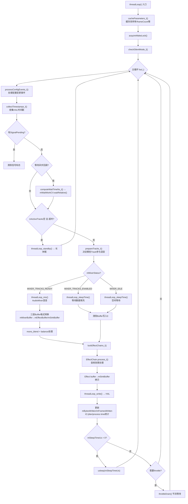
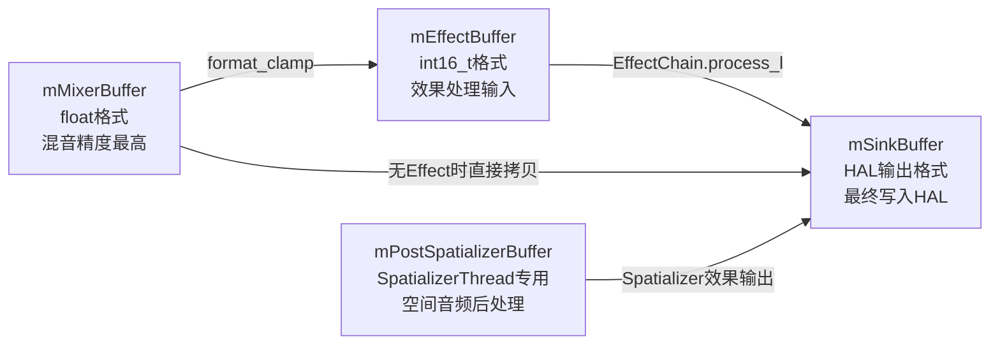
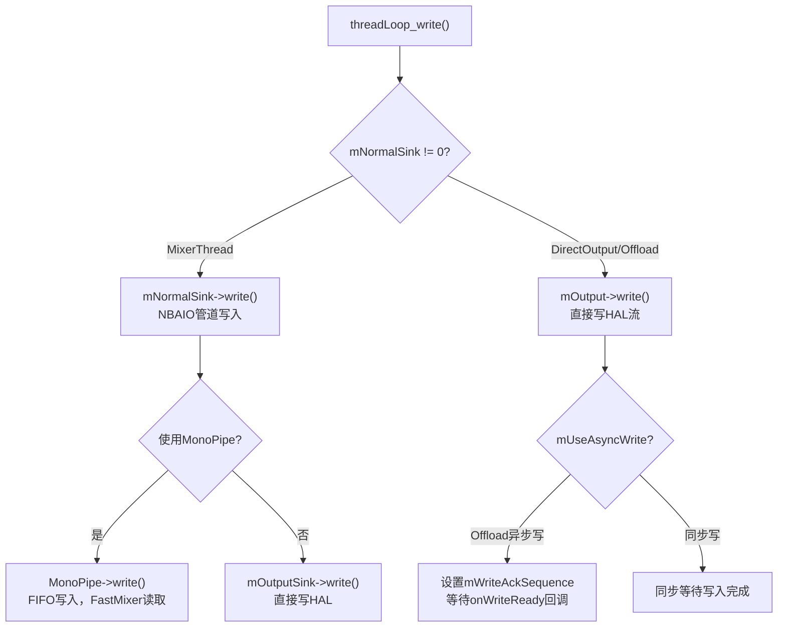
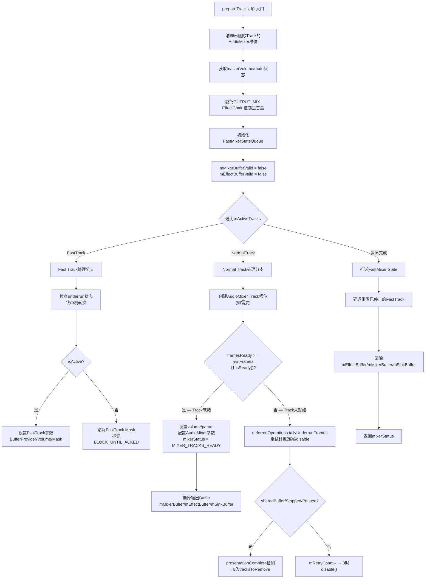
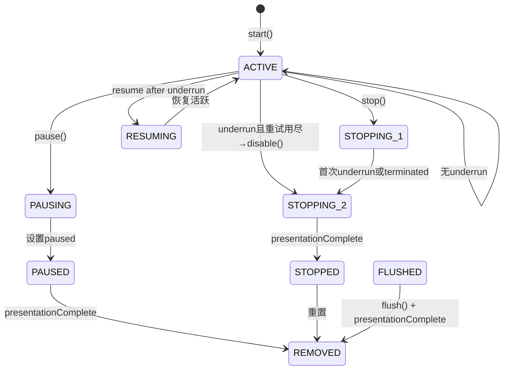
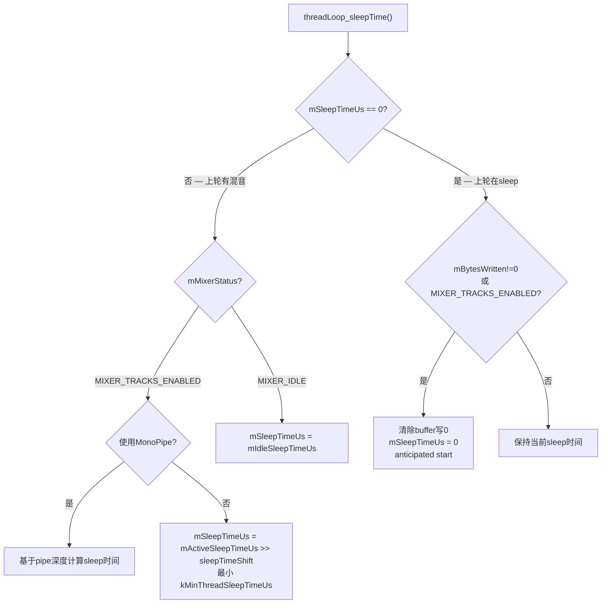
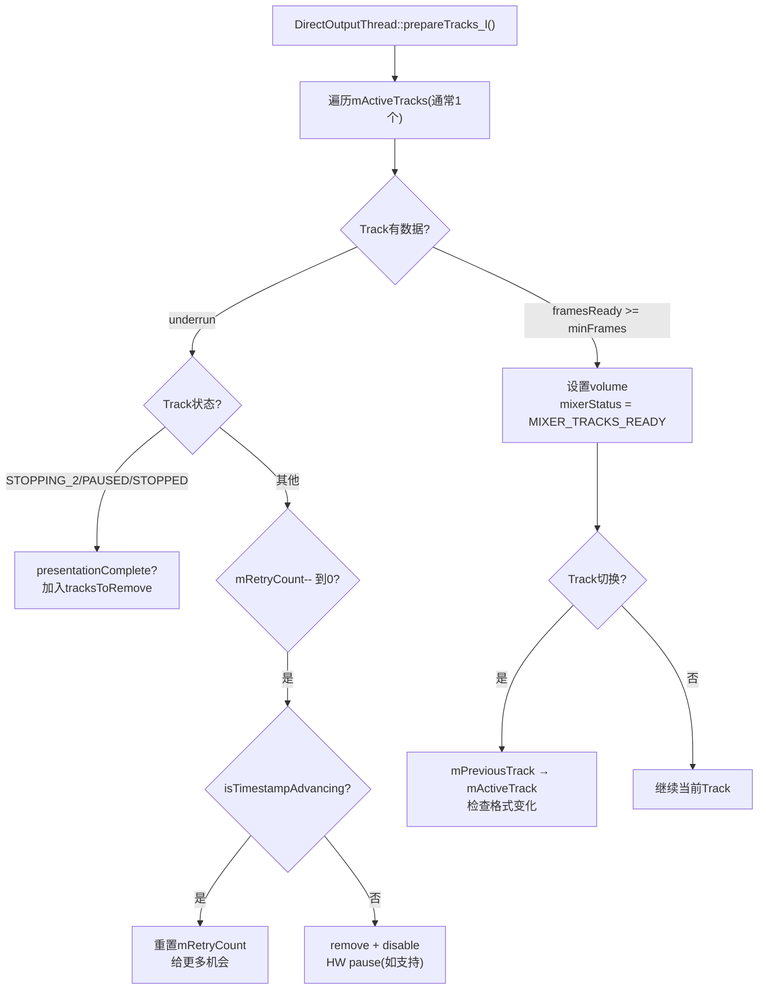
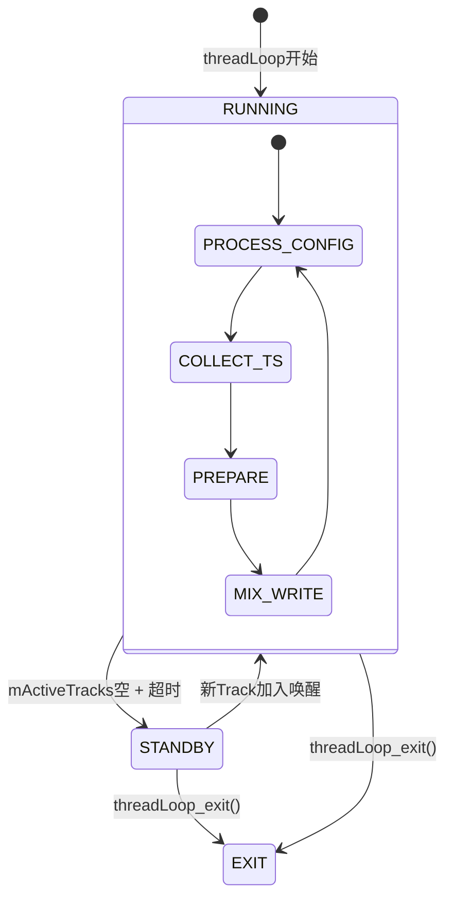

## 5.3 PlaybackThread核心循环

> [← 上一个](05_5.2_Thread体系-AudioFlinger的核心执行单元.md) | [← 返回AudioFlinger](README.md) | [返回导航](../README.md) | [下一个 →](05_5.4_FastMixer-低延迟混音路径.md)

---

### threadLoop() — AudioFlinger的心跳

[`PlaybackThread::threadLoop()`](frameworks/av/services/audioflinger/Threads.cpp:3853)是AudioFlinger播放线程的主循环，所有音频数据的混音、效果处理和HAL写入都在此完成。



### threadLoop()初始化阶段

```cpp
// Threads.cpp:3853-3899
bool AudioFlinger::PlaybackThread::threadLoop()
{
    // 1. 缓存参数：采样率、frameCount、sleep时间等
    cacheParameters_l();
    // 2. 获取WakeLock防止CPU休眠
    mWakeLock.acquire();
    // 3. 检查静音模式（电话/勿扰等）
    checkSilentMode_l();
    // ...
}
```

[`cacheParameters_l()`](frameworks/av/services/audioflinger/Threads.cpp:3567)缓存的关键派生值：

| 派生值 | 计算方式 | 用途 |
|--------|---------|------|
| `mSinkBufferSize` | `mNormalFrameCount * mFrameSize` | sink buffer字节大小 |
| `mActiveSleepTimeUs` | `activeSleepTimeUs()` | 有活跃Track时的sleep时间 |
| `mIdleSleepTimeUs` | `idleSleepTimeUs()` | 无活跃Track时的sleep时间 |
| `mStandbyDelayNs` | A2DP设备延长至`kDefaultStandbyTimeInNsecs` | 进入standby前的延迟 |

### threadLoop()核心循环详解

#### 阶段1：配置事件处理

```cpp
// Threads.cpp:3962-3968
processConfigEvents_l();
```

处理9种ConfigEvent（详见5.2节ConfigEvent体系），包括：
- `CFG_EVENT_PARAMETERS`：HAL参数变更
- `CFG_EVENT_SET_VOLUME`：音量设置
- `CFG_EVENT_IO`：I/O配置变更

#### 阶段2：时间戳收集

```cpp
// Threads.cpp:3969
collectTimestamps_l();
```

从HAL获取`getPresentationPosition()`和`getRenderPosition()`，通过`TimestampVerifier`校验时间戳单调性，用于：
- Underrun检测
- 延迟统计（`mLatencyMs`）
- A/V同步

#### 阶段3：prepareTracks_l() — 混音准备决策

这是threadLoop中**最复杂也最重要**的方法，详见下节专述。

#### 阶段4：threadLoop_mix() — 执行混音

```cpp
// MixerThread::threadLoop_mix() — Threads.cpp:5270
void AudioFlinger::MixerThread::threadLoop_mix()
{
    mAudioMixer->process();   // 调用AudioMixer执行混音
    mCurrentWriteLength = mSinkBufferSize;
    // 逐步恢复sleep时间（从underrun恢复正常时）
    if ((mSleepTimeUs == 0) && (sleepTimeShift > 0)) {
        sleepTimeShift--;
    }
    mSleepTimeUs = 0;
    mStandbyTimeNs = systemTime() + mStandbyDelayNs;
}
```

**DirectOutputThread::threadLoop_mix()** 的实现完全不同：

```cpp
// Threads.cpp:6801 — 不经过AudioMixer，直接从Track读取数据
void AudioFlinger::DirectOutputThread::threadLoop_mix()
{
    size_t frameCount = mFrameCount;
    int8_t *curBuf = (int8_t *)mSinkBuffer;
    while (frameCount) {
        AudioBufferProvider::Buffer buffer;
        buffer.frameCount = frameCount;
        status_t status = mActiveTrack->getNextBuffer(&buffer);
        if (status != NO_ERROR || buffer.raw == NULL) {
            if (audio_has_proportional_frames(mFormat)) {
                memset(curBuf, 0, frameCount * mFrameSize); // 填0
            }
            break;
        }
        memcpy(curBuf, buffer.raw, buffer.frameCount * mFrameSize);
        frameCount -= buffer.frameCount;
        curBuf += buffer.frameCount * mFrameSize;
        mActiveTrack->releaseBuffer(&buffer);
    }
    mCurrentWriteLength = curBuf - (int8_t *)mSinkBuffer;
    mActiveTrack.clear();
}
```

#### 阶段5：三层Buffer格式转换



转换逻辑源码（Threads.cpp:4116-4231）：

```cpp
// 1. mMixerBuffer(float) → mEffectBuffer/mSinkBuffer
if (mMixerBufferValid) {
    // float → int16或HAL格式转换
    memcpy_by_audio_format(mSinkBuffer, mSinkBufferSize,
                           mMixerBuffer, mMixerBufferSize, ...);
}
// 2. mono_blend处理（单声道转立体声需求）
if (mEffectBufferValid) {
    mono_blend(mEffectBuffer, ...);
}
// 3. balance处理（左右声道平衡）
if (mBalance != 0.f) {
    balance stereo channels in mSinkBuffer;
}
// 4. EffectChain处理
for (size_t i = 0; i < mEffectChains.size(); i++) {
    mEffectChains[i]->process_l();
}
```

#### 阶段6：threadLoop_write() — 写入HAL

[`threadLoop_write()`](frameworks/av/services/audioflinger/Threads.cpp:3425)是数据从AudioFlinger流向HAL的关键出口：



**NBAIO Sink写入路径详解**：

```cpp
// Threads.cpp:3433-3459
if (mNormalSink != 0) {
    // 屏幕状态影响MonoPipe的setAvgFrames
    uint32_t screenState = AudioFlinger::mScreenState;
    if (screenState != mScreenState) {
        mScreenState = screenState;
        MonoPipe *pipe = (MonoPipe *)mPipeSink.get();
        if (pipe != NULL) {
            // 屏幕亮: pipe.maxFrames * 7/8 (低延迟)
            // 屏幕灭: mNormalFrameCount * 2 (省电)
            pipe->setAvgFrames((mScreenState & 1) ?
                    (pipe->maxFrames() * 7) / 8 : mNormalFrameCount * 2);
        }
    }
    ssize_t framesWritten = mNormalSink->write(mSinkBuffer + offset, count);
}
```

**OffloadThread异步写入**：

```cpp
// Threads.cpp:3464-3483 — Offload压缩码流异步写入
if (mUseAsyncWrite) {
    mWriteAckSequence += 2;    // 序列号递增
    mWriteAckSequence |= 1;    // 标记写操作进行中
    mCallbackThread->setWriteBlocked(mWriteAckSequence);
}
bytesWritten = mOutput->write(mSinkBuffer + offset, mBytesRemaining);
// 写完或出错后清除等待标志
if (mUseAsyncWrite && (bytesWritten < 0 || bytesWritten == mBytesRemaining)) {
    mWriteAckSequence &= ~1;
    mCallbackThread->setWriteBlocked(mWriteAckSequence);
}
```

#### 阶段7：throttle节流机制

当写入速度超过HAL消耗速度时，需要节流等待：

```cpp
// Threads.cpp:4462-4473
if (mType == MIXER && mNormalSink != 0) {
    // 通过MonoPipe深度统计判断是否需要节流
    MonoPipe *monoPipe = static_cast<MonoPipe *>(mPipeSink.get());
    if (monoPipe != NULL && monoPipe->isWriteBlocked()) {
        // 等待HAL消费足够数据后再继续
        monoPipe->setWriteBlocked(false);
    }
}
```

---

### prepareTracks_l() — 混音准备决策深度剖析

[`MixerThread::prepareTracks_l()`](frameworks/av/services/audioflinger/Threads.cpp:5342)是整个threadLoop中逻辑最复杂的方法（约800行），它决定了哪些Track参与混音、如何配置AudioMixer和FastMixer。

#### 整体流程



#### Fast Track处理分支

Fast Track由FastMixer在独立高优先级线程中混音，Normal Mixer线程只负责状态管理：

```cpp
// Threads.cpp:5438-5643
if (track->isFastTrack()) {
    // 1. 获取FastTrack在FastMixerState中的槽位
    int j = track->mFastIndex;
    FastTrack *fastTrack = &state->mFastTracks[j];

    // 2. 检查FastMixerDumpState中的underrun统计
    FastTrackDump *ftDump = &mFastMixerDumpState.mTracks[j];
    FastTrackUnderruns underruns = ftDump->mUnderruns;
    uint32_t recentFull = (underruns.mBitFields.mFull -
            track->mObservedUnderruns.mBitFields.mFull) & UNDERRUN_MASK;
    uint32_t recentPartial = (underruns.mBitFields.mPartial -
            track->mObservedUnderruns.mBitFields.mPartial) & UNDERRUN_MASK;
    uint32_t recentEmpty = (underruns.mBitFields.mEmpty -
            track->mObservedUnderruns.mBitFields.mEmpty) & UNDERRUN_MASK;
    uint32_t recentUnderruns = recentPartial + recentEmpty;
```

**Fast Track状态机**：



**Fast Track underrun处理**：

| Underrun类型 | 含义 | 处理方式 |
|-------------|------|---------|
| `recentFull` | 完全underrun（无任何帧） | 重置`mRetryCount` |
| `recentPartial` | 部分underrun（帧不足） | streaming模式无限允许 |
| `recentEmpty` | 完全空缓冲区 | `mRetryCount--`，到0则`disable()` |

```cpp
// Streaming Track的underrun重试机制
if (track->sharedBuffer() == 0) {  // streaming模式
    if (recentEmpty == 0) {
        break;  // 只有partial underrun，无限允许
    }
    if (--(track->mRetryCount) > 0) {
        break;  // 还有重试次数
    }
    track->disable();  // 重试用尽，通知客户端
    isActive = false;
}
```

#### Normal Track处理分支

Normal Track通过AudioMixer混音，处理流程更复杂：

**步骤1：AudioMixer槽位管理**

```cpp
// Threads.cpp:5655-5670
if (!mAudioMixer->exists(trackId)) {
    status_t status = mAudioMixer->create(
            trackId, track->mChannelMask, track->mFormat, track->mSessionId);
    if (status != OK) {
        tracksToRemove->add(track);
        track->invalidate();  // 标记为死亡
        continue;
    }
}
```

**步骤2：最小帧数计算**

```cpp
// Threads.cpp:5677-5692
size_t desiredFrames = sourceFramesNeededWithTimestretch(
        sampleRate, mNormalFrameCount, mSampleRate, playbackRate.mSpeed);
// 加上重采样器已消耗但未释放的帧
desiredFrames += mAudioMixer->getUnreleasedFrames(trackId);

uint32_t minFrames = 1;
if ((track->sharedBuffer() == 0) && !track->isStopped() && !track->isPausing() &&
        (mMixerStatusIgnoringFastTracks == MIXER_TRACKS_READY)) {
    minFrames = desiredFrames;  // 混音中必须保证足够帧
}
```

**步骤3：Track就绪判断与Volume计算**

```cpp
// Threads.cpp:5701-5807
size_t framesReady = track->framesReady();
if ((framesReady >= minFrames) && track->isReady() &&
        !track->isPaused() && !track->isTerminated())
{
    // Track就绪！设置AudioMixer参数
    mixedTracks++;

    // Volume计算链：
    // v = masterVolume × streamTypeVolume × volumeShaperVolume
    float v = masterVolume * mStreamTypes[track->streamType()].volume;
    const float vh = track->getVolumeHandler()->getVolume(
            proxy->framesReleased()).first;
    if (mStreamTypes[track->streamType()].mute || track->isPlaybackRestricted()) {
        v = 0;
    }
    handleVoipVolume_l(&v);  // VoIP音量特殊处理

    // 客户端LR音量（来自共享内存）
    gain_minifloat_packed_t vlr = proxy->getVolumeLR();
    float vlf = float_from_gain(gain_minifloat_unpack_left(vlr));
    float vrf = float_from_gain(gain_minifloat_unpack_right(vlr));

    // 最终volume = clientLR × master × stream × shaper
    vlf *= v * vh;
    vrf *= v * vh;
```

**Volume计算层次**：

```
最终左声道 = clientLeftGain × masterVolume × streamTypeVolume × volumeShaperVolume
最终右声道 = clientRightGain × masterVolume × streamTypeVolume × volumeShaperVolume
```

**步骤4：Volume Ramp（渐变）决策**

```cpp
// Threads.cpp:5728-5746
int param = AudioMixer::VOLUME;  // 默认直接设置
if (track->mFillingUpStatus == Track::FS_FILLED) {
    // 首次填充完成，不ramp
    track->mFillingUpStatus = Track::FS_ACTIVE;
    if (track->mState == TrackBase::RESUMING) {
        track->mState = TrackBase::ACTIVE;
        if (cblk->mServer != 0) {
            param = AudioMixer::RAMP_VOLUME;  // 恢复时做ramp避免爆音
        }
    }
} else if (cblk->mServer != 0) {
    param = AudioMixer::RAMP_VOLUME;  // 非首次也做ramp
}
```

**步骤5：AudioMixer参数配置**

```cpp
// Threads.cpp:5828-5940 — 配置混音器
mAudioMixer->setBufferProvider(trackId, track);  // 设置BufferProvider
mAudioMixer->enable(trackId);                     // 启用Track
mAudioMixer->setParameter(trackId, param, AudioMixer::VOLUME0, &vlf);
mAudioMixer->setParameter(trackId, param, AudioMixer::VOLUME1, &vrf);
mAudioMixer->setParameter(trackId, param, AudioMixer::AUXLEVEL, &vaf);
mAudioMixer->setParameter(trackId, AudioMixer::TRACK, AudioMixer::FORMAT, ...);
mAudioMixer->setParameter(trackId, AudioMixer::TRACK, AudioMixer::CHANNEL_MASK, ...);
mAudioMixer->setParameter(trackId, AudioMixer::TRACK, AudioMixer::MIXER_CHANNEL_MASK, ...);
mAudioMixer->setParameter(trackId, AudioMixer::RESAMPLE, AudioMixer::SAMPLE_RATE, ...);
mAudioMixer->setParameter(trackId, AudioMixer::TIMESTRETCH, AudioMixer::PLAYBACK_RATE, ...);
```

**步骤6：输出Buffer选择策略**

这是决定Track数据流向的核心逻辑：

```cpp
// Threads.cpp:5891-5924
if (mMixerBufferEnabled
        && (track->mainBuffer() == mSinkBuffer
                || track->mainBuffer() == mMixerBuffer)) {
    // 路径A: 无Effect → mMixerBuffer (float高精度)
    if (mType == SPATIALIZER && !track->isSpatialized()) {
        // SpatializerThread非空间化Track → mPostSpatializerBuffer
        mAudioMixer->setParameter(trackId, ..., MIXER_FORMAT, mEffectBufferFormat);
        mAudioMixer->setParameter(trackId, ..., MAIN_BUFFER, mPostSpatializerBuffer);
    } else {
        mAudioMixer->setParameter(trackId, ..., MIXER_FORMAT, mMixerBufferFormat);
        mAudioMixer->setParameter(trackId, ..., MAIN_BUFFER, mMixerBuffer);
        mMixerBufferValid = true;
    }
} else {
    // 路径B: 有Effect → track->mainBuffer() (EffectChain的输入buffer)
    mAudioMixer->setParameter(trackId, ..., MIXER_FORMAT, EFFECT_BUFFER_FORMAT);
    mAudioMixer->setParameter(trackId, ..., MAIN_BUFFER, track->mainBuffer());
}
```

Buffer选择决策表：

| 条件 | 输出Buffer | 格式 | 说明 |
|------|-----------|------|------|
| mMixerBufferEnabled + 无Effect | mMixerBuffer | float | 高精度混音 |
| SpatializerThread + 非空间化Track | mPostSpatializerBuffer | int16_t | 空间音频后处理 |
| Track有EffectChain | track->mainBuffer() | int16_t | Effect输入 |
| mMixerBufferEnabled=false | track->mainBuffer() | HAL格式 | 直接输出 |

#### DeferredOperations — 延迟Underrun统计

```cpp
// Threads.cpp:5394-5427 — RAII模式延迟统计
class DeferredOperations {
    ~DeferredOperations() {
        size_t maxUnderrunFrames = 0;
        if (*mMixerStatus == MIXER_TRACKS_READY && mUnderrunFrames.size() > 0) {
            for (const auto &underrun : mUnderrunFrames) {
                underrun.first->tallyUnderrunFrames(underrun.second);
                maxUnderrunFrames = max(underrun.second, maxUnderrunFrames);
            }
        }
        mThreadMetrics->logUnderrunFrames(maxUnderrunFrames);
    }
};
```

**为什么延迟统计？** 因为underrun帧数统计只在`MIXER_TRACKS_READY`状态下才有意义——如果最终状态是`MIXER_IDLE`或`MIXER_TRACKS_ENABLED`，说明根本没有真正在混音，underrun帧数不应计入。

#### FastMixer状态推送

```cpp
// Threads.cpp:6028-6059
if (didModify) {
    state->mFastTracksGen++;
    // 如果FastMixer活跃但无fast track → 进入COLD_IDLE
    if (kUseFastMixer == FastMixer_Dynamic &&
            state->mCommand == FastMixerState::MIX_WRITE && state->mTrackMask <= 1) {
        state->mCommand = FastMixerState::COLD_IDLE;
        state->mColdFutexAddr = &mFastMixerFutex;
        state->mColdGen++;
        mFastMixerFutex = 0;
        mNormalSink = mOutputSink;  // 切回直接HAL写入
        block = FastMixerStateQueue::BLOCK_UNTIL_ACKED;
    }
}
if (sq != NULL) {
    sq->end(didModify);
    sq->push(coldIdle ? FastMixerStateQueue::BLOCK_NEVER : block);
}
```

---

### threadLoop_sleepTime() — 睡眠策略

[`MixerThread::threadLoop_sleepTime()`](frameworks/av/services/audioflinger/Threads.cpp:5288)决定线程在每轮循环后sleep多久：



**sleepTimeShift机制**：当连续出现underrun时，`sleepTimeShift`递增，使sleep时间减半（`mActiveSleepTimeUs >> sleepTimeShift`），避免饥饿HAL。当恢复混音后逐步减小shift。

---

### threadLoop_drain() — Offload排空

[`threadLoop_drain()`](frameworks/av/services/audioflinger/Threads.cpp:3515)用于Offload压缩码流排空：

```cpp
void AudioFlinger::PlaybackThread::threadLoop_drain()
{
    bool supportsDrain = false;
    if (mOutput->stream->supportsDrain(&supportsDrain) == OK && supportsDrain) {
        // MIXER_DRAIN_TRACK: 早排空（单Track结束）
        // MIXER_DRAIN_ALL: 全排空（所有Track结束）
        if (mUseAsyncWrite) {
            mDrainSequence |= 1;
            mCallbackThread->setDraining(mDrainSequence);
        }
        mOutput->stream->drain(mMixerStatus == MIXER_DRAIN_TRACK);
    }
}
```

---

### IsTimestampAdvancing — Underrun辅助检测

[`IsTimestampAdvancing`](frameworks/av/services/audioflinger/Threads.cpp:6148)通过周期性检查HAL的presentation position是否推进来判断underrun：

```cpp
bool check(AudioStreamOut *output) {
    const nsecs_t nowNs = systemTime();
    // 每150ms检查一次，避免误判
    if (nowNs - mPreviousNs < mMinimumTimeBetweenChecksNs) {
        return mLatchedValue;
    }
    mPreviousNs = nowNs;
    mLatchedValue = false;
    uint64_t position = 0;
    const status_t ret = output->getPresentationPosition(&position, &unused);
    if (ret == NO_ERROR && position != mPreviousPosition) {
        mPreviousPosition = position;
        mLatchedValue = true;  // position在推进，HAL正常
    }
    return mLatchedValue;
}
```

此机制在DirectOutputThread中特别重要：当Track underrun但HAL position仍在推进时，说明之前写入的数据还在播放，给予更多重试机会。

---

### DirectOutputThread::prepareTracks_l() — 单Track决策

DirectOutputThread的[`prepareTracks_l()`](frameworks/av/services/audioflinger/Threads.cpp:6558)与MixerThread完全不同，因为同一时刻只有一个活跃Track：



**HW Pause机制**：DirectOutputThread可以利用HAL的pause/resume能力，在underrun时暂停HAL输出，避免连续写0：

```cpp
// Threads.cpp:6756-6759
if (last && mHwSupportsPause && !mHwPaused && !mStandby) {
    doHwPause = true;
    mHwPaused = true;
}
```

**Pause/Flush/Resume序列保证**：

```cpp
// Threads.cpp:6778-6794 — 严格的操作顺序
if (mHwSupportsPause && !mStandby &&
        (doHwPause || (mFlushPending && !mHwPaused && (count != 0)))) {
    mOutput->stream->pause();       // 1. 先pause
    doHwResume = !doHwPause;        // flush引起的pause需要resume
}
if (mFlushPending) {
    flushHw_l();                    // 2. 再flush
}
if (mHwSupportsPause && !mStandby && doHwResume) {
    mOutput->stream->resume();      // 3. 最后resume
}
```

---

### MixerThread vs DirectOutputThread 核心循环对比

| 特性 | MixerThread | DirectOutputThread |
|------|------------|-------------------|
| 活跃Track数 | 多Track同时混音 | 单Track独占 |
| 混音方式 | AudioMixer::process() | 直接getNextBuffer + memcpy |
| Buffer路径 | mMixerBuffer→mEffectBuffer→mSinkBuffer | 直接写入mSinkBuffer |
| Underrun处理 | mRetryCount递减→disable() | isTimestampAdvancing + HW pause |
| 睡眠策略 | sleepTimeShift自适应 | 固定activeSleepTimeUs |
| 写入方式 | mNormalSink (MonoPipe) | mOutput->write() (直接HAL) |
| Effect处理 | 多EffectChain | 单EffectChain |
| Volume RAMP | 支持 | 不经过AudioMixer |
| Offload支持 | 不支持 | OffloadThread子类支持 |

---

### threadLoop退出与Standby



**进入Standby**：

```cpp
// Threads.cpp:4495-4506 — threadLoop退出前
threadLoop_standby();       // 通知HAL进入standby
setStandby_l();             // 设置mStandby标志
mWakeLock.release();        // 释放WakeLock
```

**从Standby唤醒**：当新Track加入mActiveTracks时，通过`mWaitWorkCV.signal()`唤醒线程，重新进入主循环。

---

```cpp
// Threads.cpp:4462-4473
if (mType == MIXER && mNormalSink != 0) {
    // 通过MonoPipe深度统计判断是否需要节流
    MonoPipe *monoPipe = static_cast<MonoPipe *>(mPipeSink.get());
    if (monoPipe != NULL && monoPipe->isWriteBlocked()) {
        // 等待HAL消费足够数据后再继续
        monoPipe->setWriteBlocked(false);
    }
}
```