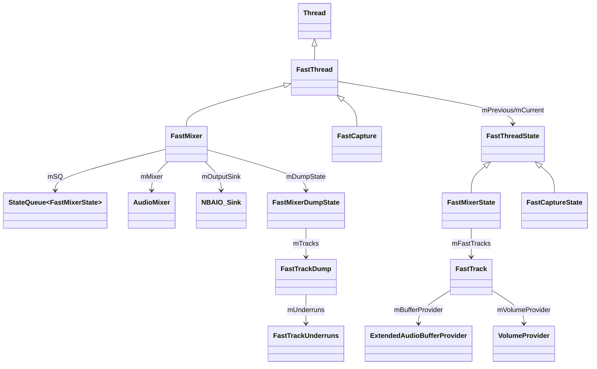
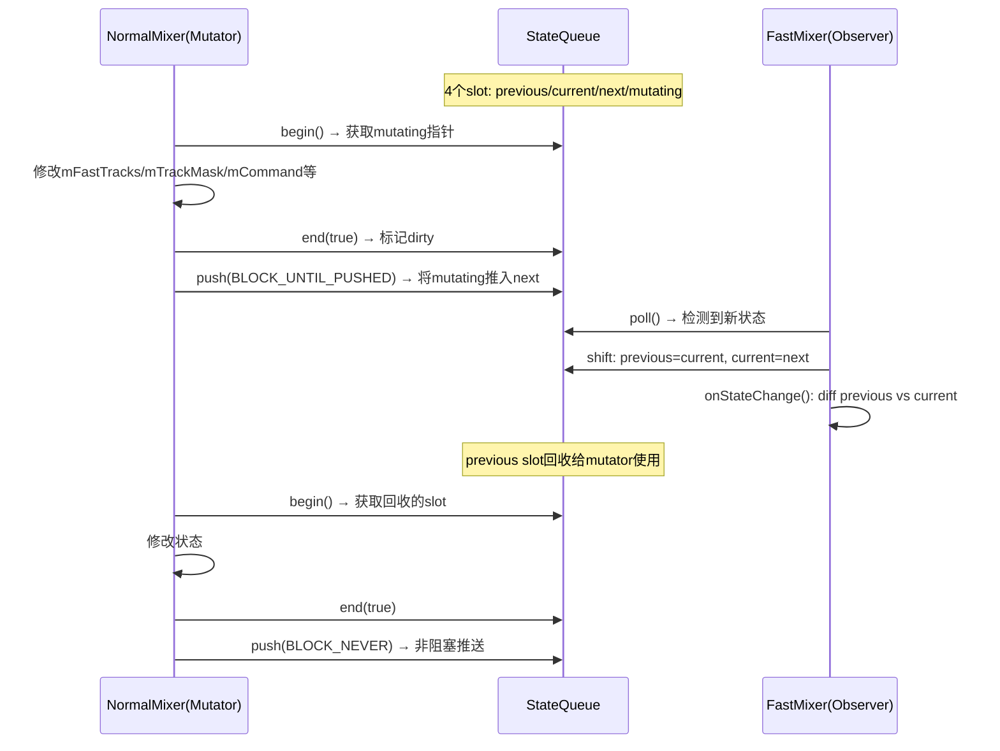
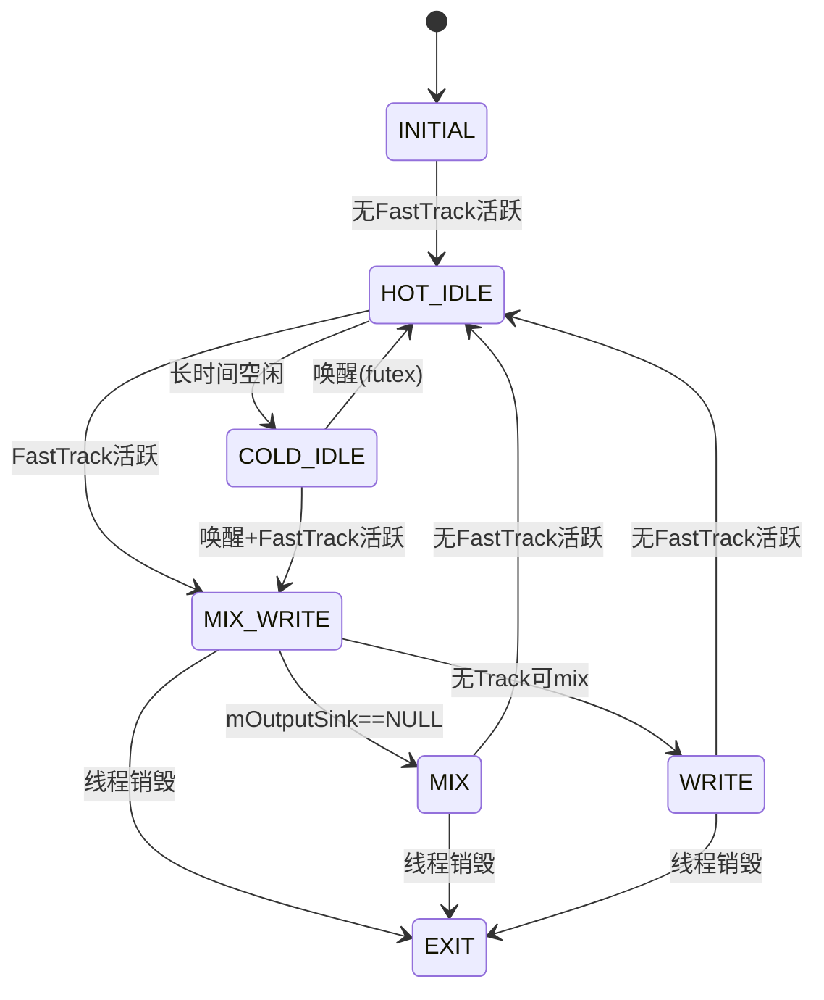
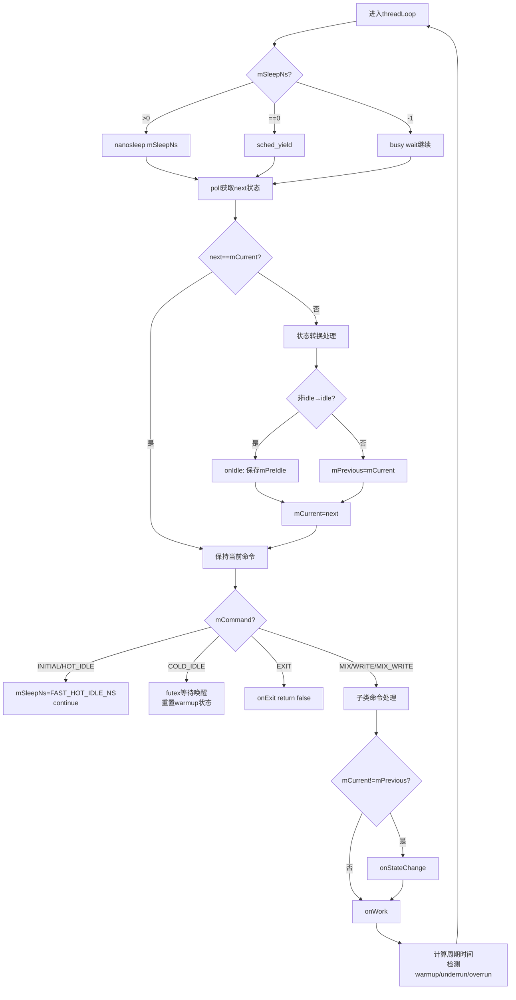
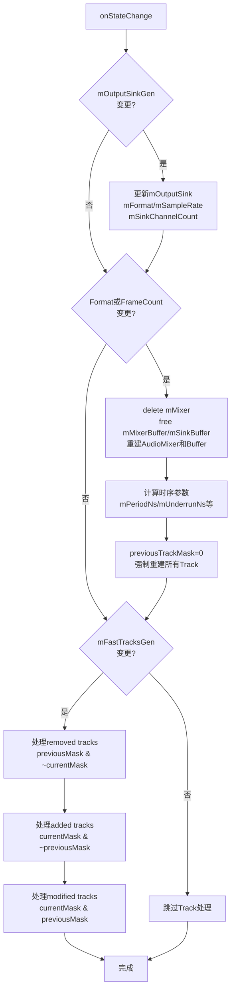
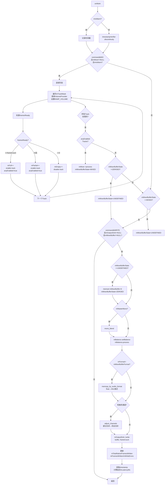
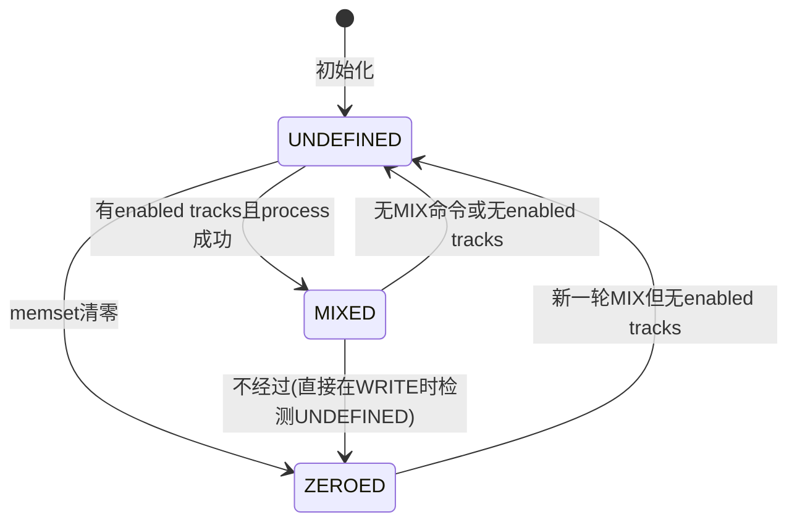
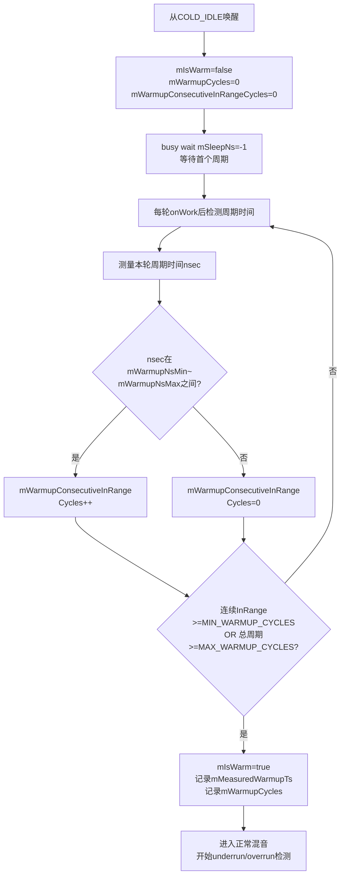
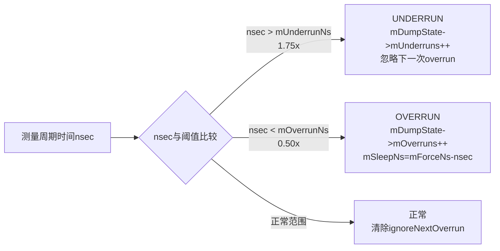
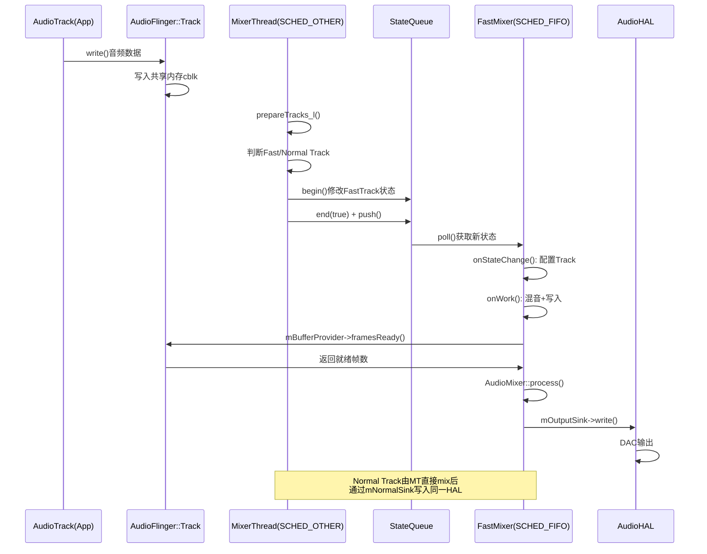

## 5.4 FastMixer — 低延迟混音路径

> [← 上一个](05_5.3_PlaybackThread核心循环.md) | [← 返回AudioFlinger](README.md) | [返回导航](../README.md) | [下一个 →](05_5.5_Buffer管理与共享内存.md)

---

### 1. 为什么需要FastMixer

MixerThread运行在`SCHED_OTHER`调度策略下，典型周期约20ms。对于延迟敏感的应用（如乐器类App、实时通信），20ms的混音延迟远不能满足需求。FastMixer应运而生，其核心设计目标是：

- **降低混音延迟**：典型周期<10ms，常见配置为4-6ms
- **实时调度保证**：`SCHED_FIFO`调度策略，内核保证CPU时间片
- **无锁状态传递**：通过[`StateQueue<T>`](frameworks/av/services/audioflinger/StateQueue.h:127)实现observer/mutator无锁通信
- **避免阻塞操作**：禁止mutex、条件等待、I/O、内存分配等可能阻塞的操作

正如源码注释([`FastMixer.cpp`](frameworks/av/services/audioflinger/FastMixer.cpp:17))所强调：

> Design rules for threadLoop() are given in the comments at section "Fast mixer thread" of StateQueue.h. In particular, avoid library and system calls except at well-known points.

### 2. FastMixer架构全景



#### 2.1 FastThread基类

[`FastThread`](frameworks/av/services/audioflinger/FastThread.h:30)继承自`Thread`，是FastMixer和FastCapture的公共抽象基类，提供：

| 虚函数 | 职责 |
|--------|------|
| [`poll()`](frameworks/av/services/audioflinger/FastThread.h:43) | 从StateQueue获取最新状态 |
| [`onIdle()`](frameworks/av/services/audioflinger/FastThread.h:45) | 进入idle前保存当前状态 |
| [`onExit()`](frameworks/av/services/audioflinger/FastThread.h:46) | 线程退出时释放资源 |
| [`isSubClassCommand()`](frameworks/av/services/audioflinger/FastThread.h:47) | 判断命令是否属于子类 |
| [`onStateChange()`](frameworks/av/services/audioflinger/FastThread.h:48) | 状态变更时处理配置 |
| [`onWork()`](frameworks/av/services/audioflinger/FastThread.h:49) | 每轮核心工作逻辑 |

**关键成员**（定义于[`FastThread.h`](frameworks/av/services/audioflinger/FastThread.h:52)）：

| 成员 | 类型 | 说明 |
|------|------|------|
| `mPrevious` | `const FastThreadState*` | 上一状态（用于diff检测） |
| `mCurrent` | `const FastThreadState*` | 当前状态 |
| `mSleepNs` | `long` | 睡眠策略：-1=busy wait, 0=yield, >0=nanosleep(ns) |
| `mPeriodNs` | `long` | 期望周期时间（1.00x buffer时长） |
| `mUnderrunNs` | `long` | underrun判定阈值（1.75x） |
| `mOverrunNs` | `long` | overrun判定阈值（0.50x） |
| `mForceNs` | `long` | overrun后强制最小周期（0.95x） |
| `mWarmupNsMin/Max` | `long` | warmup完成判定范围（0.75x~1.25x） |
| `mIsWarm` | `bool` | warmup是否完成 |
| `mColdGen` | `unsigned` | COLD_IDLE代数，防止重复执行 |
| `mAttemptedWrite` | `bool` | 本轮是否尝试了write操作 |

#### 2.2 FastMixer核心成员

[`FastMixer`](frameworks/av/services/audioflinger/FastMixer.h:30)在FastThread基础上增加：

| 成员 | 类型 | 说明 |
|------|------|------|
| [`mSQ`](frameworks/av/services/audioflinger/FastMixer.h:44) | `FastMixerStateQueue` | 与NormalMixer通信的StateQueue |
| [`mMixer`](frameworks/av/services/audioflinger/FastMixer.h:78) | `AudioMixer*` | 混音器实例 |
| [`mOutputSink`](frameworks/av/services/audioflinger/FastMixer.h:76) | `NBAIO_Sink*` | HAL输出设备 |
| [`mSinkBuffer`](frameworks/av/services/audioflinger/FastMixer.h:81) | `void*` | HAL格式输出缓冲区 |
| [`mMixerBuffer`](frameworks/av/services/audioflinger/FastMixer.h:86) | `void*` | float格式混音缓冲区 |
| [`mGenerations[]`](frameworks/av/services/audioflinger/FastMixer.h:74) | `int[32]` | 每个FastTrack上次观测的mGeneration |
| [`mOutputSinkGen`](frameworks/av/services/audioflinger/FastMixer.h:77) | `int` | OutputSink变更代数 |
| [`mMixerBufferState`](frameworks/av/services/audioflinger/FastMixer.h:92) | `enum` | UNDEFINED/MIXED/ZEROED |
| [`mMasterMono`](frameworks/av/services/audioflinger/FastMixer.h:106) | `atomic_bool` | 单声道混合开关 |
| [`mMasterBalance`](frameworks/av/services/audioflinger/FastMixer.h:107) | `atomic<float>` | 左右平衡系数 |

### 3. FastMixer vs NormalMixer对比

| 维度 | FastMixer | NormalMixer (MixerThread) |
|------|-----------|---------------------------|
| 调度策略 | SCHED_FIFO（实时） | SCHED_OTHER（普通） |
| 优先级 | 高（内核保证） | 低（nice=-16 urgent audio） |
| 状态传递 | StateQueue无锁 | Mutex + Condition |
| 典型周期 | <10ms (4~6ms) | ~20ms |
| 锁使用 | 无mutex（仅atomic） | mLock互斥锁 |
| Track限制 | Fast Track（格式/采样率约束） | 所有Track |
| 音效处理 | 不支持EffectChain | 完整EffectChain |
| Buffer格式 | float（AUDIO_FORMAT_PCM_FLOAT） | int16_t/float可配 |
| 写入路径 | NBAIO_Sink非阻塞write | mNormalSink(NBAIO)或mOutput直接write |
| 睡眠策略 | nanosleep/yield/busy-wait自适应 | mSleepTimeMs + condition wait |
| Warmup机制 | 需要（2~10周期） | 不需要 |
| 最大Track数 | kMaxFastTracks=32 | 无硬性限制 |
| 调试统计 | FastMixerDumpState（FIFO采样） | ThreadMetrics |

### 4. StateQueue无锁状态队列

StateQueue是FastMixer架构的核心基础设施，解决了NormalMixer（mutator）与FastMixer（observer）之间的状态传递问题。

#### 4.1 设计约束

[`StateQueue.h`](frameworks/av/services/audioflinger/StateQueue.h:22)的源码注释详细描述了设计约束：

- **单observer单mutator**：这是关键前提，允许无锁设计
- **状态仅含POD和raw指针**：因为可能使用memcpy()复制，析构顺序不可预测
- **observer可跳过中间状态**：只关心最新状态，不需要看到每次变更
- **observer永不阻塞**：poll()必须立即返回
- **mutator尽量不阻塞**：但允许在极端情况下短暂等待slot可用

#### 4.2 四slot状态轮转



核心API（定义于[`StateQueue.h`](frameworks/av/services/audioflinger/StateQueue.h:127)）：

| API | 调用者 | 说明 |
|-----|--------|------|
| [`begin()`](frameworks/av/services/audioflinger/StateQueue.h:150) | mutator | 获取可修改的状态指针，不可嵌套 |
| [`end(didModify)`](frameworks/av/services/audioflinger/StateQueue.h:156) | mutator | 结束修改，标记dirty |
| [`push(block)`](frameworks/av/services/audioflinger/StateQueue.h:171) | mutator | 推送dirty状态给observer |
| [`poll()`](frameworks/av/services/audioflinger/StateQueue.h:141) | observer | 轮询最新状态，无新状态返回原指针 |

**push阻塞模式**：

| 模式 | 行为 |
|------|------|
| `BLOCK_NEVER` | 不阻塞，dirty且无法推送时返回false |
| `BLOCK_UNTIL_PUSHED` | 阻塞直到有slot可推入 |
| `BLOCK_UNTIL_ACKED` | 阻塞直到observer确认已读取 |

#### 4.3 内部数据结构

```cpp
// StateQueue.h:186-202
static const unsigned kN = 4;       // 4个状态slot
T                 mStates[kN];      // 状态数组
atomic_uintptr_t  mNext;            // mutator写入，observer读取
volatile const T* mAck;             // observer写入，mutator读取
const T*          mCurrent;         // observer: 最近poll()返回的指针
T*                mMutating;        // mutator: 当前修改中的slot
const T*          mExpecting;       // mutator: 期望mAck指向的slot
bool              mInMutation;      // 是否正在修改中
bool              mIsDirty;         // 修改后是否已推送
bool              mIsInitialized;   // 是否已初始化
```

### 5. FastMixerState命令体系

[`FastMixerState`](frameworks/av/services/audioflinger/FastMixerState.h:60)继承自[`FastThreadState`](frameworks/av/services/audioflinger/FastThreadState.h:29)，扩展了命令集：



**命令编码**（定义于[`FastMixerState.h`](frameworks/av/services/audioflinger/FastMixerState.h:84)）：

| 命令 | 值 | 含义 | 位特征 |
|------|----|------|--------|
| `INITIAL` | 0x0 | 初始状态 | - |
| `HOT_IDLE` | 0x1 | 热空闲，短sleep | IDLE=0x3的低2位 |
| `COLD_IDLE` | 0x2 | 冷空闲，futex等待 | IDLE=0x3的低2位 |
| `IDLE` | 0x3 | 空闲掩码 | HOT_IDLE \| COLD_IDLE |
| `EXIT` | 0x4 | 退出线程 | - |
| `MIX` | 0x8 | 仅混音 | bit3 |
| `WRITE` | 0x10 | 仅写入 | bit4 |
| `MIX_WRITE` | 0x18 | 混音+写入 | MIX \| WRITE |

MIX和WRITE可以位或组合，因此`isSubClassCommand()`通过检查命令值是否>=0x8来判断。命令分发逻辑位于[`FastThread::threadLoop()`](frameworks/av/services/audioflinger/FastThread.cpp:160)的switch语句。

#### 5.1 FastTrack结构

[`FastTrack`](frameworks/av/services/audioflinger/FastMixerState.h:45)代表FastMixer上的一个活跃Track：

| 字段 | 类型 | 说明 |
|------|------|------|
| [`mBufferProvider`](frameworks/av/services/audioflinger/FastMixerState.h:49) | `ExtendedAudioBufferProvider*` | Buffer提供者，NULL表示不活跃 |
| [`mVolumeProvider`](frameworks/av/services/audioflinger/FastMixerState.h:50) | `VolumeProvider*` | 音量提供者，NULL则满刻度 |
| [`mChannelMask`](frameworks/av/services/audioflinger/FastMixerState.h:51) | `audio_channel_mask_t` | 通道掩码（通常MONO或STEREO） |
| [`mFormat`](frameworks/av/services/audioflinger/FastMixerState.h:52) | `audio_format_t` | 采样格式 |
| [`mGeneration`](frameworks/av/services/audioflinger/FastMixerState.h:53) | `int` | 变更代数，任何字段修改时递增 |
| [`mHapticPlaybackEnabled`](frameworks/av/services/audioflinger/FastMixerState.h:54) | `bool` | 触觉播放是否启用 |
| [`mHapticIntensity`](frameworks/av/services/audioflinger/FastMixerState.h:55) | `HapticScale` | 触觉强度 |
| [`mHapticMaxAmplitude`](frameworks/av/services/audioflinger/FastMixerState.h:56) | `float` | 触觉最大振幅 |

[`VolumeProvider`](frameworks/av/services/audioflinger/FastMixerState.h:35)接口只有一个纯虚函数：
```cpp
virtual gain_minifloat_packed_t getVolumeLR() = 0;
```
返回压缩的minifloat左右声道音量对，避免浮点运算阻塞。

#### 5.2 mTrackMask位掩码

[`mTrackMask`](frameworks/av/services/audioflinger/FastMixerState.h:75)是32位无符号整数，bit i置1表示`mFastTracks[i]`活跃。配合`__builtin_ctz()`（找最低置1位）快速遍历：

```cpp
unsigned currentTrackMask = current->mTrackMask;
while (currentTrackMask != 0) {
    int i = __builtin_ctz(currentTrackMask);  // 最低活跃Track索引
    currentTrackMask &= ~(1 << i);            // 清除该位
    // 处理 mFastTracks[i] ...
}
```

### 6. FastThread::threadLoop()主循环

[`FastThread::threadLoop()`](frameworks/av/services/audioflinger/FastThread.cpp:91)是FastMixer/FastCapture的主循环骨架：



#### 6.1 COLD_IDLE与futex机制

当FastMixer长时间无活跃Track时，NormalMixer将其置为COLD_IDLE状态，通过futex（Fast Userspace Mutex）实现低开销等待唤醒：

```cpp
// FastThread.cpp:165-197
if (mCurrent->mColdGen != mColdGen) {      // mColdGen递增确保仅执行一次
    int32_t *coldFutexAddr = mCurrent->mColdFutexAddr;
    int32_t old = android_atomic_dec(coldFutexAddr);  // 原子递减
    if (old <= 0) {
        syscall(__NR_futex, coldFutexAddr, FUTEX_WAIT_PRIVATE, old - 1, NULL);
    }
    // 唤醒后验证调度策略恢复为SCHED_FIFO
    int policy = sched_getscheduler(0) & ~SCHED_RESET_ON_FORK;
    if (!(policy == SCHED_FIFO || policy == SCHED_RR)) {
        ALOGE("did not receive expected priority boost on time");
    }
    mIsWarm = false;                        // 重置warmup状态
    mWarmupCycles = 0;
    mWarmupConsecutiveInRangeCycles = 0;
    mSleepNs = -1;                          // busy wait等待首个周期
    mColdGen = mCurrent->mColdGen;          // 记录已处理的代数
}
```

**COLD_IDLE→唤醒时序**：
1. NormalMixer设置`mColdFutexAddr`指向共享futex变量
2. FastMixer原子递减futex值，若<=0则内核等待
3. NormalMixer在添加FastTrack时原子递增futex值，触发内核唤醒
4. FastMixer被唤醒后验证SCHED_FIFO策略，然后busy wait等待首个工作周期

#### 6.2 睡眠策略

FastThread根据mSleepNs选择三种等待策略：

| mSleepNs | 策略 | 使用场景 |
|----------|------|----------|
| >0 | `nanosleep(mSleepNs)` | 正常周期等待、HOT_IDLE |
| ==0 | `sched_yield()` | 主动让出CPU但期望很快被调度 |
| -1 | busy wait | warmup阶段、需要精确时序 |

每轮循环开始时`mSleepNs`被重置为`FAST_DEFAULT_NS`（长睡眠），后续由命令处理和时序检测逻辑覆盖。

### 7. FastMixer::onStateChange()配置变更处理

当[`onStateChange()`](frameworks/av/services/audioflinger/FastMixer.cpp:216)检测到状态变更时，处理两类配置：

#### 7.1 OutputSink/FrameCount变更 → 重建AudioMixer和Buffer



**时序参数计算**（[`FastMixer.cpp:287-292`](frameworks/av/services/audioflinger/FastMixer.cpp:287)）：

```cpp
mPeriodNs    = (frameCount * 1000000000LL) / mSampleRate;    // 1.00x 标准周期
mUnderrunNs  = (frameCount * 1750000000LL) / mSampleRate;   // 1.75x underrun阈值
mOverrunNs   = (frameCount *  500000000LL) / mSampleRate;   // 0.50x overrun阈值
mForceNs     = (frameCount *  950000000LL) / mSampleRate;   // 0.95x 强制最小周期
mWarmupNsMin = (frameCount *  750000000LL) / mSampleRate;   // 0.75x warmup下限
mWarmupNsMax = (frameCount * 1250000000LL) / mSampleRate;   // 1.25x warmup上限
```

以48kHz、frameCount=192为例：
- mPeriodNs = 4,000,000ns (4.0ms)
- mUnderrunNs = 7,000,000ns (7.0ms)
- mOverrunNs = 2,000,000ns (2.0ms)

#### 7.2 FastTrack增删改处理

[`updateMixerTrack()`](frameworks/av/services/audioflinger/FastMixer.cpp:145)根据三种Reason操作AudioMixer：

| Reason | 操作 | 说明 |
|--------|------|------|
| `REASON_REMOVE` | `mMixer->destroy(index)` | 从AudioMixer删除Track |
| `REASON_ADD` | `mMixer->create(index, ...)` → fallthrough | 创建Track后立即配置 |
| `REASON_MODIFY` | 更新BufferProvider/Volume/参数 | mGeneration变更时触发 |

**mGeneration变更检测**是关键优化：当REASON_MODIFY但mGeneration未变时，直接跳过，避免不必要的AudioMixer重新配置。

REASON_ADD和REASON_MODIFY的完整配置链（[`FastMixer.cpp:174-209`](frameworks/av/services/audioflinger/FastMixer.cpp:174)）：

```cpp
// 设置BufferProvider
mMixer->setBufferProvider(index, fastTrack->mBufferProvider);
// 从VolumeProvider获取音量（minifloat→float）
float vlf = float_from_gain(gain_minifloat_unpack_left(vlr));
float vrf = float_from_gain(gain_minifloat_unpack_right(vlr));
// 设置音量（非RAMP，直接设置避免启动/暂停时的音量跳变）
mMixer->setParameter(index, AudioMixer::VOLUME, AudioMixer::VOLUME0, &vlf);
mMixer->setParameter(index, AudioMixer::VOLUME, AudioMixer::VOLUME1, &vrf);
// 清除重采样器
mMixer->setParameter(index, AudioMixer::RESAMPLE, AudioMixer::REMOVE, nullptr);
// 设置输出buffer为mMixerBuffer（float格式）
mMixer->setParameter(index, AudioMixer::TRACK, AudioMixer::MAIN_BUFFER, (void*)mMixerBuffer);
// 设置格式/通道/触觉参数
mMixer->setParameter(index, AudioMixer::TRACK, AudioMixer::FORMAT, ...);
mMixer->setParameter(index, AudioMixer::TRACK, AudioMixer::CHANNEL_MASK, ...);
mMixer->setParameter(index, AudioMixer::TRACK, AudioMixer::HAPTIC_ENABLED, ...);
mMixer->enable(index);
```

### 8. FastMixer::onWork()混音与写入

[`onWork()`](frameworks/av/services/audioflinger/FastMixer.cpp:350)是FastMixer每轮核心工作逻辑，由FastThread::threadLoop()在子类命令(MIX/WRITE/MIX_WRITE)时调用。



#### 8.1 mMixerBufferState状态机

mMixerBufferState跟踪混音缓冲区的填充状态，避免不必要的memset：



| 状态 | 含义 | 触发条件 |
|------|------|----------|
| `UNDEFINED` | 缓冲区内容未定义 | 初始化/无enabled tracks/MIX后WRITE前未重新mix |
| `MIXED` | 缓冲区已混音 | `mMixer->process()`成功且有enabled tracks |
| `ZEROED` | 缓冲区已清零 | WRITE时检测到UNDEFINED自动memset |

#### 8.2 Underrun统计与Track启用/禁用

onWork()对每个FastTrack检查`framesReady()`，根据就绪帧数决定：

| framesReady | Underrun类型 | AudioMixer操作 | 说明 |
|-------------|-------------|----------------|------|
| >= frameCount | FULL | enable | 数据充足，正常混音 |
| >0 && < frameCount | PARTIAL | enable | 部分就绪，允许混音部分buffer |
| ==0 | EMPTY | disable | 完全欠载，禁用该Track |

PARTIAL underrun允许混音部分buffer，这是FastMixer的一个设计选择——即使数据不完全就绪，也尽量输出已有数据，而不是完全静音。

#### 8.3 Volume更新：VOLUME vs RAMP_VOLUME

注意`onWork()`中使用`RAMP_VOLUME`（[`FastMixer.cpp:414`](frameworks/av/services/audioflinger/FastMixer.cpp:414)），而`updateMixerTrack()`中使用`VOLUME`（[`FastMixer.cpp:188`](frameworks/av/services/audioflinger/FastMixer.cpp:188)）：

- **onWork() → RAMP_VOLUME**：每轮更新，实现平滑音量渐变
- **updateMixerTrack() → VOLUME**：Track初次配置或修改时，直接设置音量，不渐变

#### 8.4 格式转换路径

FastMixer的混音始终在float格式下进行，写入HAL时可能需要格式转换：

```
mMixerBuffer (float) ──→ memcpy_by_audio_format ──→ mSinkBuffer (HAL格式)
```

仅当`mFormat.mFormat != mMixerBufferFormat`时才需要格式转换。mSinkBuffer仅在HAL格式帧大小大于float帧大小时分配（例如16-bit输出不需要，24/32-bit输出需要）。

### 9. Warmup机制

FastMixer从COLD_IDLE或standby唤醒后，不能立即开始正常混音。硬件DAC需要时间稳定输出，因此需要warmup阶段。



**Warmup完成条件**（[`FastThread.cpp:257`](frameworks/av/services/audioflinger/FastThread.cpp:257)）：

| 条件 | 值 | 说明 |
|------|----|------|
| MIN_WARMUP_CYCLES | 2 | 连续2个周期在0.75x~1.25x范围内 |
| MAX_WARMUP_CYCLES | 10 | 最多10个周期后强制完成 |

Warmup期间，`mIsWarm=false`，即使command包含MIX也不会执行混音（onWork中`if ((command & MIX) && mIsWarm)`条件不满足），只执行WRITE（写静音零数据到HAL，帮助硬件稳定）。

### 10. Underrun/Overrun检测

warmup完成后，FastThread通过测量每轮周期时间来检测underrun和overrun：



| 状态 | 条件 | 含义 | 处理 |
|------|------|------|------|
| Underrun | nsec > mUnderrunNs (1.75x) | 周期过长，输出数据不足 | 计数++，忽略下一次overrun |
| Overrun | nsec < mOverrunNs (0.50x) | 周期过短，写入过快 | 计数++，强制sleep mForceNs-nsec |
| Normal | mOverrunNs <= nsec <= mUnderrunNs | 周期正常 | 清除ignore标记 |

**underrun后忽略overrun**的原因：underrun后下一个周期通常会偏短（补偿效应），这不是真正的overrun，应忽略。

**overrun后强制sleep**（`mSleepNs = mForceNs - nsec`）：补偿HAL因采样率转换导致的抖动，或可变buffer深度HAL从不低于mOverrunNs速率拉取数据的情况。

### 11. FastMixerDumpState调试统计

[`FastMixerDumpState`](frameworks/av/services/audioflinger/FastMixerDumpState.h:64)继承自[`FastThreadDumpState`](frameworks/av/services/audioflinger/FastThreadDumpState.h:31)，提供dumpsys调试信息：

| 字段 | 说明 |
|------|------|
| `mLatencyMs` | 测量的输出延迟（ms） |
| `mWriteSequence` | write前后各递增，用于检测读写竞争 |
| `mFramesWritten` | 成功写入的总帧数 |
| `mNumTracks` | 当前活跃FastTrack数 |
| `mWriteErrors` | write()失败总次数 |
| `mSampleRate` | 当前采样率 |
| `mFrameCount` | 每个buffer的帧数 |
| `mTrackMask` | 活跃Track位掩码 |
| `mTracks[32]` | 每个Track的统计 |

#### 11.1 FastTrackUnderruns位域联合体

[`FastTrackUnderruns`](frameworks/av/services/audioflinger/FastMixerDumpState.h:37)使用位域紧凑存储underrun统计，保证原子性（整体32bit）：

```
|  2bit  |  10bit   |  10bit   |  10bit   |
| MostR  |  Empty   | Partial  |   Full   |
| Recent |  count   |  count   |  count   |
```

| 位域 | 位数 | 说明 |
|------|------|------|
| `mFull` | 10 | framesReady >= frameCount的次数 |
| `mPartial` | 10 | 0 < framesReady < frameCount的次数 |
| `mEmpty` | 10 | framesReady == 0的次数 |
| `mMostRecent` | 2 | 最近一次状态：UNDERRUN_FULL/PARTIAL/EMPTY |

10位计数器最大值1023，溢出后回绕。由于FastTrack可复用slot，计数器不会重置。

#### 11.2 FastThreadDumpState统计采样

[`FastThreadDumpState`](frameworks/av/services/audioflinger/FastThreadDumpState.h:31)包含FIFO环形采样缓冲区：

| 字段 | 说明 |
|------|------|
| `mMonotonicNs[kSamplingN]` | 每轮的wall clock时间差 |
| `mLoadNs[kSamplingN]` | 每轮的CPU时间差 |
| `mCpukHz[kSamplingN]` | 每轮的CPU频率 |
| `kSamplingN = 0x8000` | 最大采样数（32K条） |
| `mBounds` | FIFO有效区间边界 |

dumpsys通过读取这些统计数据分析FastMixer的实时性能。

### 12. Fast Track创建条件

Track需要满足以下条件才能走FastMixer路径（由MixerThread::prepareTracks_l()判定）：

| 条件 | 说明 |
|------|------|
| `AUDIO_OUTPUT_FLAG_FAST` | 应用创建AudioTrack时请求fast标志 |
| 采样率匹配 | Track采样率与输出采样率一致（无需重采样） |
| 格式兼容 | PCM_FLOAT或PCM_16BIT |
| 通道数限制 | MONO或STEREO |
| 无音效链 | 该Track无EffectChain绑定 |
| FastMixer已创建 | MixerThread成功创建了FastMixer子线程 |
| slot未满 | 活跃FastTrack数 < kMaxFastTracks |

不满足条件的Track走NormalMixer路径，由MixerThread::threadLoop_mix()在SCHED_OTHER线程中混音。

### 13. MixerThread与FastMixer协作总览



**双路径共存**：MixerThread同时管理FastMixer子线程和自身的NormalMixer路径。Fast Track数据由FastMixer直接从Track的共享内存读取并混音；Normal Track由MixerThread混音后通过mNormalSink写入。两者写入同一个HAL设备的不同NBAIO端口。

---

> [← 上一个](05_5.3_PlaybackThread核心循环.md) | [← 返回AudioFlinger](README.md) | [返回导航](../README.md) | [下一个 →](05_5.5_Buffer管理与共享内存.md)