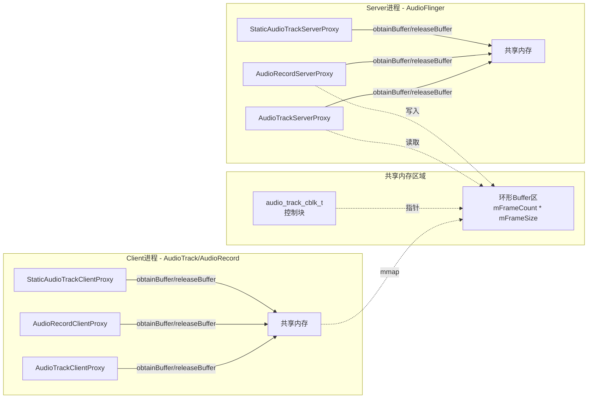
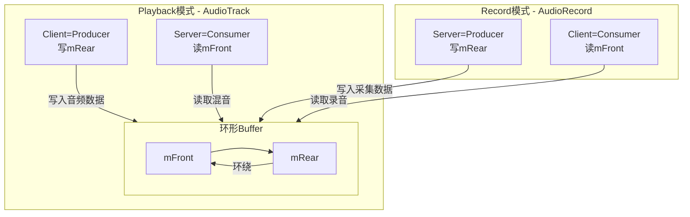
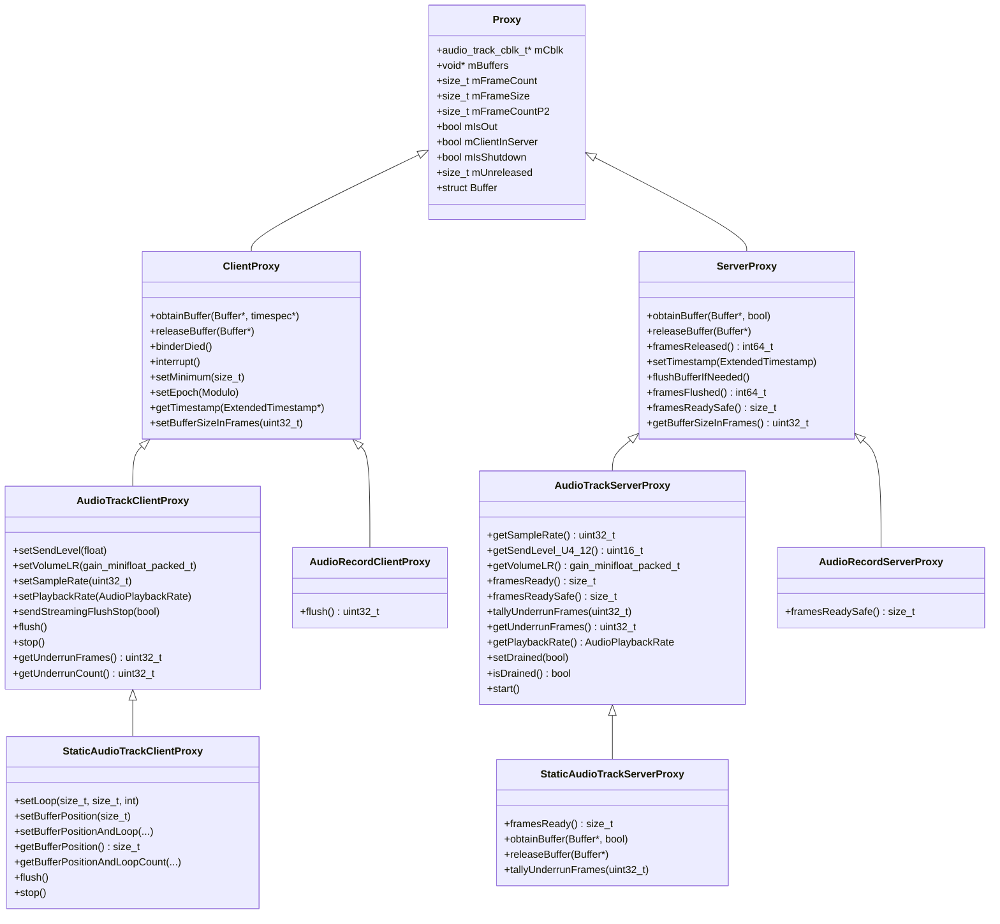
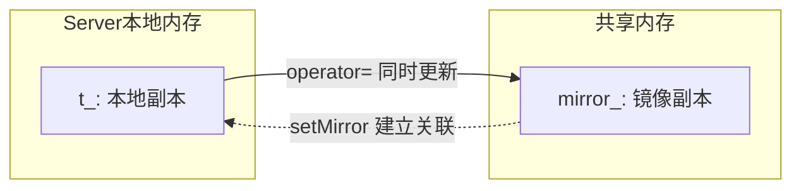
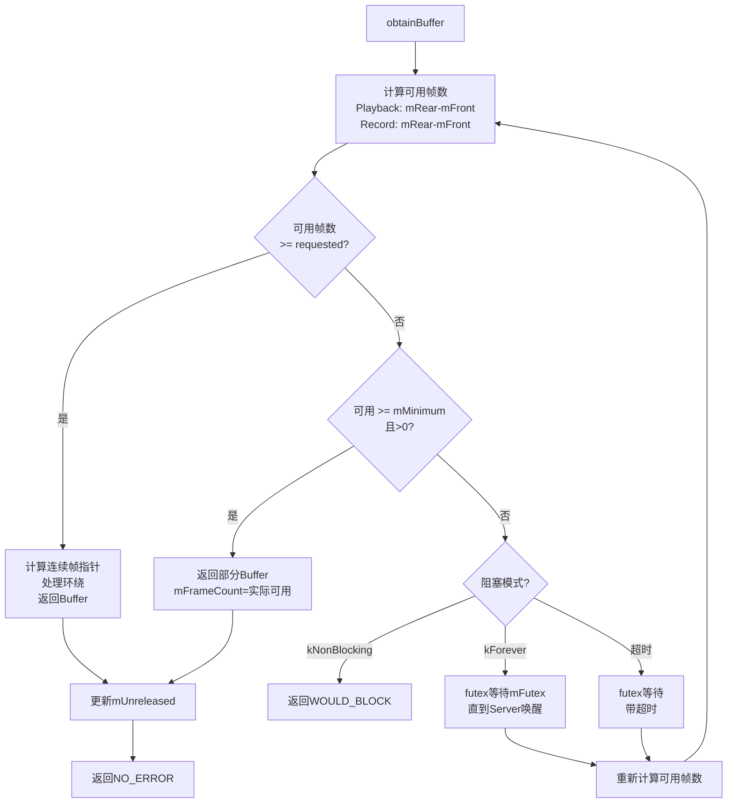
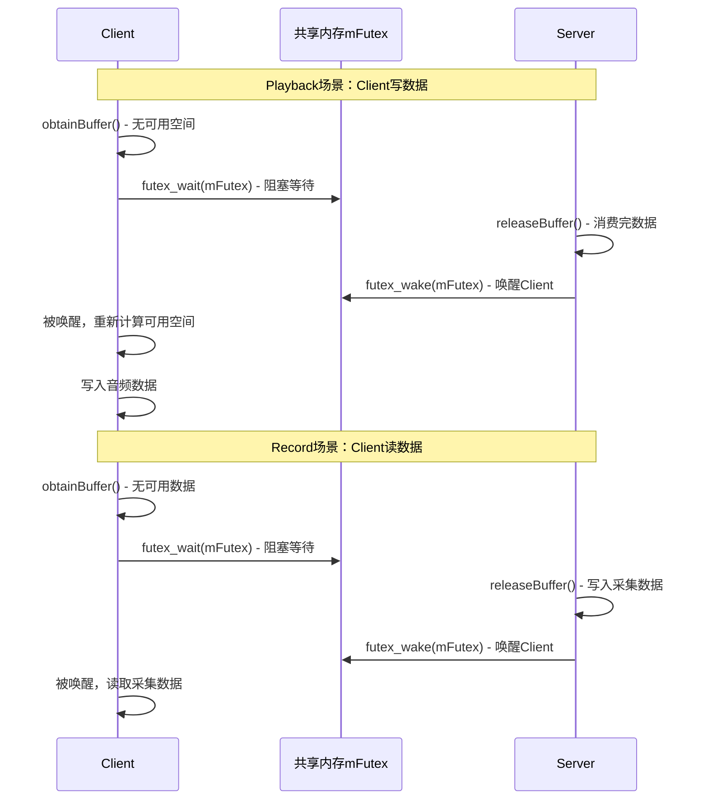
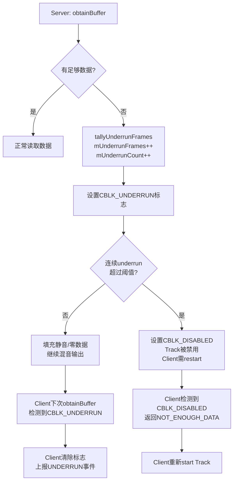

## 5.5 Buffer管理与共享内存

> [← 上一个](05_5.4_FastMixer-低延迟混音路径.md) | [← 返回AudioFlinger](README.md) | [返回导航](../README.md) | [下一个 →](05_5.6_PatchPanel-音频路由管理.md)

---

### 1. 共享内存架构概览

AudioTrack/AudioRecord与AudioFlinger之间通过共享内存传递音频数据，避免跨进程拷贝。核心设计围绕[`audio_track_cblk_t`](frameworks/av/include/private/media/AudioTrackShared.h:207)控制块和Proxy代理体系展开。



### 2. audio_track_cblk_t控制块详解

[`audio_track_cblk_t`](frameworks/av/include/private/media/AudioTrackShared.h:207)是Client与Server之间的共享控制块，位于共享内存头部：

#### 2.1 核心字段

| 字段 | 偏移 | 类型 | 读写 | 说明 |
|------|------|------|------|------|
| [`mServer`](frameworks/av/include/private/media/AudioTrackShared.h:225) | 0 | `uint32_t` | Server写/Client读 | Server已消费(Playback)或已提供(Record)的帧数 |
| `mPad1` | 4 | `uint32_t` | - | 未使用对齐填充 |
| [`mFutex`](frameworks/av/include/private/media/AudioTrackShared.h:234) | 8 | `volatile int32_t` | 双向 | futex事件标志，Client down(P)/Server up(V) |
| [`mMinimum`](frameworks/av/include/private/media/AudioTrackShared.h:242) | 12 | `uint32_t` | Client写/Server读 | Server唤醒Client的最小可用帧数阈值 |
| [`mVolumeLR`](frameworks/av/include/private/media/AudioTrackShared.h:245) | 16 | `gain_minifloat_packed_t` | Client写/Server读 | 立体声音量（minifloat压缩） |
| [`mSampleRate`](frameworks/av/include/private/media/AudioTrackShared.h:247) | 20 | `uint32_t` | Client写/Server读 | 客户端请求的采样率 |
| [`mPlaybackRateQueue`](frameworks/av/include/private/media/AudioTrackShared.h:250) | 24 | `PlaybackRateQueue::Shared` | Client写/Server读 | 播放速率队列（变速播放） |
| [`mSendLevel`](frameworks/av/include/private/media/AudioTrackShared.h:253) | - | `uint16_t` | Client写/Server读 | Aux发送电平，U4.12定点 |
| [`mExtendedTimestampQueue`](frameworks/av/include/private/media/AudioTrackShared.h:258) | - | `ExtendedTimestampQueue::Shared` | Server写/Client读 | 扩展时间戳队列 |
| [`mBufferSizeInFrames`](frameworks/av/include/private/media/AudioTrackShared.h:262) | - | `volatile uint32_t` | Client写/Server读 | 有效buffer大小（可动态调整） |
| [`mStartThresholdInFrames`](frameworks/av/include/private/media/AudioTrackShared.h:263) | - | `volatile uint32_t` | Client写/Server读 | 开始播放的最小帧数阈值 |
| [`mFlags`](frameworks/av/include/private/media/AudioTrackShared.h:267) | - | `volatile int32_t` | 双向 | CBLK_*标志位组合 |
| [`mState`](frameworks/av/include/private/media/AudioTrackShared.h:269) | - | `atomic<int32_t>` | 双向 | Track状态：IDLE/ACTIVE/PAUSING |

#### 2.2 mFlags标志位

| 标志 | 值 | 设置者 | 含义 |
|------|----|--------|------|
| `CBLK_UNDERRUN` | 0x01 | Server | 输出underrun，Client清除 |
| `CBLK_FORCEREADY` | 0x02 | Server | 强制Track就绪 |
| `CBLK_INVALID` | 0x04 | Server | buffer无效，需重建 |
| `CBLK_DISABLED` | 0x08 | Server | 连续underrun后禁用Track |
| `CBLK_LOOP_CYCLE` | 0x20 | Server | 非最终loop周期完成 |
| `CBLK_LOOP_FINAL` | 0x40 | Server | 最终loop周期完成 |
| `CBLK_BUFFER_END` | 0x80 | Server | 到达非循环buffer末尾 |
| `CBLK_OVERRUN` | 0x100 | Server | 输入overrun，Client清除 |
| `CBLK_INTERRUPT` | 0x200 | Client | interrupt()调用 |
| `CBLK_STREAM_END_DONE` | 0x400 | Server | 渲染完成 |

#### 2.3 mState状态

| 状态 | 值 | 含义 |
|------|----|------|
| `CBLK_STATE_IDLE` | 0 | 空闲 |
| `CBLK_STATE_ACTIVE` | 6 | 活跃 |
| `CBLK_STATE_PAUSING` | 7 | 正在暂停 |

#### 2.4 union u：Streaming与Static模式

[`u`](frameworks/av/include/private/media/AudioTrackShared.h:272)是一个union，根据Track模式选择不同的共享结构：

```cpp
union {
    AudioTrackSharedStreaming   mStreaming;
    AudioTrackSharedStatic      mStatic;
    int                         mAlign[8];   // 对齐保证
} u;
```

### 3. AudioTrackSharedStreaming — 流模式共享结构

[`AudioTrackSharedStreaming`](frameworks/av/include/private/media/AudioTrackShared.h:134)实现了环形buffer的读写指针管理：



| 字段 | 类型 | 说明 |
|------|------|------|
| [`mFront`](frameworks/av/include/private/media/AudioTrackShared.h:137) | `volatile int32_t` | 消费者指针：Playback时Server读取，Record时Client读取 |
| [`mRear`](frameworks/av/include/private/media/AudioTrackShared.h:138) | `volatile int32_t` | 生产者指针：Playback时Client写入，Record时Server写入 |
| [`mFlush`](frameworks/av/include/private/media/AudioTrackShared.h:139) | `volatile int32_t` | Client递增请求flush，Server丢弃mFront~mRear之间数据 |
| [`mStop`](frameworks/av/include/private/media/AudioTrackShared.h:141) | `volatile int32_t` | Client设置stop位置，Server不读取超过此位置 |
| [`mUnderrunFrames`](frameworks/av/include/private/media/AudioTrackShared.h:143) | `volatile uint32_t` | Server递增：每个期望但不可用的帧 |
| [`mUnderrunCount`](frameworks/av/include/private/media/AudioTrackShared.h:144) | `volatile uint32_t` | Server递增：underrun发生次数 |

**关键设计**：mFront和mRear是持续递增的帧计数器（不是模地址），取模buffer大小得到实际位置。buffer大小必须是2的幂，取模通过位与运算高效完成。

#### 3.1 mFlush与flush机制

flush流程（[`AudioTrackClientProxy::sendStreamingFlushStop()`](frameworks/av/include/private/media/AudioTrackShared.h:479)）：

1. Client调用`flush()`时递增`mFlush`
2. Server在`obtainBuffer()`中调用`flushBufferIfNeeded()`检测到`mFlush`变更
3. Server将mFront设为mRear（丢弃所有未读数据）
4. Server通过futex通知Client

这个设计确保flush请求异步处理——Client不阻塞等待Server执行flush。

#### 3.2 mStop与stop机制

Client调用`stop()`时设置`mStop`为当前mRear位置。Server在obtainBuffer()时不会读取超过mStop的帧。后续`start()`时Server清除mStop限制。

### 4. AudioTrackSharedStatic — 静态模式共享结构

[`AudioTrackSharedStatic`](frameworks/av/include/private/media/AudioTrackShared.h:190)用于MODE_STATIC的AudioTrack，Client一次性提供完整buffer：

| 字段 | 类型 | 说明 |
|------|------|------|
| [`mSingleStateQueue`](frameworks/av/include/private/media/AudioTrackShared.h:192) | `StaticAudioTrackSingleStateQueue::Shared` | Client→Server的loop/position变更请求 |
| [`mPosLoopQueue`](frameworks/av/include/private/media/AudioTrackShared.h:196) | `StaticAudioTrackPosLoopQueue::Shared` | Server→Client的位置反馈 |

#### 4.1 StaticAudioTrackState

[`StaticAudioTrackState`](frameworks/av/include/private/media/AudioTrackShared.h:151)通过SingleStateQueue传递Client对loop和position的设置：

| 字段 | 类型 | 说明 |
|------|------|------|
| `mLoopStart` | `uint32_t` | 循环起始位置 |
| `mLoopEnd` | `uint32_t` | 循环结束位置 |
| `mLoopCount` | `int32_t` | 循环次数（-1=无限） |
| `mLoopSequence` | `uint32_t` | loop变更序列号 |
| `mPosition` | `uint32_t` | 播放位置 |
| `mPositionSequence` | `uint32_t` | position变更序列号 |

**序列号设计**：mLoopSequence和mPositionSequence用于区分loop和position哪个后设置（值更大的是后设置的），确保Server按正确顺序应用变更。

#### 4.2 StaticAudioTrackPosLoop

[`StaticAudioTrackPosLoop`](frameworks/av/include/private/media/AudioTrackShared.h:172)是Server→Client的位置反馈，体积比StaticAudioTrackState更小：

| 字段 | 类型 | 说明 |
|------|------|------|
| `mBufferPosition` | `uint32_t` | 当前buffer内位置 |
| `mLoopCount` | `int32_t` | 剩余loop次数 |

### 5. Proxy代理体系

Proxy体系将Client和Server与共享内存细节隔离，每个控制块恰好对应一个ClientProxy和一个ServerProxy。



#### 5.1 Proxy基类

[`Proxy`](frameworks/av/include/private/media/AudioTrackShared.h:289)是所有代理的基类，核心成员：

| 成员 | 说明 |
|------|------|
| [`mCblk`](frameworks/av/include/private/media/AudioTrackShared.h:309) | 指向共享内存中的控制块 |
| [`mBuffers`](frameworks/av/include/private/media/AudioTrackShared.h:310) | buffer起始地址 |
| [`mFrameCount`](frameworks/av/include/private/media/AudioTrackShared.h:312) | 总帧数（不一定是2的幂） |
| [`mFrameSize`](frameworks/av/include/private/media/AudioTrackShared.h:313) | 每帧字节数 |
| [`mFrameCountP2`](frameworks/av/include/private/media/AudioTrackShared.h:314) | mFrameCount向上取2的幂（用于取模） |
| [`mIsOut`](frameworks/av/include/private/media/AudioTrackShared.h:315) | true=Playback, false=Record |
| [`mClientInServer`](frameworks/av/include/private/media/AudioTrackShared.h:316) | true=OutputTrack(AF内部) |
| [`mUnreleased`](frameworks/av/include/private/media/AudioTrackShared.h:318) | obtainBuffer获取但未release的帧数 |

[`Proxy::Buffer`](frameworks/av/include/private/media/AudioTrackShared.h:296)结构：

| 字段 | 说明 |
|------|------|
| `mFrameCount` | 可用帧数（含非连续部分） |
| `mRaw` | 第一帧的指针 |
| `mNonContig` | 额外非连续可用帧数 |

#### 5.2 7类Proxy总览

| Proxy类 | 进程 | 方向 | 模式 | 说明 |
|---------|------|------|------|------|
| [`AudioTrackClientProxy`](frameworks/av/include/private/media/AudioTrackShared.h:445) | Client | Playback | Streaming | AudioTrack写入数据 |
| [`StaticAudioTrackClientProxy`](frameworks/av/include/private/media/AudioTrackShared.h:502) | Client | Playback | Static | AudioTrack静态buffer控制 |
| [`AudioRecordClientProxy`](frameworks/av/include/private/media/AudioTrackShared.h:558) | Client | Record | Streaming | AudioRecord读取数据 |
| [`AudioTrackServerProxy`](frameworks/av/include/private/media/AudioTrackShared.h:662) | Server | Playback | Streaming | AudioFlinger读取混音 |
| [`StaticAudioTrackServerProxy`](frameworks/av/include/private/media/AudioTrackShared.h:740) | Server | Playback | Static | AudioFlinger读取静态buffer |
| [`AudioRecordServerProxy`](frameworks/av/include/private/media/AudioTrackShared.h:781) | Server | Record | Streaming | AudioFlinger写入采集数据 |

### 6. MirroredVariable\<T\> — 双端共享变量

[`MirroredVariable<T>`](frameworks/av/include/private/media/AudioTrackShared.h:68)是共享内存中变量的镜像同步机制：



**工作原理**：
1. Server端维护本地变量`t_`和共享内存指针`mirror_`
2. 赋值操作同时更新本地和共享内存：`t_ = value; *mirror_ = value;`
3. 通过[`setMirror()`](frameworks/av/include/private/media/AudioTrackShared.h:105)建立镜像关联

**约束条件**（通过`Constraints`模板检查）：
- `Container<T>`默认使用`std::atomic<T>`
- 若T与X不同，Container必须使用memcpy（避免strict aliasing问题）
- atomic类型必须是lock-free的（跨进程共享内存中mutex无效）
- sizeof和alignof必须匹配

### 7. obtainBuffer/releaseBuffer流程

#### 7.1 Client端obtainBuffer()

[`ClientProxy::obtainBuffer()`](frameworks/av/include/private/media/AudioTrackShared.h:366)是Client获取buffer的核心方法：



**返回值**：

| 状态 | 含义 |
|------|------|
| `NO_ERROR` | 成功，buffer->mFrameCount > 0 |
| `WOULD_BLOCK` | 非阻塞模式且无帧可用 |
| `TIMED_OUT` | 超时（即使无限超时也可能因spurious wakeup） |
| `DEAD_OBJECT` | Server已死亡 |
| `-EINTR` | 被interrupt()打断 |
| `NO_INIT` | 共享内存损坏 |
| `NOT_ENOUGH_DATA` | Server因underrun禁用了Track |

#### 7.2 Server端obtainBuffer()

[`ServerProxy::obtainBuffer()`](frameworks/av/include/private/media/AudioTrackShared.h:608)始终非阻塞：

1. 检查`mFlags`中的CBLK_INVALID标志
2. 处理flush请求（`flushBufferIfNeeded()`）
3. 计算可用帧数（Playback: mRear-mFront, Record: mFront-mRear）
4. 计算连续帧和mNonContig（处理环形buffer环绕）
5. 返回Buffer指针

#### 7.3 releaseBuffer()

[`releaseBuffer()`](frameworks/av/include/private/media/AudioTrackShared.h:377)的语义：

- **Client Playback**：advance mRear（通知Server有新数据可读）
- **Server Playback**：advance mFront（通知Client有数据已消费）
- **Client Record**：advance mFront（通知Server有数据已读）
- **Server Record**：advance mRear（通知Client有新数据可读）

releaseBuffer后若可用空间>=mMinimum，通过futex唤醒对方。

### 8. futex等待机制

[`mFutex`](frameworks/av/include/private/media/AudioTrackShared.h:234)是Client与Server之间的事件通知机制：



**futex vs 传统Condition Variable**：
- futex完全在用户空间操作（无竞争时零系统调用）
- 仅当需要等待时才进入内核
- 适合共享内存场景（不需要跨进程mutex）

`CBLK_FUTEX_WAKE`标志（0x01）用于延迟唤醒：若设置则表示有一个待执行的唤醒操作，避免重复系统调用。

### 9. Buffer分配策略

| 场景 | App buffer | AF内部buffer | 共享方式 | 说明 |
|------|-----------|-------------|----------|------|
| MODE_STREAM Playback | App指定(getMinBufferSize) | AF分配环形buffer | cblk+环形buffer | 双端读写环形buffer |
| MODE_STATIC Playback | App一次性提供 | 无额外AF buffer | cblk+App buffer直接映射 | 无环形buffer，随机访问 |
| MODE_STREAM Record | App指定 | AF分配环形buffer | cblk+环形buffer | Server写/Client读 |
| FastMixer | 较小(2-3 periods) | 小buffer | 同上但period更短 | 降低延迟 |
| NormalMixer | 较大(4-8 periods) | 大buffer | 同上 | 增加容错 |
| Offload | 压缩码流buffer | 无混音buffer | cblk+压缩buffer | 直传HAL |
| MMAP | 无共享cblk | MMAP共享内存 | 直接映射 | 零拷贝 |

### 10. mMinimum/mMaximum与共享内存边界

[`mMinimum`](frameworks/av/include/private/media/AudioTrackShared.h:242)由Client通过`setMinimum()`设置，控制Server何时唤醒Client：

- **Playback**：当Server消费数据后可用空间>=mMinimum时，futex唤醒Client
- **Record**：当Server写入数据后可用数据>=mMinimum时，futex唤醒Client

[`mBufferSizeInFrames`](frameworks/av/include/private/media/AudioTrackShared.h:262)是动态buffer大小上限，Client可通过`setBufferSizeInFrames()`调整：

- 写入不会填满超过此限制
- 默认值等于mFrameCount
- 减小此值可降低延迟（但增加underrun风险）
- 增大此值可增加容错（但增加延迟）

[`mStartThresholdInFrames`](frameworks/av/include/private/media/AudioTrackShared.h:263)是最小启动阈值：
- buffer中帧数达到此阈值才开始播放
- 避免少量数据就开始播放导致的underrun

### 11. Underrun处理机制



**三种underrun等级**：

| 等级 | 处理 | 恢复方式 |
|------|------|----------|
| 偶发underrun | 填充静音，设置CBLK_UNDERRUN | Client清除标志，继续写入 |
| 连续underrun | 设置CBLK_DISABLED | Client需restart Track |
| FastMixer underrun | FastTrackUnderruns统计（FULL/PARTIAL/EMPTY） | disable track，下次framesReady>=frameCount时自动enable |

---

> [← 上一个](05_5.4_FastMixer-低延迟混音路径.md) | [← 返回AudioFlinger](README.md) | [返回导航](../README.md) | [下一个 →](05_5.6_PatchPanel-音频路由管理.md)