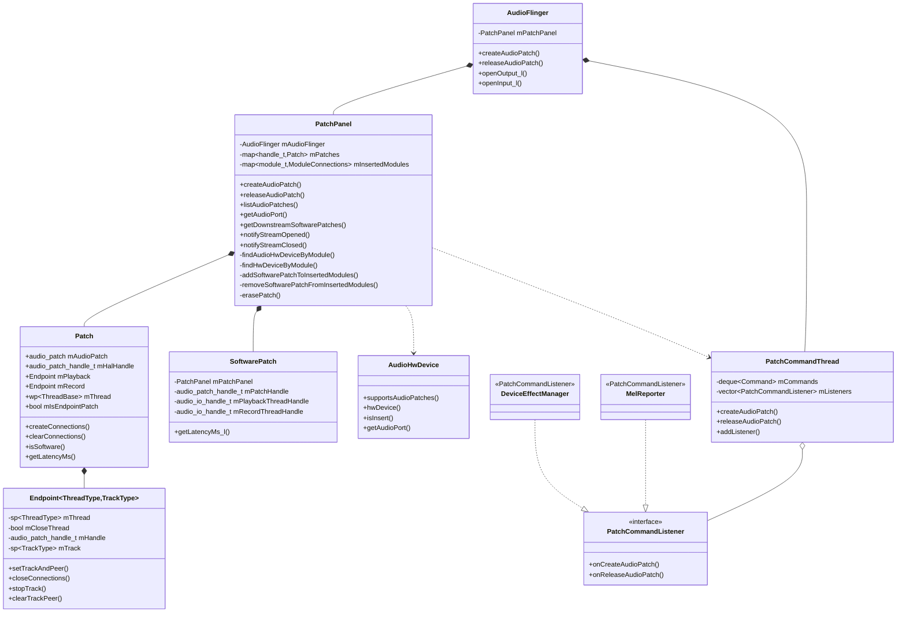
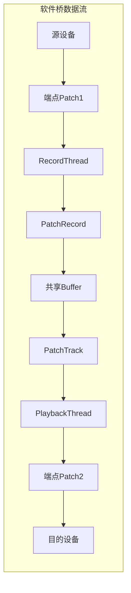
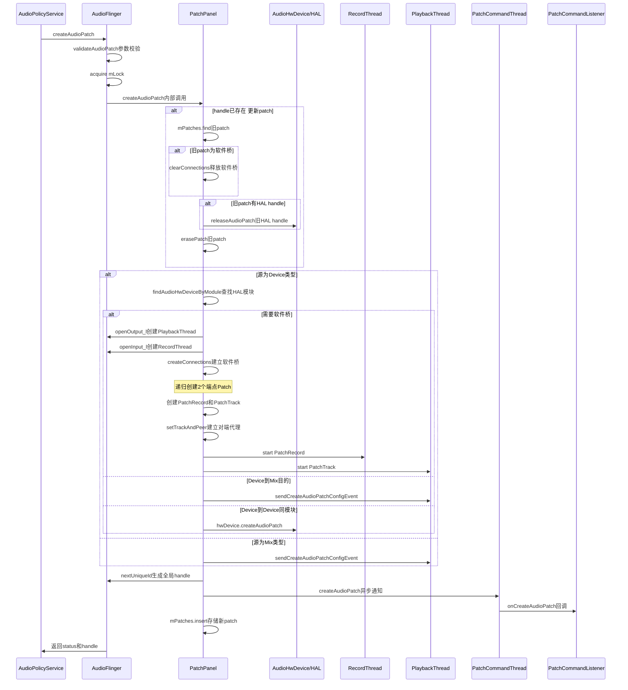
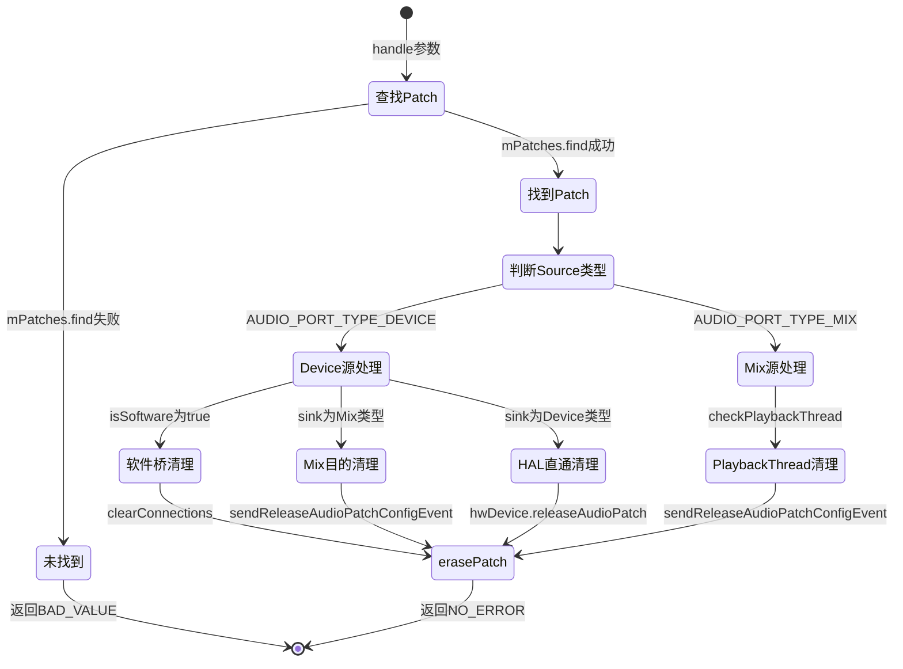
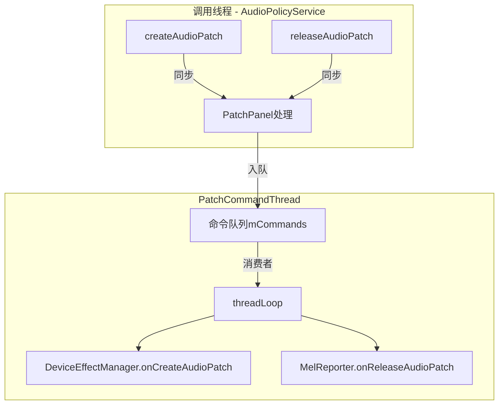
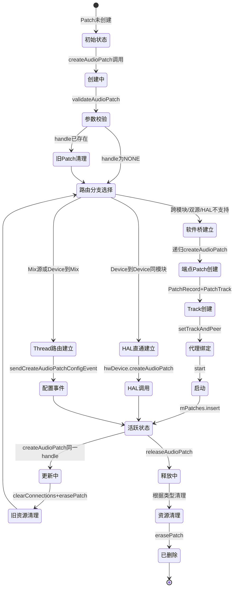

> [← 上一个](05_5.5_Buffer管理与共享内存.md) | [← 返回AudioFlinger](README.md) | [返回导航](../README.md) | [下一个 →](05_5.7_TrackRecord-音频流端点.md)

## 5.6 PatchPanel — 音频路由管理

### 5.6.1 概述

PatchPanel 是 AudioFlinger 中负责音频路由管理的核心组件。它管理音频端口之间的连接（Patch），将音频数据从源端口（Source）路由到目的端口（Sink）。Patch 机制是 Android 音频框架中实现设备路由、软件桥接和 HAL 直通的关键抽象。

**源码位置：**
- [`PatchPanel.h`](frameworks/av/services/audioflinger/PatchPanel.h) — 类定义与数据结构（10.9KB）
- [`PatchPanel.cpp`](frameworks/av/services/audioflinger/PatchPanel.cpp) — 核心实现（~950行）
- [`PatchCommandThread.h`](frameworks/av/services/audioflinger/PatchCommandThread.h) — 异步命令线程定义
- [`PatchCommandThread.cpp`](frameworks/av/services/audioflinger/PatchCommandThread.cpp) — 异步命令实现

PatchPanel 的生命周期与 AudioFlinger 完全一致，作为 AudioFlinger 的内部类存在，外部通过 AudioFlinger 的代理方法访问：

```cpp
// frameworks/av/services/audioflinger/PatchPanel.h:28
// PatchPanel is concealed within AudioFlinger, their lifetimes are the same.
class PatchPanel {
```

### 5.6.2 核心数据结构

#### 5.6.2.1 Patch 类 — 路由连接的完整表示

[`Patch`](frameworks/av/services/audioflinger/PatchPanel.h:138) 是 PatchPanel 中最核心的数据结构，代表一个完整的音频路由连接：

```cpp
// frameworks/av/services/audioflinger/PatchPanel.h:138-198
class Patch final {
public:
    Patch(const struct audio_patch &patch, bool endpointPatch) :
        mAudioPatch(patch), mIsEndpointPatch(endpointPatch) {}

    struct audio_patch              mAudioPatch;       // 音频补丁描述（来源/目的端口配置）
    audio_patch_handle_t            mHalHandle = AUDIO_PATCH_HANDLE_NONE; // HAL层patch句柄
    Endpoint<PlaybackThread, PlaybackThread::PatchTrack> mPlayback;  // 播放端点
    Endpoint<RecordThread, RecordThread::PatchRecord>   mRecord;    // 录音端点
    wp<ThreadBase>                  mThread;           // 关联的线程
    bool                            mIsEndpointPatch;  // 是否为端点patch（软件桥的一部分）
};
```

**关键字段解析：**

| 字段 | 类型 | 含义 |
|------|------|------|
| [`mAudioPatch`](frameworks/av/services/audioflinger/PatchPanel.h:191) | `struct audio_patch` | 包含sources和sinks数组，描述路由拓扑 |
| [`mHalHandle`](frameworks/av/services/audioflinger/PatchPanel.h:193) | `audio_patch_handle_t` | HAL 3.0+版本的patch句柄，用于直通模式 |
| [`mPlayback`](frameworks/av/services/audioflinger/PatchPanel.h:199) | `Endpoint<PlaybackThread, PatchTrack>` | 软件桥的播放端，仅在软件patch中使用 |
| [`mRecord`](frameworks/av/services/audioflinger/PatchPanel.h:201) | `Endpoint<RecordThread, PatchRecord>` | 软件桥的录音端，仅在软件patch中使用 |
| [`mThread`](frameworks/av/services/audioflinger/PatchPanel.h:203) | `wp<ThreadBase>` | 关联的线程弱引用 |
| [`mIsEndpointPatch`](frameworks/av/services/audioflinger/PatchPanel.h:204) | `bool` | 标识是否为软件桥的端点子patch |

**判断软件/硬件patch的关键方法：**

```cpp
// frameworks/av/services/audioflinger/PatchPanel.h:173
bool isSoftware() const {
    return mRecord.handle() != AUDIO_PATCH_HANDLE_NONE ||
            mPlayback.handle() != AUDIO_PATCH_HANDLE_NONE;
}
```

当 `mRecord` 或 `mPlayback` 端点具有有效句柄时，说明该patch涉及RecordThread到PlaybackThread的软件桥接。

#### 5.6.2.2 Endpoint 模板类 — 端点封装

[`Endpoint`](frameworks/av/services/audioflinger/PatchPanel.h:68) 是对软件桥端点的封装，将Thread、Track和Patch句柄统一管理：

```cpp
// frameworks/av/services/audioflinger/PatchPanel.h:68-130
template<typename ThreadType, typename TrackType>
class Endpoint final {
    sp<ThreadType> mThread;                          // 关联的播放/录音线程
    bool mCloseThread = true;                        // 清理时是否关闭线程
    bool mClearPeerProxy = true;                     // 清理时是否清除对端代理
    audio_patch_handle_t mHandle = AUDIO_PATCH_HANDLE_NONE; // 子patch句柄
    sp<TrackType> mTrack;                            // PatchTrack或PatchRecord
};
```

`Endpoint` 提供了完整的生命周期管理：
- [`setTrackAndPeer()`](frameworks/av/services/audioflinger/PatchPanel.h:106) — 设置Track并建立对端代理连接
- [`closeConnections()`](frameworks/av/services/audioflinger/PatchPanel.h:88) — 释放子patch并删除Track
- [`stopTrack()`](frameworks/av/services/audioflinger/PatchPanel.h:113) — 停止Track运行
- [`clearTrackPeer()`](frameworks/av/services/audioflinger/PatchPanel.h:114) — 清除对端代理引用

#### 5.6.2.3 SoftwarePatch 类 — 软件桥信息查询

[`SoftwarePatch`](frameworks/av/services/audioflinger/PatchPanel.h:31) 提供对已建立软件桥的只读查询接口：

```cpp
// frameworks/av/services/audioflinger/PatchPanel.h:31-53
class SoftwarePatch {
    const PatchPanel &mPatchPanel;
    const audio_patch_handle_t mPatchHandle;           // 所属patch句柄
    const audio_io_handle_t mPlaybackThreadHandle;     // 播放线程IO句柄
    const audio_io_handle_t mRecordThreadHandle;       // 录音线程IO句柄
};
```

#### 5.6.2.4 mPatches 映射表 — 全局Patch存储

```cpp
// frameworks/av/services/audioflinger/PatchPanel.h:213
std::map<audio_patch_handle_t, Patch> mPatches;
```

所有活跃的Patch以 `audio_patch_handle_t` 为键存储在此映射中。Handle 由 [`nextUniqueId()`](frameworks/av/services/audioflinger/PatchPanel.cpp:456) 生成，使用 `AUDIO_UNIQUE_ID_USE_PATCH` 类型确保全局唯一。

#### 5.6.2.5 ModuleConnections — 插入模块追踪

```cpp
// frameworks/av/services/audioflinger/PatchPanel.h:223-228
struct ModuleConnections {
    std::set<audio_io_handle_t> streams;       // 模块上的活跃流
    std::set<audio_patch_handle_t> sw_patches;  // 关联的软件patch
};
std::map<audio_module_handle_t, ModuleConnections> mInsertedModules;
```

用于追踪音频处理模块（Effect Processing Module）的流和软件patch关联关系，支持从MixerThread查找下游软件patch。

### 5.6.3 类关系图



### 5.6.4 Software Patch vs Hardware Patch

PatchPanel 管理的音频路由分为两种根本不同的模式：Software Patch（软件桥）和 Hardware Patch（HAL直通）。两者在数据路径、延迟特征和资源占用上存在显著差异。

#### 5.6.4.1 判断条件源码解析

软件桥的触发条件在 [`createAudioPatch()`](frameworks/av/services/audioflinger/PatchPanel.cpp:238) 中明确定义：

```cpp
// frameworks/av/services/audioflinger/PatchPanel.cpp:238-241
if ((patch->num_sources == 2) ||
    ((patch->sinks[0].type == AUDIO_PORT_TYPE_DEVICE) &&
     ((patch->sinks[0].ext.device.hw_module != srcModule) ||
      !audioHwDevice->supportsAudioPatches()))) {
```

**触发软件桥的三种情况：**

| 条件 | 场景 | 说明 |
|------|------|------|
| `num_sources == 2` | 电话双源路由 | 第一个source为Device（如MIC），第二个source为Mix（现有输出流） |
| `sink.hw_module != srcModule` | 跨HAL模块路由 | 源设备与目的设备属于不同的HAL模块，无法在同一HAL内直通 |
| `!supportsAudioPatches()` | HAL不支持patch | HAL版本低于3.0或HAL实现不支持createAudioPatch接口 |

#### 5.6.4.2 Hardware Patch — HAL直通模式

当源和目的在同一HAL模块且HAL支持patch接口时，直接调用HAL的 [`createAudioPatch()`](frameworks/av/services/audioflinger/PatchPanel.cpp:377)：

```cpp
// frameworks/av/services/audioflinger/PatchPanel.cpp:376-382
sp<DeviceHalInterface> hwDevice = audioHwDevice->hwDevice();
status = hwDevice->createAudioPatch(patch->num_sources,
                                    patch->sources,
                                    patch->num_sinks,
                                    patch->sinks,
                                    &halHandle);
```

此时音频数据在HAL层内部路由，不经过AudioFlinger的软件处理，延迟最低。

**另一种硬件路由模式 — Mix源到Device目的：**

当source是 `AUDIO_PORT_TYPE_MIX`（即PlaybackThread/MmapThread），sink是 `AUDIO_PORT_TYPE_DEVICE` 时，路由通过Thread的 [`sendCreateAudioPatchConfigEvent()`](frameworks/av/services/audioflinger/PatchPanel.cpp:430) 异步完成：

```cpp
// frameworks/av/services/audioflinger/PatchPanel.cpp:429-434
mAudioFlinger.unlock();
status = thread->sendCreateAudioPatchConfigEvent(patch, &halHandle);
mAudioFlinger.lock();
if (status == NO_ERROR) {
    newPatch.setThread(thread);
}
```

这里需要临时释放 `AudioFlinger::mLock` 以避免死锁（Thread Loop可能需要获取mLock来处理配置事件）。

#### 5.6.4.3 Software Patch — 软件桥接模式

软件桥本质上是在AudioFlinger内部建立一条 RecordThread → PlaybackThread 的数据管道：

```
源设备(HAL输入) → RecordThread → PatchRecord → PatchTrack → PlaybackThread → 目的设备(HAL输出)
```

软件桥需要创建三个层次的连接：
1. **端点Patch**：源设备到RecordThread的HAL patch（endpoint #1）
2. **端点Patch**：PlaybackThread到目的设备的HAL patch（endpoint #2）
3. **内部桥接**：PatchRecord与PatchTrack通过共享buffer直接连接



### 5.6.5 createAudioPatch 源码深度解析

#### 5.6.5.1 整体流程时序图



#### 5.6.5.2 入口校验与旧Patch清理

[`createAudioPatch()`](frameworks/av/services/audioflinger/PatchPanel.cpp:135) 首先执行参数校验：

```cpp
// frameworks/av/services/audioflinger/PatchPanel.cpp:143-158
if (handle == NULL || patch == NULL) {
    return BAD_VALUE;
}
if (!audio_patch_is_valid(patch) || (patch->num_sinks == 0 && patch->num_sources != 2)) {
    return BAD_VALUE;
}
// 限制source数量为1，特殊跨模块场景允许2个
if (patch->num_sources > 2) {
    return INVALID_OPERATION;
}
```

**特殊情况**：`num_sinks == 0 && num_sources == 2` 是电话场景的特殊patch，只有2个source没有sink，由AudioPolicyManager专用。

当传入的 `*handle` 已经有值时，表示需要更新现有patch。此时必须先清理旧patch的资源：

```cpp
// frameworks/av/services/audioflinger/PatchPanel.cpp:160-201
if (*handle != AUDIO_PATCH_HANDLE_NONE) {
    auto iter = mPatches.find(*handle);
    if (iter != mPatches.end()) {
        Patch &removedPatch = iter->second;
        // 1) 软件桥：释放Playback和Record线程及Track
        if (removedPatch.isSoftware()) {
            removedPatch.clearConnections(this);
        }
        // 2) 跨模块HAL patch：立即释放，因为新patch可能在另一个HAL模块
        if (removedPatch.mHalHandle != AUDIO_PATCH_HANDLE_NONE) {
            // 检查source/sink是否跨模块变化
            sp<DeviceHalInterface> hwDevice = findHwDeviceByModule(hwModule);
            if (hwDevice != 0) {
                hwDevice->releaseAudioPatch(removedPatch.mHalHandle);
            }
        }
        erasePatch(*handle);
    }
}
```

**跨模块HAL handle清理策略**：如果新旧patch的source或sink属于不同HAL模块，旧HAL patch必须先释放，因为后续的 `createAudioPatch()` 调用将在不同模块上执行。

#### 5.6.5.3 Device源路由分支详解

当 `patch->sources[0].type == AUDIO_PORT_TYPE_DEVICE` 时，进入设备源路由分支（[第208行](frameworks/av/services/audioflinger/PatchPanel.cpp:208)）。此分支有三种子路径：

**路径1：软件桥（跨模块/双源/HAL不支持）**

这是最复杂的路径，在 [第238-348行](frameworks/av/services/audioflinger/PatchPanel.cpp:238) 处理：

1. **双源场景**（`num_sources == 2`）：复用现有PlaybackThread
   ```cpp
   // frameworks/av/services/audioflinger/PatchPanel.cpp:252-261
   sp<ThreadBase> thread =
       mAudioFlinger.checkPlaybackThread_l(patch->sources[1].ext.mix.handle);
   newPatch.mPlayback.setThread(
       reinterpret_cast<PlaybackThread*>(thread.get()), false /*closeThread*/);
   ```
   注意 `closeThread=false`，因为线程是复用的，清除patch时不应该关闭它。

2. **跨模块场景**：创建新的PlaybackThread
   ```cpp
   // frameworks/av/services/audioflinger/PatchPanel.cpp:279-292
   sp<ThreadBase> thread = mAudioFlinger.openOutput_l(
       patch->sinks[0].ext.device.hw_module, &output, &config, &mixerConfig,
       outputDevice, outputDeviceAddress, flags);
   newPatch.mPlayback.setThread(reinterpret_cast<PlaybackThread*>(thread.get()));
   ```
   此处 `closeThread=true`（默认），因为线程是新建的。

3. **打开RecordThread**：根据源设备或PlaybackThread属性配置
   ```cpp
   // frameworks/av/services/audioflinger/PatchPanel.cpp:326-334
   sp<ThreadBase> thread = mAudioFlinger.openInput_l(srcModule,
       &input, &config, device, address, source, flags,
       outputDevice, outputDeviceAddress);
   ```

4. **电话场景source设置**：
   ```cpp
   // frameworks/av/services/audioflinger/PatchPanel.cpp:321-325
   if (patch->num_sources == 2
       && patch->sources[1].ext.mix.usecase.stream == AUDIO_STREAM_VOICE_CALL) {
       source = AUDIO_SOURCE_VOICE_COMMUNICATION;
   }
   ```

**路径2：Device到Mix（录音流）**

```cpp
// frameworks/av/services/audioflinger/PatchPanel.cpp:350-374
sp<ThreadBase> thread = mAudioFlinger.checkRecordThread_l(patch->sinks[0].ext.mix.handle);
if (thread == 0) {
    thread = mAudioFlinger.checkMmapThread_l(patch->sinks[0].ext.mix.handle);
}
mAudioFlinger.unlock();
status = thread->sendCreateAudioPatchConfigEvent(patch, &halHandle);
mAudioFlinger.lock();
```

注意在调用 `sendCreateAudioPatchConfigEvent` 前后需要释放/重获mLock，避免死锁。

**路径3：Device到Device同模块（HAL直通）**

```cpp
// frameworks/av/services/audioflinger/PatchPanel.cpp:376-382
sp<DeviceHalInterface> hwDevice = audioHwDevice->hwDevice();
status = hwDevice->createAudioPatch(patch->num_sources, patch->sources,
                                    patch->num_sinks, patch->sinks, &halHandle);
```

#### 5.6.5.4 Mix源路由分支详解

当 `patch->sources[0].type == AUDIO_PORT_TYPE_MIX` 时（[第386行](frameworks/av/services/audioflinger/PatchPanel.cpp:386)），这是最常见的播放路由场景：

```cpp
// frameworks/av/services/audioflinger/PatchPanel.cpp:414-447
sp<ThreadBase> thread = mAudioFlinger.checkPlaybackThread_l(patch->sources[0].ext.mix.handle);
if (thread == 0) {
    thread = mAudioFlinger.checkMmapThread_l(patch->sources[0].ext.mix.handle);
}

// 主播放线程需要更新录音线程的输出设备
if (thread == mAudioFlinger.primaryPlaybackThread_l()) {
    mAudioFlinger.updateOutDevicesForRecordThreads_l(devices);
}

mAudioFlinger.unlock();
status = thread->sendCreateAudioPatchConfigEvent(patch, &halHandle);
mAudioFlinger.lock();
```

**去除陈旧Patch**：创建新patch后，需要移除同一线程上的旧patch，但保留端点patch：

```cpp
// frameworks/av/services/audioflinger/PatchPanel.cpp:439-447
if (!endpointPatch) {
    for (auto& iter : mPatches) {
        if (iter.second.mAudioPatch.sources[0].ext.mix.handle == thread->id() &&
                !iter.second.mIsEndpointPatch) {
            erasePatch(iter.first);
            break;
        }
    }
}
```

`mIsEndpointPatch` 检查确保不会误删软件桥的端点子patch。

#### 5.6.5.5 成功退出与Patch注册

所有分支最终汇聚到 `exit` 标签（[第453行](frameworks/av/services/audioflinger/PatchPanel.cpp:453)）：

```cpp
// frameworks/av/services/audioflinger/PatchPanel.cpp:453-466
exit:
    if (status == NO_ERROR) {
        *handle = (audio_patch_handle_t) mAudioFlinger.nextUniqueId(AUDIO_UNIQUE_ID_USE_PATCH);
        newPatch.mHalHandle = halHandle;
        mAudioFlinger.mPatchCommandThread->createAudioPatch(*handle, newPatch);
        if (insertedModule != AUDIO_MODULE_HANDLE_NONE) {
            addSoftwarePatchToInsertedModules(insertedModule, *handle, &newPatch.mAudioPatch);
        }
        mPatches.insert(std::make_pair(*handle, std::move(newPatch)));
    } else {
        newPatch.clearConnections(this);
    }
```

成功路径的四个关键步骤：
1. 生成全局唯一的 `audio_patch_handle_t`
2. 保存HAL handle到 `mHalHandle`
3. 通过 `PatchCommandThread` 异步通知监听者
4. 将Patch存入 `mPatches` 映射

失败时，调用 `clearConnections()` 清理已创建的线程和Track资源。

### 5.6.6 createConnections — 软件桥建立核心

[`Patch::createConnections()`](frameworks/av/services/audioflinger/PatchPanel.cpp:475) 是软件桥建立的核心方法，实现RecordThread与PlaybackThread之间的数据通道：

#### 5.6.6.1 递归创建端点Patch

软件桥的建立是递归的——它调用 `PatchPanel::createAudioPatch()` 创建两个子patch：

```cpp
// frameworks/av/services/audioflinger/PatchPanel.cpp:478-500
// 端点1：源设备 → RecordThread输入
status = panel->createAudioPatch(
    PatchBuilder().addSource(mAudioPatch.sources[0]).
        addSink(mRecord.thread(), { .source = AUDIO_SOURCE_MIC }).patch(),
    mRecord.handlePtr(),
    true /*endpointPatch*/);

// 端点2：PlaybackThread输出 → 目的设备
if (mAudioPatch.num_sinks != 0) {
    status = panel->createAudioPatch(
        PatchBuilder().addSource(mPlayback.thread()).addSink(mAudioPatch.sinks[0]).patch(),
        mPlayback.handlePtr(),
        true /*endpointPatch*/);
}
```

关键点：`endpointPatch=true` 标识这些是软件桥的端点子patch，在后续路由更新中不会被误删。

#### 5.6.6.2 PatchRecord与PatchTrack的创建

软件桥的数据传输依赖于一对特殊Track：`PatchRecord`（在RecordThread端）和 `PatchTrack`（在PlaybackThread端）。

**PassthruPatchRecord优化**：当输入和输出都是DIRECT模式时，使用 [`PassthruPatchRecord`](frameworks/av/services/audioflinger/RecordTracks.h:168)：

```cpp
// frameworks/av/services/audioflinger/PatchPanel.cpp:550-568
const bool usePassthruPatchRecord =
    (inputFlags & AUDIO_INPUT_FLAG_DIRECT) && (outputFlags & AUDIO_OUTPUT_FLAG_DIRECT);
if (usePassthruPatchRecord) {
    frameCount = std::max(playbackFrameCount, recordFrameCount);
    tempRecordTrack = new RecordThread::PassthruPatchRecord(...);
} else {
    // 使用伪LCM计算frameCount
    frameCount = (playbackFrameCount * recordFrameCount) >> shift;
    tempRecordTrack = new RecordThread::PatchRecord(...);
}
```

`PassthruPatchRecord` 的特点是按需产生数据（producesBufferOnDemand），其I/O完全由PlaybackThread驱动，RecordThread不参与实际I/O，这降低了直通模式的延迟。

**Fast Track优化**：当条件满足时，自动启用fast模式：

```cpp
// frameworks/av/services/audioflinger/PatchPanel.cpp:517-527
if (sampleRate == mRecord.thread()->sampleRate() &&
        inChannelMask == mRecord.thread()->channelMask() &&
        mRecord.thread()->fastTrackAvailable() &&
        mRecord.thread()->hasFastCapture()) {
    inputFlags = (audio_input_flags_t) (inputFlags | AUDIO_INPUT_FLAG_FAST);
}
```

#### 5.6.6.3 Track对端代理绑定

`PatchRecord` 和 `PatchTrack` 通过共享buffer和对端代理（PeerProxy）建立零拷贝数据通道：

```cpp
// frameworks/av/services/audioflinger/PatchPanel.cpp:629-634
mRecord.setTrackAndPeer(tempRecordTrack, tempPatchTrack, !usePassthruPatchRecord);
mPlayback.setTrackAndPeer(tempPatchTrack, tempRecordTrack, true /*holdReference*/);

// 启动采集和播放
mRecord.track()->start(AudioSystem::SYNC_EVENT_NONE, AUDIO_SESSION_NONE);
mPlayback.track()->start();
```

**PassthruPatchRecord的特殊处理**：第三个参数 `holdReference` 为 `false`，因为Passthru模式由PlaybackThread驱动，不需要RecordThread持有PatchTrack引用，也不需要清除peer proxy。

### 5.6.7 releaseAudioPatch 源码深度解析

[`releaseAudioPatch()`](frameworks/av/services/audioflinger/PatchPanel.cpp:737) 负责释放指定handle的Patch资源：



#### 5.6.7.1 erasePatch — 资源清理核心

[`erasePatch()`](frameworks/av/services/audioflinger/PatchPanel.cpp:814) 是Patch删除的最终汇聚点：

```cpp
// frameworks/av/services/audioflinger/PatchPanel.cpp:814-818
void AudioFlinger::PatchPanel::erasePatch(audio_patch_handle_t handle) {
    mPatches.erase(handle);
    removeSoftwarePatchFromInsertedModules(handle);
    mAudioFlinger.mPatchCommandThread->releaseAudioPatch(handle);
}
```

三步操作：
1. 从 `mPatches` 映射中移除Patch对象
2. 从所有 `mInsertedModules` 中清除该handle
3. 通过 `PatchCommandThread` 异步通知监听者patch已释放

#### 5.6.7.2 clearConnections — 软件桥连接清理

[`Patch::clearConnections()`](frameworks/av/services/audioflinger/PatchPanel.cpp:639) 清理软件桥的资源：

```cpp
// frameworks/av/services/audioflinger/PatchPanel.cpp:639-648
void AudioFlinger::PatchPanel::Patch::clearConnections(PatchPanel *panel) {
    mRecord.stopTrack();
    mPlayback.stopTrack();
    mRecord.clearTrackPeer(); // 打破PeerProxy的sp<>循环引用
    mRecord.closeConnections(panel);
    mPlayback.closeConnections(panel);
}
```

`clearTrackPeer()` 的调用顺序很重要：Record端stop是同步的，所以先清除peer proxy打破循环引用；Playback端stop是异步的，由 `mClearPeerProxy` 标志控制。

`Endpoint::closeConnections()` 执行的具体操作：

```cpp
// frameworks/av/services/audioflinger/PatchPanel.h:88-98
void closeConnections(PatchPanel *panel) {
    if (mHandle != AUDIO_PATCH_HANDLE_NONE) {
        panel->releaseAudioPatch(mHandle);  // 递归释放端点子patch
        mHandle = AUDIO_PATCH_HANDLE_NONE;
    }
    if (mThread != 0) {
        if (mTrack != 0) {
            mThread->deletePatchTrack(mTrack);  // 从线程删除PatchTrack/Record
        }
        if (mCloseThread) {
            panel->mAudioFlinger.closeThreadInternal_l(mThread);  // 关闭线程（仅新建线程）
        }
    }
}
```

注意 `releaseAudioPatch(mHandle)` 会递归调用 `PatchPanel::releaseAudioPatch()`，因为端点子patch本身也是注册在 `mPatches` 中的。

### 5.6.8 PatchCommandThread 异步命令处理

#### 5.6.8.1 设计动机

[`PatchCommandThread`](frameworks/av/services/audioflinger/PatchCommandThread.h:25) 的引入是为了解决一个关键的死锁问题：

```
// frameworks/av/services/audioflinger/PatchCommandThread.h:24-26
// Thread to execute create and release patch commands asynchronously.
// This is needed because PatchPanel::createAudioPatch and releaseAudioPatch
// are executed from audio policy service with mutex locked and effect
// management requires to call back into audio policy service
```

AudioPolicyService 在持有自身锁的情况下调用 `AudioFlinger::createAudioPatch()`，而音频效果管理（如DeviceEffectManager）需要在patch创建/释放时回调AudioPolicyService获取效果链配置。如果同步执行，会形成 APS锁 → AF锁 → APS锁 的死锁。

#### 5.6.8.2 命令处理模型



**命令数据结构：**

```cpp
// frameworks/av/services/audioflinger/PatchCommandThread.h:77-80
class CreateAudioPatchData : public CommandData {
    const audio_patch_handle_t mHandle;
    const PatchPanel::Patch mPatch;
};

class ReleaseAudioPatchData : public CommandData {
    audio_patch_handle_t mHandle;
};
```

**命令入队流程：**

```cpp
// frameworks/av/services/audioflinger/PatchCommandThread.cpp:136-145
void AudioFlinger::PatchCommandThread::createAudioPatchCommand(
        audio_patch_handle_t handle, const PatchPanel::Patch& patch) {
    auto command = sp<Command>::make(CREATE_AUDIO_PATCH,
                                     new CreateAudioPatchData(handle, patch));
    sendCommand(command);
}
```

**命令消费流程：**

```cpp
// frameworks/av/services/audioflinger/PatchCommandThread.cpp:66-100
case CREATE_AUDIO_PATCH: {
    const auto data = (CreateAudioPatchData*) command->mData.get();
    for (const auto& listener : listenersCopy) {
        auto spListener = listener.promote();
        if (spListener) {
            spListener->onCreateAudioPatch(data->mHandle, data->mPatch);
        }
    }
    break;
}
```

#### 5.6.8.3 PatchCommandListener 监听者

当前系统中有两个 `PatchCommandListener` 的实现：

1. **[`DeviceEffectManager`](frameworks/av/services/audioflinger/DeviceEffectManager.h:23)** — 在patch创建/释放时管理设备效果链的绑定与解绑
2. **[`MelReporter`](frameworks/av/services/audioflinger/MelReporter.h:32)** — 在patch创建/释放时更新MEL（Maximum Exposure Level）声压暴露报告

这两个监听者的回调在 `PatchCommandThread` 线程中执行，避免了在AudioPolicyService的调用上下文中直接回调导致的死锁。

### 5.6.9 Patch与AudioPolicyService的协作

#### 5.6.9.1 调用链路

AudioPolicyService 是 Patch 的主要调用者，调用链路如下：

```
AudioPolicyManager.createAudioPatchInternal()
  → AudioPolicyService.AudioPolicyClient.createAudioPatch()
    → AudioPolicyService.AudioCommandThread.createAudioPatchCommand()  // APS侧异步
      → AudioFlinger.createAudioPatch()                                // 同步调用
        → PatchPanel.createAudioPatch()                                // 核心处理
```

AudioPolicyService 通过 `AudioCommandThread` 将patch操作异步化（在APS侧），避免在策略计算过程中阻塞。而AudioFlinger侧的 `PatchPanel::createAudioPatch()` 是同步执行的。

#### 5.6.9.2 Patch Handle的生命周期管理

```
AudioPolicyManager:  分配handle → 多次createAudioPatch(同一handle) → releaseAudioPatch(handle)
                                ↑                                   ↑
                          首次创建                           更新或释放
```

- **首次创建**：`*handle == AUDIO_PATCH_HANDLE_NONE`，PatchPanel分配新handle
- **更新路由**：`*handle` 已有值，先清理旧patch再创建新patch
- **释放**：调用 `releaseAudioPatch(handle)` 完全移除

#### 5.6.9.3 mInsertedModules与下游Patch查找

`mInsertedModules` 用于解决音频处理模块插入后的patch关联问题。典型拓扑如下：

```
[MixerThread] → [虚拟输出设备] → [处理模块] ──┐
     [硬件模块] ← [物理输出设备] ← [SW Patch] ←┘
```

当MixerThread需要查找下游软件patch（用于传播时序信息、参数等），通过 [`getDownstreamSoftwarePatches()`](frameworks/av/services/audioflinger/PatchPanel.cpp:828) 查询：

```cpp
// frameworks/av/services/audioflinger/PatchPanel.cpp:828-850
status_t PatchPanel::getDownstreamSoftwarePatches(
        audio_io_handle_t stream, std::vector<SoftwarePatch> *patches) const {
    for (const auto& module : mInsertedModules) {
        if (module.second.streams.count(stream)) {
            for (const auto& patchHandle : module.second.sw_patches) {
                const auto& patch_iter = mPatches.find(patchHandle);
                if (patch_iter != mPatches.end()) {
                    const Patch &patch = patch_iter->second;
                    patches->emplace_back(*this, patchHandle,
                            patch.mPlayback.const_thread()->id(),
                            patch.mRecord.const_thread()->id());
                }
            }
            return OK;
        }
    }
    return BAD_VALUE;
}
```

**流通知机制**：

- [`notifyStreamOpened()`](frameworks/av/services/audioflinger/PatchPanel.cpp:852) — 当流在插入模块上打开时，注册stream handle并更新下游patch
- [`notifyStreamClosed()`](frameworks/av/services/audioflinger/PatchPanel.cpp:870) — 当流关闭时，从所有模块中移除stream handle

### 5.6.10 Patch延迟计算

[`Patch::getLatencyMs()`](frameworks/av/services/audioflinger/PatchPanel.cpp:650) 计算软件桥的端到端延迟，采用两级策略：

**第一级：PCM Track的Server延迟**

```cpp
// frameworks/av/services/audioflinger/PatchPanel.cpp:669-676
if (audio_is_linear_pcm(recordTrack->format())) {
    double recordServerLatencyMs, playbackTrackLatencyMs;
    if (recordTrack->getServerLatencyMs(&recordServerLatencyMs) == OK
            && playbackTrack->getTrackLatencyMs(&playbackTrackLatencyMs) == OK) {
        *latencyMs = recordServerLatencyMs + playbackTrackLatencyMs;
        return OK;
    }
}
```

**第二级：内核帧时间戳估算**

```cpp
// frameworks/av/services/audioflinger/PatchPanel.cpp:682-704
ThreadBase::TrackBase::FrameTime recordFT{}, playFT{};
recordTrack->getKernelFrameTime(&recordFT);
playbackTrack->getKernelFrameTime(&playFT);
if (recordFT.timeNs > 0 && playFT.timeNs > 0) {
    const int64_t frameDiff = recordFT.frames - playFT.frames;
    const int64_t timeDiffNs = recordFT.timeNs - playFT.timeNs;
    constexpr int64_t maxValidTimeDiffNs = 200 * NANOS_PER_MILLISECOND;
    if (std::abs(timeDiffNs) < maxValidTimeDiffNs) {
        *latencyMs = frameDiff * 1e3 / recordTrack->sampleRate()
               - timeDiffNs * 1e-6;
        return OK;
    }
}
```

内核帧时间戳方法的限制：两个时间戳采样必须足够接近（< 200ms），否则认为延迟估算不可靠。

### 5.6.11 状态机总结



### 5.6.12 Dump调试信息

[`PatchPanel::dump()`](frameworks/av/services/audioflinger/PatchPanel.cpp:912) 输出当前所有patch和插入模块的状态，可通过 `dumpsys media.audio_flinger` 查看：

```
Patches:
  Patch 123: Software bridge between (thread 0x7a1c2d0000 => thread 0x7a1c3e0000)
    thread 0x7a1c1f0000 num sinks 1 first device type 00000002  latency: 12.50 ms
  Patch 456: No software bridge
    thread 0x7a1c1f0000 num sources 1 first device type 40000000

Tracked inserted modules:
  Module 3: I/O handles: 17 23 ; SW Patches: 123
```

每个Patch的信息包括：
- 是否为软件桥（Software bridge / No software bridge）
- Record线程和Playback线程地址
- 关联线程地址、设备数量和类型
- 软件桥延迟（如果可计算）

### 5.6.13 关键设计总结

| 设计要点 | 实现方式 | 源码位置 |
|----------|----------|----------|
| 软件桥判断 | `mRecord/mPlayback.handle != NONE` | [`PatchPanel.h:173`](frameworks/av/services/audioflinger/PatchPanel.h:173) |
| HAL直通 | `hwDevice->createAudioPatch()` | [`PatchPanel.cpp:377`](frameworks/av/services/audioflinger/PatchPanel.cpp:377) |
| Thread路由 | `sendCreateAudioPatchConfigEvent()` | [`PatchPanel.cpp:430`](frameworks/av/services/audioflinger/PatchPanel.cpp:430) |
| 跨模块软件桥 | `openOutput_l` + `openInput_l` + `createConnections` | [`PatchPanel.cpp:279-345`](frameworks/av/services/audioflinger/PatchPanel.cpp:279) |
| 端点子Patch | `endpointPatch=true`防止误删 | [`PatchPanel.cpp:482`](frameworks/av/services/audioflinger/PatchPanel.cpp:482) |
| 死锁避免 | mLock释放后调用Thread配置事件 | [`PatchPanel.cpp:429`](frameworks/av/services/audioflinger/PatchPanel.cpp:429) |
| 异步通知 | `PatchCommandThread`解耦效果回调 | [`PatchCommandThread.h:25`](frameworks/av/services/audioflinger/PatchCommandThread.h:25) |
| 直通优化 | `PassthruPatchRecord`按需产生 | [`PatchPanel.cpp:550`](frameworks/av/services/audioflinger/PatchPanel.cpp:550) |
| Fast Track | 采样率/通道/格式匹配时启用 | [`PatchPanel.cpp:517`](frameworks/av/services/audioflinger/PatchPanel.cpp:517) |
| 延迟估算 | Server延迟优先，内核帧时间戳备选 | [`PatchPanel.cpp:650`](frameworks/av/services/audioflinger/PatchPanel.cpp:650) |
| 共享Buffer | PatchTrack直接使用PatchRecord的buffer | [`PatchPanel.cpp:612`](frameworks/av/services/audioflinger/PatchPanel.cpp:612) |
| 插入模块追踪 | `mInsertedModules`建立stream-patch关联 | [`PatchPanel.h:223`](frameworks/av/services/audioflinger/PatchPanel.h:223) |

> **下一个**：[5.7 TrackRecord — 音频流端点](05_5.7_TrackRecord-音频流端点.md)