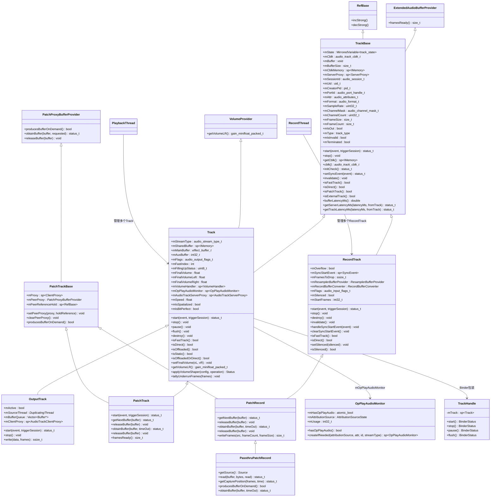
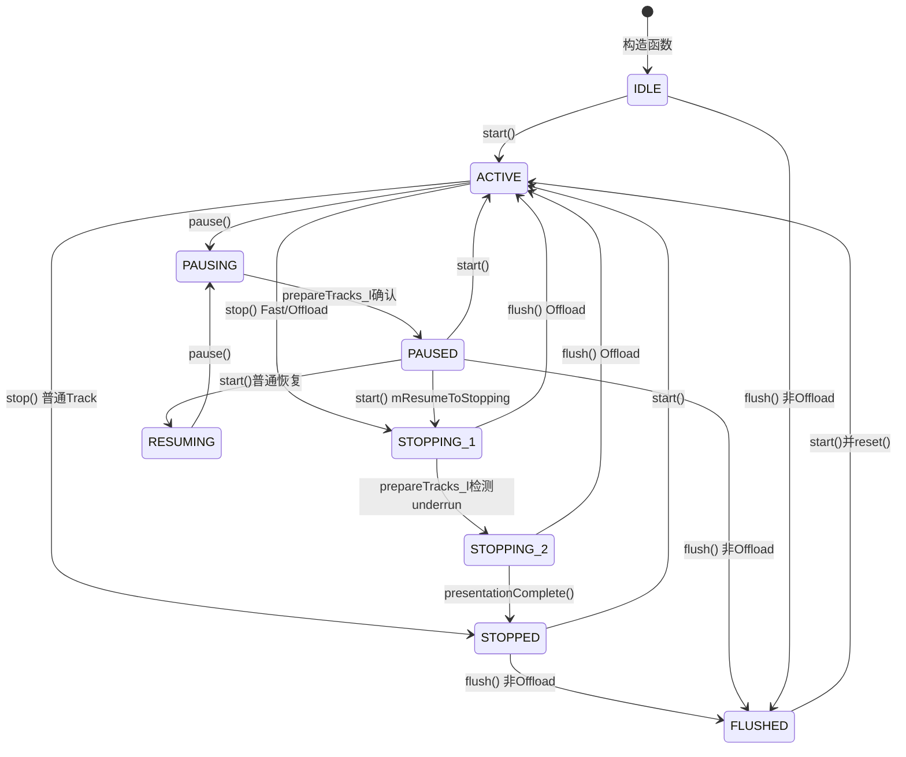
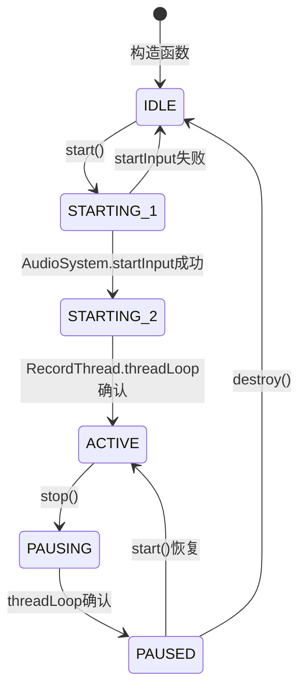
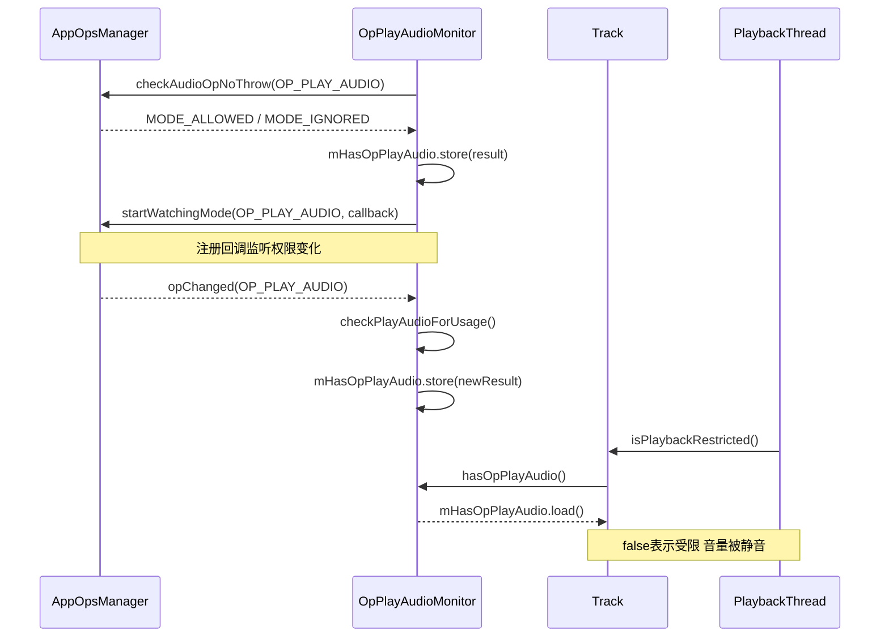
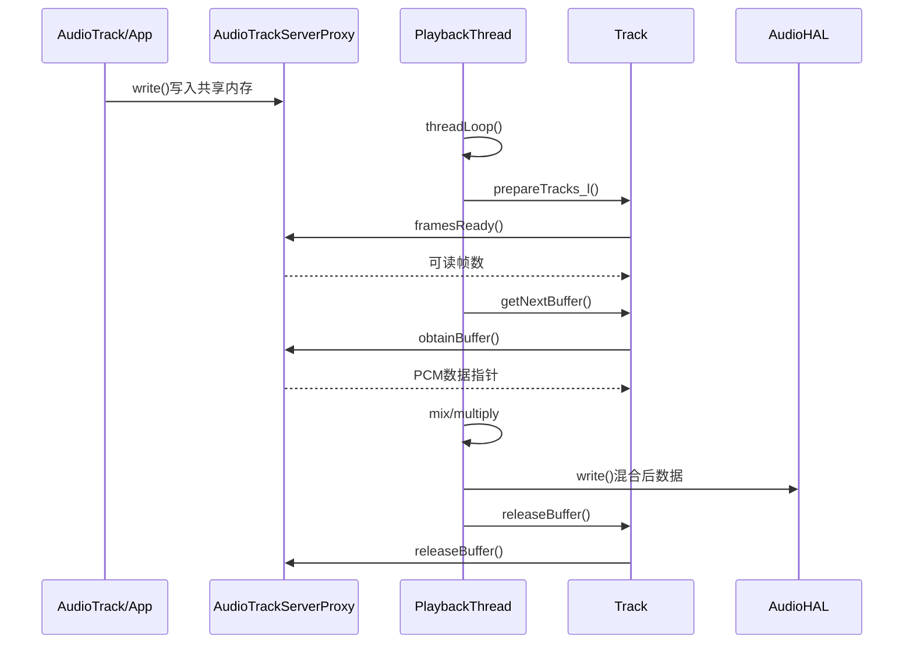

> [← 上一个](05_5.6_PatchPanel-音频路由管理.md) | [← 返回AudioFlinger](README.md) | [返回导航](../README.md) | [下一个 →](05_5.8_Thread继承体系与匹配规则.md)

## 5.7 Track/Record — 音频流端点

Track和RecordTrack是AudioFlinger中最核心的音频流端点抽象。Track是PlaybackThread内部的播放流端点，代表App侧AudioTrack在AudioFlinger的镜像；RecordTrack是RecordThread内部的录音流端点，代表App侧AudioRecord在AudioFlinger的镜像。它们通过共享内存与App进行PCM数据交换，通过状态机控制播放/录音生命周期。

### 5.7.1 类继承体系全景图



### 5.7.2 TrackBase基类深度解析

[`TrackBase`](frameworks/av/services/audioflinger/TrackBase.h:23) 继承自 `ExtendedAudioBufferProvider` 和 `RefBase`，是所有Track类型的公共基类，定义了音频流端点的核心数据结构和方法。

#### 类型枚举体系

**track_state 状态枚举** — 定义在 [`TrackBase.h:26`](frameworks/av/services/audioflinger/TrackBase.h:26)，控制Track生命周期：

| 枚举值 | 数值 | 适用范围 | 说明 |
|--------|------|----------|------|
| `IDLE` | 0 | 通用 | 初始空闲状态 |
| `FLUSHED` | 1 | 仅Playback | flush后的状态 |
| `STOPPED` | 2 | 通用 | 已停止 |
| `STOPPING_1` | 3 | Fast/Offload | 等待首次underrun |
| `STOPPING_2` | 4 | Fast/Offload | 等待播放完成 |
| `RESUMING` | 5 | 仅Playback | 从暂停恢复中 |
| `ACTIVE` | 6 | 通用 | 活跃播放/录音 |
| `PAUSING` | 7 | 仅Playback | 正在暂停 |
| `PAUSED` | 8 | 仅Playback | 已暂停 |
| `STARTING_1` | 9 | 仅Record | 等待startInput |
| `STARTING_2` | 10 | 仅Record | startInput完成，等待线程启动 |

**alloc_type 内存分配策略** — 定义在 [`TrackBase.h:43`](frameworks/av/services/audioflinger/TrackBase.h:43)：

| 枚举值 | 说明 | 适用场景 |
|--------|------|----------|
| `ALLOC_CBLK` | 紧跟控制块之后分配 | 普通Track/RecordTrack默认策略 |
| `ALLOC_READONLY` | 从线程的只读堆分配 | Fast RecordTrack |
| `ALLOC_PIPE` | 不分配，使用pipe缓冲区 | Fast Track（流式） |
| `ALLOC_LOCAL` | 分配本地缓冲区 | PatchTrack/PatchRecord内部 |
| `ALLOC_NONE` | 不分配，使用构造函数传入的buffer | Static Track（mSharedBuffer非空时） |

**track_type 轨道类型** — 定义在 [`TrackBase.h:51`](frameworks/av/services/audioflinger/TrackBase.h:51)：

| 枚举值 | 说明 |
|--------|------|
| `TYPE_DEFAULT` | 外部App创建的普通Track |
| `TYPE_OUTPUT` | DuplicatingThread使用的OutputTrack |
| `TYPE_PATCH` | PatchPanel路由使用的PatchTrack/PatchRecord |

#### 核心成员变量

[`TrackBase`](frameworks/av/services/audioflinger/TrackBase.h:354) 的protected成员变量可分为以下几类：

**共享内存相关**：
- [`mCblk`](frameworks/av/services/audioflinger/TrackBase.h:357) (`audio_track_cblk_t*`) — 共享内存控制块指针，Server与Client通过此结构同步读写位置
- [`mCblkMemory`](frameworks/av/services/audioflinger/TrackBase.h:356) (`sp<IMemory>`) — 控制块所在共享内存的IMemory引用
- [`mBuffer`](frameworks/av/services/audioflinger/TrackBase.h:359) (`void*`) — PCM数据缓冲区起始地址，通常在共享内存中
- [`mBufferMemory`](frameworks/av/services/audioflinger/TrackBase.h:358) (`sp<IMemory>`) — 数据缓冲区所在共享内存的IMemory引用
- [`mBufferSize`](frameworks/av/services/audioflinger/TrackBase.h:361) — 数据缓冲区大小（字节）

**代理对象**：
- [`mServerProxy`](frameworks/av/services/audioflinger/TrackBase.h:380) (`sp<ServerProxy>`) — Server端代理，AudioFlinger通过此代理读取(Track)或写入(RecordTrack)共享内存

**状态管理**：
- [`mState`](frameworks/av/services/audioflinger/TrackBase.h:363) (`MirroredVariable<track_state>`) — Track状态，使用MirroredVariable确保多核可见性
- [`mIsInvalid`](frameworks/av/services/audioflinger/TrackBase.h:389) — 不可重置的失效锁存器，invalidate()设置后不再恢复
- [`mTerminated`](frameworks/av/services/audioflinger/TrackBase.h:385) — 终止标志

**音频参数**：
- [`mAttr`](frameworks/av/services/audioflinger/TrackBase.h:364) (`audio_attributes_t`) — 音频属性（usage、content_type、flags等）
- [`mSampleRate`](frameworks/av/services/audioflinger/TrackBase.h:365) — 初始采样率
- [`mFormat`](frameworks/av/services/audioflinger/TrackBase.h:367) — 音频格式
- [`mChannelMask`](frameworks/av/services/audioflinger/TrackBase.h:368) — 通道掩码
- [`mFrameSize`](frameworks/av/services/audioflinger/TrackBase.h:370) — AudioFlinger视角的帧大小（8-bit PCM存储为16-bit）
- [`mFrameCount`](frameworks/av/services/audioflinger/TrackBase.h:373) — 缓冲区帧数

**延迟计算体系**：
- [`mServerLatencySupported`](frameworks/av/services/audioflinger/TrackBase.h:406) — 是否支持服务端延迟计算
- [`mServerLatencyMs`](frameworks/av/services/audioflinger/TrackBase.h:408) (`atomic<double>`) — 服务端延迟（毫秒）
- [`mServerLatencyFromTrack`](frameworks/av/services/audioflinger/TrackBase.h:407) (`atomic<bool>`) — 延迟是否来自Track时间戳
- [`mKernelFrameTime`](frameworks/av/services/audioflinger/TrackBase.h:409) (`atomic<FrameTime>`) — 内核侧最新帧时间

#### 延迟计算方法

TrackBase提供了三层延迟计算体系：

1. **bufferLatencyMs()** — 缓冲区延迟：`framesReadySafe() * 1000 / sampleRate`
   - 静态Track（isStatic()）返回0，因为数据已在共享内存中
   - 流式Track返回当前缓冲区中未读/未写数据的时长

2. **getServerLatencyMs()** — 服务端延迟：从Track的下一帧到设备sink/source的时间
   - 由PlaybackThread/RecordThread在每次mix周期更新mServerLatencyMs
   - 可在无线程锁的情况下调用（使用atomic变量）

3. **getTrackLatencyMs()** — 客户端总延迟：`serverLatencyMs + bufferLatencyMs()`
   - 从Client App下一帧访问到设备sink/source的总时间

### 5.7.3 Track状态机详解

#### Playback Track状态转换



#### RecordTrack状态转换



关键状态说明：
- **STOPPING_1/STOPPING_2**：仅用于Fast Track和Offload Track。普通Track的stop()直接进入STOPPED，而Fast/Offload需要等待硬件完成播放
- **RESUMING**：从PAUSED恢复时的过渡状态，避免volume ramp
- **STARTING_1/STARTING_2**：RecordTrack特有的两阶段启动。STARTING_1表示正在调用startInput()，STARTING_2表示startInput()成功等待线程处理

### 5.7.4 Track核心方法源码解析

#### Track::start() — 启动播放

定义在 [`Tracks.cpp:1049`](frameworks/av/services/audioflinger/Tracks.cpp:1049)：

```cpp
status_t Track::start(AudioSystem::sync_event_t event, audio_session_t triggerSession) {
    // 1. Offload权限检查：如果全局非Offloadable效果链启用，则拒绝
    if (isOffloaded()) {
        Mutex::Autolock _laf(thread->mAudioFlinger->mLock);
        Mutex::Autolock _lth(thread->mLock);
        sp<EffectChain> ec = thread->getEffectChain_l(mSessionId);
        if (isNonOffloadableGlobalEffectEnabled_l() || (ec && ec->isNonOffloadableEnabled())) {
            invalidate();
            return PERMISSION_DENIED;
        }
    }
    Mutex::Autolock _lth(thread->mLock);
    // 2. 状态转换
    track_state state = mState;
    if (state == FLUSHED) { reset(); }  // flush后重置
    if (state == PAUSED || state == PAUSING) {
        mState = mResumeToStopping ? STOPPING_1 : RESUMING;
    } else {
        mState = ACTIVE;
    }
    // 3. 重置帧映射（PCM Track从IDLE/STOPPED/FLUSHED启动时）
    if (audio_is_linear_pcm(mFormat) && (state == IDLE || state == STOPPED || state == FLUSHED)) {
        mFrameMap.reset();
    }
    // 4. 调用PlaybackThread::addTrack_l()将Track加入活跃列表
    status = playbackThread->addTrack_l(this);
    // 5. 启动ServerProxy
    mAudioTrackServerProxy->start();
}
```

核心逻辑：Offload权限检查 → 状态转换 → 帧映射重置 → addTrack_l() → ServerProxy启动

#### Track::stop() — 停止播放

定义在 [`Tracks.cpp:1186`](frameworks/av/services/audioflinger/Tracks.cpp:1186)：

三种停止路径取决于Track类型：
1. **普通Track**（非Fast非Offload非Direct）：直接 `mState = STOPPED`
2. **Fast Track**：`mState = STOPPING_1`，由prepareTracks_l()在检测到underrun后转为STOPPING_2
3. **Offload Track**：`mState = STOPPING_1` + 设置mRetryCount，由OffloadThread在drain完成后转为STOPPING_2

若Track不在活跃列表中（已暂停且缓冲区满），则直接reset()并进入STOPPED。

#### Track::pause() — 暂停播放

定义在 [`Tracks.cpp:1219`](frameworks/av/services/audioflinger/Tracks.cpp:1219)：

```cpp
void Track::pause() {
    switch (mState) {
    case STOPPING_1:  // Offload正在drain
    case STOPPING_2:
        if (!isOffloaded()) break;
        mResumeToStopping = true;  // 恢复时回到STOPPING_1继续drain
        FALLTHROUGH_INTENDED;
    case ACTIVE:
    case RESUMING:
        mState = PAUSING;
        if (isOffloadedOrDirect()) { mPauseHwPending = true; }
        playbackThread->broadcast_l();
        break;
    }
}
```

关键：`mResumeToStopping`标志确保Offload Track在pause→start后继续drain过程。

#### Track::flush() — 刷新缓冲区

定义在 [`Tracks.cpp:1256`](frameworks/av/services/audioflinger/Tracks.cpp:1256)：

Offload Track和普通Track的flush行为完全不同：
- **Offload**：允许在任何非Terminated状态下flush，flush后若在STOPPING_1/2状态则回到ACTIVE
- **普通Track**：仅在STOPPING/STOPPED/PAUSED/PAUSING/IDLE/FLUSHED状态才允许flush，flush后进入FLUSHED状态

#### Track::destroy() — 销毁Track

定义在 [`Tracks.cpp:764`](frameworks/av/services/audioflinger/Tracks.cpp:764)：

```cpp
void Track::destroy() {
    sp<Track> keep(this);  // 防止destroyTrack_l移除后引用计数归零导致死锁
    {
        sp<ThreadBase> thread = mThread.promote();
        Mutex::Autolock _l(thread->mLock);
        wasActive = playbackThread->destroyTrack_l(this);
    }
    if (isExternalTrack() && !wasActive) {
        AudioSystem::releaseOutput(mPortId);  // 释放APM输出端口
    }
    forEachTeePatchTrack([](auto patchTrack) { patchTrack->destroy(); });
}
```

关键设计：`sp<Track> keep(this)` 确保在destroyTrack_l()从mTracks中移除Track后，析构函数不会在持有mLock时被调用，避免死锁。

### 5.7.5 RecordTrack核心机制

#### Sync Event同步启动机制

RecordTrack支持与其他音频会话同步启动（如音视频同步录制），通过 [`mSyncStartEvent`](frameworks/av/services/audioflinger/RecordTracks.h:110) 和 [`mFramesToDrop`](frameworks/av/services/audioflinger/RecordTracks.h:115) 实现。

**启动流程**（[`Threads.cpp:8820`](frameworks/av/services/audioflinger/Threads.cpp:8820)）：

1. 调用 `RecordTrack::start(event, triggerSession)` → 委托给 `RecordThread::start()`
2. 若event非SYNC_EVENT_NONE，创建SyncEvent并注册回调 `syncStartEventCallback`
3. 设置 `mFramesToDrop = -(kSyncRecordStartTimeOutMs * sampleRate / 1000)` 作为最大丢弃帧数（负值表示超时上限）
4. Track状态设为 `STARTING_1`，加入mActiveTracks
5. 调用 `AudioSystem::startInput()` 成功后转为 `STARTING_2`

**Sync Event触发**（[`Tracks.cpp:2703`](frameworks/av/services/audioflinger/Tracks.cpp:2703)）：

当触发会话（triggerSession）完成presentation时，回调 `handleSyncStartEvent()` 被调用：
```cpp
void RecordTrack::handleSyncStartEvent(const sp<SyncEvent>& event) {
    if (event == mSyncStartEvent) {
        ssize_t framesToDrop = threadBase->mFrameCount * 2;  // 丢弃2个buffer周期
        mFramesToDrop = framesToDrop;  // 正值：精确丢弃帧数
    }
}
```

**帧丢弃机制**：
- mFramesToDrop < 0：超时模式，最大丢弃帧数（等待Sync Event期间持续递减）
- mFramesToDrop > 0：精确模式，丢弃指定帧数（Sync Event触发后设置）
- mFramesToDrop = 0：正常录制，不丢弃帧

#### RecordBufferConverter格式转换

[`RecordBufferConverter`](frameworks/av/services/audioflinger/RecordTracks.h:121) 在RecordTrack构造时创建（非Direct Track），负责将HAL格式的录音数据转换为App请求的格式：

- 源格式：`thread->mChannelMask, thread->mFormat, thread->mSampleRate`（HAL格式）
- 目标格式：`channelMask, format, sampleRate`（App请求格式）
- 包含：通道掩码转换、格式转换、重采样

#### 静音机制

[`mSilenced`](frameworks/av/services/audioflinger/RecordTracks.h:124) 标志控制录音Track的静音状态：
- `setSilenced(bool)` — 设置静音，PatchTrack不可被静音
- `isSilenced()` — 查询静音状态
- 静音时RecordThread仍在录音，但写入共享内存的数据为零

### 5.7.6 OpPlayAudioMonitor播放权限监控

[`OpPlayAudioMonitor`](frameworks/av/services/audioflinger/PlaybackTracks.h:25) 负责监控App是否有 `OP_PLAY_AUDIO` 操作权限，实现播放限制（如隐私模式下禁止后台播放）。

#### 创建条件

[`createIfNeeded()`](frameworks/av/services/audioflinger/Tracks.cpp:508) 的过滤逻辑：

1. **Service UID豁免**：系统服务UID不创建Monitor（除非有packages）
2. **ENFORCED_AUDIBLE豁免**：强制音频流不可被静音
3. **BYPASS_INTERRUPTION_POLICY豁免**：带此标志的音频不可被限制
4. 以上都不满足时，创建OpPlayAudioMonitor实例

#### 权限检查机制



- [`hasOpPlayAudio()`](frameworks/av/services/audioflinger/Tracks.cpp:565) — 使用 `atomic_bool` 无锁读取
- [`isPlaybackRestricted()`](frameworks/av/services/audioflinger/PlaybackTracks.h:284) — Track的方法：`!mOpPlayAudioMonitor->hasOpPlayAudio()`
- PlaybackThread在mix时检查此标志，若受限则将Track音量设为0

### 5.7.7 VolumeProvider接口

[`VolumeProvider`](frameworks/av/services/audioflinger/PlaybackTracks.h:132) 是Track实现的接口，为FastMixer提供无锁音量获取能力。

```cpp
// FastMixerState::VolumeProvider接口
virtual gain_minifloat_packed_t getVolumeLR();
```

**音量计算链**：
1. `VolumeHandler` 管理多个VolumeShaper，计算基础音量曲线
2. `setFinalVolume(vL, vR)` 由PlaybackThread在prepareTracks_l()中设置，合并了：
   - master mute/volume
   - stream type volume
   - track volume
   - VolumeShaper结果
3. `getVolumeLR()` 将 `mFinalVolumeLeft/Right` 打包为 `gain_minifloat_packed_t` 格式返回

**gain_minifloat_packed_t格式**：两个8-bit minifloat（左/右声道），FastMixer可直接用于乘法运算，避免浮点转换开销。

### 5.7.8 Track与Thread的交互

#### Track加入线程 — addTrack_l()

Track::start()调用 [`PlaybackThread::addTrack_l()`](frameworks/av/services/audioflinger/Threads.cpp)：
1. 将Track加入mActiveTracks列表
2. 检查Track是否ready（数据是否足够）
3. 通过broadcast_l()唤醒PlaybackThread的threadLoop

#### Track移出线程 — destroyTrack_l()

Track::destroy()调用 [`PlaybackThread::destroyTrack_l()`](frameworks/av/services/audioflinger/Threads.cpp)：
1. 从mActiveTracks和mTracks中移除
2. 若Track正在活跃播放，停止它并触发SYNC_EVENT_PRESENTATION_COMPLETE
3. 返回wasActive标志，决定是否需要releaseOutput

#### Thread驱动Track数据流转



### 5.7.9 Track与共享内存的数据交换

#### audio_track_cblk_t控制块

`audio_track_cblk_t` 是Server和Client共享的控制结构，包含：
- 读写位置计数器（mServer, mClient）
- 循环缓冲区边界
- Futex用于阻塞/唤醒同步
- 标志位（CBLK_OVERRUN, CBLK_INVALID, CBLK_DISABLED等）

#### ServerProxy / ClientProxy

- **AudioTrackServerProxy**（Track使用）：Server端读取Client写入的数据
  - `obtainBuffer()` — 获取可读缓冲区
  - `releaseBuffer()` — 释放已读缓冲区
  - `framesReady()` — 返回可读帧数
  - `tallyUnderrunFrames()` — 统计underrun帧数

- **AudioRecordServerProxy**（RecordTrack使用）：Server端写入数据供Client读取
  - `obtainBuffer()` — 获取可写缓冲区
  - `releaseBuffer()` — 释放已写缓冲区

- **AudioTrackClientProxy**（OutputTrack使用）：DuplicatingThread写入数据到OutputTrack的代理

#### 数据流方向

| Track类型 | 数据流方向 | ServerProxy类型 | 数据写入者 | 数据读取者 |
|-----------|-----------|----------------|-----------|-----------|
| Track | App→HAL | AudioTrackServerProxy | App(写) | Thread(读) |
| RecordTrack | HAL→App | AudioRecordServerProxy | Thread(写) | App(读) |
| OutputTrack | DupThread→Downstream | AudioTrackClientProxy | DupThread(写) | Downstream(读) |
| PatchTrack | PeerRecord→Thread | AudioTrackServerProxy | Peer(写) | Thread(读) |
| PatchRecord | Thread→PeerTrack | AudioRecordServerProxy | Thread(写) | Peer(读) |

### 5.7.10 Track类型特性对比表

| 特性 | Track | OutputTrack | PatchTrack | RecordTrack | PatchRecord | PassthruPatchRecord |
|------|-------|-------------|------------|-------------|-------------|---------------------|
| 所属线程 | PlaybackThread | PlaybackThread | PlaybackThread | RecordThread | RecordThread | RecordThread |
| 数据方向 | App→HAL | DupThread→下游 | Peer→Thread | HAL→App | Thread→Peer | HAL→Peer(直通) |
| 父类 | TrackBase+VolumeProvider | Track | Track+PatchTrackBase | TrackBase | RecordTrack+PatchTrackBase | PatchRecord+Source |
| 共享内存 | 与App共享 | 与DupThread共享 | 与Peer共享 | 与App共享 | 与Peer共享 | 不使用共享内存 |
| ServerProxy | AudioTrackServerProxy | — | AudioTrackServerProxy | AudioRecordServerProxy | AudioRecordServerProxy | AudioRecordServerProxy |
| 状态机 | 完整9状态 | Track子集 | Track子集 | 4状态+STARTING | RecordTrack子集 | RecordTrack子集 |
| 权限监控 | OpPlayAudioMonitor | 无 | 无 | mSilenced | 无 | 无 |
| 音量控制 | VolumeHandler+VolumeProvider | 继承Track | 继承Track | 无 | 无 | 无 |
| 特殊能力 | VolumeShaper/Haptic | write()/bufferQueue | obtainBuffer按需获取 | SyncEvent/mFramesToDrop | writeFrames写入 | producesBufferOnDemand |
| alloc_type | ALLOC_PIPE/ALLOC_NONE | ALLOC_CBLK | ALLOC_LOCAL | ALLOC_CBLK/ALLOC_PIPE | ALLOC_LOCAL | ALLOC_LOCAL |
| mType | TYPE_DEFAULT | TYPE_OUTPUT | TYPE_PATCH | TYPE_DEFAULT | TYPE_PATCH | TYPE_PATCH |
| isExternalTrack | true | false | false | true | false | false |

> [← 上一个](05_5.6_PatchPanel-音频路由管理.md) | [← 返回AudioFlinger](README.md) | [返回导航](../README.md) | [下一个 →](05_5.8_Thread继承体系与匹配规则.md)