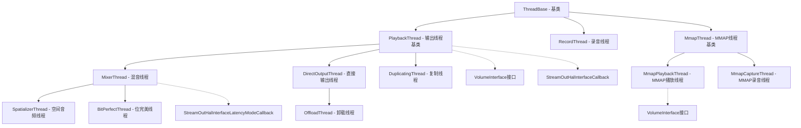
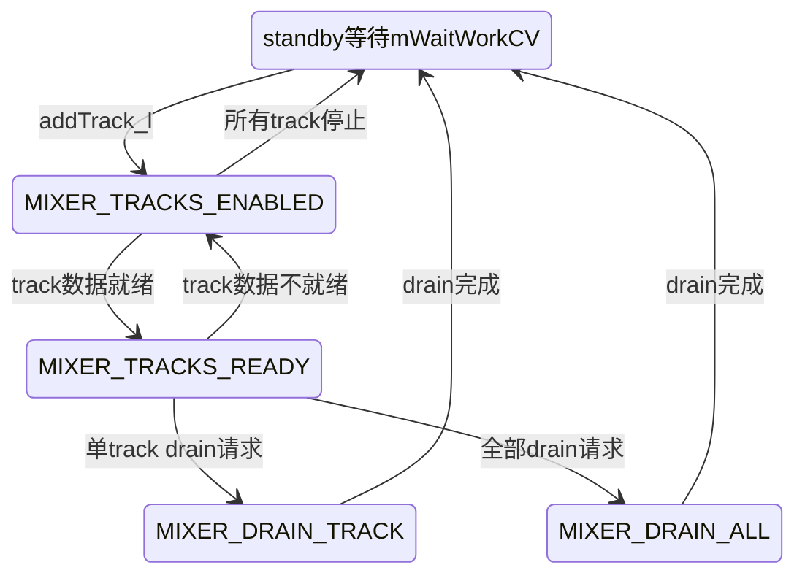
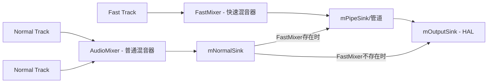
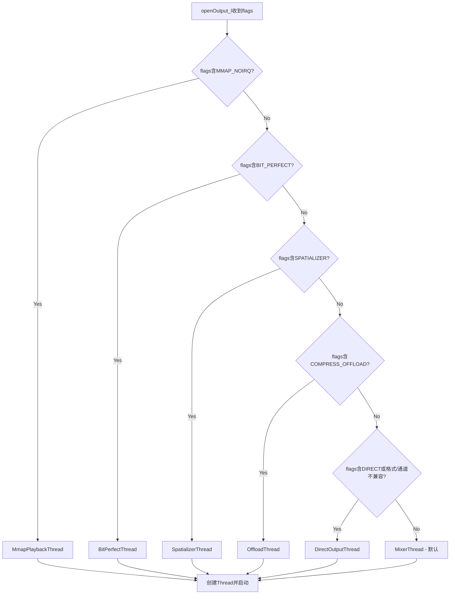
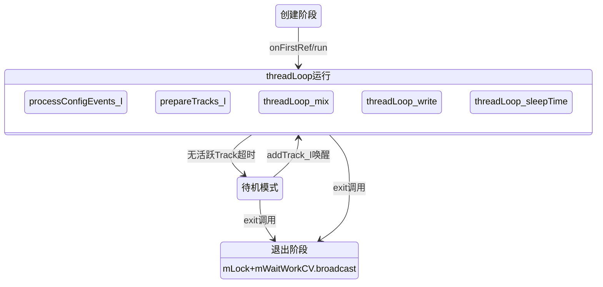

## 5.8 Thread继承体系与匹配规则

> AudioFlinger线程体系是Android音频子系统的心脏，每种Thread类型承载不同的音频流处理职责。本章基于AOSP14源码深度解析9种Thread类型的继承关系、核心成员、threadLoop差异以及Thread类型决策机制。

[← 上一个](05_5.7_TrackRecord-音频流端点.md) | [← 返回AudioFlinger](README.md) | [返回导航](../README.md) | [下一个 →](05_5.9_音乐播放全栈调用链.md)]

---

## 5.8.1 Thread继承体系全景图



**源码位置**：[`Threads.h`](frameworks/av/services/audioflinger/Threads.h) (行22-2372)

**type_t枚举定义**（[Threads.h:27-38](frameworks/av/services/audioflinger/Threads.h:27)）：

| 枚举值 | 对应类 | 用途 |
|--------|--------|------|
| `MIXER` | MixerThread | 多Track混音输出 |
| `DIRECT` | DirectOutputThread | 单Track直接输出 |
| `DUPLICATING` | DuplicatingThread | 多输出同步复制 |
| `RECORD` | RecordThread | 录音输入 |
| `OFFLOAD` | OffloadThread | 码流卸载到DSP |
| `MMAP_PLAYBACK` | MmapPlaybackThread | MMAP模式播放 |
| `MMAP_CAPTURE` | MmapCaptureThread | MMAP模式录音 |
| `SPATIALIZER` | SpatializerThread | 空间音频处理 |
| `BIT_PERFECT` | BitPerfectThread | 位完美直通输出 |

---

## 5.8.2 ThreadBase基类深度解析

### 5.8.2.1 ConfigEvent事件驱动体系

ThreadBase通过ConfigEvent机制实现线程间的异步配置通信。客户端线程通过`sendConfigEvent_l()`将事件入队，ThreadBase的threadLoop在每轮迭代中调用`processConfigEvents_l()`处理事件。

**事件类型**（[Threads.h:51-61](frameworks/av/services/audioflinger/Threads.h:51)）：

| 事件类型 | 含义 | 对应ConfigEvent子类 |
|----------|------|---------------------|
| `CFG_EVENT_IO` | IO配置变更 | IoConfigEvent |
| `CFG_EVENT_PRIO` | 线程优先级调整 | PrioConfigEvent |
| `CFG_EVENT_SET_PARAMETER` | 参数设置 | SetParameterConfigEvent |
| `CFG_EVENT_CREATE_AUDIO_PATCH` | 创建音频路由 | CreateAudioPatchConfigEvent |
| `CFG_EVENT_RELEASE_AUDIO_PATCH` | 释放音频路由 | ReleaseAudioPatchConfigEvent |
| `CFG_EVENT_UPDATE_OUT_DEVICE` | 更新输出设备 | UpdateOutDevicesConfigEvent |
| `CFG_EVENT_RESIZE_BUFFER` | 缓冲区重分配 | ResizeBufferConfigEvent |
| `CFG_EVENT_CHECK_OUTPUT_STAGE_EFFECTS` | 检查OutputStage效果 | CheckOutputStageEffectsEvent |
| `CFG_EVENT_HAL_LATENCY_MODES_CHANGED` | HAL延迟模式变更 | HalLatencyModesChangedEvent |

**通信流程**（[Threads.h:72-88](frameworks/av/services/audioflinger/Threads.h:72)）：

```
客户端线程:                     ThreadBase threadLoop:
1. 创建ConfigEvent               1. Lock mLock
2. Lock mLock                     2. 检查mConfigEvents
3. sendConfigEvent_l()入队        3. 取出首个事件
4. 读取event->mStatus             4. 移除事件
5. 返回status                     5. 处理事件
6. Unlock                         6. 设置event->mStatus
                                  7. event->mCond.signal
                                  8. Unlock
```

ConfigEvent核心成员（[Threads.h:90-113](frameworks/av/services/audioflinger/Threads.h:90)）：`mType`（事件类型）、`mLock/mCond`（互斥量/条件变量用于状态返回）、`mStatus`（处理结果状态）、`mWaitStatus`（发送方是否等待状态）、`mRequiresSystemReady`（是否需要系统就绪）、`mData`（事件特定参数数据）。

未就绪的事件暂存于`mPendingConfigEvents`（[Threads.h:668](frameworks/av/services/audioflinger/Threads.h:668)），待`systemReady()`后被转移至`mConfigEvents`处理。

### 5.8.2.2 ActiveTracks<T>模板

[`ActiveTracks<T>`](frameworks/av/services/audioflinger/Threads.h:747) 是一个有序向量模板，管理ThreadBase中的活跃Track集合。它在SortedVector之上封装了电源状态更新和变更追踪功能。

**核心设计要点**：

1. **SortedVector管理**：`mActiveTracks`（[Threads.h:831](frameworks/av/services/audioflinger/Threads.h:831)）以有序方式存储活跃Track
2. **最新Track追踪**：`mLatestActiveTrack`（[Threads.h:834](frameworks/av/services/audioflinger/Threads.h:834)）以弱指针保存最后添加的Track，用于DirectOutputThread的flush检测和OffloadThread的音量/混音器状态获取
3. **电源状态更新**：`updatePowerState()`（[Threads.h:805](frameworks/av/services/audioflinger/Threads.h:805)）周期性在threadLoop中调用，更新WakeLock Uid集合
4. **变更检测**：`mActiveTracksGeneration`（[Threads.h:832](frameworks/av/services/audioflinger/Threads.h:832)）与`mLastActiveTracksGeneration`（[Threads.h:833](frameworks/av/services/audioflinger/Threads.h:833))配合`readAndClearHasChanged()`检测Track集合变更
5. **电池计数器**：`mBatteryCounter`（[Threads.h:829-830](frameworks/av/services/audioflinger/Threads.h:829)）按uid追踪Track数量变化，用于BatteryNotifier

**使用场景**：
- `PlaybackThread::mActiveTracks<Track>`：输出活跃Track管理
- `RecordThread::mActiveTracks<RecordTrack>`：录音活跃Track管理
- `MmapThread::mActiveTracks<MmapTrack>`：MMAP活跃Track管理

### 5.8.2.3 ThreadBase核心成员字段

**音频参数域**（[Threads.h:642-664](frameworks/av/services/audioflinger/Threads.h:642)）：

| 字段 | 类型 | 含义 |
|------|------|------|
| `mType` | `const type_t` | Thread类型标识 |
| `mWaitWorkCV` | `Condition` | 等待工作条件变量 |
| `mAudioFlinger` | `sp<AudioFlinger>` | AudioFlinger服务引用 |
| `mThreadMetrics` | `ThreadMetrics` | 统计指标对象 |
| `mIsOut` | `const bool` | 是否输出方向 |
| `mSampleRate` | `uint32_t` | 采样率 |
| `mFrameCount` | `size_t` | HAL帧数(输出HAL/直接输出/录音) |
| `mChannelMask` | `audio_channel_mask_t` | 通道掩码 |
| `mChannelCount` | `uint32_t` | 通道数 |
| `mFrameSize` | `size_t` | 帧大小 |
| `mFormat` | `audio_format_t` | 源格式(录音)/Sink格式(播放) |
| `mHALFormat` | `audio_format_t` | HAL格式 |
| `mBufferSize` | `size_t` | HAL缓冲区大小 |
| `mOutDeviceTypeAddrs` | `AudioDeviceTypeAddrVector` | 输出设备类型与地址集合 |
| `mInDeviceTypeAddr` | `AudioDeviceTypeAddr` | 输入设备类型与地址 |

**线程状态域**（[Threads.h:666-730](frameworks/av/services/audioflinger/Threads.h:666)）：

| 字段 | 类型 | 含义 |
|------|------|------|
| `mConfigEvents` | `Vector<sp<ConfigEvent>>` | 待处理配置事件队列 |
| `mPendingConfigEvents` | `Vector<sp<ConfigEvent>>` | 等待systemReady的事件 |
| `mStandby` | `bool` | 线程是否处于待机状态 |
| `mPatch` | `struct audio_patch` | 音频路由Patch |
| `mId` | `const audio_io_handle_t` | IO句柄ID |
| `mEffectChains` | `Vector<sp<EffectChain>>` | EffectChain列表 |
| `mNBLogWriter` | `sp<NBLog::Writer>` | NBAIO日志写入器 |
| `mSystemReady` | `bool` | 系统就绪标志 |
| `mTimestamp` | `ExtendedTimestamp` | 扩展时间戳 |
| `mTimestampVerifier` | `TimestampVerifier` | 时间戳统计校验器 |
| `mSignalPending` | `bool` | 线程循环条件变更信号 |

**统计域**（[Threads.h:710-726](frameworks/av/services/audioflinger/Threads.h:710)）：

| 字段 | 类型 | 含义 |
|------|------|------|
| `mLastIoBeginNs/mLastIoEndNs` | `int64_t` | 上次IO开始/结束时间 |
| `mThreadSnapshot` | `ThreadSnapshot` | 线程快照(线程安全) |
| `mIoJitterMs` | `Statistics<double>` | IO抖动统计(alpha=0.995) |
| `mProcessTimeMs` | `Statistics<double>` | 处理时间统计 |
| `mLatencyMs` | `Statistics<double>` | 延迟统计 |
| `mMonopipePipeDepthStats` | `Statistics<double>` | MonoPipe深度统计 |

**effect_state位域**（[Threads.h:425-436](frameworks/av/services/audioflinger/Threads.h:425)）：

| 位值 | 含义 |
|------|------|
| `EFFECT_SESSION(0x1)` | 音频会话有Effect |
| `TRACK_SESSION(0x2)` | 音频会话有Track |
| `FAST_SESSION(0x4)` | 音频会话有FastTrack |
| `SPATIALIZED_SESSION(0x8)` | 音频会话有空间化Track |
| `BIT_PERFECT_SESSION(0x10)` | 音频会话有位完美Track |

### 5.8.2.4 ThreadBase关键方法

| 方法 | 源码位置 | 说明 |
|------|----------|------|
| `threadLoop()` | 纯虚函数 | 子类实现的主循环 |
| `onFirstRef()` | 线程首次引用时启动 | 调用run()启动线程 |
| `initCheck()` | 纯虚函数 | 检查初始化状态 |
| `exit()` | [Threads.h:341](frameworks/av/services/audioflinger/Threads.h:341) | 请求线程退出并等待 |
| `sendConfigEvent_l()` | [Threads.h:351](frameworks/av/services/audioflinger/Threads.h:351) | 发送配置事件(需持mLock) |
| `processConfigEvents_l()` | [Threads.h:369](frameworks/av/services/audioflinger/Threads.h:369) | 处理配置事件队列 |
| `cacheParameters_l()` | 纯虚函数 | 缓存计算参数 |
| `standby()` | [Threads.h:381](frameworks/av/services/audioflinger/Threads.h:381) | 返回mStandby状态 |
| `isOffloadOrMmap()` | [Threads.h:399](frameworks/av/services/audioflinger/Threads.h:399) | 判断是否Offload/MMAP类型 |
| `dump()` | [Threads.h:548](frameworks/av/services/audioflinger/Threads.h:548) | 导出调试信息 |
| `sendStatistics()` | [Threads.h:551](frameworks/av/services/audioflinger/Threads.h:551) | 向MediaMetrics投递统计 |
| `acquireWakeLock_l()/releaseWakeLock_l()` | [Threads.h:593-596](frameworks/av/services/audioflinger/Threads.h:593) | 电源WakeLock管理 |

---

## 5.8.3 PlaybackThread输出线程基类

### 5.8.3.1 mixer_state状态机

PlaybackThread定义了混音器状态枚举（[Threads.h:867-875](frameworks/av/services/audioflinger/Threads.h:867)），驱动threadLoop的行为决策：



| 状态 | 含义 | threadLoop行为 |
|------|------|----------------|
| `MIXER_IDLE` | 无活跃Track | 等待mWaitWorkCV信号 |
| `MIXER_TRACKS_ENABLED` | 有活跃Track但无数据就绪 | sleepTime等待 |
| `MIXER_TRACKS_READY` | 有活跃Track且有数据 | 混音+写HAL |
| `MIXER_DRAIN_TRACK` | drain当前播放Track | 等待drain完成 |
| `MIXER_DRAIN_ALL` | 完全drain硬件 | 等待全部drain完成 |

### 5.8.3.2 三级缓冲架构

PlaybackThread管理三个核心缓冲区（[Threads.h:1154-1224](frameworks/av/services/audioflinger/Threads.h:1154)），形成三级数据流路径：

| 缓冲区 | 字段 | 格式 | 用途 |
|--------|------|------|------|
| Sink Buffer | `mSinkBuffer` | HAL输出格式 | 最终写入HAL的帧对齐缓冲 |
| Mixer Buffer | `mMixerBuffer` | PCM_FLOAT/16_BIT | 混音累加缓冲(浮点/多声道) |
| Effect Buffer | `mEffectBuffer` | PCM_16_BIT | Effect处理缓冲 |
| Post-Spatializer Buffer | `mPostSpatializerBuffer` | — | Spatializer线程中非空间化Track混音缓冲 |

**数据流向**：

```
Track数据 → mMixerBuffer(混音累加) → mEffectBuffer(效果处理) → mSinkBuffer(格式转换) → HAL
                 │                        │                        │
           mMixerBufferEnabled       mEffectBufferEnabled      直接写入(默认)
           mMixerBufferValid         mEffectBufferValid        mHasDataCopiedToSinkBuffer
```

`mMixerBufferEnabled/mEffectBufferEnabled`标志控制是否启用中间缓冲级。`mMixerBufferValid/mEffectBufferValid`由`prepareTracks_l()`设置，标识当前周期缓冲区包含有效数据。

### 5.8.3.3 PlaybackThread核心成员

**Track管理**（[Threads.h:1261-1369](frameworks/av/services/audioflinger/Threads.h:1261)）：

| 字段 | 类型 | 含义 |
|------|------|------|
| `mActiveTracks` | `ActiveTracks<Track>` | 活跃Track有序集合 |
| `mTracks` | `Tracks<Track>` | 全部Track集合(含非活跃) |
| `mStreamTypes` | `stream_type_t[AUDIO_STREAM_CNT]` | 各流类型音量/静音状态 |
| `mOutput` | `AudioStreamOut*` | HAL输出流对象 |
| `mSuspended` | `volatile int32_t` | 挂起计数(A2DP/SCO冲突规避) |

**音量管理**（[Threads.h:1371-1376](frameworks/av/services/audioflinger/Threads.h:1371)）：

| 字段 | 类型 | 含义 |
|------|------|------|
| `mMasterVolume` | `float` | 主音量(本地副本,免锁优化) |
| `mMasterMute` | `bool` | 主静音(本地副本) |
| `mMasterBalance` | `atomic<float>` | 主平衡系数 |
| `mLeftVolFloat/mRightVolFloat` | `float` | 最近发送给HAL的音量值 |

**异步写入控制**（[Threads.h:1407-1423](frameworks/av/services/audioflinger/Threads.h:1407)）：

| 字段 | 类型 | 含义 |
|------|------|------|
| `mUseAsyncWrite` | `bool` | 是否使用异步写入模式 |
| `mWriteAckSequence` | `uint32_t` | 写入确认序列号(bit0=等待回调) |
| `mDrainSequence` | `uint32_t` | drain序列号(bit0=等待回调) |
| `mCallbackThread` | `sp<AsyncCallbackThread>` | 异步回调线程 |
| `mBytesRemaining` | `size_t` | 当前写入剩余字节 |

**时间控制**（[Threads.h:1379-1405](frameworks/av/services/audioflinger/Threads.h:1379)）：

| 字段 | 类型 | 含义 |
|------|------|------|
| `mStandbyTimeNs` | `nsecs_t` | 进入standby的阈值时间 |
| `mStandbyDelayNs` | `nsecs_t` | standby延迟(DIRECT线程较短) |
| `mActiveSleepTimeUs/mIdleSleepTimeUs` | `uint32_t` | 缓存的sleep时间 |
| `mSleepTimeUs` | `uint32_t` | 当前周期sleep时间 |
| `mMixerStatus` | `mixer_state` | 当前混音器状态 |

**NBAIO管道**（[Threads.h:1431-1439](frameworks/av/services/audioflinger/Threads.h:1431)）：

| 字段 | 类型 | 含义 |
|------|------|------|
| `mOutputSink` | `sp<NBAIO_Sink>` | HAL输出Sink(非阻塞) |
| `mPipeSink` | `sp<NBAIO_Sink>` | FastMixer阻塞管道Sink |
| `mNormalSink` | `sp<NBAIO_Sink>` | NormalMixer的当前Sink(mOutputSink或mPipeSink) |

### 5.8.3.4 PlaybackThread::threadLoop主循环

`PlaybackThread::threadLoop()`（[Threads.cpp:3853](frameworks/av/services/audioflinger/Threads.cpp:3853)）的核心流程：

```
threadLoop() {
    cacheParameters_l()                    // 缓存计算参数
    acquireWakeLock()                      // 获取WakeLock
    for (;;) {
        processConfigEvents_l()            // 处理配置事件
        collectTimestamps_l()              // 收集时间戳
        mMixerStatus = prepareTracks_l(&tracksToRemove)  // 准备Track(持锁)
        lockEffectChains_l(effectChains)   // 锁定EffectChain
        threadLoop_mix()                   // 混音(无锁)
        unlockEffectChains(effectChains)   // 解锁EffectChain
        threadLoop_write()                 // 写入HAL(无锁)
        threadLoop_sleepTime()             // 计算sleep时间
        sleepTime循环控制                   // sleep或继续
        removeTracks_l(tracksToRemove)     // 移除过期Track
    }
}
```

**关键设计**：`prepareTracks_l()`在mLock保护下执行，返回mixer_state和待移除Track列表。`threadLoop_mix()/threadLoop_write()`在无锁状态下执行，避免锁竞争影响实时性。

---

## 5.8.4 MixerThread混音线程

### 5.8.4.1 双路径架构：FastMixer + NormalMixer

MixerThread（[Threads.h:1508-1633](frameworks/av/services/audioflinger/Threads.h:1508)）是AudioFlinger中最核心的线程类型，支持双路径混音架构：



**核心成员**（[Threads.h:1561-1589](frameworks/av/services/audioflinger/Threads.h:1561)）：

| 字段 | 类型 | 含义 |
|------|------|------|
| `mAudioMixer` | `AudioMixer*` | 普通混音器实例 |
| `mFastMixer` | `sp<FastMixer>` | 快速混音器(非0时存在) |
| `mFastMixerFutex` | `int32_t` | FastMixer冷空闲futex |
| `mFastMixerDumpState` | `FastMixerDumpState` | FastMixer转储状态 |
| `mMasterMono` | `atomic_bool` | 单声道混音标志 |
| `mSupportedLatencyModes` | `vector<audio_latency_mode_t>` | HAL支持的延迟模式列表 |
| `mBluetoothLatencyModesEnabled` | `atomic_bool` | 蓝牙可变延迟启用标志 |

**FastMixer决策**（构造函数中根据kUseFastMixer配置）：
- `FastMixer_Never`：永远不创建FastMixer
- `FastMixer_Always`：总是创建FastMixer
- `FastMixer_Static`：当bufferSizeMs < kMinNormalMixBufferSizeMs时创建

**延迟模式管理**：MixerThread实现了`StreamOutHalInterfaceLatencyModeCallback`接口，通过`onRecommendedLatencyModeChanged()`接收HAL推荐模式变更，并通过`setHalLatencyMode_l()`设置当前延迟模式。`mSupportedLatencyModes`默认初始化为`{AUDIO_LATENCY_MODE_LOW}`。

### 5.8.4.2 prepareTracks_l核心逻辑

`MixerThread::prepareTracks_l()`是混音准备的核心方法，负责：
1. 遍历mActiveTracks，检查每个Track的数据就绪状态
2. 设置Track的音量参数到AudioMixer
3. 更新mMixerBufferValid/mEffectBufferValid标志
4. 返回mixer_state状态

---

## 5.8.5 DirectOutputThread直接输出线程

DirectOutputThread（[Threads.h:1635-1714](frameworks/av/services/audioflinger/Threads.h:1635)）继承自PlaybackThread，采用**单Track独占模式**：

**核心成员**：

| 字段 | 类型 | 含义 |
|------|------|------|
| `mActiveTrack` | `sp<Track>` | 当前唯一活跃Track |
| `mPreviousTrack` | `wp<Track>` | 上一个Track(用于检测Track切换) |
| `mOffloadInfo` | `const audio_offload_info_t` | 卸载信息 |
| `mMonotonicFrameCounter` | `MonotonicFrameCounter` | VolumeShaper帧计数器 |
| `mHwSupportsPause/mHwPaused` | `bool` | HW暂停支持与状态 |
| `mMasterBalanceLeft/mMasterBalanceRight` | `float` | 主平衡左右系数 |

**prepareTracks_l逻辑**（[Threads.cpp:6578](frameworks/av/services/audioflinger/Threads.cpp:6578)）：

1. 检查mActiveTracks，只允许一个Track活跃
2. Track切换时：调用flushHw_l()刷新硬件
3. HW暂停/恢复处理：如果mHwSupportsPause为true，调用HAL的pause()/resume()
4. 音量处理：`processVolume_l()`直接设置Track音量，无混音器参与
5. 返回`MIXER_TRACKS_READY`或`MIXER_IDLE`

**与MixerThread的关键差异**：
- 无AudioMixer实例，数据直接从Track buffer拷贝到sink buffer
- 单Track独占，不支持多Track同时播放
- 支持HW暂停(mHwSupportsPause)，MixerThread不支持
- `hasFastMixer()`始终返回false

---

## 5.8.6 OffloadThread码流卸载线程

OffloadThread（[Threads.h:1716-1741](frameworks/av/services/audioflinger/Threads.h:1716)）继承自DirectOutputThread，将压缩音频码流直接卸载到DSP处理：

**独有成员**（[Threads.h:1738-1740](frameworks/av/services/audioflinger/Threads.h:1738)）：

| 字段 | 类型 | 含义 |
|------|------|------|
| `mPausedWriteLength` | `size_t` | 被暂停中断的写入长度 |
| `mPausedBytesRemaining` | `size_t` | 恢复后mixbuffer中剩余字节 |
| `mKeepWakeLock` | `bool` | 等待写入回调时保持WakeLock |

**异步回调机制**：

OffloadThread使用异步写入模式（`mUseAsyncWrite=true`），配合`AsyncCallbackThread`（[Threads.h:1743-1776](frameworks/av/services/audioflinger/Threads.h:1743)）处理DSP回调：

- `onWriteReady()`：DSP写入完成回调 → `resetWriteBlocked()`
- `onDrainReady()`：DSP drain完成回调 → `resetDraining()`
- `onError()`：DSP错误回调 → `onAsyncError()`

**keepWakeLock策略**（[Threads.h:1735](frameworks/av/services/audioflinger/Threads.h:1735)）：`keepWakeLock() = mKeepWakeLock || (mDrainSequence & 1)`，在等待异步回调期间保持WakeLock防止CPU休眠。

**重试机制**：定义了offload Track的underrun重试常量（[Threads.h:881-883](frameworks/av/services/audioflinger/Threads.h:881)）：
- `kMaxTrackRetriesOffload = 20`：常规underrun重试
- `kMaxTrackStartupRetriesOffload = 100`：启动underrun重试
- `kMaxTrackStopRetriesOffload = 2`：停止underrun重试

---

## 5.8.7 DuplicatingThread多输出同步线程

DuplicatingThread（[Threads.h:1778-1834](frameworks/av/services/audioflinger/Threads.h:1778)）继承自MixerThread，将混音结果同步分发到多个下游MixerThread：

**核心成员**：

| 字段 | 类型 | 含义 |
|------|------|------|
| `outputTracks` | `SortedVector<sp<OutputTrack>>` | 下游OutputTrack列表(threadLoop用) |
| `mOutputTracks` | `SortedVector<sp<OutputTrack>>` | 下游OutputTrack列表(管理用) |
| `mWaitTimeMs` | `uint32_t` | 最小等待时间(ms) |

**addOutputTrack流程**（[Threads.cpp:7554](frameworks/av/services/audioflinger/Threads.cpp:7554)）：

1. 计算帧数：`frameCount = 3 * sourceFramesNeeded(mSampleRate, thread->frameCount(), thread->sampleRate())`，三倍缓冲以应对时钟不同步
2. 创建OutputTrack：关联到目标MixerThread
3. 设置`AUDIO_STREAM_PATCH`音量为1.0（满音量直通）
4. 添加到mOutputTracks并调用`updateWaitTime_l()`

**updateWaitTime_l()**（[Threads.cpp:7609](frameworks/av/services/audioflinger/Threads.cpp:7609)）：遍历所有OutputTrack，取最小`(frameCount * 2 * 1000) / sampleRate`作为mWaitTimeMs。

**outputsReady()**（[Threads.cpp:7623](frameworks/av/services/audioflinger/Threads.cpp:7623)）：检查所有下游线程是否就绪（非standby或已suspended）。

**threadLoop_write()**（[Threads.cpp:7483](frameworks/av/services/audioflinger/Threads.cpp:7483)）：遍历outputTracks写入混音数据，第一个OutputTrack用于时间戳校正。

**时间戳获取**（[Threads.h:1818-1833](frameworks/av/services/audioflinger/Threads.h:1818)）：通过首个OutputTrack的`getClientProxyTimestamp()`转发内核时间戳信息。

---

## 5.8.8 SpatializerThread空间音频线程

SpatializerThread（[Threads.h:1836-1861](frameworks/av/services/audioflinger/Threads.h:1836)）继承自MixerThread，专门处理空间音频（如虚拟化、3D音频）：

**独有成员**：

| 字段 | 类型 | 含义 |
|------|------|------|
| `mRequestedLatencyMode` | `audio_latency_mode_t` | 请求的延迟模式(默认FREE) |
| `mFinalDownMixer` | `sp<EffectHandle>` | 最终下混EffectHandle |

**onFirstRef()**（[Threads.cpp:7675](frameworks/av/services/audioflinger/Threads.cpp:7675)）：调用`MixerThread::onFirstRef()`后，通过`requestSpatializerPriority()`提升线程优先级，并设置HAL线程优先级。

**setHalLatencyMode_l()**（[Threads.cpp:7690](frameworks/av/services/audioflinger/Threads.cpp:7690)）延迟模式决策逻辑：

1. 若`mSupportedLatencyModes`为空 → HAL不支持延迟模式控制，直接返回
2. 若只有1个支持模式 → 确认该唯一模式
3. 若有多模式 → 检查是否有spatialized活跃Track + mRequestedLatencyMode为LOW → 设置LOW延迟；否则保持FREE

**checkOutputStageEffects()**（[Threads.cpp:7737](frameworks/av/services/audioflinger/Threads.cpp:7737)）：

1. 获取`AUDIO_SESSION_OUTPUT_STAGE`的EffectChain
2. 检查是否存在`FX_IID_SPATIALIZER`效果（虚拟化器）
3. 若有虚拟化器 → 禁用mFinalDownMixer
4. 若无虚拟化器也无downmix → 自动创建`EFFECT_UIID_DOWNMIX`效果并启用，设为mFinalDownMixer
5. 若有虚拟化器 → mFinalDownMixer被禁用（空间化处理取代下混）

**mPostSpatializerBuffer**：SpatializerThread使用`mPostSpatializerBuffer`（[Threads.h:1220](frameworks/av/services/audioflinger/Threads.h:1220)）作为非空间化Track的混音缓冲，使空间化Track和非空间化Track可以分别处理后再合并。

---

## 5.8.9 BitPerfectThread位完美线程

BitPerfectThread（[Threads.h:2359-2372](frameworks/av/services/audioflinger/Threads.h:2359)）是AOSP14新增的Thread类型，继承自MixerThread，实现位完美(bit-perfect)音频直通输出：

**独有成员**：

| 字段 | 类型 | 含义 |
|------|------|------|
| `mIsBitPerfect` | `bool` | 当前周期是否处于位完美模式 |
| `mVolumeLeft/mVolumeRight` | `float` | 位完美模式下的左右音量 |

**prepareTracks_l()核心逻辑**（[Threads.cpp:11037](frameworks/av/services/audioflinger/Threads.cpp:11037)）：

1. 调用`MixerThread::prepareTracks_l()`获取基础混音状态
2. 检查是否满足位完美条件：**仅有一个bit-perfect Track活跃**
3. 若满足 → 设置`mIsBitPerfect=true`，Track的TEE_BUFFER直接指向sink buffer，数据不经混音器处理
4. 若不满足（多Track或非bit-perfect Track） → 设置`mIsBitPerfect=false`，回退到普通混音模式

**threadLoop_mix()**（[Threads.cpp:11070](frameworks/av/services/audioflinger/Threads.cpp:11070)）：

- 若`mIsBitPerfect=true` → 跳过混音器处理，直接设置`mHasDataCopiedToSinkBuffer=true`（数据已由Track直接拷贝到sink）
- 若`mIsBitPerfect=false` → 调用`MixerThread::threadLoop_mix()`正常混音

**位完美设计哲学**：在高品质音频场景（如Hi-Fi DAC），保证音频数据从应用层到HAL完全无损直通，不做任何格式转换、混音或音量调整。当只有一个bit-perfect请求Track时，Track buffer直接映射到sink buffer，实现零损传输。

---

## 5.8.10 RecordThread录音线程

RecordThread（[Threads.h:1864-2136](frameworks/av/services/audioflinger/Threads.h:1864)）继承自ThreadBase（非PlaybackThread），是唯一的输入方向线程：

### 5.8.10.1 ResamplerBufferProvider

[`ResamplerBufferProvider`](frameworks/av/services/audioflinger/Threads.h:1874)（[Threads.h:1874-1912](frameworks/av/services/audioflinger/Threads.h:1874)）是RecordThread的关键内部类，为RecordTrack提供重采样数据：

| 字段 | 类型 | 含义 |
|------|------|------|
| `mRecordTrack` | `RecordTrack* const` | 关联的录音Track |
| `mRsmpInUnrel` | `size_t` | 最近getNextBuffer未释放帧数 |
| `mRsmpInFront` | `int32_t` | 下一可用帧的滚动计数器(永不清零) |

核心方法：`sync()`（同步Track与Thread位置）、`getNextBuffer()`（获取下一帧数据）、`releaseBuffer()`（释放帧缓冲）、`reset()`（重置到RecordThread数据缓冲头部）。

### 5.8.10.2 RecordThread核心成员

**HAL与数据源**（[Threads.h:2066-2082](frameworks/av/services/audioflinger/Threads.h:2066)）：

| 字段 | 类型 | 含义 |
|------|------|------|
| `mInput` | `AudioStreamIn*` | HAL输入流对象 |
| `mSource` | `Source*` | 数据源包装(mInput) |
| `mTracks` | `SortedVector<sp<RecordTrack>>` | 所有录音Track |
| `mActiveTracks` | `ActiveTracks<RecordTrack>` | 活跃录音Track |

**重采样缓冲**（[Threads.h:2076-2082](frameworks/av/services/audioflinger/Threads.h:2076)）：

| 字段 | 类型 | 含义 |
|------|------|------|
| `mRsmpInBuffer` | `void*` | 重采样输入缓冲(大小=mRsmpInFramesOA) |
| `mRsmpInFrames` | `size_t` | 重采样输入帧数 |
| `mRsmpInFramesP2` | `size_t` | 向上取整到2的幂 |
| `mRsmpInFramesOA` | `size_t` | mRsmpInFramesP2 + over-allocation |
| `mRsmpInRear` | `int32_t` | 最后填充帧+1的滚动索引 |

**FastCapture路径**（[Threads.h:2088-2122](frameworks/av/services/audioflinger/Threads.h:2088)）：

| 字段 | 类型 | 含义 |
|------|------|------|
| `mFastCapture` | `sp<FastCapture>` | 快速捕获线程实例 |
| `mFastCaptureFutex` | `int32_t` | FastCapture冷空闲futex |
| `mFastCaptureDumpState` | `FastCaptureDumpState` | FastCapture转储状态 |
| `mInputSource` | `sp<NBAIO_Source>` | HAL输入NBAIO源 |
| `mNormalSource` | `sp<NBAIO_Source>` | NormalCapture读取源(mInputSource或mPipeSource) |
| `mPipeSink/mPipeSource` | `sp<NBAIO_Sink>/sp<NBAIO_Source>` | FastCapture管道Sink/Source |
| `mPipeFramesP2` | `size_t` | 管道帧数(2的幂) |
| `mFastTrackAvail` | `bool` | 快速Track可用标志 |

**FastCapture初始化决策**（[Threads.cpp:7849-7867](frameworks/av/services/audioflinger/Threads.cpp:7849)）：

| 配置 | 行为 |
|------|------|
| `FastCapture_Never` | 不初始化FastCapture |
| `FastCapture_Always` | 强制初始化FastCapture |
| `FastCapture_Static` | 当bufferSizeMs < kMinNormalCaptureBufferSizeMs且非MSD设备时初始化 |

### 5.8.10.3 RecordThread::threadLoop

RecordThread的threadLoop（[Threads.cpp:7991](frameworks/av/services/audioflinger/Threads.cpp:7991)）核心流程：

```
threadLoop() {
    inputStandBy()                       // HAL初始待机
    acquireWakeLock()                    // 获取WakeLock
    for (;;) {
        processConfigEvents_l()          // 处理配置事件
        检查mActiveTracks                // 检查活跃Track状态
        if (无活跃Track) {
            standbyIfNotAlreadyInStandby() // 进入待机
            mWaitWorkCV.wait(mLock)       // 等待新Track
            continue
        }
        threadLoop_read()                // 从HAL/管道读取数据
        重采样处理                        // 将HAL采样率数据转为Track采样率
        分发到各RecordTrack              // 写入Track缓冲
        updateMetadata                    // 更新音频元数据
    }
}
```

**关键差异**：RecordThread不像PlaybackThread那样有mixer_state状态机，而是通过mActiveTracks是否为空直接决定是否standby。录音数据的流向是HAL → mRsmpInBuffer → 重采样 → RecordTrack buffer → 客户端。

---

## 5.8.11 MmapThread/MmapPlaybackThread/MmapCaptureThread

### 5.8.11.1 MmapThread基类

MmapThread（[Threads.h:2138-2266](frameworks/av/services/audioflinger/Threads.h:2138)）继承自ThreadBase，实现MMAP_NOIRQ模式音频传输：

**核心成员**：

| 字段 | 类型 | 含义 |
|------|------|------|
| `mHalStream` | `sp<StreamHalInterface>` | HAL流接口 |
| `mHalDevice` | `sp<DeviceHalInterface>` | HAL设备接口 |
| `mAudioHwDev` | `sp<AudioHwDevice>` | 音频硬件设备 |
| `mActiveTracks` | `ActiveTracks<MmapTrack>` | MMAP活跃Track |

**MMAP_NOIRQ模式特点**：
- 无中断驱动，客户端通过共享内存直接读写音频数据
- Thread不主动搬运数据，仅做配置管理和Effect处理
- 客户端通过`mmap_buffer`直接映射到HAL共享内存区域

### 5.8.11.2 MmapThread::threadLoop

MmapThread的threadLoop（[Threads.cpp:10230](frameworks/av/services/audioflinger/Threads.cpp:10230)）采用事件驱动等待模式：

```
threadLoop() {
    for (;;) {
        processConfigEvents_l()          // 处理配置事件
        processVolume_l()                // 处理音量(PlaybackThread特有)
        checkInvalidTracks_l()           // 检查失效Track
        effectChains处理                  // 处理EffectChain
        mWaitWorkCV.waitRelative(mLock, waitTimeNs) // 定时等待
    }
}
```

MmapThread的threadLoop不做数据搬运，而是定时处理配置事件、音量、Effect和Track有效性检查。

### 5.8.11.3 MmapPlaybackThread与MmapCaptureThread

**MmapPlaybackThread**（[Threads.h:2268-2327](frameworks/av/services/audioflinger/Threads.h:2268)）：

| 特有字段 | 类型 | 含义 |
|----------|------|------|
| `mOutput` | `AudioStreamOut*` | HAL输出流 |
| `mMelProcessor` | `sp<MelProcessor>` | MEL(CSER)响度处理器 |

实现VolumeInterface接口，支持音量控制和平衡。`startMelComputation_l()`/`stopMelComputation_l()`用于CSER响度监测。

**MmapCaptureThread**（[Threads.h:2329-2357](frameworks/av/services/audioflinger/Threads.h:2329)）：

| 特有字段 | 类型 | 含义 |
|----------|------|------|
| `mInput` | `AudioStreamIn*` | HAL输入流 |

无VolumeInterface，不支持音量控制（录音方向无音量需求）。

---

## 5.8.12 Thread类型决策机制：openOutput_l匹配规则

`AudioFlinger::openOutput_l()`（[AudioFlinger.cpp:2982](frameworks/av/services/audioflinger/AudioFlinger.cpp:2982)）是Thread类型创建的核心决策入口。根据`audio_output_flags_t`的位掩码决定创建哪种Thread：



**决策优先级链**（[AudioFlinger.cpp:3046-3081](frameworks/av/services/audioflinger/AudioFlinger.cpp:3046)）：

| 优先级 | Flag条件 | 创建Thread类型 | 说明 |
|--------|----------|----------------|------|
| 1(最高) | `AUDIO_OUTPUT_FLAG_MMAP_NOIRQ` | MmapPlaybackThread | MMAP无中断模式 |
| 2 | `AUDIO_OUTPUT_FLAG_BIT_PERFECT` | BitPerfectThread | 位完美直通 |
| 3 | `AUDIO_OUTPUT_FLAG_SPATIALIZER` | SpatializerThread | 空间音频 |
| 4 | `AUDIO_OUTPUT_FLAG_COMPRESS_OFFLOAD` | OffloadThread | DSP码流卸载 |
| 5 | `AUDIO_OUTPUT_FLAG_DIRECT` 或格式/通道不兼容PCM | DirectOutputThread | 独占直接输出 |
| 6(最低) | 无特殊flag(默认) | MixerThread | 多路混音 |

**DirectOutputThread的特殊条件**：除了flags包含DIRECT外，还有两个隐式条件：
- `!isValidPcmSinkFormat`：Sink格式不是合法PCM格式（如压缩格式）
- `!isValidPcmSinkChannelMask`：Sink通道掩码不是合法PCM通道掩码

这意味着即使没有DIRECT flag，如果HAL输出配置不支持标准PCM，也会创建DirectOutputThread而非MixerThread。

**openInput_l对应**：录音方向只有两种Thread：RecordThread（默认）和MmapCaptureThread（flags含`AUDIO_INPUT_FLAG_MMAP_NOIRQ`时）。

---

## 5.8.13 ThreadMetrics统计体系

ThreadMetrics（[ThreadMetrics.h:40-208](frameworks/av/services/audioflinger/ThreadMetrics.h:40)）是ThreadBase的内嵌统计对象，持续收集并向MediaMetrics投递运行指标：

### 5.8.13.1 核心统计字段

| 字段 | 类型 | 含义 |
|------|------|------|
| `mMetricsId` | `std::string` | 统计ID(如audio.thread.n) |
| `mIsOut` | `bool` | 输出/输入方向 |
| `mDevices` | `DeviceTypeSet` | 当前设备集合 |
| `mCreatePatchInDevices/mCreatePatchOutDevices` | `DeviceTypeSet` | 创建Patch时的设备 |
| `mIntervalCount` | `int32_t` | 间隔组计数 |
| `mIntervalStartTimeNs` | `int64_t` | 当前间隔开始时间 |
| `mCumulativeTimeNs` | `int64_t` | 累计活跃时间 |
| `mDeviceTimeNs` | `int64_t` | 累计设备IO时间 |
| `mDeviceLatencyMs` | `Statistics<double>` | 设备延迟统计(EMA alpha=0.998) |
| `mUnderrunCount` | `int32_t` | underrun计数 |
| `mUnderrunFrames` | `int64_t` | underrun帧数累计 |

### 5.8.13.2 间隔组(AudioIntervalGroup)机制

ThreadMetrics使用间隔组(IntervalGroup)概念来追踪Thread的活跃周期：

- `logBeginInterval()`：开始一个新间隔，记录设备信息
- `logEndInterval()`：结束当前间隔，投递累计统计
- `deliverCumulativeMetrics()`：投递累计指标到MediaMetrics
- `deliverDeviceMetrics()`：投递设备指标(延迟、underrun)
- `resetIntervalGroupMetrics()`：重置间隔组指标

**统计投递时机**：`ThreadBase::sendStatistics()`在threadLoop周期性调用，将ThreadMetrics数据通过`mediametrics_set()`投递到MediaMetrics服务。

### 5.8.13.3 ThreadSnapshot快照

`ThreadSnapshot`（[Threads.h:714-715](frameworks/av/services/audioflinger/Threads.h:714)）是线程安全的快照机制，内部自带锁保护。它在threadLoop关键节点捕获Thread状态，供dumpsys等外部查询使用。

---

## 5.8.14 各Thread类型threadLoop差异对比

| Thread类型 | 主循环模式 | 数据搬运 | sleep策略 | 混音器 | Fast路径 |
|------------|-----------|----------|-----------|--------|----------|
| MixerThread | for循环+条件sleep | 混音后写入HAL | active/idle/suspend三种sleep | AudioMixer | FastMixer(可选) |
| DirectOutputThread | for循环+条件sleep | 单Track直接拷贝 | active/idle/suspend三种sleep | 无 | 无 |
| OffloadThread | for循环+异步等待 | 压缩码流直写 | 等待异步回调 | 无 | 无 |
| DuplicatingThread | for循环+定时sleep | 混音后写入多个OutputTrack | mWaitTimeMs/2 | 继承MixerThread的AudioMixer | 无 |
| SpatializerThread | 继承MixerThread | 混音+空间化处理 | 继承MixerThread | AudioMixer+mPostSpatializerBuffer | 无 |
| BitPerfectThread | 继承MixerThread | 单Track直通或多Track混音 | 继承MixerThread | AudioMixer(条件启用) | 无 |
| RecordThread | for循环+条件sleep | HAL→重采样→Track | 等待Track活跃 | 无(反向分发) | FastCapture(可选) |
| MmapPlaybackThread | 事件驱动等待 | 客户端直接映射 | 定时waitRelative | 无 | 无 |
| MmapCaptureThread | 事件驱动等待 | 客户端直接映射 | 定时waitRelative | 无 | 无 |

---

## 5.8.15 Thread生命周期管理



**生命周期关键节点**：

1. **创建**：`openOutput_l()/openInput_l()`根据flags创建对应Thread类型，分配mId、mSampleRate等参数
2. **启动**：`onFirstRef()`调用`run(mThreadName, ANDROID_PRIORITY_URGENT_AUDIO)`启动threadLoop
3. **运行→Standby**：当`mMixerStatus == MIXER_IDLE`且`mStandbyTimeNs`超时时，调用`threadLoop_standby()`进入standby
4. **Standby→运行**：`addTrack_l()`通过`mWaitWorkCV.broadcast()`唤醒线程
5. **退出**：调用`exit()`设置退出标志，`mWaitWorkCV.broadcast()`唤醒线程后等待`requestExitAndWait()`

**standby延迟策略**：
- MixerThread/DuplicatingThread：使用AudioFlinger全局`mStandbyTimeInNsecs`
- DirectOutputThread：使用较短的`mStandbyDelayNs`值，快速释放独占资源
- RecordThread：无活跃Track时立即`standbyIfNotAlreadyInStandby()`

---

## 5.8.16 总结

AudioFlinger的Thread继承体系通过精心设计的类型枚举、基类抽象和子类特化，实现了9种线程类型覆盖所有音频流处理场景：

1. **ThreadBase**提供ConfigEvent事件驱动、ActiveTracks模板、WakeLock管理等通用基础设施
2. **PlaybackThread**构建mixer_state状态机、三级缓冲架构、VolumeInterface音量控制的输出框架
3. **MixerThread**的双路径架构(FastMixer+NormalMixer)平衡了低延迟和高兼容性
4. **DirectOutputThread**的单Track独占模式和HW暂停支持适配了高品质音频场景
5. **OffloadThread**的异步回调机制将压缩码流处理卸载到DSP，节省CPU资源
6. **DuplicatingThread**的多输出同步分发实现了A2DP+本地扬声器同时播放
7. **SpatializerThread**的延迟模式管理和自动downmix创建机制优化了空间音频体验
8. **BitPerfectThread**的条件直通/回退混音策略实现了零损音频传输
9. **RecordThread**的FastCapture路径和重采样缓冲架构保证了录音实时性
10. **MmapThread**的事件驱动等待模式支持了MMAP_NOIRQ的无中断低延迟传输

Thread类型决策的flags优先级链确保了MMAP > BitPerfect > Spatializer > Offload > Direct > Mixer的创建顺序，使特殊需求总能优先匹配。

[← 上一个](05_5.7_TrackRecord-音频流端点.md) | [← 返回AudioFlinger](README.md) | [返回导航](../README.md) | [下一个 →](05_5.9_音乐播放全栈调用链.md)