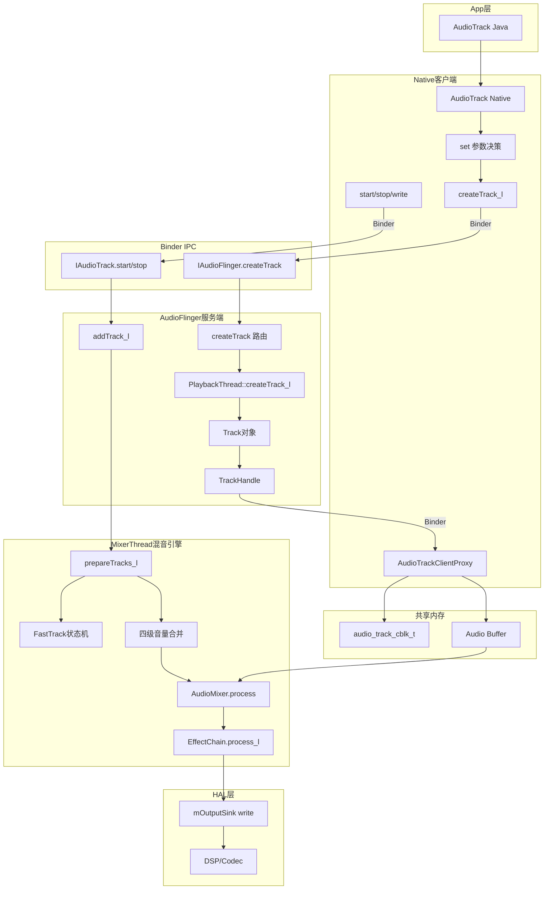
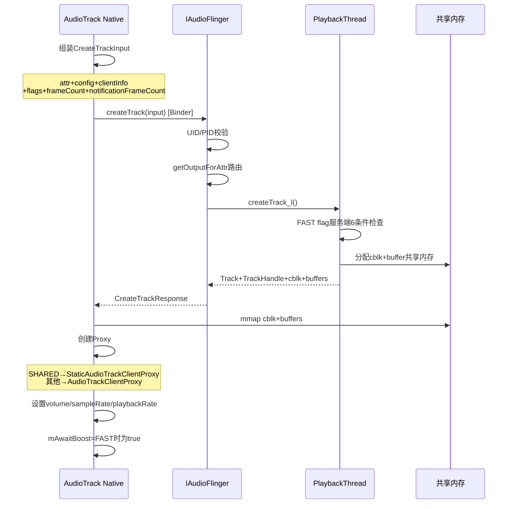
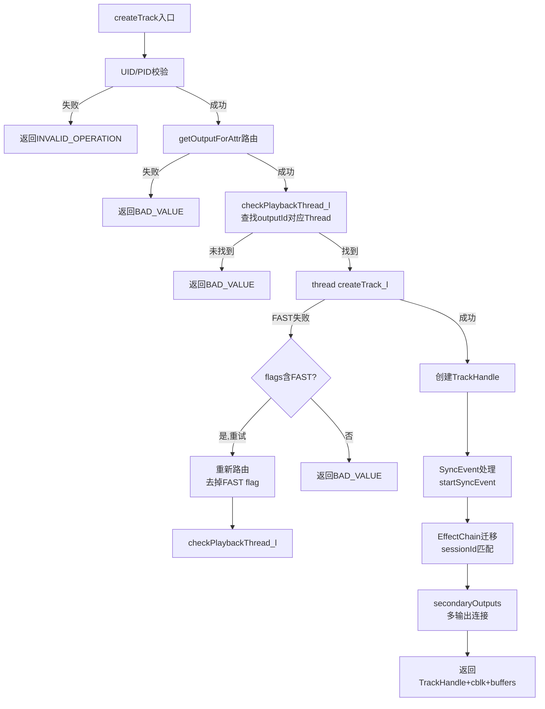
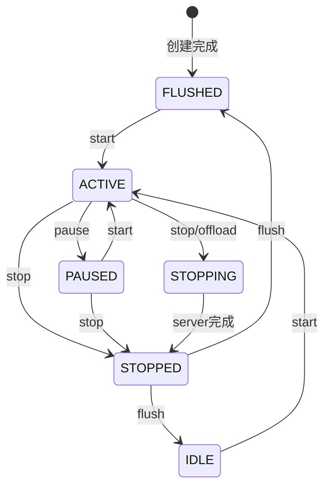
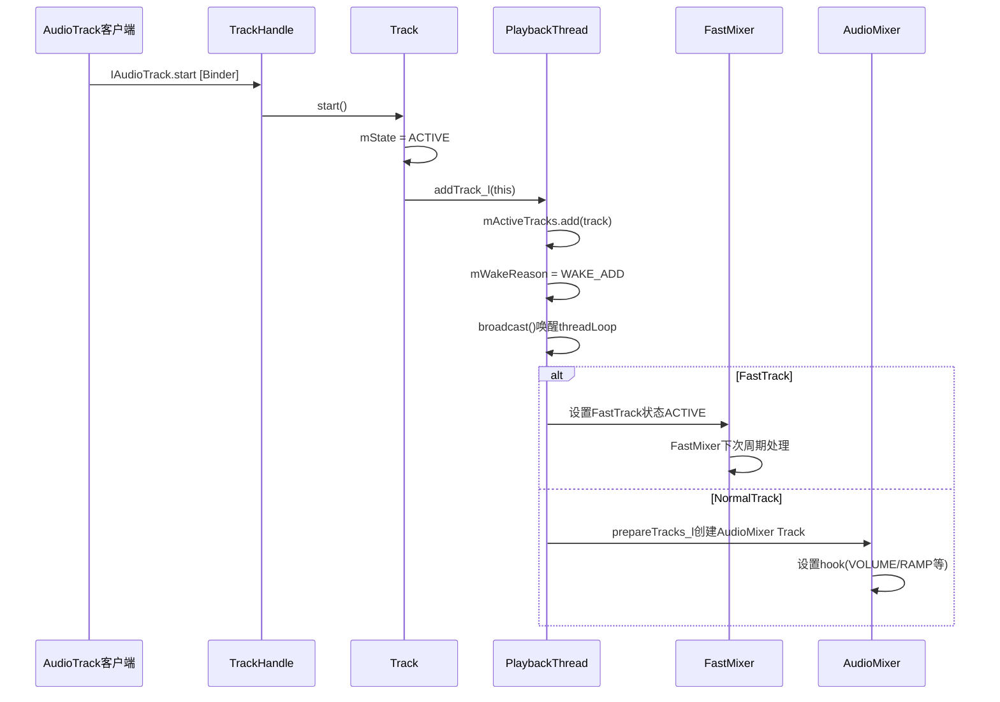
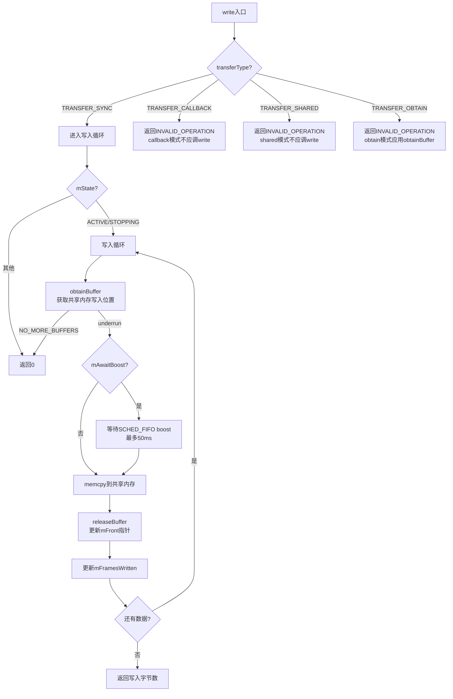
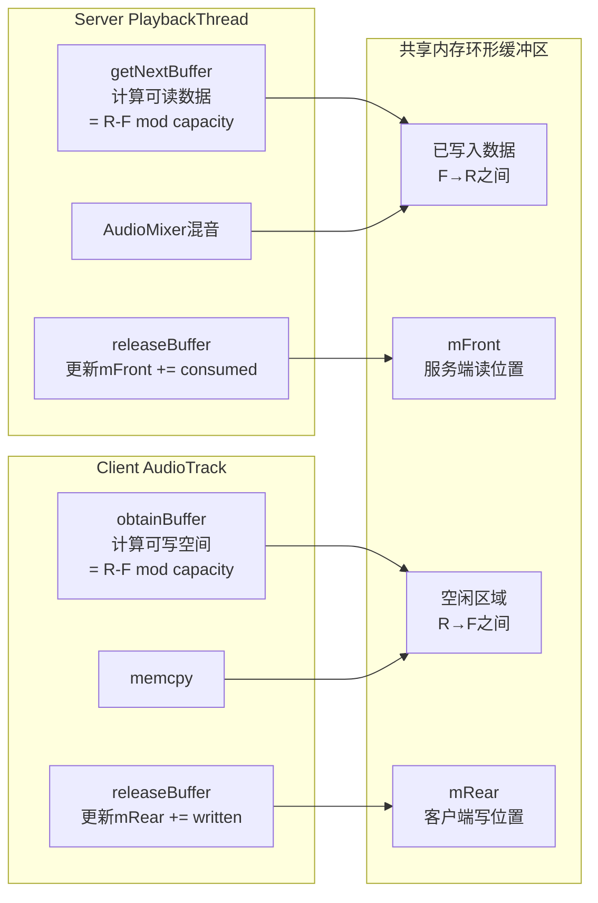
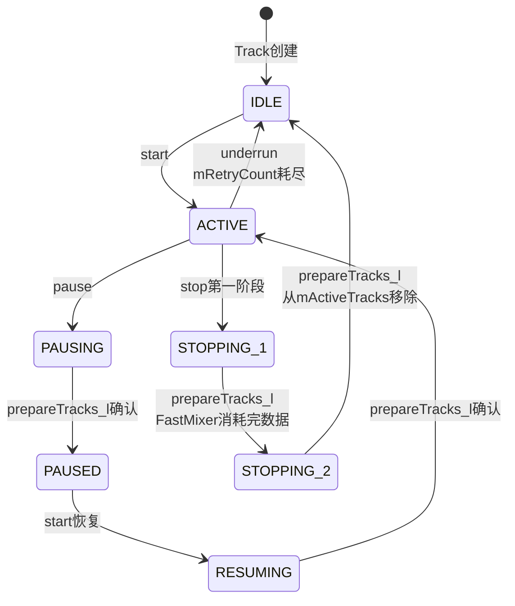
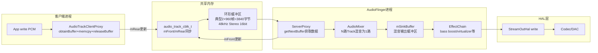

## 5.9 音乐播放全栈调用链

> [← 上一个](05_5.8_Thread继承体系与匹配规则.md) | [← 返回AudioFlinger](README.md) | [返回导航](../README.md) | [下一个 →](05_5.10_录音全栈调用链.md)

---

本文基于AOSP14源码，深度解析从App层`AudioTrack`创建到HAL层PCM输出的完整播放数据流路径。涵盖AudioTrack参数决策、共享内存创建、AudioFlinger路由与Track构造、MixerThread混音引擎等核心环节。

### 5.9.1 播放全栈架构总览



### 5.9.2 AudioTrack::set()参数决策深度解析

[`AudioTrack::set()`](frameworks/av/media/libaudioclient/AudioTrack.cpp:425) 是播放链的入口方法，负责TransferType决策、Flags映射和参数校验。

#### TransferType决策表

| TransferType | 触发条件 | 共享内存模式 | 数据写入方式 | 典型场景 |
|---|---|---|---|---|
| `TRANSFER_CALLBACK` | `callback != NULL` 且 `sharedBuffer == NULL` | 流模式(cblk+buffer) | 回调填充 | 正常音乐播放 |
| `TRANSFER_OBTAIN` | `callback == NULL` 且 `sharedBuffer == NULL` 且非Java调用 | 流模式(cblk+buffer) | obtainBuffer+memcpy | Native直接播放 |
| `TRANSFER_SYNC` | Java层创建(通过`setOutputDevice()`) | 流模式(cblk+buffer) | write()阻塞写入 | Java AudioTrack |
| `TRANSFER_SHARED` | `sharedBuffer != NULL` | 静态缓冲区 | 一次写入 | 游戏音效短样本 |
| `TRANSFER_DEFAULT` | 未指定，自动推导 | - | - | 内部占位 |

**决策伪代码**（[`AudioTrack::set()`](frameworks/av/media/libaudioclient/AudioTrack.cpp:475)）：

```cpp
// Transfer Type决策
if (sharedBuffer != 0) {
    transferType = TRANSFER_SHARED;
} else if (cbf == NULL) {  // 无回调
    if (threadCanCallJava) {
        transferType = TRANSFER_SYNC;   // Java层
    } else {
        transferType = TRANSFER_OBTAIN; // Native层
    }
} else {
    transferType = TRANSFER_CALLBACK;   // 有回调
}
```

#### FAST Flag客户端资格检查

FAST flag需要同时满足4个条件（[`AudioTrack::set()`](frameworks/av/media/libaudioclient/AudioTrack.cpp:510)）：

```cpp
// FAST flag客户端资格检查
if (/* 1. 非SHARED模式 */ transferType != TRANSFER_SHARED &&
    /* 2. 非OBTAIN模式 */ transferType != TRANSFER_OBTAIN &&
    /* 3. CALLBACK或SYNC模式 */ (cbf != NULL || threadCanCallJava) &&
    /* 4. 无SAMPLE_RATE属性 */ !(attributes.flags & AUDIO_FLAG_SCO) &&
    /* 额外: 非Offload */ !isOffloaded &&
    /* 额外: 非Direct */ !isDirect) {
    // 允许FAST flag
}
```

| 条件 | 原因 |
|------|------|
| `transferType != TRANSFER_SHARED` | 静态缓冲区不需要低延迟 |
| `transferType != TRANSFER_OBTAIN` | OBTAIN模式无法保证及时填充 |
| `cbf != NULL \|\| threadCanCallJava` | 需要回调或Java线程才能及时响应 |
| 非Offload/Direct | Offload走压缩直通，Direct走PCM直通 |

#### Offload/Direct Flag强制转换

```cpp
// Offload兼容性检查 (AudioTrack.cpp:540)
if (isOffloaded) {
    // 必须是STREAM_MUSIC
    if (streamType != AUDIO_STREAM_MUSIC) return BAD_VALUE;
    // 必须有callback
    if (cbf == NULL) return BAD_VALUE;
    // 必须是压缩格式
    if (!audio_is_compressed_format(format)) return BAD_VALUE;
    // 禁止FAST flag
    flags = (audio_output_flags_t)(flags & ~AUDIO_OUTPUT_FLAG_FAST);
}

// Direct flag强制 (AudioTrack.cpp:565)
if (isDirect) {
    // PCM非压缩格式 + DEEP_BUFFER → 降级为普通
    if (!audio_is_compressed_format(format) &&
        (flags & AUDIO_OUTPUT_FLAG_DEEP_BUFFER)) {
        flags = AUDIO_OUTPUT_FLAG_NONE;
    }
    // 禁止FAST flag
    flags = (audio_output_flags_t)(flags & ~AUDIO_OUTPUT_FLAG_FAST);
}
```

#### audio_flags_to_audio_output_flags属性映射

Java层`AudioAttributes`通过`audio_flags_to_audio_output_flags()`映射：

| AudioAttributes Flag | audio_flags_t | audio_output_flags_t | 含义 |
|---|---|---|---|
| `FLAG_AUDIBILITY_ENFORCED` | `AUDIO_FLAG_AUDIBILITY_ENFORCED` | `AUDIO_OUTPUT_FLAG_AUDIBILITY_ENFORCED` | 强制可听 |
| `FLAG_HW_AV_SYNC` | `AUDIO_FLAG_HW_AV_SYNC` | `AUDIO_OUTPUT_FLAG_HW_AV_SYNC` | 硬件AV同步 |
| `FLAG_LOW_LATENCY` | `AUDIO_FLAG_LOW_LATENCY` | `AUDIO_OUTPUT_FLAG_FAST` | 低延迟→FAST |
| `FLAG_DEEP_BUFFER` | `AUDIO_FLAG_DEEP_BUFFER` | `AUDIO_OUTPUT_FLAG_DEEP_BUFFER` | 深缓冲 |

### 5.9.3 createTrack_l()共享内存与Proxy创建

[`AudioTrack::createTrack_l()`](frameworks/av/media/libaudioclient/AudioTrack.cpp:1807) 是客户端创建Track的核心，负责共享内存映射和Proxy创建。



**CreateTrackInput关键字段**（[`AudioTrack.cpp:1860`](frameworks/av/media/libaudioclient/AudioTrack.cpp:1860)）：

```cpp
IAudioFlinger::CreateTrackInput input;
input.attr = mAttributes;           // 音频属性(usage/content/type/flags)
input.config = mConfig;             // audio_config_t(sampleRate/channelMask/format)
input.clientInfo = mClientInfo;     // UID/PID
input.flags = mFlags;               // output flags(FAST/DEEP_BUFFER等)
input.frameCount = mReqFrameCount;  // 请求的帧数
input.notificationFrameCount = mNotificationFramesAct; // 回调通知帧数
input.speed = 1.0f;                 // 初始播放速率
input.sharedBuffer = mSharedBuffer; // SHARED模式的静态缓冲区
```

**Proxy创建逻辑**（[`AudioTrack.cpp:1980`](frameworks/av/media/libaudioclient/AudioTrack.cpp:1980)）：

```cpp
if (mSharedBuffer == 0) {
    // 流模式 → AudioTrackClientProxy
    mProxy = new AudioTrackClientProxy(cblk, buffers, frameCount, mFrameSize);
} else {
    // 静态模式 → StaticAudioTrackClientProxy
    mProxy = new StaticAudioTrackClientProxy(cblk, buffers, frameCount, mFrameSize);
    mProxy->setSharedBuffer(mSharedBuffer);
}
```

**FAST flag修正与mAwaitBoost**（[`AudioTrack.cpp:2000`](frameworks/av/media/libaudioclient/AudioTrack.cpp:2000)）：

```cpp
// 服务端可能修正flags(FAST→NON_BLOCKING等)
mFlags = output.flags;
// FAST模式下启用mAwaitBoost
mAwaitBoost = (mFlags & AUDIO_OUTPUT_FLAG_FAST) != 0;
// mAwaitBoost: write()时若遇到underrun，
// 在obtainBuffer中等待scheduler boost后再写入
```

### 5.9.4 AudioFlinger::createTrack()路由与Track构造

[`AudioFlinger::createTrack()`](frameworks/av/services/audioflinger/AudioFlinger.cpp:1105) 是服务端创建Track的入口。



**UID/PID校验**（[`AudioFlinger.cpp:1130`](frameworks/av/services/audioflinger/AudioFlinger.cpp:1130)）：

```cpp
// 获取调用者真实UID/PID
clientUid = ValueOrNull(callerAudioAttributes).uid.value_or(
    IPCThreadState::self()->getCallingUid());
clientPid = IPCThreadState::self()->getCallingPid();
// 检查录音权限(PLAY_AUDIO)
if (!audio_utils::check_audio_pid(callerAudioAttributes, ...)) {
    return BAD_VALUE;
}
```

**getOutputForAttr路由**（[`AudioFlinger.cpp:1160`](frameworks/av/services/audioflinger/AudioFlinger.cpp:1160)）：

```cpp
// 通过AudioSystem调用AudioPolicyService
status_t status = AudioSystem::getOutputForAttr(
    &input.attr, &output, &session, &streamType,
    input.clientInfo.uid, input.clientInfo.pid,
    &config, input.flags, &selectedDeviceId, &portId,
    &secondaryOutputs);
```

**EffectChain迁移**（[`AudioFlinger.cpp:1260`](frameworks/av/services/audioflinger/AudioFlinger.cpp:1260)）：

```cpp
// Track加入sessionId对应的EffectChain
sp<EffectChain> chain = getEffectChain_l(sessionId);
if (chain != 0) {
    // 设置Track的mainBuffer指向EffectChain的buffer
    track->setMainBuffer(chain->inBuffer());
} else {
    // 无EffectChain，直接指向mSinkBuffer
    track->setMainBuffer(mMixerBufferEnabled ? mMixerBuffer : mSinkBuffer);
}
```

**secondaryOutputs处理**（[`AudioFlinger.cpp:1280`](frameworks/av/services/audioflinger/AudioFlinger.cpp:1280)）：

```cpp
// 为多输出场景(如HDMI+Speaker)创建secondary Track
for (auto& secondaryOutput : secondaryOutputs) {
    sp<PlaybackThread> secondaryThread = checkPlaybackThread_l(secondaryOutput);
    if (secondaryThread != 0) {
        // 在secondary Thread上创建附属Track
        sp<Track> secondaryTrack = secondaryThread->createTrack_l(...);
        track->setSecondaryTrack(secondaryTrack);
    }
}
```

### 5.9.5 PlaybackThread::createTrack_l() FAST flag服务器端决策

[`PlaybackThread::createTrack_l()`](frameworks/av/services/audioflinger/Threads.cpp:2319) 是服务端Track构造的核心，包含FAST flag的服务器端6条件检查、帧数计算和Track对象创建。

#### FAST Flag服务器端6条件检查

服务端对FAST flag有更严格的检查（[`Threads.cpp:2400`](frameworks/av/services/audioflinger/Threads.cpp:2400)）：

```cpp
// FAST flag服务器端6条件检查
if (mType == MIXER &&        // 1. 必须是MixerThread
    (flags & AUDIO_OUTPUT_FLAG_FAST) != 0 &&  // 2. 客户端请求FAST
    isLinearPCM(format) &&   // 3. 必须是线性PCM格式
    channelMask == mChannelMask &&  // 4. 通道掩码必须匹配Thread
    sampleRate == mSampleRate &&    // 5. 采样率必须匹配Thread
    hasFastMixer() &&        // 6. Thread有FastMixer
    mFastTrackAvailMask != 0) {     // 7. 有可用的FastTrack槽位
    // FAST flag通过
    isFastTrack = true;
} else {
    // FAST flag降级
    isFastTrack = false;
    flags = (audio_output_flags_t)(flags & ~AUDIO_OUTPUT_FLAG_FAST);
}
```

| 条件编号 | 条件 | 原因 |
|---|---|---|
| 1 | `mType == MIXER` | 只有MixerThread支持FastMixer |
| 2 | 客户端请求FAST | 客户端已通过客户端4条件检查 |
| 3 | `isLinearPCM(format)` | FastMixer只处理PCM |
| 4 | `channelMask == mChannelMask` | FastMixer不做通道转换 |
| 5 | `sampleRate == mSampleRate` | FastMixer不做重采样 |
| 6 | `hasFastMixer()` | Thread已初始化FastMixer |
| 7 | `mFastTrackAvailMask != 0` | FastTrack槽位有限(通常≤8) |

#### EffectChain兼容性检查

```cpp
// 检查EffectChain是否兼容FAST (Threads.cpp:2460)
if (isFastTrack) {
    sp<EffectChain> chain = getEffectChain_l(sessionId);
    if (chain != 0 && !chain->isCompatibleWithFastTrack()) {
        // EffectChain不兼容(如包含重采样效果的Effect)
        isFastTrack = false;
        // 降级但不返回错误
    }
}
```

#### frameCount计算

```cpp
// FAST Track帧数计算 (Threads.cpp:2480)
if (isFastTrack) {
    // FastTrack: 使用Thread的mFrameCount × 快速倍数
    // 典型: 960帧(NormalMixer 20ms) × 2 = 1920帧
    mFrameCount = mFrameCount * sFastTrackMultiplier;
} else {
    // Normal Track: 基于minFrameCount计算
    // minFrameCount = (sampleRate * latency) / 1000
    // 加上notificationFrameCount对齐
    mFrameCount = calculateMinFrameCount(mSampleRate, mNormalFrameCount);
}
```

#### Track构造与mTracks添加

```cpp
// Track构造 (Threads.cpp:2550)
track = new Track(this, client, streamType, attr, sampleRate, format,
                  channelMask, frameCount, sharedBuffer, sessionId,
                  isFastTrack, uid, pid, portId, serverLatencySupported);

// 添加到mTracks列表
mTracks.add(track);

// 设置mainBuffer
if (chain != 0) {
    track->setMainBuffer(chain->inBuffer());
} else {
    track->setMainBuffer(mSinkBuffer);
}
```

**Track构造关键参数映射**：

| 参数 | FAST Track | Normal Track | Offload Track |
|---|---|---|---|
| frameCount | mFrameCount × multiplier | calculateMinFrameCount | mFrameCount |
| mMainBuffer | mSinkBuffer / EffectChain | mSinkBuffer / EffectChain | mSinkBuffer |
| mFastTrackFlag | true | false | false |
| 共享内存大小 | 较小(FastMixer周期短) | 较大(DeepBuffer周期长) | 最大(压缩帧) |

### 5.9.6 AudioTrack::start()客户端启动流程

[`AudioTrack::start()`](frameworks/av/media/libaudioclient/AudioTrack.cpp:782) 负责客户端播放启动，包含状态转换和Binder调用。



**start()核心逻辑**（[`AudioTrack.cpp:782`](frameworks/av/media/libaudioclient/AudioTrack.cpp:782)）：

```cpp
status_t AudioTrack::start()
{
    AutoMutex lock(mLock);
    // 状态检查
    if (mState == STATE_ACTIVE) {
        return NO_ERROR;  // 已经ACTIVE，幂等返回
    }

    // 状态转换
    switch (mState) {
    case STATE_STOPPED:
    case STATE_FLUSHED:
    case STATE_IDLE:
        // 这些状态可以直接转为ACTIVE
        break;
    case STATE_PAUSED:
        // PAUSED→ACTIVE是恢复
        break;
    default:
        ALOGE("start() called in state %d", mState);
        return INVALID_OPERATION;
    }

    mState = STATE_ACTIVE;

    // Binder调用服务端Track::start()
    status_t status = mAudioTrack->start();
    if (status != NO_ERROR) {
        mState = STATE_STOPPED;
        return status;
    }

    // 恢复AudioTrackThread(回调模式)
    if (mAudioTrackThread != 0) {
        mAudioTrackThread->resume();
    }

    // 处理CBLK_INVALID(服务端可能已重启)
    if (status == DEAD_OBJECT) {
        // 重新创建Track连接
        status = restoreTrack_l("start");
    }

    // 更新mFramesWritten统计
    mFramesWritten = 0;
    return status;
}
```

**mAwaitBoost机制**：在FAST模式下，`start()`会设置调度策略：

```cpp
// FAST模式下请求scheduler boost (AudioTrack.cpp:850)
if (mAwaitBoost) {
    // 通过mAudioTrack->start()触发服务端setSchedFifo()
    // 服务端会将Track的Binder线程设为SCHED_FIFO
}
```

### 5.9.7 Track::start()服务端启动与addTrack_l

服务端[`Track::start()`](frameworks/av/services/audioflinger/Tracks.cpp:530) 将Track加入活跃列表，触发混音引擎处理。



**Track::start()核心逻辑**（[`Tracks.cpp:530`](frameworks/av/services/audioflinger/Tracks.cpp:530)）：

```cpp
void Track::start()
{
    AutoMutex lock(mThread->mLock);
    // 设置Track状态
    mState = TrackBase::ACTIVE;

    // 将Track添加到活跃列表
    mThread->addTrack_l(this);
}
```

**addTrack_l()实现**（[`Threads.cpp:3650`](frameworks/av/services/audioflinger/Threads.cpp:3650)）：

```cpp
status_t PlaybackThread::addTrack_l(const sp<Track>& track)
{
    // 检查Track是否已在活跃列表
    if (mActiveTracks.indexOf(track) >= 0) {
        return ALREADY_EXISTS;
    }

    // 添加到活跃列表
    mActiveTracks.add(track);

    // 设置唤醒原因
    mWakeReason = WAKE_ADD;

    // 唤醒threadLoop
    mWaitWorkCV.broadcast();

    return NO_ERROR;
}
```

**threadLoop被唤醒后的处理**：

```cpp
// MixerThread::threadLoop()核心循环
while (!exitPending()) {
    // 1. prepareTracks_l() - 准备活跃Track
    bool mixBufferStatus = prepareTracks_l(&tracksToRemove);

    // 2. 如果有活跃Track，执行混音
    if (mixBufferStatus) {
        // 3. AudioMixer.process() - 执行混音
        mAudioMixer->process();
    }

    // 4. EffectChain处理
    if (mEffectChains.size() != 0) {
        processEffectChains_l();
    }

    // 5. HAL写入
    mOutputSink->write(mSinkBuffer, ...);
}
```

### 5.9.8 AudioTrack::write()数据写入机制

[`AudioTrack::write()`](frameworks/av/media/libaudioclient/AudioTrack.cpp:2310) 是客户端PCM数据写入的核心方法。

#### write()核心流程



**write()核心伪代码**（[`AudioTrack.cpp:2310`](frameworks/av/media/libaudioclient/AudioTrack.cpp:2310)）：

```cpp
ssize_t AudioTrack::write(const void* buffer, size_t size, bool blocking)
{
    // 1. Transfer Type检查：仅TRANSFER_SYNC允许
    if (mTransfer != TRANSFER_SYNC) {
        return INVALID_OPERATION;
    }

    // 2. 状态检查
    if (mState != STATE_ACTIVE && mState != STATE_STOPPING) {
        return 0;
    }

    // 3. 写入循环
    size_t written = 0;
    while (written < size) {
        // 3a. obtainBuffer - 获取可写位置
        audio_track_cblk_t* cblk = mCblk;
        uint32_t framesAvail = cblk->framesAvailable();
        if (framesAvail == 0) {
            // 无可用空间
            if (!blocking) break;
            // 等待服务端消费数据
            status_t status = obtainBuffer(&audioBuffer, ...);
            if (status != NO_ERROR) break;
        }

        // 3b. memcpy数据到共享内存
        size_t toWrite = min(framesAvail, (size - written) / mFrameSize);
        memcpy(audioBuffer.i8, (uint8_t*)buffer + written, toWrite * mFrameSize);

        // 3c. releaseBuffer - 通知服务端有新数据
        releaseBuffer(&audioBuffer);

        written += toWrite * mFrameSize;
        mFramesWritten += toWrite;
    }

    return written;
}
```

#### obtainBuffer/releaseBuffer数据交换机制



**关键同步变量**（`audio_track_cblk_t`）：

| 变量 | 方向 | 含义 |
|------|------|------|
| `mFront` | Server→Client | 服务端已消费位置，客户端据此计算可写空间 |
| `mRear` | Client→Server | 客户端已写入位置，服务端据此计算可读数据 |
| `mFutex` | 双向 | futex用于阻塞/唤醒同步 |
| `mServer` | Server→Client | 服务端已释放帧数，用于underrun检测 |

**mAwaitBoost详解**：

```cpp
// FAST模式下obtainBuffer遇到underrun时的处理 (AudioTrack.cpp:2150)
if (mAwaitBoost) {
    // 等待SCHED_FIFO调度提升
    // 最多等待kAwaitBoostTimeoutNs = 50ms
    // 如果超时，放弃等待直接写入(可能导致underrun)
    for (int i = 0; i < kAwaitBoostAttempts; i++) {
        if (mCblk->mServer >= requiredServer) break;
        usleep(kAwaitBoostSleepUs);  // 2ms
    }
}
```

### 5.9.9 prepareTracks_l()音量合并与AudioMixer配置

[`MixerThread::prepareTracks_l()`](frameworks/av/services/audioflinger/Threads.cpp:5342) 是每个混音周期的核心调度方法。

#### FastTrack状态机



**FastTrack状态转换伪代码**：

```cpp
// prepareTracks_l()中FastTrack处理 (Threads.cpp:5400)
switch (track->mState) {
case TrackBase::ACTIVE:
    // 检查underrun
    if (track->framesReady() < mFrameCount) {
        track->mRetryCount--;
        if (track->mRetryCount <= 0) {
            // underrun次数耗尽，移除Track
            tracksToRemove->add(track);
            track->mState = TrackBase::STOPPED;
        }
    }
    break;

case TrackBase::PAUSING:
    track->mState = TrackBase::PAUSED;
    // FastMixer不再处理此Track
    break;

case TrackBase::RESUMING:
    track->mState = TrackBase::ACTIVE;
    // FastMixer恢复处理
    break;

case TrackBase::STOPPING_1:
    // 第一阶段：等待FastMixer消耗完缓冲区
    track->mState = TrackBase::STOPPING_2;
    break;

case TrackBase::STOPPING_2:
    // 第二阶段：从活跃列表移除
    tracksToRemove->add(track);
    track->mState = TrackBase::STOPPED;
    break;
}
```

#### NormalTrack四级音量合并

NormalTrack的音量由4个层级合并计算（[`Threads.cpp:5600`](frameworks/av/services/audioflinger/Threads.cpp:5600)）：

```cpp
// 四级音量合并: masterVolume × streamVolume × volumeHandler × trackVolumeLR

// Level 1: Master Volume (AudioFlinger主音量)
float masterVolume = mMasterVolume;

// Level 2: Stream Volume (AudioService流类型音量)
float streamVolume = mStreamTypes[track->streamType()].volume;

// Level 3: Volume Handler (App层setVolume/VolumeShaper)
float vhVolumeLeft, vhVolumeRight;
track->getVolumeHandler()->getVolume(&vhVolumeLeft, &vhVolumeRight);

// Level 4: Track Volume (AudioTrack.setVolume)
float trackVolumeLeft = track->mVolume.mLeft;
float trackVolumeRight = track->mVolume.mRight;

// 合并计算
float finalLeft = masterVolume * streamVolume * vhVolumeLeft * trackVolumeLeft;
float finalRight = masterVolume * streamVolume * vhVolumeRight * trackVolumeRight;

// clamp到[0.0, 1.0]
finalLeft = clamp(finalLeft, 0.0f, 1.0f);
finalRight = clamp(finalRight, 0.0f, 1.0f);
```

**音量合并示意**：

```
┌────────────────────────────────────────────────────────────┐
│                    音量合并计算链                            │
│                                                            │
│  masterVolume    streamVolume    volumeHandler    trackVol  │
│  (0.0~1.0)      (0.0~1.0)      (0.0~1.0)       (0.0~1.0) │
│      │               │               │               │      │
│      ▼               ▼               ▼               ▼      │
│  ┌──────┐        ┌──────┐      ┌──────┐        ┌──────┐    │
│  │Master│ ×      │Stream│ ×    │VolHdl│ ×      │Track │    │
│  │ 0.8  │        │ 1.0  │      │ 0.9  │        │ 0.7  │    │
│  └──┬───┘        └──┬───┘      └──┬───┘        └──┬───┘    │
│     │               │               │               │       │
│     └───────────────┴───────┬───────┴───────────────┘       │
│                             ▼                               │
│                     ┌──────────────┐                        │
│                     │ finalVolume  │                        │
│                     │ 0.8×1.0×0.9  │                        │
│                     │    ×0.7      │                        │
│                     │ = 0.504      │                        │
│                     └──────────────┘                        │
└────────────────────────────────────────────────────────────┘
```

#### AudioMixer参数设置

```cpp
// 设置AudioMixer Track参数 (Threads.cpp:5750)
int name = track->mAudioMixerTrackName;  // AudioMixer内部Track ID

// 1. 音量参数
if (needsRamp) {
    // 渐变音量(VolumeShaper/Pause恢复)
    mAudioMixer->setParameter(name, AudioMixer::RAMP_VOLUME,
        finalLeft, finalRight);
} else {
    // 直接设置音量
    mAudioMixer->setParameter(name, AudioMixer::VOLUME,
        finalLeft, finalRight);
}

// 2. 采样率转换
if (track->mSampleRate != mSampleRate) {
    mAudioMixer->setParameter(name, AudioMixer::SAMPLE_RATE,
        track->mSampleRate, NULL);
}

// 3. 播放速率(变速播放)
if (track->mPlaybackRate != 1.0f) {
    mAudioMixer->setParameter(name, AudioMixer::PLAYBACK_RATE,
        track->mPlaybackRate.mSpeed, NULL);
}

// 4. 通道掩码转换
if (track->mChannelMask != mChannelMask) {
    mAudioMixer->setParameter(name, AudioMixer::MIXER_CHANNEL_MASK,
        track->mChannelMask, NULL);
}

// 5. 格式转换
if (track->mFormat != mFormat) {
    mAudioMixer->setParameter(name, AudioMixer::FORMAT,
        track->mFormat, NULL);
}

// 6. 启用Track
mAudioMixer->enable(name);
```

**AudioMixer Hook选择逻辑**：

| 条件 | Hook类型 | 夐制方式 |
|------|---------|---------|
| 音量=0 | `process__nop` | 不处理(静音) |
| 音量恒定 | `process__genericResample`/`process__genericNoResample` | 直接乘音量 |
| 音量渐变 | `process__genericResample`/`ramp` | 逐帧渐变音量 |
| 格式需转换 | `process__genericResample` + FormatConverter | 格式转换+混音 |
| 采样率需转换 | `process__genericResample` + Resampler | 重采样+混音 |

### 5.9.10 播放数据流完整路径总结

#### 全链路数据帧流转



#### 播放延迟分解

```
总延迟 = App Buffer延迟 + AudioFlinger Buffer延迟 + HAL Buffer延迟 + 硬件延迟

┌─────────────────────────────────────────────────────────────────┐
│ 延迟分解                                                        │
├─────────────────┬───────────────┬───────────────────────────────┤
│ 延迟层级        │ 典型值        │ 计算方式                      │
├─────────────────┼───────────────┼───────────────────────────────┤
│ App Buffer      │ 20-40ms       │ frameCount/sampleRate         │
│                 │               │ 960/48000=20ms               │
├─────────────────┼───────────────┼───────────────────────────────┤
│ AF Buffer       │ 20ms(Normal)  │ mNormalFrameCount/sampleRate │
│                 │ 10ms(FAST)    │ mFrameCount/sampleRate        │
├─────────────────┼───────────────┼───────────────────────────────┤
│ HAL Buffer      │ 5-20ms        │ HAL实现决定                   │
├─────────────────┼───────────────┼───────────────────────────────┤
│ 硬件延迟        │ 1-5ms         │ DAC+放大器延迟                │
├─────────────────┼───────────────┼───────────────────────────────┤
│ 总计 Normal     │ 46-85ms       │ 典型音乐播放延迟              │
│ 总计 FAST       │ 36-75ms       │ 低延迟场景                    │
└─────────────────┴───────────────┴───────────────────────────────┘
```

#### NormalMixer vs FastMixer数据流对比

| 维度 | NormalMixer路径 | FastMixer路径 |
|------|----------------|---------------|
| Thread类型 | MixerThread | MixerThread(含FastMixer) |
| 混音周期 | ~20ms | ~10ms |
| 音量合并 | 四级合并(0.0~1.0) | 直接传递gain_minifloat |
| AudioMixer | 有(multi-track混合) | 有(FastTrack只有1路) |
| EffectChain | 支持 | 有限(兼容性检查) |
| 调度策略 | SCHED_OTHER | SCHED_FIFO |
| 共享内存大小 | 较大 | 较小 |
| underrun处理 | mRetryCount(默认50次) | 立即disable |
| 适用场景 | 音乐/视频/系统音 | 触摸音效/游戏音效 |

#### 完整调用链快速参考

```
AudioTrack Java → native_setup()
  → AudioTrack::set()                    [参数决策+Flags映射]
    → AudioTrack::createTrack_l()         [Binder+共享内存+Proxy]
      → IAudioFlinger::createTrack()      [Binder IPC]
        → AudioFlinger::createTrack()     [路由+UID校验]
          → getOutputForAttr()            [AudioPolicy路由]
          → PlaybackThread::createTrack_l() [FAST检查+Track构造]
            → Track构造                   [共享内存分配]
            → mTracks.add()               [Track注册]
          → TrackHandle构造               [Binder代理]
          → EffectChain迁移               [sessionId匹配]
          → secondaryOutputs              [多输出连接]
      ← CreateTrackResponse              [cblk+buffers+flags]
    ← AudioTrackClientProxy创建           [客户端Proxy]
  ← mNativeTrackInJavaObj                 [Java层引用]

AudioTrack.start()
  → mAudioTrack->start()                  [Binder IPC]
    → Track::start()                      [mState=ACTIVE]
      → addTrack_l()                      [加入mActiveTracks]
        → mWaitWorkCV.broadcast()         [唤醒threadLoop]

AudioTrack.write(pcmData)
  → obtainBuffer()                        [获取共享内存写入位置]
  → memcpy()                              [PCM数据写入共享内存]
  → releaseBuffer()                       [更新mRear,唤醒服务端]

MixerThread::threadLoop()                 [每20ms周期]
  → prepareTracks_l()                     [FastTrack状态机+音量合并]
    → AudioMixer设置参数                   [VOLUME/RAMP/SAMPLE_RATE]
  → AudioMixer::process()                 [N路Track混音]
  → EffectChain::process_l()              [音效处理]
  → mOutputSink->write()                  [HAL写入]
    → StreamOutHal::write()               [HAL IOCTL]
      → Codec/DAC输出                     [模拟音频输出]
```

---