# 第六篇：Audio Policy Engine

> [← 上一篇：AudioFlinger](05_AudioFlinger.md) | [返回导航](README.md) | [下一篇：Effects Framework →](07_Effects_Framework.md)

---

## 6.1 AudioPolicyService — 控制面入口

### 模块职责
AudioPolicyService运行在mediaserver进程中，是音频策略控制面的入口。它管理路由决策、设备管理、音量控制、焦点协调等所有策略功能。

### 所属层级
Native Service → `frameworks/av/services/audiopolicy/`

### 初始化入口
```
main_mediaserver → new AudioPolicyService() → AudioPolicyManager::AudioPolicyManager()
  → EngineBase::loadAudioPolicyEngineConfig() → 解析策略配置XML
```

---

## 6.2 AudioPolicyManager — 策略核心实现

### 模块职责
AudioPolicyManager是音频路由决策的核心实现，决定了"音频数据应该从哪个设备输出/输入"。

### 核心类关系

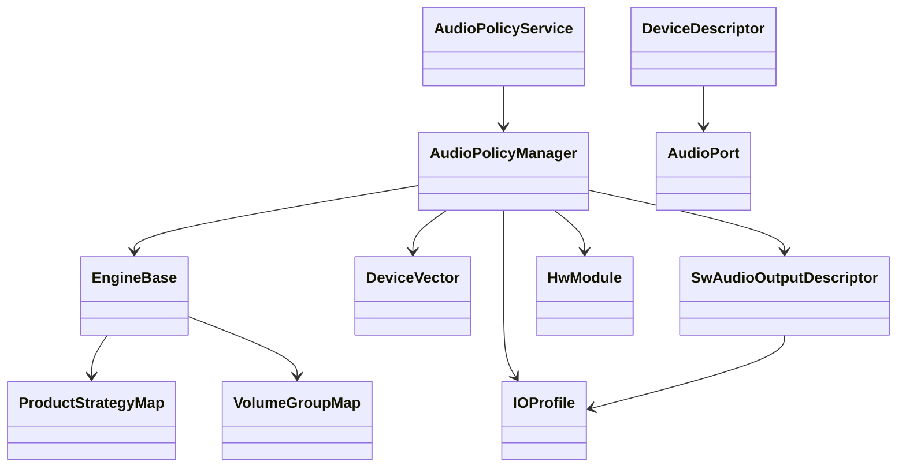

### 核心路由决策（[`getOutputForAttrInt()`](frameworks/av/services/audiopolicy/managerdefault/AudioPolicyManager.cpp:1147)）

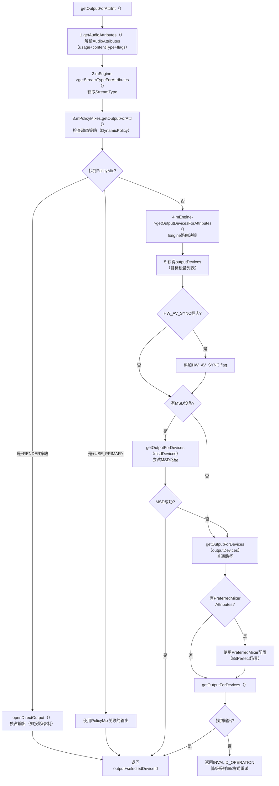

### getOutputForAttrInt()路由决策5步详解

**步骤1: AudioAttributes解析** — [`getAudioAttributes()`](frameworks/av/services/audiopolicy/managerdefault/AudioPolicyManager.cpp:1172)
- 将传入的attr/stream转换为统一的audio_attributes_t
- 合入`mAllowedCapturePolicies`中的隐私flag(如FLAG_CAPTURE_PRIVATE)

**步骤2: StreamType映射** — [`mEngine->getStreamTypeForAttributes()`](frameworks/av/services/audiopolicy/managerdefault/AudioPolicyManager.cpp:1179)
- AudioAttributes → StreamType(兼容旧API)
- 如`usage=MEDIA` → `STREAM_MUSIC`

**步骤3: 动态策略匹配** — [`mPolicyMixes.getOutputForAttr()`](frameworks/av/services/audiopolicy/managerdefault/AudioPolicyManager.cpp:1194)
- 检查是否有匹配的DynamicPolicy(如投影/远程录制)
- 如果找到，使用PolicyMix关联的输出
- `RENDER`策略: 直接独占输出(如Cast)
- `USE_PRIMARY`策略: 走主输出

**步骤4: Engine路由决策** — [`mEngine->getOutputDevicesForAttributes()`](frameworks/av/services/audiopolicy/managerdefault/AudioPolicyManager.cpp:1256)
- 这是**核心路由决策**：AudioAttributes → ProductStrategy → 设备选择
- 考虑因素：可用设备集合、ForceUse、电话模式、设备优先级

**步骤5: 输出匹配与创建** — [`getOutputForDevices()`](frameworks/av/services/audiopolicy/managerdefault/AudioPolicyManager.cpp:1305)
- 在已有输出中查找匹配的：format/sampleRate/channelMask/flags
- 如果找不到 → `openOutput()`创建新PlaybackThread
- 特殊处理: MSD路径/PreferredMixerAttributes/BitPerfect/INCALL_MUSIC

---

## 6.3 EngineBase — 可插拔策略引擎

### 模块职责
[`EngineBase`](frameworks/av/services/audiopolicy/engine/common/include/EngineBase.h:28)是音频策略引擎的基类，Vendor可以继承实现自定义路由引擎。

### 核心接口方法

| 方法 | 说明 |
|------|------|
| `getProductStrategyForAttributes()` | AudioAttributes → 策略映射 |
| `getOutputDevicesForAttributes()` | 策略 → 输出设备选择 |
| `getInputDevicesForAttributes()` | 策略 → 输入设备选择 |
| `getVolumeGroupForAttributes()` | AudioAttributes → 音量组映射 |
| `setPhoneState()` | 设置电话模式(NORMAL/RINGING/IN_CALL) |
| `setForceUse()` | 设置强制使用配置(如FOR_MEDIA: FORCE_SPEAKER) |
| `setDeviceConnectionState()` | 设备连接状态变更 |

### ProductStrategy — 策略映射

ProductStrategy将AudioAttributes映射到路由策略。定义在`audio_policy_engine_configuration.xml`：


策略排序（[`getOrderedProductStrategies()`](frameworks/av/services/audiopolicy/engine/common/include/EngineBase.h:66)）：
```
策略优先级（从高到低）:
1. strategy_emergency  → 紧急报警(强制Speaker最大音量)
2. strategy_safety     → 安全提示(强制Speaker)
3. strategy_call       → 电话通话(Earpiece/BT SCO)
4. strategy_navigation → 导航提示(当前活跃设备+ducking)
5. strategy_media      → 媒体音乐(A2DP优先)
6. strategy_notification → 通知(跟随媒体设备)
7. strategy_system     → 系统音(跟随媒体设备)
```

> **关键设计**: ProductStrategy优先级决定了多路并发时的交互行为(谁duck谁mute)，与Focus交互矩阵紧密配合。

### VolumeGroup — 音量分组

VolumeGroup将AudioAttributes映射到音量组，定义在`audio_policy_engine_configuration.xml`：


**VolumeGroup与StreamType关系**:
- VolumeGroup是AIDL/AOSP 9+的新概念，替代了旧的StreamType音量管理
- 每个VolumeGroup有独立的音量曲线(按设备类别区分)
- 多个AudioAttributes可以映射到同一VolumeGroup(共享音量)
- `AudioService.mStreamVolumeAlias`实现StreamType→VolumeGroup的兼容映射

---

## 6.4 Device Routing — 设备路由

### 设备连接处理（[`setDeviceConnectionStateInt()`](frameworks/av/services/audiopolicy/managerdefault/AudioPolicyManager.cpp:175)）

```mermaid
sequenceDiagram
    participant App, APS, APM, Engine, AF, HAL
    App->>APS: setDeviceConnectionState(BT_A2DP, AVAILABLE)
    APS->>APM: setDeviceConnectionStateInt()
    APM->>APM: mAvailableOutputDevices.add(BT_device)
    APM->>APM: broadcastDeviceConnectionState(CONNECTED)
    APM->>APM: checkOutputsForDevice()
    APM->>Engine: 重评估所有活跃Track的路由
    Engine-->>APM: 部分Track应路由到BT
    APM->>AF: openOutput() (为新设备创建PlaybackThread)
    AF->>HAL: openOutputStream(A2DP profile)
    APM->>APM: 迁移活跃Track到新输出
```

### Force Use机制

Force Use允许系统临时强制改变路由：

| Force Use | 强制配置 | 说明 |
|-----------|---------|------|
| FOR_COMMUNICATION | FORCE_SPEAKER | 通话强制扬声器 |
| FOR_MEDIA | FORCE_SPEAKER | 媒体强制扬声器 |
| FOR_MEDIA | FORCE_HEADPHONES | 媒体强制耳机 |
| FOR_RECORD | FORCE_BT_SCO | 录音强制蓝牙SCO |

### 设备优先级

当多个设备可用时，APM按优先级选择：
```
有线耳机(wired_headset) > USB(usb_headset) > 蓝牙A2DP(bt_a2dp) > 扬声器(speaker)
```

可通过`setDevicesRoleForStrategy()`修改优先级（OEM定制点）。

---

## 6.5 SwAudioOutputDescriptor — 输出流描述

### 模块职责
SwAudioOutputDescriptor描述一个已打开的输出流，关联IOProfile、活跃Track列表、音量、路由设备等。

### 关键数据结构

| 字段 | 说明 |
|------|------|
| `mProfile` | 关联的IOProfile（HAL输出能力描述） |
| `mDevices` | 当前路由的设备列表 |
| `mActiveTracks` | 活跃的TrackClientDescriptor列表 |
| `mVolumeSource` | 音量来源（VolumeGroup id） |
| `mFlags` | 输出flags(DIRECT/OFFLOAD/FAST等) |

---

## 6.6 IOProfile与HwModule — HAL能力描述

### IOProfile
IOProfile描述HAL模块的输出/输入能力：
- 支持的采样率列表（48000, 44100等）
- 支持的格式列表（PCM_16bit, PCM_FLOAT等）
- 支持的通道掩码列表（STEREO, MONO等）
- 支持的设备列表（speaker, headset等）

### HwModule
HwModule对应一个Audio HAL模块（如primary、a2dp、usb）：
- 包含多个IOProfile（输出+输入）
- 包含DeviceDescriptor列表
- 对应HAL库路径（如`/vendor/lib/hw/audio.primary.xxx.so`）

---

## 6.7 Focus Policy — 外部焦点策略

### 模块职责

Android允许外部AudioPolicy注册为焦点策略(Focus Policy)，接管默认的MediaFocusControl焦点仲裁。AAOS即使用此机制。

### 外部焦点策略注册

```mermaid
sequenceDiagram
    participant App, AM, AS, MFC, ExtPolicy
    App->>AM: registerAudioPolicy(AudioPolicy)
    AM->>AS: registerAudioPolicy() [Binder]
    AS->>MFC: setFocusPolicy(AudioPolicy)
    MFC->>MFC: mFocusPolicy = audioPolicy
    Note over MFC: 之后所有焦点请求<br>先交给外部策略处理
```

### 外部策略焦点请求流程

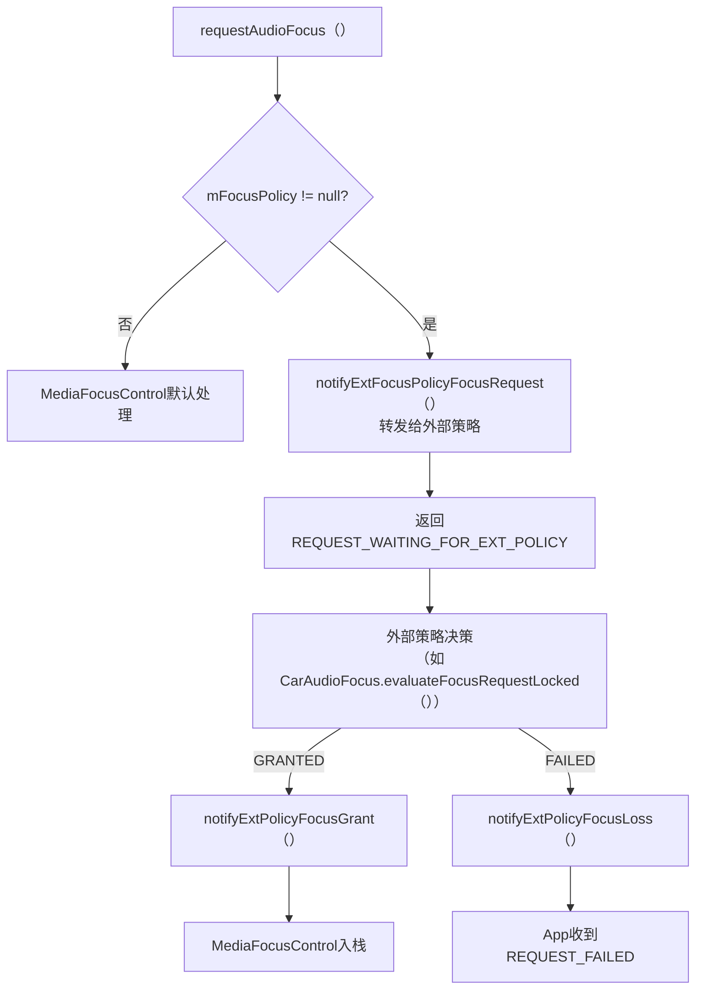

### AAOS中的Focus Policy

CarAudioService注册AudioPolicy作为外部焦点策略：

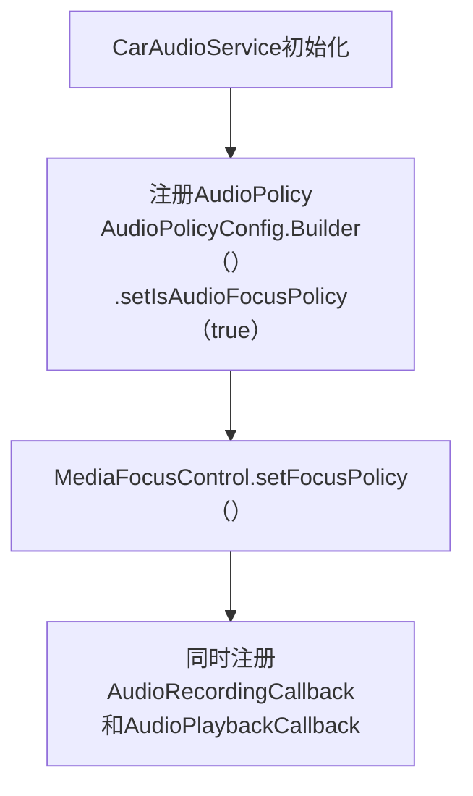

**关键代码**：[`CarAudioService.setupAudioPolicy()`](packages/services/Car/service/src/com/android/car/audio/CarAudioService.java)

当外部策略启用时：
1. 所有焦点请求先转发给CarAudioFocus评估
2. CarAudioFocus根据交互矩阵决策GRANT/REJECT
3. 决策结果回传给MediaFocusControl执行入栈/拒绝
4. 焦点变化通知AudioControl HAL

---

## 6.8 AudioPolicyMix — 动态策略路由

[`AudioPolicyMix`](frameworks/av/services/audiopolicy/common/managerdefinitions/include/AudioPolicyMix.h:35)继承AudioMix，允许App注册自定义路由规则，实现投屏、远程录制、多输出分流等场景。

### 6.8.1 AudioMix类型与路由模式

| Mix类型 | 说明 | 典型场景 |
|---------|------|---------|
| `MIX_TYPE_PLAYERS` | 拦截播放音频 | 投屏(Cast)/屏幕录制 |
| `MIX_TYPE_RECORDERS` | 拦截录音音频 | 远程录音源 |

| 路由模式(RouteFlag) | 说明 | 效果 |
|---------------------|------|------|
| `MIX_ROUTE_FLAG_LOOP_BACK` | 回环路由 | 创建RemoteSubmix虚拟设备，App通过AudioRecord(AUDIO_SOURCE_REMOTE_SUBMIX)捕获 |
| `MIX_ROUTE_FLAG_RENDER` | 直接渲染 | 独占输出到指定设备(如Cast到HDMI) |
| `MIX_ROUTE_FLAG_LOOP_BACK_AND_RENDER` | 回环+渲染 | 同时回环捕获和渲染到指定设备 |

### 6.8.2 注册流程

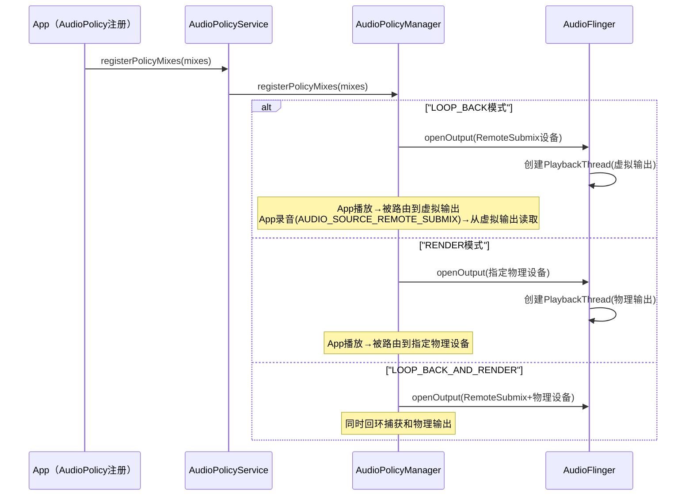

### 6.8.3 动态策略匹配 — getOutputForAttr()

在[`getOutputForAttrInt()`](frameworks/av/services/audiopolicy/managerdefault/AudioPolicyManager.cpp:1158)的第3步中：

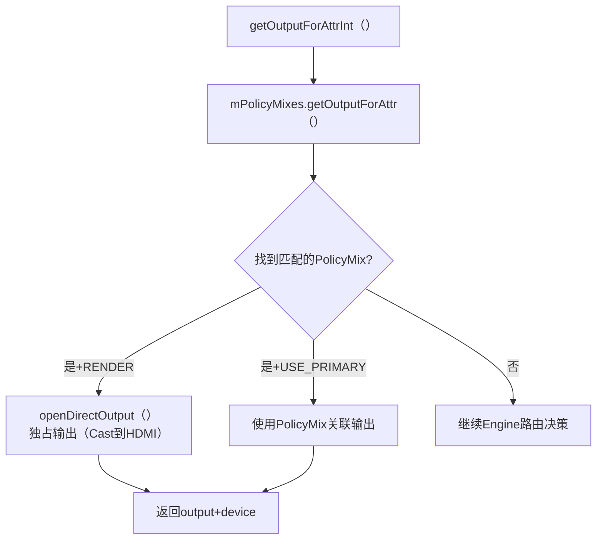

### 6.8.4 AudioMix匹配规则

[`AudioPolicyMixCollection.mixMatch()`](frameworks/av/services/audiopolicy/common/managerdefinitions/src/AudioPolicyMix.cpp:345)匹配规则：

| 规则维度 | 说明 |
|----------|------|
| `mMix.mCriteria` | AudioAttributes匹配规则(usage/contentType/flags) |
| `mMix.mRouteFlags` | 路由模式(LOOP_BACK/RENDER) |
| `mMix.mDeviceType` | 目标设备类型(如HDMI/A2DP) |
| `mMix.mDeviceAddress` | 目标设备地址 |
| UID/UserId亲和性 | `setUidDeviceAffinities()`/`setUserIdDeviceAffinities()` — 限制特定用户路由 |

### 6.8.5 典型应用场景

| 场景 | Mix类型 | RouteFlag | 说明 |
|------|---------|-----------|------|
| 屏幕录制(MediaProjection) | PLAYERS | LOOP_BACK | 创建虚拟Submix，录制App读取 |
| Cast投影到HDMI | PLAYERS | RENDER | 音频直接输出到HDMI |
| 远程录音(投屏+录制) | PLAYERS | LOOP_BACK_AND_RENDER | 同时回环+物理输出 |
| 多用户隔离路由 | PLAYERS | RENDER | UserId亲和性路由到不同设备 |
| 辅助功能音频捕获 | PLAYERS | LOOP_BACK | AccessibilityService截获播放 |

> **关键设计**: AudioPolicyMix是App注册动态路由的唯一机制。LOOP_BACK模式创建的RemoteSubmix设备是虚拟的，数据流为: App播放→虚拟PlaybackThread→共享内存→App录音(REMOTE_SUBMIX源)读取。

---

## 6.9 EngineInterface — 策略引擎接口

### 模块职责

[`EngineInterface`](frameworks/av/services/audiopolicy/engine/interface/EngineInterface.h:49)是策略引擎的纯虚接口类，定义了策略引擎与AudioPolicyManager之间的完整契约。所有策略引擎实现（EngineDefault/EngineConfigurable）必须实现此接口。

### 核心类图

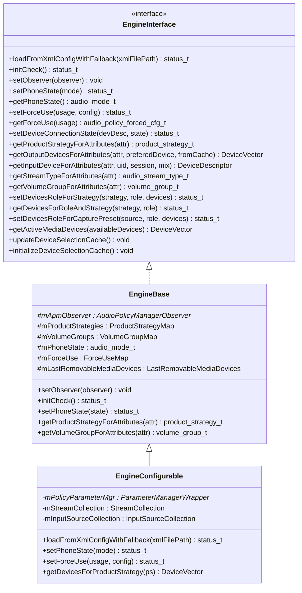

### 核心方法分类

| 方法分类 | 方法 | 说明 |
|----------|------|------|
| **初始化** | [`loadFromXmlConfigWithFallback()`](frameworks/av/services/audiopolicy/engine/interface/EngineInterface.h:61) | 加载XML策略配置，失败时Fallback到默认配置 |
| **初始化** | [`initCheck()`](frameworks/av/services/audiopolicy/engine/interface/EngineInterface.h:69) | 检查引擎是否正确初始化 |
| **Observer** | [`setObserver()`](frameworks/av/services/audiopolicy/engine/interface/EngineInterface.h:76) | 设置APM观察者，让Engine获取设备/HwModule信息 |
| **状态管理** | [`setPhoneState()`](frameworks/av/services/audiopolicy/engine/interface/EngineInterface.h:84) / [`setForceUse()`](frameworks/av/services/audiopolicy/engine/interface/EngineInterface.h:96) | 设置电话模式/强制路由 |
| **路由决策** | [`getOutputDevicesForAttributes()`](frameworks/av/services/audiopolicy/engine/interface/EngineInterface.h:133) | 核心路由方法：AudioAttributes→输出设备 |
| **路由决策** | [`getInputDeviceForAttributes()`](frameworks/av/services/audiopolicy/engine/interface/EngineInterface.h:166) | 输入路由：AudioAttributes→输入设备 |
| **策略映射** | [`getProductStrategyForAttributes()`](frameworks/av/services/audiopolicy/engine/interface/EngineInterface.h:114) | AudioAttributes→ProductStrategy映射 |
| **音量管理** | [`getVolumeGroupForAttributes()`](frameworks/av/services/audiopolicy/engine/interface/EngineInterface.h:234) | AudioAttributes→VolumeGroup映射 |
| **设备角色** | [`setDevicesRoleForStrategy()`](frameworks/av/services/audiopolicy/engine/interface/EngineInterface.h:264) | 设置策略的设备角色(PREFERRED/DISABLED) |
| **缓存管理** | [`updateDeviceSelectionCache()`](frameworks/av/services/audiopolicy/engine/interface/EngineInterface.h:218) / [`initializeDeviceSelectionCache()`](frameworks/av/services/audiopolicy/engine/interface/EngineInterface.h:310) | 设备选择缓存更新/初始化 |

### 类型定义

```cpp
using DeviceStrategyMap = std::map<product_strategy_t, DeviceVector>;
using StrategyVector = std::vector<product_strategy_t>;
using VolumeGroupVector = std::vector<volume_group_t>;
using CapturePresetDevicesRoleMap =
    std::map<std::pair<audio_source_t, device_role_t>, AudioDeviceTypeAddrVector>;
```

### 工厂函数

Engine通过C风格工厂函数创建，实现编译时切换：

```cpp
// EngineInterface.h:460
extern "C" EngineInterface* createEngineInstance();
extern "C" void destroyEngineInstance(EngineInterface *engine);
```

- **EngineDefault**: `frameworks/av/services/audiopolicy/enginedefault/src/EngineInstance.cpp`
- **EngineConfigurable**: `frameworks/av/services/audiopolicy/engineconfigurable/src/EngineInstance.cpp`

> **关键设计**: EngineInterface采用纯虚接口+工厂函数模式，AudioPolicyManager通过`createEngineInstance()`获取引擎实例，编译时选择链接哪个实现库（libaudiopolicyengineconfigurable或libaudiopolicyenginedefault）。

---

## 6.10 EngineConfigurable — Parameter Framework可配置引擎

### 模块职责

[`Engine`](frameworks/av/services/audiopolicy/engineconfigurable/src/Engine.h:37)（EngineConfigurable）是基于Parameter Framework（PFW）的可插拔策略引擎实现，继承[`EngineBase`](frameworks/av/services/audiopolicy/engine/common/include/EngineBase.h:28)并实现[`AudioPolicyPluginInterface`](frameworks/av/services/audiopolicy/engineconfigurable/interface/AudioPolicyPluginInterface.h)。与EngineDefault的硬编码策略不同，EngineConfigurable通过PFW规则文件（.pfw）定义路由策略。

### 架构关系

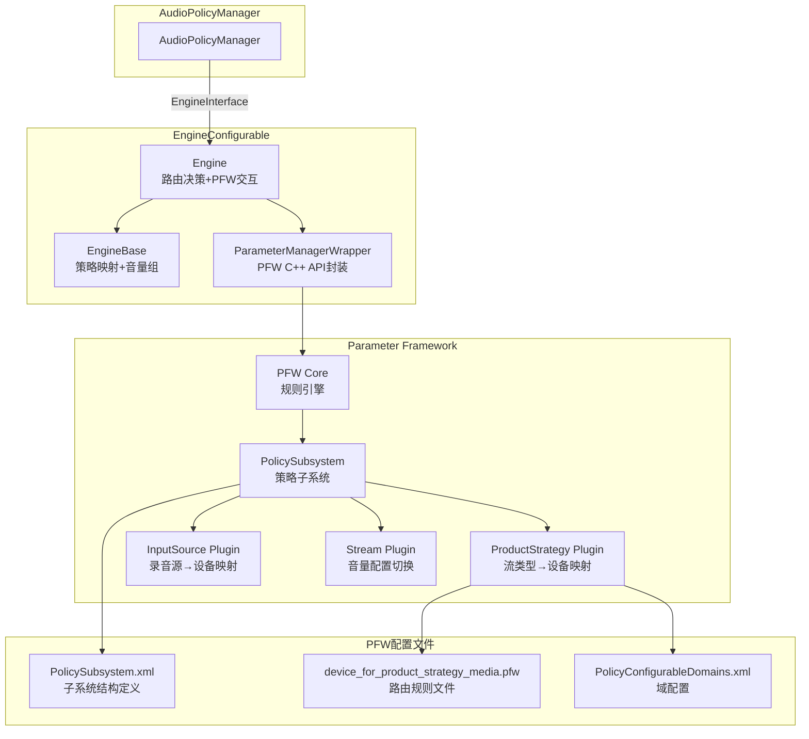

### PFW Plugin体系

| Plugin类 | 源码位置 | 职责 |
|----------|---------|------|
| [`PolicySubsystem`](frameworks/av/services/audiopolicy/engineconfigurable/parameter-framework/plugin/PolicySubsystem.h) | `parameter-framework/plugin/PolicySubsystem.cpp` | PFW子系统入口，创建子Plugin |
| [`ProductStrategy`](frameworks/av/services/audiopolicy/engineconfigurable/parameter-framework/plugin/ProductStrategy.h) | `parameter-framework/plugin/ProductStrategy.cpp` | 管理策略的设备类型和地址属性 |
| [`Stream`](frameworks/av/services/audiopolicy/engineconfigurable/parameter-framework/plugin/Stream.h) | `parameter-framework/plugin/Stream.cpp` | 管理Stream的音量配置切换 |
| [`InputSource`](frameworks/av/services/audiopolicy/engineconfigurable/parameter-framework/plugin/InputSource.h) | `parameter-framework/plugin/InputSource.cpp` | 管理录音源→设备映射 |

### PFW规则文件示例

Phone配置中的路由规则文件（[`device_for_product_strategy_media.pfw`](frameworks/av/services/audiopolicy/engineconfigurable/parameter-framework/examples/Phone/Settings/device_for_product_strategy_media.pfw)）：

```
# media策略路由规则
# 当可用设备包含A2DP时，选择A2DP
{AvailableOutputDevicesIncludes,A2DP} == 1 && {ForceUseForMedia,NOT_FORCED} == 1
    => device={AUDIO_DEVICE_OUT_BLUETOOTH_A2DP}

# 强制Speaker时
{ForceUseForMedia,FORCE_SPEAKER} == 1
    => device={AUDIO_DEVICE_OUT_SPEAKER}

# 有线耳机优先
{AvailableOutputDevicesIncludes,WIRED_HEADPHONE} == 1
    => device={AUDIO_DEVICE_OUT_WIRED_HEADPHONE}

# 默认回退到Speaker
* => device={AUDIO_DEVICE_OUT_SPEAKER}
```

Automotive配置（[`device_for_product_strategies.pfw`](frameworks/av/services/audiopolicy/engineconfigurable/parameter-framework/examples/Car/Settings/device_for_product_strategies.pfw)，19.2KB）将所有策略路由规则集中在一个文件中，按策略分区定义。

### EngineConfigurable vs EngineDefault

| 对比维度 | EngineDefault | EngineConfigurable |
|----------|---------------|-------------------|
| 路由决策 | C++硬编码逻辑 | PFW规则文件(.pfw)驱动 |
| 策略修改 | 修改C++代码重新编译 | 修改.pfw/XML配置即可 |
| 适用场景 | 手机等标准设备 | Automotive等需灵活定制的设备 |
| 音量曲线切换 | 硬编码 | PFW Stream Plugin动态切换 |
| 初始化 | 直接加载XML配置 | 加载XML + 启动PFW引擎 |
| 依赖库 | libaudiopolicyenginedefault | libaudiopolicyengineconfigurable + libpfw |

### getDevicesForProductStrategy()路由决策流程

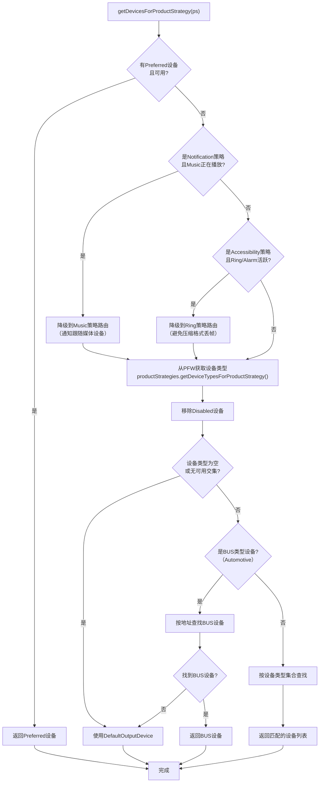

> **关键设计**: EngineConfigurable的Notification跟随Music策略是程序化处理的，因为PFW无法感知Stream的活动状态。这种程序化+规则化的混合方式是EngineConfigurable的典型特征。

---

## 6.11 EngineConfig — 策略配置解析

### 模块职责

[`EngineConfig`](frameworks/av/services/audiopolicy/engine/config/src/EngineConfig.cpp)负责解析`audio_policy_engine_configuration.xml`及其子配置文件，构建策略引擎运行时所需的数据结构。

### 配置文件结构

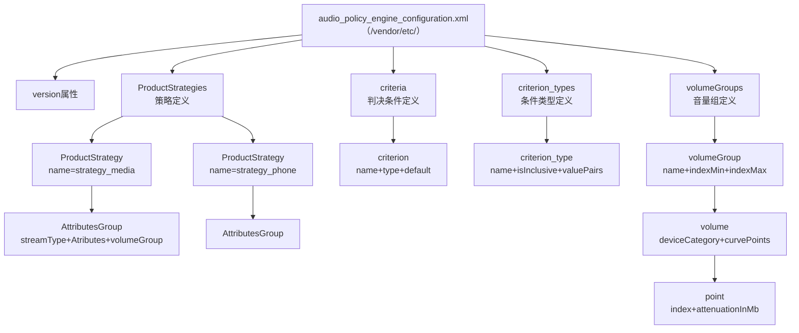

### 核心数据结构

定义在[`EngineConfig.h`](frameworks/av/services/audiopolicy/engine/config/include/EngineConfig.h)：

| 结构体 | 字段 | 说明 |
|--------|------|------|
| `AttributesGroup` | stream + volumeGroup + attributesVect | 策略内的属性分组 |
| `CurvePoint` | index + attenuationInMb | 音量曲线点（索引,毫贝衰减） |
| `VolumeCurve` | deviceCategory + curvePoints | 设备类别的音量曲线 |
| `VolumeGroup` | name + indexMin + indexMax + volumeCurves | 音量组定义 |
| `ProductStrategy` | name + attributesGroups | 产品策略定义 |
| `CriterionType` | name + isInclusive + valuePairs | PFW条件类型 |
| `Criterion` | name + typeName + defaultLiteralValue | PFW判决条件 |
| `Config` | version + productStrategies + criteria + criterionTypes + volumeGroups | 完整配置 |

### 解析流程

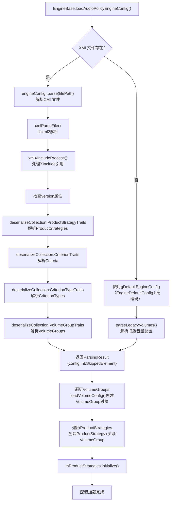

### Fallback机制

当XML配置文件不存在或解析失败时，引擎使用[`EngineDefaultConfig.h`](frameworks/av/services/audiopolicy/engine/common/include/EngineDefaultConfig.h)中的硬编码默认配置：

```cpp
// EngineBase.cpp:169
if (result.parsedConfig == nullptr) {
    ALOGD("No configuration found, using default matching phone experience.");
    engineConfig::Config config = gDefaultEngineConfig;  // 硬编码默认
    android::status_t ret = engineConfig::parseLegacyVolumes(config.volumeGroups);
    result = {std::make_unique<engineConfig::Config>(config), ...};
}
```

此外，系统还会追加内部策略和音量组：
```cpp
// 追加系统内部音量组（如rerouting/patch）
result.parsedConfig->volumeGroups.insert(..., gSystemVolumeGroups, ...);
// 追加系统内部策略
result.parsedConfig->productStrategies.insert(..., gOrderedSystemStrategies, ...);
```

### XML序列化Trait体系

EngineConfig使用模板化的Trait模式实现XML反序列化：

| Trait | XML标签 | 解析对象 |
|-------|---------|---------|
| `ProductStrategyTraits` | `<ProductStrategy>` / `<ProductStrategies>` | 产品策略 |
| `AttributesGroupTraits` | `<AttributesGroup>` / `<AttributesGroups>` | 属性分组 |
| `CriterionTraits` | `<criterion>` / `<criteria>` | PFW条件 |
| `CriterionTypeTraits` | `<criterion_type>` / `<criterion_types>` | PFW条件类型 |
| `VolumeGroupTraits` | `<volumeGroup>` / `<volumeGroups>` | 音量组 |
| `VolumeTraits` | `<volume>` / `<volumes>` | 音量曲线 |
| `ValueTraits` | `<value>` / `<values>` | 键值对 |

> **关键设计**: EngineConfig的Trait模式将XML解析与数据结构解耦，新增配置元素只需定义Trait特化即可，无需修改解析框架。XInclude机制允许将大型配置拆分为多个子文件（如automotive配置拆分为product_strategies/volumes/criteria三个子文件）。

---

## 6.12 VolumeCurve — 音量曲线

### 模块职责

[`VolumeCurve`](frameworks/av/services/audiopolicy/engine/common/include/VolumeCurve.h:52)实现音量索引到分贝值的映射曲线，支持按设备类别区分不同的衰减特性。

### 类关系

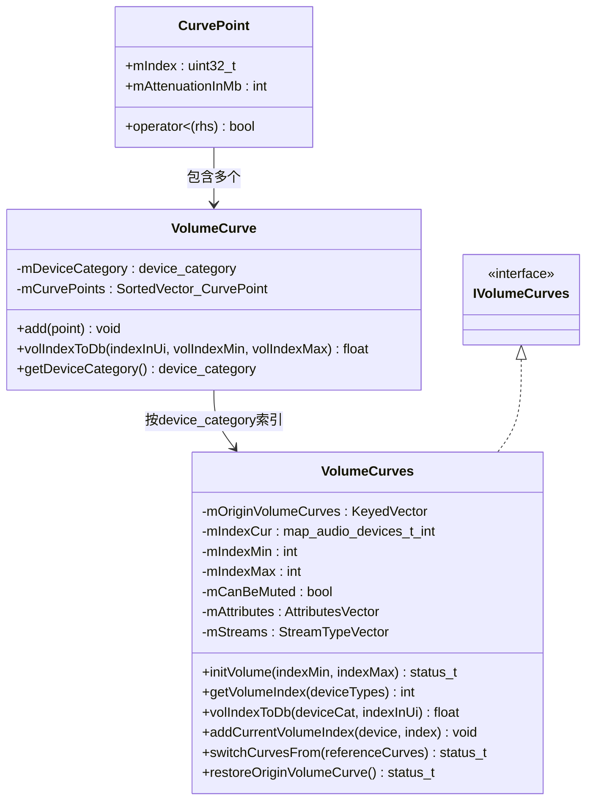

### volIndexToDb()插值算法

[`VolumeCurve::volIndexToDb()`](frameworks/av/services/audiopolicy/engine/common/src/VolumeCurve.cpp:30)将UI音量索引转换为dB值，使用线性插值：

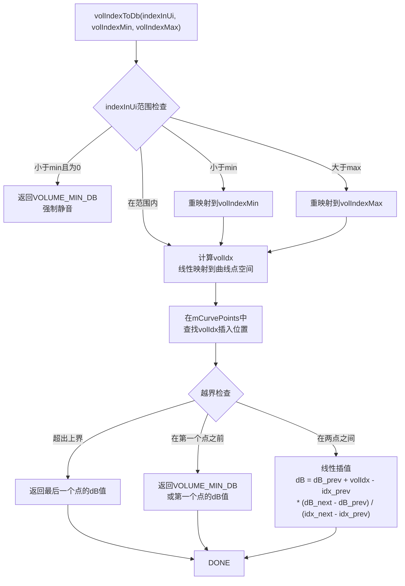

### 曲线点格式

CurvePoint由两个值组成：
- **mIndex**: 曲线空间内的索引（0-100映射区间）
- **mAttenuationInMb**: 衰减值，单位为毫贝（millibel，1/100 dB）

```
示例: {0, -9600} 表示索引0处衰减-96dB
      {33, -4800} 表示索引33处衰减-48dB
      {66, -2400} 表示索引66处衰减-24dB
      {100, 0}    表示索引100处衰减0dB（原音量）
```

### 默认音量曲线（per设备类别）

| 设备类别 | 曲线特征 | 典型应用 |
|----------|---------|---------|
| `DEVICE_CATEGORY_SPEAKER` | 低音量段衰减快，保护扬声器 | 手机外放 |
| `DEVICE_CATEGORY_HEADSET` | 全段较平缓，保护听力 | 有线耳机 |
| `DEVICE_CATEGORY_A2DP` | 中段线性，蓝牙传输特性 | 蓝牙耳机 |
| `DEVICE_CATEGORY_EARPIECE` | 低音量段极陡，听筒功率小 | 手机听筒 |
| `DEVICE_CATEGORY_HEARING_AID` | 辅听设备专用曲线 | 助听器 |

### VolumeCurves的曲线切换

[`VolumeCurves`](frameworks/av/services/audiopolicy/engine/common/include/VolumeCurve.h:71)支持运行时切换音量曲线：

```cpp
// 进入通话时：DTMF使用VOICE_CALL的音量曲线
switchVolumeCurve(AUDIO_STREAM_VOICE_CALL, AUDIO_STREAM_DTMF);

// 退出通话时：恢复DTMF原始曲线
restoreOriginVolumeCurve(AUDIO_STREAM_DTMF);
```

`mOriginVolumeCurves`保存初始曲线用于恢复，`switchCurvesFrom()`替换当前活跃曲线，`restoreOriginVolumeCurve()`从备份恢复。

> **关键设计**: VolumeCurve的毫贝（millibel）单位提供了0.01dB的精度，足以覆盖人耳可分辨的最小音量差异。插值算法确保UI音量滑块的每一步变化都有平滑的dB变化，避免听感跳变。

---

## 6.13 LastRemovableMediaDevices — 可移除设备追踪

### 模块职责

[`LastRemovableMediaDevices`](frameworks/av/services/audiopolicy/engine/common/include/LastRemovableMediaDevices.h:33)追踪最后连接的可移除媒体设备（蓝牙/有线耳机/USB），在设备拔出且无其他可用设备时提供回退目标。这直接决定了"拔出耳机后音频切回Speaker"的行为。

### 设备分组

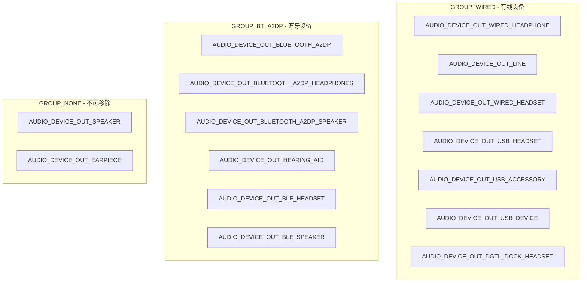

### 设备追踪逻辑

[`setRemovableMediaDevices()`](frameworks/av/services/audiopolicy/engine/common/src/LastRemovableMediaDevices.cpp:25)使用FIFO（先进先出）策略维护设备列表：

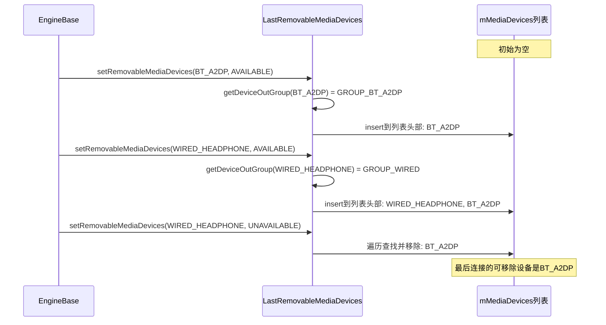

### 设备选择中的应用

在[`EngineBase::setDeviceConnectionState()`](frameworks/av/services/audiopolicy/engine/common/src/EngineBase.cpp:70)中，每次设备连接/断开时更新追踪：

```cpp
// EngineBase.cpp:70
status_t EngineBase::setDeviceConnectionState(const sp<DeviceDescriptor> devDesc,
                                              audio_policy_dev_state_t state) {
    audio_devices_t deviceType = devDesc->type();
    if ((deviceType != AUDIO_DEVICE_NONE) && audio_is_output_device(deviceType)
            && deviceType != AUDIO_DEVICE_OUT_DGTL_DOCK_HEADSET
            && deviceType != AUDIO_DEVICE_OUT_BLE_BROADCAST) {
        mLastRemovableMediaDevices.setRemovableMediaDevices(devDesc, state);
    }
    return NO_ERROR;
}
```

**特殊排除**: `AUDIO_DEVICE_OUT_DGTL_DOCK_HEADSET`（USB底座）和`AUDIO_DEVICE_OUT_BLE_BROADCAST`（LE Audio广播）不参与可移除设备追踪，因为它们有独立的策略逻辑。

### getLastRemovableMediaDevice()

[`getLastRemovableMediaDevice()`](frameworks/av/services/audiopolicy/engine/common/src/LastRemovableMediaDevices.cpp:61)返回最后连接的可移除设备，支持按组和排除列表过滤：

```cpp
// 参数:
//   excludedDevices - 需要排除的设备列表
//   group - 设备组过滤(GROUP_WIRED/GROUP_BT_A2DP/GROUP_NONE=不过滤)
// 返回: 最后连接的可移除设备，或nullptr
sp<DeviceDescriptor> getLastRemovableMediaDevice(
    const DeviceVector& excludedDevices,
    device_out_group_t group = GROUP_NONE) const;
```

> **关键设计**: LastRemovableMediaDevices的"后进先出"策略（最新的设备排在列表头部）确保了"最后连接的设备优先"行为。当蓝牙和有线耳机同时连接时，后连接的设备优先级更高；当所有可移除设备断开时，音频自然回退到Speaker等内置设备。

---

## 6.14 AudioPolicyManagerObserver — 观察者接口

### 模块职责

[`AudioPolicyManagerObserver`](frameworks/av/services/audiopolicy/engine/interface/AudioPolicyManagerObserver.h:37)是Engine获取AudioPolicyManager状态的统一接口，采用Observer模式解耦Engine与APM的直接依赖。

### 接口方法

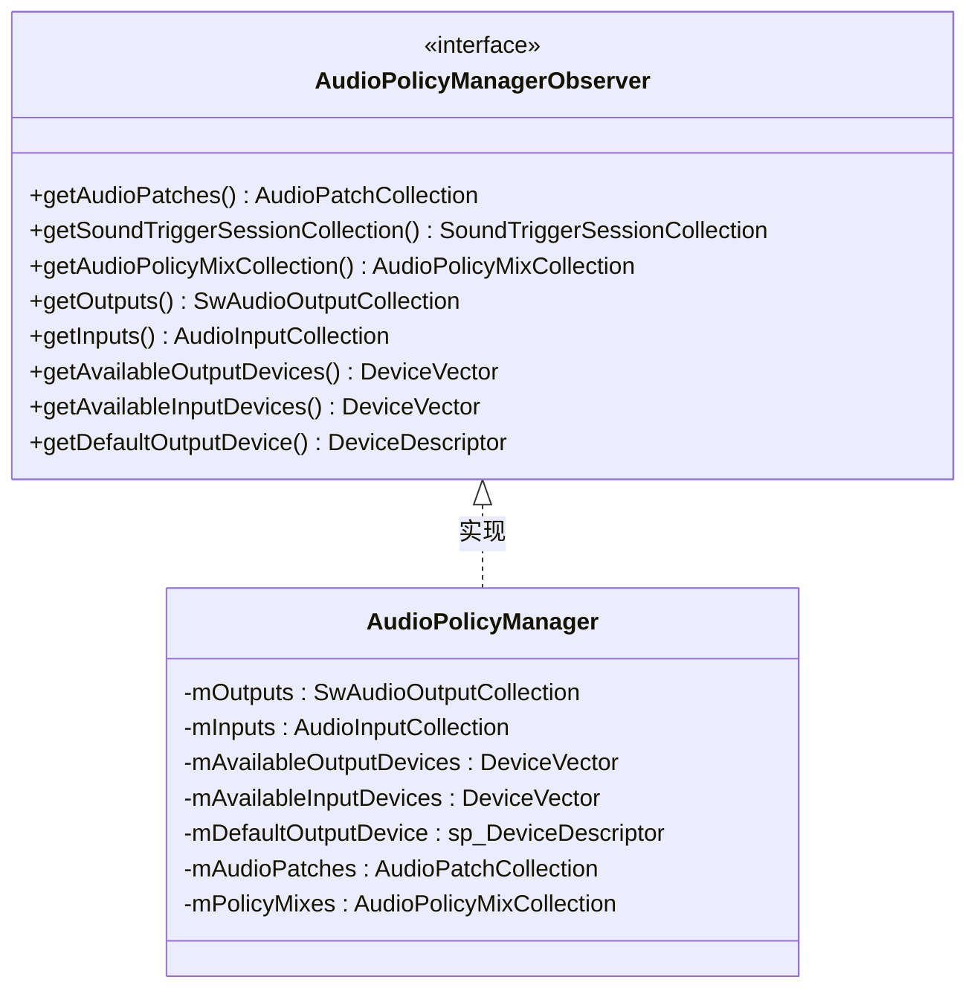

### Observer在Engine中的使用

Engine通过`mApmObserver`指针访问APM状态，在关键路由决策点获取实时信息：

| Engine方法 | Observer调用 | 用途 |
|------------|-------------|------|
| `getDevicesForProductStrategy()` | `getAvailableOutputDevices()` | 获取可用输出设备集合 |
| `getDevicesForProductStrategy()` | `getOutputs()` | 检查Stream活跃状态（如Music是否在播放） |
| `getDevicesForProductStrategy()` | `getDefaultOutputDevice()` | 无匹配设备时回退到默认设备 |
| `getInputDeviceForAttributes()` | `getAvailableInputDevices()` | 获取可用输入设备集合 |
| `getInputDeviceForAttributes()` | `getAudioPolicyMixCollection()` | 检查动态策略Mix匹配 |
| `getInputDeviceForAttributes()` | `getInputs()` | 检查输入流活跃状态 |
| `setDeviceConnectionState()` | `getAvailableOutputDevices()` | 同步PFW的设备可用性 |
| `setDevicesRoleForStrategy()` | `getAvailableOutputDevices()` | 禁用设备时更新PFW状态 |

### Observer设置流程

```mermaid
sequenceDiagram
    participant Main as main_mediaserver
    participant APS as AudioPolicyService
    participant APM as AudioPolicyManager
    participant Engine as EngineBase

    Main->>APS: instantiate()
    APS->>APM: new AudioPolicyManager()
    APM->>APM: 创建Engine实例<br>createEngineInstance()
    APM->>Engine: setObserver(this)<br>APM自身实现Observer接口
    Engine->>Engine: mApmObserver = observer<br>保存APM引用
    
    Note over Engine: 之后Engine可随时通过<br>mApmObserver获取APM状态
```

### Observer模式的优势

1. **解耦**: Engine不需要知道APM的内部实现，只依赖接口
2. **可测试**: 可以创建Mock Observer进行单元测试
3. **双向通信**: APM通过EngineInterface调用Engine，Engine通过Observer获取APM状态
4. **实时性**: Observer方法返回的是APM当前状态快照，确保路由决策基于最新信息

```mermaid
flowchart LR
    subgraph "AudioPolicyManager"
        APM_CORE[策略核心]
        OBS_IMPL[Observer接口实现]
    end
    subgraph "Engine"
        ENGINE_CORE[路由引擎]
        OBS_PTR[mApmObserver指针]
    end
    
    APM_CORE -->|"EngineInterface调用"| ENGINE_CORE
    ENGINE_CORE -->|"Observer查询"| OBS_PTR
    OBS_PTR -->|"返回设备/输出/输入状态"| OBS_IMPL
    OBS_IMPL -->|"提供数据"| APM_CORE
```

> **关键设计**: AudioPolicyManagerObserver是Engine与APM之间的"只读窗口"。Engine通过它获取APM的设备列表、输出集合、输入集合等信息，但不修改APM状态。所有状态修改仍通过EngineInterface的方法由APM主动调用。这种单向数据流设计避免了循环依赖和状态不一致问题。

---

> [← 上一篇：AudioFlinger](05_AudioFlinger.md) | [返回导航](README.md) | [下一篇：Effects Framework →](07_Effects_Framework.md)