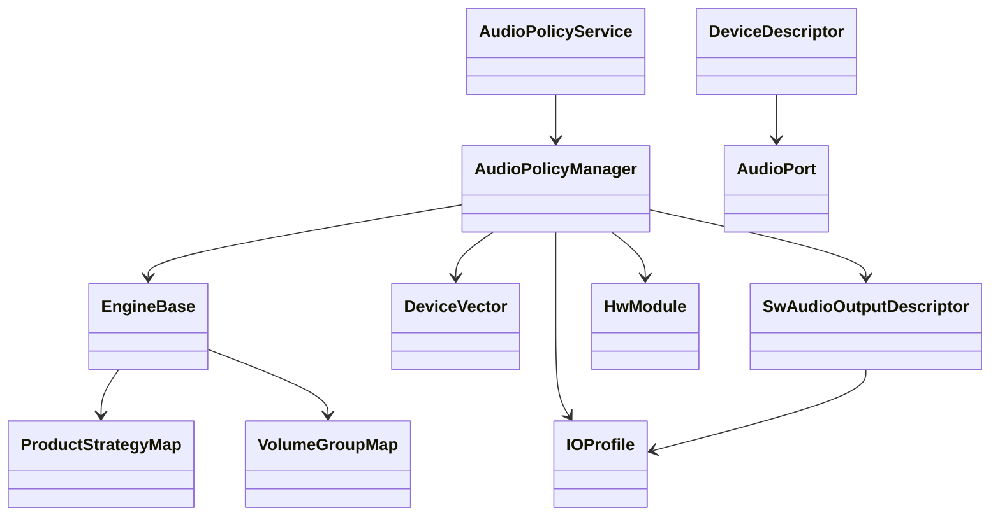
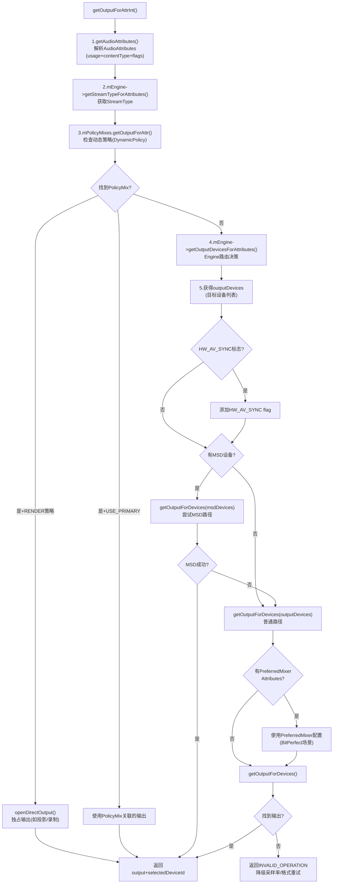
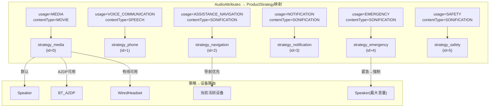
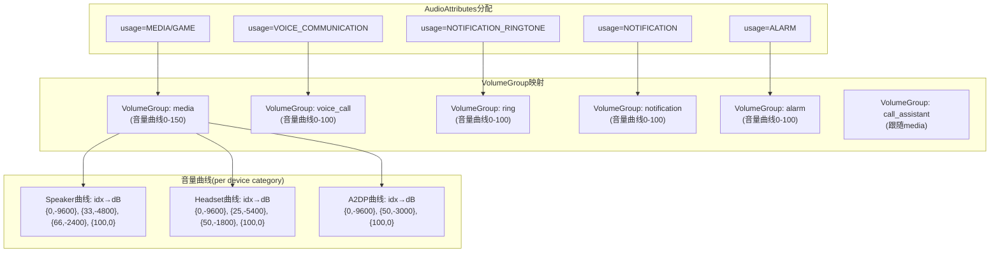
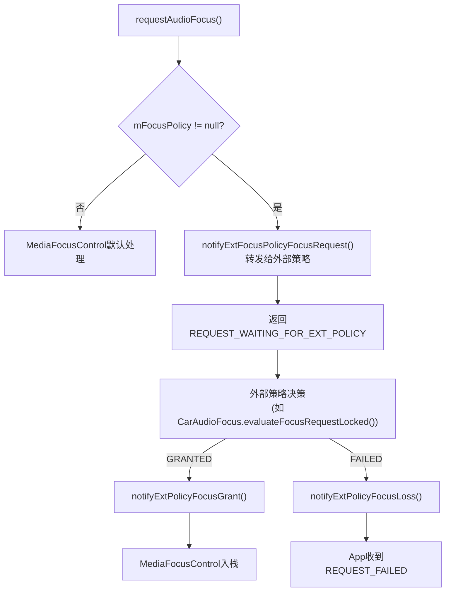
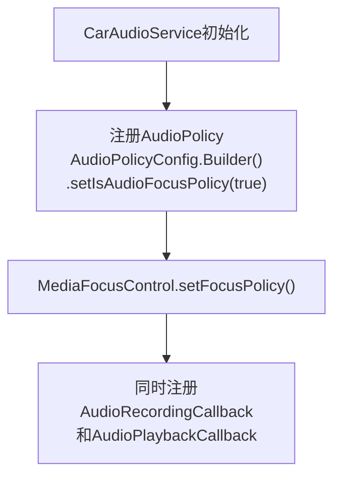
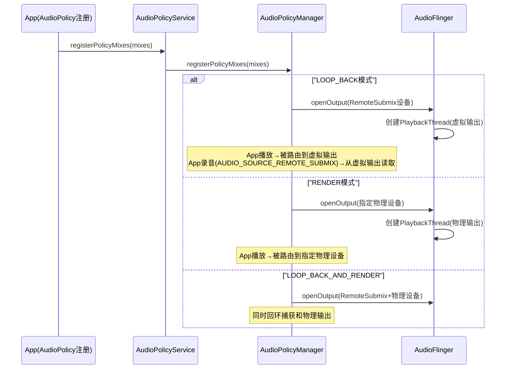
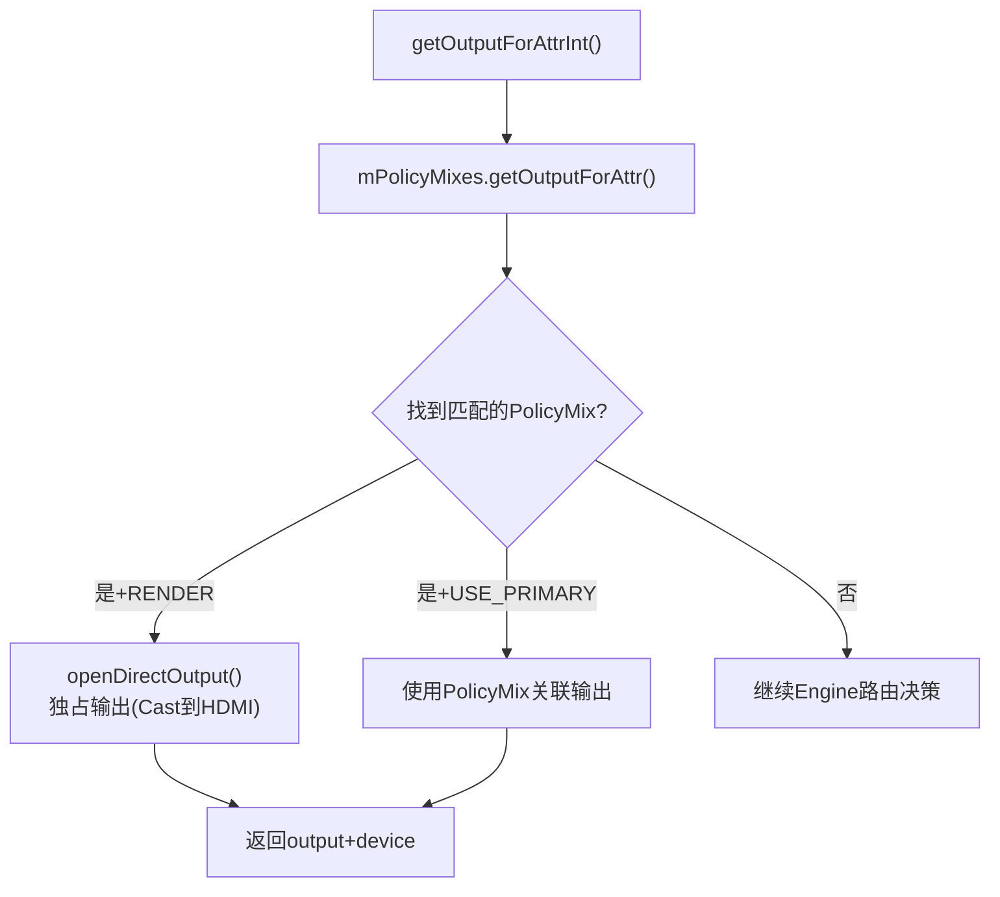

# 第六篇：Audio Policy Engine

> [← 上一篇：AudioFlinger](05_AudioFlinger.md) | [返回导航](README.md) | [下一篇：Effects Framework →](07_Effects_Framework.md)

---

## 6.1 AudioPolicyService — 控制面入口

### 模块职责
AudioPolicyService运行在mediaserver进程中，是音频策略控制面的入口。它管理路由决策、设备管理、音量控制、焦点协调等所有策略功能。

### 所属层级
Native Service → `frameworks/av/services/audiopolicy/`

### 初始化入口
```
main_mediaserver → new AudioPolicyService() → AudioPolicyManager::AudioPolicyManager()
  → EngineBase::loadAudioPolicyEngineConfig() → 解析策略配置XML
```

---

## 6.2 AudioPolicyManager — 策略核心实现

### 模块职责
AudioPolicyManager是音频路由决策的核心实现，决定了"音频数据应该从哪个设备输出/输入"。

### 核心类关系



### 核心路由决策（[`getOutputForAttrInt()`](frameworks/av/services/audiopolicy/managerdefault/AudioPolicyManager.cpp:1147)）



### getOutputForAttrInt()路由决策5步详解

**步骤1: AudioAttributes解析** — [`getAudioAttributes()`](frameworks/av/services/audiopolicy/managerdefault/AudioPolicyManager.cpp:1172)
- 将传入的attr/stream转换为统一的audio_attributes_t
- 合入`mAllowedCapturePolicies`中的隐私flag(如FLAG_CAPTURE_PRIVATE)

**步骤2: StreamType映射** — [`mEngine->getStreamTypeForAttributes()`](frameworks/av/services/audiopolicy/managerdefault/AudioPolicyManager.cpp:1179)
- AudioAttributes → StreamType(兼容旧API)
- 如`usage=MEDIA` → `STREAM_MUSIC`

**步骤3: 动态策略匹配** — [`mPolicyMixes.getOutputForAttr()`](frameworks/av/services/audiopolicy/managerdefault/AudioPolicyManager.cpp:1194)
- 检查是否有匹配的DynamicPolicy(如投影/远程录制)
- 如果找到，使用PolicyMix关联的输出
- `RENDER`策略: 直接独占输出(如Cast)
- `USE_PRIMARY`策略: 走主输出

**步骤4: Engine路由决策** — [`mEngine->getOutputDevicesForAttributes()`](frameworks/av/services/audiopolicy/managerdefault/AudioPolicyManager.cpp:1256)
- 这是**核心路由决策**：AudioAttributes → ProductStrategy → 设备选择
- 考虑因素：可用设备集合、ForceUse、电话模式、设备优先级

**步骤5: 输出匹配与创建** — [`getOutputForDevices()`](frameworks/av/services/audiopolicy/managerdefault/AudioPolicyManager.cpp:1305)
- 在已有输出中查找匹配的：format/sampleRate/channelMask/flags
- 如果找不到 → `openOutput()`创建新PlaybackThread
- 特殊处理: MSD路径/PreferredMixerAttributes/BitPerfect/INCALL_MUSIC

---

## 6.3 EngineBase — 可插拔策略引擎

### 模块职责
[`EngineBase`](frameworks/av/services/audiopolicy/engine/common/include/EngineBase.h:28)是音频策略引擎的基类，Vendor可以继承实现自定义路由引擎。

### 核心接口方法

| 方法 | 说明 |
|------|------|
| `getProductStrategyForAttributes()` | AudioAttributes → 策略映射 |
| `getOutputDevicesForAttributes()` | 策略 → 输出设备选择 |
| `getInputDevicesForAttributes()` | 策略 → 输入设备选择 |
| `getVolumeGroupForAttributes()` | AudioAttributes → 音量组映射 |
| `setPhoneState()` | 设置电话模式(NORMAL/RINGING/IN_CALL) |
| `setForceUse()` | 设置强制使用配置(如FOR_MEDIA: FORCE_SPEAKER) |
| `setDeviceConnectionState()` | 设备连接状态变更 |

### ProductStrategy — 策略映射

ProductStrategy将AudioAttributes映射到路由策略。定义在`audio_policy_engine_configuration.xml`：



策略排序（[`getOrderedProductStrategies()`](frameworks/av/services/audiopolicy/engine/common/include/EngineBase.h:66)）：
```
策略优先级（从高到低）:
1. strategy_emergency  → 紧急报警(强制Speaker最大音量)
2. strategy_safety     → 安全提示(强制Speaker)
3. strategy_call       → 电话通话(Earpiece/BT SCO)
4. strategy_navigation → 导航提示(当前活跃设备+ducking)
5. strategy_media      → 媒体音乐(A2DP优先)
6. strategy_notification → 通知(跟随媒体设备)
7. strategy_system     → 系统音(跟随媒体设备)
```

> **关键设计**: ProductStrategy优先级决定了多路并发时的交互行为(谁duck谁mute)，与Focus交互矩阵紧密配合。

### VolumeGroup — 音量分组

VolumeGroup将AudioAttributes映射到音量组，定义在`audio_policy_engine_configuration.xml`：



**VolumeGroup与StreamType关系**:
- VolumeGroup是AIDL/AOSP 9+的新概念，替代了旧的StreamType音量管理
- 每个VolumeGroup有独立的音量曲线(按设备类别区分)
- 多个AudioAttributes可以映射到同一VolumeGroup(共享音量)
- `AudioService.mStreamVolumeAlias`实现StreamType→VolumeGroup的兼容映射

---

## 6.4 Device Routing — 设备路由

### 设备连接处理（[`setDeviceConnectionStateInt()`](frameworks/av/services/audiopolicy/managerdefault/AudioPolicyManager.cpp:175)）

```mermaid
sequenceDiagram
    participant App, APS, APM, Engine, AF, HAL
    App->>APS: setDeviceConnectionState(BT_A2DP, AVAILABLE)
    APS->>APM: setDeviceConnectionStateInt()
    APM->>APM: mAvailableOutputDevices.add(BT_device)
    APM->>APM: broadcastDeviceConnectionState(CONNECTED)
    APM->>APM: checkOutputsForDevice()
    APM->>Engine: 重评估所有活跃Track的路由
    Engine-->>APM: 部分Track应路由到BT
    APM->>AF: openOutput() (为新设备创建PlaybackThread)
    AF->>HAL: openOutputStream(A2DP profile)
    APM->>APM: 迁移活跃Track到新输出
```

### Force Use机制

Force Use允许系统临时强制改变路由：

| Force Use | 强制配置 | 说明 |
|-----------|---------|------|
| FOR_COMMUNICATION | FORCE_SPEAKER | 通话强制扬声器 |
| FOR_MEDIA | FORCE_SPEAKER | 媒体强制扬声器 |
| FOR_MEDIA | FORCE_HEADPHONES | 媒体强制耳机 |
| FOR_RECORD | FORCE_BT_SCO | 录音强制蓝牙SCO |

### 设备优先级

当多个设备可用时，APM按优先级选择：
```
有线耳机(wired_headset) > USB(usb_headset) > 蓝牙A2DP(bt_a2dp) > 扬声器(speaker)
```

可通过`setDevicesRoleForStrategy()`修改优先级（OEM定制点）。

---

## 6.5 SwAudioOutputDescriptor — 输出流描述

### 模块职责
SwAudioOutputDescriptor描述一个已打开的输出流，关联IOProfile、活跃Track列表、音量、路由设备等。

### 关键数据结构

| 字段 | 说明 |
|------|------|
| `mProfile` | 关联的IOProfile（HAL输出能力描述） |
| `mDevices` | 当前路由的设备列表 |
| `mActiveTracks` | 活跃的TrackClientDescriptor列表 |
| `mVolumeSource` | 音量来源（VolumeGroup id） |
| `mFlags` | 输出flags(DIRECT/OFFLOAD/FAST等) |

---

## 6.6 IOProfile与HwModule — HAL能力描述

### IOProfile
IOProfile描述HAL模块的输出/输入能力：
- 支持的采样率列表（48000, 44100等）
- 支持的格式列表（PCM_16bit, PCM_FLOAT等）
- 支持的通道掩码列表（STEREO, MONO等）
- 支持的设备列表（speaker, headset等）

### HwModule
HwModule对应一个Audio HAL模块（如primary、a2dp、usb）：
- 包含多个IOProfile（输出+输入）
- 包含DeviceDescriptor列表
- 对应HAL库路径（如`/vendor/lib/hw/audio.primary.xxx.so`）

---

## 6.7 Focus Policy — 外部焦点策略

### 模块职责

Android允许外部AudioPolicy注册为焦点策略(Focus Policy)，接管默认的MediaFocusControl焦点仲裁。AAOS即使用此机制。

### 外部焦点策略注册

```mermaid
sequenceDiagram
    participant App, AM, AS, MFC, ExtPolicy
    App->>AM: registerAudioPolicy(AudioPolicy)
    AM->>AS: registerAudioPolicy() [Binder]
    AS->>MFC: setFocusPolicy(AudioPolicy)
    MFC->>MFC: mFocusPolicy = audioPolicy
    Note over MFC: 之后所有焦点请求<br/>先交给外部策略处理
```

### 外部策略焦点请求流程



### AAOS中的Focus Policy

CarAudioService注册AudioPolicy作为外部焦点策略：



**关键代码**：[`CarAudioService.setupAudioPolicy()`](packages/services/Car/service/src/com/android/car/audio/CarAudioService.java)

当外部策略启用时：
1. 所有焦点请求先转发给CarAudioFocus评估
2. CarAudioFocus根据交互矩阵决策GRANT/REJECT
3. 决策结果回传给MediaFocusControl执行入栈/拒绝
4. 焦点变化通知AudioControl HAL

---

## 6.8 AudioPolicyMix — 动态策略路由

[`AudioPolicyMix`](frameworks/av/services/audiopolicy/common/managerdefinitions/include/AudioPolicyMix.h:35)继承AudioMix，允许App注册自定义路由规则，实现投屏、远程录制、多输出分流等场景。

### 6.8.1 AudioMix类型与路由模式

| Mix类型 | 说明 | 典型场景 |
|---------|------|---------|
| `MIX_TYPE_PLAYERS` | 拦截播放音频 | 投屏(Cast)/屏幕录制 |
| `MIX_TYPE_RECORDERS` | 拦截录音音频 | 远程录音源 |

| 路由模式(RouteFlag) | 说明 | 效果 |
|---------------------|------|------|
| `MIX_ROUTE_FLAG_LOOP_BACK` | 回环路由 | 创建RemoteSubmix虚拟设备，App通过AudioRecord(AUDIO_SOURCE_REMOTE_SUBMIX)捕获 |
| `MIX_ROUTE_FLAG_RENDER` | 直接渲染 | 独占输出到指定设备(如Cast到HDMI) |
| `MIX_ROUTE_FLAG_LOOP_BACK_AND_RENDER` | 回环+渲染 | 同时回环捕获和渲染到指定设备 |

### 6.8.2 注册流程



### 6.8.3 动态策略匹配 — getOutputForAttr()

在[`getOutputForAttrInt()`](frameworks/av/services/audiopolicy/managerdefault/AudioPolicyManager.cpp:1158)的第3步中：



### 6.8.4 AudioMix匹配规则

[`AudioPolicyMixCollection.mixMatch()`](frameworks/av/services/audiopolicy/common/managerdefinitions/src/AudioPolicyMix.cpp:345)匹配规则：

| 规则维度 | 说明 |
|----------|------|
| `mMix.mCriteria` | AudioAttributes匹配规则(usage/contentType/flags) |
| `mMix.mRouteFlags` | 路由模式(LOOP_BACK/RENDER) |
| `mMix.mDeviceType` | 目标设备类型(如HDMI/A2DP) |
| `mMix.mDeviceAddress` | 目标设备地址 |
| UID/UserId亲和性 | `setUidDeviceAffinities()`/`setUserIdDeviceAffinities()` — 限制特定用户路由 |

### 6.8.5 典型应用场景

| 场景 | Mix类型 | RouteFlag | 说明 |
|------|---------|-----------|------|
| 屏幕录制(MediaProjection) | PLAYERS | LOOP_BACK | 创建虚拟Submix，录制App读取 |
| Cast投影到HDMI | PLAYERS | RENDER | 音频直接输出到HDMI |
| 远程录音(投屏+录制) | PLAYERS | LOOP_BACK_AND_RENDER | 同时回环+物理输出 |
| 多用户隔离路由 | PLAYERS | RENDER | UserId亲和性路由到不同设备 |
| 辅助功能音频捕获 | PLAYERS | LOOP_BACK | AccessibilityService截获播放 |

> **关键设计**: AudioPolicyMix是App注册动态路由的唯一机制。LOOP_BACK模式创建的RemoteSubmix设备是虚拟的，数据流为: App播放→虚拟PlaybackThread→共享内存→App录音(REMOTE_SUBMIX源)读取。

---

> [← 上一篇：AudioFlinger](05_AudioFlinger.md) | [返回导航](README.md) | [下一篇：Effects Framework →](07_Effects_Framework.md)