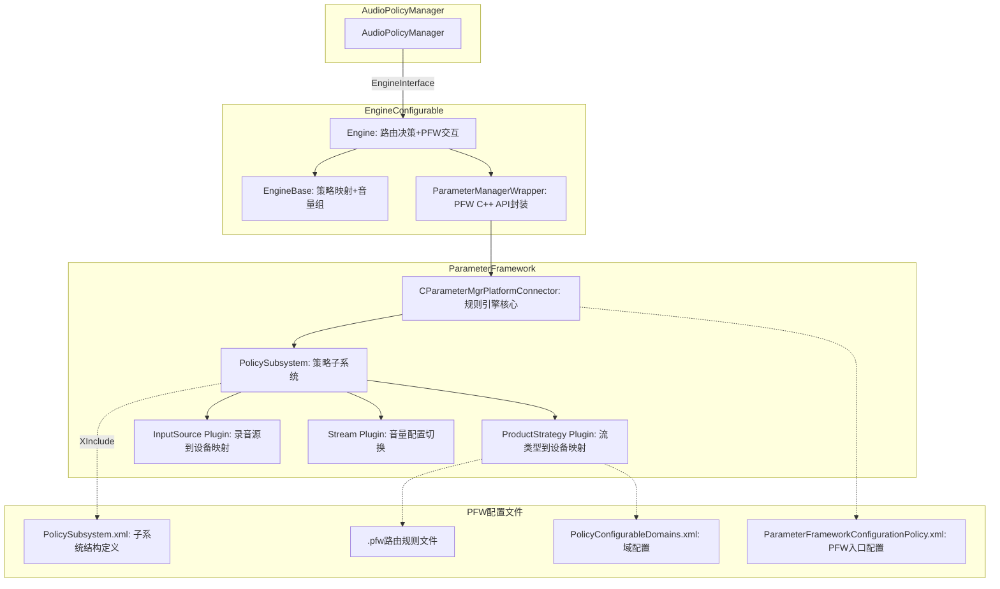
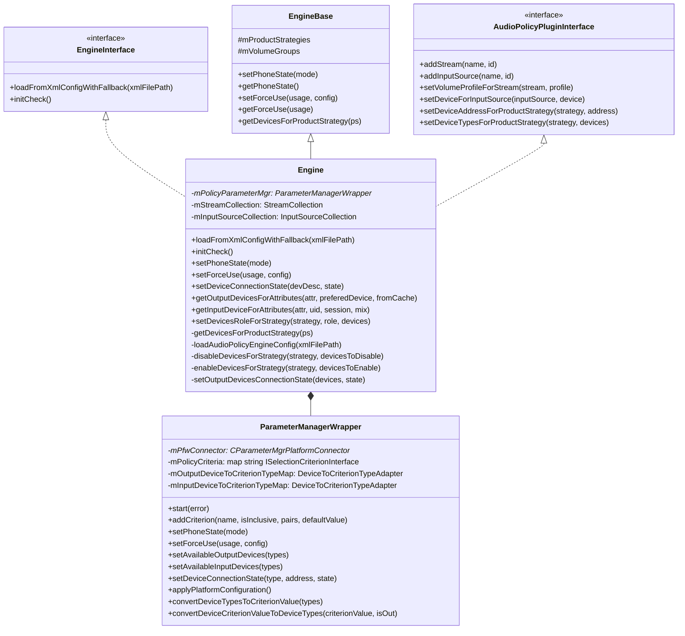
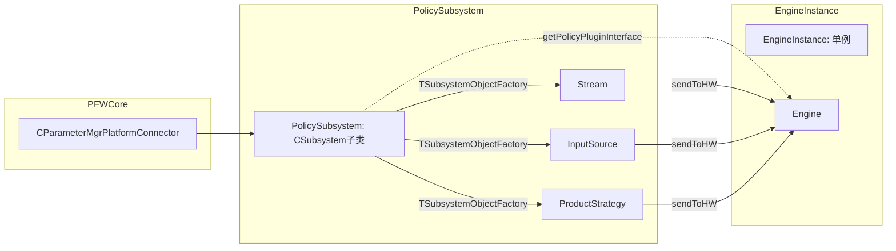
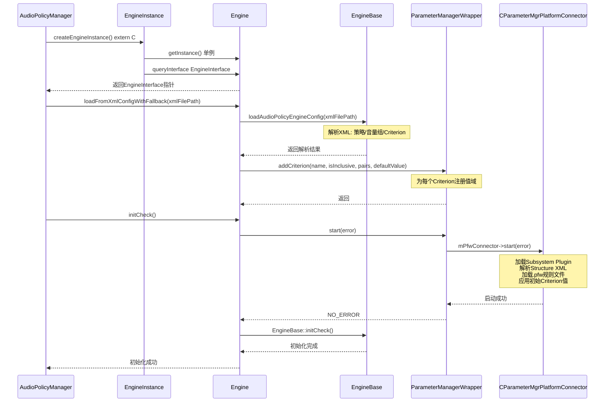
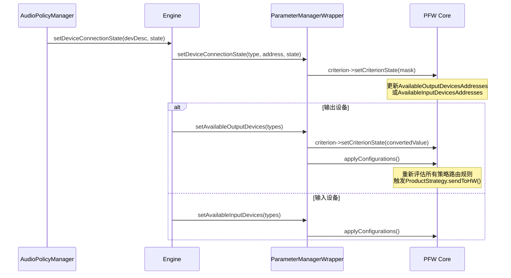

## 6.10 EngineConfigurable — Parameter Framework可配置引擎

> [← 上一个](06_6.9_EngineInterface-策略引擎接口.md) | [← 返回Audio Policy Engine](README.md) | [返回导航](../README.md) | [下一个 →](06_6.11_EngineConfig-策略配置解析.md)

---

### 模块职责

[`Engine`](frameworks/av/services/audiopolicy/engineconfigurable/src/Engine.h:32)（EngineConfigurable）是基于Parameter Framework（PFW）的可插拔策略引擎实现，继承[`EngineBase`](frameworks/av/services/audiopolicy/engine/common/include/EngineBase.h)并实现[`AudioPolicyPluginInterface`](frameworks/av/services/audiopolicy/engineconfigurable/interface/AudioPolicyPluginInterface.h:36)。与EngineDefault的硬编码策略不同，EngineConfigurable通过PFW规则文件（.pfw）定义路由策略，使得OEM厂商无需修改C++代码即可定制音频路由行为。

### 架构总览



---

### Engine类完整结构

[`Engine`](frameworks/av/services/audiopolicy/engineconfigurable/src/Engine.h:32)采用多重继承设计，同时满足策略引擎的内部接口和PFW Plugin的外部接口需求：



**关键成员解析**：

| 成员 | 声明位置 | 职责 |
|------|---------|------|
| [`mPolicyParameterMgr`](frameworks/av/services/audiopolicy/engineconfigurable/src/Engine.h:152) | Engine.h:152 | PFW连接器封装，所有PFW交互均通过此指针 |
| [`mStreamCollection`](frameworks/av/services/audiopolicy/engineconfigurable/src/Engine.h:119) | Engine.h:119 | Stream类型集合，存储stream→volumeProfile映射 |
| [`mInputSourceCollection`](frameworks/av/services/audiopolicy/engineconfigurable/src/Engine.h:120) | Engine.h:120 | InputSource集合，存储inputSource→device映射 |

---

### ParameterManagerWrapper — PFW C++ API封装

[`ParameterManagerWrapper`](frameworks/av/services/audiopolicy/engineconfigurable/wrapper/include/ParameterManagerWrapper.h:43)是对PFW核心C++ API的完整封装，管理PFW连接器的生命周期和所有Criterion操作。

#### PFW Criterion体系

PFW通过**SelectionCriterion**（选择准则）机制驱动路由决策，每个Criterion代表一个影响路由的变量：

| Criterion名称 | 源码常量 | 类型 | 用途 |
|--------------|---------|------|------|
| `TelephonyMode` | [`gPhoneStateCriterionName`](frameworks/av/services/audiopolicy/engineconfigurable/wrapper/ParameterManagerWrapper.cpp:73) | Inclusive | 电话模式(Normal/Ring/InCall/InComm) |
| `AvailableOutputDevices` | [`gOutputDeviceCriterionName`](frameworks/av/services/audiopolicy/engineconfigurable/wrapper/ParameterManagerWrapper.cpp:72) | Inclusive | 可用输出设备位掩码 |
| `AvailableInputDevices` | [`gInputDeviceCriterionName`](frameworks/av/services/audiopolicy/engineconfigurable/wrapper/ParameterManagerWrapper.cpp:71) | Inclusive | 可用输入设备位掩码 |
| `AvailableOutputDevicesAddresses` | [`gOutputDeviceAddressCriterionName`](frameworks/av/services/audiopolicy/engineconfigurable/wrapper/ParameterManagerWrapper.cpp:74) | Inclusive | 可用输出设备地址 |
| `AvailableInputDevicesAddresses` | [`gInputDeviceAddressCriterionName`](frameworks/av/services/audiopolicy/engineconfigurable/wrapper/ParameterManagerWrapper.cpp:75) | Inclusive | 可用输入设备地址 |
| `ForceUseForCommunication` | [`gForceUseCriterionTag[0]`](frameworks/av/services/audiopolicy/engineconfigurable/wrapper/ParameterManagerWrapper.cpp:82) | Exclusive | 通信强制使用配置 |
| `ForceUseForMedia` | [`gForceUseCriterionTag[1]`](frameworks/av/services/audiopolicy/engineconfigurable/wrapper/ParameterManagerWrapper.cpp:83) | Exclusive | 媒体强制使用配置 |
| `ForceUseForRecord` | [`gForceUseCriterionTag[2]`](frameworks/av/services/audiopolicy/engineconfigurable/wrapper/ParameterManagerWrapper.cpp:84) | Exclusive | 录音强制使用配置 |

#### PFW配置文件加载

[`ParameterManagerWrapper`](frameworks/av/services/audiopolicy/engineconfigurable/wrapper/ParameterManagerWrapper.cpp:97)构造函数优先加载Vendor配置，回退到系统默认配置：

```
/vendor/etc/parameter-framework/ParameterFrameworkConfigurationPolicy.xml  (Vendor优先)
/etc/parameter-framework/ParameterFrameworkConfigurationPolicy.xml         (系统默认)
```

源码见[`ParameterManagerWrapper.cpp:102-106`](frameworks/av/services/audiopolicy/engineconfigurable/wrapper/ParameterManagerWrapper.cpp:102)：

```cpp
if (access(mPolicyPfwVendorConfFileName, R_OK) == 0) {
    mPfwConnector = new CParameterMgrPlatformConnector(mPolicyPfwVendorConfFileName);
} else {
    mPfwConnector = new CParameterMgrPlatformConnector(mPolicyPfwDefaultConfFileName);
}
```

#### addCriterion — 动态注册Criterion

[`addCriterion()`](frameworks/av/services/audiopolicy/engineconfigurable/wrapper/ParameterManagerWrapper.cpp:121)在PFW启动前调用，注册策略Criterion及其值域：

1. 调用`mPfwConnector->createSelectionCriterionType()`创建CriterionType
2. 遍历ValuePair逐一添加`criterionType->addValuePair()`
3. 同时构建`mOutputDeviceToCriterionTypeMap`/`mInputDeviceToCriterionTypeMap`设备类型适配表
4. 调用`mPfwConnector->createSelectionCriterion()`创建Criterion实例
5. 若有默认值则设置`criterion->setCriterionState()`

#### applyPlatformConfiguration — 触发规则引擎重算

[`applyPlatformConfiguration()`](frameworks/av/services/audiopolicy/engineconfigurable/wrapper/ParameterManagerWrapper.cpp:340)是PFW的核心触发点，调用`mPfwConnector->applyConfigurations()`使所有Criterion变更生效。每次`setPhoneState()`、`setForceUse()`、`setAvailableOutputDevices()`后都会调用此方法触发PFW重新评估路由规则。

#### 设备类型与Criterion值的双向转换

由于Android的`audio_devices_t`位掩码与PFW Criterion的数值表示可能不一致（特别是多bit组合设备），[`convertDeviceTypeToCriterionValue()`](frameworks/av/services/audiopolicy/engineconfigurable/wrapper/ParameterManagerWrapper.cpp:345)通过适配表处理转换：

```cpp
// 单bit设备直接用typeMask，多bit设备查mOutputDeviceToCriterionTypeMap
if (popcount(typeMask) > 1) {
    const auto &adapter = adapters.find(type);
    return adapter->second;  // 返回Criterion值
}
return typeMask;  // 单bit设备直接使用
```

---

### Plugin体系详解

PFW Plugin采用三层架构：PFW Core → Subsystem → SubsystemObject。



#### PolicySubsystem — 子系统入口

[`PolicySubsystem`](frameworks/av/services/audiopolicy/engineconfigurable/parameter-framework/plugin/PolicySubsystem.h:28)继承PFW的`CSubsystem`，在构造函数中完成三项关键工作：

1. **获取PluginInterface**：通过[`EngineInstance::getInstance()->queryInterface<AudioPolicyPluginInterface>()`](frameworks/av/services/audiopolicy/engineconfigurable/parameter-framework/plugin/PolicySubsystem.cpp:46)获取Engine的Plugin接口
2. **注册Mapping Key**：添加Name/Identifier/Category/Amend1/Amend2/Amend3等XML映射键
3. **注册SubsystemObject工厂**：创建Stream、InputSource、ProductStrategy三种组件工厂

见[`PolicySubsystem.cpp:41-77`](frameworks/av/services/audiopolicy/engineconfigurable/parameter-framework/plugin/PolicySubsystem.cpp:41)。

#### ProductStrategy Plugin — 策略设备映射

[`ProductStrategy`](frameworks/av/services/audiopolicy/engineconfigurable/parameter-framework/plugin/ProductStrategy.h:28)是PFW规则引擎与Engine之间的桥梁，核心数据结构：

```cpp
struct Device {
    uint64_t applicableDevice;     // PFW规则计算出的设备类型
    char deviceAddress[257];       // 设备地址（Automotive BUS场景）
} __attribute__((packed));
```

**`sendToHW()`** 是PFW规则计算完成后的回调（[`ProductStrategy.cpp:52`](frameworks/av/services/audiopolicy/engineconfigurable/parameter-framework/plugin/ProductStrategy.cpp:52)）：

```cpp
bool ProductStrategy::sendToHW(string &/*error*/) {
    Device deviceParams;
    blackboardRead(&deviceParams, sizeof(deviceParams));  // 从PFW blackboard读取规则结果
    mPolicyPluginInterface->setDeviceTypesForProductStrategy(mId, deviceParams.applicableDevice);
    mPolicyPluginInterface->setDeviceAddressForProductStrategy(mId, deviceParams.deviceAddress);
    return true;
}
```

PFW规则引擎计算出设备选择后，将结果写入blackboard，`sendToHW()`从blackboard读取并回写到Engine。

#### Stream Plugin — 音量配置切换

[`Stream`](frameworks/av/services/audiopolicy/engineconfigurable/parameter-framework/plugin/Stream.h:27)管理Stream的音量Profile属性，数据结构：

```cpp
struct Applicable {
    uint32_t volumeProfile;  // 当前Stream使用的音量曲线Profile
} __attribute__((packed));
```

`sendToHW()`调用`mPolicyPluginInterface->setVolumeProfileForStream(mId, applicable.volumeProfile)`，实现PFW驱动的音量曲线动态切换。

#### InputSource Plugin — 录音源设备映射

[`InputSource`](frameworks/av/services/audiopolicy/engineconfigurable/parameter-framework/plugin/InputSource.h:27)管理录音源到输入设备的映射，`sendToHW()`调用`mPolicyPluginInterface->setDeviceForInputSource()`。

---

### PFW规则文件格式详解

#### .pfw文件语法结构

PFW规则文件采用层级化的domain/conf结构：

```
supDomain: <超级域名>                  # 顶层分组
    supDomain: <子域名>                # 策略分组（如Media）
        domain: <域名>                 # 路由规则域（如SelectedDevice）
            conf: <配置名>             # 一个路由配置
                <Criterion条件>        # 触发条件
                component: <PFW组件路径>  # 输出目标
                    <参数名> = <值>      # 参数赋值
```

**条件语法**：
- `AvailableOutputDevices Includes BluetoothA2dp` — 可用设备包含A2DP
- `ForceUseForMedia IsNot ForceNoBtA2dp` — ForceUse不是禁止A2DP
- `TelephonyMode Is InCall` — 电话模式为通话中
- `ANY { ... }` — 任一条件满足

#### Phone配置 — 分策略独立文件

Phone配置为每个ProductStrategy提供独立的.pfw文件，以[`device_for_product_strategy_media.pfw`](frameworks/av/services/audiopolicy/engineconfigurable/parameter-framework/examples/Phone/Settings/device_for_product_strategy_media.pfw)为例：

```
supDomain: DeviceForProductStrategy
    supDomain: Media
        domain: UnreachableDevices        # 校准域：所有设备位清零
            conf: calibration
                component: /Policy/policy/product_strategies/media/selected_output_devices/mask
                    speaker = 0, hdmi = 0, bluetooth_a2dp = 0 ...
                /Policy/policy/product_strategies/media/device_address =

        domain: Device2
            conf: RemoteSubmix             # 条件：可用设备含RemoteSubmix
                AvailableOutputDevices Includes RemoteSubmix
                AvailableOutputDevicesAddresses Includes 0
                component: .../selected_output_devices/mask
                    remote_submix = 1, 其他 = 0

            conf: BluetoothA2dp            # 条件：可用A2DP且未禁止
                ForceUseForMedia IsNot ForceNoBtA2dp
                ForceUseForCommunication IsNot ForceBtSco
                AvailableOutputDevices Includes BluetoothA2dp
                component: .../selected_output_devices/mask
                    bluetooth_a2dp = 1, 其他 = 0
```

PFW按conf声明顺序评估，**第一个满足条件的conf生效**。

#### Automotive配置 — 集中式BUS路由

[`Car/Settings/device_for_product_strategies.pfw`](frameworks/av/services/audiopolicy/engineconfigurable/parameter-framework/examples/Car/Settings/device_for_product_strategies.pfw)（19.2KB）将所有策略集中在一个文件，核心差异是**BUS设备+地址路由**：

```
supDomain: DeviceForProductStrategies
    supDomain: OemTrafficAnouncement
        domain: UnreachableDevices
            conf: calibration
                component: .../selected_output_devices/mask
                    earpiece = 0, speaker = 0, ...所有设备位 = 0
                /Policy/policy/product_strategies/oem_traffic_anouncement/device_address = BUS08_OEM1

        domain: SelectedDevice
            conf: Bus                         # 条件：BUS可用且地址匹配
                AvailableOutputDevices Includes Bus
                AvailableOutputDevicesAddresses Includes BUS08_OEM1
                component: .../selected_output_devices/mask
                    bus = 1

            conf: Default                     # 兜底
                component: .../selected_output_devices/mask
                    bus = 0
```

Automotive通过`device_address`字段指定BUS地址（如`BUS08_OEM1`），实现同一BUS类型不同地址的精确路由。

#### PolicySubsystem.xml — 子系统结构定义

[`PolicySubsystem.xml`](frameworks/av/services/audiopolicy/engineconfigurable/parameter-framework/examples/common/Structure/PolicySubsystem.xml)定义PFW子系统结构，包含Stream、InputSource、ProductStrategy的组件声明：

```xml
<Subsystem Name="policy" Type="Policy">
    <ComponentLibrary>
        <xi:include href="PolicySubsystem-CommonTypes.xml"/>  <!-- 通用类型 -->
        <xi:include href="ProductStrategies.xml"/>            <!-- 策略列表 -->
        <ComponentType Name="Streams">
            <Component Name="music" Type="Stream" Mapping="Name:AUDIO_STREAM_MUSIC"/>
            <!-- ... 其他Stream ... -->
        </ComponentType>
        <ComponentType Name="InputSources">
            <Component Name="mic" Type="InputSource" Mapping="Name:AUDIO_SOURCE_MIC"/>
            <!-- ... 其他InputSource ... -->
        </ComponentType>
    </ComponentLibrary>
</Subsystem>
```

[`PolicySubsystem-CommonTypes.xml.in`](frameworks/av/services/audiopolicy/engineconfigurable/parameter-framework/examples/common/Structure/PolicySubsystem-CommonTypes.xml.in)定义了ProductStrategy的组件类型：

```xml
<ComponentType Name="ProductStrategy" Mapping="ProductStrategy">
    <Component Name="selected_output_devices" Type="OutputDevicesMask"/>
    <StringParameter Name="device_address" MaxLength="256"/>
</ComponentType>
```

---

### 初始化流程



**关键步骤解析**：

1. **`createEngineInstance()`**（[`EngineInstance.cpp:61`](frameworks/av/services/audiopolicy/engineconfigurable/src/EngineInstance.cpp:61)）：全局工厂函数，通过`EngineInstance`单例获取`Engine`实例并返回`EngineInterface`指针
2. **`loadFromXmlConfigWithFallback()`**（[`Engine.cpp:73`](frameworks/av/services/audiopolicy/engineconfigurable/src/Engine.cpp:73)）：调用`EngineBase::loadAudioPolicyEngineConfig()`解析XML，然后通过`addCriterion()`注册PFW Criterion
3. **`initCheck()`**（[`Engine.cpp:82`](frameworks/av/services/audiopolicy/engineconfigurable/src/Engine.cpp:82)）：启动PFW引擎，触发首次规则评估

---

### getDevicesForProductStrategy()路由决策流程

[`getDevicesForProductStrategy()`](frameworks/av/services/audiopolicy/engineconfigurable/src/Engine.cpp:321)是EngineConfigurable的核心路由决策方法，采用**程序化+规则化混合**模式：

```mermaid
flowchart TB
    START[getDevicesForProductStrategy] --> PREF{\"有Preferred设备<br>且可用?\"}
    PREF -->|是| RET_PREF[返回Preferred设备]
    PREF -->|否| NOTIF{\"是Notification策略<br>且Music正在播放?\"}
    NOTIF -->|是| FALL_MUSIC[降级到Music策略路由]
    NOTIF -->|否| ACCESS{\"是Accessibility策略<br>且Ring或Alarm活跃?\"}
    ACCESS -->|是| FALL_RING[降级到Ring策略路由]
    ACCESS -->|否| PFW_GET[从PFW获取设备类型<br>getDeviceTypesForProductStrategy]
    FALL_MUSIC --> DISABLED
    FALL_RING --> DISABLED

    DISABLED[移除Disabled设备<br>availableOutputDevices.remove] --> DEVTYPE{\"设备类型为空<br>或无可用交集?\"}
    DEVTYPE -->|是| DEFAULT[使用DefaultOutputDevice]
    DEVTYPE -->|否| BUS{\"是AUDIO_DEVICE_OUT_BUS<br>单设备类型?\"}
    BUS -->|是| BUS_ADDR[按地址查找BUS设备<br>getDevice type+address]
    BUS -->|否| NORMAL[按设备类型集合查找<br>getDevicesFromTypes]
    BUS_ADDR --> BUS_FOUND{\"找到BUS设备?\"}
    BUS_FOUND -->|否| DEFAULT
    BUS_FOUND -->|是| RET_BUS[返回BUS设备]
    NORMAL --> RET_DEV[返回匹配设备列表]
    RET_PREF --> DONE[完成]
    DEFAULT --> DONE
    RET_BUS --> DONE
    RET_DEV --> DONE
```

**源码关键路径**：

1. **Preferred设备优先**（[`Engine.cpp:336-340`](frameworks/av/services/audiopolicy/engineconfigurable/src/Engine.cpp:336)）：检查策略是否有可用Preferred设备
2. **Notification跟随Music**（[`Engine.cpp:354-360`](frameworks/av/services/audiopolicy/engineconfigurable/src/Engine.cpp:354)）：程序化处理，PFW无法感知Stream活动状态
3. **Accessibility跟随Ring**（[`Engine.cpp:361-368`](frameworks/av/services/audiopolicy/engineconfigurable/src/Engine.cpp:361)）：避免压缩格式丢帧
4. **PFW规则评估**（[`Engine.cpp:370`](frameworks/av/services/audiopolicy/engineconfigurable/src/Engine.cpp:370)）：`productStrategies.getDeviceTypesForProductStrategy()`获取PFW计算结果
5. **Disabled设备过滤**（[`Engine.cpp:369-373`](frameworks/av/services/audiopolicy/engineconfigurable/src/Engine.cpp:369)）：移除被禁用的设备
6. **BUS设备特殊处理**（[`Engine.cpp:380-398`](frameworks/av/services/audiopolicy/engineconfigurable/src/Engine.cpp:380)）：Automotive场景按地址精确匹配

---

### 设备连接状态同步机制

EngineConfigurable通过[`setDeviceConnectionState()`](frameworks/av/services/audiopolicy/engineconfigurable/src/Engine.cpp:182)将设备连接状态同步到PFW：



PFW的`applyConfigurations()`会触发规则重算，ProductStrategy Plugin的`sendToHW()`被回调，将新的设备选择写回Engine。

---

### Disabled设备与Preferred设备的PFW同步

EngineConfigurable实现了基于PFW Criterion的设备禁用/启用机制。[`disableDevicesForStrategy()`](frameworks/av/services/audiopolicy/engineconfigurable/src/Engine.cpp:302)采用"禁用-重算-恢复"三步法：

```cpp
// 1. 临时将disabled设备设为UNAVAILABLE
setOutputDevicesConnectionState(devicesToDisable, AUDIO_POLICY_DEVICE_STATE_UNAVAILABLE);
// 2. 读取PFW在此可用设备集合下的决策
DeviceTypeSet deviceTypes = getProductStrategies().getDeviceTypesForProductStrategy(strategy);
const std::string address = getProductStrategies().getDeviceAddressForProductStrategy(strategy);
// 3. 恢复设备可用状态，但强制保留当前策略的路由结果
setOutputDevicesConnectionState(devicesToDisable, AUDIO_POLICY_DEVICE_STATE_AVAILABLE);
getProductStrategies().at(strategy)->setDeviceTypes(deviceTypes);
setDeviceAddressForProductStrategy(strategy, address);
```

这种workaround是因为PFW的Criterion变更会影响所有策略，需要防止禁用设备对其他策略产生副作用。

---

### EngineInstance工厂与单例模式

[`EngineInstance`](frameworks/av/services/audiopolicy/engineconfigurable/include/AudioPolicyEngineInstance.h:27)采用Meyers单例模式，提供两种接口查询：

```cpp
// EngineInstance.cpp:31-34
EngineInstance *EngineInstance::getInstance() {
    static EngineInstance instance;
    return &instance;
}

// EngineInstance.cpp:41-44
Engine *EngineInstance::getEngine() const {
    static Engine engine;  // Engine本身也是单例
    return &engine;
}
```

**双重接口查询**（[`EngineInstance.cpp:47-57`](frameworks/av/services/audiopolicy/engineconfigurable/src/EngineInstance.cpp:47)）：
- `queryInterface<EngineInterface>()` → 供APM使用的策略引擎接口
- `queryInterface<AudioPolicyPluginInterface>()` → 供PFW Plugin使用的回调接口

**C工厂函数**（[`EngineInstance.cpp:61-63`](frameworks/av/services/audiopolicy/engineconfigurable/src/EngineInstance.cpp:61)）：
```cpp
extern "C" EngineInterface* createEngineInstance() {
    return audio_policy::EngineInstance::getInstance()->queryInterface<EngineInterface>();
}
```

---

### EngineConfigurable vs EngineDefault

| 对比维度 | EngineDefault | EngineConfigurable |
|----------|---------------|-------------------|
| 路由决策 | C++硬编码逻辑(`getDeviceForStrategy()`) | PFW规则文件(.pfw)驱动 |
| 策略修改 | 修改C++代码重新编译 | 修改.pfw/XML配置即可 |
| 适用场景 | 手机等标准设备 | Automotive等需灵活定制的设备 |
| 音量曲线切换 | 硬编码 | PFW Stream Plugin动态切换 |
| 初始化 | 直接加载XML配置 | 加载XML + 启动PFW引擎 |
| ForceUse/PhoneState | 内部成员变量 | PFW Criterion驱动 |
| 设备可用性 | 内部DeviceVector | PFW AvailableOutputDevices Criterion |
| 依赖库 | libaudiopolicyenginedefault | libaudiopolicyengineconfigurable + libpfw |
| InputSource设备映射 | 硬编码switch-case | PFW InputSource Plugin |
| BUS地址路由 | 不支持 | PFW device_address StringParameter |

---

### Automotive vs Phone配置差异

| 差异点 | Phone | Automotive |
|-------|-------|-----------|
| 文件组织 | 每策略独立.pfw文件 | 所有策略集中一个.pfw文件 |
| 设备路由 | 按设备类型位掩码选择 | BUS类型+地址精确匹配 |
| 策略名称 | 标准(media/phone/sonification) | 含OEM自定义(oem_traffic_anouncement等) |
| device_address | 通常为空 | 必填(如BUS08_OEM1) |
| 音量策略 | 固定音量曲线 | 可按Zone/Context切换Profile |
| 配置覆盖 | /etc下系统配置 | /vendor/etc覆盖系统配置 |

---

> **关键设计**: EngineConfigurable的Notification跟随Music策略是程序化处理的，因为PFW无法感知Stream的活动状态。这种程序化+规则化的混合方式是EngineConfigurable的典型特征——能用规则表达的路由逻辑走PFW，需要运行时状态的逻辑走C++代码。

---

> [← 上一个](06_6.9_EngineInterface-策略引擎接口.md) | [← 返回Audio Policy Engine](README.md) | [返回导航](../README.md) | [下一个 →](06_6.11_EngineConfig-策略配置解析.md)