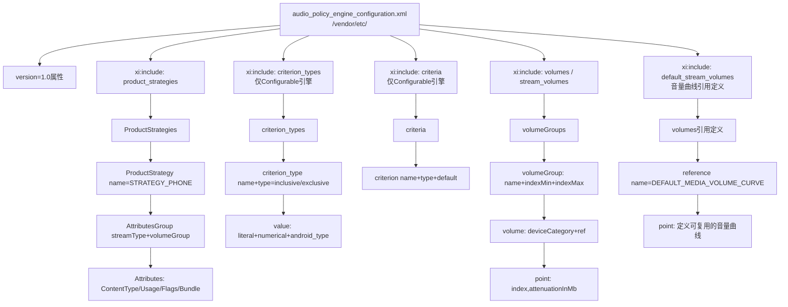
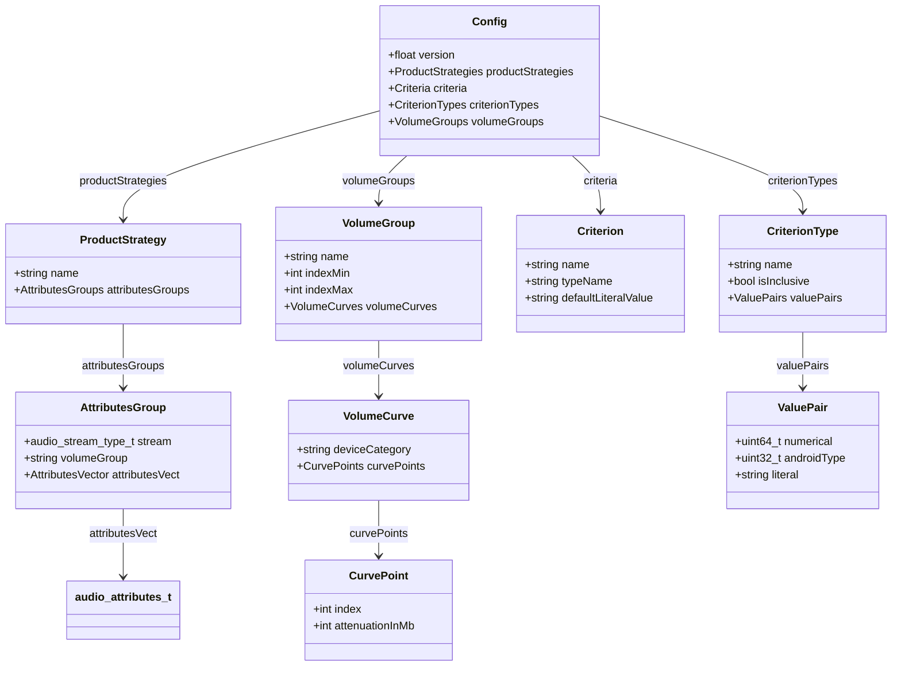
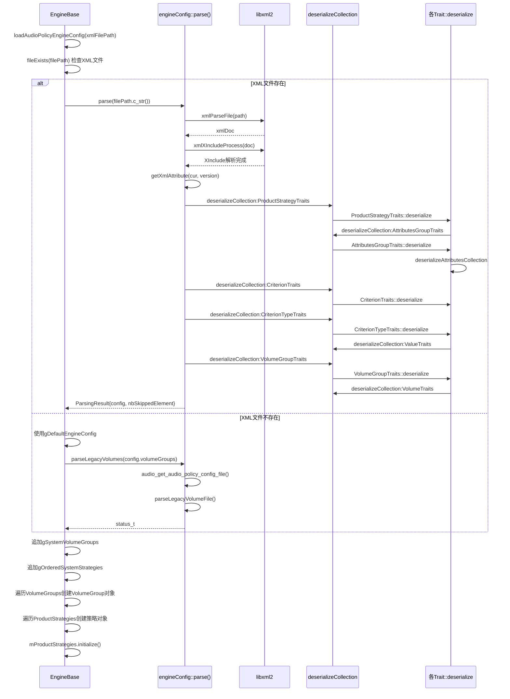
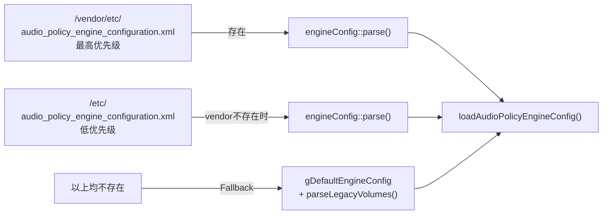

## 6.11 EngineConfig — 策略配置解析

> [← 上一个](06_6.10_EngineConfigurable-Parameter_Framework可配置引擎.md) | [← 返回Audio Policy Engine](README.md) | [返回导航](../README.md) | [下一个 →](06_6.12_VolumeCurve-音量曲线.md)

---

### 模块职责与源码位置

[`EngineConfig`](frameworks/av/services/audiopolicy/engine/config/src/EngineConfig.cpp)模块是Audio Policy Engine的配置解析层，负责从XML文件中反序列化策略引擎运行时所需的全部数据结构，包括产品策略（ProductStrategy）、音量组（VolumeGroup）、PFW条件（Criterion/CriterionType）等。解析结果以[`engineConfig::Config`](frameworks/av/services/audiopolicy/engine/config/include/EngineConfig.h:87)结构体交付给[`EngineBase::loadAudioPolicyEngineConfig()`](frameworks/av/services/audiopolicy/engine/common/src/EngineBase.cpp:118)进行运行时对象构建。

**关键源码文件：**

| 文件 | 路径 | 职责 |
|------|------|------|
| EngineConfig.h | `frameworks/av/services/audiopolicy/engine/config/include/EngineConfig.h` | 数据结构定义与解析接口声明 |
| EngineConfig.cpp | `frameworks/av/services/audiopolicy/engine/config/src/EngineConfig.cpp` | XML解析、Trait体系、反序列化实现 |
| EngineDefaultConfig.h | `frameworks/av/services/audiopolicy/engine/common/src/EngineDefaultConfig.h` | 硬编码默认策略与音量组 |
| EngineBase.cpp | `frameworks/av/services/audiopolicy/engine/common/src/EngineBase.cpp` | 配置加载入口、运行时对象构建 |

---

### XML配置文件结构详解

Engine配置文件默认位于`/vendor/etc/audio_policy_engine_configuration.xml`，由[`DEFAULT_PATH`](frameworks/av/services/audiopolicy/engine/config/include/EngineConfig.h:38)常量定义。该文件通过XInclude机制将大型配置拆分为多个子文件。

#### 主配置文件结构

以Phone配置为例，[`audio_policy_engine_configuration.xml`](frameworks/av/services/audiopolicy/enginedefault/config/example/phone/audio_policy_engine_configuration.xml)结构如下：

```xml
<configuration version="1.0" xmlns:xi="http://www.w3.org/2001/XInclude">
    <xi:include href="audio_policy_engine_product_strategies.xml"/>
    <xi:include href="audio_policy_engine_stream_volumes.xml"/>
    <xi:include href="audio_policy_engine_default_stream_volumes.xml"/>
</configuration>
```

而Automotive（Configurable引擎）的配置多了PFW所需的criteria和criterion_types：

```xml
<configuration version="1.0" xmlns:xi="http://www.w3.org/2001/XInclude">
    <xi:include href="audio_policy_engine_product_strategies.xml"/>
    <xi:include href="audio_policy_engine_criterion_types.xml"/>
    <xi:include href="audio_policy_engine_criteria.xml"/>
    <xi:include href="audio_policy_engine_volumes.xml"/>
</configuration>
```

#### 配置文件层级关系



#### AttributesGroup XML示例

[`audio_policy_engine_product_strategies.xml`](frameworks/av/services/audiopolicy/enginedefault/config/example/phone/audio_policy_engine_product_strategies.xml)中的典型策略定义：

```xml
<ProductStrategy name="STRATEGY_MEDIA">
    <AttributesGroup streamType="AUDIO_STREAM_MUSIC" volumeGroup="music">
        <Attributes> <Usage value="AUDIO_USAGE_MEDIA"/> </Attributes>
        <Attributes> <Usage value="AUDIO_USAGE_GAME"/> </Attributes>
        <Attributes></Attributes>  <!-- 空Attributes匹配默认 -->
    </AttributesGroup>
    <AttributesGroup streamType="AUDIO_STREAM_ASSISTANT" volumeGroup="assistant">
        <Attributes>
            <ContentType value="AUDIO_CONTENT_TYPE_SPEECH"/>
            <Usage value="AUDIO_USAGE_ASSISTANT"/>
        </Attributes>
    </AttributesGroup>
</ProductStrategy>
```

#### VolumeGroup XML示例

[`audio_policy_engine_stream_volumes.xml`](frameworks/av/services/audiopolicy/enginedefault/config/example/phone/audio_policy_engine_stream_volumes.xml)中的典型音量组：

```xml
<volumeGroup>
    <name>voice_call</name>
    <indexMin>1</indexMin>
    <indexMax>7</indexMax>
    <volume deviceCategory="DEVICE_CATEGORY_SPEAKER">
        <point>0,-2400</point>
        <point>33,-1600</point>
        <point>66,-800</point>
        <point>100,0</point>
    </volume>
    <volume deviceCategory="DEVICE_CATEGORY_HEADSET" ref="DEFAULT_MEDIA_VOLUME_CURVE"/>
</volumeGroup>
```

#### Criterion与CriterionType XML示例

PFW条件定义（仅Configurable引擎使用），来自[`audio_policy_engine_criteria.xml`](frameworks/av/services/audiopolicy/engineconfigurable/config/example/common/audio_policy_engine_criteria.xml)和[`audio_policy_engine_criterion_types.xml.in`](frameworks/av/services/audiopolicy/engineconfigurable/config/example/common/audio_policy_engine_criterion_types.xml.in)：

```xml
<!-- criterion_types: 定义条件类型的取值空间 -->
<criterion_type name="ForceUseForCommunicationType" type="exclusive">
    <values>
        <value literal="ForceNone" numerical="0"/>
        <value literal="ForceSpeaker" numerical="1"/>
        <value literal="ForceBtSco" numerical="3"/>
    </values>
</criterion_type>

<!-- criteria: 定义具体的判决条件实例 -->
<criterion name="ForceUseForCommunication" type="ForceUseForCommunicationType" default="ForceNone"/>
<criterion name="TelephonyMode" type="AndroidModeType" default="Normal"/>
<criterion name="AvailableOutputDevices" type="OutputDevicesMaskType" default="none"/>
```

---

### 核心数据结构源码解析

所有数据结构定义于[`EngineConfig.h`](frameworks/av/services/audiopolicy/engine/config/include/EngineConfig.h:25)，位于`android::engineConfig`命名空间。

#### 数据结构类关系图



#### 结构体详解

**[`AttributesGroup`](frameworks/av/services/audiopolicy/engine/config/include/EngineConfig.h:44)：策略内的属性分组**

| 字段 | 类型 | 说明 |
|------|------|------|
| `stream` | `audio_stream_type_t` | 关联的流类型，如`AUDIO_STREAM_MUSIC` |
| `volumeGroup` | `std::string` | 关联的音量组名称，如"music" |
| `attributesVect` | `AttributesVector` | 该分组支持的`audio_attributes_t`向量 |

**[`CurvePoint`](frameworks/av/services/audiopolicy/engine/config/include/EngineConfig.h:50)：音量曲线采样点**

| 字段 | 类型 | 说明 |
|------|------|------|
| `index` | `int` | 音量索引（0~100） |
| `attenuationInMb` | `int` | 衰减值（毫贝mB），0=无衰减，-9600=静音 |

**[`VolumeCurve`](frameworks/av/services/audiopolicy/engine/config/include/EngineConfig.h:55)：设备类别音量曲线**

| 字段 | 类型 | 说明 |
|------|------|------|
| `deviceCategory` | `std::string` | 设备类别，如"DEVICE_CATEGORY_SPEAKER" |
| `curvePoints` | `CurvePoints` | 曲线采样点集合 |

**[`VolumeGroup`](frameworks/av/services/audiopolicy/engine/config/include/EngineConfig.h:61)：音量组定义**

| 字段 | 类型 | 说明 |
|------|------|------|
| `name` | `std::string` | 音量组名称，如"music"、"voice_call" |
| `indexMin` | `int` | 最小音量索引 |
| `indexMax` | `int` | 最大音量索引 |
| `volumeCurves` | `VolumeCurves` | 各设备类别的音量曲线 |

**[`ProductStrategy`](frameworks/av/services/audiopolicy/engine/config/include/EngineConfig.h:69)：产品策略定义**

| 字段 | 类型 | 说明 |
|------|------|------|
| `name` | `std::string` | 策略名称，如"STRATEGY_MEDIA" |
| `attributesGroups` | `AttributesGroups` | 策略下的属性分组集合 |

**[`CriterionType`](frameworks/av/services/audiopolicy/engine/config/include/EngineConfig.h:77)：PFW条件类型**

| 字段 | 类型 | 说明 |
|------|------|------|
| `name` | `std::string` | 条件类型名，如"ForceUseForCommunicationType" |
| `isInclusive` | `bool` | true=inclusive（多值可叠加），false=exclusive（互斥单选） |
| `valuePairs` | `ValuePairs` | 取值空间定义 |

**[`Criterion`](frameworks/av/services/audiopolicy/engine/config/include/EngineConfig.h:85)：PFW判决条件**

| 字段 | 类型 | 说明 |
|------|------|------|
| `name` | `std::string` | 条件名，如"TelephonyMode" |
| `typeName` | `std::string` | 引用的CriterionType名称 |
| `defaultLiteralValue` | `std::string` | 默认字面值，如"Normal" |

**[`Config`](frameworks/av/services/audiopolicy/engine/config/include/EngineConfig.h:91)：完整引擎配置**

| 字段 | 类型 | 说明 |
|------|------|------|
| `version` | `float` | 配置版本号，当前为1.0 |
| `productStrategies` | `ProductStrategies` | 产品策略集合 |
| `criteria` | `Criteria` | PFW条件集合 |
| `criterionTypes` | `CriterionTypes` | PFW条件类型集合 |
| `volumeGroups` | `VolumeGroups` | 音量组集合 |

**[`ParsingResult`](frameworks/av/services/audiopolicy/engine/config/include/EngineConfig.h:97)：解析结果**

| 字段 | 类型 | 说明 |
|------|------|------|
| `parsedConfig` | `std::unique_ptr<Config>` | 解析后的配置，nullptr表示解析失败 |
| `nbSkippedElement` | `size_t` | 跳过的无效元素数量 |

---

### 解析流程源码解析

#### 完整解析时序图



#### parse()入口函数

[`parse()`](frameworks/av/services/audiopolicy/engine/config/src/EngineConfig.cpp:664)是配置解析的主入口，流程如下：

```cpp
// EngineConfig.cpp:664
ParsingResult parse(const char* path) {
    XmlErrorHandler errorHandler;                          // 设置XML错误处理器
    auto doc = make_xmlUnique(xmlParseFile(path));         // 1. libxml2解析XML文件
    if (doc == NULL) {                                      // 解析失败
        if (strncmp(path, DEFAULT_PATH, strlen(DEFAULT_PATH))) {
            ALOGW("%s: Could not parse document %s", __FUNCTION__, path);
        }
        return {nullptr, 0};                               // 返回空结果
    }
    xmlNodePtr cur = xmlDocGetRootElement(doc.get());      // 2. 获取根节点
    if (cur == NULL) { return {nullptr, 0}; }

    if (xmlXIncludeProcess(doc.get()) < 0) {               // 3. 处理XInclude引用
        ALOGE("libxml failed to resolve XIncludes");
        return {nullptr, 0};
    }
    std::string version = getXmlAttribute(cur, gVersionAttribute); // 4. 检查version属性
    if (version.empty()) { return {nullptr, 0}; }

    auto config = std::make_unique<Config>();
    config->version = std::stof(version);

    // 5. 依次反序列化四大配置段
    deserializeCollection<ProductStrategyTraits>(doc.get(), cur, config->productStrategies, ...);
    deserializeCollection<CriterionTraits>(doc.get(), cur, config->criteria, ...);
    deserializeCollection<CriterionTypeTraits>(doc.get(), cur, config->criterionTypes, ...);
    deserializeCollection<VolumeGroupTraits>(doc.get(), cur, config->volumeGroups, ...);

    return {std::move(config), nbSkippedElements};
}
```

#### deserializeCollection()模板框架

[`deserializeCollection<Trait>`](frameworks/av/services/audiopolicy/engine/config/src/EngineConfig.cpp:130)是通用反序列化模板，遍历XML子节点并调用对应Trait的`deserialize()`方法：

```cpp
// EngineConfig.cpp:130
template <class Trait>
static status_t deserializeCollection(_xmlDoc *doc, const _xmlNode *cur,
                                      typename Trait::Collection &collection,
                                      size_t &nbSkippedElement) {
    for (cur = cur->xmlChildrenNode; cur != NULL; cur = cur->next) {
        // 跳过非目标标签
        if (xmlStrcmp(cur->name, (const xmlChar *)Trait::collectionTag) &&
            xmlStrcmp(cur->name, (const xmlChar *)Trait::tag)) {
            continue;
        }
        const xmlNode *child = cur;
        // 若当前节点是集合标签（如<ProductStrategies>），进入子节点
        if (!xmlStrcmp(child->name, (const xmlChar *)Trait::collectionTag)) {
            child = child->xmlChildrenNode;
        }
        // 遍历所有元素标签（如<ProductStrategy>），调用Trait反序列化
        for (; child != NULL; child = child->next) {
            if (!xmlStrcmp(child->name, (const xmlChar *)Trait::tag)) {
                status_t status = Trait::deserialize(doc, child, collection);
                if (status != NO_ERROR) {
                    nbSkippedElement += 1;  // 统计跳过的无效元素
                }
            }
        }
        if (!xmlStrcmp(cur->name, (const xmlChar *)Trait::tag)) {
            return NO_ERROR;  // 单元素模式直接返回
        }
    }
    return NO_ERROR;
}
```

#### Attributes反序列化细节

[`deserializeAttributes()`](frameworks/av/services/audiopolicy/engine/config/src/EngineConfig.cpp:189)支持两种形式：

1. **内联Attributes**：直接在`<Attributes>`标签内定义ContentType/Usage/Flags/Bundle
2. **引用Attributes**：通过`attributesRef`属性引用共享的Attributes定义

```cpp
// EngineConfig.cpp:189
static status_t deserializeAttributes(_xmlDoc *doc, const _xmlNode *cur,
                                      audio_attributes_t &attributes) {
    for (; cur != NULL; cur = cur->next) {
        if (not xmlStrcmp(cur->name, (const xmlChar *)("Attributes"))) {
            std::string attrRef = getXmlAttribute(cur, attributesAttributeRef);
            if (!attrRef.empty()) {
                // 引用模式：查找引用节点并递归解析
                getReference(xmlDocGetRootElement(doc), attrNode, attrRef, attributesAttributeRef);
                return deserializeAttributes(doc, attrNode->xmlChildrenNode, attributes);
            }
            // 内联模式：直接解析子节点
            return parseAttributes(attrNode->xmlChildrenNode, attributes);
        }
        // 简写模式：ContentType/Usage/Flags/Bundle直接作为子节点
        if (not xmlStrcmp(cur->name, (const xmlChar *)("ContentType")) || ...) {
            return parseAttributes(cur, attributes);
        }
    }
    return BAD_VALUE;
}
```

[`parseAttributes()`](frameworks/av/services/audiopolicy/engine/config/src/EngineConfig.cpp:153)逐个解析ContentType/Usage/Flags/Bundle子节点：

```cpp
static status_t parseAttributes(const _xmlNode *cur, audio_attributes_t &attributes) {
    for (; cur != NULL; cur = cur->next) {
        // ContentType -> audio_content_type_t
        if (!xmlStrcmp(cur->name, (const xmlChar *)("ContentType"))) {
            AudioContentTypeConverter::fromString(contentTypeXml.c_str(), contentType);
            attributes.content_type = contentType;
        }
        // Usage -> audio_usage_t
        if (!xmlStrcmp(cur->name, (const xmlChar *)("Usage"))) {
            UsageTypeConverter::fromString(usageXml.c_str(), usage);
            attributes.usage = usage;
        }
        // Flags -> audio_flags_mask_t
        if (!xmlStrcmp(cur->name, (const xmlChar *)("Flags"))) {
            attributes.flags = AudioFlagConverter::maskFromString(flags, " ");
        }
        // Bundle -> tags字段
        if (!xmlStrcmp(cur->name, (const xmlChar *)("Bundle"))) {
            std::string tags(bundleKey + "=" + bundleValue);
            std::strncpy(attributes.tags, tags.c_str(), AUDIO_ATTRIBUTES_TAGS_MAX_SIZE - 1);
        }
    }
    return NO_ERROR;
}
```

#### Volume曲线ref引用机制

[`VolumeTraits::deserialize()`](frameworks/av/services/audiopolicy/engine/config/src/EngineConfig.cpp:430)支持通过`ref`属性引用预定义的音量曲线，实现曲线复用：

```cpp
// EngineConfig.cpp:430
status_t VolumeTraits::deserialize(_xmlDoc *doc, const _xmlNode *root, Collection &volumes) {
    std::string deviceCategory = getXmlAttribute(root, Attributes::deviceCategory);
    std::string referenceName = getXmlAttribute(root, Attributes::reference);

    const _xmlNode *ref = NULL;
    if (!referenceName.empty()) {
        // 在根文档的volumes集合中查找引用
        getReference(xmlDocGetRootElement(doc), ref, referenceName, collectionTag);
        if (ref == NULL) { return BAD_VALUE; }
    }
    // 从ref引用节点或当前节点读取curvePoints
    CurvePoints curvePoints;
    for (const xmlNode *child = referenceName.empty() ?
         root->xmlChildrenNode : ref->xmlChildrenNode; child != NULL; child = child->next) {
        if (!xmlStrcmp(child->name, (const xmlChar *)volumePointTag)) {
            // 解析"index,attenuationInMb"格式的point
            collectionFromString<DefaultTraits<int>>(pointXml.get(), point, ",");
            curvePoints.push_back({point[0], point[1]});
        }
    }
    volumes.push_back({ deviceCategory, curvePoints });
}
```

引用定义在[`audio_policy_engine_default_stream_volumes.xml`](frameworks/av/services/audiopolicy/enginedefault/config/example/phone/audio_policy_engine_default_stream_volumes.xml)中：

```xml
<volumes>
    <reference name="DEFAULT_MEDIA_VOLUME_CURVE">
        <point>1,-5800</point>
        <point>20,-4000</point>
        <point>60,-1700</point>
        <point>100,0</point>
    </reference>
    <reference name="DEFAULT_SYSTEM_VOLUME_CURVE">
        <point>1,-2400</point>
        <point>33,-1800</point>
        <point>66,-1200</point>
        <point>100,-600</point>
    </reference>
</volumes>
```

---

### XInclude机制

XInclude（XML Inclusions）是W3C标准，允许将XML文档拆分为多个物理文件。在[`parse()`](frameworks/av/services/audiopolicy/engine/config/src/EngineConfig.cpp:676)中通过[`xmlXIncludeProcess()`](frameworks/av/services/audiopolicy/engine/config/src/EngineConfig.cpp:678)处理：

```cpp
if (xmlXIncludeProcess(doc.get()) < 0) {
    ALOGE("libxml failed to resolve XIncludes on document %s", __FUNCTION__, path);
    return {nullptr, 0};
}
```

**XInclude的作用：**

1. **模块化配置**：将product_strategies、volumes、criteria拆分为独立文件，便于OEM按需修改
2. **配置复用**：default_stream_volumes.xml定义公共音量曲线引用，被多个volumeGroup共享
3. **引擎差异化**：Default引擎和Configurable引擎使用不同的XInclude组合

**Default引擎**（Phone示例）包含3个子文件：
- `audio_policy_engine_product_strategies.xml` — 策略定义
- `audio_policy_engine_stream_volumes.xml` — 音量组与曲线
- `audio_policy_engine_default_stream_volumes.xml` — 可复用曲线引用

**Configurable引擎**（Automotive示例）包含4个子文件：
- `audio_policy_engine_product_strategies.xml` — 策略定义
- `audio_policy_engine_criterion_types.xml` — PFW条件类型（额外的PFW配置）
- `audio_policy_engine_criteria.xml` — PFW条件实例
- `audio_policy_engine_volumes.xml` — 音量组与曲线

---

### Fallback机制：gDefaultEngineConfig硬编码默认配置

当XML配置文件不存在或解析失败时，引擎通过[`EngineBase::loadAudioPolicyEngineConfig()`](frameworks/av/services/audiopolicy/engine/common/src/EngineBase.cpp:166)回退到硬编码默认配置：

```cpp
// EngineBase.cpp:166
const std::string filePath = xmlFilePath.empty() ? engineConfig::DEFAULT_PATH : xmlFilePath;
auto result = fileExists(filePath.c_str()) ?
        engineConfig::parse(filePath.c_str()) : engineConfig::ParsingResult{};

if (result.parsedConfig == nullptr) {
    ALOGD("No configuration found, using default matching phone experience.");
    engineConfig::Config config = gDefaultEngineConfig;           // 使用硬编码默认
    android::status_t ret = engineConfig::parseLegacyVolumes(config.volumeGroups);  // 兼容旧版
    result = {std::make_unique<engineConfig::Config>(config),
              static_cast<size_t>(ret == NO_ERROR ? 0 : 1)};
}
```

#### gDefaultEngineConfig定义

[`gDefaultEngineConfig`](frameworks/av/services/audiopolicy/engine/common/src/EngineDefaultConfig.h:183)定义了9个标准产品策略，版本1.0：

```cpp
const engineConfig::Config gDefaultEngineConfig = {
    1.0,                    // version
    gOrderedStrategies,     // 9个标准ProductStrategy
    {},                     // criteria为空（Default引擎不使用PFW）
    {},                     // criterionTypes为空
    {}                      // volumeGroups由parseLegacyVolumes填充
};
```

#### gOrderedStrategies：9个标准策略

[`gOrderedStrategies`](frameworks/av/services/audiopolicy/engine/common/src/EngineDefaultConfig.h:26)按优先级排列：

| 序号 | 策略名 | 关联Stream | 关联Usage/Flags |
|------|--------|------------|-----------------|
| 1 | STRATEGY_PHONE | VOICE_CALL, BLUETOOTH_SCO | VOICE_COMMUNICATION, FLAG_SCO |
| 2 | STRATEGY_SONIFICATION | RING, ALARM | NOTIFICATION_TELEPHONY_RINGTONE, ALARM |
| 3 | STRATEGY_ENFORCED_AUDIBLE | ENFORCED_AUDIBLE | FLAG_AUDIBILITY_ENFORCED |
| 4 | STRATEGY_ACCESSIBILITY | ACCESSIBILITY | ASSISTANCE_ACCESSIBILITY |
| 5 | STRATEGY_SONIFICATION_RESPECTFUL | NOTIFICATION | NOTIFICATION, NOTIFICATION_EVENT |
| 6 | STRATEGY_MEDIA | ASSISTANT, MUSIC, SYSTEM | MEDIA, GAME, ASSISTANT, NAVIGATION_GUIDANCE等 |
| 7 | STRATEGY_DTMF | DTMF | VOICE_COMMUNICATION_SIGNALLING |
| 8 | STRATEGY_CALL_ASSISTANT | CALL_ASSISTANT | CALL_ASSISTANT |
| 9 | STRATEGY_TRANSMITTED_THROUGH_SPEAKER | TTS | FLAG_BEACON, ULTRASOUND |

#### 系统内部策略和音量组追加

无论XML解析是否成功，系统都会追加内部专用的策略和音量组：

```cpp
// EngineBase.cpp:176-184
if (result.parsedConfig != nullptr) {
    // 追加系统内部音量组（rerouting/patch）
    result.parsedConfig->volumeGroups.insert(
        std::end(result.parsedConfig->volumeGroups),
        std::begin(gSystemVolumeGroups), std::end(gSystemVolumeGroups));
}
// 追加系统内部策略（无论XML是否存在都追加）
result.parsedConfig->productStrategies.insert(
    std::end(result.parsedConfig->productStrategies),
    std::begin(gOrderedSystemStrategies), std::end(gOrderedSystemStrategies));
```

[`gOrderedSystemStrategies`](frameworks/av/services/audiopolicy/engine/common/src/EngineDefaultConfig.h:152)包含2个系统内部策略：

| 策略名 | Stream | 特征 |
|--------|--------|------|
| STRATEGY_REROUTING | AUDIO_STREAM_REROUTING | tags含`reserved_internal_strategy` |
| STRATEGY_PATCH | AUDIO_STREAM_PATCH | tags含`reserved_internal_strategy` |

[`gSystemVolumeGroups`](frameworks/av/services/audiopolicy/engine/common/src/EngineDefaultConfig.h:169)包含2个系统内部音量组：

| 音量组名 | indexMin | indexMax | 曲线特征 |
|----------|----------|----------|----------|
| AUDIO_STREAM_REROUTING | 0 | 1 | 所有设备类别: 0→0, 100→0（无衰减） |
| AUDIO_STREAM_PATCH | 0 | 1 | 所有设备类别: 0→0, 100→0（无衰减） |

这两个内部策略使用特殊标记`AUDIO_TAG_APM_RESERVED_INTERNAL`（定义为`"reserved_internal_strategy"`），确保它们不会与用户可见的策略混淆。

---

### XML序列化Trait体系

EngineConfig使用模板化的Trait模式实现XML反序列化，将解析逻辑与数据结构解耦。每个Trait定义了标签名、集合标签名、属性名和`deserialize()`方法。

#### Trait继承体系

```mermaid
classDiagram
    class BaseSerializerTraits~E_C~ {
        <<template>
        +typedef Element
        +typedef Collection
        +typedef PtrSerializingCtx
    }
    class ProductStrategyTraits {
        +constexpr tag = ProductStrategy
        +constexpr collectionTag = ProductStrategies
        +Attributes: name
        +deserialize(doc, root, Collection)
    }
    class AttributesGroupTraits {
        +constexpr tag = AttributesGroup
        +constexpr collectionTag = AttributesGroups
        +Attributes: streamType, volumeGroup
        +deserialize(doc, root, Collection)
    }
    class CriterionTraits {
        +constexpr tag = criterion
        +constexpr collectionTag = criteria
        +Attributes: name, type, default
        +deserialize(doc, root, Collection)
    }
    class CriterionTypeTraits {
        +constexpr tag = criterion_type
        +constexpr collectionTag = criterion_types
        +Attributes: name, type
        +deserialize(doc, root, Collection)
    }
    class VolumeGroupTraits {
        +constexpr tag = volumeGroup
        +constexpr collectionTag = volumeGroups
        +Attributes: name, stream, indexMin, indexMax
        +deserialize(doc, root, Collection)
    }
    class VolumeTraits {
        +constexpr tag = volume
        +constexpr collectionTag = volumes
        +constexpr volumePointTag = point
        +Attributes: deviceCategory, stream, ref
        +deserialize(doc, root, Collection)
    }
    class ValueTraits {
        +constexpr tag = value
        +constexpr collectionTag = values
        +Attributes: literal, numerical, android_type
        +deserialize(doc, root, Collection)
    }

    BaseSerializerTraits <|-- ProductStrategyTraits
    BaseSerializerTraits <|-- AttributesGroupTraits
    BaseSerializerTraits <|-- CriterionTraits
    BaseSerializerTraits <|-- CriterionTypeTraits
    BaseSerializerTraits <|-- VolumeGroupTraits
    BaseSerializerTraits <|-- VolumeTraits
    BaseSerializerTraits <|-- ValueTraits
```



#### Trait详细信息表

| Trait | XML标签 | 集合标签 | 关键属性 | 解析对象 |
|-------|---------|---------|----------|---------|
| `ProductStrategyTraits` | `<ProductStrategy>` | `<ProductStrategies>` | `name` | 产品策略 |
| `AttributesGroupTraits` | `<AttributesGroup>` | `<AttributesGroups>` | `streamType`, `volumeGroup` | 属性分组 |
| `CriterionTraits` | `<criterion>` | `<criteria>` | `name`, `type`, `default` | PFW条件 |
| `CriterionTypeTraits` | `<criterion_type>` | `<criterion_types>` | `name`, `type` | PFW条件类型 |
| `VolumeGroupTraits` | `<volumeGroup>` | `<volumeGroups>` | `name`, `indexMin`, `indexMax` | 音量组 |
| `VolumeTraits` | `<volume>` | `<volumes>` | `deviceCategory`, `ref` | 音量曲线 |
| `ValueTraits` | `<value>` | `<values>` | `literal`, `numerical`, `android_type` | 键值对 |

#### Trait嵌套调用链

反序列化过程中Trait之间存在嵌套调用关系：

```
parse()
  └─ deserializeCollection<ProductStrategyTraits>
       └─ ProductStrategyTraits::deserialize()
            └─ deserializeCollection<AttributesGroupTraits>
                 └─ AttributesGroupTraits::deserialize()
                      └─ deserializeAttributesCollection()
                           └─ deserializeAttributes() → parseAttributes()
  └─ deserializeCollection<CriterionTraits>
       └─ CriterionTraits::deserialize()  (叶子节点，无嵌套)
  └─ deserializeCollection<CriterionTypeTraits>
       └─ CriterionTypeTraits::deserialize()
            └─ deserializeCollection<ValueTraits>
                 └─ ValueTraits::deserialize()  (叶子节点)
  └─ deserializeCollection<VolumeGroupTraits>
       └─ VolumeGroupTraits::deserialize()
            └─ deserializeCollection<VolumeTraits>
                 └─ VolumeTraits::deserialize() → 解析<point>标签
```

**关键设计**：新增配置元素只需定义Trait特化并实现`deserialize()`方法，无需修改[`deserializeCollection<>()`](frameworks/av/services/audiopolicy/engine/config/src/EngineConfig.cpp:130)框架。每个Trait的`deserialize()`返回`status_t`，失败时由框架统计`nbSkippedElement`而不中断整体解析。

---

### parseLegacyVolumes()旧版兼容

当XML引擎配置不存在时，音量配置需要从旧版audio_policy_configuration.xml中提取。[`parseLegacyVolumes()`](frameworks/av/services/audiopolicy/engine/config/src/EngineConfig.cpp:718)实现了这一兼容逻辑：

```cpp
// EngineConfig.cpp:718
android::status_t parseLegacyVolumes(VolumeGroups &volumeGroups) {
    if (std::string audioPolicyXmlConfigFile = audio_get_audio_policy_config_file();
            !audioPolicyXmlConfigFile.empty()) {
        return parseLegacyVolumeFile(audioPolicyXmlConfigFile.c_str(), volumeGroups);
    } else {
        ALOGE("No readable audio policy config file found");
        return BAD_VALUE;
    }
}
```

[`parseLegacyVolumeFile()`](frameworks/av/services/audiopolicy/engine/config/src/EngineConfig.cpp:704)解析旧版XML中的`<volumes>`段，内部调用[`deserializeLegacyVolumeCollection()`](frameworks/av/services/audiopolicy/engine/config/src/EngineConfig.cpp:548)：

旧版音量格式与新版的区别：

| 特性 | 旧版格式 | 新版格式 |
|------|----------|----------|
| 容器标签 | `<volumes>` | `<volumeGroups>` |
| 音量标签 | `<volume stream="" deviceCategory="">` | `<volumeGroup><name>...<volume deviceCategory="">` |
| 索引范围 | 未定义，由AudioService控制 | `<indexMin>`和`<indexMax>`显式定义 |
| 曲线引用 | `<volume ref="">` | `<volume ref="">`（相同） |

[`deserializeLegacyVolume()`](frameworks/av/services/audiopolicy/engine/config/src/EngineConfig.cpp:516)将旧版的`stream`属性作为key，聚合同一stream的所有设备类别曲线，然后转换为VolumeGroup：

```cpp
// EngineConfig.cpp:580
for (const auto &volumeMapIter : legacyVolumeMap) {
    audio_stream_type_t streamType;
    StreamTypeConverter::fromString(volumeMapIter.first, streamType);
    // 公开流由AudioService控制索引范围（-1），私有流固定0~100
    int indexMin = streamType >= AUDIO_STREAM_PUBLIC_CNT ? 0 : -1;
    int indexMax = streamType >= AUDIO_STREAM_PUBLIC_CNT ? 100 : -1;
    tempVolumeGroups.push_back({ volumeMapIter.first, indexMin, indexMax, volumeMapIter.second });
}
```

**-1的特殊含义**：当`indexMin`/`indexMax`为-1时，表示由AudioService的`MAX_STREAM_VOLUME`/`MIN_STREAM_VOLUME`数组控制实际范围。

---

### 配置文件位置与优先级



**配置文件搜索逻辑**（[`EngineBase.cpp:166`](frameworks/av/services/audiopolicy/engine/common/src/EngineBase.cpp:166)）：

1. 优先使用调用方传入的`xmlFilePath`参数
2. 若为空，使用[`DEFAULT_PATH`](frameworks/av/services/audiopolicy/engine/config/include/EngineConfig.h:38)即`/vendor/etc/audio_policy_engine_configuration.xml`
3. 通过`fileExists()`检查文件是否存在
4. 不存在则回退到硬编码默认配置

**旧版音量配置搜索**（[`parseLegacyVolumes()`](frameworks/av/services/audiopolicy/engine/config/src/EngineConfig.cpp:718)）：

通过[`audio_get_audio_policy_config_file()`](frameworks/av/services/audiopolicy/engine/config/src/EngineConfig.cpp:719)搜索旧版audio_policy_configuration.xml，搜索路径遵循Android标准配置搜索规则（`/vendor/etc/`优先于`/etc/`）。

#### 配置差异总结

| 配置维度 | Default引擎 | Configurable引擎 |
|----------|-------------|------------------|
| 配置文件来源 | `/vendor/etc/audio_policy_engine_configuration.xml` | 同左 |
| Fallback | `gDefaultEngineConfig` + `parseLegacyVolumes()` | 同左 |
| criteria/criterionTypes | 不使用（空） | 必须定义（PFW需要） |
| 音量曲线引用 | `default_stream_volumes.xml`定义 | 集成在`volumes.xml`中 |
| 策略数量 | 9个标准 + 2个系统内部 | 由OEM自定义 + 2个系统内部 |

---

> **关键设计总结**：EngineConfig模块通过Trait模板体系实现了可扩展的XML反序列化框架，XInclude机制支持配置模块化，Fallback机制确保无配置时仍可正常运行。系统内部策略（STRATEGY_REROUTING/STRATEGY_PATCH）通过`reserved_internal_strategy`标记与用户策略隔离，无论配置来源如何都会被追加。

---