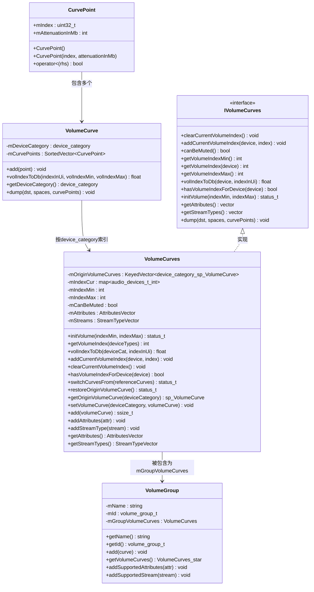
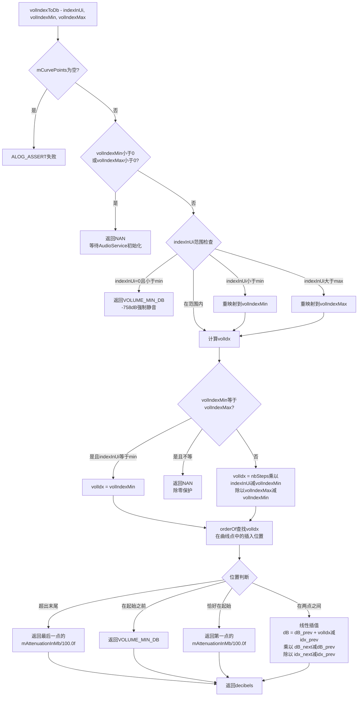
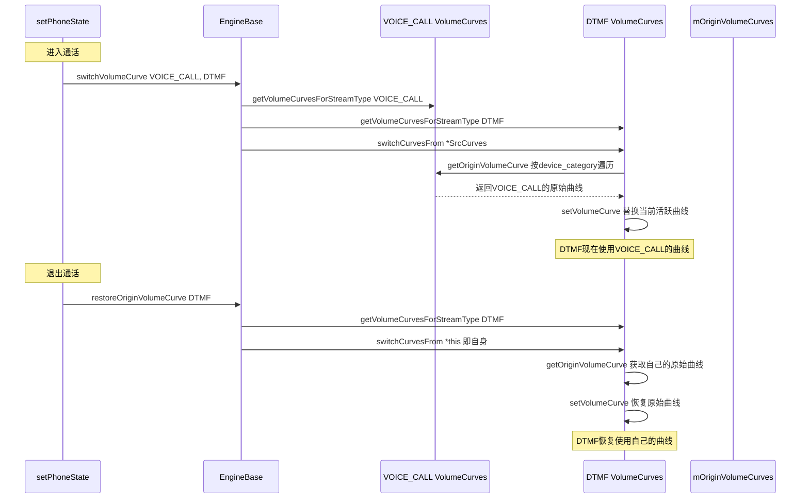
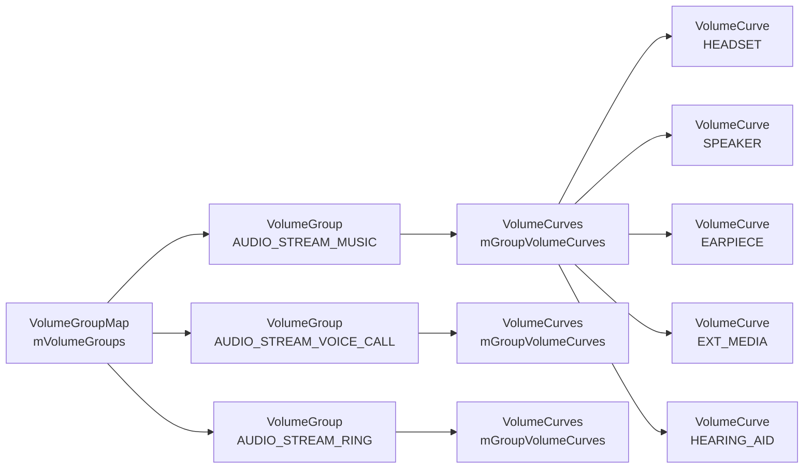
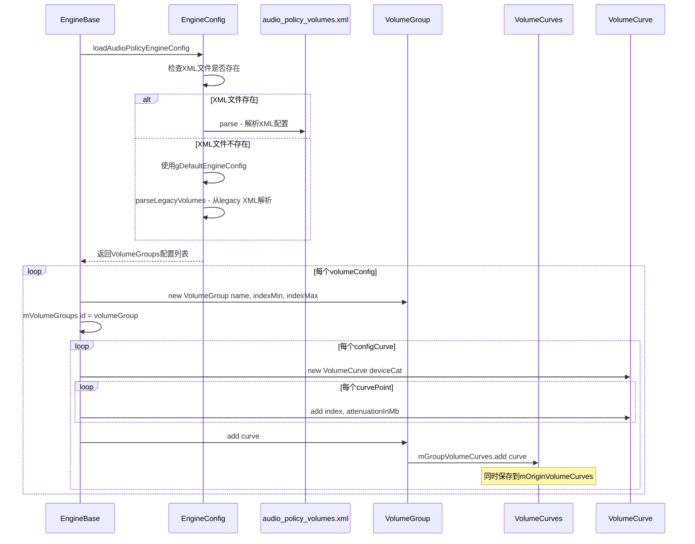
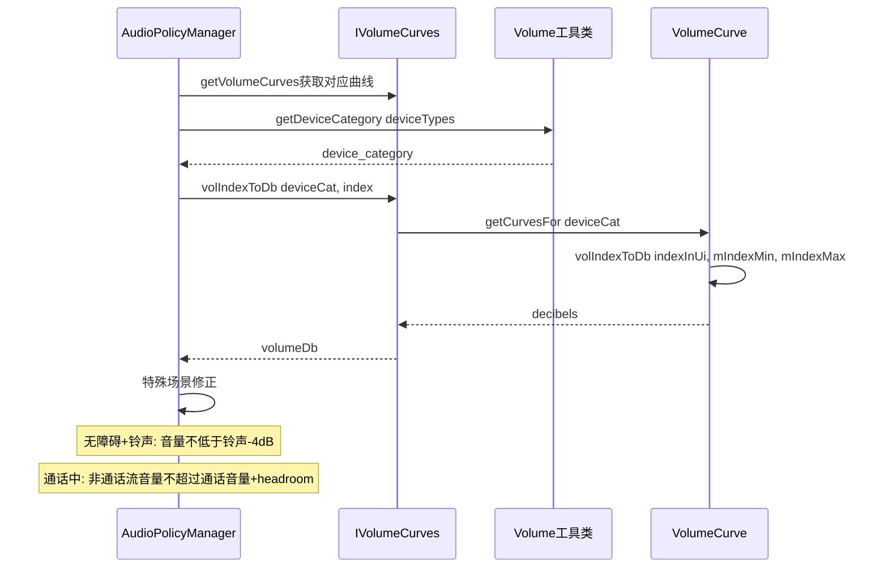
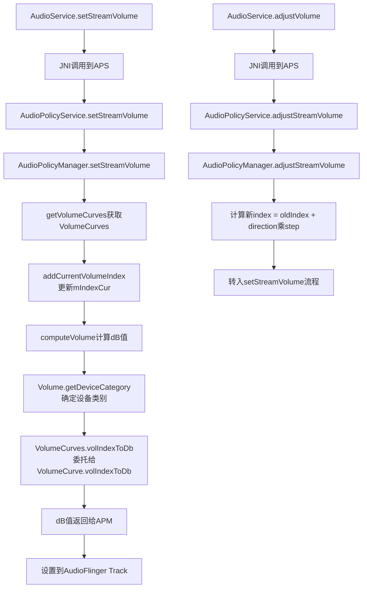
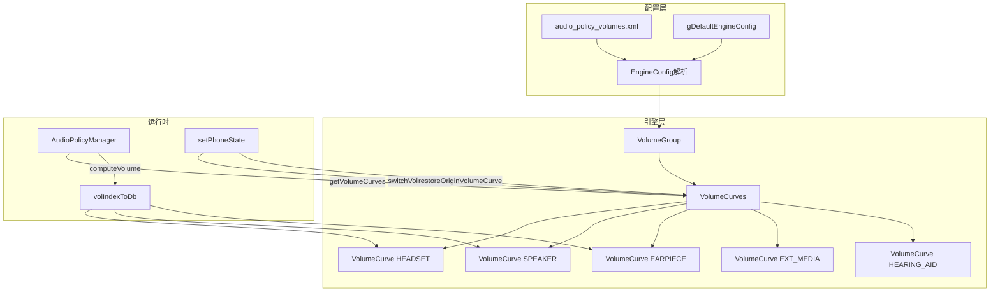

## 6.12 VolumeCurve — 音量曲线

> [← 上一个](06_6.11_EngineConfig-策略配置解析.md) | [← 返回Audio Policy Engine](README.md) | [返回导航](../README.md) | [下一个 →](06_6.13_LastRemovableMediaDevices-可移除设备追踪.md)

---

### 模块职责

[`VolumeCurve`](frameworks/av/services/audiopolicy/engine/common/include/VolumeCurve.h)实现了Audio Policy Engine中最核心的音量映射机制：将用户可感知的UI音量索引（0-100的整数步进）转换为AudioFlinger可使用的分贝（dB）衰减值。该模块支持按设备类别区分不同的衰减特性，确保同一音量索引在扬声器、耳机、听筒等不同输出设备上产生不同的实际响度。

### 类体系总览



---

### 数据结构深度解析

#### CurvePoint — 曲线点

[`CurvePoint`](frameworks/av/services/audiopolicy/engine/common/include/VolumeCurve.h:34)是音量曲线的基本构建单元：

```cpp
struct CurvePoint {
    CurvePoint() {}
    CurvePoint(int index, int attenuationInMb) :
        mIndex(index), mAttenuationInMb(attenuationInMb) {}
    uint32_t mIndex;          // 曲线空间内的索引位置
    int mAttenuationInMb;     // 该索引处的衰减值，单位为毫贝
};
```

- **mIndex**: 曲线空间内的位置索引，不是直接的用户音量索引，而是经过映射后的0-100区间内值
- **mAttenuationInMb**: 衰减值，单位为**毫贝(millibel)**，1 millibel = 0.01 dB。例如 `-9600` 表示 -96 dB
- [`operator<`](frameworks/av/services/audiopolicy/engine/common/include/VolumeCurve.h:43)按`mIndex`升序排列，确保`SortedVector`中曲线点有序

#### device_category — 设备类别枚举

[`device_category`](frameworks/av/services/audiopolicy/common/include/Volume.h:53)定义了5种设备类别，每种类别对应一条独立的音量曲线：

| 枚举值 | 含义 | 典型设备 |
|--------|------|----------|
| `DEVICE_CATEGORY_HEADSET` (0) | 头戴式/耳机 | 有线耳机、蓝牙A2DP耳机、USB耳机 |
| `DEVICE_CATEGORY_SPEAKER` (1) | 扬声器 | 内置扬声器、蓝牙音箱 |
| `DEVICE_CATEGORY_EARPIECE` (2) | 听筒 | 手机听筒 |
| `DEVICE_CATEGORY_EXT_MEDIA` (3) | 外部媒体 | LINE输出、HDMI、USB设备 |
| `DEVICE_CATEGORY_HEARING_AID` (4) | 助听器 | 听力辅助设备 |

设备到类别的映射由[`Volume::getDeviceCategory()`](frameworks/av/services/audiopolicy/common/include/Volume.h:117)完成，关键映射规则：
- `AUDIO_DEVICE_OUT_WIRED_HEADSET/HEADPHONE` → `DEVICE_CATEGORY_HEADSET`
- `AUDIO_DEVICE_OUT_BLUETOOTH_SCO/A2DP_HEADPHONES` → `DEVICE_CATEGORY_HEADSET`
- `AUDIO_DEVICE_OUT_SPEAKER/SPEAKER_SAFE` → `DEVICE_CATEGORY_SPEAKER`
- `AUDIO_DEVICE_OUT_EARPIECE` → `DEVICE_CATEGORY_EARPIECE`
- `AUDIO_DEVICE_OUT_HEARING_AID` → `DEVICE_CATEGORY_HEARING_AID`
- `AUDIO_DEVICE_OUT_LINE/AUX_DIGITAL/USB_DEVICE` → `DEVICE_CATEGORY_EXT_MEDIA`

---

### volIndexToDb()插值算法源码解析

[`VolumeCurve::volIndexToDb()`](frameworks/av/services/audiopolicy/engine/common/src/VolumeCurve.cpp:26)是整个音量系统的核心算法，将UI音量索引转换为dB值。完整流程如下：



#### 第一阶段：UI索引映射到曲线空间

源码第59-63行执行关键映射：

```cpp
int nbSteps = 1 + mCurvePoints[nbCurvePoints - 1].mIndex - mCurvePoints[0].mIndex;
volIdx = (nbSteps * (indexInUi - volIndexMin)) / (volIndexMax - volIndexMin);
```

这一步将UI音量索引从`[volIndexMin, volIndexMax]`区间线性映射到曲线点的`[mCurvePoints[0].mIndex, mCurvePoints[last].mIndex]`区间。`nbSteps`是曲线空间的总步数，而非UI步数。

例如：当`volIndexMin=0, volIndexMax=15`，曲线点索引范围为`[0, 100]`时，`nbSteps=101`。用户索引7将映射到`volIdx = 101 * 7 / 15 ≈ 47`。

#### 第二阶段：查找插入位置

```cpp
size_t indexInUiPosition = mCurvePoints.orderOf(CurvePoint(volIdx, 0));
```

利用`SortedVector::orderOf()`二分查找`volIdx`在曲线点集合中的理论插入位置。`orderOf`返回第一个大于等于`volIdx`的元素位置，因此：
- `indexInUiPosition = 0`：volIdx在所有曲线点之前
- `indexInUiPosition = nbCurvePoints`：volIdx在所有曲线点之后
- `0 < indexInUiPosition < nbCurvePoints`：volIdx在两点之间

#### 第三阶段：线性插值

源码第78-83行的核心插值公式：

```cpp
float decibels = (mCurvePoints[indexInUiPosition - 1].mAttenuationInMb / 100.0f) +
        ((float)(volIdx - mCurvePoints[indexInUiPosition - 1].mIndex)) *
            ( ((mCurvePoints[indexInUiPosition].mAttenuationInMb / 100.0f) -
                    (mCurvePoints[indexInUiPosition - 1].mAttenuationInMb / 100.0f)) /
                ((float)(mCurvePoints[indexInUiPosition].mIndex -
                        mCurvePoints[indexInUiPosition - 1].mIndex)) );
```

数学表达为：

```
dB = dB_prev + (volIdx - idx_prev) × (dB_next - dB_prev) / (idx_next - idx_prev)
```

这是标准的线性插值公式，在相邻两个曲线点之间进行dB值的线性逼近。`mAttenuationInMb / 100.0f`将毫贝转换为分贝。

#### 边界处理要点

| 条件 | 处理 | 源码行 |
|------|------|--------|
| `volIndexMin < 0` 或 `volIndexMax < 0` | 返回NAN，等待AudioService初始化 | [第29-32行](frameworks/av/services/audiopolicy/engine/common/src/VolumeCurve.cpp:29) |
| `indexInUi == 0` 且 `indexInUi < volIndexMin` | 返回`VOLUME_MIN_DB`(-758dB)，强制静音 | [第35-37行](frameworks/av/services/audiopolicy/engine/common/src/VolumeCurve.cpp:35) |
| `volIndexMin == volIndexMax` | 除零保护，仅当`indexInUi == volIndexMin`时有效 | [第50-57行](frameworks/av/services/audiopolicy/engine/common/src/VolumeCurve.cpp:50) |
| `indexInUiPosition >= nbCurvePoints` | 使用最后一个曲线点的dB值 | [第67-69行](frameworks/av/services/audiopolicy/engine/common/src/VolumeCurve.cpp:67) |
| `indexInUiPosition == 0` 且不等于首点索引 | 返回`VOLUME_MIN_DB`，越界保护 | [第71-74行](frameworks/av/services/audiopolicy/engine/common/src/VolumeCurve.cpp:71) |

`VOLUME_MIN_DB`定义为-758dB（见[`Volume.h:41`](frameworks/av/services/audiopolicy/common/include/Volume.h:41)），此值经`DbToAmpl()`转换后为0.0，等效于静音。

---

### VolumeCurves — 曲线集合管理

[`VolumeCurves`](frameworks/av/services/audiopolicy/engine/common/include/VolumeCurve.h:70)继承自`KeyedVector<device_category, sp<VolumeCurve>>`并实现[`IVolumeCurves`](frameworks/av/services/audiopolicy/common/managerdefinitions/include/IVolumeCurves.h:28)接口，是一个按设备类别索引的曲线集合，同时管理每个设备的当前音量索引。

#### 核心数据成员

| 成员 | 类型 | 用途 |
|------|------|------|
| `mOriginVolumeCurves` | `KeyedVector<device_category, sp<VolumeCurve>>` | 保存原始曲线备份，用于曲线切换后恢复 |
| `mIndexCur` | `std::map<audio_devices_t, int>` | 每个设备类型的当前音量索引 |
| `mIndexMin` / `mIndexMax` | `int` | 音量索引范围（通常0-100或0-15） |
| `mCanBeMuted` | `bool` | 是否允许静音（默认true） |
| `mAttributes` | `AttributesVector` | 关联的AudioAttributes列表 |
| `mStreams` | `StreamTypeVector` | 关联的StreamType列表（兼容遗留） |

#### add()方法 — 曲线注册与备份

[`VolumeCurves::add()`](frameworks/av/services/audiopolicy/engine/common/include/VolumeCurve.h:149)在添加曲线时自动保存原始备份：

```cpp
ssize_t add(const sp<VolumeCurve> &volumeCurve) {
    device_category deviceCategory = volumeCurve->getDeviceCategory();
    ssize_t index = indexOfKey(deviceCategory);
    if (index < 0) {
        mOriginVolumeCurves.add(deviceCategory, volumeCurve);  // 保存原始曲线
        return KeyedVector::add(deviceCategory, volumeCurve);
    }
    return index;  // 已存在则不覆盖
}
```

关键设计：首次添加某设备类别的曲线时，同时存入`mOriginVolumeCurves`和父类`KeyedVector`。后续`switchCurvesFrom()`只替换`KeyedVector`中的活跃曲线，`mOriginVolumeCurves`始终保持初始配置。

#### getVolumeIndex() — 获取当前音量索引

[`getVolumeIndex()`](frameworks/av/services/audiopolicy/engine/common/include/VolumeCurve.h:94)根据设备类型查找当前音量索引：

```cpp
int getVolumeIndex(const DeviceTypeSet& deviceTypes) const {
    audio_devices_t device = Volume::getDeviceForVolume(deviceTypes);
    if (mIndexCur.find(device) == end(mIndexCur)) {
        device = AUDIO_DEVICE_OUT_DEFAULT_FOR_VOLUME;  // 回退到默认设备
    }
    return mIndexCur.at(device);
}
```

使用`Volume::getDeviceForVolume()`将设备集合精简为单一设备类型，再从`mIndexCur`查找索引。若该设备无记录，回退到`AUDIO_DEVICE_OUT_DEFAULT_FOR_VOLUME`。

#### volIndexToDb() — 委托调用

[`VolumeCurves::volIndexToDb()`](frameworks/av/services/audiopolicy/engine/common/include/VolumeCurve.h:161)是`IVolumeCurves`接口的实现，将调用委托给对应设备类别的`VolumeCurve`：

```cpp
float volIndexToDb(device_category deviceCat, int indexInUi) const {
    sp<VolumeCurve> vc = getCurvesFor(deviceCat);
    if (vc != 0) {
        return vc->volIndexToDb(indexInUi, mIndexMin, mIndexMax);
    }
    return 0.0f;  // 无效设备类别返回0dB
}
```

---

### 曲线切换机制

VolumeCurves支持运行时动态切换音量曲线，主要用于通话场景下DTMF音量行为的调整。



#### switchCurvesFrom() — 曲线替换

[`switchCurvesFrom()`](frameworks/av/services/audiopolicy/engine/common/include/VolumeCurve.h:121)将当前对象的活跃曲线替换为参考曲线的**原始**曲线：

```cpp
status_t switchCurvesFrom(const VolumeCurves &referenceCurves) {
    if (size() != referenceCurves.size()) {
        return BAD_TYPE;  // 设备类别数量必须对齐
    }
    for (size_t index = 0; index < size(); index++) {
        device_category cat = keyAt(index);
        setVolumeCurve(cat, referenceCurves.getOriginVolumeCurve(cat));
    }
    return NO_ERROR;
}
```

注意：它使用的是`referenceCurves.getOriginVolumeCurve(cat)`而非当前活跃曲线，确保获取的是参考曲线的初始配置。

#### restoreOriginVolumeCurve() — 曲线恢复

[`restoreOriginVolumeCurve()`](frameworks/av/services/audiopolicy/engine/common/include/VolumeCurve.h:133)的实现极其简洁：

```cpp
status_t restoreOriginVolumeCurve() {
    return switchCurvesFrom(*this);  // 从自身的mOriginVolumeCurves恢复
}
```

传入`*this`作为参考，`switchCurvesFrom`会调用`this->getOriginVolumeCurve(cat)`，从`mOriginVolumeCurves`中取出原始曲线并设置回活跃曲线。

#### EngineBase中的切换调用

在[`EngineBase::setPhoneState()`](frameworks/av/services/audiopolicy/engine/common/src/EngineBase.cpp:60)中：

```cpp
if (!is_state_in_call(oldState) && is_state_in_call(state)) {
    switchVolumeCurve(AUDIO_STREAM_VOICE_CALL, AUDIO_STREAM_DTMF);  // 进通话
} else if (is_state_in_call(oldState) && !is_state_in_call(state)) {
    restoreOriginVolumeCurve(AUDIO_STREAM_DTMF);  // 出通话
}
```

[`switchVolumeCurve()`](frameworks/av/services/audiopolicy/engine/common/src/EngineBase.cpp:314)获取src和dst的VolumeCurves后调用`switchCurvesFrom`：

```cpp
status_t EngineBase::switchVolumeCurve(audio_stream_type_t streamSrc, audio_stream_type_t streamDst) {
    auto srcCurves = getVolumeCurvesForStreamType(streamSrc);
    auto dstCurves = getVolumeCurvesForStreamType(streamDst);
    if (srcCurves == nullptr || dstCurves == nullptr) {
        return BAD_VALUE;
    }
    return dstCurves->switchCurvesFrom(*srcCurves);
}
```

---

### VolumeGroup与VolumeCurves的关系

[`VolumeGroup`](frameworks/av/services/audiopolicy/engine/common/include/VolumeGroup.h:30)是音量管理的基本分组单元，每个VolumeGroup包含一个`VolumeCurves`实例：



[`VolumeGroup`](frameworks/av/services/audiopolicy/engine/common/include/VolumeGroup.h:30)的构造函数接收名称和索引范围：

```cpp
VolumeGroup::VolumeGroup(const std::string &name, int indexMin, int indexMax) :
    mName(name), mId(static_cast<volume_group_t>(HandleGenerator<uint32_t>::getNextHandle())),
    mGroupVolumeCurves(VolumeCurves(indexMin, indexMax)) {}
```

- `mId`由`HandleGenerator`自动分配，确保全局唯一
- `mGroupVolumeCurves`以`indexMin/indexMax`初始化
- [`getVolumeCurves()`](frameworks/av/services/audiopolicy/engine/common/include/VolumeGroup.h:39)返回内部`VolumeCurves`的指针，供Engine和APM直接操作

---

### 音量曲线配置加载流程



配置加载的关键步骤（[`EngineBase.cpp:120-145`](frameworks/av/services/audiopolicy/engine/common/src/EngineBase.cpp:120)）：

1. 若XML配置文件不存在，使用`gDefaultEngineConfig`硬编码默认配置，再通过`parseLegacyVolumes()`从`audio_policy_volumes.xml`解析
2. 对每个`volumeConfig`创建`VolumeGroup`，注册到`mVolumeGroups`映射
3. 对每条曲线配置，创建`VolumeCurve`并添加所有`CurvePoint`
4. `VolumeGroup::add()`最终调用`VolumeCurves::add()`，将曲线同时存入活跃集合和原始备份
5. 特殊处理：若某个策略组未找到对应VolumeGroup，使用`AUDIO_STREAM_MUSIC`的配置作为默认（[第209-220行](frameworks/av/services/audiopolicy/engine/common/src/EngineBase.cpp:209)）

#### 系统内部VolumeGroup

[`gSystemVolumeGroups`](frameworks/av/services/audiopolicy/engine/common/src/EngineDefaultConfig.h:160)定义了两个内部使用的VolumeGroup，曲线点全部为0dB（无衰减）：

```
AUDIO_STREAM_REROUTING:  indexMin=0, indexMax=1
  所有设备类别: {0,0}, {100,0}  → 固定0dB

AUDIO_STREAM_PATCH:      indexMin=0, indexMax=1
  所有设备类别: {0,0}, {100,0}  → 固定0dB
```

这两个内部流用于AudioPatch和重路由，不需要音量调节。

---

### 默认音量曲线详解

默认音量曲线通过`audio_policy_volumes.xml`或`default_volume_tables.xml`配置。典型配置结构如下：

#### MUSIC流默认曲线

| 设备类别 | 曲线点 (index, attenuationInMb) | 特征描述 |
|----------|--------------------------------|----------|
| HEADSET | (0,-9000), (33,-3600), (66,-1600), (100,0) | 低音量段衰减温和，保护听力 |
| SPEAKER | (0,-9000), (33,-4800), (66,-2400), (100,0) | 低音量段衰减更陡，保护扬声器 |
| EARPIECE | (0,-9000), (33,-4800), (66,-2400), (100,0) | 与SPEAKER类似 |
| EXT_MEDIA | (0,-5800), (33,-4000), (66,-2100), (100,0) | 起始衰减较小，外部设备输出能力强 |
| HEARING_AID | (0,-9000), (33,-3600), (66,-1600), (100,0) | 与HEADSET一致 |

#### 曲线差异分析

```
衰减(dB)
  0 ──────────────────────────────────── 所有设备类别汇聚点
     │                                /
-16 ─│──────────────────── HEADSET ─/
     │                           /
-24 ─│─────────── SPEAKER ─────/
     │                      /
-36 ─│────── HEADSET ──────/
     │                 /
-48 ─│─── SPEAKER ───/
     │              /
-90 ─│─────────────  所有设备类别起始点
     └──────────────────────────────
     0        33        66        100  索引
```

SPEAKER在低音量段（0-33）衰减更快（-48dB vs -36dB），这是因为：
1. 扬声器在低功率时失真更明显
2. 防止微小音量下的扬声器底噪
3. 扬声器在中等音量段仍保持较高斜率，避免突然变大

---

### 音量曲线在Engine中的使用

#### EngineBase提供的访问接口

[`EngineBase`](frameworks/av/services/audiopolicy/engine/common/include/EngineBase.h)提供三种方式获取VolumeCurves：

| 方法 | 输入 | 用途 |
|------|------|------|
| [`getVolumeCurvesForAttributes()`](frameworks/av/services/audiopolicy/engine/common/src/EngineBase.cpp:294) | `audio_attributes_t` | 通过Attributes查找 |
| [`getVolumeCurvesForStreamType()`](frameworks/av/services/audiopolicy/engine/common/src/EngineBase.cpp:302) | `audio_stream_type_t` | 通过StreamType查找 |
| [`getVolumeCurvesForVolumeGroup()`](frameworks/av/services/audiopolicy/engine/common/include/EngineBase.h:74) | `volume_group_t` | 通过VolumeGroup ID查找 |

三者都通过`mProductStrategies`先解析出`volume_group_t`，再从`mVolumeGroups`映射中获取`VolumeGroup`，最终返回其内部的`VolumeCurves`指针。

#### APM中的computeVolume调用链

[`AudioPolicyManager::computeVolume()`](frameworks/av/services/audiopolicy/managerdefault/AudioPolicyManager.cpp:7558)是音量计算的入口：



APM的`computeVolume`还包含两个重要的音量修正逻辑（[第7565-7600行](frameworks/av/services/audiopolicy/managerdefault/AudioPolicyManager.cpp:7565)）：

1. **无障碍音量修正**：铃声模式下，Accessibility音量不低于铃声音量-4dB，确保语音提示可听
2. **通话音量上限**：通话中，系统/铃声/音乐/闹钟/通知/DTMF/无障碍的音量不超过通话音量 + `IN_CALL_EARPIECE_HEADROOM_DB`

---

### setVolume/adjustVolume流程中VolumeCurve的角色



关键环节：
1. `setStreamVolume`先更新`mIndexCur`中对应设备的音量索引
2. 调用`computeVolume`时，`Volume::getDeviceCategory()`确定当前输出设备的类别
3. `VolumeCurves::volIndexToDb()`委托给对应设备类别的`VolumeCurve`
4. `VolumeCurve::volIndexToDb()`执行上述插值算法，返回dB值
5. dB值经过特殊场景修正后，最终通过`AudioFlinger::setStreamVolume()`设置到播放线程

---

### 曲线点格式与毫贝单位

#### 为什么使用毫贝(millibel)

- 1 millibel = 0.01 dB
- 人耳最小可分辨音量差约为1 dB
- 毫贝精度(0.01 dB)远超人耳分辨率，确保插值计算无精度损失
- 整数存储避免浮点累积误差
- 曲线点在配置文件中使用整数，便于XML配置

#### 典型曲线点解读

```
MUSIC/HEADSET:  (0,-9000), (33,-3600), (66,-1600), (100,0)
  → 索引0时衰减-90dB (几乎静音)
  → 索引33时衰减-36dB (轻声)
  → 索引66时衰减-16dB (中等)
  → 索引100时衰减0dB (原音量)

VOICE_CALL/EARPIECE:  (0,-1200), (33,-600), (66,-200), (100,0)
  → 通话音量范围较窄，起始衰减仅-12dB
  → 通话需要保证最低可听度，不能完全静音
```

不同Stream类型的曲线形状反映了其使用场景的需求：
- **MUSIC**：大动态范围，从极低到满音量
- **VOICE_CALL**：窄动态范围，保证最低可听度
- **RING/ALARM**：起始衰减较小，确保提醒效果
- **DTMF**：与通话类似，需要保持可辨识度

---

### IVolumeCurves接口设计

[`IVolumeCurves`](frameworks/av/services/audiopolicy/common/managerdefinitions/include/IVolumeCurves.h:28)定义了音量曲线的公共接口，使`AudioPolicyManager`可以不依赖具体实现来操作音量：

```cpp
class IVolumeCurves {
public:
    virtual ~IVolumeCurves() = default;
    virtual void clearCurrentVolumeIndex() = 0;
    virtual void addCurrentVolumeIndex(audio_devices_t device, int index) = 0;
    virtual bool canBeMuted() const = 0;
    virtual int getVolumeIndexMin() const = 0;
    virtual int getVolumeIndex(const DeviceTypeSet& device) const = 0;
    virtual int getVolumeIndexMax() const = 0;
    virtual float volIndexToDb(device_category device, int indexInUi) const = 0;
    virtual bool hasVolumeIndexForDevice(audio_devices_t device) const = 0;
    virtual status_t initVolume(int indexMin, int indexMax) = 0;
    virtual std::vector<audio_attributes_t> getAttributes() const = 0;
    virtual std::vector<audio_stream_type_t> getStreamTypes() const = 0;
    virtual void dump(String8 *dst, int spaces = 0, bool curvePoints = false) const = 0;
};
```

接口分为三组功能：
1. **索引管理**：`clearCurrentVolumeIndex`/`addCurrentVolumeIndex`/`getVolumeIndex`/`hasVolumeIndexForDevice`/`initVolume`
2. **曲线查询**：`volIndexToDb`/`getVolumeIndexMin`/`getVolumeIndexMax`/`canBeMuted`
3. **元数据**：`getAttributes`/`getStreamTypes`/`dump`

---

### 总结



VolumeCurve模块的核心设计理念：
1. **设备差异化曲线**：5种设备类别独立曲线，适配不同硬件的声学特性
2. **毫贝精度插值**：0.01dB精度的线性插值，确保音量调节平滑无跳变
3. **可恢复的曲线切换**：`mOriginVolumeCurves`备份机制支持通话场景的动态曲线替换与恢复
4. **接口抽象**：`IVolumeCurves`接口解耦APM与具体实现，支持Engine可配置化
5. **分组管理**：VolumeGroup将Stream/Attributes与曲线绑定，实现按用途的音量独立控制

---

[← 上一个](06_6.11_EngineConfig-策略配置解析.md) | [← 返回Audio Policy Engine](README.md) | [返回导航](../README.md) | [下一个 →](06_6.13_LastRemovableMediaDevices-可移除设备追踪.md)