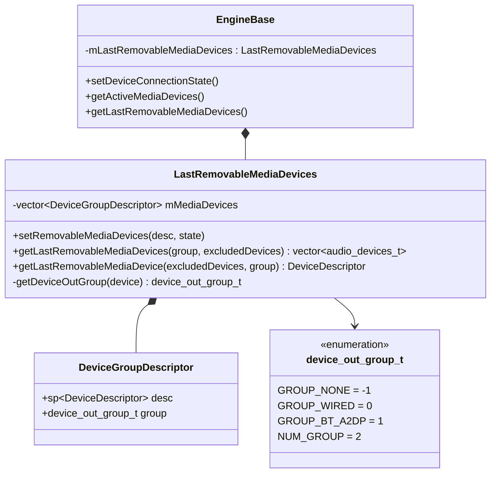
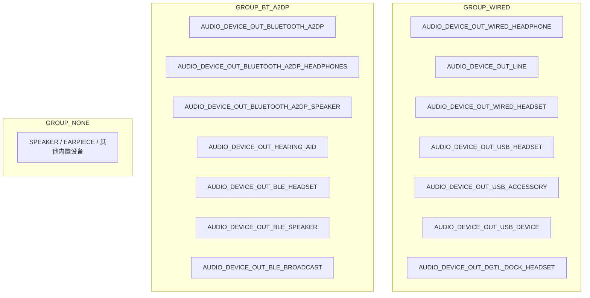
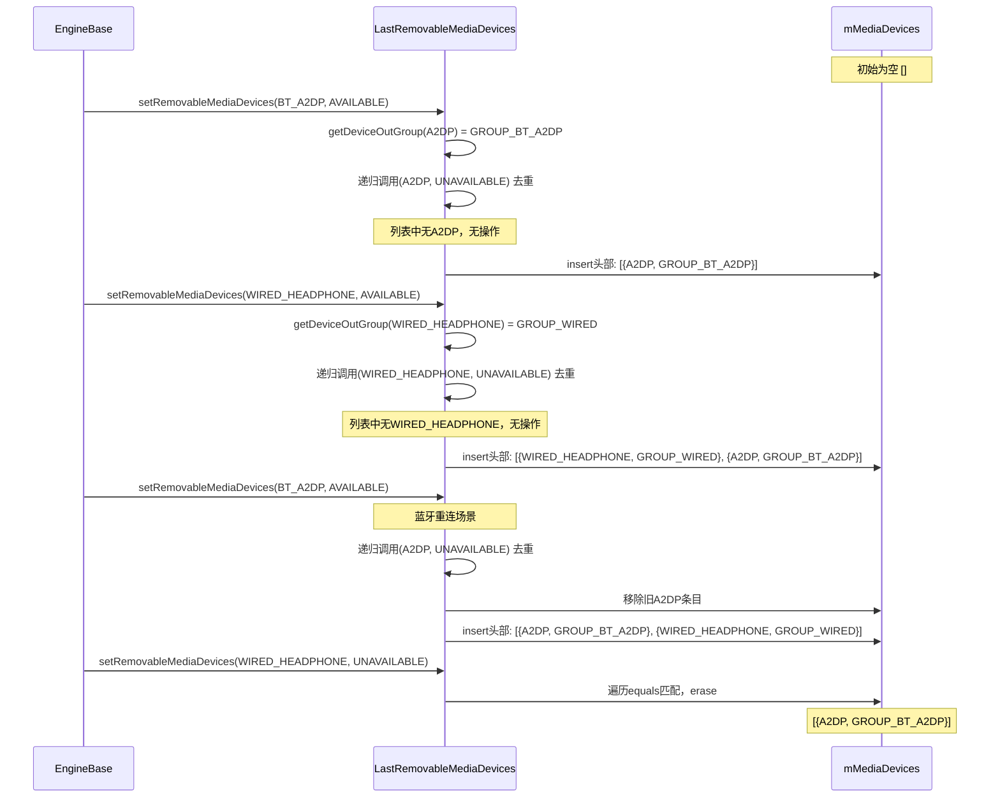
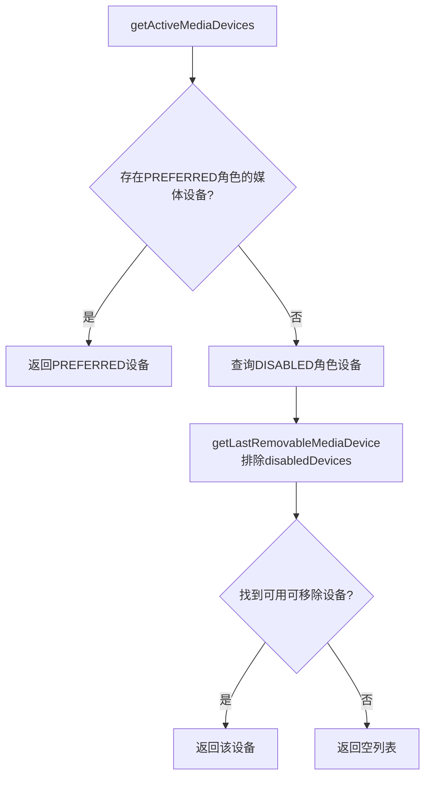
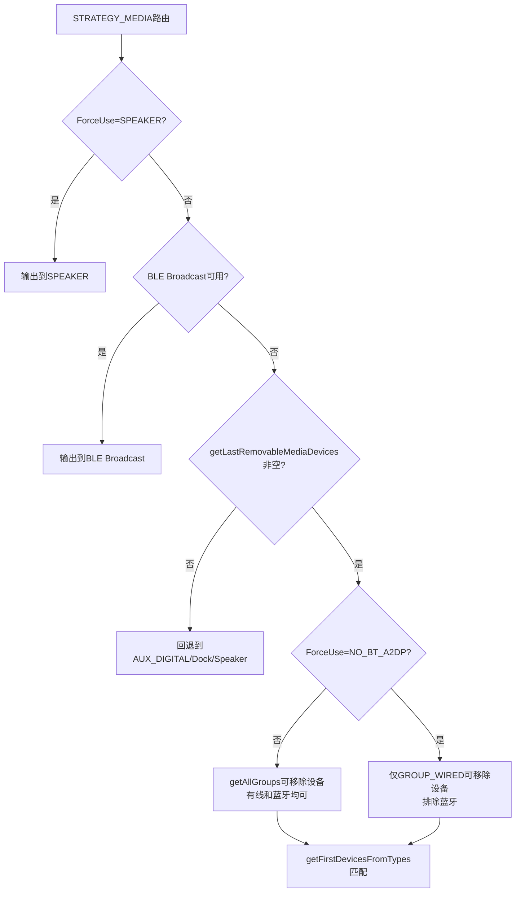
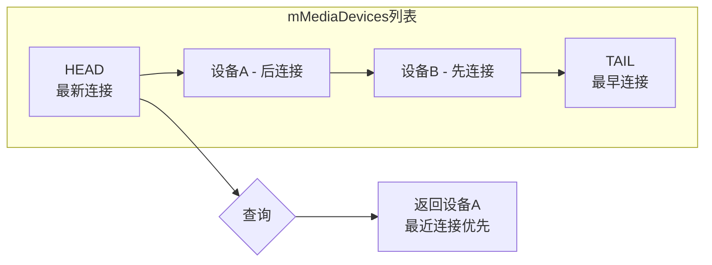
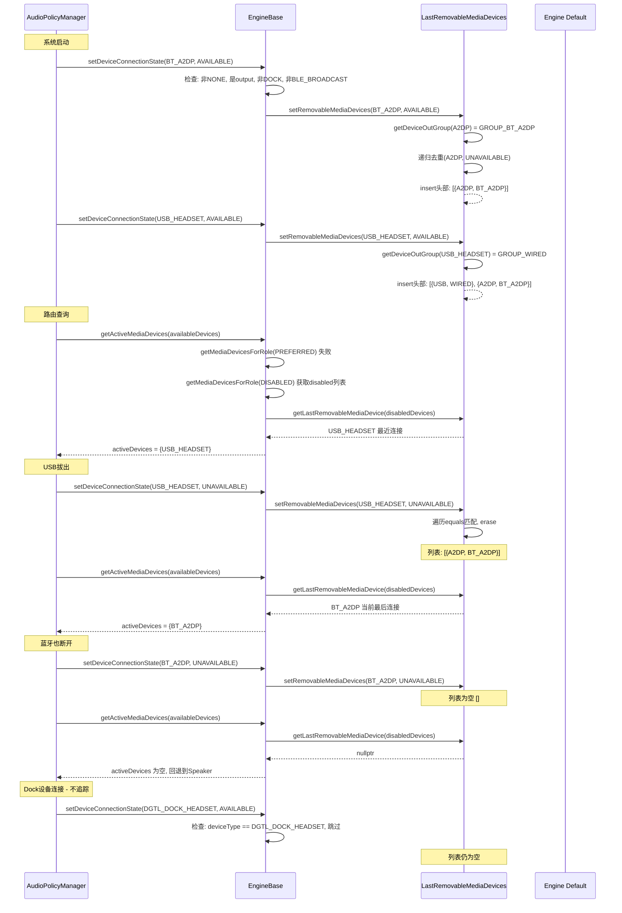

## 6.13 LastRemovableMediaDevices — 可移除设备追踪

> [← 上一个](06_6.12_VolumeCurve-音量曲线.md) | [← 返回Audio Policy Engine](README.md) | [返回导航](../README.md) | [下一个 →](06_6.14_AudioPolicyManagerObserver-观察者接口.md)

---

### 模块职责

[`LastRemovableMediaDevices`](frameworks/av/services/audiopolicy/engine/common/include/LastRemovableMediaDevices.h:30) 追踪系统中最后连接的可移除媒体输出设备（蓝牙耳机、有线耳机、USB音频设备），维护一个按连接时间排序的设备列表。其核心价值在于：

1. **路由回退决策**：当可移除设备拔出后，音频需要知道"上一个"可移除设备是什么，以决定是切换到另一个可移除设备还是回退到内置Speaker
2. **设备优先级**：后连接的设备排在列表头部（LIFO语义），确保"最后连接的设备优先"行为
3. **分组过滤**：支持按设备类型组（有线/蓝牙）进行查询，实现策略级的精细化路由

---

### 类完整结构



#### 成员变量

| 成员 | 类型 | 位置 | 说明 |
|------|------|------|------|
| [`mMediaDevices`](frameworks/av/services/audiopolicy/engine/common/include/LastRemovableMediaDevices.h:46) | `std::vector<DeviceGroupDescriptor>` | :46 | 按连接时间降序排列的可移除设备列表，头部为最近连接的设备 |

#### 内部结构体 DeviceGroupDescriptor

```cpp
// LastRemovableMediaDevices.h:43-46
struct DeviceGroupDescriptor {
    sp<DeviceDescriptor> desc;   // 设备描述符指针
    device_out_group_t group;     // 设备所属分组
};
```

每个条目同时保存设备描述符和其分组信息，避免重复调用 [`getDeviceOutGroup()`](frameworks/av/services/audiopolicy/engine/common/src/LastRemovableMediaDevices.cpp:73) 查询。

---

### 设备分组机制

[`getDeviceOutGroup()`](frameworks/av/services/audiopolicy/engine/common/src/LastRemovableMediaDevices.cpp:73) 是分组的核心判断逻辑，根据 `audio_devices_t` 类型返回对应的设备组：

```cpp
// LastRemovableMediaDevices.cpp:73-96
device_out_group_t LastRemovableMediaDevices::getDeviceOutGroup(audio_devices_t device) const
{
    switch (device) {
    case AUDIO_DEVICE_OUT_WIRED_HEADPHONE:
    case AUDIO_DEVICE_OUT_LINE:
    case AUDIO_DEVICE_OUT_WIRED_HEADSET:
    case AUDIO_DEVICE_OUT_USB_HEADSET:
    case AUDIO_DEVICE_OUT_USB_ACCESSORY:
    case AUDIO_DEVICE_OUT_USB_DEVICE:
    case AUDIO_DEVICE_OUT_DGTL_DOCK_HEADSET:
        return GROUP_WIRED;
    case AUDIO_DEVICE_OUT_BLUETOOTH_A2DP:
    case AUDIO_DEVICE_OUT_BLUETOOTH_A2DP_HEADPHONES:
    case AUDIO_DEVICE_OUT_BLUETOOTH_A2DP_SPEAKER:
    case AUDIO_DEVICE_OUT_HEARING_AID:
    case AUDIO_DEVICE_OUT_BLE_HEADSET:
    case AUDIO_DEVICE_OUT_BLE_SPEAKER:
    case AUDIO_DEVICE_OUT_BLE_BROADCAST:
        return GROUP_BT_A2DP;
    default:
        return GROUP_NONE;
    }
}
```



**设计要点**：
- USB设备（`USB_HEADSET`/`USB_DEVICE`/`USB_ACCESSORY`）归入 `GROUP_WIRED`，与有线耳机同等对待
- `HEARING_AID` 和 `BLE_HEADSET`/`BLE_SPEAKER` 归入 `GROUP_BT_A2DP`，LE Audio设备与经典蓝牙A2DP同组
- `AUDIO_DEVICE_OUT_DGTL_DOCK_HEADSET` 在分组中属于 `GROUP_WIRED`，但在 [`EngineBase::setDeviceConnectionState()`](frameworks/av/services/audiopolicy/engine/common/src/EngineBase.cpp:70) 中被特殊排除不参与追踪
- `AUDIO_DEVICE_OUT_BLE_BROADCAST` 同理，在分组中属于 `GROUP_BT_A2DP`，但被特殊排除

---

### setRemovableMediaDevices() — 设备追踪逻辑源码详解

```cpp
// LastRemovableMediaDevices.cpp:30-44
void LastRemovableMediaDevices::setRemovableMediaDevices(sp<DeviceDescriptor> desc,
                                                         audio_policy_dev_state_t state)
{
    if (desc == nullptr) {
        return;
    } else {
        if ((state == AUDIO_POLICY_DEVICE_STATE_AVAILABLE) &&
                (getDeviceOutGroup(desc->type()) != GROUP_NONE)) {
            setRemovableMediaDevices(desc, AUDIO_POLICY_DEVICE_STATE_UNAVAILABLE);
            mMediaDevices.insert(mMediaDevices.begin(), {desc, getDeviceOutGroup(desc->type())});
        } else if (state == AUDIO_POLICY_DEVICE_STATE_UNAVAILABLE) {
            for (auto iter = mMediaDevices.begin(); iter != mMediaDevices.end(); ++iter) {
                if ((iter->desc)->equals(desc)) {
                    mMediaDevices.erase(iter);
                    break;
                }
            }
        }
    }
}
```

**逻辑分三条路径**：

1. **空指针保护**（:32-33）：`desc == nullptr` 直接返回
2. **设备可用**（:34-37）：
   - 先检查 `getDeviceOutGroup(desc->type()) != GROUP_NONE`，只追踪可移除设备
   - **关键步骤**：先以 `UNAVAILABLE` 状态调用自身，移除同设备旧条目（去重）
   - 再 `insert` 到 `mMediaDevices` 头部，确保最新设备在最前面
3. **设备不可用**（:38-43）：
   - 遍历 `mMediaDevices`，调用 `DeviceDescriptor::equals()` 匹配
   - 找到后 `erase` 并 `break`（只移除第一个匹配项）

**去重机制的关键**：当设备重新连接时（如蓝牙耳机重连），先删除旧条目再插入头部，确保同一设备不会在列表中出现两次，且更新其"最近连接"位置。



---

### getLastRemovableMediaDevices() — 批量查询算法

```cpp
// LastRemovableMediaDevices.cpp:46-59
std::vector<audio_devices_t> LastRemovableMediaDevices::getLastRemovableMediaDevices(
        device_out_group_t group, std::vector<audio_devices_t> excludedDevices) const
{
    std::vector<audio_devices_t> ret;
    for (auto iter = mMediaDevices.begin(); iter != mMediaDevices.end(); ++iter) {
        audio_devices_t type = (iter->desc)->type();
        if ((group == GROUP_NONE || group == getDeviceOutGroup(type))
                && std::find(excludedDevices.begin(), excludedDevices.end(), type) ==
                                       excludedDevices.end()) {
            ret.push_back(type);
        }
    }
    return ret;
}
```

**过滤逻辑**：
- **分组过滤**：`group == GROUP_NONE` 表示不过滤，否则只返回匹配组的设备
- **排除过滤**：使用 `std::find` 检查设备类型是否在 `excludedDevices` 中，在则跳过
- **顺序保证**：从 `mMediaDevices` 头部遍历到尾部，返回列表保持"最近连接优先"顺序

---

### getLastRemovableMediaDevice() — 单设备查询算法

```cpp
// LastRemovableMediaDevices.cpp:61-70
sp<DeviceDescriptor> LastRemovableMediaDevices::getLastRemovableMediaDevice(
        const DeviceVector& excludedDevices, device_out_group_t group) const {
    for (auto iter = mMediaDevices.begin(); iter != mMediaDevices.end(); ++iter) {
        if ((group == GROUP_NONE || group == getDeviceOutGroup((iter->desc)->type())) &&
                !excludedDevices.contains(iter->desc)) {
            return iter->desc;
        }
    }
    return nullptr;
}
```

与 `getLastRemovableMediaDevices()` 的差异：
- 返回单个 `sp<DeviceDescriptor>` 而非 `vector<audio_devices_t>`
- 排除列表使用 `DeviceVector::contains()` 匹配（按设备描述符对象比较），而非类型比较
- 找到第一个满足条件的即返回（LIFO语义：最近连接的可移除设备）
- 无匹配时返回 `nullptr`

---

### 与EngineBase的交互

#### 1. setDeviceConnectionState() 中调用追踪

```cpp
// EngineBase.cpp:70-85
status_t EngineBase::setDeviceConnectionState(const sp<DeviceDescriptor> devDesc,
                                              audio_policy_dev_state_t state)
{
    audio_devices_t deviceType = devDesc->type();
    if ((deviceType != AUDIO_DEVICE_NONE) && audio_is_output_device(deviceType)
            && deviceType != AUDIO_DEVICE_OUT_DGTL_DOCK_HEADSET
            && deviceType != AUDIO_DEVICE_OUT_BLE_BROADCAST) {
        // USB dock does not follow the rule of last removable device connected wins.
        // It is only used if no removable device is connected or if set as preferred device
        // LE audio broadcast device has a specific policy depending on active strategies and
        // devices and does not follow the rule of last connected removable device.
        mLastRemovableMediaDevices.setRemovableMediaDevices(devDesc, state);
    }
    return NO_ERROR;
}
```

**特殊排除的设备**：

| 排除设备 | 排除原因 |
|----------|----------|
| `AUDIO_DEVICE_OUT_DGTL_DOCK_HEADSET` | USB底座不遵循"最后连接可移除设备优先"规则，仅在无可移除设备或设为preferred时使用 |
| `AUDIO_DEVICE_OUT_BLE_BROADCAST` | LE Audio广播设备有独立策略逻辑（依赖活跃strategy和设备），不遵循标准可移除设备追踪规则 |

注意：这两个设备在 [`getDeviceOutGroup()`](frameworks/av/services/audiopolicy/engine/common/src/LastRemovableMediaDevices.cpp:73) 中分别属于 `GROUP_WIRED` 和 `GROUP_BT_A2DP`，但被 `setDeviceConnectionState()` 在调用追踪前拦截。

#### 2. getActiveMediaDevices() 中查询使用

```cpp
// EngineBase.cpp:669-687
DeviceVector EngineBase::getActiveMediaDevices(const DeviceVector& availableDevices) const
{
    // The priority of active devices as follows:
    // 1: the available preferred devices for media
    // 2: the latest connected removable media device that is enabled
    DeviceVector activeDevices;
    if (getMediaDevicesForRole(
            DEVICE_ROLE_PREFERRED, availableDevices, activeDevices) != NO_ERROR) {
        activeDevices.clear();
        DeviceVector disabledDevices;
        getMediaDevicesForRole(DEVICE_ROLE_DISABLED, availableDevices, disabledDevices);
        sp<DeviceDescriptor> device =
                mLastRemovableMediaDevices.getLastRemovableMediaDevice(disabledDevices);
        if (device != nullptr) {
            activeDevices.add(device);
        }
    }
    return activeDevices;
}
```

**媒体设备优先级决策流程**：



此方法被 APM 在两处调用：
- [`AudioPolicyManager::setDeviceConnectionState()`](frameworks/av/services/audiopolicy/managerdefault/AudioPolicyManager.cpp:318)：设备连接状态变化时重新评估活跃媒体设备
- [`AudioPolicyManager::closeActiveClients()`](frameworks/av/services/audiopolicy/managerdefault/AudioPolicyManager.cpp:2592)：关闭客户端后用活跃媒体设备重新打开输出

---

### 在路由决策中的应用

#### Engine::getDevicesForStrategyInt() 中的使用

在默认引擎 [`Engine::getDevicesForStrategyInt()`](frameworks/av/services/audiopolicy/enginedefault/src/Engine.cpp:271) 中，`LastRemovableMediaDevices` 被多处引用：

**1. STRATEGY_PHONE 策略**（:283-297）：

```cpp
case STRATEGY_PHONE: {
    devices = availableOutputDevices.getFirstDevicesFromTypes(
                    getLastRemovableMediaDevices(GROUP_NONE, {
                        AUDIO_DEVICE_OUT_HEARING_AID,
                        AUDIO_DEVICE_OUT_BLE_HEADSET
                        }));
    if (!devices.isEmpty()) break;
    devices = availableOutputDevices.getFirstDevicesFromTypes({
            AUDIO_DEVICE_OUT_DGTL_DOCK_HEADSET, AUDIO_DEVICE_OUT_EARPIECE,
            AUDIO_DEVICE_OUT_SPEAKER});
} break;
```

电话策略优先使用可移除设备（排除助听器和BLE耳机，因为Dialer通过 `setCommunicationDevice` 显式选择它们），无可用可移除设备时回退到Earpiece/Speaker。

**2. STRATEGY_MEDIA 策略**（:393-402）：

```cpp
if (devices2.isEmpty() && (getLastRemovableMediaDevices().size() > 0)) {
    if ((getForceUse(AUDIO_POLICY_FORCE_FOR_MEDIA) != AUDIO_POLICY_FORCE_NO_BT_A2DP)) {
        // Get the last connected device of wired and bluetooth a2dp
        devices2 = availableOutputDevices.getFirstDevicesFromTypes(
                getLastRemovableMediaDevices());
    } else {
        // Get the last connected device of wired except bluetooth a2dp
        devices2 = availableOutputDevices.getFirstDevicesFromTypes(
                getLastRemovableMediaDevices(GROUP_WIRED));
    }
}
```

媒体策略的路由优先级链：
1. Remote Submix（WFD场景）
2. 强制Speaker（`FORCE_SPEAKER`）
3. BLE Broadcast（特定条件）
4. **LastRemovableMediaDevices**（本模块核心应用）
5. AUX_DIGITAL（HDMI）
6. 模拟Dock
7. Digital Dock / Speaker兜底

当 `FORCE_NO_BT_A2DP` 强制使用时，仅查询 `GROUP_WIRED` 组，排除所有蓝牙设备。



---

### excludedDevices 过滤机制

两种查询方法使用不同的排除机制：

| 方法 | 排除参数类型 | 匹配方式 | 典型场景 |
|------|------------|---------|---------|
| [`getLastRemovableMediaDevices()`](frameworks/av/services/audiopolicy/engine/common/src/LastRemovableMediaDevices.cpp:46) | `vector<audio_devices_t>` | 按设备类型值匹配 | STRATEGY_PHONE排除HEARING_AID和BLE_HEADSET |
| [`getLastRemovableMediaDevice()`](frameworks/av/services/audiopolicy/engine/common/src/LastRemovableMediaDevices.cpp:61) | `const DeviceVector&` | 按DeviceDescriptor对象匹配 | getActiveMediaDevices排除DISABLED角色设备 |

**STRATEGY_PHONE的排除逻辑**：助听器（`HEARING_AID`）和BLE耳机（`BLE_HEADSET`）虽然属于 `GROUP_BT_A2DP`，但Dialer应用通过 `AudioManager.setCommunicationDevice()` 显式选择通信设备，因此从可移除设备查询中排除，避免路由冲突。

**getActiveMediaDevices的排除逻辑**：`DEVICE_ROLE_DISABLED` 角色的设备被排除。用户可以通过 `AudioManager.setDevicesRoleForStrategy()` 将特定设备设为disabled，此时即使该设备最后连接也不会被选为活跃媒体设备。

---

### 设备优先级与FIFO/LIFO策略

`mMediaDevices` 列表采用 **头部插入 + 遍历从头部开始** 的方式实现LIFO（后进先出）语义：



**为什么不是严格的FIFO**：
- 新设备连接时插入头部（`insert(begin())`），不是尾部追加
- 遍历从头部开始，最先找到的是最近连接的设备
- 同一设备重连时会先删除旧条目再插入头部，更新其"新鲜度"

这种设计确保了用户直觉上的行为：**最后插上的耳机优先输出音频**。

---

### A2DP/USB特殊处理

#### A2DP设备的特殊性

1. **FORCE_NO_BT_A2DP**：当 `AUDIO_POLICY_FORCE_FOR_MEDIA` 设为 `AUDIO_POLICY_FORCE_NO_BT_A2DP` 时（如通话中暂时禁用A2DP），媒体策略仅查询 `GROUP_WIRED` 组的可移除设备
2. **HEARING_AID/BLE_HEADSET排除**：在电话策略中，这两个设备虽然属于 `GROUP_BT_A2DP`，但被显式排除

#### USB设备的特殊性

1. **USB归入GROUP_WIRED**：USB_HEADSET/USB_DEVICE/USB_ACCESSORY 与有线耳机同等对待
2. **DGTL_DOCK_HEADSET被排除追踪**：USB底座不参与可移除设备追踪，因为底座的使用场景（车载/桌面底座）与普通可移除设备不同，它只在无可移除设备或设为preferred时使用

#### BLE_BROADCAST的特殊性

1. **分组但排除追踪**：`BLE_BROADCAST` 在 `getDeviceOutGroup()` 中属于 `GROUP_BT_A2DP`，但被 `setDeviceConnectionState()` 排除不参与追踪
2. **独立路由逻辑**：BLE广播设备有独立的路由判断（依赖活跃策略和设备），不遵循"最后连接的可移除设备优先"规则

---

### 完整生命周期时序图



---

### 总结

`LastRemovableMediaDevices` 是 Audio Policy Engine 中一个精巧但关键的辅助模块：

| 维度 | 设计选择 |
|------|---------|
| 数据结构 | `vector<DeviceGroupDescriptor>`，头部插入实现LIFO |
| 分组策略 | `GROUP_WIRED`/`GROUP_BT_A2DP`/`GROUP_NONE` 三组分类 |
| 去重机制 | 设备可用时先递归移除旧条目，再插入头部 |
| 排除机制 | 类型级排除(vector)和对象级排除(DeviceVector)双重支持 |
| 特殊设备 | DGTL_DOCK_HEADSET和BLE_BROADCAST不参与追踪 |
| 调用入口 | `EngineBase::setDeviceConnectionState()` 单一入口 |
| 查询出口 | `getActiveMediaDevices()`和`Engine::getDevicesForStrategyInt()` |

它确保了"最后连接的可移除设备优先"这一用户直觉行为的正确实现，并在所有可移除设备断开时自然回退到内置输出设备。

---

> [← 上一个](06_6.12_VolumeCurve-音量曲线.md) | [← 返回Audio Policy Engine](README.md) | [返回导航](../README.md) | [下一个 →](06_6.14_AudioPolicyManagerObserver-观察者接口.md)