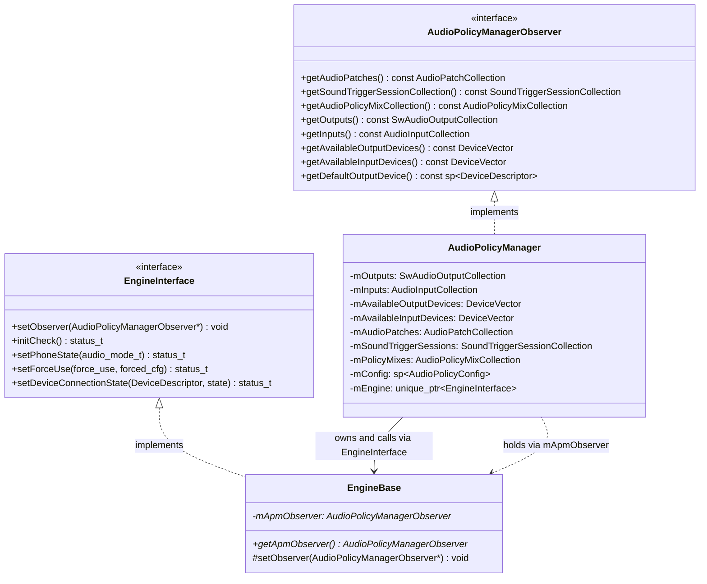
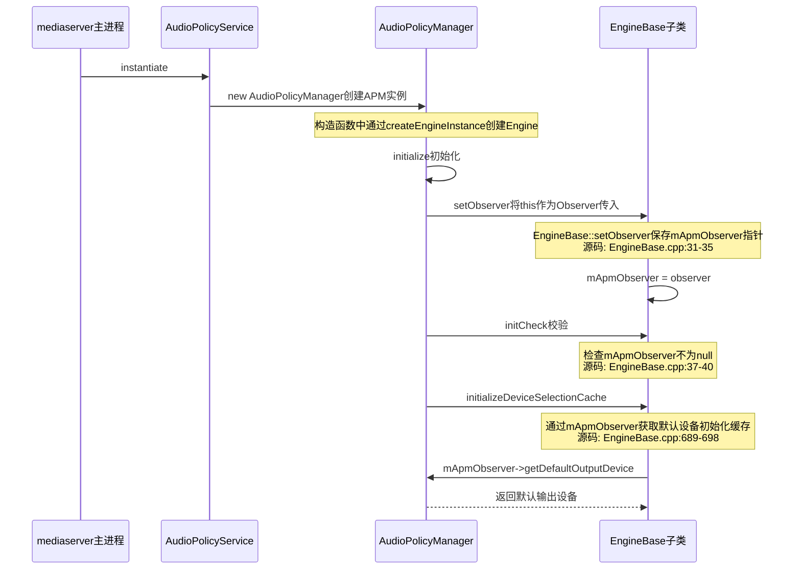
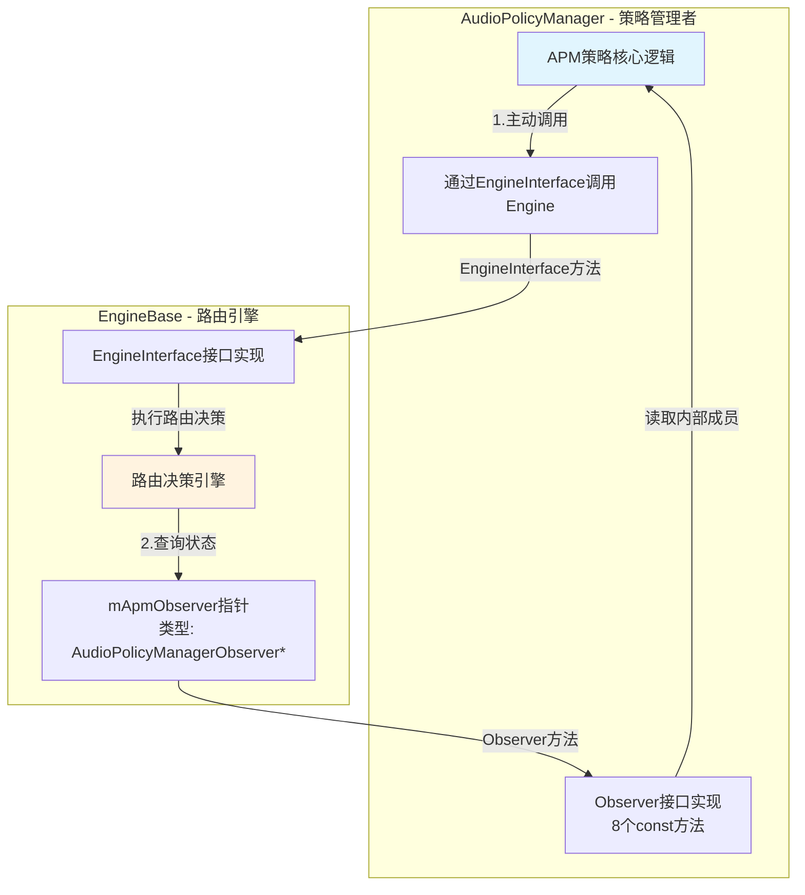
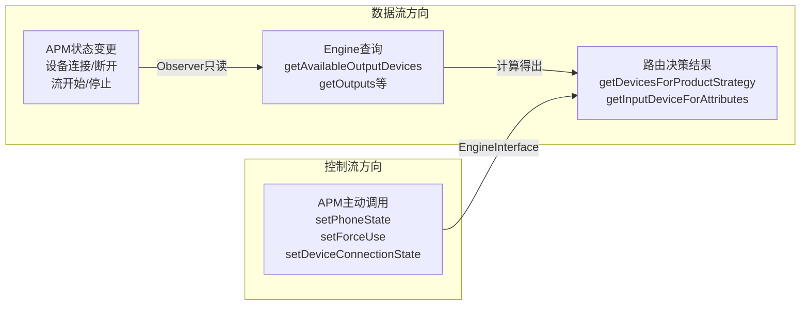

## 6.14 AudioPolicyManagerObserver — 观察者接口

> [← 上一个](06_6.13_LastRemovableMediaDevices-可移除设备追踪.md) | [← 返回Audio Policy Engine](README.md) | [返回导航](../README.md) | [下一个 →](../07_Effects_Framework/README.md)]

---

### 模块职责

[`AudioPolicyManagerObserver`](frameworks/av/services/audiopolicy/engine/interface/AudioPolicyManagerObserver.h) 是Audio Policy Engine获取AudioPolicyManager（APM）状态的**只读观察者接口**。它采用经典Observer模式，将Engine与APM解耦：Engine不直接依赖APM的内部数据结构，而是通过统一的纯虚接口查询设备列表、输出/输入集合等关键状态信息。

该接口定义于Engine的interface目录下，体现了"接口属于使用者"的设计原则——由消费者（Engine）定义它所需的数据契约，由提供者（APM）实现。

---

### 接口定义完整源码解析

```cpp
// frameworks/av/services/audiopolicy/engine/interface/AudioPolicyManagerObserver.h

class AudioPolicyManagerObserver
{
public:
    // 获取当前所有AudioPatch的集合
    virtual const AudioPatchCollection &getAudioPatches() const = 0;

    // 获取SoundTrigger会话集合
    virtual const SoundTriggerSessionCollection &getSoundTriggerSessionCollection() const = 0;

    // 获取动态策略Mix集合（用于远程订阅等场景）
    virtual const AudioPolicyMixCollection &getAudioPolicyMixCollection() const = 0;

    // 获取所有软件输出描述符集合
    virtual const SwAudioOutputCollection &getOutputs() const = 0;

    // 获取所有输入描述符集合
    virtual const AudioInputCollection &getInputs() const = 0;

    // 获取当前可用的输出设备列表（已过滤非引擎管理的remote submix）
    virtual const DeviceVector getAvailableOutputDevices() const = 0;

    // 获取当前可用的输入设备列表
    virtual const DeviceVector getAvailableInputDevices() const = 0;

    // 获取默认输出设备
    virtual const sp<DeviceDescriptor> &getDefaultOutputDevice() const = 0;

protected:
    virtual ~AudioPolicyManagerObserver() {}
};
```

**设计要点**：
- 所有方法均为`const`纯虚函数，强调只读语义
- 返回类型多为`const &`引用，避免拷贝开销；`DeviceVector`按值返回因为它内部做了过滤处理
- 析构函数为`protected`非虚，防止外部通过接口指针delete实现对象
- 头文件引用了`PolicyAudioPort`、`AudioPatch`、`IOProfile`、`DeviceDescriptor`等核心类型

---

### 接口方法逐一详解

#### 1. `getAudioPatches()` → `const AudioPatchCollection&`

返回APM当前维护的所有AudioPatch。`AudioPatchCollection`是`KeyedVector<audio_patch_handle_t, sp<AudioPatch>>`的类型别名，记录了输出/输入端口之间的连接关系。

**APM实现**（[`AudioPolicyManager.h:435`](frameworks/av/services/audiopolicy/managerdefault/AudioPolicyManager.h:435)）：
```cpp
virtual const AudioPatchCollection &getAudioPatches() const {
    return mAudioPatches;  // 直接返回内部成员
}
```

Engine较少直接使用此接口，主要用于Patch的查询和校验。

#### 2. `getSoundTriggerSessionCollection()` → `const SoundTriggerSessionCollection&`

返回SoundTrigger会话集合。SoundTrigger是Android的硬件级语音唤醒机制（如"OK Google"），其会话需要与音频路由协调，避免录音冲突。

**APM实现**（[`AudioPolicyManager.h:439`](frameworks/av/services/audiopolicy/managerdefault/AudioPolicyManager.h:439)）：
```cpp
virtual const SoundTriggerSessionCollection &getSoundTriggerSessionCollection() const {
    return mSoundTriggerSessions;
}
```

#### 3. `getAudioPolicyMixCollection()` → `const AudioPolicyMixCollection&`

返回动态AudioPolicyMix集合。AudioPolicyMix用于远程音频订阅（Remote Submix）和多区音频等场景，Engine在输入设备路由时需要查询是否有匹配的Mix规则。

**APM实现**（[`AudioPolicyManager.h:443`](frameworks/av/services/audiopolicy/managerdefault/AudioPolicyManager.h:443)）：
```cpp
virtual const AudioPolicyMixCollection &getAudioPolicyMixCollection() const {
    return mPolicyMixes;
}
```

**Engine调用场景**：在[`Engine::getInputDeviceForAttributes()`](frameworks/av/services/audiopolicy/enginedefault/src/Engine.cpp:803)中：
```cpp
const auto &policyMixes = getApmObserver()->getAudioPolicyMixCollection();
// 用于匹配输入源的动态路由规则
device = policyMixes.getDeviceAndMixForInputSource(attr, availableInputDevices, uid, session, mix);
```

#### 4. `getOutputs()` → `const SwAudioOutputCollection&`

返回所有软件输出描述符集合。这是Engine最频繁使用的接口之一，因为路由决策需要知道当前哪些输出流处于活跃状态。

**APM实现**（[`AudioPolicyManager.h:447`](frameworks/av/services/audiopolicy/managerdefault/AudioPolicyManager.h:447)）：
```cpp
virtual const SwAudioOutputCollection &getOutputs() const {
    return mOutputs;
}
```

**Engine调用场景**：
- 检查Music流是否活跃：`outputs.isActive(toVolumeSource(AUDIO_STREAM_MUSIC))`
- 检查Music是否在远程播放：`outputs.isActiveRemotely(toVolumeSource(AUDIO_STREAM_MUSIC))`
- 获取主输出：`outputs.getPrimaryOutput()`

#### 5. `getInputs()` → `const AudioInputCollection&`

返回所有输入描述符集合。用于输入路由决策时检查输入流的活跃状态和preferred device。

**APM实现**（[`AudioPolicyManager.h:451`](frameworks/av/services/audiopolicy/managerdefault/AudioPolicyManager.h:451)）：
```cpp
virtual const AudioInputCollection &getInputs() const {
    return mInputs;
}
```

#### 6. `getAvailableOutputDevices()` → `DeviceVector`

返回当前可用的输出设备列表。**此方法有特殊过滤逻辑**——APM返回时会调用`filterForEngine()`移除Engine不应看到的设备。

**APM实现**（[`AudioPolicyManager.h:455`](frameworks/av/services/audiopolicy/managerdefault/AudioPolicyManager.h:455)）：
```cpp
virtual const DeviceVector getAvailableOutputDevices() const {
    return mAvailableOutputDevices.filterForEngine();
}
```

**filterForEngine()逻辑**（[`DeviceDescriptor.cpp:495`](frameworks/av/services/audiopolicy/common/managerdefinitions/src/DeviceDescriptor.cpp:495)）：
```cpp
DeviceVector DeviceVector::filterForEngine() const {
    DeviceVector filteredDevices;
    for (const auto &device : *this) {
        // 过滤掉地址非"0"的remote submix设备
        // 这些设备由Engine内部的策略Mix管理，不应出现在可用设备列表中
        if (audio_is_remote_submix_device(device->type()) && device->address() != "0") {
            continue;
        }
        filteredDevices.add(device);
    }
    return filteredDevices;
}
```

#### 7. `getAvailableInputDevices()` → `DeviceVector`

返回当前可用的输入设备列表。与输出不同，输入设备**不做过滤**。

**APM实现**（[`AudioPolicyManager.h:459`](frameworks/av/services/audiopolicy/managerdefault/AudioPolicyManager.h:459)）：
```cpp
virtual const DeviceVector getAvailableInputDevices() const {
    // legacy and non-legacy remote-submix are managed by the engine, do not filter
    return mAvailableInputDevices;
}
```

#### 8. `getDefaultOutputDevice()` → `const sp<DeviceDescriptor>&`

返回系统默认输出设备，通常为扬声器。当路由决策无法匹配任何可用设备时，回退到该设备。

**APM实现**（[`AudioPolicyManager.h:464`](frameworks/av/services/audiopolicy/managerdefault/AudioPolicyManager.h:464)）：
```cpp
virtual const sp<DeviceDescriptor> &getDefaultOutputDevice() const {
    return mConfig->getDefaultOutputDevice();
}
```

**Engine调用场景**：在[`EngineBase::initializeDeviceSelectionCache()`](frameworks/av/services/audiopolicy/engine/common/src/EngineBase.cpp:692)中：
```cpp
auto defaultDevices = DeviceVector(getApmObserver()->getDefaultOutputDevice());
for (const auto &iter : getProductStrategies()) {
    mDevicesForStrategies[strategy->getId()] = defaultDevices;
}
```

---

### Observer模式架构



---

### Observer设置流程时序图



关键源码（[`AudioPolicyManager.cpp:6024-6033`](frameworks/av/services/audiopolicy/managerdefault/AudioPolicyManager.cpp:6024)）：
```cpp
status_t AudioPolicyManager::initialize() {
    if (mEngine == nullptr) {
        return NO_INIT;
    }
    mEngine->setObserver(this);  // APM自身就是Observer实现
    status_t status = mEngine->initCheck();
    if (status != NO_ERROR) {
        LOG_FATAL("Policy engine not initialized(err=%d)", status);
        return status;
    }
    mEngine->initializeDeviceSelectionCache();
    // ...
}
```

[`EngineBase::setObserver()`](frameworks/av/services/audiopolicy/engine/common/src/EngineBase.cpp:31)：
```cpp
void EngineBase::setObserver(AudioPolicyManagerObserver *observer) {
    ALOG_ASSERT(observer != NULL, "Invalid Audio Policy Manager observer");
    mApmObserver = observer;
}
```

---

### 双向通信设计

APM与Engine之间形成了清晰的双向通信架构：



**方向1：APM → Engine**（通过`EngineInterface`）
- APM主动调用Engine方法：`setPhoneState()`、`setForceUse()`、`setDeviceConnectionState()`等
- 这是控制流方向，APM作为策略管理者驱动Engine更新

**方向2：Engine → APM**（通过`AudioPolicyManagerObserver`）
- Engine在路由决策中查询APM状态：可用设备、活跃输出/输入等
- 这是数据流方向，Engine作为数据消费者读取APM快照

---

### Engine通过Observer访问APM状态的具体场景

#### 场景1：输出设备路由决策

在[`Engine::getDevicesForProductStrategy()`](frameworks/av/services/audiopolicy/enginedefault/src/Engine.cpp:735)中，Engine同时使用3个Observer方法：

```cpp
const SwAudioOutputCollection& outputs = getApmObserver()->getOutputs();
DeviceVector availableOutputDevices = getApmObserver()->getAvailableOutputDevices();
// ...
// 检查Music是否活跃影响Notification路由
if (outputs.isActive(toVolumeSource(AUDIO_STREAM_MUSIC))) { ... }
// 从可用设备中选择匹配的输出
selectedDevices = availableOutputDevices.getDevicesFromTypes(deviceTypes);
```

#### 场景2：输入设备路由决策

在[`Engine::getInputDeviceForAttributes()`](frameworks/av/services/audiopolicy/enginedefault/src/Engine.cpp:803)中：

```cpp
const auto &policyMixes = getApmObserver()->getAudioPolicyMixCollection();
const auto availableInputDevices = getApmObserver()->getAvailableInputDevices();
const auto &inputs = getApmObserver()->getInputs();
```

#### 场景3：通话中输入源选择

在[`Engine::getDeviceForInputSource()`](frameworks/av/services/audiopolicy/enginedefault/src/Engine.cpp:520)中：

```cpp
const DeviceVector availableOutputDevices = getApmObserver()->getAvailableOutputDevices();
const DeviceVector availableInputDevices = getApmObserver()->getAvailableInputDevices();
const SwAudioOutputCollection &outputs = getApmObserver()->getOutputs();
// 通话时需要检查主输出的HW Module以协调输入设备
sp<AudioOutputDescriptor> primaryOutput = outputs.getPrimaryOutput();
```

#### 场景4：设备连接状态同步（Configurable Engine特有）

在[`Engine::setDeviceConnectionState()`](frameworks/av/services/audiopolicy/engineconfigurable/src/Engine.cpp:182)中，Configurable Engine需要将设备状态同步给PFW：

```cpp
if (audio_is_output_device(device->type())) {
    return mPolicyParameterMgr->setAvailableOutputDevices(
                getApmObserver()->getAvailableOutputDevices().types());
} else if (audio_is_input_device(device->type())) {
    return mPolicyParameterMgr->setAvailableInputDevices(
                getApmObserver()->getAvailableInputDevices().types());
}
```

#### 场景5：设备选择缓存初始化

在[`EngineBase::initializeDeviceSelectionCache()`](frameworks/av/services/audiopolicy/engine/common/src/EngineBase.cpp:689)中：

```cpp
auto defaultDevices = DeviceVector(getApmObserver()->getDefaultOutputDevice());
for (const auto &iter : getProductStrategies()) {
    mDevicesForStrategies[strategy->getId()] = defaultDevices;
    setStrategyDevices(strategy, defaultDevices);
}
```

---

### Observer方法使用频率统计

| Observer方法 | Default Engine | Configurable Engine | 主要用途 |
|---|---|---|---|
| `getAvailableOutputDevices()` | 4次 | 7次 | 路由决策核心数据源 |
| `getOutputs()` | 3次 | 4次 | 检查流活跃状态 |
| `getAvailableInputDevices()` | 2次 | 2次 | 输入设备路由 |
| `getAudioPolicyMixCollection()` | 1次 | 1次 | 动态Mix匹配 |
| `getInputs()` | 1次 | 1次 | 输入preferred device查找 |
| `getDefaultOutputDevice()` | 1次（Base） | 2次 | 无匹配设备时的回退 |
| `getAudioPatches()` | 0次 | 0次 | 预留接口 |
| `getSoundTriggerSessionCollection()` | 0次 | 0次 | 预留接口 |

---

### 单向数据流与循环依赖避免



**核心设计约束**：Observer接口的所有方法都是`const`的，Engine**只能读取**APM状态，**绝不能通过Observer修改**APM。这保证了：

1. **无循环调用**：如果Engine能通过Observer修改APM状态，而APM状态变更又触发Engine调用，就会形成无限递归
2. **明确的责任边界**：APM负责状态管理，Engine负责路由决策
3. **可预测的行为**：Observer返回的是调用时刻的快照，Engine不需要监听变更通知

---

### 可测试性：Mock Observer

Observer接口的纯虚设计使得单元测试可以不依赖完整APM：

```cpp
class MockAudioPolicyManagerObserver : public AudioPolicyManagerObserver {
public:
    MOCK_METHOD(const AudioPatchCollection&, getAudioPatches, (), (const, override));
    MOCK_METHOD(const SoundTriggerSessionCollection&,
                getSoundTriggerSessionCollection, (), (const, override));
    MOCK_METHOD(const AudioPolicyMixCollection&,
                getAudioPolicyMixCollection, (), (const, override));
    MOCK_METHOD(const SwAudioOutputCollection&, getOutputs, (), (const, override));
    MOCK_METHOD(const AudioInputCollection&, getInputs, (), (const, override));
    MOCK_METHOD(const DeviceVector, getAvailableOutputDevices, (), (const, override));
    MOCK_METHOD(const DeviceVector, getAvailableInputDevices, (), (const, override));
    MOCK_METHOD(const sp<DeviceDescriptor>&, getDefaultOutputDevice, (), (const, override));
};
```

测试中可以灵活控制Observer返回值，验证Engine在各种设备/输出配置下的路由逻辑，无需启动完整的AudioPolicyService。

---

### APM的Observer接口实现细节

[`AudioPolicyManager`](frameworks/av/services/audiopolicy/managerdefault/AudioPolicyManager.h:93)通过多重继承同时实现`AudioPolicyInterface`和`AudioPolicyManagerObserver`：

```cpp
class AudioPolicyManager : public AudioPolicyInterface,
                           public AudioPolicyManagerObserver
```

各Observer方法的实现映射关系：

| Observer方法 | APM内部数据成员 | 特殊处理 |
|---|---|---|
| `getAudioPatches()` | `mAudioPatches` | 无，直接返回 |
| `getSoundTriggerSessionCollection()` | `mSoundTriggerSessions` | 无，直接返回 |
| `getAudioPolicyMixCollection()` | `mPolicyMixes` | 无，直接返回 |
| `getOutputs()` | `mOutputs` | 无，直接返回 |
| `getInputs()` | `mInputs` | 无，直接返回 |
| `getAvailableOutputDevices()` | `mAvailableOutputDevices` | **调用filterForEngine()过滤** |
| `getAvailableInputDevices()` | `mAvailableInputDevices` | 无，直接返回 |
| `getDefaultOutputDevice()` | `mConfig->getDefaultOutputDevice()` | 委托给Config对象 |

**filterForEngine()过滤规则**：移除地址非"0"的remote submix设备。原因：这些设备对应Engine内部管理的动态AudioPolicyMix，如果出现在可用设备列表中会导致路由循环——Engine查询可用设备时发现remote submix，将其选为路由目标，而该设备又由Engine自己的Mix规则创建。

---

### 状态变更通知机制

Observer模式通常包含通知机制（如`notifyObservers()`），但`AudioPolicyManagerObserver`**不包含任何通知方法**。这是因为：

1. **拉取式设计**：Engine在每次路由决策时主动拉取最新状态，而非被动接收通知
2. **调用时序保证**：APM在状态变更后，会主动调用Engine的`EngineInterface`方法（如`setDeviceConnectionState()`），Engine在此调用中重新查询Observer获取最新状态
3. **简化并发模型**：无通知回调意味着无需处理异步通知的线程安全问题

典型调用链：
```
设备连接 → APM::setDeviceConnectionState()
         → APM更新mAvailableOutputDevices
         → APM调用mEngine->setDeviceConnectionState()
         → Engine内部通过mApmObserver->getAvailableOutputDevices()读取最新设备列表
         → Engine重新计算路由策略
```

---

### 总结

`AudioPolicyManagerObserver`是Audio Policy架构中的关键解耦接口，其设计体现了以下原则：

- **接口隔离**：Engine只暴露它需要的数据查询能力，隐藏APM的完整复杂性
- **只读约束**：所有方法为`const`，确保Engine不会意外修改APM状态
- **数据过滤**：`getAvailableOutputDevices()`通过`filterForEngine()`为Engine提供裁剪后的视图
- **双向架构**：APM通过EngineInterface控制Engine，Engine通过Observer查询APM，形成清晰的控制流与数据流分离
- **可测试性**：纯虚接口便于Mock，支持Engine的独立单元测试

> **关键洞察**：Observer接口是Engine与APM之间的"只读窗口"。Engine通过它获取APM的设备列表、输出/输入集合等状态快照，但不修改APM状态。所有状态修改仍由APM主动通过EngineInterface驱动。这种单向数据流设计既避免了循环依赖，又保证了路由决策基于一致的APM状态视图。

---

> [← 上一个](06_6.13_LastRemovableMediaDevices-可移除设备追踪.md) | [← 返回Audio Policy Engine](README.md) | [返回导航](../README.md) | [下一个 →](../07_Effects_Framework/README.md)