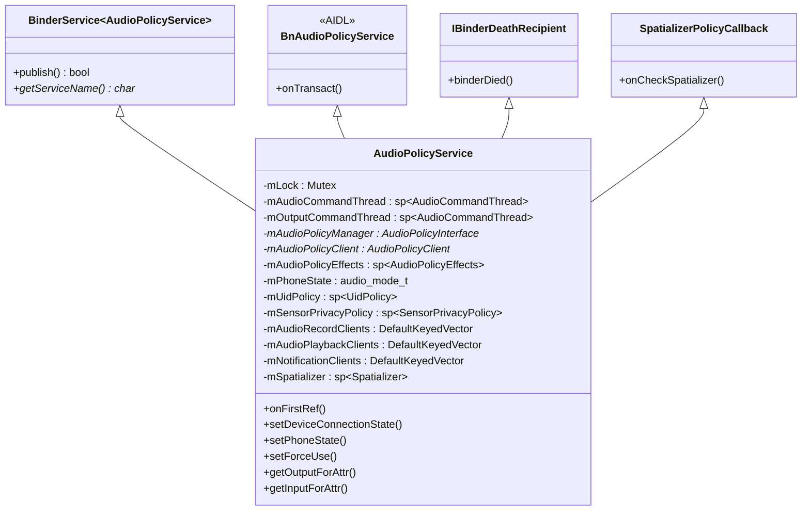
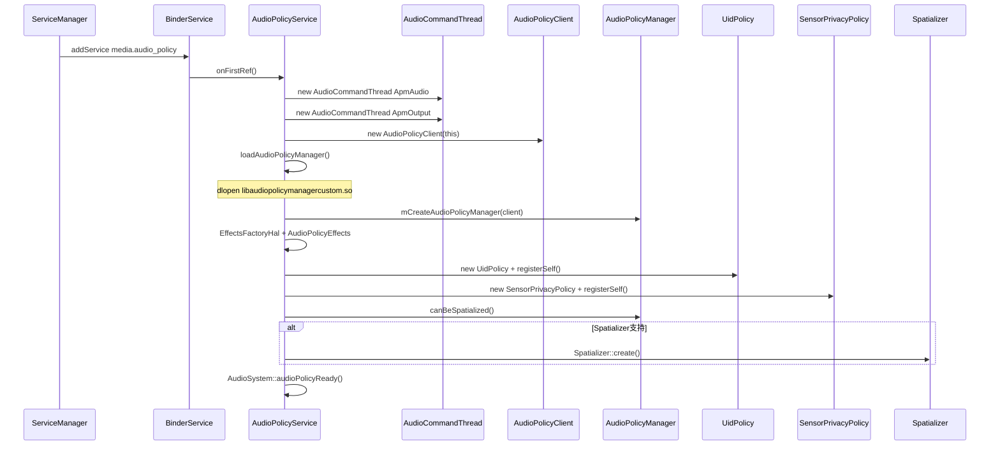
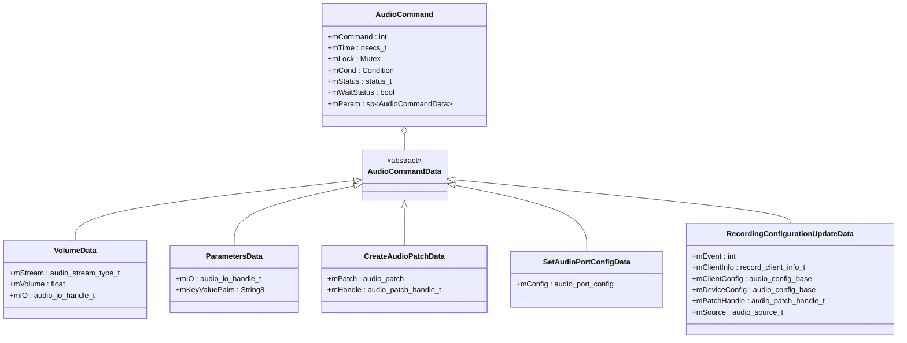
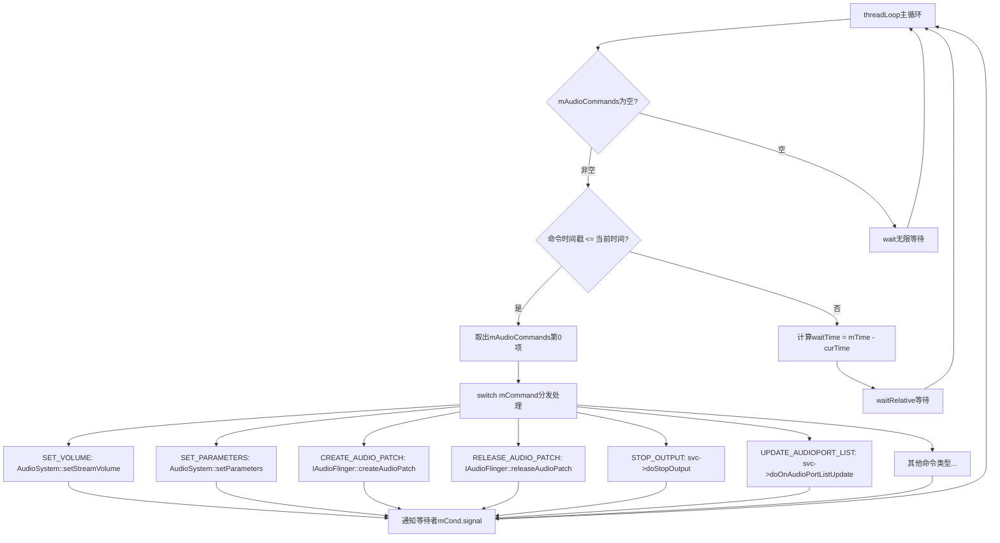
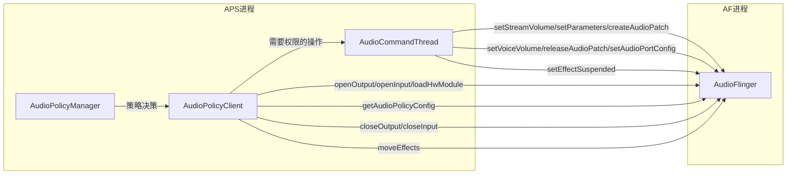
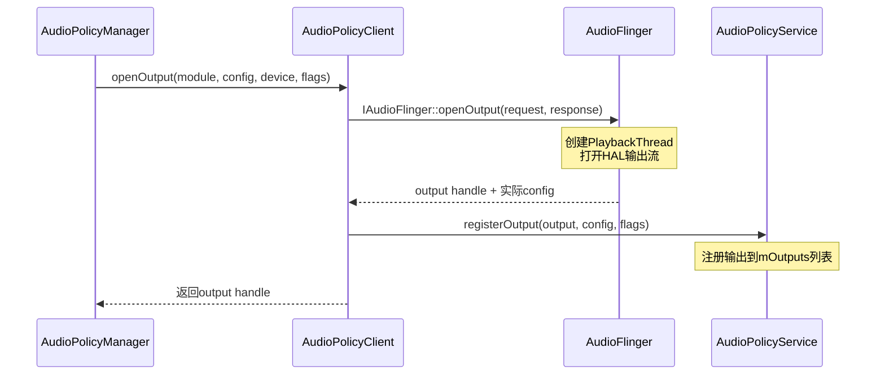
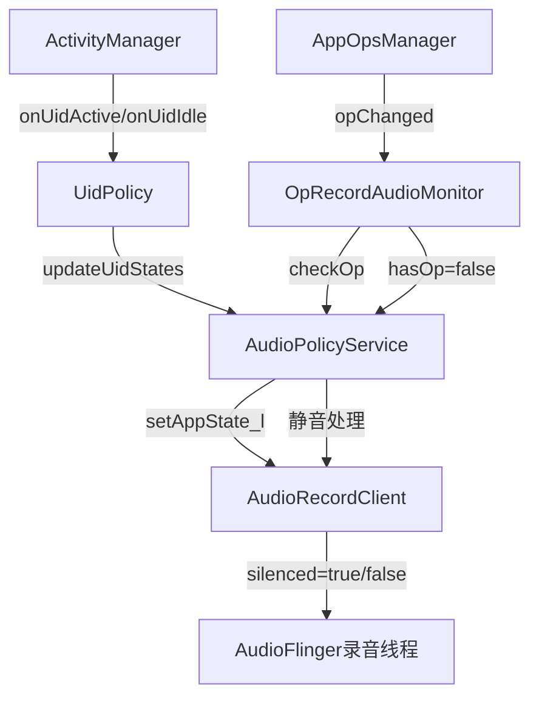
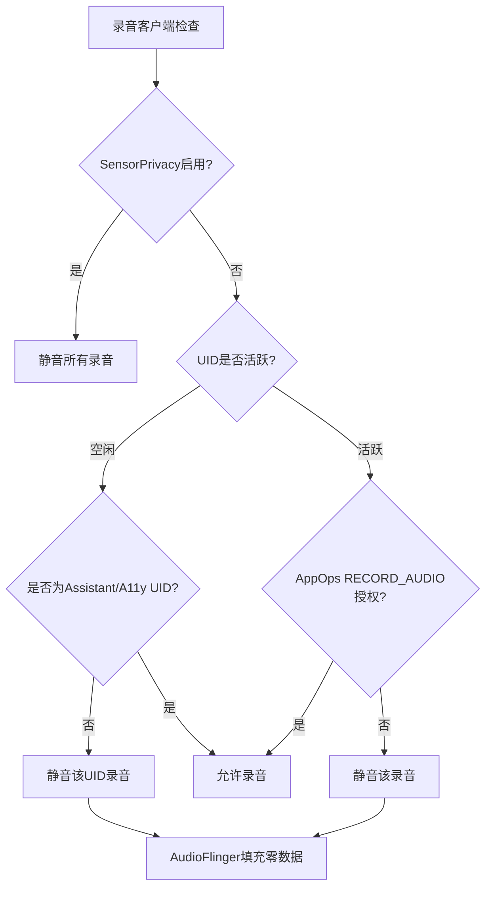
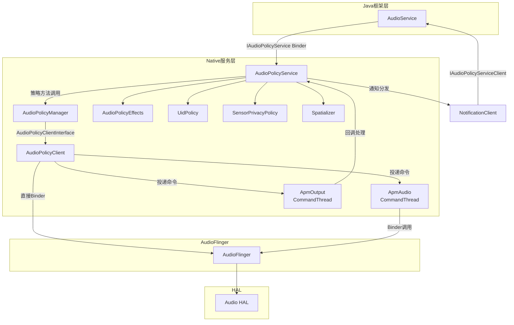

## 6.1 AudioPolicyService — 控制面入口

> [← 上一篇](../05_AudioFlinger/README.md) | [← 返回Audio Policy Engine](README.md) | [返回导航](../README.md) | [下一篇 →](06_6.2_AudioPolicyManager-策略核心实现.md)

---

### 6.1.1 模块定位与全局职责

AudioPolicyService（简称APS）是Android音频策略子系统的**控制面入口服务**，运行在mediaserver进程中。它作为Binder服务端，向Java框架层（AudioService）和Native客户端暴露`IAudioPolicyService`接口，承担以下核心职责：

| 职责域 | 说明 |
|--------|------|
| 设备管理 | 设备连接/断开状态维护、设备选路决策 |
| 模式与强制配置 | 电话模式切换、强制使用配置（如蓝牙SCO强制） |
| 输出/输入路由 | getOutputForAttr/getInputForAttr路由选择，start/stop/release输出输入流 |
| 音量控制 | 流音量设置、音量组回调、音量曲线查询 |
| 音频补丁管理 | createAudioPatch/releaseAudioPatch代理 |
| 效果管理 | 效果注册/注销、默认效果添加/移除 |
| 录音管控 | 录音客户端追踪、AppOps权限检查、静音控制 |
| 通知回调 | AudioPort/AudioPatch/VolumeGroup/RecordingConfiguration变更通知 |

**源码位置**：
- 头文件：[`AudioPolicyService.h`](frameworks/av/services/audiopolicy/service/AudioPolicyService.h)
- 主实现：[`AudioPolicyService.cpp`](frameworks/av/services/audiopolicy/service/AudioPolicyService.cpp)
- Binder接口实现：[`AudioPolicyInterfaceImpl.cpp`](frameworks/av/services/audiopolicy/service/AudioPolicyInterfaceImpl.cpp)
- Client接口实现：[`AudioPolicyClientImpl.cpp`](frameworks/av/services/audiopolicy/service/AudioPolicyClientImpl.cpp)

---

### 6.1.2 类继承体系与Binder注册

#### 继承关系



APS通过[`BinderService<AudioPolicyService>`](frameworks/av/services/audiopolicy/service/AudioPolicyService.h:68)模板自动完成Binder服务注册，服务名为`"media.audio_policy"`：

```cpp
// AudioPolicyService.h:77
static const char *getServiceName() ANDROID_API { return "media.audio_policy"; }
```

`BinderService::publish()`在服务首次强引用时调用`defaultServiceManager()->addService()`，将APS注册到ServiceManager。

#### AIDL接口实现

APS继承自[`media::BnAudioPolicyService`](frameworks/av/services/audiopolicy/service/AudioPolicyService.h:69)，这是由AIDL自动生成的Binder Native端基类。所有Binder方法返回`binder::Status`，参数通过AIDL类型传递。具体实现在[`AudioPolicyInterfaceImpl.cpp`](frameworks/av/services/audiopolicy/service/AudioPolicyInterfaceImpl.cpp)中，采用AIDL→Legacy类型转换模式：

```
AIDL类型 → aidl2legacy_xxx转换 → legacy类型 → mAudioPolicyManager->xxx()
```

---

### 6.1.3 生命周期与初始化流程

#### 初始化时序



[`onFirstRef()`](frameworks/av/services/audiopolicy/service/AudioPolicyService.cpp:242)是APS的初始化入口，在对象首次被`sp<>`强引用时触发：

```cpp
// AudioPolicyService.cpp:242-295
void AudioPolicyService::onFirstRef()
{
    // 记录初始化耗时medialytics事件
    mediametrics::Defer defer([...]);

    {
        Mutex::Autolock _l(mLock);
        // 1. 创建两条命令线程
        mAudioCommandThread = new AudioCommandThread(String8("ApmAudio"), this);
        mOutputCommandThread = new AudioCommandThread(String8("ApmOutput"), this);
        // 2. 创建Client接口
        mAudioPolicyClient = new AudioPolicyClient(this);
        // 3. 加载并创建AudioPolicyManager
        loadAudioPolicyManager();
        mAudioPolicyManager = mCreateAudioPolicyManager(mAudioPolicyClient);
    }

    // 4. 创建效果和隐私策略（锁外）
    const sp<EffectsFactoryHalInterface> effectsFactoryHal = EffectsFactoryHalInterface::create();
    sp<AudioPolicyEffects> audioPolicyEffects = new AudioPolicyEffects(effectsFactoryHal);
    sp<UidPolicy> uidPolicy = new UidPolicy(this);
    sp<SensorPrivacyPolicy> sensorPrivacyPolicy = new SensorPrivacyPolicy(this);

    {
        Mutex::Autolock _l(mLock);
        mAudioPolicyEffects = audioPolicyEffects;
        mUidPolicy = uidPolicy;
        mSensorPrivacyPolicy = sensorPrivacyPolicy;
    }

    uidPolicy->registerSelf();
    sensorPrivacyPolicy->registerSelf();

    // 5. 可选创建Spatializer
    if (mAudioPolicyManager != nullptr) {
        Mutex::Autolock _l(mLock);
        bool hasSpatializer = mAudioPolicyManager->canBeSpatialized(&attr, nullptr, devices);
        if (hasSpatializer) {
            mSpatializer = Spatializer::create(this, effectsFactoryHal);
        }
    }
    AudioSystem::audioPolicyReady();  // 通知AudioSystem策略就绪
}
```

#### AudioPolicyManager动态加载

[`loadAudioPolicyManager()`](frameworks/av/services/audiopolicy/service/AudioPolicyService.cpp:219)通过`dlopen`动态加载策略管理器，支持OEM自定义替换：

```cpp
// AudioPolicyService.cpp:219-240
void AudioPolicyService::loadAudioPolicyManager()
{
    mLibraryHandle = dlopen(kAudioPolicyManagerCustomPath, RTLD_NOW);  // "libaudiopolicymanagercustom.so"
    if (mLibraryHandle != nullptr) {
        mCreateAudioPolicyManager = reinterpret_cast<CreateAudioPolicyManagerInstance>(
            dlsym(mLibraryHandle, "createAudioPolicyManager"));
        mDestroyAudioPolicyManager = reinterpret_cast<DestroyAudioPolicyManagerInstance>(
            dlsym(mLibraryHandle, "destroyAudioPolicyManager"));
        if (mCreateAudioPolicyManager == nullptr || mDestroyAudioPolicyManager == nullptr) {
            unloadAudioPolicyManager();
            LOG_ALWAYS_FATAL("could not find audiopolicymanager interface methods");
        }
    }
    // 如果dlopen失败，使用默认的AudioPolicyManager静态链接版本
}
```

如果`libaudiopolicymanagercustom.so`不存在，则使用默认编译链接的`AudioPolicyManager`。

#### 析构流程

[`~AudioPolicyService()`](frameworks/av/services/audiopolicy/service/AudioPolicyService.cpp:308)按逆序释放资源：

```cpp
// AudioPolicyService.cpp:308-326
AudioPolicyService::~AudioPolicyService()
{
    mAudioCommandThread->exit();       // 退出命令线程
    mOutputCommandThread->exit();
    mDestroyAudioPolicyManager(mAudioPolicyManager);  // 销毁策略管理器
    unloadAudioPolicyManager();         // dlclose动态库
    delete mAudioPolicyClient;          // 释放Client接口
    mNotificationClients.clear();
    mAudioPolicyEffects.clear();
    mUidPolicy->unregisterSelf();       // 反注册UID观察者
    mSensorPrivacyPolicy->unregisterSelf();
    mUidPolicy.clear();
    mSensorPrivacyPolicy.clear();
}
```

---

### 6.1.4 AudioCommandThread命令队列架构

AudioCommandThread是APS的**异步命令执行引擎**，解决Binder调用线程与AudioFlinger交互的权限和时序问题。APS创建两条命令线程：

| 线程名 | 成员变量 | 职责 |
|--------|----------|------|
| `"ApmAudio"` | [`mAudioCommandThread`](frameworks/av/services/audiopolicy/service/AudioPolicyService.h:1066) | 音量设置、参数设置、AudioPatch创建/释放、AudioPort配置、通知回调 |
| `"ApmOutput"` | [`mOutputCommandThread`](frameworks/av/services/audiopolicy/service/AudioPolicyService.h:1067) | stopOutput/releaseOutput、音频模块更新、路由更新、UID状态更新 |

#### 命令类型枚举

[`AudioCommandThread`](frameworks/av/services/audiopolicy/service/AudioPolicyService.h:542)定义了18种命令类型：

```cpp
// AudioPolicyService.h:547-568
enum {
    SET_VOLUME,                      // 设置流音量 → AudioSystem::setStreamVolume()
    SET_PARAMETERS,                  // 设置音频参数 → AudioSystem::setParameters()
    SET_VOICE_VOLUME,               // 设置语音音量 → AudioSystem::setVoiceVolume()
    STOP_OUTPUT,                     // 停止输出 → doStopOutput()
    RELEASE_OUTPUT,                  // 释放输出 → doReleaseOutput()
    CREATE_AUDIO_PATCH,             // 创建音频补丁 → IAudioFlinger::createAudioPatch()
    RELEASE_AUDIO_PATCH,            // 释放音频补丁 → IAudioFlinger::releaseAudioPatch()
    UPDATE_AUDIOPORT_LIST,          // 通知AudioPort列表更新
    UPDATE_AUDIOPATCH_LIST,         // 通知AudioPatch列表更新
    CHANGED_AUDIOVOLUMEGROUP,       // 音量组变更回调
    SET_AUDIOPORT_CONFIG,           // 设置AudioPort配置 → IAudioFlinger::setAudioPortConfig()
    DYN_POLICY_MIX_STATE_UPDATE,    // 动态策略Mix状态更新
    RECORDING_CONFIGURATION_UPDATE, // 录音配置变更回调
    SET_EFFECT_SUSPENDED,           // 效果挂起/恢复
    AUDIO_MODULES_UPDATE,           // 音频模块更新
    ROUTING_UPDATED,                // 路由更新通知
    UPDATE_UID_STATES,              // UID状态更新
    CHECK_SPATIALIZER_OUTPUT,       // 检查Spatializer输出
    UPDATE_ACTIVE_SPATIALIZER_TRACKS, // 更新Spatializer活跃轨道
    VOL_RANGE_INIT_REQUEST,        // 音量范围初始化请求
};
```

#### 命令数据结构

每个命令由[`AudioCommand`](frameworks/av/services/audiopolicy/service/AudioPolicyService.h:625)和对应的[`AudioCommandData`](frameworks/av/services/audiopolicy/service/AudioPolicyService.h:642)子类组成：



#### 命令处理流程

[`threadLoop()`](frameworks/av/services/audiopolicy/service/AudioPolicyService.cpp:1993)是命令线程的主循环：



关键设计要点：
1. **按时间戳排序**：命令按`mTime`升序排列，支持延迟执行
2. **命令去重**：[`insertCommand_l()`](frameworks/av/services/audiopolicy/service/AudioPolicyService.cpp:2586)在插入时检查并过滤同类型后继命令，避免冗余操作
3. **WakeLock管理**：队列从空变非空时获取`PARTIAL_WAKE_LOCK`，队列变空时释放
4. **同步等待**：调用者可通过`mWaitStatus=true`阻塞等待命令完成，通过`mCond`信号通知

#### 命令提交示例

以音量设置为例，[`setStreamVolume()`](frameworks/av/services/audiopolicy/service/AudioPolicyService.cpp:2801)将命令投递到`mAudioCommandThread`：

```cpp
// AudioPolicyService.cpp:2801-2808
int AudioPolicyService::setStreamVolume(audio_stream_type_t stream,
                                         float volume,
                                         audio_io_handle_t output,
                                         int delayMs)
{
    return (int)mAudioCommandThread->volumeCommand(stream, volume, output, delayMs);
}
```

`volumeCommand()`内部创建`VolumeData`，封装为`AudioCommand(SET_VOLUME)`，调用`sendCommand()`插入队列并等待结果。

---

### 6.1.5 与AudioFlinger的交互架构

APS通过两条路径与AudioFlinger交互：**同步Binder调用**和**异步命令线程代理**。



#### 为什么需要AudioCommandThread？

AudioFlinger的某些操作（如`setStreamVolume`、`setParameters`、`createAudioPatch`）要求调用进程（而非Binder调用者）具有`MODIFY_AUDIO_SETTINGS`权限。Binder调用者（如Java层AudioService）不一定拥有此权限，因此APS通过命令线程以**自身进程身份**（mediaserver）调用AudioFlinger，继承系统服务的权限。

#### AudioPolicyClient — APS到AF的桥接

[`AudioPolicyClient`](frameworks/av/services/audiopolicy/service/AudioPolicyService.h:732)实现`AudioPolicyClientInterface`，是AudioPolicyManager回调APS的出口。它分为两类操作：

**1. 直接调用AudioFlinger（同步）**

| 方法 | 目标 | 源码位置 |
|------|------|----------|
| [`loadHwModule()`](frameworks/av/services/audiopolicy/service/AudioPolicyClientImpl.cpp:42) | `IAudioFlinger::loadHwModule()` | :50 |
| [`openOutput()`](frameworks/av/services/audiopolicy/service/AudioPolicyClientImpl.cpp:53) | `IAudioFlinger::openOutput()` | :78 |
| [`closeOutput()`](frameworks/av/services/audiopolicy/service/AudioPolicyClientImpl.cpp:106) | `IAudioFlinger::closeOutput()` | :113 |
| [`openInput()`](frameworks/av/services/audiopolicy/service/AudioPolicyClientImpl.cpp:138) | `IAudioFlinger::openInput()` | :164 |
| [`closeInput()`](frameworks/av/services/audiopolicy/service/AudioPolicyClientImpl.cpp:171) | `IAudioFlinger::closeInput()` | :178 |
| [`moveEffects()`](frameworks/av/services/audiopolicy/service/AudioPolicyClientImpl.cpp:208) | `IAudioFlinger::moveEffects()` | :217 |
| [`getAudioPort()`](frameworks/av/services/audiopolicy/service/AudioPolicyClientImpl.cpp:303) | `IAudioFlinger::getAudioPort()` | :310 |

**2. 通过AudioCommandThread（异步代理）**

| 方法 | 目标命令 | 源码位置 |
|------|----------|----------|
| [`setStreamVolume()`](frameworks/av/services/audiopolicy/service/AudioPolicyClientImpl.cpp:181) | `SET_VOLUME` | :185-186 |
| [`setParameters()`](frameworks/av/services/audiopolicy/service/AudioPolicyClientImpl.cpp:189) | `SET_PARAMETERS` | :193 |
| [`setVoiceVolume()`](frameworks/av/services/audiopolicy/service/AudioPolicyClientImpl.cpp:203) | `SET_VOICE_VOLUME` | :205 |
| [`createAudioPatch()`](frameworks/av/services/audiopolicy/service/AudioPolicyClientImpl.cpp:227) | `CREATE_AUDIO_PATCH` | :231 |
| [`releaseAudioPatch()`](frameworks/av/services/audiopolicy/service/AudioPolicyClientImpl.cpp:234) | `RELEASE_AUDIO_PATCH` | :237 |
| [`setAudioPortConfig()`](frameworks/av/services/audiopolicy/service/AudioPolicyClientImpl.cpp:240) | `SET_AUDIOPORT_CONFIG` | :244 |
| [`setEffectSuspended()`](frameworks/av/services/audiopolicy/service/AudioPolicyClientImpl.cpp:220) | `SET_EFFECT_SUSPENDED` | :224 |

**3. 通知回调（投递到命令线程）**

| 方法 | 目标命令 | 说明 |
|------|----------|------|
| [`onAudioPortListUpdate()`](frameworks/av/services/audiopolicy/service/AudioPolicyClientImpl.cpp:247) | `UPDATE_AUDIOPORT_LIST` | AudioPort列表变更 |
| [`onAudioPatchListUpdate()`](frameworks/av/services/audiopolicy/service/AudioPolicyClientImpl.cpp:252) | `UPDATE_AUDIOPATCH_LIST` | AudioPatch列表变更 |
| [`onAudioVolumeGroupChanged()`](frameworks/av/services/audiopolicy/service/AudioPolicyClientImpl.cpp:277) | `CHANGED_AUDIOVOLUMEGROUP` | 音量组变更 |
| [`onRecordingConfigurationUpdate()`](frameworks/av/services/audiopolicy/service/AudioPolicyClientImpl.cpp:263) | `RECORDING_CONFIGURATION_UPDATE` | 录音配置变更 |
| [`onRoutingUpdated()`](frameworks/av/services/audiopolicy/service/AudioPolicyClientImpl.cpp:283) | `ROUTING_UPDATED` | 路由更新 |
| [`onDynamicPolicyMixStateUpdate()`](frameworks/av/services/audiopolicy/service/AudioPolicyClientImpl.cpp:257) | `DYN_POLICY_MIX_STATE_UPDATE` | 动态策略状态 |

#### openOutput完整流程

当APM决定打开音频输出时，调用链路如下：



[`openOutput()`](frameworks/av/services/audiopolicy/service/AudioPolicyClientImpl.cpp:53)的关键实现：

```cpp
// AudioPolicyClientImpl.cpp:53-92
status_t AudioPolicyService::AudioPolicyClient::openOutput(audio_module_handle_t module,
                                                           audio_io_handle_t *output,
                                                           audio_config_t *halConfig,
                                                           audio_config_base_t *mixerConfig,
                                                           const sp<DeviceDescriptorBase>& device,
                                                           uint32_t *latencyMs,
                                                           audio_output_flags_t flags)
{
    sp<IAudioFlinger> af = AudioSystem::get_audio_flinger();
    // 构造OpenOutputRequest（AIDL类型转换）
    media::OpenOutputRequest request;
    request.module = legacy2aidl_audio_module_handle_t_int32_t(module);
    request.halConfig = legacy2aidl_audio_config_t_AudioConfig(*halConfig, false);
    request.mixerConfig = legacy2aidl_audio_config_base_t_AudioConfigBase(*mixerConfig, false);
    request.device = legacy2aidl_DeviceDescriptorBase(device);
    request.flags = legacy2aidl_audio_output_flags_t_int32_t_mask(flags);

    status_t status = af->openOutput(request, &response);
    if (status == OK) {
        *output = aidl2legacy_int32_t_audio_io_handle_t(response.output);
        *halConfig = aidl2legacy_AudioConfig_audio_config_t(response.config, false);
        *latencyMs = convertIntegral<uint32_t>(response.latencyMs);
        mAudioPolicyService->registerOutput(*output, config, flags);  // 注册输出
    }
    return status;
}
```

---

### 6.1.6 核心Binder方法源码解析

#### setDeviceConnectionState — 设备连接状态管理

当蓝牙耳机、USB音频设备等外设连接/断开时，AudioService通过此接口通知APS。

```cpp
// AudioPolicyInterfaceImpl.cpp:121-150
Status AudioPolicyService::setDeviceConnectionState(
        media::AudioPolicyDeviceState stateAidl,
        const android::media::audio::common::AudioPort& port,
        const AudioFormatDescription& encodedFormatAidl)
{
    // 1. AIDL → Legacy类型转换
    audio_policy_dev_state_t state = VALUE_OR_RETURN_BINDER_STATUS(
            aidl2legacy_AudioPolicyDeviceState_audio_policy_dev_state_t(stateAidl));
    audio_format_t encodedFormat = VALUE_OR_RETURN_BINDER_STATUS(
            aidl2legacy_AudioFormatDescription_audio_format_t(encodedFormatAidl));

    // 2. 权限检查：需要MODIFY_AUDIO_SETTINGS
    if (!settingsAllowed()) {
        return binderStatusFromStatusT(PERMISSION_DENIED);
    }
    // 3. 参数校验
    if (state != AUDIO_POLICY_DEVICE_STATE_AVAILABLE &&
            state != AUDIO_POLICY_DEVICE_STATE_UNAVAILABLE) {
        return binderStatusFromStatusT(BAD_VALUE);
    }

    // 4. 持锁调用APM
    Mutex::Autolock _l(mLock);
    AutoCallerClear acc;  // 清除Binder调用者身份，以mediaserver身份执行
    status_t status = mAudioPolicyManager->setDeviceConnectionState(state, port, encodedFormat);

    // 5. 设备变更可能影响Spatializer
    if (status == NO_ERROR) {
        onCheckSpatializer_l();
    }
    return binderStatusFromStatusT(status);
}
```

**AutoCallerClear机制**：[`AutoCallerClear`](frameworks/av/services/audiopolicy/service/AudioPolicyService.h:1033)在作用域内清除Binder调用者UID/PID，使APM方法以mediaserver进程身份执行，确保权限一致性和调用者身份隔离。

#### setPhoneState — 电话模式切换

电话状态（NORMAL/RING/IN_CALL/CALL_SCREEN）切换时触发，是最关键的模式管理接口：

```cpp
// AudioPolicyInterfaceImpl.cpp:203-241
Status AudioPolicyService::setPhoneState(AudioMode stateAidl, int32_t uidAidl)
{
    audio_mode_t state = VALUE_OR_RETURN_BINDER_STATUS(aidl2legacy_AudioMode_audio_mode_t(stateAidl));
    uid_t uid = VALUE_OR_RETURN_BINDER_STATUS(aidl2legacy_int32_t_uid_t(uidAidl));

    if (!settingsAllowed()) return binderStatusFromStatusT(PERMISSION_DENIED);
    if (uint32_t(state) >= AUDIO_MODE_CNT) return binderStatusFromStatusT(BAD_VALUE);

    // 持锁确保setMode + setPhoneState原子性
    Mutex::Autolock _l(mLock);

    // Audio HAL模式转换：CALL_REDIRECT → CALL_SCREEN, COMMUNICATION_REDIRECT → NORMAL
    audio_mode_t halMode = state;
    if (state == AUDIO_MODE_CALL_REDIRECT) {
        halMode = AUDIO_MODE_CALL_SCREEN;
    } else if (state == AUDIO_MODE_COMMUNICATION_REDIRECT) {
        halMode = AUDIO_MODE_NORMAL;
    }
    AudioSystem::setMode(halMode);           // 通知AudioSystem/AudioFlinger
    AutoCallerClear acc;
    mAudioPolicyManager->setPhoneState(state);  // 通知APM重新评估路由
    mPhoneState = state;                         // 记录当前模式
    mPhoneStateOwnerUid = uid;                   // 记录模式持有者UID
    updateUidStates_l();                         // 更新UID录音状态（通话中可能静音其他应用）
    return Status::ok();
}
```

**关键设计**：锁内同时完成`setMode()`+`setPhoneState()`+`updateUidStates_l()`，确保从APM视角这三个操作是原子的，不会被轨道启停等操作交错。

#### setForceUse — 强制使用配置

强制改变特定场景的音频路由，如蓝牙SCO、HDMI等：

```cpp
// AudioPolicyInterfaceImpl.cpp:249-277
Status AudioPolicyService::setForceUse(media::AudioPolicyForceUse usageAidl,
                                       media::AudioPolicyForcedConfig configAidl)
{
    // AIDL → Legacy转换
    audio_policy_force_use_t usage = VALUE_OR_RETURN_BINDER_STATUS(
            aidl2legacy_AudioPolicyForceUse_audio_policy_force_use_t(usageAidl));
    audio_policy_forced_cfg_t config = VALUE_OR_RETURN_BINDER_STATUS(
            aidl2legacy_AudioPolicyForcedConfig_audio_policy_forced_cfg_t(configAidl));

    // 权限：需要MODIFY_AUDIO_ROUTING
    if (!modifyAudioRoutingAllowed()) {
        return binderStatusFromStatusT(PERMISSION_DENIED);
    }
    // 范围校验
    if (usage < 0 || usage >= AUDIO_POLICY_FORCE_USE_CNT) return binderStatusFromStatusT(BAD_VALUE);
    if (config < 0 || config >= AUDIO_POLICY_FORCE_CFG_CNT) return binderStatusFromStatusT(BAD_VALUE);

    Mutex::Autolock _l(mLock);
    AutoCallerClear acc;
    mAudioPolicyManager->setForceUse(usage, config);
    onCheckSpatializer_l();  // 强制配置可能影响Spatializer
    return Status::ok();
}
```

`AUDIO_POLICY_FORCE_USE`枚举值：`FOR_COMMUNICATION`、`FOR_MEDIA`、`FOR_RECORD`、`FOR_DOCK`、`FOR_SYSTEM`、`FOR_HDMI_SYSTEM_AUDIO`、`FOR_SPEAKER_STATUS`等。

#### getOutputForAttr — 输出路由选择

应用创建AudioTrack时调用，获取最佳输出流句柄：

```cpp
// AudioPolicyInterfaceImpl.cpp:321-450（精简版）
Status AudioPolicyService::getOutputForAttr(const media::AudioAttributesInternal& attrAidl,
                                            int32_t sessionAidl,
                                            const AttributionSourceState& attributionSource,
                                            const AudioConfig& configAidl,
                                            int32_t flagsAidl,
                                            int32_t selectedDeviceIdAidl,
                                            media::GetOutputForAttrResponse* _aidl_return)
{
    // 1. AIDL → Legacy类型转换
    audio_attributes_t attr = ...; audio_config_t config = ...;

    // 2. 属性验证和权限检查
    RETURN_IF_BINDER_ERROR(binderStatusFromStatusT(validateUsage(attr, attributionSource)));

    Mutex::Autolock _l(mLock);

    // 3. 播放捕获权限和中断策略标志修正
    if (!mPackageManager.allowPlaybackCapture(uid)) {
        attr.flags |= AUDIO_FLAG_NO_MEDIA_PROJECTION;
    }
    if (!bypassInterruptionPolicyAllowed(attributionSource)) {
        attr.flags &= ~(AUDIO_FLAG_BYPASS_INTERRUPTION_POLICY | AUDIO_FLAG_BYPASS_MUTE);
    }

    // 4. APM路由决策
    AutoCallerClear acc;
    status_t result = mAudioPolicyManager->getOutputForAttr(&attr, &output, session,
                                                            &stream, attributionSource,
                                                            &config, &flags, &selectedDeviceId,
                                                            &portId, &secondaryOutputs,
                                                            &outputType, &isSpatialized,
                                                            &isBitPerfect);

    // 5. 输出类型权限二次验证
    if (result == NO_ERROR) {
        switch (outputType) {
        case API_OUTPUT_LEGACY: break;
        case API_OUTPUT_TELEPHONY_TX:
            // 需要MODIFY_PHONE_STATE权限
            if (!modifyPhoneStateAllowed(attributionSource)) result = PERMISSION_DENIED;
            break;
        case API_OUT_MIX_PLAYBACK:
            // 需要MODIFY_AUDIO_ROUTING权限
            if (!modifyAudioRoutingAllowed(attributionSource)) result = PERMISSION_DENIED;
            break;
        }
    }

    // 6. 注册播放客户端
    if (result == NO_ERROR) {
        sp<AudioPlaybackClient> client = new AudioPlaybackClient(
            attr, output, attributionSource, session, portId, selectedDeviceId, stream, isSpatialized);
        mAudioPlaybackClients.add(portId, client);
        // 填充返回值...
    }
    return Status::ok();
}
```

**返回值包含**：`output`（AudioFlinger线程handle）、`stream`（流类型）、`portId`（端口ID）、`selectedDeviceId`（选路设备）、`secondaryOutputs`（副输出列表）、`isSpatialized`/`isBitPerfect`标志。

---

### 6.1.7 录音管控与隐私保护

APS对录音操作实施多层安全管控，确保应用权限合规和隐私保护。

#### 录音客户端追踪

[`AudioRecordClient`](frameworks/av/services/audiopolicy/service/AudioPolicyService.h:972)追踪每个活跃录音客户端的状态：

```cpp
// AudioPolicyService.h:972-1002
class AudioRecordClient : public AudioClient {
public:
    const AttributionSourceState attributionSource;
    nsecs_t startTimeNs;
    const bool canCaptureOutput;      // 是否允许录制系统输出
    const bool canCaptureHotword;     // 是否允许热词检测
    bool silenced;                     // 当前是否被静音
private:
    sp<OpRecordAudioMonitor> mOpRecordAudioMonitor;  // AppOps监听器
};
```

录音客户端的生命周期与`getInputForAttr()`→`releaseInput()`之间对应。

#### UidPolicy — 应用活跃状态监控

[`UidPolicy`](frameworks/av/services/audiopolicy/service/AudioPolicyService.h:454)监听ActivityManager的UID状态变化，实现以下管控逻辑：

- **空闲UID静音**：当应用进入idle状态时，其录音会被静音（填充零数据）
- **Assistant UID识别**：标记助手应用UID，允许特定权限
- **A11y UID识别**：标记无障碍服务UID
- **IME UID追踪**：标记当前输入法UID



#### SensorPrivacyPolicy — 传感器隐私

[`SensorPrivacyPolicy`](frameworks/av/services/audiopolicy/service/AudioPolicyService.h:521)监听传感器隐私开关状态。当隐私模式启用时，所有应用（包括活跃应用）的麦克风录音都会被静音：

```cpp
// AudioPolicyService.h:521-537
class SensorPrivacyPolicy : public hardware::BnSensorPrivacyListener {
    wp<AudioPolicyService> mService;
    std::atomic_bool mSensorPrivacyEnabled = false;
    // onSensorPrivacyChanged() → 更新mSensorPrivacyEnabled → notifyService()
};
```

#### 录音静音决策流程



---

### 6.1.8 NotificationClient — 客户端回调管理

[`NotificationClient`](frameworks/av/services/audiopolicy/service/AudioPolicyService.h:861)管理注册到APS的客户端回调接口，用于推送策略变更通知：

```cpp
// AudioPolicyService.h:861-904
class NotificationClient : public IBinder::DeathRecipient {
    const wp<AudioPolicyService> mService;
    const uid_t mUid;
    const pid_t mPid;
    const sp<media::IAudioPolicyServiceClient> mAudioPolicyServiceClient;
    bool mAudioPortCallbacksEnabled;        // 是否启用Port回调
    bool mAudioVolumeGroupCallbacksEnabled;  // 是否启用VolumeGroup回调
};
```

**注册流程**：

```cpp
// AudioPolicyService.cpp:330-355
Status AudioPolicyService::registerClient(const sp<media::IAudioPolicyServiceClient>& client)
{
    uid_t uid = IPCThreadState::self()->getCallingUid();
    pid_t pid = IPCThreadState::self()->getCallingPid();
    int64_t token = ((int64_t)uid << 32) | pid;  // UID+PID作为唯一键

    if (mNotificationClients.indexOfKey(token) < 0) {
        sp<NotificationClient> notificationClient = new NotificationClient(this, client, uid, pid);
        mNotificationClients.add(token, notificationClient);
        binder->linkToDeath(notificationClient);  // 监听客户端死亡
    }
    return Status::ok();
}
```

**回调类型**：

| 回调方法 | 触发时机 | 数据 |
|----------|----------|------|
| `onAudioPortListUpdate()` | AudioPort列表变更 | 无（客户端自行查询） |
| `onAudioPatchListUpdate()` | AudioPatch列表变更 | 无 |
| `onDynamicPolicyMixStateUpdate()` | 动态策略Mix状态变更 | regId + state |
| `onRecordingConfigurationUpdate()` | 录音配置变更 | 录音客户端信息+设备配置 |
| `onAudioVolumeGroupChanged()` | 音量组变更 | group + flags |
| `onRoutingUpdated()` | 路由更新 | 无 |
| `onVolumeRangeInitRequest()` | 音量范围初始化请求 | 无 |

回调默认**未启用**，客户端需调用`setAudioPortCallbacksEnabled(true)`和`setAudioVolumeGroupCallbacksEnabled(true)`显式开启，避免不必要的Binder IPC开销。

---

### 6.1.9 AudioPlaybackClient与AudioRecordClient

APS通过两个客户端映射表追踪所有活跃的播放和录音客户端：

```cpp
// AudioPolicyService.h:1085-1088
DefaultKeyedVector<audio_port_handle_t, sp<AudioRecordClient>> mAudioRecordClients;
DefaultKeyedVector<audio_port_handle_t, sp<AudioPlaybackClient>> mAudioPlaybackClients;
```

以`portId`为键，记录客户端的完整上下文：

#### AudioPlaybackClient

```cpp
// AudioPolicyService.h:1008-1021
class AudioPlaybackClient : public AudioClient {
    const audio_stream_type_t stream;   // 流类型
    const bool isSpatialized;            // 是否经过Spatializer处理
    // 继承自AudioClient:
    // attributes, io, attributionSource, session, portId, deviceId, active
};
```

生命周期：`getOutputForAttr()`创建 → `startOutput()`/`stopOutput()`切换active → `releaseOutput()`移除。

#### AudioRecordClient

```cpp
// AudioPolicyService.h:972-1002
class AudioRecordClient : public AudioClient {
    const AttributionSourceState attributionSource;
    nsecs_t startTimeNs;
    const bool canCaptureOutput;     // CAPTURE_MEDIA_OUTPUT/CAPTURE_AUDIO_OUTPUT权限
    const bool canCaptureHotword;    // 热词检测权限
    bool silenced;                    // 运行时静音状态
    sp<OpRecordAudioMonitor> mOpRecordAudioMonitor;
};
```

生命周期：`getInputForAttr()`创建 → `startInput()`/`stopInput()`切换active → `releaseInput()`移除。

---

### 6.1.10 权限模型

APS对Binder方法实施分层权限控制：

| 权限级别 | 检查函数 | 适用方法 |
|----------|----------|----------|
| `MODIFY_AUDIO_SETTINGS` | `settingsAllowed()` | setDeviceConnectionState, setPhoneState, initStreamVolume, setMasterMono |
| `MODIFY_AUDIO_ROUTING` | `modifyAudioRoutingAllowed()` | setForceUse, createAudioPatch, releaseAudioPatch, registerPolicyMixes, setDevicesRoleForStrategy |
| `MODIFY_PHONE_STATE` | `modifyPhoneStateAllowed()` | getOutputForAttr(TELEPHONY_TX类型) |
| `CALL_AUDIO_INTERCEPTION` | `callAudioInterceptionAllowed()` | getOutputForAttr(CALL_REDIRECT标志) |
| `BYPASS_INTERRUPTION_POLICY` | `bypassInterruptionPolicyAllowed()` | getOutputForAttr(BYPASS标志) |
| `ACCESS_ULTRASOUND` | `accessUltrasoundAllowed()` | getOutputForAttr(超声波内容) |
| 系统用法验证 | `validateUsage()` | getOutputForAttr, getInputForAttr |
| 播放捕获控制 | `mPackageManager.allowPlaybackCapture()` | getOutputForAttr |

**AutoCallerClear模式**：所有APM调用前都通过`AutoCallerClear acc`清除Binder调用者身份，使APM以mediaserver进程权限执行，避免权限穿透问题。

```cpp
// AudioPolicyService.h:1033-1043
class AutoCallerClear {
public:
    AutoCallerClear() : mToken(IPCThreadState::self()->clearCallingIdentity()) {}
    ~AutoCallerClear() { IPCThreadState::self()->restoreCallingIdentity(mToken); }
private:
    const int64_t mToken;
};
```

---

### 6.1.11 内部关键成员变量一览

| 成员变量 | 类型 | 保护锁 | 说明 |
|----------|------|--------|------|
| [`mLock`](frameworks/av/services/audiopolicy/service/AudioPolicyService.h:1061) | `Mutex` | - | 主互斥锁，保护设备连接和路由操作 |
| [`mAudioCommandThread`](frameworks/av/services/audiopolicy/service/AudioPolicyService.h:1066) | `sp<AudioCommandThread>` | - | ApmAudio命令线程 |
| [`mOutputCommandThread`](frameworks/av/services/audiopolicy/service/AudioPolicyService.h:1067) | `sp<AudioCommandThread>` | - | ApmOutput命令线程 |
| [`mAudioPolicyManager`](frameworks/av/services/audiopolicy/service/AudioPolicyService.h:1068) | `AudioPolicyInterface*` | - | 策略管理器实例 |
| [`mAudioPolicyClient`](frameworks/av/services/audiopolicy/service/AudioPolicyService.h:1069) | `AudioPolicyClient*` | - | Client接口实例 |
| [`mAudioPolicyEffects`](frameworks/av/services/audiopolicy/service/AudioPolicyService.h:1078) | `sp<AudioPolicyEffects>` | mLock | 效果管理器 |
| [`mPhoneState`](frameworks/av/services/audiopolicy/service/AudioPolicyService.h:1079) | `audio_mode_t` | mLock | 当前电话模式 |
| [`mPhoneStateOwnerUid`](frameworks/av/services/audiopolicy/service/AudioPolicyService.h:1080) | `uid_t` | mLock | 电话模式持有者UID |
| [`mUidPolicy`](frameworks/av/services/audiopolicy/service/AudioPolicyService.h:1082) | `sp<UidPolicy>` | mLock | UID策略监控 |
| [`mSensorPrivacyPolicy`](frameworks/av/services/audiopolicy/service/AudioPolicyService.h:1083) | `sp<SensorPrivacyPolicy>` | mLock | 传感器隐私策略 |
| [`mAudioRecordClients`](frameworks/av/services/audiopolicy/service/AudioPolicyService.h:1085) | `DefaultKeyedVector<portId, AudioRecordClient>` | mLock | 录音客户端映射 |
| [`mAudioPlaybackClients`](frameworks/av/services/audiopolicy/service/AudioPolicyService.h:1087) | `DefaultKeyedVector<portId, AudioPlaybackClient>` | mLock | 播放客户端映射 |
| [`mNotificationClients`](frameworks/av/services/audiopolicy/service/AudioPolicyService.h:1073) | `DefaultKeyedVector<token, NotificationClient>` | mNotificationClientsLock | 通知客户端映射 |
| [`mSpatializer`](frameworks/av/services/audiopolicy/service/AudioPolicyService.h:1095) | `sp<Spatializer>` | - | Spatializer实例 |
| [`mLibraryHandle`](frameworks/av/services/audiopolicy/service/AudioPolicyService.h:1097) | `void*` | - | dlopen动态库句柄 |

**锁序约束**：`mLock` → `mEffectsLock`。mLock保护会调用到AudioFlinger并可能回调APS获取mEffectsLock的APM方法。

---

### 6.1.12 APS全局架构总览



---

### 6.1.13 关键设计总结

1. **三层分离架构**：APS作为Binder入口做权限检查和类型转换，APM做策略决策，AudioCommandThread做权限代理执行。职责清晰，每层可独立演进。

2. **双命令线程设计**：`mAudioCommandThread`处理音量/参数/Patch等高频操作，`mOutputCommandThread`处理stop/release/routing等输出管理操作。分离避免相互阻塞。

3. **AutoCallerClear机制**：确保APM方法始终以mediaserver进程身份执行，消除了Binder调用者身份对策略决策的干扰。

4. **动态策略管理器加载**：通过`dlopen`机制支持OEM替换`AudioPolicyManager`实现，实现策略可定制化（如AAOS的`CarAudioPolicyManager`）。

5. **多层录音保护**：UidPolicy（应用活跃状态）+ SensorPrivacyPolicy（传感器隐私开关）+ OpRecordAudioMonitor（AppOps运行时权限）三层防护，确保录音安全。

6. **延迟命令和去重优化**：AudioCommandThread支持延迟执行和同类命令去重，减少AudioFlinger的冗余调用，提升系统响应效率。

---

> [← 上一篇](../05_AudioFlinger/README.md) | [← 返回Audio Policy Engine](README.md) | [返回导航](../README.md) | [下一篇 →](06_6.2_AudioPolicyManager-策略核心实现.md)