## 6.2 AudioPolicyManager — 策略核心实现

[← 上一个](06_6.1_AudioPolicyService-控制面入口.md) | [← 返回Audio Policy Engine](README.md) | [返回导航](../README.md) | [下一个 →](06_6.3_EngineBase-可插拔策略引擎.md)

---

AudioPolicyManager（APM）是 Android 音频策略子系统的核心实现类，承载了音频路由决策、设备管理、音量控制、策略引擎交互等全部关键职责。AudioPolicyService 通过 APM 完成所有策略面的逻辑运算，而 APM 自身又委托可插拔引擎（EngineBase）完成设备选择和策略映射。理解 APM 的内部结构和工作流程，是掌握 Android 音频策略的基石。

> **源码位置**：
> - [`AudioPolicyManager.cpp`](../../../frameworks/av/services/audiopolicy/managerdefault/AudioPolicyManager.cpp)（约8462行）
> - [`AudioPolicyManager.h`](../../../frameworks/av/services/audiopolicy/managerdefault/AudioPolicyManager.h)（约1318行）

---

## 6.2.1 类继承体系与核心结构

### 继承关系

AudioPolicyManager 同时继承了两个关键接口：

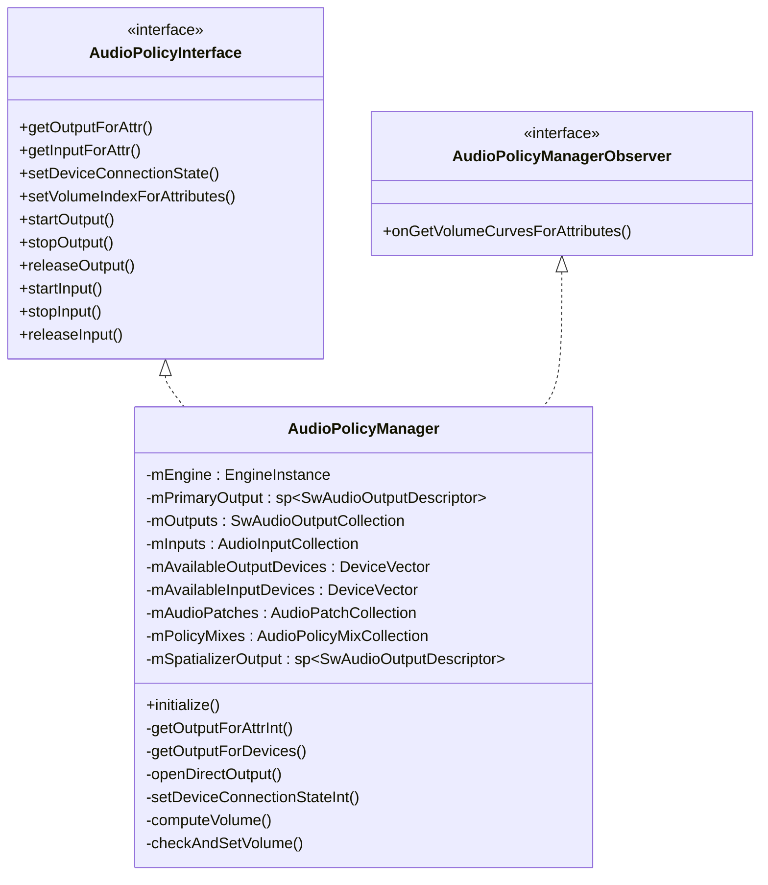

- [`AudioPolicyInterface`](../../../frameworks/av/services/audiopolicy/AudioPolicyInterface.h)：定义了 APS 对外暴露的全部策略接口，APM 是其唯一实现
- [`AudioPolicyManagerObserver`](../../../frameworks/av/services/audiopolicy/engine/interface/AudioPolicyManagerObserver.h)：观察者接口，供 Engine 回查音量曲线信息

### 核心成员变量

| 成员变量 | 类型 | 说明 |
|---------|------|------|
| `mConfig` | `sp<const AudioPolicyConfig>` | 全局音频策略配置，包含硬件模块定义 |
| `mEngine` | `EngineInstance` | 可插拔策略引擎实例，负责设备选择和策略映射 |
| `mpClientInterface` | `AudioPolicyClientInterface*` | 客户端接口，用于调用 AudioFlinger 操作 |
| `mPrimaryOutput` | `sp<SwAudioOutputDescriptor>` | 主输出描述符，标识系统默认输出 |
| `mSpatializerOutput` | `sp<SwAudioOutputDescriptor>` | 空间音频专用输出描述符 |
| `mOutputs` | `SwAudioOutputCollection` | 当前活跃输出集合（KeyVector结构） |
| `mPreviousOutputs` | `SwAudioOutputCollection` | 上一轮设备变更前的输出快照 |
| `mInputs` | `AudioInputCollection` | 当前活跃输入集合 |
| `mAvailableOutputDevices` | `DeviceVector` | 当前可用的输出设备集合 |
| `mAvailableInputDevices` | `DeviceVector` | 当前可用的输入设备集合 |
| `mAudioPatches` | `AudioPatchCollection` | 音频补丁集合，管理路由连接 |
| `mPolicyMixes` | `AudioPolicyMixCollection` | 动态策略混音规则集合 |
| `mCallRxSourceClient` | `sp<SourceClientDescriptor>` | 通话Rx音频源客户端 |
| `mCallTxSourceClient` | `sp<SourceClientDescriptor>` | 通话Tx音频源客户端 |

---

## 6.2.2 初始化流程

APM 的初始化由 [`initialize()`](../../../frameworks/av/services/audiopolicy/managerdefault/AudioPolicyManager.cpp:6024) 方法完成，在 APS 创建 APM 实例后立即调用。

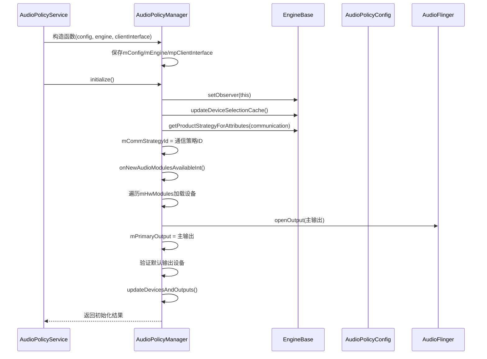

### initialize() 核心步骤源码解析

```cpp
// AudioPolicyManager.cpp:6024-6060
status_t AudioPolicyManager::initialize() {
    // 步骤1: 设置引擎观察者为APM自身
    mEngine->setObserver(this);
    
    // 步骤2: 初始化设备选择缓存
    // 确保引擎内部的设备选择结果缓存处于初始状态
    mEngine->updateDeviceSelectionCache();
    
    // 步骤3: 获取通信策略ID
    // 通信策略在路由决策中有特殊优先级（如通话场景）
    mCommStrategyId = mEngine->getProductStrategyForAttributes(
        AudioAttributes(AUDIO_CONTENT_TYPE_SPEECH, AUDIO_USAGE_VOICE_COMMUNICATION)
            .getAttributes());
    
    // 步骤4: 加载所有音频模块
    // 遍历配置文件中定义的HwModule，打开输出/输入
    onNewAudioModulesAvailableInt();
    
    // 步骤5: 验证默认输出设备
    // 确保至少存在一个可用的输出设备
    if (mAvailableOutputDevices.isEmpty()) {
        return NO_INIT;
    }
    
    // 步骤6: 更新设备与输出状态
    updateDevicesAndOutputs();
    return NO_ERROR;
}
```

### onNewAudioModulesAvailableInt()

此方法负责将配置文件中的硬件模块实例化为可用的输出/输入端口：

1. 遍历 `mConfig->getHwModules()` 中的每个 HwModule
2. 对每个模块的输出 Profile，调用 `mpClientInterface->openOutput()` 打开输出流
3. 将成功打开的输出加入 `mOutputs` 集合
4. 对每个模块的输入 Profile，类似打开输入流
5. 将模块声明的设备加入 `mAvailableOutputDevices` 或 `mAvailableInputDevices`
6. 识别主输出：flags 包含 `AUDIO_OUTPUT_FLAG_PRIMARY` 的输出设为 `mPrimaryOutput`

---

## 6.2.3 输出路由决策 — getOutputForAttr 全链路

输出路由是 APM 最核心的功能，决定了一段音频数据应该通过哪个输出端口、连接到哪个设备播放。

### 调用链总览

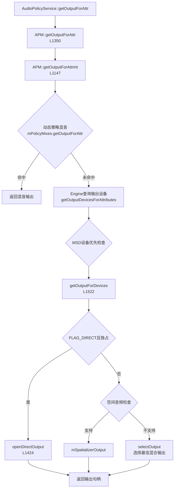

### getOutputForAttr() — 公共入口

[`getOutputForAttr()`](../../../frameworks/av/services/audiopolicy/managerdefault/AudioPolicyManager.cpp:1350) 是 APS 调用的公共接口，负责参数校验后委托给内部方法：

```cpp
// AudioPolicyManager.cpp:1350-1422
status_t AudioPolicyManager::getOutputForAttr(
        audio_attributes_t *attr,
        audio_io_handle_t *output,
        audio_session_t session,
        audio_stream_type_t *stream,
        uid_t uid,
        const audio_config_t *config,
        audio_output_flags_t *flags,
        audio_port_handle_t *selectedDeviceId,
        audio_port_handle_t *portId,
        std::vector<audio_io_handle_t> *secondaryOutputs) 
{
    // 1. 属性解析：将AudioAttributes转换为内部使用格式
    // 2. 委托给getOutputForAttrInt()
    // 3. 更新attr/stream输出参数
    // 4. 注册TrackClientDescriptor到输出
}
```

### getOutputForAttrInt() — 核心路由决策

[`getOutputForAttrInt()`](../../../frameworks/av/services/audiopolicy/managerdefault/AudioPolicyManager.cpp:1147) 是输出路由的决策核心，实现了完整的路由逻辑：

```cpp
// AudioPolicyManager.cpp:1147-1348 (简化关键逻辑)
status_t AudioPolicyManager::getOutputForAttrInt(
        audio_attributes_t *attr,
        audio_io_handle_t *output,
        audio_session_t session,
        uid_t uid,
        const audio_config_t *config,
        audio_output_flags_t *flags,
        audio_port_handle_t *selectedDeviceId,
        audio_port_handle_t *portId,
        std::vector<audio_io_handle_t> *secondaryOutputs)
{
    // ===== 阶段1: 动态策略混音检查 =====
    // 检查是否命中路由策略混音规则（如OEM定义的特定路由）
    audio_policy_mix_t *policyMix = nullptr;
    if (mPolicyMixes.getOutputForAttr(attr, uid, &policyMix) == NO_ERROR) {
        // 命中动态策略混音，返回对应的专用输出
        *output = policyMix->getOutput();
        return NO_ERROR;
    }
    
    // ===== 阶段2: 引擎查询输出设备 =====
    // 委托引擎根据AudioAttributes查询目标设备
    DeviceVector devices = mEngine->getOutputDevicesForAttributes(
            *attr, nullptr, false /*fromCache*/);
    
    // ===== 阶段3: MSD设备优先 =====
    // Multi-Stream Decoder设备具有特殊优先级
    // 如果目标设备中包含MSD设备，优先路由到MSD
    DeviceVector msdDevices = devices.getDevicesFromTypes(
            mEngine->getMsdOutputDevices());
    if (!msdDevices.isEmpty()) {
        // MSD设备存在时，后续将通过setMsdOutputPatches处理
    }
    
    // ===== 阶段4: PreferredMixerAttributes处理 =====
    // 检查是否有应用指定的首选混音器属性
    audio_config_base_t preferredMixerConfig;
    if (outputDesc != nullptr && 
        outputDesc->getPreferredMixerAttributes(*attr) != nullptr) {
        // 使用应用指定的混音器配置
    }
    
    // ===== 阶段5: 委托getOutputForDevices =====
    *output = getOutputForDevices(devices, session, *attr, *stream, 
                                  config, flags, secondaryOutputs);
    return NO_ERROR;
}
```

### getOutputForDevices() — 设备级路由选择

[`getOutputForDevices()`](../../../frameworks/av/services/audiopolicy/managerdefault/AudioPolicyManager.cpp:1522) 接收目标设备列表，决定使用直接输出还是混合输出：

```cpp
// AudioPolicyManager.cpp:1522-1645 (关键逻辑)
audio_io_handle_t AudioPolicyManager::getOutputForDevices(
        const DeviceVector& devices,
        audio_session_t session,
        const audio_attributes_t& attr,
        audio_stream_type_t stream,
        const audio_config_t* config,
        audio_output_flags_t* flags,
        std::vector<audio_io_handle_t>* secondaryOutputs)
{
    // 步骤1: 获取能路由到目标设备的所有输出
    SortedVector<audio_io_handle_t> outputs = getOutputsForDevices(devices, mOutputs);
    
    // 步骤2: 空间音频检查
    // 如果音频属性支持空间化，且存在mSpatializerOutput
    audio_io_handle_t spatializerOutput = canBeSpatializedInt(attr, *flags, config);
    if (spatializerOutput != AUDIO_IO_HANDLE_NONE) {
        return spatializerOutput;
    }
    
    // 步骤3: 尝试打开直接输出（Direct Output）
    // 条件：FLAG_DIRECT && 独占会话 && 不需要共享混音器
    if ((*flags & AUDIO_OUTPUT_FLAG_DIRECT) != 0) {
        audio_io_handle_t directOutput = openDirectOutput(
                stream, session, attr, *config, flags, devices, output);
        if (directOutput != AUDIO_IO_HANDLE_NONE) {
            return directOutput;
        }
        // Direct输出打开失败，回退到混合输出
    }
    
    // 步骤4: 选择最佳混合输出
    // 使用8维匹配标准选择最合适的混合输出
    audio_io_handle_t selectedOutput = selectOutput(
            outputs, *flags, config->format, config->channel_mask, 
            config->sample_rate, session);
    
    return selectedOutput;
}
```

### openDirectOutput() — 直接输出通道

[`openDirectOutput()`](../../../frameworks/av/services/audiopolicy/managerdefault/AudioPolicyManager.cpp:1424) 用于打开独占式直接输出通道，适用于低延迟/高保真播放场景：

```cpp
// AudioPolicyManager.cpp:1424-1520 (关键逻辑)
status_t AudioPolicyManager::openDirectOutput(
        audio_stream_type_t stream,
        audio_session_t session,
        const audio_attributes_t& attr,
        const audio_config_t& config,
        audio_output_flags_t* flags,
        const DeviceVector& devices,
        audio_io_handle_t* output)
{
    // 1. 在mOutputs中查找匹配的直接输出Profile
    //    匹配条件：flags、格式、采样率、声道掩码
    // 2. 如果已有相同配置的直接输出且可复用，直接返回
    // 3. 否则调用mpClientInterface->openOutput()新建
    // 4. 创建SwAudioOutputDescriptor并加入mOutputs
    
    // 直接输出与混合输出的关键区别：
    // - 直接输出不经过AudioFlinger混音器
    // - 直接输出通常是独占的（一个输出只有一个Track）
    // - 直接输出支持passthrough格式（如AC3/DTS）
}
```

### selectOutput() — 8维匹配选择算法

[`selectOutput()`](../../../frameworks/av/services/audiopolicy/managerdefault/AudioPolicyManager.cpp:1940) 是混合输出选择的核心算法，使用8个优先级递减的匹配标准，通过字典序比较选出最佳输出：

| 优先级 | 匹配标准 | 说明 |
|--------|---------|------|
| 1 | Haptic通道匹配 | 触觉反馈通道数匹配，格式和采样率必须相同 |
| 2 | 功能标志匹配 | VOIP_RX/INCALL_MUSIC/TTS/DIRECT_PCM/ULTRASOUND/SPATIALIZER |
| 3 | 精确声道掩码 | 请求的声道掩码与输出声道掩码子集匹配 |
| 4 | 高声道数 | 输出声道数大于请求声道数 |
| 5 | 高采样率 | 请求采样率 > 48kHz时，优先高采样率输出 |
| 6 | 性能标志匹配 | FAST/DEEP_BUFFER/RAW/SYNC |
| 7 | 格式匹配 | 格式距离越小越优 |
| 8 | 主输出优先 | AUDIO_OUTPUT_FLAG_PRIMARY |

```cpp
// AudioPolicyManager.cpp:1940-2086 (选择算法核心)
audio_io_handle_t AudioPolicyManager::selectOutput(
        const SortedVector<audio_io_handle_t>& outputs,
        audio_output_flags_t flags, audio_format_t format,
        audio_channel_mask_t channelMask, uint32_t samplingRate,
        audio_session_t sessionId)
{
    // 排除标志：HW_AV_SYNC | MMAP_NOIRQ | DIRECT
    static const audio_output_flags_t kExcludedFlags = ...;
    // 功能标志：VOIP_RX | INCALL_MUSIC | TTS | DIRECT_PCM | ULTRASOUND | SPATIALIZER
    static const audio_output_flags_t kFunctionalFlags = ...;
    // 性能标志：FAST | DEEP_BUFFER | RAW | SYNC
    static const audio_output_flags_t kPerformanceFlags = ...;

    std::vector<uint32_t> bestMatchCriteria(8, 0);
    for (audio_io_handle_t output : outputs) {
        std::vector<uint32_t> currentMatchCriteria(8, 0);
        // 跳过duplicated输出和含排除标志的输出
        // 计算8个维度的匹配分值
        // 功能标志匹配：匹配数 * 100 - 总功能标志数
        //   → 匹配越多越好，但多余功能标志越少越好
        currentMatchCriteria[1] = 100 * (matchingFunctionalFlags + 1) 
                                  - totalFunctionalFlags;
        
        // 使用lexicographical_compare做字典序比较
        if (std::lexicographical_compare(
                bestMatchCriteria.begin(), bestMatchCriteria.end(),
                currentMatchCriteria.begin(), currentMatchCriteria.end())) {
            bestMatchCriteria = currentMatchCriteria;
            bestOutput = output;
        }
    }
    return bestOutput;
}
```

### 输出路由决策流程图

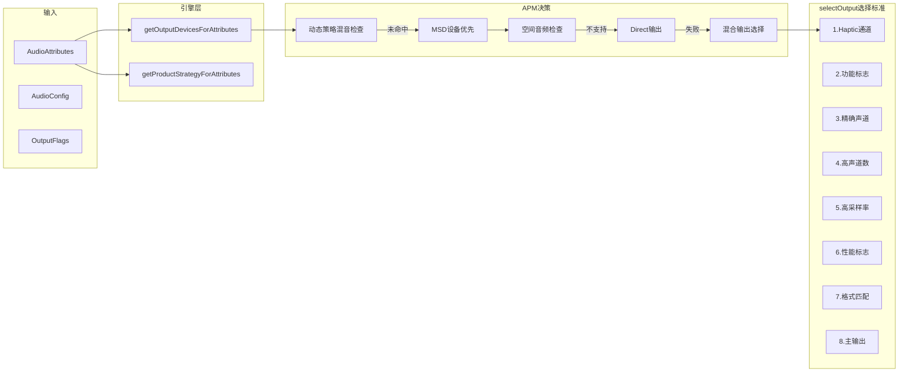

---

## 6.2.4 输入路由决策 — getInputForAttr

输入路由决定录音流的输入源设备和输入端口，与输出路由对称但逻辑更简单。

### 调用链

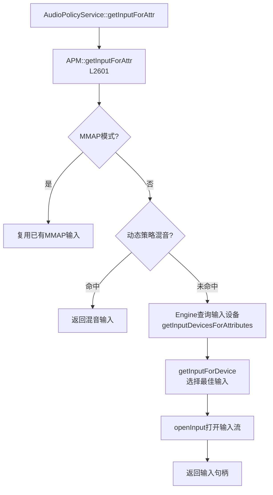

### getInputForAttr() 源码解析

[`getInputForAttr()`](../../../frameworks/av/services/audiopolicy/managerdefault/AudioPolicyManager.cpp:2601) 核心逻辑：

```cpp
// AudioPolicyManager.cpp:2601-2770 (关键逻辑)
status_t AudioPolicyManager::getInputForAttr(
        const audio_attributes_t* attr,
        audio_io_handle_t* input,
        audio_unique_id_t riid,
        audio_session_t session,
        uid_t uid,
        uint32_t samplingRate,
        audio_format_t format,
        audio_channel_mask_t channelMask,
        audio_input_flags_t flags,
        audio_port_handle_t* selectedDeviceId,
        audio_port_handle_t* portId)
{
    // 步骤1: MMAP_NOIRQ模式 — 尝试复用已有MMAP输入
    if (flags & AUDIO_INPUT_FLAG_MMAP_NOIRQ) {
        // 在mInputs中查找匹配的MMAP输入描述符
        // 如果找到，复用该输入（共享模式）
    }
    
    // 步骤2: 动态策略混音检查
    audio_policy_mix_t *policyMix = nullptr;
    if (mPolicyMixes.getInputForAttr(attr, uid, &policyMix) == NO_ERROR) {
        // 返回策略混音对应的输入
    }
    
    // 步骤3: 引擎查询输入设备
    DeviceVector devices = mEngine->getInputDevicesForAttributes(*attr, nullptr);
    
    // 步骤4: 如果应用指定了preferredDevice，使用应用指定设备
    if (*selectedDeviceId != AUDIO_PORT_HANDLE_NONE) {
        DeviceVector preferredDevice = mAvailableInputDevices.getDeviceFromId(*selectedDeviceId);
        if (!preferredDevice.isEmpty()) {
            devices = preferredDevice;
        }
    }
    
    // 步骤5: 委托getInputForDevice打开输入
    *input = getInputForDevice(devices, session, attr, samplingRate, 
                               format, channelMask, flags);
    
    // 步骤6: 注册RecordClientDescriptor
    return NO_ERROR;
}
```

### 输入与输出路由的差异

| 维度 | 输出路由 | 输入路由 |
|------|---------|---------|
| 设备选择引擎方法 | `getOutputDevicesForAttributes` | `getInputDevicesForAttributes` |
| 通道类型 | Direct Output / 混合输出 | MMAP共享 / 独占输入 |
| 空间音频 | 支持 Spatializer | 不涉及 |
| MSD优先 | 支持 MSD 补丁 | 不涉及 |
| 选择算法 | selectOutput 8维匹配 | 简单Profile匹配 |

---

## 6.2.5 设备连接状态管理 — setDeviceConnectionState

设备连接/断开是音频系统最常见的状态变更事件，APM 需要在设备变更时完成输出/输入重新路由、音量重算、策略调整等一系列级联操作。

### 调用链总览

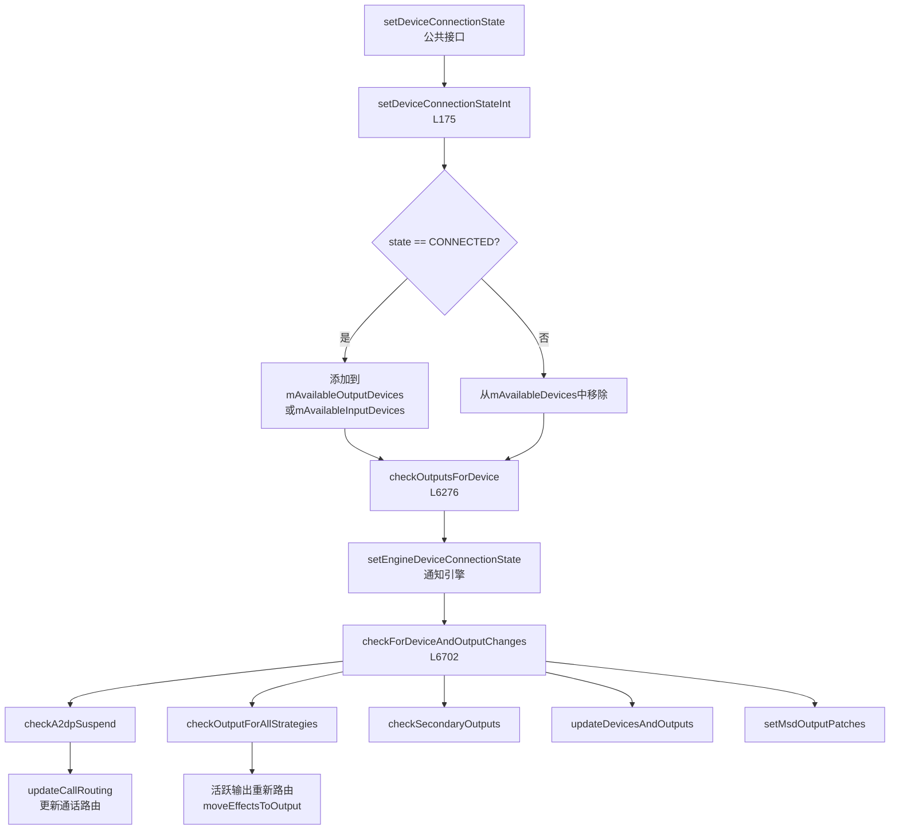

### setDeviceConnectionStateInt() 源码解析

[`setDeviceConnectionStateInt()`](../../../frameworks/av/services/audiopolicy/managerdefault/AudioPolicyManager.cpp:175) 是设备连接状态处理的内部实现：

```cpp
// AudioPolicyManager.cpp:175-400 (关键逻辑)
status_t AudioPolicyManager::setDeviceConnectionStateInt(
        audio_devices_t type,
        audio_policy_dev_state_t state,
        const char* address,
        const char* name,
        audio_format_t encodedFormat)
{
    // ===== 阶段1: 设备可用性更新 =====
    if (state == AUDIO_POLICY_DEVICE_STATE_AVAILABLE) {
        // 设备连接：查找设备描述符，加入可用设备集合
        sp<DeviceDescriptor> device = mConfig->findDeviceFromType(type);
        if (audio_is_output_devices(type)) {
            mAvailableOutputDevices.add(device);
        } else {
            mAvailableInputDevices.add(device);
        }
    } else {
        // 设备断开：从可用设备集合中移除
        if (audio_is_output_devices(type)) {
            mAvailableOutputDevices.remove(device);
        } else {
            mAvailableInputDevices.remove(device);
        }
    }
    
    // ===== 阶段2: 检查输出/输入变更 =====
    // 根据连接/断开状态，检查需要打开或关闭的输出
    status_t status = checkOutputsForDevice(device, state, outputs, address);
    
    // ===== 阶段3: 通知策略引擎 =====
    mEngine->setDeviceConnectionState(device, state);
    
    // ===== 阶段4: 级联检查设备与输出变更 =====
    checkForDeviceAndOutputChanges(/*checkA2dp=*/true);
    
    // ===== 阶段5: 更新通话路由 =====
    // 如果当前处于通话状态，需要重新计算通话音频路由
    updateCallRouting();
    
    // ===== 阶段6: 活跃输出重新路由 =====
    // 对于每个活跃的输出，检查其设备是否已变更
    // 如果变更，需要将Track迁移到新的输出
    for (size_t i = 0; i < mOutputs.size(); i++) {
        sp<SwAudioOutputDescriptor> outputDesc = mOutputs.valueAt(i);
        if (!outputDesc->isActive()) continue;
        
        DeviceVector newDevices = getNewOutputDevices(outputDesc, false /*fromCache*/);
        if (newDevices != outputDesc->devices()) {
            // 需要重新路由此输出
            setOutputDevices(outputDesc, newDevices, true /*force*/, 0 /*delayMs*/);
        }
    }
    
    return NO_ERROR;
}
```

### checkOutputsForDevice() — 设备变更时输出检查

[`checkOutputsForDevice()`](../../../frameworks/av/services/audiopolicy/managerdefault/AudioPolicyManager.cpp:6276) 在设备连接/断开时，决定需要打开或关闭哪些输出：

**设备连接时**：
1. 查询HAL模块的可用Profile，找到支持新设备的输出Profile
2. 如果已有输出能路由到新设备，标记复用
3. 如果没有已有输出能路由，调用 `mpClientInterface->openOutput()` 打开新输出
4. 将新输出加入 `mOutputs` 集合

**设备断开时**：
1. 找到路由到断开设备的所有输出
2. 将这些输出中的活跃Track迁移到其他可用输出
3. 关闭不再需要的输出

```cpp
// AudioPolicyManager.cpp:6276-6436 (关键逻辑)
status_t AudioPolicyManager::checkOutputsForDevice(
        const sp<DeviceDescriptor>& device,
        audio_policy_dev_state_t state,
        SortedVector<audio_io_handle_t>& outputs,
        const String8& address)
{
    if (state == AUDIO_POLICY_DEVICE_STATE_AVAILABLE) {
        // === 设备连接 ===
        // 遍历所有HwModule，查找支持此设备的输出Profile
        for (const auto& hwModule : mConfig->getHwModules()) {
            for (const auto& outputProfile : hwModule->getOutputProfiles()) {
                if (outputProfile->supportsDevice(device)) {
                    // 查找是否已有基于此Profile的输出
                    // 如果没有，打开新输出
                    audio_io_handle_t newOutput;
                    mpClientInterface->openOutput(..., &newOutput);
                    mOutputs.add(newOutput, new SwAudioOutputDescriptor(...));
                }
            }
        }
    } else {
        // === 设备断开 ===
        // 查找路由到断开设备的输出
        // 迁移活跃Track到其他输出
        // 关闭空闲输出
    }
}
```

### checkForDeviceAndOutputChanges() — 级联变更检查

[`checkForDeviceAndOutputChanges()`](../../../frameworks/av/services/audiopolicy/managerdefault/AudioPolicyManager.cpp:6702) 是设备变更后的核心级联检查方法：

```cpp
// AudioPolicyManager.cpp:6702-6722
void AudioPolicyManager::checkForDeviceAndOutputChanges(bool checkA2dp)
{
    // 步骤1: A2DP挂起检查
    // 如果A2DP输出不再需要（如蓝牙断开），需要挂起A2DP流
    if (checkA2dp) {
        checkA2dpSuspend();
    }
    
    // 步骤2: 检查所有策略的输出是否需要变更
    // 遍历所有ProductStrategy，检查其目标输出是否需要迁移
    checkOutputForAllStrategies();
    
    // 步骤3: 检查辅助输出（如同步输出的第二输出）
    checkSecondaryOutputs();
    
    // 步骤4: 更新设备选择缓存和输出快照
    updateDevicesAndOutputs();
    
    // 步骤5: 设置MSD输出补丁
    // 如果有MSD设备，创建/更新到MSD的音频补丁
    setMsdOutputPatches();
}
```

---

## 6.2.6 音量控制机制

APM 的音量控制涉及音量曲线转换、多种衰减规则叠加、音量源（VolumeSource）管理。

### 音量控制调用链

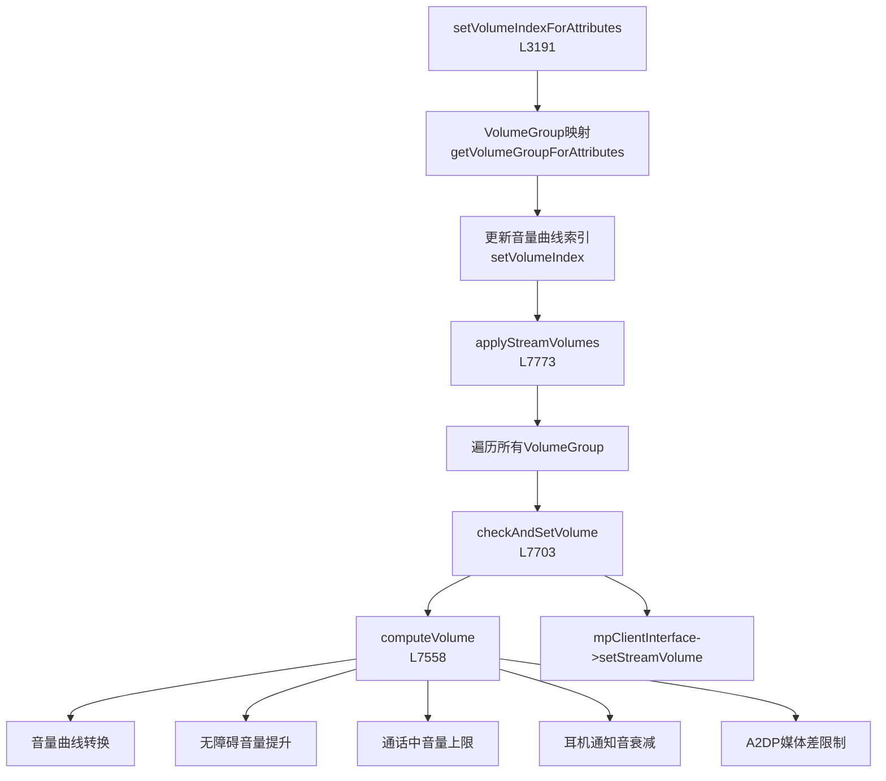

### computeVolume() — 音量计算核心

[`computeVolume()`](../../../frameworks/av/services/audiopolicy/managerdefault/AudioPolicyManager.cpp:7558) 实现了多层音量衰减/限制规则：

```cpp
// AudioPolicyManager.cpp:7558-7675 (关键逻辑)
float AudioPolicyManager::computeVolume(
        VolumeSource volumeSource,
        int index,
        const DeviceTypeSet& deviceTypes)
{
    // ===== 步骤1: 音量曲线转换 =====
    // 根据设备类型和索引值，通过VolumeCurve计算基础增益
    float volumeDb = getVolumeCurves(volumeSource)
            .volIndexToDb(index, deviceTypes);
    
    // ===== 步骤2: 无障碍音量提升 =====
    // 如果当前VolumeSource被标记为无障碍音量源
    // 且设备是扬声器，可以突破音量上限
    if (isAccessibilityVolumeSource(volumeSource) &&
        deviceTypes.count(AUDIO_DEVICE_OUT_SPEAKER)) {
        // 允许扬声器输出超过正常最大音量
        // 通过A11Y增益提升系数实现
    }
    
    // ===== 步骤3: 通话中音量上限 =====
    // 当处于通话状态时，非通话音频的音量需要被衰减
    // 以免干扰通话音频
    if (isInCall() && volumeSource != toVolumeSource(AUDIO_STREAM_VOICE_CALL)) {
        // 应用通话中音量上限衰减
        volumeDb = AudioPolicyManager::computeVolumeLimitInCall(volumeDb);
    }
    
    // ===== 步骤4: 耳机通知音衰减规则 =====
    // 通知音在耳机上需要额外衰减-6dB，保护听力
    if (deviceTypes.count(AUDIO_DEVICE_OUT_WIRED_HEADSET) ||
        deviceTypes.count(AUDIO_DEVICE_OUT_WIRED_HEADPHONE) ||
        deviceTypes.count(AUDIO_DEVICE_OUT_BLUETOOTH_SCO) ||
        deviceTypes.count(AUDIO_DEVICE_OUT_BLE_HEADSET)) {
        if (volumeSource == toVolumeSource(AUDIO_STREAM_NOTIFICATION)) {
            // 通知音在耳机上衰减-6dB
            volumeDb -= 6.0f;
        }
    }
    
    // ===== 步骤5: A2DP媒体差限制 =====
    // 当A2DP和扬声器同时输出时，A2DP媒体音量不能
    // 超过扬声器媒体音量12dB以上，防止突发高音量
    if (deviceTypes.count(AUDIO_DEVICE_OUT_A2DP)) {
        float speakerVolumeDb = getVolumeCurves(volumeSource)
                .volIndexToDb(index, {AUDIO_DEVICE_OUT_SPEAKER});
        float a2dpVolumeDb = volumeDb;
        if (a2dpVolumeDb > speakerVolumeDb + 12.0f) {
            volumeDb = speakerVolumeDb + 12.0f;
        }
    }
    
    return volumeDb;
}
```

### 音量衰减规则优先级


### checkAndSetVolume() — 音量设置决策

[`checkAndSetVolume()`](../../../frameworks/av/services/audiopolicy/managerdefault/AudioPolicyManager.cpp:7703) 在计算音量后，进行静音检查和特殊场景处理：

```cpp
// AudioPolicyManager.cpp:7703-7771 (关键逻辑)
status_t AudioPolicyManager::checkAndSetVolume(
        const IVolumeCurves& curves,
        VolumeSource volumeSource,
        int index,
        const sp<AudioOutputDescriptor>& outputDesc,
        const DeviceTypeSet& deviceTypes,
        int delayMs,
        bool force)
{
    // ===== 检查1: 静音判断 =====
    // 如果VolumeSource被标记为静音，直接设置音量为0
    if (outputDesc->isMuted(volumeSource)) {
        // 即使静音也继续设置（保持索引同步）
        // 但实际输出音量会被静音覆盖
    }
    
    // ===== 检查2: SCO/通话互斥 =====
    // SCO活跃时，媒体音量需要限制
    // 通话活跃时，部分音量源需要被静音
    if (volumeSource == toVolumeSource(AUDIO_STREAM_MUSIC) &&
        outputDesc->devices().types().count(AUDIO_DEVICE_OUT_BLUETOOTH_SCO)) {
        // SCO设备上的媒体音量特殊处理
    }
    
    // ===== 步骤3: 计算最终音量 =====
    float volumeDb = computeVolume(volumeSource, index, deviceTypes);
    
    // ===== 步骤4: 固定音量处理 =====
    // 某些设备使用固定音量（如HDMI的音量由显示设备控制）
    if (outputDesc->isFixedVolume(deviceTypes)) {
        volumeDb = 0.0f; // 0dB = 全音量，由下游设备控制
    }
    
    // ===== 步骤5: 设置Voice Volume =====
    // 通话音量需要同时设置Voice Volume（HAL层）
    if (volumeSource == toVolumeSource(AUDIO_STREAM_VOICE_CALL)) {
        float voiceVolume = computeVolume(volumeSource, index, deviceTypes);
        mpClientInterface->setVoiceVolume(voiceVolume, delayMs);
    }
    
    // ===== 步骤6: 通过AudioFlinger设置音量 =====
    mpClientInterface->setStreamVolume(
            toStreamType(volumeSource), volumeDb, 
            outputDesc->mIoHandle, delayMs);
    
    return NO_ERROR;
}
```

### applyStreamVolumes() — 批量音量应用

[`applyStreamVolumes()`](../../../frameworks/av/services/audiopolicy/managerdefault/AudioPolicyManager.cpp:7773) 在设备切换后批量重算所有音量：

```cpp
// AudioPolicyManager.cpp:7773-7785
void AudioPolicyManager::applyStreamVolumes(
        const sp<AudioOutputDescriptor>& outputDesc,
        const DeviceTypeSet& deviceTypes,
        int delayMs, bool force)
{
    // 遍历引擎中所有VolumeGroup
    for (const auto& volumeGroup : mEngine->getVolumeGroups()) {
        auto& curves = getVolumeCurves(toVolumeSource(volumeGroup));
        // 对每个VolumeGroup调用checkAndSetVolume
        checkAndSetVolume(curves, toVolumeSource(volumeGroup),
                          curves.getVolumeIndex(deviceTypes),
                          outputDesc, deviceTypes, delayMs, force);
    }
}
```

### VolumeSource 与 VolumeGroup 映射

```
AudioAttributes → Engine.getProductStrategyForAttributes()
              → Engine.getVolumeGroupForAttributes()
              → VolumeGroup → VolumeSource
              → VolumeCurve → volIndexToDb(index, deviceTypes)
```

| VolumeSource | 对应AudioStream | 说明 |
|-------------|-----------------|------|
| `VOLUME_SOURCE_VOICE_CALL` | `STREAM_VOICE_CALL` | 通话音量 |
| `VOLUME_SOURCE_SYSTEM` | `STREAM_SYSTEM` | 系统音量 |
| `VOLUME_SOURCE_RING` | `STREAM_RING` | 铃声音量 |
| `VOLUME_SOURCE_MUSIC` | `STREAM_MUSIC` | 媒体音量 |
| `VOLUME_SOURCE_ALARM` | `STREAM_ALARM` | 闹钟音量 |
| `VOLUME_SOURCE_NOTIFICATION` | `STREAM_NOTIFICATION` | 通知音量 |
| `VOLUME_SOURCE_BLUETOOTH_SCO` | `STREAM_BLUETOOTH_SCO` | 蓝牙SCO音量 |
| `VOLUME_SOURCE_ENFORCED_AUDIBLE` | `STREAM_ENFORCED_AUDIBLE` | 强制可听音量 |
| `VOLUME_SOURCE_DTMF` | `STREAM_DTMF` | DTMF音量 |
| `VOLUME_SOURCE_ACCESSIBILITY` | `STREAM_ACCESSIBILITY` | 无障碍音量 |
| `VOLUME_SOURCE_ASSISTANT` | `STREAM_ASSISTANT` | 助手音量 |

---

## 6.2.7 设备选择策略 — getNewOutputDevices

[`getNewOutputDevices()`](../../../frameworks/av/services/audiopolicy/managerdefault/AudioPolicyManager.cpp:7001) 在设备变更后为每个活跃输出重新计算目标设备：

```cpp
// AudioPolicyManager.cpp:7001-7071 (关键逻辑)
DeviceVector AudioPolicyManager::getNewOutputDevices(
        const sp<SwAudioOutputDescriptor>& outputDesc,
        bool fromCache) const
{
    // 步骤1: 补丁设备检查
    // 如果输出已通过音频补丁连接，优先使用补丁中的设备
    DeviceVector devices = outputDesc->devices();
    if (outputDesc->isPatchDeviceActive()) {
        return devices; // 保持补丁路由不变
    }
    
    // 步骤2: MSD输出跳过
    // MSD输出使用独立的补丁管理，不参与常规设备选择
    if (isMSDOutput(outputDesc)) {
        return devices;
    }
    
    // 步骤3: PreferredDevice检查
    // 如果输出上有客户端指定了首选设备，使用首选设备
    DeviceVector preferredDevices = outputDesc->preferredDevice();
    if (!preferredDevices.isEmpty()) {
        return preferredDevices;
    }
    
    // 步骤4: PolicyMix设备检查
    // 如果输出服务于动态策略混音，使用混音指定的设备
    if (outputDesc->mPolicyMix != nullptr) {
        return outputDesc->mPolicyMix->getDeviceTypes();
    }
    
    // 步骤5: 遍历引擎策略
    // 收集输出上所有活跃策略的目标设备
    DeviceVector newDevices;
    auto strategies = mEngine->getOrderedProductStrategies();
    for (const auto& strategy : strategies) {
        // 检查此策略在此输出上是否有活跃客户端
        if (outputDesc->isStrategyActive(strategy)) {
            auto attributes = mEngine->getAllAttributesForProductStrategy(strategy).front();
            DeviceVector strategyDevices = mEngine->getOutputDevicesForAttributes(
                    attributes, nullptr, fromCache);
            newDevices.add(strategyDevices);
        }
    }
    
    return newDevices;
}
```

### 设备选择优先级

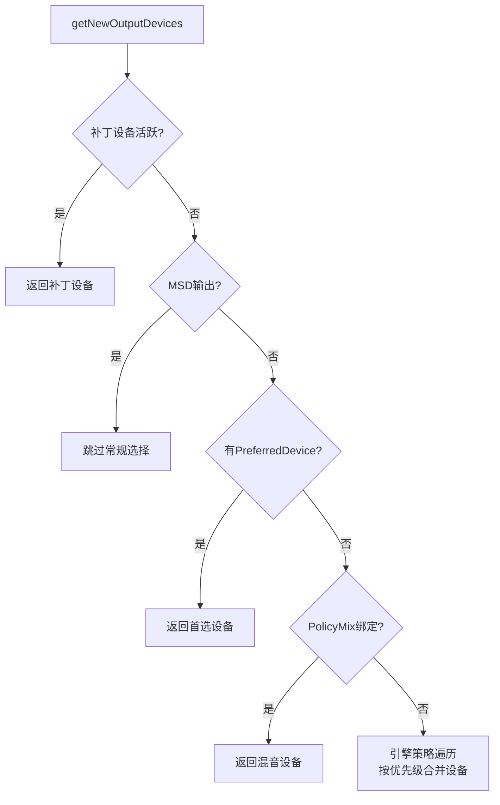

---

## 6.2.8 A2DP 挂起/恢复机制

[`checkA2dpSuspend()`](../../../frameworks/av/services/audiopolicy/managerdefault/AudioPolicyManager.cpp:6957) 管理A2DP输出的挂起和恢复，用于在SCO通话等场景下临时挂起A2DP流：

```cpp
// AudioPolicyManager.cpp:6957-6999
void AudioPolicyManager::checkA2dpSuspend()
{
    // 遍历所有A2DP输出
    for (const auto& outputDesc : mOutputs) {
        if (!outputDesc->devices().containsType(AUDIO_DEVICE_OUT_A2DP)) {
            continue;
        }
        
        bool shouldSuspend = false;
        
        // 检查条件1: SCO是否活跃
        // 当蓝牙SCO通话进行时，A2DP需要挂起
        // 因为蓝牙芯片通常不能同时处理SCO和A2DP
        if (mAvailableOutputDevices.containsType(AUDIO_DEVICE_OUT_BLUETOOTH_SCO) &&
            isStreamActive(toVolumeSource(AUDIO_STREAM_BLUETOOTH_SCO))) {
            shouldSuspend = true;
        }
        
        // 检查条件2: 是否有高优先级音频需要扬声器输出
        // 如铃声、闹钟等
        // ...
        
        // 执行挂起或恢复
        if (shouldSuspend && !outputDesc->isSuspended()) {
            mpClientInterface->suspendOutput(outputDesc->mIoHandle);
            outputDesc->setSuspended(true);
        } else if (!shouldSuspend && outputDesc->isSuspended()) {
            mpClientInterface->restoreOutput(outputDesc->mIoHandle);
            outputDesc->setSuspended(false);
        }
    }
}
```

### A2DP挂起状态机

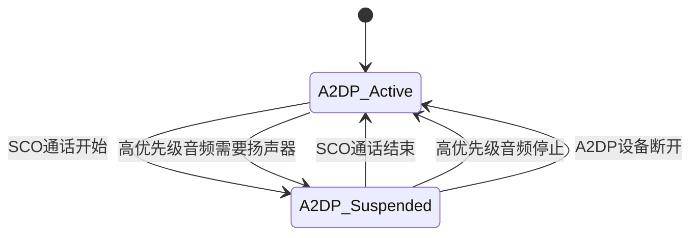

---

## 6.2.9 空间音频输出选择

APM 从 Android 12 开始支持空间音频（Spatial Audio），通过 `mSpatializerOutput` 管理专用输出：

### canBeSpatializedInt()

```cpp
// 判断音频属性是否可以被空间化
// 条件：
// 1. mSpatializerOutput 不为空（已创建空间音频输出）
// 2. 音频内容类型为CONTENT_TYPE_MOVIE或CONTENT_TYPE_MUSIC
// 3. 用途为USAGE_MEDIA
// 4. 通道配置为立体声或多声道
// 5. 没有FLAG_DIRECT标志
audio_io_handle_t AudioPolicyManager::canBeSpatializedInt(
        const audio_attributes_t& attr,
        audio_output_flags_t flags,
        const audio_config_t& config)
{
    if (mSpatializerOutput == nullptr) {
        return AUDIO_IO_HANDLE_NONE;
    }
    // 检查空间音频兼容性...
    return mSpatializerOutput->mIoHandle;
}
```

### 空间音频输出生命周期

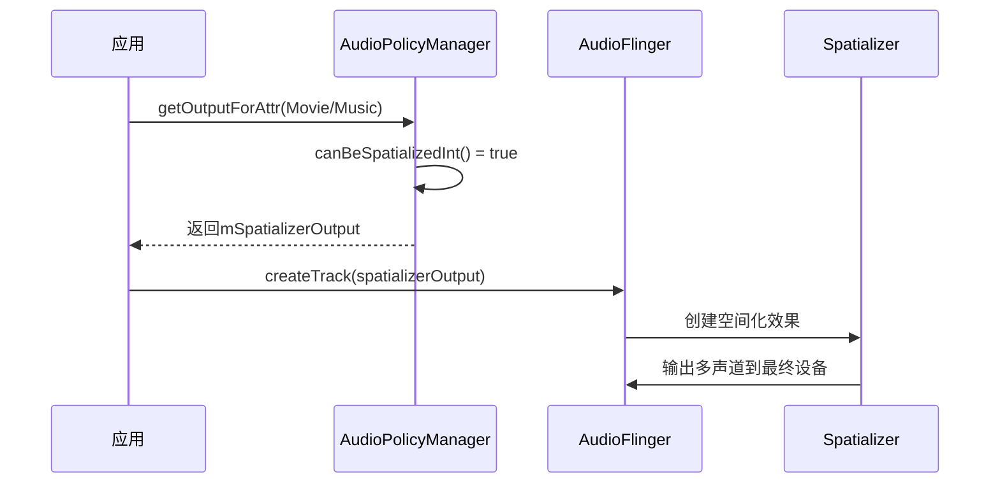

---

## 6.2.10 与 Engine 的交互模式

APM 与可插拔策略引擎之间的交互是理解整个策略子系统的关键。APM 负责"决策编排"，Engine 负责"策略运算"。

### 交互接口一览

| APM调用Engine方法 | 功能 | 调用场景 |
|-------------------|------|---------|
| `getOutputDevicesForAttributes()` | 查询输出设备 | 路由决策 |
| `getInputDevicesForAttributes()` | 查询输入设备 | 录音路由 |
| `getProductStrategyForAttributes()` | 查询产品策略 | 策略映射 |
| `getVolumeGroupForAttributes()` | 查询音量组 | 音量控制 |
| `setDeviceConnectionState()` | 通知设备变更 | 设备管理 |
| `setForceUse()` | 设置强制使用配置 | 外设插拔 |
| `getForceUse()` | 查询强制使用配置 | 路由决策 |
| `getOrderedProductStrategies()` | 获取有序策略列表 | 策略遍历 |
| `getAllAttributesForProductStrategy()` | 获取策略的所有属性 | 设备选择 |
| `updateDeviceSelectionCache()` | 更新设备选择缓存 | 状态变更 |
| `getMsdOutputDevices()` | 获取MSD设备列表 | MSD路由 |

### Engine 回调 APM（Observer 模式）

Engine 通过 `AudioPolicyManagerObserver` 接口回调 APM：

| Observer方法 | 功能 |
|-------------|------|
| `onGetVolumeCurvesForAttributes()` | Engine 回查音量曲线（APM持有曲线数据） |

这种设计使得 Engine 可以专注于策略逻辑（"哪种设备适合什么音频"），而 APM 持有运行时状态（音量曲线、输出集合、设备集合等）。

### 交互模式图

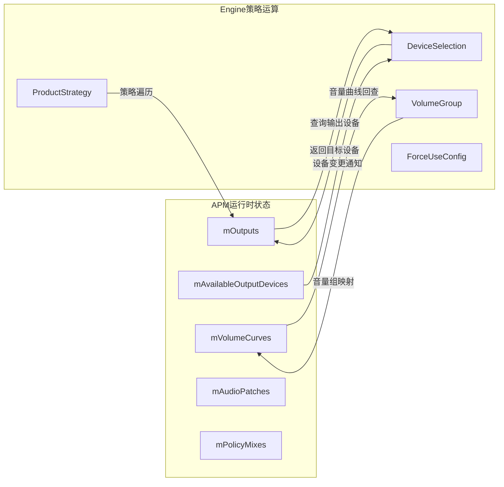

---

## 6.2.11 Stream/Device/Strategy 映射关系

Android 音频策略的核心是三重映射：AudioAttributes → ProductStrategy → Device。

### 映射链路

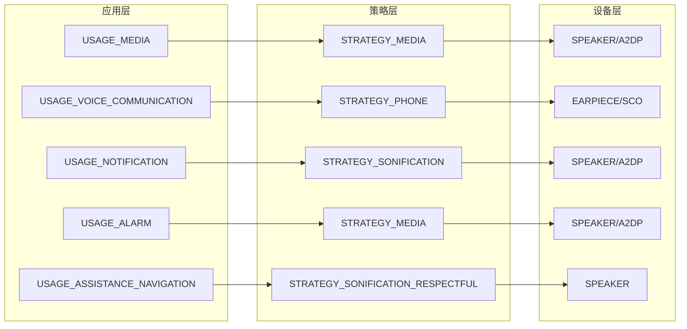

### 默认策略设备映射表

| ProductStrategy | 默认设备（优先级高→低） | 说明 |
|----------------|----------------------|------|
| STRATEGY_MEDIA | A2DP → HDMI → SPEAKER | 媒体优先蓝牙/外部设备 |
| STRATEGY_PHONE | EARPIECE → SCO → SPEAKER | 通话优先听筒/蓝牙 |
| STRATEGY_SONIFICATION | SPEAKER → A2DP → EARPIECE | 铃声/通知优先扬声器 |
| STRATEGY_ENFORCED_AUDIBLE | SPEAKER | 强制可听只用扬声器 |
| STRATEGY_DTMF | EARPIECE → SPEAKER | DTMF跟随通话路由 |
| STRATEGY_ACCESSIBILITY | 跟随当前活跃设备 | 无障碍跟随后台音频 |
| STRATEGY_REROUTING | 由Engine动态决定 | 重新路由 |

### ForceUse 对设备选择的影响

ForceUse 机制允许系统强制修改设备选择结果：

| ForceUse类型 | 强制值 | 影响 |
|-------------|--------|------|
| `FOR_MEDIA` | `FORCE_SPEAKER` | 媒体强制走扬声器 |
| `FOR_MEDIA` | `FORCE_HEADPHONES` | 媒体强制走耳机 |
| `FOR_COMMUNICATION` | `FORCE_SPEAKER` | 通话强制扬声器 |
| `FOR_COMMUNICATION` | `FORCE_BT_SCO` | 通话强制蓝牙SCO |
| `FOR_COMMUNICATION` | `FORCE_NONE` | 通话使用默认路由 |
| `FOR_SYSTEM` | `FORCE_SYSTEM_ENFORCED` | 强制扬声器输出 |
| `FOR_VIBRATE_RINGING` | `FORCE_BT_SCO` | 振动和铃响走蓝牙 |

---

## 6.2.12 mHwModules/mOutputs/mInputs 管理

APM 维护三组核心集合来管理音频硬件资源。

### 集合结构

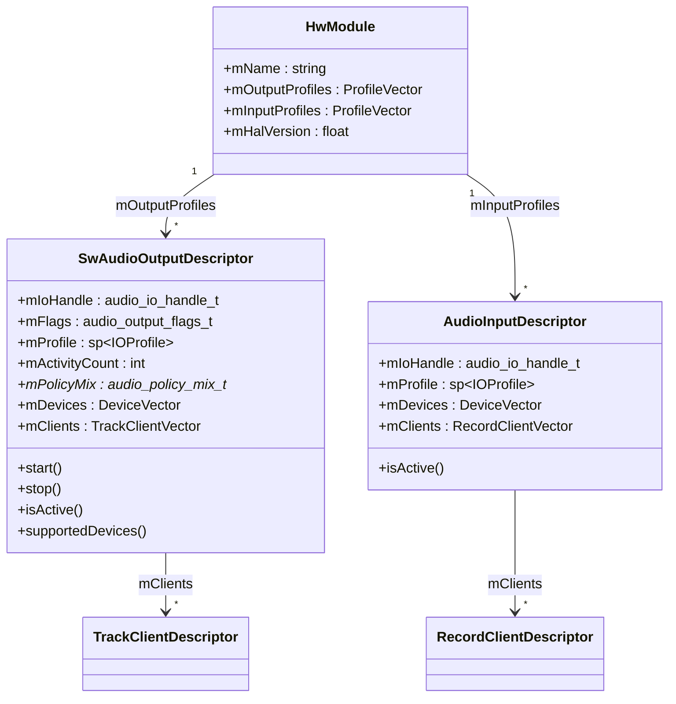

### mOutputs 生命周期

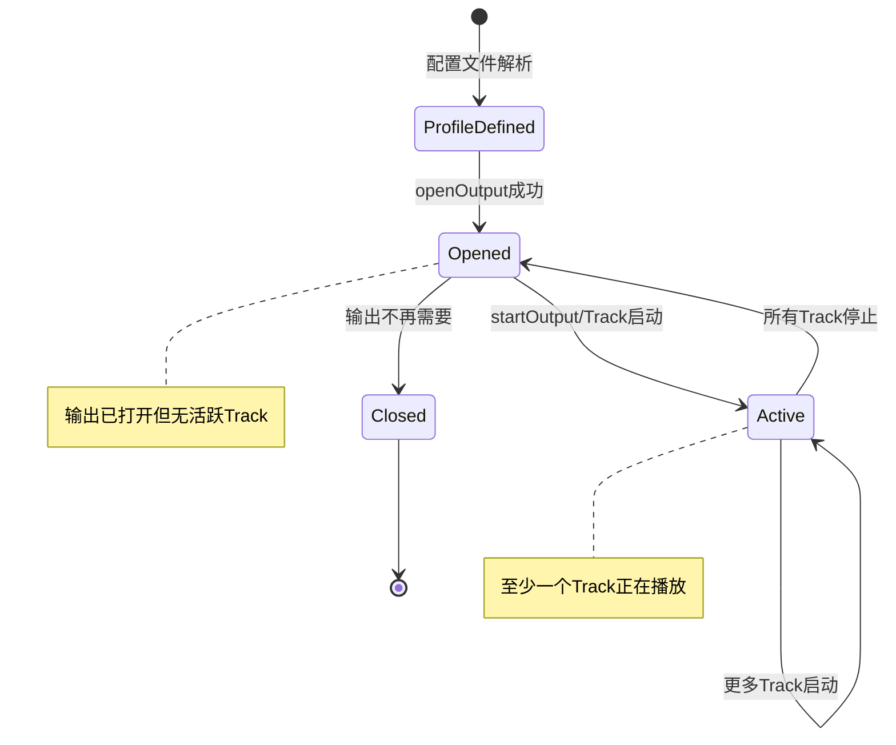

### 输出集合查询模式

APM 通过多种方式查询 `mOutputs` 集合：

1. **按IO Handle查询**：`mOutputs.valueFor(ioHandle)` — O(log n)
2. **按设备查询**：`getOutputsForDevices(devices, mOutputs)` — 返回能路由到指定设备的所有输出
3. **按Profile查询**：遍历查找匹配特定Profile的输出
4. **按客户端查询**：`mOutputs.getOutputForClient(portId)` — 通过客户端端口ID反查输出

---

## 6.2.13 updateDevicesAndOutputs 与设备变更通知

[`updateDevicesAndOutputs()`](../../../frameworks/av/services/audiopolicy/managerdefault/AudioPolicyManager.cpp:7216) 在每次设备变更后调用，执行两项关键操作：

```cpp
// AudioPolicyManager.cpp:7216-7220
void AudioPolicyManager::updateDevicesAndOutputs()
{
    // 步骤1: 更新引擎的设备选择缓存
    // 引擎内部维护了每个策略→设备的映射缓存
    // 设备变更后缓存可能失效，需要重新计算
    mEngine->updateDeviceSelectionCache();
    
    // 步骤2: 保存当前输出快照
    // mPreviousOutputs 用于与下一轮比较，判断输出是否发生变更
    mPreviousOutputs = mOutputs;
}
```

### 设备变更级联流程

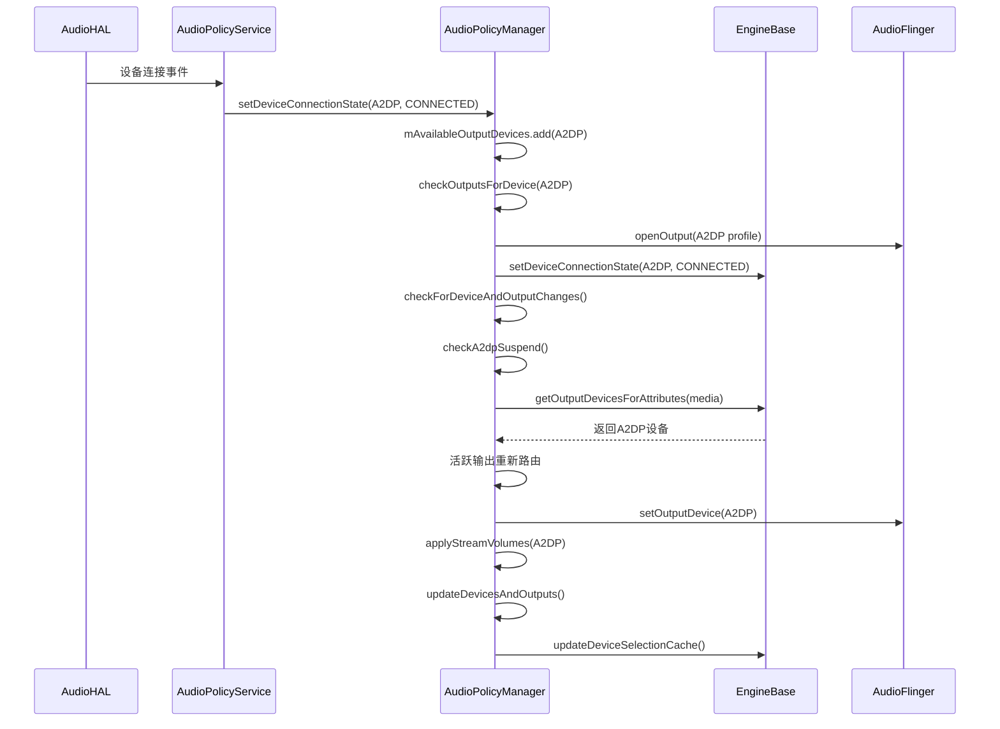

---

## 6.2.14 checkForOutputAndStreamClose

APM 在输出停止后需要检查是否可以关闭空闲输出和流：

```cpp
// 当一个Track停止播放后，APM需要：
// 1. 检查该输出是否还有其他活跃Track
// 2. 如果没有活跃Track，检查是否可以关闭输出
// 3. 如果输出关闭，检查关联的输入是否也可以关闭
// 4. 检查A2DP是否可以挂起（省电）
// 5. 更新设备选择缓存
```

### 关闭条件

| 条件 | 说明 |
|------|------|
| 输出无活跃Track | `!outputDesc->isActive()` |
| 输出不是主输出 | `outputDesc != mPrimaryOutput` |
| 输出不是duplicated输出 | `!outputDesc->isDuplicated()` |
| 输出没有策略混音绑定 | `outputDesc->mPolicyMix == nullptr` |
| 输出不是空间音频输出 | `outputDesc != mSpatializerOutput` |

---

## 6.2.15 getDevicesForAttributes

[`getDevicesForAttributes()`](../../../frameworks/av/services/audiopolicy/managerdefault/AudioPolicyManager.cpp:8313) 是查询特定音频属性对应设备的公共接口，有两个重载版本：

### 重载1：基础查询（L7127）

```cpp
// 简单委托给Engine查询
DeviceVector AudioPolicyManager::getDevicesForAttributes(
        const audio_attributes_t& attr, bool forVolume)
{
    return mEngine->getOutputDevicesForAttributes(attr, nullptr, false);
}
```

### 重载2：扩展查询（L8313）

```cpp
// Android 13+ 增加的扩展版本，支持更多查询选项
AudioDeviceTypeAddrVector AudioPolicyManager::getDevicesForAttributes(
        const audio_attributes_t& attr,
        bool forVolume)
{
    DeviceVector devices = mEngine->getOutputDevicesForAttributes(attr, nullptr, false);
    
    // 处理特殊情况：
    // 1. 如果forVolume为true，只返回音量控制设备
    // 2. 如果属性匹配多个策略，合并所有设备
    // 3. 过滤掉不可用的设备
    
    AudioDeviceTypeAddrVector result;
    for (const auto& device : devices) {
        result.push_back(AudioDeviceTypeAddr(device->type(), device->address()));
    }
    return result;
}
```

---

## 6.2.16 APM 核心方法速查表

| 方法 | 行号 | 功能 | 关键调用 |
|------|------|------|---------|
| `initialize()` | L6024 | 初始化APM | `setObserver`, `onNewAudioModulesAvailableInt` |
| `getOutputForAttr()` | L1350 | 输出路由公共入口 | `getOutputForAttrInt` |
| `getOutputForAttrInt()` | L1147 | 输出路由决策核心 | `mPolicyMixes.getOutputForAttr`, `mEngine->getOutputDevicesForAttributes`, `getOutputForDevices` |
| `getOutputForDevices()` | L1522 | 设备级路由选择 | `canBeSpatializedInt`, `openDirectOutput`, `selectOutput` |
| `selectOutput()` | L1940 | 8维匹配选择混合输出 | — |
| `getInputForAttr()` | L2601 | 输入路由 | `mEngine->getInputDevicesForAttributes`, `getInputForDevice` |
| `setDeviceConnectionStateInt()` | L175 | 设备连接状态管理 | `checkOutputsForDevice`, `checkForDeviceAndOutputChanges` |
| `checkOutputsForDevice()` | L6276 | 设备变更时输出检查 | `openOutput`, `closeOutput` |
| `checkForDeviceAndOutputChanges()` | L6702 | 级联变更检查 | `checkA2dpSuspend`, `checkOutputForAllStrategies`, `updateDevicesAndOutputs` |
| `getNewOutputDevices()` | L7001 | 计算输出目标设备 | `mEngine->getOutputDevicesForAttributes` |
| `checkA2dpSuspend()` | L6957 | A2DP挂起/恢复 | `suspendOutput`, `restoreOutput` |
| `computeVolume()` | L7558 | 音量计算 | `volIndexToDb` |
| `checkAndSetVolume()` | L7703 | 音量设置决策 | `computeVolume`, `setStreamVolume` |
| `applyStreamVolumes()` | L7773 | 批量音量应用 | `checkAndSetVolume` |
| `updateDevicesAndOutputs()` | L7216 | 设备与输出缓存更新 | `mEngine->updateDeviceSelectionCache` |
| `getDevicesForAttributes()` | L8313 | 查询属性对应设备 | `mEngine->getOutputDevicesForAttributes` |

---

## 6.2.17 总结

AudioPolicyManager 是 Android 音频策略的核心枢纽，其设计遵循以下原则：

1. **编排与运算分离**：APM 负责状态管理和决策编排，Engine 负责策略运算。APM 调用 Engine 获取设备选择结果，然后执行输出打开/关闭、Track 迁移、音量设置等具体操作。

2. **多级路由决策**：输出路由经过"动态策略混音 → Engine设备查询 → MSD优先 → 空间音频 → 直接输出 → 混合输出选择"六级决策，每一级都有明确的优先级和回退机制。

3. **级联变更管理**：设备连接/断开触发级联检查（`checkForDeviceAndOutputChanges`），确保所有活跃输出的设备、音量、策略状态都得到正确更新。

4. **音量多层衰减**：`computeVolume` 在基础音量曲线之上叠加无障碍提升、通话上限、耳机保护、A2DP差值限制等多层规则，确保各种场景下的音量安全。

5. **集合化资源管理**：`mOutputs`/`mInputs`/`mAvailableOutputDevices`/`mAvailableInputDevices` 四组集合统一管理硬件资源状态，配合 `mPreviousOutputs` 快照实现变更检测。

---

[← 上一个](06_6.1_AudioPolicyService-控制面入口.md) | [← 返回Audio Policy Engine](README.md) | [返回导航](../README.md) | [下一个 →](06_6.3_EngineBase-可插拔策略引擎.md)