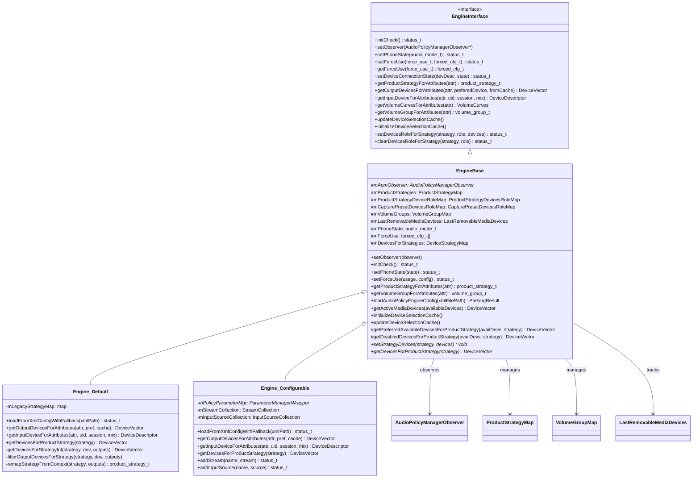
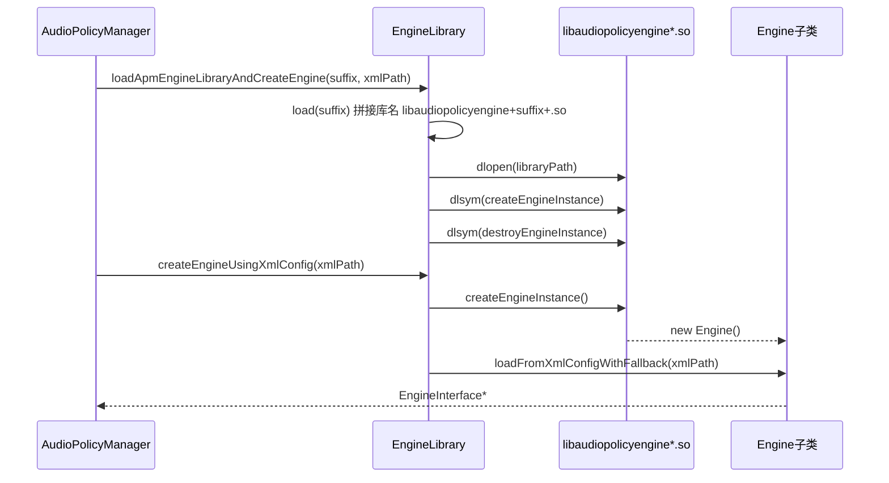
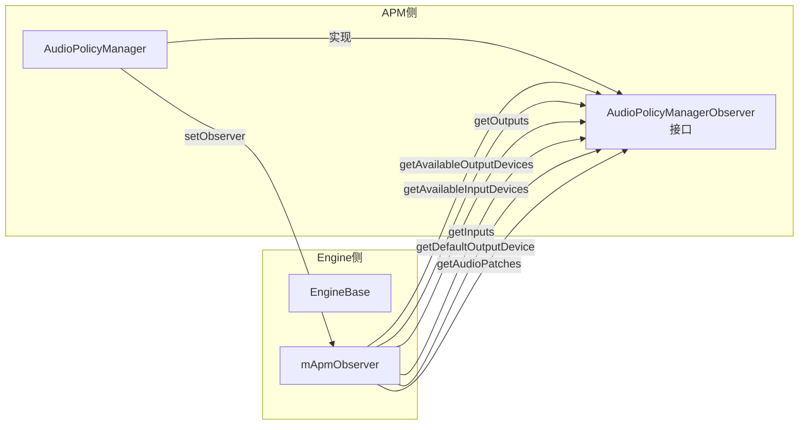
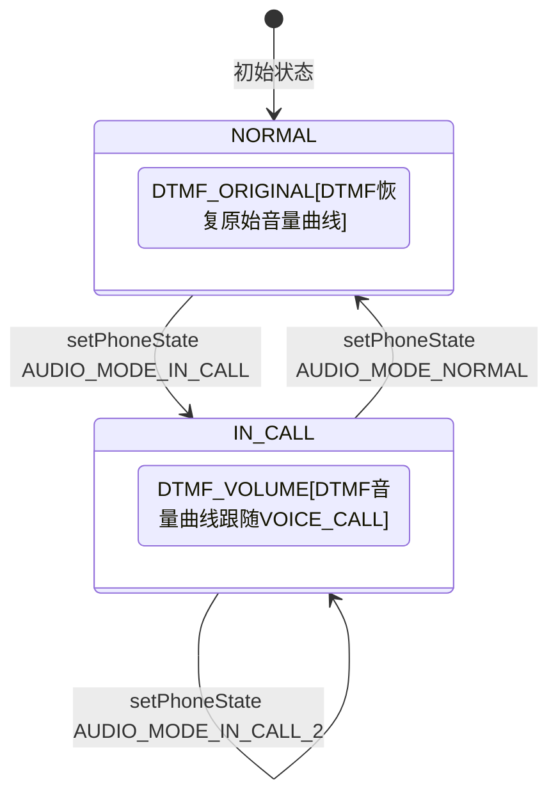
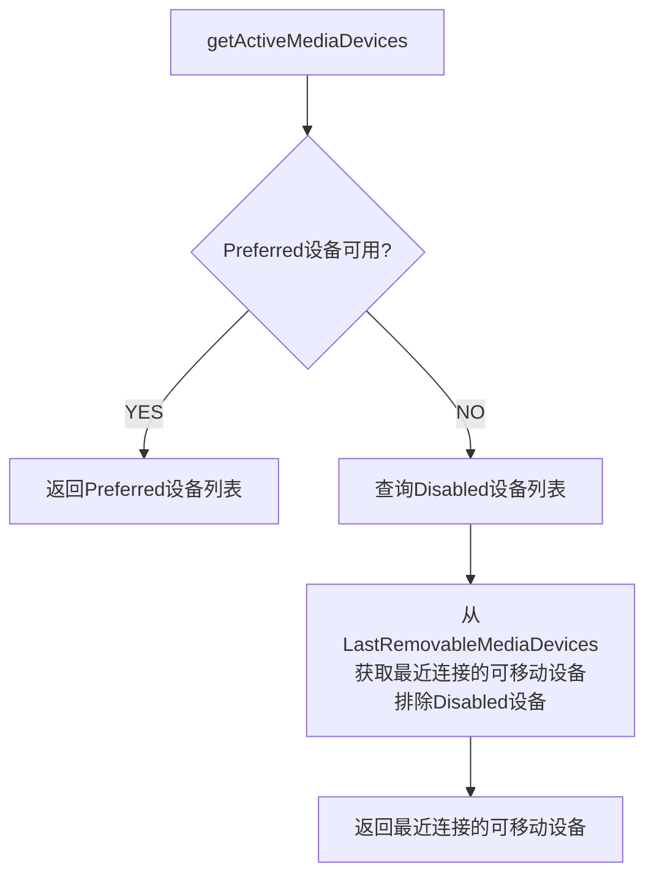
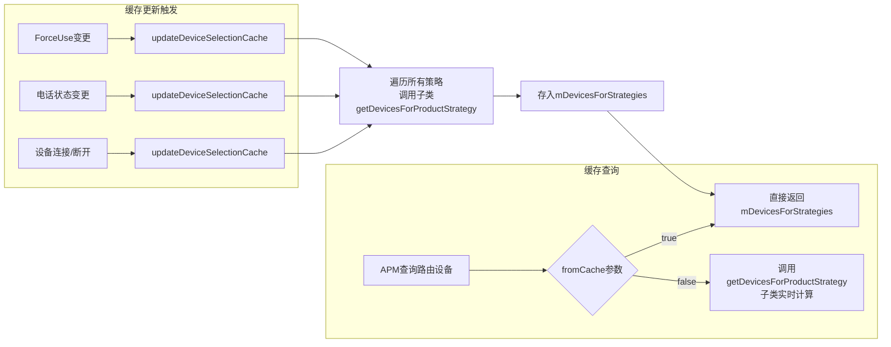
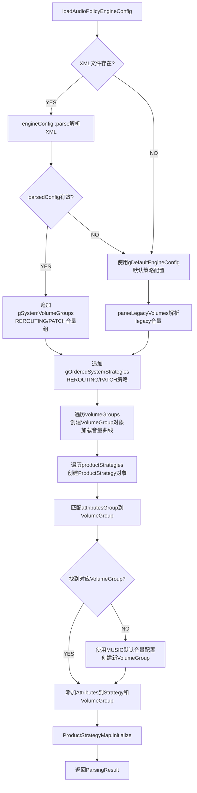
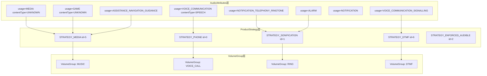
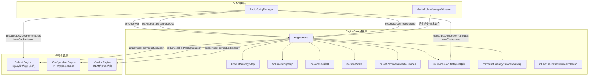

## 6.3 EngineBase — 可插拔策略引擎

[← 上一个](06_6.2_AudioPolicyManager-策略核心实现.md) | [← 返回Audio Policy Engine](README.md) | [返回导航](../README.md) | [下一个 →](06_6.4_Device_Routing-设备路由.md)

---

### 模块定位与设计哲学

[`EngineBase`](frameworks/av/services/audiopolicy/engine/common/include/EngineBase.h:32) 是Android音频策略引擎的**基类骨架**，实现了 [`EngineInterface`](frameworks/av/services/audiopolicy/engine/interface/EngineInterface.h:46) 定义的策略查询接口，同时将**路由决策核心逻辑**留给子类通过纯虚函数 `getDevicesForProductStrategy()` 实现。这种设计实现了**策略引擎的可插拔替换**——OEM可以选择默认引擎(`enginedefault`)或可配置引擎(`engineconfigurable`)，甚至实现完全自定义的路由算法。



---

### 可插拔引擎加载机制

APM通过 [`EngineLibrary`](frameworks/av/services/audiopolicy/managerdefault/EngineLibrary.cpp:44) 在运行时动态加载引擎共享库，实现策略引擎的完全替换：



关键源码位于 [`EngineLibrary::init()`](frameworks/av/services/audiopolicy/managerdefault/EngineLibrary.cpp:70)：

```cpp
// EngineLibrary.cpp:72-77
mLibraryHandle = dlopen(libraryPath.c_str(), 0);
mCreateEngineInstance = (EngineInterface* (*)())dlsym(mLibraryHandle, "createEngineInstance");
mDestroyEngineInstance = (void (*)(EngineInterface*))dlsym(mLibraryHandle, "destroyEngineInstance");
```

**引擎选择规则**：
- `librarySuffix=""` → 加载 `libaudiopolicyenginedefault.so`（默认引擎，硬编码路由规则）
- `librarySuffix="configurable"` → 加载 `libaudiopolicyengineconfigurable.so`（可配置引擎，PFW驱动）
- OEM可编译自定义 `libaudiopolicyengine<vendor>.so`，导出 `createEngineInstance/destroyEngineInstance` C符号

[`EngineInterface.h:462`](frameworks/av/services/audiopolicy/engine/interface/EngineInterface.h:462) 定义的工厂函数签名：
```cpp
extern "C" EngineInterface* createEngineInstance();
extern "C" void destroyEngineInstance(EngineInterface *engine);
```

---

### EngineBase成员变量详解

| 成员变量 | 类型 | 源码行 | 职责 |
|---------|------|-------|------|
| [`mApmObserver`](frameworks/av/services/audiopolicy/engine/common/include/EngineBase.h:189) | `AudioPolicyManagerObserver*` | :189 | APM观察者，提供设备/输出/输入集合查询 |
| [`mProductStrategies`](frameworks/av/services/audiopolicy/engine/common/include/EngineBase.h:191) | `ProductStrategyMap` | :191 | 策略映射表，attr→strategy→volumeGroup |
| [`mProductStrategyDeviceRoleMap`](frameworks/av/services/audiopolicy/engine/common/include/EngineBase.h:192) | `ProductStrategyDevicesRoleMap` | :192 | 策略的设备角色映射（PREFERRED/DISABLED） |
| [`mCapturePresetDevicesRoleMap`](frameworks/av/services/audiopolicy/engine/common/include/EngineBase.h:193) | `CapturePresetDevicesRoleMap` | :193 | 录音源的设备角色映射 |
| [`mVolumeGroups`](frameworks/av/services/audiopolicy/engine/common/include/EngineBase.h:194) | `VolumeGroupMap` | :194 | 音量组映射表，管理音量曲线 |
| [`mLastRemovableMediaDevices`](frameworks/av/services/audiopolicy/engine/common/include/EngineBase.h:195) | `LastRemovableMediaDevices` | :195 | 最近连接的可移动媒体设备追踪器 |
| [`mPhoneState`](frameworks/av/services/audiopolicy/engine/common/include/EngineBase.h:196) | `audio_mode_t` | :196 | 当前电话状态，默认AUDIO_MODE_NORMAL |
| [`mForceUse`](frameworks/av/services/audiopolicy/engine/common/include/EngineBase.h:199) | `audio_policy_forced_cfg_t[]` | :199 | 强制使用配置数组，索引为AUDIO_POLICY_FORCE_USE_CNT |
| [`mDevicesForStrategies`](frameworks/av/services/audiopolicy/engine/common/include/EngineBase.h:214) | `DeviceStrategyMap` | :214 | 设备选择缓存，strategy→DeviceVector |

---

### Observer模式：EngineBase与APM的交互

[`AudioPolicyManagerObserver`](frameworks/av/services/audiopolicy/engine/interface/AudioPolicyManagerObserver.h:35) 是Engine反向查询APM状态的桥梁：



[`setObserver()`](frameworks/av/services/audiopolicy/engine/common/src/EngineBase.cpp:30) 在APM初始化时被调用，将自身作为Observer注入Engine：
```cpp
// EngineBase.cpp:30-33
void EngineBase::setObserver(AudioPolicyManagerObserver *observer) {
    ALOG_ASSERT(observer != NULL, "Invalid Audio Policy Manager observer");
    mApmObserver = observer;
}
```

[`initCheck()`](frameworks/av/services/audiopolicy/engine/common/src/EngineBase.cpp:35) 验证Observer已设置：
```cpp
// EngineBase.cpp:35-38
status_t EngineBase::initCheck() {
    return (mApmObserver != nullptr)? NO_ERROR : NO_INIT;
}
```

---

### 核心方法源码解析

#### 1. setPhoneState() — 电话状态切换与音量曲线切换

[`setPhoneState()`](frameworks/av/services/audiopolicy/engine/common/src/EngineBase.cpp:40) 在电话状态变化时，执行**音量曲线动态替换**：

```cpp
// EngineBase.cpp:40-58
status_t EngineBase::setPhoneState(audio_mode_t state) {
    if (state < 0 || uint32_t(state) >= AUDIO_MODE_CNT) {
        return BAD_VALUE;  // 行44: 非法状态检查
    }
    if (state == mPhoneState) {
        return BAD_VALUE;  // 行48: 重复设置检查
    }
    int oldState = mPhoneState;
    mPhoneState = state;    // 行52: 更新电话状态

    if (!is_state_in_call(oldState) && is_state_in_call(state)) {
        // 行54: 进入通话 → DTMF使用VOICE_CALL的音量曲线
        switchVolumeCurve(AUDIO_STREAM_VOICE_CALL, AUDIO_STREAM_DTMF);
    } else if (is_state_in_call(oldState) && !is_state_in_call(state)) {
        // 行57: 退出通话 → 恢复DTMF原始音量曲线
        restoreOriginVolumeCurve(AUDIO_STREAM_DTMF);
    }
    return NO_ERROR;
}
```

**设计意图**：通话中DTMF按键音应跟随通话音量，退出通话后恢复独立控制。这是通过 [`switchVolumeCurve()`](frameworks/av/services/audiopolicy/engine/common/src/EngineBase.cpp:328) 将源Stream的音量曲线复制到目标Stream实现的。



#### 2. setDeviceConnectionState() — 设备连接状态与可移动设备追踪

[`setDeviceConnectionState()`](frameworks/av/services/audiopolicy/engine/common/src/EngineBase.cpp:60) 在设备连接/断开时更新可移动媒体设备记录：

```cpp
// EngineBase.cpp:60-72
status_t EngineBase::setDeviceConnectionState(const sp<DeviceDescriptor> devDesc,
                                              audio_policy_dev_state_t state) {
    audio_devices_t deviceType = devDesc->type();
    if ((deviceType != AUDIO_DEVICE_NONE) && audio_is_output_device(deviceType)
            && deviceType != AUDIO_DEVICE_OUT_DGTL_DOCK_HEADSET    // 排除USB Dock
            && deviceType != AUDIO_DEVICE_OUT_BLE_BROADCAST) {     // 排除BLE广播
        mLastRemovableMediaDevices.setRemovableMediaDevices(devDesc, state);
    }
    return NO_ERROR;
}
```

**排除规则**：
- `AUDIO_DEVICE_OUT_DGTL_DOCK_HEADSET`：USB Dock不遵循"最后连接的可移动设备优先"规则
- `AUDIO_DEVICE_OUT_BLE_BROADCAST`：BLE广播有特定的策略逻辑，不参与可移动设备排序

[`LastRemovableMediaDevices`](frameworks/av/services/audiopolicy/engine/common/include/LastRemovableMediaDevices.h:33) 内部按设备分组（`GROUP_WIRED`/`GROUP_BT_A2DP`）维护连接顺序，最近连接的设备排在前面。

#### 3. getOrderedProductStrategies() — 策略优先级排序

[`getOrderedProductStrategies()`](frameworks/av/services/audiopolicy/engine/common/src/EngineBase.cpp:266) 根据ForceUse状态动态调整策略优先级：

```cpp
// EngineBase.cpp:266-290
StrategyVector EngineBase::getOrderedProductStrategies() const {
    auto findByFlag = [](const auto &productStrategies, auto flag) { ... };
    auto strategies = mProductStrategies;
    auto enforcedAudibleStrategyIter = findByFlag(strategies, AUDIO_FLAG_AUDIBILITY_ENFORCED);

    if (getForceUse(AUDIO_POLICY_FORCE_FOR_SYSTEM) == AUDIO_POLICY_FORCE_SYSTEM_ENFORCED
            && enforcedAudibleStrategyIter != strategies.end()) {
        // 行278: 当SYSTEM_ENFORCED时，将ENFORCED_AUDIBLE策略提升到最高优先级
        auto enforcedAudibleStrategy = *enforcedAudibleStrategyIter;
        strategies.erase(enforcedAudibleStrategyIter);
        strategies.insert(begin(strategies), enforcedAudibleStrategy);
    }
    // 将map转换为vector返回
    StrategyVector orderedStrategies;
    for (const auto &iter : strategies) {
        orderedStrategies.push_back(iter.second->getId());
    }
    return orderedStrategies;
}
```

**关键逻辑**：当 `AUDIO_POLICY_FORCE_FOR_SYSTEM = FORCE_SYSTEM_ENFORCED` 时（如紧急模式），`STRATEGY_ENFORCED_AUDIBLE` 会被提升至策略列表首位，确保强制可听音频获得最高路由优先级。

#### 4. getProductStrategyForAttributes() — AudioAttributes策略映射

[`getProductStrategyForAttributes()`](frameworks/av/services/audiopolicy/engine/common/src/EngineBase.cpp:74) 直接委托给 `ProductStrategyMap`：

```cpp
// EngineBase.cpp:74-77
product_strategy_t EngineBase::getProductStrategyForAttributes(
        const audio_attributes_t &attr, bool fallbackOnDefault) const {
    return mProductStrategies.getProductStrategyForAttributes(attr, fallbackOnDefault);
}
```

`fallbackOnDefault=true` 时，若找不到精确匹配的策略，返回默认策略（通常是MEDIA）。匹配规则遵循属性"交集匹配"：usage匹配（如果定义）AND contentType匹配（如果定义）AND flags匹配（如果定义）AND tags匹配（如果定义）。

#### 5. getVolumeCurvesForAttributes() — 音量曲线查询

[`getVolumeCurvesForAttributes()`](frameworks/av/services/audiopolicy/engine/common/src/EngineBase.cpp:308) 通过VolumeGroup查找音量曲线：

```cpp
// EngineBase.cpp:308-313
VolumeCurves *EngineBase::getVolumeCurvesForAttributes(const audio_attributes_t &attr) const {
    volume_group_t volGr = mProductStrategies.getVolumeGroupForAttributes(attr);
    const auto &iter = mVolumeGroups.find(volGr);
    LOG_ALWAYS_FATAL_IF(iter == std::end(mVolumeGroups), ...);  // 必须找到，否则fatal
    return mVolumeGroups.at(volGr)->getVolumeCurves();
}
```

**致命检查**：`LOG_ALWAYS_FATAL_IF` 确保每个AudioAttributes都必须映射到有效的VolumeGroup，否则进程崩溃。这保证了配置文件的完整性。

[`getVolumeCurvesForStreamType()`](frameworks/av/services/audiopolicy/engine/common/src/EngineBase.cpp:315) 对legacy StreamType的查询有容错机制：
```cpp
// EngineBase.cpp:315-323
VolumeCurves *EngineBase::getVolumeCurvesForStreamType(audio_stream_type_t stream) const {
    volume_group_t volGr = mProductStrategies.getVolumeGroupForStreamType(stream);
    if (volGr == VOLUME_GROUP_NONE) {
        volGr = mProductStrategies.getDefaultVolumeGroup();  // 行319: 回退到默认音量组
    }
    // ...同上fatal检查
}
```

#### 6. getVolumeGroupForAttributes() — 音量组映射

[`getVolumeGroupForAttributes()`](frameworks/av/services/audiopolicy/engine/common/src/EngineBase.cpp:346) 和 [`getVolumeGroupForStreamType()`](frameworks/av/services/audiopolicy/engine/common/src/EngineBase.cpp:350) 均委托给ProductStrategyMap：

```cpp
// EngineBase.cpp:346-351
volume_group_t EngineBase::getVolumeGroupForAttributes(
        const audio_attributes_t &attr, bool fallbackOnDefault) const {
    return mProductStrategies.getVolumeGroupForAttributes(attr, fallbackOnDefault);
}
volume_group_t EngineBase::getVolumeGroupForStreamType(
        audio_stream_type_t stream, bool fallbackOnDefault) const {
    return mProductStrategies.getVolumeGroupForStreamType(stream, fallbackOnDefault);
}
```

映射链路：`AudioAttributes → ProductStrategy → VolumeGroup → VolumeCurves`

#### 7. getActiveMediaDevices() — 媒体活跃设备选择

[`getActiveMediaDevices()`](frameworks/av/services/audiopolicy/engine/common/src/EngineBase.cpp:523) 实现媒体设备的优先级选择逻辑：

```cpp
// EngineBase.cpp:523-540
DeviceVector EngineBase::getActiveMediaDevices(const DeviceVector& availableDevices) const {
    DeviceVector activeDevices;
    // 优先级1: 可用的Preferred设备
    if (getMediaDevicesForRole(DEVICE_ROLE_PREFERRED, availableDevices, activeDevices) != NO_ERROR) {
        activeDevices.clear();
        // 优先级2: 最近连接的可移动媒体设备（排除Disabled设备）
        DeviceVector disabledDevices;
        getMediaDevicesForRole(DEVICE_ROLE_DISABLED, availableDevices, disabledDevices);
        sp<DeviceDescriptor> device =
                mLastRemovableMediaDevices.getLastRemovableMediaDevice(disabledDevices);
        if (device != nullptr) {
            activeDevices.add(device);
        }
    }
    return activeDevices;
}
```



---

### 设备选择缓存机制（mDeviceSelectionCache）

[`mDevicesForStrategies`](frameworks/av/services/audiopolicy/engine/common/include/EngineBase.h:214) 是策略→设备的缓存映射，避免每次路由查询都重新计算。

#### 初始化缓存

[`initializeDeviceSelectionCache()`](frameworks/av/services/audiopolicy/engine/common/src/EngineBase.cpp:554) 在APM初始化阶段用默认输出设备填充缓存：

```cpp
// EngineBase.cpp:554-561
void EngineBase::initializeDeviceSelectionCache() {
    auto defaultDevices = DeviceVector(getApmObserver()->getDefaultOutputDevice());
    for (const auto &iter : getProductStrategies()) {
        const auto &strategy = iter.second;
        mDevicesForStrategies[strategy->getId()] = defaultDevices;
        setStrategyDevices(strategy, defaultDevices);  // 通知子类
    }
}
```

#### 更新缓存

[`updateDeviceSelectionCache()`](frameworks/av/services/audiopolicy/engine/common/src/EngineBase.cpp:563) 在设备连接/状态变化后重新计算所有策略的设备选择：

```cpp
// EngineBase.cpp:563-570
void EngineBase::updateDeviceSelectionCache() {
    for (const auto &iter : getProductStrategies()) {
        const auto& strategy = iter.second;
        // 调用子类的getDevicesForProductStrategy()重新计算
        auto devices = getDevicesForProductStrategy(strategy->getId());
        mDevicesForStrategies[strategy->getId()] = devices;
        setStrategyDevices(strategy, devices);  // 通知子类更新
    }
}
```

**缓存使用场景**：
- `fromCache=true`：APM查询当前稳定状态下的设备选择（如openOutput时）
- `fromCache=false`：APM在状态变化过程中查询"未来"设备选择（如setDeviceConnectionState/setPhoneState后，尚未更新输出时）



---

### ForceUse与PhoneState对路由决策的影响

#### ForceUse机制

[`setForceUse()`](frameworks/av/services/audiopolicy/engine/common/include/EngineBase.h:52) 直接存储强制配置，影响策略排序和设备选择：

```cpp
// EngineBase.h:52-55  — 内联实现
status_t setForceUse(audio_policy_force_use_t usage, audio_policy_forced_cfg_t config) override {
    mForceUse[usage] = config;
    return NO_ERROR;
}
```

ForceUse枚举与典型配置对应关系：

| Force Use枚举 | 典型Forced Config | 影响的策略 |
|---------------|-------------------|-----------|
| `FORCE_FOR_MEDIA` | `FORCE_SPEAKER` / `FORCE_HEADPHONES` | STRATEGY_MEDIA路由到Speaker/耳机 |
| `FORCE_FOR_COMMUNICATION` | `FORCE_SPEAKER` / `FORCE_BT_SCO` | STRATEGY_PHONE路由决策 |
| `FORCE_FOR_SYSTEM` | `FORCE_SYSTEM_ENFORCED` | STRATEGY_ENFORCED_AUDIBLE优先级提升 |
| `FORCE_FOR_DOCK` | `FORCE_DOCK_SPEAKER` / `FORCE_DOCK_HEADSET` | Dock设备路由 |
| `FORCE_FOR_RECORD` | `FORCE_NONE` / `FORCE_BT_SCO` | 录音源设备选择 |

#### PhoneState对音量曲线的影响

[`mPhoneState`](frameworks/av/services/audiopolicy/engine/common/include/EngineBase.h:196) 存储当前电话模式，影响音量曲线的动态切换。[`isInCall()`](frameworks/av/services/audiopolicy/engine/common/include/EngineBase.h:141) 是便捷查询：

```cpp
// EngineBase.h:141-143
inline bool isInCall() const {
    return is_state_in_call(getPhoneState());
}
```

`is_state_in_call()` 对 `AUDIO_MODE_IN_CALL` / `AUDIO_MODE_IN_CALL_2` / `AUDIO_MODE_IN_COMMUNICATION` 返回true。

---

### 设备角色管理（Preferred/Disabled）

EngineBase通过 [`mProductStrategyDeviceRoleMap`](frameworks/av/services/audiopolicy/engine/common/include/EngineBase.h:192) 管理策略的Preferred和Disabled设备角色。

#### setDevicesRoleForStrategy — 设置策略的设备角色

[`setDevicesRoleForStrategy()`](frameworks/av/services/audiopolicy/engine/common/src/EngineBase.cpp:453) 使用泛型模板函数 [`setDevicesRoleForT()`](frameworks/av/services/audiopolicy/engine/common/src/EngineBase.cpp:381) 实现：

```cpp
// EngineBase.cpp:381-421 — 核心模板逻辑
template <typename T>
status_t setDevicesRoleForT(...) {
    switch (role) {
    case DEVICE_ROLE_PREFERRED: {
        tDevicesRoleMap[std::make_pair(t, role)] = devices;      // 替换所有Preferred设备
        // 互斥逻辑: 设置Preferred时，从Disabled列表中移除这些设备
        auto it = tDevicesRoleMap.find(std::make_pair(t, DEVICE_ROLE_DISABLED));
        if (it != tDevicesRoleMap.end()) {
            it->second = excludeDeviceTypeAddrsFrom(it->second, devices);
            if (it->second.empty()) tDevicesRoleMap.erase(it);
        }
    } break;
    case DEVICE_ROLE_DISABLED: {
        // 合而非替换: Disabled设备列表追加
        auto it = tDevicesRoleMap.find(std::make_pair(t, role));
        if (it != tDevicesRoleMap.end()) {
            it->second = joinDeviceTypeAddrs(it->second, devices);
        } else {
            tDevicesRoleMap[std::make_pair(t, role)] = devices;
        }
        // 互斥逻辑: 设置Disabled时，从Preferred列表中移除这些设备
        // ...
    } break;
    }
}
```

**互斥设计**：Preferred和Disabled是**互斥角色**——同一设备不能既是Preferred又是Disabled。设置一个角色时，自动从另一个角色的列表中移除。

#### getPreferredAvailableDevicesForProductStrategy — 查询可用Preferred设备

[`getPreferredAvailableDevicesForProductStrategy()`](frameworks/av/services/audiopolicy/engine/common/src/EngineBase.cpp:572) 是protected方法，子类在路由计算中调用：

```cpp
// EngineBase.cpp:572-587
DeviceVector EngineBase::getPreferredAvailableDevicesForProductStrategy(
        const DeviceVector& availableOutputDevices, product_strategy_t strategy) const {
    AudioDeviceTypeAddrVector preferredStrategyDevices;
    const status_t status = getDevicesForRoleAndStrategy(
            strategy, DEVICE_ROLE_PREFERRED, preferredStrategyDevices);
    if (status == NO_ERROR) {
        // 从可用设备中筛选出Preferred设备
        preferredAvailableDevVec =
                availableOutputDevices.getDevicesFromDeviceTypeAddrVec(preferredStrategyDevices);
        if (preferredAvailableDevVec.size() == preferredStrategyDevices.size()) {
            return preferredAvailableDevVec;  // 所有Preferred设备都可用
        }
    }
    return preferredAvailableDevVec;  // 部分可用或不可用，返回空/partial
}
```

---

### 配置加载：loadAudioPolicyEngineConfig()

[`loadAudioPolicyEngineConfig()`](frameworks/av/services/audiopolicy/engine/common/src/EngineBase.cpp:93) 是EngineBase最复杂的方法，负责从XML或默认配置加载ProductStrategy和VolumeGroup映射。

#### 加载流程



#### 默认配置详解

[`EngineDefaultConfig.h`](frameworks/av/services/audiopolicy/engine/common/src/EngineDefaultConfig.h) 定义了AOSP内置的默认策略和音量配置。

**默认ProductStrategy排序**（[`gOrderedStrategies`](frameworks/av/services/audiopolicy/engine/common/src/EngineDefaultConfig.h:27)）：

| 序号 | 策略名 | 关联Stream | 关键AudioAttributes |
|------|--------|-----------|---------------------|
| 0 | STRATEGY_PHONE | VOICE_CALL, BLUETOOTH_SCO | usage=VOICE_COMMUNICATION, flag=SCO |
| 1 | STRATEGY_SONIFICATION | RING, ALARM | usage=NOTIFICATION_TELEPHONY_RINGTONE, usage=ALARM |
| 2 | STRATEGY_ENFORCED_AUDIBLE | ENFORCED_AUDIBLE | flag=AUDIBILITY_ENFORCED |
| 3 | STRATEGY_ACCESSIBILITY | ACCESSIBILITY | usage=ASSISTANCE_ACCESSIBILITY |
| 4 | STRATEGY_SONIFICATION_RESPECTFUL | NOTIFICATION | usage=NOTIFICATION, usage=NOTIFICATION_EVENT |
| 5 | STRATEGY_MEDIA | ASSISTANT, MUSIC, SYSTEM | usage=MEDIA/GAME/ASSISTANT/NAVIGATION |
| 6 | STRATEGY_DTMF | DTMF | usage=VOICE_COMMUNICATION_SIGNALLING |
| 7 | STRATEGY_CALL_ASSISTANT | CALL_ASSISTANT | usage=CALL_ASSISTANT |
| 8 | STRATEGY_TRANSMITTED_THROUGH_SPEAKER | TTS | flag=BEACON, contentType=ULTRASOUND |

**系统内部策略**（[`gOrderedSystemStrategies`](frameworks/av/services/audiopolicy/engine/common/src/EngineDefaultConfig.h:129)）：

| 策略名 | Stream | 用途 |
|--------|--------|------|
| STRATEGY_REROUTING | REROUTING | 内部路由重定向，tag=AUDIO_TAG_APM_RESERVED_INTERNAL |
| STRATEGY_PATCH | PATCH | 内部patch操作，tag=AUDIO_TAG_APM_RESERVED_INTERNAL |

这两个系统策略的音量曲线均为**零衰减**（0→0dB, 100→0dB），表示内部路由不需要音量调节。

#### VolumeGroup创建过程

```cpp
// EngineBase.cpp:95-110 — lambda: loadVolumeConfig
auto loadVolumeConfig = [](auto &volumeGroups, auto &volumeConfig) {
    // 唯一性检查: VolumeGroup名称不可重复
    LOG_ALWAYS_FATAL_IF(std::any_of(..., name比较), "group name defined twice");
    
    sp<VolumeGroup> volumeGroup = new VolumeGroup(volumeConfig.name, 
                                                    volumeConfig.indexMin, volumeConfig.indexMax);
    volumeGroups[volumeGroup->getId()] = volumeGroup;
    
    // 加载设备类别音量曲线
    for (auto &configCurve : volumeConfig.volumeCurves) {
        device_category deviceCat = DEVICE_CATEGORY_SPEAKER;
        DeviceCategoryConverter::fromString(configCurve.deviceCategory, deviceCat);
        sp<VolumeCurve> curve = new VolumeCurve(deviceCat);
        for (auto &point : configCurve.curvePoints) {
            curve->add({point.index, point.attenuationInMb});  // idx→dB映射点
        }
        volumeGroup->add(curve);
    }
};
```

---

### ProductStrategy映射详解

ProductStrategy是连接AudioAttributes与路由策略的核心桥梁。每个Strategy包含：
- 一组AudioAttributes（定义哪些音频用途遵循此策略）
- 关联的VolumeGroup（定义音量控制）
- 关联的StreamType（兼容legacy API）



**匹配算法**：[`ProductStrategy::getProductStrategyForAttributes()`](frameworks/av/services/audiopolicy/engine/common/src/EngineBase.cpp:74) 在 `mProductStrategies` 中查找时，按照策略定义顺序遍历，对每个策略的attributes进行**交集匹配**——仅当请求的attributes与策略定义的attributes在所有非空字段上完全一致时才匹配。`fallbackOnDefault=true` 时，若无精确匹配，返回默认策略（通常是STRATEGY_MEDIA）。

---

### VolumeGroup映射详解

VolumeGroup替代了legacy StreamType的音量管理。每个VolumeGroup包含：
- 名称和ID
- 音量索引范围（indexMin~indexMax）
- 支持的AudioAttributes集合
- 支持的StreamType集合
- 每个设备类别（Speaker/Headset/Earpiece/ExtMedia/HearingAid）的音量曲线

```mermaid
graph TB
    subgraph VolumeGroup内部结构
        VG[VolumeGroup: AUDIO_STREAM_MUSIC]
        VG --> STREAMS[支持的StreamTypes<br>MUSIC, ASSISTANT, SYSTEM]
        VG --> ATTRS[支持的Attributes<br>MEDIA, GAME, ASSISTANT, NAVIGATION]
        VG --> CURVES[VolumeCurves集合]
    end

    subgraph 音量曲线
        CURVES --> CS[Speaker曲线<br>{0,-9600}→{100,0}dB]
        CURVES --> CH[Headset曲线<br>{0,-9600}→{100,0}dB]
        CURVES --> CE[Earpiece曲线]
        CURVES --> CX[ExtMedia曲线]
        CURVES --> CA[HearingAid曲线]
    end

    subgraph 音量索引映射
        IDX0[index=0 → attenuation=-9600mB=-96dB]
        IDX50[index=50 → attenuation=-4800mB=-48dB]
        IDX100[index=100 → attenuation=0mB=0dB]
    end

    CS --> IDX0
    CS --> IDX50
    CS --> IDX100
```

**StreamType→VolumeGroup映射规则**（ [`loadAudioPolicyEngineConfig`](frameworks/av/services/audiopolicy/engine/common/src/EngineBase.cpp:93) 中的逻辑）：
1. 每个legacy Stream只能属于**一个**VolumeGroup（`LOG_ALWAYS_FATAL_IF` 检查重复）
2. 未在XML中定义VolumeGroup的attributesGroup，使用MUSIC的音量配置作为默认
3. 系统Stream（>=AUDIO_STREAM_PUBLIC_CNT）使用PATCH的音量配置作为默认

---

### CapturePreset设备角色管理

EngineBase通过 [`mCapturePresetDevicesRoleMap`](frameworks/av/services/audiopolicy/engine/common/include/EngineBase.h:193) 管理录音源的Preferred/Disabled设备。

数据结构：`std::map<std::pair<audio_source_t, device_role_t>, AudioDeviceTypeAddrVector>`

例如：`{MIC, DEVICE_ROLE_PREFERRED} → {USB_MIC_TypeAddr}` 表示录音源MIC优先使用USB麦克风。

[`addDevicesRoleForCapturePreset()`](frameworks/av/services/audiopolicy/engine/common/src/EngineBase.cpp:489) 与 `setDevicesRoleForStrategy` 的区别：
- **set**：替换整个设备列表
- **add**：追加到现有列表（先排除已存在的，再追加）

两个角色之间依然保持互斥关系——添加Preferred设备时，自动从Disabled列表移除。

---

### 子类必须实现的纯虚函数

EngineBase定义了两个关键的纯虚/虚函数，是可插拔设计的核心：

#### getDevicesForProductStrategy() — 纯虚函数

```cpp
// EngineBase.h:209
virtual DeviceVector getDevicesForProductStrategy(product_strategy_t strategy) const = 0;
```

这是**路由决策的核心**——给定一个ProductStrategy ID，返回应该使用的输出设备列表。不同引擎实现完全不同的算法：

- **Default Engine**：使用legacy策略路由算法 [`getDevicesForStrategyInt()`](frameworks/av/services/audiopolicy/enginedefault/src/Engine.h:76)，基于ForceUse/PhoneState/可用设备组合计算
- **Configurable Engine**：使用PFW(Parameter Framework)驱动的路由规则，通过 [`mPolicyParameterMgr`](frameworks/av/services/audiopolicy/engineconfigurable/src/Engine.h:139) 查询路由决策

#### setStrategyDevices() — 虚函数（可选覆写）

```cpp
// EngineBase.h:203-207
virtual void setStrategyDevices(const sp<ProductStrategy>& /*strategy*/,
                                const DeviceVector& /*devices*/) {
    // In EngineBase, do nothing. It is up to the actual engine to decide...
}
```

Configurable Engine覆写了此方法，用于同步PFW的路由状态。

---

### 总结：EngineBase的设计架构



**EngineBase的核心价值**：
1. **策略映射基础设施**：ProductStrategy/VolumeGroup的创建、存储和查询全部由基类完成
2. **状态管理**：PhoneState/ForceUse/DeviceConnection的状态维护由基类统一处理
3. **缓存机制**：设备选择缓存的初始化和更新逻辑由基类管理
4. **配置加载**：XML解析和默认配置回退由基类的 `loadAudioPolicyEngineConfig()` 统一处理
5. **路由决策留白**：只通过 `getDevicesForProductStrategy()` 纯虚函数将核心路由算法留给子类

这种"基础设施统一+决策算法可插拔"的分层设计，使OEM可以在不修改APM框架代码的情况下，完全替换音频路由策略。

---

[← 上一个](06_6.2_AudioPolicyManager-策略核心实现.md) | [← 返回Audio Policy Engine](README.md) | [返回导航](../README.md) | [下一个 →](06_6.4_Device_Routing-设备路由.md)