## 6.4 Device Routing — 设备路由

> [← 上一个](06_6.3_EngineBase-可插拔策略引擎.md) | [← 返回Audio Policy Engine](README.md) | [返回导航](../README.md) | [下一个 →](06_6.5_SwAudioOutputDescriptor-输出流描述.md)

---

设备路由是Audio Policy Manager的核心职责：根据音频属性、设备可用性、强制使用配置等上下文，为每条音频流选择最合适的输出设备。本章将从源码层面深度解析路由决策的完整链路。

### 1. 路由决策全景架构

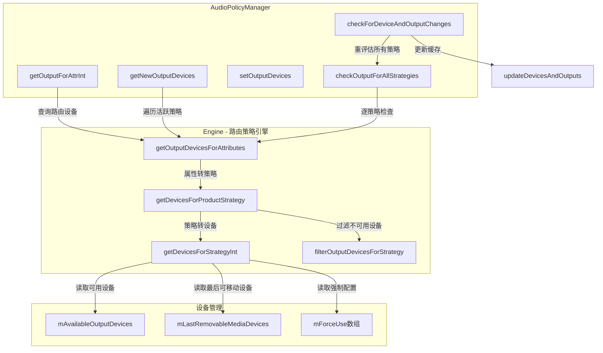

### 2. 路由决策入口：getOutputForAttrInt

当应用请求打开音频输出时，路由决策的入口是 [`getOutputForAttrInt()`](frameworks/av/services/audiopolicy/managerdefault/AudioPolicyManager.cpp:1147)。

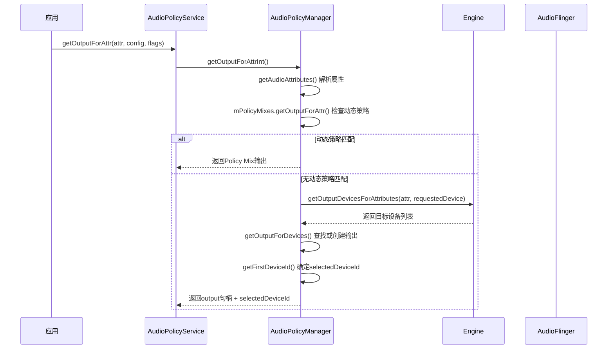

核心决策逻辑位于第1256行：

```cpp
// frameworks/av/services/audiopolicy/managerdefault/AudioPolicyManager.cpp:1256
outputDevices = mEngine->getOutputDevicesForAttributes(*resultAttr, requestedDevice, false);
```

此处将属性(`audio_attributes_t`)和显式请求设备传入Engine，由Engine返回路由决策结果。如果应用通过`setPreferredDevice`指定了设备（`requestedDevice != nullptr`），Engine会优先使用该设备。

### 3. Engine路由核心：getDevicesForProductStrategy

[`Engine::getOutputDevicesForAttributes()`](frameworks/av/services/audiopolicy/enginedefault/src/Engine.cpp:766) 是Engine的路由入口，其决策优先级如下：

| 优先级 | 决策层级 | 说明 |
|--------|---------|------|
| 1 | 显式路由 | `preferredDevice`不为空，直接返回 |
| 2 | 客户端首选设备 | `findPreferredDevice()`查找活跃客户端的setPreferredDevice |
| 3 | 缓存/实时计算 | `fromCache ? mDevicesForStrategies[strategy] : getDevicesForProductStrategy(strategy)` |

```cpp
// frameworks/av/services/audiopolicy/enginedefault/src/Engine.cpp:766-789
DeviceVector Engine::getOutputDevicesForAttributes(...) {
    if (preferredDevice != nullptr) {
        return DeviceVector(preferredDevice);          // 优先级1: 显式路由
    }
    sp<DeviceDescriptor> device = findPreferredDevice(outputs, strategy, availableOutputDevices);
    if (device != nullptr) {
        return DeviceVector(device);                   // 优先级2: 客户端首选
    }
    return fromCache ? mDevicesForStrategies.at(strategy)
                     : getDevicesForProductStrategy(strategy);  // 优先级3
}
```

[`getDevicesForProductStrategy()`](frameworks/av/services/audiopolicy/enginedefault/src/Engine.cpp:734) 执行四步处理：

1. **上下文重映射** — [`remapStrategyFromContext()`](frameworks/av/services/audiopolicy/enginedefault/src/Engine.cpp:230)：通话时MEDIA/DTMF/SONIFICATION策略重映射为PHONE
2. **设备过滤** — [`filterOutputDevicesForStrategy()`](frameworks/av/services/audiopolicy/enginedefault/src/Engine.cpp:149)：按策略类型排除不适用设备
3. **首选设备检查** — `getPreferredAvailableDevicesForProductStrategy()`：OEM通过`setDevicesRoleForStrategy()`设置的PREFERRED角色设备
4. **默认路由规则** — [`getDevicesForStrategyInt()`](frameworks/av/services/audiopolicy/enginedefault/src/Engine.cpp:271)：按legacy_strategy查表选择

### 4. Strategy→Device映射规则：getDevicesForStrategyInt

[`getDevicesForStrategyInt()`](frameworks/av/services/audiopolicy/enginedefault/src/Engine.cpp:271) 是路由策略的核心查表函数，根据`legacy_strategy`枚举值决定目标设备：

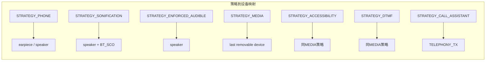

#### 4.1 STRATEGY_MEDIA 设备选择优先级

MEDIA策略是最复杂的，其设备选择流程（第353-458行）：

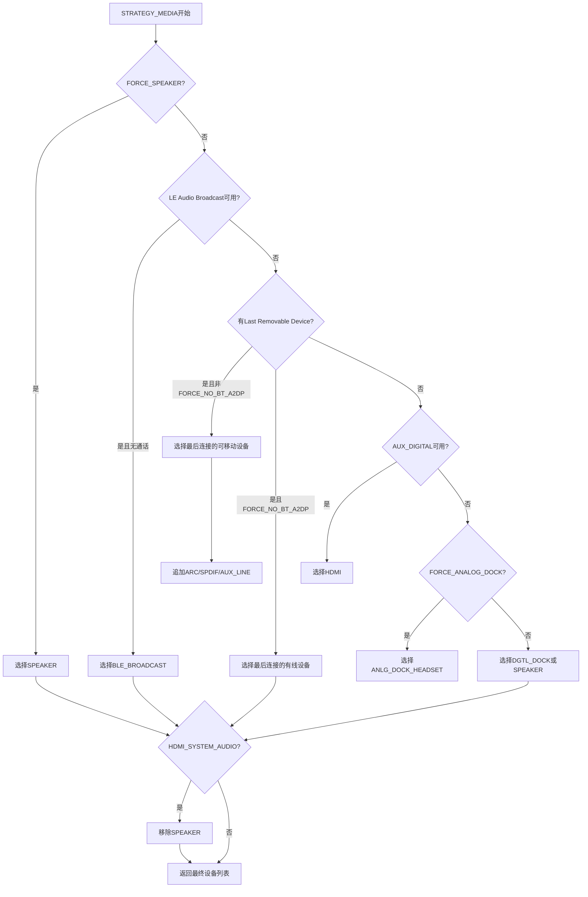

关键逻辑：`getLastRemovableMediaDevices()`返回按连接时间排序的可移动设备列表，最近连接的设备排在最前，实现"后连接优先"语义。

#### 4.2 STRATEGY_PHONE 设备选择

通话策略的设备优先级（第283-297行）：

```cpp
// frameworks/av/services/audiopolicy/enginedefault/src/Engine.cpp:286-296
devices = availableOutputDevices.getFirstDevicesFromTypes(
    getLastRemovableMediaDevices(GROUP_NONE, {
        AUDIO_DEVICE_OUT_HEARING_AID,      // 排除助听器
        AUDIO_DEVICE_OUT_BLE_HEADSET       // 排除LE Audio单播
    }));
if (!devices.isEmpty()) break;
devices = availableOutputDevices.getFirstDevicesFromTypes({
    AUDIO_DEVICE_OUT_DGTL_DOCK_HEADSET,   // 数字Dock
    AUDIO_DEVICE_OUT_EARPIECE,            // 听筒
    AUDIO_DEVICE_OUT_SPEAKER              // 扬声器
});
```

#### 4.3 上下文重映射：remapStrategyFromContext

[`remapStrategyFromContext()`](frameworks/av/services/audiopolicy/enginedefault/src/Engine.cpp:230) 在特定上下文下改变策略路由：

| 上下文 | 原始策略 | 重映射为 |
|--------|---------|---------|
| 通话中 | STRATEGY_MEDIA | STRATEGY_PHONE |
| 通话中 | STRATEGY_SONIFICATION | STRATEGY_PHONE |
| 通话中 | STRATEGY_DTMF | STRATEGY_PHONE |
| 通话中 | STRATEGY_ACCESSIBILITY | STRATEGY_PHONE |
| 通话中 | STRATEGY_SONIFICATION_RESPECTFUL | STRATEGY_PHONE |
| 非通话+VOICE_CALL活跃 | STRATEGY_SONIFICATION | STRATEGY_PHONE |
| 非通话+RING/ALARM活跃 | STRATEGY_ACCESSIBILITY | STRATEGY_SONIFICATION |

#### 4.4 设备过滤：filterOutputDevicesForStrategy

[`filterOutputDevicesForStrategy()`](frameworks/av/services/audiopolicy/enginedefault/src/Engine.cpp:149) 在路由计算前排除特定策略不应用的设备：

| 策略 | 过滤规则 |
|------|---------|
| STRATEGY_PHONE | 通话时移除A2DP设备（A2DP延迟不适合通话）；连接Dock时移除Speaker |
| STRATEGY_PHONE | 通话时限制仅使用Primary Output设备（HAL < 3.0时） |
| STRATEGY_SONIFICATION_RESPECTFUL | 非通话时移除REMOTE_SUBMIX |
| STRATEGY_ACCESSIBILITY | 移除当前正以压缩格式输出的数字设备（HDMI/SPDIF） |

### 5. 设备连接/断开：setDeviceConnectionStateInt

[`setDeviceConnectionStateInt()`](frameworks/av/services/audiopolicy/managerdefault/AudioPolicyManager.cpp:175) 是设备热插拔的核心处理函数。

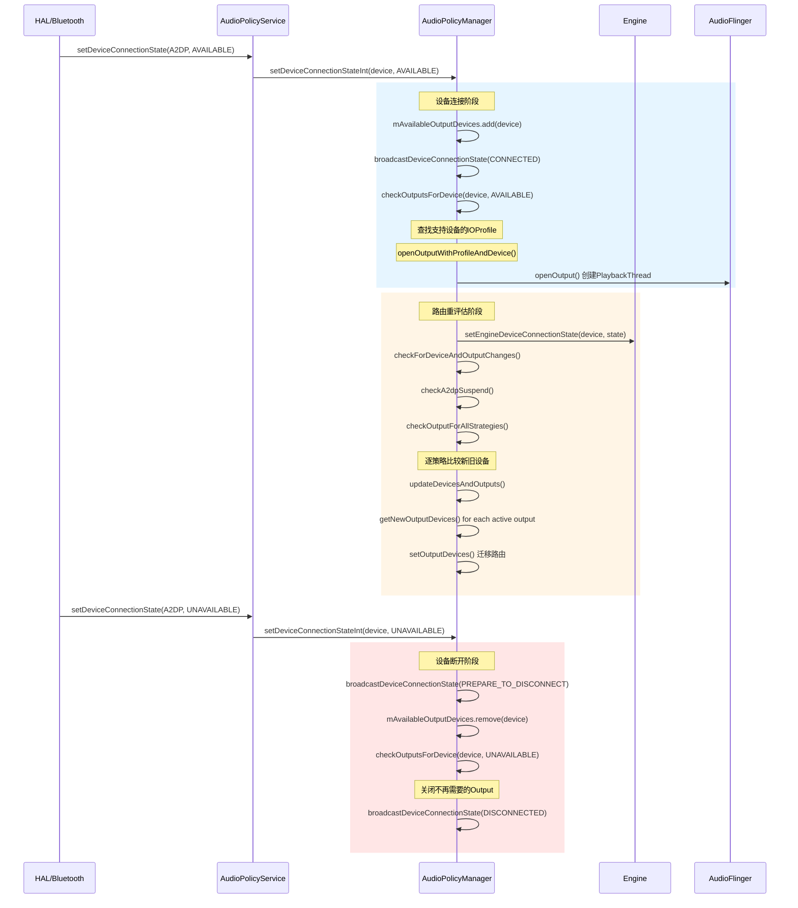

#### 5.1 连接流程详解

设备连接时（第193-227行）：

1. **注册可用设备** — `mAvailableOutputDevices.add(device)` 将设备加入可用列表
2. **广播连接事件** — `broadcastDeviceConnectionState(CONNECTED)` 通知HAL查询动态参数
3. **检查输出** — [`checkOutputsForDevice()`](frameworks/av/services/audiopolicy/managerdefault/AudioPolicyManager.cpp:6276) 查找或创建输出
4. **通知Engine** — `setEngineDeviceConnectionState(device, state)` 更新Engine的设备认知
5. **路由重评估** — `checkForDeviceAndOutputChanges()` 触发全策略路由刷新
6. **迁移活跃Track** — 遍历所有活跃输出，调用`getNewOutputDevices()` + `setOutputDevices()`

#### 5.2 断开流程详解

设备断开时（第229-260行）：

1. **预断开通知** — `broadcastDeviceConnectionState(PREPARE_TO_DISCONNECT)` 让HAL准备
2. **移除可用设备** — `mAvailableOutputDevices.remove(device)`
3. **清理会话路由** — `mOutputs.clearSessionRoutesForDevice(device)`
4. **检查输出** — `checkOutputsForDevice(device, UNAVAILABLE)` 识别需关闭的输出
5. **关闭无用输出** — 遍历outputs关闭断开设备专用的输出
6. **路由重评估** — 同连接流程

### 6. checkOutputsForDevice源码解析

[`checkOutputsForDevice()`](frameworks/av/services/audiopolicy/managerdefault/AudioPolicyManager.cpp:6276) 负责为新连接设备查找或创建输出，或在设备断开时识别需关闭的输出。

#### 6.1 设备连接时

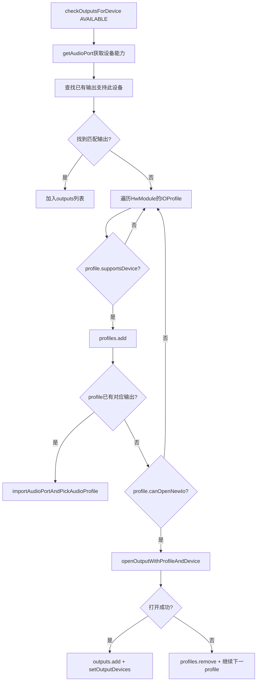

关键步骤：
- 第6298-6307行：遍历已有输出（`mOutputs`），检查是否支持新设备（`desc->supportsDevice(device)`）
- 第6309-6319行：遍历所有HwModule的IOProfile，查找支持该设备的输出配置
- 第6330-6381行：为匹配的Profile打开新输出，数字设备还会导入AudioProfile

#### 6.2 设备断开时

第6387-6401行的逻辑：遍历所有输出，如果某输出不再有任何可用设备支持（`!mAvailableOutputDevices.containsAtLeastOne(desc->supportedDevices())`），则将其标记为待关闭。

### 7. getNewOutputDevices：活跃输出的路由更新

[`getNewOutputDevices()`](frameworks/av/services/audiopolicy/managerdefault/AudioPolicyManager.cpp:7001) 在设备变化、Force Use变化等场景下，为活跃输出计算新的路由设备。

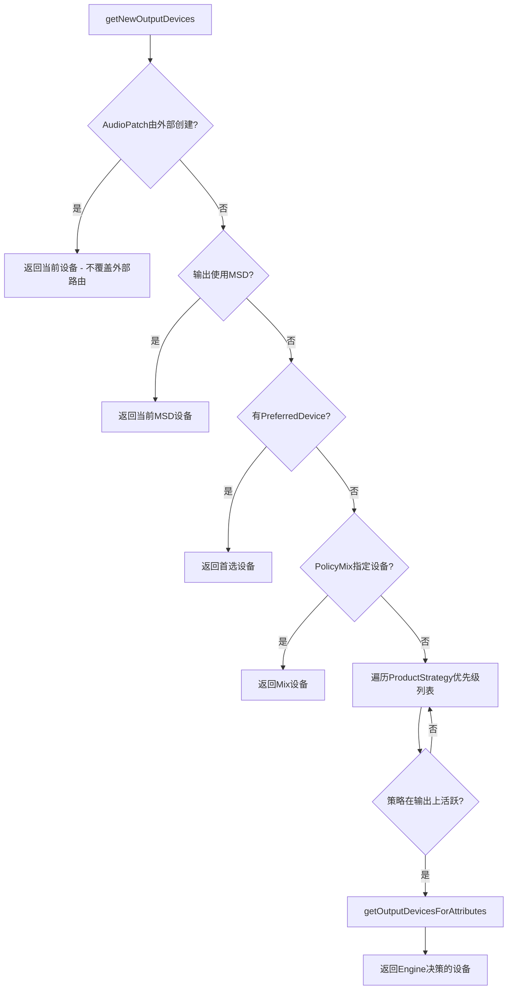

核心逻辑（第7038-7067行）：按照ProductStrategy的优先级顺序（通过`mEngine->getOrderedProductStrategies()`获取），找到第一个在当前输出上活跃的策略，然后通过Engine查询该策略应路由到哪些设备。

```cpp
// frameworks/av/services/audiopolicy/managerdefault/AudioPolicyManager.cpp:7038-7067
for (const auto &productStrategy : mEngine->getOrderedProductStrategies()) {
    StreamTypeVector streams = mEngine->getStreamTypesForProductStrategy(productStrategy);
    auto attr = mEngine->getAllAttributesForProductStrategy(productStrategy).front();
    if (doGetOutputDevicesForVoice() || outputDesc->isStrategyActive(productStrategy) || ...) {
        devices = mEngine->getOutputDevicesForAttributes(attr, nullptr, fromCache);
        break;
    }
}
```

### 8. Force Use机制

[`setForceUse()`](frameworks/av/services/audiopolicy/managerdefault/AudioPolicyManager.cpp:932) 允许系统临时覆盖默认路由规则。

#### 8.1 存储结构

Force Use配置存储在 [`EngineBase::mForceUse`](frameworks/av/services/audiopolicy/engine/common/include/EngineBase.h:205) 数组中：

```cpp
audio_policy_forced_cfg_t mForceUse[AUDIO_POLICY_FORCE_USE_CNT] = {};
```

`setForceUse` 的实现极其简洁（第42-46行）：

```cpp
// frameworks/av/services/audiopolicy/engine/common/include/EngineBase.h:42-46
status_t setForceUse(audio_policy_force_use_t usage, audio_policy_forced_cfg_t config) override {
    mForceUse[usage] = config;
    return NO_ERROR;
}
```

#### 8.2 Force Use触发路由重评估

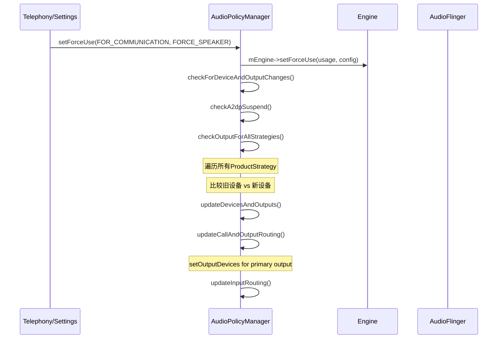

#### 8.3 Force Use对路由的影响

| Force Use | 强制配置 | 影响的策略 | 路由效果 |
|-----------|---------|-----------|---------|
| `FOR_COMMUNICATION` | `FORCE_SPEAKER` | PHONE | 通话强制扬声器输出 |
| `FOR_COMMUNICATION` | `FORCE_BT_SCO` | PHONE | 通话强制蓝牙SCO |
| `FOR_MEDIA` | `FORCE_SPEAKER` | MEDIA | 媒体强制扬声器(第366行) |
| `FOR_MEDIA` | `FORCE_HEADPHONES` | MEDIA | 媒体强制耳机 |
| `FOR_MEDIA` | `FORCE_NO_BT_A2DP` | MEDIA | 禁用A2DP，只用有线(第394行) |
| `FOR_SYSTEM` | `FORCE_SYSTEM_ENFORCED` | ENFORCED_AUDIBLE | 强制执行系统音 |
| `FOR_VIBRATE_RINGING` | `FORCE_BT_SCO` | SONIFICATION | 振动模式来电仅BT SCO |
| `FOR_DOCK` | `FORCE_ANALOG_DOCK` | MEDIA | 使用模拟Dock(第409行) |
| `FOR_HDMI_SYSTEM_AUDIO` | `FORCE_HDMI_SYSTEM_AUDIO_ENFORCED` | MEDIA | 移除Speaker(第433行) |

### 9. A2DP挂起/恢复机制

[`checkA2dpSuspend()`](frameworks/av/services/audiopolicy/managerdefault/AudioPolicyManager.cpp:6957) 管理A2DP输出的挂起与恢复。当SCO设备连接且处于通话/来电状态时，A2DP输出会被挂起以确保SCO通话质量。

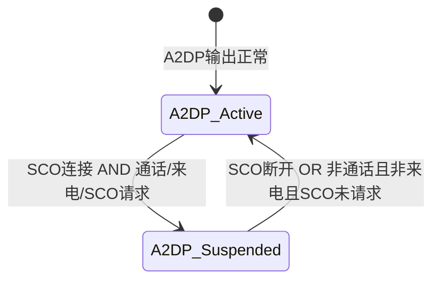

挂起/恢复逻辑（第6980-6998行）：

```cpp
// 挂起条件: SCO连接 AND (SCO请求 OR 通话中 OR 来电中)
if (isScoConnected && (isScoRequested || 
    (mEngine->getPhoneState() == AUDIO_MODE_IN_CALL) ||
    (mEngine->getPhoneState() == AUDIO_MODE_RINGTONE))) {
    mpClientInterface->suspendOutput(a2dpOutput);
    mA2dpSuspended = true;
}
// 恢复条件: SCO未连接 OR (SCO未请求 AND 非通话 AND 非来电)
if (!isScoConnected || (!isScoRequested &&
    (mEngine->getPhoneState() != AUDIO_MODE_IN_CALL) &&
    (mEngine->getPhoneState() != AUDIO_MODE_RINGTONE))) {
    mpClientInterface->restoreOutput(a2dpOutput);
    mA2dpSuspended = false;
}
```

**关键时序**：`checkA2dpSuspend()`必须在`checkOutputForAllStrategies()`之前执行（第6706行注释），确保A2DP输出在Track迁移前已被挂起，避免Track被错误迁移到已挂起的A2DP输出。

### 10. 路由迁移：Track如何迁移到新输出

当设备变化导致路由改变时，[`checkOutputForAttributes()`](frameworks/av/services/audiopolicy/managerdefault/AudioPolicyManager.cpp:6754) 负责将活跃Track从旧输出迁移到新输出。

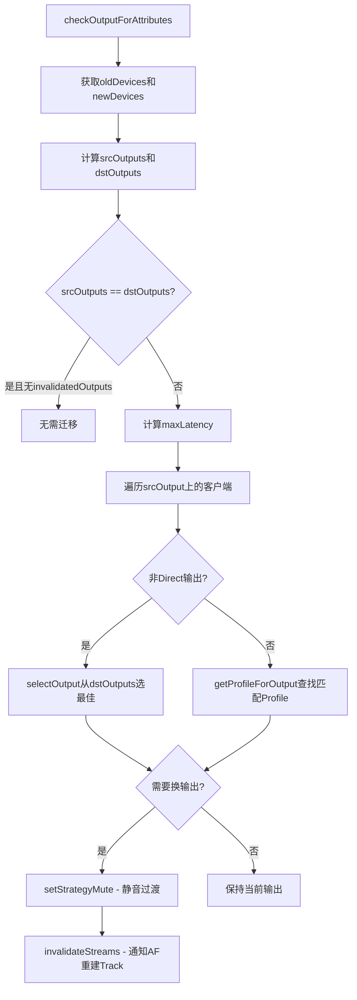

核心迁移逻辑（第6795-6860行）：

1. **比较新旧输出** — 通过`getOutputsForDevices()`获取新旧设备对应的输出列表
2. **静音过渡** — 对需要迁移的策略执行`setStrategyMute(true)`，等待`maxLatency * LATENCY_MUTE_FACTOR`后解除静音，确保旧缓冲区的音频已播完
3. **无效化流** — `invalidateStreams()`通知AudioFlinger重建Track，Track将重新调用`getOutputForAttrInt()`获取新的输出

```cpp
// frameworks/av/services/audiopolicy/managerdefault/AudioPolicyManager.cpp:6835-6860
if (invalidate) {
    invalidatedOutputs.push_back(desc);
    if (desc->isStrategyActive(psId)) {
        setStrategyMute(psId, true, desc);
        setStrategyMute(psId, false, desc, maxLatency * LATENCY_MUTE_FACTOR, newDevices.types());
    }
}
if (!invalidatedOutputs.empty()) {
    invalidateStreams(mEngine->getStreamTypesForProductStrategy(psId));
}
```

### 11. setOutputDevices：执行路由切换

[`setOutputDevices()`](frameworks/av/services/audiopolicy/managerdefault/AudioPolicyManager.cpp:7313) 是最终执行路由切换的函数，通过AudioPatch机制将输出连接到目标设备。

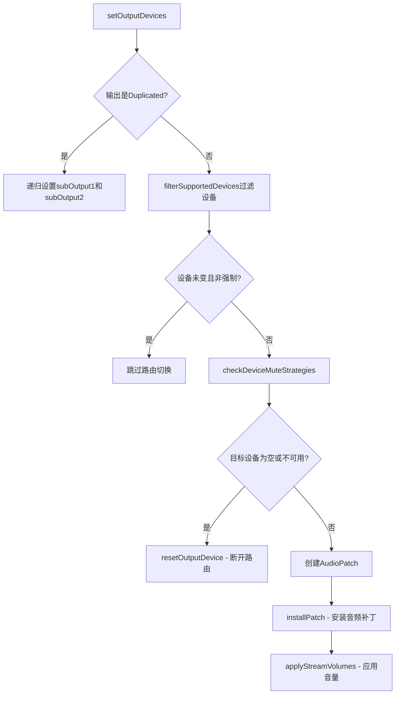

关键细节：
- **设备过滤**（第7333行）：`outputDesc->filterSupportedDevices(devices)` 确保只选择输出Profile支持的设备
- **静音检查**（第7345行）：`checkDeviceMuteStrategies()` 在多设备输出时，对不兼容策略进行静音
- **Patch安装**（第7394行）：`installPatch()` 通过AudioFlinger创建AudioPatch连接输出到设备
- **音量应用**（第7399行）：路由切换后立即应用新设备对应的音量

### 12. 设备可用性管理

#### 12.1 mAvailableOutputDevices / mAvailableInputDevices

[`mAvailableOutputDevices`](frameworks/av/services/audiopolicy/common/managerdefinitions/include/DeviceDescriptor.h:110) 是`DeviceVector`类型（继承自`SortedVector<sp<DeviceDescriptor>>`），维护当前所有已连接的可用输出设备。`DeviceVector`提供以下关键查询方法：

| 方法 | 说明 |
|------|------|
| `getDevice(type, address, codec)` | 按类型+地址+编码格式查找设备 |
| `getDeviceFromId(id)` | 按Port ID查找设备 |
| `getDevicesFromTypes(types)` | 按类型集合查找所有匹配设备 |
| `getFirstDevicesFromTypes(orderedTypes)` | 按优先级列表返回第一个匹配的设备 |
| `getDevicesFromDeviceTypeAddrVec(vec)` | 按`AudioDeviceTypeAddrVector`匹配设备 |
| `filter(devices)` | 返回两个集合的交集 |
| `containsAtLeastOne(devices)` | 判断是否至少包含一个指定设备 |

#### 12.2 LastRemovableMediaDevices

[`LastRemovableMediaDevices`](frameworks/av/services/audiopolicy/engine/common/include/LastRemovableMediaDevices.h:33) 维护按连接时间排序的可移动媒体设备列表（有线+蓝牙），实现"最近连接优先"的设备选择语义。

设备分组定义（[`getDeviceOutGroup()`](frameworks/av/services/audiopolicy/engine/common/src/LastRemovableMediaDevices.cpp:72)）：

| 分组 | 设备类型 |
|------|---------|
| `GROUP_WIRED` | WIRED_HEADPHONE, WIRED_HEADSET, USB_HEADSET, USB_DEVICE, DGTL_DOCK_HEADSET等 |
| `GROUP_BT_A2DP` | BLUETOOTH_A2DP, BLUETOOTH_A2DP_HEADPHONES, BLUETOOTH_A2DP_SPEAKER, HEARING_AID, BLE_HEADSET, BLE_SPEAKER, BLE_BROADCAST |

设备连接时插入列表头部（第34行），断开时从列表移除，保证`mMediaDevices[0]`始终是最近连接的可移动设备。

#### 12.3 AudioDeviceTypeAddr设备地址匹配

[`AudioDeviceTypeAddr`](frameworks/av/media/libaudiofoundation/include/media/AudioDeviceTypeAddr.h:32) 封装了设备类型(`mType`)和地址(`mAddress`)的组合标识，用于精确匹配设备。

```cpp
// frameworks/av/media/libaudiofoundation/include/media/AudioDeviceTypeAddr.h:65-68
audio_devices_t mType = AUDIO_DEVICE_NONE;
private:
    std::string mAddress;
    bool mIsAddressSensitive;
```

某些设备类型（如`AUDIO_DEVICE_OUT_REMOTE_SUBMIX`和`AUDIO_DEVICE_OUT_BUS`）需要通过地址区分同一类型的不同实例，由 [`device_distinguishes_on_address()`](frameworks/av/services/audiopolicy/common/include/policy.h:103) 判断。

`AudioDeviceTypeAddrVector` 用于OEM通过`setDevicesRoleForStrategy()`设置的PREFERRED/DISABLED设备列表，Engine通过`getDevicesFromDeviceTypeAddrVec()`从可用设备中匹配。

### 13. 路由决策完整流程总结

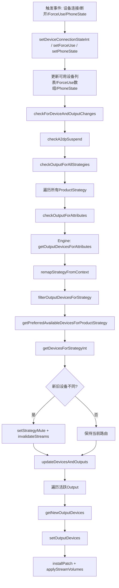

### 14. 关键数据结构关系

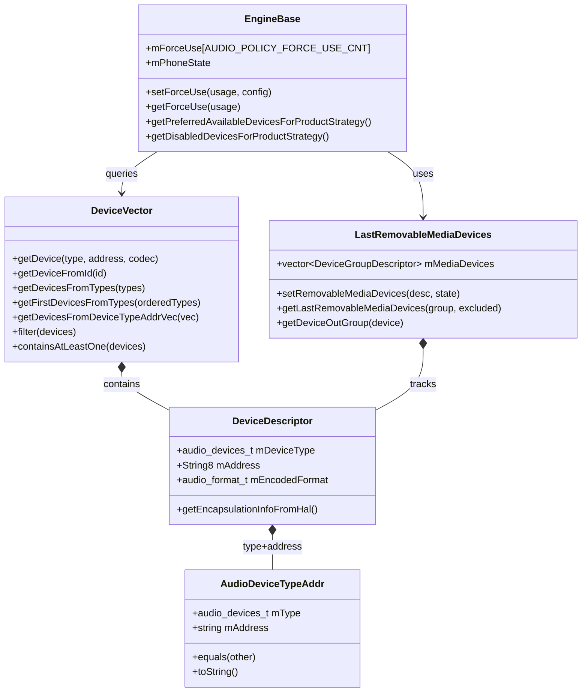

---

> [← 上一个](06_6.3_EngineBase-可插拔策略引擎.md) | [← 返回Audio Policy Engine](README.md) | [返回导航](../README.md) | [下一个 →](06_6.5_SwAudioOutputDescriptor-输出流描述.md)