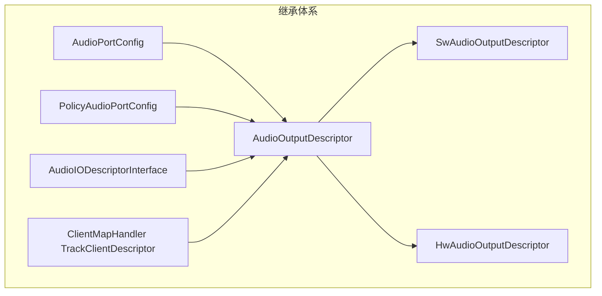
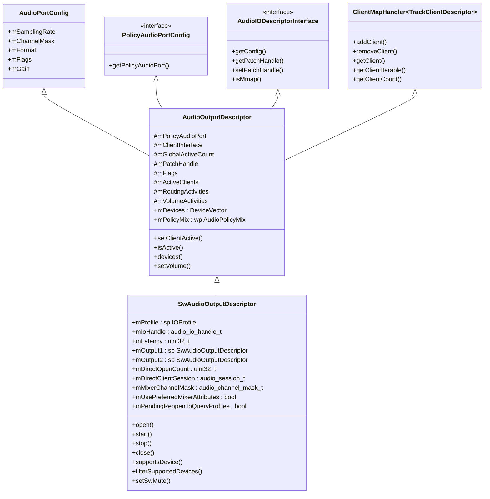
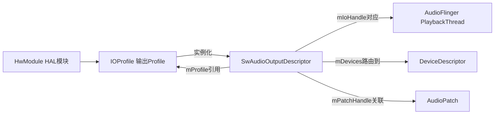
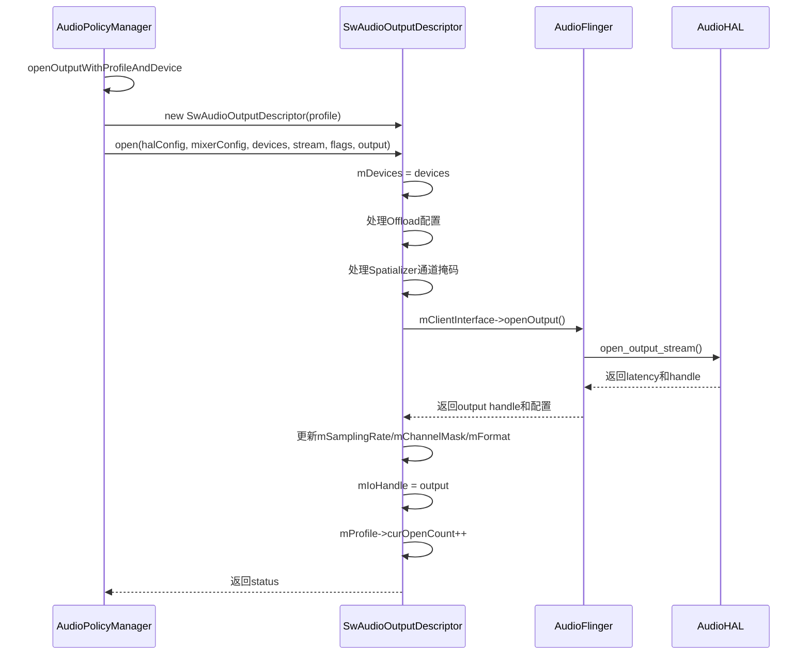
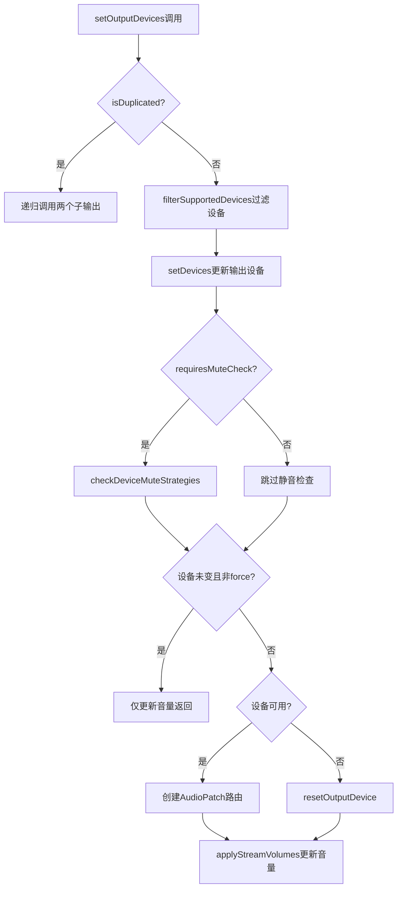
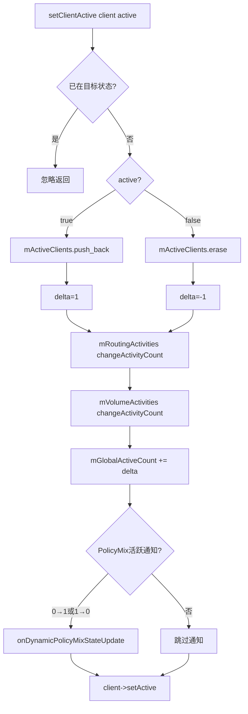
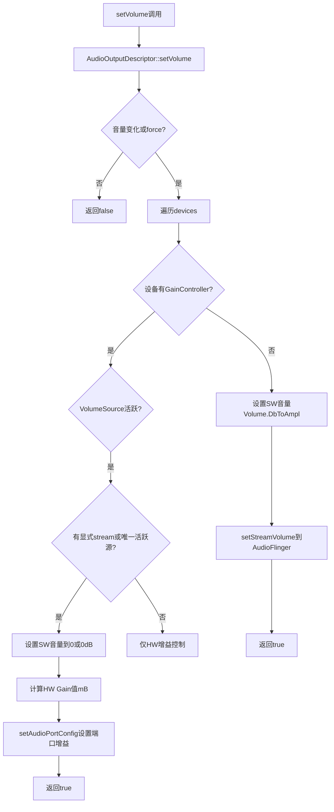
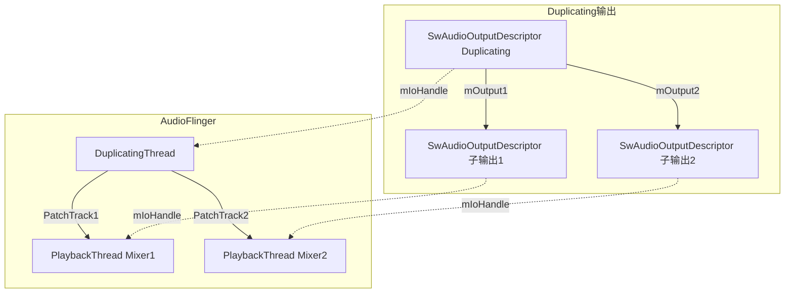
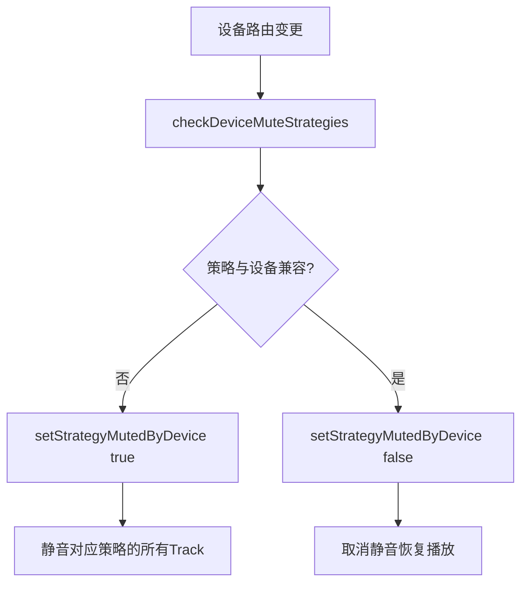
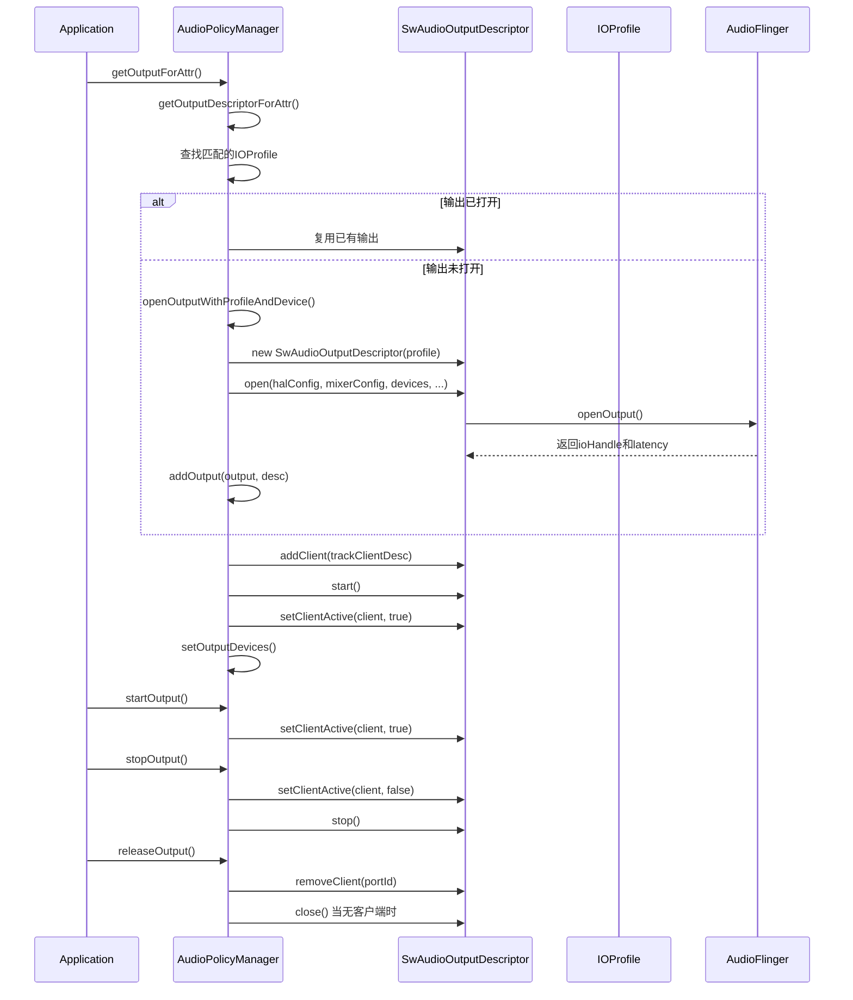

## 6.5 SwAudioOutputDescriptor — 输出流描述

[← 上一个](06_6.4_Device_Routing-设备路由.md) | [← 返回Audio Policy Engine](README.md) | [返回导航](../README.md) | [下一个 →](06_6.6_IOProfile与HwModule-HAL能力描述.md)

---

### 6.5.1 模块概述

`SwAudioOutputDescriptor` 是 Android Audio Policy Engine 中描述 **已打开的软件混音输出流** 的核心数据结构。其名称中的 "Sw" 代表 Software，意味着该输出由 AudioFlinger 中的软件混音器（PlaybackThread Mixer）驱动，区别于由硬件源直接驱动的 `HwAudioOutputDescriptor`。

每个 `SwAudioOutputDescriptor` 实例对应一个 AudioFlinger 中的 PlaybackThread，承载着从 IOProfile 实例化到输出流生命周期管理的完整职责：

- **从 Profile 到 Output 的桥梁**：`mProfile` 指向创建此输出的 IOProfile，继承其支持的设备/格式/采样率等 HAL 能力
- **活跃客户端管理**：通过 `ClientMapHandler<TrackClientDescriptor>` 跟踪所有 AudioTrack 客户端
- **音量与路由追踪**：通过 `mVolumeActivities` / `mRoutingActivities` 管理每个 VolumeSource 和 Strategy 的活动状态
- **设备路由描述**：`mDevices` 记录当前输出路由到的设备，与 AudioPatch 配合完成路由切换
- **Duplicating 输出支持**：通过 `mOutput1` / `mOutput2` 实现双输出复制



> 源码位置：
> - 头文件：[`AudioOutputDescriptor.h`](frameworks/av/services/audiopolicy/common/managerdefinitions/include/AudioOutputDescriptor.h)
> - 实现：[`AudioOutputDescriptor.cpp`](frameworks/av/services/audiopolicy/common/managerdefinitions/src/AudioOutputDescriptor.cpp)

---

### 6.5.2 类继承体系与关系

`SwAudioOutputDescriptor` 的继承关系非常丰富，体现了 Audio Policy 中端口配置、客户端管理、I/O 描述等多重职责的融合：



与 IOProfile / HwModule 的关系：



---

### 6.5.3 关键成员变量详解

#### 6.5.3.1 SwAudioOutputDescriptor 自有成员

| 成员变量 | 类型 | 说明 |
|----------|------|------|
| [`mProfile`](frameworks/av/services/audiopolicy/common/managerdefinitions/include/AudioOutputDescriptor.h:453) | `sp<IOProfile>` | 此输出派生自的 IOProfile，决定了支持的设备/格式/采样率范围 |
| [`mIoHandle`](frameworks/av/services/audiopolicy/common/managerdefinitions/include/AudioOutputDescriptor.h:454) | `audio_io_handle_t` | AudioFlinger 侧的输出句柄，对应 PlaybackThread 的唯一标识 |
| [`mLatency`](frameworks/av/services/audiopolicy/common/managerdefinitions/include/AudioOutputDescriptor.h:455) | `uint32_t` | 输出延迟（ms），由 HAL `openOutput` 返回 |
| [`mOutput1`](frameworks/av/services/audiopolicy/common/managerdefinitions/include/AudioOutputDescriptor.h:457) | `sp<SwAudioOutputDescriptor>` | Duplicating 输出的第一个子输出 |
| [`mOutput2`](frameworks/av/services/audiopolicy/common/managerdefinitions/include/AudioOutputDescriptor.h:458) | `sp<SwAudioOutputDescriptor>` | Duplicating 输出的第二个子输出 |
| [`mDirectOpenCount`](frameworks/av/services/audiopolicy/common/managerdefinitions/include/AudioOutputDescriptor.h:459) | `uint32_t` | Direct 输出的客户端打开计数，0 表示可关闭 |
| [`mDirectClientSession`](frameworks/av/services/audiopolicy/common/managerdefinitions/include/AudioOutputDescriptor.h:460) | `audio_session_t` | Direct 输出客户端的 session ID |
| [`mPendingReopenToQueryProfiles`](frameworks/av/services/audiopolicy/common/managerdefinitions/include/AudioOutputDescriptor.h:461) | `bool` | 标记需要重新打开以查询 Profile 信息 |
| [`mMixerChannelMask`](frameworks/av/services/audiopolicy/common/managerdefinitions/include/AudioOutputDescriptor.h:462) | `audio_channel_mask_t` | 混音器通道掩码，可能与 HAL 配置不同 |
| [`mUsePreferredMixerAttributes`](frameworks/av/services/audiopolicy/common/managerdefinitions/include/AudioOutputDescriptor.h:463) | `bool` | 是否使用首选混音属性 |

#### 6.5.3.2 继承自 AudioOutputDescriptor 的成员

| 成员变量 | 类型 | 说明 |
|----------|------|------|
| [`mDevices`](frameworks/av/services/audiopolicy/common/managerdefinitions/include/AudioOutputDescriptor.h:267) | `DeviceVector` | 当前路由到的设备列表，是路由管理的核心字段 |
| [`mPolicyMix`](frameworks/av/services/audiopolicy/common/managerdefinitions/include/AudioOutputDescriptor.h:268) | `wp<AudioPolicyMix>` | 动态策略 Mix 引用，非 NULL 时表示此输出被动态策略使用 |
| [`mPolicyAudioPort`](frameworks/av/services/audiopolicy/common/managerdefinitions/include/AudioOutputDescriptor.h:272) | `sp<PolicyAudioPort>` | 关联的策略音频端口，SwAudioOutput 中为 IOProfile |
| [`mClientInterface`](frameworks/av/services/audiopolicy/common/managerdefinitions/include/AudioOutputDescriptor.h:273) | `AudioPolicyClientInterface*` | 客户端接口，用于调用 AudioFlinger 命令 |
| [`mGlobalActiveCount`](frameworks/av/services/audiopolicy/common/managerdefinitions/include/AudioOutputDescriptor.h:274) | `uint32_t` | 全局活跃计数，所有客户端共享 |
| [`mPatchHandle`](frameworks/av/services/audiopolicy/common/managerdefinitions/include/AudioOutputDescriptor.h:275) | `audio_patch_handle_t` | 当前 AudioPatch 句柄，NONE 表示未路由 |
| [`mFlags`](frameworks/av/services/audiopolicy/common/managerdefinitions/include/AudioOutputDescriptor.h:276) | `audio_output_flags_t&` | 输出标志（DIRECT/FAST/OFFLOAD/PRIMARY等） |
| [`mActiveClients`](frameworks/av/services/audiopolicy/common/managerdefinitions/include/AudioOutputDescriptor.h:282) | `TrackClientVector` | 活跃客户端列表，含来自 Duplicating 线程的上游客户端 |
| [`mRoutingActivities`](frameworks/av/services/audiopolicy/common/managerdefinitions/include/AudioOutputDescriptor.h:284) | `RoutingActivities` | 按 Strategy 索引的路由活动追踪 |
| [`mVolumeActivities`](frameworks/av/services/audiopolicy/common/managerdefinitions/include/AudioOutputDescriptor.h:286) | `VolumeActivities` | 按 VolumeSource 索引的音量活动追踪 |

---

### 6.5.4 构造函数与初始化

[`SwAudioOutputDescriptor::SwAudioOutputDescriptor()`](frameworks/av/services/audiopolicy/common/managerdefinitions/src/AudioOutputDescriptor.cpp:318) 从 IOProfile 实例化输出描述符：

```cpp
// AudioOutputDescriptor.cpp:318-330
SwAudioOutputDescriptor::SwAudioOutputDescriptor(const sp<IOProfile>& profile,
                                                 AudioPolicyClientInterface *clientInterface)
    : AudioOutputDescriptor(profile, clientInterface),
    mProfile(profile), mIoHandle(AUDIO_IO_HANDLE_NONE), mLatency(0),
    mOutput1(0), mOutput2(0), mDirectOpenCount(0),
    mDirectClientSession(AUDIO_SESSION_NONE)
{
    if (profile != NULL) {
        // BIT_PERFECT标志默认不应用，需要App显式请求
        mFlags = (audio_output_flags_t)(profile->getFlags() & (~AUDIO_OUTPUT_FLAG_BIT_PERFECT));
    }
}
```

关键初始化逻辑：
1. **基类构造**：调用 `AudioOutputDescriptor(profile, clientInterface)`，将 profile 作为 `PolicyAudioPort` 传入
2. **Profile 采样率继承**：基类构造中调用 `mPolicyAudioPort->pickAudioProfile()` 选取默认采样率/通道/格式
3. **Flags 过滤**：从 Profile flags 中移除 `BIT_PERFECT`，该标志仅在 App 显式请求时才应用
4. **IoHandle 初始化**：`AUDIO_IO_HANDLE_NONE`，在 `open()` 成功后才被赋值

---

### 6.5.5 输出流生命周期：open / start / stop / close

#### 6.5.5.1 open() — 打开输出流

[`SwAudioOutputDescriptor::open()`](frameworks/av/services/audiopolicy/common/managerdefinitions/src/AudioOutputDescriptor.cpp:567) 是输出流创建的核心方法，由 APM 的 [`openOutputWithProfileAndDevice()`](frameworks/av/services/audiopolicy/managerdefault/AudioPolicyManager.cpp:8210) 调用：



open() 关键流程细节：

1. **设备设置**（[行574](frameworks/av/services/audiopolicy/common/managerdefinitions/src/AudioOutputDescriptor.cpp:574)）：`mDevices = devices`，立即记录目标设备
2. **Offload 信息填充**（[行593-601](frameworks/av/services/audiopolicy/common/managerdefinitions/src/AudioOutputDescriptor.cpp:593)）：若 Profile 标记为 `COMPRESS_OFFLOAD` 但未提供 offload_info，则自动构造
3. **Spatializer 5.1 默认**（[行617-620](frameworks/av/services/audiopolicy/common/managerdefinitions/src/AudioOutputDescriptor.cpp:617)）：若 flags 含 `SPATIALIZER` 且未指定 mixerConfig，则混音通道默认为 5.1
4. **实际打开**（[行625-631](frameworks/av/services/audiopolicy/common/managerdefinitions/src/AudioOutputDescriptor.cpp:625)）：通过 `mClientInterface->openOutput()` 请求 AudioFlinger 打开输出
5. **成功后更新**（[行633-646](frameworks/av/services/audiopolicy/common/managerdefinitions/src/AudioOutputDescriptor.cpp:633)）：更新采样率/格式/通道掩码/mixerChannelMask/mId/mIoHandle，递增 Profile 打开计数

#### 6.5.5.2 start() / stop() — 活跃计数管理

[`start()`](frameworks/av/services/audiopolicy/common/managerdefinitions/src/AudioOutputDescriptor.cpp:651) 和 [`stop()`](frameworks/av/services/audiopolicy/common/managerdefinitions/src/AudioOutputDescriptor.cpp:674) 管理 Profile 的活跃引用计数：

- `start()`：若输出当前不活跃，检查 `mProfile->canStartNewIo()` 后递增 `mProfile->curActiveCount`
- `stop()`：若输出不再活跃，递减 `mProfile->curActiveCount`
- Duplicating 输出会同时操作两个子输出

> 注意：`start()`/`stop()` 与 `setClientActive()` 配合使用。调用顺序为 `start()` → `setClientActive(true)` 和 `setClientActive(false)` → `stop()`

#### 6.5.5.3 close() — 关闭输出流

[`close()`](frameworks/av/services/audiopolicy/common/managerdefinitions/src/AudioOutputDescriptor.cpp:690) 完成输出流的完整关闭：

1. **清理活跃客户端**（[行695-702](frameworks/av/services/audiopolicy/common/managerdefinitions/src/AudioOutputDescriptor.cpp:695)）：遍历所有客户端，若有仍活跃的则强制停用
2. **通知 A2DP HAL**（[行706-708](frameworks/av/services/audiopolicy/common/managerdefinitions/src/AudioOutputDescriptor.cpp:706)）：发送 `closing=true` 参数
3. **关闭输出**（[行710](frameworks/av/services/audiopolicy/common/managerdefinitions/src/AudioOutputDescriptor.cpp:710)）：`mClientInterface->closeOutput(mIoHandle)`
4. **递减 Profile 计数**（[行712-714](frameworks/av/services/audiopolicy/common/managerdefinitions/src/AudioOutputDescriptor.cpp:712)）：`mProfile->curOpenCount--`
5. **重置 IoHandle**（[行715](frameworks/av/services/audiopolicy/common/managerdefinitions/src/AudioOutputDescriptor.cpp:715)）：`mIoHandle = AUDIO_IO_HANDLE_NONE`

---

### 6.5.6 设备路由管理

#### 6.5.6.1 devices() 与 setDevices()

[`SwAudioOutputDescriptor::devices()`](frameworks/av/services/audiopolicy/common/managerdefinitions/src/AudioOutputDescriptor.cpp:349) 对 Duplicating 输出做了特殊处理——返回两个子输出设备的并集：

```cpp
DeviceVector SwAudioOutputDescriptor::devices() const
{
    if (isDuplicated()) {
        DeviceVector devices = mOutput1->devices();
        devices.merge(mOutput2->devices());
        return devices;
    }
    return mDevices;
}
```

[`setDevices()`](frameworks/av/services/audiopolicy/common/managerdefinitions/include/AudioOutputDescriptor.h:349) 是直接设置 `mDevices` 的简单方法，由 APM 的 `setOutputDevices()` 在路由切换时调用。

#### 6.5.6.2 setOutputDevices() 路由切换流程

APM 的 [`setOutputDevices()`](frameworks/av/services/audiopolicy/managerdefault/AudioPolicyManager.cpp:7313) 是路由切换的核心入口，流程如下：



关键路由切换逻辑：

1. **设备过滤**（[行7333](frameworks/av/services/audiopolicy/managerdefault/AudioPolicyManager.cpp:7333)）：`filterSupportedDevices()` 按输出 Profile 支持的设备过滤目标设备
2. **设备设置**（[行7340](frameworks/av/services/audiopolicy/managerdefault/AudioPolicyManager.cpp:7340)）：`outputDesc->setDevices(filteredDevices)` 更新输出描述符的当前设备
3. **策略静音检查**（[行7345](frameworks/av/services/audiopolicy/managerdefault/AudioPolicyManager.cpp:7345)）：`checkDeviceMuteStrategies()` 处理不兼容设备导致的策略静音
4. **短路优化**（[行7369](frameworks/av/services/audiopolicy/managerdefault/AudioPolicyManager.cpp:7369)）：设备未变且非 force 时跳过路由，仅更新音量
5. **AudioPatch 安装**（[行7385-7395](frameworks/av/services/audiopolicy/managerdefault/AudioPolicyManager.cpp:7385)）：构建 Patch 并安装，延迟加入 muteWaitMs 以避免声音断裂
6. **音量更新**（[行7399](frameworks/av/services/audiopolicy/managerdefault/AudioPolicyManager.cpp:7399)）：`applyStreamVolumes()` 按新设备更新流音量

#### 6.5.6.3 supportedDevices() 与设备匹配

[`supportedDevices()`](frameworks/av/services/audiopolicy/common/managerdefinitions/src/AudioOutputDescriptor.cpp:372) 返回此输出支持的所有设备。对于普通输出，直接委托给 `mProfile->getSupportedDevices()`；对于 Duplicating 输出，返回两个子输出支持设备的并集。

设备匹配相关方法：

| 方法 | 说明 |
|------|------|
| [`supportsDevice()`](frameworks/av/services/audiopolicy/common/managerdefinitions/src/AudioOutputDescriptor.cpp:382) | 检查单个设备是否被支持（Bus/RemoteSubmix 需匹配地址） |
| [`supportsAllDevices()`](frameworks/av/services/audiopolicy/common/managerdefinitions/src/AudioOutputDescriptor.cpp:387) | 检查设备向量是否全部被支持 |
| [`supportsDevicesForPlayback()`](frameworks/av/services/audiopolicy/common/managerdefinitions/src/AudioOutputDescriptor.cpp:392) | 检查设备组合是否可用于播放（Duplicating 输出返回 false） |
| [`filterSupportedDevices()`](frameworks/av/services/audiopolicy/common/managerdefinitions/src/AudioOutputDescriptor.cpp:399) | 从给定设备列表中过滤出此输出支持的设备 |
| [`devicesSupportEncodedFormats()`](frameworks/av/services/audiopolicy/common/managerdefinitions/src/AudioOutputDescriptor.cpp:405) | 检查设备是否支持编码格式透传 |

---

### 6.5.7 活跃客户端（Track）管理

#### 6.5.7.1 客户端数据结构

AudioTrack 客户端通过 [`TrackClientDescriptor`](frameworks/av/services/audiopolicy/common/managerdefinitions/include/ClientDescriptor.h:101) 描述，包含以下关键信息：

| 字段 | 类型 | 说明 |
|------|------|------|
| `mStream` | `audio_stream_type_t` | 音频流类型 |
| `mStrategy` | `product_strategy_t` | 产品策略 ID |
| `mVolumeSource` | `VolumeSource` | 音量来源 ID |
| `mFlags` | `audio_output_flags_t` | 客户端输出标志 |
| `mSecondaryOutputs` | `vector<wp<SwAudioOutputDescriptor>>` | 次要输出列表 |
| `mPrimaryMix` | `wp<AudioPolicyMix>` | 主 Mix 引用 |
| `mActivityCount` | `uint32_t` | 活跃计数（Duplicating 线程需要） |
| `mIsInvalid` | `bool` | 标记客户端需要重连 |

#### 6.5.7.2 setClientActive() 活跃状态变更

[`AudioOutputDescriptor::setClientActive()`](frameworks/av/services/audiopolicy/common/managerdefinitions/src/AudioOutputDescriptor.cpp:91) 是客户端活跃状态管理的核心：



SwAudioOutputDescriptor 的 [`setClientActive()`](frameworks/av/services/audiopolicy/common/managerdefinitions/src/AudioOutputDescriptor.cpp:434) 覆写增加了 Duplicating 输出支持：若 `isDuplicated()`，则同时转发到 `mOutput1` 和 `mOutput2`。

关键计数器联动：
- **mRoutingActivities[strategy].mActivityCount**：按策略统计活跃 Track 数
- **mVolumeActivities[volumeSource].mActivityCount**：按音量源统计活跃 Track 数
- **mGlobalActiveCount**：全局活跃计数，用于判断输出是否活跃

#### 6.5.7.3 客户端列表查询

[`clientsList()`](frameworks/av/services/audiopolicy/common/managerdefinitions/src/AudioOutputDescriptor.cpp:226) 支持按条件过滤客户端：

```cpp
TrackClientVector AudioOutputDescriptor::clientsList(bool activeOnly,
                                                      product_strategy_t strategy,
                                                      bool preferredDeviceOnly) const
```

- `activeOnly=true`：仅返回活跃客户端
- `strategy != PRODUCT_STRATEGY_NONE`：仅返回指定策略的客户端
- `preferredDeviceOnly=true`：仅返回有首选设备（非独占）的客户端

---

### 6.5.8 音量管理

#### 6.5.8.1 VolumeActivities 与 RoutingActivities

`AudioOutputDescriptor` 内部维护两个 Activity 追踪映射：

```
VolumeActivities = std::map<VolumeSource, VolumeActivity>
RoutingActivities = std::map<product_strategy_t, RoutingActivity>
```

**VolumeActivity** 继承自 [`ActivityTracking`](frameworks/av/services/audiopolicy/common/managerdefinitions/include/AudioOutputDescriptor.h:32)，额外包含：
- `mMuteCount`：静音请求计数
- `mCurVolumeDb`：当前音量（dB 值）

**RoutingActivity** 继承自 `ActivityTracking`，额外包含：
- `mIsMutedByDevice`：因设备不兼容被静音的标志

#### 6.5.8.2 setVolume() 软硬件音量决策

[`SwAudioOutputDescriptor::setVolume()`](frameworks/av/services/audiopolicy/common/managerdefinitions/src/AudioOutputDescriptor.cpp:504) 实现了软硬件音量的决策逻辑：



**关键决策**：
1. **HW Gain 优先**：若设备有增益控制器（`hasGainController(true)`），优先使用硬件增益
2. **SW 音量辅助**：HW Gain 场景下，SW 音量设为 0 或满增益（0dB），避免双重衰减
3. **多 VolumeSource 冲突**：当多个 VolumeSource 活跃时，仅显式关联 stream 的源可做 SW 静音

#### 6.5.8.3 setSwMute() 软件静音

[`setSwMute()`](frameworks/av/services/audiopolicy/common/managerdefinitions/src/AudioOutputDescriptor.cpp:483) 专门用于 HW Gain 设备上的软件静音控制。当输出路由到有 HW Gain 的设备，且有多个 VolumeSource 活跃时，需要单独对某个 VolumeSource 做软件静音：

```cpp
void SwAudioOutputDescriptor::setSwMute(bool muted, VolumeSource vs,
    const StreamTypeVector &streamTypes, const DeviceTypeSet& deviceTypes, uint32_t delayMs)
{
    if (!streamTypes.empty() && isActive(vs) && (getActiveVolumeSources().size() > 1)) {
        // 仅当多个活跃源时才需要SW静音
        float volumeAmpl = muted ? 0.0f : Volume::DbToAmpl(0);
        for (const auto &stream : streamTypes) {
            mClientInterface->setStreamVolume(stream, volumeAmpl, mIoHandle, delayMs);
        }
    }
}
```

---

### 6.5.9 Duplicating 输出机制

Duplicating 输出是 Android 音频策略中实现同时双路输出的机制（如扬声器+A2DP同时播放）。



**Duplicating 输出的特征**：
- `isDuplicated()` 返回 `true`（`mOutput1 != NULL && mOutput2 != NULL`）
- `devices()` 返回两子输出设备的并集
- `supportedDevices()` 返回两子输出支持设备的并集
- `latency()` 取两子输出延迟的最大值
- `setClientActive()` 同时转发到两子输出
- `openDuplicating()` 通过 `openDuplicateOutput()` 在 AudioFlinger 创建 DuplicatingThread

[`openDuplicating()`](frameworks/av/services/audiopolicy/common/managerdefinitions/src/AudioOutputDescriptor.cpp:719) 实现：

```cpp
status_t SwAudioOutputDescriptor::openDuplicating(
    const sp<SwAudioOutputDescriptor>& output1,
    const sp<SwAudioOutputDescriptor>& output2,
    audio_io_handle_t *ioHandle)
{
    *ioHandle = mClientInterface->openDuplicateOutput(output2->mIoHandle, output1->mIoHandle);
    // ... 初始化mOutput1, mOutput2, 继承output2的配置
}
```

---

### 6.5.10 与 AudioFlinger PlaybackThread 的对应

每个 `SwAudioOutputDescriptor` 通过 `mIoHandle` 与 AudioFlinger 中的 PlaybackThread 一一对应：

| SwAudioOutputDescriptor | AudioFlinger PlaybackThread | 特征 |
|------------------------|----------------------------|------|
| mFlags 含 PRIMARY | MixerThread (Primary) | 主输出，系统音效/提示音 |
| mFlags 含 FAST | MixerThread (Fast) | 低延迟输出，触控反馈音 |
| mFlags 含 DIRECT | DirectOutputThread | 直通输出，不经过混音器 |
| mFlags 含 COMPRESS_OFFLOAD | OffloadThread | 硬件解码输出 |
| mFlags 含 MMAP_NOIRQ | MmapPlaybackThread | 低延迟 MMAP 输出 |
| mFlags 含 SPATIALIZER | SpatializerThread | 空间音频输出 |
| isDuplicated() | DuplicatingThread | 双路复制输出 |

**配置匹配**：[`isConfigurationMatched()`](frameworks/av/services/audiopolicy/common/managerdefinitions/src/AudioOutputDescriptor.cpp:963) 用于判断输出是否匹配指定配置：

```cpp
bool SwAudioOutputDescriptor::isConfigurationMatched(
    const audio_config_base_t &config, audio_output_flags_t flags) {
    const uint32_t mustMatchOutputFlags =
        AUDIO_OUTPUT_FLAG_DIRECT|AUDIO_OUTPUT_FLAG_HW_AV_SYNC|AUDIO_OUTPUT_FLAG_MMAP_NOIRQ;
    return audio_output_flags_is_subset(mFlags, flags, mustMatchOutputFlags)
        && mSamplingRate == config.sample_rate
        && mChannelMask == config.channel_mask
        && mFormat == config.format;
}
```

必须精确匹配的标志：DIRECT、HW_AV_SYNC、MMAP_NOIRQ，这些标志决定了 AudioFlinger 的线程类型。

---

### 6.5.11 SwAudioOutputCollection 输出集合

[`SwAudioOutputCollection`](frameworks/av/services/audiopolicy/common/managerdefinitions/include/AudioOutputDescriptor.h:481) 是所有已打开软件输出的集合，以 `audio_io_handle_t` 为键：

| 方法 | 说明 |
|------|------|
| [`isActive()`](frameworks/av/services/audiopolicy/common/managerdefinitions/src/AudioOutputDescriptor.cpp:804) | 检查指定 VolumeSource 是否有任何输出活跃 |
| [`isActiveLocally()`](frameworks/av/services/audiopolicy/common/managerdefinitions/src/AudioOutputDescriptor.cpp:816) | 排除远程设备（RemoteSubmix/TelephonyTX）的活跃检测 |
| [`isActiveRemotely()`](frameworks/av/services/audiopolicy/common/managerdefinitions/src/AudioOutputDescriptor.cpp:832) | 仅检测远程设备上的活跃状态 |
| [`isStrategyActiveOnSameModule()`](frameworks/av/services/audiopolicy/common/managerdefinitions/src/AudioOutputDescriptor.cpp:849) | 同一 HwModule 上是否有策略活跃（用于并发控制） |
| [`getA2dpOutput()`](frameworks/av/services/audiopolicy/common/managerdefinitions/src/AudioOutputDescriptor.cpp:877) | 获取 A2DP 输出句柄 |
| [`getPrimaryOutput()`](frameworks/av/services/audiopolicy/common/managerdefinitions/src/AudioOutputDescriptor.cpp:907) | 获取 PRIMARY 标志的输出 |
| [`clearSessionRoutesForDevice()`](frameworks/av/services/audiopolicy/common/managerdefinitions/src/AudioOutputDescriptor.cpp:940) | 设备断开时清理会话路由 |

---

### 6.5.12 策略静音与设备不兼容处理

当策略被路由到不兼容的设备时（如媒体策略被路由到 TELEPHONY_TX），`RoutingActivity::mIsMutedByDevice` 标记被设置为 true。这一机制由 APM 的 `checkDeviceMuteStrategies()` 驱动：



相关 API：
- [`isStrategyMutedByDevice()`](frameworks/av/services/audiopolicy/common/managerdefinitions/include/AudioOutputDescriptor.h:227)：查询策略是否因设备不兼容被静音
- [`setStrategyMutedByDevice()`](frameworks/av/services/audiopolicy/common/managerdefinitions/include/AudioOutputDescriptor.h:231)：设置策略的设备静音状态
- [`setTracksInvalidatedStatusByStrategy()`](frameworks/av/services/audiopolicy/common/managerdefinitions/src/AudioOutputDescriptor.cpp:752)：将指定策略的所有客户端标记为无效，触发重连

---

### 6.5.13 isFixedVolume() 固定音量场景

[`SwAudioOutputDescriptor::isFixedVolume()`](frameworks/av/services/audiopolicy/common/managerdefinitions/src/AudioOutputDescriptor.cpp:444) 在两种场景下返回 true：

1. **RemoteSubmix 重路由**：输出路由到 `AUDIO_DEVICE_OUT_REMOTE_SUBMIX` 且关联了 `mPolicyMix`，表示为外部策略重路由，使用最大增益
2. **TelephonyTX**：输出路由到 `AUDIO_DEVICE_OUT_TELEPHONY_TX`，电话线路固定增益

固定音量意味着 APM 不会对此输出做音量调节，由目标端自行控制。

---

### 6.5.14 Profile 引用计数管理

`SwAudioOutputDescriptor` 通过 `mProfile` 指针与 IOProfile 形成强关联，Profile 内部维护两个计数器：

| 计数器 | 说明 |
|--------|------|
| `curOpenCount` | 当前打开的输出实例数，open()递增，close()递减 |
| `curActiveCount` | 当前活跃的输出实例数，start()递增，stop()递减 |

这两个计数器在 [`canStartNewIo()`](frameworks/av/services/audiopolicy/common/managerdefinitions/include/IOProfile.h) 中用于并发控制——当 Profile 已被占用且不允许并发打开时（如 Direct 输出），新的打开请求会被拒绝。

---

### 6.5.15 从 IOProfile 实例化到输出的完整时序



---

### 6.5.16 小结

`SwAudioOutputDescriptor` 是 Audio Policy Engine 中连接 IOProfile（HAL 能力描述）与 AudioFlinger（实际输出线程）的核心桥梁。其设计要点：

1. **Profile 实例化**：从 IOProfile 创建，继承其设备/格式/采样率支持能力
2. **客户端管理**：通过 ClientMapHandler 管理所有 TrackClientDescriptor，活跃计数联动路由和音量追踪
3. **音量决策**：在 HW Gain 和 SW Volume 之间智能选择，多 VolumeSource 场景下支持单独 SW 静音
4. **路由管理**：配合 APM 的 setOutputDevices() 完成 AudioPatch 创建与设备切换
5. **Duplicating 支持**：双路输出通过 mOutput1/mOutput2 委托实现
6. **生命周期**：open → start → setClientActive → stop → close 完整管理

[← 上一个](06_6.4_Device_Routing-设备路由.md) | [← 返回Audio Policy Engine](README.md) | [返回导航](../README.md) | [下一个 →](06_6.6_IOProfile与HwModule-HAL能力描述.md)