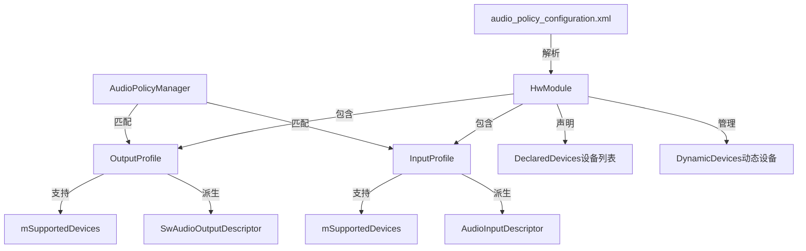
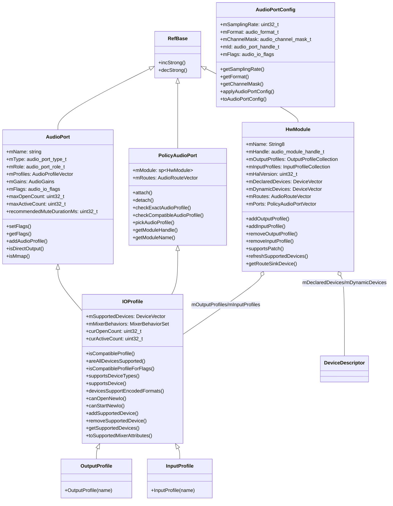
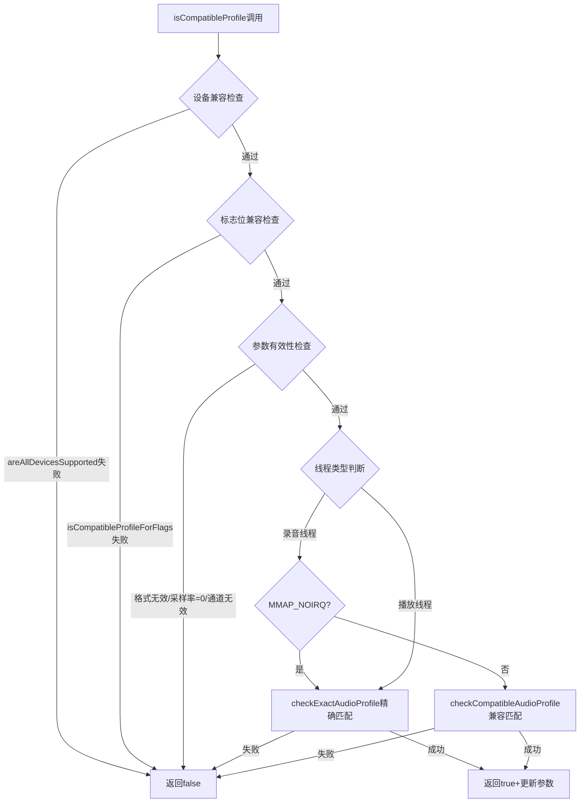
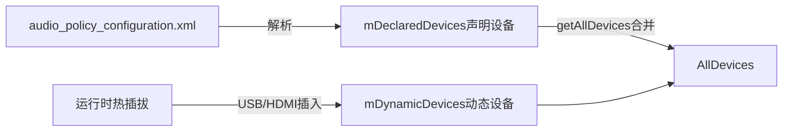
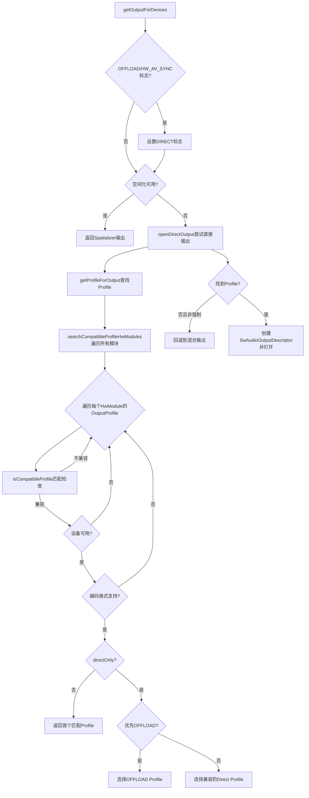
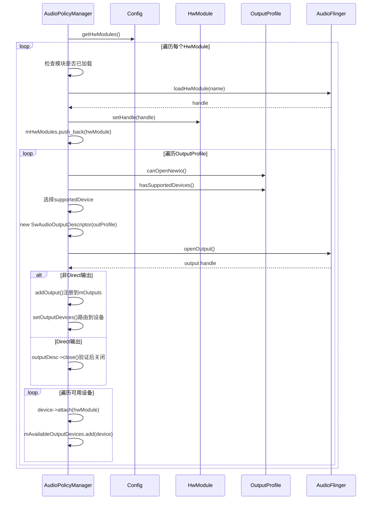
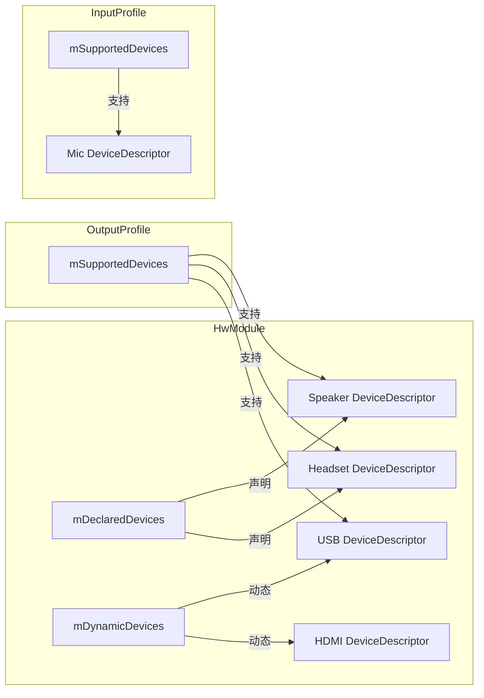
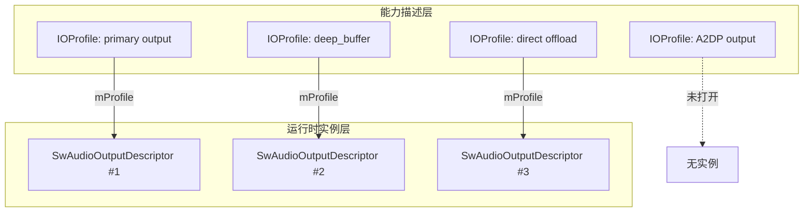

## 6.6 IOProfile与HwModule — HAL能力描述

[← 上一个](06_6.5_SwAudioOutputDescriptor-输出流描述.md) | [← 返回Audio Policy Engine](README.md) | [返回导航](../README.md) | [下一个 →](06_6.7_Focus_Policy-外部焦点策略.md)

---

### 1. 模块概述与职责

在Audio Policy Engine中，**IOProfile**和**HwModule**是描述HAL层音频能力的关键数据结构。它们回答了一个核心问题：**当前系统中的音频硬件能做什么？**

- **IOProfile** 描述一个HAL输出/输入流的能力集合，包括支持的采样率、格式、通道掩码、设备列表和标志位。它是Audio Policy Manager进行路由决策时匹配"请求参数 vs 硬件能力"的核心依据
- **HwModule** 代表一个Audio HAL模块（如primary、a2dp、usb），是IOProfile和DeviceDescriptor的容器，管理模块内所有输入/输出Profile及路由关系
- **AudioPort/AudioPortConfig** 是IOProfile的基类体系，提供端口名称、类型、角色、AudioProfile等通用能力描述

三者关系可概括为：**HwModule是模块容器 → 包含多个IOProfile → IOProfile继承AudioPort描述具体流能力**。



---

### 2. 类继承体系

IOProfile采用多重继承，同时继承`AudioPort`（能力描述）和`PolicyAudioPort`（策略管理），形成了完整的能力+策略双重描述：



**继承要点**：
- `IOProfile`多重继承`AudioPort`和`PolicyAudioPort`，前者提供音频格式/采样率/通道等能力描述，后者提供模块关联、路由查询、Profile匹配等策略功能
- `OutputProfile`/`InputProfile`只是IOProfile的角色特化子类，分别设置`AUDIO_PORT_ROLE_SOURCE`和`AUDIO_PORT_ROLE_SINK`，无额外成员
- `AudioPortConfig`是运行时配置基类，描述端口的**当前**配置（采样率/格式/通道掩码），与AudioPort的**能力**描述互补

---

### 3. IOProfile源码深度解析

#### 3.1 核心成员变量

IOProfile在AudioPort基础上增加了以下关键成员：

| 成员 | 类型 | 定义位置 | 说明 |
|------|------|---------|------|
| `mSupportedDevices` | `DeviceVector` | [`IOProfile.h`](frameworks/av/services/audiopolicy/common/managerdefinitions/include/IOProfile.h:200) | 该Profile支持的路由设备列表，由`HwModule::refreshSupportedDevices()`根据路由表填充 |
| `mMixerBehaviors` | `MixerBehaviorSet` | [`IOProfile.h`](frameworks/av/services/audiopolicy/common/managerdefinitions/include/IOProfile.h:202) | 混音器行为集合，如`AUDIO_MIXER_BEHAVIOR_DEFAULT`和`AUDIO_MIXER_BEHAVIOR_BIT_PERFECT` |
| `curOpenCount` | `uint32_t` | [`IOProfile.h`](frameworks/av/services/audiopolicy/common/managerdefinitions/include/IOProfile.h:192) | 当前已打开的流数量（运行时计数器） |
| `curActiveCount` | `uint32_t` | [`IOProfile.h`](frameworks/av/services/audiopolicy/common/managerdefinitions/include/IOProfile.h:195) | 当前活跃的HAL流数量 |

继承自AudioPort的关键成员：

| 成员 | 类型 | 说明 |
|------|------|------|
| `mProfiles` | `AudioProfileVector` | 支持的音频Profile列表（格式+采样率+通道掩码组合） |
| `mFlags` | `audio_io_flags` | 输入/输出标志位（DIRECT、OFFLOAD、MMAP_NOIRQ等） |
| `maxOpenCount` | `uint32_t` | 最大可同时打开的流数，0=无限制，默认输出=1，输入=0 |
| `maxActiveCount` | `uint32_t` | 最大可同时活跃的流数，0=无限制，默认输出=0，输入=1 |
| `recommendedMuteDurationMs` | `uint32_t` | 切换设备时的静音时长（毫秒） |

#### 3.2 构造函数与角色初始化

```cpp
// IOProfile.cpp:30-35
IOProfile::IOProfile(const std::string &name, audio_port_role_t role)
        : AudioPort(name, AUDIO_PORT_TYPE_MIX, role),
          curOpenCount(0),
          curActiveCount(0) {
    if (role == AUDIO_PORT_ROLE_SOURCE) {
        mMixerBehaviors.insert(AUDIO_MIXER_BEHAVIOR_DEFAULT);
    }
}
```

- 构造时固定`mType = AUDIO_PORT_TYPE_MIX`，因为IOProfile描述的是Mix端口（流端口）
- `OutputProfile`角色为`AUDIO_PORT_ROLE_SOURCE`（数据源），`InputProfile`角色为`AUDIO_PORT_ROLE_SINK`（数据汇）
- 仅输出Profile初始化`mMixerBehaviors`为`AUDIO_MIXER_BEHAVIOR_DEFAULT`

#### 3.3 setFlags()与MixerBehavior联动

[`IOProfile::setFlags()`](frameworks/av/services/audiopolicy/common/managerdefinitions/include/IOProfile.h:50) 在设置标志位时有特殊联动逻辑：

```cpp
void setFlags(uint32_t flags) override {
    AudioPort::setFlags(flags);
    // MMAP_NOIRQ输入流：maxActiveCount设为0(无限制)
    if (getRole() == AUDIO_PORT_ROLE_SINK && (flags & AUDIO_INPUT_FLAG_MMAP_NOIRQ) != 0) {
        maxActiveCount = 0;
    }
    // 输出流：根据BIT_PERFECT标志更新MixerBehavior
    if (getRole() == AUDIO_PORT_ROLE_SOURCE) {
        mMixerBehaviors.clear();
        mMixerBehaviors.insert(AUDIO_MIXER_BEHAVIOR_DEFAULT);
        if (mFlags.output & AUDIO_OUTPUT_FLAG_BIT_PERFECT) {
            mMixerBehaviors.insert(AUDIO_MIXER_BEHAVIOR_BIT_PERFECT);
        }
    }
}
```

**设计意图**：MMAP_NOIRQ输入流可被同一应用的多个客户端共享，因此不限制活跃数；BIT_PERFECT输出流需要支持bit-perfect混音行为，在标志位变更时动态更新。

#### 3.4 isCompatibleProfile()匹配算法详解

[`isCompatibleProfile()`](frameworks/av/services/audiopolicy/common/managerdefinitions/src/IOProfile.cpp:38) 是IOProfile最核心的方法，用于判断一个IOProfile是否与请求参数兼容。该算法用于输入流和直接输出流匹配：



**匹配算法分三步**：

**步骤1：设备兼容检查**
```cpp
// IOProfile.cpp:56-58
if (!areAllDevicesSupported(devices) ||
        !isCompatibleProfileForFlags(flags, exactMatchRequiredForInputFlags)) {
    return false;
}
```
[`areAllDevicesSupported()`](frameworks/av/services/audiopolicy/common/managerdefinitions/src/IOProfile.cpp:98) 检查请求的所有设备是否都在`mSupportedDevices`列表中。

**步骤2：标志位兼容检查**
[`isCompatibleProfileForFlags()`](frameworks/av/services/audiopolicy/common/managerdefinitions/src/IOProfile.cpp:103) 根据播放/录音线程类型进行不同匹配：
- **播放线程**：使用`audio_output_flags_is_subset()`检查，要求DIRECT、HW_AV_SYNC、MMAP_NOIRQ标志必须匹配
- **录音线程**：允许FAST标志不匹配（fast流兼容normal请求，反之亦然），除非`exactMatchRequiredForInputFlags=true`

```cpp
// 输出标志必须匹配的子集
const uint32_t mustMatchOutputFlags =
        AUDIO_OUTPUT_FLAG_DIRECT|AUDIO_OUTPUT_FLAG_HW_AV_SYNC|AUDIO_OUTPUT_FLAG_MMAP_NOIRQ;
```

**步骤3：音频Profile匹配**
- **播放线程（直接输出）**：调用`checkExactAudioProfile()`要求**精确匹配**采样率/格式/通道掩码
- **录音线程**：非MMAP时调用`checkCompatibleAudioProfile()`允许**兼容匹配**（可降级采样率/格式）；MMAP_NOIRQ时仍需精确匹配

---

### 4. HwModule源码深度解析

#### 4.1 核心成员变量

[`HwModule`](frameworks/av/services/audiopolicy/common/managerdefinitions/include/HwModule.h:72) 代表一个Audio HAL模块：

| 成员 | 类型 | 说明 |
|------|------|------|
| `mName` | `String8` | 模块名称，如"primary"、"a2dp"、"usb"、"stub"、"r_submix"、"hearing_aid" |
| `mHandle` | `audio_module_handle_t` | AudioFlinger分配的模块句柄 |
| `mOutputProfiles` | `OutputProfileCollection` | 输出Profile列表 |
| `mInputProfiles` | `InputProfileCollection` | 输入Profile列表 |
| `mHalVersion` | `uint32_t` | HAL版本号，高8位=主版本，低8位=次版本 |
| `mDeclaredDevices` | `DeviceVector` | XML配置文件中声明的设备列表 |
| `mDynamicDevices` | `DeviceVector` | 运行时动态添加的设备（如USB、HDMI） |
| `mRoutes` | `AudioRouteVector` | 模块内路由表 |
| `mPorts` | `PolicyAudioPortVector` | 所有策略端口（含IOProfile和DevicePort） |

#### 4.2 模块类型与HAL库路径

HwModule的`mName`直接对应Audio HAL库的命名约定：

| 模块名称 | HAL库路径 | 说明 |
|----------|----------|------|
| `primary` | `audio.primary.<ro.board.platform>.so` | 主音频模块，必须存在，处理本地音频设备 |
| `a2dp` | `audio.a2dp.default.so` | 蓝牙A2DP模块，处理蓝牙音频输出 |
| `usb` | `audio.usb.default.so` | USB音频模块，处理USB声卡 |
| `r_submix` | `audio.r_submix.default.so` | 远程子混音模块，用于屏幕录制/Audio Sharing |
| `stub` | `audio.stub.default.so` | 桩模块，无实际硬件支持 |
| `hearing_aid` | `audio.hearing_aid.default.so` | 助听器模块 |

HAL版本号编码为`(major << 8) | minor`，通过[`setHalVersion()`](frameworks/av/services/audiopolicy/common/managerdefinitions/include/HwModule.h:97)设置。

#### 4.3 DeviceDescriptor管理

HwModule管理两类设备列表：



- **mDeclaredDevices**：XML静态声明的设备，模块生命周期内不变
- **mDynamicDevices**：运行时动态添加/移除的设备，通过[`addDynamicDevice()`](frameworks/av/services/audiopolicy/common/managerdefinitions/include/HwModule.h:83)/[`removeDynamicDevice()`](frameworks/av/services/audiopolicy/common/managerdefinitions/include/HwModule.h:88)管理
- [`getAllDevices()`](frameworks/av/services/audiopolicy/common/managerdefinitions/include/HwModule.h:79) 合并两个列表返回完整设备集

#### 4.4 IOProfile动态添加/移除

HwModule提供Profile的动态管理接口，用于处理A2DP、USB等热插拔场景：

**添加OutputProfile**（[`addOutputProfile()`](frameworks/av/services/audiopolicy/common/managerdefinitions/src/HwModule.cpp:53)）：
```cpp
status_t HwModule::addOutputProfile(const std::string& name, const audio_config_t *config,
                                    audio_devices_t device, const String8& address) {
    sp<IOProfile> profile = new OutputProfile(name);
    profile->addAudioProfile(new AudioProfile(config->format, config->channel_mask,
                                              config->sample_rate));
    sp<DeviceDescriptor> devDesc = new DeviceDescriptor(device, getTagForDevice(device), address.string());
    addDynamicDevice(devDesc);
    devDesc->attach(this);
    profile->addSupportedDevice(devDesc);
    return addOutputProfile(profile);
}
```

**移除OutputProfile**（[`removeOutputProfile()`](frameworks/av/services/audiopolicy/common/managerdefinitions/src/HwModule.cpp:85)）：
- 遍历`mOutputProfiles`按名称匹配
- 移除Profile关联的动态设备
- 从列表中删除Profile

#### 4.5 路由表与refreshSupportedDevices()

[`setRoutes()`](frameworks/av/services/audiopolicy/common/managerdefinitions/src/HwModule.cpp:162) 在设置路由表后调用`refreshSupportedDevices()`，根据路由关系反向填充IOProfile的`mSupportedDevices`：

```cpp
void HwModule::refreshSupportedDevices() {
    // 输入Profile：路由的源设备 → 输入Profile的mSupportedDevices
    for (const auto& stream : mInputProfiles) {
        for (const auto& route : stream->getRoutes()) {
            DeviceVector sourceDevicesForRoute = getRouteSourceDevices(route);
            sourceDevices.add(sourceDevicesForRoute);
        }
        stream->setSupportedDevices(sourceDevices);
    }
    // 输出Profile：路由的汇设备 → 输出Profile的mSupportedDevices
    for (const auto& stream : mOutputProfiles) {
        for (const auto& route : stream->getRoutes()) {
            sp<DeviceDescriptor> sinkDevice = getRouteSinkDevice(route);
            sinkDevices.add(sinkDevice);
        }
        stream->setSupportedDevices(sinkDevices);
    }
}
```

**关键逻辑**：XML中的`<route>`标签定义了流到设备的路由关系，`refreshSupportedDevices()`将这些关系转换为IOProfile的`mSupportedDevices`列表，使得后续匹配时只需检查该列表即可判断路由可达性。

#### 4.6 supportsPatch()路由可达性检查

[`supportsPatch()`](frameworks/av/services/audiopolicy/common/managerdefinitions/src/HwModule.cpp:175) 检查两个端口之间的音频Patch是否被当前模块支持：

```cpp
bool HwModule::supportsPatch(const sp<PolicyAudioPort> &srcPort,
                             const sp<PolicyAudioPort> &dstPort) const {
    for (const auto &route : mRoutes) {
        if (route->supportsPatch(srcPort, dstPort)) {
            return true;
        }
    }
    return false;
}
```

---

### 5. AudioPort/AudioPortConfig基类

#### 5.1 AudioPort — 端口能力描述

[`AudioPort`](frameworks/av/media/libaudiofoundation/include/media/AudioPort.h:36) 是所有音频端口的基类，定义了端口的通用能力：

| 成员 | 类型 | 说明 |
|------|------|------|
| `mName` | `std::string` | 端口名称，对应XML中`<mixPort>`或`<devicePort>`的name属性 |
| `mType` | `audio_port_type_t` | 端口类型：MIX(流)或DEVICE(设备) |
| `mRole` | `audio_port_role_t` | 端口角色：SOURCE(源)或SINK(汇) |
| `mProfiles` | `AudioProfileVector` | 支持的音频Profile列表（格式+采样率+通道掩码） |
| `mGains` | `AudioGains` | 增益控制器列表 |
| `mFlags` | `audio_io_flags` | 标志位（输出/输入共用union） |
| `maxOpenCount` | `uint32_t` | 最大同时打开流数（0=无限制） |
| `maxActiveCount` | `uint32_t` | 最大同时活跃流数（0=无限制） |
| `recommendedMuteDurationMs` | `uint32_t` | 设备切换推荐静音时长 |

**重要工具方法**：
- [`isDirectOutput()`](frameworks/av/media/libaudiofoundation/include/media/AudioPort.h:133)：判断是否为直接输出（MIX+SOURCE+DIRECT标志）
- [`isMmap()`](frameworks/av/media/libaudiofoundation/include/media/AudioPort.h:137)：判断是否为MMAP端口
- [`useInputChannelMask()`](frameworks/av/media/libaudiofoundation/include/media/AudioPort.h:127)：判断是否使用输入通道掩码

**端口类型与角色的组合**：

| mType | mRole | 含义 | 示例 |
|-------|-------|------|------|
| MIX | SOURCE | 输出流端口 | OutputProfile |
| MIX | SINK | 输入流端口 | InputProfile |
| DEVICE | SOURCE | 输入设备端口 | 麦克风DevicePort |
| DEVICE | SINK | 输出设备端口 | 扬声器DevicePort |

#### 5.2 AudioPortConfig — 端口运行时配置

[`AudioPortConfig`](frameworks/av/media/libaudiofoundation/include/media/AudioPort.h:165) 描述端口的**当前配置**，与AudioPort描述**能力**形成互补：

| 成员 | 类型 | 说明 |
|------|------|------|
| `mSamplingRate` | `uint32_t` | 当前采样率 |
| `mFormat` | `audio_format_t` | 当前音频格式 |
| `mChannelMask` | `audio_channel_mask_t` | 当前通道掩码 |
| `mId` | `audio_port_handle_t` | 端口配置ID |
| `mFlags` | `audio_io_flags` | 当前标志位 |
| `mGain` | `audio_gain_config` | 当前增益配置 |

#### 5.3 PolicyAudioPort — 策略端口扩展

[`PolicyAudioPort`](frameworks/av/services/audiopolicy/common/managerdefinitions/include/PolicyAudioPort.h:37) 为AudioPort添加策略层功能：

| 成员/方法 | 说明 |
|-----------|------|
| `mModule` | 关联的HwModule指针 |
| `mRoutes` | 涉及此端口的路由列表 |
| `attach()/detach()` | 将端口关联/断开与HwModule |
| `checkExactAudioProfile()` | 精确Profile匹配检查 |
| `checkCompatibleAudioProfile()` | 兼容Profile匹配检查（可降级） |
| `pickAudioProfile()` | 从支持的Profile中选择最佳匹配 |

---

### 6. IOProfile在路由决策中的应用

#### 6.1 getOutputForDevices()中的Profile匹配

[`getOutputForDevices()`](frameworks/av/services/audiopolicy/managerdefault/AudioPolicyManager.cpp:1522) 是APM路由输出的核心方法，其Profile匹配流程如下：



#### 6.2 searchCompatibleProfileHwModules()详解

[`searchCompatibleProfileHwModules()`](frameworks/av/services/audiopolicy/managerdefault/AudioPolicyManager.cpp:1027) 是Profile搜索的核心实现，遍历所有HwModule的所有OutputProfile进行匹配：

```cpp
sp<IOProfile> AudioPolicyManager::searchCompatibleProfileHwModules(
        const HwModuleCollection& hwModules, const DeviceVector& devices,
        uint32_t samplingRate, audio_format_t format,
        audio_channel_mask_t channelMask, audio_output_flags_t flags,
        bool directOnly) {
    sp<IOProfile> profile;
    for (const auto& hwModule : hwModules) {
        for (const auto& curProfile : hwModule->getOutputProfiles()) {
            // 1. 调用isCompatibleProfile进行能力匹配
            if (!curProfile->isCompatibleProfile(devices,
                    samplingRate, NULL, format, NULL, channelMask, NULL, flags)) {
                continue;
            }
            // 2. 检查设备当前是否可用
            if (!mAvailableOutputDevices.containsAtLeastOne(curProfile->getSupportedDevices())) {
                continue;
            }
            // 3. 检查编码格式支持
            if (!curProfile->devicesSupportEncodedFormats(devices.types())) {
                continue;
            }
            // 4. 非directOnly时返回首个匹配
            if (!directOnly) {
               return curProfile;
            }
            // 5. directOnly时优先选择OFFLOAD Profile
            if (profile != 0 &&
                ((curProfile->getFlags() & AUDIO_OUTPUT_FLAG_COMPRESS_OFFLOAD) == 0)) {
               continue;
            }
            profile = curProfile;
            if ((profile->getFlags() & AUDIO_OUTPUT_FLAG_COMPRESS_OFFLOAD) != 0) {
               break;
            }
        }
    }
    return profile;
}
```

**匹配三级过滤**：
1. **能力过滤**：`isCompatibleProfile()`检查设备、标志位、音频参数是否兼容
2. **可用性过滤**：Profile支持的设备中至少有一个当前可用
3. **编码格式过滤**：设备支持请求的编码格式

**directOnly优先级**：当搜索直接输出时，如果多个Profile兼容，优先选择具有`AUDIO_OUTPUT_FLAG_COMPRESS_OFFLOAD`的Profile。

#### 6.3 openDirectOutput()中的Profile使用

[`openDirectOutput()`](frameworks/av/services/audiopolicy/managerdefault/AudioPolicyManager.cpp:1424) 获取到Profile后的处理：

1. **复用检查**：遍历已有输出，如果相同Profile且参数匹配则复用
2. **容量检查**：`profile->canOpenNewIo()`检查是否还能打开新流
3. **创建描述符**：`new SwAudioOutputDescriptor(profile, mpClientInterface)`以Profile为模板创建运行时描述符
4. **打开输出**：`outputDesc->open()`实际打开HAL输出流
5. **参数验证**：检查打开后的实际参数是否与请求一致

---

### 7. IOProfile的动态更新机制

#### 7.1 onNewAudioModulesAvailable()模块加载

[`onNewAudioModulesAvailable()`](frameworks/av/services/audiopolicy/managerdefault/AudioPolicyManager.cpp:6086) 在系统启动或HAL模块热加载时调用，负责将配置中的HwModule逐一加载并打开其Profile对应的输出/输入流：



**关键步骤**（[`onNewAudioModulesAvailableInt()`](frameworks/av/services/audiopolicy/managerdefault/AudioPolicyManager.cpp:6096)）：

1. 遍历配置中的所有HwModule，跳过已加载的
2. 调用`mpClientInterface->loadHwModule()`加载HAL模块获取句柄
3. 将模块加入`mHwModules`集合
4. **打开输出流**：
   - 检查`canOpenNewIo()`和`hasSupportedDevices()`
   - 选择Profile支持的第一个可用设备
   - 创建`SwAudioOutputDescriptor`并打开
   - Direct输出仅用于验证设备可用性，打开后立即关闭
   - 非Direct输出注册到`mOutputs`并设置路由
5. **打开输入流**：类似逻辑，验证输入设备可用性
6. 检测Primary输出：首个带`AUDIO_OUTPUT_FLAG_PRIMARY`的输出成为`mPrimaryOutput`

#### 7.2 HwModuleCollection动态设备管理

[`HwModuleCollection`](frameworks/av/services/audiopolicy/common/managerdefinitions/include/HwModule.h:127) 管理所有HwModule，提供动态设备创建和清理：

**创建动态设备**（[`createDevice()`](frameworks/av/services/audiopolicy/common/managerdefinitions/src/HwModule.cpp:312)）：
```cpp
sp<DeviceDescriptor> HwModuleCollection::createDevice(...) {
    sp<HwModule> hwModule = getModuleForDeviceType(type, encodedFormat, &tagName);
    sp<DeviceDescriptor> device = new DeviceDescriptor(type, tagName, address);
    device->setDynamic();
    hwModule->addDynamicDevice(device);
    device->attach(hwModule);
    // 将设备添加到所有支持该类型的Profile
    for (const auto &profile : profiles) {
        if (profile->supportsDevice(device, false /*matchAddress*/)) {
            device->importAudioPortAndPickAudioProfile(isoTypeDeviceForProfile, true);
            profile->addSupportedDevice(device);
        }
    }
    return device;
}
```

**清理动态设备**（[`cleanUpForDevice()`](frameworks/av/services/audiopolicy/common/managerdefinitions/src/HwModule.cpp:362)）：
- 从模块的动态设备列表移除
- 从所有支持该设备的Profile中移除
- 调用`device->detach()`断开与模块的关联

#### 7.3 DeviceDescriptor与IOProfile的关联

DeviceDescriptor与IOProfile通过`mSupportedDevices`和`mDeclaredDevices`形成双向关联：



**关联建立方式**：
1. **静态关联**：`HwModule::refreshSupportedDevices()`根据`<route>`标签，将声明设备添加到Profile的`mSupportedDevices`
2. **动态关联**：`HwModuleCollection::createDevice()`将新设备添加到支持该类型的Profile

**设备匹配规则**（[`supportsDevice()`](frameworks/av/services/audiopolicy/common/managerdefinitions/include/IOProfile.h:129)）：
- 对于`bus`和`remote_submix`类型：需同时匹配type和address
- 对于其他类型：仅需匹配type

---

### 8. IOProfile与SwAudioOutputDescriptor的关系

IOProfile是**能力模板**，SwAudioOutputDescriptor是**运行时实例**，两者是模板-实例关系：



| 维度 | IOProfile | SwAudioOutputDescriptor |
|------|-----------|------------------------|
| 定义 | 能力描述（能做什么） | 运行时状态（正在做什么） |
| 生命周期 | 配置加载后始终存在 | 打开输出时创建，关闭时销毁 |
| 来源 | XML解析生成 | `new SwAudioOutputDescriptor(profile, ...)` |
| 设备信息 | `mSupportedDevices`支持的所有设备 | 当前路由的具体设备 |
| 音频参数 | `mProfiles`支持的所有参数组合 | 当前使用的具体采样率/格式/通道 |
| 打开计数 | `maxOpenCount`/`curOpenCount`限制 | `mDirectOpenCount`直接输出引用计数 |
| 多实例 | 一个Profile可打开多个Descriptor | 每个Descriptor关联唯一Profile |

**核心关联代码**（[`AudioOutputDescriptor.h`](frameworks/av/services/audiopolicy/common/managerdefinitions/include/AudioOutputDescriptor.h:451)）：
```cpp
const sp<IOProfile> mProfile;  // I/O profile this output derives from
```

SwAudioOutputDescriptor通过`mProfile`指针回溯到IOProfile获取能力信息，实现能力查询和限制检查。

---

### 9. 关键设计总结

#### 9.1 能力与实例分离

IOProfile/HwModule描述**静态能力**，SwAudioOutputDescriptor描述**动态状态**。这种分离使得：
- 能力查询不需要打开实际流
- 同一个Profile可复用于多个运行时实例
- 设备热插拔时只需更新Profile的支持设备列表

#### 9.2 路由驱动的设备关联

IOProfile的`mSupportedDevices`不是静态配置，而是由`HwModule::refreshSupportedDevices()`根据`<route>`标签动态计算。这意味着：
- 路由表是Profile与设备关联的唯一真相来源
- 修改路由表即可改变Profile的设备支持
- 动态设备（USB/HDMI）通过`addSupportedDevice()`扩展Profile能力

#### 9.3 三级匹配过滤

APM的Profile匹配采用三级过滤：设备兼容 → 标志位兼容 → 音频参数兼容。这种设计确保：
- 先排除不支持目标设备的Profile（快速过滤）
- 再排除标志位不匹配的Profile（语义过滤）
- 最后进行精确/兼容的音频参数匹配（细粒度匹配）

#### 9.4 直接输出的特殊处理

直接输出（Direct Output）的Profile匹配有额外规则：
- 必须**精确匹配**音频参数（采样率/格式/通道掩码）
- 优先选择OFFLOAD能力的Profile
- 打开后可通过`canOpenNewIo()`控制并发数
- 相同Profile+参数的直接输出可被复用

#### 9.5 动态模块与设备的热插拔

HwModule和IOProfile的设计完整支持热插拔：
- `HwModuleCollection::createDevice()`创建动态设备并关联到Profile
- `HwModuleCollection::cleanUpForDevice()`清理断开设备的所有关联
- `HwModule::addOutputProfile()`/`removeOutputProfile()`动态添加/移除Profile
- `onNewAudioModulesAvailable()`在模块加载时自动打开并验证Profile

---

[← 上一个](06_6.5_SwAudioOutputDescriptor-输出流描述.md) | [← 返回Audio Policy Engine](README.md) | [返回导航](../README.md) | [下一个 →](06_6.7_Focus_Policy-外部焦点策略.md)