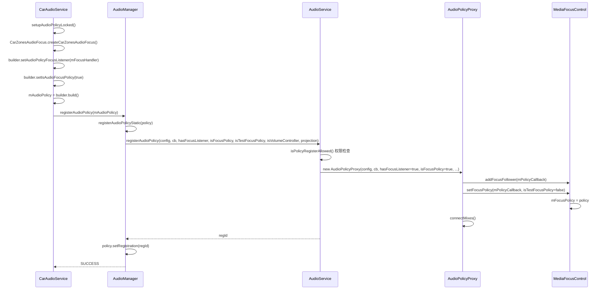
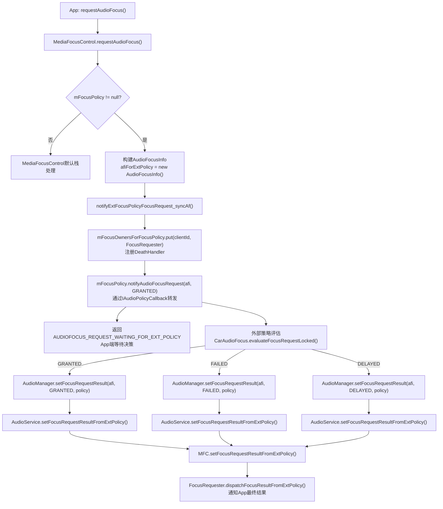
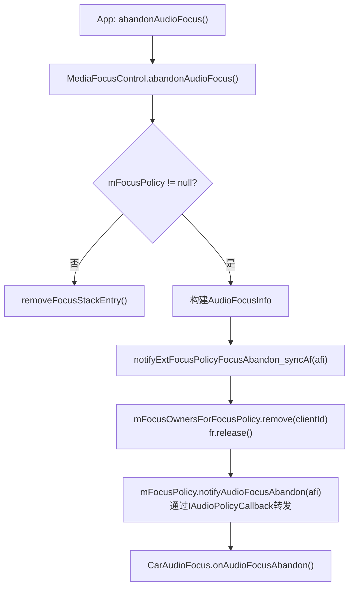
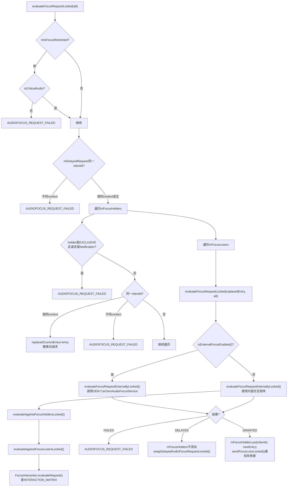
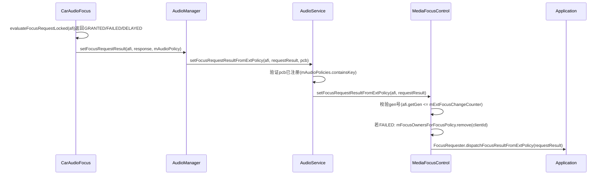
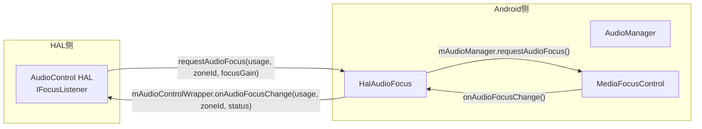
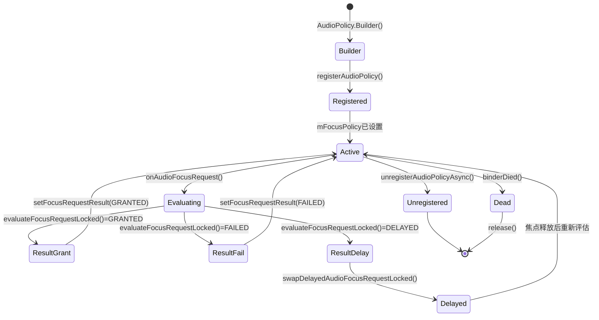

## 6.7 Focus Policy — 外部焦点策略

> [← 上一个](06_6.6_IOProfile与HwModule-HAL能力描述.md) | [← 返回Audio Policy Engine](README.md) | [返回导航](../README.md) | [下一个 →](06_6.8_AudioPolicyMix-动态策略路由.md)

---

### 模块职责

Android音频框架允许外部AudioPolicy注册为**焦点策略(Focus Policy)**，接管默认的MediaFocusControl焦点仲裁逻辑。当外部焦点策略注册后，所有焦点请求不再由MediaFocusControl内部栈机制处理，而是先转发给外部策略，由其决策GRANT/REJECT/DELAY，再回传结果给MediaFocusControl执行。

AAOS即使用此机制：[`CarAudioService`](packages/services/Car/service/src/com/android/car/audio/CarAudioService.java:1547)通过注册AudioPolicy将焦点仲裁权委托给[`CarZonesAudioFocus`](packages/services/Car/service/src/com/android/car/audio/CarZonesAudioFocus.java:52)→[`CarAudioFocus`](packages/services/Car/service/src/com/android/car/audio/CarAudioFocus.java)，实现多Zone独立焦点管理和车载交互矩阵。

---

### 6.7.1 核心数据结构

#### AudioPolicy焦点相关字段

[`AudioPolicy`](frameworks/base/media/java/android/media/audiopolicy/AudioPolicy.java:103)中与焦点策略相关的关键常量和字段：

| 字段/常量 | 定义位置 | 说明 |
|---|---|---|
| `FOCUS_POLICY_DUCKING_IN_APP = 0` | AudioPolicy:103 | Ducking由App处理(默认) |
| `FOCUS_POLICY_DUCKING_IN_POLICY = 1` | AudioPolicy:112 | Ducking由外部策略处理 |
| `mFocusListener` | AudioPolicy:114 | `AudioPolicyFocusListener`实例 |
| `mIsFocusPolicy` | AudioPolicy:163 | 是否作为焦点策略注册 |
| `mIsTestFocusPolicy` | AudioPolicy:164 | 是否为测试焦点策略(可恢复前一个策略) |

#### AudioPolicyFocusListener回调接口

[`AudioPolicyFocusListener`](frameworks/base/media/java/android/media/audiopolicy/AudioPolicy.java:907)定义了外部策略收到的四种回调：

| 回调方法 | 触发条件 | 说明 |
|---|---|---|
| [`onAudioFocusRequest(afi, requestResult)`](frameworks/base/media/java/android/media/audiopolicy/AudioPolicy.java:919) | App请求焦点 | 仅当`isFocusPolicy=true`时调用，需通过`setFocusRequestResult()`回传决策 |
| [`onAudioFocusAbandon(afi)`](frameworks/base/media/java/android/media/audiopolicy/AudioPolicy.java:927) | App放弃焦点 | 仅当`isFocusPolicy=true`时调用 |
| [`onAudioFocusGrant(afi, requestResult)`](frameworks/base/media/java/android/media/audiopolicy/AudioPolicy.java:908) | 焦点被授予 | Focus Follower通知，非焦点策略也会收到 |
| [`onAudioFocusLoss(afi, wasNotified)`](frameworks/base/media/java/android/media/audiopolicy/AudioPolicy.java:909) | 焦点丢失 | Focus Follower通知 |

#### IAudioPolicyCallback.aidl Binder接口

[`IAudioPolicyCallback`](frameworks/base/media/java/android/media/audiopolicy/IAudioPolicyCallback.aidl:23)声明为`oneway interface`，所有回调均为异步：

```
oneway interface IAudioPolicyCallback {
    void notifyAudioFocusGrant(in AudioFocusInfo afi, int requestResult);  // :26
    void notifyAudioFocusLoss(in AudioFocusInfo afi, boolean wasNotified); // :27
    void notifyAudioFocusRequest(in AudioFocusInfo afi, int requestResult);// :29
    void notifyAudioFocusAbandon(in AudioFocusInfo afi);                  // :30
}
```

---

### 6.7.2 外部焦点策略注册完整时序



**注册流程关键源码解析：**

1. [`CarAudioService.setupAudioPolicyLocked()`](packages/services/Car/service/src/com/android/car/audio/CarAudioService.java:1540)：创建`CarZonesAudioFocus`作为FocusListener，调用`builder.setIsAudioFocusPolicy(true)`标记为焦点策略

2. [`AudioManager.registerAudioPolicyStatic()`](frameworks/base/media/java/android/media/AudioManager.java:5264)：将`hasFocusListener`和`isFocusPolicy`传入AudioService

3. [`AudioService.registerAudioPolicy()`](frameworks/base/services/core/java/com/android/server/audio/AudioService.java:11545)：权限校验后创建`AudioPolicyProxy`

4. [`AudioPolicyProxy构造函数`](frameworks/base/services/core/java/com/android/server/audio/AudioService.java:12442)：当`mHasFocusListener=true`时调用`addFocusFollower()`；当`isFocusPolicy=true`时调用`setFocusPolicy()`

5. [`MediaFocusControl.setFocusPolicy()`](frameworks/base/services/core/java/com/android/server/audio/MediaFocusControl.java:665)：设置`mFocusPolicy = policy`，后续所有焦点请求将转发给外部策略

---

### 6.7.3 焦点请求转发流程

#### 请求焦点(Request)流程



**核心源码路径详解：**

1. [`MediaFocusControl.requestAudioFocus()`](frameworks/base/services/core/java/com/android/server/audio/MediaFocusControl.java:1004)：检测到`mFocusPolicy != null`时，构建`AudioFocusInfo`并调用`notifyExtFocusPolicyPolicyFocusRequest_syncAf()`

2. [`notifyExtFocusPolicyFocusRequest_syncAf()`](frameworks/base/services/core/java/com/android/server/audio/MediaFocusControl.java:759)：为请求分配gen号(`mExtFocusChangeCounter++`)，将其存入`mFocusOwnersForFocusPolicy`映射表，注册DeathHandler防止客户端崩溃后泄漏，然后通过`mFocusPolicy.notifyAudioFocusRequest()`(oneway Binder)转发

3. 返回值[`AUDIOFOCUS_REQUEST_WAITING_FOR_EXT_POLICY`](frameworks/base/services/core/java/com/android/server/audio/MediaFocusControl.java:1031)告知App焦点请求已提交外部策略，等待异步决策

4. [`AudioManager.setFocusRequestResult()`](frameworks/base/media/java/android/media/AudioManager.java:4954)：外部策略完成评估后，通过此API将结果回传至[`AudioService.setFocusRequestResultFromExtPolicy()`](frameworks/base/services/core/java/com/android/server/audio/AudioService.java:12785)，最终调用[`MFC.setFocusRequestResultFromExtPolicy()`](frameworks/base/services/core/java/com/android/server/audio/MediaFocusControl.java:802)

5. [`setFocusRequestResultFromExtPolicy()`](frameworks/base/services/core/java/com/android/server/audio/MediaFocusControl.java:802)：校验gen号防止乱序，若FAILED则从`mFocusOwnersForFocusPolicy`中移除，否则通过`FocusRequester.dispatchFocusResultFromExtPolicy()`回调App

#### 放弃焦点(Abandon)流程



[`notifyExtFocusPolicyFocusAbandon_syncAf()`](frameworks/base/services/core/java/com/android/server/audio/MediaFocusControl.java:824)：从`mFocusOwnersForFocusPolicy`移除并释放FocusRequester，然后通过oneway Binder通知外部策略

---

### 6.7.4 AAOS CarAudioFocus焦点评估

#### CarZonesAudioFocus多Zone分发

[`CarZonesAudioFocus`](packages/services/Car/service/src/com/android/car/audio/CarZonesAudioFocus.java:52)继承`AudioPolicyFocusListener`，作为外部焦点策略的总入口：

- [`onAudioFocusRequest(afi, requestResult)`](packages/services/Car/service/src/com/android/car/audio/CarZonesAudioFocus.java:211)：根据`afi`的uid查找所属ZoneId，委托给对应Zone的`CarAudioFocus`
- [`onAudioFocusAbandon(afi)`](packages/services/Car/service/src/com/android/car/audio/CarZonesAudioFocus.java:223)：同理分发到对应Zone

#### CarAudioFocus.evaluateFocusRequestLocked()深度解析

[`evaluateFocusRequestLocked(AudioFocusInfo afi)`](packages/services/Car/service/src/com/android/car/audio/CarAudioFocus.java:207)是AAOS焦点决策的核心方法：



**关键数据结构：**

| 数据结构 | 说明 |
|---|---|
| `mFocusHolders` | 当前持有焦点的条目 (`ArrayMap<String, FocusEntry>`) |
| `mFocusLosers` | 因MAY_DUCK/TRANSIENT失焦但可能恢复的条目 |
| `mDelayedRequest` | 因`AUDIOFOCUS_FLAG_DELAY_OK`延迟等待的请求 |
| `FocusEntry.mBlockers` | 阻止该条目恢复焦点的 blocker 列表 |

---

### 6.7.5 FocusInteraction交互矩阵

[`FocusInteraction`](packages/services/Car/service/src/com/android/car/audio/FocusInteraction.java:62)维护一个13×13的`INTERACTION_MATRIX`，行代表当前焦点持有者的Context，列代表新请求的Context：

| | INVALID | MUSIC | NAV | VOICE | RING | CALL | ALARM | NOTIF | SYS | EMERG | SAFETY | VEH | ANNOUNCE |
|---|---|---|---|---|---|---|---|---|---|---|---|---|---|
| **MUSIC** | R | **E** | C | E | E | E | E | C | C | E | C | C | E |
| **NAV** | R | C | C | E | C | E | C | C | C | E | C | C | C |
| **VOICE** | R | C | R | C | E | E | R | R | R | E | C | C | R |
| **CALL_RING** | R | R | C | C | C | C | R | R | C | E | C | C | R |
| **CALL** | R | R | C | R | C | C | C | C | R | C | C | C | R |
| **ALARM** | R | C | C | E | E | E | C | C | C | E | C | C | R |
| **NOTIF** | R | C | C | E | E | E | C | C | C | E | C | C | C |
| **EMERGENCY** | R | R | R | R | R | **C** | R | R | R | C | C | R | R |
| **SAFETY** | R | C | C | C | C | C | C | C | C | C | C | C | C |

> **E** = EXCLUSIVE(新请求获得焦点，旧持有者丢失)  
> **C** = CONCURRENT(共存)  
> **R** = REJECT(拒绝新请求)

[`evaluateRequest()`](packages/services/Car/service/src/com/android/car/audio/FocusInteraction.java:414)查表后进一步处理CONCURRENT情况：若不允许ducking(`!allowDucking`)、或焦点持有者设置了`AUDIOFOCUS_FLAG_PAUSES_ON_DUCKABLE_LOSS`、或持有者持有`RECEIVE_CAR_AUDIO_DUCKING_EVENTS`权限，则仍将持有者加入focusLosers列表发送LOSS通知。

---

### 6.7.6 焦点结果回传与兜底机制

#### 结果回传路径



#### 兜底与防护机制

1. **gen号防乱序**：[`notifyExtFocusPolicyFocusRequest_syncAf()`](frameworks/base/services/core/java/com/android/server/audio/MediaFocusControl.java:766)为每次请求分配递增gen号，[`setFocusRequestResultFromExtPolicy()`](frameworks/base/services/core/java/com/android/server/audio/MediaFocusControl.java:803)校验gen号，忽略过期结果

2. **DeathHandler防泄漏**：[`notifyExtFocusPolicyFocusRequest_syncAf()`](frameworks/base/services/core/java/com/android/server/audio/MediaFocusControl.java:779)通过`cb.linkToDeath()`监听客户端死亡，自动清理`mFocusOwnersForFocusPolicy`

3. **策略注销恢复**：[`AudioPolicyProxy.release()`](frameworks/base/services/core/java/com/android/server/audio/AudioService.java:12498)调用`mMediaFocusControl.unsetFocusPolicy()`，将`mFocusPolicy`置null，恢复MediaFocusControl默认行为

4. **Test策略恢复**：[`setFocusPolicy()`](frameworks/base/services/core/java/com/android/server/audio/MediaFocusControl.java:670)当`isTestFocusPolicy=true`时保存`mPreviousFocusPolicy`，[`unsetFocusPolicy()`](frameworks/base/services/core/java/com/android/server/audio/MediaFocusControl.java:683)时恢复前一个策略

5. **策略Binder死亡**：[`AudioPolicyProxy.binderDied()`](frameworks/base/services/core/java/com/android/server/audio/AudioService.java:12480)自动释放资源，取消焦点策略注册

---

### 6.7.7 HalAudioFocus — HAL焦点同步

[`HalAudioFocus`](packages/services/Car/service/src/com/android/car/audio/hal/HalAudioFocus.java:58)实现了外部AudioControl HAL与Android焦点系统的双向同步：



- [`HalAudioFocus.requestAudioFocus()`](packages/services/Car/service/src/com/android/car/audio/hal/HalAudioFocus.java:103)：HAL发起焦点请求，检查同一usage+zoneId是否已有请求，有则直接回调当前状态，无则创建新请求
- [`HalAudioFocus.abandonAudioFocus()`](packages/services/Car/service/src/com/android/car/audio/hal/HalAudioFocus.java:130)：HAL放弃焦点，移除请求映射
- 内部维护`mHalFocusRequestsByZoneAndUsage`(SparseArray<Map>)，按zoneId和AudioAttributes索引所有HAL焦点请求

---

### 6.7.8 Focus Follower通知机制

除了Focus Policy(决策者)，AudioPolicy还可注册为Focus Follower(观察者)，通过[`addFocusFollower()`](frameworks/base/services/core/java/com/android/server/audio/MediaFocusControl.java)接收焦点变化通知：

- [`notifyExtPolicyFocusGrant_syncAf()`](frameworks/base/services/core/java/com/android/server/audio/MediaFocusControl.java:722)：遍历`mFocusFollowers`，调用`pcb.notifyAudioFocusGrant()`
- [`notifyExtPolicyFocusLoss_syncAf()`](frameworks/base/services/core/java/com/android/server/audio/MediaFocusControl.java:737)：遍历`mFocusFollowers`，调用`pcb.notifyAudioFocusLoss()`

**Focus Policy vs Focus Follower对比：**

| 维度 | Focus Policy | Focus Follower |
|---|---|---|
| 注册方式 | `setIsAudioFocusPolicy(true)` | 仅`setAudioPolicyFocusListener()` |
| 角色 | 决策者(决定GRANT/REJECT) | 观察者(仅接收通知) |
| 收到回调 | `onAudioFocusRequest` + `onAudioFocusAbandon` | `onAudioFocusGrant` + `onAudioFocusLoss` |
| 同步性 | 需通过`setFocusRequestResult()`回传 | 无需回传，纯通知 |
| 数量限制 | 同时仅一个(可叠加一个test policy) | 可多个 |

---

### 6.7.9 外部策略的完整生命周期



---

### 小结

外部焦点策略机制是AAOS车载音频的核心基础设施：
1. **注册链路**：CarAudioService → AudioManager → AudioService → AudioPolicyProxy → MediaFocusControl.setFocusPolicy()
2. **请求转发**：MFC检测到mFocusPolicy后，构建AudioFocusInfo通过oneway Binder转发，返回WAITING_FOR_EXT_POLICY
3. **评估决策**：CarAudioFocus通过交互矩阵(13×13)或OEM外部服务评估，支持GRANT/FAIL/DELAY三种结果
4. **结果回传**：AudioManager.setFocusRequestResult() → AudioService → MFC，gen号防乱序
5. **HAL同步**：HalAudioFocus实现AudioControl HAL与Android焦点系统的双向桥接
6. **兜底保障**：DeathHandler防泄漏、Test策略可恢复、Binder死亡自动清理

---