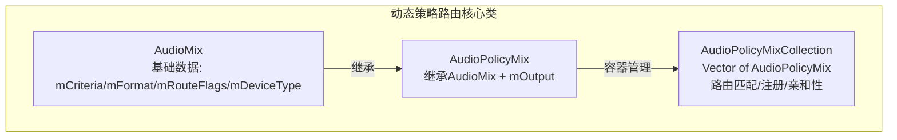
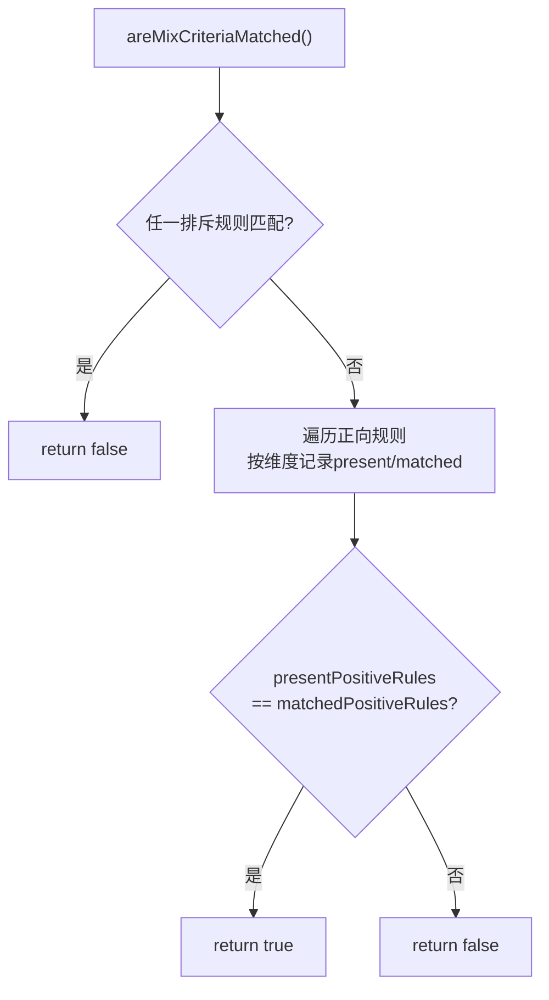
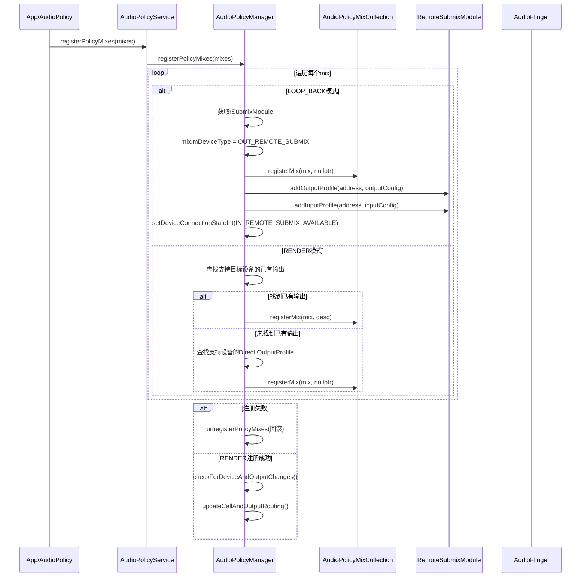
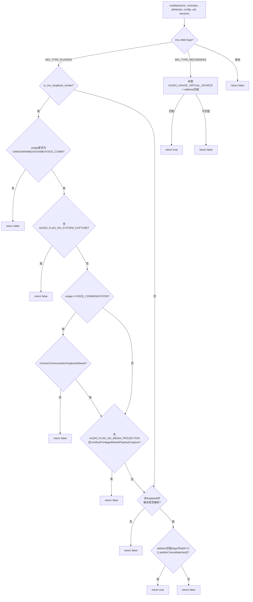
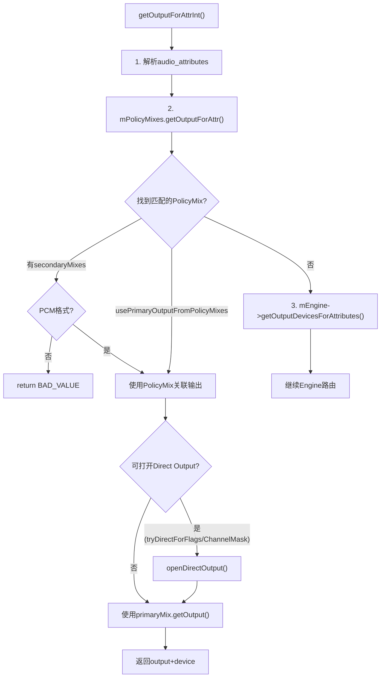
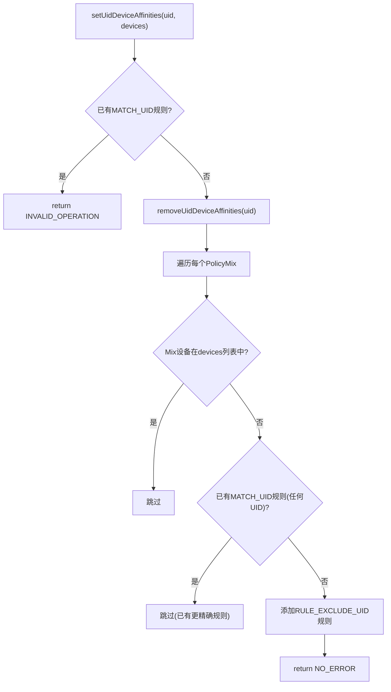
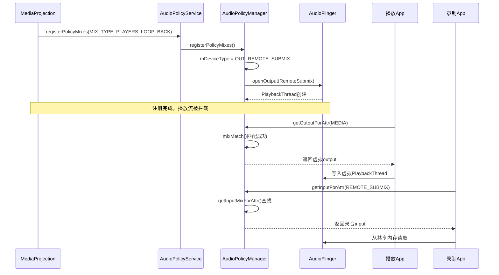

## 6.8 AudioPolicyMix — 动态策略路由

> [← 上一个](06_6.7_Focus_Policy-外部焦点策略.md) | [← 返回Audio Policy Engine](README.md) | [返回导航](../README.md) | [下一个 →](06_6.9_EngineInterface-策略引擎接口.md)

---

### 6.8.1 概述

Android动态策略路由（Dynamic Policy Mix）是一种允许外部应用在运行时注册自定义音频路由规则的机制。与Engine中基于配置文件的静态策略不同，AudioPolicyMix由App通过[`AudioPolicy`](frameworks/av/media/libaudioclient/include/media/AudioPolicy.h)接口动态注入，实现投屏录制、远程子混音、多用户设备隔离等场景。

核心数据流：**App注册AudioMix → APM创建虚拟/物理输出 → getOutputForAttr()匹配路由 → 音频流重定向**



---

### 6.8.2 类结构与继承体系

#### AudioMix基础类

[`AudioMix`](frameworks/av/media/libaudioclient/include/media/AudioPolicy.h:91)定义在`libaudioclient`中，是跨进程传递的基础数据结构：

| 字段 | 类型 | 说明 |
|------|------|------|
| [`mCriteria`](frameworks/av/media/libaudioclient/include/media/AudioPolicy.h:123) | `std::vector<AudioMixMatchCriterion>` | 匹配规则集合，最多20条(`MAX_CRITERIA_PER_MIX`) |
| [`mMixType`](frameworks/av/media/libaudioclient/include/media/AudioPolicy.h:124) | `uint32_t` | 混音类型：`MIX_TYPE_PLAYERS`(0)或`MIX_TYPE_RECORDERS`(1) |
| [`mFormat`](frameworks/av/media/libaudioclient/include/media/AudioPolicy.h:125) | `audio_config_t` | 期望的音频格式(采样率/通道掩码/格式) |
| [`mRouteFlags`](frameworks/av/media/libaudioclient/include/media/AudioPolicy.h:126) | `uint32_t` | 路由模式标志位 |
| [`mDeviceType`](frameworks/av/media/libaudioclient/include/media/AudioPolicy.h:127) | `audio_devices_t` | 目标设备类型(如`AUDIO_DEVICE_OUT_REMOTE_SUBMIX`) |
| [`mDeviceAddress`](frameworks/av/media/libaudioclient/include/media/AudioPolicy.h:128) | `String8` | 目标设备地址(也用作注册ID) |
| [`mCbFlags`](frameworks/av/media/libaudioclient/include/media/AudioPolicy.h:129) | `uint32_t` | 回调标志(`kCbFlagNotifyActivity`) |
| [`mAllowPrivilegedMediaPlaybackCapture`](frameworks/av/media/libaudioclient/include/media/AudioPolicy.h:131) | `bool` | 是否忽略`AUDIO_FLAG_NO_MEDIA_PROJECTION` |
| [`mVoiceCommunicationCaptureAllowed`](frameworks/av/media/libaudioclient/include/media/AudioPolicy.h:133) | `bool` | 是否允许捕获语音通信输出 |

#### AudioPolicyMix扩展类

[`AudioPolicyMix`](frameworks/av/services/audiopolicy/common/managerdefinitions/include/AudioPolicyMix.h:33)继承`AudioMix`并添加输出关联：

```cpp
class AudioPolicyMix : public AudioMix, public RefBase {
public:
    AudioPolicyMix(const AudioMix &mix) : AudioMix(mix) {}
    const sp<SwAudioOutputDescriptor> &getOutput() const { return mOutput; }
    void setOutput(const sp<SwAudioOutputDescriptor> &output) { mOutput = output; }
    void clearOutput() { mOutput.clear(); }
private:
    sp<SwAudioOutputDescriptor> mOutput;  // 对应的输出流描述符
};
```

`mOutput`是动态路由的核心——它将一个逻辑上的AudioMix规则与一个物理/虚拟的输出流绑定，使得匹配该规则的音频流被路由到特定输出。

#### AudioPolicyMixCollection管理类

[`AudioPolicyMixCollection`](frameworks/av/services/audiopolicy/common/managerdefinitions/include/AudioPolicyMix.h:46)继承`Vector<sp<AudioPolicyMix>>`，提供完整的注册/匹配/亲和性管理：

| 方法 | 说明 |
|------|------|
| [`registerMix()`](frameworks/av/services/audiopolicy/common/managerdefinitions/src/AudioPolicyMix.cpp:171) | 注册Mix并关联输出描述符 |
| [`unregisterMix()`](frameworks/av/services/audiopolicy/common/managerdefinitions/src/AudioPolicyMix.cpp:196) | 反注册Mix |
| [`getOutputForAttr()`](frameworks/av/services/audiopolicy/common/managerdefinitions/src/AudioPolicyMix.cpp:227) | 根据属性查找匹配的Mix和输出 |
| [`mixMatch()`](frameworks/av/services/audiopolicy/common/managerdefinitions/src/AudioPolicyMix.cpp:287) | 单个Mix匹配判定(私有方法) |
| [`setUidDeviceAffinities()`](frameworks/av/services/audiopolicy/common/managerdefinitions/src/AudioPolicyMix.cpp:424) | 设置UID设备亲和性 |
| [`setUserIdDeviceAffinities()`](frameworks/av/services/audiopolicy/common/managerdefinitions/src/AudioPolicyMix.cpp:508) | 设置UserId设备亲和性 |

---

### 6.8.3 AudioMixMatchCriterion匹配规则

[`AudioMixMatchCriterion`](frameworks/av/media/libaudioclient/include/media/AudioPolicy.h:72)是匹配规则的最小单元，采用联合体存储匹配值：

```cpp
class AudioMixMatchCriterion {
public:
    union {
        audio_usage_t   mUsage;      // RULE_MATCH_ATTRIBUTE_USAGE
        audio_source_t  mSource;     // RULE_MATCH_ATTRIBUTE_CAPTURE_PRESET
        uid_t           mUid;        // RULE_MATCH_UID
        int             mUserId;     // RULE_MATCH_USERID
        audio_session_t mAudioSessionId; // RULE_MATCH_AUDIO_SESSION_ID
    } mValue;
    uint32_t mRule;  // 规则类型(含EXCLUSION标志)
};
```

#### 规则类型定义

定义在[`AudioPolicy.h`](frameworks/av/media/libaudioclient/include/media/AudioPolicy.h:32)中的规则常量：

| 规则常量 | 值 | 匹配维度 | 排斥版本 |
|----------|-----|----------|----------|
| `RULE_MATCH_ATTRIBUTE_USAGE` | 0x1 | 音频用途(usage) | `RULE_EXCLUDE_ATTRIBUTE_USAGE` (0x8001) |
| `RULE_MATCH_ATTRIBUTE_CAPTURE_PRESET` | 0x2 | 录音源(source) | `RULE_EXCLUDE_ATTRIBUTE_CAPTURE_PRESET` (0x8002) |
| `RULE_MATCH_UID` | 0x4 | 应用UID | `RULE_EXCLUDE_UID` (0x8004) |
| `RULE_MATCH_USERID` | 0x8 | 用户ID | `RULE_EXCLUDE_USERID` (0x8008) |
| `RULE_MATCH_AUDIO_SESSION_ID` | 0x10 | 音频会话ID | `RULE_EXCLUDE_AUDIO_SESSION_ID` (0x8010) |

排斥标志通过`RULE_EXCLUSION_MASK`(0x8000)与匹配规则OR运算实现。判断是否为排斥规则：`criterion.mRule & RULE_EXCLUSION_MASK`。

#### isCriterionMatched()匹配逻辑

[`isCriterionMatched()`](frameworks/av/services/audiopolicy/common/managerdefinitions/src/AudioPolicyMix.cpp:41)是单条规则的匹配判定：

```cpp
bool isCriterionMatched(const AudioMixMatchCriterion& criterion,
                        const audio_attributes_t& attr, const uid_t uid,
                        const audio_session_t session) {
    uint32_t ruleWithoutExclusion = criterion.mRule & ~RULE_EXCLUSION_MASK;
    switch(ruleWithoutExclusion) {
        case RULE_MATCH_ATTRIBUTE_USAGE:
            return criterion.mValue.mUsage == attr.usage;
        case RULE_MATCH_ATTRIBUTE_CAPTURE_PRESET:
            return criterion.mValue.mSource == attr.source;
        case RULE_MATCH_UID:
            return criterion.mValue.mUid == uid;
        case RULE_MATCH_USERID:
            return criterion.mValue.mUserId == multiuser_get_user_id(uid);
        case RULE_MATCH_AUDIO_SESSION_ID:
            return criterion.mValue.mAudioSessionId == session;
    }
    return false;
}
```

#### areMixCriteriaMatched()多规则组合匹配

[`areMixCriteriaMatched()`](frameworks/av/services/audiopolicy/common/managerdefinitions/src/AudioPolicyMix.cpp:62)实现了多维度组合匹配逻辑：

1. **排斥规则优先**：任一排斥规则匹配则整体不匹配（短路返回false）
2. **按维度匹配**：每个维度(usage/uid/userId等)至少一条规则匹配
3. **位掩码比较**：`presentPositiveRules == matchedPositiveRules`确保所有维度都被覆盖



**一致性检查**：[`areMixCriteriaConsistent()`](frameworks/av/services/audiopolicy/common/managerdefinitions/src/AudioPolicyMix.cpp:86)确保同一维度不会同时存在MATCH和EXCLUDE规则。

---

### 6.8.4 三种路由模式源码解析

路由模式由`mRouteFlags`控制，定义在[`AudioPolicy.h`](frameworks/av/media/libaudioclient/include/media/AudioPolicy.h:58)：

| 标志 | 值 | 说明 |
|------|-----|------|
| `MIX_ROUTE_FLAG_RENDER` | 0x1 | 直接渲染到指定物理设备 |
| `MIX_ROUTE_FLAG_LOOP_BACK` | 0x2 | 回环到RemoteSubmix虚拟设备 |
| `MIX_ROUTE_FLAG_LOOP_BACK_AND_RENDER` | 0x3 | 同时回环+渲染 |
| `MIX_ROUTE_FLAG_DISALLOWS_PREFERRED_DEVICE` | 0x4 | 禁止首选设备路由覆盖 |

辅助判断函数（内联定义在[`AudioPolicy.h`](frameworks/av/media/libaudioclient/include/media/AudioPolicy.h:143)）：
- [`is_mix_loopback_render()`](frameworks/av/media/libaudioclient/include/media/AudioPolicy.h:143)：`routeFlags & LOOP_BACK_AND_RENDER == LOOP_BACK_AND_RENDER`
- [`is_mix_loopback()`](frameworks/av/media/libaudioclient/include/media/AudioPolicy.h:148)：`routeFlags & LOOP_BACK == LOOP_BACK`
- [`is_mix_disallows_preferred_device()`](frameworks/av/media/libaudioclient/include/media/AudioPolicy.h:153)：`routeFlags & DISALLOWS_PREFERRED_DEVICE`

#### LOOP_BACK模式

回环模式创建RemoteSubmix虚拟设备，实现"播放→虚拟输出→录音捕获"的环路：

1. Mix的`mDeviceType`被强制设置为`AUDIO_DEVICE_OUT_REMOTE_SUBMIX`
2. RemoteSubmix HAL模块添加Output/Input Profile
3. 通过`setDeviceConnectionStateInt()`使`AUDIO_DEVICE_IN_REMOTE_SUBMIX`可用
4. 捕获端App使用`AUDIO_SOURCE_REMOTE_SUBMIX`录音源读取虚拟输出数据

#### RENDER模式

渲染模式将匹配的音频流直接路由到指定物理设备（如HDMI）：

1. 查找已打开的支持目标设备的输出
2. 若无，查找支持目标设备的Direct Output Profile
3. 将Mix与找到的输出描述符关联

#### LOOP_BACK_AND_RENDER模式

同时具备回环和渲染能力，是前两种模式的组合：
- LOOP_BACK部分处理与纯LOOP_BACK相同
- RENDER部分确保音频同时输出到物理设备

---

### 6.8.5 registerPolicyMixes注册流程

[`AudioPolicyManager::registerPolicyMixes()`](frameworks/av/services/audiopolicy/managerdefault/AudioPolicyManager.cpp:3559)是动态路由注册的入口：



**关键源码细节**：

1. **LOOP_BACK注册时output desc传nullptr**（[第3602行](frameworks/av/services/audiopolicy/managerdefault/AudioPolicyManager.cpp:3602)）——输出描述符在`setDeviceConnectionStateInt`触发`openOutput`后才创建

2. **RENDER模式优先复用已有输出**（[第3641行](frameworks/av/services/audiopolicy/managerdefault/AudioPolicyManager.cpp:3641)）：遍历`mOutputs`查找非duplicate且支持目标设备的输出

3. **RENDER回退到Direct Profile**（[第3655行](frameworks/av/services/audiopolicy/managerdefault/AudioPolicyManager.cpp:3655)）：无已有输出时查找`isDirectOutput() && supportsDevice(device)`的Profile

4. **LOOP_BACK_AND_RENDER与LOOP_BACK共用分支**（[第3578行](frameworks/av/services/audiopolicy/managerdefault/AudioPolicyManager.cpp:3578)）：`(mix.mRouteFlags & MIX_ROUTE_FLAG_LOOP_BACK) == MIX_ROUTE_FLAG_LOOP_BACK`条件同时覆盖两种模式

5. **PLAYERS类型校验**（[第3569行](frameworks/av/services/audiopolicy/managerdefault/AudioPolicyManager.cpp:3569)）：LOOP_BACK_RENDER模式仅允许`MIX_TYPE_PLAYERS`

6. **失败回滚**（[第3688行](frameworks/av/services/audiopolicy/managerdefault/AudioPolicyManager.cpp:3688)）：任一mix注册失败则调用`unregisterPolicyMixes`回滚所有已注册的mix

---

### 6.8.6 unregisterPolicyMixes清理流程

[`AudioPolicyManager::unregisterPolicyMixes()`](frameworks/av/services/audiopolicy/managerdefault/AudioPolicyManager.cpp:3696)执行逆操作：

**LOOP_BACK清理**：
1. `mPolicyMixes.unregisterMix(mix)` — 从集合移除
2. 对`IN_REMOTE_SUBMIX`和`OUT_REMOTE_SUBMIX`分别调用`setDeviceConnectionStateInt(UNAVAILABLE)` — 关闭虚拟设备
3. `rSubmixModule->removeOutputProfile(address)` — 移除HAL Profile
4. `rSubmixModule->removeInputProfile(address)` — 移除录音Profile

**RENDER清理**：
1. `mPolicyMixes.unregisterMix(mix)` — 从集合移除
2. 触发`checkForDeviceAndOutputChanges()`和`updateCallAndOutputRouting()`

---

### 6.8.7 mixMatch()匹配算法详解

[`AudioPolicyMixCollection::mixMatch()`](frameworks/av/services/audiopolicy/common/managerdefinitions/src/AudioPolicyMix.cpp:287)是动态路由匹配的核心算法：



**MIX_TYPE_PLAYERS匹配规则**：

1. **Loopback Render安全检查**（[第291-316行](frameworks/av/services/audiopolicy/common/managerdefinitions/src/AudioPolicyMix.cpp:291)）：
   - 仅允许`UNKNOWN/MEDIA/GAME/VOICE_COMMUNICATION`四种usage
   - 拒绝含`AUDIO_FLAG_NO_SYSTEM_CAPTURE`的流
   - 语音通信需要`mVoiceCommunicationCaptureAllowed=true`
   - 非语音需要`mAllowPrivilegedMediaPlaybackCapture=true`来绕过`AUDIO_FLAG_NO_MEDIA_PROJECTION`

2. **格式兼容性检查**（[第318-322行](frameworks/av/services/audiopolicy/common/managerdefinitions/src/AudioPolicyMix.cpp:318)）：
   - 非LOOP_BACK模式下要求PCM兼容或压缩格式完全匹配
   - LOOP_BACK模式跳过格式检查（RemoteSubmix HAL内部处理）

3. **双重匹配途径**（[第325-327行](frameworks/av/services/audiopolicy/common/managerdefinitions/src/AudioPolicyMix.cpp:325)）：
   - **地址匹配**：通过`extractAddressFromAudioAttributes()`从tags中提取`addr=xxx`匹配mDeviceAddress
   - **规则匹配**：`areMixCriteriaMatched(mCriteria, attributes, uid, session)`

**MIX_TYPE_RECORDERS匹配规则**：

仅当`usage == AUDIO_USAGE_VIRTUAL_SOURCE`且地址匹配时返回true。这是远程子混音录音端回读的入口。

---

### 6.8.8 getOutputForAttr()中动态策略匹配流程

[`AudioPolicyMixCollection::getOutputForAttr()`](frameworks/av/services/audiopolicy/common/managerdefinitions/src/AudioPolicyMix.cpp:227)在APM的[`getOutputForAttrInt()`](frameworks/av/services/audiopolicy/managerdefault/AudioPolicyManager.cpp:1194)中被调用，是Engine路由决策前的优先级更高的路由路径：



**getOutputForAttr()内部逻辑**（[第227-280行](frameworks/av/services/audiopolicy/common/managerdefinitions/src/AudioPolicyMix.cpp:227)）：

1. 遍历所有已注册的`AudioPolicyMix`
2. 对每个Mix调用[`mixDisallowsRequestedDevice()`](frameworks/av/services/audiopolicy/common/managerdefinitions/src/AudioPolicyMix.cpp:282)检查是否禁止首选设备路由
3. 对每个Mix调用`mixMatch()`检查是否匹配
4. 拒绝MMAP_NOIRQ流路由到loopback mix
5. 区分primaryMix（非LOOP_BACK_RENDER）和secondaryMix（LOOP_BACK_RENDER）
6. 计算usePrimaryOutputFromPolicyMixes标志

**mixDisallowsRequestedDevice()逻辑**：当Mix含`MIX_ROUTE_FLAG_DISALLOWS_PREFERRED_DEVICE`标志、请求设备等于Mix设备、且Mix有UserId排除规则时，阻止首选设备路由。

**primaryMix vs secondaryMixes**：
- `primaryMix`：RENDER模式的Mix，一个请求最多匹配一个primary
- `secondaryMixes`：LOOP_BACK_RENDER模式的Mix，可同时匹配多个（如投屏+录制并行）

---

### 6.8.9 UidDeviceAffinity与UserIdDeviceAffinity亲和性路由

亲和性路由允许将特定UID/UserId的音频流限制到指定设备集合，是AAOS多区域路由的核心机制。

#### setUidDeviceAffinities()

[`setUidDeviceAffinities()`](frameworks/av/services/audiopolicy/common/managerdefinitions/src/AudioPolicyMix.cpp:424)为指定UID设置允许的设备列表：

1. **冲突检测**：若已有`RULE_MATCH_UID`规则则返回`INVALID_OPERATION`
2. **清除旧规则**：调用`removeUidDeviceAffinities()`删除该UID的`RULE_EXCLUDE_UID`规则
3. **注入排斥规则**：对每个目标设备不在devices列表中的Mix，添加`RULE_EXCLUDE_UID`规则



#### setUserIdDeviceAffinities()

[`setUserIdDeviceAffinities()`](frameworks/av/services/audiopolicy/common/managerdefinitions/src/AudioPolicyMix.cpp:508)逻辑与UID版本类似，但额外设置了`MIX_ROUTE_FLAG_DISALLOWS_PREFERRED_DEVICE`标志：

- 注入排斥规则时同时设置`mRouteFlags |= MIX_ROUTE_FLAG_DISALLOWS_PREFERRED_DEVICE`
- 清除时若不再有任何UserId排斥规则，则清除该标志

**DISALLOWS_PREFERRED_DEVICE的意义**：当设置了UserId亲和性后，即使用户通过`setPreferredDevice()`显式指定了设备，也不允许覆盖动态策略路由的决策。这在AAOS中确保用户区域的音频不会意外路由到其他区域。

#### isDeviceAffinityCompatible()

[`isDeviceAffinityCompatible()`](frameworks/av/media/libaudioclient/include/media/AudioPolicy.h:121)判断一个Mix是否支持亲和性——仅当没有MATCH_UID/MATCH_USERID规则时才允许设置亲和性，避免规则冲突。

---

### 6.8.10 getInputMixForAttr()录音端路由

[`getInputMixForAttr()`](frameworks/av/services/audiopolicy/common/managerdefinitions/src/AudioPolicyMix.cpp:351)处理LOOP_BACK模式的录音端路由：

1. 从`audio_attributes_t.tags`中提取`addr=xxx`地址
2. 按地址在已注册Mix中查找匹配项
3. 校验Mix类型必须为`MIX_TYPE_PLAYERS`
4. 返回对应的`AudioPolicyMix`

录音端通过`AUDIO_SOURCE_REMOTE_SUBMIX`源+Mix地址建立与播放端虚拟输出的连接。数据流路径：
`App播放 → 匹配Mix → 虚拟PlaybackThread → 共享内存 → RemoteSubmix HAL → App录音`

---

### 6.8.11 典型应用场景

#### 场景1：MediaProjection屏幕录制



#### 场景2：Cast投影到HDMI

使用RENDER模式，将匹配的播放流直接路由到HDMI设备：
- Mix配置：`MIX_TYPE_PLAYERS + MIX_ROUTE_FLAG_RENDER + mDeviceType=AUDIO_DEVICE_OUT_HDMI`
- 匹配的播放流跳过Engine路由，直接输出到HDMI关联的PlaybackThread

#### 场景3：多用户隔离路由(AAOS)

通过UserIdDeviceAffinity实现车内多区域音频隔离：

```cpp
// 用户0路由到主区域扬声器
setUserIdDeviceAffinities(0, {AudioDeviceTypeAddr(AUDIO_DEVICE_OUT_SPEAKER, "")});
// 用户10路由到后排区域扬声器
setUserIdDeviceAffinities(10, {AudioDeviceTypeAddr(AUDIO_DEVICE_OUT_BUS, "bus1000")});
```

效果：用户0的播放流被排除从bus1000输出，用户10的播放流被排除从speaker输出。

#### 场景4：辅助功能音频捕获

AccessibilityService通过LOOP_BACK模式截获播放音频用于转录或描述：
- 使用`mAllowPrivilegedMediaPlaybackCapture=true`绕过`AUDIO_FLAG_NO_MEDIA_PROJECTION`保护

| 场景 | Mix类型 | RouteFlag | 关键配置 |
|------|---------|-----------|----------|
| MediaProjection录制 | PLAYERS | LOOP_BACK | RemoteSubmix虚拟设备 |
| Cast到HDMI | PLAYERS | RENDER | mDeviceType=HDMI |
| 投屏+录制 | PLAYERS | LOOP_BACK_AND_RENDER | 同时虚拟+物理输出 |
| 多用户隔离(AAOS) | PLAYERS | RENDER+DISALLOWS_PREFERRED_DEVICE | setUserIdDeviceAffinities |
| 辅助功能捕获 | PLAYERS | LOOP_BACK | mAllowPrivilegedMediaPlaybackCapture=true |
| 远程录音源 | RECORDERS | LOOP_BACK | AUDIO_USAGE_VIRTUAL_SOURCE |

---

### 6.8.12 设计要点总结

1. **优先级**：动态策略路由优先于Engine静态路由，在`getOutputForAttrInt()`中先查PolicyMixes再查Engine

2. **安全性**：LOOP_BACK_RENDER模式严格限制可捕获的音频类型，通过`AUDIO_FLAG_NO_SYSTEM_CAPTURE`和`AUDIO_FLAG_NO_MEDIA_PROJECTION`保护隐私

3. **隔离性**：`MIX_ROUTE_FLAG_DISALLOWS_PREFERRED_DEVICE`确保亲和性路由不被App首选设备覆盖

4. **可扩展**：最多支持50个Mix(`MAX_MIXES_PER_POLICY`)，每个Mix最多20条规则(`MAX_CRITERIA_PER_MIX`)

5. **回滚机制**：注册失败时自动清理已注册的Mix，保持系统一致性

6. **双重匹配**：mixMatch()同时支持基于地址(tags中addr=)和基于规则(mCriteria)的匹配，前者用于录音端回读，后者用于播放端拦截

> **核心设计**：AudioPolicyMix是Android运行时动态路由的唯一机制。它将"匹配规则"与"输出目标"绑定，在`getOutputForAttr()`中优先于Engine决策，使App能通过注册规则控制音频流向。LOOP_BACK模式通过RemoteSubmix虚拟设备实现播放→录音的环路捕获，RENDER模式实现播放→指定设备的直接路由。

---

> [← 上一个](06_6.7_Focus_Policy-外部焦点策略.md) | [← 返回Audio Policy Engine](README.md) | [返回导航](../README.md) | [下一个 →](06_6.9_EngineInterface-策略引擎接口.md)