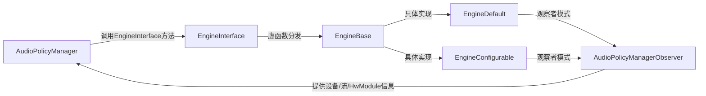
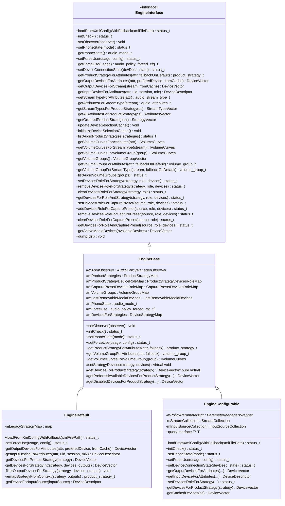
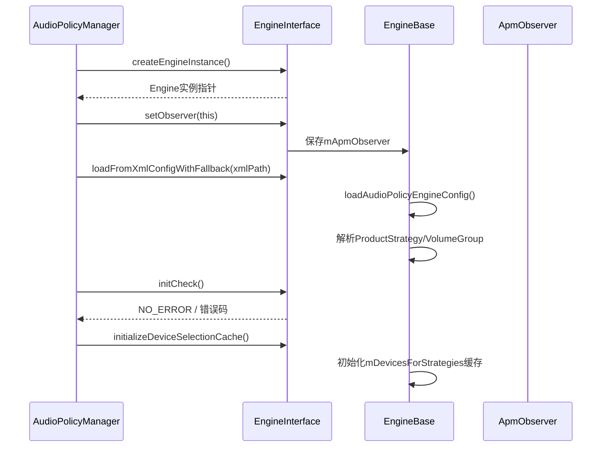
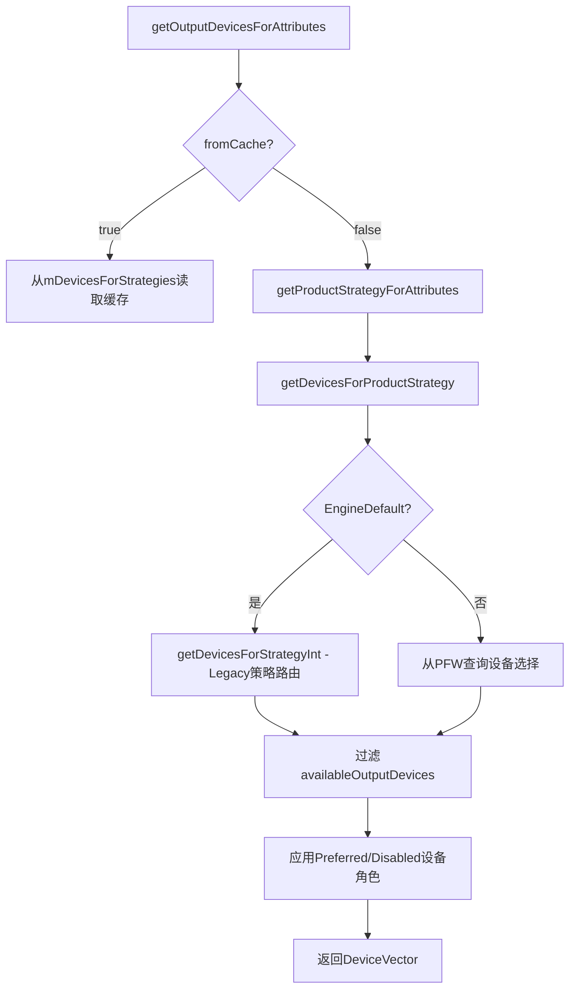
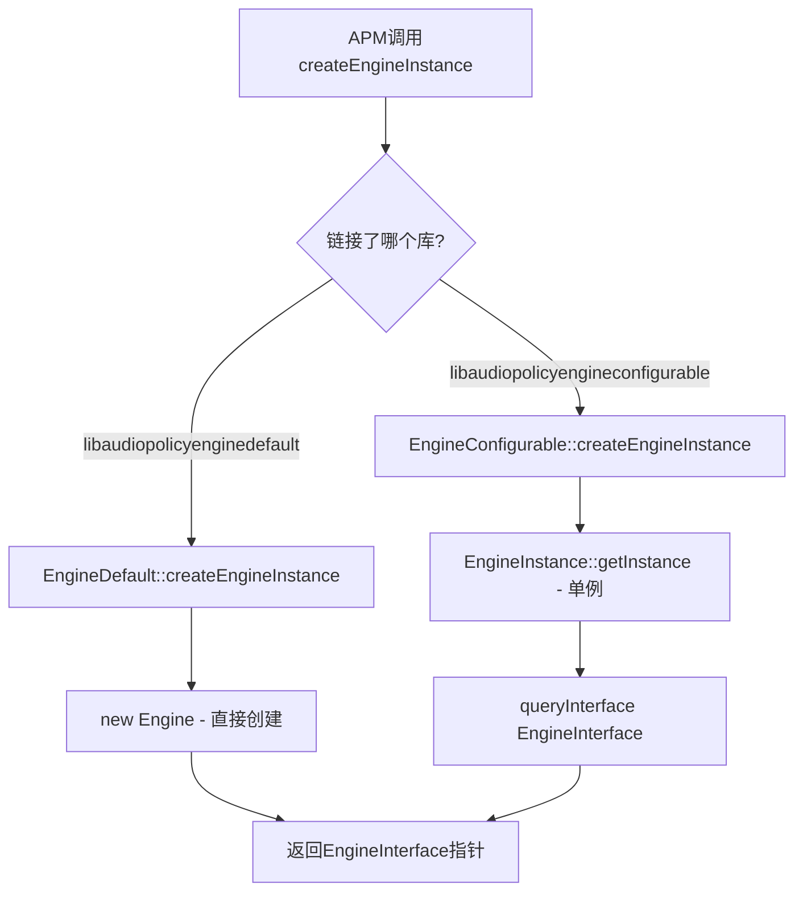
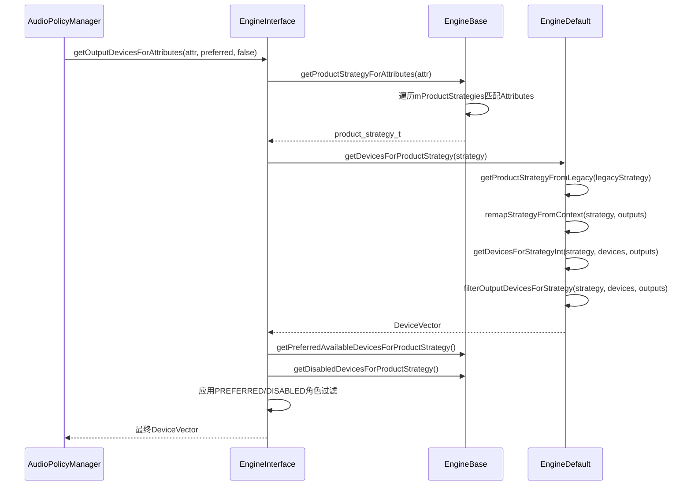

## 6.9 EngineInterface — 策略引擎接口

> [← 上一个](06_6.8_AudioPolicyMix-动态策略路由.md) | [← 返回Audio Policy Engine](README.md) | [返回导航](../README.md) | [下一个 →](06_6.10_EngineConfigurable-Parameter_Framework可配置引擎.md)

---

### 1. 模块职责与设计哲学

[`EngineInterface`](frameworks/av/services/audiopolicy/engine/interface/EngineInterface.h) 是Audio Policy Engine的**纯虚接口类**，定义了策略引擎与[`AudioPolicyManager`](frameworks/av/services/audiopolicy/AudioPolicyManager.h)之间的完整契约。其核心设计哲学为：

- **接口与实现分离**：APM仅依赖`EngineInterface`指针，无需关心底层是EngineDefault还是EngineConfigurable
- **编译时多态**：通过C风格工厂函数`createEngineInstance()`在编译时选择具体引擎实现
- **单向依赖**：Engine通过`AudioPolicyManagerObserver`观察APM状态，APM通过`EngineInterface`调用引擎决策，避免循环依赖



### 2. 继承体系与类关系



### 3. 类型定义详解

[`EngineInterface.h`](frameworks/av/services/audiopolicy/engine/interface/EngineInterface.h:38) 中定义了四个核心类型别名，构成了引擎数据交换的基础：

| 类型定义 | 底层类型 | 用途 |
|----------|----------|------|
| [`DeviceStrategyMap`](frameworks/av/services/audiopolicy/engine/interface/EngineInterface.h:38) | `std::map<product_strategy_t, DeviceVector>` | 策略→设备映射缓存，存储每个ProductStrategy当前选择的输出设备 |
| [`StrategyVector`](frameworks/av/services/audiopolicy/engine/interface/EngineInterface.h:39) | `std::vector<product_strategy_t>` | 有序策略列表，按优先级排列供APM评估设备选择 |
| [`VolumeGroupVector`](frameworks/av/services/audiopolicy/engine/interface/EngineInterface.h:40) | `std::vector<volume_group_t>` | 音量组集合，用于遍历所有音量组 |
| [`CapturePresetDevicesRoleMap`](frameworks/av/services/audiopolicy/engine/interface/EngineInterface.h:41) | `std::map<std::pair<audio_source_t, device_role_t>, AudioDeviceTypeAddrVector>` | 录音源+设备角色→设备列表映射，管理输入设备的PREFERRED/DISABLED角色 |

### 4. 接口方法分类详解

#### 4.1 初始化与配置方法

| 方法 | 签名 | 说明 |
|------|------|------|
| [`loadFromXmlConfigWithFallback()`](frameworks/av/services/audiopolicy/engine/interface/EngineInterface.h:53) | `status_t loadFromXmlConfigWithFallback(const std::string& xmlFilePath = "")` | 加载XML策略配置文件。若指定路径加载失败，则Fallback到默认配置；若也无法加载则返回错误 |
| [`initCheck()`](frameworks/av/services/audiopolicy/engine/interface/EngineInterface.h:60) | `status_t initCheck()` | 验证引擎是否正确初始化。APM在构造时调用，若返回非NO_ERROR则中止 |
| [`setObserver()`](frameworks/av/services/audiopolicy/engine/interface/EngineInterface.h:68) | `void setObserver(AudioPolicyManagerObserver *observer)` | 注册APM观察者，引擎通过此观察者获取设备集合、输出/输入集合、HwModule信息 |

**初始化流程**：



#### 4.2 状态管理方法

| 方法 | 签名 | 说明 |
|------|------|------|
| [`setPhoneState()`](frameworks/av/services/audiopolicy/engine/interface/EngineInterface.h:76) | `status_t setPhoneState(audio_mode_t mode)` | 设置电话模式（NORMAL/RINGTONE/IN_CALL/IN_COMMUNICATION），影响路由策略优先级 |
| [`getPhoneState()`](frameworks/av/services/audiopolicy/engine/interface/EngineInterface.h:84) | `audio_mode_t getPhoneState() const` | 获取当前电话模式 |
| [`setForceUse()`](frameworks/av/services/audiopolicy/engine/interface/EngineInterface.h:94) | `status_t setForceUse(audio_policy_force_use_t usage, audio_policy_forced_cfg_t config)` | 强制指定某种使用场景的路由配置，如强制媒体走扬声器 |
| [`getForceUse()`](frameworks/av/services/audiopolicy/engine/interface/EngineInterface.h:104) | `audio_policy_forced_cfg_t getForceUse(audio_policy_force_use_t usage) const` | 查询指定使用场景的强制配置 |
| [`setDeviceConnectionState()`](frameworks/av/services/audiopolicy/engine/interface/EngineInterface.h:113) | `status_t setDeviceConnectionState(const sp<DeviceDescriptor> devDesc, audio_policy_dev_state_t state)` | 通知引擎设备连接/断开状态变化，触发路由重评估 |

`EngineBase`中`setForceUse()`的直接实现（非虚函数重写）：

```cpp
// EngineBase.h:50-53
status_t setForceUse(audio_policy_force_use_t usage, audio_policy_forced_cfg_t config) override {
    mForceUse[usage] = config;
    return NO_ERROR;
}
```

EngineDefault重写了`setForceUse()`以在设置后通知策略参数管理器；EngineConfigurable则通过PFW同步状态。

#### 4.3 路由决策方法（核心）

| 方法 | 签名 | 说明 |
|------|------|------|
| [`getOutputDevicesForAttributes()`](frameworks/av/services/audiopolicy/engine/interface/EngineInterface.h:133) | `DeviceVector getOutputDevicesForAttributes(const audio_attributes_t &attributes, const sp<DeviceDescriptor> &preferedDevice = nullptr, bool fromCache = false) const` | **核心路由方法**：根据AudioAttributes选择输出设备 |
| [`getOutputDevicesForStream()`](frameworks/av/services/audiopolicy/engine/interface/EngineInterface.h:157) | `DeviceVector getOutputDevicesForStream(audio_stream_type_t stream, bool fromCache = false) const` | Legacy接口：通过StreamType查询输出设备 |
| [`getInputDeviceForAttributes()`](frameworks/av/services/audiopolicy/engine/interface/EngineInterface.h:173) | `sp<DeviceDescriptor> getInputDeviceForAttributes(const audio_attributes_t &attr, uid_t uid, audio_session_t session, sp<AudioPolicyMix> *mix = nullptr) const` | 输入路由：根据AudioAttributes选择录音设备，可选返回匹配的AudioPolicyMix |

**`fromCache`参数的双重语义**：

- `fromCache = true`：从`mDevicesForStrategies`缓存中读取，适用于音频系统状态稳定时（启动/停止Output），加速处理
- `fromCache = false`：根据当前实时状态（设备连接、电话模式、ForceUse、A2DP输出）重新计算路由，适用于状态变化时（`setDeviceConnectionState()`/`setPhoneState()`内部调用），获取"未来"设备选择



#### 4.4 策略映射方法

| 方法 | 签名 | 说明 |
|------|------|------|
| [`getProductStrategyForAttributes()`](frameworks/av/services/audiopolicy/engine/interface/EngineInterface.h:122) | `product_strategy_t getProductStrategyForAttributes(const audio_attributes_t &attr, bool fallbackOnDefault = true) const` | AudioAttributes→ProductStrategy映射。`fallbackOnDefault=true`时若未匹配返回默认策略 |
| [`getStreamTypeForAttributes()`](frameworks/av/services/audiopolicy/engine/interface/EngineInterface.h:181) | `audio_stream_type_t getStreamTypeForAttributes(const audio_attributes_t &attr) const` | AudioAttributes→StreamType映射（Legacy兼容） |
| [`getAttributesForStreamType()`](frameworks/av/services/audiopolicy/engine/interface/EngineInterface.h:190) | `audio_attributes_t getAttributesForStreamType(audio_stream_type_t stream) const` | StreamType→AudioAttributes反向映射（仅用于路由决策，不用于音量） |
| [`getStreamTypesForProductStrategy()`](frameworks/av/services/audiopolicy/engine/interface/EngineInterface.h:198) | `StreamTypeVector getStreamTypesForProductStrategy(product_strategy_t ps) const` | 获取ProductStrategy关联的所有StreamType |
| [`getAllAttributesForProductStrategy()`](frameworks/av/services/audiopolicy/engine/interface/EngineInterface.h:210) | `AttributesVector getAllAttributesForProductStrategy(product_strategy_t ps) const` | 获取ProductStrategy关联的所有AudioAttributes，属性匹配规则为交集匹配 |
| [`getOrderedProductStrategies()`](frameworks/av/services/audiopolicy/engine/interface/EngineInterface.h:219) | `StrategyVector getOrderedProductStrategies() const` | 获取按优先级排列的策略列表，帮助APM评估多路输出设备选择 |
| [`listAudioProductStrategies()`](frameworks/av/services/audiopolicy/engine/interface/EngineInterface.h:228) | `status_t listAudioProductStrategies(AudioProductStrategyVector &strategies) const` | 内省API：列出所有ProductStrategy及其关联的Attributes，供Car/OEM/AudioManager识别用例 |

#### 4.5 音量管理方法

| 方法 | 签名 | 说明 |
|------|------|------|
| [`getVolumeCurvesForAttributes()`](frameworks/av/services/audiopolicy/engine/interface/EngineInterface.h:236) | `IVolumeCurves* getVolumeCurvesForAttributes(const audio_attributes_t &attr) const` | 获取Attributes对应的音量曲线接口 |
| [`getVolumeCurvesForStreamType()`](frameworks/av/services/audiopolicy/engine/interface/EngineInterface.h:243) | `IVolumeCurves* getVolumeCurvesForStreamType(audio_stream_type_t stream) const` | 获取StreamType对应的音量曲线接口 |
| [`getVolumeCurvesForVolumeGroup()`](frameworks/av/services/audiopolicy/engine/interface/EngineInterface.h:250) | `IVolumeCurves* getVolumeCurvesForVolumeGroup(volume_group_t group) const` | 获取VolumeGroup对应的音量曲线接口 |
| [`getVolumeGroups()`](frameworks/av/services/audiopolicy/engine/interface/EngineInterface.h:256) | `VolumeGroupVector getVolumeGroups() const` | 获取所有VolumeGroup列表 |
| [`getVolumeGroupForAttributes()`](frameworks/av/services/audiopolicy/engine/interface/EngineInterface.h:265) | `volume_group_t getVolumeGroupForAttributes(const audio_attributes_t &attr, bool fallbackOnDefault = true) const` | AudioAttributes→VolumeGroup映射，`fallbackOnDefault=true`时返回默认组 |
| [`getVolumeGroupForStreamType()`](frameworks/av/services/audiopolicy/engine/interface/EngineInterface.h:276) | `volume_group_t getVolumeGroupForStreamType(audio_stream_type_t stream, bool fallbackOnDefault = true) const` | StreamType→VolumeGroup映射 |
| [`listAudioVolumeGroups()`](frameworks/av/services/audiopolicy/engine/interface/EngineInterface.h:285) | `status_t listAudioVolumeGroups(AudioVolumeGroupVector &groups) const` | 内省API：列出所有VolumeGroup信息 |

`EngineBase`中`getVolumeCurvesForVolumeGroup()`的实现展示了`mVolumeGroups`映射的查询方式：

```cpp
// EngineBase.h:88-91
IVolumeCurves *getVolumeCurvesForVolumeGroup(volume_group_t group) const override {
   return mVolumeGroups.find(group) != end(mVolumeGroups) ?
               mVolumeGroups.at(group)->getVolumeCurves() : nullptr;
}
```

#### 4.6 设备角色管理方法

**输出设备角色**（Strategy维度）：

| 方法 | 签名 | 说明 |
|------|------|------|
| [`setDevicesRoleForStrategy()`](frameworks/av/services/audiopolicy/engine/interface/EngineInterface.h:297) | `status_t setDevicesRoleForStrategy(product_strategy_t strategy, device_role_t role, const AudioDeviceTypeAddrVector &devices)` | 设置策略的设备角色（PREFERRED/DISABLED），覆盖同角色旧设置 |
| [`removeDevicesRoleForStrategy()`](frameworks/av/services/audiopolicy/engine/interface/EngineInterface.h:308) | `status_t removeDevicesRoleForStrategy(product_strategy_t strategy, device_role_t role, const AudioDeviceTypeAddrVector &devices)` | 移除策略中指定设备的角色 |
| [`clearDevicesRoleForStrategy()`](frameworks/av/services/audiopolicy/engine/interface/EngineInterface.h:316) | `status_t clearDevicesRoleForStrategy(product_strategy_t strategy, device_role_t role)` | 清除策略中指定角色的所有设备 |
| [`getDevicesForRoleAndStrategy()`](frameworks/av/services/audiopolicy/engine/interface/EngineInterface.h:327) | `status_t getDevicesForRoleAndStrategy(product_strategy_t strategy, device_role_t role, AudioDeviceTypeAddrVector &devices) const` | 查询策略中指定角色的设备列表 |

**输入设备角色**（CapturePreset维度）：

| 方法 | 签名 | 说明 |
|------|------|------|
| [`setDevicesRoleForCapturePreset()`](frameworks/av/services/audiopolicy/engine/interface/EngineInterface.h:340) | `status_t setDevicesRoleForCapturePreset(audio_source_t audioSource, device_role_t role, const AudioDeviceTypeAddrVector &devices)` | 设置录音源的设备角色，覆盖同角色旧设置 |
| [`addDevicesRoleForCapturePreset()`](frameworks/av/services/audiopolicy/engine/interface/EngineInterface.h:352) | `status_t addDevicesRoleForCapturePreset(audio_source_t audioSource, device_role_t role, const AudioDeviceTypeAddrVector &devices)` | 追加录音源的设备角色（不覆盖已有设备） |
| [`removeDevicesRoleForCapturePreset()`](frameworks/av/services/audiopolicy/engine/interface/EngineInterface.h:363) | `status_t removeDevicesRoleForCapturePreset(audio_source_t audioSource, device_role_t role, const AudioDeviceTypeAddrVector &devices)` | 移除录音源中指定设备的角色 |
| [`clearDevicesRoleForCapturePreset()`](frameworks/av/services/audiopolicy/engine/interface/EngineInterface.h:373) | `status_t clearDevicesRoleForCapturePreset(audio_source_t audioSource, device_role_t role)` | 清除录音源中指定角色的所有设备 |
| [`getDevicesForRoleAndCapturePreset()`](frameworks/av/services/audiopolicy/engine/interface/EngineInterface.h:383) | `status_t getDevicesForRoleAndCapturePreset(audio_source_t audioSource, device_role_t role, AudioDeviceTypeAddrVector &devices) const` | 查询录音源中指定角色的设备列表 |

**注意**：`setDevicesRoleForCapturePreset()`会替换同角色旧设置，而`addDevicesRoleForCapturePreset()`是追加操作。`DEVICE_ROLE_NONE`对设置操作无效。

#### 4.7 缓存与辅助方法

| 方法 | 签名 | 说明 |
|------|------|------|
| [`updateDeviceSelectionCache()`](frameworks/av/services/audiopolicy/engine/interface/EngineInterface.h:227) | `void updateDeviceSelectionCache()` | 更新设备选择缓存。在启动/停止可影响通知的Output时调用 |
| [`initializeDeviceSelectionCache()`](frameworks/av/services/audiopolicy/engine/interface/EngineInterface.h:395) | `void initializeDeviceSelectionCache()` | 初始化设备选择缓存为默认值，仅在APM初始化期间调用 |
| [`getActiveMediaDevices()`](frameworks/av/services/audiopolicy/engine/interface/EngineInterface.h:389) | `DeviceVector getActiveMediaDevices(const DeviceVector& availableDevices) const` | 返回最可能用于媒体播放的活跃设备 |
| [`dump()`](frameworks/av/services/audiopolicy/engine/interface/EngineInterface.h:398) | `void dump(String8 *dst) const` | 转储引擎内部状态用于调试 |

### 5. EngineBase核心数据成员

[`EngineBase`](frameworks/av/services/audiopolicy/engine/common/include/EngineBase.h) 作为接口与具体引擎之间的桥梁，持有以下关键状态：

| 成员 | 类型 | 用途 |
|------|------|------|
| [`mApmObserver`](frameworks/av/services/audiopolicy/engine/common/include/EngineBase.h:178) | `AudioPolicyManagerObserver*` | APM观察者，提供设备/输出/输入集合查询 |
| [`mProductStrategies`](frameworks/av/services/audiopolicy/engine/common/include/EngineBase.h:180) | `ProductStrategyMap` | ProductStrategy映射表，XML配置解析后填充 |
| [`mProductStrategyDeviceRoleMap`](frameworks/av/services/audiopolicy/engine/common/include/EngineBase.h:181) | `ProductStrategyDevicesRoleMap` | 策略设备角色映射，存储PREFERRED/DISABLED设备 |
| [`mCapturePresetDevicesRoleMap`](frameworks/av/services/audiopolicy/engine/common/include/EngineBase.h:182) | `CapturePresetDevicesRoleMap` | 录音源设备角色映射 |
| [`mVolumeGroups`](frameworks/av/services/audiopolicy/engine/common/include/EngineBase.h:183) | `VolumeGroupMap` | 音量组映射表 |
| [`mLastRemovableMediaDevices`](frameworks/av/services/audiopolicy/engine/common/include/EngineBase.h:184) | `LastRemovableMediaDevices` | 最近连接的可移动媒体设备记录 |
| [`mPhoneState`](frameworks/av/services/audiopolicy/engine/common/include/EngineBase.h:185) | `audio_mode_t` | 当前电话模式，默认AUDIO_MODE_NORMAL |
| [`mForceUse`](frameworks/av/services/audiopolicy/engine/common/include/EngineBase.h:188) | `audio_policy_forced_cfg_t[]` | 强制使用配置数组，索引为AUDIO_POLICY_FORCE_USE_CNT |
| [`mDevicesForStrategies`](frameworks/av/services/audiopolicy/engine/common/include/EngineBase.h:205) | `DeviceStrategyMap` | 策略设备选择缓存 |

### 6. 工厂函数与编译时引擎选择

[`EngineInterface.h`](frameworks/av/services/audiopolicy/engine/interface/EngineInterface.h:403) 声明了两个C风格工厂函数：

```cpp
__attribute__((visibility("default")))
extern "C" EngineInterface* createEngineInstance();

__attribute__((visibility("default")))
extern "C" void destroyEngineInstance(EngineInterface *engine);
```

#### 6.1 EngineDefault工厂实现

[`enginedefault/src/EngineInstance.cpp`](frameworks/av/services/audiopolicy/enginedefault/src/EngineInstance.cpp:27)：

```cpp
extern "C" EngineInterface* createEngineInstance() {
    return new (std::nothrow) Engine();  // 直接new EngineDefault::Engine
}
extern "C" void destroyEngineInstance(EngineInterface *engine) {
    delete static_cast<Engine*>(engine);  // 直接delete
}
```

#### 6.2 EngineConfigurable工厂实现

[`engineconfigurable/src/EngineInstance.cpp`](frameworks/av/services/audiopolicy/engineconfigurable/src/EngineInstance.cpp:58)：

```cpp
extern "C" EngineInterface* createEngineInstance() {
    // 单例模式：通过EngineInstance获取
    return audio_policy::EngineInstance::getInstance()
        ->queryInterface<EngineInterface>();
}
extern "C" void destroyEngineInstance(EngineInterface*) {
    // 单例不释放，空操作
}
```

#### 6.3 编译时选择机制

在[`managerdefault/Android.bp`](frameworks/av/services/audiopolicy/managerdefault/Android.bp:40)中，默认链接`libaudiopolicyenginedefault`：

```
"libaudiopolicyenginedefault",  // 默认引擎
```

切换到EngineConfigurable需要：
1. 在设备makefile中添加对`libaudiopolicyengineconfigurable`的依赖
2. 编译系统确保两个库不会同时链接（符号冲突规避）
3. `createEngineInstance()`的符号解析由链接器在编译时决定



### 7. EngineDefault vs EngineConfigurable差异

| 维度 | EngineDefault | EngineConfigurable |
|------|--------------|-------------------|
| 路由算法 | [`getDevicesForStrategyInt()`](frameworks/av/services/audiopolicy/enginedefault/src/Engine.h:88) 硬编码Legacy策略逻辑 | 通过Parameter Framework动态配置路由规则 |
| 策略定义 | [`legacy_strategy`](frameworks/av/services/audiopolicy/enginedefault/src/Engine.h:31) 枚举固定 | PFW规则文件动态定义 |
| ForceUse处理 | 重写`setForceUse()`，内部调用Legacy逻辑 | 委托给`ParameterManagerWrapper`同步PFW状态 |
| 生命周期 | `createEngineInstance()`直接new，`destroyEngineInstance()`直接delete | 单例模式，`destroyEngineInstance()`空操作 |
| 额外接口 | 无 | 同时实现[`AudioPolicyPluginInterface`](frameworks/av/services/audiopolicy/engineconfigurable/src/Engine.h:32) |
| 设备连接通知 | 使用EngineBase默认实现 | 重写`setDeviceConnectionState()`，同步PFW |
| 缓存策略 | `fromCache`直接读取`mDevicesForStrategies` | `getCachedDevices()`从PFW缓存读取 |

### 8. 关键调用路径

#### 8.1 输出设备选择完整路径



#### 8.2 输入设备选择路径

`getInputDeviceForAttributes()`的调用链：
1. EngineDefault通过[`getDeviceForInputSource()`](frameworks/av/services/audiopolicy/enginedefault/src/Engine.h:91)查询录音源对应设备
2. 应用`getPreferredAvailableDevicesForInputSource()`过滤PREFERRED设备
3. 应用`getDisabledDevicesForInputSource()`排除DISABLED设备
4. 若存在匹配的AudioPolicyMix，通过`mix`输出参数返回

### 9. 设计总结

`EngineInterface`的设计体现了以下架构原则：

1. **依赖倒置**：APM依赖抽象接口而非具体实现，引擎实现可替换
2. **观察者模式**：Engine通过`AudioPolicyManagerObserver`查询APM状态，避免Engine持有APM引用
3. **缓存加速**：`fromCache`机制在稳定状态下避免重复计算，在状态变化时强制重新评估
4. **双轨兼容**：同时支持基于AudioAttributes的现代API和基于StreamType的Legacy API
5. **设备角色解耦**：PREFERRED/DISABLED角色与策略/录音源解耦，OEM可动态调整路由偏好

---

> [← 上一个](06_6.8_AudioPolicyMix-动态策略路由.md) | [← 返回Audio Policy Engine](README.md) | [返回导航](../README.md) | [下一个 →](06_6.10_EngineConfigurable-Parameter_Framework可配置引擎.md)