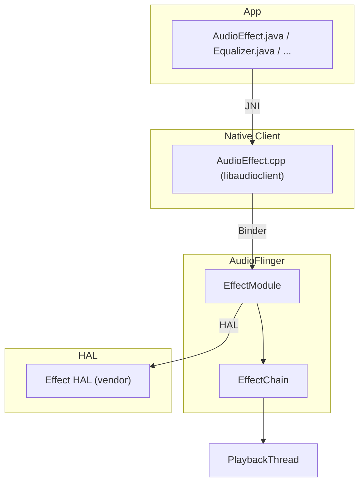
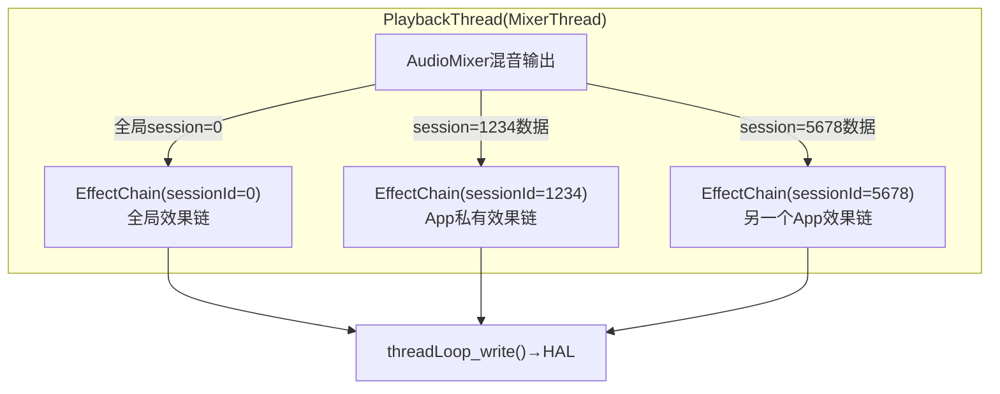
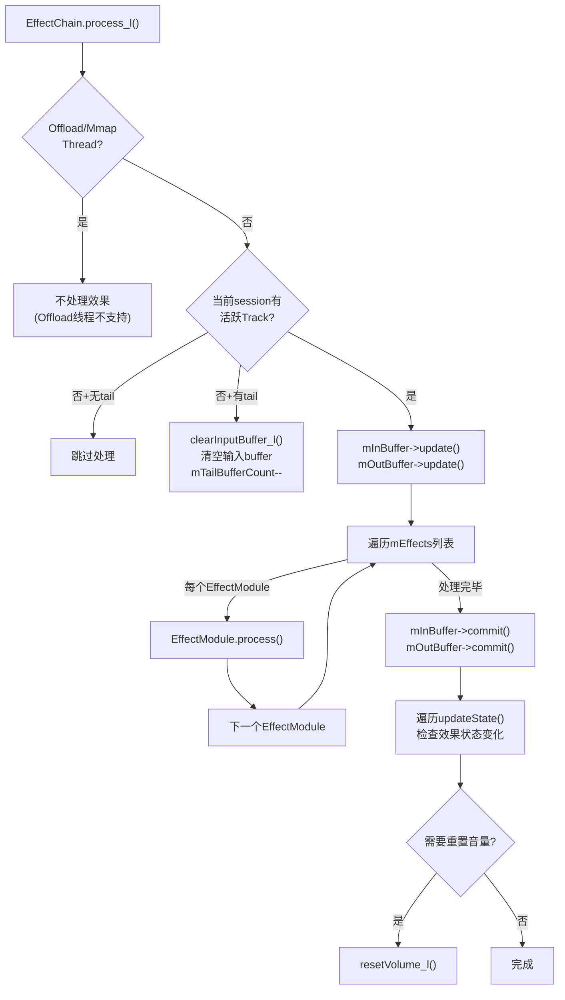
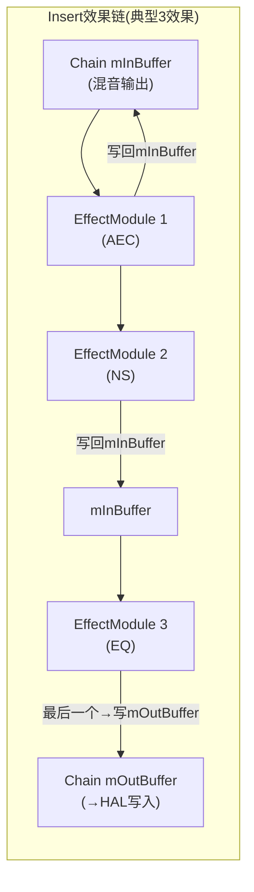
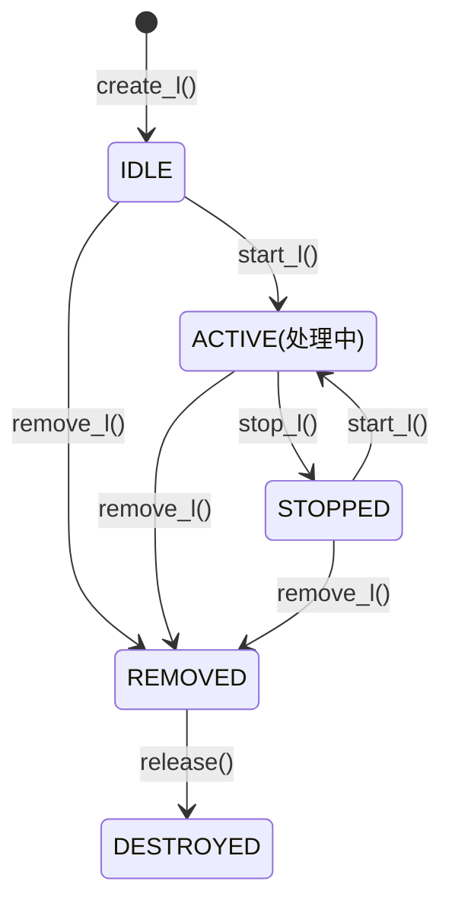
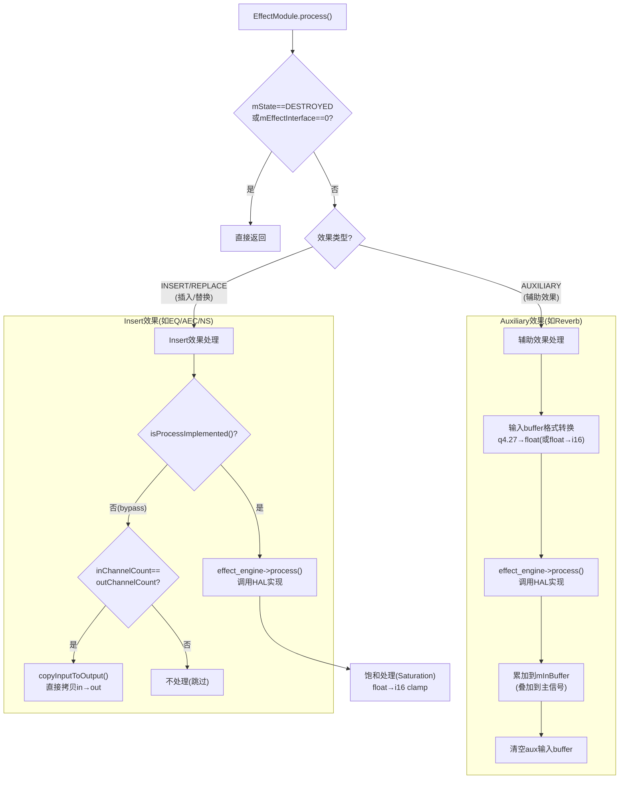

# 第七篇：Effects Framework

> [← 上一篇：Audio Policy Engine](06_Audio_Policy_Engine.md) | [返回导航](README.md) | [下一篇：HAL Layer →](08_HAL_Layer.md)

---

## 7.1 AudioEffect架构总览

### 模块职责
Effects Framework提供音频效果处理的统一框架，允许App和系统对音频流应用均衡器、低音增强、回声消除等效果。

### 分层架构



---

## 7.2 EffectChain — 效果链

### 模块职责
[`EffectChain`](frameworks/av/services/audioflinger/Effects.h:448)是同一sessionId下所有EffectModule的集合，按顺序串联处理音频数据。

### EffectChain与Thread的关系



> **关键**: session=0是全局效果链，作用于该Thread上所有Track。非0 sessionId的EffectChain只处理对应Track的数据。

### EffectChain内部处理流程 — [`process_l()`](frameworks/av/services/audioflinger/Effects.cpp:2273)



**Tail处理机制**: 某些效果(如Reverb)在Track停止后仍有残响(tail)。`mTailBufferCount`记录还需处理的帧数，确保残响自然衰减。

### Insert效果 vs Auxiliary效果

| 类型 | EFFECT_FLAG_TYPE | 在链中位置 | 输入buffer | 输出buffer | 说明 |
|------|-----------------|-----------|-----------|-----------|------|
| Insert(插入) | EFFECT_FLAG_TYPE_INSERT | 按优先级排序 | 前一个Effect的输出 | 下一个Effect的输入 | 串行处理，替换输入 |
| Auxiliary(辅助) | EFFECT_FLAG_TYPE_AUXILIARY | 链头部(mEffects[0]) | 独立mono buffer | 链输入buffer(mInBuffer) | 叠加到主信号上(如Reverb) |
| Pre-processing | EFFECT_FLAG_TYPE_PRE_PROC | 录音链中 | — | — | AEC/NS/AGC，录音方向 |
| Replace | EFFECT_FLAG_TYPE_REPLACE | 按优先级排序 | 链输入 | 链输出 | 完全替换信号(如Spatializer) |

**Insert效果排序规则** — [`getInsertIndex()`](frameworks/av/services/audioflinger/Effects.cpp:2382):
```
排序优先级(从前往后):
1. EFFECT_FLAG_TYPE_INSERT → 通用Insert效果(EQ/BassBoost)
2. EFFECT_FLAG_TYPE_AUXILIARY → 辅助效果(Reverb)
3. EFFECT_FLAG_TYPE_REPLACE → 替换效果(Spatializer)
4. 更高优先级的Insert排在前面
```

### 效果链Buffer管理



> **优化**: 多数Insert效果的输出写回mInBuffer(in-place处理)，只有最后一个效果写到mOutBuffer，减少内存拷贝。

---

## 7.3 EffectModule — 单个效果实例

### 模块职责
EffectModule封装一个音频效果实例，通过Effect HAL与Vendor实现交互。

### EffectModule状态机



### EffectModule.process()详解（源码: [`Effects.cpp:672`](frameworks/av/services/audioflinger/Effects.cpp:672)）



### 核心方法

| 方法 | 说明 | 源码位置 |
|------|------|---------|
| `create_l()` | 创建效果实例，加载HAL库 | Effects.cpp |
| `start_l()` | 启动效果处理(状态→ACTIVE) | Effects.cpp |
| `stop_l()` | 停止效果处理(状态→STOPPED) | Effects.cpp |
| `process()` | 处理一帧音频数据 | Effects.cpp:672 |
| `setVolume_l()` | 设置音量(效果可能修改音量曲线) | Effects.cpp |
| `setDevices_l()` | 设置输出设备(效果可能根据设备调整) | Effects.cpp |
| `setMode_l()` | 设置音频模式(NORMAL/RING/IN_CALL) | Effects.cpp |
| `setAudioSource_l()` | 设置录音源(AEC/NS需要知道录音源) | Effects.cpp |
| `updateState()` | 更新效果状态(参数变更) | Effects.cpp |

### FLOAT_EFFECT_CHAIN架构

AOSP14默认使用`FLOAT_EFFECT_CHAIN`，效果链内部使用float精度处理：

```
PCM16(Track输出) → float(EffectChain内部) → PCM16/PCM_FLOAT(HAL写入)
```

| 模式 | 内部格式 | 优势 |
|------|---------|------|
| FLOAT_EFFECT_CHAIN | float(32bit) | 高精度，无截断噪声 |
| 旧模式(PCM16链) | int16 | 兼容旧HAL |

> **Auxiliary效果**: 输入使用q4.27定点格式(避免AudioMixer累加溢出)，process()中转换为float处理

---

## 7.4 内置效果与Vendor效果

### 内置效果

| 效果 | Type UUID | 场景 |
|------|-----------|------|
| AcousticEchoCanceler | AEC | VoIP通话回声消除 |
| NoiseSuppressor | NS | VoIP通话降噪 |
| AutomaticGainControl | AGC | 自动增益控制 |
| Equalizer | EQ | 频率均衡 |
| BassBoost | — | 低音增强 |
| Virtualizer | — | 虚拟环绕声 |
| LoudnessEnhancer | — | 响度增强 |

### Vendor效果
Vendor在`audio_effects.xml`中声明自定义效果：
```xml
<effects>
    <effect name="custom_dsp_effect" uuid="xxx-xxx-xxx">
        <library name="custom_fx_lib" path="libfxcustom.so"/>
    </effect>
</effects>
```

### OEM定制点
- **自定义效果库**: 实现Effect HAL接口，在`audio_effects.xml`中声明
- **效果策略**: 通过`audio_effect_policy.xml`控制系统级效果的自动附加
- **预处理效果**: 为特定AudioSource附加AEC/NS/AGC（VoIP场景）

---

> [← 上一篇：Audio Policy Engine](06_Audio_Policy_Engine.md) | [返回导航](README.md) | [下一篇：HAL Layer →](08_HAL_Layer.md)