# 第七篇：Effects Framework

> [← 上一篇：Audio Policy Engine](06_Audio_Policy_Engine.md) | [返回导航](README.md) | [下一篇：HAL Layer →](08_HAL_Layer.md)

---

## 7.1 AudioEffect架构总览

### 模块职责
Effects Framework提供音频效果处理的统一框架，允许App和系统对音频流应用均衡器、低音增强、回声消除等效果。

### 分层架构

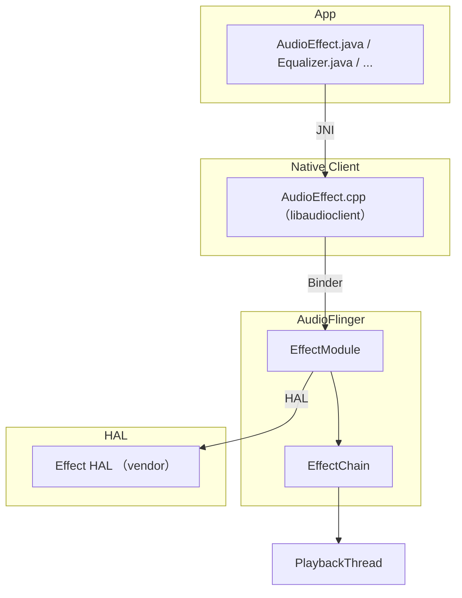

---

## 7.2 EffectChain — 效果链

### 模块职责
[`EffectChain`](frameworks/av/services/audioflinger/Effects.h:448)是同一sessionId下所有EffectModule的集合，按顺序串联处理音频数据。

### EffectChain与Thread的关系

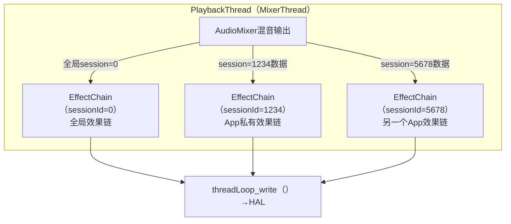

> **关键**: session=0是全局效果链，作用于该Thread上所有Track。非0 sessionId的EffectChain只处理对应Track的数据。

### EffectChain内部处理流程 — [`process_l()`](frameworks/av/services/audioflinger/Effects.cpp:2273)

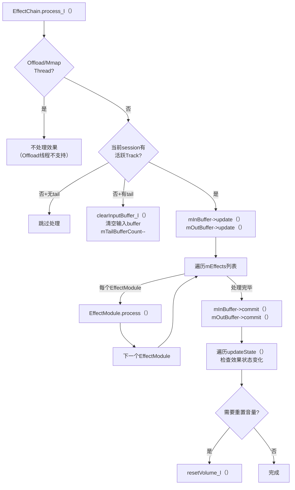

**Tail处理机制**: 某些效果(如Reverb)在Track停止后仍有残响(tail)。`mTailBufferCount`记录还需处理的帧数，确保残响自然衰减。

### Insert效果 vs Auxiliary效果

| 类型 | EFFECT_FLAG_TYPE | 在链中位置 | 输入buffer | 输出buffer | 说明 |
|------|-----------------|-----------|-----------|-----------|------|
| Insert(插入) | EFFECT_FLAG_TYPE_INSERT | 按优先级排序 | 前一个Effect的输出 | 下一个Effect的输入 | 串行处理，替换输入 |
| Auxiliary(辅助) | EFFECT_FLAG_TYPE_AUXILIARY | 链头部(mEffects[0]) | 独立mono buffer | 链输入buffer(mInBuffer) | 叠加到主信号上(如Reverb) |
| Pre-processing | EFFECT_FLAG_TYPE_PRE_PROC | 录音链中 | — | — | AEC/NS/AGC，录音方向 |
| Replace | EFFECT_FLAG_TYPE_REPLACE | 按优先级排序 | 链输入 | 链输出 | 完全替换信号(如Spatializer) |

**Insert效果排序规则** — [`getInsertIndex()`](frameworks/av/services/audioflinger/Effects.cpp:2382):
```
排序优先级(从前往后):
1. EFFECT_FLAG_TYPE_INSERT → 通用Insert效果(EQ/BassBoost)
2. EFFECT_FLAG_TYPE_AUXILIARY → 辅助效果(Reverb)
3. EFFECT_FLAG_TYPE_REPLACE → 替换效果(Spatializer)
4. 更高优先级的Insert排在前面
```

### 效果链Buffer管理

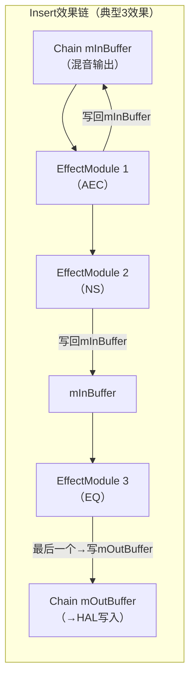

> **优化**: 多数Insert效果的输出写回mInBuffer(in-place处理)，只有最后一个效果写到mOutBuffer，减少内存拷贝。

---

## 7.3 EffectModule — 单个效果实例

### 模块职责
EffectModule封装一个音频效果实例，通过Effect HAL与Vendor实现交互。

### EffectModule状态机

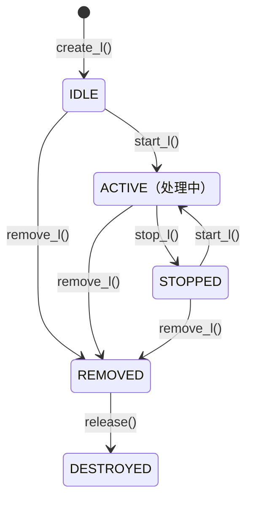

### EffectModule.process()详解（源码: [`Effects.cpp:672`](frameworks/av/services/audioflinger/Effects.cpp:672)）

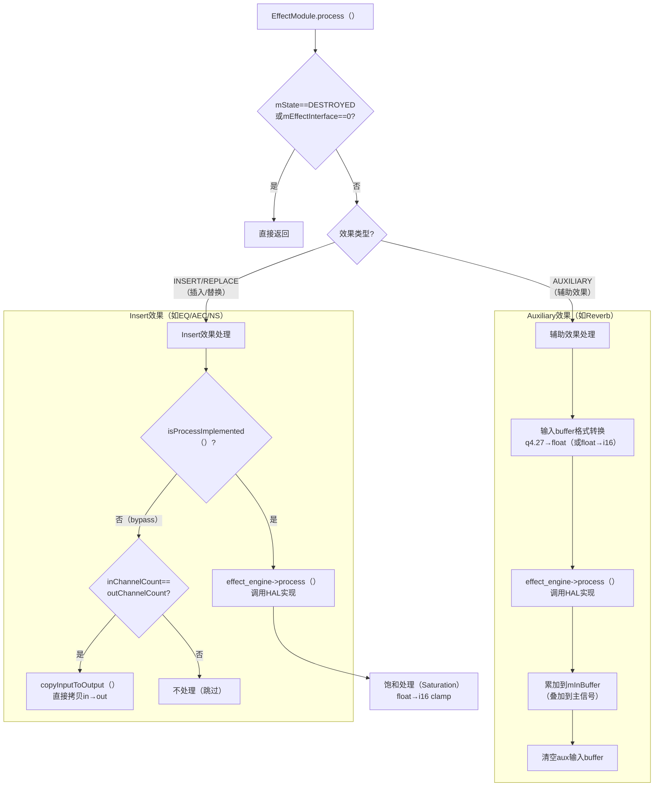

### 核心方法

| 方法 | 说明 | 源码位置 |
|------|------|---------|
| `create_l()` | 创建效果实例，加载HAL库 | Effects.cpp |
| `start_l()` | 启动效果处理(状态→ACTIVE) | Effects.cpp |
| `stop_l()` | 停止效果处理(状态→STOPPED) | Effects.cpp |
| `process()` | 处理一帧音频数据 | Effects.cpp:672 |
| `setVolume_l()` | 设置音量(效果可能修改音量曲线) | Effects.cpp |
| `setDevices_l()` | 设置输出设备(效果可能根据设备调整) | Effects.cpp |
| `setMode_l()` | 设置音频模式(NORMAL/RING/IN_CALL) | Effects.cpp |
| `setAudioSource_l()` | 设置录音源(AEC/NS需要知道录音源) | Effects.cpp |
| `updateState()` | 更新效果状态(参数变更) | Effects.cpp |

### FLOAT_EFFECT_CHAIN架构

AOSP14默认使用`FLOAT_EFFECT_CHAIN`，效果链内部使用float精度处理：

```
PCM16(Track输出) → float(EffectChain内部) → PCM16/PCM_FLOAT(HAL写入)
```

| 模式 | 内部格式 | 优势 |
|------|---------|------|
| FLOAT_EFFECT_CHAIN | float(32bit) | 高精度，无截断噪声 |
| 旧模式(PCM16链) | int16 | 兼容旧HAL |

> **Auxiliary效果**: 输入使用q4.27定点格式(避免AudioMixer累加溢出)，process()中转换为float处理

---

## 7.4 EffectModule内部架构详解

### 成员变量与HAL交互

[`EffectModule`](frameworks/av/services/audioflinger/Effects.h:220)的核心成员变量：

| 成员 | 类型 | 说明 | 源码行 |
|------|------|------|--------|
| `mConfig` | effect_config_t | 输入/输出音频配置（格式、通道、buffer） | L312 |
| `mEffectInterface` | sp＜EffectHalInterface＞ | Effect HAL接口（与vendor实现交互） | L313 |
| `mInBuffer` / `mOutBuffer` | sp＜EffectBufferHalInterface＞ | 输入/输出buffer（与HAL共享） | L314-315 |
| `mStatus` | status_t | 初始化状态（OK/错误码） | L316 |
| `mMaxDisableWaitCnt` | uint32_t | 最大禁用等待计数（10s超时） | L318 |
| `mDisableWaitCnt` | uint32_t | 当前禁用等待计数（grace period） | L320 |
| `mOffloaded` | bool | 是否offload到DSP | L321 |
| `mCurrentHalStream` | audio_io_handle_t | HAL输入流handle | L323 |

**FLOAT_EFFECT_CHAIN模式扩展成员**（AOSP14默认启用）：

| 成员 | 类型 | 说明 | 源码行 |
|------|------|------|--------|
| `mSupportsFloat` | bool | HAL是否支持float处理 | L327 |
| `mInConversionBuffer` | sp＜EffectBufferHalInterface＞ | 输入通道/格式转换buffer | L328 |
| `mOutConversionBuffer` | sp＜EffectBufferHalInterface＞ | 输出通道/格式转换buffer | L329 |
| `mInChannelCountRequested` | uint32_t | 链请求的输入通道数 | L330 |
| `mOutChannelCountRequested` | uint32_t | 链请求的输出通道数 | L331 |

### HAL交互流程

```mermaid
flowchart TB
    CREATE[\"create_l（）\"] --> FACTORY[\"EffectsFactoryHalInterface<br>createEffect（）\"]
    FACTORY --> AIDLCHK{\"AIDL可用?\"}
    AIDLCHK -->|\"是\"| AIDLEFF[\"AIDL Effect HAL<br＞IEffect.aidl\"]
    AIDLCHK -->|\"否\"| HIDLEFF[\"HIDL Effect HAL<br＞IEffect.hal\"]
    AIDLEFF --> INIT[\"init（）→configure（）\"]
    HIDLEFF --> INIT
    INIT --> SETBUF[\"setInBuffer/setOutBuffer<br＞分配EffectBufferHalInterface\"]
    SETBUF --> READY[\"EffectModule就绪<br＞等待start_l（）\"]

    CMD[\"command（）调用\"] --> HALCMD[\"mEffectInterface→command（）\"]
    PROCESS[\"process（）调用\"] --> HALPROC[\"mEffectInterface→process（）\"]
    SETDEV[\"setDevices（）\"] --> HALDEV[\"mEffectInterface→setDevice（）\"]
```

> **AIDL/HIDL双路径**: [`EffectsFactoryHalInterface::create()`](frameworks/av/media/libaudiohal/EffectsFactoryHalInterface.cpp)优先选择AIDL实现，回退到HIDL。

### EffectModule::process()完整数据路径（源码: [`Effects.cpp:672`](frameworks/av/services/audioflinger/Effects.cpp:672)）

```mermaid
flowchart TB
    PROC[\"EffectModule.process（）\"] --> CHK{\"已启用+状态OK?\"}
    CHK -->|\"否\"| BYPASS[\"data_bypass：<br＞copy或accumulate in→out\"]
    CHK -->|\"是\"| AUXCHK{\"Auxiliary效果?\"}

    AUXCHK -->|\"是\"| AUXCONV[\"输入格式转换<br＞q4.27→float或float→i16\"]
    AUXCONV --> HALPROC[\"mEffectInterface→process（）\"]
    AUXCHK -->|\"否（Insert/Replace）\"| FLTCHK{\"FLOAT_EFFECT_CHAIN?\"}

    FLTCHK -->|\"是\"| CHCONV{\"通道数不匹配<br＞或float不支持?\"}
    CHCONV -->|\"需要转换\"| ADJCH[\"adjust_channels（）<br＞或memcpy_to_i16_from_float（）\"]
    CHCONV -->|\"无需转换\"| HALPROC
    ADJCH --> HALPROC
    FLTCHK -->|\"否\"| HALPROC

    HALPROC --> FLTOUT{\"float输出<br＞需转换回?\"}
    FLTOUT -->|\"是\"| CONVOUT[\"memcpy_to_float_from_i16（）<br＞或adjust_selected_channels（）\"]
    FLTOUT -->|\"否\"| SATURATE[\"饱和处理（Saturation）\"]
    CONVOUT --> SATURATE
    SATURATE --> DONE[\"处理完成\"]
```

**关键转换路径详解**:

| 场景 | 输入格式 | HAL格式 | 转换操作 |
|------|---------|---------|---------|
| Auxiliary+FLOAT_AUX | q4.27(混音累加) | float | `memcpy_to_float_from_q4_27()` |
| Auxiliary+无FLOAT_AUX | q4.27 | i16 | `memcpy_to_i16_from_q4_27()` |
| Insert+不支持float | float(链内部) | i16 | `memcpy_to_i16_from_float()` in → i16 → HAL → i16 out → `memcpy_to_float_from_i16()` |
| Insert+通道不匹配 | N通道float | M通道float | `adjust_channels()` in转换 + `adjust_selected_channels()` out转换 |

---

## 7.5 EffectChain::process_l()深度解析

### process_l()完整源码逻辑（源码: [`Effects.cpp:2273`](frameworks/av/services/audioflinger/Effects.cpp:2273)）

process_l()的核心判断流程：

1. **Offload/Mmap线程检查**: `isOffloadOrMmap()`为true时跳过所有效果处理
2. **Track活跃检查**: 对于非全局session（sessionId≠0），检查`trackCnt()`和`activeTrackCnt()`
3. **Tail处理**: 无活跃Track但有tail时，`clearInputBuffer_l()`并递减`mTailBufferCount`
4. **效果遍历**: `mInBuffer->update()` → 遍历`mEffects[i]->process()` → `mInBuffer->commit()`
5. **状态更新**: 遍历`updateState()`，如有状态变化则`resetVolume_l()`

### Buffer update/commit机制

```mermaid
flowchart LR
    EXTERNAL[\"外部buffer<br＞（Thread分配）\"] --> UPDATE[\"update（）<br＞刷新缓存\"]
    UPDATE --> PROCESS[\"效果处理循环\"]
    PROCESS --> COMMIT[\"commit（）<br＞写回外部buffer\"]
    COMMIT --> HALBUF[\"HAL写入<br＞threadLoop_write（）\"]
```

> `update()/commit()`仅对外部buffer生效（Thread分配的shared buffer），对HAL分配的buffer无效。

### EffectChain::addEffect_ll()排序逻辑（源码: [`Effects.cpp:2350`](frameworks/av/services/audioflinger/Effects.cpp:2350)）

```mermaid
flowchart TB
    ADD[\"addEffect_ll（）\"] --> TYPECHK{\"效果类型?\"}
    TYPECHK -->|\"AUXILIARY\"| AUXINSERT[\"insertAt（0）<br＞插入链头部\"]
    TYPECHK -->|\"INSERT/REPLACE\"| IDX[\"getInsertIndex（）<br＞计算插入位置\"]
    IDX --> INSERTAT[\"insertAt（idx）<br＞按优先级排序\"]
    AUXINSERT --> SETBUF[\"分配aux mono buffer<br＞setInBuffer→auxBuf<br＞setOutBuffer→mInBuffer\"]
    INSERTAT --> SETBUF2[\"setInBuffer→前effect输出<br＞setOutBuffer→mInBuffer或mOutBuffer\"]
```

**Auxiliary效果buffer架构**: aux效果输入是独立的mono buffer（q4.27/float格式，避免AudioMixer饱和），输出叠加到mInBuffer（主信号），insert效果随后继续处理。

---

## 7.6 Spatializer空间音频架构详解

### 架构总览

[`Spatializer`](frameworks/av/services/audiopolicy/service/Spatializer.h:93)实现多通道空间音频+头部追踪，由AudioPolicyService管理，AudioFlinger提供专用SpatializerThread。

```mermaid
graph TB
    subgraph \"Java层（AudioService）\""
        ISPAT[\"ISpatializer.aidl<br＞getSpatializer（）\"]
    end
    subgraph \"AudioPolicyService\""
        SPAT[\"Spatializer<br＞BnSpatializer\"]
        APM[\"AudioPolicyManager<br＞路由决策\"]
    end
    subgraph \"AudioFlinger\""
        SPTH[\"SpatializerThread<br＞（MixerThread子类）\"]
        ENGINE[\"EffectModule<br＞（Spatializer引擎）\"]
    end
    subgraph \"Pose控制\""
        POSE[\"SpatializerPoseController<br＞SensorPoseProvider\"]
    end
    subgraph \"HAL\""
        SPATENG[\"Vendor Spatializer<br＞Effect HAL\"]
    end

    ISPAT -->|\"Binder\"| SPAT
    SPAT -->|\"onCheckSpatializer（）\"| APM
    APM -->|\"openSpatializerOutput\"| SPTH
    SPAT -->|\"attachOutput（）\"| ENGINE
    POSE -->|\"onHeadToStagePose（）\"| SPAT
    SPAT -->|\"setEffectParameter_l（）\"| ENGINE
    ENGINE --> SPATENG
```

### Spatializer工作流程

```mermaid
flowchart TB
    INIT[\"AudioPolicyService启动<br＞检查Spatializer引擎+专用输出profile\"]
    INIT --> CAPABLE{\"可创建Spatializer?\"}
    CAPABLE -->|\"否\"| NONE[\"不支持空间音频\"]
    CAPABLE -->|\"是\"| CREATE[\"Spatializer.create（）\"]
    CREATE --> DISCOVER[\"AudioService查询<br＞canBeSpatialized（）＋getSpatializer（）\"]
    DISCOVER --> SETLEVEL[\"setLevel（）→NONE以外级别\"]
    SETLEVEL --> ENABLE[\"onCheckSpatializer（）回调\"]
    ENABLE --> APMOPEN[\"AudioPolicyManager<br＞openSpatializerOutput\"]
    APMOPEN --> ATTACH[\"attachOutput（outputHandle）\"]
    ATTACH --> ACTIVATE[\"创建SpatializerThread<br＞加载Spatializer引擎EffectModule\"]
    ACTIVATE --> PLAYING[\"空间音频播放中\"]
    PLAYING --> HEADTRACK{\"头部追踪启用?\"}
    HEADTRACK -->|\"是\"| SENSOR[\"注册SensorEventListener<br＞PoseController计算head→stage变换\"]
    HEADTRACK -->|\"否\"| STATIC[\"静态空间化<br＞固定虚拟扬声器布局\"]
    SENSOR --> SETPOSE[\"setEffectParameter_l（）<br＞传递6元素head→stage矩阵\"]
    SETPOSE --> ENGINEPROC[\"引擎process（）<br＞应用空间化+头部追踪\"]
```

### ISpatializer关键API

| 方法 | 说明 | 源码行 |
|------|------|--------|
| `getSupportedLevels()` | 返回支持的空间化级别列表（NONE/SPATIALIZER） | L143 |
| `setLevel()` | 设置空间化级别，触发onCheckSpatializer回调 | L144 |
| `getSupportedHeadTrackingModes()` | 返回头部追踪模式（STATIC/DYNAMIC/TRACKED） | L147 |
| `setDesiredHeadTrackingMode()` | 设置期望追踪模式 | L149 |
| `setHeadSensor()/setScreenSensor()` | 注册头部/屏幕姿态传感器 | L155-156 |
| `setDisplayOrientation()` | 设置屏幕物理→逻辑方向角 | L157 |
| `setHingeAngle()/setFoldState()` | 可折叠设备铰链角度和折叠状态 | L158-159 |
| `registerHeadTrackingCallback()` | 注册头部追踪状态回调 | L162 |
| `setParameter()/getParameter()` | 直接与引擎交互的参数设置/获取 | L163-164 |
| `getOutput()` | 获取SpatializerThread的output handle | L165 |

### SpatializerPoseController

[`SpatializerPoseController`](frameworks/av/services/audiopolicy/service/SpatializerPoseController.h:44)整合头部传感器数据，计算head→stage变换矩阵：

- **SensorPoseProvider**: 封装Android SensorManager，监听指定传感器handle
- **HeadTrackingMode**: STATIC(固定虚拟布局) / DYNAMIC(屏幕相对) / TRACKED(实时头部追踪)
- **Pose3f**: 6DoF姿态(3旋转+3平移)，以4x4矩阵传递给Spatializer引擎

---

## 7.7 AudioEffect Java API详解

### AudioEffect基类核心API

[`AudioEffect`](frameworks/base/media/java/android/media/audiofx/AudioEffect.java)是所有音效的基类。

#### 构造函数

```java
AudioEffect(int type, int uuid, int priority, int audioSession)
// type: EFFECT_TYPE_*常量（如EFFECT_TYPE_AEC）
// uuid: 0表示自动选择实现，否则指定vendor UUID
// priority: 控制优先级（数值越高优先级越高）
// audioSession: 关联的AudioSession ID
```

#### 常见音效UUID常量

| 常量 | UUID | 说明 | 源码行 |
|------|------|------|--------|
| EFFECT_TYPE_EQUALIZER | 0x0a... | 频率均衡器 | L62 |
| EFFECT_TYPE_BASS_BOOST | 0x06... | 低音增强 | L64 |
| EFFECT_TYPE_VIRTUALIZER | 0x07... | 虚拟环绕声 | L66 |
| EFFECT_TYPE_REVERB | 0x08... | 环境回声(辅助) | L68 |
| EFFECT_TYPE_AEC | 0x7b... | 回声消除(预处理) | L70 |
| EFFECT_TYPE_NS | 0x7c... | 降噪(预处理) | L72 |
| EFFECT_TYPE_AGC | 0x7a... | 自动增益(预处理) | L74 |
| EFFECT_TYPE_LOUDNESS_ENHANCER | 0x0c... | 响度增强 | L76 |
| EFFECT_TYPE_DYNAMICS_PROCESSING | 0x7d... | 动态处理(多段压缩) | L78 |
| EFFECT_TYPE_HAPTIC_GENERATOR | 0x7e... | 触觉振动生成 | L80 |

#### 核心API方法

| 方法 | 说明 | 源码行 |
|------|------|--------|
| `setEnabled(boolean)` | 启用/禁用效果，返回int状态码 | L673 |
| `setParameter(byte[])` | 设置效果参数（原始byte） | L696 |
| `setParameter(int, int)` | 设置参数（两个int值） | L724 |
| `setParameter(int, short)` | 设置参数（int+short） | L743 |
| `setParameter(int, byte[])` | 设置参数（int key+byte[] value） | L761 |
| `setParameter(int, int[])` | 设置参数（int key+int数组） | L783 |
| `getParameter(byte[], byte[])` | 获取参数（原始byte交互） | L834 |
| `getParameter(int, int[])` | 获取参数（int key→int数组） | L863 |
| `getParameter(int, short[])` | 获取参数（int key→short数组） | L882 |
| `getParameter(int, int)` | 获取参数（int key→int value） | L901 |
| `getParameter(int, short)` | 获取参数（int key→short value） | L916 |
| `command(int, byte[], byte[])` | 发送自定义命令到效果引擎 | L1019 |
| `setControlStatusListener()` | 注册控制状态变更监听器 | L1089 |
| `setParameterListener()` | 注册参数变更监听器 | L1105 |
| `release()` | 释放效果资源 | L543 |

#### 参数传递机制

```mermaid
flowchart TB
    JAVA[\"AudioEffect.setParameter（）\"]
    JAVA --> JNI[\"JNI native_setParameter（）\"]
    JNI --> CMD[\"IEffect.command（）<br＞EFFECT_CMD_SET_PARAM\"]
    CMD --> CBLK{\"参数大小≤共享内存?\"}
    CBLK -->|\"是\"| SHMEM[\"effect_param_cblk_t<br＞通过共享内存传递\"]
    CBLK -->|\"否\"| BINDER[\"通过Binder传递<br＞cmdData vector＜uint8＞\"]
    SHMEM --> HAL[\"Effect HAL<br＞command（）处理\"]
    BINDER --> HAL
```

> **共享内存优化**: 小参数（≤cblk buffer大小）通过共享内存传递，避免Binder开销。大参数（如频响曲线）通过Binder传递。

---

## 7.8 常见音效类型完整列表与参数

### 预处理效果（录音方向，EFFECT_FLAG_TYPE_PRE_PROC）

| 效果 | Type UUID | Java类 | 典型参数 | 适用场景 |
|------|-----------|--------|---------|---------|
| AEC | ec7b... | AcousticEchoCanceler | echo_delay, echo_level | VoIP通话回声消除 |
| NS | c7c0... | NoiseSuppressor | noise_level, noise_type | VoIP通话降噪 |
| AGC | 7a0a... | AutomaticGainControl | target_level, compression_gain | VoIP自动增益 |

### 插入效果（播放方向，EFFECT_FLAG_TYPE_INSERT）

| 效果 | Type UUID | Java类 | 典型参数 | 适用场景 |
|------|-----------|--------|---------|---------|
| Equalizer | 0a0a... | Equalizer | band_levels[num_bands], center_freq, bandwidth | 音乐播放均衡 |
| BassBoost | 0606... | BassBoost | strength(0-1000) | 低音增强 |
| Virtualizer | 0707... | Virtualizer | strength(0-1000), speaker_angle | 虚拟环绕声 |
| LoudnessEnhancer | 0c0c... | LoudnessEnhancer | target_gain(mB) | 响度增强 |
| DynamicsProcessing | 7d7d... | DynamicsProcessing | compressor_gain, limiter_threshold, eq_band_gain | 多段压缩+限幅 |
| HapticGenerator | 7e7e... | HapticGenerator | haptic_intensity, vibrator_info | 触觉振动 |

### 辅助效果（播放方向，EFFECT_FLAG_TYPE_AUXILIARY）

| 效果 | Type UUID | Java类 | 典型参数 | 适用场景 |
|------|-----------|--------|---------|---------|
| EnvironmentalReverb | 0808... | EnvironmentalReverb | decay_time, decay_hf_ratio, diffusion, density | 环境回声(辅助叠加) |
| PresetReverb | 0909... | PresetReverb | preset(SMALLROOM/LARGEHALL...) | 预设回声 |

### 替换效果（EFFECT_FLAG_TYPE_REPLACE）

| 效果 | Type UUID | Java类 | 典型参数 | 适用场景 |
|------|-----------|--------|---------|---------|
| Spatializer | SPAT_UUID | — | head_to_stage_pose[6], channel_mask, spatialization_level | 空间音频(完全替换) |

### 效果Flag完整定义

| Flag | 值 | 说明 |
|------|---|------|
| EFFECT_FLAG_TYPE_INSERT | 0x000 | 插入效果（串行处理） |
| EFFECT_FLAG_TYPE_AUXILIARY | 0x001 | 辅助效果（叠加到主信号） |
| EFFECT_FLAG_TYPE_REPLACE | 0x002 | 替换效果（完全替换输出） |
| EFFECT_FLAG_TYPE_PRE_PROC | 0x003 | 预处理效果（录音方向） |
| EFFECT_FLAG_OUTPUT_SHIFT | 0x0000 | 无特殊输出 |
| EFFECT_FLAG_OUTPUT_ACCUMULATOR | 0x0100 | 输出累加模式 |
| EFFECT_FLAG_NO_PROCESS | 0x0200 | bypass模式（不处理数据） |
| EFFECT_FLAG_VOLUME_CTRL | 0x0400 | 音量控制效果 |
| EFFECT_FLAG_VOLUME_IND | 0x0800 | 音量指示效果 |
| EFFECT_FLAG_OFFLOAD_SUPPORTED | 0x1000 | 支持DSP offload |

---

## 7.9 内置效果与Vendor效果

### 内置效果

| 效果 | Type UUID | 场景 |
|------|-----------|------|
| AcousticEchoCanceler | AEC | VoIP通话回声消除 |
| NoiseSuppressor | NS | VoIP通话降噪 |
| AutomaticGainControl | AGC | 自动增益控制 |
| Equalizer | EQ | 频率均衡 |
| BassBoost | — | 低音增强 |
| Virtualizer | — | 虚拟环绕声 |
| LoudnessEnhancer | — | 响度增强 |

### Vendor效果
Vendor在`audio_effects.xml`中声明自定义效果：
```xml
<effects>
    <effect name="custom_dsp_effect" uuid="xxx-xxx-xxx">
        <library name="custom_fx_lib" path="libfxcustom.so"/>
    </effect>
</effects>
```

### OEM定制点
- **自定义效果库**: 实现Effect HAL接口，在`audio_effects.xml`中声明
- **效果策略**: 通过`audio_effect_policy.xml`控制系统级效果的自动附加
- **预处理效果**: 为特定AudioSource附加AEC/NS/AGC（VoIP场景）

## 7.10 EffectHandle — App音效控制的Binder代理

### 7.10.1 EffectHandle在音效架构中的位置

[`EffectHandle`](frameworks/av/services/audioflinger/Effects.h:359)继承自`android::media::BnEffect`，是IEffect AIDL接口的服务端实现。当App通过`AudioEffect`创建音效时，AudioFlinger创建`EffectModule`作为实际处理引擎，再创建`EffectHandle`作为Binder代理返回给App端。App的所有音效操作（enable/disable/command等）均通过Binder IPC到达`EffectHandle`，再由`EffectHandle`转发到对应的`EffectModule`。

**类关系图：**

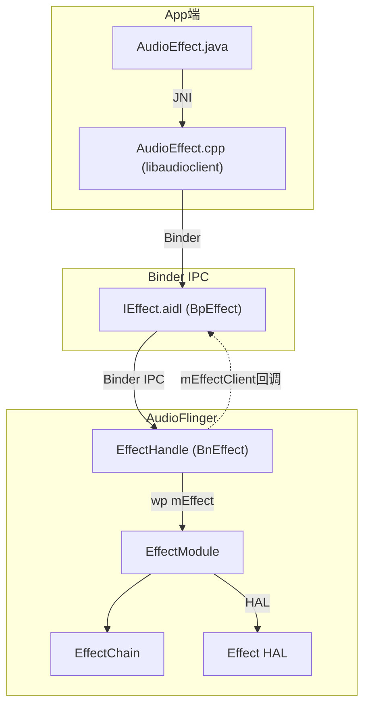

**EffectHandle核心成员变量（源码: [`Effects.h:417-436`](frameworks/av/services/audioflinger/Effects.h:417)）：**

| 成员 | 类型 | 说明 |
|------|------|------|
| `mLock` | Mutex | 保护IEffect方法调用的互斥锁 |
| `mEffect` | wp＜EffectBase＞ | 指向被控制的EffectModule（弱引用，避免循环依赖） |
| `mEffectClient` | sp＜media::IEffectClient＞ | 客户端回调接口（控制状态/启用状态/参数变更通知） |
| `mClient` | sp＜Client＞ | 客户端对象（共享内存分配） |
| `mCblkMemory` | sp＜IMemory＞ | 共享内存（控制块+参数buffer） |
| `mCblk` | effect_param_cblk_t* | 控制块（deferred参数设置的同步机制） |
| `mBuffer` | uint8_t* | 共享内存中的参数区域指针 |
| `mPriority` | int | 客户端控制优先级（数值越高优先级越高） |
| `mHasControl` | bool | 当前Handle是否拥有效果控制权 |
| `mEnabled` | bool | 缓存的启用状态（效果被suspend恢复后仍保持） |
| `mDisconnected` | bool | 是否已断开连接（disconnect()后设为true） |
| `mNotifyFramesProcessed` | bool | 是否需要EVENT_FRAMES_PROCESSED回调 |

**关键设计：控制权优先级机制**

多个App可同时创建同一EffectModule的多个EffectHandle，但只有优先级最高（mPriority最大）的Handle拥有控制权（`mHasControl=true`）。非控制Handle只能执行`EFFECT_CMD_GET_PARAM`查询参数，不能修改效果。

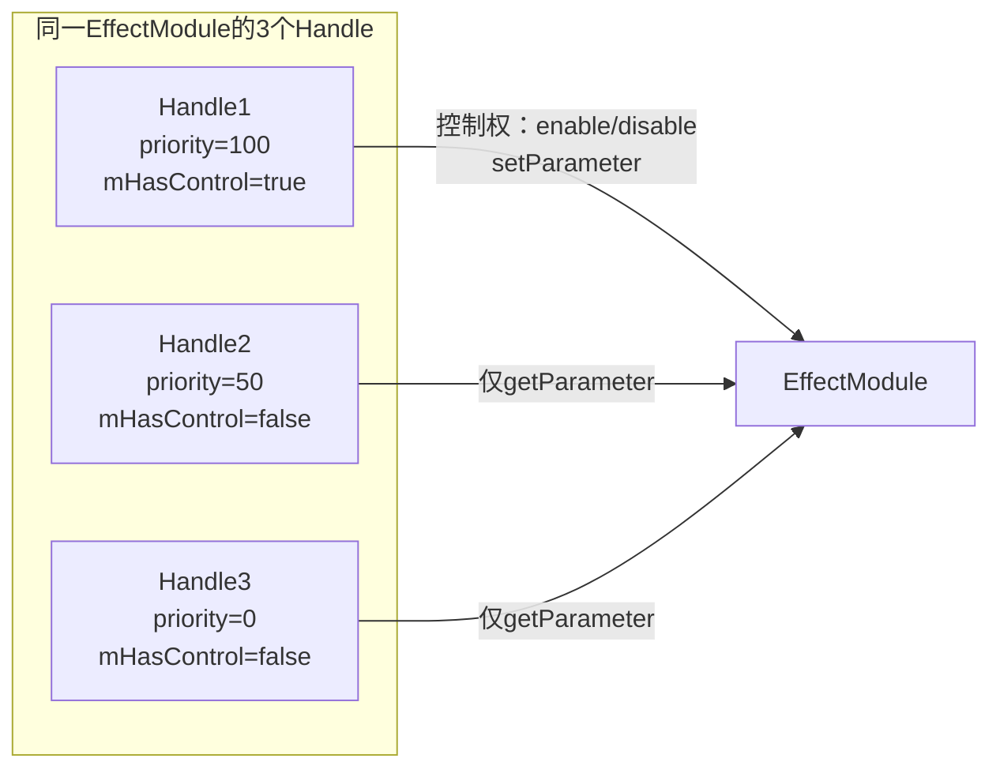

---

### 7.10.2 核心方法详解

#### enable() — 启用音效（源码: [`Effects.cpp:1852`](frameworks/av/services/audioflinger/Effects.cpp:1852)）

```cpp
Status AudioFlinger::EffectHandle::enable(int32_t* _aidl_return) {
    AutoMutex _l(mLock);
    sp<EffectBase> effect = mEffect.promote();
    if (effect == 0 || mDisconnected) {
        RETURN(DEAD_OBJECT);          // EffectModule已销毁或Handle已断开
    }
    if (!mHasControl) {
        RETURN(INVALID_OPERATION);     // 无控制权，拒绝操作
    }
    if (mEnabled) {
        RETURN(NO_ERROR);             // 已经启用，直接返回
    }
    mEnabled = true;
    // 1. 更新策略状态（通知AudioPolicyService）
    status_t status = effect->updatePolicyState();
    if (status != NO_ERROR) { mEnabled = false; RETURN(status); }
    // 2. 检查suspend状态（某些效果可能因策略被suspend）
    effect->checkSuspendOnEffectEnabled(true, false);
    if (effect->suspended()) { RETURN(NO_ERROR); } // 被suspend时仍标记mEnabled
    // 3. 实际启用效果
    status = effect->setEnabled(true, true /*fromHandle*/);
    if (status != NO_ERROR) { mEnabled = false; }
    RETURN(status);
}
```

**enable()流程图：**

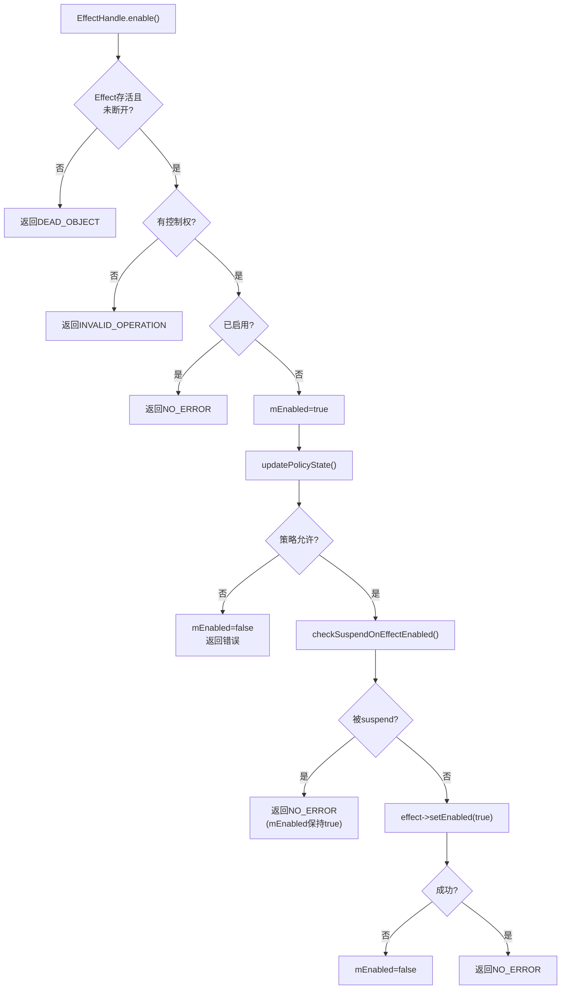

> **关键**: `mEnabled`与实际效果启用状态是两个概念。效果被suspend时`mEnabled=true`但实际未处理音频。当suspend解除后，EffectModule会根据`mEnabled`恢复效果。

#### disable() — 禁用音效（源码: [`Effects.cpp:1890`](frameworks/av/services/audioflinger/Effects.cpp:1890)）

```cpp
Status AudioFlinger::EffectHandle::disable(int32_t* _aidl_return) {
    AutoMutex _l(mLock);
    sp<EffectBase> effect = mEffect.promote();
    if (effect == 0 || mDisconnected) { RETURN(DEAD_OBJECT); }
    if (!mHasControl) { RETURN(INVALID_OPERATION); }
    if (!mEnabled) { RETURN(NO_ERROR); }
    mEnabled = false;
    effect->updatePolicyState();
    if (effect->suspended()) { RETURN(NO_ERROR); }
    status_t status = effect->setEnabled(false, true /*fromHandle*/);
    RETURN(status);
}
```

#### command() — 参数/命令交互（源码: [`Effects.cpp:1989`](frameworks/av/services/audioflinger/Effects.cpp:1989)）

`command()`是App与Effect HAL交互的核心通道，处理参数设置、查询和自定义命令：

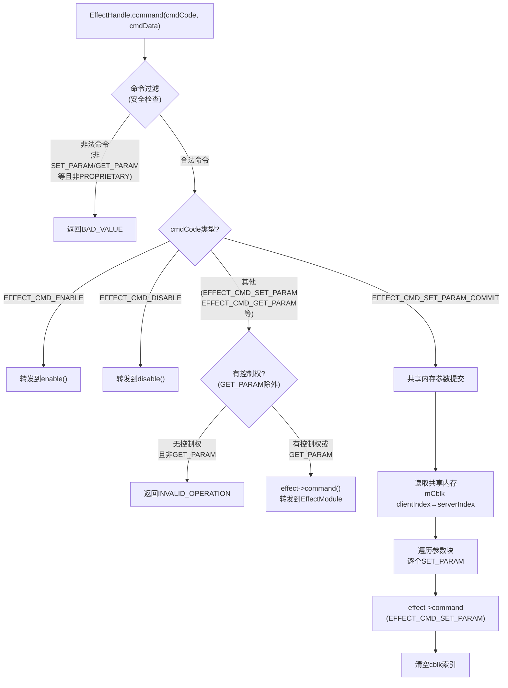

**共享内存参数提交机制（SET_PARAM_COMMIT）：**

App端通过`effect_param_cblk_t`共享内存批量提交参数，避免频繁Binder调用：

```cpp
// 共享内存结构
effect_param_cblk_t {
    Mutex lock;           // 同步锁
    uint32_t clientIndex; // App写入位置
    uint32_t serverIndex; // AF读取位置
};
// mBuffer区域: [size1][param1...][size2][param2...]...
```

App端先通过`EFFECT_CMD_SET_PARAM_DEFERRED`将参数写入共享内存buffer，再通过`EFFECT_CMD_SET_PARAM_COMMIT`触发AudioFlinger批量读取并逐个提交给Effect HAL。

---

### 7.10.3 EffectHandle生命周期（创建→使用→Binder死亡清理）

**创建时序图：**

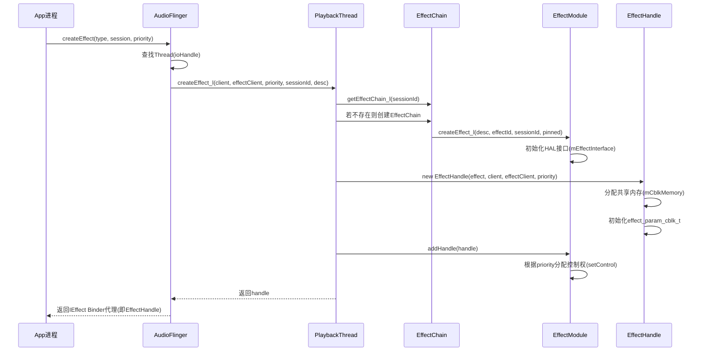

**Binder死亡清理时序图：**

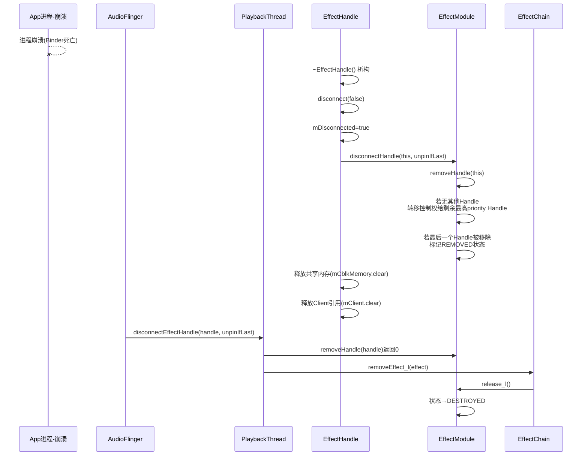

**关键步骤说明：**

1. **创建阶段**: `ThreadBase::createEffect_l()`（源码: [`Threads.cpp:1556`](frameworks/av/services/audioflinger/Threads.cpp:1556)）先创建`EffectModule`，再创建`EffectHandle`，通过`effect->addHandle(handle)`建立关联
2. **使用阶段**: App通过Binder调用`enable()/disable()/command()`，EffectHandle转发到EffectModule
3. **断开阶段**: `disconnect()`（源码: [`Effects.cpp:1924`](frameworks/av/services/audioflinger/Effects.cpp:1924)）将`mDisconnected=true`，调用`effect->disconnectHandle()`从EffectModule的handle列表中移除
4. **析构阶段**: `~EffectHandle()`调用`disconnect(false)`（不unpin），释放共享内存和Client引用
5. **Thread清理**: `disconnectEffectHandle()`（源码: [`Threads.cpp:1660`](frameworks/av/services/audioflinger/Threads.cpp:1660)）检查是否最后一个Handle，若是则`removeEffect_l()`销毁整个EffectModule

---

### 7.10.4 EffectHandle vs EffectModule职责对比

| 维度 | EffectHandle | EffectModule |
|------|-------------|-------------|
| 继承关系 | BnEffect（Binder服务端） | EffectBase（内部处理引擎） |
| 对外可见性 | 通过Binder暴露给App | AudioFlinger内部，不直接暴露 |
| 数量关系 | 同一EffectModule可有多个Handle | 每个音效实例一个Module |
| 核心职责 | Binder IPC代理、控制权管理、共享内存 | 音频数据处理、HAL交互、状态管理 |
| 生命周期 | 随App进程存活/死亡 | 随EffectChain存活，最后一个Handle断开时销毁 |
| mEffect引用 | wp＜EffectBase＞（弱引用，避免循环） | 持有sp＜EffectHalInterface＞（强引用HAL） |
| 参数传递 | 共享内存(mCblk/mBuffer)或Binder | 直接调用HAL command/process |
| 控制权 | mHasControl/mPriority管理 | 接收所有Handle命令，但只有控制Handle可修改 |
| 回调通知 | 通过mEffectClient通知App | 通过EffectHandle.commandExecuted/setEnabled通知 |

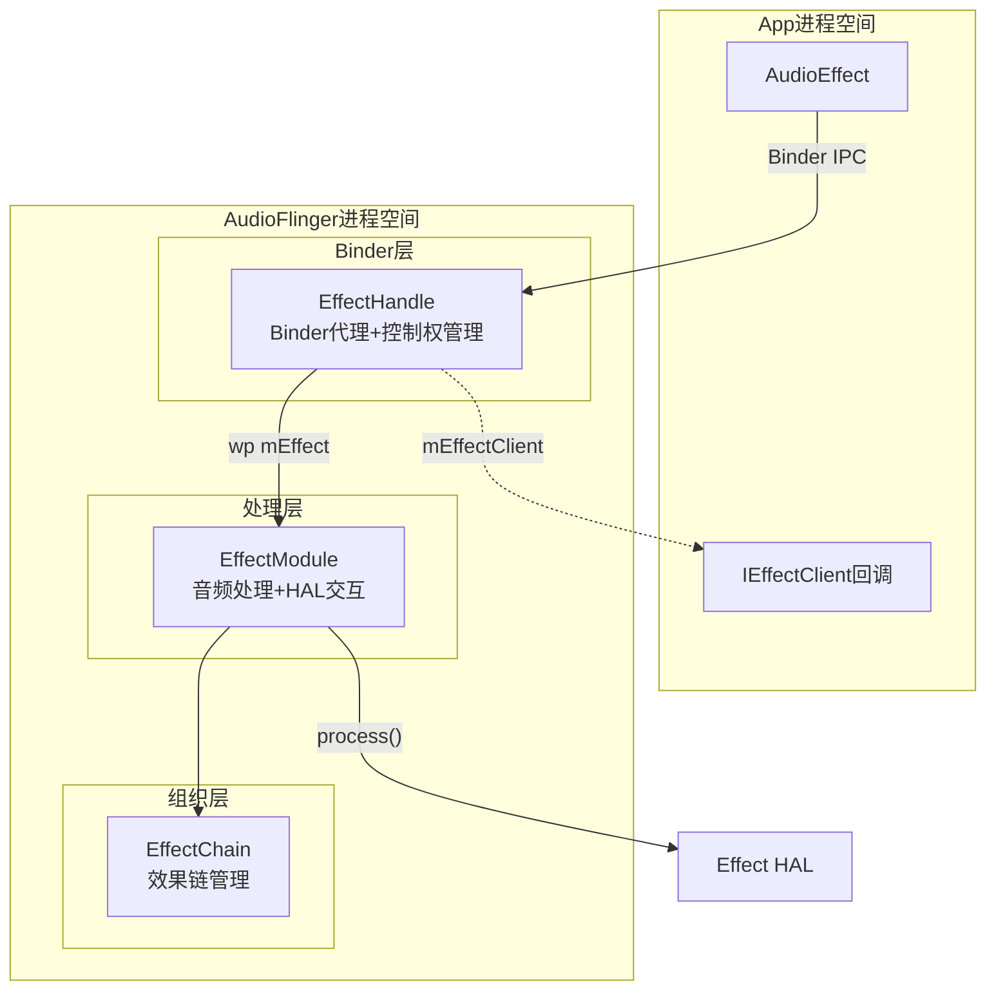

---

## 7.11 DeviceEffectProxy — 设备级音效代理

### 7.11.1 DeviceEffectProxy架构设计

[`DeviceEffectProxy`](frameworks/av/services/audioflinger/Effects.h:709)继承自`EffectBase`，用于设备级音效（Device Effect）的代理管理。与普通EffectModule不同，DeviceEffectProxy不绑定到特定Thread上的EffectChain，而是通过`DeviceEffectManager`管理，根据AudioPatch动态在相关Thread上创建EffectModule实例。

**DeviceEffectProxy架构图：**

```mermaid
graph TB
    subgraph "AudioPolicyService"
        APM["AudioPolicyManager<br>路由决策"]
    end
    subgraph "AudioFlinger"
        DEM["DeviceEffectManager<br>设备效果管理器"]
        DEP["DeviceEffectProxy<br>设备效果代理"]
        PROXYCB["ProxyCallback<br>代理回调"]
    end
    subgraph "Thread上的实例"
        EM1["EffectModule实例1<br>PlaybackThread A"]
        EM2["EffectModule实例2<br>PlaybackThread B"]
        EMHAL["mHalEffect<br>HW加速隧道效果"]
    end
    subgraph "Patch系统"
        PATCH1["AudioPatch 1<br>Speaker输出"]
        PATCH2["AudioPatch 2<br>蓝牙输出"]
    end

    APM -->|"createAudioPatch"| PATCH1
    APM -->|"createAudioPatch"| PATCH2
    PATCH1 -->|"onCreateAudioPatch"| DEM
    PATCH2 -->|"onCreateAudioPatch"| DEM
    DEM -->|"mDeviceEffects map"| DEP
    DEP -->|"mEffectHandles map"| EH1["EffectHandle(patch1)"]
    DEP -->|"mEffectHandles map"| EH2["EffectHandle(patch2)"]
    DEP -->|"mHalEffect"| EMHAL
    EH1 -->|"Thread A上创建"| EM1
    EH2 -->|"Thread B上创建"| EM2
    DEP -->|"mMyCallback"| PROXYCB
    EMHAL -->|"HW隧道"| HWHAL["Effect HAL<br>直接HW加速"]
```

**DeviceEffectProxy核心成员变量（源码: [`Effects.h:803-811`](frameworks/av/services/audioflinger/Effects.h:803)）：**

| 成员 | 类型 | 说明 |
|------|------|------|
| `mDevice` | const AudioDeviceTypeAddr | 目标设备（类型+地址） |
| `mManagerCallback` | const sp＜DeviceEffectManagerCallback＞ | 管理器回调接口 |
| `mMyCallback` | const sp＜ProxyCallback＞ | 代理回调（创建EffectModule时使用） |
| `mProxyLock` | Mutex | 保护mEffectHandles和mHalEffect |
| `mEffectHandles` | map＜audio_patch_handle_t, sp＜EffectHandle＞＞ | 每个AudioPatch对应的EffectHandle |
| `mHalEffect` | sp＜EffectModule＞ | HW加速隧道效果的EffectModule |
| `mDevicePort` | audio_port_config | 设备端口配置（HW加速时使用） |
| `mNotifyFramesProcessed` | const bool | 是否通知帧处理事件 |

---

### 7.11.2 多Thread音效实例管理

DeviceEffectProxy的核心能力是在不同AudioPatch对应的Thread上创建独立的EffectModule实例。当设备（如Speaker）同时有多个AudioPatch时，每个Patch对应的Thread上都会有一个EffectModule处理该Thread的音频数据。

**AudioPatch创建时效果绑定时序图：**

```mermaid
sequenceDiagram
    participant APM as AudioPolicyManager
    participant DEM as DeviceEffectManager
    participant DEP as DeviceEffectProxy
    participant Patch as PatchPanel
    participant Thread as PlaybackThread
    participant Module as EffectModule

    APM->>Patch: createAudioPatch(source→sink=device)
    Patch->>DEM: onCreateAudioPatch(patchHandle, patch)
    DEM->>DEP: onCreatePatch(patchHandle, patch)
    DEP->>DEP: checkPort(patch, source[0])
    DEP->>DEP: checkPort(patch, sinks[i]) - 匹配mDevice
    DEP->>DEP: 检查效果Flag类型(PRE_PROC/POST_PROC)
    alt HW加速隧道效果(EFFECT_FLAG_HW_ACC_TUNNEL)
        DEP->>Module: new EffectModule(mMyCallback, desc, sessionId=AUDIO_SESSION_DEVICE)
        DEP->>Module: setInputDevice(mDevice) 或 setDevices(mDevice)
        DEP->>Module: configure()
        DEP->>DEP: new EffectHandle(mHalEffect, nullptr, nullptr)
        DEP->>Module: addHandle(handle)
        Note over DEP: mHalEffect保存<br>直接与HW交互
    else 软件效果(patch.isSoftware或thread有效)
        DEP->>Thread: createEffect_l(nullptr, nullptr, 0, AUDIO_SESSION_DEVICE, desc)
        Thread->>Module: 创建EffectModule+EffectChain
        Thread->>Thread: 在Thread的EffectChain中添加Module
        Note over DEP: EffectHandle指向<br>Thread上的EffectModule
    end
    DEP->>DEP: mEffectHandles.emplace(patchHandle, handle)
    DEP->>DEP: 根据isEnabled状态调用handle->enable/disable
```

**setEnabled()的多Handle联动（源码: [`Effects.cpp:3312`](frameworks/av/services/audioflinger/Effects.cpp:3312)）：**

```cpp
status_t AudioFlinger::DeviceEffectProxy::setEnabled(bool enabled, bool fromHandle) {
    status_t status = EffectBase::setEnabled(enabled, fromHandle);
    Mutex::Autolock _l(mProxyLock);
    if (status == NO_ERROR) {
        for (auto& handle : mEffectHandles) {
            if (enabled) {
                handle.second->enable(&status);
            } else {
                handle.second->disable(&status);
            }
        }
    }
    return status;
}
```

当DeviceEffectProxy被启用/禁用时，它会联动所有已注册的EffectHandle——确保每个Thread上的EffectModule实例状态一致。

**AudioPatch释放时效果清理（源码: [`Effects.cpp:3461`](frameworks/av/services/audioflinger/Effects.cpp:3461)）：**

```mermaid
flowchart TB
    START["onReleasePatch(patchHandle)"] --> FIND{"mEffectHandles中<br>存在patchHandle?"}
    FIND -->|"否"| DONE["无操作"]
    FIND -->|"是"| REMOVE["从mEffectHandles中erase<br>释放EffectHandle"]
    REMOVE --> DESTROY["EffectHandle析构<br>disconnect()→EffectModule移除handle"]
```

**DeviceEffectManager创建流程（源码: [`DeviceEffectManager.cpp:59`](frameworks/av/services/audioflinger/DeviceEffectManager.cpp:59)）：**

```mermaid
flowchart TB
    START["DeviceEffectManager.createEffect_l()"] --> CHECK["checkEffectCompatibility()"]
    CHECK --> CHK{"兼容性检查通过?<br>仅允许PRE_PROC/POST_PROC<br>且HAL版本≥6.0"}
    CHK -->|"否"| FAIL["返回BAD_VALUE"]
    CHK -->|"是"| FIND{"mDeviceEffects中<br>已有该device的Proxy?"}
    FIND -->|"是"| EXIST["使用现有DeviceEffectProxy"]
    FIND -->|"否"| NEW["new DeviceEffectProxy(device, callback, desc)"]
    EXIST --> HANDLE["new EffectHandle(proxy, client, effectClient)"]
    NEW --> HANDLE
    HANDLE --> ADDH["effect->addHandle(handle)"]
    ADDH --> INIT["effect->init(patches)<br>遍历所有AudioPatch创建实例"]
    INIT --> STORE["mDeviceEffects.emplace(device, proxy)"]
```

---

### 7.11.3 DeviceEffectProxy与EffectHandle对比

| 维度 | DeviceEffectProxy | EffectHandle |
|------|-------------------|-------------|
| 继承关系 | EffectBase（音效基类） | BnEffect（Binder服务端） |
| 对外可见性 | AudioFlinger内部，不直接暴露给App | 通过Binder暴露给App |
| 生命周期管理 | 由DeviceEffectManager管理 | 随App进程存活/死亡 |
| 绑定对象 | 设备(AudioDeviceTypeAddr) | EffectModule/EffectBase |
| 效果实例 | 每个AudioPatch一个EffectModule实例 | 只关联一个EffectModule |
| sessionId | AUDIO_SESSION_DEVICE(-2) | App指定的sessionId |
| 启用联动 | setEnabled联动所有mEffectHandles | 只控制单个EffectModule |
| HW加速支持 | 通过mHalEffect实现隧道效果 | 不直接处理HW加速 |
| Patch感知 | 监听AudioPatch创建/释放 | 不感知AudioPatch |
| ProxyCallback | 自有ProxyCallback创建HAL | 通过EffectModule的Callback创建HAL |

**DeviceEffectProxy vs EffectHandle vs EffectModule 三层架构图：**

```mermaid
graph TB
    subgraph "App层(Binder交互)"
        APP["AudioEffect.java"]
        IEF["IEffect AIDL接口"]
    end
    subgraph "代理层(控制权+设备绑定)"
        EH["EffectHandle<br>Binder代理+控制权管理"]
        DEP["DeviceEffectProxy<br>设备代理+多Thread实例"]
    end
    subgraph "处理层(音频数据处理)"
        EM["EffectModule<br>单Thread效果处理"]
        EMHW["mHalEffect<br>HW隧道效果"]
    end
    subgraph "管理层"
        DEM["DeviceEffectManager<br>设备效果生命周期"]
        THD["PlaybackThread<br>Thread效果生命周期"]
    end

    APP -->|"Binder"| IEF -->|"IPC"| EH
    EH -->|"wp mEffect"| EM
    DEP -->|"mEffectHandles"| EH
    DEP -->|"mHalEffect"| EMHW
    DEM -->|"mDeviceEffects"| DEP
    THD -->|"EffectChain"| EM
```

> **核心区别**: EffectHandle是App→AudioFlinger的Binder通道，DeviceEffectProxy是AudioFlinger内部管理设备级音效的代理。前者解决"App如何控制音效"，后者解决"设备级音效如何在多个Thread上生效"。

## 7.12 内置音效Native实现 — libeffects

源码路径: [`frameworks/av/media/libeffects/`](frameworks/av/media/libeffects/)

Android内置音效的Native实现集中在`libeffects`目录下，包含音效工厂加载器、多种DSP音效处理器以及从HIDL到AIDL的迁移架构。本节从源码层面深入分析各子模块的实现细节。

### 7.12.1 EffectsFactory — 音效工厂加载器

源码路径:
- [`factory/EffectsFactory.c`](frameworks/av/media/libeffects/factory/EffectsFactory.c)
- [`factory/EffectsFactory.h`](frameworks/av/media/libeffects/factory/EffectsFactory.h)
- [`factory/EffectsFactoryState.h`](frameworks/av/media/libeffects/factory/EffectsFactoryState.h)
- [`factory/EffectsXmlConfigLoader.cpp`](frameworks/av/media/libeffects/factory/EffectsXmlConfigLoader.cpp)

EffectsFactory是整个音效框架的Native入口，负责解析XML配置、加载效果库`.so`、创建effect实例。它在7.3节EffectChain与7.4节AudioFlinger EffectHandle之间扮演桥梁角色。

#### 核心数据结构

| 数据结构 | 定义位置 | 功能 |
|---------|---------|------|
| [`lib_entry_t`](frameworks/av/media/libeffects/factory/EffectsFactory.h:39) | EffectsFactory.h | 库条目：desc/name/path/handle/effects链表/锁 |
| [`effect_entry_t`](frameworks/av/media/libeffects/factory/EffectsFactory.h:47) | EffectsFactory.h | 效果条目：itfe/subItfe/lib指针 |
| [`sub_effect_entry_t`](frameworks/av/media/libeffects/factory/EffectsFactory.h:53) | EffectsFactory.h | 子效果条目：含proxy UUID |
| [`list_elem_t`](frameworks/av/media/libeffects/factory/EffectsFactory.h:34) | EffectsFactory.h | 通用链表节点：object/next |

#### 全局状态

```c
// EffectsFactoryState.h
static list_elem_t *gLibraryList;       // 已加载库链表
static list_elem_t *gSkippedEffects;    // 跳过的效果
static list_elem_t *gSubEffectList;     // 子效果链表
static pthread_mutex_t gLibLock;        // 全局库操作锁
static list_elem_t *gLibraryFailedList; // 加载失败的库
```

#### 效果创建流程

```mermaid
sequenceDiagram
    participant AF as AudioFlinger
    participant EF as EffectsFactory
    participant XML as XmlConfigLoader
    participant LIB as libXXX.so
    participant EE as effect_entry_t

    AF->>EF: EffectCreate(uuid, session, ioHandle)
    EF->>EF: pthread_mutex_lock(gLibLock)
    EF->>EF: findEffect(uuid) 遍历gLibraryList
    alt 找到匹配UUID
        EF->>LIB: lib->desc->create_effect(uuid, session, ioHandle, &handle)
        LIB-->>EF: effect_handle_t
        EF->>EE: 创建effect_entry_t(itfe + subItfe + lib)
        EF->>EF: 将EE加入gEffectList
        EF-->>AF: 返回effect_handle_t
    else 未找到UUID
        EF->>EF: 检查gSubEffectList
        alt 找到子效果
            EF->>EF: doEffectCreate(代理UUID)
        else 完全未找到
            EF-->>AF: 返回EFFECT_NOT_FOUND
        end
    end
    EF->>EF: pthread_mutex_unlock(gLibLock)
```

核心函数[`EffectsFactory_createEffect()`](frameworks/av/media/libeffects/factory/EffectsFactory.c:444)的实现逻辑：

```c
// 简化流程
int EffectsFactory_createEffect(const effect_uuid_t *uuid,
        int32_t sessionId, int32_t ioHandle, effect_handle_t *pHandle) {
    // 1. 查找UUID对应的库
    ret = findEffect(uuid, &lib, &e);
    // 2. 调用库的create_effect
    ret = lib->desc->create_effect(uuid, sessionId, ioHandle, pHandle);
    // 3. 包装为effect_entry_t并注册
    entry->itfe = &gInterface;     // 无process_reverse
    // 或 entry->itfe = &gInterfaceWithReverse; // 有process_reverse
}
```

#### 双接口分发

EffectsFactory为每个effect实例分配不同的接口表：

| 接口表 | 特点 | 分配条件 |
|--------|------|---------|
| [`gInterface`](frameworks/av/media/libeffects/factory/EffectsFactory.c:105) | 无`process_reverse` | 默认 |
| [`gInterfaceWithReverse`](frameworks/av/media/libeffects/factory/EffectsFactory.c:124) | 包含`process_reverse` | 效果支持反向处理 |

两个接口表的`process`方法都代理到实际库实现，但`gInterfaceWithReverse`额外提供了`process_reverse`入口，用于AEC（回声消除）等需要双向处理的场景。

#### XML配置解析

[`EffectsXmlConfigLoader`](frameworks/av/media/libeffects/factory/EffectsXmlConfigLoader.cpp)负责解析[`audio_effects.xml`](frameworks/av/media/libeffects/data/audio_effects.xml)，其核心标签结构：

```xml
<audio_effects_conf>
    <libraries>
        <library name="bundle" path="libbundlewrapper.so"/>
        <library name="reverb" path="libreverbwrapper.so"/>
        <!-- 7个库定义 -->
    </libraries>
    <effects>
        <effect name="bassboost" library="bundle" uuid="..."/>
        <effect name="equalizer" library="bundle" uuid="..."/>
        <!-- 12个效果定义 -->
    </effects>
</audio_effects_conf>
```

库加载流程：

```mermaid
flowchart TD
    A[loadEffectsConfig] --> B[解析XML]
    B --> C{loadLibraries}
    C --> D[resolveLibrary: 在LD_EFFECT_LIBRARY_PATH中搜索]
    D --> E[dlopen打开.so]
    E --> F[dlsym获取AUDIO_EFFECT_LIBRARY_INFO_SYM_AS_STR]
    F --> G{版本校验}
    G -->|匹配| H[加入gLibraryList]
    G -->|不匹配| I[加入gLibraryFailedList]
```

[`loadLibrary()`](frameworks/av/media/libeffects/factory/EffectsXmlConfigLoader.cpp:180)的关键步骤：
1. 在`LD_EFFECT_LIBRARY_PATH`目录列表中搜索`.so`文件
2. `dlopen()`打开动态库
3. `dlsym()`查找`AUDIO_EFFECT_LIBRARY_INFO_SYM_AS_STR`符号
4. 版本校验：`desc->tag == AUDIO_EFFECT_LIBRARY_TAG`
5. 注册到全局链表

> **与7.3节的关系**：EffectsFactory创建的effect实例被AudioFlinger的EffectChain持有，通过`effect_entry_t.itfe`接口表进行命令分发。EffectChain的`setProcessEnable()`最终调用到`itfe->command(EFFECT_CMD_ENABLE)`。

### 7.12.2 DynamicsProcessing — 动态处理

源码路径:
- [`dynamicsproc/EffectDynamicsProcessing.cpp`](frameworks/av/media/libeffects/dynamicsproc/EffectDynamicsProcessing.cpp)
- [`dynamicsproc/aidl/DynamicsProcessingContext.h`](frameworks/av/media/libeffects/dynamicsproc/aidl/DynamicsProcessingContext.h)
- [`dynamicsproc/dsp/DPBase.h`](frameworks/av/media/libeffects/dynamicsproc/dsp/DPBase.h)
- [`dynamicsproc/dsp/DPFrequency.h`](frameworks/av/media/libeffects/dynamicsproc/dsp/DPFrequency.h)

DynamicsProcessing是多频段动态处理引擎，集成EQ、MBC（多频段压缩）、Limiter等功能，是Android音效框架中最复杂的内置效果器之一。

UUID: `e0e6539b-1781-7261-676f-6d7573696340`

#### DSP架构层次

```mermaid
classDiagram
    class DPStage {
        +setEnabled(bool)
        +process(ChannelBuffer&)
    }
    class DPBandStage {
        +mBands: vector~DPBandBase~
        +setBandParams()
    }
    class DPEq {
        +mEqBands: vector~DPEqBand~
    }
    class DPMbc {
        +mMbcBands: vector~DPMbcBand~
    }
    class DPBandBase {
        +gainPre: float
        +gainPost: float
    }
    class DPEqBand {
        +frequency: float
        +bandwidth: float
    }
    class DPMbcBand {
        +attack: float
        +release: float
        +ratio: float
        +threshold: float
        +kneeWidth: float
        +noiseGate: float
        +expanderRatio: float
    }
    class DPBase {
        +mChannels: vector~DPChannel~
        +process()
    }
    class DPFrequency {
        +mFFT: Eigen FFT
        +ChannelBuffer: 循环缓冲
    }
    DPStage <|-- DPBandStage
    DPBandStage <|-- DPEq
    DPBandStage <|-- DPMbc
    DPBandBase <|-- DPEqBand
    DPBandBase <|-- DPMbcBand
    DPBase <|-- DPFrequency
```

#### 信号处理流程

DynamicsProcessing的完整信号链：

```mermaid
flowchart LR
    A[Input] --> B[InputGain]
    B --> C[PreEq\n5 bands]
    C --> D[MBC\n5 bands]
    D --> E[PostEq\n5 bands]
    E --> F[Limiter]
    F --> G[OutputGain]
    G --> H[Output]
    
    style C fill:#e1f5fe
    style D fill:#fff3e0
    style E fill:#e1f5fe
    style F fill:#fce4ec
```

每个阶段的默认参数：

| 阶段 | 频段数 | 默认参数 |
|------|--------|---------|
| PreEq | 5 | 频段可配置，增益默认0dB |
| MBC | 5 | attack=50ms, release=120ms, ratio=2, threshold=-30dB |
| PostEq | 5 | 频段可配置，增益默认0dB |
| Limiter | 1 | attack=50ms, release=120ms, ratio=2, threshold=-30dB |

#### 旧HAL实现

[`EffectDynamicsProcessing.cpp`](frameworks/av/media/libeffects/dynamicsproc/EffectDynamicsProcessing.cpp)实现了C语言HAL接口：

```c
// 核心结构
struct DynamicsProcessingContext {
    const effect_interface_t *itfe;
    effect_config_t config;
    dp_fx::DPBase* mPDynamics;         // DSP引擎
    int mCurrentVariant;               // 当前变体
    // ...
};

// 命令处理
int DynamicsProcessing_command(effect_handle_t self, uint32_t cmdCode,
    uint32_t cmdSize, void *pCmdData, uint32_t *replySize, void *pReplyData);
```

#### AIDL实现

[`DynamicsProcessingContext`](frameworks/av/media/libeffects/dynamicsproc/aidl/DynamicsProcessingContext.h)继承自`EffectContext`，使用频域变体`dp_fx::DPFrequency`：

```cpp
class DynamicsProcessingContext final : public EffectContext {
    RetCode setEngineArchitecture(
        const DynamicsProcessing::EngineArchitecture& engineArchitecture);
    IEffect::Status lvmProcess(float* in, float* out, int samples) override;
private:
    std::unique_ptr<dp_fx::DPFrequency> mDpFreq;
    DynamicsProcessing::EngineArchitecture mEngineArchitecture = {
        .resolutionPreference =
            DynamicsProcessing::ResolutionPreference::FAVOR_FREQUENCY_RESOLUTION,
        .preEqStage   = {.inUse = true, .bandCount = kBandCount},  // 5
        .postEqStage  = {.inUse = true, .bandCount = kBandCount},  // 5
        .mbcStage     = {.inUse = true, .bandCount = kBandCount},  // 5
        .limiterInUse = true,
    };
};
```

#### 频域处理核心

[`DPFrequency`](frameworks/av/media/libeffects/dynamicsproc/dsp/DPFrequency.h)基于Eigen FFT实现频域处理：

- **ChannelBuffer**：管理`cBInput`/`cBOutput`循环缓冲 + `complexTemp`频域临时向量
- **FFT处理**：时域输入 → FFT → 频域EQ/MBC处理 → IFFT → 时域输出
- **MbcBandParams**完整参数：`gainPre/gainPost/attack/release/ratio/threshold/kneeWidth/noiseGate/expanderRatio`
- **LimiterParams**：`linkGroup/attack/release/ratio/threshold/postGain`
- **处理时长**：`kPreferredProcessingDurationMs = 10.0f`

> **与7.6节的对应关系**：Java层的`android.media.audiofx.DynamicsProcessing`通过Binder调用到AudioFlinger的EffectHandle，最终到达此Native实现。Java层的`MbcBand`参数直接映射到Native的`DPMbcBand`。

### 7.12.3 HapticGenerator — 触觉生成

源码路径:
- [`hapticgenerator/EffectHapticGenerator.cpp`](frameworks/av/media/libeffects/hapticgenerator/EffectHapticGenerator.cpp)
- [`hapticgenerator/Processors.h`](frameworks/av/media/libeffects/hapticgenerator/Processors.h)
- [`hapticgenerator/Processors.cpp`](frameworks/av/media/libeffects/hapticgenerator/Processors.cpp)
- [`hapticgenerator/aidl/HapticGeneratorContext.h`](frameworks/av/media/libeffects/hapticgenerator/aidl/HapticGeneratorContext.h)

HapticGenerator从音频信号中提取并生成触觉振动信号，是Android 12引入的音效类型，用于增强触觉反馈体验。

UUID: `97c4acd1-8b82-4f2f-832e-c2fe5d7a9931`
效果标志: `EFFECT_FLAG_INSERT_FIRST`（确保在效果链中优先处理）

#### 处理器链架构

HapticGenerator的信号处理由多个处理器串联完成：

```mermaid
flowchart LR
    A[Audio Input] --> B[Ramp\n半波整流]
    B --> C[BPF\n带通滤波]
    C --> D[Distortion\n压缩失真]
    D --> E[BSF\n带阻滤波]
    E --> F[SlowEnvelope\n慢包络]
    F --> G[Scaling\n缩放输出]
    G --> H[Haptic Output]
    
    style B fill:#e8f5e9
    style C fill:#e3f2fd
    style D fill:#fff3e0
    style E fill:#e3f2fd
    style F fill:#fce4ec
```

#### 处理器详解

| 处理器 | 类名 | 功能 | 关键参数 |
|--------|------|------|---------|
| Ramp | [`Ramp`](frameworks/av/media/libeffects/hapticgenerator/Processors.h:30) | 半波整流，非负化 | 无 |
| BPF | BiquadFilter | 带通滤波，提取振动频段 | resonantFreq, Q |
| Distortion | [`Distortion`](frameworks/av/media/libeffects/hapticgenerator/Processors.h:50) | 压缩失真，含LPF | cornerFrequency, inputGain, outputGain |
| BSF | BiquadFilter | 带阻滤波，去除共振峰 | resonantFreq, zeroQ=8, poleQ=4 |
| SlowEnvelope | [`SlowEnvelope`](frameworks/av/media/libeffects/hapticgenerator/Processors.h:40) | 低通滤波+幂归一化 | 控制触觉强度包络 |

各处理器的具体实现：

```cpp
// Ramp: 半波整流
class Ramp {
    void process(float *out, const float *in, size_t frameCount);
    // out[i] = max(in[i], 0) — 只保留正半波
};

// SlowEnvelope: 慢包络检测
class SlowEnvelope {
    void process(float *out, const float *in, size_t frameCount);
    // 低通滤波 → 幂归一化 → 控制触觉强度
};

// Distortion: 压缩失真
class Distortion {
    void process(float *out, const float *in, size_t frameCount);
    void setCornerFrequency(float cornerFrequency);
    void setInputGain(float inputGain);
    void setOutputGain(float outputGain);
    // LPF滤波 → cube阈值压缩 → 增益输出
};
```

#### 振动器信息交互

HapticGenerator依赖`VibratorInfo`（共振频率等）来调整滤波器系数：

```mermaid
sequenceDiagram
    participant App as Application
    participant HG as HapticGenerator
    participant VI as VibratorInfo
    participant VS as VibratorService

    App->>HG: setParameter(VIBRATOR_INFO)
    HG->>VI: 获取resonantFrequency
    VI->>VS: 查询振动器共振频率
    VS-->>VI: resonantFreq=150Hz
    HG->>HG: 更新BPF/BSF滤波器系数
    Note over HG: BPF中心频率=resonantFreq
    Note over HG: BSF零点频率=resonantFreq
```

#### AIDL实现

[`HapticGeneratorContext`](frameworks/av/media/libeffects/hapticgenerator/aidl/HapticGeneratorContext.h)继承`EffectContext`：

```cpp
struct HapticGeneratorParam {
    HapticGenerator::HapticChannel mHapticChannelSource[2]; // 触觉通道源
    float mHapticScale;                                      // 触觉缩放
    HapticGenerator::VibratorInfo mVibratorInfo;             // 振动器信息
};

class HapticGeneratorContext : public EffectContext {
    HapticGeneratorProcessorsRecord mProcessorsRecord;
    // 管理所有滤波器: filters/ramps/slowEnvs/distortions/bpf/bsf
};
```

默认参数：
- `resonantFreq = 150Hz`
- `BSF_ZERO_Q = 8, BSF_POLE_Q = 4`
- `distortionOutputGain = 1.5`

> **与VibratorService的交互**：HapticGenerator不直接驱动振动器，而是生成振动信号叠加到音频输出流中。实际的触觉振动由AudioFlinger将处理后的信号路由到振动器HAL。

### 7.12.4 LoudnessEnhancer — 响度增强

源码路径:
- [`loudness/EffectLoudnessEnhancer.cpp`](frameworks/av/media/libeffects/loudness/EffectLoudnessEnhancer.cpp)
- [`loudness/dsp/core/dynamic_range_compression.h`](frameworks/av/media/libeffects/loudness/dsp/core/dynamic_range_compression.h)
- [`loudness/aidl/LoudnessEnhancerContext.h`](frameworks/av/media/libeffects/loudness/aidl/LoudnessEnhancerContext.h)

LoudnessEnhancer基于自适应动态范围压缩实现响度增强，通过提升低能量信号的增益来改善感知响度。

UUID: `fa415329-2034-4bea-b5dc-5b381c8d1e2c`
处理格式: `AUDIO_FORMAT_PCM_FLOAT`（仅支持浮点）

#### DSP核心算法

[`AdaptiveDynamicRangeCompression`](frameworks/av/media/libeffects/loudness/dsp/core/dynamic_range_compression.h)采用对数域Branching-Smooth峰值检测：

```mermaid
flowchart TD
    A[输入信号x] --> B[绝对值取模]
    B --> C[对数转换\nto log domain]
    C --> D[Branching-Smooth\n峰值检测器]
    D --> E{信号级别判断}
    E -->|快速变化| F[Compress\n高精度压缩]
    E -->|正常变化| G[CompressNormalSpeed\n正常压缩]
    E -->|缓慢变化| H[CompressSlow\n低精度压缩]
    F --> I[增益计算\ngain = target - detected]
    G --> I
    H --> I
    I --> J[指数转换\nto linear domain]
    J --> K[增益应用\noutput = input * gain]
    K --> L[输出信号]
```

核心类接口：

```cpp
class AdaptiveDynamicRangeCompression {
    bool Initialize(float target_gain, float sampling_rate);
    float Compress(float x);           // 单样本高精度压缩
    void Compress(float *x1, float *x2); // 双通道压缩
    void set_knee_threshold(float decibel);
    void set_knee_threshold_via_target_gain(float target_gain);
};
```

#### 算法原理

LoudnessEnhancer的核心思想是**对数域自适应动态范围压缩**：

1. **峰值检测**：Branching-Smooth检测器根据信号变化速率选择不同时间常数
   - `Compress()`：高精度，attack/release时间常数最短
   - `CompressNormalSpeed()`：正常精度
   - `CompressSlow()`：低精度，时间常数最长（用于稳态信号）

2. **增益计算**：在对数域中，`gain = target_gain - detected_level`
   - 低能量信号获得更大增益（响度提升）
   - 高能量信号增益接近1（避免削波）

3. **Knee阈值**：软拐点平滑压缩曲线，避免硬切换失真

#### 旧HAL实现

```c
// EffectLoudnessEnhancer.cpp
struct LoudnessEnhancerContext {
    const effect_interface_t *itfe;
    effect_config_t config;
    int32_t mTargetGainmB;                              // 目标增益(mB)
    le_fx::AdaptiveDynamicRangeCompression* mCompressor; // 压缩器实例
};

// 命令处理
case LOUDNESS_ENHANCER_SET_TARGET_GAIN:
    context->mTargetGainmB = *(int32_t *)pCmdData;
    context->mCompressor->set_knee_threshold_via_target_gain(
        context->mTargetGainmB / 100.0f);  // mB → dB
    break;
```

#### AIDL实现

```cpp
class LoudnessEnhancerContext : public EffectContext {
    float mGain = LOUDNESS_ENHANCER_DEFAULT_TARGET_GAIN_MB;
    IEffect::Status lvmProcess(float* in, float* out, int samples) override;
    // 内部使用 le_fx::AdaptiveDynamicRangeCompression
};
```

> **与7.6节的对应关系**：Java层`android.media.audiofx.LoudnessEnhancer`的`setTargetGain(int gainmB)`直接映射到Native的`mTargetGainmB`参数。增益单位为毫贝(mB)，1dB = 100mB。

### 7.12.5 Downmix — 环绕声混音

源码路径:
- [`downmix/EffectDownmix.cpp`](frameworks/av/media/libeffects/downmix/EffectDownmix.cpp)
- [`downmix/aidl/DownmixContext.h`](frameworks/av/media/libeffects/downmix/aidl/DownmixContext.h)

Downmix将多声道（5.1/7.1）音频混音为立体声，遵循ITU-R BS.775标准的混音矩阵系数。

UUID: `93f04452-e4fe-41cc-91f9-e475b6d1d69f`

#### 混音类型

| 类型 | 枚举值 | 行为 |
|------|--------|------|
| Strip | `DOWNMIX_TYPE_STRIP` | 简单截取：只取前两声道（L/R），丢弃其余 |
| Process | `DOWNMIX_TYPE_PROCESS` | 矩阵混音：按ITU-R BS.775系数混合所有声道 |

#### 混音矩阵

Process模式下的ITU-R BS.775标准混音系数（5.1→立体声）：

```
输出L = 1.0*FL + 0.707*FC + 0.707*SL + 0.5*BL + 0*LF + 0*SR + 0*BR
输出R = 1.0*FR + 0.707*FC + 0.5*BL  + 0.707*SR + 0*LF + 0*SL + 0*BR
```

核心实现使用`audio_utils::ChannelMix`：

```cpp
// EffectDownmix.cpp
#include <audio_utils/ChannelMix.h>

// 核心混音引擎
static const audio_utils::channels::ChannelMix<AUDIO_CHANNEL_OUT_STEREO> sChannelMix;

// Process模式混音
int Downmix_process(effect_handle_t self, audio_buffer_t *in, audio_buffer_t *out) {
    // 调用ChannelMix进行矩阵混音
    sChannelMix.process(in->f32, out->f32, frameCount, inputChannelMask, false);
}
```

#### AIDL实现

```cpp
class DownmixContext : public EffectContext {
    Downmix::Type mType = Downmix::Type::PROCESS;  // 默认矩阵混音
    audio_utils::channels::ChannelMix<AUDIO_CHANNEL_OUT_STEREO> mChannelMix;

    void setOutputDevice(audio_port_v7 device) {
        // 根据输出设备切换混音类型
        if (device.type == AUDIO_DEVICE_OUT_WIRED_HEADSET ||
            device.type == AUDIO_DEVICE_OUT_WIRED_HEADPHONE) {
            mType = Downmix::Type::PROCESS;  // 耳机使用矩阵混音
        } else {
            mType = Downmix::Type::STRIP;    // 其他设备截取
        }
    }
};
```

```mermaid
flowchart TD
    A[5.1/7.1多声道输入] --> B{Downmix Type}
    B -->|STRIP| C[截取前两声道\nFL + FR]
    B -->|PROCESS| D[ITU-R BS.775\n矩阵混音]
    C --> E[立体声输出]
    D --> E
    
    style B fill:#fff3e0
    style D fill:#e3f2fd
```

> **与7.3节EffectChain的关系**：当AudioPolicy将多声道Track路由到立体声输出设备时，AudioFlinger的EffectChain自动插入Downmix效果器，确保声道数匹配。

### 7.12.6 LVM Bundle — 低音/均衡/混响/虚拟器

源码路径:
- [`lvm/wrapper/Bundle/EffectBundle.cpp`](frameworks/av/media/libeffects/lvm/wrapper/Bundle/EffectBundle.cpp)（148.8KB，旧HAL）
- [`lvm/wrapper/Bundle/EffectBundle.h`](frameworks/av/media/libeffects/lvm/wrapper/Bundle/EffectBundle.h)
- [`lvm/wrapper/Aidl/EffectBundleAidl.h`](frameworks/av/media/libeffects/lvm/wrapper/Aidl/EffectBundleAidl.h)
- [`lvm/wrapper/Aidl/BundleContext.h`](frameworks/av/media/libeffects/lvm/wrapper/Aidl/BundleContext.h)
- [`lvm/wrapper/Aidl/GlobalSession.h`](frameworks/av/media/libeffects/lvm/wrapper/Aidl/GlobalSession.h)
- [`lvm/wrapper/Aidl/BundleTypes.h`](frameworks/av/media/libeffects/lvm/wrapper/Aidl/BundleTypes.h)
- [`lvm/lib/Bundle/lib/LVM.h`](frameworks/av/media/libeffects/lvm/lib/Bundle/lib/LVM.h)

LVM Bundle是NXP Software提供的Concert Sound DSP库封装，将BassBoost、Equalizer、Virtualizer、Volume四种效果整合在同一处理框架中，共享一个LVM引擎实例。

#### Bundle架构

```mermaid
flowchart TB
    subgraph Wrapper层
        BB[BassBoost Wrapper]
        EQ[Equalizer Wrapper]
        VZ[Virtualizer Wrapper]
        VOL[Volume Wrapper]
    end

    subgraph AIDL层
        BA[EffectBundleAidl\n继承EffectImpl]
        BC[BundleContext\n继承EffectContext]
    end

    subgraph LVM核心
        LH[LVM_Handle_t\n引擎实例]
        LB[LVM_BassBoost]
        LE[LVM_Equalizer]
        LV[LVM_Virtualizer]
        LVOL[LVM_Volume]
    end

    BB --> LH
    EQ --> LH
    VZ --> LH
    VOL --> LH
    BA --> BC
    BC --> LH
    LH --> LB
    LH --> LE
    LH --> LV
    LH --> LVOL
```

#### Session管理

LVM使用全局Session管理器，同一Session共享引擎实例：

```c
// EffectBundle.h
#define LVM_MAX_SESSIONS  32
#define FIVEBAND_NUMBANDS 5

typedef enum {
    LVM_BASS_BOOST,
    LVM_VIRTUALIZER,
    LVM_EQUALIZER,
    LVM_VOLUME
} lvm_effect_en;

// 全局会话内存
BundledEffectContext GlobalSessionMemory[LVM_MAX_SESSIONS];
```

```cpp
// GlobalSession.h (AIDL)
class GlobalSession {
    // session → BundleContext映射
    std::map<int, std::shared_ptr<BundleContext>> mSessions;
    static GlobalSession& getInstance();
    std::shared_ptr<BundleContext> getOrCreateSession(int sessionId);
    void releaseSession(int sessionId);
};
```

#### 信号处理链

```mermaid
flowchart LR
    A[Input] --> BB[BassBoost\n低音增强]
    BB --> EQ[Equalizer\n5段均衡]
    EQ --> RB[Reverb\n混响处理]
    RB --> VZ[Virtualizer\n空间虚拟]
    VZ --> VOL[Volume\n音量控制]
    VOL --> O[Output]
    
    style BB fill:#e8f5e9
    style EQ fill:#e3f2fd
    style RB fill:#fff3e0
    style VZ fill:#fce4ec
    style VOL fill:#f3e5f5
```

#### Equalizer预设

Bundle内置10个EQ预设，5个频段：

```cpp
// BundleTypes.h
constexpr inline std::array<uint16_t, MAX_NUM_BANDS> kPresetsFrequencies =
    {60, 230, 910, 3600, 14000};  // Hz

constexpr inline std::array<std::array<int16_t, MAX_NUM_BANDS>, MAX_NUM_PRESETS>
    kSoftPresets = {
    //  60   230   910  3600  14000 Hz
    {{   3,    0,    0,    0,     3},   // Normal
     {   5,    3,   -2,    4,     4},   // Classical
     {   6,    0,    2,    4,     1},   // Dance
     {   0,    0,    0,    0,     0},   // Flat
     {   3,    0,    0,    2,    -1},   // Folk
     {   4,    1,    9,    3,     0},   // Heavy Metal
     {   5,    3,    0,    1,     3},   // Hip Hop
     {   4,    2,   -2,    2,     5},   // Jazz
     {  -1,    2,    5,    1,    -2},   // Pop
     {   5,    3,   -1,    3,     5}}}; // Rock
```

频段范围定义：

| 频段 | 频率范围 | 中心频率 |
|------|---------|---------|
| Band 1 | 20-120 Hz | 60 Hz |
| Band 2 | 120-500 Hz | 230 Hz |
| Band 3 | 500-2000 Hz | 910 Hz |
| Band 4 | 2000-8000 Hz | 3600 Hz |
| Band 5 | 8000-22000 Hz | 14000 Hz |

#### BassBoost中心频率

LVM BassBoost支持4个中心频率选项：

```c
// LVM.h
typedef enum {
    LVM_BE_CENTRE_55Hz = 0,   // 55 Hz
    LVM_BE_CENTRE_66Hz = 1,   // 66 Hz
    LVM_BE_CENTRE_78Hz = 2,   // 78 Hz
    LVM_BE_CENTRE_90Hz = 3,   // 90 Hz
} LVM_BE_CentreFreq_en;
```

#### AIDL实现架构

```cpp
// EffectBundleAidl.h
class EffectBundleAidl : public EffectImpl {
    // 按效果类型分发参数设置
    ndk::ScopedAStatus setParameterSpecific(const Parameter::Specific& specific) override;
    ndk::ScopedAStatus setParameterBassBoost(const BassBoost& bb);
    ndk::ScopedAStatus setParameterEqualizer(const Equalizer& eq);
    ndk::ScopedAStatus setParameterVirtualizer(const Virtualizer& vz);
    ndk::ScopedAStatus setParameterVolume(const Volume& vol);
};

// BundleContext.h
class BundleContext : public EffectContext {
    LVM_Handle_t mInstance;          // LVM引擎实例
    uint32_t mEffectInDrain;         // 排空状态位掩码
    uint32_t mEffectProcessCalled;   // 处理调用位掩码
    
    // 各效果参数管理
    int mBassBoostStrength;          // BassBoost强度(0-1000)
    int mEqualizerPreset;            // EQ预设编号
    int16_t mEqualizerBandLevels[5]; // EQ各频段增益
    int mVirtualizerStrength;        // Virtualizer强度(0-1000)
    int mVolumeLevel;                // Volume级别
    bool mVolumeMute;                // 静音标志
};
```

#### 旧HAL Bundle处理流程

[`EffectBundle.cpp`](frameworks/av/media/libeffects/lvm/wrapper/Bundle/EffectBundle.cpp)的`LvmEffect_process()`函数：

1. 检查Session中哪些效果启用
2. 对输入buffer应用BassBoost → EQ → Virtualizer → Volume
3. 处理排空逻辑（效果禁用后的平滑过渡）
4. 通过`LVM_Process()`调用NXP核心算法

```c
// 核心处理逻辑（简化）
int LvmEffect_process(effect_handle_t self, audio_buffer_t *in, audio_buffer_t *out) {
    BundledEffectContext *pContext = (BundledEffectContext *)self;
    LVM_ReturnStatus_en LvmStatus = LVM_Process(
        pContext->hInstance,    // LVM引擎实例
        in->s16,               // 输入buffer
        out->s16,              // 输出buffer
        out->frameCount);      // 帧数
}
```

> **与7.6节的关系**：Java层的`BassBoost`、`Equalizer`、`Virtualizer`类通过EffectHandle调用到Bundle，同一Session内的多个效果共享LVM引擎实例，确保信号链一致性。

### 7.12.7 AIDL效果器迁移架构

源码路径:
- [`hardware/interfaces/audio/aidl/default/include/effect-impl/EffectImpl.h`](hardware/interfaces/audio/aidl/default/include/effect-impl/EffectImpl.h)
- [`hardware/interfaces/audio/aidl/default/include/effect-impl/EffectContext.h`](hardware/interfaces/audio/aidl/default/include/effect-impl/EffectContext.h)
- [`frameworks/av/media/libaudiohal/impl/EffectHalAidl.cpp`](frameworks/av/media/libaudiohal/impl/EffectHalAidl.cpp)
- [`frameworks/av/media/libaudiohal/impl/EffectConversionHelperAidl.h`](frameworks/av/media/libaudiohal/impl/EffectConversionHelperAidl.h)

Android 14正在从HIDL迁移到AIDL架构。音效框架同时支持两套HAL接口：旧的`effect_interface_s`（C语言）和新的AIDL `BnEffect`（C++）接口。本节分析双轨并行的实现架构。

#### HIDL vs AIDL双路径

```mermaid
flowchart TD
    AF[AudioFlinger] --> EHA{EffectHalAidl\n或 EffectHalHidl}
    EHA -->|HIDL路径| EH1[EffectHalHidl\n旧C接口]
    EHA -->|AIDL路径| EH2[EffectHalAidl\n新AIDL接口]
    
    EH1 --> CI[effect_interface_s\ncommand/process]
    EH2 --> CHA[EffectConversionHelperAidl\n命令转换层]
    
    CHA --> EI[EffectImpl\nBnEffect + EffectThread]
    EI --> EC[EffectContext\nFMQ + Buffer管理]
    EC --> DSP[具体效果Context\nDSP处理]
    
    style EHA fill:#fff3e0
    style CHA fill:#e8f5e9
    style EI fill:#e3f2fd
    style EC fill:#fce4ec
```

#### EffectImpl基类

[`EffectImpl`](hardware/interfaces/audio/aidl/default/include/effect-impl/EffectImpl.h)是所有AIDL效果器的公共基类：

```cpp
class EffectImpl : public BnEffect, public EffectThread {
    // 纯虚函数 — 子类必须实现
    virtual ndk::ScopedAStatus getDescriptor(Descriptor* desc) = 0;
    virtual ndk::ScopedAStatus setParameterSpecific(
        const Parameter::Specific& specific) = 0;
    virtual ndk::ScopedAStatus getParameterSpecific(
        const Parameter::Id& id, Parameter::Specific* specific) = 0;
    virtual std::string getEffectName() = 0;
    virtual std::shared_ptr<EffectContext> createContext(
        const Parameter::Common& common) = 0;

    // 已实现 — 框架提供
    IEffect::Status effectProcessImpl(float* in, float* out, int samples) override;
    ndk::ScopedAStatus command(int32_t cmdId) override;
    ndk::ScopedAStatus open(const Parameter::Common& common,
        const std::optional<OffloadInfo>& offloadInfo, IEffect::OpenInfo* info) override;
    ndk::ScopedAStatus close() override;
};
```

各内置效果器的AIDL实现均继承`EffectImpl`：

| 效果器 | AIDL实现类 | Context类 |
|--------|-----------|----------|
| BassBoost | `EffectBundleAidl` | `BundleContext` |
| Equalizer | `EffectBundleAidl` | `BundleContext` |
| Virtualizer | `EffectBundleAidl` | `BundleContext` |
| Volume | `EffectBundleAidl` | `BundleContext` |
| DynamicsProcessing | `DynamicsProcessingAidl` | `DynamicsProcessingContext` |
| HapticGenerator | `HapticGeneratorAidl` | `HapticGeneratorContext` |
| LoudnessEnhancer | `LoudnessEnhancerAidl` | `LoudnessEnhancerContext` |
| Downmix | `DownmixAidl` | `DownmixContext` |

#### EffectContext基类

[`EffectContext`](hardware/interfaces/audio/aidl/default/include/effect-impl/EffectContext.h)管理效果器运行时状态：

```cpp
class EffectContext {
    // 三条FMQ消息队列
    std::shared_ptr<StatusMQ> mStatusMQ;   // 状态消息队列
    std::shared_ptr<InputMQ>  mInputMQ;     // 输入数据队列
    std::shared_ptr<OutputMQ> mOutputMQ;    // 输出数据队列

    // Buffer管理
    audio_format_t mFormat = AUDIO_FORMAT_PCM_FLOAT; // 强制浮点格式
    std::vector<float> mWorkBuffer;                   // 工作缓冲区

    // 核心处理接口
    virtual IEffect::Status lvmProcess(float* in, float* out, int samples) = 0;
};
```

FMQ通信机制：

```mermaid
sequenceDiagram
    participant AF as AudioFlinger
    participant MQ as FMQ Queues
    participant ET as EffectThread
    participant CT as EffectContext

    AF->>MQ: 写入输入数据到InputMQ
    AF->>ET: EventFlag唤醒
    ET->>MQ: 从InputMQ读取数据
    ET->>CT: lvmProcess(in, out, samples)
    CT->>CT: DSP处理
    CT->>MQ: 写入输出数据到OutputMQ
    ET->>MQ: 写入状态到StatusMQ
    ET->>AF: EventFlag通知完成
```

#### AIDL转换层

[`EffectConversionHelperAidl`](frameworks/av/media/libaudiohal/impl/EffectConversionHelperAidl.h)将旧`effect_command_e`命令转换为AIDL参数：

```cpp
class EffectConversionHelperAidl {
    // FMQ通信
    std::shared_ptr<StatusMQ> mStatusMQ;
    std::shared_ptr<DataMQ>   mDataMQ;
    EventFlag* mEventFlag;

    // 命令处理映射
    std::map<uint32_t, CommandHandler> mCommandHandlerMap;

    // 旧命令 → AIDL参数转换
    ndk::ScopedAStatus handleCommand(uint32_t cmdCode, ...);
};
```

`effectsAidlConversion/`目录包含16个AIDL转换模块：

| 转换模块 | 功能 |
|---------|------|
| `AidlConversionAec` | AcousticEchoCanceler参数转换 |
| `AidlConversionAgc` | AutomaticGainControl参数转换 |
| `AidlConversionBassBoost` | BassBoost参数转换 |
| `AidlConversionDownmix` | Downmix参数转换 |
| `AidlConversionDp` | DynamicsProcessing参数转换 |
| `AidlConversionEq` | Equalizer参数转换 |
| `AidlConversionHaptic` | HapticGenerator参数转换 |
| `AidlConversionLe` | LoudnessEnhancer参数转换 |
| `AidlConversionNs` | NoiseSuppression参数转换 |
| `AidlConversionReverb` | PresetReverb/EnvReverb参数转换 |
| `AidlConversionSpatializer` | Spatializer参数转换 |
| `AidlConversionVirtualizer` | Virtualizer参数转换 |
| `AidlConversionVisualizer` | Visualizer参数转换 |
| `AidlConversionVendor` | 厂商自定义效果参数转换 |

#### EffectBufferHalAidl

AIDL效果器的Buffer管理：

```mermaid
flowchart LR
    A[AudioFlinger\n输入Buffer] --> B[InputMQ\nFMQ队列]
    B --> C[EffectContext\nmWorkBuffer]
    C --> D[lvmProcess\nDSP处理]
    D --> E[OutputMQ\nFMQ队列]
    E --> F[AudioFlinger\n输出Buffer]
    
    style B fill:#e3f2fd
    style E fill:#e3f2fd
    style C fill:#fff3e0
```

#### 迁移策略总结

```mermaid
flowchart TB
    subgraph 旧架构HIDL
        H1[effect_interface_s\nC语言接口]
        H2[effect_command_e\n命令式接口]
        H3[effect_process\n直接内存操作]
    end

    subgraph 新架构AIDL
        A1[BnEffect\nAIDL接口]
        A2[Parameter::Specific\n类型安全参数]
        A3[FMQ\n队列化数据传输]
        A4[EffectImpl\n统一基类]
        A5[EffectContext\n统一上下文]
    end

    H1 -.->|迁移| A1
    H2 -.->|转换| A2
    H3 -.->|替代| A3
    
    style H1 fill:#ffcdd2
    style H2 fill:#ffcdd2
    style H3 fill:#ffcdd2
    style A1 fill:#c8e6c9
    style A2 fill:#c8e6c9
    style A3 fill:#c8e6c9
    style A4 fill:#c8e6c9
    style A5 fill:#c8e6c9
```

AIDL迁移的关键改进：
1. **类型安全**：从`void*`命令接口迁移到`Parameter::Specific`类型安全参数
2. **统一基类**：`EffectImpl`+`EffectContext`提供标准框架，减少重复代码
3. **FMQ通信**：从直接内存操作改为FMQ队列，更安全的数据传输
4. **强制浮点**：`AUDIO_FORMAT_PCM_FLOAT`为唯一处理格式，简化实现
5. **EffectThread**：内置处理线程，统一效果器生命周期管理

> **与7.5节EffectHandle的关系**：EffectHandle通过`EffectHalAidl`/`EffectHalHidl`选择路径，AIDL路径经过`EffectConversionHelperAidl`转换后到达`EffectImpl`。两种路径对上层AudioFlinger透明，EffectHandle无需感知底层实现差异。

---

> [← 上一篇：Audio Policy Engine](06_Audio_Policy_Engine.md) | [返回导航](README.md) | [下一篇：HAL Layer →](08_HAL_Layer.md)