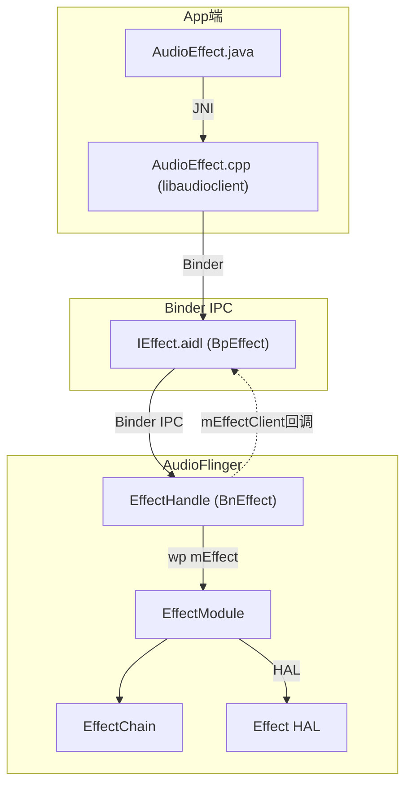
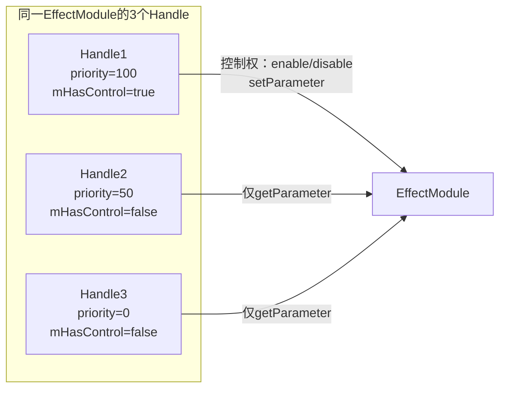
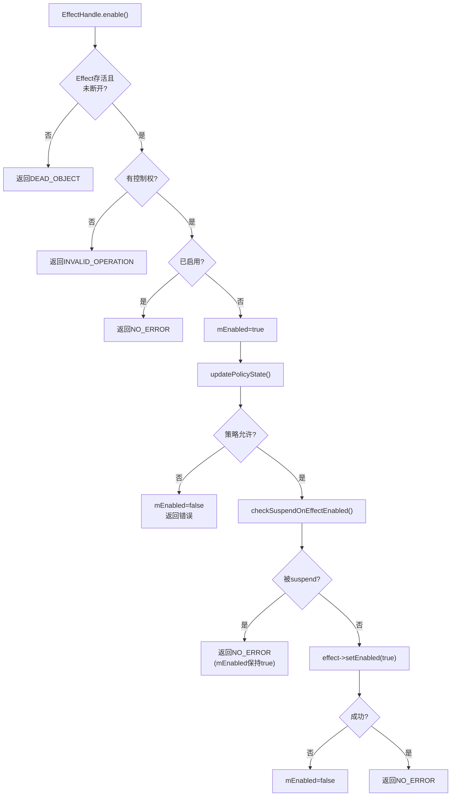
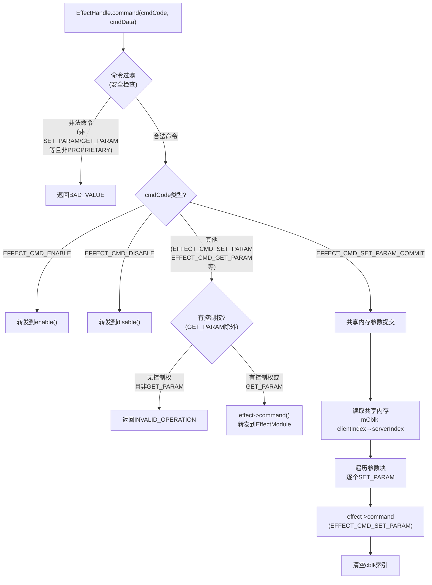
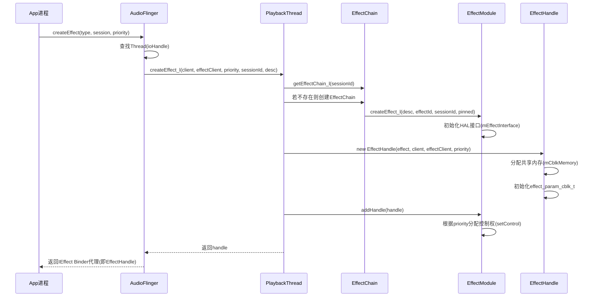
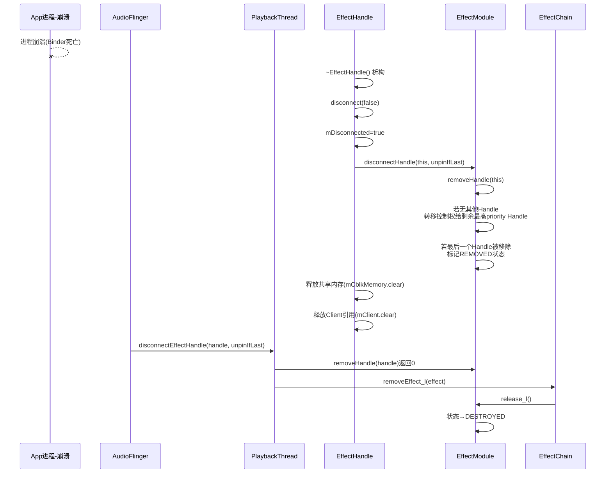
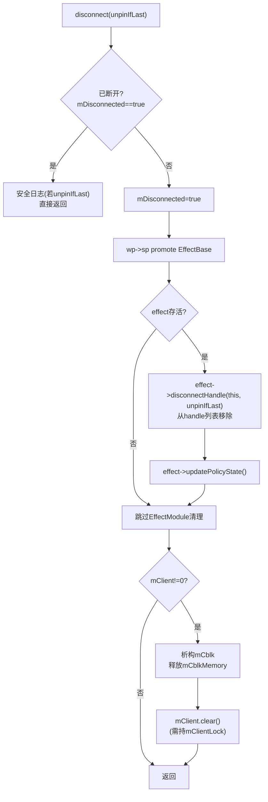
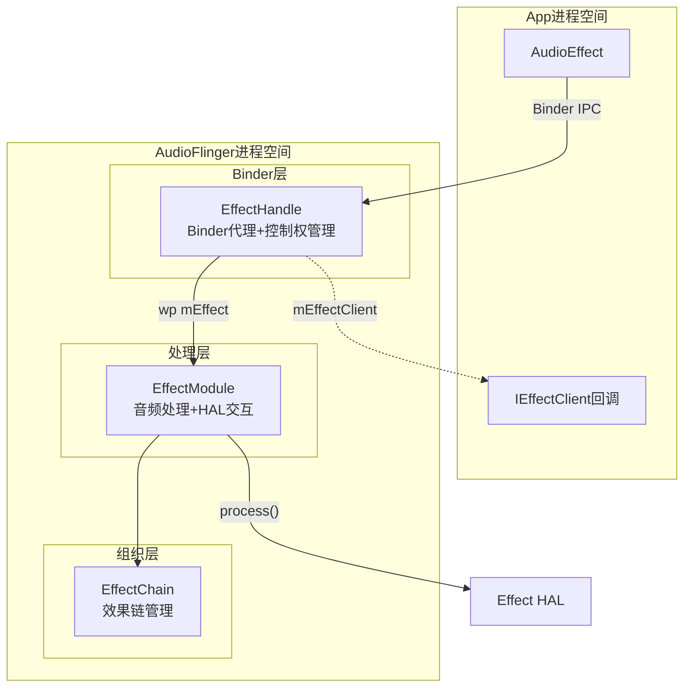

[← 7.9 内置效果与Vendor效果](07_7.9_内置效果与Vendor效果.md) | [← 返回Effects Framework](README.md) | [返回导航](../README.md) | [7.11 DeviceEffectPro →](07_7.11_DeviceEffectProxy.md)

---

## 7.10 EffectHandle — App音效控制的Binder代理

### 7.10.1 EffectHandle在音效架构中的位置

[`EffectHandle`](frameworks/av/services/audioflinger/Effects.h)继承自`android::media::BnEffect`，是IEffect AIDL接口的服务端实现。当App通过`AudioEffect`创建音效时，AudioFlinger创建`EffectModule`作为实际处理引擎，再创建`EffectHandle`作为Binder代理返回给App端。App的所有音效操作（enable/disable/command等）均通过Binder IPC到达`EffectHandle`，再由`EffectHandle`转发到对应的`EffectModule`。

**类关系图：**



**EffectHandle核心成员变量（源码: [`Effects.h`](frameworks/av/services/audioflinger/Effects.h)）：**

| 成员 | 类型 | 说明 |
|------|------|------|
| `mLock` | Mutex | 保护IEffect方法调用的互斥锁 |
| `mEffect` | wp＜EffectBase＞ | 指向被控制的EffectModule（弱引用，避免循环依赖） |
| `mEffectClient` | sp＜media::IEffectClient＞ | 客户端回调接口（控制状态/启用状态/参数变更通知） |
| `mClient` | sp＜Client＞ | 客户端对象（共享内存分配） |
| `mCblkMemory` | sp＜IMemory＞ | 共享内存（控制块+参数buffer） |
| `mCblk` | effect_param_cblk_t* | 控制块（deferred参数设置的同步机制） |
| `mBuffer` | uint8_t* | 共享内存中的参数区域指针 |
| `mPriority` | int | 客户端控制优先级（数值越高优先级越高） |
| `mHasControl` | bool | 当前Handle是否拥有效果控制权 |
| `mEnabled` | bool | 缓存的启用状态（效果被suspend恢复后仍保持） |
| `mDisconnected` | bool | 是否已断开连接（disconnect()后设为true） |
| `mNotifyFramesProcessed` | bool | 是否需要EVENT_FRAMES_PROCESSED回调 |

**关键设计：控制权优先级机制**

多个App可同时创建同一EffectModule的多个EffectHandle，但只有优先级最高（mPriority最大）的Handle拥有控制权（`mHasControl=true`）。非控制Handle只能执行`EFFECT_CMD_GET_PARAM`查询参数，不能修改效果。



---

### 7.10.2 核心方法详解

#### enable() — 启用音效（源码: [`Effects.cpp`](frameworks/av/services/audioflinger/Effects.cpp)）

```cpp
Status AudioFlinger::EffectHandle::enable(int32_t* _aidl_return) {
    AutoMutex _l(mLock);
    sp<EffectBase> effect = mEffect.promote();
    if (effect == 0 || mDisconnected) {
        RETURN(DEAD_OBJECT);          // EffectModule已销毁或Handle已断开
    }
    if (!mHasControl) {
        RETURN(INVALID_OPERATION);     // 无控制权，拒绝操作
    }
    if (mEnabled) {
        RETURN(NO_ERROR);             // 已经启用，直接返回
    }
    mEnabled = true;
    // 1. 更新策略状态（通知AudioPolicyService）
    status_t status = effect->updatePolicyState();
    if (status != NO_ERROR) { mEnabled = false; RETURN(status); }
    // 2. 检查suspend状态（某些效果可能因策略被suspend）
    effect->checkSuspendOnEffectEnabled(true, false);
    if (effect->suspended()) { RETURN(NO_ERROR); } // 被suspend时仍标记mEnabled
    // 3. 实际启用效果
    status = effect->setEnabled(true, true /*fromHandle*/);
    if (status != NO_ERROR) { mEnabled = false; }
    RETURN(status);
}
```

**enable()流程图：**



> **关键**: `mEnabled`与实际效果启用状态是两个概念。效果被suspend时`mEnabled=true`但实际未处理音频。当suspend解除后，EffectModule会根据`mEnabled`恢复效果。

#### disable() — 禁用音效（源码: [`Effects.cpp`](frameworks/av/services/audioflinger/Effects.cpp)）

```cpp
Status AudioFlinger::EffectHandle::disable(int32_t* _aidl_return) {
    AutoMutex _l(mLock);
    sp<EffectBase> effect = mEffect.promote();
    if (effect == 0 || mDisconnected) { RETURN(DEAD_OBJECT); }
    if (!mHasControl) { RETURN(INVALID_OPERATION); }
    if (!mEnabled) { RETURN(NO_ERROR); }
    mEnabled = false;
    effect->updatePolicyState();
    if (effect->suspended()) { RETURN(NO_ERROR); }
    status_t status = effect->setEnabled(false, true /*fromHandle*/);
    RETURN(status);
}
```

#### command() — 参数/命令交互（源码: [`Effects.cpp`](frameworks/av/services/audioflinger/Effects.cpp)）

`command()`是App与Effect HAL交互的核心通道，处理参数设置、查询和自定义命令：



**共享内存参数提交机制（SET_PARAM_COMMIT）：**

App端通过`effect_param_cblk_t`共享内存批量提交参数，避免频繁Binder调用：

```cpp
// 共享内存结构
effect_param_cblk_t {
    Mutex lock;           // 同步锁
    uint32_t clientIndex; // App写入位置
    uint32_t serverIndex; // AF读取位置
};
// mBuffer区域: [size1][param1...][size2][param2...]...
```

App端先通过`EFFECT_CMD_SET_PARAM_DEFERRED`将参数写入共享内存buffer，再通过`EFFECT_CMD_SET_PARAM_COMMIT`触发AudioFlinger批量读取并逐个提交给Effect HAL。

---

### 7.10.3 EffectHandle生命周期（创建→使用→Binder死亡清理）

**创建时序图：**



**Binder死亡清理时序图：**



**关键步骤说明：**

1. **创建阶段**: `ThreadBase::createEffect_l()`（源码: [`Threads.cpp`](frameworks/av/services/audioflinger/Threads.cpp)）先创建`EffectModule`，再创建`EffectHandle`，通过`effect->addHandle(handle)`建立关联
2. **使用阶段**: App通过Binder调用`enable()/disable()/command()`，EffectHandle转发到EffectModule
3. **断开阶段**: `disconnect()`（源码: [`Effects.cpp`](frameworks/av/services/audioflinger/Effects.cpp)）将`mDisconnected=true`，调用`effect->disconnectHandle()`从EffectModule的handle列表中移除
4. **析构阶段**: `~EffectHandle()`调用`disconnect(false)`（不unpin），释放共享内存和Client引用
5. **Thread清理**: `disconnectEffectHandle()`（源码: [`Threads.cpp`](frameworks/av/services/audioflinger/Threads.cpp)）检查是否最后一个Handle，若是则`removeEffect_l()`销毁整个EffectModule

---

### 7.10.4 EffectHandle构造与初始化

#### 构造函数（源码: [`Effects.cpp`](frameworks/av/services/audioflinger/Effects.cpp:1753)）

```cpp
EffectHandle::EffectHandle(const sp<EffectBase>& effect,
                           const sp<Client>& client,
                           const sp<media::IEffectClient>& effectClient,
                           int32_t priority, bool notifyFramesProcessed)
    : BnEffect(),
      mEffect(effect), mEffectClient(effectClient), mClient(client),
      mCblk(NULL), mPriority(priority), mHasControl(false),
      mEnabled(false), mDisconnected(false),
      mNotifyFramesProcessed(notifyFramesProcessed)
{
    setMinSchedulerPolicy(SCHED_NORMAL, ANDROID_PRIORITY_AUDIO);
    // 无client时直接返回（Device Effect场景，不需要共享内存）
    if (client == 0) { return; }
    // 对齐计算buffer偏移（effect_param_cblk_t按int对齐后的起始位置）
    int bufOffset = ((sizeof(effect_param_cblk_t) - 1) / sizeof(int) + 1) * sizeof(int);
    // 从Client的allocator分配共享内存
    mCblkMemory = client->allocator().allocate(mediautils::NamedAllocRequest{
            {static_cast<size_t>(EFFECT_PARAM_BUFFER_SIZE + bufOffset)},
            std::string("Effect ID: ").append(std::to_string(effect->id()))
                   .append(" Session ID: ")
                   .append(std::to_string(static_cast<int>(effect->sessionId())))
                   .append(" \n")
    });
    // 映射共享内存到mCblk和mBuffer
    mCblk = static_cast<effect_param_cblk_t*>(mCblkMemory->unsecurePointer());
    new(mCblk) effect_param_cblk_t();  // placement new初始化控制块
    mBuffer = (uint8_t*)mCblk + bufOffset;  // 参数区域紧跟控制块之后
}
```

**共享内存布局：**

```
┌────────────────────────────────────────────────────────┐
│ effect_param_cblk_t（控制块，按int对齐）                    │
│   Mutex lock;        // 同步锁                           │
│   uint32_t clientIndex;  // App写入位置                    │
│   uint32_t serverIndex;  // AF读取位置                     │
├────────────────────────────────────────────────────────┤
│ mBuffer（参数区域，EFFECT_PARAM_BUFFER_SIZE字节）            │
│   [size1][param1...][size2][param2...]...              │
│                    ↑clientIndex          ↑serverIndex    │
└────────────────────────────────────────────────────────┘
```

> **关键**: `client == 0`的场景出现在`DeviceEffectProxy`创建的Handle中——设备级音效不需要共享内存参数通道。

#### initCheck()（源码: [`Effects.cpp`](frameworks/av/services/audioflinger/Effects.cpp:1836)）

```cpp
status_t AudioFlinger::EffectHandle::initCheck() {
    return mClient == 0 || mCblkMemory != 0 ? OK : NO_MEMORY;
}
```

构造后立即检查：无client（设备效果场景）或共享内存分配成功则返回OK。

---

### 7.10.5 disconnect()断开连接详解（源码: [`Effects.cpp`](frameworks/av/services/audioflinger/Effects.cpp:1917)）

#### AIDL disconnect()入口

```cpp
Status AudioFlinger::EffectHandle::disconnect() {
    disconnect(true);  // AIDL断开时unpinIfLast=true
    return Status::ok();
}
```

#### 内部disconnect(bool unpinIfLast)实现

```cpp
void AudioFlinger::EffectHandle::disconnect(bool unpinIfLast) {
    AutoMutex _l(mLock);
    if (mDisconnected) {
        if (unpinIfLast) {
            android_errorWriteLog(0x534e4554, "32707507");  // 安全日志：重复disconnect
        }
        return;  // 防止重复断开
    }
    mDisconnected = true;
    {
        sp<EffectBase> effect = mEffect.promote();
        if (effect != 0) {
            // 从EffectModule的handle列表中移除自己
            if (effect->disconnectHandle(this, unpinIfLast) > 0) {
                ALOGW("Effect handle %p disconnected after thread destruction", this);
            }
            effect->updatePolicyState();  // 通知AudioPolicyService更新状态
        }
    }
    // 释放共享内存资源
    if (mClient != 0) {
        if (mCblk != NULL) {
            mCblk->~effect_param_cblk_t();  // 显式析构控制块（placement new的配对析构）
        }
        mCblkMemory.clear();  // 释放共享内存
        // Client析构需要在AudioFlinger mClientLock下执行
        Mutex::Autolock _l2(mClient->audioFlinger()->mClientLock);
        mClient.clear();
    }
}
```

**disconnect流程图：**



> **unpinIfLast语义**: 当AIDL `disconnect()`主动调用时为true，表示"如果是最后一个Handle，解除EffectModule的pinned状态"（允许销毁）；当析构函数调用时为false，因为析构可能在Thread已销毁后触发。

---

### 7.10.6 getCblk()与getConfig()（源码: [`Effects.cpp`](frameworks/av/services/audioflinger/Effects.cpp:1958)）

#### getCblk() — 返回共享内存

```cpp
Status AudioFlinger::EffectHandle::getCblk(media::SharedFileRegion* _aidl_return) {
    LOG_ALWAYS_FATAL_IF(!convertIMemoryToSharedFileRegion(mCblkMemory, _aidl_return));
    return Status::ok();
}
```

App端通过此方法获取共享内存的文件描述符，映射后即可直接写入参数数据。

#### getConfig() — 获取效果输入/输出配置

```cpp
Status AudioFlinger::EffectHandle::getConfig(
        media::EffectConfig* _config, int32_t* _aidl_return) {
    AutoMutex _l(mLock);
    sp<EffectBase> effect = mEffect.promote();
    if (effect == nullptr || mDisconnected) { RETURN(DEAD_OBJECT); }
    sp<EffectModule> effectModule = effect->asEffectModule();
    if (effectModule == nullptr) { RETURN(INVALID_OPERATION); }
    // 获取效果的实际输入输出音频配置
    audio_config_base_t inputCfg = AUDIO_CONFIG_BASE_INITIALIZER;
    audio_config_base_t outputCfg = AUDIO_CONFIG_BASE_INITIALIZER;
    bool isOutput;
    status_t status = effectModule->getConfigs(&inputCfg, &outputCfg, &isOutput);
    if (status == NO_ERROR) {
        _config->inputCfg = legacy2aidl_audio_config_base_t_AudioConfigBase(inputCfg);
        _config->outputCfg = legacy2aidl_audio_config_base_t_AudioConfigBase(outputCfg);
        _config->isOnInputStream = !isOutput;
    }
    RETURN(status);
}
```

> **注意**: `getConfig()`通过`asEffectModule()`获取EffectModule指针。对于`DeviceEffectProxy`，`asEffectModule()`返回nullptr，因此会返回`INVALID_OPERATION`。

---

### 7.10.7 EffectHandle回调方法（源码: [`Effects.cpp`](frameworks/av/services/audioflinger/Effects.cpp:2122)）

这些方法由EffectModule在状态变化时调用，通过`mEffectClient` Binder回调通知App端。

#### setControl() — 控制权变更通知

```cpp
void AudioFlinger::EffectHandle::setControl(bool hasControl, bool signal, bool enabled) {
    mHasControl = hasControl;
    mEnabled = enabled;  // 同步效果的实际启用状态
    if (signal && mEffectClient != 0) {
        mEffectClient->controlStatusChanged(hasControl);  // 通知App控制权变化
    }
}
```

**调用时机**: `EffectModule::addHandle()`（新Handle加入时重新分配控制权）或`EffectModule::disconnectHandle()`（Handle离开时重新分配控制权）。

#### commandExecuted() — 命令执行通知

```cpp
void AudioFlinger::EffectHandle::commandExecuted(uint32_t cmdCode,
                         const std::vector<uint8_t>& cmdData,
                         const std::vector<uint8_t>& replyData) {
    if (mEffectClient != 0) {
        mEffectClient->commandExecuted(cmdCode, cmdData, replyData);
    }
}
```

**调用时机**: 当控制Handle执行`setParameter`时，EffectModule通过此方法通知所有非控制Handle参数已变更。

#### setEnabled() — 效果启用状态通知

```cpp
void AudioFlinger::EffectHandle::setEnabled(bool enabled) {
    if (mEffectClient != 0) {
        mEffectClient->enableStatusChanged(enabled);
    }
}
```

**调用时机**: `EffectModule::setEnabled()`被调用时，遍历所有Handle通知启用状态变化。

#### framesProcessed() — 帧处理进度通知

```cpp
void AudioFlinger::EffectHandle::framesProcessed(int32_t frames) const {
    if (mEffectClient != 0 && mNotifyFramesProcessed) {
        mEffectClient->framesProcessed(frames);
    }
}
```

**调用时机**: `EffectChain::process_l()`中，当效果的Tail处理完成后，通知App已处理的帧数。`mNotifyFramesProcessed`在构造时指定，Visualizer效果通常需要此通知。

---

### 7.10.8 onTransact()与Binder统计（源码: [`Effects.cpp`](frameworks/av/services/audioflinger/Effects.cpp:1821)）

```cpp
status_t AudioFlinger::EffectHandle::onTransact(
        uint32_t code, const Parcel& data, Parcel* reply, uint32_t flags) {
    const std::string methodName = getIEffectStatistics().getMethodForCode(code);
    mediautils::TimeCheck check(
            std::string("IEffect::").append(methodName),
            [code](bool timeout, float elapsedMs) {
        if (timeout) { ; }  // 当前不在Effect接口上超时
        else { getIEffectStatistics().event(code, elapsedMs); }
    });
    return BnEffect::onTransact(code, data, reply, flags);
}
```

AudioFlinger为IEffect接口的所有Binder方法收集统计信息（调用次数、耗时分布），用于性能分析。支持的统计方法：`enable`/`disable`/`command`/`disconnect`/`getCblk`/`getConfig`。

---

### 7.10.9 EffectHandle vs EffectModule职责对比

| 维度 | EffectHandle | EffectModule |
|------|-------------|-------------|
| 继承关系 | BnEffect（Binder服务端） | EffectBase（内部处理引擎） |
| 对外可见性 | 通过Binder暴露给App | AudioFlinger内部，不直接暴露 |
| 数量关系 | 同一EffectModule可有多个Handle | 每个音效实例一个Module |
| 核心职责 | Binder IPC代理、控制权管理、共享内存 | 音频数据处理、HAL交互、状态管理 |
| 生命周期 | 随App进程存活/死亡 | 随EffectChain存活，最后一个Handle断开时销毁 |
| mEffect引用 | wp＜EffectBase＞（弱引用，避免循环） | 持有sp＜EffectHalInterface＞（强引用HAL） |
| 参数传递 | 共享内存(mCblk/mBuffer)或Binder | 直接调用HAL command/process |
| 控制权 | mHasControl/mPriority管理 | 接收所有Handle命令，但只有控制Handle可修改 |
| 回调通知 | 通过mEffectClient通知App | 通过EffectHandle.commandExecuted/setEnabled通知 |



---

---

[← 7.9 内置效果与Vendor效果](07_7.9_内置效果与Vendor效果.md) | [← 返回Effects Framework](README.md) | [返回导航](../README.md) | [7.11 DeviceEffectPro →](07_7.11_DeviceEffectProxy.md)
