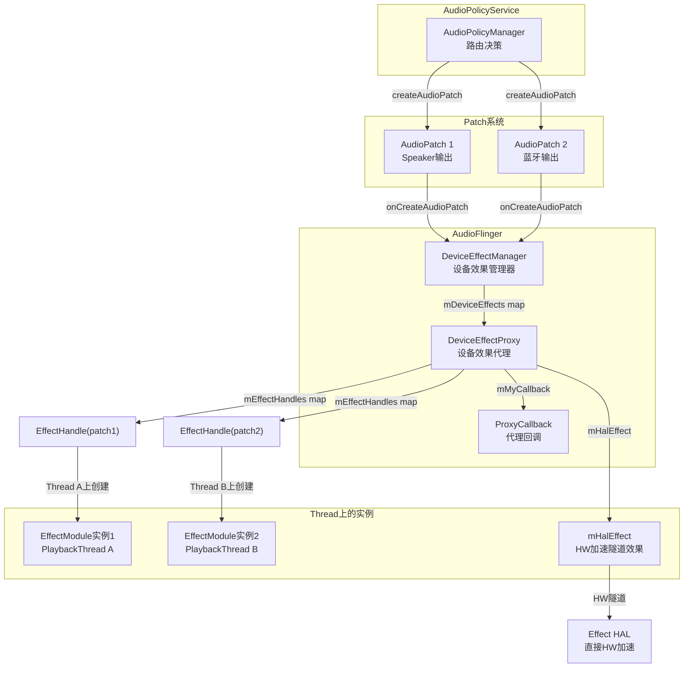
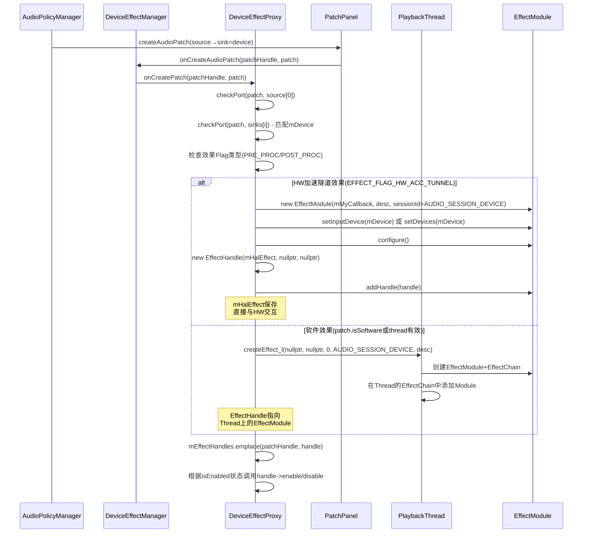
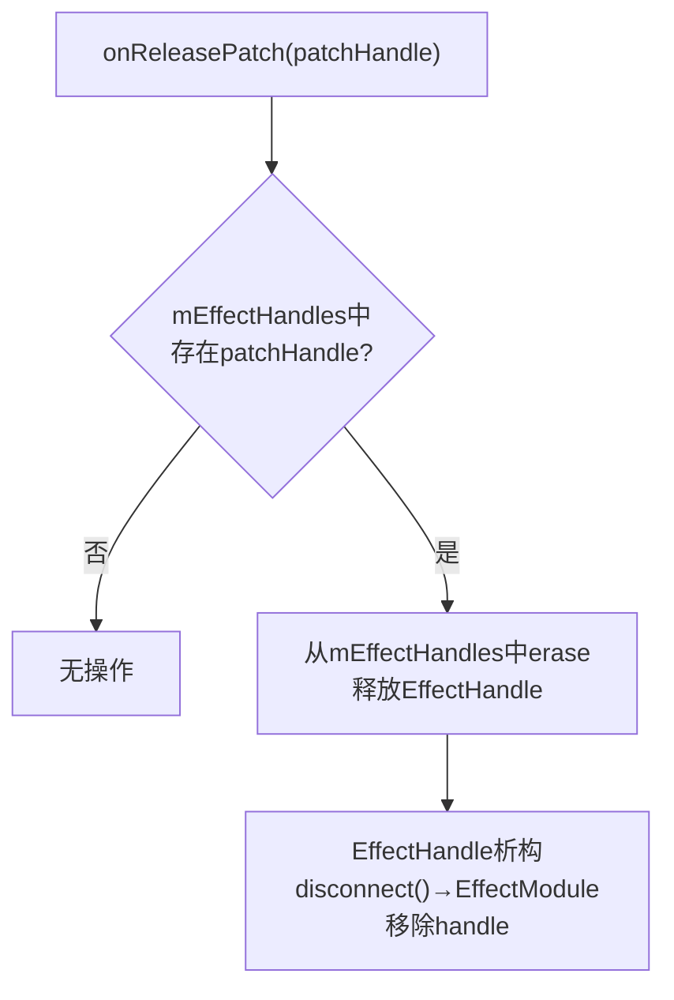
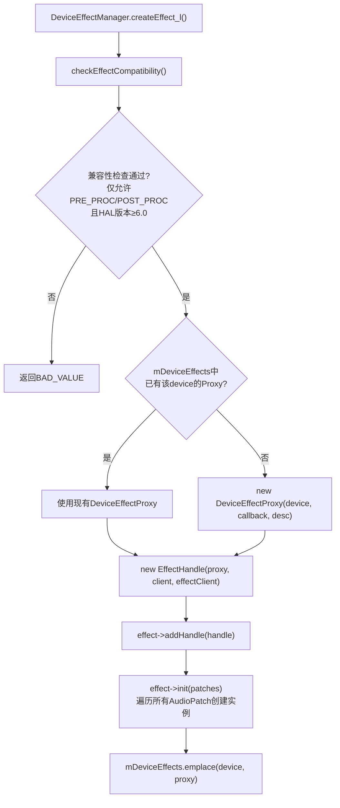
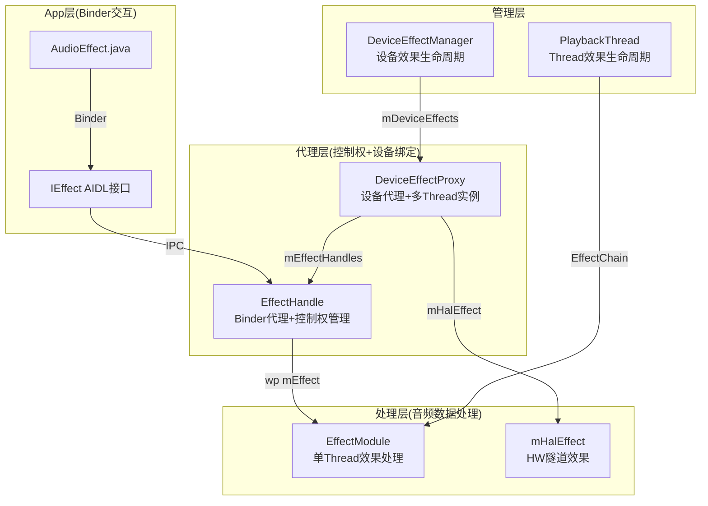
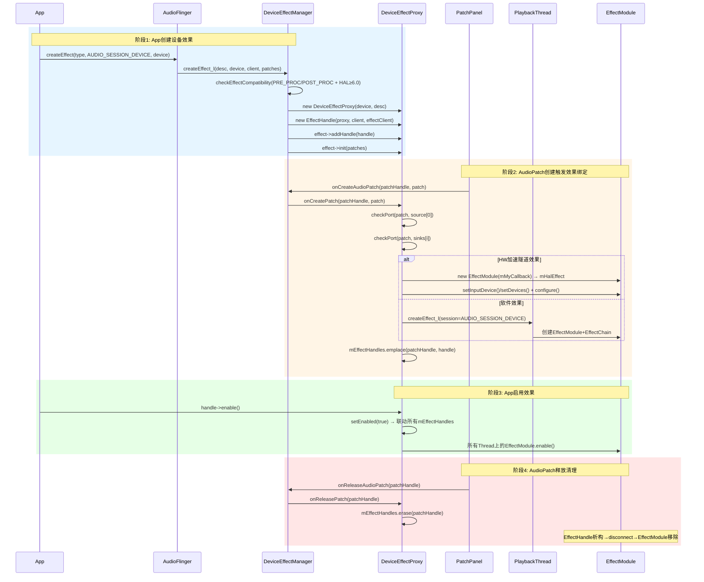

[← 7.10 EffectHandle — ](07_7.10_EffectHandle.md) | [← 返回Effects Framework](README.md) | [返回导航](../README.md) | [7.12 内置音效Native实现 —  →](07_7.12_内置音效Native实现.md)

---

## 7.11 DeviceEffectProxy — 设备级音效代理

### 7.11.1 DeviceEffectProxy架构设计

[`DeviceEffectProxy`](frameworks/av/services/audioflinger/Effects.h)继承自`EffectBase`，用于设备级音效（Device Effect）的代理管理。与普通EffectModule不同，DeviceEffectProxy不绑定到特定Thread上的EffectChain，而是通过`DeviceEffectManager`管理，根据AudioPatch动态在相关Thread上创建EffectModule实例。

**DeviceEffectProxy架构图：**



**DeviceEffectProxy核心成员变量（源码: [`Effects.h`](frameworks/av/services/audioflinger/Effects.h)）：**

| 成员 | 类型 | 说明 |
|------|------|------|
| `mDevice` | const AudioDeviceTypeAddr | 目标设备（类型+地址） |
| `mManagerCallback` | const sp＜DeviceEffectManagerCallback＞ | 管理器回调接口 |
| `mMyCallback` | const sp＜ProxyCallback＞ | 代理回调（创建EffectModule时使用） |
| `mProxyLock` | Mutex | 保护mEffectHandles和mHalEffect |
| `mEffectHandles` | map＜audio_patch_handle_t, sp＜EffectHandle＞＞ | 每个AudioPatch对应的EffectHandle |
| `mHalEffect` | sp＜EffectModule＞ | HW加速隧道效果的EffectModule |
| `mDevicePort` | audio_port_config | 设备端口配置（HW加速时使用） |
| `mNotifyFramesProcessed` | const bool | 是否通知帧处理事件 |

---

### 7.11.2 多Thread音效实例管理

DeviceEffectProxy的核心能力是在不同AudioPatch对应的Thread上创建独立的EffectModule实例。当设备（如Speaker）同时有多个AudioPatch时，每个Patch对应的Thread上都会有一个EffectModule处理该Thread的音频数据。

**AudioPatch创建时效果绑定时序图：**



**setEnabled()的多Handle联动（源码: [`Effects.cpp`](frameworks/av/services/audioflinger/Effects.cpp)）：**

```cpp
status_t AudioFlinger::DeviceEffectProxy::setEnabled(bool enabled, bool fromHandle) {
    status_t status = EffectBase::setEnabled(enabled, fromHandle);
    Mutex::Autolock _l(mProxyLock);
    if (status == NO_ERROR) {
        for (auto& handle : mEffectHandles) {
            if (enabled) {
                handle.second->enable(&status);
            } else {
                handle.second->disable(&status);
            }
        }
    }
    return status;
}
```

当DeviceEffectProxy被启用/禁用时，它会联动所有已注册的EffectHandle——确保每个Thread上的EffectModule实例状态一致。

**AudioPatch释放时效果清理（源码: [`Effects.cpp`](frameworks/av/services/audioflinger/Effects.cpp)）：**



**DeviceEffectManager创建流程（源码: [`DeviceEffectManager.cpp`](frameworks/av/services/audioflinger/DeviceEffectManager.cpp)）：**



---

### 7.11.3 DeviceEffectProxy与EffectHandle对比

| 维度 | DeviceEffectProxy | EffectHandle |
|------|-------------------|-------------|
| 继承关系 | EffectBase（音效基类） | BnEffect（Binder服务端） |
| 对外可见性 | AudioFlinger内部，不直接暴露给App | 通过Binder暴露给App |
| 生命周期管理 | 由DeviceEffectManager管理 | 随App进程存活/死亡 |
| 绑定对象 | 设备(AudioDeviceTypeAddr) | EffectModule/EffectBase |
| 效果实例 | 每个AudioPatch一个EffectModule实例 | 只关联一个EffectModule |
| sessionId | AUDIO_SESSION_DEVICE(-2) | App指定的sessionId |
| 启用联动 | setEnabled联动所有mEffectHandles | 只控制单个EffectModule |
| HW加速支持 | 通过mHalEffect实现隧道效果 | 不直接处理HW加速 |
| Patch感知 | 监听AudioPatch创建/释放 | 不感知AudioPatch |
| ProxyCallback | 自有ProxyCallback创建HAL | 通过EffectModule的Callback创建HAL |

**DeviceEffectProxy vs EffectHandle vs EffectModule 三层架构图：**



> **核心区别**: EffectHandle是App→AudioFlinger的Binder通道，DeviceEffectProxy是AudioFlinger内部管理设备级音效的代理。前者解决"App如何控制音效"，后者解决"设备级音效如何在多个Thread上生效"。

---

### 7.11.4 DeviceEffectProxy关键方法源码解析

#### checkPort() — AudioPatch端口匹配与效果创建（源码: [`Effects.cpp`](frameworks/av/services/audioflinger/Effects.cpp:3377)）

`checkPort()`是DeviceEffectProxy最核心的方法，负责检查AudioPatch中的端口是否匹配目标设备，并决定创建HW加速还是软件效果实例。

```cpp
status_t DeviceEffectProxy::checkPort(const PatchPanel::Patch& patch,
        const struct audio_port_config *port, sp<EffectHandle> *handle) {
    // 1. 检查端口类型和设备匹配
    if (port->type != AUDIO_PORT_TYPE_DEVICE || 
        port->ext.device.type != mDevice.mType ||
        port->ext.device.address != mDevice.address()) {
        return NAME_NOT_FOUND;  // 不匹配，继续检查其他端口
    }
    // 2. PRE_PROC效果不在播放端口创建
    if (((mDescriptor.flags & EFFECT_FLAG_TYPE_MASK) == EFFECT_FLAG_TYPE_POST_PROC) &&
        (audio_port_config_has_input_direction(port))) {
        return NAME_NOT_FOUND;
    }
    // 3. PRE_PROC效果不在录音端口创建
    if (((mDescriptor.flags & EFFECT_FLAG_TYPE_MASK) == EFFECT_FLAG_TYPE_PRE_PROC) &&
        (!audio_port_config_has_input_direction(port))) {
        return NAME_NOT_FOUND;
    }
    // 4. 根据Flag创建不同类型的效果实例
    if (mDescriptor.flags & EFFECT_FLAG_HW_ACC_TUNNEL) {
        // HW加速隧道效果：直接创建EffectModule与HAL交互
        Mutex::Autolock _l(mProxyLock);
        mDevicePort = *port;
        mHalEffect = new EffectModule(mMyCallback, &mDescriptor,
                                      mMyCallback->newEffectId(), AUDIO_SESSION_DEVICE,
                                      false /* pinned */, port->id);
        if (audio_is_input_device(mDevice.mType)) {
            mHalEffect->setInputDevice(mDevice);
        } else {
            mHalEffect->setDevices({mDevice});
        }
        mHalEffect->configure();
        *handle = new EffectHandle(mHalEffect, nullptr, nullptr, 0, mNotifyFramesProcessed);
        // ... 初始化检查和addHandle
    } else if (patch.isSoftware() || patch.thread().promote() != nullptr) {
        // 软件效果：在Patch对应的Thread上创建EffectModule
        sp<ThreadBase> thread;
        if (audio_port_config_has_input_direction(port)) {
            thread = patch.isSoftware() ? patch.mRecord.thread() : patch.thread().promote();
        } else {
            thread = patch.isSoftware() ? patch.mPlayback.thread() : patch.thread().promote();
        }
        *handle = thread->createEffect_l(nullptr, nullptr, 0, AUDIO_SESSION_DEVICE,
                                         &mDescriptor, &enabled, &status, false, false,
                                         mNotifyFramesProcessed);
    } else {
        return BAD_VALUE;  // 既非HW加速也无可用的Thread
    }
    // 5. 同步启用状态
    if (isEnabled()) { (*handle)->enable(&status); }
    else { (*handle)->disable(&status); }
    return status;
}
```

**checkPort决策矩阵：**

| 条件 | 效果Flag | Patch类型 | 创建结果 |
|------|----------|-----------|----------|
| 设备匹配+HW隧道 | `EFFECT_FLAG_HW_ACC_TUNNEL` | 任意 | mHalEffect（直接HAL交互） |
| 设备匹配+软件 | 非`HW_ACC_TUNNEL` | `isSoftware()`或有Thread | Thread上EffectModule |
| 设备匹配+无Thread | 非`HW_ACC_TUNNEL` | 非软件且无Thread | `BAD_VALUE` |
| 设备不匹配 | 任意 | 任意 | `NAME_NOT_FOUND`（继续搜索） |
| POST_PROC+录音端口 | `EFFECT_FLAG_TYPE_POST_PROC` | 输入方向 | `NAME_NOT_FOUND` |
| PRE_PROC+播放端口 | `EFFECT_FLAG_TYPE_PRE_PROC` | 输出方向 | `NAME_NOT_FOUND` |

#### onCreatePatch() — AudioPatch创建回调（源码: [`Effects.cpp`](frameworks/av/services/audioflinger/Effects.cpp:3356)）

```cpp
status_t DeviceEffectProxy::onCreatePatch(
        audio_patch_handle_t patchHandle, const PatchPanel::Patch& patch) {
    status_t status = NAME_NOT_FOUND;
    sp<EffectHandle> handle;
    // 先检查source[0]（唯一的真实source）
    status = checkPort(patch, &patch.mAudioPatch.sources[0], &handle);
    // 如果source不匹配，遍历所有sink
    for (uint32_t i = 0; i < patch.mAudioPatch.num_sinks && status == NAME_NOT_FOUND; i++) {
        status = checkPort(patch, &patch.mAudioPatch.sinks[i], &handle);
    }
    // 匹配成功则注册到mEffectHandles
    if (status == NO_ERROR || status == ALREADY_EXISTS) {
        Mutex::Autolock _l(mProxyLock);
        mEffectHandles.emplace(patchHandle, handle);
    }
    return status;
}
```

> **搜索顺序**: 先检查source端口（通常对应输入设备如MIC），再检查sink端口（通常对应输出设备如Speaker）。这与PRE_PROC/POST_PROC的语义匹配——PRE_PROC绑定输入源，POST_PROC绑定输出sink。

#### onReleasePatch() — AudioPatch释放回调（源码: [`Effects.cpp`](frameworks/av/services/audioflinger/Effects.cpp:3461)）

```cpp
void DeviceEffectProxy::onReleasePatch(audio_patch_handle_t patchHandle) {
    sp<EffectHandle> effect;
    {
        Mutex::Autolock _l(mProxyLock);
        if (mEffectHandles.find(patchHandle) != mEffectHandles.end()) {
            effect = mEffectHandles.at(patchHandle);
            mEffectHandles.erase(patchHandle);
        }
    }
    // EffectHandle的sp引用释放后，Handle析构自动触发disconnect
}
```

> **简洁设计**: `onReleasePatch()`只需从map中移除Handle，Handle的析构函数会自动触发`disconnect()`→`EffectModule::removeHandle()`→清理效果实例。

#### removeEffect() — HW效果移除（源码: [`Effects.cpp`](frameworks/av/services/audioflinger/Effects.cpp:3473)）

```cpp
size_t DeviceEffectProxy::removeEffect(const sp<EffectModule>& effect) {
    Mutex::Autolock _l(mProxyLock);
    if (effect == mHalEffect) {
        mHalEffect->release_l();  // 释放HAL效果资源
        mHalEffect.clear();
        mDevicePort.id = AUDIO_PORT_HANDLE_NONE;  // 重置设备端口
    }
    return mHalEffect == nullptr ? 0 : 1;
}
```

---

### 7.11.5 ProxyCallback回调详解（源码: [`Effects.cpp`](frameworks/av/services/audioflinger/Effects.cpp:3573)）

`ProxyCallback`是DeviceEffectProxy的内部回调类，实现`EffectCallbackInterface`接口。当HW加速的`mHalEffect`需要创建HAL实例或查询音频配置时，通过此回调获取信息。

| 方法 | 行号 | 说明 |
|------|------|------|
| `newEffectId()` | L3575 | 从AudioFlinger获取唯一效果ID |
| `disconnectEffectHandle()` | L3580 | Handle断开时清理DeviceEffectProxy |
| `createEffectHal()` | L3606 | 创建Effect HAL实例（传递deviceId给HAL） |
| `addEffectToHal()` | L3612 | 将效果添加到Audio HAL（流效果链） |
| `removeEffectFromHal()` | L3621 | 从Audio HAL移除效果 |
| `isOutput()` | L3630 | 基于设备端口方向判断输出/输入 |
| `sampleRate()` | L3638 | 返回设备端口的采样率 |
| `inChannelMask()` / `outChannelMask()` | L3646/3663 | 返回输入/输出通道掩码 |
| `inChannelCount()` / `outChannelCount()` | L3655/3671 | 返回输入/输出通道数 |
| `onEffectEnable()` | L3679 | 效果启用时通知AudioFlinger |
| `onEffectDisable()` | L3688 | 效果禁用时通知AudioFlinger |

**ProxyCallback vs ThreadBase::EffectCallback对比：**

| 回调来源 | ThreadBase回调 | ProxyCallback |
|----------|--------------|---------------|
| 所属对象 | PlaybackThread/RecordThread | DeviceEffectProxy |
| 音频配置来源 | Thread的mFormat/mSampleRate/mChannelMask | mDevicePort端口配置 |
| createEffectHal | 不传deviceId | 传递deviceId给HAL（关键差异） |
| addEffectToHal | 通过Thread的mOutput/mInput流 | 通过mManagerCallback→AudioFlinger |
| 效果链管理 | EffectChain在Thread内部 | mHalEffect独立于Thread |

> **关键差异**: `ProxyCallback::createEffectHal()`调用`mManagerCallback->createEffectHal()`时，会传递`deviceId`参数给HAL——这是HW加速隧道效果能够绑定到特定设备的关键。而Thread的回调通过`AUDIO_IO_HANDLE_NONE`让HAL自行选择。

---

### 7.11.6 DeviceEffectManager管理流程（源码: [`DeviceEffectManager.cpp`](frameworks/av/services/audioflinger/DeviceEffectManager.cpp)）

#### createEffect_l() — 创建设备效果（源码: L59）

```cpp
sp<EffectHandle> DeviceEffectManager::createEffect_l(
        effect_descriptor_t *descriptor, const AudioDeviceTypeAddr& device,
        const sp<Client>& client, const sp<IEffectClient>& effectClient,
        const map<audio_patch_handle_t, PatchPanel::Patch>& patches,
        int *enabled, status_t *status, bool probe, bool notifyFramesProcessed) {
    // 1. 兼容性检查
    status_t lStatus = checkEffectCompatibility(descriptor);
    if (probe || lStatus != NO_ERROR) { *status = lStatus; return handle; }
    // 2. 查找或创建DeviceEffectProxy
    auto iter = mDeviceEffects.find(device);
    if (iter != mDeviceEffects.end()) {
        effect = iter->second;  // 复用已有Proxy
    } else {
        effect = new DeviceEffectProxy(device, mMyCallback, descriptor, ...);
    }
    // 3. 创建EffectHandle并关联
    handle = new EffectHandle(effect, client, effectClient, 0, notifyFramesProcessed);
    lStatus = handle->initCheck();
    if (lStatus == NO_ERROR) {
        lStatus = effect->addHandle(handle.get());
        if (lStatus == NO_ERROR) {
            lStatus = effect->init(patches);  // 遍历所有Patch创建实例
            mDeviceEffects.emplace(device, effect);
        }
    }
    return handle;
}
```

#### checkEffectCompatibility() — 兼容性校验（源码: L113）

```cpp
status_t DeviceEffectManager::checkEffectCompatibility(const effect_descriptor_t *desc) {
    // 仅允许PRE_PROC和POST_PROC类型
    // 要求Audio HAL版本 ≥ 6.0
    if (((desc->flags & EFFECT_FLAG_TYPE_MASK) != EFFECT_FLAG_TYPE_PRE_PROC
            && (desc->flags & EFFECT_FLAG_TYPE_MASK) != EFFECT_FLAG_TYPE_POST_PROC)
            || halVersion < sMinDeviceEffectHalVersion) {
        return BAD_VALUE;
    }
    return NO_ERROR;
}
```

> **HAL版本要求**: Device Effect功能需要Audio HAL 6.0+（HIDL），因为旧版HAL不支持设备级效果的`addDeviceEffect()`/`removeDeviceEffect()`接口。

#### disconnectEffectHandle() — Handle断开清理（源码: L184）

```cpp
bool DeviceEffectManagerCallback::disconnectEffectHandle(
        EffectHandle *handle, bool unpinIfLast) {
    sp<EffectBase> effectBase = handle->effect().promote();
    sp<DeviceEffectProxy> effect = effectBase->asDeviceEffectProxy();
    // 如果是最后一个Handle且允许unpin，则移除整个DeviceEffectProxy
    bool remove = (effect->removeHandle(handle) == 0) && (!effect->isPinned() || unpinIfLast);
    if (remove) {
        mManager.removeEffect(effect);  // 从mDeviceEffects中移除
        if (handle->enabled()) {
            effectBase->checkSuspendOnEffectEnabled(false, false);
        }
    }
    return true;
}
```

---

### 7.11.7 DeviceEffectProxy音频配置查询

DeviceEffectProxy需要提供音频配置信息给`mHalEffect`的`configure()`调用。这些配置从`mDevicePort`端口配置中获取：

```cpp
bool DeviceEffectProxy::isOutput() const {
    if (mDevicePort.id != AUDIO_PORT_HANDLE_NONE) {
        return mDevicePort.role == AUDIO_PORT_ROLE_SINK;  // SINK=输出
    }
    return true;  // 默认输出
}

uint32_t DeviceEffectProxy::sampleRate() const {
    if (mDevicePort.id != AUDIO_PORT_HANDLE_NONE &&
            (mDevicePort.config_mask & AUDIO_PORT_CONFIG_SAMPLE_RATE) != 0) {
        return mDevicePort.sample_rate;
    }
    return DEFAULT_OUTPUT_SAMPLE_RATE;  // 默认48000Hz
}

audio_channel_mask_t DeviceEffectProxy::channelMask() const {
    if (mDevicePort.id != AUDIO_PORT_HANDLE_NONE &&
            (mDevicePort.config_mask & AUDIO_PORT_CONFIG_CHANNEL_MASK) != 0) {
        return mDevicePort.channel_mask;
    }
    return AUDIO_CHANNEL_OUT_STEREO;  // 默认立体声
}
```

> **回退策略**: 当mDevicePort未配置时，使用默认值（48kHz/立体声/输出方向），确保HW加速效果至少能完成`configure()`初始化。

---

### 7.11.8 完整生命周期时序



---

[← 7.10 EffectHandle](07_7.10_EffectHandle.md) | [← 返回Effects Framework](README.md) | [返回导航](../README.md) | [7.12 内置音效Native实现 →](07_7.12_内置音效Native实现.md)
