[← 7.11 DeviceEffectPro](07_7.11_DeviceEffectProxy.md) | [← 返回Effects Framework](README.md) | [返回导航](../README.md)

---

## 7.12 内置音效Native实现 — libeffects

源码路径: [`frameworks/av/media/libeffects/`](frameworks/av/media/libeffects/)

Android内置音效的Native实现集中在`libeffects`目录下，包含音效工厂加载器、多种DSP音效处理器以及从HIDL到AIDL的迁移架构。本节从源码层面深入分析各子模块的实现细节。

### 7.12.1 EffectsFactory — 音效工厂加载器

源码路径:
- [`factory/EffectsFactory.c`](frameworks/av/media/libeffects/factory/EffectsFactory.c)
- [`factory/EffectsFactory.h`](frameworks/av/media/libeffects/factory/EffectsFactory.h)
- [`factory/EffectsFactoryState.h`](frameworks/av/media/libeffects/factory/EffectsFactoryState.h)
- [`factory/EffectsXmlConfigLoader.cpp`](frameworks/av/media/libeffects/factory/EffectsXmlConfigLoader.cpp)

EffectsFactory是整个音效框架的Native入口，负责解析XML配置、加载效果库`.so`、创建effect实例。它在7.3节EffectChain与7.4节AudioFlinger EffectHandle之间扮演桥梁角色。

#### 核心数据结构

| 数据结构 | 定义位置 | 功能 |
|---------|---------|------|
| [`lib_entry_t`](frameworks/av/media/libeffects/factory/EffectsFactory.h) | EffectsFactory.h | 库条目：desc/name/path/handle/effects链表/锁 |
| [`effect_entry_t`](frameworks/av/media/libeffects/factory/EffectsFactory.h) | EffectsFactory.h | 效果条目：itfe/subItfe/lib指针 |
| [`sub_effect_entry_t`](frameworks/av/media/libeffects/factory/EffectsFactory.h) | EffectsFactory.h | 子效果条目：含proxy UUID |
| [`list_elem_t`](frameworks/av/media/libeffects/factory/EffectsFactory.h) | EffectsFactory.h | 通用链表节点：object/next |

#### 全局状态

```c
// EffectsFactoryState.h
static list_elem_t *gLibraryList;       // 已加载库链表
static list_elem_t *gSkippedEffects;    // 跳过的效果
static list_elem_t *gSubEffectList;     // 子效果链表
static pthread_mutex_t gLibLock;        // 全局库操作锁
static list_elem_t *gLibraryFailedList; // 加载失败的库
```

#### 效果创建流程

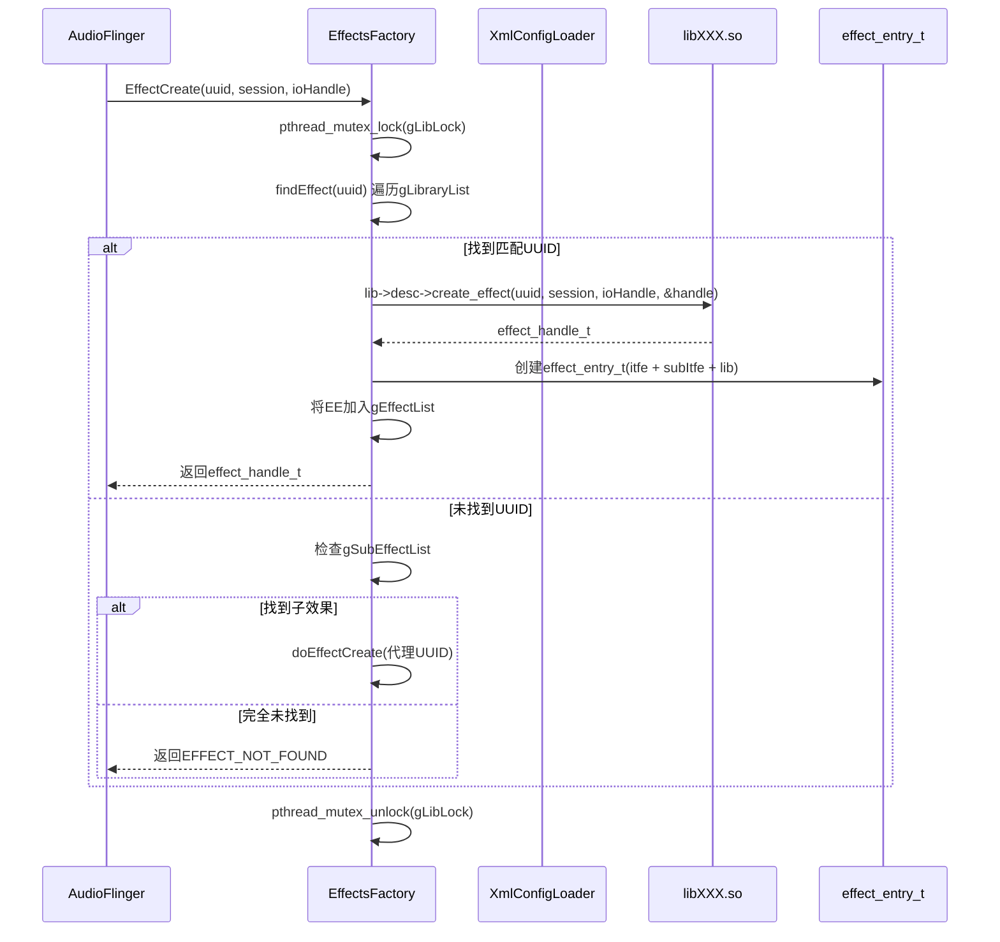

核心函数[`EffectsFactory_createEffect()`](frameworks/av/media/libeffects/factory/EffectsFactory.c)的实现逻辑：

```c
// 简化流程
int EffectsFactory_createEffect(const effect_uuid_t *uuid,
        int32_t sessionId, int32_t ioHandle, effect_handle_t *pHandle) {
    // 1. 查找UUID对应的库
    ret = findEffect(uuid, &lib, &e);
    // 2. 调用库的create_effect
    ret = lib->desc->create_effect(uuid, sessionId, ioHandle, pHandle);
    // 3. 包装为effect_entry_t并注册
    entry->itfe = &gInterface;     // 无process_reverse
    // 或 entry->itfe = &gInterfaceWithReverse; // 有process_reverse
}
```

#### 双接口分发

EffectsFactory为每个effect实例分配不同的接口表：

| 接口表 | 特点 | 分配条件 |
|--------|------|---------|
| [`gInterface`](frameworks/av/media/libeffects/factory/EffectsFactory.c) | 无`process_reverse` | 默认 |
| [`gInterfaceWithReverse`](frameworks/av/media/libeffects/factory/EffectsFactory.c) | 包含`process_reverse` | 效果支持反向处理 |

两个接口表的`process`方法都代理到实际库实现，但`gInterfaceWithReverse`额外提供了`process_reverse`入口，用于AEC（回声消除）等需要双向处理的场景。

#### XML配置解析

[`EffectsXmlConfigLoader`](frameworks/av/media/libeffects/factory/EffectsXmlConfigLoader.cpp)负责解析[`audio_effects.xml`](frameworks/av/media/libeffects/data/audio_effects.xml)，其核心标签结构：

```xml
<audio_effects_conf>
    <libraries>
        <library name="bundle" path="libbundlewrapper.so"/>
        <library name="reverb" path="libreverbwrapper.so"/>
        <!-- 7个库定义 -->
    </libraries>
    <effects>
        <effect name="bassboost" library="bundle" uuid="..."/>
        <effect name="equalizer" library="bundle" uuid="..."/>
        <!-- 12个效果定义 -->
    </effects>
</audio_effects_conf>
```

库加载流程：

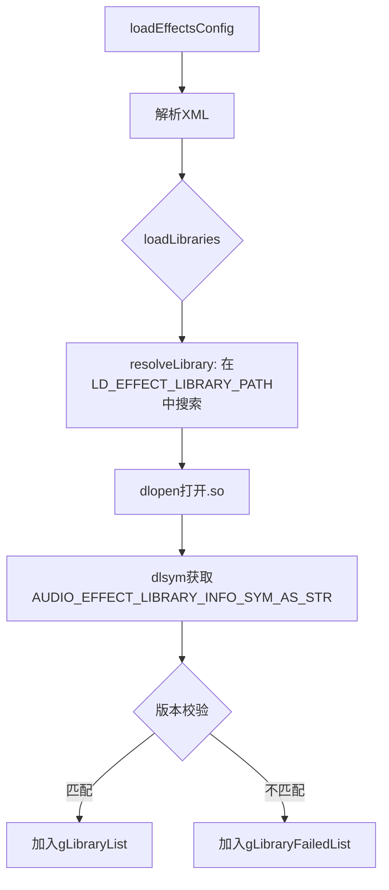

[`loadLibrary()`](frameworks/av/media/libeffects/factory/EffectsXmlConfigLoader.cpp)的关键步骤：
1. 在`LD_EFFECT_LIBRARY_PATH`目录列表中搜索`.so`文件
2. `dlopen()`打开动态库
3. `dlsym()`查找`AUDIO_EFFECT_LIBRARY_INFO_SYM_AS_STR`符号
4. 版本校验：`desc->tag == AUDIO_EFFECT_LIBRARY_TAG`
5. 注册到全局链表

> **与7.3节的关系**：EffectsFactory创建的effect实例被AudioFlinger的EffectChain持有，通过`effect_entry_t.itfe`接口表进行命令分发。EffectChain的`setProcessEnable()`最终调用到`itfe->command(EFFECT_CMD_ENABLE)`。

### 7.12.2 DynamicsProcessing — 动态处理

源码路径:
- [`dynamicsproc/EffectDynamicsProcessing.cpp`](frameworks/av/media/libeffects/dynamicsproc/EffectDynamicsProcessing.cpp)
- [`dynamicsproc/aidl/DynamicsProcessingContext.h`](frameworks/av/media/libeffects/dynamicsproc/aidl/DynamicsProcessingContext.h)
- [`dynamicsproc/dsp/DPBase.h`](frameworks/av/media/libeffects/dynamicsproc/dsp/DPBase.h)
- [`dynamicsproc/dsp/DPFrequency.h`](frameworks/av/media/libeffects/dynamicsproc/dsp/DPFrequency.h)

DynamicsProcessing是多频段动态处理引擎，集成EQ、MBC（多频段压缩）、Limiter等功能，是Android音效框架中最复杂的内置效果器之一。

UUID: `e0e6539b-1781-7261-676f-6d7573696340`

#### DSP架构层次

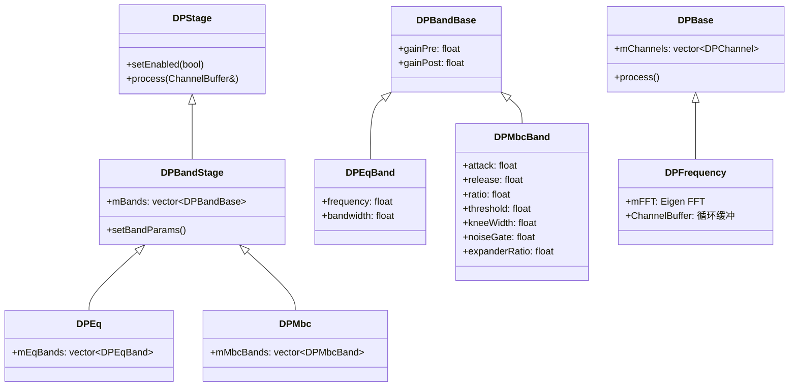

#### 信号处理流程

DynamicsProcessing的完整信号链：

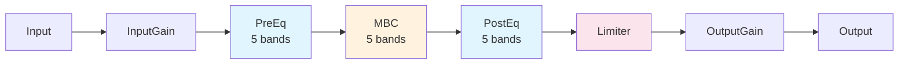

每个阶段的默认参数：

| 阶段 | 频段数 | 默认参数 |
|------|--------|---------|
| PreEq | 5 | 频段可配置，增益默认0dB |
| MBC | 5 | attack=50ms, release=120ms, ratio=2, threshold=-30dB |
| PostEq | 5 | 频段可配置，增益默认0dB |
| Limiter | 1 | attack=50ms, release=120ms, ratio=2, threshold=-30dB |

#### 旧HAL实现

[`EffectDynamicsProcessing.cpp`](frameworks/av/media/libeffects/dynamicsproc/EffectDynamicsProcessing.cpp)实现了C语言HAL接口：

```c
// 核心结构
struct DynamicsProcessingContext {
    const effect_interface_t *itfe;
    effect_config_t config;
    dp_fx::DPBase* mPDynamics;         // DSP引擎
    int mCurrentVariant;               // 当前变体
    // ...
};

// 命令处理
int DynamicsProcessing_command(effect_handle_t self, uint32_t cmdCode,
    uint32_t cmdSize, void *pCmdData, uint32_t *replySize, void *pReplyData);
```

#### AIDL实现

[`DynamicsProcessingContext`](frameworks/av/media/libeffects/dynamicsproc/aidl/DynamicsProcessingContext.h)继承自`EffectContext`，使用频域变体`dp_fx::DPFrequency`：

```cpp
class DynamicsProcessingContext final : public EffectContext {
    RetCode setEngineArchitecture(
        const DynamicsProcessing::EngineArchitecture& engineArchitecture);
    IEffect::Status lvmProcess(float* in, float* out, int samples) override;
private:
    std::unique_ptr<dp_fx::DPFrequency> mDpFreq;
    DynamicsProcessing::EngineArchitecture mEngineArchitecture = {
        .resolutionPreference =
            DynamicsProcessing::ResolutionPreference::FAVOR_FREQUENCY_RESOLUTION,
        .preEqStage   = {.inUse = true, .bandCount = kBandCount},  // 5
        .postEqStage  = {.inUse = true, .bandCount = kBandCount},  // 5
        .mbcStage     = {.inUse = true, .bandCount = kBandCount},  // 5
        .limiterInUse = true,
    };
};
```

#### 频域处理核心

[`DPFrequency`](frameworks/av/media/libeffects/dynamicsproc/dsp/DPFrequency.h)基于Eigen FFT实现频域处理：

- **ChannelBuffer**：管理`cBInput`/`cBOutput`循环缓冲 + `complexTemp`频域临时向量
- **FFT处理**：时域输入 → FFT → 频域EQ/MBC处理 → IFFT → 时域输出
- **MbcBandParams**完整参数：`gainPre/gainPost/attack/release/ratio/threshold/kneeWidth/noiseGate/expanderRatio`
- **LimiterParams**：`linkGroup/attack/release/ratio/threshold/postGain`
- **处理时长**：`kPreferredProcessingDurationMs = 10.0f`

> **与7.6节的对应关系**：Java层的`android.media.audiofx.DynamicsProcessing`通过Binder调用到AudioFlinger的EffectHandle，最终到达此Native实现。Java层的`MbcBand`参数直接映射到Native的`DPMbcBand`。

### 7.12.3 HapticGenerator — 触觉生成

源码路径:
- [`hapticgenerator/EffectHapticGenerator.cpp`](frameworks/av/media/libeffects/hapticgenerator/EffectHapticGenerator.cpp)
- [`hapticgenerator/Processors.h`](frameworks/av/media/libeffects/hapticgenerator/Processors.h)
- [`hapticgenerator/Processors.cpp`](frameworks/av/media/libeffects/hapticgenerator/Processors.cpp)
- [`hapticgenerator/aidl/HapticGeneratorContext.h`](frameworks/av/media/libeffects/hapticgenerator/aidl/HapticGeneratorContext.h)

HapticGenerator从音频信号中提取并生成触觉振动信号，是Android 12引入的音效类型，用于增强触觉反馈体验。

UUID: `97c4acd1-8b82-4f2f-832e-c2fe5d7a9931`
效果标志: `EFFECT_FLAG_INSERT_FIRST`（确保在效果链中优先处理）

#### 处理器链架构

HapticGenerator的信号处理由多个处理器串联完成：

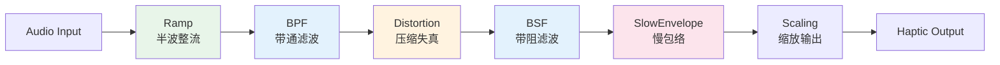

#### 处理器详解

| 处理器 | 类名 | 功能 | 关键参数 |
|--------|------|------|---------|
| Ramp | [`Ramp`](frameworks/av/media/libeffects/hapticgenerator/Processors.h) | 半波整流，非负化 | 无 |
| BPF | BiquadFilter | 带通滤波，提取振动频段 | resonantFreq, Q |
| Distortion | [`Distortion`](frameworks/av/media/libeffects/hapticgenerator/Processors.h) | 压缩失真，含LPF | cornerFrequency, inputGain, outputGain |
| BSF | BiquadFilter | 带阻滤波，去除共振峰 | resonantFreq, zeroQ=8, poleQ=4 |
| SlowEnvelope | [`SlowEnvelope`](frameworks/av/media/libeffects/hapticgenerator/Processors.h) | 低通滤波+幂归一化 | 控制触觉强度包络 |

各处理器的具体实现：

```cpp
// Ramp: 半波整流
class Ramp {
    void process(float *out, const float *in, size_t frameCount);
    // out[i] = max(in[i], 0) — 只保留正半波
};

// SlowEnvelope: 慢包络检测
class SlowEnvelope {
    void process(float *out, const float *in, size_t frameCount);
    // 低通滤波 → 幂归一化 → 控制触觉强度
};

// Distortion: 压缩失真
class Distortion {
    void process(float *out, const float *in, size_t frameCount);
    void setCornerFrequency(float cornerFrequency);
    void setInputGain(float inputGain);
    void setOutputGain(float outputGain);
    // LPF滤波 → cube阈值压缩 → 增益输出
};
```

#### 振动器信息交互

HapticGenerator依赖`VibratorInfo`（共振频率等）来调整滤波器系数：

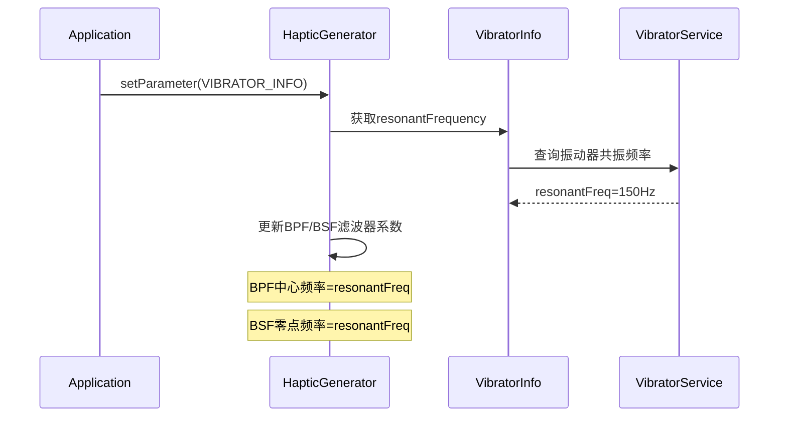

#### AIDL实现

[`HapticGeneratorContext`](frameworks/av/media/libeffects/hapticgenerator/aidl/HapticGeneratorContext.h)继承`EffectContext`：

```cpp
struct HapticGeneratorParam {
    HapticGenerator::HapticChannel mHapticChannelSource[2]; // 触觉通道源
    float mHapticScale;                                      // 触觉缩放
    HapticGenerator::VibratorInfo mVibratorInfo;             // 振动器信息
};

class HapticGeneratorContext : public EffectContext {
    HapticGeneratorProcessorsRecord mProcessorsRecord;
    // 管理所有滤波器: filters/ramps/slowEnvs/distortions/bpf/bsf
};
```

默认参数：
- `resonantFreq = 150Hz`
- `BSF_ZERO_Q = 8, BSF_POLE_Q = 4`
- `distortionOutputGain = 1.5`

> **与VibratorService的交互**：HapticGenerator不直接驱动振动器，而是生成振动信号叠加到音频输出流中。实际的触觉振动由AudioFlinger将处理后的信号路由到振动器HAL。

### 7.12.4 LoudnessEnhancer — 响度增强

源码路径:
- [`loudness/EffectLoudnessEnhancer.cpp`](frameworks/av/media/libeffects/loudness/EffectLoudnessEnhancer.cpp)
- [`loudness/dsp/core/dynamic_range_compression.h`](frameworks/av/media/libeffects/loudness/dsp/core/dynamic_range_compression.h)
- [`loudness/aidl/LoudnessEnhancerContext.h`](frameworks/av/media/libeffects/loudness/aidl/LoudnessEnhancerContext.h)

LoudnessEnhancer基于自适应动态范围压缩实现响度增强，通过提升低能量信号的增益来改善感知响度。

UUID: `fa415329-2034-4bea-b5dc-5b381c8d1e2c`
处理格式: `AUDIO_FORMAT_PCM_FLOAT`（仅支持浮点）

#### DSP核心算法

[`AdaptiveDynamicRangeCompression`](frameworks/av/media/libeffects/loudness/dsp/core/dynamic_range_compression.h)采用对数域Branching-Smooth峰值检测：

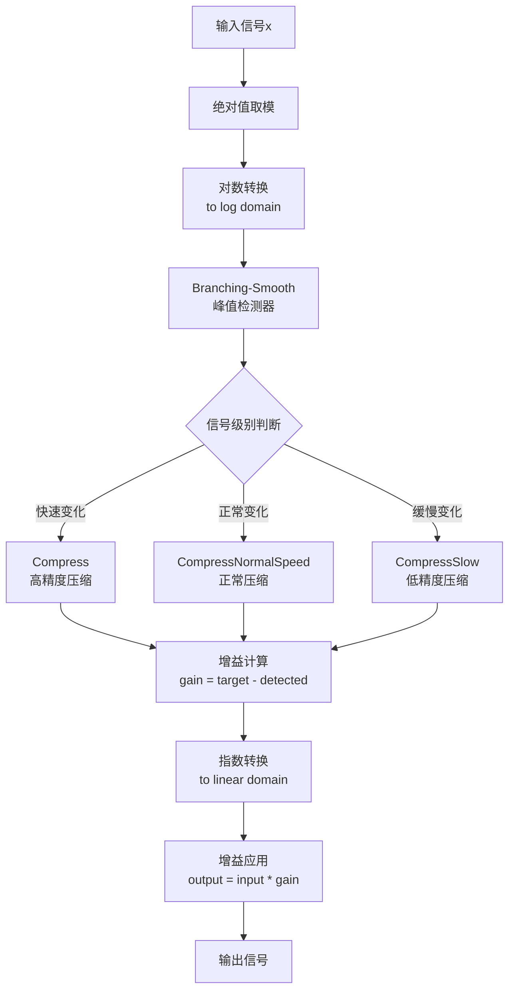

核心类接口：

```cpp
class AdaptiveDynamicRangeCompression {
    bool Initialize(float target_gain, float sampling_rate);
    float Compress(float x);           // 单样本高精度压缩
    void Compress(float *x1, float *x2); // 双通道压缩
    void set_knee_threshold(float decibel);
    void set_knee_threshold_via_target_gain(float target_gain);
};
```

#### 算法原理

LoudnessEnhancer的核心思想是**对数域自适应动态范围压缩**：

1. **峰值检测**：Branching-Smooth检测器根据信号变化速率选择不同时间常数
   - `Compress()`：高精度，attack/release时间常数最短
   - `CompressNormalSpeed()`：正常精度
   - `CompressSlow()`：低精度，时间常数最长（用于稳态信号）

2. **增益计算**：在对数域中，`gain = target_gain - detected_level`
   - 低能量信号获得更大增益（响度提升）
   - 高能量信号增益接近1（避免削波）

3. **Knee阈值**：软拐点平滑压缩曲线，避免硬切换失真

#### 旧HAL实现

```c
// EffectLoudnessEnhancer.cpp
struct LoudnessEnhancerContext {
    const effect_interface_t *itfe;
    effect_config_t config;
    int32_t mTargetGainmB;                              // 目标增益(mB)
    le_fx::AdaptiveDynamicRangeCompression* mCompressor; // 压缩器实例
};

// 命令处理
case LOUDNESS_ENHANCER_SET_TARGET_GAIN:
    context->mTargetGainmB = *(int32_t *)pCmdData;
    context->mCompressor->set_knee_threshold_via_target_gain(
        context->mTargetGainmB / 100.0f);  // mB → dB
    break;
```

#### AIDL实现

```cpp
class LoudnessEnhancerContext : public EffectContext {
    float mGain = LOUDNESS_ENHANCER_DEFAULT_TARGET_GAIN_MB;
    IEffect::Status lvmProcess(float* in, float* out, int samples) override;
    // 内部使用 le_fx::AdaptiveDynamicRangeCompression
};
```

> **与7.6节的对应关系**：Java层`android.media.audiofx.LoudnessEnhancer`的`setTargetGain(int gainmB)`直接映射到Native的`mTargetGainmB`参数。增益单位为毫贝(mB)，1dB = 100mB。

### 7.12.5 Downmix — 环绕声混音

源码路径:
- [`downmix/EffectDownmix.cpp`](frameworks/av/media/libeffects/downmix/EffectDownmix.cpp)
- [`downmix/aidl/DownmixContext.h`](frameworks/av/media/libeffects/downmix/aidl/DownmixContext.h)

Downmix将多声道（5.1/7.1）音频混音为立体声，遵循ITU-R BS.775标准的混音矩阵系数。

UUID: `93f04452-e4fe-41cc-91f9-e475b6d1d69f`

#### 混音类型

| 类型 | 枚举值 | 行为 |
|------|--------|------|
| Strip | `DOWNMIX_TYPE_STRIP` | 简单截取：只取前两声道（L/R），丢弃其余 |
| Process | `DOWNMIX_TYPE_PROCESS` | 矩阵混音：按ITU-R BS.775系数混合所有声道 |

#### 混音矩阵

Process模式下的ITU-R BS.775标准混音系数（5.1→立体声）：

```
输出L = 1.0*FL + 0.707*FC + 0.707*SL + 0.5*BL + 0*LF + 0*SR + 0*BR
输出R = 1.0*FR + 0.707*FC + 0.5*BL  + 0.707*SR + 0*LF + 0*SL + 0*BR
```

核心实现使用`audio_utils::ChannelMix`：

```cpp
// EffectDownmix.cpp
#include <audio_utils/ChannelMix.h>

// 核心混音引擎
static const audio_utils::channels::ChannelMix<AUDIO_CHANNEL_OUT_STEREO> sChannelMix;

// Process模式混音
int Downmix_process(effect_handle_t self, audio_buffer_t *in, audio_buffer_t *out) {
    // 调用ChannelMix进行矩阵混音
    sChannelMix.process(in->f32, out->f32, frameCount, inputChannelMask, false);
}
```

#### AIDL实现

```cpp
class DownmixContext : public EffectContext {
    Downmix::Type mType = Downmix::Type::PROCESS;  // 默认矩阵混音
    audio_utils::channels::ChannelMix<AUDIO_CHANNEL_OUT_STEREO> mChannelMix;

    void setOutputDevice(audio_port_v7 device) {
        // 根据输出设备切换混音类型
        if (device.type == AUDIO_DEVICE_OUT_WIRED_HEADSET ||
            device.type == AUDIO_DEVICE_OUT_WIRED_HEADPHONE) {
            mType = Downmix::Type::PROCESS;  // 耳机使用矩阵混音
        } else {
            mType = Downmix::Type::STRIP;    // 其他设备截取
        }
    }
};
```

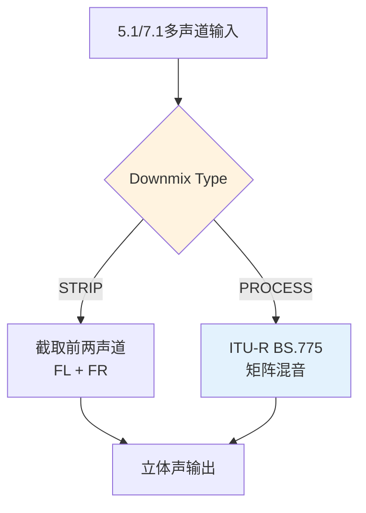

> **与7.3节EffectChain的关系**：当AudioPolicy将多声道Track路由到立体声输出设备时，AudioFlinger的EffectChain自动插入Downmix效果器，确保声道数匹配。

### 7.12.6 LVM Bundle — 低音/均衡/混响/虚拟器

源码路径:
- [`lvm/wrapper/Bundle/EffectBundle.cpp`](frameworks/av/media/libeffects/lvm/wrapper/Bundle/EffectBundle.cpp)（148.8KB，旧HAL）
- [`lvm/wrapper/Bundle/EffectBundle.h`](frameworks/av/media/libeffects/lvm/wrapper/Bundle/EffectBundle.h)
- [`lvm/wrapper/Aidl/EffectBundleAidl.h`](frameworks/av/media/libeffects/lvm/wrapper/Aidl/EffectBundleAidl.h)
- [`lvm/wrapper/Aidl/BundleContext.h`](frameworks/av/media/libeffects/lvm/wrapper/Aidl/BundleContext.h)
- [`lvm/wrapper/Aidl/GlobalSession.h`](frameworks/av/media/libeffects/lvm/wrapper/Aidl/GlobalSession.h)
- [`lvm/wrapper/Aidl/BundleTypes.h`](frameworks/av/media/libeffects/lvm/wrapper/Aidl/BundleTypes.h)
- [`lvm/lib/Bundle/lib/LVM.h`](frameworks/av/media/libeffects/lvm/lib/Bundle/lib/LVM.h)

LVM Bundle是NXP Software提供的Concert Sound DSP库封装，将BassBoost、Equalizer、Virtualizer、Volume四种效果整合在同一处理框架中，共享一个LVM引擎实例。

#### Bundle架构

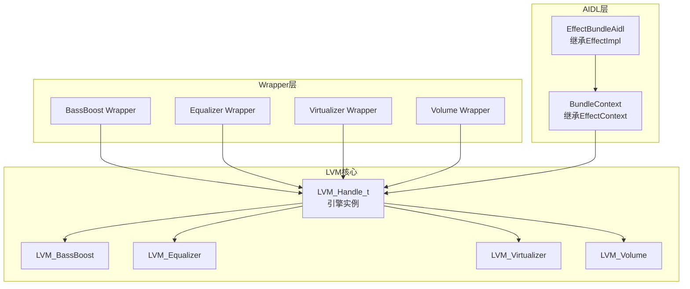

#### Session管理

LVM使用全局Session管理器，同一Session共享引擎实例：

```c
// EffectBundle.h
#define LVM_MAX_SESSIONS  32
#define FIVEBAND_NUMBANDS 5

typedef enum {
    LVM_BASS_BOOST,
    LVM_VIRTUALIZER,
    LVM_EQUALIZER,
    LVM_VOLUME
} lvm_effect_en;

// 全局会话内存
BundledEffectContext GlobalSessionMemory[LVM_MAX_SESSIONS];
```

```cpp
// GlobalSession.h (AIDL)
class GlobalSession {
    // session → BundleContext映射
    std::map<int, std::shared_ptr<BundleContext>> mSessions;
    static GlobalSession& getInstance();
    std::shared_ptr<BundleContext> getOrCreateSession(int sessionId);
    void releaseSession(int sessionId);
};
```

#### 信号处理链

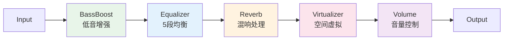

#### Equalizer预设

Bundle内置10个EQ预设，5个频段：

```cpp
// BundleTypes.h
constexpr inline std::array<uint16_t, MAX_NUM_BANDS> kPresetsFrequencies =
    {60, 230, 910, 3600, 14000};  // Hz

constexpr inline std::array<std::array<int16_t, MAX_NUM_BANDS>, MAX_NUM_PRESETS>
    kSoftPresets = {
    //  60   230   910  3600  14000 Hz
    {{   3,    0,    0,    0,     3},   // Normal
     {   5,    3,   -2,    4,     4},   // Classical
     {   6,    0,    2,    4,     1},   // Dance
     {   0,    0,    0,    0,     0},   // Flat
     {   3,    0,    0,    2,    -1},   // Folk
     {   4,    1,    9,    3,     0},   // Heavy Metal
     {   5,    3,    0,    1,     3},   // Hip Hop
     {   4,    2,   -2,    2,     5},   // Jazz
     {  -1,    2,    5,    1,    -2},   // Pop
     {   5,    3,   -1,    3,     5}}}; // Rock
```

频段范围定义：

| 频段 | 频率范围 | 中心频率 |
|------|---------|---------|
| Band 1 | 20-120 Hz | 60 Hz |
| Band 2 | 120-500 Hz | 230 Hz |
| Band 3 | 500-2000 Hz | 910 Hz |
| Band 4 | 2000-8000 Hz | 3600 Hz |
| Band 5 | 8000-22000 Hz | 14000 Hz |

#### BassBoost中心频率

LVM BassBoost支持4个中心频率选项：

```c
// LVM.h
typedef enum {
    LVM_BE_CENTRE_55Hz = 0,   // 55 Hz
    LVM_BE_CENTRE_66Hz = 1,   // 66 Hz
    LVM_BE_CENTRE_78Hz = 2,   // 78 Hz
    LVM_BE_CENTRE_90Hz = 3,   // 90 Hz
} LVM_BE_CentreFreq_en;
```

#### AIDL实现架构

```cpp
// EffectBundleAidl.h
class EffectBundleAidl : public EffectImpl {
    // 按效果类型分发参数设置
    ndk::ScopedAStatus setParameterSpecific(const Parameter::Specific& specific) override;
    ndk::ScopedAStatus setParameterBassBoost(const BassBoost& bb);
    ndk::ScopedAStatus setParameterEqualizer(const Equalizer& eq);
    ndk::ScopedAStatus setParameterVirtualizer(const Virtualizer& vz);
    ndk::ScopedAStatus setParameterVolume(const Volume& vol);
};

// BundleContext.h
class BundleContext : public EffectContext {
    LVM_Handle_t mInstance;          // LVM引擎实例
    uint32_t mEffectInDrain;         // 排空状态位掩码
    uint32_t mEffectProcessCalled;   // 处理调用位掩码
    
    // 各效果参数管理
    int mBassBoostStrength;          // BassBoost强度(0-1000)
    int mEqualizerPreset;            // EQ预设编号
    int16_t mEqualizerBandLevels[5]; // EQ各频段增益
    int mVirtualizerStrength;        // Virtualizer强度(0-1000)
    int mVolumeLevel;                // Volume级别
    bool mVolumeMute;                // 静音标志
};
```

#### 旧HAL Bundle处理流程

[`EffectBundle.cpp`](frameworks/av/media/libeffects/lvm/wrapper/Bundle/EffectBundle.cpp)的`LvmEffect_process()`函数：

1. 检查Session中哪些效果启用
2. 对输入buffer应用BassBoost → EQ → Virtualizer → Volume
3. 处理排空逻辑（效果禁用后的平滑过渡）
4. 通过`LVM_Process()`调用NXP核心算法

```c
// 核心处理逻辑（简化）
int LvmEffect_process(effect_handle_t self, audio_buffer_t *in, audio_buffer_t *out) {
    BundledEffectContext *pContext = (BundledEffectContext *)self;
    LVM_ReturnStatus_en LvmStatus = LVM_Process(
        pContext->hInstance,    // LVM引擎实例
        in->s16,               // 输入buffer
        out->s16,              // 输出buffer
        out->frameCount);      // 帧数
}
```

> **与7.6节的关系**：Java层的`BassBoost`、`Equalizer`、`Virtualizer`类通过EffectHandle调用到Bundle，同一Session内的多个效果共享LVM引擎实例，确保信号链一致性。

### 7.12.7 AIDL效果器迁移架构

源码路径:
- [`hardware/interfaces/audio/aidl/default/include/effect-impl/EffectImpl.h`](hardware/interfaces/audio/aidl/default/include/effect-impl/EffectImpl.h)
- [`hardware/interfaces/audio/aidl/default/include/effect-impl/EffectContext.h`](hardware/interfaces/audio/aidl/default/include/effect-impl/EffectContext.h)
- [`frameworks/av/media/libaudiohal/impl/EffectHalAidl.cpp`](frameworks/av/media/libaudiohal/impl/EffectHalAidl.cpp)
- [`frameworks/av/media/libaudiohal/impl/EffectConversionHelperAidl.h`](frameworks/av/media/libaudiohal/impl/EffectConversionHelperAidl.h)

Android 14正在从HIDL迁移到AIDL架构。音效框架同时支持两套HAL接口：旧的`effect_interface_s`（C语言）和新的AIDL `BnEffect`（C++）接口。本节分析双轨并行的实现架构。

#### HIDL vs AIDL双路径

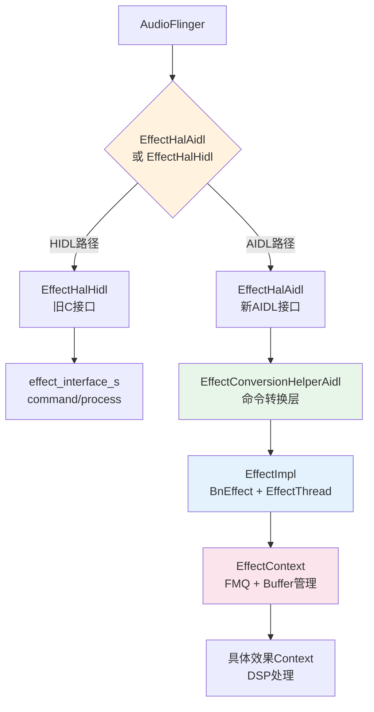

#### EffectImpl基类

[`EffectImpl`](hardware/interfaces/audio/aidl/default/include/effect-impl/EffectImpl.h)是所有AIDL效果器的公共基类：

```cpp
class EffectImpl : public BnEffect, public EffectThread {
    // 纯虚函数 — 子类必须实现
    virtual ndk::ScopedAStatus getDescriptor(Descriptor* desc) = 0;
    virtual ndk::ScopedAStatus setParameterSpecific(
        const Parameter::Specific& specific) = 0;
    virtual ndk::ScopedAStatus getParameterSpecific(
        const Parameter::Id& id, Parameter::Specific* specific) = 0;
    virtual std::string getEffectName() = 0;
    virtual std::shared_ptr<EffectContext> createContext(
        const Parameter::Common& common) = 0;

    // 已实现 — 框架提供
    IEffect::Status effectProcessImpl(float* in, float* out, int samples) override;
    ndk::ScopedAStatus command(int32_t cmdId) override;
    ndk::ScopedAStatus open(const Parameter::Common& common,
        const std::optional<OffloadInfo>& offloadInfo, IEffect::OpenInfo* info) override;
    ndk::ScopedAStatus close() override;
};
```

各内置效果器的AIDL实现均继承`EffectImpl`：

| 效果器 | AIDL实现类 | Context类 |
|--------|-----------|----------|
| BassBoost | `EffectBundleAidl` | `BundleContext` |
| Equalizer | `EffectBundleAidl` | `BundleContext` |
| Virtualizer | `EffectBundleAidl` | `BundleContext` |
| Volume | `EffectBundleAidl` | `BundleContext` |
| DynamicsProcessing | `DynamicsProcessingAidl` | `DynamicsProcessingContext` |
| HapticGenerator | `HapticGeneratorAidl` | `HapticGeneratorContext` |
| LoudnessEnhancer | `LoudnessEnhancerAidl` | `LoudnessEnhancerContext` |
| Downmix | `DownmixAidl` | `DownmixContext` |

#### EffectContext基类

[`EffectContext`](hardware/interfaces/audio/aidl/default/include/effect-impl/EffectContext.h)管理效果器运行时状态：

```cpp
class EffectContext {
    // 三条FMQ消息队列
    std::shared_ptr<StatusMQ> mStatusMQ;   // 状态消息队列
    std::shared_ptr<InputMQ>  mInputMQ;     // 输入数据队列
    std::shared_ptr<OutputMQ> mOutputMQ;    // 输出数据队列

    // Buffer管理
    audio_format_t mFormat = AUDIO_FORMAT_PCM_FLOAT; // 强制浮点格式
    std::vector<float> mWorkBuffer;                   // 工作缓冲区

    // 核心处理接口
    virtual IEffect::Status lvmProcess(float* in, float* out, int samples) = 0;
};
```

FMQ通信机制：

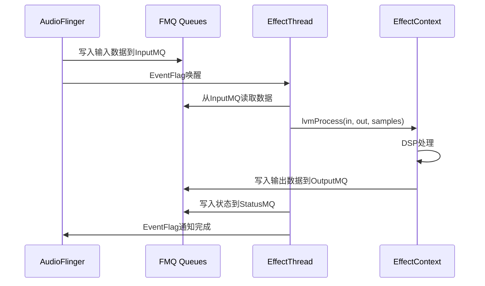

#### AIDL转换层

[`EffectConversionHelperAidl`](frameworks/av/media/libaudiohal/impl/EffectConversionHelperAidl.h)将旧`effect_command_e`命令转换为AIDL参数：

```cpp
class EffectConversionHelperAidl {
    // FMQ通信
    std::shared_ptr<StatusMQ> mStatusMQ;
    std::shared_ptr<DataMQ>   mDataMQ;
    EventFlag* mEventFlag;

    // 命令处理映射
    std::map<uint32_t, CommandHandler> mCommandHandlerMap;

    // 旧命令 → AIDL参数转换
    ndk::ScopedAStatus handleCommand(uint32_t cmdCode, ...);
};
```

`effectsAidlConversion/`目录包含16个AIDL转换模块：

| 转换模块 | 功能 |
|---------|------|
| `AidlConversionAec` | AcousticEchoCanceler参数转换 |
| `AidlConversionAgc` | AutomaticGainControl参数转换 |
| `AidlConversionBassBoost` | BassBoost参数转换 |
| `AidlConversionDownmix` | Downmix参数转换 |
| `AidlConversionDp` | DynamicsProcessing参数转换 |
| `AidlConversionEq` | Equalizer参数转换 |
| `AidlConversionHaptic` | HapticGenerator参数转换 |
| `AidlConversionLe` | LoudnessEnhancer参数转换 |
| `AidlConversionNs` | NoiseSuppression参数转换 |
| `AidlConversionReverb` | PresetReverb/EnvReverb参数转换 |
| `AidlConversionSpatializer` | Spatializer参数转换 |
| `AidlConversionVirtualizer` | Virtualizer参数转换 |
| `AidlConversionVisualizer` | Visualizer参数转换 |
| `AidlConversionVendor` | 厂商自定义效果参数转换 |

#### EffectBufferHalAidl

AIDL效果器的Buffer管理：

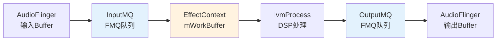

#### 迁移策略总结

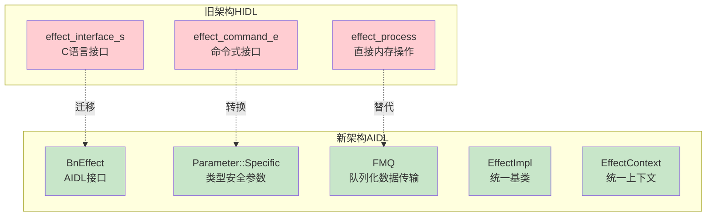

AIDL迁移的关键改进：
1. **类型安全**：从`void*`命令接口迁移到`Parameter::Specific`类型安全参数
2. **统一基类**：`EffectImpl`+`EffectContext`提供标准框架，减少重复代码
3. **FMQ通信**：从直接内存操作改为FMQ队列，更安全的数据传输
4. **强制浮点**：`AUDIO_FORMAT_PCM_FLOAT`为唯一处理格式，简化实现
5. **EffectThread**：内置处理线程，统一效果器生命周期管理

> **与7.5节EffectHandle的关系**：EffectHandle通过`EffectHalAidl`/`EffectHalHidl`选择路径，AIDL路径经过`EffectConversionHelperAidl`转换后到达`EffectImpl`。两种路径对上层AudioFlinger透明，EffectHandle无需感知底层实现差异。

---

> [← 上一篇：Audio Policy Engine](../06_Audio_Policy_Engine/README.md) | [返回导航](README.md) | [下一篇：HAL Layer →](../08_HAL_Layer/README.md)

---

[← 7.11 DeviceEffectPro](07_7.11_DeviceEffectProxy.md) | [← 返回Effects Framework](README.md) | [返回导航](../README.md)
