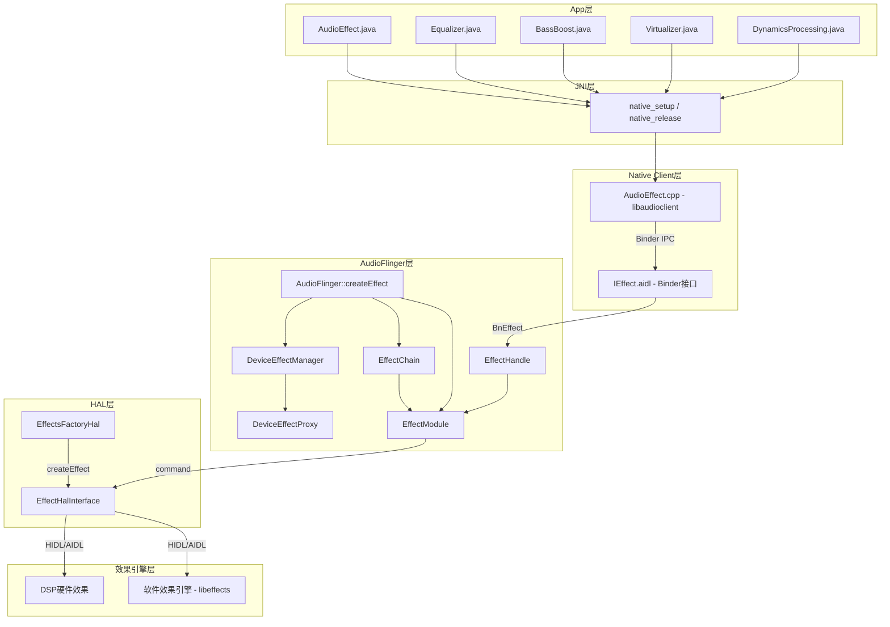
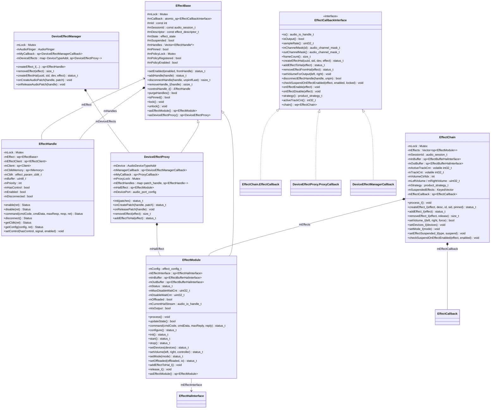
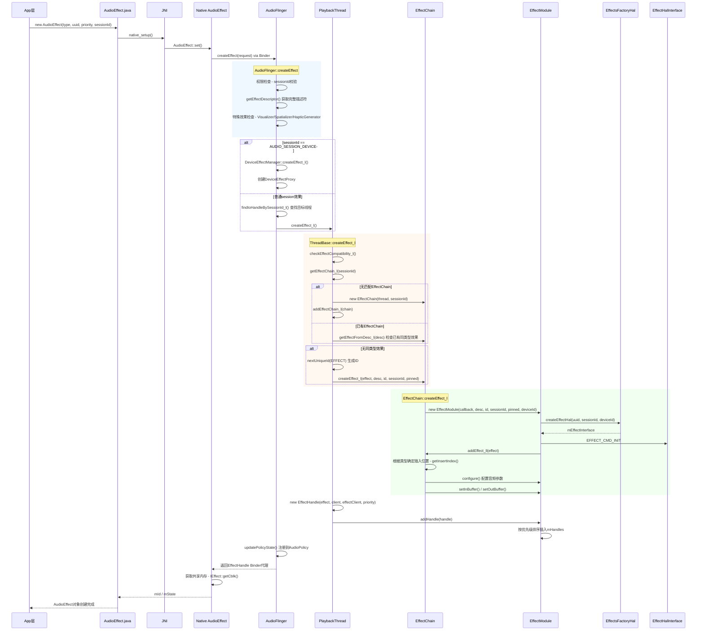
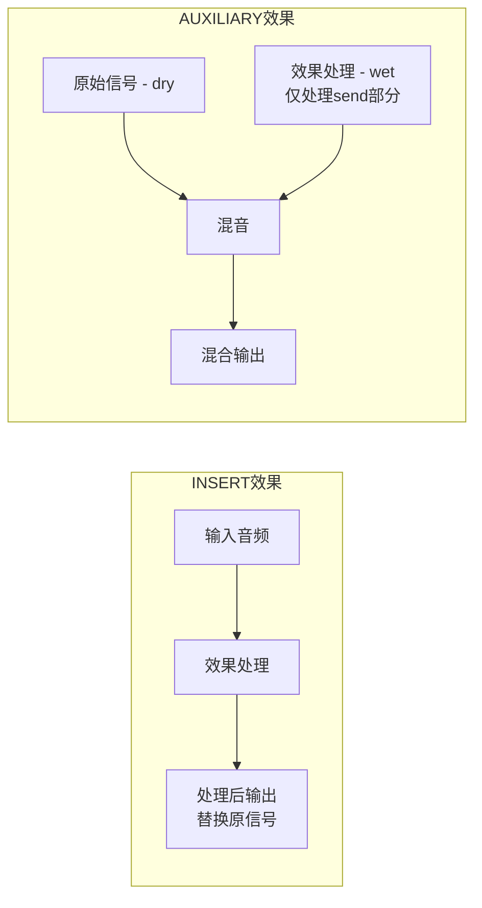
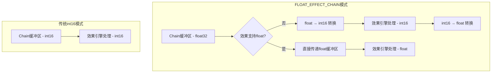

[← 返回Effects Framework](README.md) | [返回导航](../README.md) | [7.2 EffectChain →](07_7.2_EffectChain.md)

---

## 7.1 AudioEffect架构总览

### 7.1.1 模块定位与架构概述

Effects Framework是Android音频系统中负责**音频效果处理**的核心子系统，它为App和系统提供了对音频流应用均衡器、低音增强、回声消除、空间音频等效果的统一框架。

**核心设计目标：**

1. **统一抽象**：无论效果实现是在软件（SW）还是硬件（HW/DSP），对上层提供一致的API
2. **多客户端共享**：同一效果实例可被多个App通过`EffectHandle`共享，通过优先级机制解决控制权冲突
3. **会话隔离**：基于`audio_session_t`实现效果链的隔离，不同会话的效果互不干扰
4. **动态插拔**：效果可在运行时创建、启用、禁用、销毁，无需重启音频通路

**源码位置：**

| 层级 | 文件 | 职责 |
|------|------|------|
| Java API | [`AudioEffect.java`](frameworks/base/media/java/android/media/audiofx/AudioEffect.java) | 应用层效果API |
| JNI/Native Client | [`AudioEffect.cpp`](frameworks/av/media/libaudioclient/AudioEffect.cpp) | Binder客户端封装 |
| AudioFlinger | [`Effects.h`](frameworks/av/services/audioflinger/Effects.h) / [`Effects.cpp`](frameworks/av/services/audioflinger/Effects.cpp) | 效果框架核心实现 |
| HAL | `EffectHalInterface` / `EffectsFactoryHalInterface` | 效果引擎HAL抽象 |
| 数据结构 | [`audio_effect.h`](system/media/audio/include/system/audio_effect.h) | 效果描述符与命令定义 |
| 共享内存 | [`AudioEffectShared.h`](frameworks/av/include/private/media/AudioEffectShared.h) | 参数传递控制块 |

---

### 7.1.2 完整分层架构



**分层调用关系说明：**

- **App层**：各子类（`Equalizer`、`BassBoost`等）继承自[`AudioEffect`](frameworks/base/media/java/android/media/audiofx/AudioEffect.java:85)，通过JNI调用Native方法
- **Native Client层**：[`AudioEffect.cpp`](frameworks/av/media/libaudioclient/AudioEffect.cpp)通过`IEffect` Binder代理与AudioFlinger通信
- **AudioFlinger层**：核心实体包括`EffectModule`（效果实例）、`EffectHandle`（客户端句柄）、`EffectChain`（效果链）、`DeviceEffectProxy`（设备效果代理）
- **HAL层**：通过`EffectsFactoryHal`创建效果引擎实例，`EffectHalInterface`封装命令接口

---

### 7.1.3 核心类关系与职责



**核心类职责详解：**

| 类名 | 职责 | 源码位置 |
|------|------|----------|
| [`EffectCallbackInterface`](frameworks/av/services/audioflinger/Effects.h:26) | 抽象回调接口，隔离EffectModule与ThreadBase/EffectChain的交互 | Effects.h:26-72 |
| [`EffectBase`](frameworks/av/services/audioflinger/Effects.h:93) | 效果基类，封装通用属性（状态机、Handle列表、描述符、互斥锁） | Effects.h:93-209 |
| [`EffectModule`](frameworks/av/services/audioflinger/Effects.h:220) | 效果实例，管理HAL引擎、音频缓冲区、处理流程和状态转换 | Effects.h:220-351 |
| [`EffectHandle`](frameworks/av/services/audioflinger/Effects.h:359) | 客户端句柄，实现`BnEffect` Binder接口，每个App连接对应一个 | Effects.h:359-437 |
| [`EffectChain`](frameworks/av/services/audioflinger/Effects.h:448) | 效果链，按session分组管理一组EffectModule，控制处理顺序和缓冲区 | Effects.h:448-707 |
| [`DeviceEffectProxy`](frameworks/av/services/audioflinger/Effects.h:709) | 设备效果代理，管理绑定到特定音频设备的效果 | Effects.h:709-812 |
| [`DeviceEffectManager`](frameworks/av/services/audioflinger/DeviceEffectManager.h:25) | 设备效果管理器，监听AudioPatch变化，管理DeviceEffectProxy生命周期 | DeviceEffectManager.h |

**EffectHandle多客户端机制：**

`EffectBase::mHandles`是`Vector<EffectHandle*>`列表。第一个有效Handle拥有效果控制权（见[`controlHandle_l()`](frameworks/av/services/audioflinger/Effects.cpp:350)）。当高优先级客户端连接时，通过`addHandle()`按优先级排序插入列表头部，获得控制权。

---

### 7.1.4 效果创建全链路时序图



**创建链路关键源码对照：**

| 步骤 | 源码方法 | 文件:行号 |
|------|----------|-----------|
| 入口 | [`AudioFlinger::createEffect()`](frameworks/av/services/audioflinger/AudioFlinger.cpp:4136) | AudioFlinger.cpp:4136 |
| 线程查找 | [`findIoHandleBySessionId_l()`](frameworks/av/services/audioflinger/AudioFlinger.cpp:4313) | AudioFlinger.cpp:4313 |
| 线程级创建 | [`ThreadBase::createEffect_l()`](frameworks/av/services/audioflinger/Threads.cpp:1556) | Threads.cpp:1556 |
| Chain级创建 | [`EffectChain::createEffect_l()`](frameworks/av/services/audioflinger/Effects.cpp:2325) | Effects.cpp:2325 |
| Module构造 | [`EffectModule::EffectModule()`](frameworks/av/services/audioflinger/Effects.cpp:560) | Effects.cpp:560 |
| 添加到链 | [`EffectChain::addEffect_ll()`](frameworks/av/services/audioflinger/Effects.cpp:2350) | Effects.cpp:2350 |
| 配置 | [`EffectModule::configure()`](frameworks/av/services/audioflinger/Effects.cpp:880) | Effects.cpp:880 |

---

### 7.1.5 效果处理数据流

```mermaid
graph LR
    subgraph MixerStage[混音阶段]
        Track1[Track A] -->|音频数据| Mixer[AudioMixer]
        Track2[Track B] -->|音频数据| Mixer
        Track3[Track C - aux send| aux send] -->|aux level| AuxBuf[Aux输入缓冲区]
    end

    subgraph ChainProcess[EffectChain::process_l]
        Mixer -->|混音输出| ChainIn[Chain输入缓冲区 mInBuffer]
        AuxBuf -->|mono accumulation| ChainIn

        subgraph Effects[效果处理流水线]
            Aux[Auxiliary Effect<br/>如Reverb] -->|accumulate| InBuf[Chain输入缓冲区]
            InBuf --> Ins1[Insert Effect 1<br/>如EQ]
            Ins1 --> Ins2[Insert Effect 2<br/>如BassBoost]
            Ins2 --> OutBuf[Chain输出缓冲区 mOutBuffer]
        end
    end

    subgraph OutputStage[输出阶段]
        OutBuf -->|处理后数据| Sink[HAL输出]
    end
```

**数据流核心逻辑（基于源码）：**

[`EffectChain::process_l()`](frameworks/av/services/audioflinger/Effects.cpp:2273)的执行流程：

1. **判断是否需要处理**：非Offload/Mmap线程且有活跃Track或Tail未渲染完时处理
2. **更新缓冲区**：`mInBuffer->update()` / `mOutBuffer->update()` 刷新外部缓冲区内容
3. **顺序处理**：遍历`mEffects`，依次调用每个[`EffectModule::process()`](frameworks/av/services/audioflinger/Effects.cpp:672)
4. **提交缓冲区**：`mInBuffer->commit()` / `mOutBuffer->commit()` 写回数据
5. **更新状态**：遍历调用每个`EffectModule::updateState()` 处理状态转换

**EffectModule::process()内部的缓冲区逻辑：**

```cpp
// Effects.cpp:672-730 核心逻辑简化
void EffectModule::process() {
    Mutex::Autolock _l(mLock);
    if (mState == DESTROYED || !mEffectInterface || !mInBuffer || !mOutBuffer) return;

    if (isProcessEnabled()) {
        if (isProcessImplemented()) {
            if (auxType) {
                // Auxiliary: 将aux输入从q4.27转换为int16_t
                // 然后效果引擎处理，输出accumulate到chain输入缓冲区
            }
            // INSERT效果: inBuffer -> effect process -> outBuffer
            mEffectInterface->process(inBuffer, outBuffer);
        } else {
            // NO_PROCESS标志: 仅拷贝/累加输入到输出
            if (accessMode == ACCUMULATE) accumulateInputToOutput();
            else copyInputToOutput();
        }
    } else {
        // 效果未启用: bypass - 拷贝/累加
    }
}
```

**缓冲区连接规则（源自[`addEffect_ll()`](frameworks/av/services/audioflinger/Effects.cpp:2350)）：**

| 效果类型 | 输入缓冲区 | 输出缓冲区 | accessMode |
|----------|-----------|-----------|------------|
| Auxiliary | 独立mono缓冲区 | Chain输入缓冲区（mInBuffer） | ACCUMULATE |
| Insert（非最后一个） | Chain输入缓冲区 | Chain输入缓冲区 | WRITE |
| Insert（最后一个） | Chain输入缓冲区 | Chain输出缓冲区（mOutBuffer） | ACCUMULATE |
| Spatializer线程首效果 | Chain输入缓冲区 | Chain输出缓冲区 | WRITE |

---

### 7.1.6 互斥锁层级与线程安全

Effects Framework涉及多层互斥锁，严格的锁获取顺序是避免死锁的关键。源码注释（[Effects.h:74-87](frameworks/av/services/audioflinger/Effects.h:74)）明确规定了锁层级：

```
AudioFlinger::mLock → ThreadBase::mLock → EffectChain::mLock → EffectBase::mLock
AudioHandle        → ThreadBase::mLock → EffectChain::mLock → EffectBase::mLock
```

**锁层级详解：**

| 层级 | 锁对象 | 保护范围 | 获取场景 |
|------|--------|----------|----------|
| L1 | `AudioFlinger::mLock` | 全局效果创建/销毁、线程列表 | `createEffect()`、`createTrack()` |
| L2 | `ThreadBase::mLock` | 线程内效果链列表、Track列表 | `addEffectChain_l()`、`addTrack_l()` |
| L3 | `EffectChain::mLock` | 效果链内效果列表、音量、挂起状态 | `addEffect_ll()`、`process_l()`、`setVolume_l()` |
| L4 | `EffectBase::mLock` | 单个效果的状态、Handle列表 | `process()`、`setEnabled()`、`addHandle()` |
| 特殊 | `EffectBase::mPolicyLock` | AudioPolicy状态同步 | `updatePolicyState()` |

**关键约束：**

1. **AudioPolicyService锁不可在AudioFlinger锁内获取**：`getOutputForEffect()`、`startOutput()`等APM方法会获取APM锁，若在AudioFlinger锁内调用会导致AB/BA死锁
2. **`EffectCallbackInterface`方法需注意锁序**：回调方法在EffectModule/EffectChain锁已持有时被调用，内部不能反向获取更高级别锁
3. **`mPolicyLock`独立于层级**：用于与AudioPolicy通信，不可在`mLock`内持有（见[Effects.h:201-203](frameworks/av/services/audioflinger/Effects.h:201)）

**`AutoLockReentrant`机制：**

[`EffectModule`](frameworks/av/services/audioflinger/Effects.h:334)中实现了可重入锁辅助类，允许`setVolume()`在特定线程ID（`mSetVolumeReentrantTid`）上免锁调用。这在`stop_l()`流程中需要回调`resetVolume()` → `setVolume()`时使用（见[Effects.cpp:1174-1179](frameworks/av/services/audioflinger/Effects.cpp:1174)）。

---

### 7.1.7 关键数据结构

#### effect_descriptor_t - 效果描述符

定义于[`audio_effect.h:52-61`](system/media/audio/include/system/audio_effect.h:52)：

```c
typedef struct effect_descriptor_s {
    effect_uuid_t type;     // 效果类型UUID（对应OpenSL ES接口ID）
    effect_uuid_t uuid;     // 具体实现的唯一UUID
    uint32_t apiVersion;    // API版本号
    uint32_t flags;         // 能力/需求标志位
    uint16_t cpuLoad;       // CPU负载指示
    uint16_t memoryUsage;   // 内存使用指示
    char name[EFFECT_STRING_LEN_MAX];       // 效果名称（最长64字符）
    char implementor[EFFECT_STRING_LEN_MAX]; // 实现者名称
} effect_descriptor_t;
```

**flags字段位域结构**（定义于[`audio_effect-base.h`](system/media/audio/include/system/audio_effect-base.h:12)）：

| 位域 | 位数 | 位置 | 说明 |
|------|------|------|------|
| TYPE | 3 | [2:0] | 效果类型：INSERT/ AUXILIARY/REPLACE/PRE_PROC/POST_PROC |
| INSERT | 3 | [5:3] | 插入偏好：ANY/FIRST/LAST/EXCLUSIVE |
| VOLUME | 3 | [8:6] | 音量能力：CTRL/IND/MONITOR |
| DEVICE | 3 | [11:9] | 设备通知：IND |
| INPUT | 2 | [13:12] | 输入模式：DIRECT/PROVIDER/BOTH |
| OUTPUT | 2 | [15:14] | 输出模式：DIRECT/PROVIDER/BOTH |
| HW_ACC | 2 | [17:16] | 硬件加速：SIMPLE/TUNNEL |
| AUDIO_MODE | 2 | [19:18] | 音频模式通知：IND |
| AUDIO_SOURCE | 2 | [21:20] | 音频源通知：IND |
| OFFLOAD | 1 | [22] | 支持Offload |
| NO_PROCESS | 1 | [23] | 无process()实现（仅参数控制） |

#### effect_config_t - 效果配置

定义于[`audio_effect.h:507-510`](system/media/audio/include/system/audio_effect.h:507)：

```c
typedef struct effect_config_s {
    buffer_config_t inputCfg;   // 输入音频配置
    buffer_config_t outputCfg;  // 输出音频配置
} effect_config_t;

typedef struct buffer_config_s {
    audio_buffer_t  buffer;         // 音频缓冲区
    uint32_t        samplingRate;   // 采样率
    uint32_t        channels;       // 通道掩码
    buffer_provider_t bufferProvider; // 缓冲区提供者
    uint8_t         format;         // 音频格式
    uint8_t         accessMode;     // 访问模式(WRITE/READ/ACCUMULATE)
    uint16_t        mask;           // 有效字段掩码
} buffer_config_t;
```

`accessMode`决定效果引擎对输出缓冲区的行为：
- `EFFECT_BUFFER_ACCESS_WRITE`：直接覆写输出缓冲区
- `EFFECT_BUFFER_ACCESS_ACCUMULATE`：将处理结果累加到输出缓冲区

#### effect_param_cblk_t - 参数共享控制块

定义于[`AudioEffectShared.h:35-44`](frameworks/av/include/private/media/AudioEffectShared.h:35)：

```c
struct effect_param_cblk_t {
    Mutex       lock;           // 共享互斥锁（跨进程SHARED）
    volatile uint32_t clientIndex;  // App端读写索引
    volatile uint32_t serverIndex;  // AudioFlinger端读写索引
    uint8_t*    buffer;         // 参数缓冲区起始指针
};
```

此结构通过共享内存在App进程和AudioFlinger进程间传递参数，实现deferred parameter设置机制。`clientIndex`和`serverIndex`构成环形缓冲区的双指针，配合`EFFECT_CMD_SET_PARAM_DEFERRED`和`EFFECT_CMD_SET_PARAM_COMMIT`实现参数批量提交。

---

### 7.1.8 效果类型分类

效果类型通过`effect_descriptor_t.flags`的低3位（TYPE位域）区分，定义于[`audio_effect-base.h:16-20`](system/media/audio/include/system/audio_effect-base.h:16)：

| 类型 | 值 | 说明 | 典型效果 |
|------|-----|------|----------|
| `EFFECT_FLAG_TYPE_INSERT` | 0x0 | 插入效果，串行处理全部音频 | Equalizer、BassBoost、Virtualizer |
| `EFFECT_FLAG_TYPE_AUXILIARY` | 0x1 | 辅助效果，处理部分信号后叠加回原信号 | Environmental Reverb、Preset Reverb |
| `EFFECT_FLAG_TYPE_REPLACE` | 0x2 | 替换效果，取代原始音频处理 | Downmix |
| `EFFECT_FLAG_TYPE_PRE_PROC` | 0x3 | 预处理效果，作用于输入流（录音） | AEC、AGC、NS |
| `EFFECT_FLAG_TYPE_POST_PROC` | 0x4 | 后处理效果，作用于输出设备 | 设备级音效处理 |

**INSERT与AUXILIARY的核心区别：**



**INSERT效果的插入偏好**（[`audio_effect-base.h:24-27`](system/media/audio/include/system/audio_effect-base.h:24)）：

| 偏好 | 值 | 说明 |
|------|-----|------|
| `EFFECT_FLAG_INSERT_ANY` | 0 | 无特殊位置要求 |
| `EFFECT_FLAG_INSERT_FIRST` | 8 | 优先处理（如Spatializer需先做空间化） |
| `EFFECT_FLAG_INSERT_LAST` | 16 | 最后处理（如DynamicsProcessing需作用于最终信号） |
| `EFFECT_FLAG_INSERT_EXCLUSIVE` | 24 | 独占处理（不允许与其他INSERT效果共存） |

插入位置逻辑在[`getInsertIndex()`](frameworks/av/services/audioflinger/Effects.cpp:2434)中实现。Spatializer和Downmixer总是插入到位置0，因为它们需要先调整声道数。

**Java层UUID常量对照**（[`AudioEffect.java:94-156`](frameworks/base/media/java/android/media/audiofx/AudioEffect.java:94)）：

| 常量 | UUID | 类型 |
|------|------|------|
| `EFFECT_TYPE_ENV_REVERB` | c2e5d5f0-94bd-4763-9cac-4e234d06839e | AUXILIARY |
| `EFFECT_TYPE_PRESET_REVERB` | 47382d60-ddd8-11db-bf3a-0002a5d5c51b | AUXILIARY |
| `EFFECT_TYPE_EQUALIZER` | 0bed4300-ddd6-11db-8f34-0002a5d5c51b | INSERT |
| `EFFECT_TYPE_BASS_BOOST` | 0634f220-ddd4-11db-a0fc-0002a5d5c51b | INSERT |
| `EFFECT_TYPE_VIRTUALIZER` | 37cc2c00-dddd-11db-8577-0002a5d5c51b | INSERT |
| `EFFECT_TYPE_AGC` | 0a8abfe0-654c-11e0-ba26-0002a5d5c51b | PRE_PROC |
| `EFFECT_TYPE_AEC` | 7b491460-8d4d-11e0-bd61-0002a5d5c51b | PRE_PROC |
| `EFFECT_TYPE_NS` | 58b4b260-8e06-11e0-aa8e-0002a5d5c51b | PRE_PROC |
| `EFFECT_TYPE_LOUDNESS_ENHANCER` | fe3199be-aed0-413f-87bb-11260eb63cf1 | INSERT |
| `EFFECT_TYPE_DYNAMICS_PROCESSING` | 7261676f-6d75-7369-6364-28e2fd3ac39e | INSERT |
| `EFFECT_TYPE_HAPTIC_GENERATOR` | 1411e6d6-aecd-4021-a1cf-a6aceb0d71e5 | INSERT |

---

### 7.1.9 FLOAT_EFFECT_CHAIN架构

`FLOAT_EFFECT_CHAIN`是Android 7.0引入的编译期宏，使效果链内部使用32位浮点（float）格式传输音频数据，替代传统的16位整数（int16_t）格式。

**条件编译架构**（见[Effects.h:326-332](frameworks/av/services/audioflinger/Effects.h:326)）：

```cpp
#ifdef FLOAT_EFFECT_CHAIN
    bool    mSupportsFloat;         // 效果引擎是否支持float处理
    sp<EffectBufferHalInterface> mInConversionBuffer;  // 输入转换缓冲区
    sp<EffectBufferHalInterface> mOutConversionBuffer; // 输出转换缓冲区
    uint32_t mInChannelCountRequested;   // 请求的输入声道数
    uint32_t mOutChannelCountRequested;  // 请求的输出声道数
#endif
```

**数据格式转换流程：**



**关键转换逻辑（基于[`EffectModule::process()`](frameworks/av/services/audioflinger/Effects.cpp:672)）：**

1. **支持float的效果引擎**：直接使用float缓冲区调用`process()`
2. **不支持float的效果引擎**：
   - 输入侧：将float输入转换为int16_t（`memcpy_to_i16_from_float`），通过`mInConversionBuffer`
   - 输出侧：将int16_t输出转换回float（`memcpy_to_float_from_i16`），通过`mOutConversionBuffer`
3. **Auxiliary效果的float处理**：aux输入使用q4.27定点格式（32位），需转换为float（`memcpy_to_float_from_q4_27`）
4. **声道数调整**：当效果引擎的输入/输出声道数与Chain不一致时，通过`adjust_channels()`在转换缓冲区中完成

**FLOAT_EFFECT_CHAIN的优势：**

- 更高的动态范围：float32提供约1500dB动态范围，远超int16的96dB
- 避免多次量化噪声：整数链路中每个效果处理都会引入量化噪声，浮点链路仅在与外部交互时量化
- 统一内部格式：不同效果引擎可工作在不同格式，Chain内部统一float传输

[← 返回Effects Framework](README.md) | [返回导航](../README.md) | [7.2 EffectChain →](07_7.2_EffectChain.md)