## 7.2 EffectChain — 效果链深度解析

## 模块定位

[`EffectChain`](frameworks/av/services/audioflinger/Effects.h:448) 是 AudioFlinger Effects Framework 的核心调度单元，管理同一 `audio_session_t` 下所有 [`EffectModule`](frameworks/av/services/audioflinger/Effects.h) 的有序集合，负责：

1. **效果实例的生命周期管理** — 创建、插入、移除效果
2. **音频数据流的串联处理** — 按序驱动每个 `EffectModule::process()`
3. **Buffer 管理与路由** — 根据效果类型（Auxiliary/Insert/Spatializer）分配不同 buffer 策略
4. **音量控制代理** — 将音量请求委托给链中拥有音量控制权的效果
5. **效果挂起/恢复机制** — 通过引用计数管理效果的 suspend/restore
6. **Tail 残响处理** — Track 停止后继续处理残响帧

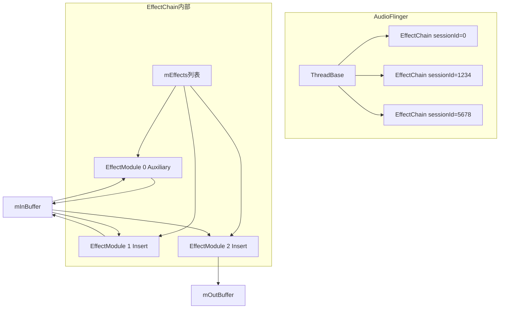

> **关键约束**: `session=0`（`AUDIO_SESSION_OUTPUT_MIX`）是全局效果链，作用于 Thread 上所有 Track。非0 sessionId 的 EffectChain 只处理对应 Track 的数据。

---

## 核心数据结构

### EffectChain 类定义（[Effects.h:448-707](frameworks/av/services/audioflinger/Effects.h:448)）

#### 关键成员变量（[Effects.h:682-707](frameworks/av/services/audioflinger/Effects.h:682)）

| 成员变量 | 类型 | 用途 |
|---------|------|------|
| `mEffects` | `Vector<sp<EffectModule>>` | 效果模块有序列表，索引0为 Auxiliary 效果 |
| `mSessionId` | `audio_session_t` | 所属音频会话 ID |
| `mInBuffer` | `sp<EffectBufferHalInterface>` | 链输入 buffer，接收混音数据 |
| `mOutBuffer` | `sp<EffectBufferHalInterface>` | 链输出 buffer，写入 HAL |
| `mActiveTrackCnt` | `volatile int32_t` | 活跃 Track 计数（原子操作） |
| `mTrackCnt` | `volatile int32_t` | 总 Track 计数（原子操作） |
| `mTailBufferCount` | `int32_t` | 当前 Tail 残响剩余帧数 |
| `mMaxTailBuffers` | `int32_t` | 最大 Tail 帧数（由采样率和帧数计算） |
| `mVolumeCtrlIdx` | `int` | 拥有音量控制权的 Insert 效果索引 |
| `mLeftVolume` / `mRightVolume` | `uint32_t` | 当前左/右声道音量 |
| `mNewLeftVolume` / `mNewRightVolume` | `uint32_t` | 经效果处理后的新音量 |
| `mStrategy` | `product_strategy_t` | 此链关联的策略 |
| `mSuspendedEffects` | `KeyedVector<int, sp<SuspendedEffectDesc>>` | 挂起效果列表，key 为 UUID timeLow |
| `mEffectCallback` | `sp<EffectCallback>` | 回调接口实现，桥接 Thread 信息 |
| `mLock` | `Mutex` | 保护效果列表的互斥锁 |

#### SuspendedEffectDesc 内部类（[Effects.h:649-656](frameworks/av/services/audioflinger/Effects.h:649)）

```cpp
class SuspendedEffectDesc : public RefBase {
public:
    SuspendedEffectDesc() : mRefCount(0) {}
    int mRefCount;           // > 0 表示已挂起，引用计数
    effect_uuid_t mType;     // 效果类型 UUID
    wp<EffectModule> mEffect; // 弱引用被挂起的效果
};
```

#### EffectCallback 内部类（[Effects.h:574-644](frameworks/av/services/audioflinger/Effects.h:574)）

`EffectCallback` 是 `EffectCallbackInterface` 的实现，作为 `EffectChain` 与所属 `ThreadBase` 之间的桥梁：

| 方法 | 用途 |
|------|------|
| `createEffectHal()` | 创建 HAL 层效果实例 |
| `allocateHalBuffer()` | 分配 HAL buffer |
| `io()` / `isOutput()` / `isOffload()` | 查询 Thread 属性 |
| `sampleRate()` / `frameCount()` / `latency()` | 查询音频参数 |
| `inChannelMask()` / `outChannelMask()` | 查询通道配置 |
| `addEffectToHal()` / `removeEffectFromHal()` | HAL 效果注册/注销 |
| `setVolumeForOutput()` | 设置输出音量 |
| `checkSuspendOnEffectEnabled()` | 效果启用时检查挂起 |
| `resetVolume()` | 重置音量 |

---

## 构造与初始化

### 构造函数（[Effects.cpp:2181](frameworks/av/services/audioflinger/Effects.cpp:2181)）

```cpp
EffectChain::EffectChain(const wp<ThreadBase>& thread, audio_session_t sessionId)
    : mSessionId(sessionId), mActiveTrackCnt(0), mTrackCnt(0), mTailBufferCount(0),
      mVolumeCtrlIdx(-1), mLeftVolume(UINT_MAX), mRightVolume(UINT_MAX),
      mNewLeftVolume(UINT_MAX), mNewRightVolume(UINT_MAX),
      mEffectCallback(new EffectCallback(wp<EffectChain>(this), thread))
{
    sp<ThreadBase> p = thread.promote();
    mStrategy = p->getStrategyForStream(AUDIO_STREAM_MUSIC);
    mMaxTailBuffers = ((kProcessTailDurationMs * p->sampleRate()) / 1000)
                                    / p->frameCount();
}
```

**关键初始化逻辑：**
- `kProcessTailDurationMs = 1000`（[Effects.h:459](frameworks/av/services/audioflinger/Effects.h:459)）：Tail 残响持续 1 秒
- `mMaxTailBuffers` = `(1000ms × sampleRate / 1000) / frameCount` = 采样率对应的帧数 / 每次处理帧数
- 音量初始值为 `UINT_MAX`，表示未设置
- `mVolumeCtrlIdx` 初始为 -1，表示没有效果拥有音量控制权

---

## 关键方法深度解析

### 1. `process_l()` — 效果链处理入口（[Effects.cpp:2273](frameworks/av/services/audioflinger/Effects.cpp:2273)）

```cpp
void EffectChain::process_l()
```

**方法签名**: `void process_l()` — 无参数，需持有 `EffectChain::mLock`

**核心逻辑：**

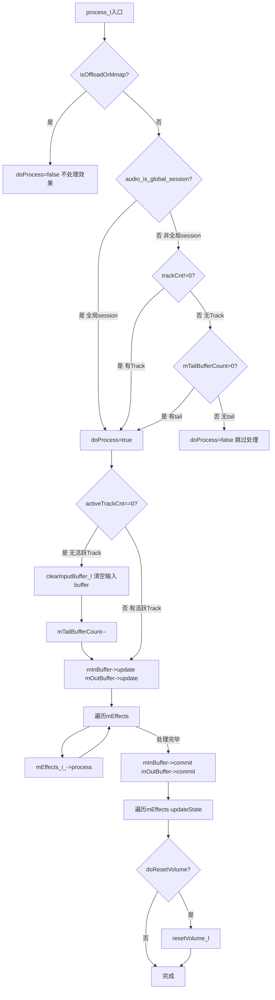

**详细步骤分析：**

1. **Offload/Mmap 检查**（行2278）：
   - `isOffloadOrMmap()` 返回 true 时直接跳过，Offload 线程不支持软件效果处理

2. **非全局 session 的 Track 检查**（行2279-2296）：
   - `audio_is_global_session(mSessionId)` — session=0 是全局 session，跳过 Track 检查
   - 非全局 session：无 Track 且无 Tail → `doProcess = false`
   - 无活跃 Track 但有 Track 或 Tail → 清空输入 buffer，Tail 递减

3. **Buffer 更新与效果处理**（行2298-2313）：
   - `mInBuffer->update()` — 将外部 buffer 数据同步到处理 buffer
   - 遍历 `mEffects`，依次调用 `mEffects[i]->process()`
   - `mInBuffer->commit()` — 将处理结果写回外部 buffer
   - **优化**: 如果 `mInBuffer == mOutBuffer`（in-place 模式），只 update/commit 一次

4. **状态更新与音量重置**（行2315-2321）：
   - 遍历所有效果调用 `updateState()`，检查状态变化
   - 任一效果状态变化则调用 `resetVolume_l()` 重新分配音量控制权

**Tail 残响机制要点：**
- `mTailBufferCount` 在 `incActiveTrackCnt()` 时重置为 `mMaxTailBuffers`
- 每次 `process_l()` 且无活跃 Track 时递减 `mTailBufferCount`
- `clearInputBuffer_l()` 将输入 buffer 清零，确保残响基于静音输入自然衰减

### 2. `createEffect_l()` — 创建效果实例（[Effects.cpp:2324](frameworks/av/services/audioflinger/Effects.cpp:2324)）

```cpp
status_t createEffect_l(sp<EffectModule>& effect,
                        effect_descriptor_t *desc,
                        int id,
                        audio_session_t sessionId,
                        bool pinned);
```

**锁要求**: 需持有 `ThreadBase::mLock`，内部自动获取 `EffectChain::mLock`

**核心逻辑（行2325-2341）：**

1. 构造 `EffectModule` 对象：`new EffectModule(mEffectCallback, desc, id, sessionId, pinned, AUDIO_PORT_HANDLE_NONE)`
2. 检查构造状态：`effect->status()` 返回 `NO_ERROR` 则继续
3. 调用 `addEffect_ll()` 将效果添加到链中
4. 失败时清除 effect 引用：`effect.clear()`

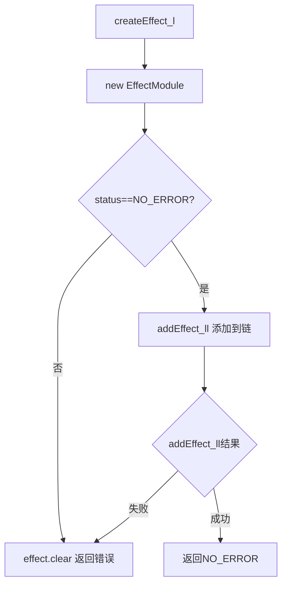

### 3. `addEffect_ll()` — 添加效果到链（[Effects.cpp:2350](frameworks/av/services/audioflinger/Effects.cpp:2350)）

```cpp
status_t addEffect_ll(const sp<EffectModule>& handle);
```

**锁要求**: 需同时持有 `ThreadBase::mLock` 和 `EffectChain::mLock`

这是 Buffer 分配的核心方法，根据效果类型有三种不同的 buffer 策略：

#### 3.1 Auxiliary 效果（行2355-2380）

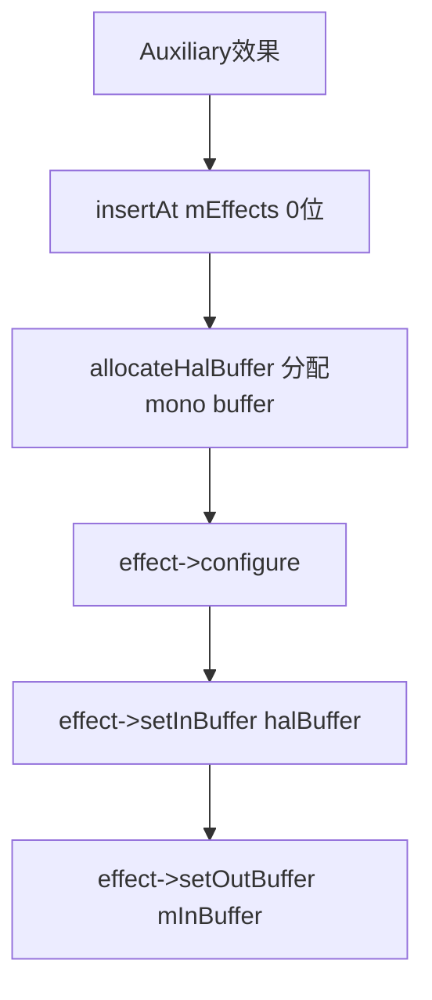

- **插入位置**: `mEffects.insertAt(effect, 0)` — 始终在链头部（索引0）
- **输入 buffer**: 独立分配的 mono buffer（32bit 格式），避免 AudioMixer 累加阶段饱和
  - `FLOAT_EFFECT_CHAIN` 宏决定是 `float` 还是 `int32_t` 格式
  - 大小 = `frameCount * sizeof(float/int32_t)`
- **输出 buffer**: `mInBuffer`（链输入 buffer），效果输出叠加到主信号供后续 Insert 效果处理
- 调用 `effect->configure()` 配置效果参数

#### 3.2 Insert/Spatializer 效果（行2381-2428）

**通用 Insert 路径（非 Spatializer 或非 OUTPUT_STAGE session）：**

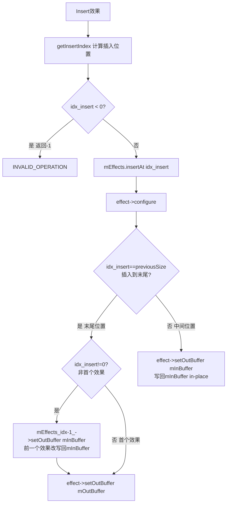

**关键 Buffer 分配规则：**
- 默认所有效果从 `mInBuffer` 读取
- **最后一个效果** 写到 `mOutBuffer`，其他效果写回 `mInBuffer`（in-place 处理）
- 新效果插入末尾时，原末尾效果的输出需从 `mOutBuffer` 改为 `mInBuffer`
- 每次变更后调用 `updateAccessMode()` 重新配置

**Spatializer OUTPUT_STAGE 路径（行2400-2412）：**

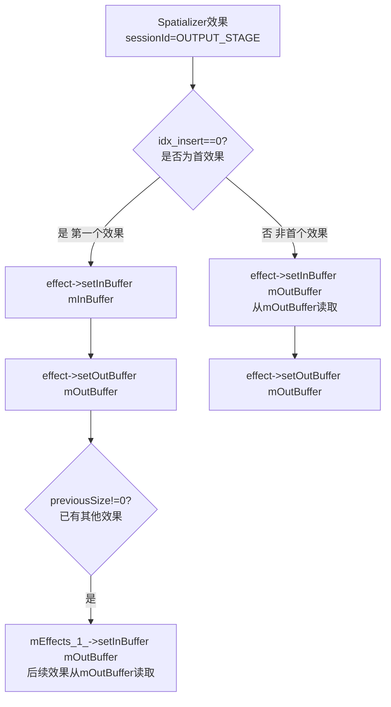

**Spatializer 特殊之处：**
- 首个效果（Spatializer）从 `mInBuffer` 读，写到 `mOutBuffer`
- 后续所有效果都在 `mOutBuffer` 上读写（非 in-place）
- 这是因为 Spatializer 改变了通道数（如 5.1→2.0），后续效果必须基于变换后的数据

### 4. `getInsertIndex()` — 计算插入位置（[Effects.cpp:2434](frameworks/av/services/audioflinger/Effects.cpp:2434)）

```cpp
ssize_t getInsertIndex(const effect_descriptor_t& desc);
```

**核心逻辑：**

1. **特殊效果优先插入索引0**（行2449-2452）：
   - `FX_IID_SPATIALIZER` — Spatializer 需要先处理通道变换
   - `EFFECT_UIID_DOWNMIX` — Downmixer 同理需要先做降混

2. **INSERT_MASK 插入偏好规则**（行2455-2503）：

| 插入偏好 | 行为 |
|---------|------|
| `EFFECT_FLAG_INSERT_EXCLUSIVE` | 必须在第一个位置，且不能与其他 EXCLUSIVE 效果共存 → 返回 -1 拒绝 |
| `EFFECT_FLAG_INSERT_FIRST` | 插入到最后一个 FIRST 效果之后 |
| `EFFECT_FLAG_INSERT_LAST` | 插入到第一个 LAST 效果之前，或链末尾 |
| `EFFECT_FLAG_INSERT_ANY`（默认） | 插入到第一个 Insert 效果之后 |

3. **冲突检测**（行2467-2472）：
   - 新效果为 EXCLUSIVE 或链中已有 EXCLUSIVE → 拒绝插入（返回 -1）

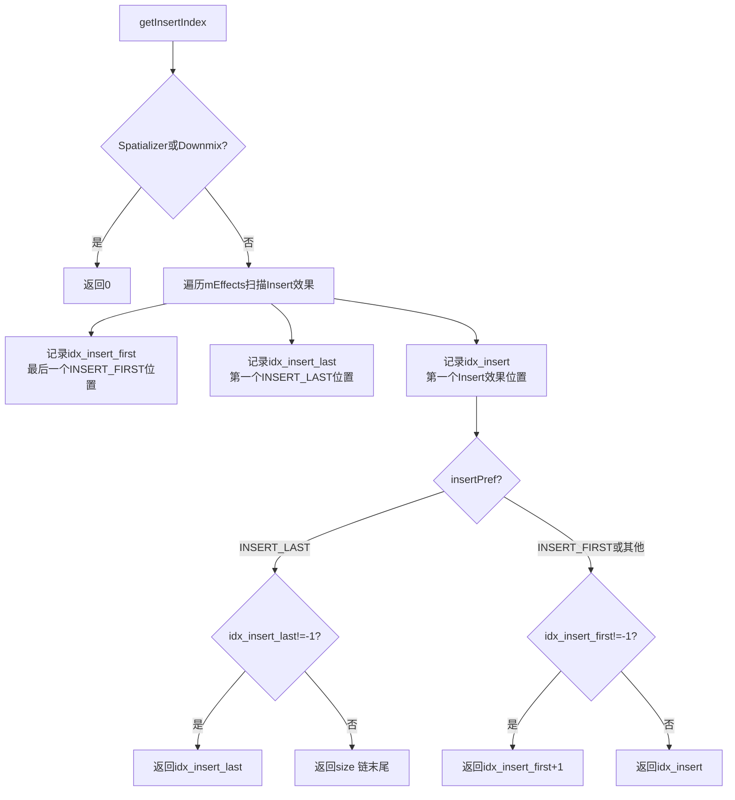

### 5. `removeEffect_l()` — 移除效果（[Effects.cpp:2507](frameworks/av/services/audioflinger/Effects.cpp:2507)）

```cpp
size_t removeEffect_l(const sp<EffectModule>& handle, bool release = false);
```

**锁要求**: 需持有 `ThreadBase::mLock`，内部自动获取 `EffectChain::mLock`

**核心逻辑（行2508-2552）：**

1. **遍历查找效果**：在 `mEffects` 中定位目标效果索引 `i`
2. **停止活跃效果**：如果效果状态为 `ACTIVE` 或 `STOPPING`，调用 `stop()`
3. **释放资源**：如果 `release=true`，调用 `release_l()`
4. **Buffer 重配**：
   - **非 Auxiliary 且为末尾效果**（行2529-2533）：前一个效果的输出从 `mOutBuffer` 改回 `mInBuffer`，并成为新的末尾效果
   - **被移除的是首效果**（行2539-2543）：更新新的首效果的输入 buffer 配置
5. **从列表移除**：`mEffects.removeAt(i)`
6. **返回剩余效果数**：`mEffects.size()`

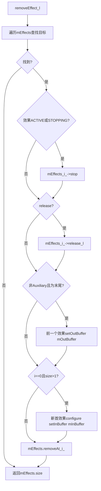

### 6. `setVolume_l()` — 音量设置（[Effects.cpp:2598](frameworks/av/services/audioflinger/Effects.cpp:2598)）

```cpp
bool setVolume_l(uint32_t *left, uint32_t *right, bool force = false);
```

**锁要求**: 需持有 `ThreadBase::mLock` 或 `EffectChain::mLock`

**返回值**: `true` 表示有效果拥有音量控制权

**核心逻辑（行2598-2662）：**

1. **确定音量控制者**（行2607-2613）：从后向前遍历，找到最后一个 `isVolumeControlEnabled()` 的效果
   - 存储其索引为 `mVolumeCtrlIdx`

2. **快速路径**（行2615-2622）：如果控制者索引和音量值都未变化且非 force，直接返回缓存的 `mNewLeftVolume`/`mNewRightVolume`

3. **音量控制者处理**（行2629-2632）：调用 `mEffects[ctrlIdx]->setVolume(&newLeft, &newRight, true)` 让效果修改音量

4. **广播音量到其他效果**（行2640-2655）：
   - **控制者之前的效果**：传递修改后的音量（`lVol`/`rVol`）
   - **控制者之后的效果**：传递原始请求音量（`*left`/`*right`）
   - **Volume Monitor 效果**：始终传递原始请求音量，仅用于监听

5. **更新输出音量**（行2659）：`setVolumeForOutput_l(*left, *right)` 将最终音量应用到输出

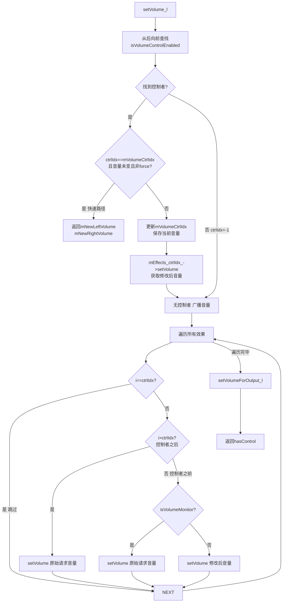

### 7. `resetVolume_l()` — 音量重置（[Effects.cpp:2665](frameworks/av/services/audioflinger/Effects.cpp:2665)）

```cpp
void resetVolume_l();
```

当效果状态变化时调用，使用当前保存的音量值重新走 `setVolume_l()` 流程，参数 `force=true` 强制更新：

```cpp
void EffectChain::resetVolume_l() {
    if ((mLeftVolume != UINT_MAX) && (mRightVolume != UINT_MAX)) {
        uint32_t left = mLeftVolume;
        uint32_t right = mRightVolume;
        (void)setVolume_l(&left, &right, true);
    }
}
```

### 8. `setDevices_l()` / `setInputDevice_l()` — 设备设置

**`setDevices_l()`**（[Effects.cpp:2555](frameworks/av/services/audioflinger/Effects.cpp:2555)）：
```cpp
void setDevices_l(const AudioDeviceTypeAddrVector &devices);
```
- 遍历所有效果调用 `mEffects[i]->setDevices(devices)`
- 用于通知效果当前输出设备变化

**`setInputDevice_l()`**（[Effects.cpp:2564](frameworks/av/services/audioflinger/Effects.cpp:2564)）：
```cpp
void setInputDevice_l(const AudioDeviceTypeAddr &device);
```
- 遍历所有效果调用 `mEffects[i]->setInputDevice(device)`
- 用于录音方向通知输入设备变化

### 9. `setMode_l()` / `setAudioSource_l()` — 模式与音频源

**`setMode_l()`**（[Effects.cpp:2573](frameworks/av/services/audioflinger/Effects.cpp:2573)）：
```cpp
void setMode_l(audio_mode_t mode);
```
- 遍历所有效果调用 `mEffects[i]->setMode(mode)`
- 通知音频模式变化（如 NORMAL → RINGTONE → IN_CALL）

**`setAudioSource_l()`**（[Effects.cpp:2582](frameworks/av/services/audioflinger/Effects.cpp:2582)）：
```cpp
void setAudioSource_l(audio_source_t source);
```
- 遍历所有效果调用 `mEffects[i]->setAudioSource(source)`
- 通知录音源变化（如 MIC → VOICE_COMMUNICATION）

### 10. `setEffectSuspended_l()` — 挂起指定类型效果（[Effects.cpp:2744](frameworks/av/services/audioflinger/Effects.cpp:2744)）

```cpp
void setEffectSuspended_l(const effect_uuid_t *type, bool suspend);
```

**引用计数挂起机制：**

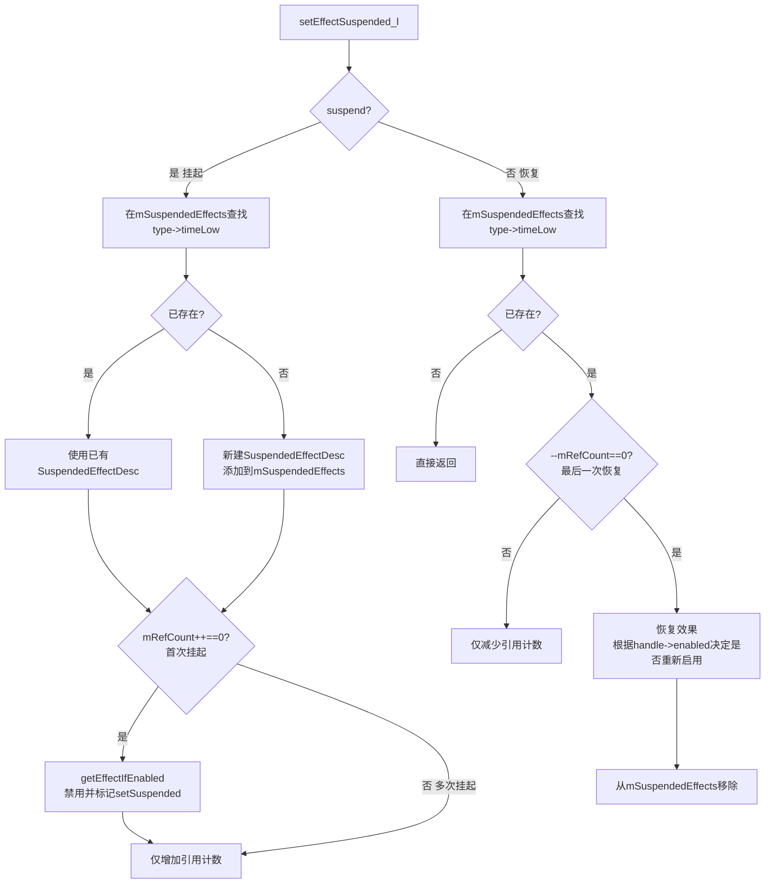

**关键点：**
- 使用 UUID `timeLow` 作为 key（碰撞风险极低）
- 引用计数支持多个挂起请求叠加，只有最后一个恢复请求才真正恢复效果
- 恢复时检查 `controlHandle_l()->enabled()` 决定是否重新启用

### 11. `setEffectSuspendedAll_l()` — 挂起所有可挂起效果（[Effects.cpp:2800](frameworks/av/services/audioflinger/Effects.cpp:2800)）

```cpp
void setEffectSuspendedAll_l(bool suspend);
```

- 使用 `kKeyForSuspendAll = 0` 作为特殊 key
- 挂起时：调用 `getSuspendEligibleEffects()` 获取所有可挂起效果，逐一调用 `setEffectSuspended_l()`
- 恢复时：遍历 `mSuspendedEffects` 中所有非 `kKeyForSuspendAll` 的条目，逐一恢复

**可挂起条件判断**（[Effects.cpp:2866](frameworks/av/services/audioflinger/Effects.cpp:2866)）：
- `isEffectEligibleForSuspend()` 检查：
  - 在 `AUDIO_SESSION_OUTPUT_MIX`（全局 session）上，以下效果**不可挂起**：
    - Auxiliary 效果（如 Reverb）
    - Visualizer（`SL_IID_VISUALIZATION`）
    - Volume（`SL_IID_VOLUME`）
    - DynamicsProcessing（`SL_IID_DYNAMICSPROCESSING`）
  - 其他效果均可挂起

### 12. `clearInputBuffer_l()` — 清空输入 buffer（[Effects.cpp:2260](frameworks/av/services/audioflinger/Effects.cpp:2260)）

```cpp
void clearInputBuffer_l();
```

**锁要求**: 需持有 `EffectChain::mLock`

```cpp
void EffectChain::clearInputBuffer_l() {
    if (mInBuffer == NULL) return;
    const size_t frameSize = audio_bytes_per_sample(EFFECT_BUFFER_FORMAT)
            * mEffectCallback->inChannelCount(mEffects[0]->id());
    memset(mInBuffer->audioBuffer()->raw, 0, mEffectCallback->frameCount() * frameSize);
    mInBuffer->commit();
}
```

- 计算帧大小 = 采样字节数 × 通道数
- `memset` 清零整个输入 buffer
- 调用 `commit()` 将清零结果写回外部 buffer
- **用途**: Tail 处理期间，当无活跃 Track 时，需要用静音数据填充输入让残响自然衰减

### 13. Track 计数方法（[Effects.h:507-514](frameworks/av/services/audioflinger/Effects.h:507)）

```cpp
void incTrackCnt() { android_atomic_inc(&mTrackCnt); }
void decTrackCnt() { android_atomic_dec(&mTrackCnt); }
int32_t trackCnt() const { return android_atomic_acquire_load(&mTrackCnt); }

void incActiveTrackCnt() {
    android_atomic_inc(&mActiveTrackCnt);
    mTailBufferCount = mMaxTailBuffers;  // 重置 Tail 计数
}
void decActiveTrackCnt() { android_atomic_dec(&mActiveTrackCnt); }
int32_t activeTrackCnt() const { return android_atomic_acquire_load(&mActiveTrackCnt); }
```

**关键行为：**
- `mTrackCnt` / `mActiveTrackCnt` 使用 `volatile int32_t` + `android_atomic_*` 原子操作
- `incActiveTrackCnt()` 同时重置 `mTailBufferCount = mMaxTailBuffers`，确保新 Track 激活时 Tail 机制就绪
- 这些计数器在无锁情况下被 Track 增减，因此必须使用原子操作

---

## 效果类型与 Buffer 策略总览

| 效果类型 | FLAG | 在链中位置 | 输入 buffer | 输出 buffer | 说明 |
|---------|------|-----------|-----------|-----------|------|
| Auxiliary | `EFFECT_FLAG_TYPE_AUXILIARY` | 索引0（链头部） | 独立 mono buffer | `mInBuffer` | 叠加到主信号，如 Reverb |
| Insert | `EFFECT_FLAG_TYPE_INSERT` | 按 `getInsertIndex()` 排序 | `mInBuffer`（默认） | 末尾写 `mOutBuffer`，其他写回 `mInBuffer` | 串行替换，如 EQ/BassBoost |
| Pre-processing | `EFFECT_FLAG_TYPE_PRE_PROC` | 录音链中 | — | — | AEC/NS/AGC |
| Replace | `EFFECT_FLAG_TYPE_REPLACE` | 按排序规则 | 视位置而定 | `mOutBuffer` | 完全替换信号，如 Spatializer |

---

## 效果链完整处理时序

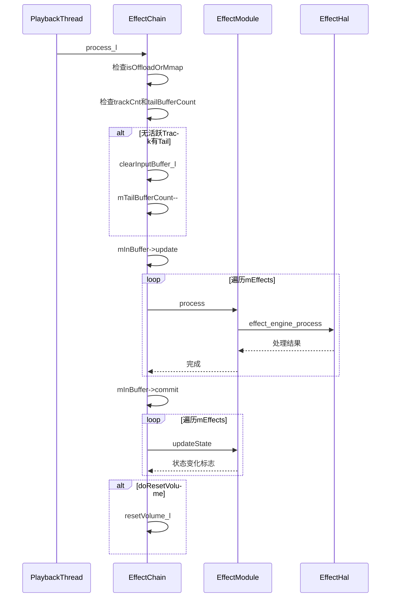

---

## 效果挂起/恢复机制详解

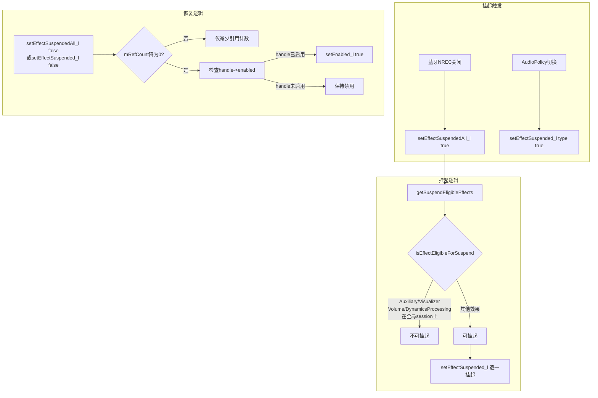

**蓝牙 NREC 挂起特殊规则**（[Effects.cpp:2856](frameworks/av/services/audioflinger/Effects.cpp:2856)）：
- `isEffectEligibleForBtNrecSuspend()` 仅挂起 AEC 和 NS 效果
- 当蓝牙耳机关闭 NREC 时，这些前处理效果必须暂停

---

## EffectChain 与 Thread 的交互

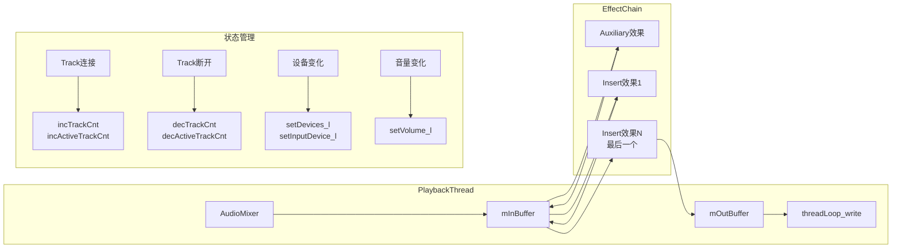

---

[← 上一个](07_7.1_AudioEffect架构总览.md) | [← 返回07章](README.md) | [返回导航](../README.md) | [下一个 →](07_7.3_EffectModule.md)