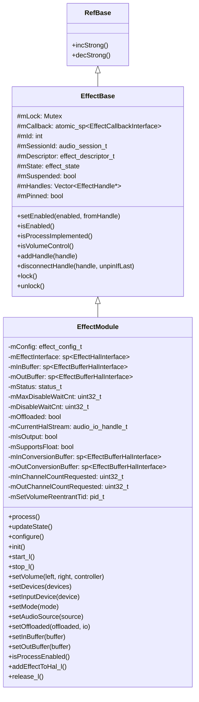
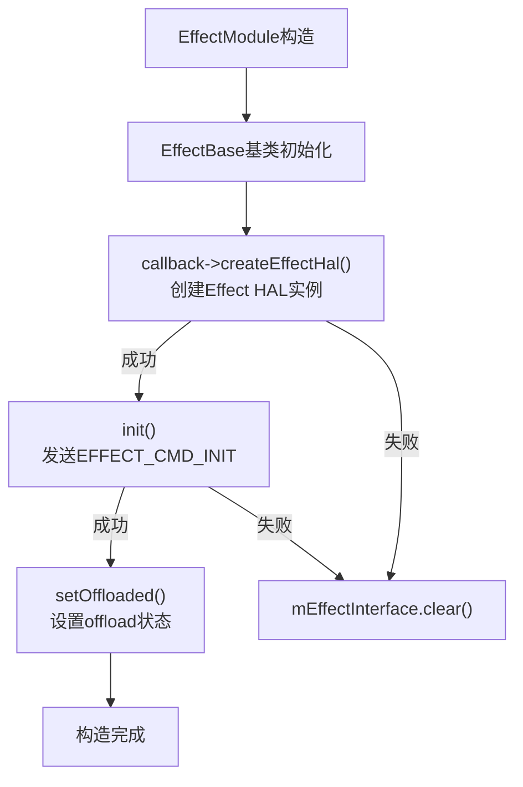
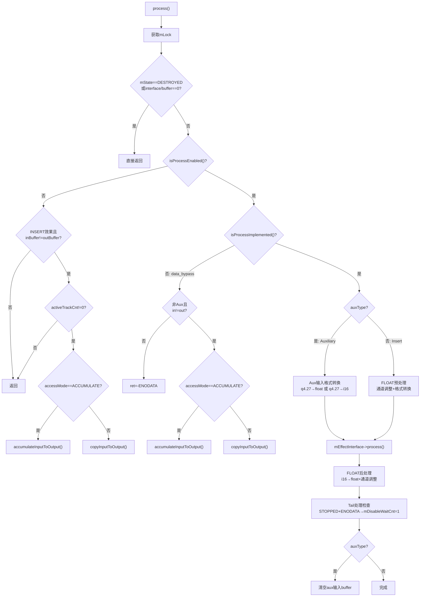
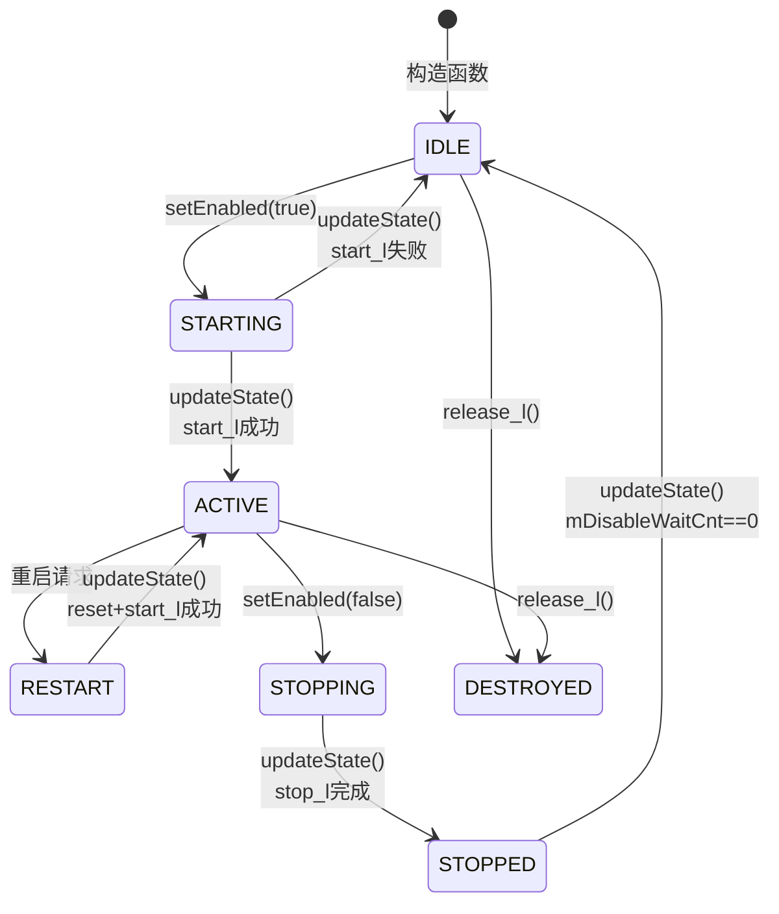
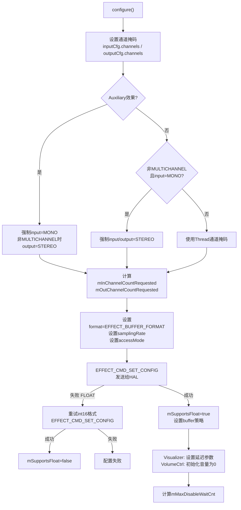
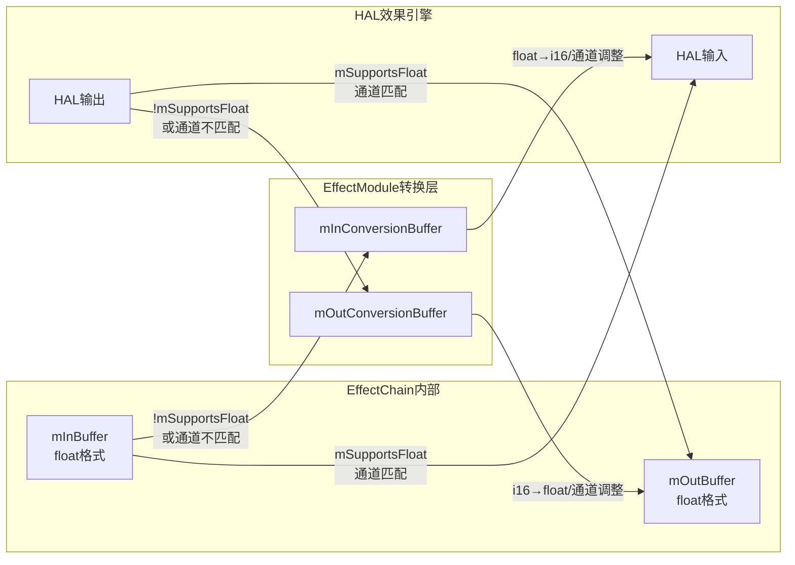
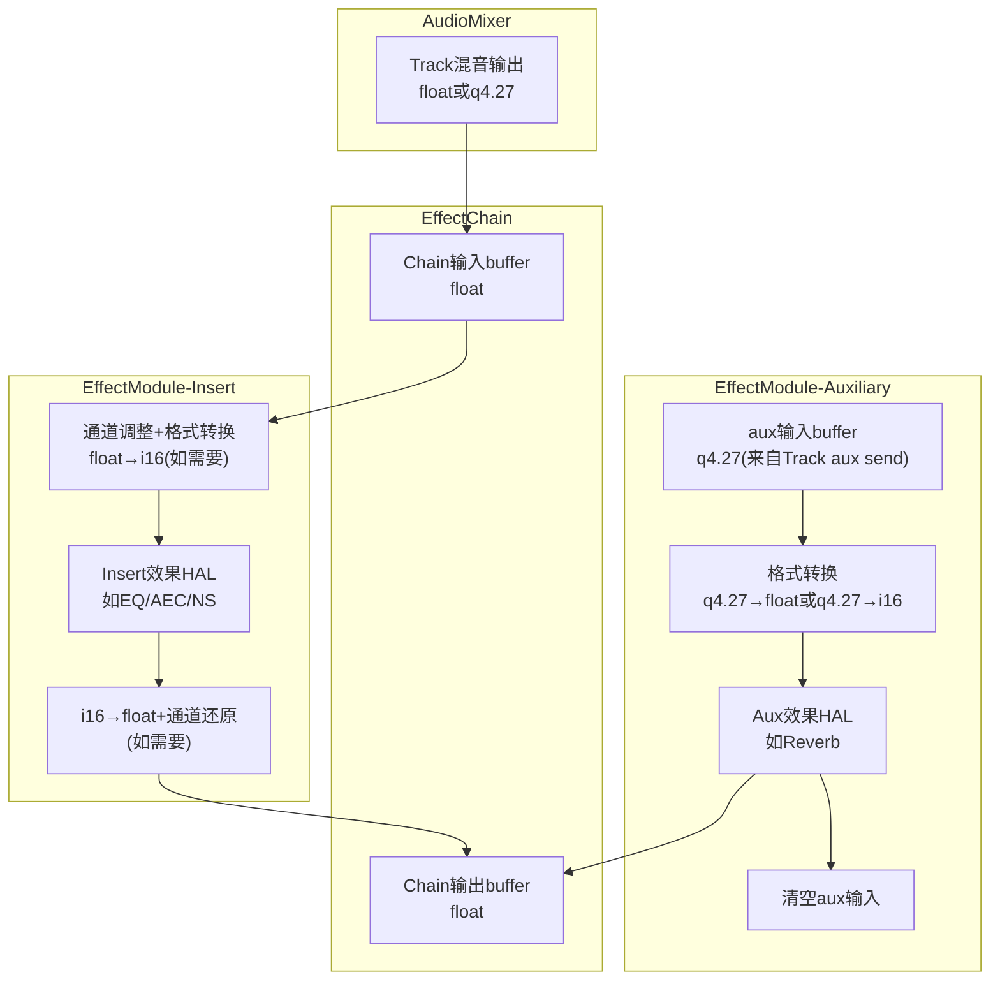

## 7.3 EffectModule — 单个音频效果实例

[← 7.2 EffectChain](07_7.2_EffectChain.md) | [← 返回07章](README.md) | [返回导航](../README.md) | [7.4 EffectModule内部架构 →](07_7.4_EffectModule内部架构详解.md)

---

## 模块定位与核心职责

`EffectModule` 是 AudioFlinger Effects Framework 中对单个音频效果实例的完整封装。它继承自 [`EffectBase`](frameworks/av/services/audioflinger/Effects.h:93)，作为效果引擎（Vendor HAL实现）与 AudioFlinger 线程之间的桥梁。

> 源码注释原文（[`Effects.h:211-219`](frameworks/av/services/audioflinger/Effects.h:211)）：
> "The EffectModule class is a wrapper object controlling the effect engine implementation in the effect library. It prevents concurrent calls to process() and command() functions from different client threads."

### 核心职责

| 职责 | 说明 |
|------|------|
| HAL封装 | 通过 `mEffectInterface` 持有并操作 Effect HAL 实例 |
| 状态机管理 | 管理 IDLE→STARTING→ACTIVE→STOPPING→STOPPED→IDLE 生命周期 |
| 音频处理 | `process()` 方法驱动效果引擎处理音频帧数据 |
| 格式转换 | FLOAT_EFFECT_CHAIN下处理 float/int16/q4.27 格式转换与通道调整 |
| 音量控制 | `setVolume()` 通知音量变化，Volume Ctrl效果可修改音量曲线 |
| 设备/模式通知 | 将设备、音频模式、录音源等信息传递给HAL |
| Handle管理 | 维护客户端Handle列表，通知状态变更 |

### 类继承体系



---

## 核心数据结构详解

### 成员变量一览（[`Effects.h:292-351`](frameworks/av/services/audioflinger/Effects.h:292)）

| 成员变量 | 类型 | 说明 |
|----------|------|------|
| `mConfig` | `effect_config_t` | 输入输出音频配置（通道掩码、采样率、buffer、format、accessMode） |
| `mEffectInterface` | `sp<EffectHalInterface>` | Effect HAL接口，与Vendor实现交互的核心句柄 |
| `mInBuffer` | `sp<EffectBufferHalInterface>` | 输入buffer，来自EffectChain分配 |
| `mOutBuffer` | `sp<EffectBufferHalInterface>` | 输出buffer，来自EffectChain分配 |
| `mStatus` | `status_t` | 初始化状态，构造时为`NO_INIT`，`configure()`成功后为`NO_ERROR` |
| `mMaxDisableWaitCnt` | `uint32_t` | 禁用最大等待帧数，由`configure()`计算（`MAX_DISABLE_TIME_MS * sampleRate / frameCount`） |
| `mDisableWaitCnt` | `uint32_t` | 当前禁用等待计数，每次`process()`递减，归零时状态转IDLE |
| `mOffloaded` | `bool` | 是否offload到DSP |
| `mCurrentHalStream` | `audio_io_handle_t` | HAL流句柄，用于PRE_PROC/POST_PROC效果 |
| `mIsOutput` | `bool` | AF线程方向（输出/输入） |

### FLOAT_EFFECT_CHAIN条件编译成员（[`Effects.h:326-332`](frameworks/av/services/audioflinger/Effects.h:326)）

| 成员变量 | 类型 | 说明 |
|----------|------|------|
| `mSupportsFloat` | `bool` | 效果引擎是否支持float格式，`configure()`中探测 |
| `mInConversionBuffer` | `sp<EffectBufferHalInterface>` | 输入转换buffer（float↔int16、通道调整） |
| `mOutConversionBuffer` | `sp<EffectBufferHalInterface>` | 输出转换buffer（float↔int16、通道调整） |
| `mInChannelCountRequested` | `uint32_t` | 请求的输入通道数，由`configure()`根据通道掩码计算 |
| `mOutChannelCountRequested` | `uint32_t` | 请求的输出通道数 |

### AutoLockReentrant可重入锁（[`Effects.h:334-351`](frameworks/av/services/audioflinger/Effects.h:334)）

```cpp
class AutoLockReentrant {
public:
    AutoLockReentrant(Mutex& mutex, pid_t allowedTid)
        : mMutex(gettid() == allowedTid ? nullptr : &mutex)
    {
        if (mMutex != nullptr) mMutex->lock();
    }
    ~AutoLockReentrant() {
        if (mMutex != nullptr) mMutex->unlock();
    }
private:
    Mutex * const mMutex;
};
```

**设计意图**：`setVolume()` 可能从两个路径被调用：
1. 正常路径：EffectChain→EffectModule::setVolume()，需要获取mLock
2. 重入路径：`stop_l()` 中先设置 `mSetVolumeReentrantTid`，再调用 `resetVolume()`→`setVolume_l()`→`setVolume()`，此时同一线程已持有mLock

当 `gettid() == mSetVolumeReentrantTid` 时，AutoLockReentrant跳过加锁，避免死锁。

---

## 构造函数解析（[`Effects.cpp:560-602`](frameworks/av/services/audioflinger/Effects.cpp:560)）

```cpp
EffectModule::EffectModule(const sp<EffectCallbackInterface>& callback,
                           effect_descriptor_t *desc,
                           int id,
                           audio_session_t sessionId,
                           bool pinned,
                           audio_port_handle_t deviceId)
    : EffectBase(callback, desc, id, sessionId, pinned),
      mConfig{{}, {}},
      mStatus(NO_INIT),
      mMaxDisableWaitCnt(1),
      mDisableWaitCnt(0),
      mOffloaded(false),
      mIsOutput(false)
#ifdef FLOAT_EFFECT_CHAIN
      , mSupportsFloat(false)
#endif
```

**构造流程**：



1. 调用 `callback->createEffectHal()` 通过 EffectFactory 创建 HAL 实例
2. 调用 `init()` 发送 `EFFECT_CMD_INIT` 初始化效果引擎
3. 调用 `setOffloaded()` 根据线程类型设置offload状态

---

## process() 方法深度解析（[`Effects.cpp:672-870`](frameworks/av/services/audioflinger/Effects.cpp:672)）

`process()` 是 EffectModule 最核心的方法，由 EffectChain 在每次音频处理循环中调用，驱动效果引擎处理一帧音频数据。

### 方法签名与前置检查

```cpp
void AudioFlinger::EffectModule::process()
{
    Mutex::Autolock _l(mLock);  // 获取mLock，防止与command()并发

    if (mState == DESTROYED || mEffectInterface == 0 || mInBuffer == 0 || mOutBuffer == 0) {
        return;  // 不可处理状态，直接返回
    }
```

### 关键变量计算

```cpp
    const uint32_t inChannelCount =
            audio_channel_count_from_out_mask(mConfig.inputCfg.channels);
    const uint32_t outChannelCount =
            audio_channel_count_from_out_mask(mConfig.outputCfg.channels);
    const bool auxType =
            (mDescriptor.flags & EFFECT_FLAG_TYPE_MASK) == EFFECT_FLAG_TYPE_AUXILIARY;
```

`safeInputOutputSampleCount` 是通道数匹配时的采样点数，**不匹配时为0**，阻止无中间效果的自动累加/拷贝：

```cpp
    const size_t safeInputOutputSampleCount =
            mInChannelCountRequested != mOutChannelCountRequested ? 0
                    : mOutChannelCountRequested * std::min(
                            mConfig.inputCfg.buffer.frameCount,
                            mConfig.outputCfg.buffer.frameCount);
```

### Lambda工具函数

`accumulateInputToOutput`：将输入buffer累加到输出buffer（用于ACCUMULATE模式）

`copyInputToOutput`：将输入buffer拷贝到输出buffer（用于WRITE模式）

两者均根据 FLOAT_EFFECT_CHAIN 宏选择 float 或 int16 版本。

### 完整处理流程



### Auxiliary效果的输入格式转换

Auxiliary效果（如Reverb）的输入是AudioMixer累加的**q4.27定点格式**，需要转换为效果引擎可处理的格式：

| 条件 | 转换路径 | 说明 |
|------|---------|------|
| `mSupportsFloat && !FLOAT_AUX` | q4.27→float | `memcpy_to_float_from_q4_27()` |
| `!mSupportsFloat && FLOAT_AUX` | float→i16 | `memcpy_to_i16_from_float()` |
| `!mSupportsFloat && !FLOAT_AUX` | q4.27→i16 | `memcpy_to_i16_from_q4_27()` |

> **注意**：aux输入始终是单声道（MONO），且处理完后必须清空buffer以备下次累加。

### FLOAT_EFFECT_CHAIN下的通道调整与格式转换

当效果引擎的通道数与EffectChain内部通道数不同时，`process()` 在调用HAL前后进行通道调整：

**处理前**（[`Effects.cpp:758-805`](frameworks/av/services/audioflinger/Effects.cpp:758)）：

1. **输入通道调整**：`mInChannelCountRequested != inChannelCount` 时
   - 调用 `adjust_channels()` 将输入buffer从请求通道数转为效果引擎通道数
   - 使用 `mInConversionBuffer` 作为中间buffer

2. **输出通道准备**：`EFFECT_BUFFER_ACCESS_ACCUMULATE` 且 `mOutChannelCountRequested != outChannelCount` 时
   - 调用 `adjust_selected_channels()` 将输出buffer从请求通道数转为效果引擎通道数
   - 使用 `mOutConversionBuffer` 作为中间buffer

3. **float→i16输入转换**：`!mSupportsFloat` 时
   - 非Aux：`memcpy_to_i16_from_float()` 转换输入
   - ACCUMULATE模式：`memcpy_to_i16_from_float()` 转换输出

**处理后**（[`Effects.cpp:807-824`](frameworks/av/services/audioflinger/Effects.cpp:807)）：

1. **i16→float输出转换**：`!mSupportsFloat` 时
   - `memcpy_to_float_from_i16()` 将HAL输出从i16转为float

2. **输出通道还原**：`mOutChannelCountRequested != outChannelCount` 时
   - `adjust_selected_channels()` 将效果引擎通道数还原为请求通道数

### Tail残响处理

当效果处于STOPPED状态且HAL返回 `-ENODATA` 时（表示效果引擎的tail处理已完成）：

```cpp
if (mState == STOPPED && ret == -ENODATA) {
    mDisableWaitCnt = 1;  // 强制下次updateState()立即转IDLE
}
```

### 非ProcessEnabled的Idle处理

当效果未启用（`!isProcessEnabled()`）时，对于INSERT类型且input/output buffer不同的效果：

```cpp
} else if ((mDescriptor.flags & EFFECT_FLAG_TYPE_MASK) == EFFECT_FLAG_TYPE_INSERT &&
            mConfig.inputCfg.buffer.raw != mConfig.outputCfg.buffer.raw) {
    if (getCallback()->activeTrackCnt() != 0) {
        if (mConfig.outputCfg.accessMode == EFFECT_BUFFER_ACCESS_ACCUMULATE) {
            accumulateInputToOutput();
        } else {
            copyInputToOutput();
        }
    }
}
```

**关键点**：即使效果未启用，如果链中有活跃Track，仍需将输入数据传递到输出buffer，保证音频数据不丢失。

---

## isProcessEnabled() 判定逻辑（[`Effects.cpp:1309-1327`](frameworks/av/services/audioflinger/Effects.cpp:1309)）

```cpp
bool AudioFlinger::EffectModule::isProcessEnabled() const
{
    if (mStatus != NO_ERROR) {
        return false;
    }
    switch (mState) {
    case RESTART:
    case ACTIVE:
    case STOPPING:
    case STOPPED:
        return true;
    case IDLE:
    case STARTING:
    case DESTROYED:
    default:
        return false;
    }
}
```

| 状态 | isProcessEnabled | 说明 |
|------|-----------------|------|
| IDLE | false | 未启动 |
| STARTING | false | 正在启动，等待updateState() |
| RESTART | true | 需重启处理 |
| ACTIVE | true | 正常处理 |
| STOPPING | true | 正在停止，仍需处理tail |
| STOPPED | true | 已停止但可能还有tail |
| DESTROYED | false | 已销毁 |

> **注意**：STARTING状态下 `isProcessEnabled()` 返回false，但该状态只在 `updateState()` 中短暂存在并立即转换为ACTIVE。

---

## updateState() 状态机转换（[`Effects.cpp:617-670`](frameworks/av/services/audioflinger/Effects.cpp:617)）

`updateState()` 由 EffectChain 的 `process_l()` 在每次处理循环中调用，驱动效果状态机前进。

```cpp
bool AudioFlinger::EffectModule::updateState() {
    Mutex::Autolock _l(mLock);
    bool started = false;
    switch (mState) {
    case RESTART:
        reset_l();
        FALLTHROUGH_INTENDED;
    case STARTING:
        // 清空aux输入buffer
        if ((mDescriptor.flags & EFFECT_FLAG_TYPE_MASK) == EFFECT_FLAG_TYPE_AUXILIARY) {
            memset(mConfig.inputCfg.buffer.raw, 0,
                   mConfig.inputCfg.buffer.frameCount * sizeof(int32_t));
        }
        if (start_l() == NO_ERROR) {
            mState = ACTIVE;
            started = true;
        } else {
            mState = IDLE;
        }
        break;
    case STOPPING:
        if (stop_l() == NO_ERROR
            && !(isVolumeControl() && isOffloadedOrDirect())) {
            mDisableWaitCnt = mMaxDisableWaitCnt;  // 开始tail等待
        } else {
            mDisableWaitCnt = 1;  // 立即转IDLE
        }
        mState = STOPPED;
        break;
    case STOPPED:
        if (--mDisableWaitCnt == 0) {
            reset_l();
            mState = IDLE;
        }
        break;
    case ACTIVE:
        // 通知Handle已处理帧数
        for (size_t i = 0; i < mHandles.size(); i++) {
            if (!mHandles[i]->disconnected()) {
                mHandles[i]->framesProcessed(mConfig.inputCfg.buffer.frameCount);
            }
        }
        break;
    default:  // IDLE, DESTROYED
        break;
    }
    return started;
}
```

### 完整状态机图



### 各状态转换详解

| 转换 | 触发 | 动作 |
|------|------|------|
| IDLE→STARTING | `setEnabled_l(true)` | 设置mState=STARTING |
| STARTING→ACTIVE | `updateState()` | 调用`start_l()`→`EFFECT_CMD_ENABLE`+`addEffectToHal_l()` |
| STARTING→IDLE | `updateState()` | `start_l()`失败，回退到IDLE |
| ACTIVE→STOPPING | `setEnabled_l(false)` | 设置mState=STOPPING |
| STOPPING→STOPPED | `updateState()` | 调用`stop_l()`→`EFFECT_CMD_DISABLE`+`removeEffectFromHal_l()` |
| STOPPED→IDLE | `updateState()` | `mDisableWaitCnt`递减至0，调用`reset_l()` |
| ACTIVE→RESTART | 外部触发 | 需要重启效果 |
| RESTART→ACTIVE | `updateState()` | `reset_l()`+FALLTHROUGH到STARTING逻辑 |

### Tail处理机制

停止效果后，效果引擎可能仍有残响（tail）数据需要输出。`mMaxDisableWaitCnt` 计算公式：

```
mMaxDisableWaitCnt = MAX_DISABLE_TIME_MS(10000) * sampleRate / (1000 * frameCount)
```

- 每次调用 `updateState()` 处于STOPPED状态时 `mDisableWaitCnt--`
- 计数归零或 `process()` 返回 `-ENODATA` 时（引擎表示tail完成），立即转IDLE
- 对于 offload/direct 线程的音量控制效果，`mDisableWaitCnt=1`（立即停止），因为音量控制必须即时生效

---

## configure() 配置过程（[`Effects.cpp:880-1085`](frameworks/av/services/audioflinger/Effects.cpp:880)）

`configure()` 在效果添加到链或配置变更时调用，设置输入输出音频参数。

### 配置流程



### 关键配置项

**通道掩码规则**（[`Effects.cpp:902-925`](frameworks/av/services/audioflinger/Effects.cpp:902)）：

| 效果类型 | 输入通道 | 输出通道 |
|---------|---------|---------|
| Auxiliary | 强制MONO | 非MULTICHANNEL时强制STEREO |
| Insert(MONO) | 非MULTICHANNEL时强制STEREO | 同输入 |
| Insert(其他) | 使用Thread通道掩码 | 使用Thread通道掩码 |
| HapticGenerator | 基础通道+haptic通道 | 基础通道+haptic通道 |

**采样率规则**（[`Effects.cpp:940-946`](frameworks/av/services/audioflinger/Effects.cpp:940)）：

- Offload/Direct线程且效果未offload：强制48kHz
- 其他情况：使用线程采样率

**accessMode规则**（[`Effects.cpp:953-963`](frameworks/av/services/audioflinger/Effects.cpp:953)）：

```cpp
mConfig.inputCfg.accessMode = EFFECT_BUFFER_ACCESS_READ;
mConfig.outputCfg.accessMode = requiredEffectBufferAccessMode();
```

`requiredEffectBufferAccessMode()` 的判定逻辑：

```cpp
effect_buffer_access_e requiredEffectBufferAccessMode() const {
    return mConfig.inputCfg.buffer.raw == mConfig.outputCfg.buffer.raw
            ? EFFECT_BUFFER_ACCESS_WRITE : EFFECT_BUFFER_ACCESS_ACCUMULATE;
}
```

| 条件 | accessMode | 说明 |
|------|-----------|------|
| input==output buffer | WRITE | 直接覆写输出 |
| input!=output buffer | ACCUMULATE | 累加到输出 |

**float格式探测**（[`Effects.cpp:1013-1038`](frameworks/av/services/audioflinger/Effects.cpp:1013)）：

1. 首先以 `EFFECT_BUFFER_FORMAT`（float）配置
2. 成功→`mSupportsFloat=true`
3. 失败且是HIDL效果→重试 `AUDIO_FORMAT_PCM_16_BIT`
4. 重试成功→`mSupportsFloat=false`

---

## start_l() / stop_l() 启停逻辑

### start_l()（[`Effects.cpp:1133-1155`](frameworks/av/services/audioflinger/Effects.cpp:1133)）

```cpp
status_t AudioFlinger::EffectModule::start_l()
{
    if (mEffectInterface == 0) {
        return NO_INIT;
    }
    if (mStatus != NO_ERROR) {
        return mStatus;
    }
    status_t cmdStatus;
    uint32_t size = sizeof(status_t);
    status_t status = mEffectInterface->command(EFFECT_CMD_ENABLE,
                                                0, NULL, &size, &cmdStatus);
    if (status == 0) {
        status = cmdStatus;
    }
    if (status == 0) {
        addEffectToHal_l();  // PRE_PROC/POST_PROC: 添加到HAL流
    }
    return status;
}
```

**调用链**：`updateState()` → `start_l()` → `EFFECT_CMD_ENABLE` → `addEffectToHal_l()`

### stop_l()（[`Effects.cpp:1163-1194`](frameworks/av/services/audioflinger/Effects.cpp:1163)）

```cpp
status_t AudioFlinger::EffectModule::stop_l()
{
    if (mEffectInterface == 0) {
        return NO_INIT;
    }
    if (mStatus != NO_ERROR) {
        return mStatus;
    }
    // 音量控制+offload/direct: 允许重入setVolume
    if (isVolumeControl() && isOffloadedOrDirect()) {
        mSetVolumeReentrantTid = gettid();   // 标记当前线程
        getCallback()->resetVolume();         // →setVolume_l()→setVolume() 重入!
        mSetVolumeReentrantTid = INVALID_PID; // 清除标记
    }
    status_t status = mEffectInterface->command(EFFECT_CMD_DISABLE, ...);
    if (status == NO_ERROR) {
        status = removeEffectFromHal_l();
    }
    return status;
}
```

**重入场景**：对于offload/direct线程的音量控制效果，停止时需要立即重置音量到HAL。`stop_l()` 先设置 `mSetVolumeReentrantTid`，然后调用 `resetVolume()`→`setVolume_l()`→`setVolume()`，此时 `setVolume()` 中的 `AutoLockReentrant` 检测到同一线程，跳过加锁。

---

## setVolume() 音量控制（[`Effects.cpp:1431-1464`](frameworks/av/services/audioflinger/Effects.cpp:1431)）

```cpp
status_t AudioFlinger::EffectModule::setVolume(
        uint32_t *left, uint32_t *right, bool controller)
{
    AutoLockReentrant _l(mLock, mSetVolumeReentrantTid);  // 可重入锁
    if (mStatus != NO_ERROR) {
        return mStatus;
    }
    status_t status = NO_ERROR;
    if (isProcessEnabled() &&
            ((mDescriptor.flags & EFFECT_FLAG_VOLUME_MASK) == EFFECT_FLAG_VOLUME_CTRL ||
             (mDescriptor.flags & EFFECT_FLAG_VOLUME_MASK) == EFFECT_FLAG_VOLUME_IND ||
             (mDescriptor.flags & EFFECT_FLAG_VOLUME_MASK) == EFFECT_FLAG_VOLUME_MONITOR)) {
        status = setVolumeInternal(left, right, controller);
    }
    return status;
}
```

### setVolumeInternal()（[`Effects.cpp:1449-1464`](frameworks/av/services/audioflinger/Effects.cpp:1449)）

```cpp
status_t AudioFlinger::EffectModule::setVolumeInternal(
        uint32_t *left, uint32_t *right, bool controller) {
    uint32_t volume[2] = {*left, *right};
    uint32_t *pVolume = controller ? volume : nullptr;  // controller才有回读
    uint32_t size = sizeof(volume);
    status_t status = mEffectInterface->command(EFFECT_CMD_SET_VOLUME,
                                                size, volume, &size, pVolume);
    if (controller && status == NO_ERROR && size == sizeof(volume)) {
        *left = volume[0];   // 读回修改后的音量
        *right = volume[1];
    }
    return status;
}
```

### 音量标志位与行为

| 标志位 | 行为 | pVolume | 说明 |
|--------|------|---------|------|
| `EFFECT_FLAG_VOLUME_CTRL` | 控制音量曲线 | 非null | HAL可修改音量值，回读到left/right |
| `EFFECT_FLAG_VOLUME_IND` | 仅通知 | null | HAL仅接收音量通知，不可修改 |
| `EFFECT_FLAG_VOLUME_MONITOR` | 监控 | null | 类似VOLUME_IND，用于监控目的 |

**controller=true** 时（即 `EFFECT_FLAG_VOLUME_CTRL`），效果引擎可以修改音量值。EffectChain 中第一个 VolumeCtrl 效果修改后的音量值会传递给后续效果和最终输出。

---

## setDevices() / setInputDevice() 设备通知

### setDevices()（[`Effects.cpp:1505-1508`](frameworks/av/services/audioflinger/Effects.cpp:1505)）

```cpp
status_t AudioFlinger::EffectModule::setDevices(
        const AudioDeviceTypeAddrVector &devices) {
    return sendSetAudioDevicesCommand(devices, EFFECT_CMD_SET_DEVICE);
}
```

### setInputDevice()（[`Effects.cpp:1510-1513`](frameworks/av/services/audioflinger/Effects.cpp:1510)）

```cpp
status_t AudioFlinger::EffectModule::setInputDevice(
        const AudioDeviceTypeAddr &device) {
    return sendSetAudioDevicesCommand({device}, EFFECT_CMD_SET_INPUT_DEVICE);
}
```

### sendSetAudioDevicesCommand()（[`Effects.cpp:1479-1503`](frameworks/av/services/audioflinger/Effects.cpp:1479)）

```cpp
status_t AudioFlinger::EffectModule::sendSetAudioDevicesCommand(
        const AudioDeviceTypeAddrVector &devices, uint32_t cmdCode) {
    audio_devices_t deviceType = deviceTypesToBitMask(getAudioDeviceTypes(devices));
    if (deviceType == AUDIO_DEVICE_NONE) {
        return NO_ERROR;
    }
    Mutex::Autolock _l(mLock);
    if (mStatus != NO_ERROR) {
        return mStatus;
    }
    if ((mDescriptor.flags & EFFECT_FLAG_DEVICE_MASK) == EFFECT_FLAG_DEVICE_IND) {
        // 仅当效果声明了EFFECT_FLAG_DEVICE_IND才发送设备信息
        status_t cmdStatus;
        uint32_t size = sizeof(status_t);
        status = mEffectInterface->command(cmdCode,
                                           sizeof(uint32_t), &deviceType,
                                           &size, &cmdStatus);
    }
    return status;
}
```

**关键点**：只有声明了 `EFFECT_FLAG_DEVICE_IND` 标志的效果才会接收设备变更通知。典型场景是DSP效果需要根据输出设备（扬声器/耳机）调整处理参数。

---

## setMode() / setAudioSource() 模式与录音源

### setMode()（[`Effects.cpp:1515-1535`](frameworks/av/services/audioflinger/Effects.cpp:1515)）

```cpp
status_t AudioFlinger::EffectModule::setMode(audio_mode_t mode) {
    Mutex::Autolock _l(mLock);
    if (mStatus != NO_ERROR) return mStatus;
    if ((mDescriptor.flags & EFFECT_FLAG_AUDIO_MODE_MASK) == EFFECT_FLAG_AUDIO_MODE_IND) {
        // 仅当声明了EFFECT_FLAG_AUDIO_MODE_IND
        mEffectInterface->command(EFFECT_CMD_SET_AUDIO_MODE,
                                  sizeof(audio_mode_t), &mode, ...);
    }
    return status;
}
```

### setAudioSource()（[`Effects.cpp:1537-1553`](frameworks/av/services/audioflinger/Effects.cpp:1537)）

```cpp
status_t AudioFlinger::EffectModule::setAudioSource(audio_source_t source) {
    Mutex::Autolock _l(mLock);
    if (mStatus != NO_ERROR) return mStatus;
    if ((mDescriptor.flags & EFFECT_FLAG_AUDIO_SOURCE_MASK) == EFFECT_FLAG_AUDIO_SOURCE_IND) {
        mEffectInterface->command(EFFECT_CMD_SET_AUDIO_SOURCE,
                                  sizeof(audio_source_t), &source, 0, NULL);
    }
    return status;
}
```

| 方法 | 标志位检查 | HAL命令 | 典型使用场景 |
|------|-----------|---------|-------------|
| `setMode()` | `EFFECT_FLAG_AUDIO_MODE_IND` | `EFFECT_CMD_SET_AUDIO_MODE` | 通话模式切换时AEC/NS调整 |
| `setAudioSource()` | `EFFECT_FLAG_AUDIO_SOURCE_IND` | `EFFECT_CMD_SET_AUDIO_SOURCE` | 录音源变更时预处理器调整 |

---

## setOffloaded() Offload管理（[`Effects.cpp:1555-1586`](frameworks/av/services/audioflinger/Effects.cpp:1555)）

```cpp
status_t AudioFlinger::EffectModule::setOffloaded(bool offloaded, audio_io_handle_t io) {
    Mutex::Autolock _l(mLock);
    if (mStatus != NO_ERROR) return mStatus;
    if ((mDescriptor.flags & EFFECT_FLAG_OFFLOAD_SUPPORTED) != 0) {
        effect_offload_param_t cmd;
        cmd.isOffload = offloaded;
        cmd.ioHandle = io;
        status = mEffectInterface->command(EFFECT_CMD_OFFLOAD,
                                           sizeof(effect_offload_param_t), &cmd, ...);
        mOffloaded = (status == NO_ERROR) ? offloaded : false;
    } else {
        if (offloaded) status = INVALID_OPERATION;
        mOffloaded = false;
    }
    return status;
}
```

**Offload效果规则**：
- 必须声明 `EFFECT_FLAG_OFFLOAD_SUPPORTED` 才能offload
- 效果在DSP上运行时 `mOffloaded=true`
- 不支持offload的效果在offload线程上运行时，效果在软件层执行

---

## setInBuffer() / setOutBuffer() Buffer管理

### setInBuffer()（[`Effects.cpp:1339-1385`](frameworks/av/services/audioflinger/Effects.cpp:1339)）

**核心逻辑**：

1. 设置 `mConfig.inputCfg.buffer.raw` 和 `mInBuffer`
2. 调用 `mEffectInterface->setInBuffer(buffer)` 传递给HAL
3. FLOAT_EFFECT_CHAIN下，如果需要格式转换或通道调整：
   - 非Aux效果且存在格式不匹配（`!mSupportsFloat` 或通道数不同）
   - 分配 `mInConversionBuffer`
   - 将 `mInConversionBuffer` 设为HAL的输入buffer（替代原始buffer）

### setOutBuffer()（[`Effects.cpp:1387-1429`](frameworks/av/services/audioflinger/Effects.cpp:1387)）

**核心逻辑**：

1. 设置 `mConfig.outputCfg.buffer.raw` 和 `mOutBuffer`
2. 调用 `mEffectInterface->setOutBuffer(buffer)` 传递给HAL
3. FLOAT_EFFECT_CHAIN下，如果存在格式不匹配：
   - 分配 `mOutConversionBuffer`
   - 将 `mOutConversionBuffer` 设为HAL的输出buffer

### Buffer流转图



---

## addEffectToHal_l() / removeEffectFromHal_l()

### addEffectToHal_l()（[`Effects.cpp:1106-1117`](frameworks/av/services/audioflinger/Effects.cpp:1106)）

仅对 PRE_PROC/POST_PROC 类型效果有效，将效果添加到HAL流：

```cpp
void AudioFlinger::EffectModule::addEffectToHal_l() {
    if ((mDescriptor.flags & EFFECT_FLAG_TYPE_MASK) == EFFECT_FLAG_TYPE_PRE_PROC ||
         (mDescriptor.flags & EFFECT_FLAG_TYPE_MASK) == EFFECT_FLAG_TYPE_POST_PROC) {
        if (mCurrentHalStream == getCallback()->io()) {
            return;  // 已添加，跳过
        }
        (void)getCallback()->addEffectToHal(mEffectInterface);
        mCurrentHalStream = getCallback()->io();
    }
}
```

### removeEffectFromHal_l()（[`Effects.cpp:1207-1218`](frameworks/av/services/audioflinger/Effects.cpp:1207)）

```cpp
status_t AudioFlinger::EffectModule::removeEffectFromHal_l() {
    if (PRE_PROC || POST_PROC) {
        if (mCurrentHalStream != getCallback()->io()) {
            return (mCurrentHalStream == AUDIO_IO_HANDLE_NONE) ? NO_ERROR : INVALID_OPERATION;
        }
        getCallback()->removeEffectFromHal(mEffectInterface);
        mCurrentHalStream = AUDIO_IO_HANDLE_NONE;
    }
    return NO_ERROR;
}
```

---

## release_l() 资源释放（[`Effects.cpp:1197-1205`](frameworks/av/services/audioflinger/Effects.cpp:1197)）

```cpp
void AudioFlinger::EffectModule::release_l() {
    if (mEffectInterface != 0) {
        removeEffectFromHal_l();
        mEffectInterface->close();      // 关闭HAL接口
        mEffectInterface.clear();       // 释放引用
    }
}
```

---

## reset_l() 重置效果（[`Effects.cpp:872-878`](frameworks/av/services/audioflinger/Effects.cpp:872)）

```cpp
void AudioFlinger::EffectModule::reset_l() {
    if (mStatus != NO_ERROR || mEffectInterface == 0) {
        return;
    }
    mEffectInterface->command(EFFECT_CMD_RESET, 0, NULL, 0, NULL);
}
```

---

## FLOAT_EFFECT_CHAIN架构详解

### 格式转换矩阵

AOSP14默认启用 `FLOAT_EFFECT_CHAIN`，效果链内部使用 float 精度。但效果引擎可能只支持 int16，因此需要格式转换：

| 场景 | 输入→引擎 | 引擎→输出 | mSupportsFloat |
|------|----------|----------|----------------|
| 引擎支持float | 无转换 | 无转换 | true |
| 引擎仅支持int16 | float→i16 | i16→float | false |
| Aux效果(支持float) | q4.27→float | float(累加) | true |
| Aux效果(不支持float) | q4.27→i16 | i16(累加) | false |

### 通道调整

当效果引擎期望的通道数与EffectChain实际通道数不同时，使用 `adjust_channels()` 和 `adjust_selected_channels()` 进行通道映射：

- `adjust_channels()`：扩展或收缩通道（如2ch→5.1ch，填充0到新增通道）
- `adjust_selected_channels()`：从多通道中选取指定通道（如5.1ch→2ch）

### 数据流全景图



---

## 方法索引

| 方法 | 源码位置 | 核心功能 |
|------|---------|---------|
| `process()` | [`Effects.cpp:672`](frameworks/av/services/audioflinger/Effects.cpp:672) | 驱动效果引擎处理一帧音频，含格式转换与通道调整 |
| `updateState()` | [`Effects.cpp:617`](frameworks/av/services/audioflinger/Effects.cpp:617) | 状态机推进：STARTING→ACTIVE, STOPPING→STOPPED→IDLE |
| `configure()` | [`Effects.cpp:880`](frameworks/av/services/audioflinger/Effects.cpp:880) | 设置输入输出配置（通道/采样率/format/accessMode），探测float支持 |
| `init()` | [`Effects.cpp:1087`](frameworks/av/services/audioflinger/Effects.cpp:1087) | 发送EFFECT_CMD_INIT初始化效果引擎 |
| `start_l()` | [`Effects.cpp:1133`](frameworks/av/services/audioflinger/Effects.cpp:1133) | 发送EFFECT_CMD_ENABLE，添加PRE/POST_PROC到HAL流 |
| `stop_l()` | [`Effects.cpp:1163`](frameworks/av/services/audioflinger/Effects.cpp:1163) | 发送EFFECT_CMD_DISABLE，offload音量控制重入重置 |
| `reset_l()` | [`Effects.cpp:872`](frameworks/av/services/audioflinger/Effects.cpp:872) | 发送EFFECT_CMD_RESET重置效果状态 |
| `release_l()` | [`Effects.cpp:1197`](frameworks/av/services/audioflinger/Effects.cpp:1197) | 关闭HAL接口，释放引用 |
| `setVolume()` | [`Effects.cpp:1431`](frameworks/av/services/audioflinger/Effects.cpp:1431) | 音量通知/控制，AutoLockReentrant防死锁 |
| `setDevices()` | [`Effects.cpp:1505`](frameworks/av/services/audioflinger/Effects.cpp:1505) | 输出设备通知，仅EFFECT_FLAG_DEVICE_IND效果 |
| `setInputDevice()` | [`Effects.cpp:1510`](frameworks/av/services/audioflinger/Effects.cpp:1510) | 输入设备通知，用于录音预处理器 |
| `setMode()` | [`Effects.cpp:1515`](frameworks/av/services/audioflinger/Effects.cpp:1515) | 音频模式通知(NORMAL/RING/IN_CALL) |
| `setAudioSource()` | [`Effects.cpp:1537`](frameworks/av/services/audioflinger/Effects.cpp:1537) | 录音源通知(MIC/VOICE_COMM等) |
| `setOffloaded()` | [`Effects.cpp:1555`](frameworks/av/services/audioflinger/Effects.cpp:1555) | 设置/取消DSP offload |
| `setInBuffer()` | [`Effects.cpp:1339`](frameworks/av/services/audioflinger/Effects.cpp:1339) | 设置输入buffer，分配转换buffer |
| `setOutBuffer()` | [`Effects.cpp:1387`](frameworks/av/services/audioflinger/Effects.cpp:1387) | 设置输出buffer，分配转换buffer |
| `isProcessEnabled()` | [`Effects.cpp:1309`](frameworks/av/services/audioflinger/Effects.cpp:1309) | 判断效果是否应参与处理 |
| `addEffectToHal_l()` | [`Effects.cpp:1106`](frameworks/av/services/audioflinger/Effects.cpp:1106) | PRE/POST_PROC效果添加到HAL流 |
| `removeEffectFromHal_l()` | [`Effects.cpp:1207`](frameworks/av/services/audioflinger/Effects.cpp:1207) | 从HAL流移除效果 |

---

[← 7.2 EffectChain](07_7.2_EffectChain.md) | [← 返回07章](README.md) | [返回导航](../README.md) | [7.4 EffectModule内部架构 →](07_7.4_EffectModule内部架构详解.md)