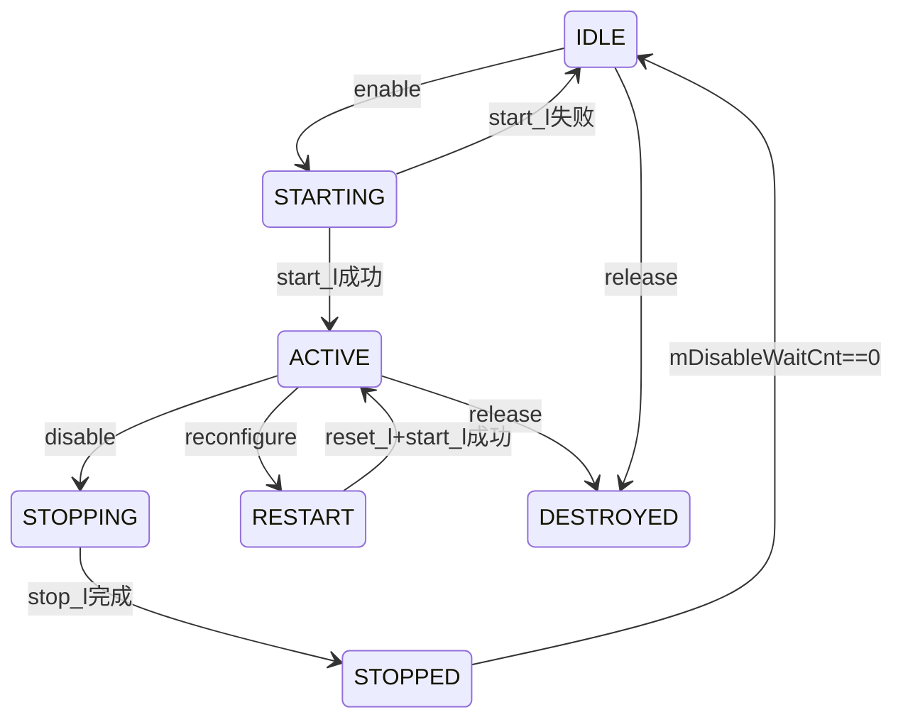
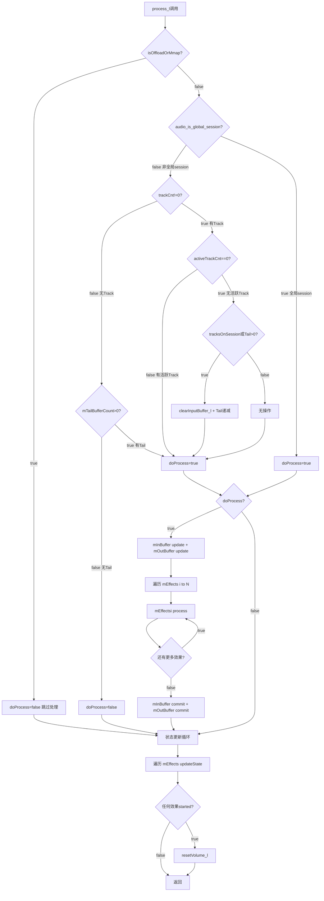
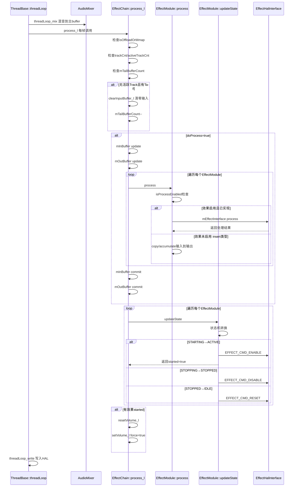

[← 7.4 EffectModule内部架构](07_7.4_EffectModule内部架构详解.md) | [← 返回07章](README.md) | [返回导航](../README.md) | [下一个 →](07_7.6_Spatializer空间音频架构详解.md)

---

## 7.5 EffectChain::process_l() 深度解析

### 1. 模块定位

[`EffectChain::process_l()`](frameworks/av/services/audioflinger/Effects.cpp:2273) 是AudioFlinger效果处理链的核心调度入口，在每个音频帧周期由`ThreadBase::threadLoop()`调用。它负责：

- **判断是否需要处理**：根据线程类型、Track活跃状态、Tail计数决定
- **Buffer同步**：通过`update()/commit()`机制与外部共享Buffer同步
- **效果遍历**：依次调用链内所有[`EffectModule::process()`](frameworks/av/services/audioflinger/Effects.cpp:672)
- **状态机驱动**：通过[`EffectModule::updateState()`](frameworks/av/services/audioflinger/Effects.cpp:617)推进效果状态转换
- **音量重置**：当效果状态变化触发音量控制器变更时，调用[`resetVolume_l()`](frameworks/av/services/audioflinger/Effects.cpp:2665)

### 2. process_l() 完整源码逐行解析

**源码位置**: [`Effects.cpp:2273-2322`](frameworks/av/services/audioflinger/Effects.cpp:2273)

```cpp
void AudioFlinger::EffectChain::process_l()                         // L2273
{
    // === 阶段1: 处理条件判断 ===
    bool doProcess = !mEffectCallback->isOffloadOrMmap();           // L2278
    if (!audio_is_global_session(mSessionId)) {                     // L2279
        bool tracksOnSession = (trackCnt() != 0);                   // L2280

        if (!tracksOnSession && mTailBufferCount == 0) {            // L2282
            doProcess = false;                                      // L2283
        }

        if (activeTrackCnt() == 0) {                                // L2286
            if (tracksOnSession || mTailBufferCount > 0) {          // L2289
                clearInputBuffer_l();                               // L2290
                if (mTailBufferCount > 0) {                         // L2291
                    mTailBufferCount--;                              // L2292
                }
            }
        }
    }                                                               // L2296

    // === 阶段2: 效果遍历处理 ===
    size_t size = mEffects.size();                                  // L2298
    if (doProcess) {                                                // L2299
        mInBuffer->update();                                        // L2303
        if (mInBuffer->audioBuffer()->raw != mOutBuffer->audioBuffer()->raw) { // L2304
            mOutBuffer->update();                                   // L2305
        }
        for (size_t i = 0; i < size; i++) {                         // L2307
            mEffects[i]->process();                                 // L2308
        }
        mInBuffer->commit();                                        // L2310
        if (mInBuffer->audioBuffer()->raw != mOutBuffer->audioBuffer()->raw) { // L2311
            mOutBuffer->commit();                                   // L2312
        }
    }                                                               // L2314

    // === 阶段3: 状态更新与音量重置 ===
    bool doResetVolume = false;                                     // L2315
    for (size_t i = 0; i < size; i++) {                             // L2316
        doResetVolume = mEffects[i]->updateState() || doResetVolume; // L2317
    }
    if (doResetVolume) {                                            // L2319
        resetVolume_l();                                            // L2320
    }
}                                                                   // L2322
```

### 3. 判断条件详解

#### 3.1 Offload/Mmap线程检查（L2278）

```cpp
bool doProcess = !mEffectCallback->isOffloadOrMmap();
```

[`isOffloadOrMmap()`](frameworks/av/services/audioflinger/Effects.cpp:3114) 判断当前线程类型：

```cpp
bool EffectCallback::isOffloadOrMmap() const {      // L3114
    switch (mThreadType) {
    case ThreadBase::OFFLOAD:                        // 硬件解码输出
    case ThreadBase::MMAP_PLAYBACK:                  // MMAP低延迟播放
    case ThreadBase::MMAP_CAPTURE:                   // MMAP低延迟捕获
        return true;
    default:
        return false;
    }
}
```

**设计原因**：Offload线程将压缩音频直接交给DSP解码播放，软件效果无法介入音频数据流；Mmap线程通过共享内存直接与HAL交互，同样不经过软件效果处理路径。因此这两种线程上的EffectChain永远跳过`process_l()`。

#### 3.2 全局Session vs 非全局Session（L2279）

```cpp
if (!audio_is_global_session(mSessionId)) {
```

[`audio_is_global_session()`](system/media/audio/include/system/audio.h:221) 定义：

```cpp
static inline bool audio_is_global_session(audio_session_t session) {
    return session <= AUDIO_SESSION_OUTPUT_MIX;   // session==0为全局session
}
```

- **全局Session**（`AUDIO_SESSION_OUTPUT_MIX=0`）：全局效果始终处理，不受Track状态约束。典型场景：系统级均衡器、全局LoudnessEnhancer
- **非全局Session**（session>0）：需要检查该session上是否有Track存在及是否活跃

**关键差异**：全局效果链绑定在`OUTPUT_MIX` session上，所有音频流都经过它，因此没有"Track不存在"的场景，无需做Track检查和Tail处理。

#### 3.3 Track活跃检查（L2280-2295）

```cpp
bool tracksOnSession = (trackCnt() != 0);         // L2280
if (!tracksOnSession && mTailBufferCount == 0) {  // L2282
    doProcess = false;                            // L2283
}
```

[`trackCnt()`](frameworks/av/services/audioflinger/Effects.h:509) 和 [`activeTrackCnt()`](frameworks/av/services/audioflinger/Effects.h:514) 均通过原子操作读取：

| 计数器 | 增减方法 | 含义 |
|--------|----------|------|
| `mTrackCnt` | [`incTrackCnt()`](frameworks/av/services/audioflinger/Effects.h:507) / [`decTrackCnt()`](frameworks/av/services/audioflinger/Effects.h:508) | 绑定到该session的Track总数（含暂停的） |
| `mActiveTrackCnt` | [`incActiveTrackCnt()`](frameworks/av/services/audioflinger/Effects.h:511) / [`decActiveTrackCnt()`](frameworks/av/services/audioflinger/Effects.h:513) | 正在播放/录制的Track数 |

**决策矩阵**：

| trackCnt | activeTrackCnt | Tail | doProcess | 行为 |
|----------|----------------|------|-----------|------|
| 0 | 0 | 0 | **false** | 无Track无Tail，完全跳过 |
| 0 | 0 | >0 | true | Tail渲染阶段 |
| >0 | 0 | 0 | true | 有Track但无活跃，清零输入buffer |
| >0 | 0 | >0 | true | Tail+静音输入 |
| >0 | >0 | any | true | 正常处理 |

#### 3.4 Tail处理机制（L2286-2295）

```cpp
if (activeTrackCnt() == 0) {                      // L2286
    if (tracksOnSession || mTailBufferCount > 0) { // L2289
        clearInputBuffer_l();                      // L2290
        if (mTailBufferCount > 0) {                // L2291
            mTailBufferCount--;                    // L2292
        }
    }
}
```

**Tail机制原理**：当Track停止播放后，某些效果（如混响Reverb）仍需要继续渲染残余尾音（tail）。系统保证至少`kProcessTailDurationMs`（1000ms）的渲染时间。

[`mMaxTailBuffers`](frameworks/av/services/audioflinger/Effects.h:693) 在构造时计算（[`Effects.cpp:2193`](frameworks/av/services/audioflinger/Effects.cpp:2193)）：

```cpp
mMaxTailBuffers = ((kProcessTailDurationMs * p->sampleRate()) / 1000) / p->frameCount();
```

例如：48kHz采样率、960帧/buffer → `mMaxTailBuffers = (1000 * 48000 / 1000) / 960 = 50`。

[`incActiveTrackCnt()`](frameworks/av/services/audioflinger/Effects.h:511) 在Track激活时重置Tail计数：

```cpp
void incActiveTrackCnt() {
    android_atomic_inc(&mActiveTrackCnt);
    mTailBufferCount = mMaxTailBuffers;  // 重置Tail为最大值
}
```

### 4. Buffer update/commit 机制详解

#### 4.1 update/commit设计原理（L2299-2313）

```cpp
if (doProcess) {
    mInBuffer->update();                                              // L2303
    if (mInBuffer->audioBuffer()->raw != mOutBuffer->audioBuffer()->raw) { // L2304
        mOutBuffer->update();                                         // L2305
    }
    for (size_t i = 0; i < size; i++) {
        mEffects[i]->process();                                       // L2308
    }
    mInBuffer->commit();                                              // L2310
    if (mInBuffer->audioBuffer()->raw != mOutBuffer->audioBuffer()->raw) { // L2311
        mOutBuffer->commit();                                         // L2312
    }
}
```

**核心思想**：Chain的输入/输出buffer可能是外部共享buffer（由Thread分配），需要缓存一致性管理。

| 操作 | 对外部buffer | 对HAL分配buffer |
|------|-------------|----------------|
| `update()` | 从外部buffer刷新到内部缓存 | 无操作 |
| `commit()` | 将内部缓存写回外部buffer | 无操作 |

**inBuffer == outBuffer优化**：当`mInBuffer`和`mOutBuffer`指向同一块内存时（大多数insert效果的in-place处理场景），只需对一块buffer做update/commit，避免冗余操作。

#### 4.2 Buffer数据流图


### 5. 效果遍历处理循环详解

#### 5.1 EffectModule::process() 完整流程

[`EffectModule::process()`](frameworks/av/services/audioflinger/Effects.cpp:672) 是单个效果实例的处理入口，被`process_l()`在L2308逐个调用。

**核心流程**：

```
L672: 获取mLock
L676: 检查前置条件(DESTROYED/null buffer直接返回)
L680-695: 计算channel count、safeInputOutputSampleCount
L696-722: 定义accumulate/copy lambda
L724: isProcessEnabled()判断
  ├── true + isProcessImplemented() → L726-838: 完整处理路径
  │   ├── L727: auxType → 格式转换(q4.27→float/i16)
  │   ├── L758-805: FLOAT_EFFECT_CHAIN下的channel调整和float/int16转换
  │   ├── L806: mEffectInterface->process() → HAL效果引擎处理
  │   ├── L807-824: 输出格式反向转换
  │   └── L846-855: auxType → 清零aux输入buffer
  ├── true + !isProcessImplemented() → L825-838: data_bypass
  │   └── 根据accessMode做accumulate或copy
  └── false + insert类型 + in≠out → L856-868: 空闲insert效果
      └── 将输入数据传递到输出(accumulate或copy)
```

#### 5.2 isProcessEnabled()状态判断

[`isProcessEnabled()`](frameworks/av/services/audioflinger/Effects.cpp:1309) 决定效果是否参与处理：

```cpp
bool EffectModule::isProcessEnabled() const {   // L1309
    if (mStatus != NO_ERROR) return false;
    switch (mState) {
    case RESTART:    // 需要重启
    case ACTIVE:     // 正常活跃
    case STOPPING:   // 正在停止(仍需处理tail)
    case STOPPED:    // 已停止(仍需处理tail)
        return true;
    case IDLE:       // 空闲
    case STARTING:   // 正在启动(尚未就绪)
    case DESTROYED:  // 已销毁
    default:
        return false;
    }
}
```

**关键点**：`STOPPING`和`STOPPED`状态仍返回true，确保效果引擎有机会渲染tail。`STARTING`返回false，因为效果引擎尚未完成初始化。

#### 5.3 Auxiliary效果的特殊处理

Auxiliary效果（如Reverb）的输入是独立的mono buffer，包含来自AudioMixer的辅助发送信号。处理流程（L727-757）：

1. **格式转换**：aux buffer以q4.27（28位定点）格式存储（避免AudioMixer累加饱和），需转换为效果引擎期望的格式
2. **处理执行**：调用`mEffectInterface->process()`
3. **清零输入**（L846-855）：处理后清零aux输入buffer，为下一帧的累加做准备

Insert效果（如Equalizer）直接在主信号路径上处理，in-place操作，无需上述特殊处理。

### 6. updateState() 与状态更新循环

#### 6.1 状态更新循环（L2315-2321）

```cpp
bool doResetVolume = false;
for (size_t i = 0; i < size; i++) {
    doResetVolume = mEffects[i]->updateState() || doResetVolume;  // L2317
}
if (doResetVolume) {
    resetVolume_l();                                              // L2320
}
```

**设计要点**：
- `updateState()`返回`bool`：仅当效果从`STARTING`成功转换到`ACTIVE`时返回true
- 使用`||`短路求值：一旦有任何一个效果启动成功，就标记需要音量重置
- 音量重置必须在所有效果状态更新完成后统一执行，避免中间状态不一致

#### 6.2 EffectModule::updateState() 完整状态机

[`updateState()`](frameworks/av/services/audioflinger/Effects.cpp:617) 驱动效果状态转换：

```cpp
bool EffectModule::updateState() {              // L617
    Mutex::Autolock _l(mLock);
    bool started = false;
    switch (mState) {
    case RESTART:                               // L622
        reset_l();                              // L623 发送EFFECT_CMD_RESET
        FALLTHROUGH_INTENDED;                   // L624 穿透到STARTING

    case STARTING:                              // L626
        // 清零aux输入buffer
        if (auxType) { memset(..., 0, ...); }   // L628-631
        if (start_l() == NO_ERROR) {            // L633 发送EFFECT_CMD_ENABLE
            mState = ACTIVE;                    // L634
            started = true;                     // L635 返回true触发音量重置
        } else {
            mState = IDLE;                      // L637 启动失败回到IDLE
        }
        break;

    case STOPPING:                              // L640
        if (stop_l() == NO_ERROR                // L642 发送EFFECT_CMD_DISABLE
            && !(isVolumeControl() && isOffloadedOrDirect())) { // L643
            mDisableWaitCnt = mMaxDisableWaitCnt; // L644 正常禁用等待
        } else {
            mDisableWaitCnt = 1;                // L646 立即转换到IDLE
        }
        mState = STOPPED;                       // L648
        break;

    case STOPPED:                               // L650
        if (--mDisableWaitCnt == 0) {           // L653 递减等待计数
            reset_l();                          // L654 发送EFFECT_CMD_RESET
            mState = IDLE;                      // L655
        }
        break;

    case ACTIVE:                                // L658
        for (size_t i = 0; i < mHandles.size(); i++) { // L659
            if (!mHandles[i]->disconnected()) { // L660
                mHandles[i]->framesProcessed(   // L661
                    mConfig.inputCfg.buffer.frameCount);
            }
        }
        break;

    default: // IDLE, DESTROYED                  // L665
        break;
    }
    return started;                             // L669
}
```

#### 6.3 状态转换图



**STOPPED→IDLE的延迟机制**：`mDisableWaitCnt`从`mMaxDisableWaitCnt`递减到0，确保效果引擎有足够时间渲染tail。在[`process()`](frameworks/av/services/audioflinger/Effects.cpp:841)中，当引擎返回`-ENODATA`时强制设为1加速转换：

```cpp
if (mState == STOPPED && ret == -ENODATA) {   // L841
    mDisableWaitCnt = 1;                       // L842
}
```

**ACTIVE状态的framesProcessed回调**：在L659-663，ACTIVE状态下通知所有已连接的EffectHandle已处理的帧数，用于客户端侧的同步和延迟计算。

### 7. 音量重置机制 resetVolume_l()

#### 7.1 resetVolume_l() 源码解析

[`resetVolume_l()`](frameworks/av/services/audioflinger/Effects.cpp:2665) 在效果状态变化时被调用，确保音量控制器正确更新：

```cpp
void AudioFlinger::EffectChain::resetVolume_l()   // L2665
{
    if ((mLeftVolume != UINT_MAX) && (mRightVolume != UINT_MAX)) { // L2667
        uint32_t left = mLeftVolume;                // L2668
        uint32_t right = mRightVolume;              // L2669
        (void)setVolume_l(&left, &right, true);     // L2670 force=true强制更新
    }
}
```

**触发条件**：当任何`EffectModule::updateState()`返回true（即效果从STARTING→ACTIVE成功启动）时触发。

**为什么需要音量重置**：当一个具有音量控制能力的效果（如VolumeControl、LoudnessEnhancer）启动时，它会改变信号链的音量路由。此时需要重新计算整个链的音量分配，确保：
- 新启动的音量控制器接管音量控制权
- 音量控制器之前的效果接收调整后的音量
- 音量控制器之后的效果接收原始音量

#### 7.2 setVolume_l() 音量控制逻辑

[`setVolume_l()`](frameworks/av/services/audioflinger/Effects.cpp:2598) 是音量分配的核心方法：

```cpp
bool EffectChain::setVolume_l(uint32_t *left, uint32_t *right, bool force) // L2598
{
    uint32_t newLeft = *left;
    uint32_t newRight = *right;
    bool hasControl = false;
    int ctrlIdx = -1;
    size_t size = mEffects.size();

    // 步骤1: 从后向前查找最后一个音量控制器
    for (size_t i = size; i > 0; i--) {            // L2607
        if (mEffects[i - 1]->isVolumeControlEnabled()) { // L2608
            ctrlIdx = i - 1;                       // L2609
            hasControl = true;                     // L2610
            break;
        }
    }

    // 步骤2: 快速路径 - 无变化时直接返回
    if (!force && ctrlIdx == mVolumeCtrlIdx &&
            *left == mLeftVolume && *right == mRightVolume) { // L2615
        if (hasControl) {
            *left = mNewLeftVolume;                // L2618
            *right = mNewRightVolume;              // L2619
        }
        return hasControl;
    }

    // 步骤3: 记录当前音量
    mVolumeCtrlIdx = ctrlIdx;                      // L2624
    mLeftVolume = newLeft;                         // L2625
    mRightVolume = newRight;                       // L2626

    // 步骤4: 从音量控制器获取修改后的音量
    if (ctrlIdx >= 0) {                            // L2629
        mEffects[ctrlIdx]->setVolume(&newLeft, &newRight, true); // L2630
        mNewLeftVolume = newLeft;                  // L2631
        mNewRightVolume = newRight;                // L2632
    }

    // 步骤5: 分发音量给所有其他效果
    uint32_t lVol = newLeft;                       // L2637
    uint32_t rVol = newRight;                      // L2638
    for (size_t i = 0; i < size; i++) {            // L2640
        if ((int)i == ctrlIdx) continue;           // L2641
        if ((int)i > ctrlIdx) {                    // L2645 控制器之后的效果
            lVol = *left;                          // L2646 使用原始音量
            rVol = *right;                         // L2647
        }
        if (mEffects[i]->isVolumeMonitor()) {      // L2650 音量监视器
            mEffects[i]->setVolume(left, right, false); // L2651 传递原始音量
        } else {
            mEffects[i]->setVolume(&lVol, &rVol, false); // L2653
        }
    }
    *left = newLeft;                               // L2656
    *right = newRight;                             // L2657
    setVolumeForOutput_l(*left, *right);           // L2659
    return hasControl;
}
```

**音量分发规则**：

| 效果位置 | 接收的音量 | 说明 |
|----------|-----------|------|
| 控制器之前(i < ctrlIdx) | 修改后的音量 | 经过音量控制器调整 |
| 音量控制器(i == ctrlIdx) | 跳过 | 已在步骤4处理 |
| 控制器之后(i > ctrlIdx) | 原始音量 | 未经音量控制器调整 |
| VolumeMonitor | 始终接收原始音量 | 仅监听，不参与控制 |

### 8. clearInputBuffer_l() 深度解析

[`clearInputBuffer_l()`](frameworks/av/services/audioflinger/Effects.cpp:2260) 在无活跃Track时清零链输入buffer：

```cpp
void AudioFlinger::EffectChain::clearInputBuffer_l()  // L2260
{
    if (mInBuffer == NULL) {                          // L2262
        return;
    }
    const size_t frameSize = audio_bytes_per_sample(EFFECT_BUFFER_FORMAT) // L2265
            * mEffectCallback->inChannelCount(mEffects[0]->id());         // L2266

    memset(mInBuffer->audioBuffer()->raw, 0,         // L2268
           mEffectCallback->frameCount() * frameSize);
    mInBuffer->commit();                              // L2269
}
```

**调用场景**（L2289-2294）：
1. `activeTrackCnt() == 0`（无活跃Track）**且** `tracksOnSession != 0` 或 `mTailBufferCount > 0`
2. 此时混音器不会向buffer写入数据，但效果链仍需处理（渲染Tail或保持信号连续性）
3. 因此手动清零输入buffer，确保效果不会处理到上一帧的残留数据

**关键细节**：
- `frameSize`计算考虑了采样格式(`EFFECT_BUFFER_FORMAT`)和通道数
- 使用`mEffects[0]->id()`获取第一个效果的ID来查询通道数，因为链内所有insert效果共享相同的输入通道配置
- `commit()`确保清零操作对外部buffer生效

### 9. 完整 process_l() 流程图



### 10. 与 ThreadBase::threadLoop() 的交互时序图



### 11. 性能关键路径分析

#### 11.1 热路径优化

`process_l()`位于音频实时处理路径上，每个帧周期（通常10-20ms）调用一次。关键性能考量：

| 优化点 | 实现方式 | 源码位置 |
|--------|----------|----------|
| Offload/Mmap早期退出 | L2278第一行就判断 | [`Effects.cpp:2278`](frameworks/av/services/audioflinger/Effects.cpp:2278) |
| 无Track快速退出 | L2282-2283 | [`Effects.cpp:2282`](frameworks/av/services/audioflinger/Effects.cpp:2282) |
| 原子计数器 | trackCnt/activeTrackCnt用原子操作 | [`Effects.h:509`](frameworks/av/services/audioflinger/Effects.h:509) |
| inBuffer==outBuffer优化 | 跳过冗余update/commit | [`Effects.cpp:2304`](frameworks/av/services/audioflinger/Effects.cpp:2304) |
| 音量快速路径 | 无变化时直接返回 | [`Effects.cpp:2615`](frameworks/av/services/audioflinger/Effects.cpp:2615) |

#### 11.2 锁竞争分析

| 锁 | 持有者 | 持有时间 | 竞争风险 |
|----|--------|----------|----------|
| `ThreadBase::mLock` | process_l调用者 | 整个process_l | 高 - 所有操作在mLock下 |
| `EffectModule::mLock` | process()/updateState() | 单个效果处理 | 中 - 每个效果独立 |
| `EffectChain::mLock` | resetVolume_l路径 | 音量更新 | 低 - 仅状态变化时 |

**process_l()不持有EffectChain::mLock**：注意`process_l()`本身由调用者（`threadLoop()`）持有`ThreadBase::mLock`，但不需要`EffectChain::mLock`。这避免了嵌套锁死锁风险。

#### 11.3 内存访问模式

- **顺序遍历**：`mEffects`向量顺序访问，CPU缓存友好
- **In-place处理**：多数insert效果inBuffer==outBuffer，减少内存拷贝
- **Aux效果独立buffer**：aux效果有独立mono buffer，避免与主信号路径的缓存争用
- **memset清零**：`clearInputBuffer_l()`使用memset，通常有SIMD优化

#### 11.4 延迟影响

`process_l()`的执行时间直接影响音频延迟：
- **单效果延迟**：`mEffectInterface->process()`的执行时间（通常<1ms）
- **链式累加**：N个效果串行处理，总延迟 = Σ(effect_i的处理时间)
- **Tail渲染开销**：即使无活跃Track，Tail期间仍需完整执行`process_l()`
- **状态更新开销**：`updateState()`在IDLE/ACTIVE状态下几乎零开销

---

[← 7.4 EffectModule内部架构](07_7.4_EffectModule内部架构详解.md) | [← 返回07章](README.md) | [返回导航](../README.md) | [下一个 →](07_7.6_Spatializer空间音频架构详解.md)