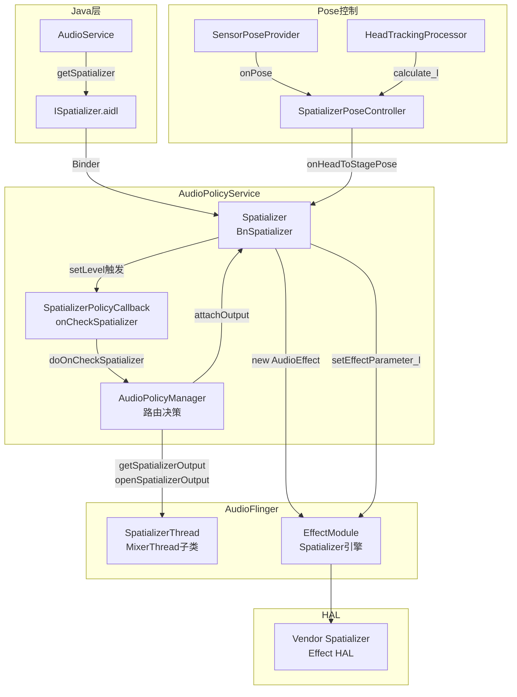
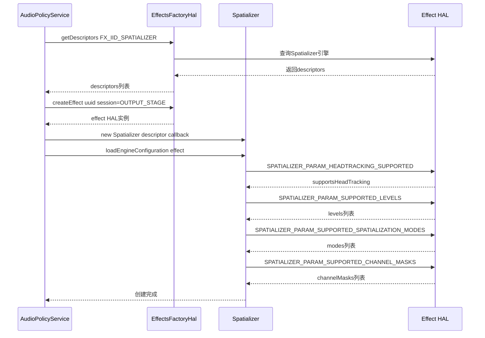
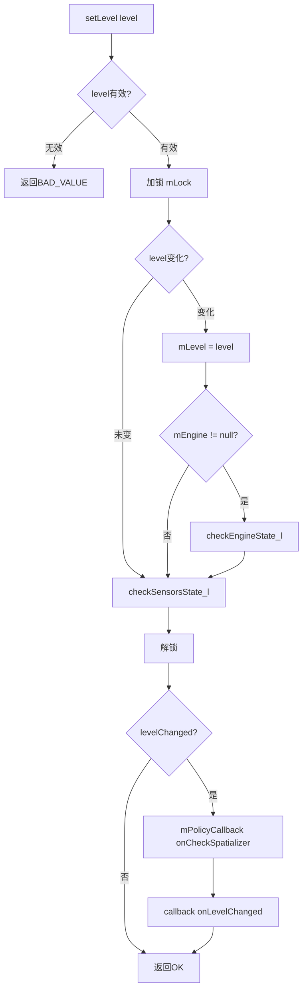
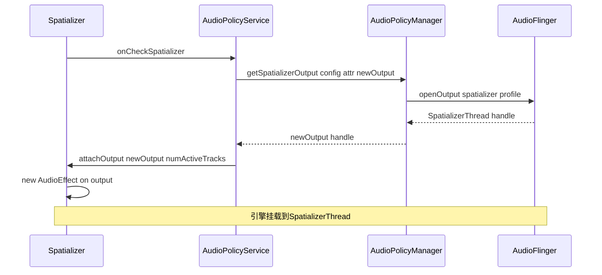
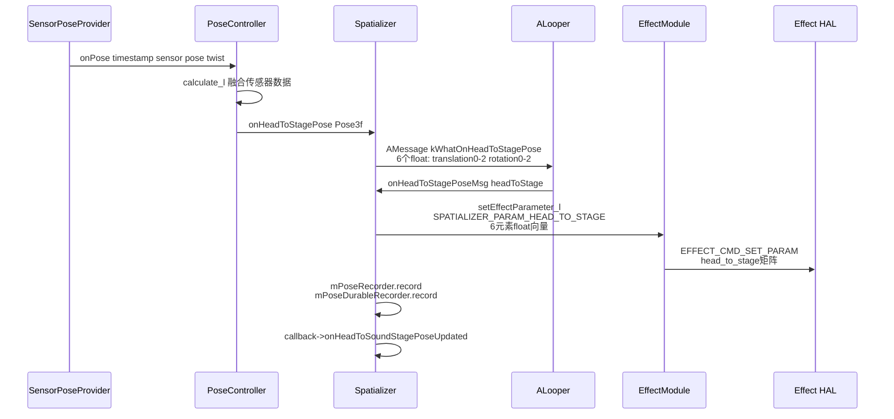
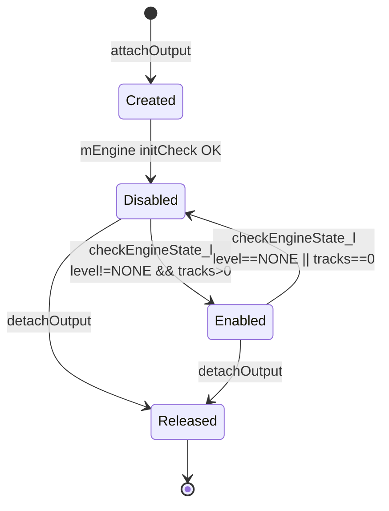
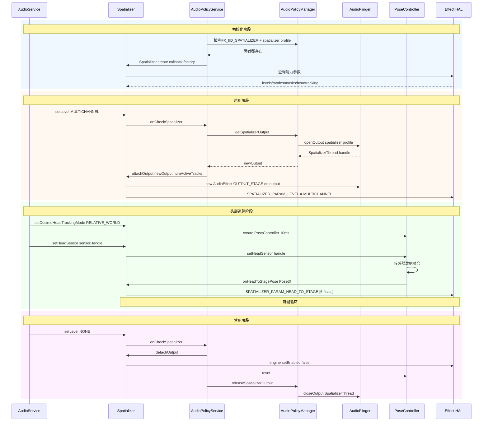

[← 7.5 EffectChain::process_l深度解析](07_7.5_EffectChainprocess_l深度解析.md) | [← 返回07章](README.md) | [返回导航](../README.md) | [7.7 AudioEffect Java API详解 →](07_7.7_AudioEffect_Java_API详解.md)

---

## 7.6 Spatializer空间音频架构详解

### 7.6.1 模块定位与架构概述

[`Spatializer`](frameworks/av/services/audiopolicy/service/Spatializer.h:68)是Android 12引入的多通道空间音频控制器，位于AudioPolicyService内部，负责：

1. **空间化引擎管理**：发现、创建、配置Vendor Spatializer Effect HAL引擎
2. **输出流绑定**：通过AudioPolicyManager打开专用SpatializerThread，将引擎挂载到特定输出
3. **头部追踪集成**：通过SensorPoseProvider获取传感器数据，经PoseController计算head→stage变换矩阵
4. **AIDL接口暴露**：实现`BnSpatializer`，向Java层AudioService提供ISpatializer Binder接口

**关键设计约束**：Spatializer是平台级单例——同一时刻只有一个Spatializer实例运行，绑定到一个专用输出线程。

### 7.6.2 Spatializer架构总览



**核心交互链路**：AudioService通过ISpatializer AIDL控制Spatializer → Spatializer状态变更触发`onCheckSpatializer()` → AudioPolicyService协调APM打开/关闭输出 → Spatializer在输出上创建AudioEffect引擎 → PoseController持续推送6元素矩阵给引擎。

### 7.6.3 核心类与数据结构

#### Spatializer类成员变量

| 成员变量 | 类型 | 说明 | 源码行 |
|----------|------|------|--------|
| [`mEngine`](frameworks/av/services/audiopolicy/service/Spatializer.h:336) | `sp<AudioEffect>` | 空间化引擎客户端实例，通过AudioEffect框架与EffectModule通信 | L336 |
| [`mOutput`](frameworks/av/services/audiopolicy/service/Spatializer.h:338) | `audio_io_handle_t` | 绑定的SpatializerThread输出句柄 | L338 |
| [`mLevel`](frameworks/av/services/audiopolicy/service/Spatializer.h:344) | `SpatializationLevel` | 当前空间化级别(NONE/MULTICHANNEL/MCHAN_BED_PLUS_OBJECTS) | L344 |
| [`mPoseController`](frameworks/av/services/audiopolicy/service/Spatializer.h:347) | `shared_ptr<SpatializerPoseController>` | 头部追踪控制器 | L347 |
| [`mDesiredHeadTrackingMode`](frameworks/av/services/audiopolicy/service/Spatializer.h:350) | `HeadTrackingMode` | 期望的头部追踪模式(STATIC/WORLD_RELATIVE/SCREEN_RELATIVE) | L350 |
| [`mActualHeadTrackingMode`](frameworks/av/services/audiopolicy/service/Spatializer.h:353) | `SpatializerHeadTrackingMode` | 实际生效的头部追踪模式(DISABLED/RELATIVE_WORLD/RELATIVE_SCREEN) | L353 |
| [`mHeadSensor`](frameworks/av/services/audiopolicy/service/Spatializer.h:356) | `int32_t` | 头部姿态传感器handle，INVALID_SENSOR表示未注册 | L356 |
| [`mScreenSensor`](frameworks/av/services/audiopolicy/service/Spatializer.h:359) | `int32_t` | 屏幕姿态传感器handle | L359 |
| [`mDisplayOrientation`](frameworks/av/services/audiopolicy/service/Spatializer.h:362) | `float` | 屏幕物理到逻辑方向角(弧度) | L362 |
| [`mFoldedState`](frameworks/av/services/audiopolicy/service/Spatializer.h:365) | `bool` | 可折叠设备折叠状态 | L365 |
| [`mHingeAngle`](frameworks/av/services/audiopolicy/service/Spatializer.h:368) | `float` | 铰链角度(0~2π弧度) | L368 |
| [`mLevels`](frameworks/av/services/audiopolicy/service/Spatializer.h:370) | `vector<SpatializationLevel>` | 引擎支持的空间化级别列表 | L370 |
| [`mHeadTrackingModes`](frameworks/av/services/audiopolicy/service/Spatializer.h:371) | `vector<SpatializerHeadTrackingMode>` | 支持的头部追踪模式列表 | L371 |
| [`mSpatializationModes`](frameworks/av/services/audiopolicy/service/Spatializer.h:372) | `vector<SpatializationMode>` | 支持的空间化模式列表 | L372 |
| [`mChannelMasks`](frameworks/av/services/audiopolicy/service/Spatializer.h:373) | `vector<audio_channel_mask_t>` | 支持的输入通道掩码列表 | L373 |
| [`mSupportsHeadTracking`](frameworks/av/services/audiopolicy/service/Spatializer.h:374) | `bool` | 引擎是否支持头部追踪 | L374 |
| [`mNumActiveTracks`](frameworks/av/services/audiopolicy/service/Spatializer.h:381) | `size_t` | 当前活跃音轨数 | L381 |
| [`mSpatializerCallback`](frameworks/av/services/audiopolicy/service/Spatializer.h:340) | `sp<INativeSpatializerCallback>` | Native层回调(APS注册) | L340 |
| [`mHeadTrackingCallback`](frameworks/av/services/audiopolicy/service/Spatializer.h:342) | `sp<ISpatializerHeadTrackingCallback>` | Java层头部追踪回调 | L342 |

#### SpatializerPoseController成员

| 成员变量 | 类型 | 说明 | 源码行 |
|----------|------|------|--------|
| [`mProcessor`](frameworks/av/services/audiopolicy/service/SpatializerPoseController.h:76) | `unique_ptr<HeadTrackingProcessor>` | 头部追踪处理器，融合传感器数据 | L76 |
| [`mPoseProvider`](frameworks/av/services/audiopolicy/service/SpatializerPoseController.h:93) | `unique_ptr<SensorPoseProvider>` | 传感器数据提供者 | L93 |
| [`mHeadSensor`](frameworks/av/services/audiopolicy/service/SpatializerPoseController.h:77) | `int32_t` | 头部传感器handle | L77 |
| [`mScreenSensor`](frameworks/av/services/audiopolicy/service/SpatializerPoseController.h:78) | `int32_t` | 屏幕传感器handle | L78 |
| [`mActualMode`](frameworks/av/services/audiopolicy/service/SpatializerPoseController.h:79) | `optional<HeadTrackingMode>` | 实际追踪模式 | L79 |
| [`mThread`](frameworks/av/services/audiopolicy/service/SpatializerPoseController.h:96) | `std::thread` | 专用计算线程 | L96 |
| [`mSensorPeriod`](frameworks/av/services/audiopolicy/service/SpatializerPoseController.h:73) | `chrono::microseconds` | 传感器采样周期 | L73 |

#### Pose3f结构（6DoF姿态）

[`Pose3f`](frameworks/av/media/libheadtracking/include/media/Pose.h:33)表示6自由度刚体变换，核心方法：

- **构造**：`Pose3f(Vector3f translation, Quaternionf rotation)` — 平移+旋转
- **序列化**：`toVector()` → 返回6元素float向量：前3个为平移(tx,ty,tz)，后3个为旋转向量(rx,ry,rz)
- **反序列化**：`fromVector(vector<float>)` → 从6元素向量构造Pose3f
- **逆变换**：`inverse()` — 反转参考/目标坐标系

#### HeadTrackingMode枚举

[`HeadTrackingMode`](frameworks/av/media/libheadtracking/include/media/HeadTrackingMode.h:26)定义三种追踪模式：

| 枚举值 | 含义 | 说明 |
|--------|------|------|
| `STATIC` | 无头部追踪 | 假设screen-to-head为单位变换 |
| `WORLD_RELATIVE` | 世界相对追踪 | 假设world-to-screen为单位变换 |
| `SCREEN_RELATIVE` | 屏幕相对追踪 | 完整的screen-to-head追踪 |

### 7.6.4 Spatializer创建与初始化流程

#### create()工厂方法

```cpp
// Spatializer.cpp:217
sp<Spatializer> Spatializer::create(
    SpatializerPolicyCallback* callback,
    const sp<EffectsFactoryHalInterface>& effectsFactoryHal)
```

**核心逻辑**：

1. **查询引擎描述符**：调用`effectsFactoryHal->getDescriptors(FX_IID_SPATIALIZER, &descriptors)`，通过UUID `FX_IID_SPATIALIZER`查找Vendor是否实现了Spatializer Effect HAL
2. **创建临时Effect实例**：调用`effectsFactoryHal->createEffect()`创建临时HAL Effect用于探测能力
3. **构造Spatializer对象**：`new Spatializer(descriptors[0], callback)`，传入引擎描述符和APS回调
4. **加载引擎配置**：`loadEngineConfiguration(effect)`从临时Effect查询能力参数，失败则销毁Spatializer



#### loadEngineConfiguration()详解

[`loadEngineConfiguration()`](frameworks/av/services/audiopolicy/service/Spatializer.cpp:296)通过`getHalParameter<>()`模板方法从HAL引擎查询4组参数：

| 查询参数 | HAL命令 | 验证规则 |
|----------|---------|----------|
| `SPATIALIZER_PARAM_HEADTRACKING_SUPPORTED` | `EFFECT_CMD_GET_PARAM` | 必须返回bool值 |
| `SPATIALIZER_PARAM_SUPPORTED_LEVELS` | `EFFECT_CMD_GET_PARAM` | 必须包含NONE + 至少一个非NONE级别 |
| `SPATIALIZER_PARAM_SUPPORTED_SPATIALIZATION_MODES` | `EFFECT_CMD_GET_PARAM` | 列表不可为空 |
| `SPATIALIZER_PARAM_SUPPORTED_CHANNEL_MASKS` | `EFFECT_CMD_GET_PARAM` | 列表不可为空，需通过`audio_is_channel_mask_spatialized()`校验 |

**头部追踪模式推导**（非查询所得）：
```cpp
// Spatializer.cpp:379-382
mHeadTrackingModes.push_back(SpatializerHeadTrackingMode::DISABLED);  // 始终包含
if (mSupportsHeadTracking) {
    mHeadTrackingModes.push_back(SpatializerHeadTrackingMode::RELATIVE_WORLD);
}
```
注意：当前版本仅暴露RELATIVE_WORLD模式，这是头部追踪库的UX设计限制。

#### onFirstRef()初始化

[`onFirstRef()`](frameworks/av/services/audiopolicy/service/Spatializer.cpp:264)创建`ALooper`线程用于引擎回调：

```cpp
void Spatializer::onFirstRef() {
    mLooper = new ALooper;
    mLooper->setName("Spatializer-looper");
    mLooper->start(false, false, PRIORITY_URGENT_AUDIO);
    mHandler = new EngineCallbackHandler(this);
    mLooper->registerHandler(mHandler);
}
```

`EngineCallbackHandler`处理4类消息：
- `kWhatOnFramesProcessed`：AudioEffect帧处理完成 → 触发`calculateHeadPose()`
- `kWhatOnHeadToStagePose`：PoseController姿态更新 → 触发`onHeadToStagePoseMsg()`
- `kWhatOnActualModeChange`：追踪模式变更 → 触发`onActualModeChangeMsg()`
- `kWhatOnLatencyModesChanged`：延迟模式变更 → 触发`onSupportedLatencyModesChangedMsg()`

### 7.6.5 空间化级别控制

#### setLevel()源码解析

```cpp
// Spatializer.cpp:464
Status Spatializer::setLevel(SpatializationLevel level)
```

**核心逻辑**：

1. **参数校验**：非NONE级别必须在`mLevels`列表中，否则返回BAD_VALUE
2. **更新级别**：`mLevel = level`（锁内）
3. **检查引擎状态**：若引擎已创建且级别变化，调用`checkEngineState_l()`
4. **检查传感器状态**：`checkSensorsState_l()`根据新级别决定是否启用传感器监听
5. **通知策略层**：`mPolicyCallback->onCheckSpatializer()`触发APS执行输出绑定/解绑
6. **通知客户端**：`callback->onLevelChanged(level)`



#### checkEngineState_l()引擎启停逻辑

[`checkEngineState_l()`](frameworks/av/services/audiopolicy/service/Spatializer.cpp:1007)决定引擎是否启用：

```cpp
void Spatializer::checkEngineState_l() {
    if (mEngine != nullptr) {
        if (mLevel != SpatializationLevel::NONE && mNumActiveTracks > 0) {
            mEngine->setEnabled(true);  // 有活跃音轨且级别非NONE
            setEffectParameter_l(SPATIALIZER_PARAM_LEVEL, {mLevel});
        } else {
            setEffectParameter_l(SPATIALIZER_PARAM_LEVEL, {SpatializationLevel::NONE});
            mEngine->setEnabled(false);  // 无活跃音轨或级别为NONE
        }
    }
}
```

**双条件启用**：`mLevel != NONE` **且** `mNumActiveTracks > 0`——即使设置了空间化级别，没有活跃音轨时引擎也会被禁用以节省功耗。

#### onCheckSpatializer回调链

[`onCheckSpatializer()`](frameworks/av/services/audiopolicy/service/AudioPolicyService.cpp:522)是Spatializer通知AudioPolicyService进行输出管理的关键回调：

```cpp
// AudioPolicyService.cpp:535-577
void AudioPolicyService::doOnCheckSpatializer() {
    if (mSpatializer->getLevel() != SpatializationLevel::NONE) {
        // 级别非NONE：需要打开/切换输出
        audio_io_handle_t newOutput;
        mAudioPolicyManager->getSpatializerOutput(&config, &attr, &newOutput);
        if (currentOutput != newOutput) {
            mSpatializer->detachOutput();          // 先解绑旧输出
            mSpatializer->attachOutput(newOutput, numActiveTracks);  // 绑定新输出
        }
    } else if (mSpatializer->getLevel() == SpatializationLevel::NONE
               && mSpatializer->getOutput() != AUDIO_IO_HANDLE_NONE) {
        // 级别为NONE且已绑定输出：需要关闭
        audio_io_handle_t output = mSpatializer->detachOutput();
        mAudioPolicyManager->releaseSpatializerOutput(output);
    }
}
```

### 7.6.6 输出绑定与SpatializerThread

#### attachOutput()源码解析

```cpp
// Spatializer.cpp:847
status_t Spatializer::attachOutput(audio_io_handle_t output, size_t numActiveTracks)
```

**核心逻辑**：

1. **清理旧引擎**：若`mOutput != AUDIO_IO_HANDLE_NONE`，先禁用并清除旧引擎，重置PoseController
2. **创建AudioEffect**：在指定output上以`AUDIO_SESSION_OUTPUT_STAGE`会话创建引擎实例
3. **更新输出句柄**：`mOutput = output`
4. **注册延迟模式回调**：`AudioSystem::addSupportedLatencyModesCallback(this)`
5. **恢复引擎状态**：调用`checkEngineState_l()`、`checkPoseController_l()`、`checkSensorsState_l()`
6. **恢复持久参数**：将已保存的displayOrientation/foldState/hingeAngle写入引擎
7. **通知客户端**：`callback->onOutputChanged(output)`

```cpp
// 关键：创建引擎实例 (Spatializer.cpp:866-871)
mEngine = new AudioEffect(attributionSource);
mEngine->set(nullptr /* type */, &mEngineDescriptor.uuid, 0 /* priority */,
             wp<AudioEffect::IAudioEffectCallback>::fromExisting(this),
             AUDIO_SESSION_OUTPUT_STAGE, output, {} /* device */,
             false /* probe */, true /* notifyFramesProcessed */);
```

**关键设计**：使用`AUDIO_SESSION_OUTPUT_STAGE`意味着引擎作用于整个输出阶段（output stage），而非单个音轨。

#### detachOutput()流程

[`detachOutput()`](frameworks/av/services/audiopolicy/service/Spatializer.cpp:912)执行反向操作：

1. 禁用引擎：`mEngine->setEnabled(false)`
2. 释放引擎：`mEngine.clear()`
3. 重置输出：`mOutput = AUDIO_IO_HANDLE_NONE`
4. 重置PoseController：`mPoseController.reset()`
5. 通知客户端输出已移除

#### SpatializerThread创建链路



### 7.6.7 头部追踪架构

头部追踪是Spatializer的核心增值功能，涉及从传感器硬件到引擎参数的完整数据通路。

#### 头部追踪模式映射

Spatializer维护两层模式概念：

| 外部模式(SpatializerHeadTrackingMode) | 内部模式(HeadTrackingMode) | 说明 |
|---------------------------------------|---------------------------|------|
| `DISABLED` | `STATIC` | 无追踪，固定虚拟扬声器布局 |
| `RELATIVE_WORLD` | `WORLD_RELATIVE` | 基于世界坐标系的头部追踪 |
| `RELATIVE_SCREEN` | `SCREEN_RELATIVE` | 基于屏幕坐标系的头部追踪 |

**模式转换**在[`setDesiredHeadTrackingMode()`](frameworks/av/services/audiopolicy/service/Spatializer.cpp:525)中完成：

```cpp
// Spatializer.cpp:533-544
switch (mode) {
    case SpatializerHeadTrackingMode::DISABLED:
        mDesiredHeadTrackingMode = HeadTrackingMode::STATIC; break;
    case SpatializerHeadTrackingMode::RELATIVE_WORLD:
        mDesiredHeadTrackingMode = HeadTrackingMode::WORLD_RELATIVE; break;
    case SpatializerHeadTrackingMode::RELATIVE_SCREEN:
        mDesiredHeadTrackingMode = HeadTrackingMode::SCREEN_RELATIVE; break;
}
checkPoseController_l();   // 创建/销毁PoseController
checkSensorsState_l();     // 启停传感器监听
```

#### checkPoseController_l()创建/销毁逻辑

[`checkPoseController_l()`](frameworks/av/services/audiopolicy/service/Spatializer.cpp:1021)根据追踪需求动态创建或销毁PoseController：

```cpp
void Spatializer::checkPoseController_l() {
    bool isControllerNeeded = mDesiredHeadTrackingMode != HeadTrackingMode::STATIC
            && mHeadSensor != SpatializerPoseController::INVALID_SENSOR;

    if (isControllerNeeded && mPoseController == nullptr) {
        // 创建：传感器周期10ms，无最大更新周期
        mPoseController = std::make_shared<SpatializerPoseController>(
                static_cast<SpatializerPoseController::Listener*>(this),
                10ms, std::nullopt);
        mPoseController->setDisplayOrientation(mDisplayOrientation);
    } else if (!isControllerNeeded && mPoseController != nullptr) {
        // 销毁：重置PoseController，复位引擎头部姿态
        mPoseController.reset();
        resetEngineHeadPose_l();
    }
    if (mPoseController != nullptr) {
        mPoseController->setDesiredMode(mDesiredHeadTrackingMode);
    }
}
```

**双条件创建**：需要`mDesiredHeadTrackingMode != STATIC`**且**`mHeadSensor != INVALID_SENSOR`——仅设置追踪模式但未注册头部传感器不会创建PoseController。

#### SensorPoseProvider传感器集成

[`SensorPoseProvider`](frameworks/av/media/libheadtracking/include/media/SensorPoseProvider.h)封装Android SensorManager，监听指定handle的传感器，通过`Listener::onPose()`回调提供姿态数据：

- 每个传感器返回`Pose3f`（6DoF）和可选的`Twist3f`（速度）
- `INVALID_HANDLE = -1`表示禁用该传感器
- PoseController内部以`mSensorPeriod`(10ms)的频率从传感器读取数据

#### PoseController计算线程

SpatializerPoseController在独立`std::thread`上运行计算循环：

1. 等待`calculateAsync()`调用或超时触发
2. 调用`calculate_l()`融合传感器数据
3. 通过`HeadTrackingProcessor`计算最终的head→stage变换
4. 通过`Listener::onHeadToStagePose()`和`Listener::onActualModeChange()`回调结果

#### onHeadToStagePose回调到引擎的完整路径

这是头部追踪数据从传感器到引擎的完整通路：



**6元素head→stage矩阵格式**：
```
[tx, ty, tz, rx, ry, rz]
 |_________|  |_________|
  平移向量     旋转向量
```

其中`SPATIALIZER_PARAM_HEAD_TO_STAGE`参数定义在[`effect_spatializer.h`](system/media/audio/include/system/audio_effects/effect_spatializer.h:47)。

#### checkSensorsState_l()传感器启停逻辑

[`checkSensorsState_l()`](frameworks/av/services/audiopolicy/service/Spatializer.cpp:970)决定是否激活传感器监听：

```cpp
void Spatializer::checkSensorsState_l() {
    if (mSupportsHeadTracking) {
        if (mPoseController != nullptr) {
            // 四个条件全满足才激活传感器
            if (mNumActiveTracks > 0 && mLevel != SpatializationLevel::NONE
                && mDesiredHeadTrackingMode != HeadTrackingMode::STATIC
                && mHeadSensor != INVALID_SENSOR) {
                // 激活：写入当前追踪模式 + 设置传感器
                setEffectParameter_l(SPATIALIZER_PARAM_HEADTRACKING_MODE,
                        {mActualHeadTrackingMode});
                mPoseController->setHeadSensor(mHeadSensor);
                mPoseController->setScreenSensor(mScreenSensor);
                // 低延迟模式请求
                if (supportsLowLatencyMode) requestedLatencyMode = AUDIO_LATENCY_MODE_LOW;
            } else {
                // 停用：设置INVALID_SENSOR + 复位引擎头部姿态
                mPoseController->setHeadSensor(INVALID_SENSOR);
                mPoseController->setScreenSensor(INVALID_SENSOR);
                resetEngineHeadPose_l();
            }
        }
    }
}
```

**四条件激活**：活跃音轨 > 0 **且** 级别非NONE **且** 追踪模式非STATIC **且** 头部传感器已注册。

#### resetEngineHeadPose_l()复位引擎姿态

```cpp
// Spatializer.cpp:769
void Spatializer::resetEngineHeadPose_l() {
    if (mEngine == nullptr) return;
    const std::vector<float> headToStage(6, 0.0);  // 全零=单位变换
    setEffectParameter_l(SPATIALIZER_PARAM_HEAD_TO_STAGE, headToStage);
    setEffectParameter_l(SPATIALIZER_PARAM_HEADTRACKING_MODE,
            {SpatializerHeadTrackingMode::DISABLED});
}
```

#### onActualModeChange实际模式同步

[`onActualModeChangeMsg()`](frameworks/av/services/audiopolicy/service/Spatializer.cpp:807)处理PoseController报告的实际追踪模式变更，将内部`HeadTrackingMode`映射回外部`SpatializerHeadTrackingMode`并同步给引擎和Java层：

```cpp
// 模式映射 (Spatializer.cpp:816-828)
case HeadTrackingMode::STATIC:
    spatializerMode = SpatializerHeadTrackingMode::DISABLED; break;
case HeadTrackingMode::WORLD_RELATIVE:
    spatializerMode = SpatializerHeadTrackingMode::RELATIVE_WORLD; break;
case HeadTrackingMode::SCREEN_RELATIVE:
    spatializerMode = SpatializerHeadTrackingMode::RELATIVE_SCREEN; break;
```

### 7.6.8 ISpatializer AIDL接口完整列表

| 方法 | 签名 | 说明 | 触发动作 |
|------|------|------|----------|
| [`release()`](frameworks/av/services/audiopolicy/service/Spatializer.h:89) | `Status release()` | 释放Spatializer客户端 | 设置level=NONE，触发onCheckSpatializer |
| [`getSupportedLevels()`](frameworks/av/services/audiopolicy/service/Spatializer.h:90) | `Status getSupportedLevels(vector*)` | 查询支持的空间化级别 | 返回mLevels列表 |
| [`setLevel()`](frameworks/av/services/audiopolicy/service/Spatializer.h:91) | `Status setLevel(SpatializationLevel)` | 设置空间化级别 | checkEngineState_l + checkSensorsState_l + onCheckSpatializer |
| [`getLevel()`](frameworks/av/services/audiopolicy/service/Spatializer.h:92) | `Status getLevel(SpatializationLevel*)` | 获取当前级别 | 返回mLevel |
| [`isHeadTrackingSupported()`](frameworks/av/services/audiopolicy/service/Spatializer.h:93) | `Status isHeadTrackingSupported(bool*)` | 是否支持头部追踪 | 返回mSupportsHeadTracking |
| [`getSupportedHeadTrackingModes()`](frameworks/av/services/audiopolicy/service/Spatializer.h:95) | `Status getSupportedHeadTrackingModes(vector*)` | 查询支持的追踪模式 | 返回mHeadTrackingModes |
| [`setDesiredHeadTrackingMode()`](frameworks/av/services/audiopolicy/service/Spatializer.h:97) | `Status setDesiredHeadTrackingMode(HeadTrackingMode)` | 设置期望追踪模式 | checkPoseController_l + checkSensorsState_l |
| [`getActualHeadTrackingMode()`](frameworks/av/services/audiopolicy/service/Spatializer.h:99) | `Status getActualHeadTrackingMode(HeadTrackingMode*)` | 获取实际追踪模式 | 返回mActualHeadTrackingMode |
| [`recenterHeadTracker()`](frameworks/av/services/audiopolicy/service/Spatializer.h:101) | `Status recenterHeadTracker()` | 重置追踪中心 | PoseController.recenter() |
| [`setGlobalTransform()`](frameworks/av/services/audiopolicy/service/Spatializer.h:102) | `Status setGlobalTransform(vector<float>)` | 设置screen-to-stage变换 | PoseController.setScreenToStagePose() |
| [`setHeadSensor()`](frameworks/av/services/audiopolicy/service/Spatializer.h:103) | `Status setHeadSensor(int)` | 注册头部传感器 | mHeadSensor = handle, checkSensorsState_l |
| [`setScreenSensor()`](frameworks/av/services/audiopolicy/service/Spatializer.h:104) | `Status setScreenSensor(int)` | 注册屏幕传感器 | mScreenSensor = handle, checkSensorsState_l |
| [`setDisplayOrientation()`](frameworks/av/services/audiopolicy/service/Spatializer.h:105) | `Status setDisplayOrientation(float)` | 设置屏幕方向角 | mDisplayOrientation, 写入SPATIALIZER_PARAM_DISPLAY_ORIENTATION |
| [`setHingeAngle()`](frameworks/av/services/audiopolicy/service/Spatializer.h:106) | `Status setHingeAngle(float)` | 设置铰链角度 | mHingeAngle, 写入SPATIALIZER_PARAM_HINGE_ANGLE |
| [`setFoldState()`](frameworks/av/services/audiopolicy/service/Spatializer.h:107) | `Status setFoldState(bool)` | 设置折叠状态 | mFoldedState, 写入SPATIALIZER_PARAM_FOLD_STATE |
| [`getSupportedModes()`](frameworks/av/services/audiopolicy/service/Spatializer.h:108) | `Status getSupportedModes(vector*)` | 查询空间化模式 | 返回mSpatializationModes |
| [`registerHeadTrackingCallback()`](frameworks/av/services/audiopolicy/service/Spatializer.h:110) | `Status registerHeadTrackingCallback(callback)` | 注册头部追踪回调 | mHeadTrackingCallback = callback |
| [`setParameter()`](frameworks/av/services/audiopolicy/service/Spatializer.h:112) | `Status setParameter(int, vector<uint8_t>)` | 直接设置引擎参数 | setEffectParameter_l |
| [`getParameter()`](frameworks/av/services/audiopolicy/service/Spatializer.h:113) | `Status getParameter(int, vector<uint8_t>*)` | 直接获取引擎参数 | getEffectParameter_l |
| [`getOutput()`](frameworks/av/services/audiopolicy/service/Spatializer.h:114) | `Status getOutput(int*)` | 获取输出句柄 | 返回mOutput |

### 7.6.9 SpatializerThread与EffectModule交互

#### 帧处理驱动姿态计算

Spatializer采用**帧驱动**的头部追踪更新模型：

```mermaid
flowchart LR
    AF[AudioFlinger<br/>SpatializerThread] -->|process_l| EM[EffectModule<br/>process]
    EM -->|EVENT_FRAMES_PROCESSED| AE[AudioEffect<br/>回调]
    AE -->|kWhatOnFramesProcessed| ECH[EngineCallbackHandler]
    ECH -->|numFrames > 0| CHC[calculateHeadPose]
    CHC -->|calculateAsync| PC[PoseController<br/>calculate_l]
    PC -->|onHeadToStagePose| SPAT[Spatializer]
    SPAT -->|setEffectParameter_l| EM2[SPATIALIZER_PARAM<br/>HEAD_TO_STAGE]
```



关键点：
- AudioEffect创建时设置`notifyFramesProcessed = true`
- 每次引擎处理完帧后，触发`onFramesProcessed()`
- 仅当`numFrames > 0`时才触发`calculateHeadPose()`——无音频播放时不消耗传感器
- 这是**拉取模型**：由音频处理驱动姿态更新，而非传感器推送

#### EffectModule在SpatializerThread上的生命周期



#### setEffectParameter_l模板方法

[`setEffectParameter_l()`](frameworks/av/services/audiopolicy/service/Spatializer.h:310)是Spatializer与引擎通信的核心模板方法：

```cpp
template<typename T>
status_t setEffectParameter_l(uint32_t type, const std::vector<T>& values) {
    // 构造effect_param_t: [psize|vsize|param_type|param_values...]
    effect_param_t *p = (effect_param_t *)cmd;
    p->psize = sizeof(uint32_t);        // 参数类型占4字节
    p->vsize = sizeof(T) * values.size();  // 参数值大小
    *(uint32_t *)p->data = type;        // 写入参数类型
    memcpy((uint32_t *)p->data + 1, values.data(), sizeof(T) * values.size());
    return mEngine->setParameter(p);    // 通过AudioEffect写入EffectModule
}
```

对应的`getHalParameter<>()`用于在引擎未创建时直接与HAL通信（初始化阶段）。

### 7.6.10 可折叠设备支持

#### setHingeAngle()铰链角度

```cpp
// Spatializer.cpp:668
Status Spatializer::setHingeAngle(float hingeAngle) {
    const float angle = safe_clamp(hingeAngle, 0.f, (float)(2. * M_PI));
    mHingeAngle = angle;
    if (mEngine != nullptr) {
        setEffectParameter_l(SPATIALIZER_PARAM_HINGE_ANGLE, std::vector<float>{angle});
    }
    return Status::ok();
}
```

- 输入范围：0 ~ 2π弧度，超出范围会被clamp
- 参数传递：`SPATIALIZER_PARAM_HINGE_ANGLE`，值为float
- 持久化：角度保存在`mHingeAngle`，attachOutput时自动恢复

#### setFoldState()折叠状态

```cpp
// Spatializer.cpp:683
Status Spatializer::setFoldState(bool folded) {
    mFoldedState = folded;
    if (mEngine != nullptr) {
        setEffectParameter_l(SPATIALIZER_PARAM_FOLD_STATE,
                std::vector<uint8_t>{mFoldedState});
    }
    return Status::ok();
}
```

- 参数类型：`uint8_t`，0=open，1=folded
- 折叠状态与铰链角度独立——折叠是逻辑状态，铰链角度是物理值
- 同样在attachOutput时自动恢复

#### setDisplayOrientation()屏幕方向

```cpp
// Spatializer.cpp (省略细节)
Status Spatializer::setDisplayOrientation(float physicalToLogicalAngle) {
    mDisplayOrientation = physicalToLogicalAngle;
    if (mEngine != nullptr) {
        setEffectParameter_l(SPATIALIZER_PARAM_DISPLAY_ORIENTATION,
                std::vector<float>{physicalToLogicalAngle});
    }
    if (mPoseController != nullptr) {
        mPoseController->setDisplayOrientation(physicalToLogicalAngle);
    }
}
```

- 角度定义：从物理"上方"到逻辑"上方"的逆时针旋转角
- 仅发送0、π/2、π、3π/2四个离散值（Android 14）
- 同时更新引擎和PoseController

### 7.6.11 SPATIALIZER_PARAM参数完整列表

| 参数ID | 参数名 | 值类型 | 方向 | 说明 |
|--------|--------|--------|------|------|
| 0 | `SPATIALIZER_PARAM_SUPPORTED_LEVELS` | SpatializationLevel[] | GET | 引擎支持的空间化级别 |
| 1 | `SPATIALIZER_PARAM_LEVEL` | SpatializationLevel | GET/SET | 当前空间化级别 |
| 2 | `SPATIALIZER_PARAM_HEADTRACKING_SUPPORTED` | bool | GET | 是否支持头部追踪 |
| 3 | `SPATIALIZER_PARAM_HEADTRACKING_MODE` | SpatializerHeadTrackingMode | GET/SET | 头部追踪模式 |
| 4 | `SPATIALIZER_PARAM_SUPPORTED_CHANNEL_MASKS` | audio_channel_mask_t[] | GET | 支持的输入通道掩码 |
| 5 | `SPATIALIZER_PARAM_SUPPORTED_SPATIALIZATION_MODES` | SpatializationMode[] | GET | 支持的空间化模式 |
| 6 | `SPATIALIZER_PARAM_HEAD_TO_STAGE` | float[6] | SET | head→stage变换矩阵 |
| 7 | `SPATIALIZER_PARAM_HINGE_ANGLE` | float | SET | 铰链角度(弧度) |
| 8 | `SPATIALIZER_PARAM_DISPLAY_ORIENTATION` | float | SET | 屏幕方向角(弧度) |
| 9 | `SPATIALIZER_PARAM_FOLD_STATE` | uint8_t | SET | 折叠状态(0/1) |

### 7.6.12 完整生命周期时序图



---

[← 7.5 EffectChain::process_l深度解析](07_7.5_EffectChainprocess_l深度解析.md) | [← 返回07章](README.md) | [返回导航](../README.md) | [7.7 AudioEffect Java API详解 →](07_7.7_AudioEffect_Java_API详解.md)