[← 7.6 Spatializer空间音频架构详解](07_7.6_Spatializer空间音频架构详解.md) | [← 返回07章](README.md) | [返回导航](../README.md) | [下一个 →](07_7.8_常见音效类型完整列表与参数.md)

---

## 7.7 AudioEffect Java API详解

### 7.7.1 模块定位

[`AudioEffect`](frameworks/base/media/java/android/media/audiofx/AudioEffect.java) 是Android Effects Framework Java层的核心基类，位于 `android.media.audiofx` 包中。它为所有音效提供统一的生命周期管理、参数交互和控制权协商机制。

**核心职责：**
- 封装Native音效引擎的创建/销毁，通过JNI与AudioFlinger Effect模块交互
- 提供多层次的参数设置/获取API（byte/int/short多重重载）
- 实现基于优先级的控制权仲裁机制
- 通过监听器模式将Native事件回调转发到应用层

**在Effects Framework中的位置：**

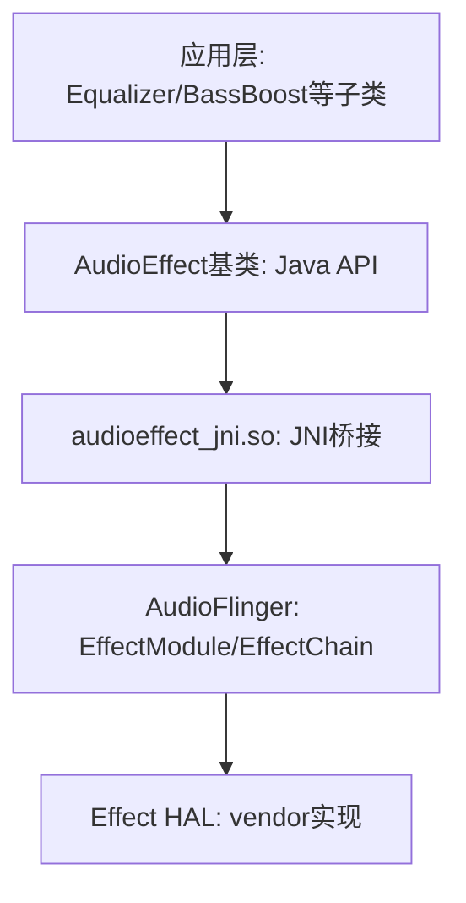

---

### 7.7.2 类定义与继承体系

[`AudioEffect`](frameworks/base/media/java/android/media/audiofx/AudioEffect.java:75) 不是abstract类，但官方文档明确建议应用应使用其派生子类。AOSP14中定义了以下子类：

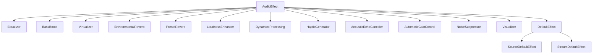

**子类分类：**

| 类别 | 子类 | 连接模式 | 典型场景 |
|------|------|----------|----------|
| OpenSL ES标准 | Equalizer, BassBoost, Virtualizer, EnvironmentalReverb, PresetReverb | Insert/Auxiliary | 音乐播放增强 |
| 预处理 | AcousticEchoCanceler, AutomaticGainControl, NoiseSuppressor | Pre Processing | 通话录音 |
| 后处理 | LoudnessEnhancer, DynamicsProcessing, HapticGenerator | Insert/Post Processing | 输出增强 |
| 可视化 | Visualizer | Insert | 音频频谱显示 |
| 系统默认 | DefaultEffect, SourceDefaultEffect, StreamDefaultEffect | 各异 | 系统级音效绑定 |

---

### 7.7.3 效果类型UUID常量完整表

UUID定义在 [`AudioEffect.java`](frameworks/base/media/java/android/media/audiofx/AudioEffect.java:83) ，对应 `hardware/audio_effect.h` 中的定义：

#### OpenSL ES标准效果

| 常量名 | UUID | 源码行 | 连接模式 |
|--------|------|--------|----------|
| `EFFECT_TYPE_ENV_REVERB` | c2e5d5f0-94bd-4763-9cac-4e234d06839e | L94 | Auxiliary |
| `EFFECT_TYPE_PRESET_REVERB` | 47382d60-ddd8-11db-bf3a-0002a5d5c51b | L99 | Auxiliary |
| `EFFECT_TYPE_EQUALIZER` | 0bed4300-ddd6-11db-8f34-0002a5d5c51b | L104 | Insert |
| `EFFECT_TYPE_BASS_BOOST` | 0634f220-ddd4-11db-a0fc-0002a5d5c51b | L109 | Insert |
| `EFFECT_TYPE_VIRTUALIZER` | 37cc2c00-dddd-11db-8577-0002a5d5c51b | L114 | Insert |

#### 非OpenSL ES效果

| 常量名 | UUID | 源码行 | 连接模式 |
|--------|------|--------|----------|
| `EFFECT_TYPE_AGC` | 0a8abfe0-654c-11e0-ba26-0002a5d5c51b | L123 | Pre Processing |
| `EFFECT_TYPE_AEC` | 7b491460-8d4d-11e0-bd61-0002a5d5c51b | L129 | Pre Processing |
| `EFFECT_TYPE_NS` | 58b4b260-8e06-11e0-aa8e-0002a5d5c51b | L135 | Pre Processing |
| `EFFECT_TYPE_LOUDNESS_ENHANCER` | fe3199be-aed0-413f-87bb-11260eb63cf1 | L141 | Insert |
| `EFFECT_TYPE_DYNAMICS_PROCESSING` | 7261676f-6d75-7369-6364-28e2fd3ac39e | L147 | Post Processing |
| `EFFECT_TYPE_HAPTIC_GENERATOR` | 1411e6d6-aecd-4021-a1cf-a6aceb0d71e5 | L155 | Insert |
| `EFFECT_TYPE_NULL` | ec7178ec-e5e1-4432-a3f4-4657e6795210 | L163 | 特殊 |

> **`EFFECT_TYPE_NULL`** (L163)：用于仅需通过uuid选择特定实现的场景，type字段不参与匹配。标记为 `@TestApi`。

---

### 7.7.4 核心成员变量详解

定义在 [`AudioEffect.java`](frameworks/base/media/java/android/media/audiofx/AudioEffect.java:381) L381-433：

```java
// 状态管理
private int mState = STATE_UNINITIALIZED;           // L387: 效果实例状态
private final Object mStateLock = new Object();     // L391: 状态锁

// Native资源
private int mId;                                     // L395: 系统唯一效果ID
private long mNativeAudioEffect;                     // L398: Native层AudioEffect指针
private long mJniData;                               // L399: JNI层数据指针

// 描述符
private Descriptor mDescriptor;                      // L404: 效果描述符

// 监听器
private OnEnableStatusChangeListener mEnableStatusChangeListener;     // L411
private OnControlStatusChangeListener mControlChangeStatusListener;   // L417
private OnParameterChangeListener mParameterChangeListener;           // L423
public final Object mListenerLock = new Object();                     // L428: 监听器锁
public NativeEventHandler mNativeEventHandler = null;                 // L433: 事件Handler
```

**关键设计要点：**
- `mStateLock` 保护状态变更，所有checkState/release操作都需获取此锁
- `mListenerLock` 保护监听器更新与Native事件回调的竞态
- `mNativeAudioEffect` / `mJniData` 由JNI层直接访问，不经过Java方法调用

---

### 7.7.5 构造函数深度解析

AudioEffect提供4层构造函数重载，最终汇聚到核心私有构造函数：

#### 构造函数调用链

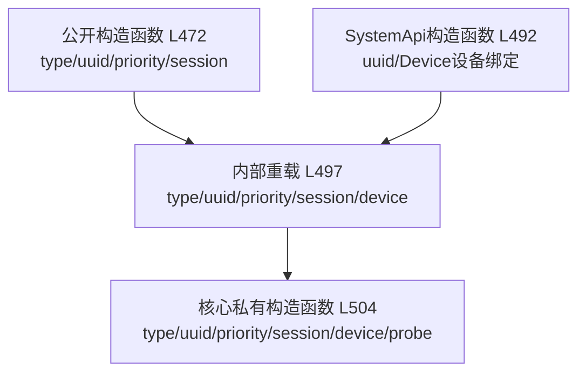

#### 7.7.5.1 公开构造函数 — 会话绑定

```java
// L472-476
public AudioEffect(UUID type, UUID uuid, int priority, int audioSession)
```

**参数说明：**
- `type`：效果类型UUID，如 `EFFECT_TYPE_EQUALIZER`；设为 `EFFECT_TYPE_NULL` 时仅靠uuid匹配
- `uuid`：特定实现UUID；设为 `EFFECT_TYPE_NULL` 时仅靠type匹配
- `priority`：控制优先级，0为正常，正数高于正常，负数低于正常
- `audioSession`：音频会话ID；0表示全局输出混音（已弃用）

**异常：**
- `IllegalArgumentException`：type/uuid无效或不存在
- `UnsupportedOperationException`：效果库未加载
- `RuntimeException`：其他初始化失败

#### 7.7.5.2 SystemApi构造函数 — 设备绑定

```java
// L490-495
@SystemApi
@RequiresPermission(MODIFY_DEFAULT_AUDIO_EFFECTS)
public AudioEffect(@NonNull UUID uuid, @NonNull AudioDeviceAttributes device)
```

**特殊之处：**
- `audioSession = -2`：表示绑定到设备而非会话
- `type = EFFECT_TYPE_NULL`：仅通过uuid匹配
- `priority = 0`：系统级效果使用默认优先级
- 需要 `MODIFY_DEFAULT_AUDIO_EFFECTS` 权限

#### 7.7.5.3 核心私有构造函数

```java
// L504-555
private AudioEffect(UUID type, UUID uuid, int priority,
        int audioSession, @Nullable AudioDeviceAttributes device, boolean probe)
```

**完整创建流程：**

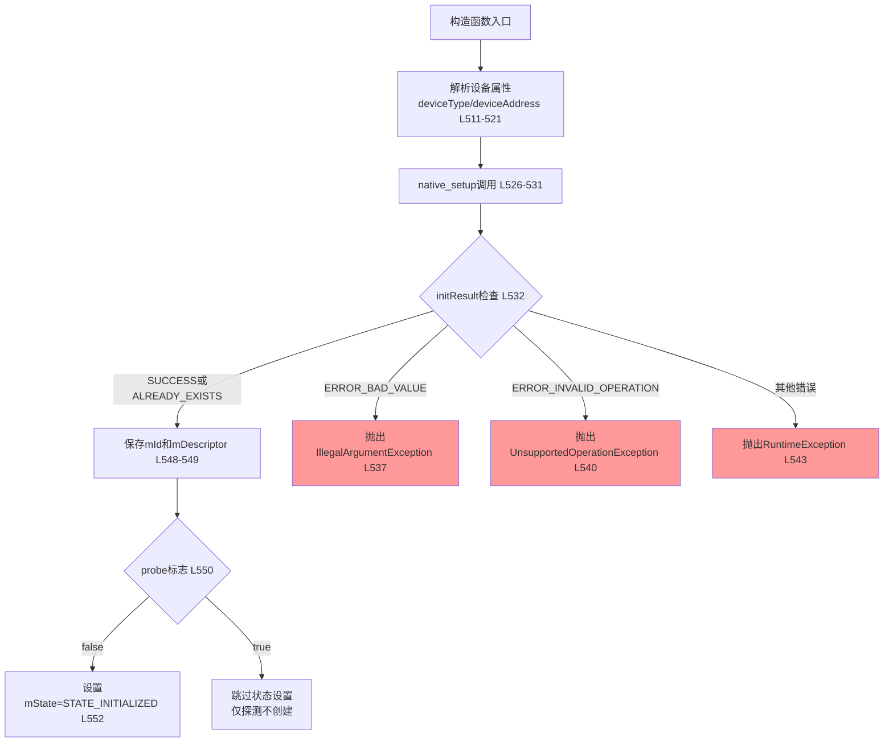

**native_setup参数详解 (L528-530)：**

```java
initResult = native_setup(
    new WeakReference<>(this),  // 弱引用，防止Native回调阻止GC
    type.toString(),             // 效果类型UUID字符串
    uuid.toString(),             // 实现UUID字符串
    priority,                    // 优先级
    audioSession,                // 会话ID（-2表示设备绑定）
    deviceType,                  // 设备内部类型
    deviceAddress,               // 设备地址
    id,                          // 输出：效果ID
    desc,                        // 输出：效果描述符
    attributionSourceState.getParcel(),  // 归属来源
    probe                        // 是否仅探测
);
```

**优先级机制核心逻辑：**
1. 当同一session中已有同类型效果时，AudioFlinger复用已有EffectModule
2. 如果新请求的priority > 当前拥有者的priority，控制权转移给新请求者
3. 控制权变更通过 `NATIVE_EVENT_CONTROL_STATUS` 事件通知旧拥有者
4. `ALREADY_EXISTS` (L532) 表示效果已存在且成功附加，不视为错误

---

### 7.7.6 setEnabled() 启停控制

```java
// L673-676
public int setEnabled(boolean enabled) throws IllegalStateException {
    checkState("setEnabled()");
    return native_setEnabled(enabled);
}
```

**执行流程：**

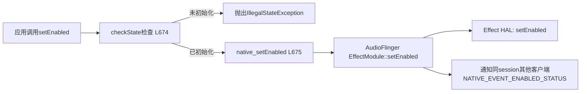

**关键要点：**
- 创建AudioEffect时效果引擎默认是disabled状态（bypass模式）
- enabled=true时音频信号流经效果处理；enabled=false时bypass
- 返回值：`SUCCESS`(0)成功，`ERROR_INVALID_OPERATION`(-5)无控制权，`ERROR_DEAD_OBJECT`(-7)Native对象死亡
- 必须先获得控制权（hasControl()=true）才能成功启用

---

### 7.7.7 setParameter()/getParameter() 参数交互

这是AudioEffect最核心的参数交互API，提供多重重载以适应不同参数类型。

#### 7.7.7.1 setParameter重载体系

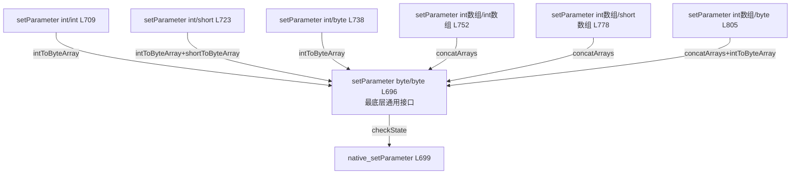

#### 7.7.7.2 底层setParameter(byte[], byte[])

```java
// L696-700
@TestApi
public int setParameter(byte[] param, byte[] value) throws IllegalStateException {
    checkState("setParameter()");
    return native_setParameter(param.length, param, value.length, value);
}
```

这是所有重载的最终汇聚点。参数和值都以原生字节序（`ByteOrder.nativeOrder()`）编码。调用 [`native_setParameter`](frameworks/base/media/java/android/media/audiofx/AudioEffect.java:1410) 传入psize/param/vsize/value。

#### 7.7.7.3 类型转换重载示例

```java
// L709-713: int/int → byte[]
public int setParameter(int param, int value) {
    byte[] p = intToByteArray(param);   // 4字节，native序
    byte[] v = intToByteArray(value);
    return setParameter(p, v);
}

// L752-768: int[1-2]/int[1-2] → 拼接byte[]
public int setParameter(int[] param, int[] value) {
    if (param.length > 2 || value.length > 2) {
        return ERROR_BAD_VALUE;         // 最多2个int参数
    }
    byte[] p = intToByteArray(param[0]);
    if (param.length > 1) {
        p = concatArrays(p, intToByteArray(param[1]));
    }
    // ... 同理处理value
    return setParameter(p, v);
}
```

**参数数组长度限制**：`int[] param` 和 `int[] value` 最多支持2个元素。这是为了覆盖常见的"参数组+参数索引"模式（如Equalizer的band编号）。

#### 7.7.7.4 getParameter重载体系

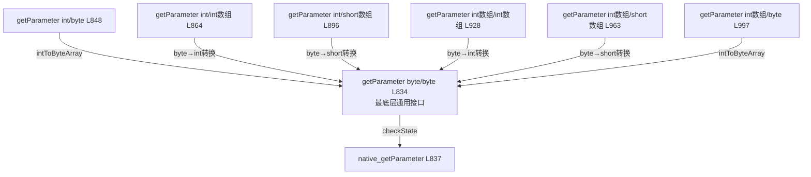

#### 7.7.7.5 getParameter(int, int[]) 返回值解析

```java
// L864-885
public int getParameter(int param, int[] value) {
    if (value.length > 2) return ERROR_BAD_VALUE;
    byte[] p = intToByteArray(param);
    byte[] v = new byte[value.length * 4];
    
    int status = getParameter(p, v);  // 调用底层，返回有效字节数
    
    if (status == 4 || status == 8) {   // 4=1个int, 8=2个int
        value[0] = byteArrayToInt(v);
        if (status == 8) value[1] = byteArrayToInt(v, 4);
        status /= 4;                     // 转换为int个数
    } else {
        status = ERROR;                  // 字节数不匹配
    }
    return status;
}
```

**返回值语义：**
- 底层 `native_getParameter` 返回的是有效字节数
- 高层重载将字节数转换为对应类型的元素个数（4字节→1个int，2字节→1个short）
- 如果返回的字节数不是预期的4/8（int）或2/4（short），则视为错误

---

### 7.7.8 command() 自定义命令通道

```java
// L1019-1023
@UnsupportedAppUsage(maxTargetSdk = Build.VERSION_CODES.P)
public int command(int cmdCode, byte[] command, byte[] reply)
        throws IllegalStateException {
    checkState("command()");
    return native_command(cmdCode, command.length, command, reply.length, reply);
}
```

**用途：** 向效果引擎发送厂商自定义命令，绕过标准setParameter接口。适合以下场景：
- 厂商专有效果的非标参数配置
- 效果引擎内部状态查询
- 调试诊断命令

**参数说明：**
- `cmdCode`：命令代码，厂商自定义
- `command`：命令数据
- `reply`：预分配的回复缓冲区
- 返回值：成功时返回reply中有效字节数，失败返回负数

> **注意：** 此API标记为 `@UnsupportedAppUsage`，第三方应用不应使用。

---

### 7.7.9 release() 资源释放

```java
// L585-590
public void release() {
    synchronized (mStateLock) {
        native_release();
        mState = STATE_UNINITIALIZED;
    }
}
```

**执行流程：**

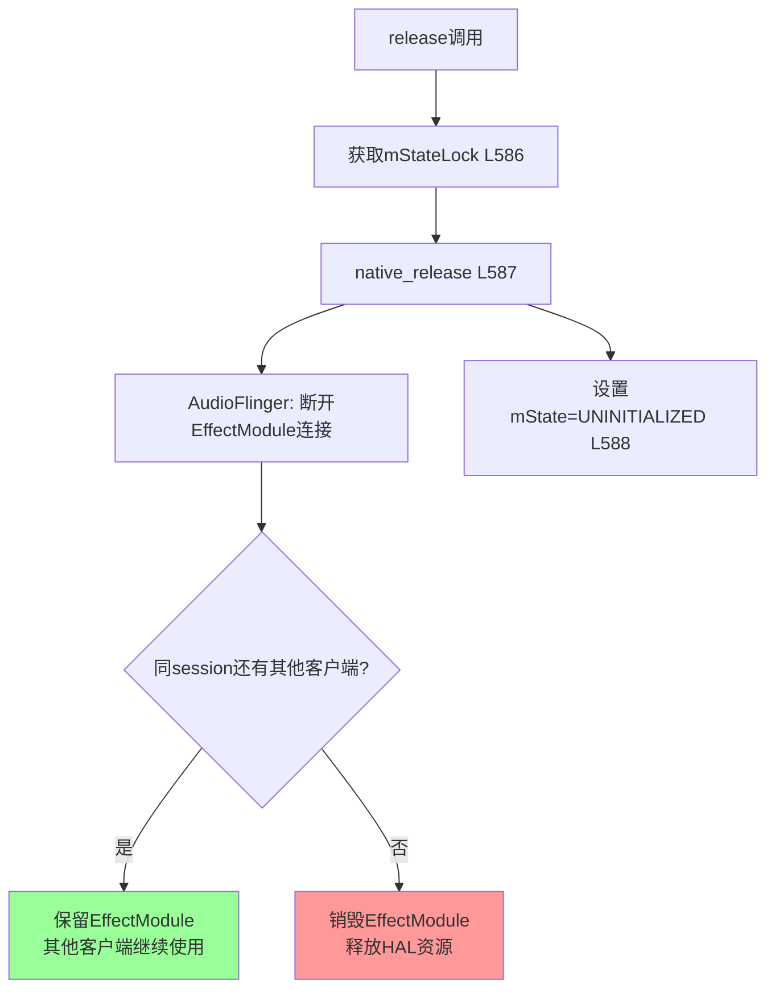

**关键要点：**
- 必须在 `mStateLock` 保护下执行，与 `checkState()` 互斥
- `native_release()` 释放Native AudioEffect对象，但AudioFlinger侧的EffectModule可能保留
- GC时 [`finalize()`](frameworks/base/media/java/android/media/audiofx/AudioEffect.java:593) 调用 `native_finalize()` 作为兜底，但不应依赖
- **最佳实践：** 在Activity/Fragment的onPause或onStop中显式调用release()

---

### 7.7.10 监听器机制

AudioEffect提供3类监听器，对应Native层的3种事件通知：

#### 监听器体系总览

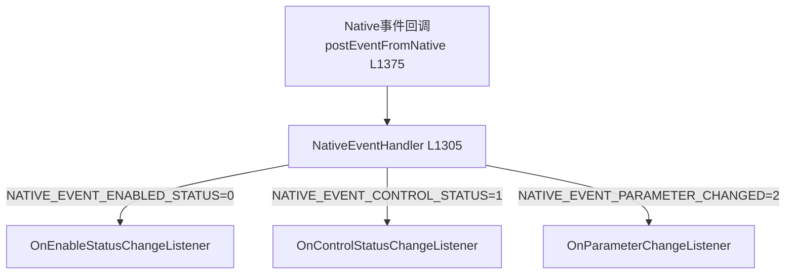

#### 7.7.10.1 OnEnableStatusChangeListener

```java
// L1136-1144
public interface OnEnableStatusChangeListener {
    void onEnableStatusChange(AudioEffect effect, boolean enabled);
}
```

**注册方式：**
```java
// L1074-1081
public void setEnableStatusListener(OnEnableStatusChangeListener listener) {
    synchronized (mListenerLock) {
        mEnableStatusChangeListener = listener;
    }
    if ((listener != null) && (mNativeEventHandler == null)) {
        createNativeEventHandler();      // 延迟创建Handler
    }
}
```

**触发场景：** 另一个应用或系统通过 `setEnabled()` 改变了效果引擎的启用状态。

#### 7.7.10.2 OnControlStatusChangeListener

```java
// L1150-1159
public interface OnControlStatusChangeListener {
    void onControlStatusChange(AudioEffect effect, boolean controlGranted);
}
```

**触发场景：** 优先级更高的客户端请求了同一效果，导致控制权转移。`controlGranted=false` 表示失去了控制权。

#### 7.7.10.3 OnParameterChangeListener

```java
// L1167-1177
@TestApi
public interface OnParameterChangeListener {
    void onParameterChange(AudioEffect effect, int status, byte[] param, byte[] value);
}
```

**Native事件数据解析 (L1339-1361)：**

当收到 `NATIVE_EVENT_PARAMETER_CHANGED` 事件时，`msg.obj` 包含一个byte数组，布局如下：

```
偏移量  | 大小 | 字段
--------|------|------
0       | 4    | status (int)
4       | 4    | psize (int) - 参数长度
8       | 4    | vsize (int) - 值长度
12      | psize| param数据
12+psize| vsize| value数据
```

对应 `effect_param_t` 结构（EffectApi.h），由 `msg.arg1` 传递value偏移量。

#### 7.7.10.4 NativeEventHandler事件分发

```java
// L1305-1369
private class NativeEventHandler extends Handler {
    @Override
    public void handleMessage(Message msg) {
        switch (msg.what) {
        case NATIVE_EVENT_ENABLED_STATUS:      // L1319
            // msg.arg1: 0=disabled, 1=enabled
            enableStatusChangeListener.onEnableStatusChange(effect, msg.arg1 != 0);
            break;
        case NATIVE_EVENT_CONTROL_STATUS:      // L1329
            // msg.arg1: 0=失去控制, 1=获得控制
            controlStatusChangeListener.onControlStatusChange(effect, msg.arg1 != 0);
            break;
        case NATIVE_EVENT_PARAMETER_CHANGED:   // L1339
            // msg.obj: byte[] 包含status+psize+vsize+param+value
            // msg.arg1: value偏移量
            int vOffset = msg.arg1;
            byte[] p = (byte[]) msg.obj;
            int status = byteArrayToInt(p, 0);
            int psize = byteArrayToInt(p, 4);
            int vsize = byteArrayToInt(p, 8);
            byte[] param = new byte[psize];
            byte[] value = new byte[vsize];
            System.arraycopy(p, 12, param, 0, psize);
            System.arraycopy(p, vOffset, value, 0, vsize);
            parameterChangeListener.onParameterChange(effect, status, param, value);
            break;
        }
    }
}
```

**线程模型：**

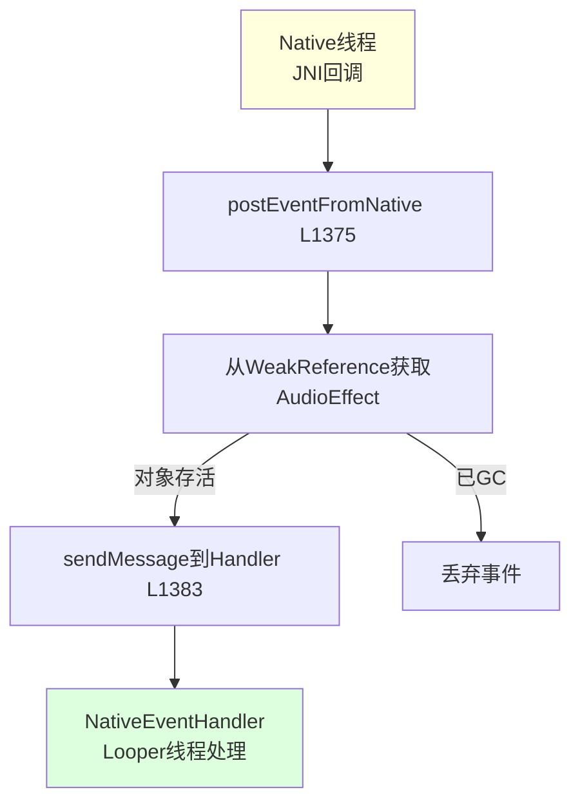

- [`createNativeEventHandler()`](frameworks/base/media/java/android/media/audiofx/AudioEffect.java:1118) 优先使用调用线程的Looper，回退到主线程Looper
- 所有监听器回调都在Handler所在Looper线程执行，确保线程安全
- `mListenerLock` 确保监听器注册/注销与事件分发互斥

---

### 7.7.11 静态工具方法

#### 7.7.11.1 queryEffects()

```java
// L619-621
static public Descriptor[] queryEffects() {
    return (Descriptor[]) native_query_effects();
}
```

查询系统所有可用效果，返回 [`Descriptor`](frameworks/base/media/java/android/media/audiofx/AudioEffect.java:249) 数组。每个Descriptor包含type/uuid/connectMode/name/implementor。

#### 7.7.11.2 queryPreProcessings()

```java
// L632-634
static public Descriptor[] queryPreProcessings(int audioSession) {
    return (Descriptor[]) native_query_pre_processing(audioSession);
}
```

查询指定AudioRecord会话上附加的预处理效果。标记为 `@hide`。

#### 7.7.11.3 isEffectTypeAvailable()

```java
// L643-655
@TestApi
public static boolean isEffectTypeAvailable(UUID type) {
    AudioEffect.Descriptor[] desc = AudioEffect.queryEffects();
    if (desc == null) return false;
    for (int i = 0; i < desc.length; i++) {
        if (desc[i].type.equals(type)) return true;
    }
    return false;
}
```

遍历所有可用效果检查指定type是否存在。注意这不是高效实现——每次调用都查询所有效果。

#### 7.7.11.4 isEffectSupportedForDevice()

```java
// L567-578
@SystemApi
@RequiresPermission(MODIFY_DEFAULT_AUDIO_EFFECTS)
public static boolean isEffectSupportedForDevice(UUID uuid, AudioDeviceAttributes device) {
    try {
        AudioEffect fx = new AudioEffect(EFFECT_TYPE_NULL, uuid, 0, -2, device, true);
        fx.release();
        return true;
    } catch (Exception e) {
        return false;
    }
}
```

**探测机制：** 使用 `probe=true` 创建临时AudioEffect。此时native_setup仅验证能否创建，不改变mState。创建后立即release。

---

### 7.7.12 错误码与状态码

#### 状态常量

| 常量 | 值 | 源码行 | 说明 |
|------|----|--------|------|
| `STATE_UNINITIALIZED` | 0 | L171 | 未初始化/已释放 |
| `STATE_INITIALIZED` | 1 | L176 | 已初始化可用 |
| `SUCCESS` | 0 | L199 | 操作成功 |

#### 错误码

| 常量 | 值 | 源码行 | 说明 |
|------|----|--------|------|
| `ERROR` | -1 | L203 | 通用未指定错误 |
| `ALREADY_EXISTS` | -2 | L207 | 效果已存在（非真正错误） |
| `ERROR_NO_INIT` | -3 | L211 | 对象初始化失败 |
| `ERROR_BAD_VALUE` | -4 | L215 | 参数值不合法 |
| `ERROR_INVALID_OPERATION` | -5 | L219 | 状态错误或无控制权 |
| `ERROR_NO_MEMORY` | -6 | L223 | 内存不足 |
| `ERROR_DEAD_OBJECT` | -7 | L227 | Native对象已死亡 |

#### Native事件ID

| 常量 | 值 | 源码行 | 说明 |
|------|----|--------|------|
| `NATIVE_EVENT_CONTROL_STATUS` | 0 | L184 | 控制权变更通知 |
| `NATIVE_EVENT_ENABLED_STATUS` | 1 | L189 | 启用状态变更通知 |
| `NATIVE_EVENT_PARAMETER_CHANGED` | 2 | L194 | 参数变更通知 |

#### 连接模式常量

| 常量 | 值 | 源码行 | 说明 |
|------|----|--------|------|
| `EFFECT_INSERT` | "Insert" | L360 | 插入模式，作用于整个音源 |
| `EFFECT_AUXILIARY` | "Auxiliary" | L369 | 辅助模式，需指定send level |
| `EFFECT_PRE_PROCESSING` | "Pre Processing" | L374 | 预处理，绑定到AudioRecord |
| `EFFECT_POST_PROCESSING` | "Post Processing" | L379 | 后处理，绑定到输出设备 |

---

### 7.7.13 JNI接口概览

所有Native方法声明在 [`AudioEffect.java`](frameworks/base/media/java/android/media/audiofx/AudioEffect.java:1392) L1392-1421：

```java
private static native final void native_init();                    // L1393
private native final int native_setup(Object, String, String,     // L1395-1398
    int, int, int, String, int[], Object[], Parcel, boolean);
private native final void native_finalize();                       // L1400
private native final void native_release();                         // L1402
private native final int native_setEnabled(boolean);               // L1404
private native final boolean native_getEnabled();                  // L1406
private native final boolean native_hasControl();                  // L1408
private native final int native_setParameter(int, byte[],          // L1410-1411
    int, byte[]);
private native final int native_getParameter(int, byte[],          // L1413-1414
    int, byte[]);
private native final int native_command(int, int, byte[],          // L1416-1417
    int, byte[]);
private static native Object[] native_query_effects();              // L1419
private static native Object[] native_query_pre_processing(int);    // L1421
```

**JNI库加载：**
```java
// L76-79
static {
    System.loadLibrary("audioeffect_jni");
    native_init();
}
```

在类首次加载时加载 `libaudioeffect_jni.so` 并执行 `native_init()` 初始化JNI层缓存。

**Native→Java回调入口：**
```java
// L1375-1387
private static void postEventFromNative(Object effect_ref, int what,
        int arg1, int arg2, Object obj) {
    AudioEffect effect = (AudioEffect) ((WeakReference) effect_ref).get();
    if (effect == null) return;
    if (effect.mNativeEventHandler != null) {
        Message m = effect.mNativeEventHandler.obtainMessage(what, arg1, arg2, obj);
        effect.mNativeEventHandler.sendMessage(m);
    }
}
```

---

### 7.7.14 参数传递机制深度解析

#### 7.7.14.1 端到端参数传递流程

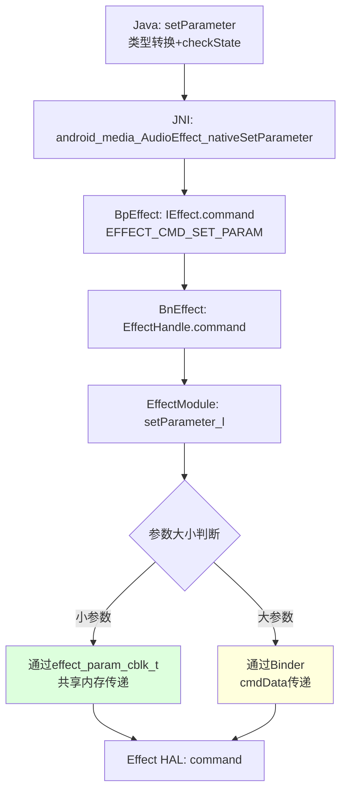

#### 7.7.14.2 effect_param_cblk_t共享内存

对于小参数传递，AudioFlinger使用共享内存块（cblk）避免Binder序列化开销：

```
effect_param_cblk_t 布局:
+-------------------+
| effect_param_t    |
|   status: int32   |  ← 操作状态码
|   psize: int32    |  ← 参数数据长度
|   vsize: int32    |  ← 值数据长度
|   data[0]: byte   |  ← 参数数据起始
|   ...             |
|   data[psize]:    |  ← 值数据起始
|   ...             |
+-------------------+
```

**共享内存优势：**
- 避免参数数据在Binder事务中拷贝
- 设置和获取操作可以复用同一块内存
- 对高频参数更新（如均衡器调节）性能提升显著

#### 7.7.14.3 ByteOrder一致性

所有Java↔Native参数传递使用 `ByteOrder.nativeOrder()` (L1479, L1491等)：

```java
// L1478-1482
public static int byteArrayToInt(byte[] valueBuf, int offset) {
    ByteBuffer converter = ByteBuffer.wrap(valueBuf);
    converter.order(ByteOrder.nativeOrder());   // 关键：native字节序
    return converter.getInt(offset);
}
```

**这意味着：** 在ARM/AArch64（小端序）设备上，int值0x12345678在byte[]中的排列为 [0x78, 0x56, 0x34, 0x12]。

#### 7.7.14.4 Deferred参数提交

setParameter的Native实现并不立即将参数传递到Effect HAL。AudioFlinger使用延迟提交机制：

1. **setParameter调用** → 参数写入EffectModule的待处理队列
2. **process_l阶段** → 在音频处理线程中，process之前先应用所有pending参数
3. **保证线程安全** → 参数应用与音频处理在同一线程，无需额外锁

这种设计确保了参数变更不会在音频处理中途生效，避免音频glitch。

---

### 7.7.15 生命周期状态图

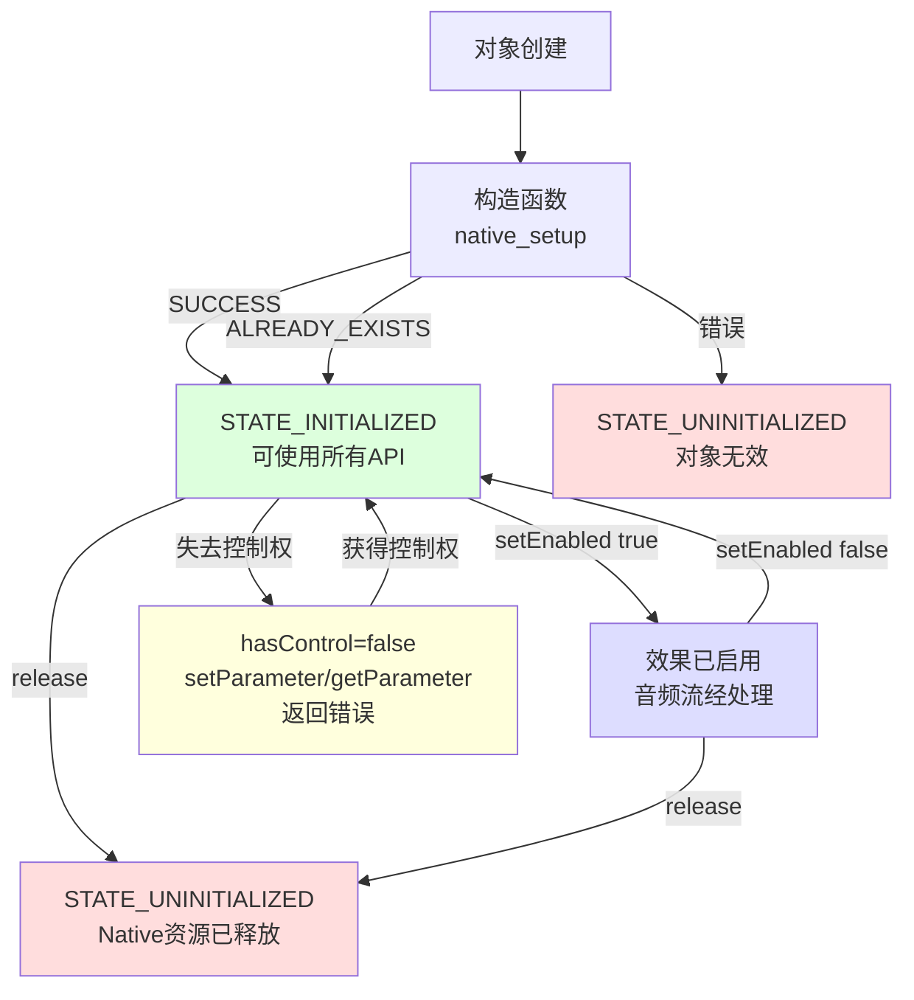

---

### 7.7.16 Intent与控制面板机制

AudioEffect定义了3个标准Intent，用于应用与效果控制面板之间的协作：

| Intent | 类型 | 源码行 | 说明 |
|--------|------|--------|------|
| `ACTION_DISPLAY_AUDIO_EFFECT_CONTROL_PANEL` | Activity | L1209 | 打开效果控制面板UI |
| `ACTION_OPEN_AUDIO_EFFECT_CONTROL_SESSION` | Broadcast | L1229 | 通知控制面板新会话开始 |
| `ACTION_CLOSE_AUDIO_EFFECT_CONTROL_SESSION` | Broadcast | L1243 | 通知控制面板会话结束 |

**附加Extra：**

| Extra | 类型 | 源码行 | 说明 |
|-------|------|--------|------|
| `EXTRA_AUDIO_SESSION` | int | L1254 | 关联的音频会话ID |
| `EXTRA_PACKAGE_NAME` | String | L1262 | 调用方包名 |
| `EXTRA_CONTENT_TYPE` | int | L1278 | 内容类型 |

**内容类型值：**

| 常量 | 值 | 源码行 |
|------|----|--------|
| `CONTENT_TYPE_MUSIC` | 0 | L1283 |
| `CONTENT_TYPE_MOVIE` | 1 | L1287 |
| `CONTENT_TYPE_GAME` | 2 | L1291 |
| `CONTENT_TYPE_VOICE` | 3 | L1295 |

---

### 7.7.17 工具方法汇总

| 方法 | 源码行 | 说明 |
|------|--------|------|
| [`checkState()`](frameworks/base/media/java/android/media/audiofx/AudioEffect.java:1431) | L1431 | 检查mState，未初始化则抛IllegalStateException |
| [`checkStatus()`](frameworks/base/media/java/android/media/audiofx/AudioEffect.java:1443) | L1443 | 检查返回值，负数转对应异常 |
| [`isError()`](frameworks/base/media/java/android/media/audiofx/AudioEffect.java:1462) | L1462 | 判断status是否为错误（<0） |
| [`byteArrayToInt()`](frameworks/base/media/java/android/media/audiofx/AudioEffect.java:1478) | L1478 | byte[]→int，native序 |
| [`intToByteArray()`](frameworks/base/media/java/android/media/audiofx/AudioEffect.java:1489) | L1489 | int→byte[]，native序 |
| [`byteArrayToShort()`](frameworks/base/media/java/android/media/audiofx/AudioEffect.java:1507) | L1507 | byte[]→short，native序 |
| [`shortToByteArray()`](frameworks/base/media/java/android/media/audiofx/AudioEffect.java:1518) | L1518 | short→byte[]，native序 |
| [`byteArrayToFloat()`](frameworks/base/media/java/android/media/audiofx/AudioEffect.java:1537) | L1537 | byte[]→float，native序 |
| [`floatToByteArray()`](frameworks/base/media/java/android/media/audiofx/AudioEffect.java:1547) | L1547 | float→byte[]，native序 |
| [`concatArrays()`](frameworks/base/media/java/android/media/audiofx/AudioEffect.java:1557) | L1557 | 拼接多个byte[] |

---

### 7.7.18 Descriptor内部类

[`Descriptor`](frameworks/base/media/java/android/media/audiofx/AudioEffect.java:249) 是效果描述符，包含5个字段：

```java
// L249-354
public static class Descriptor {
    public UUID type;           // 效果类型UUID
    public UUID uuid;          // 特定实现UUID
    public String connectMode; // Insert/Auxiliary/Pre Processing/Post Processing
    public String name;        // 人类可读效果名
    public String implementor; // 人类可读实现者名
}
```

支持3种构造方式：直接赋值(L307)、Parcel反序列化(L318)、默认构造(L251)。

---

[← 7.6 Spatializer空间音频架构详解](07_7.6_Spatializer空间音频架构详解.md) | [← 返回07章](README.md) | [返回导航](../README.md) | [下一个 →](07_7.8_常见音效类型完整列表与参数.md)