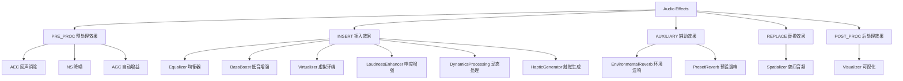

[← 7.7 AudioEffect Java](07_7.7_AudioEffect_Java_API详解.md) | [← 返回Effects Framework](README.md) | [返回导航](../README.md) | [7.9 内置效果与Vendor效果 →](07_7.9_内置效果与Vendor效果.md)

---

## 7.8 常见音效类型完整列表与参数

> 本章基于 AOSP 14 源码深度分析，涵盖 Java Framework 层（`frameworks/base/media/java/android/media/audiofx/`）
> 和 HAL 层（`system/media/audio/include/system/audio_effects/`）的完整参数定义。
> 所有 UUID、参数 ID、范围值均从源码提取验证。

### 7.8.1 音效分类体系总览

Android 音效框架按信号处理方向和 Flag 类型将效果分为五大类：



### 7.8.2 标准效果完整列表

| 效果名称 | Type UUID | Java 类 | Flag 类型 | 信号方向 | 源码位置 |
|---------|-----------|---------|----------|---------|---------|
| AEC | `7b491460-8d4d-11e0-bd61-0002a5d5c51b` | `AcousticEchoCanceler` | PRE_PROC | 录音 | [`AudioEffect.java`](frameworks/base/media/java/android/media/audiofx/AudioEffect.java:120) |
| NS | `58b4b260-8e06-11e0-aa8e-0002a5d5c51b` | `NoiseSuppressor` | PRE_PROC | 录音 | [`AudioEffect.java`](frameworks/base/media/java/android/media/audiofx/AudioEffect.java:126) |
| AGC | `0a8abfe0-654c-11e0-ba26-0002a5d5c51b` | `AutomaticGainControl` | PRE_PROC | 录音 | [`AudioEffect.java`](frameworks/base/media/java/android/media/audiofx/AudioEffect.java:114) |
| Equalizer | `0bed4300-ddd6-11db-8f34-0002a5d5c51b` | `Equalizer` | INSERT | 播放 | [`AudioEffect.java`](frameworks/base/media/java/android/media/audiofx/AudioEffect.java:95) |
| BassBoost | `0634f220-ddd4-11db-a0fc-0002a5d5c51b` | `BassBoost` | INSERT | 播放 | [`AudioEffect.java`](frameworks/base/media/java/android/media/audiofx/AudioEffect.java:88) |
| Virtualizer | `37cc2c00-dddd-11db-8577-0002a5d5c51b` | `Virtualizer` | INSERT | 播放 | [`AudioEffect.java`](frameworks/base/media/java/android/media/audiofx/AudioEffect.java:103) |
| LoudnessEnhancer | `fe3199be-aed0-413f-87bb-11260eb63cf1` | `LoudnessEnhancer` | INSERT | 播放 | [`AudioEffect.java`](frameworks/base/media/java/android/media/audiofx/AudioEffect.java:132) |
| DynamicsProcessing | `7261676f-6d75-7369-6364-28e2fd3ac39e` | `DynamicsProcessing` | INSERT | 播放 | [`AudioEffect.java`](frameworks/base/media/java/android/media/audiofx/AudioEffect.java:139) |
| HapticGenerator | `1411e6d6-aecd-4021-a1cf-a6aceb0d71e5` | `HapticGenerator` | INSERT | 播放 | [`AudioEffect.java`](frameworks/base/media/java/android/media/audiofx/AudioEffect.java:146) |
| EnvironmentalReverb | `c2e5d5f0-94bd-4763-9cac-4e234d06839e` | `EnvironmentalReverb` | AUXILIARY | 播放 | [`AudioEffect.java`](frameworks/base/media/java/android/media/audiofx/AudioEffect.java:82) |
| PresetReverb | `47382d60-ddd8-11db-bf3a-0002a5d5c51b` | `PresetReverb` | AUXILIARY | 播放 | [`AudioEffect.java`](frameworks/base/media/java/android/media/audiofx/AudioEffect.java:89) |
| Spatializer | — | — | REPLACE | 播放 | 独立管理 |
| Visualizer | `e46b26a0-dddd-11db-8afd-0002a5d5c51b` | `Visualizer` | INSERT | 播放 | [`effect_visualizer.h`](system/media/audio/include/system/audio_effects/effect_visualizer.h:27) |

> **UUID 说明**：Type UUID 标识效果**类型**（接口规范），Implementation UUID 标识具体实现。
> 同一 Type UUID 可有多个 Implementation UUID（如不同 Vendor 的均衡器实现）。
> 上述 UUID 均定义于 [`AudioEffect.java`](frameworks/base/media/java/android/media/audiofx/AudioEffect.java:82)。

---

## 7.8.3 预处理效果（PRE_PROC）详解

预处理效果用于录音方向，Flag 类型为 `EFFECT_FLAG_TYPE_PRE_PROC(3)`，挂载在 AudioFlinger 的 RecordThread 效果链上。
它们在 Java 层通过 `AcousticEchoCanceler`、`NoiseSuppressor`、`AutomaticGainControl` 三个便捷类访问，
底层共享 `AudioEffect` 基础框架。

### 7.8.3.1 AEC — 声学回声消除

| 属性 | 值 |
|------|---|
| Type UUID | `7b491460-8d4d-11e0-bd61-0002a5d5c51b` |
| Java 类 | [`AcousticEchoCanceler`](frameworks/base/media/java/android/media/audiofx/AcousticEchoCanceler.java) |
| HAL 头文件 | [`effect_aec.h`](system/media/audio/include/system/audio_effects/effect_aec.h) |
| 信号方向 | 输入（录音） |
| 适用场景 | VoIP 通话回声消除、语音识别前端处理 |

**HAL 层参数定义**（[`effect_aec.h`](system/media/audio/include/system/audio_effects/effect_aec.h)）：

| 参数枚举 | 值 | 类型 | 说明 |
|---------|---|------|------|
| `AEC_PARAM_ECHO_DELAY` | 0 | uint32_t | 回声延迟，单位微秒（μs），用于调整滤波器对齐 |
| `AEC_PARAM_PROPERTIES` | 1 | struct | 一次性设置所有属性 |
| `AEC_PARAM_MOBILE_MODE` | 2 | bool | 移动模式开关，影响算法复杂度 |

**设置结构体**：
```c
typedef struct {
    uint32_t echoDelay;    // 回声延迟(μs)
} t_aec_settings;
```

**Java API**：
```java
// 创建（无需指定UUID，内部自动绑定AEC Type UUID）
AcousticEchoCanceler.create(int audioSession);  // :79
// 查询可用性
AcousticEchoCanceler.isAvailable();              // :66
```

**关键实现细节**：
- AEC 效果由 AudioPolicyManager 根据 `audio_source==VOICE_COMMUNICATION` 自动附加到录音流
- `echoDelay` 参数需与实际声学回路的传播延迟匹配，典型值 0~500ms
- 移动设备上 `mobileMode=true` 时降低算法复杂度以节省功耗

### 7.8.3.2 NS — 降噪

| 属性 | 值 |
|------|---|
| Type UUID | `58b4b260-8e06-11e0-aa8e-0002a5d5c51b` |
| Java 类 | [`NoiseSuppressor`](frameworks/base/media/java/android/media/audiofx/NoiseSuppressor.java) |
| HAL 头文件 | [`effect_ns.h`](system/media/audio/include/system/audio_effects/effect_ns.h) |
| 信号方向 | 输入（录音） |
| 适用场景 | VoIP 通话背景噪声抑制、语音识别前端处理 |

**HAL 层参数定义**（[`effect_ns.h`](system/media/audio/include/system/audio_effects/effect_ns.h)）：

| 参数枚举 | 值 | 类型 | 说明 |
|---------|---|------|------|
| `NS_PARAM_LEVEL` | 0 | int32_t | 降噪级别 |
| `NS_PARAM_TYPE` | 1 | int32_t | 降噪算法类型 |
| `NS_PARAM_PROPERTIES` | 2 | struct | 一次性设置所有属性 |

**降噪级别**（`NS_PARAM_LEVEL`）：

| 常量 | 值 | 说明 |
|------|---|------|
| `NS_LEVEL_LOW` | 0 | 低降噪（最小语音失真） |
| `NS_LEVEL_MEDIUM` | 1 | 中等降噪 |
| `NS_LEVEL_HIGH` | 2 | 高降噪（最大噪声抑制，可能引入语音失真） |

**降噪类型**（`NS_PARAM_TYPE`）：

| 常量 | 值 | 说明 |
|------|---|------|
| `NS_TYPE_SINGLE_CHANNEL` | 0 | 单通道降噪（适用于单麦克风） |
| `NS_TYPE_MULTI_CHANNEL` | 1 | 多通道降噪（适用于麦克风阵列，利用空间信息） |

**设置结构体**：
```c
typedef struct {
    int32_t level;    // NS_LEVEL_LOW / MEDIUM / HIGH
    int32_t type;     // NS_TYPE_SINGLE_CHANNEL / MULTI_CHANNEL
} t_ns_settings;
```

**Java API**：
```java
NoiseSuppressor.create(int audioSession);  // :79
NoiseSuppressor.isAvailable();              // :66
```

### 7.8.3.3 AGC — 自动增益控制

| 属性 | 值 |
|------|---|
| Type UUID | `0a8abfe0-654c-11e0-ba26-0002a5d5c51b` |
| Java 类 | [`AutomaticGainControl`](frameworks/base/media/java/android/media/audiofx/AutomaticGainControl.java) |
| HAL 头文件 | [`effect_agc.h`](system/media/audio/include/system/audio_effects/effect_agc.h) |
| 信号方向 | 输入（录音） |
| 适用场景 | VoIP 通话音量自动调节、录音电平标准化 |

**HAL 层参数定义**（[`effect_agc.h`](system/media/audio/include/system/audio_effects/effect_agc.h)）：

| 参数枚举 | 值 | 类型 | 说明 |
|---------|---|------|------|
| `AGC_PARAM_TARGET_LEVEL` | 0 | int16_t | 目标电平，单位 millibels（mB） |
| `AGC_PARAM_COMP_GAIN` | 1 | int16_t | 压缩器增益，单位 millibels（mB） |
| `AGC_PARAM_LIMITER_ENA` | 2 | bool | 限幅器启用开关 |
| `AGC_PARAM_PROPERTIES` | 3 | struct | 一次性设置所有属性 |

**设置结构体**：
```c
typedef struct {
    int16_t targetLevel;     // 目标电平(mB)，典型值 -1600~0
    int16_t compGain;        // 压缩增益(mB)，典型值 0~3000
    bool     limiterEnabled; // 限幅器开关
} t_agc_settings;
```

**Java API**：
```java
AutomaticGainControl.create(int audioSession);  // :79
AutomaticGainControl.isAvailable();              // :66
```

**参数说明**：
- `targetLevel`：期望输出电平，0mB = 0dB（满幅），负值表示低于满幅
- `compGain`：压缩器可提供的最大增益，正值增加增益
- `limiterEnabled`：启用后防止输出超过 0dBFS，避免削波失真

---

## 7.8.4 插入效果（INSERT）详解

插入效果用于播放方向，Flag 类型为 `EFFECT_FLAG_TYPE_INSERT(0)`，串行挂载在 AudioFlinger 的 PlaybackThread 效果链上。
信号流：`输入 → Effect → 输出`，效果直接处理并修改音频数据。

### 7.8.4.1 Equalizer — 均衡器

| 属性 | 值 |
|------|---|
| Type UUID | `0bed4300-ddd6-11db-8f34-0002a5d5c51b` |
| Java 类 | [`Equalizer`](frameworks/base/media/java/android/media/audiofx/Equalizer.java) |
| OpenSL ES 接口 | `SLEqualizerItf` |
| Flag 类型 | INSERT |
| 信号方向 | 输出（播放） |
| 适用场景 | 音乐播放均衡、车载音效调校、媒体播放器音效预设 |

**参数 ID 定义**（[`Equalizer.java`](frameworks/base/media/java/android/media/audiofx/Equalizer.java:62)）：

| 参数常量 | ID | 类型 | 说明 |
|---------|---|------|------|
| `PARAM_NUM_BANDS` | 0 | short | 频段数量（只读） |
| `PARAM_LEVEL_RANGE` | 1 | short[2] | Band Level 范围 [min, max]，单位 millibel |
| `PARAM_BAND_LEVEL` | 2 | short | 单频段增益，单位 millibel |
| `PARAM_CENTER_FREQ` | 3 | int | 频段中心频率，单位 milliHertz |
| `PARAM_BAND_FREQ_RANGE` | 4 | int[2] | 频段频率范围 [low, high]，单位 milliHertz |
| `PARAM_GET_BAND` | 5 | short | 获取指定频率对应的频段索引 |
| `PARAM_CURRENT_PRESET` | 6 | short | 当前预设索引 |
| `PARAM_GET_NUM_OF_PRESETS` | 7 | short | 预设总数（只读） |
| `PARAM_GET_PRESET_NAME` | 8 | String | 预设名称，最大32字符 |
| `PARAM_PROPERTIES` | 9 | — | 批量属性（Settings 内部类） |

**核心参数详解**：

| 参数 | 类型 | 范围 | 单位 | 说明 |
|------|------|------|------|------|
| 频段数 | short | 实现决定 | — | 典型5段或10段，通过 `getNumberOfBands()` 获取 |
| Band Level | short | [levelRange[0], levelRange[1]] | mB | 典型范围 [-1500, +1500] mB = [-15, +15] dB |
| 中心频率 | int | 20000 ~ 20000000 | mHz | 20Hz ~ 20kHz，对数分布 |
| 频段宽度 | int[2] | — | mHz | [下限, 上限] milliHertz |

**核心 Java API**：

```java
// 构造函数
Equalizer(int priority, int audioSession);        // :163

// 频段查询
short getNumberOfBands();                          // :223 — 获取频段数
short[] getBandLevelRange();                       // :241 — 获取Level范围[mB]
short getBandLevel(short band);                    // :208 — 获取指定band的level
int getCenterFreq(short band);                     // :256 — 获取中心频率[mHz]
int[] getBandFreqRange(short band);                // :279 — 获取频率范围[mHz]
short getBand(int frequency);                      // :298 — 频率→band索引

// 设置
void setBandLevel(short band, short level);        // :196 — 设置band level[mB]

// 预设
short getNumberOfPresets();                        // :346
short getCurrentPreset();                          // :317
void usePreset(short preset);                      // :333
String getPresetName(short preset);                // :361
```

**典型使用流程**：
1. 创建 `Equalizer(0, audioSession)`
2. `getNumberOfBands()` → 获取频段数 N
3. `getBandLevelRange()` → 获取 level 上下限
4. 对每个 band：`getCenterFreq(i)` 查看频率，`setBandLevel(i, level)` 调节增益
5. 或直接 `usePreset(presetIndex)` 应用预设

### 7.8.4.2 BassBoost — 低音增强

| 属性 | 值 |
|------|---|
| Type UUID | `0634f220-ddd4-11db-a0fc-0002a5d5c51b` |
| Java 类 | [`BassBoost`](frameworks/base/media/java/android/media/audiofx/BassBoost.java) |
| OpenSL ES 接口 | `SLBassBoostItf` |
| Flag 类型 | INSERT |
| 信号方向 | 输出（播放） |
| 适用场景 | 低音增强、车载重低音效果、耳机低频补偿 |

**参数 ID 定义**（[`BassBoost.java`](frameworks/base/media/java/android/media/audiofx/BassBoost.java:55)）：

| 参数常量 | ID | 类型 | 说明 |
|---------|---|------|------|
| `PARAM_STRENGTH_SUPPORTED` | 0 | boolean | 是否支持 strength 参数（只读） |
| `PARAM_STRENGTH` | 1 | short | 低音增强强度 |

**核心参数详解**：

| 参数 | 类型 | 范围 | 单位 | 默认值 | 说明 |
|------|------|------|------|--------|------|
| strength | short | [0, 1000] | permille | 0 | 低音增强强度，0=无增强，1000=最大增强 |

> `permille` = 千分比。strength=500 表示 50% 强度。

**核心 Java API**：

```java
BassBoost(int priority, int audioSession);    // :104
boolean getStrengthSupported();                // :130 — 查询是否支持strength
void setStrength(short strength);              // :144 — 设置strength[0-1000]
short getRoundedStrength();                    // :157 — 获取当前strength
```

### 7.8.4.3 Virtualizer — 虚拟环绕声

| 属性 | 值 |
|------|---|
| Type UUID | `37cc2c00-dddd-11db-8577-0002a5d5c51b` |
| Java 类 | [`Virtualizer`](frameworks/base/media/java/android/media/audiofx/Virtualizer.java) |
| OpenSL ES 接口 | `SLVirtualizerItf` |
| Flag 类型 | INSERT |
| 信号方向 | 输出（播放） |
| 适用场景 | 耳机虚拟环绕声、车载空间音效、扬声器虚拟化 |

**参数 ID 定义**（[`Virtualizer.java`](frameworks/base/media/java/android/media/audiofx/Virtualizer.java:56)）：

| 参数常量 | ID | 类型 | 说明 |
|---------|---|------|------|
| `PARAM_STRENGTH_SUPPORTED` | 0 | boolean | 是否支持 strength 参数 |
| `PARAM_STRENGTH` | 1 | short | 虚拟化强度 |
| `PARAM_VIRTUAL_SPEAKER_ANGLES` | 2 | int[3] | 虚拟扬声器角度配置 |
| `PARAM_FORCE_VIRTUALIZATION_MODE` | 3 | int | 强制虚拟化模式 |
| `PARAM_VIRTUALIZATION_MODE` | 4 | int | 当前虚拟化模式 |

**核心参数详解**：

| 参数 | 类型 | 范围 | 单位 | 说明 |
|------|------|------|------|------|
| strength | short | [0, 1000] | permille | 虚拟化强度 |
| virtualSpeakerAngles | int[3] | — | 度 | [channelMask, azimuth, elevation] |
| virtualizationMode | int | 0~3 | — | 虚拟化模式 |

**虚拟化模式**（[`Virtualizer.java`](frameworks/base/media/java/android/media/audiofx/Virtualizer.java:180)）：

| 常量 | 值 | 说明 |
|------|---|------|
| `VIRTUALIZATION_MODE_OFF` | 0 | 虚拟化关闭 |
| `VIRTUALIZATION_MODE_AUTO` | 1 | 自动选择（根据输出设备） |
| `VIRTUALIZATION_MODE_BINAURAL` | 2 | 双耳模式（耳机，使用 HRTF） |
| `VIRTUALIZATION_MODE_TRANSAURAL` | 3 | 跨耳模式（扬声器，使用串音消除） |

**核心 Java API**：

```java
Virtualizer(int priority, int audioSession);           // :112
boolean getStrengthSupported();                          // :138
void setStrength(short strength);                        // :152
short getRoundedStrength();                              // :165

// 虚拟扬声器角度
boolean canVirtualize(int channelMask, int virtualizationMode);  // :222
void forceVirtualizationMode(int virtualizationMode);            // :304
int getVirtualizationMode();                                     // :335

// 扬声器角度查询
int[] getSpeakerAngles(int channelMask, int virtualizationMode); // :263
// 返回 [channelMask, azimuth, elevation]×N 个扬声器
```

### 7.8.4.4 LoudnessEnhancer — 响度增强

| 属性 | 值 |
|------|---|
| Type UUID | `fe3199be-aed0-413f-87bb-11260eb63cf1` |
| Java 类 | [`LoudnessEnhancer`](frameworks/base/media/java/android/media/audiofx/LoudnessEnhancer.java) |
| Flag 类型 | INSERT |
| 信号方向 | 输出（播放） |
| 适用场景 | 小音量下感知响度提升、车载低速噪音补偿 |

**参数 ID 定义**（[`LoudnessEnhancer.java`](frameworks/base/media/java/android/media/audiofx/LoudnessEnhancer.java:49)）：

| 参数常量 | ID | 类型 | 说明 |
|---------|---|------|------|
| `PARAM_TARGET_GAIN_MB` | 0 | int | 目标增益 |

**核心参数详解**：

| 参数 | 类型 | 范围 | 单位 | 默认值 | 说明 |
|------|------|------|------|--------|------|
| targetGainMb | int | ≥ 0 | mB | 0 | 目标增益，0mB=无放大 |

> 1 mB = 0.1 dB，因此 `targetGainMb=1000` = +10dB 增益。
> 与 BassBoost 不同，LoudnessEnhancer 基于心理声学模型提升感知响度，而非简单增益。

**核心 Java API**：

```java
LoudnessEnhancer(int audioSession);           // :72 — 简化构造（无priority）
LoudnessEnhancer(int priority, int audioSession);  // :86 — 标准构造
void setTargetGain(int gainmB);               // :115 — 设置目标增益[mB]
int getTargetGain();                           // :131 — 获取当前增益[mB]
```

### 7.8.4.5 DynamicsProcessing — 动态处理

这是 Android 音效框架中**最复杂**的效果，提供多通道多阶段的动态范围处理能力。

| 属性 | 值 |
|------|---|
| Type UUID | `7261676f-6d75-7369-6364-28e2fd3ac39e` |
| Java 类 | [`DynamicsProcessing`](frameworks/base/media/java/android/media/audiofx/DynamicsProcessing.java) |
| Flag 类型 | INSERT |
| 信号方向 | 输出（播放） |
| 适用场景 | 车载多段压缩+限幅、专业音频后期、智能音量管理 |

#### 信号处理链架构

每个通道的信号处理链如下（[`DynamicsProcessing.java`](frameworks/base/media/java/android/media/audiofx/DynamicsProcessing.java:39)）：

```
Channel N
  Input
    |
 +--v-----+
 |inputGain|  输入增益(dB)，0dB=无变化
 +--------+
    |
 +--v-----+
 |  PreEQ  |  多段均衡器（可选N段）
 +--------+
    |
 +--v-----+
 |   MBC   |  多段压缩器（可选N段）
 +--------+
    |
 +--v-----+
 | PostEQ  |  多段均衡器（可选N段）
 +--------+
    |
 +--v-----+
 | Limiter |  单段限幅器
 +--------+
    |
  Output
```

#### 参数 ID 定义

| 参数常量 | ID | 说明 |
|---------|---|------|
| `PARAM_GET_CHANNEL_COUNT` | 0x10 | 获取通道数 |
| `PARAM_INPUT_GAIN` | 0x20 | 输入增益 |
| `PARAM_ENGINE_ARCHITECTURE` | 0x30 | 引擎架构配置 |
| `PARAM_PRE_EQ` | 0x40 | PreEQ 阶段 |
| `PARAM_PRE_EQ_BAND` | 0x45 | PreEQ 频段 |
| `PARAM_MBC` | 0x50 | MBC 阶段 |
| `PARAM_MBC_BAND` | 0x55 | MBC 频段 |
| `PARAM_POST_EQ` | 0x60 | PostEQ 阶段 |
| `PARAM_POST_EQ_BAND` | 0x65 | PostEQ 频段 |
| `PARAM_LIMITER` | 0x70 | Limiter 阶段 |

#### 引擎变体

| 常量 | 值 | 说明 |
|------|---|------|
| `VARIANT_FAVOR_FREQUENCY_RESOLUTION` | 0 | 频域实现，适合均衡场景 |
| `VARIANT_FAVOR_TIME_RESOLUTION` | 1 | 时域实现，适合动态压缩场景 |

#### 核心子结构详解

**EqBand — 均衡器频段**（[`DynamicsProcessing.java`](frameworks/base/media/java/android/media/audiofx/DynamicsProcessing.java:465)）：

| 参数 | 类型 | 单位 | 默认值 | 说明 |
|------|------|------|--------|------|
| enabled | boolean | — | true | 频段启用开关 |
| cutoffFrequency | float | Hz | 对数分布 | 频段上界截止频率 |
| gain | float | dB | 0 | 频段增益，0dB=无变化 |

**MbcBand — 多段压缩器频段**（[`DynamicsProcessing.java`](frameworks/base/media/java/android/media/audiofx/DynamicsProcessing.java:522)）：

| 参数 | 类型 | 单位 | 默认值 | 说明 |
|------|------|------|--------|------|
| enabled | boolean | — | true | 频段启用开关 |
| cutoffFrequency | float | Hz | 对数分布 | 频段上界截止频率 |
| attackTime | float | ms | 3 | 压缩器启动时间 |
| releaseTime | float | ms | 80 | 压缩器释放时间 |
| ratio | float | N:1 | 1 | 压缩比，1=无压缩 |
| threshold | float | dB | -45 | 压缩阈值（dBFS），0=不压缩 |
| kneeWidth | float | dB | 0 | 阈值过渡区域宽度 |
| noiseGateThreshold | float | dB | -90 | 噪声门阈值 |
| expanderRatio | float | 1:N | 1 | 扩展比（低于噪声门时） |
| preGain | float | dB | 0 | 压缩前增益 |
| postGain | float | dB | 0 | 压缩后增益 |

**Limiter — 限幅器**（[`DynamicsProcessing.java`](frameworks/base/media/java/android/media/audiofx/DynamicsProcessing.java:895)）：

| 参数 | 类型 | 单位 | 默认值 | 说明 |
|------|------|------|--------|------|
| enabled | boolean | — | true | 限幅器启用开关 |
| linkGroup | int | — | 0 | 跨通道联动组索引 |
| attackTime | float | ms | 1 | 启动时间（通常很短） |
| releaseTime | float | ms | 60 | 释放时间 |
| ratio | float | N:1 | 10 | 限幅比，10=重度限幅 |
| threshold | float | dB | -2 | 限幅阈值（dBFS） |
| postGain | float | dB | 0 | 限幅后增益 |

> **Limiter linkGroup**：共享相同 linkGroup 的跨通道 Limiter 会联动触发——
> 任何一个通道开始限幅时，同组所有 Limiter 同步动作，确保立体声声像稳定。

**Channel — 通道配置**（[`DynamicsProcessing.java`](frameworks/base/media/java/android/media/audiofx/DynamicsProcessing.java:1028)）：

| 参数 | 类型 | 说明 |
|------|------|------|
| inputGain | float | 输入增益(dB) |
| preEq | Eq | PreEQ 阶段 |
| mbc | Mbc | MBC 阶段 |
| postEq | Eq | PostEQ 阶段 |
| limiter | Limiter | Limiter 阶段 |

#### 频率分布计算

频段截止频率按对数分布（[`DynamicsProcessing.java`](frameworks/base/media/java/android/media/audiofx/DynamicsProcessing.java:301)）：
- 最小频率：220 Hz
- 最大频率：20000 Hz
- 频段 N 的截止频率 = `10^(log10(220) + N * (log10(20000) - log10(220)) / (bandCount - 1))`

#### 默认配置

| 阶段 | inUse | enabled | bandCount |
|------|-------|---------|-----------|
| PreEQ | true | true | 6 |
| MBC | true | true | 6 |
| PostEQ | true | true | 6 |
| Limiter | true | true | — (单段) |

#### 核心 Java API

```java
// 构造（使用默认配置）
DynamicsProcessing(int priority, int audioSession);          // :120

// 构造（使用自定义Config）
DynamicsProcessing(int priority, int audioSession, DynamicsProcessing.Config cfg); // :139

// 通道查询与配置
int getChannelCount();                                        // 通道数
float getInputGainByChannelIndex(int channelIndex);           // 输入增益
void setInputGainbyChannelIndex(int channelIndex, float gain);

// PreEQ
Eq getPreEqByChannelIndex(int channelIndex);
void setPreEqByChannelIndex(int channelIndex, Eq eq);

// MBC
Mbc getMbcByChannelIndex(int channelIndex);
void setMbcByChannelIndex(int channelIndex, Mbc mbc);

// PostEQ
Eq getPostEqByChannelIndex(int channelIndex);
void setPostEqByChannelIndex(int channelIndex, Eq eq);

// Limiter
Limiter getLimiterByChannelIndex(int channelIndex);
void setLimiterByChannelIndex(int channelIndex, Limiter limiter);

// 配置对象
Config getConfig();                                           // 获取完整配置
void setConfig(Config config);                                // 应用新配置
```

### 7.8.4.6 HapticGenerator — 触觉振动生成

| 属性 | 值 |
|------|---|
| Type UUID | `1411e6d6-aecd-4021-a1cf-a6aceb0d71e5` |
| Java 类 | [`HapticGenerator`](frameworks/base/media/java/android/media/audiofx/HapticGenerator.java) |
| Flag 类型 | INSERT |
| 信号方向 | 输出（播放） |
| 适用场景 | 游戏触觉反馈、通知振动同步、车载触觉提示 |

**关键特性**：
- 需要设备支持 `audio-coupled-haptic` 播放模式
- 内部创建一个 `VolumeControl` 效果确保音量控制在效果链内处理
  （VolumeControl UUID: `119341a0-8469-11df-81f9-0002a5d5c51b`，[`HapticGenerator.java`](frameworks/base/media/java/android/media/audiofx/HapticGenerator.java:88)）
- 启用/禁用需要 `VIBRATE` 权限（[`HapticGenerator.java`](frameworks/base/media/java/android/media/audiofx/HapticGenerator.java:95)）

**Java API**：

```java
// 创建
HapticGenerator.create(int audioSession);       // :71 — 静态工厂方法

// 可用性检查
HapticGenerator.isAvailable();                   // :52
// 内部检查: AudioManager.isHapticPlaybackSupported() && AudioEffect.isEffectTypeAvailable()

// 启用/禁用（需要VIBRATE权限）
int setEnabled(boolean enabled);                 // :102 — 同步启用HG和内部VolumeControl

// 释放
void release();                                  // :117 — 同时释放内部VolumeControl
```

**内部机制**：
```
HapticGenerator 效果链:
  Audio Data → [VolumeControl] → [HapticGenerator] → Audio + Haptic Data
                  ↑                    ↑
          确保音量控制在         基于原始音频数据
          效果链内处理           生成触觉振动数据
```

> VolumeControl 效果必须在 HapticGenerator 之前，
> 确保 HG 接收到的是未经音量衰减的原始音频数据，从而准确生成振动强度。

---

## 7.8.5 辅助效果（AUXILIARY）详解

辅助效果用于播放方向，Flag 类型为 `EFFECT_FLAG_TYPE_AUXILIARY(1)`。
与插入效果不同，辅助效果**叠加**到主信号上，而非串行处理。

关键区别：
- INSERT：`输入 → Effect → 输出`（效果替换输入）
- AUXILIARY：`主信号 + Effect输出 → 混合输出`（效果叠加到主信号）

辅助效果推荐在 **audio session 0**（全局输出混音）上创建，
然后通过 MediaPlayer 的 `attachAuxEffect()` 方法将效果链接到特定播放器。

### 7.8.5.1 EnvironmentalReverb — 环境混响

| 属性 | 值 |
|------|---|
| Type UUID | `c2e5d5f0-94bd-4763-9cac-4e234d06839e` |
| Java 类 | [`EnvironmentalReverb`](frameworks/base/media/java/android/media/audiofx/EnvironmentalReverb.java) |
| OpenSL ES 接口 | `SLEnvironmentalReverbItf` |
| Flag 类型 | AUXILIARY |
| 信号方向 | 输出（播放） |
| 适用场景 | 游戏环境音模拟、音乐混响效果、虚拟空间建模 |

**10 个参数完整定义**（[`EnvironmentalReverb.java`](frameworks/base/media/java/android/media/audiofx/EnvironmentalReverb.java:62)）：

| 参数常量 | ID | 类型 | 范围 | 单位 | 说明 |
|---------|---|------|------|------|------|
| `PARAM_ROOM_LEVEL` | 0 | short | [-9000, 0] | mB | 房间整体混响电平 |
| `PARAM_ROOM_HF_LEVEL` | 1 | short | [-9000, 0] | mB | 房间高频(5kHz)衰减电平 |
| `PARAM_DECAY_TIME` | 2 | int | [100, 20000] | ms | 混响衰减时间（RT60） |
| `PARAM_DECAY_HF_RATIO` | 3 | short | [100, 2000] | permille | 高频衰减比率 |
| `PARAM_REFLECTIONS_LEVEL` | 4 | short | [-9000, 1000] | mB | 早期反射电平 |
| `PARAM_REFLECTIONS_DELAY` | 5 | int | [0, 300] | ms | 早期反射延迟 |
| `PARAM_REVERB_LEVEL` | 6 | short | [-9000, 2000] | mB | 后期混响电平 |
| `PARAM_REVERB_DELAY` | 7 | int | [0, 100] | ms | 后期混响延迟 |
| `PARAM_DIFFUSION` | 8 | short | [0, 1000] | permille | 扩散度 |
| `PARAM_DENSITY` | 9 | short | [0, 1000] | permille | 密度 |
| `PARAM_PROPERTIES` | 10 | — | — | — | 批量属性（Settings内部类） |

**参数含义详解**：

- **ROOM_LEVEL**：模拟房间内整体混响的音量。0mB = 满幅混响，-9000mB = -90dB（几乎无声）
- **ROOM_HF_LEVEL**：控制 5kHz 以上高频的衰减。更低值 = 更暗的混响（模拟吸声材料）
- **DECAY_TIME**：混响衰减 60dB 所需时间（RT60）。大厅 = 2000~5000ms，小房间 = 100~500ms
- **DECAY_HF_RATIO**：高频衰减与低频衰减的比率。1000 permille = 1:1（相同衰减），>1000 = 高频衰减更慢
- **REFLECTIONS_LEVEL/DELAY**：早期反射（直达声后约 20~80ms 的首次反射），影响空间感知
- **REVERB_LEVEL/DELAY**：后期混响（密集的反射尾音），DECAY_TIME 控制其衰减速率
- **DIFFUSION**：混响尾音的均匀度。0 = 离散回声，1000 = 完全扩散
- **DENSITY**：混响反射的密度。0 = 稀疏，1000 = 密集

**核心 Java API**：

```java
EnvironmentalReverb(int priority, int audioSession);  // :136

// 房间参数
void setRoomLevel(short room);           // :148  范围[-9000,0] mB
short getRoomLevel();                     // :161
void setRoomHFLevel(short roomHF);       // :177  范围[-9000,0] mB
short getRoomHFLevel();                   // :190

// 衰减参数
void setDecayTime(int decayTime);        // :204  范围[100,20000] ms
int getDecayTime();                       // :217
void setDecayHFRatio(short ratio);       // 范围[100,2000] permille
short getDecayHFRatio();

// 早期反射
void setReflectionsLevel(short level);   // 范围[-9000,1000] mB
short getReflectionsLevel();
void setReflectionsDelay(int delay);     // 范围[0,300] ms
int getReflectionsDelay();

// 后期混响
void setReverbLevel(short level);        // 范围[-9000,2000] mB
short getReverbLevel();
void setReverbDelay(int delay);          // 范围[0,100] ms
int getReverbDelay();

// 扩散与密度
void setDiffusion(short diffusion);      // 范围[0,1000] permille
short getDiffusion();
void setDensity(short density);          // 范围[0,1000] permille
short getDensity();
```

### 7.8.5.2 PresetReverb — 预设混响

| 属性 | 值 |
|------|---|
| Type UUID | `47382d60-ddd8-11db-bf3a-0002a5d5c51b` |
| Java 类 | [`PresetReverb`](frameworks/base/media/java/android/media/audiofx/PresetReverb.java) |
| OpenSL ES 接口 | `SLPresetReverbItf` |
| Flag 类型 | AUXILIARY |
| 信号方向 | 输出（播放） |
| 适用场景 | 快速混响预设应用、简单场景混响 |

**预设常量**（[`PresetReverb.java`](frameworks/base/media/java/android/media/audiofx/PresetReverb.java:69)）：

| 常量 | 值 | 说明 |
|------|---|------|
| `PRESET_NONE` | 0 | 无混响（禁用混响但不释放资源） |
| `PRESET_SMALLROOM` | 1 | 小房间（长度<5m） |
| `PRESET_MEDIUMROOM` | 2 | 中等房间（长度≤10m） |
| `PRESET_LARGEROOM` | 3 | 大房间（适合现场演出） |
| `PRESET_MEDIUMHALL` | 4 | 中等音乐厅 |
| `PRESET_LARGEHALL` | 5 | 大音乐厅（适合交响乐团） |
| `PRESET_PLATE` | 6 | 板式混响（传统金属板混响合成） |

**参数 ID**：

| 参数常量 | ID | 类型 | 说明 |
|---------|---|------|------|
| `PARAM_PRESET` | 0 | short | 当前预设索引 |

**核心 Java API**：

```java
PresetReverb(int priority, int audioSession);  // :126
void setPreset(short preset);                   // :142 — 设置预设[0-6]
short getPreset();                               // :154 — 获取当前预设
```

> **对比 EnvironmentalReverb vs PresetReverb**：
> - EnvironmentalReverb：10 个精细参数，可完全自定义空间特性
> - PresetReverb：7 个预设快速切换，参数不可微调
> - 两者均为 AUXILIARY 效果，推荐在 session 0 上创建

---

## 7.8.6 Visualizer — 音频可视化（独立章节）

Visualizer 是一个特殊的效果——它**不修改音频数据**，只捕获音频数据用于分析和可视化。
虽然它使用效果框架的基础设施，但**不是 AudioEffect 的子类**，而是独立的 Java 类。

| 属性 | 值 |
|------|---|
| Type UUID | `e46b26a0-dddd-11db-8afd-0002a5d5c51b` |
| Java 类 | [`Visualizer`](frameworks/base/media/java/android/media/audiofx/Visualizer.java:74) |
| HAL 头文件 | [`effect_visualizer.h`](system/media/audio/include/system/audio_effects/effect_visualizer.h) |
| 继承关系 | `Object`（不继承 AudioEffect） |
| 信号方向 | 输出（播放），只读 |
| 适用场景 | 音频频谱可视化、音量计量、响度监测 |

### 捕获模式

#### 波形捕获（Waveform）

通过 [`getWaveForm(byte[])`](frameworks/base/media/java/android/media/audiofx/Visualizer.java:464) 获取当前播放音频的时域波形：
- 返回 `captureSize` 个 **8-bit 无符号** PCM 样本
- 采样值范围：0~255，中点 128 表示静音
- 数据格式：单声道 PCM

#### FFT 捕获（Frequency）

通过 [`getFft(byte[])`](frameworks/base/media/java/android/media/audiofx/Visualizer.java:531) 获取当前播放音频的频域数据：
- 返回 8-bit 实部/虚部交替排列的 FFT 结果
- 频率范围：0(DC) ~ samplingRate/2(Nyquist)
- FFT 数据布局（n = captureSize）：

```
Index:  0      1        2     3     4     5    ...  n-2       n-1
Data:  Rf0   Rf(n/2)  Rf1   If1   Rf2   If2  ...  Rf(n/2-1) If(n/2-1)
       DC    Nyquist  freq1 real  freq2 real
                       freq1 imag  freq2 imag
```

- 第 k 个频率分量对应频率：`k * samplingRate / n`
- 幅度计算：`magnitude[k] = Math.hypot(fft[k*2], fft[k*2+1])`
- 相位计算：`phase[k] = Math.atan2(fft[k*2+1], fft[k*2])`

### 缩放模式

| 常量 | 值 | 说明 |
|------|---|------|
| `SCALING_MODE_NORMALIZED` | 0 | 归一化模式，根据内容自动缩放（适合音乐可视化） |
| `SCALING_MODE_AS_PLAYED` | 1 | 按播放音量缩放，低音量=低捕获值（适合响度监测） |

### 测量模式

| 常量 | 值 | 说明 |
|------|---|------|
| `MEASUREMENT_MODE_NONE` | 0 | 无测量 |
| `MEASUREMENT_MODE_PEAK_RMS` | 1 | 测量 Peak 和 RMS 值（单位 mB） |

**Peak/RMS 测量**（[`MeasurementPeakRms`](frameworks/base/media/java/android/media/audiofx/Visualizer.java:546)）：
- Peak：信号峰值（mB），0mB = 0dBFS（满幅）
- RMS：信号均方根值（mB）
- 16-bit 音频最小值：-9600mB
- 高解析度音频最小值：-14400mB 或更低
- 附加到 session 0（全局）时，Peak 可能 >0dBFS（多源叠加）

### 捕获大小

| 约束 | 值 |
|------|---|
| 最小值 | 128 样本（[`effect_visualizer.h`](system/media/audio/include/system/audio_effects/effect_visualizer.h:33)） |
| 最大值 | 1024 样本（[`effect_visualizer.h`](system/media/audio/include/system/audio_effects/effect_visualizer.h:32)） |
| 规则 | 必须是 2 的幂 |
| 运行时查询 | `getCaptureSizeRange()` 返回 [min, max] |

### HAL 层参数定义

| 参数枚举 | 说明 |
|---------|------|
| `VISUALIZER_PARAM_CAPTURE_SIZE` | 设置捕获样本数 |
| `VISUALIZER_PARAM_SCALING_MODE` | 设置缩放模式 |
| `VISUALIZER_PARAM_LATENCY` | 通知下游延迟 |
| `VISUALIZER_PARAM_MEASUREMENT_MODE` | 设置测量模式 |

**HAL 层命令**：

| 命令枚举 | 说明 |
|---------|------|
| `VISUALIZER_CMD_CAPTURE` | 获取最新 PCM 快照 |
| `VISUALIZER_CMD_MEASURE` | 获取最新测量值（Peak/RMS） |

### 核心 Java API

```java
// 构造与生命周期
Visualizer(int audioSession);                    // :226 — session 0=全局
void release();                                   // :264

// 启用/禁用
int setEnabled(boolean enabled);                  // :285
boolean getEnabled();                              // :307

// 捕获配置
static int[] getCaptureSizeRange();                // :322 — [min, max]
static int getMaxCaptureRate();                    // :330 — 最大捕获率(mHz)
int setCaptureSize(int size);                      // :342 — 必须是2的幂
int getCaptureSize();                               // :356

// 缩放模式
int setScalingMode(int mode);                      // :374
int getScalingMode();                               // :391

// 测量模式
int setMeasurementMode(int mode);                  // :410
int getMeasurementMode();                           // :428

// 数据捕获
int getWaveForm(byte[] waveform);                  // :464 — 波形(8-bit unsigned)
int getFft(byte[] fft);                             // :531 — FFT(8-bit real/imag)

// 测量
int getMeasurementPeakRms(MeasurementPeakRms measurement);  // :567

// 采样率
int getSamplingRate();                              // :443 — 返回milliHertz

// 回调监听器
void setDataCaptureListener(OnDataCaptureListener listener,
    int rate, boolean waveform, boolean fft);       // 设置数据捕获回调
```

### 状态机

```
UNINITIALIZED(0) → INITIALIZED(1) → ENABLED(2)
                      ↑                  |
                      |   setEnabled(false)
                      +------------------+
```

- `UNINITIALIZED`：对象创建失败或已 release
- `INITIALIZED`：创建成功，可配置参数
- `ENABLED`：正在捕获数据，可调用 getWaveForm/getFft

> **权限要求**：在 session 0（全局输出混音）上创建需要 `MODIFY_AUDIO_SETTINGS` 权限。

---

## 7.8.7 效果 Flag 完整定义

效果 Flag 是一个 32 位整数，使用位域编码多个属性。
定义来自 [`audio_effect-base.h`](system/media/audio/include/system/audio_effect-base.h)。

### 位域布局

```
Bit  31~25: (保留)
Bit  23:    NO_PROCESS
Bit  22:    OFFLOAD_SUPPORTED
Bit  21~20: AUDIO_SOURCE (0=NONE, 1=IND)
Bit  19~18: AUDIO_MODE (0=NONE, 1=IND)
Bit  17:    HW_ACC_TUNNEL
Bit  16:    HW_ACC_SIMPLE
Bit  15~14: OUTPUT (0=NONE, DIRECT=1, PROVIDER=2, BOTH=3)
Bit  13~12: INPUT (0=NONE, DIRECT=1, PROVIDER=2, BOTH=3)
Bit  11:    DEVICE_IND
Bit  10:    (保留)
Bit  9~8:   VOLUME (NONE=0, CTRL=1, IND=2, MONITOR=3)
Bit  7~5:   INSERT (ANY=0, FIRST=1, LAST=2, EXCLUSIVE=3)
Bit  4~0:   TYPE (INSERT=0, AUXILIARY=1, REPLACE=2, PRE_PROC=3, POST_PROC=4)
```

### TYPE 子域（bits 0~4）

| 常量 | 值 | 说明 |
|------|---|------|
| `EFFECT_FLAG_TYPE_INSERT` | 0 | 插入效果（串行处理，修改音频数据） |
| `EFFECT_FLAG_TYPE_AUXILIARY` | 1 | 辅助效果（叠加到主信号） |
| `EFFECT_FLAG_TYPE_REPLACE` | 2 | 替换效果（完全替换输出，如 Spatializer） |
| `EFFECT_FLAG_TYPE_PRE_PROC` | 3 | 预处理效果（录音方向：AEC/NS/AGC） |
| `EFFECT_FLAG_TYPE_POST_PROC` | 4 | 后处理效果（播放方向后处理） |

### INSERT 子域（bits 5~7）

| 常量 | 值 | 说明 |
|------|---|------|
| `EFFECT_FLAG_INSERT_ANY` | 0 | 可插入效果链任意位置 |
| `EFFECT_FLAG_INSERT_FIRST` | 1 | 必须在效果链最前 |
| `EFFECT_FLAG_INSERT_LAST` | 2 | 必须在效果链最后 |
| `EFFECT_FLAG_INSERT_EXCLUSIVE` | 3 | 效果链中独占（不允许同类型并存） |

### VOLUME 子域（bits 8~9）

| 常量 | 值 | 说明 |
|------|---|------|
| `EFFECT_FLAG_VOLUME_NONE` | 0 | 不涉及音量 |
| `EFFECT_FLAG_VOLUME_CTRL` | 1 | 可控制音量（替代平台音量控制） |
| `EFFECT_FLAG_VOLUME_IND` | 2 | 音量指示（需要被告知音量变化） |
| `EFFECT_FLAG_VOLUME_MONITOR` | 3 | 音量监控（同时 CTRL + IND） |

### DEVICE 子域（bit 11）

| 常量 | 值 | 说明 |
|------|---|------|
| `EFFECT_FLAG_DEVICE_NONE` | 0 | 不关心输出设备 |
| `EFFECT_FLAG_DEVICE_IND` | 1 | 设备指示（需要被告知设备变化） |

### INPUT 子域（bits 12~13）

| 常量 | 值 | 说明 |
|------|---|------|
| `EFFECT_FLAG_INPUT_NONE` | 0 | 不需要输入 |
| `EFFECT_FLAG_INPUT_DIRECT` | 1 | 直接输入（效果处理原始音频） |
| `EFFECT_FLAG_INPUT_PROVIDER` | 2 | 提供者输入（效果提供音频给其他效果） |
| `EFFECT_FLAG_INPUT_BOTH` | 3 | 同时直接输入和提供者输入 |

### OUTPUT 子域（bits 14~15）

| 常量 | 值 | 说明 |
|------|---|------|
| `EFFECT_FLAG_OUTPUT_NONE` | 0 | 不产生输出 |
| `EFFECT_FLAG_OUTPUT_DIRECT` | 1 | 直接输出（效果输出直接传递） |
| `EFFECT_FLAG_OUTPUT_PROVIDER` | 2 | 提供者输出（效果输出供其他效果消费） |
| `EFFECT_FLAG_OUTPUT_BOTH` | 3 | 同时直接输出和提供者输出 |

### HW_ACC 子域（bits 16~17）

| 常量 | 值 | 说明 |
|------|---|------|
| `EFFECT_FLAG_HW_ACC_SIMPLE` | 65536 | 简单硬件加速（配置后启动） |
| `EFFECT_FLAG_HW_ACC_TUNNEL` | 131072 | 隧道硬件加速（数据不经过 CPU） |

### AUDIO_MODE 子域（bits 18~19）

| 常量 | 值 | 说明 |
|------|---|------|
| `EFFECT_FLAG_AUDIO_MODE_NONE` | 0 | 不关心音频模式 |
| `EFFECT_FLAG_AUDIO_MODE_IND` | 262144 | 音频模式指示（需被告知模式变化，如铃声/通话） |

### AUDIO_SOURCE 子域（bits 20~21）

| 常量 | 值 | 说明 |
|------|---|------|
| `EFFECT_FLAG_AUDIO_SOURCE_NONE` | 0 | 不关心音频源 |
| `EFFECT_FLAG_AUDIO_SOURCE_IND` | 1048576 | 音频源指示（需被告知源变化，如 MIC/VOIP） |

### 其他标志

| 常量 | 值 | 说明 |
|------|---|------|
| `EFFECT_FLAG_OFFLOAD_SUPPORTED` | 4194304 | 支持DSP offload处理 |
| `EFFECT_FLAG_NO_PROCESS` | 8388608 | bypass模式（效果存在但不处理数据） |

### 各效果的典型 Flag 配置

| 效果 | TYPE | INSERT | VOLUME | 特殊标志 |
|------|------|--------|--------|---------|
| AEC | PRE_PROC(3) | FIRST(1) | NONE(0) | AUDIO_SOURCE_IND |
| NS | PRE_PROC(3) | LAST(2) | NONE(0) | AUDIO_SOURCE_IND |
| AGC | PRE_PROC(3) | ANY(0) | CTRL(1) | AUDIO_SOURCE_IND |
| Equalizer | INSERT(0) | ANY(0) | NONE(0) | — |
| BassBoost | INSERT(0) | ANY(0) | NONE(0) | — |
| Virtualizer | INSERT(0) | ANY(0) | NONE(0) | DEVICE_IND |
| LoudnessEnhancer | INSERT(0) | ANY(0) | NONE(0) | — |
| DynamicsProcessing | INSERT(0) | ANY(0) | CTRL(1) | — |
| HapticGenerator | INSERT(0) | ANY(0) | CTRL(1) | — |
| EnvironmentalReverb | AUXILIARY(1) | ANY(0) | NONE(0) | — |
| PresetReverb | AUXILIARY(1) | ANY(0) | NONE(0) | — |
| Visualizer | INSERT(0) | LAST(2) | NONE(0) | — |

---

## 7.8.8 效果参数单位速查

| 单位 | 全称 | 换算 | 使用效果 |
|------|------|------|---------|
| mB | millibel | 1 mB = 0.1 dB | EnvironmentalReverb, AGC, LoudnessEnhancer |
| mHz | millihertz | 1 mHz = 0.001 Hz | Equalizer(centerFreq) |
| permille | 千分比 | 1000 = 100% | BassBoost, Virtualizer, EnvironmentalReverb |
| dB | decibel | — | DynamicsProcessing |
| dBFS | dB Full Scale | 0 = 满幅 | DynamicsProcessing(threshold) |
| μs | 微秒 | 1 μs = 0.001 ms | AEC(echoDelay) |
| ms | 毫秒 | — | EnvironmentalReverb, DynamicsProcessing |

---

[← 上一个](07_7.7_AudioEffect_Java_API详解.md) | [← 返回07章](README.md) | [返回导航](../README.md) | [下一个 →](07_7.9_内置效果与Vendor效果.md)