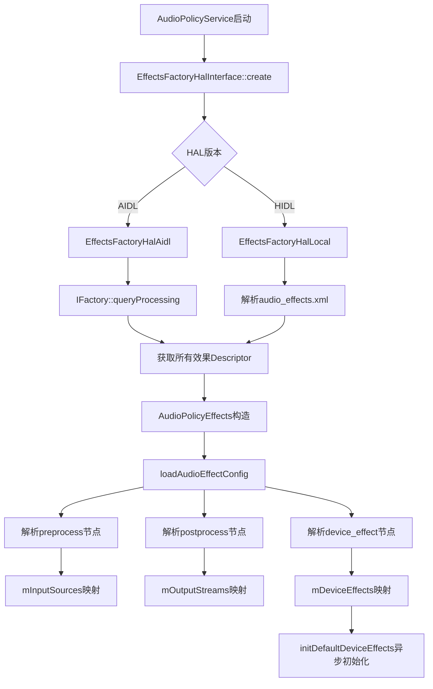
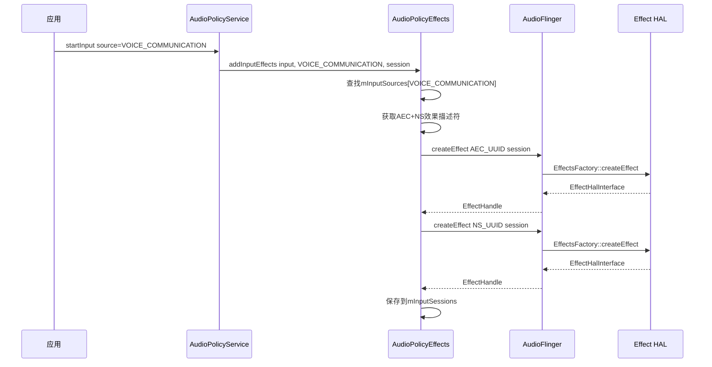
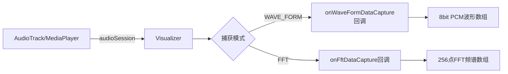
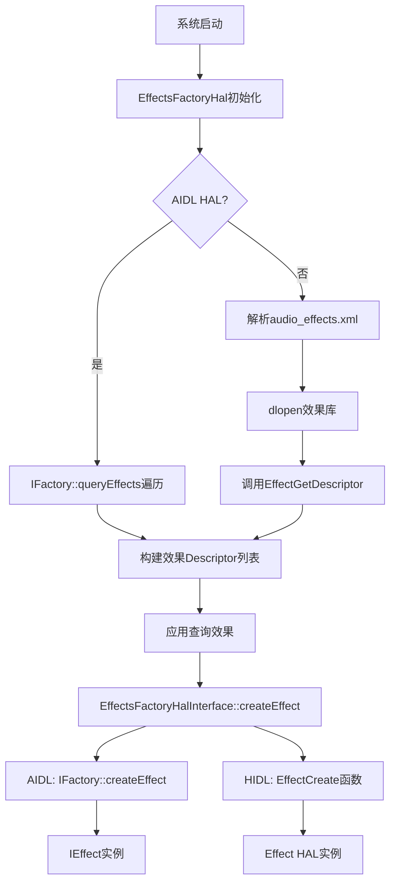
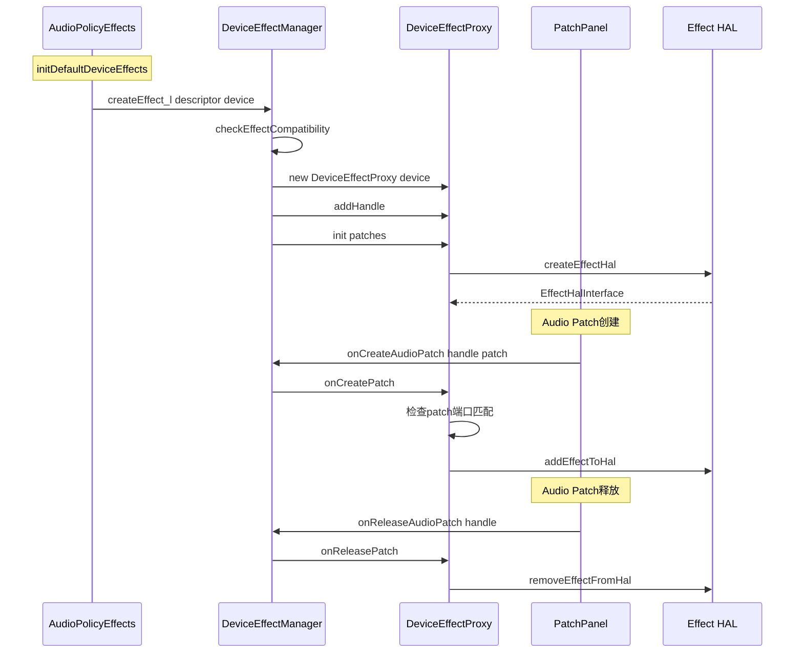
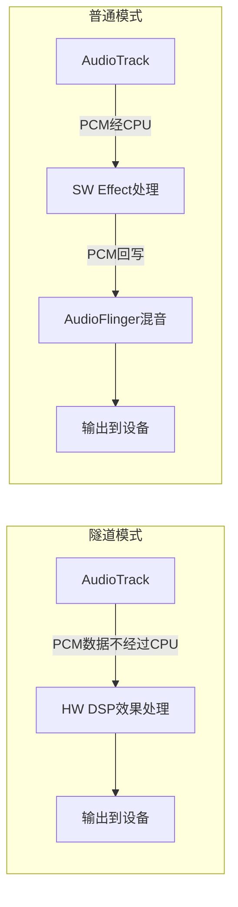
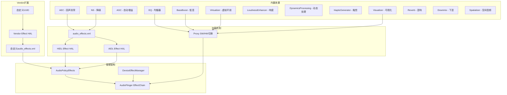

[← 7.8 常见音效类型完整列表与参数](07_7.8_常见音效类型完整列表与参数.md) | [← 返回Effects Framework](README.md) | [返回导航](../README.md) | [7.10 EffectHandle →](07_7.10_EffectHandle.md)

---

## 7.9 内置效果与Vendor效果

### 模块定位

Android音频效果分为两大阵营：**内置效果**(Built-in Effects)和**Vendor效果**(Vendor Effects)。两者的本质区别在于：

| 维度 | 内置效果 | Vendor效果 |
|------|----------|------------|
| 定义位置 | AOSP源码树，Type UUID由系统统一定义 | 厂商自定义，实现UUID由厂商分配 |
| 接口规范 | Java API公开类(如AcousticEchoCanceler) | 无公开Java类，通过AudioEffect通用接口 |
| 加载方式 | audio_effects.xml中声明 + AIDL HAL | audio_effects.xml中声明 + Effect HAL |
| 效果类型 | EFFECT_FLAG_TYPE_PRE_PROC / INSERT / AUX / POST_PROC | 任意flag组合 |
| 控制权 | 系统可自动附加(AudioPolicyEffects) | 通常由应用显式创建 |

源码层次关系：

```
┌─────────────────────────────────────────────────────────────┐
│                    Java API Layer                            │
│  AcousticEchoCanceler  NoiseSuppressor  AutomaticGainControl│
│  Equalizer  BassBoost  Virtualizer  DynamicsProcessing       │
│  HapticGenerator  LoudnessEnhancer  Visualizer              │
└──────────────────────┬──────────────────────────────────────┘
                       │ AudioEffect JNI
┌──────────────────────▼──────────────────────────────────────┐
│                Native Framework Layer                        │
│  EffectsFactoryHalInterface ──> EffectHalInterface           │
│  AudioPolicyEffects ──> 自动附加预处理/后处理效果            │
│  DeviceEffectManager ──> 设备级效果管理                      │
└──────────────────────┬──────────────────────────────────────┘
                       │ HIDL / AIDL
┌──────────────────────▼──────────────────────────────────────┐
│                    Effect HAL Layer                           │
│  libbundlewrapper.so  libreverbwrapper.so  libdynproc.so    │
│  libvisualizer.so  libdownmix.so  libldnhncr.so             │
│  libqcomvoiceprocessing.so  libeffectproxy.so  vendor.so    │
└─────────────────────────────────────────────────────────────┘
```

---

### 内置效果完整列表

AOSP 14中定义的所有内置效果Type UUID和实现UUID，源自[`Descriptor.aidl`](hardware/interfaces/audio/aidl/android/hardware/audio/effect/Descriptor.aidl:42)和[`effect_uuid.h`](system/media/audio/include/system/audio_effects/effect_uuid.h:46)：

#### 预处理效果(EFFECT_FLAG_TYPE_PRE_PROC)

| 效果名称 | Java API类 | Type UUID | SW实现UUID | 场景 |
|----------|-----------|-----------|-----------|------|
| AcousticEchoCanceler | [`AcousticEchoCanceler`](frameworks/base/media/java/android/media/audiofx/AcousticEchoCanceler.java:94) | `7b491460-8d4d-11e0-bd61-0002a5d5c51b` | `bb392ec0-8d4d-11e0-a896-0002a5d5c51b` | VoIP回声消除 |
| NoiseSuppressor | [`NoiseSuppressor`](frameworks/base/media/java/android/media/audiofx/NoiseSuppressor.java:96) | `58b4b260-8e06-11e0-aa8e-0002a5d5c51b` | `c06c8400-8e06-11e0-9cb6-0002a5d5c51b` | VoIP降噪 |
| AutomaticGainControl V1 | [`AutomaticGainControl`](frameworks/base/media/java/android/media/audiofx/AutomaticGainControl.java:94) | `0a8abfe0-654c-11e0-ba26-0002a5d5c51b` | `aa8130e0-66fc-11e0-bad0-0002a5d5c51b` | 自动增益V1 |
| AutomaticGainControl V2 | (无公开Java类) | `ae3c653b-be18-4ab8-8938-418f0a7f06ac` | `89f38e65-d4d2-4d64-ad0e-2b3e799ea886` | 自动增益V2 |

#### 插入效果(EFFECT_FLAG_TYPE_INSERT)

| 效果名称 | Java API类 | Type UUID | SW实现UUID | Bundle实现UUID | 场景 |
|----------|-----------|-----------|-----------|---------------|------|
| Equalizer | [`Equalizer`](frameworks/base/media/java/android/media/audiofx/Equalizer.java:139) | `0bed4300-ddd6-11db-8f34-0002a5d5c51b` | `0bed4300-847d-11df-bb17-0002a5d5c51b` | `ce772f20-847d-11df-bb17-0002a5d5c51b` | 频率均衡 |
| BassBoost | [`BassBoost`](frameworks/base/media/java/android/media/audiofx/AudioEffect.java:109) | `0634f220-ddd4-11db-a0fc-0002a5d5c51b` | `fa8181f2-588b-11ed-9b6a-0242ac120002` | `8631f300-72e2-11df-b57e-0002a5d5c51b` | 低音增强 |
| Virtualizer | [`Virtualizer`](frameworks/base/media/java/android/media/audiofx/AudioEffect.java:114) | `37cc2c00-dddd-11db-8577-0002a5d5c51b` | `fa819d86-588b-11ed-9b6a-0242ac120002` | `1d4033c0-8557-11df-9f2d-0002a5d5c51b` | 虚拟环绕声 |
| LoudnessEnhancer | [`LoudnessEnhancer`](frameworks/base/media/java/android/media/audiofx/AudioEffect.java:141) | `fe3199be-aed0-413f-87bb-11260eb63cf1` | `fa819610-588b-11ed-9b6a-0242ac120002` | `fa415329-2034-4bea-b5dc-5b381c8d1e2c` | 响度增强 |
| DynamicsProcessing | [`DynamicsProcessing`](frameworks/base/media/java/android/media/audiofx/DynamicsProcessing.java:90) | `7261676f-6d75-7369-6364-28e2fd3ac39e` | `fa818d78-588b-11ed-9b6a-0242ac120002` | `e0e6539b-1781-7261-676f-6d7573696340` | 多段动态处理 |
| HapticGenerator | [`HapticGenerator`](frameworks/base/media/java/android/media/audiofx/HapticGenerator.java:40) | `1411e6d6-aecd-4021-a1cf-a6aceb0d71e5` | `fa819110-588b-11ed-9b6a-0242ac120002` | `97c4acd1-8b82-4f2f-832e-c2fe5d7a9931` | 触觉振动 |
| Volume | (内部使用) | `09e8ede0-ddde-11db-b4f6-0002a5d5c51b` | `fa81a718-588b-11ed-9b6a-0242ac120002` | `119341a0-8469-11df-81f9-0002a5d5c51b` | 音量控制 |

#### 辅助效果(EFFECT_FLAG_TYPE_AUXILIARY)

| 效果名称 | Type UUID | Aux实现UUID | Insert实现UUID | 场景 |
|----------|-----------|------------|---------------|------|
| EnvironmentalReverb | `c2e5d5f0-94bd-4763-9cac-4e234d06839e` | `4a387fc0-8ab3-11df-8bad-0002a5d5c51b` | `c7a511a0-a3bb-11df-860e-0002a5d5c51b` | 环境混响 |
| PresetReverb | `47382d60-ddd8-11db-bf3a-0002a5d5c51b` | `f29a1400-a3bb-11df-8ddc-0002a5d5c51b` | `172cdf00-a3bc-11df-a72f-0002a5d5c51b` | 预设混响 |

#### 后处理效果(EFFECT_FLAG_TYPE_POST_PROC)

| 效果名称 | Type UUID | 实现UUID | 场景 |
|----------|-----------|---------|------|
| Visualizer | `e46b26a0-dddd-11db-8afd-0002a5d5c51b` | `d069d9e0-8329-11df-9168-0002a5d5c51b` | 波形/FFT可视化 |
| Downmix | `381e49cc-a858-4aa2-87f6-e8388e7601b2` | `93f04452-e4fe-41cc-91f9-e475b6d1d69f` | 多声道下混 |
| Spatializer | `ccd4cf09-a79d-46c2-9aae-06a1698d6c8f` | (由HAL实现) | 空间音频 |

#### Proxy效果映射

多个内置效果使用**Proxy模式**，一个Proxy UUID同时关联SW和HW实现：

| Proxy名称 | Proxy UUID | SW库 | HW库 |
|-----------|-----------|------|------|
| bassboost | `14804144-a5ee-4d24-aa88-0002a5d5c51b` | bundle | offload_bundle |
| virtualizer | `d3467faa-acc7-4d34-acaf-0002a5d5c51b` | bundle | offload_bundle |
| equalizer | `c8e70ecd-48ca-456e-8a4f-0002a5d5c51b` | bundle | offload_bundle |
| visualizer | `1d0a1a53-7d5d-48f2-8e71-27fbd10d842c` | visualizer_sw | visualizer_hw |
| reverb系列 | 4个不同Proxy UUID | reverb | offload_bundle |

---

### 内置效果加载机制

#### audio_effects.xml解析

效果配置文件位于`/vendor/etc/audio_effects.xml`或`/system/etc/audio_effects.conf`。AAOS车载配置示例来自[`audio_effects.xml`](device/google_car/common/audio_effects.xml:16)：

```xml
<audio_effects_conf version="2.0"
    xmlns="http://schemas.android.com/audio/audio_effects_conf/v2_0">
    <libraries>
        <library name="bundle" path="libbundlewrapper.so"/>
        <library name="reverb" path="libreverbwrapper.so"/>
        <library name="visualizer_sw" path="libvisualizer.so"/>
        <library name="dynamics_processing" path="libdynproc.so"/>
        <library name="loudness_enhancer" path="libldnhncr.so"/>
        <library name="proxy" path="libeffectproxy.so"/>
        <library name="audio_pre_processing" path="libqcomvoiceprocessing.so"/>
    </libraries>
    <effects>
        <effectProxy name="bassboost" library="proxy"
            uuid="14804144-a5ee-4d24-aa88-0002a5d5c51b">
            <libsw library="bundle"
                uuid="8631f300-72e2-11df-b57e-0002a5d5c51b"/>
            <libhw library="offload_bundle"
                uuid="2c4a8c24-1581-487f-94f6-0002a5d5c51b"/>
        </effectProxy>
        <!-- ... more effects ... -->
    </effects>
</audio_effects_conf>
```

配置加载流程根据HAL版本分两条路径，源码位于[`AudioPolicyEffects.cpp`](frameworks/av/services/audiopolicy/service/AudioPolicyEffects.cpp:44)：

```cpp
AudioPolicyEffects::AudioPolicyEffects(
        const sp<EffectsFactoryHalInterface>& effectsFactoryHal) {
    status_t loadResult = loadAudioEffectConfig(effectsFactoryHal);
    if (loadResult == NO_ERROR) {
        // AIDL路径: 成功加载
        mDefaultDeviceEffectFuture = std::async(
            std::launch::async,
            &AudioPolicyEffects::initDefaultDeviceEffects, this);
    } else if (loadResult < 0) {
        // HIDL路径: 回退到.conf文件
        if (access(AUDIO_EFFECT_VENDOR_CONFIG_FILE, R_OK) == 0) {
            loadAudioEffectConfigLegacy(AUDIO_EFFECT_VENDOR_CONFIG_FILE);
        } else if (access(AUDIO_EFFECT_DEFAULT_CONFIG_FILE, R_OK) == 0) {
            loadAudioEffectConfigLegacy(AUDIO_EFFECT_DEFAULT_CONFIG_FILE);
        }
    }
}
```

#### EffectsFactoryHal加载流程



#### EffectFactory创建效果实例

[`EffectsFactoryHalInterface`](frameworks/av/media/libaudiohal/include/media/audiohal/EffectsFactoryHalInterface.h:31)定义了创建效果实例的核心接口：

```cpp
class EffectsFactoryHalInterface : public RefBase {
    // 查询效果数量
    virtual status_t queryNumberEffects(uint32_t *pNumEffects) = 0;
    // 按索引/UUID获取描述符
    virtual status_t getDescriptor(uint32_t index, effect_descriptor_t* pDescriptor) = 0;
    virtual status_t getDescriptor(const effect_uuid_t* pEffectUuid,
                                   effect_descriptor_t* pDescriptor) = 0;
    // 按Type UUID获取所有实现描述符
    virtual status_t getDescriptors(const effect_uuid_t *pEffectType,
                                    std::vector<effect_descriptor_t> *descriptors) = 0;
    // 创建效果引擎实例
    virtual status_t createEffect(const effect_uuid_t* pEffectUuid,
                                  int32_t sessionId, int32_t ioId,
                                  int32_t deviceId, sp<EffectHalInterface>* effect) = 0;
};
```

创建效果实例的关键步骤：
1. 应用调用`AudioEffect(IntPtr)` → JNI → `AudioSystem::createEffect()`
2. AudioFlinger收到请求 → `EffectsFactoryHalInterface::createEffect(uuid, session, io, device)`
3. AIDL路径：通过`IFactory::createEffect()`创建AIDL Effect实例
4. HIDL路径：通过dlopen加载对应.so → 调用`EffectCreate()`

---

### 预处理效果详解 — AEC/NS/AGC

#### 自动附加机制

预处理效果(AEC/NS/AGC)的核心特征是**系统自动附加**，无需应用显式创建。其配置在audio_effects.xml的`<preprocess>`节点中声明：

```xml
<!-- AAOS车载配置 -->
<preprocess>
    <stream type="voice_communication">
        <apply effect="aec"/>
        <apply effect="ns"/>
    </stream>
</preprocess>
```

自动附加由[`AudioPolicyEffects::addInputEffects()`](frameworks/av/services/audiopolicy/service/AudioPolicyEffects.cpp:92)实现：

```cpp
status_t AudioPolicyEffects::addInputEffects(
        audio_io_handle_t input,
        audio_source_t inputSource,
        audio_session_t audioSession) {
    // HOTWORD源映射为VOICE_RECOGNITION
    audio_source_t aliasSource = (inputSource == AUDIO_SOURCE_HOTWORD) ?
                                    AUDIO_SOURCE_VOICE_RECOGNITION : inputSource;
    // 查找该AudioSource对应的效果列表
    ssize_t index = mInputSources.indexOfKey(aliasSource);
    if (index < 0) {
        // 无需附加效果
        return status;
    }
    // 创建效果并附加到输入流
    // ...省略创建逻辑...
}
```

关键映射关系来自[`loadInputEffectConfigurations()`](frameworks/av/services/audiopolicy/service/AudioPolicyEffects.cpp:821)：

```
AudioSource              →  自动附加效果
───────────────────────────────────────────
VOICE_COMMUNICATION      →  AEC + NS
VOICE_RECOGNITION        →  (可配置)
CAMCORDER                →  (可配置)
```

#### AEC — AcousticEchoCanceler

AEC Type UUID: `7b491460-8d4d-11e0-bd61-0002a5d5c51b`，定义于[`effect_aec.h`](system/media/audio/include/system/audio_effects/effect_aec.h:28)：

```cpp
static const effect_uuid_t FX_IID_AEC_ =
    { 0x7b491460, 0x8d4d, 0x11e0, 0xbd61,
      { 0x00, 0x02, 0xa5, 0xd5, 0xc5, 0x1b } };

typedef enum {
    AEC_PARAM_ECHO_DELAY,       // 回声延迟(微秒)
    AEC_PARAM_PROPERTIES,
    AEC_PARAM_MOBILE_MODE,      // 移动模式(非WEBRTC_LEGACY)
} t_aec_params;
```

Java层通过[`AcousticEchoCanceler`](frameworks/base/media/java/android/media/audiofx/AcousticEchoCanceler.java:94)创建，内部调用`super(EFFECT_TYPE_AEC, EFFECT_TYPE_NULL, 0, audioSession)`。

#### NS — NoiseSuppressor

NS Type UUID: `58b4b260-8e06-11e0-aa8e-0002a5d5c51b`，定义于[`effect_ns.h`](system/media/audio/include/system/audio_effects/effect_ns.h:28)：

```cpp
static const effect_uuid_t FX_IID_NS_ =
    { 0x58b4b260, 0x8e06, 0x11e0, 0xaa8e,
      { 0x00, 0x02, 0xa5, 0xd5, 0xc5, 0x1b } };

typedef enum {
    NS_PARAM_LEVEL,         // 降噪等级
    NS_PARAM_PROPERTIES,
    NS_PARAM_TYPE           // 降噪类型
} t_ns_params;
```

#### AGC — AutomaticGainControl

AGC V1 Type UUID: `0a8abfe0-654c-11e0-ba26-0002a5d5c51b`，定义于[`effect_agc.h`](system/media/audio/include/system/audio_effects/effect_agc.h:28)：

```cpp
static const effect_uuid_t FX_IID_AGC_ =
    { 0x0a8abfe0, 0x654c, 0x11e0, 0xba26,
      { 0x00, 0x02, 0xa5, 0xd5, 0xc5, 0x1b } };

typedef enum {
    AGC_PARAM_TARGET_LEVEL,   // 目标输出电平(mB)
    AGC_PARAM_COMP_GAIN,      // 压缩范围增益(mB)
    AGC_PARAM_LIMITER_ENA,    // 限幅器开关
    AGC_PARAM_PROPERTIES
} t_agc_params;
```

AGC V2 Type UUID: `ae3c653b-be18-4ab8-8938-418f0a7f06ac`，AOSP 14新增，提供更精细的增益控制。

#### 预处理效果自动附加时序



---

### 插入/辅助内置效果 — EQ/BassBoost/Virtualizer/Reverb

#### Bundle效果 — libbundlewrapper.so

EQ、BassBoost、Virtualizer共享同一个SW实现库`libbundlewrapper.so`，但使用不同的实现UUID。三者通常通过Proxy模式组合，由`libeffectproxy.so`在SW和HW实现间切换。

Proxy工作机制(以BassBoost为例)：

```
应用创建 AudioEffect(EFFECT_TYPE_BASS_BOOST, EFFECT_TYPE_NULL, ...)
    ↓
AudioFlinger查找Proxy UUID = 14804144-a5ee-4d24-aa88-0002a5d5c51b
    ↓
根据当前输出路由选择:
    ├─ Offload路径 → libhw uuid=2c4a8c24-1581-487f-94f6-0002a5d5c51b
    └─ SW路径      → libsw uuid=8631f300-72e2-11df-b57e-0002a5d5c51b
```

#### Reverb效果 — 双模式(Insert/Auxiliary)

Reverb效果的特殊之处在于每种Reverb同时提供两种实现：
- **Aux模式**(EFFECT_FLAG_TYPE_AUXILIARY)：效果输入来自辅助总线，需要额外增益控制
- **Insert模式**(EFFECT_FLAG_TYPE_INSERT)：效果串联在音频路径中

这在audio_effects.xml中体现为4个Proxy声明：

| 名称 | 模式 | Aux UUID | Insert UUID |
|------|------|----------|-------------|
| reverb_env_aux | Environmental + Aux | `4a387fc0-8ab3-11df-8bad-0002a5d5c51b` | — |
| reverb_env_ins | Environmental + Insert | — | `c7a511a0-a3bb-11df-860e-0002a5d5c51b` |
| reverb_pre_aux | Preset + Aux | `f29a1400-a3bb-11df-8ddc-0002a5d5c51b` | — |
| reverb_pre_ins | Preset + Insert | — | `172cdf00-a3bc-11df-a72f-0002a5d5c51b` |

#### 后处理效果自动附加

后处理效果通过`<postprocess>`节点配置，AAOS车载配置示例：

```xml
<postprocess>
    <stream type="music">
        <apply effect="music_helper"/>
    </stream>
    <stream type="voice_call">
        <apply effect="voice_helper"/>
    </stream>
</postprocess>
```

`music_helper`等是Qualcomm的volume_listener效果，用于监听音量变化并通知DSP。

---

### DynamicsProcessing详解

[`DynamicsProcessing`](frameworks/base/media/java/android/media/audiofx/DynamicsProcessing.java:90)是AOSP中功能最复杂的内置效果，提供完整的多段动态处理信号链。

#### 信号链架构

```
Input → [Input Gain] → [Pre-EQ] → [MBC] → [Post-EQ] → [Limiter] → Output
                         多段EQ     多段压缩    多段EQ      限幅
```

定义于[`effect_dynamicsprocessing.h`](system/media/audio/include/system/audio_effects/effect_dynamicsprocessing.h:33)的参数枚举：

```cpp
typedef enum {
    DP_PARAM_GET_CHANNEL_COUNT = 0x10,
    DP_PARAM_INPUT_GAIN        = 0x20,
    DP_PARAM_ENGINE_ARCHITECTURE = 0x30,
    DP_PARAM_PRE_EQ            = 0x40,
    DP_PARAM_PRE_EQ_BAND       = 0x45,
    DP_PARAM_MBC               = 0x50,
    DP_PARAM_MBC_BAND          = 0x55,
    DP_PARAM_POST_EQ           = 0x60,
    DP_PARAM_POST_EQ_BAND      = 0x65,
    DP_PARAM_LIMITER           = 0x70,
} t_dynamicsprocessing_params;

typedef enum {
    VARIANT_FAVOR_FREQUENCY_RESOLUTION = 0x00,
    VARIANT_FAVOR_TIME_RESOLUTION      = 0x01,
} t_dynamicsprocessing_variants;
```

#### Java API层级结构

[`DynamicsProcessing`](frameworks/base/media/java/android/media/audiofx/DynamicsProcessing.java:90)类包含丰富的内部类来描述信号链各级配置：

| 内部类 | 对应信号链级 | 关键参数 |
|--------|------------|---------|
| `Eq` | Pre-EQ / Post-EQ | 频段数、截止频率、增益 |
| `Mbc` | 多段压缩 | 频段数、攻击/释放时间、阈值 |
| `MbcBand` | Mbc单个频段 | 噪声门、压缩比、扩展器 |
| `Limiter` | 限幅器 | 阈值、 Knee宽度、攻击/释放 |
| `Channel` | 单通道全部参数 | 包含上述所有级的配置 |

构造函数(3种重载)：

```java
// 最简构造
public DynamicsProcessing(int audioSession)

// 指定优先级
public DynamicsProcessing(int priority, int audioSession)

// 指定优先级+完整配置
public DynamicsProcessing(int priority, int audioSession, @Nullable Config cfg)
```

#### DynamicsProcessing在AAOS中的应用

车载场景中DynamicsProcessing常用于：
- **多区域音频调校**：不同乘客区域的EQ和动态范围定制
- **道路噪声补偿**：MBC频段可对特定频段做增益补偿
- **扬声器保护**：Limiter防止过驱动车载扬声器
- **广播级音频处理**：Pre-EQ → MBC → Post-EQ → Limiter全链路

---

### HapticGenerator详解

[`HapticGenerator`](frameworks/base/media/java/android/media/audiofx/HapticGenerator.java:40)是Android 12引入的效果，将音频信号转换为触觉振动信号。

#### 触觉振动生成机制

定义于[`effect_hapticgenerator.h`](system/media/audio/include/system/audio_effects/effect_hapticgenerator.h:33)：

```cpp
static const effect_uuid_t FX_IID_HAPTICGENERATOR_ =
    { 0x1411e6d6, 0xaecd, 0x4021, 0xa1cf,
      { 0xa6, 0xac, 0xeb, 0x0d, 0x71, 0xe5 } };

typedef enum {
    HG_PARAM_HAPTIC_INTENSITY,  // 触觉强度
    HG_PARAM_VIBRATOR_INFO,     // 振动器信息(谐振频率、Q因子)
} t_hapticgenerator_params;
```

工作原理：
1. HapticGenerator分析音频信号的低频成分
2. 根据振动器谐振频率(HG_PARAM_VIBRATOR_INFO)生成匹配的振动波形
3. 通过HG_PARAM_HAPTIC_INTENSITY控制振动强度
4. 生成的触觉信号与原始音频同步播放

Java API使用方式：

```java
if (HapticGenerator.isAvailable()) {
    HapticGenerator hg = HapticGenerator.create(audioSession);
    // 内部自动创建Volume效果保证效果链中音量控制正常
}
```

HapticGenerator构造函数内部会额外创建一个Volume效果，确保效果链中的音量控制始终由Volume效果处理。

---

### Visualizer详解

[`Visualizer`](frameworks/base/media/java/android/media/audiofx/Visualizer.java:74)不属于`AudioEffect`子类，而是独立的native实现，但内部复用了效果框架的创建和附加机制。

#### 波形/FFT捕获机制

Visualizer提供两种捕获模式：

| 模式 | 常量 | 描述 |
|------|------|------|
| 波形 | `VISUALIZATION_MODE_WAVE_FORM` | PCM波形数据，8位量化 |
| FFT | `VISUALIZATION_MODE_FFT_EMO` | 256点FFT频谱数据 |



关键约束：
- 附加到session 0(output mix)需要`android.permission.RECORD_AUDIO`权限
- 采样率范围：5ms~20ms(由`setCaptureSize`和采样率决定)
- 一个session只能有一个Visualizer
- 内部使用Proxy模式(SW: `libvisualizer.so`, HW: `libqcomvisualizer.so`)

---

### Vendor效果开发指南

#### Effect HAL接口实现

Vendor效果需实现Effect HAL接口，AOSP 14支持两种HAL版本：

| 版本 | 接口定义 | 推荐场景 |
|------|---------|---------|
| AIDL (推荐) | `android.hardware.audio.effect.IFactory` | 新项目 |
| HIDL (旧) | `android.hardware.audio.effect@7.x` | 兼容项目 |

AIDL Effect HAL核心接口：

```java
// IFactory.aidl
interface IFactory {
    Descriptor.Identity queryEffect(in AudioUuid type, in AudioUuid impl);
    IEffect createEffect(in AudioUuid uuid, in int sessionId, in int ioId, in int deviceId);
    void destroyEffect(in IEffect effect);
    List<Descriptor.IdEffect> queryProcessing(in AudioProcessingType type);
}
```

#### audio_effects.xml声明

Vendor效果必须在audio_effects.xml中声明才能被系统发现：

```xml
<audio_effects_conf version="2.0">
    <libraries>
        <!-- 步骤1: 声明效果库 -->
        <library name="custom_dsp_lib" path="libcustomfx.so"/>
    </libraries>
    <effects>
        <!-- 步骤2: 声明效果(非Proxy) -->
        <effect name="custom_dsp_effect"
                library="custom_dsp_lib"
                uuid="xxxxxxxx-xxxx-xxxx-xxxx-xxxxxxxxxxxx"/>
        <!-- 步骤2b: 或声明Proxy效果 -->
        <effectProxy name="custom_surround"
                     library="proxy"
                     uuid="yyyyyyyy-yyyy-yyyy-yyyy-yyyyyyyyyyyy">
            <libsw library="custom_dsp_lib"
                   uuid="zzzzzzzz-zzzz-zzzz-zzzz-zzzzzzzzzzzz"/>
            <libhw library="hw_accel_lib"
                   uuid="wwwwwwww-wwww-wwww-wwww-wwwwwwwwwwww"/>
        </effectProxy>
    </effects>
</audio_effects_conf>
```

#### Vendor效果加载流程



---

### audio_effect_policy策略配置

> 注意：AOSP 14中，audio_effect_policy.xml的概念已被AIDL HAL的`queryProcessing()`替代，但HIDL路径仍使用audio_effects.xml中的`<preprocess>`/`<postprocess>`节点实现效果策略。

#### AIDL HAL的策略机制

AIDL路径下，效果策略由[`EffectsFactoryHalInterface::getProcessings()`](frameworks/av/media/libaudiohal/include/media/audiohal/EffectsFactoryHalInterface.h:46)提供：

```cpp
// 获取预处理/后处理/设备效果策略配置
virtual std::shared_ptr<const effectsConfig::Processings> getProcessings() const = 0;
```

AIDL HAL通过`IFactory::queryProcessing(AudioProcessingType)`返回不同类型的效果策略：

| AudioProcessingType | 含义 | 等价于XML节点 |
|---------------------|------|--------------|
| PRE_PROC | 输入预处理 | `<preprocess>` |
| POST_PROC | 输出后处理 | `<postprocess>` |
| DEVICE | 设备效果 | `<device_effect>` |

#### HIDL路径的preprocess/postprocess策略

在[`loadInputEffectConfigurations()`](frameworks/av/services/audiopolicy/service/AudioPolicyEffects.cpp:821)和[`loadStreamEffectConfigurations()`](frameworks/av/services/audiopolicy/service/AudioPolicyEffects.cpp:848)中解析XML策略：

```cpp
// 加载预处理策略 → mInputSources映射
status_t AudioPolicyEffects::loadInputEffectConfigurations(
        cnode *root, const Vector<EffectDesc *>& effects) {
    cnode *node = config_find(root, PREPROCESSING_TAG);
    // 遍历子节点，将AudioSource映射到效果列表
    while (node) {
        audio_source_t source = inputSourceNameToEnum(node->name);
        EffectDescVector *desc = loadEffectConfig(node, effects);
        mInputSources.add(source, desc);
        node = node->next;
    }
}

// 加载后处理策略 → mOutputStreams映射
status_t AudioPolicyEffects::loadStreamEffectConfigurations(
        cnode *root, const Vector<EffectDesc *>& effects) {
    cnode *node = config_find(root, OUTPUT_SESSION_PROCESSING_TAG);
    // 遍历子节点，将StreamType映射到效果列表
    while (node) {
        audio_stream_type_t stream = streamNameToEnum(node->name);
        EffectDescVector *desc = loadEffectConfig(node, effects);
        mOutputStreams.add(stream, desc);
        node = node->next;
    }
}
```

---

### Device Effect架构 — DeviceEffectManager

Device Effect是AOSP 14中引入的重要机制，允许将效果附加到**音频设备端口**而非session/track，实现跨应用的一致音频处理。

#### 核心数据结构

[`DeviceEffectManager`](frameworks/av/services/audioflinger/DeviceEffectManager.h:23)定义于AudioFlinger内部：

```cpp
class DeviceEffectManager : public PatchCommandThread::PatchCommandListener {
public:
    explicit DeviceEffectManager(AudioFlinger& audioFlinger);

    // 创建设备级效果
    sp<EffectHandle> createEffect_l(effect_descriptor_t *descriptor,
                const AudioDeviceTypeAddr& device,
                const sp<Client>& client,
                const sp<IEffectClient>& effectClient,
                const std::map<audio_patch_handle_t, PatchPanel::Patch>& patches,
                int *enabled, status_t *status,
                bool probe, bool notifyFramesProcessed);

    size_t removeEffect(const sp<DeviceEffectProxy>& effect);
    void onCreateAudioPatch(audio_patch_handle_t handle,
                            const PatchPanel::Patch& patch) override;
    void onReleaseAudioPatch(audio_patch_handle_t handle) override;

private:
    Mutex mLock;
    AudioFlinger &mAudioFlinger;
    const sp<DeviceEffectManagerCallback> mMyCallback;
    // 核心：设备 → 效果代理的映射
    std::map<AudioDeviceTypeAddr, sp<DeviceEffectProxy>> mDeviceEffects;
};
```

[`DeviceEffectProxy`](frameworks/av/services/audioflinger/Effects.h:709)继承自`EffectBase`，是设备级效果的核心代理：

```cpp
class DeviceEffectProxy : public EffectBase {
public:
    DeviceEffectProxy(const AudioDeviceTypeAddr& device,
            const sp<DeviceEffectManagerCallback>& callback,
            effect_descriptor_t *desc, int id, bool notifyFramesProcessed)
        : EffectBase(callback, desc, id, AUDIO_SESSION_DEVICE, false),
          mDevice(device), mManagerCallback(callback),
          mMyCallback(new ProxyCallback(wp<DeviceEffectProxy>(this), callback)),
          mNotifyFramesProcessed(notifyFramesProcessed) {}

    status_t init(const std::map<audio_patch_handle_t,
                               PatchPanel::Patch>& patches);
    status_t onCreatePatch(audio_patch_handle_t patchHandle,
                          const PatchPanel::Patch& patch);
    void onReleasePatch(audio_patch_handle_t patchHandle);
    const AudioDeviceTypeAddr& device() { return mDevice; };

private:
    AudioDeviceTypeAddr mDevice;
    // ProxyCallback代理回调和HAL交互
    const sp<ProxyCallback> mMyCallback;
};
```

#### checkEffectCompatibility — 设备效果类型校验

[`checkEffectCompatibility()`](frameworks/av/services/audioflinger/DeviceEffectManager.cpp:113)确保只有PRE_PROC或POST_PROC类型效果可附加到设备：

```cpp
status_t AudioFlinger::DeviceEffectManager::checkEffectCompatibility(
        const effect_descriptor_t *desc) {
    static const AudioHalVersionInfo sMinDeviceEffectHalVersion =
            AudioHalVersionInfo(AudioHalVersionInfo::Type::HIDL, 6, 0);
    static const AudioHalVersionInfo halVersion =
            audioflinger::EffectConfiguration::getAudioHalVersionInfo();

    // 必须是PRE_PROC或POST_PROC类型，且HAL版本 >= 6.0
    if (((desc->flags & EFFECT_FLAG_TYPE_MASK) != EFFECT_FLAG_TYPE_PRE_PROC
            && (desc->flags & EFFECT_FLAG_TYPE_MASK) != EFFECT_FLAG_TYPE_POST_PROC)
            || halVersion < sMinDeviceEffectHalVersion) {
        ALOGW("non pre/post processing device effect %s or incompatible API version",
                desc->name);
        return BAD_VALUE;
    }
    return NO_ERROR;
}
```

#### Device Effect生命周期



#### 默认设备效果初始化

[`initDefaultDeviceEffects()`](frameworks/av/services/audiopolicy/service/AudioPolicyEffects.cpp:984)在AudioPolicyEffects构造时异步执行：

```cpp
void AudioPolicyEffects::initDefaultDeviceEffects() {
    Mutex::Autolock _l(mLock);
    for (const auto& deviceEffectsIter : mDeviceEffects) {
        const auto& deviceEffects = deviceEffectsIter.second;
        for (const auto& effectDesc : deviceEffects->mEffectDescriptors->mEffects) {
            AttributionSourceState attributionSource;
            attributionSource.packageName = "android";
            attributionSource.token = sp<BBinder>::make();
            sp<AudioEffect> fx = new AudioEffect(attributionSource);
            fx->set(EFFECT_UUID_NULL, &effectDesc->mUuid,
                    0 /* priority */, nullptr /* callback */,
                    AUDIO_SESSION_DEVICE, AUDIO_IO_HANDLE_NONE,
                    AudioDeviceTypeAddr{deviceEffects->getDeviceType(),
                                        deviceEffects->getDeviceAddress()});
            status_t status = fx->initCheck();
            if (status != NO_ERROR && status != ALREADY_EXISTS) {
                ALOGE("failed to create Fx %s on port type=%d address=%s",
                      effectDesc->mName, deviceEffects->getDeviceType(),
                      deviceEffects->getDeviceAddress().c_str());
                continue;
            }
            fx->setEnabled(true);
            deviceEffects->mEffects.push_back(fx);
        }
    }
}
```

关键点：
- 使用`AUDIO_SESSION_DEVICE`(特殊session ID)标识设备级效果
- `AUDIO_IO_HANDLE_NONE`表示不绑定特定IO线程
- 以`"android"`包名创建，表示系统级效果
- 异步初始化(`std::async`)避免阻塞AudioPolicyService启动

---

### EffectBase核心方法 — 效果控制与策略同步

#### addHandle — 效果句柄优先级管理

[`EffectBase::addHandle()`](frameworks/av/services/audioflinger/Effects.cpp:200)按优先级插入EffectHandle到mHandles列表：

```cpp
status_t AudioFlinger::EffectBase::addHandle(EffectHandle *handle) {
    Mutex::Autolock _l(mLock);
    int priority = handle->priority();
    size_t size = mHandles.size();
    EffectHandle *controlHandle = NULL;

    // 遍历找到插入位置(优先级降序排列)
    for (i = 0; i < size; i++) {
        EffectHandle *h = mHandles[i];
        if (h == NULL || h->disconnected()) continue;
        if (controlHandle == NULL) controlHandle = h; // 第一个有效handle
        if (h->priority() <= priority) break;         // 找到插入点
    }

    // 插入到首位时转移控制权
    if (i == 0) {
        bool enabled = false;
        if (controlHandle != NULL) {
            enabled = controlHandle->enabled();
            controlHandle->setControl(false, true, enabled);
        }
        handle->setControl(true, false, enabled);
        status = NO_ERROR;
    } else {
        status = ALREADY_EXISTS;
    }
    mHandles.insertAt(handle, i);
    return status;
}
```

优先级规则：
- `i == 0`：新handle优先级最高，获得控制权
- 旧控制handle的enabled状态转移给新handle
- 返回`NO_ERROR`表示获得控制权，`ALREADY_EXISTS`表示非控制handle

#### setEnabled — 效果启用状态机

[`EffectBase::setEnabled_l()`](frameworks/av/services/audioflinger/Effects.cpp:110)实现效果启用的状态机：

```
状态转换图:

  IDLE ←──setEnabled(false)── STARTING
   │                              │
   │ setEnabled(true)             │ setEnabled(true)
   ↓                              ↓
  STARTING ──setEnabled(true)──→ ACTIVE
                                 │
                                 │ setEnabled(false)
                                 ↓
                               STOPPING
                                 │
                                 │ setEnabled(false)
                                 ↓
                               STOPPED
                                 │
                                 │ setEnabled(true)
                                 ↓
                               RESTART
```

核心状态值与[`isEnabled()`](frameworks/av/services/audioflinger/Effects.cpp:172)判断：

```cpp
bool AudioFlinger::EffectBase::isEnabled() const {
    switch (mState) {
    case RESTART:    // 重启中 → 已启用
    case STARTING:   // 启动中 → 已启用
    case ACTIVE:     // 活跃   → 已启用
        return true;
    case IDLE:       // 空闲
    case STOPPING:   // 停止中
    case STOPPED:    // 已停止
    case DESTROYED:  // 已销毁
    default:
        return false;
    }
}
```

[`setEnabled()`](frameworks/av/services/audioflinger/Effects.cpp:151)外部接口负责通知回调：

```cpp
status_t AudioFlinger::EffectBase::setEnabled(bool enabled, bool fromHandle) {
    status_t status;
    {
        Mutex::Autolock _l(mLock);
        status = setEnabled_l(enabled);
    }
    if (fromHandle) {
        if (enabled) {
            if (status != NO_ERROR) {
                getCallback()->checkSuspendOnEffectEnabled(this, false, false);
            } else {
                getCallback()->onEffectEnable(this);
            }
        } else {
            getCallback()->onEffectDisable(this);
        }
    }
    return status;
}
```

#### updatePolicyState — 策略状态同步

[`updatePolicyState()`](frameworks/av/services/audioflinger/Effects.cpp:239)将效果状态同步到AudioPolicyService：

```cpp
status_t AudioFlinger::EffectBase::updatePolicyState() {
    status_t status = NO_ERROR;
    bool doRegister = false, registered = false;
    bool doEnable = false, enabled = false;
    audio_io_handle_t io = AUDIO_IO_HANDLE_NONE;
    product_strategy_t strategy = PRODUCT_STRATEGY_NONE;

    {
        Mutex::Autolock _l(mLock);
        // 内部效果且未注册则跳过
        if ((isInternal_l() && !mPolicyRegistered)
                || !getCallback()->isAudioPolicyReady())
            return NO_ERROR;

        // 首次handle附加 → 注册效果; 最后handle移除 → 取消注册
        if (mPolicyRegistered != mHandles.size() > 0) {
            doRegister = true;
            mPolicyRegistered = mHandles.size() > 0;
            if (mPolicyRegistered) {
                io = getCallback()->io();
                strategy = getCallback()->strategy();
            }
        }
        // 控制handle的enabled状态变化 → 通知策略
        if (mHandles.size() > 0) {
            EffectHandle *handle = controlHandle_l();
            if (handle != nullptr && mPolicyEnabled != handle->enabled()) {
                doEnable = true;
                mPolicyEnabled = handle->enabled();
            }
        }
    }

    // 在mPolicyLock下执行跨进程调用
    mPolicyLock.lock();
    if (doRegister) {
        if (registered) {
            status = AudioSystem::registerEffect(
                &mDescriptor, io, strategy, mSessionId, mId);
        } else {
            status = AudioSystem::unregisterEffect(mId);
        }
    }
    if (registered && doEnable) {
        status = AudioSystem::setEffectEnabled(mId, enabled);
    }
    mPolicyLock.unlock();
    return status;
}
```

核心逻辑：
1. **注册/取消注册**：第一个handle附加时注册效果到AudioPolicyService，最后一个handle移除时取消注册
2. **启用/禁用通知**：控制handle的enabled状态变化时通知AudioPolicyService
3. **死锁规避**：使用独立的mPolicyLock避免与mLock死锁(b/180941720)

---

### HW加速隧道效果 — EFFECT_FLAG_HW_ACC_TUNNEL

效果flag定义于[`audio_effect-base.h`](system/media/audio/include/system/audio_effect-base.h:12)，其中HW加速相关flag：

| Flag | 值 | 含义 |
|------|---|------|
| EFFECT_FLAG_HW_ACC_SIMPLE | 0x10000 | 简单HW加速，仍由框架控制 |
| EFFECT_FLAG_HW_ACC_TUNNEL | 0x20000 | 隧道模式，效果完全在DSP执行 |

EFFECT_FLAG_HW_ACC_TUNNEL的意义：



隧道模式效果的关键约束：
- 效果参数仍通过Effect HAL接口控制
- 音频数据不经过CPU侧AudioFlinger
- 适用于offload播放路径(如Qualcomm的`libqcompostprocbundle.so`)
- Proxy效果中`<libhw>`对应的实现通常携带此flag

flag完整位域布局：

```
bits [2:0]   TYPE      : INSERT=0, AUX=1, REPLACE=2, PRE_PROC=3, POST_PROC=4
bits [5:3]   INSERT    : ANY=0, FIRST=1, LAST=2, EXCLUSIVE=3
bits [8:6]   VOLUME    : NONE=0, CTRL=1, IND=2, MONITOR=3
bits [11:9]  DEVICE    : NONE=0, IND=1
bits [13:12] INPUT     : DIRECT=1, PROVIDER=2, BOTH=3
bits [15:14] OUTPUT    : DIRECT=1, PROVIDER=2, BOTH=3
bits [17:16] HW_ACC    : SIMPLE=1, TUNNEL=2
bits [19:18] AUDIO_MODE: NONE=0, IND=1
bits [21:20] AUDIO_SRC : NONE=0, IND=1
bits [22]    OFFLOAD   : SUPPORTED=1
bits [23]    NO_PROCESS: 1=仅监控不处理
```

---

### OEM定制点完整列表

#### 1. 自定义效果库 — Effect HAL实现

| 定制点 | 文件 | 说明 |
|--------|------|------|
| 效果库实现 | `vendor/hal/audio/effect/` | 实现AIDL IEffect接口 |
| 效果声明 | `audio_effects.xml` | 声明library和effect |
| UUID分配 | 厂商自定义 | Type UUID可复用系统或自定义 |

#### 2. 效果策略配置 — audio_effects.xml

| 配置节点 | 控制对象 | 示例 |
|---------|---------|------|
| `<preprocess>` | 输入效果自动附加 | AEC/NS绑定VOICE_COMMUNICATION |
| `<postprocess>` | 输出效果自动附加 | volume_listener绑定music/ring |
| `<device_effect>` | 设备级效果 | 特定设备的后处理 |

#### 3. 预处理效果绑定

```xml
<!-- 为VoIP场景绑定AEC+NS+AGC -->
<preprocess>
    <stream type="voice_communication">
        <apply effect="aec"/>
        <apply effect="ns"/>
        <apply effect="agc"/>  <!-- 可选 -->
    </stream>
</preprocess>
```

#### 4. Proxy效果 — SW/HW双实现

OEM可注册自己的HW加速库，替换默认SW实现：

```xml
<effectProxy name="equalizer" library="proxy"
    uuid="c8e70ecd-48ca-456e-8a4f-0002a5d5c51b">
    <libsw library="bundle" uuid="ce772f20-847d-11df-bb17-0002a5d5c51b"/>
    <!-- OEM替换HW实现 -->
    <libhw library="custom_hw_eq" uuid="oem-uuid-for-hw-eq"/>
</effectProxy>
```

#### 5. 设备效果策略 — Device Effect

```xml
<!-- 为特定设备附加效果 -->
<deviceEffect>
    <device type="AUDIO_DEVICE_OUT_BUS" address="bus0_media">
        <apply effect="dynamics_processing"/>
    </device>
    <device type="AUDIO_DEVICE_OUT_SPEAKER">
        <apply effect="custom_speaker_protection"/>
    </device>
</deviceEffect>
```

#### 6. AIDL Effect HAL定制

| 接口 | 方法 | 定制内容 |
|------|------|---------|
| `IFactory` | `queryProcessing()` | 定义效果策略(替代XML) |
| `IFactory` | `createEffect()` | 效果实例创建 |
| `IEffect` | `command()` | 效果参数配置 |
| `IEffect` | `setState()` | 效果启停控制 |

#### 7. AAOS车载专用定制

| 定制点 | 场景 | 推荐效果 |
|--------|------|---------|
| 多区域EQ | 不同乘客区域音频调校 | DynamicsProcessing |
| 扬声器保护 | 防止过驱动 | DynamicsProcessing.Limiter |
| 道路噪声补偿 | 动态增益调整 | DynamicsProcessing.MBC |
| VoIP通话质量 | 回声消除+降噪 | AEC + NS |
| 触觉反馈 | 音频耦合振动 | HapticGenerator |
| 广播音频处理 | 多段压缩+限幅 | DynamicsProcessing全链路 |
| DSP隧道效果 | 低功耗音频处理 | EFFECT_FLAG_HW_ACC_TUNNEL |

---

### 总结



**核心要点回顾：**

1. **内置效果16种**：4个预处理(AEC/NS/AGC1/AGC2)、7个插入(EQ/BassBoost/Virtualizer/LE/DP/HG/Volume)、2个辅助(EnvReverb/PresetReverb)、3个后处理(Visualizer/Downmix/Spatializer)
2. **Proxy机制**：EQ/BassBoost/Virtualizer/Visualizer/Reverb支持SW/HW双实现自动切换
3. **预处理自动附加**：AudioPolicyEffects通过mInputSources映射自动为VOICE_COMMUNICATION附加AEC+NS
4. **Device Effect**：DeviceEffectManager管理设备级效果，需HAL版本≥6.0，仅支持PRE_PROC/POST_PROC类型
5. **策略状态同步**：EffectBase::updatePolicyState()通过AudioSystem::registerEffect/setEffectEnabled与AudioPolicyService同步
6. **Vendor扩展**：实现AIDL IEffect接口 + audio_effects.xml声明，可自定义Type UUID或复用系统Type UUID
7. **HW隧道**：EFFECT_FLAG_HW_ACC_TUNNEL让效果完全在DSP执行，音频数据不经过CPU

---

[← 7.8 常见音效类型完整列表与参数](07_7.8_常见音效类型完整列表与参数.md) | [← 返回Effects Framework](README.md) | [返回导航](../README.md) | [7.10 EffectHandle →](07_7.10_EffectHandle.md)

