# 第八篇：HAL Layer

> [← 上一篇：Effects Framework](07_Effects_Framework.md) | [返回导航](README.md) | [下一篇：AAOS Car Audio →](09_AAOS_Car_Audio.md)

---

## 8.1 Audio HAL双轨架构

### 设计背景
Android 8.0引入Treble项目，将HAL从系统框架中分离。Audio HAL有两种接口：

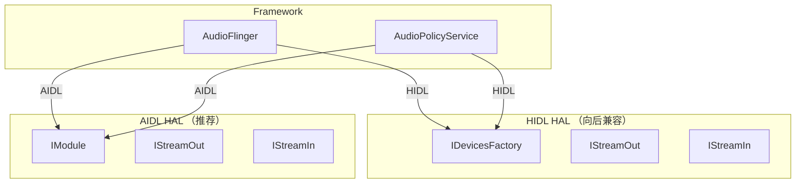

### HIDL vs AIDL对比

| 维度 | HIDL | AIDL |
|------|------|------|
| 引入版本 | Android 8.0 | Android 12 |
| 版本范围 | 2.0 ~ 7.1 | 1.0 |
| 入口接口 | IDevicesFactory | IModule |
| 传输层 | HWBinder | Binder |
| 性能 | 较低 | 较高 |
| 扩展性 | 需要新版本接口 | 稳定API+扩展 |
| 状态 | 维护模式 | **推荐** |

### AIDL HAL核心接口 — [`IModule`](hardware/interfaces/audio/aidl/android/hardware/audio/core/IModule.aidl:61)

IModule是AIDL Audio HAL的入口，代表一个音频模块。一个设备可以有多个Module(primary/a2dp/usb等)。

#### IModule核心方法分类

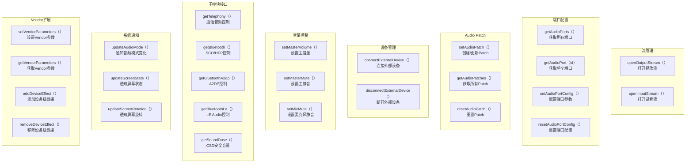

#### IModule.openOutputStream()详解

```mermaid
sequenceDiagram
    participant AF, APM, HAL
    APM->>APM: getOutputForAttrInt()→确定输出设备
    APM->>APM: setAudioPortConfig()→配置MixPort
    APM->>APM: setAudioPatch()→建立MixPort↔DevicePort连接
    APM->>HAL: IModule.openOutputStream(args)
    Note over HAL: args: portConfigId, sourceMetadata,<br>offloadInfo?, bufferSizeFrames,<br>callback?, eventCallback?
    HAL->>HAL: 检查portConfigId有效性
    HAL->>HAL: 分配DMA buffer(>=bufferSizeFrames)
    HAL-->>APM: 返回IStreamOut + StreamDescriptor
    Note over APM: StreamDescriptor包含:<br>frameCount, buffer, audioFd(MMAP)
```

**OpenOutputStreamArguments关键字段**:

| 字段 | 类型 | 说明 |
|------|------|------|
| `portConfigId` | int | MixPort配置ID(由setAudioPortConfig生成) |
| `sourceMetadata` | SourceMetadata | 播放源描述(usage/contentType/capturePreset) |
| `offloadInfo` | AudioOffloadInfo? | Offload模式必须提供(编码格式/采样率等) |
| `bufferSizeFrames` | long | 请求的最小buffer大小(帧数) |
| `callback` | IStreamCallback? | NON_BLOCKING模式必须提供(异步通知) |
| `eventCallback` | IStreamOutEventCallback? | 可选的事件回调(如Offload drain完成) |

#### IModule.connectExternalDevice()详解

```mermaid
sequenceDiagram
    participant AF, APM, HAL, HW
    HW->>APM: 设备连接事件(BT/USB/HDMI)
    APM->>HAL: IModule.connectExternalDevice(templatePort)
    Note over HAL: templatePort含portId+额外数据<br>(如地址/EDID/ExtraAudioDescriptor)
    HAL->>HW: 查询设备支持的音频能力
    HW-->>HAL: 支持的profiles(采样率/格式/通道)
    HAL->>HAL: 生成新的connected port实例
    HAL->>HAL: 更新AudioRoutes(包含新端口)
    HAL-->>APM: 返回新AudioPort(含完整profiles)
    APM->>APM: setAudioPortConfig()→配置connected port
    APM->>APM: setAudioPatch()→建立路由连接
```

> **关键设计**: AIDL HAL使用`connectExternalDevice()`动态创建设备端口，而非在XML中静态定义所有设备。HIDL HAL则需要在`audio_policy_configuration.xml`中预定义。

#### StreamDescriptor — AIDL流描述符

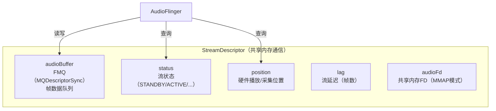

**StreamDescriptor状态转换**:

| 状态 | 说明 | 触发 |
|------|------|------|
| STANDBY | 待机(刚open) | openOutputStream() |
| ACTIVE | 活跃(正在传输) | IStreamOut.start() |
| DRAINING | 排水中(Offload) | drain命令 |
| DRAINING_AND_STANDBY | 排水后待机 | drain+自动standby |
| PAUSED | 暂停 | IStreamOut.pause() |
| TRANSFERRING | 传输中(可读/写) | 有数据流动 |

---

## 8.2 StreamOut/StreamIn — 音频数据流

### StreamOut接口（播放方向）

| 方法 | HIDL | AIDL | 说明 |
|------|------|------|------|
| write | `write()` | `write()` | 写入PCM/压缩数据 |
| start | `start()` | `start()` | 开始播放 |
| stop | `stop()` | `stop()` | 停止播放 |
| standby | `standby()` | `standby()` | 进入待机 |
| getPresentationPosition | `getPresentationPosition()` | `getHardwareTimestamp()` | 获取播放位置 |
| setVolume | `setVolume()` | `setVolume()` | 设置音量(dB) |
| setParameters | `setParameters()` | — | 设置键值对参数(HIDL) |

### StreamIn接口（采集方向）

| 方法 | 说明 |
|------|------|
| `read()` | 读取PCM数据 |
| `start()` | 开始采集 |
| `stop()` | 停止采集 |
| `getCapturePosition()` | 获取采集位置 |

### HAL → AudioFlinger数据流

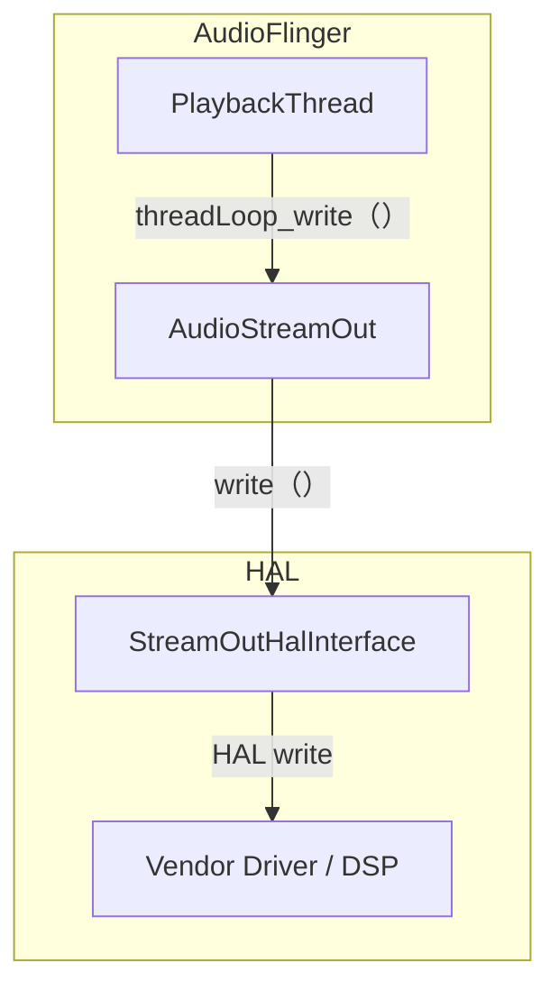

---

## 8.3 Audio Patch — 硬件路由

### 模块职责
Audio Patch允许音频数据在HAL内部直接路由，不需要经过AudioFlinger软件桥。

### Patch创建流程

```mermaid
sequenceDiagram
    participant APM, AF, PP, HAL
    APM->>AF: createAudioPatch(sources, sinks)
    AF->>PP: PatchPanel.createAudioPatch()
    PP->>PP: 检查是否需要软件桥
    PP->>|硬件Patch| HAL: IDevice.createAudioPatch()
    PP->>|软件Patch| PP: 创建RecordThread+PlaybackThread桥接
    HAL-->>PP: patchHandle
    PP-->>AF: 成功/失败
```

### 硬件Patch vs 软件Patch

| 维度 | 硬件Patch | 软件Patch |
|------|-----------|-----------|
| 路径 | HAL内部DSP直接路由 | 经过AudioFlinger CPU处理 |
| 延迟 | 极低 | 较高 |
| 功耗 | 低 | 高 |
| 场景 | FM→Speaker, BT_HFP→Speaker | 跨HAL模块路由 |
| 条件 | HAL支持 | 通用 |

---

## 8.4 Audio Port — 音频端口模型

### 端口类型

| 类型 | 说明 | 示例 |
|------|------|------|
| DEVICE | 物理设备端口 | speaker, headset, mic |
| MIX | 软件混音端口 | PlaybackThread的输出, RecordThread的输入 |
| SESSION | 效果会话端口 | EffectChain的输入/输出 |

### 端口配置

AudioPortConfig描述端口的当前配置：
- 采样率
- 格式（PCM_16bit, PCM_FLOAT, COMPRESSED等）
- 通道掩码（STEREO, MONO, 5.1等）
- 设备类型+地址

---

## 8.5 HAL参数机制

### setParameters / getParameters

HIDL HAL通过键值对传递非标准参数：
```
"routing=2"           // 路由到设备2
"bt_samplerate=16000" // 蓝牙SCO采样率
"screen_state=on"     // 屏幕状态
"A2dpSuspended=true"  // A2DP挂起
```

**为什么用键值对？** 不同Vendor有不同参数需求，键值对比固定接口更灵活。但AIDL HAL正在逐步用类型化接口替代键值对。

---

## 8.6 Vendor实现要点

### 多HAL模块配置

典型设备有多个Audio HAL模块：

| 模块 | 职责 | 实现位置 |
|------|------|----------|
| primary | 主音频(扬声器/耳机/麦克风) | `audio.primary.xxx.so` |
| a2dp | 蓝牙A2DP音频 | `audio.a2dp.xxx.so` |
| usb | USB音频 | `audio.usb.xxx.so` |
| remote_submix | 投屏混音 | `audio.r_submix.xxx.so` |
| bluetooth | 蓝牙LE Audio | `audio.bluetooth.xxx.so` |

在`audio_policy_configuration.xml`中声明：
```xml
<hal>
    <module name="primary" halVersion="2.0">
        <devicePorts>
            <devicePort tagName="Speaker" type="AUDIO_DEVICE_OUT_SPEAKER"/>
        </devicePorts>
        <mixPorts>
            <mixPort name="primary_output" role="source">
                <profile format="AUDIO_FORMAT_PCM_16_BIT" samplingRates="48000" channelMasks="AUDIO_CHANNEL_OUT_STEREO"/>
            </mixPort>
        </mixPorts>
    </module>
</hal>
```

---

## 8.7 AudioGain — HAL增益控制模型

[`audio_gain`](system/media/audio/include/system/audio.h:551)描述AudioPort上的硬件增益能力，是Volume全栈的硬件层基础。

### 8.7.1 Gain模式

| 模式 | 值 | 说明 |
|------|-----|------|
| `AUDIO_GAIN_MODE_JOINT` | 1 | 所有通道统一增益(最常见) |
| `AUDIO_GAIN_MODE_CHANNELS` | 2 | 每通道独立增益(多声道功放) |
| `AUDIO_GAIN_MODE_RAMP` | 4 | 渐变增益(防止爆音，支持ramp时长) |

模式可组合：`JOINT|RAMP` = 所有通道统一渐变增益。

### 8.7.2 audio_gain结构体

| 字段 | 类型 | 说明 |
|------|------|------|
| `mode` | `audio_gain_mode_t` | 支持的增益模式组合 |
| `channel_mask` | `audio_channel_mask_t` | 可控增益的通道(CHANNELS模式时有效) |
| `min_value` | `int` | 最小增益(毫贝，-8400mB = -84dB) |
| `max_value` | `int` | 最大增益(毫贝，4000mB = +40dB) |
| `default_value` | `int` | 默认增益(毫贝，0mB = 0dB) |
| `step_value` | `unsigned int` | 增益步进(毫贝) |
| `min_ramp_ms` | `unsigned int` | 最小渐变时长(RAMP模式) |
| `max_ramp_ms` | `unsigned int` | 最大渐变时长(RAMP模式) |

### 8.7.3 配置示例 — audio_policy_configuration.xml

```xml
<devicePort tagName="Speaker" type="AUDIO_DEVICE_OUT_SPEAKER" role="sink">
    <gains>
        <gain name="gain_1" mode="AUDIO_GAIN_MODE_JOINT"
              minValueMB="-8400" maxValueMB="4000"
              defaultValueMB="0" stepValueMB="100"/>
    </gains>
</devicePort>
```

> **useForVolume属性**: 当`useForVolume="true"`时，AudioPolicyManager将使用`setPortGain()`替代`setStreamVolume()`来控制音量——即直接设置硬件增益而非软件乘法。这是DirectOutput/Offload路径零拷贝音量控制的基础。

### 8.7.4 Gain与Volume的关系

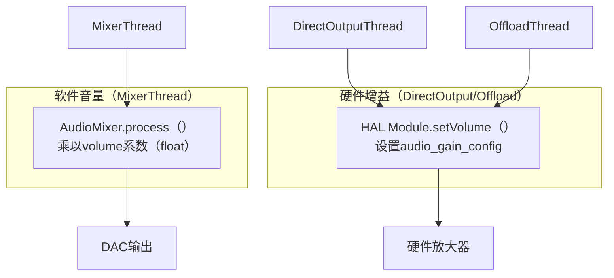

| 维度 | 软件音量 | 硬件增益 |
|------|---------|---------|
| 实现层 | AudioMixer乘法 | HAL setPortGain/setVolume |
| 数据路径 | 修改PCM采样值 | 不修改PCM，控制放大器 |
| 精度 | float(高精度) | 毫贝步进(步进值) |
| 适用 | MixerThread | DirectOutput/Offload |
| 动态范围 | 受限于位深 | 取决于放大器硬件 |
| 渐变 | VolumeShaper | RAMP模式(min/max_ramp_ms) |

> **关键交互**: 当`useForVolume=true`时，13章Volume全栈的音量调节最终调用`AudioSystem.setPortConfig()`设置硬件增益，而非软件乘法。这保证了Offload路径(压缩音频)不修改PCM数据即可控制音量。

---

## 8.8 IModule AIDL接口 — HAL核心入口深度解析

> **源码路径**: [`IModule.aidl`](hardware/interfaces/audio/aidl/android/hardware/audio/core/IModule.aidl)
> 
> > **IModule核心方法分类**已在8.1节详细展开，本节聚焦**生命周期管理**与**Vendor实现要点**。

IModule是AIDL Audio HAL的核心入口接口，替代了HIDL时代的`IDevicesFactory`。每个IModule实例对应一个独立的音频模块（如主DSP、USB音频模块、远程Submix模块等），整个系统可包含多个IModule实例。

### IModule vs HIDL IDevicesFactory对比

| 维度 | IModule (AIDL) | IDevicesFactory (HIDL) |
|------|---------------|----------------------|
| 接口范式 | 单一模块入口，子接口通过getter获取 | 工厂模式，按设备类型创建 |
| 流管理 | openInputStream/openOutputStream返回StreamDescriptor | openDevice打开整个设备 |
| 路由模型 | setAudioPatch显式路由，支持多源多目的 | 隐式路由通过setDeviceConnectionState |
| 端口配置 | setAudioPortConfig细粒度控制采样率/格式 | 配置嵌入在流参数中 |
| 设备连接 | connectExternalDevice动态创建端口 | setDeviceConnectionState声明式 |
| 音效挂载 | addDeviceEffect设备级音效 | 无直接支持 |
| 声剂量 | getSoundDose()获取专用接口 | 无支持 |
| 电话音频 | getTelephony()获取专用接口 | 无支持 |
| Binder稳定性 | @VintfStability，跨版本稳定 | HIDL稳定性保证 |
| 扩展性 | VendorParameter + 子接口getter | 扩展需修改接口定义 |

### IModule生命周期

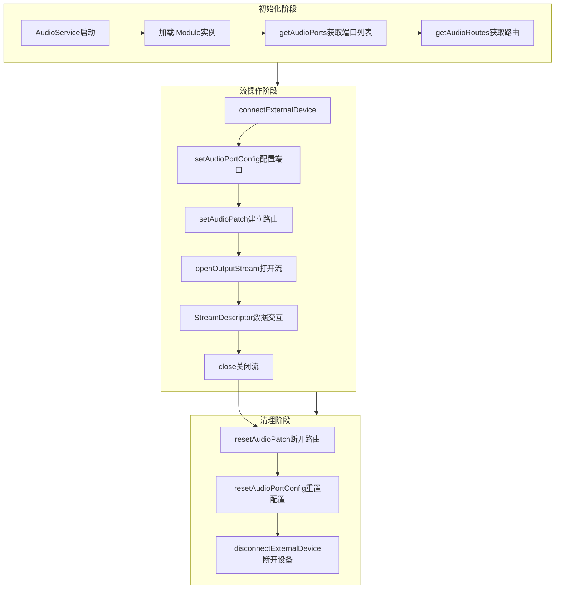

> **关键交互**: IModule的`openOutputStream`返回`StreamDescriptor`，这是AIDL HAL的核心数据交换机制。StreamDescriptor使用共享内存（FMQ）进行音频数据传输，替代了HIDL的`write()/read()`回调模式，大幅降低了延迟。详见8.5节StreamDescriptor分析。

---

## 8.9 ISoundDose AIDL接口 — 声剂量HAL接口

> **源码路径**: [`ISoundDose.aidl`](hardware/interfaces/audio/aidl/android/hardware/audio/core/sounddose/ISoundDose.aidl)

ISoundDose是AIDL HAL的声剂量（Sound Dose）接口，用于IEC 62368-1第3版标准合规的硬件级MEL（Momentary Exposure Level）计算。对于实现了音频Offload解码或直通播放路径（音量控制在Audio HAL之下）的设备，必须实现此接口。

### ISoundDose关键方法

| 方法 | 功能说明 | 参数/返回值 |
|------|---------|------------|
| `setOutputRs2UpperBound(rs2ValueDbA)` | 设置RS2上限阈值，超过此值触发警告 | rs2ValueDbA: 80-100 dBA范围; EX_ILLEGAL_ARGUMENT: 越界 |
| `getOutputRs2UpperBound()` | 获取当前RS2上限值 | 返回float dBA值 |
| `registerSoundDoseCallback(callback)` | 注册HAL声剂量回调，禁用Framework内部MEL计算 | IHalSoundDoseCallback; EX_ILLEGAL_STATE: 重复注册 |

> **常量定义**: `DEFAULT_MAX_RS2 = 100`（dBA，IEC标准默认值），`MIN_RS2 = 80`（dBA，RS2最低阈值）。

### IHalSoundDoseCallback回调接口

ISoundDose的回调嵌套定义在ISoundDose内部，采用`oneway`异步通知模式：

| 回调方法 | 触发条件 | 参数说明 |
|---------|---------|---------|
| `onMomentaryExposureWarning(currentDbA, audioDevice)` | 当前MEL值超过RS2上限 | currentDbA: 瞬时dBA值; audioDevice: 触发设备 |
| `onNewMelValues(melRecord, audioDevice)` | 连续MEL值上报（用于CSD计算） | MelRecord: {melValues数组 + timestamp}; 每秒一条 |

**MelRecord结构**: `melValues`为float数组（每秒一个>=MIN_RS2的MEL值），`timestamp`为CLOCK_MONOTONIC秒数，相同timestamp值会被聚合。

### HAL vs Framework CSD双路径

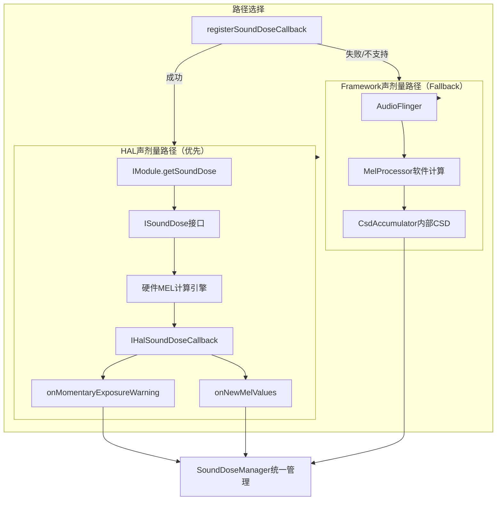

> **关键交互**: 当ISoundDose可用且`registerSoundDoseCallback`成功时，Framework的`MelProcessor`内部MEL计算被**禁用**，所有声剂量数据由HAL通过回调提供。这是"HAL优先"设计——Offload路径中音量控制在HAL之下，Framework无法准确计算MEL，必须依赖硬件。若HAL不支持声剂量，则回退到Framework软件计算路径。

---

## 8.10 ITelephony AIDL接口 — 电话音频HAL

> **源码路径**: [`ITelephony.aidl`](hardware/interfaces/audio/aidl/android/hardware/audio/core/ITelephony.aidl)

ITelephony是AIDL HAL的电话音频管理接口，管理通话模式下的音频配置。仅当设备支持电话功能时才需实现，通过`IModule.getTelephony()`获取实例。

### ITelephony关键方法

| 方法 | 功能说明 | 参数/返回值 |
|------|---------|------------|
| `getSupportedAudioModes()` | 返回支持的音频模式列表 | AudioMode数组; 必含NORMAL/RINGTONE/IN_CALL/IN_COMMUNICATION |
| `switchAudioMode(mode)` | 切换HAL到指定音频模式 | AudioMode; EX_UNSUPPORTED_OPERATION: 不支持的模式 |
| `setTelecomConfig(config)` | 设置电话音频配置（音量/TTY/HAC等） | TelecomConfig; 返回更新后的完整配置 |

### TelecomConfig配置结构

| 字段 | 类型 | 说明 |
|------|------|------|
| `voiceVolume` | @nullable Float | 通话音量，0.0f静音，1.0f满音量 |
| `ttyMode` | TtyMode enum | TTY模式: OFF/FULL/HCO/VCO |
| `isHacEnabled` | @nullable Boolean | Hearing Aid Compatibility - Telecoil是否启用 |

> **常量**: `VOICE_VOLUME_MIN = 0`，`VOICE_VOLUME_MAX = 1`。

### ITelephony与AudioManager.setMode交互

ITelephony与Framework的电话模式切换存在协同关系：

| 步骤 | Framework侧 | HAL侧 |
|------|-------------|--------|
| 1 | App调用`AudioManager.setMode(IN_CALL)` | — |
| 2 | `AudioPolicyManager.setPhoneState(IN_CALL)` | — |
| 3 | AudioPolicyManager路由切换到通话设备 | — |
| 4 | `IModule.updateAudioMode(IN_CALL)` 通知所有模块 | HAL模块接收模式通知 |
| 5 | 针对电话模块: `ITelephony.switchAudioMode(IN_CALL)` | HAL切换内部音频路径 |
| 6 | `ITelephony.setTelecomConfig(voiceVolume)` | HAL设置通话音量 |

> **设计原则**: `updateAudioMode`是广播式通知，发送给**所有**IModule实例；`switchAudioMode`是定向命令，仅发送给**电话模块**的ITelephony实例。两者必须协同执行：先switchAudioMode成功，再updateAudioMode广播。

### 电话模式音频路由流程

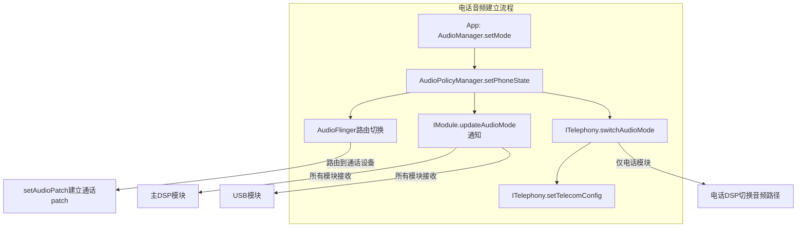

> **关键交互**: ITelephony的`setTelecomConfig`中`voiceVolume`独立于IModule的`setMasterVolume`。通话音量由ITelephony专门管理，而IModule.setMasterVolume的注释明确指出"for modules supporting telephony, the attenuation of the voice call volume is set separately via ITelephony interface"。这种分离设计确保通话音量不受媒体音量影响——在车载场景中尤为重要（9章CarAudio详述）。

---

## 8.11 libaudiohal — HAL适配层架构深度解析

> **源码路径**: [`frameworks/av/media/libaudiohal/`](frameworks/av/media/libaudiohal/)

libaudiohal是Android音频框架中连接AudioFlinger/AudioPolicyService与HAL实现的**统一适配层**。其核心职责是为上层提供与HAL版本无关的C++抽象接口，屏蔽HIDL与AIDL的差异，使AudioFlinger无需关心底层是HIDL 4.0还是AIDL 1.0的HAL服务。

### 8.11.1 libaudiohal架构总览

libaudiohal的类层次设计遵循**工厂模式 + 接口隔离**原则，每一层HAL抽象都有对应的Interface基类和AIDL/HIDL两种实现：

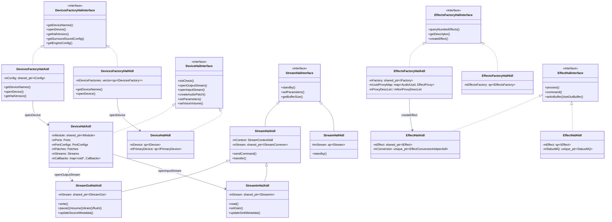

**关键设计原则**：

| 设计原则 | 体现 |
|---------|------|
| 统一抽象 | 所有Interface基类定义在`include/media/audiohal/`，与HAL版本无关 |
| 工厂模式 | DevicesFactoryHal/EffectsFactoryHal负责创建具体Device/Effect实例 |
| 运行时多态 | 上层只持有Interface指针，AIDL/HIDL实现在运行时确定 |
| 共享库隔离 | 每个HAL版本对应独立`.so`，通过dlopen动态加载 |

---

### 8.11.2 FactoryHal — HAL版本发现与加载

> **源码路径**: [`FactoryHal.cpp`](frameworks/av/media/libaudiohal/FactoryHal.cpp)

FactoryHal是libaudiohal的**入口调度器**，负责发现系统中可用的HAL版本并加载对应的共享库。

#### 版本优先级与接口映射

| 数据结构 | 内容 |
|---------|------|
| `sAudioHALVersions` | HAL版本优先级数组，从新到旧排列 |
| `sDevicesHALInterfaces` | 设备接口映射：AIDL→`android.hardware.audio.core.IModule`，HIDL→`android.hardware.audio.IDevicesFactory` |
| `sEffectsHALInterfaces` | 效果接口映射：AIDL→`android.hardware.audio.effect.IFactory`，HIDL→`android.hardware.audio.effect.IEffectsFactory` |

**`sAudioHALVersions` 优先级**（从高到低）：

| 优先级 | HAL类型 | 版本 |
|-------|--------|------|
| 1 | AIDL | 1.0 |
| 2 | HIDL | 7.1 |
| 3 | HIDL | 7.0 |
| 4 | HIDL | 6.0 |
| 5 | HIDL | 5.0 |
| 6 | HIDL | 4.0 |

> **注意**: AOSP14源码中AIDL版本默认被注释掉（`// TODO: remove this comment to get AIDL`），OEM需要显式启用AIDL HAL支持。

#### HAL服务检测机制

| 检测方式 | 函数 | 实现原理 |
|---------|------|---------|
| AIDL检测 | `hasAidlHalService()` | 调用`AServiceManager_isDeclared()`检查服务是否注册 |
| HIDL检测 | `hasHidlHalService()` | 通过`hwservicemanager`查询transport类型，不为EMPTY即存在 |

#### createPreferredImpl() 核心流程

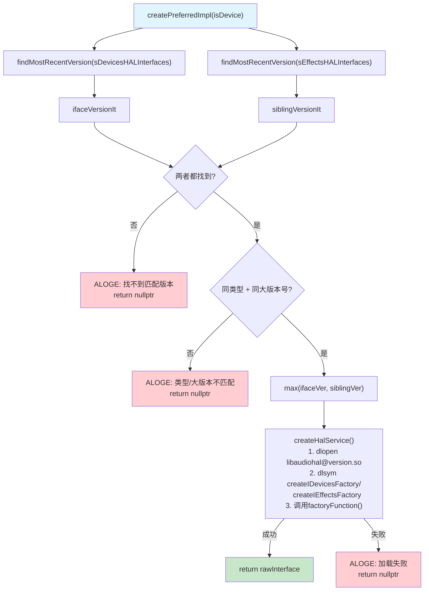

**关键约束 — "同类型同大版本号"原则**：`createPreferredImpl()`要求设备HAL和效果HAL必须属于**同一类型**（同为AIDL或同为HIDL）且**同一大版本号**。这确保了系统的一致性——不会出现设备用AIDL而效果用HIDL的混合配置。

**共享库命名规则**：

| HAL版本 | 共享库名 | 入口函数(设备) | 入口函数(效果) |
|---------|---------|--------------|--------------|
| AIDL 1.0 | `libaudiohal@aidl-1.so` | `createIDevicesFactory` | `createIEffectsFactory` |
| HIDL 7.1 | `libaudiohal@7.1.so` | `createIDevicesFactory` | `createIEffectsFactory` |
| HIDL 7.0 | `libaudiohal@7.0.so` | `createIDevicesFactory` | `createIEffectsFactory` |
| HIDL 6.0 | `libaudiohal@6.0.so` | `createIDevicesFactory` | `createIEffectsFactory` |

---

### 8.11.3 DevicesFactoryHalAidl — AIDL设备工厂

> **源码路径**: [`DevicesFactoryHalAidl.cpp`](frameworks/av/media/libaudiohal/impl/DevicesFactoryHalAidl.cpp) / [`.h`](frameworks/av/media/libaudiohal/impl/DevicesFactoryHalAidl.h)

DevicesFactoryHalAidl是AIDL HAL的设备工厂实现，持有`IConfig` AIDL服务引用，负责枚举和打开音频模块。

#### 构造与初始化

```
DevicesFactoryHalAidl(config: shared_ptr<IConfig>)
```

构造函数接收从`createIDevicesFactoryImpl()`入口函数传入的`IConfig`服务。`IConfig`是AIDL音频核心配置接口，提供全局配置信息。

#### getDeviceNames() — 模块枚举

```
AServiceManager_forEachDeclaredInstance(IModule::descriptor, ...)
```

遍历所有已注册的`IModule`实例。**关键重映射**：`"default"` → `"primary"`，保持与遗留HIDL命名（primary/stub/usb等）的兼容性。

#### openDevice() — 打开音频模块

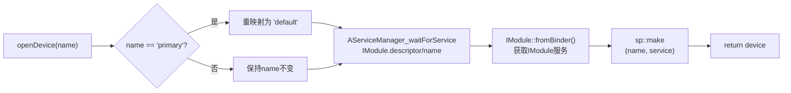

**重要细节**：如果服务不存在，`DeviceHalAidl`仍然会被创建（service为nullptr），不会崩溃但功能不可用——这种"优雅降级"设计确保了框架不会因为HAL缺失而崩溃。

#### getHalVersion() — 版本获取

通过`IConfig.getInterfaceVersion()`获取AIDL接口版本号。AIDL没有minor版本号，因此minor始终为0。

#### createIDevicesFactoryImpl() — 共享库入口

```cpp
extern "C" __attribute__((visibility("default"))) void* createIDevicesFactoryImpl() {
    auto serviceName = std::string(IConfig::descriptor) + "/default";
    auto service = IConfig::fromBinder(
            ndk::SpAIBinder(AServiceManager_waitForService(serviceName.c_str())));
    return new DevicesFactoryHalAidl(service);
}
```

这是`libaudiohal@aidl-1.so`的导出入口，由FactoryHal通过`dlsym`获取并调用。它**阻塞等待**`IConfig/default`服务就绪后再返回。

---

### 8.11.4 DeviceHalAidl — AIDL设备适配层

> **源码路径**: [`DeviceHalAidl.h`](frameworks/av/media/libaudiohal/impl/DeviceHalAidl.h) / [`.cpp`](frameworks/av/media/libaudiohal/impl/DeviceHalAidl.cpp)

DeviceHalAidl是libaudiohal中**最复杂的类**，继承自四个基类：

```
DeviceHalAidl : DeviceHalInterface + ConversionHelperAidl + CallbackBroker + MicrophoneInfoProvider
```

#### 核心数据结构

| 成员 | 类型 | 说明 |
|------|------|------|
| `mModule` | `shared_ptr<IModule>` | 核心AIDL接口，所有端口/patch操作通过它 |
| `mTelephony` | `shared_ptr<ITelephony>` | 电话子接口（通过`retrieveSubInterface`获取） |
| `mBluetooth` | `shared_ptr<IBluetooth>` | 蓝牙子接口 |
| `mBluetoothA2dp` | `shared_ptr<IBluetoothA2dp>` | A2DP子接口 |
| `mBluetoothLe` | `shared_ptr<IBluetoothLe>` | BLE Audio子接口 |
| `mPorts` | `map<int32_t, AudioPort>` | 所有音频端口缓存 |
| `mPortConfigs` | `map<int32_t, AudioPortConfig>` | 端口配置缓存 |
| `mPatches` | `map<int32_t, AudioPatch>` | 音频Patch缓存 |
| `mRoutes` | `vector<AudioRoute>` | 音频路由 |
| `mRoutingMatrix` | `set<pair<int32_t,int32_t>>` | 端口可达性矩阵 |
| `mStreams` | `map<wp<StreamHalInterface>, int32_t>` | 活跃流→PatchId映射 |
| `mCallbacks` | `map<void*, Callbacks>` | 回调映射，cookie为stream指针 |
| `mMicrophones` | `Microphones` | 惰性查询的麦克风信息 |

#### initCheck() — 初始化流程

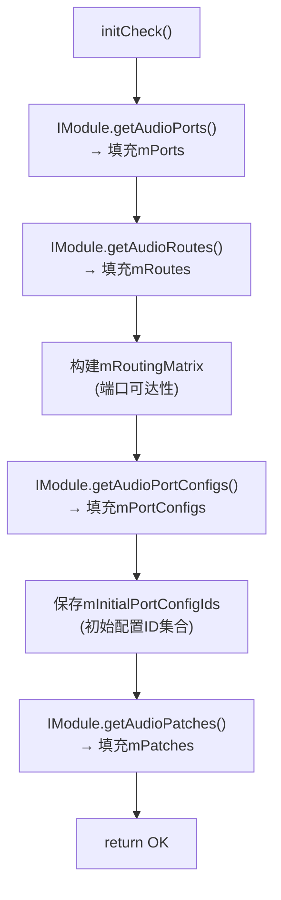

initCheck()从IModule获取所有端口、路由、配置和Patch信息，构建内部缓存。这些缓存是后续`openOutputStream`/`createAudioPatch`等操作的基础。

#### openOutputStream() — 打开输出流

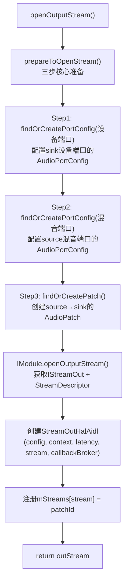

**prepareToOpenStream()是核心辅助方法**，它完成"设备端口配置 + 混音端口配置 + Patch创建"三步操作。每一步都可能创建新的portConfig/patch（`findOrCreate*`系列方法），失败时通过Cleanups机制自动回滚。

#### CallbackBroker — 回调桥接

CallbackBroker解决了一个**时序不匹配**问题：AIDL要求回调在`openOutputStream`时提前注册，而libaudiohal接口允许延迟注册（`setCallback`）。

| AIDL回调 | 桥接到 | 说明 |
|----------|--------|------|
| `IStreamCallback.onTransferReady()` | `StreamOutHalCallback.onWriteReady()` | 异步写完成通知 |
| `IStreamCallback.onError()` | `StreamOutHalCallback.onError()` | 流错误通知 |
| `IStreamCallback.onDrainReady()` | `StreamOutHalCallback.onDrainReady()` | Drain完成通知 |
| `IStreamOutEventCallback.onCodecFormatChanged()` | `StreamOutHalEventCallback` | 编码格式变化 |
| `IStreamOutEventCallback.onRecommendedLatencyModeChanged()` | `StreamOutHalLatencyModeCallback` | 延迟模式建议 |

回调以`void* cookie`(stream指针)为key存储在`mCallbacks` map中，访问由`mLock`保护。

#### Cleanups — 失败自动回滚

```cpp
class Cleanups {
    // forward_list of cleanup functions
    // 当函数退出(包括异常)时自动执行所有清理操作
};
```

Cleanups基于`std::forward_list`，在prepareToOpenStream过程中，每次成功创建portConfig/patch时注册对应的回滚函数。如果后续步骤失败，Cleanups析构时自动释放已创建的资源。

#### BT参数过滤

| 方法 | 处理的参数 |
|------|----------|
| `filterAndUpdateBtA2dpParameters()` | A2DP编码、延迟等参数，通过`IBluetoothA2dp`子接口设置 |
| `filterAndUpdateBtHfpParameters()` | HFP参数，通过`IBluetooth`子接口设置 |
| `filterAndUpdateBtLeParameters()` | BLE Audio参数，通过`IBluetoothLe`子接口设置 |
| `filterAndUpdateBtScoParameters()` | SCO参数，通过`IBluetooth`子接口设置 |

这些方法从`setParameters()`的kvPairs中**过滤出BT相关参数**，通过对应的子接口设置（而非IModule），然后从参数列表中移除已处理的条目。

---

### 8.11.5 StreamHalAidl — AIDL流适配层

> **源码路径**: [`StreamHalAidl.h`](frameworks/av/media/libaudiohal/impl/StreamHalAidl.h) / [`.cpp`](frameworks/av/media/libaudiohal/impl/StreamHalAidl.cpp)

StreamHalAidl是AIDL流的适配基类，核心创新在于使用**FMQ（Fast Message Queue）**替代HIDL的回调模式进行数据传输和命令交互，显著降低了延迟。

#### StreamContextAidl — 流上下文

StreamContextAidl封装了AIDL流通信所需的全部FMQ资源：

| FMQ/资源 | 类型 | 方向 | 说明 |
|----------|------|------|------|
| `CommandMQ` | `AidlMessageQueue<Command, SynchronizedReadWrite>` | Framework→HAL | 命令队列（START/PAUSE/FLUSH/DRAIN/BURST等） |
| `ReplyMQ` | `AidlMessageQueue<Reply, SynchronizedReadWrite>` | HAL→Framework | 回复队列（状态/帧数/时间戳） |
| `DataMQ` | `AidlMessageQueue<int8_t, SynchronizedReadWrite>` | 双向 | 音频数据缓冲区 |
| `MmapBufferDescriptor` | 共享内存 | 双向 | MMAP模式的共享内存描述符 |

`isValid()`验证逻辑：
1. `mFrameSizeBytes != 0`
2. CommandMQ和ReplyMQ必须有效
3. DataMQ若存在，其容量 ≥ `mFrameSizeBytes * mBufferSizeFrames`
4. MMAP模式下共享内存fd有效

#### StreamHalAidl基类 — 命令与数据传输

**sendCommand()** 核心流程：

```
CommandMQ.writeBlocking(command) → HAL处理 → ReplyMQ.readBlocking(reply)
```

所有命令（pause/resume/drain/flush/standby等）都通过FMQ发送，避免了Binder调用的开销。

**transfer()** — 数据传输核心：

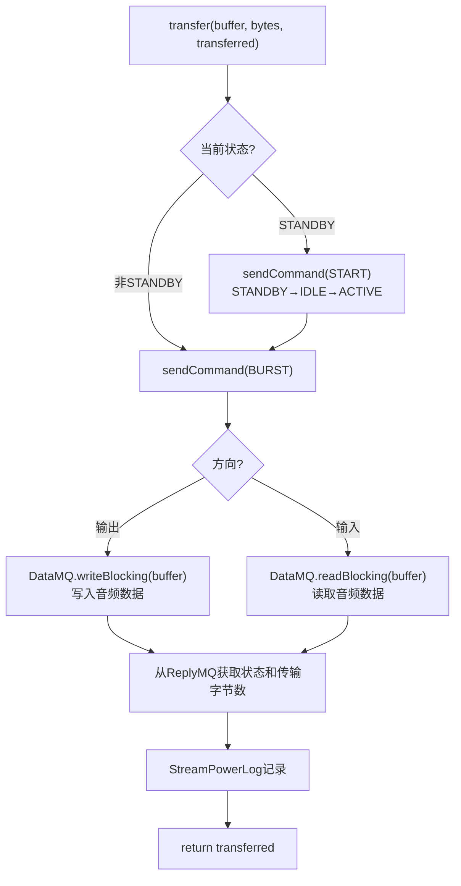

**standby()** — 状态机转换：

```
ACTIVE → pause → IDLE → flush → IDLE → standby → STANDBY
```

通过依次发送PAUSE→FLUSH→STANDBY命令，将流从活跃状态转换到待机状态。

#### StreamOutHalAidl — 输出流

| 方法 | 实现方式 |
|------|---------|
| `write()` | 委托给`transfer()` |
| `pause()/resume()` | `sendCommand(PAUSE/RESUME)` |
| `drain(earlyNotify)` | `sendCommand(DRAIN)` |
| `flush()` | `sendCommand(FLUSH)` |
| `setCallback()` | 通过`CallbackBroker`桥接到AIDL `IStreamCallback` |
| `setEventCallback()` | 通过`CallbackBroker`桥接到AIDL `IStreamOutEventCallback` |
| `updateSourceMetadata()` | `legacy2aidl_SourceMetadata()`转换后调用`IStreamOut.updateSourceMetadata()` |
| `filterAndUpdateOffloadMetadata()` | 从参数中过滤offload相关参数，更新`mOffloadMetadata` |
| `getPlaybackRateParameters()` | 通过`IStreamOut.getPlaybackRateParameters()`获取 |
| `setDualMonoMode()` | 通过`IStreamOut.setDualMonoMode()`设置 |
| `setAudioDescriptionMixLevel()` | 通过`IStreamOut.setAudioDescriptionMixLevel()`设置 |

#### StreamInHalAidl — 输入流

| 方法 | 实现方式 |
|------|---------|
| `read()` | 委托给`transfer()` |
| `setGain()` | `IStreamIn.setGain()` |
| `getCapturePosition()` | 从`getObservablePosition()`获取 |
| `getActiveMicrophones()` | 从`MicrophoneInfoProvider`获取 |
| `updateSinkMetadata()` | `legacy2aidl_SinkMetadata()`转换后调用`IStreamIn.updateSinkMetadata()` |
| `setPreferredMicrophoneDirection()` | `IStreamIn.setPreferredMicrophoneDirection()` |
| `setPreferredMicrophoneFieldDimension()` | `IStreamIn.setPreferredMicrophoneFieldDimension()` |

#### StreamDescriptor.Command状态转换图

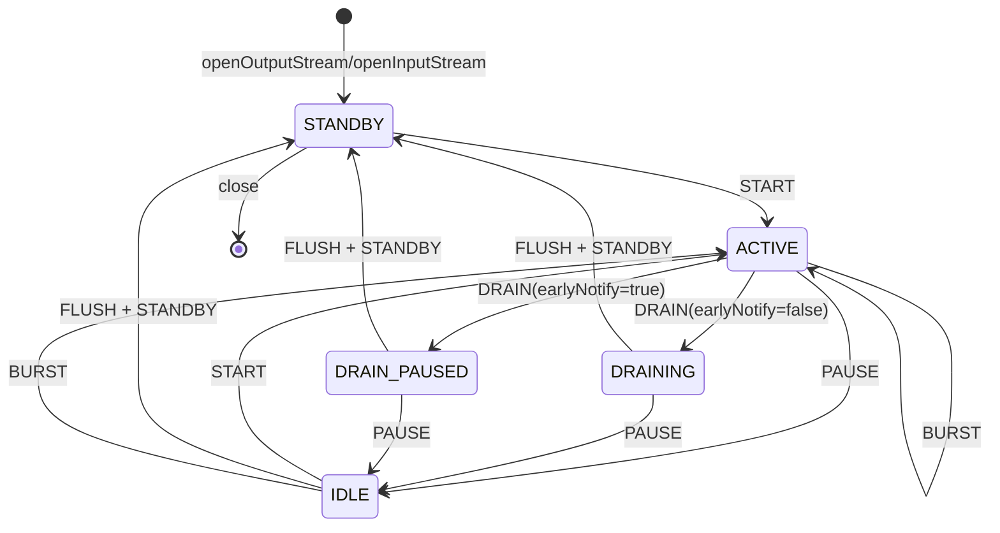

> **关键**: BURST命令在ACTIVE状态下执行数据传输，是音频数据流动的核心路径。STANDBY→ACTIVE需要先发START命令，而ACTIVE→STANDBY需要PAUSE→FLUSH→STANDBY三步。

---

### 8.11.6 EffectsFactoryHalAidl — AIDL效果器工厂

> **源码路径**: [`EffectsFactoryHalAidl.h`](frameworks/av/media/libaudiohal/impl/EffectsFactoryHalAidl.h) / [`.cpp`](frameworks/av/media/libaudiohal/impl/EffectsFactoryHalAidl.cpp)

EffectsFactoryHalAidl管理所有AIDL效果器的发现、分类和创建，并引入了**EffectProxy**概念来支持同一类型效果的多实现切换。

#### 核心成员

| 成员 | 类型 | 说明 |
|------|------|------|
| `mFactory` | `shared_ptr<IFactory>` | AIDL效果器工厂服务 |
| `mHalDescList` | `vector<Descriptor>` | 全量HAL效果描述符列表（直接从IFactory.queryEffects()获取） |
| `mUuidProxyMap` | `map<AudioUuid, shared_ptr<EffectProxy>>` | Proxy UUID → EffectProxy映射 |
| `mProxyDescList` | `vector<Descriptor>` | 代理效果描述符列表 |
| `mNonProxyDescList` | `vector<Descriptor>` | 非代理效果描述符列表 |
| `mAidlProcessings` | `vector<Processing>` | 预处理/后处理链配置 |
| `mEffectIdCounter` | `uint64_t` | 效果ID计数器（从0开始，0=INVALID_ID） |

#### 效果分类逻辑

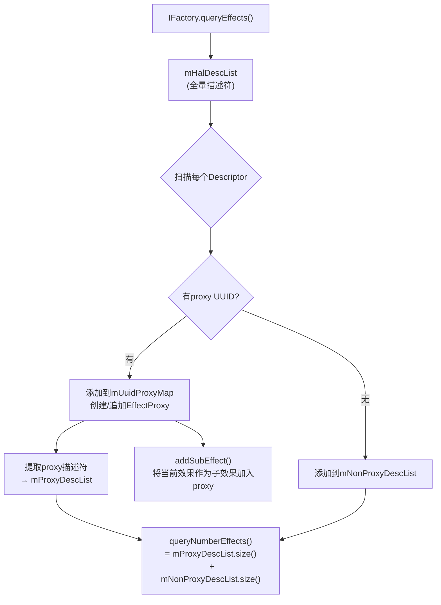

**Proxy UUID**是效果描述符中的一个字段，指示该效果属于某个代理组。具有相同proxy UUID的多个实现（如软件实现和DSP offload实现）会被归入同一个EffectProxy。

#### createEffect() — 创建效果器

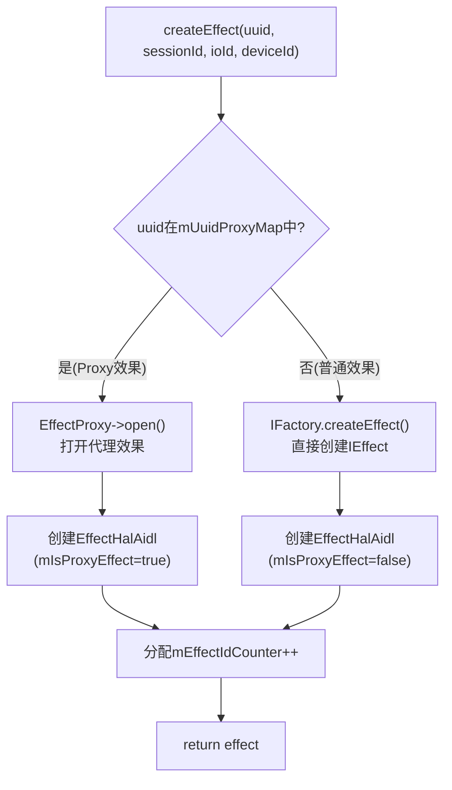

#### isProxyEffect()

```cpp
bool isProxyEffect(const AudioUuid& uuid) const {
    return mUuidProxyMap.find(uuid) != mUuidProxyMap.end();
}
```

通过UUID查找mUuidProxyMap判断是否为代理效果。

#### EffectProxy — 代理效果

> **源码路径**: [`EffectProxy.h`](frameworks/av/media/libaudiohal/impl/EffectProxy.h) / [`.cpp`](frameworks/av/media/libaudiohal/impl/EffectProxy.cpp)

EffectProxy是**同一类型效果的复合实现**，管理多个子效果（sub-effect）。

| 概念 | 说明 |
|------|------|
| Proxy UUID | 代理效果的标识UUID，对应一个EffectProxy实例 |
| Sub-effect | 同一type的不同impl实现（如SW impl + HW offload impl） |
| Active sub-effect | 任意时刻只有一个活跃子效果消费/生产数据 |

**命令分发规则**：

| 命令类型 | 分发目标 | 说明 |
|---------|---------|------|
| Setter命令（setParameter等） | **所有**sub-effect | 确保所有子效果状态一致 |
| Getter命令（getParameter等） | **仅**active sub-effect | 从当前活跃子效果获取 |
| setOffloadParam() | 切换active sub-effect | 根据offload参数选择SW/HW实现 |

```mermaid
flowchart LR
    FW["AudioFlinger"] --> PROXY["EffectProxy"]
    PROXY -->|"setter命令"| ALL["所有Sub-Effect\n(SW + HW)"]
    PROXY -->|"getter命令"| ACTIVE["Active Sub-Effect"]
    PROXY -->|"setOffloadParam"| SWITCH["切换Active\nSW↔HW"]
    ALL --> SW["SW Impl\nIEffect"]
    ALL --> HW["HW Offload Impl\nIEffect"]
    ACTIVE --> SW
    SWITCH --> HW
```

EffectProxy的`mSubEffects`数据结构：

```
map<Descriptor::Identity, tuple<shared_ptr<IEffect>, Descriptor, OpenEffectReturn>>
                  key           HANDLE      DESCRIPTOR  RETURN(FMQs)
```

---

### 8.11.7 EffectHalAidl — AIDL效果器适配层

> **源码路径**: [`EffectHalAidl.h`](frameworks/av/media/libaudiohal/impl/EffectHalAidl.h) / [`.cpp`](frameworks/av/media/libaudiohal/impl/EffectHalAidl.cpp)

EffectHalAidl是AIDL效果器的适配实现，其核心是将Legacy命令（`EFFECT_CMD_*`）转换为AIDL `IEffect`接口调用。

#### 核心成员

| 成员 | 类型 | 说明 |
|------|------|------|
| `mEffect` | `shared_ptr<IEffect>` | AIDL效果器接口 |
| `mConversion` | `unique_ptr<EffectConversionHelperAidl>` | 命令转换层 |
| `mFactory` | `shared_ptr<IFactory>` | 效果器工厂（用于销毁时释放） |
| `mIsProxyEffect` | `bool` | 是否为代理效果 |
| `mEffectId` | `uint64_t` | 效果ID |
| `mInBuffer/mOutBuffer` | `sp<EffectBufferHalInterface>` | 输入/输出缓冲区 |

#### process() / processReverse()

通过`mConversion`的FMQ进行数据交换。process()将输入缓冲区数据写入InputMQ，触发HAL处理，从OutputMQ读取处理后的数据到输出缓冲区。

#### command() — Legacy命令入口

```
command(cmdCode, cmdSize, pCmdData, replySize, pReplyData)
  → mConversion->handleCommand(cmdCode, cmdSize, pCmdData, replySize, pReplyData)
```

#### EffectConversionHelperAidl — 命令转换核心

> **源码路径**: [`EffectConversionHelperAidl.h`](frameworks/av/media/libaudiohal/impl/EffectConversionHelperAidl.h) / [`.cpp`](frameworks/av/media/libaudiohal/impl/EffectConversionHelperAidl.cpp)

EffectConversionHelperAidl是将Legacy `effect_command_e`映射到AIDL `IEffect`调用的核心转换层。

**FMQ通信架构**：

| FMQ | 类型 | 说明 |
|-----|------|------|
| `StatusMQ` | `AidlMessageQueue<IEffect::Status, SynchronizedReadWrite>` | 效果处理状态 |
| `InputMQ` | `AidlMessageQueue<float, SynchronizedReadWrite>` | 输入音频数据(浮点) |
| `OutputMQ` | `AidlMessageQueue<float, SynchronizedReadWrite>` | 输出音频数据(浮点) |
| `EventFlag` | `hardware::EventFlag` | FMQ事件通知标志 |

**命令处理映射**：

| Legacy命令 | 处理方法 | AIDL操作 |
|-----------|---------|---------|
| `EFFECT_CMD_INIT` | `handleInit()` | 初始化FMQ和EventFlag |
| `EFFECT_CMD_SET_CONFIG` | `handleSetConfig()` | `IEffect.open()` + 设置Common参数 |
| `EFFECT_CMD_GET_CONFIG` | `handleGetConfig()` | 读取当前Common配置 |
| `EFFECT_CMD_ENABLE` | `handleEnable()` | `IEffect.command(CommandId::START)` |
| `EFFECT_CMD_DISABLE` | `handleDisable()` | `IEffect.command(CommandId::STOP)` |
| `EFFECT_CMD_RESET` | `handleReset()` | `IEffect.command(CommandId::RESET)` |
| `EFFECT_CMD_SET_AUDIO_SOURCE` | `handleSetAudioSource()` | 设置AudioSource到Common |
| `EFFECT_CMD_SET_AUDIO_MODE` | `handleSetAudioMode()` | 设置AudioMode |
| `EFFECT_CMD_SET_DEVICE` | `handleSetDevice()` | 设置输出设备 |
| `EFFECT_CMD_SET_VOLUME` | `handleSetVolume()` | 设置音量 |
| `EFFECT_CMD_SET_OFFLOAD` | `handleSetOffload()` | 设置Offload参数 |
| `VISUALIZER_CMD_CAPTURE` | `handleVisualizerCapture()` | `visualizerCapture()`虚函数 |
| `VISUALIZER_CMD_MEASURE` | `handleVisualizerMeasure()` | `visualizerMeasure()`虚函数 |
| `EFFECT_CMD_SET_PARAM` | `handleSetParameter()` | `setParameter()`纯虚函数 |
| `EFFECT_CMD_GET_PARAM` | `handleGetParameter()` | `getParameter()`纯虚函数 |

#### Legacy → AIDL 命令转换流程

```mermaid
flowchart TB
    CMD["Legacy command()\n(EFFECT_CMD_SET_CONFIG等)"] --> MAP["mCommandHandlerMap\n查找对应的handler"]
    MAP --> HANDLER["handleSetConfig()\nhandleEnable()等"]
    HANDLER --> CONVERT["参数转换\nLegacy C struct → AIDL Parcelable"]
    CONVERT --> AIDL["IEffect.open()\nIEffect.command()\nIEffect.setParameter()"]
    AIDL --> FMQ["FMQ数据交换\nInputMQ → HAL → OutputMQ"]
    FMQ --> REPLY["构建Legacy回复\n填充pReplyData"]
    REPLY --> RET["return status"]

    SET_PARAM["EFFECT_CMD_SET_PARAM"] --> SET_HANDLER["handleSetParameter()"]
    SET_HANDLER --> VIRTUAL["setParameter(param)\n纯虚函数"]
    VIRTUAL --> IMPL["AidlConversionXXX\n各效果器的具体转换实现"]

    style CMD fill:#e1f5fe
    style AIDL fill:#c8e6c9
    style IMPL fill:#fff9c4
```

#### effectsAidlConversion/ — 16个效果转换模块

每个效果器有独立的`AidlConversion`实现，继承`EffectConversionHelperAidl`并实现`setParameter()`/`getParameter()`纯虚函数：

| 转换模块 | 效果类型 | 说明 |
|---------|---------|------|
| `AidlConversionAec` | Acoustic Echo Canceler | 回声消除 |
| `AidlConversionAgc1` | Automatic Gain Control 1 | 自动增益控制V1 |
| `AidlConversionAgc2` | Automatic Gain Control 2 | 自动增益控制V2 |
| `AidlConversionBassBoost` | Bass Boost | 低音增强 |
| `AidlConversionDownmix` | Downmix | 下混 |
| `AidlConversionDynamicsProcessing` | Dynamics Processing | 动态处理（最复杂，21.7KB） |
| `AidlConversionEnvReverb` | Environmental Reverb | 环境混响 |
| `AidlConversionEq` | Equalizer | 均衡器 |
| `AidlConversionHapticGenerator` | Haptic Generator | 触觉生成 |
| `AidlConversionLoudnessEnhancer` | Loudness Enhancer | 响度增强 |
| `AidlConversionNoiseSuppression` | Noise Suppression | 降噪 |
| `AidlConversionPresetReverb` | Preset Reverb | 预设混响 |
| `AidlConversionSpatializer` | Spatializer | 空间音频 |
| `AidlConversionVendorExtension` | Vendor Extension | 厂商扩展 |
| `AidlConversionVirtualizer` | Virtualizer | 虚拟化 |
| `AidlConversionVisualizer` | Visualizer | 可视化 |

每个转换模块负责将Legacy `effect_param_t`格式的参数与AIDL `Parameter::Specific`格式互相转换。

---

### 8.11.8 HIDL适配层对比

本节对比AIDL与HIDL适配层的关键差异，为HAL迁移提供参考。

#### DeviceHalHidl vs DeviceHalAidl

| 维度 | DeviceHalHidl | DeviceHalAidl |
|------|--------------|---------------|
| 继承 | `DeviceHalInterface + CoreConversionHelperHidl` | `DeviceHalInterface + ConversionHelperAidl + CallbackBroker + MicrophoneInfoProvider` |
| 核心接口 | `sp<IDevice>` + `sp<IPrimaryDevice>` | `shared_ptr<IModule>` + 子接口(Telephony/Bluetooth等) |
| 端口管理 | 依赖HAL实现缓存 | 框架侧缓存`mPorts/mPortConfigs/mPatches/mRoutes` |
| Audio Patch | 直接调用`IDevice.createAudioPatch()` | `findOrCreatePortConfig()` + `findOrCreatePatch()`两步 |
| BT参数 | 通过`setParameters()`统一处理 | `filterAndUpdateBt*Parameters()`子接口分离处理 |
| MMAP策略 | `INVALID_OPERATION`（未实现） | 支持查询 |
| SoundDose | `SoundDoseWrapper`封装 | 直接通过`IModule`子接口获取 |
| 子接口 | 无（全部通过IDevice/IPrimaryDevice） | ITelephony/IBluetooth/IBluetoothA2dp/IBluetoothLe独立接口 |

**关键差异**：DeviceHalAidl在框架侧维护了完整的端口/路由/配置缓存，这是AIDL HAL"瘦服务"设计的直接结果——AIDL HAL不再负责配置查找，框架需要自行管理。

#### StreamHalHidl vs StreamHalAidl

| 维度 | StreamHalHidl | StreamHalAidl |
|------|--------------|---------------|
| 数据传输 | **回调模式**: HAL通过`IStreamOutCallback`主动回调 | **FMQ模式**: CommandMQ/ReplyMQ/DataMQ三方队列 |
| 命令机制 | HIDL方法调用 (`IStreamOut.pause()`等) | FMQ Command写入 (`sendCommand(PAUSE)`) |
| 状态获取 | HIDL Return值 | ReplyMQ读取 |
| 异步通知 | `IStreamOutCallback.onWriteReady()` | `IStreamCallback.onTransferReady()` + CallbackBroker |
| MMAP | `MessageQueue<MmapBufferDescriptor>` | `MmapBufferDescriptor`共享内存 |
| 功耗日志 | `StreamPowerLog` | `StreamPowerLog`（相同） |

**FMQ vs 回调的核心优势**：

| 对比项 | HIDL回调 | AIDL FMQ |
|-------|---------|---------|
| 延迟 | Binder回调开销 | 共享内存零拷贝 |
| CPU占用 | 每次回调需要上下文切换 | 轮询EventFlag，用户态操作 |
| 数据路径 | `write()` → Binder → HAL → 回调 | `DataMQ.writeBlocking()` → HAL读取 |
| 适用场景 | 低负载 | 高吞吐低延迟 |

#### EffectHalHidl vs EffectHalAidl

| 维度 | EffectHalHidl | EffectHalAidl |
|------|--------------|---------------|
| 通信方式 | **直接Binder**: `IEffect.command()` | **FMQ + Conversion**: `EffectConversionHelperAidl` |
| 命令处理 | 在`command()`中直接处理 | 委托给`EffectConversionHelperAidl.handleCommand()` |
| 参数转换 | `EffectConversionHelperHidl`（简单封装） | `EffectConversionHelperAidl` + 16个独立转换模块 |
| FMQ | 仅`StatusMQ`（状态） | `StatusMQ + InputMQ + OutputMQ`（状态+数据） |
| 数据格式 | PCM int16 / int8 | **强制float32**（kDefaultFormatDescription指定） |
| Proxy支持 | 无 | `mIsProxyEffect`标记 + EffectProxy |
| 线程优先级 | `requestHalThreadPriority()` | 通过FMQ EventFlag处理 |

#### 迁移注意事项

1. **AIDL服务注册**: 确保所有AIDL HAL服务（`IModule`/`IFactory`/`IConfig`）正确注册到`ServiceManager`
2. **版本号一致性**: FactoryHal强制要求设备HAL和效果HAL同类型同大版本号
3. **FMQ缓冲区大小**: AIDL FMQ模式需要合理设置DataMQ大小，过小会导致数据溢出
4. **float32强制**: AIDL效果器强制使用float32数据格式，如果有int16流水线需要添加格式转换
5. **Proxy效果**: 如果HAL支持offload效果，需要正确实现proxy UUID和sub-effect注册
6. **BT子接口**: AIDL将蓝牙操作从IModule分离到独立子接口，需要相应实现
7. **端口缓存**: DeviceHalAidl依赖框架侧端口缓存，HAL侧需要正确响应`getAudioPorts/getAudioRoutes`查询
8. **回调时序**: AIDL要求回调在openStream时预注册，使用CallbackBroker桥接延迟注册

---

> **本章小结**: libaudiohal作为AudioFlinger与HAL之间的桥梁，通过统一的Interface抽象屏蔽了HIDL/AIDL的差异。AIDL适配层引入了FMQ零拷贝数据传输、框架侧端口缓存、EffectProxy多实现代理等关键创新，在降低延迟的同时提供了更灵活的效果器管理。理解libaudiohal的架构对于HAL迁移和音频调试至关重要。


> [← 上一篇：Effects Framework](07_Effects_Framework.md) | [返回导航](README.md) | [下一篇：AAOS Car Audio →](09_AAOS_Car_Audio.md)