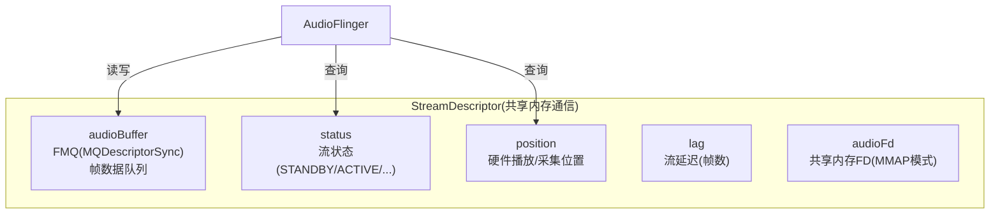
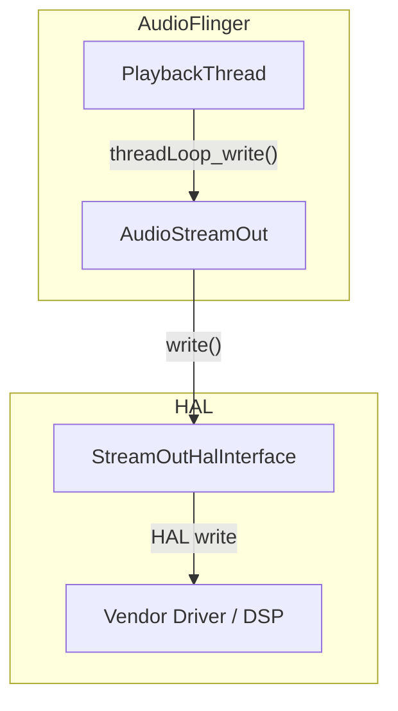
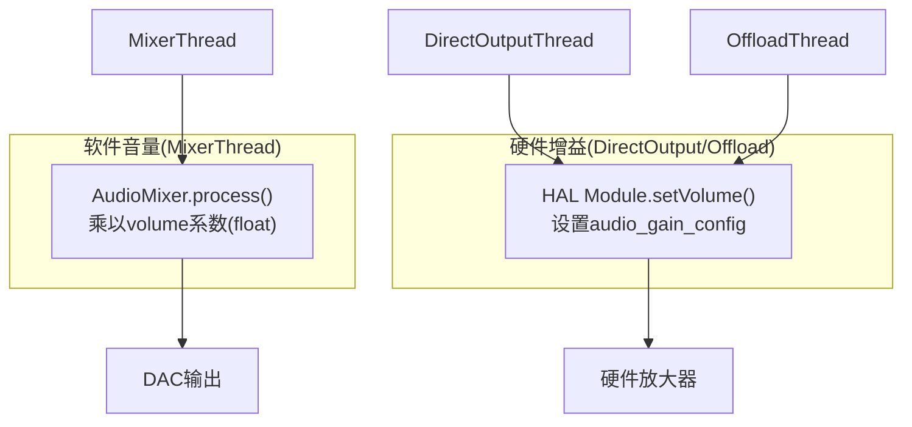

# 第八篇：HAL Layer

> [← 上一篇：Effects Framework](07_Effects_Framework.md) | [返回导航](README.md) | [下一篇：AAOS Car Audio →](09_AAOS_Car_Audio.md)

---

## 8.1 Audio HAL双轨架构

### 设计背景
Android 8.0引入Treble项目，将HAL从系统框架中分离。Audio HAL有两种接口：


### HIDL vs AIDL对比

| 维度 | HIDL | AIDL |
|------|------|------|
| 引入版本 | Android 8.0 | Android 12 |
| 版本范围 | 2.0 ~ 7.1 | 1.0 |
| 入口接口 | IDevicesFactory | IModule |
| 传输层 | HWBinder | Binder |
| 性能 | 较低 | 较高 |
| 扩展性 | 需要新版本接口 | 稳定API+扩展 |
| 状态 | 维护模式 | **推荐** |

### AIDL HAL核心接口 — [`IModule`](hardware/interfaces/audio/aidl/android/hardware/audio/core/IModule.aidl:61)

IModule是AIDL Audio HAL的入口，代表一个音频模块。一个设备可以有多个Module(primary/a2dp/usb等)。

#### IModule核心方法分类

```mermaid
graph TB
    subgraph "流管理"
        OPENOUT["openOutputStream()<br/>打开播放流"]
        OPENIN["openInputStream()<br/>打开录音流"]
    end
    subgraph "端口配置"
        GETPORTS["getAudioPorts()<br/>获取所有端口"]
        GETPORT["getAudioPort(id)<br/>获取单个端口"]
        SETPORTCFG["setAudioPortConfig()<br/>配置端口参数"]
        RESETPORTCFG["resetAudioPortConfig()<br/>重置端口配置"]
    end
    subgraph "Audio Patch"
        SETPATCH["setAudioPatch()<br/>创建/更新Patch"]
        GETPATCHES["getAudioPatches()<br/>获取所有Patch"]
        RESETPATCH["resetAudioPatch()<br/>重置Patch"]
    end
    subgraph "设备管理"
        CONNECT["connectExternalDevice()<br/>连接外部设备"]
        DISCONNECT["disconnectExternalDevice()<br/>断开外部设备"]
    end
    subgraph "音量控制"
        SETMVOL["setMasterVolume()<br/>设置主音量"]
        SETMMUTE["setMasterMute()<br/>设置主静音"]
        SETMICMUTE["setMicMute()<br/>设置麦克风静音"]
    end
    subgraph "子模块接口"
        TELEPHONY["getTelephony()<br/>通话音频控制"]
        BT["getBluetooth()<br/>SCO/HFP控制"]
        BTA2DP["getBluetoothA2dp()<br/>A2DP控制"]
        BTLE["getBluetoothLe()<br/>LE Audio控制"]
        SOUNDDOSE["getSoundDose()<br/>CSD安全音量"]
    end
    subgraph "系统通知"
        UPDMODE["updateAudioMode()<br/>通知音频模式变化"]
        UPDSCREEN["updateScreenState()<br/>通知屏幕状态"]
        UPDROTATE["updateScreenRotation()<br/>通知屏幕旋转"]
    end
    subgraph "Vendor扩展"
        SETVENDOR["setVendorParameters()<br/>设置Vendor参数"]
        GETVENDOR["getVendorParameters()<br/>获取Vendor参数"]
        ADDDEVFX["addDeviceEffect()<br/>添加设备级效果"]
        RMDEVFX["removeDeviceEffect()<br/>移除设备级效果"]
    end
end
```

#### IModule.openOutputStream()详解

```mermaid
sequenceDiagram
    participant AF, APM, HAL
    APM->>APM: getOutputForAttrInt()→确定输出设备
    APM->>APM: setAudioPortConfig()→配置MixPort
    APM->>APM: setAudioPatch()→建立MixPort↔DevicePort连接
    APM->>HAL: IModule.openOutputStream(args)
    Note over HAL: args: portConfigId, sourceMetadata,<br/>offloadInfo?, bufferSizeFrames,<br/>callback?, eventCallback?
    HAL->>HAL: 检查portConfigId有效性
    HAL->>HAL: 分配DMA buffer(>=bufferSizeFrames)
    HAL-->>APM: 返回IStreamOut + StreamDescriptor
    Note over APM: StreamDescriptor包含:<br/>frameCount, buffer, audioFd(MMAP)
```

**OpenOutputStreamArguments关键字段**:

| 字段 | 类型 | 说明 |
|------|------|------|
| `portConfigId` | int | MixPort配置ID(由setAudioPortConfig生成) |
| `sourceMetadata` | SourceMetadata | 播放源描述(usage/contentType/capturePreset) |
| `offloadInfo` | AudioOffloadInfo? | Offload模式必须提供(编码格式/采样率等) |
| `bufferSizeFrames` | long | 请求的最小buffer大小(帧数) |
| `callback` | IStreamCallback? | NON_BLOCKING模式必须提供(异步通知) |
| `eventCallback` | IStreamOutEventCallback? | 可选的事件回调(如Offload drain完成) |

#### IModule.connectExternalDevice()详解

```mermaid
sequenceDiagram
    participant AF, APM, HAL, HW
    HW->>APM: 设备连接事件(BT/USB/HDMI)
    APM->>HAL: IModule.connectExternalDevice(templatePort)
    Note over HAL: templatePort含portId+额外数据<br/>(如地址/EDID/ExtraAudioDescriptor)
    HAL->>HW: 查询设备支持的音频能力
    HW-->>HAL: 支持的profiles(采样率/格式/通道)
    HAL->>HAL: 生成新的connected port实例
    HAL->>HAL: 更新AudioRoutes(包含新端口)
    HAL-->>APM: 返回新AudioPort(含完整profiles)
    APM->>APM: setAudioPortConfig()→配置connected port
    APM->>APM: setAudioPatch()→建立路由连接
```

> **关键设计**: AIDL HAL使用`connectExternalDevice()`动态创建设备端口，而非在XML中静态定义所有设备。HIDL HAL则需要在`audio_policy_configuration.xml`中预定义。

#### StreamDescriptor — AIDL流描述符



**StreamDescriptor状态转换**:

| 状态 | 说明 | 触发 |
|------|------|------|
| STANDBY | 待机(刚open) | openOutputStream() |
| ACTIVE | 活跃(正在传输) | IStreamOut.start() |
| DRAINING | 排水中(Offload) | drain命令 |
| DRAINING_AND_STANDBY | 排水后待机 | drain+自动standby |
| PAUSED | 暂停 | IStreamOut.pause() |
| TRANSFERRING | 传输中(可读/写) | 有数据流动 |

---

## 8.2 StreamOut/StreamIn — 音频数据流

### StreamOut接口（播放方向）

| 方法 | HIDL | AIDL | 说明 |
|------|------|------|------|
| write | `write()` | `write()` | 写入PCM/压缩数据 |
| start | `start()` | `start()` | 开始播放 |
| stop | `stop()` | `stop()` | 停止播放 |
| standby | `standby()` | `standby()` | 进入待机 |
| getPresentationPosition | `getPresentationPosition()` | `getHardwareTimestamp()` | 获取播放位置 |
| setVolume | `setVolume()` | `setVolume()` | 设置音量(dB) |
| setParameters | `setParameters()` | — | 设置键值对参数(HIDL) |

### StreamIn接口（采集方向）

| 方法 | 说明 |
|------|------|
| `read()` | 读取PCM数据 |
| `start()` | 开始采集 |
| `stop()` | 停止采集 |
| `getCapturePosition()` | 获取采集位置 |

### HAL → AudioFlinger数据流



---

## 8.3 Audio Patch — 硬件路由

### 模块职责
Audio Patch允许音频数据在HAL内部直接路由，不需要经过AudioFlinger软件桥。

### Patch创建流程

```mermaid
sequenceDiagram
    participant APM, AF, PP, HAL
    APM->>AF: createAudioPatch(sources, sinks)
    AF->>PP: PatchPanel.createAudioPatch()
    PP->>PP: 检查是否需要软件桥
    PP->>|硬件Patch| HAL: IDevice.createAudioPatch()
    PP->>|软件Patch| PP: 创建RecordThread+PlaybackThread桥接
    HAL-->>PP: patchHandle
    PP-->>AF: 成功/失败
```

### 硬件Patch vs 软件Patch

| 维度 | 硬件Patch | 软件Patch |
|------|-----------|-----------|
| 路径 | HAL内部DSP直接路由 | 经过AudioFlinger CPU处理 |
| 延迟 | 极低 | 较高 |
| 功耗 | 低 | 高 |
| 场景 | FM→Speaker, BT_HFP→Speaker | 跨HAL模块路由 |
| 条件 | HAL支持 | 通用 |

---

## 8.4 Audio Port — 音频端口模型

### 端口类型

| 类型 | 说明 | 示例 |
|------|------|------|
| DEVICE | 物理设备端口 | speaker, headset, mic |
| MIX | 软件混音端口 | PlaybackThread的输出, RecordThread的输入 |
| SESSION | 效果会话端口 | EffectChain的输入/输出 |

### 端口配置

AudioPortConfig描述端口的当前配置：
- 采样率
- 格式（PCM_16bit, PCM_FLOAT, COMPRESSED等）
- 通道掩码（STEREO, MONO, 5.1等）
- 设备类型+地址

---

## 8.5 HAL参数机制

### setParameters / getParameters

HIDL HAL通过键值对传递非标准参数：
```
"routing=2"           // 路由到设备2
"bt_samplerate=16000" // 蓝牙SCO采样率
"screen_state=on"     // 屏幕状态
"A2dpSuspended=true"  // A2DP挂起
```

**为什么用键值对？** 不同Vendor有不同参数需求，键值对比固定接口更灵活。但AIDL HAL正在逐步用类型化接口替代键值对。

---

## 8.6 Vendor实现要点

### 多HAL模块配置

典型设备有多个Audio HAL模块：

| 模块 | 职责 | 实现位置 |
|------|------|----------|
| primary | 主音频(扬声器/耳机/麦克风) | `audio.primary.xxx.so` |
| a2dp | 蓝牙A2DP音频 | `audio.a2dp.xxx.so` |
| usb | USB音频 | `audio.usb.xxx.so` |
| remote_submix | 投屏混音 | `audio.r_submix.xxx.so` |
| bluetooth | 蓝牙LE Audio | `audio.bluetooth.xxx.so` |

在`audio_policy_configuration.xml`中声明：
```xml
<hal>
    <module name="primary" halVersion="2.0">
        <devicePorts>
            <devicePort tagName="Speaker" type="AUDIO_DEVICE_OUT_SPEAKER"/>
        </devicePorts>
        <mixPorts>
            <mixPort name="primary_output" role="source">
                <profile format="AUDIO_FORMAT_PCM_16_BIT" samplingRates="48000" channelMasks="AUDIO_CHANNEL_OUT_STEREO"/>
            </mixPort>
        </mixPorts>
    </module>
</hal>
```

---

## 8.7 AudioGain — HAL增益控制模型

[`audio_gain`](system/media/audio/include/system/audio.h:551)描述AudioPort上的硬件增益能力，是Volume全栈的硬件层基础。

### 8.7.1 Gain模式

| 模式 | 值 | 说明 |
|------|-----|------|
| `AUDIO_GAIN_MODE_JOINT` | 1 | 所有通道统一增益(最常见) |
| `AUDIO_GAIN_MODE_CHANNELS` | 2 | 每通道独立增益(多声道功放) |
| `AUDIO_GAIN_MODE_RAMP` | 4 | 渐变增益(防止爆音，支持ramp时长) |

模式可组合：`JOINT|RAMP` = 所有通道统一渐变增益。

### 8.7.2 audio_gain结构体

| 字段 | 类型 | 说明 |
|------|------|------|
| `mode` | `audio_gain_mode_t` | 支持的增益模式组合 |
| `channel_mask` | `audio_channel_mask_t` | 可控增益的通道(CHANNELS模式时有效) |
| `min_value` | `int` | 最小增益(毫贝，-8400mB = -84dB) |
| `max_value` | `int` | 最大增益(毫贝，4000mB = +40dB) |
| `default_value` | `int` | 默认增益(毫贝，0mB = 0dB) |
| `step_value` | `unsigned int` | 增益步进(毫贝) |
| `min_ramp_ms` | `unsigned int` | 最小渐变时长(RAMP模式) |
| `max_ramp_ms` | `unsigned int` | 最大渐变时长(RAMP模式) |

### 8.7.3 配置示例 — audio_policy_configuration.xml

```xml
<devicePort tagName="Speaker" type="AUDIO_DEVICE_OUT_SPEAKER" role="sink">
    <gains>
        <gain name="gain_1" mode="AUDIO_GAIN_MODE_JOINT"
              minValueMB="-8400" maxValueMB="4000"
              defaultValueMB="0" stepValueMB="100"/>
    </gains>
</devicePort>
```

> **useForVolume属性**: 当`useForVolume="true"`时，AudioPolicyManager将使用`setPortGain()`替代`setStreamVolume()`来控制音量——即直接设置硬件增益而非软件乘法。这是DirectOutput/Offload路径零拷贝音量控制的基础。

### 8.7.4 Gain与Volume的关系



| 维度 | 软件音量 | 硬件增益 |
|------|---------|---------|
| 实现层 | AudioMixer乘法 | HAL setPortGain/setVolume |
| 数据路径 | 修改PCM采样值 | 不修改PCM，控制放大器 |
| 精度 | float(高精度) | 毫贝步进(步进值) |
| 适用 | MixerThread | DirectOutput/Offload |
| 动态范围 | 受限于位深 | 取决于放大器硬件 |
| 渐变 | VolumeShaper | RAMP模式(min/max_ramp_ms) |

> **关键交互**: 当`useForVolume=true`时，13章Volume全栈的音量调节最终调用`AudioSystem.setPortConfig()`设置硬件增益，而非软件乘法。这保证了Offload路径(压缩音频)不修改PCM数据即可控制音量。

---

> [← 上一篇：Effects Framework](07_Effects_Framework.md) | [返回导航](README.md) | [下一篇：AAOS Car Audio →](09_AAOS_Car_Audio.md)