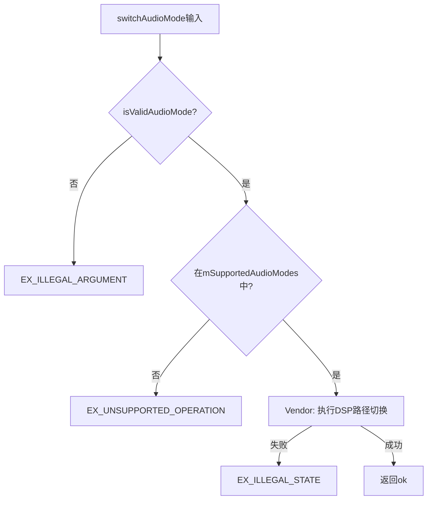
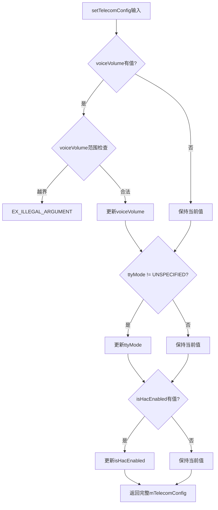
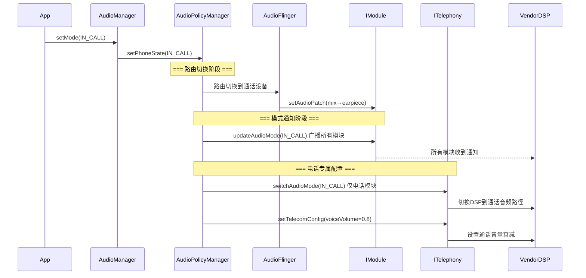
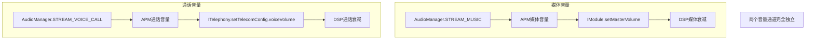

## 8.10 ITelephony AIDL接口 — 电话音频HAL

[← 上一个](08_8.9_ISoundDose_AIDL接口-声剂量HAL接口.md) | [← 返回第8章](README.md) | [返回导航](../README.md) | [下一个 →](08_8.11_libaudiohal-HAL适配层架构深度解析.md)

---

> **接口定义**: [`ITelephony.aidl`](hardware/interfaces/audio/aidl/android/hardware/audio/core/ITelephony.aidl) (131行)
> **默认实现**: [`Telephony.cpp`](hardware/interfaces/audio/aidl/default/Telephony.cpp) (83行) | [`Telephony.h`](hardware/interfaces/audio/aidl/default/include/core-impl/Telephony.h) (48行)
> **获取方式**: [`IModule.getTelephony()`](hardware/interfaces/audio/aidl/default/Module.cpp:388)

ITelephony是AIDL HAL的电话音频管理接口，管理通话模式下的音频配置。仅当设备支持电话功能时才需实现，通过`IModule.getTelephony()`获取实例。

### 8.10.1 ITelephony接口方法全景

[`ITelephony.aidl`](hardware/interfaces/audio/aidl/android/hardware/audio/core/ITelephony.aidl)定义3个方法+1个嵌套Parcelable：

| 方法 | 参数 | 返回值 | 异常 |
|------|------|--------|------|
| `getSupportedAudioModes()` | 无 | AudioMode[] | 无 |
| `switchAudioMode(mode)` | AudioMode | void | EX_UNSUPPORTED_OPERATION / EX_ILLEGAL_ARGUMENT / EX_ILLEGAL_STATE |
| `setTelecomConfig(config)` | TelecomConfig | TelecomConfig | EX_UNSUPPORTED_OPERATION / EX_ILLEGAL_ARGUMENT |

**接口注释关键约束**：
- `getSupportedAudioModes`仅在音频系统初始化时调用一次，必须始终返回相同结果
- `switchAudioMode`：HAL必须在**内部完成切换后**才返回，不能异步切换
- HAL必须接受`getSupportedAudioModes`返回的所有模式，拒绝其他模式

### 8.10.2 getSupportedAudioModes详解

[`Telephony::getSupportedAudioModes()`](hardware/interfaces/audio/aidl/default/Telephony.cpp:35)：

```cpp
ndk::ScopedAStatus Telephony::getSupportedAudioModes(std::vector<AudioMode>* _aidl_return) {
    *_aidl_return = mSupportedAudioModes;
    LOG(DEBUG) << __func__ << ": returning " << ::android::internal::ToString(*_aidl_return);
    return ndk::ScopedAStatus::ok();
}
```

**mSupportedAudioModes定义**（[`Telephony.h`](hardware/interfaces/audio/aidl/default/include/core-impl/Telephony.h:38)）：

```cpp
const std::vector<AudioMode> mSupportedAudioModes = {
    AudioMode::NORMAL,
    AudioMode::RINGTONE,
    AudioMode::IN_CALL,
    AudioMode::IN_COMMUNICATION,
    // Omit CALL_SCREEN for a better VTS coverage.
};
```

**ITelephony.aidl注释**要求前4个AudioMode（NORMAL/RINGTONE/IN_CALL/IN_COMMUNICATION）必须支持，CALL_SCREEN可选。

**AudioMode枚举完整定义**：

| 枚举值 | 数值 | 说明 |
|--------|------|------|
| NORMAL | 0 | 正常模式，无通话 |
| RINGTONE | 1 | 来电铃响 |
| IN_CALL | 2 | 通话中 |
| IN_COMMUNICATION | 3 | VoIP/通信模式 |
| CALL_SCREEN | 4 | 呼叫筛选(Android 12新增) |

### 8.10.3 switchAudioMode详解

[`Telephony::switchAudioMode()`](hardware/interfaces/audio/aidl/default/Telephony.cpp:44)：

```cpp
ndk::ScopedAStatus Telephony::switchAudioMode(AudioMode in_mode) {
    if (!isValidAudioMode(in_mode)) {
        LOG(ERROR) << __func__ << ": invalid mode " << toString(in_mode);
        return ndk::ScopedAStatus::fromExceptionCode(EX_ILLEGAL_ARGUMENT);
    }
    if (std::find(mSupportedAudioModes.begin(), mSupportedAudioModes.end(), in_mode) !=
        mSupportedAudioModes.end()) {
        LOG(DEBUG) << __func__ << ": " << toString(in_mode);
        return ndk::ScopedAStatus::ok();
    }
    LOG(ERROR) << __func__ << ": unsupported mode " << toString(in_mode);
    return ndk::ScopedAStatus::fromExceptionCode(EX_UNSUPPORTED_OPERATION);
}
```

**验证流程**（3级）：



**Vendor实现要点**：默认实现仅做验证空操作，Vendor需在此方法中执行实际的DSP音频路径切换。

### 8.10.4 TelecomConfig配置结构详解

[`TelecomConfig`](hardware/interfaces/audio/aidl/android/hardware/audio/core/ITelephony.aidl:51)是嵌套在ITelephony内的Parcelable：

| 字段 | 类型 | 默认值 | 说明 |
|------|------|--------|------|
| `voiceVolume` | `@nullable Float` | 1.0f (VOICE_VOLUME_MAX) | 通话音量，0.0f静音，1.0f满音量 |
| `ttyMode` | `TtyMode` | OFF | TTY模式 |
| `isHacEnabled` | `@nullable Boolean` | false | HAC-T(助听器兼容)是否启用 |

**常量**：`VOICE_VOLUME_MIN = 0`，`VOICE_VOLUME_MAX = 1`

**TtyMode枚举**：

| 枚举值 | 数值 | 说明 |
|--------|------|------|
| UNSPECIFIED | -1 | 未初始化默认值 |
| OFF | 0 | TTY关闭 |
| FULL | 1 | 全TTY：麦克风静音+扬声器关闭，纯文字 |
| HCO | 2 | Hearing Carryover：麦克风静音+扬声器开 |
| VCO | 3 | Voice Carryover：扬声器关闭+麦克风开 |

**setTelecomConfig的增量更新语义**：传入的config中只有非null/非UNSPECIFIED字段会被更新，其他字段保持当前值。

### 8.10.5 setTelecomConfig源码解析

[`Telephony::setTelecomConfig()`](hardware/interfaces/audio/aidl/default/Telephony.cpp:58)：

```cpp
ndk::ScopedAStatus Telephony::setTelecomConfig(const TelecomConfig& in_config,
                                               TelecomConfig* _aidl_return) {
    // 1. voiceVolume范围检查
    if (in_config.voiceVolume.has_value() &&
        (in_config.voiceVolume.value().value < TelecomConfig::VOICE_VOLUME_MIN ||
         in_config.voiceVolume.value().value > TelecomConfig::VOICE_VOLUME_MAX)) {
        return ndk::ScopedAStatus::fromExceptionCode(EX_ILLEGAL_ARGUMENT);
    }
    // 2. 增量更新：非null字段才更新
    if (in_config.voiceVolume.has_value()) {
        mTelecomConfig.voiceVolume = in_config.voiceVolume;
    }
    if (in_config.ttyMode != TelecomConfig::TtyMode::UNSPECIFIED) {
        mTelecomConfig.ttyMode = in_config.ttyMode;
    }
    if (in_config.isHacEnabled.has_value()) {
        mTelecomConfig.isHacEnabled = in_config.isHacEnabled;
    }
    // 3. 返回当前完整配置
    *_aidl_return = mTelecomConfig;
    return ndk::ScopedAStatus::ok();
}
```

**增量更新流程**：



**特殊用法**：传入空TelecomConfig（所有字段为null/UNSPECIFIED）可查询当前配置，不做任何修改。

### 8.10.6 Telephony类结构

[`Telephony.h`](hardware/interfaces/audio/aidl/default/include/core-impl/Telephony.h)：

```cpp
class Telephony : public BnTelephony {
  public:
    Telephony();  // 初始化mTelecomConfig默认值
  private:
    const std::vector<AudioMode> mSupportedAudioModes = {
        NORMAL, RINGTONE, IN_CALL, IN_COMMUNICATION
    };
    TelecomConfig mTelecomConfig;  // 运行时配置
};
```

**构造函数初始化**（[`Telephony.cpp`](hardware/interfaces/audio/aidl/default/Telephony.cpp:31)）：

```cpp
Telephony::Telephony() {
    mTelecomConfig.voiceVolume = Float{TelecomConfig::VOICE_VOLUME_MAX};  // 1.0f
    mTelecomConfig.ttyMode = TelecomConfig::TtyMode::OFF;
    mTelecomConfig.isHacEnabled = Boolean{false};
}
```

### 8.10.7 ITelephony与AudioManager.setMode交互

ITelephony与Framework的电话模式切换存在**双通道协同**关系：



**双通道设计**：

| 通道 | 方法 | 作用域 | 说明 |
|------|------|--------|------|
| 广播通道 | `IModule.updateAudioMode()` | 所有IModule实例 | 通知所有模块模式变化 |
| 定向通道 | `ITelephony.switchAudioMode()` | 仅电话模块 | 精确切换电话DSP路径 |

**协同执行顺序**（IModule.aidl注释）：
1. 先`ITelephony.switchAudioMode()` — 确保电话模块切换成功
2. 后`IModule.updateAudioMode()` — 广播通知其他模块

### 8.10.8 通话音量独立性设计

**关键设计原则**：`ITelephony.setTelecomConfig.voiceVolume`独立于`IModule.setMasterVolume`。

IModule.aidl注释明确指出：*"for modules supporting telephony, the attenuation of the voice call volume is set separately via ITelephony interface"*。



**音量通道对比**：

| 维度 | setMasterVolume | setTelecomConfig.voiceVolume |
|------|----------------|------------------------------|
| 接口 | IModule | ITelephony |
| 范围 | [0, 1] | [0, 1] (VOICE_VOLUME_MIN/MAX) |
| 作用域 | 全局所有输出 | 仅通话输出 |
| fail-safe | 有恢复机制 | 无恢复机制 |
| AAOS影响 | 多zone媒体音量 | 多zone通话音量 |

### 8.10.9 IModule.getTelephony获取路径

[`Module::getTelephony()`](hardware/interfaces/audio/aidl/default/Module.cpp:388) — 单例模式：

```cpp
ndk::ScopedAStatus Module::getTelephony(std::shared_ptr<ITelephony>* _aidl_return) {
    if (mTelephony == nullptr) {
        mTelephony = ndk::SharedRefBase::make<Telephony>();
    }
    *_aidl_return = mTelephony;
    return ndk::ScopedAStatus::ok();
}
```

**AudioFlinger侧调用链**：
1. AudioPolicyManager通过`AudioSystem.getPhoneState()`获取当前模式
2. APM通过`IModule.getTelephony()`获取ITelephony实例
3. APM调用`switchAudioMode()`和`setTelecomConfig()`配置通话

### 8.10.10 HIDL电话音频对比

| 维度 | AIDL ITelephony | HIDL IDevice |
|------|-----------------|--------------|
| 接口独立性 | 独立接口，IModule.getTelephony获取 | 内嵌在IDevice中 |
| 模式切换 | switchAudioMode(4+模式) | setMode(4模式) |
| 配置结构 | TelecomConfig(voiceVolume/ttyMode/HAC) | 无结构化配置 |
| 音量管理 | voiceVolume独立于masterVolume | masterVolume包含通话 |
| 增量更新 | setTelecomConfig支持增量 | 无类似机制 |
| TTY支持 | TtyMode枚举(FULL/HCO/VCO) | setTtyMode字符串 |
| HAC支持 | isHacEnabled布尔 | 无标准接口 |

### 8.10.11 Vendor实现指南

Vendor实现ITelephony的关键要点：

| 要点 | 说明 |
|------|------|
| **switchAudioMode** | 必须在内部完成DSP路径切换后才返回 |
| **DSP路径切换** | IN_CALL时需启用语音编码/解码路径 |
| **voiceVolume** | 直接控制DSP通话音量衰减，非软件混音 |
| **TTY模式** | 需在DSP端实现TTY编解码(HCO/VCO) |
| **HAC-T** | 助听器Telecoil模式需硬件支持 |
| **mSupportedAudioModes** | 不可动态修改，初始化时固定 |

**Vendor最小实现**（伪代码）：

```cpp
class VendorTelephony : public BnTelephony {
    dsp_telephony_handle_t mDspHandle;
    
    ScopedAStatus switchAudioMode(AudioMode mode) override {
        // 阻塞式DSP切换，完成后才返回
        dsp_telephony_switch_mode(mDspHandle, mode);
        // 等待DSP完成切换
        dsp_telephony_wait_mode_ready(mDspHandle);
        return ok();
    }
    
    ScopedAStatus setTelecomConfig(const TelecomConfig& in,
                                   TelecomConfig* out) override {
        // voiceVolume → DSP通话衰减
        if (in.voiceVolume.has_value()) {
            dsp_set_voice_volume(mDspHandle, in.voiceVolume.value().value);
        }
        // ttyMode → DSP TTY编解码
        if (in.ttyMode != UNSPECIFIED) {
            dsp_set_tty_mode(mDspHandle, in.ttyMode);
        }
        // 返回当前配置
        *out = getCurrentConfig();
        return ok();
    }
};
```

### 8.10.12 AAOS车载电话音频特殊考量

| 场景 | 说明 |
|------|------|
| **多音区通话** | 驾驶区通话音量独立于乘客区 |
| **蓝牙HFP** | BT SCO需要ITelephony+IBluetooth协同 |
| **紧急呼叫** | eCall/bCall需优先通话路由 |
| **语音助手** | IN_COMMUNICATION模式用于语音交互 |
| **降噪处理** | 车载环境噪声大，需DSP端主动降噪 |
| **回声消除** | 车内扬声器→麦克风回声需AEC处理 |

---

[← 上一个](08_8.9_ISoundDose_AIDL接口-声剂量HAL接口.md) | [← 返回第8章](README.md) | [返回导航](../README.md) | [下一个 →](08_8.11_libaudiohal-HAL适配层架构深度解析.md)