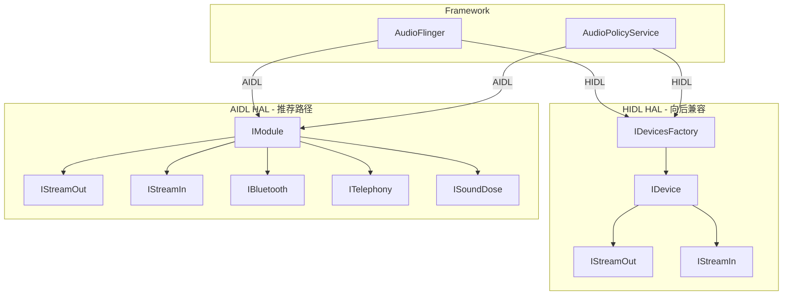
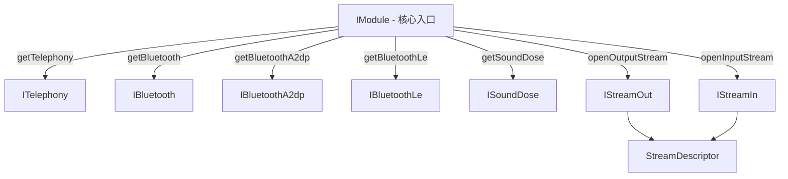
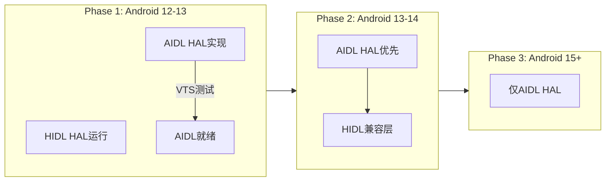
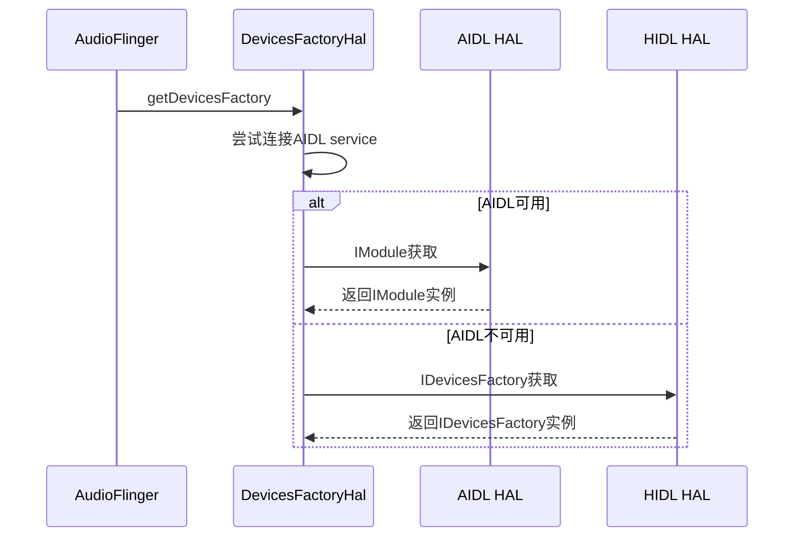
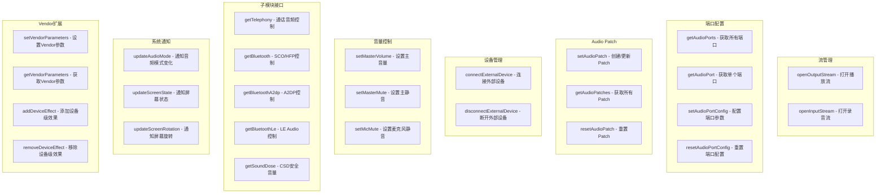
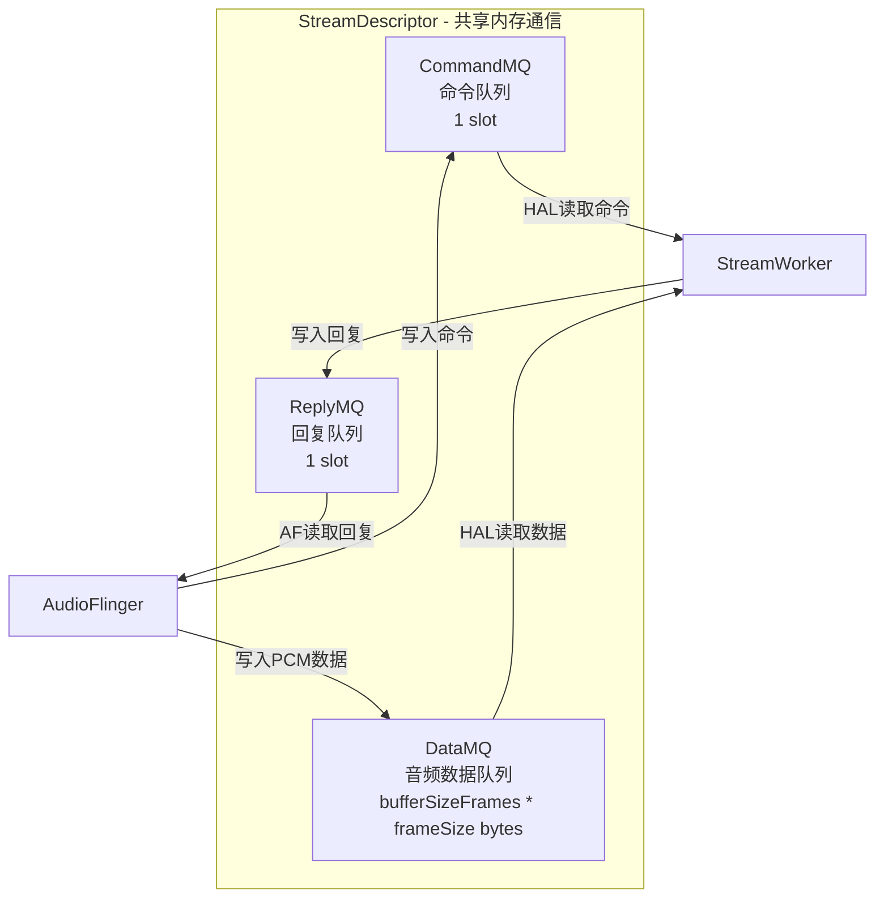
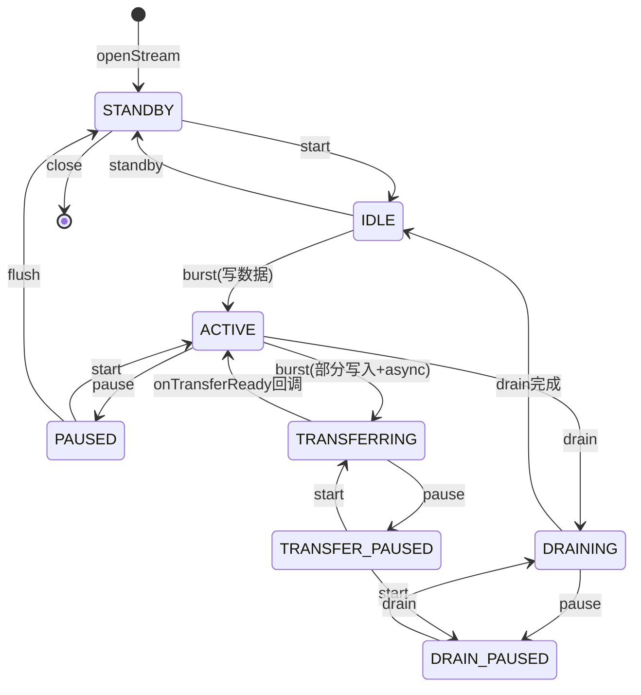

## 8.1 Audio HAL双轨架构

[← 上一个](../07_Effects_Framework/README.md) | [← 返回第8章](README.md) | [返回导航](../README.md) | [下一个 →](08_8.2_StreamOutStreamIn-音频数据流.md)

---

### 8.1.1 设计背景与Treble分离

Android 8.0引入Project Treble，将HAL从系统框架中分离。Audio HAL作为连接Framework与硬件的关键层，经历了从Legacy HAL到HIDL HAL再到AIDL HAL的演进。AOSP14同时保留HIDL和AIDL两条路径，形成双轨架构。



### 8.1.2 HIDL vs AIDL深度对比

| 维度 | HIDL HAL | AIDL HAL |
|------|----------|----------|
| 引入版本 | Android 8.0 | Android 12（稳定于13/14） |
| 版本范围 | 2.0 ~ 7.1（7个大版本） | 1.0（单一稳定版本） |
| 入口接口 | [`IDevicesFactory`](hardware/interfaces/audio/core/all-versions/default/Device.cpp) | [`IModule`](hardware/interfaces/audio/aidl/default/Module.cpp:30) |
| IPC传输层 | hwbinder（专用） | binder（标准） |
| 数据传输 | write/read回调 | FMQ共享内存 + StreamDescriptor |
| 流模型 | 阻塞式write/read | 命令队列 + 异步回调 |
| 路由模型 | setDeviceConnectionState隐式 | setAudioPatch显式路由 |
| 设备连接 | 静态XML声明 | connectExternalDevice动态创建 |
| 参数传递 | setParameters/getParameters键值对 | VendorParameter类型化扩展 |
| 子模块 | 无专门接口 | ITelephony/IBluetooth/ISoundDose |
| Binder稳定性 | @VintfStability | @VintfStability |
| 扩展性 | 需要新版本接口号 | 稳定API + VendorParameter扩展 |
| 状态 | 维护模式，不再演进 | **推荐**，持续增强 |

### 8.1.3 HIDL HAL架构解析

HIDL HAL的核心入口是[`IDevicesFactory`](hardware/interfaces/audio/core/all-versions/default/Device.cpp)，采用工厂模式按名称创建设备：

```
IDevicesFactory.openDevice("primary") → IDevice
IDevicesFactory.openDevice("a2dp")    → IDevice
IDevicesFactory.openDevice("usb")     → IDevice
```

IDevice承载所有功能：流管理、音量控制、参数设置、Patch创建。每个`IDevice`通过`openOutputStream/openInputStream`创建流，流通过阻塞式`write()/read()`传输数据。

**HIDL核心缺陷**：
- **阻塞IO模型**：write/read调用阻塞当前线程，延迟敏感场景受限
- **隐式路由**：通过`setDeviceConnectionState`隐式切换路由，缺乏细粒度控制
- **参数字符串化**：所有非标准参数通过键值对传递，缺乏类型安全
- **版本碎片化**：2.0~7.1共7个版本，Vendor适配成本高

### 8.1.4 AIDL HAL架构解析

AIDL HAL的核心入口是[`IModule`](hardware/interfaces/audio/aidl/default/Module.cpp:30)，采用单一模块入口 + 子接口getter模式：



**Module类型枚举**（源码[`Module.h:34`](hardware/interfaces/audio/aidl/default/include/core-impl/Module.h:34)）：

| Type | 说明 | Stream实现 |
|------|------|-----------|
| `DEFAULT` | 主音频模块(primary) | StreamStub |
| `R_SUBMIX` | 远程子混音模块 | StreamStub |
| `USB` | USB音频模块 | StreamUsb |

[`Module::createInstance`](hardware/interfaces/audio/aidl/default/Module.cpp:111)根据Type创建不同实例：

```cpp
// Module.cpp:111-120
std::shared_ptr<Module> Module::createInstance(Type type) {
    switch (type) {
        case Module::Type::USB:
            return ndk::SharedRefBase::make<ModuleUsb>(type);
        case Type::DEFAULT:
        case Type::R_SUBMIX:
        default:
            return ndk::SharedRefBase::make<Module>(type);
    }
}
```

### 8.1.5 HIDL到AIDL的迁移路径



**迁移关键步骤**：

1. **实现IModule接口**：从IDevicesFactory工厂模式迁移到IModule模块模式
2. **流数据迁移**：从write/read阻塞IO迁移到FMQ共享内存 + StreamDescriptor
3. **路由迁移**：从setDeviceConnectionState隐式迁移到setAudioPatch显式
4. **参数迁移**：从setParameters/getParameters字符串迁移到VendorParameter类型化
5. **子接口实现**：新增ITelephony/IBluetooth/ISoundDose子接口getter

**libaudiohal适配层**自动选择AIDL或HIDL：



### 8.1.6 AIDL HAL核心接口 — IModule方法分类



### 8.1.7 StreamDescriptor — AIDL流数据交换核心

AIDL HAL用StreamDescriptor替代HIDL的write/read回调，核心是三层FMQ（Fast Message Queue）：



**StreamDescriptor关键字段**（源码[`Stream.cpp:42-55`](hardware/interfaces/audio/aidl/default/Stream.cpp:42)）：

| 字段 | 类型 | 说明 |
|------|------|------|
| `command` | MQDescriptorSync | 命令FMQ描述符（1 slot） |
| `reply` | MQDescriptorSync | 回复FMQ描述符（1 slot） |
| `bufferSizeFrames` | long | 缓冲区大小（帧数） |
| `frameSizeBytes` | long | 每帧字节数 |
| `audio` | AudioBuffer | FMQ数据缓冲区描述符 |

**StreamContext创建过程**（源码[`Module.cpp:165-222`](hardware/interfaces/audio/aidl/default/Module.cpp:165)）：

1. 验证bufferSizeFrames ≥ `kMinimumStreamBufferSizeFrames`(256帧)
2. 验证buffer总大小 ≤ `kMaximumStreamBufferSizeBytes`(1 GiB)
3. 计算frameSize = getFrameSizeInBytes(format, channelMask)
4. 创建三层FMQ：CommandMQ(1)、ReplyMQ(1)、DataMQ(frameSize * bufferSizeFrames)
5. 填充StreamDescriptor并返回

### 8.1.8 StreamDescriptor状态机



| 状态 | 说明 | 触发命令 |
|------|------|---------|
| `STANDBY` | 初始待机状态 | openStream成功 |
| `IDLE` | 已启动但无数据流动 | start从STANDBY |
| `ACTIVE` | 活跃传输中 | burst写入数据 |
| `PAUSED` | 暂停 | pause |
| `DRAINING` | Offload排水 | drain（异步等待完成） |
| `DRAIN_PAUSED` | 排水中暂停 | pause（在DRAINING时） |
| `TRANSFERRING` | 异步传输过渡态 | burst部分写入+async |
| `TRANSFER_PAUSED` | 异步传输暂停 | pause（在TRANSFERRING时） |

### 8.1.9 版本策略与兼容性

| Android版本 | HIDL HAL版本 | AIDL HAL版本 | 推荐路径 |
|-------------|-------------|-------------|---------|
| 8.0-8.1 | 2.0 | — | HIDL |
| 9.0-10 | 4.0 | — | HIDL |
| 11 | 5.0 | — | HIDL |
| 12 | 6.0 | 1.0(预览) | HIDL |
| 13 | 7.0 | 1.0 | AIDL推荐 |
| 14 | 7.1 | 1.0 | **AIDL必须** |

> **关键设计**: AIDL HAL的`connectExternalDevice()`动态创建设备端口，替代HIDL的`audio_policy_configuration.xml`静态预定义。这使USB/BT等热插拔设备的音频能力可在运行时动态发现。

---

[← 上一个](../07_Effects_Framework/README.md) | [← 返回第8章](README.md) | [返回导航](../README.md) | [下一个 →](08_8.2_StreamOutStreamIn-音频数据流.md)