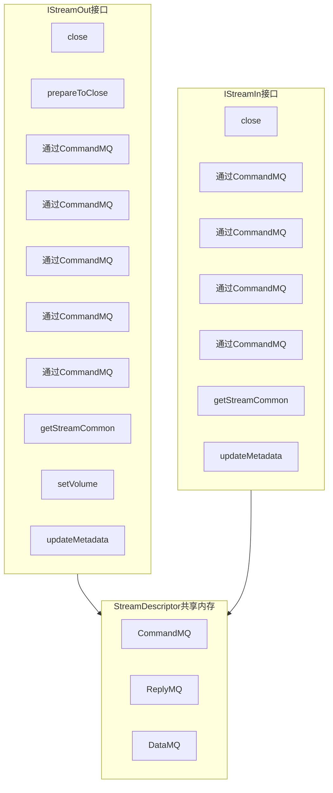
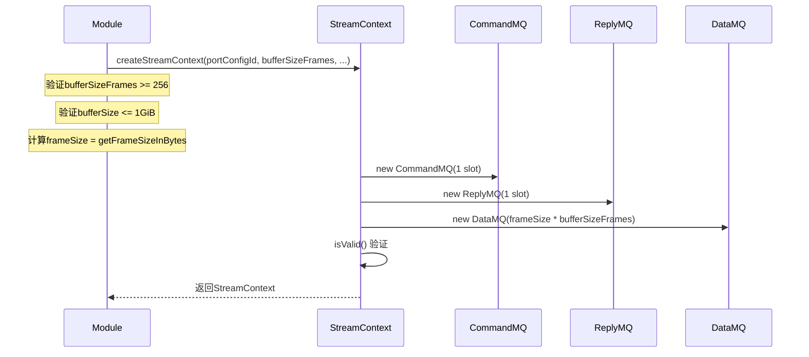
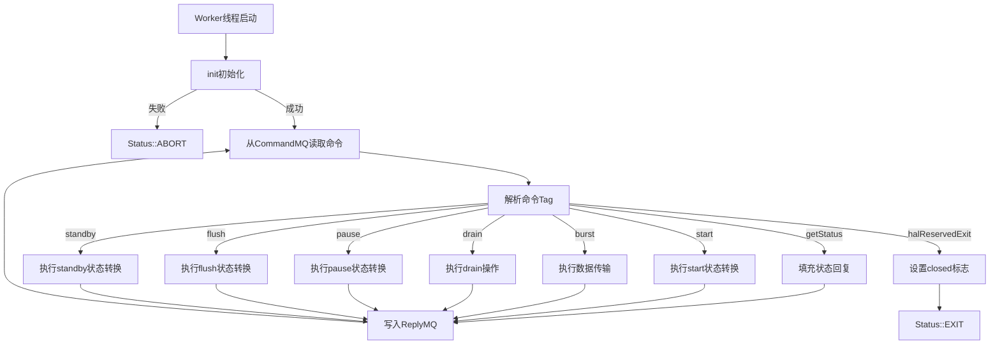
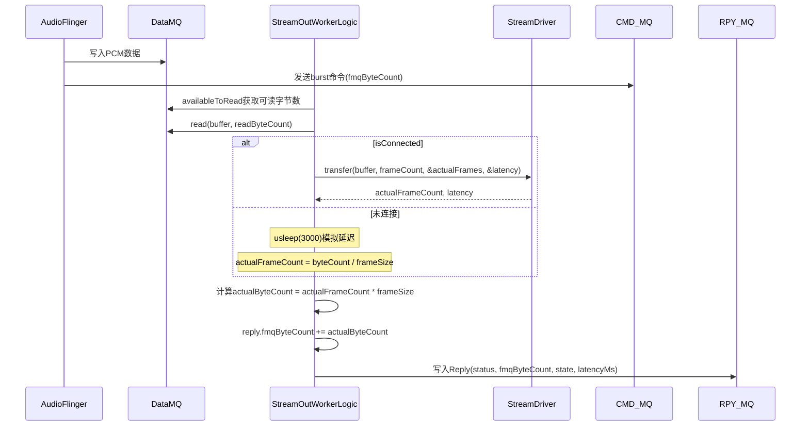
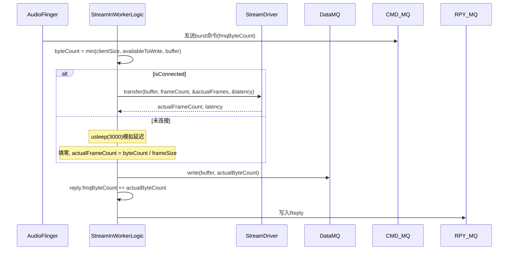
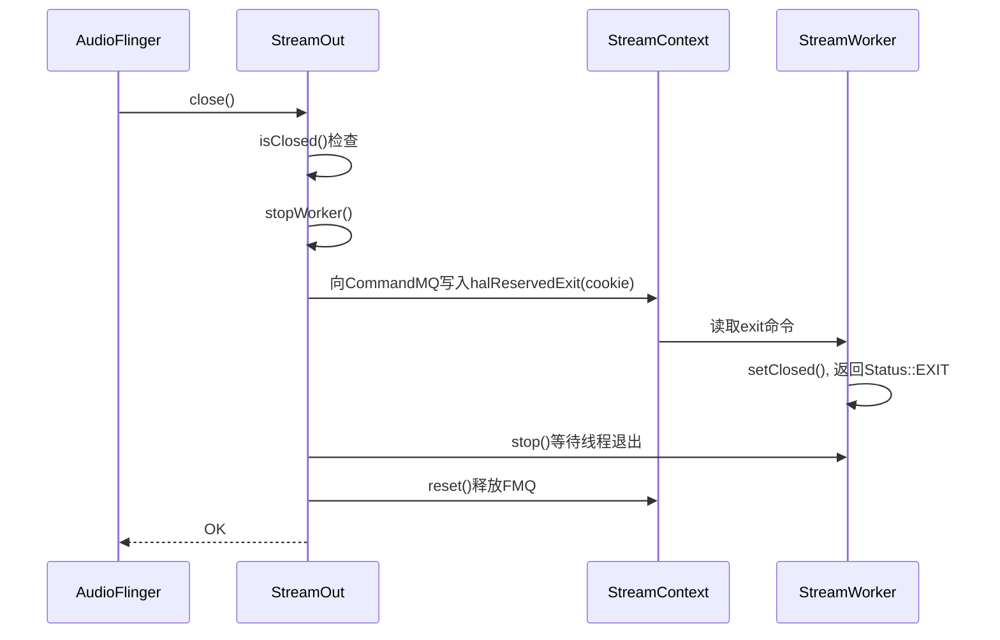
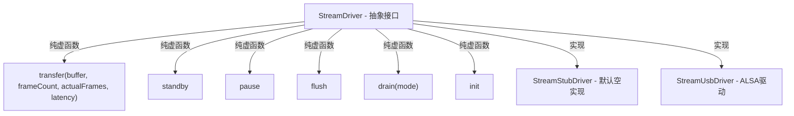
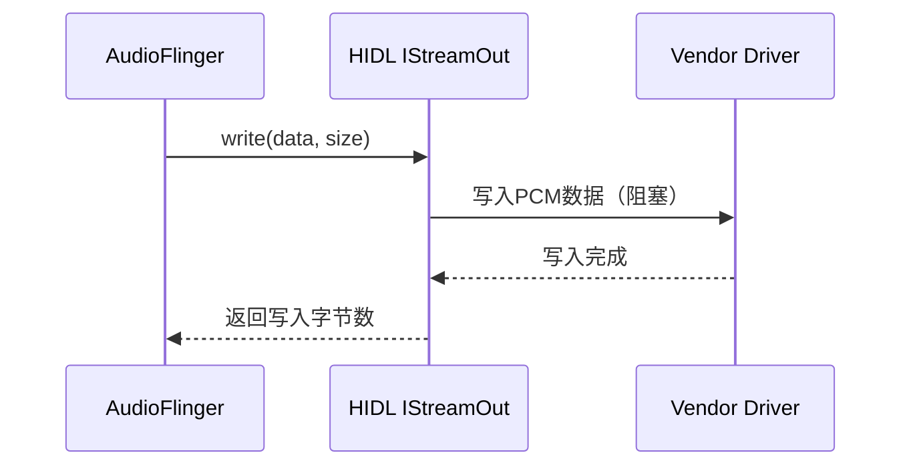
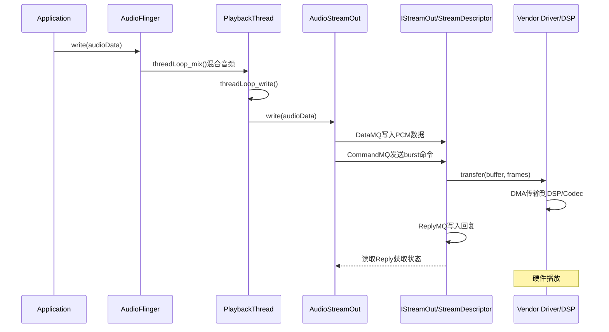

## 8.2 StreamOut/StreamIn — 音频数据流

[← 上一个](08_8.1_Audio_HAL双轨架构.md) | [← 返回第8章](README.md) | [返回导航](../README.md) | [下一个 →](08_8.3_Audio_Patch-硬件路由.md)

---

> **核心源码**: [`Stream.cpp`](hardware/interfaces/audio/aidl/default/Stream.cpp) (895行) | [`StreamStub.cpp`](hardware/interfaces/audio/aidl/default/StreamStub.cpp) | [`StreamUsb.cpp`](hardware/interfaces/audio/aidl/default/usb/StreamUsb.cpp)
> **头文件**: [`Stream.h`](hardware/interfaces/audio/aidl/default/include/core-impl/Stream.h) (26.8KB)

### 8.2.1 AIDL Stream架构总览

AIDL HAL的流架构围绕三层FMQ + StreamWorker线程模型构建，完全替代了HIDL的write/read回调模式。



### 8.2.2 StreamContext — 流上下文创建

[`StreamContext`](hardware/interfaces/audio/aidl/default/Stream.cpp:42)是流的运行时上下文，持有三层FMQ的实例：



**StreamContext::fillDescriptor**（源码[`Stream.cpp:42-55`](hardware/interfaces/audio/aidl/default/Stream.cpp:42)）将FMQ描述符填充到StreamDescriptor中：

```cpp
void StreamContext::fillDescriptor(StreamDescriptor* desc) {
    if (mCommandMQ) desc->command = mCommandMQ->dupeDesc();
    if (mReplyMQ) desc->reply = mReplyMQ->dupeDesc();
    if (mDataMQ) {
        desc->frameSizeBytes = getFrameSize();
        desc->bufferSizeFrames = mDataMQ->getQuantumCount() * mDataMQ->getQuantumSize() / getFrameSize();
        desc->audio.set<StreamDescriptor::AudioBuffer::Tag::fmq>(mDataMQ->dupeDesc());
    }
}
```

### 8.2.3 StreamWorker — 流工作线程

StreamWorker是AIDL流的核心处理线程，从CommandMQ读取命令，执行后写入ReplyMQ。



### 8.2.4 StreamOut工作逻辑 — 写数据流程

[`StreamOutWorkerLogic::cycle()`](hardware/interfaces/audio/aidl/default/Stream.cpp:313)是播放流的核心处理循环。

**Out方向状态转换表**（源码`Stream.cpp:377-515`）：

| 当前状态 | 命令 | 目标状态 | 条件 |
|---------|------|---------|------|
| STANDBY | start | IDLE | 无条件 |
| PAUSED | start | ACTIVE | 无条件 |
| DRAIN_PAUSED | start | DRAINING(过渡) | 自动过渡 |
| TRANSFER_PAUSED | start | TRANSFERRING(过渡) | 自动过渡 |
| IDLE/ACTIVE/DRAINING | burst | ACTIVE/TRANSFERRING | 部分写入+async→TRANSFERRING |
| STANDBY/PAUSED/DRAIN_PAUSED | burst | PAUSED | 写入后回到暂停 |
| ACTIVE/TRANSFERRING | drain | DRAINING(过渡) | mForceSynchronousDrain→IDLE |
| ACTIVE | pause | PAUSED | 无条件 |
| DRAINING | pause | DRAIN_PAUSED | 无条件 |
| TRANSFERRING | pause | TRANSFER_PAUSED | 无条件 |
| PAUSED/DRAIN_PAUSED/TRANSFER_PAUSED | flush | IDLE | 无条件 |
| IDLE | standby | STANDBY | 无条件 |

**burst写入数据流**（[`StreamOutWorkerLogic::write()`](hardware/interfaces/audio/aidl/default/Stream.cpp:527)）：



**关键参数**：
- `mForceTransientBurst`：调试参数，模拟部分写入（源码`Stream.cpp:537-541`）
- `reply.fmqByteCount`：实际消耗的字节数，AF据此判断是否需要重传
- `reply.latencyMs`：硬件延迟，固定值`kLatencyMs = 10`（默认实现）

### 8.2.5 StreamIn工作逻辑 — 读数据流程

[`StreamInWorkerLogic::cycle()`](hardware/interfaces/audio/aidl/default/Stream.cpp:128)是录音流的核心处理循环。

**In方向状态转换表**（源码`Stream.cpp:128-271`）：

| 当前状态 | 命令 | 目标状态 | 条件 |
|---------|------|---------|------|
| STANDBY | start | IDLE | 无条件 |
| DRAINING | start | ACTIVE | 无条件 |
| IDLE/ACTIVE/PAUSED/DRAINING | burst | ACTIVE | 写入数据后 |
| ACTIVE | drain | DRAINING | 仅DRAIN_UNSPECIFIED |
| IDLE | standby | STANDBY | 无条件 |
| ACTIVE | pause | PAUSED | 无条件 |
| PAUSED | flush | STANDBY | 无条件 |

**burst读取数据流**（[`StreamInWorkerLogic::read()`](hardware/interfaces/audio/aidl/default/Stream.cpp:274)）：



### 8.2.6 StreamOut vs StreamIn差异

| 维度 | StreamOut | StreamIn |
|------|-----------|----------|
| 数据方向 | AF→HAL（写PCM到DataMQ） | HAL→AF（读PCM从DataMQ） |
| burst操作 | write(): DataMQ→Driver | read(): Driver→DataMQ |
| drain模式 | DRAIN_ALL / DRAIN_EARLY_NOTIFY | DRAIN_UNSPECIFIED |
| 特有状态 | TRANSFERRING / TRANSFER_PAUSED | 无（Input无异步回调） |
| async回调 | IStreamCallback(onDrainReady/onTransferReady) | 无 |
| event回调 | IStreamOutEventCallback(onOffloadGaplessInfo) | 无 |
| offload | 支持COMPRESS_OFFLOAD | 不支持 |
| latencyMs | 通过Reply返回 | 通过Reply返回 |

### 8.2.7 IStreamOut方法详解

| 方法 | 功能 | 参数 | 返回值 |
|------|------|------|--------|
| `close()` | 关闭流，释放资源 | — | EX_ILLEGAL_STATE: 已关闭 |
| `prepareToClose()` | 预关闭通知 | — | 允许drain完成后再close |
| `getStreamCommon()` | 获取IStreamCommon接口 | — | IStreamCommon共享接口 |
| `setVolume(left, right)` | 设置左右声道音量(dB) | float left, float right | -1dB~0dB |
| `updateMetadata(SourceMetadata)` | 更新播放源元数据 | SourceMetadata | OK/EX_ILLEGAL_STATE |
| `getVendorParameters(ids)` | 获取Vendor参数 | vector<string> ids | vector<VendorParameter> |
| `setVendorParameters(params, async)` | 设置Vendor参数 | VendorParameter[], bool async | OK/EX_ILLEGAL_ARGUMENT |
| `addEffect(effect)` | 添加音效 | IEffect | EX_UNSUPPORTED_OPERATION |
| `removeEffect(effect)` | 移除音效 | IEffect | EX_UNSUPPORTED_OPERATION |
| `updateHwAvSyncId(id)` | 更新HW AV Sync ID | int32_t id | EX_UNSUPPORTED_OPERATION |

**close流程**（源码[`Stream.cpp:646-660`](hardware/interfaces/audio/aidl/default/Stream.cpp:646)）：



### 8.2.8 IStreamIn方法详解

| 方法 | 功能 | 参数 | 返回值 |
|------|------|------|--------|
| `close()` | 关闭流 | — | 同StreamOut |
| `prepareToClose()` | 预关闭 | — | 同StreamOut |
| `getStreamCommon()` | 获取共享接口 | — | IStreamCommon |
| `updateMetadata(SinkMetadata)` | 更新录音sink元数据 | SinkMetadata | OK/EX_ILLEGAL_STATE |
| `getVendorParameters(ids)` | 获取Vendor参数 | vector<string> | 同StreamOut |
| `setVendorParameters(params, async)` | 设置Vendor参数 | 同StreamOut | 同StreamOut |
| `addEffect(effect)` | 添加音效 | IEffect | EX_UNSUPPORTED_OPERATION |
| `removeEffect(effect)` | 移除音效 | IEffect | EX_UNSUPPORTED_OPERATION |
| `getActiveMicrophones()` | 获取活跃麦克风 | — | MicrophoneDynamicInfo[] |
| `setMicrophoneDirection(dir)` | 设置麦克风方向 | MicrophoneDirection | OK/EX_UNSUPPORTED_OPERATION |
| `setMicrophoneFieldDimension(zoom)` | 设置麦克风变焦 | float zoom | OK/EX_UNSUPPORTED_OPERATION |

### 8.2.9 StreamDriver抽象层

StreamDriver是Vendor必须实现的硬件驱动抽象接口：



**StreamDriver关键方法**：

| 方法 | 调用者 | 说明 |
|------|--------|------|
| `init()` | StreamWorker::init() | 初始化硬件，失败则流无法启动 |
| `transfer(buffer, frames, &actual, &latency)` | burst命令处理 | 传输音频数据，返回实际帧数和延迟 |
| `standby()` | standby命令 | 硬件进入低功耗待机 |
| `pause()` | pause命令 | 暂停传输，保持硬件状态 |
| `flush()` | flush命令 | 清空硬件缓冲区 |
| `drain(mode)` | drain命令 | Offload模式排水，mode: ALL/EARLY_NOTIFY |

### 8.2.10 HIDL Stream对比

HIDL HAL使用阻塞式write/read传输数据：



| 维度 | HIDL write/read | AIDL FMQ burst |
|------|----------------|----------------|
| 传输模式 | 同步阻塞回调 | 异步FMQ共享内存 |
| 延迟 | hwbinder跨进程开销 | 零拷贝FMQ |
| 并发 | 一次一个write | 命令+数据解耦 |
| 缓冲管理 | HAL侧管理 | 双方通过FMQ协商 |
| 适用 | 简单设备 | 低延迟/高吞吐场景 |

### 8.2.11 AudioFlinger到HAL的完整数据流



---

[← 上一个](08_8.1_Audio_HAL双轨架构.md) | [← 返回第8章](README.md) | [返回导航](../README.md) | [下一个 →](08_8.3_Audio_Patch-硬件路由.md)