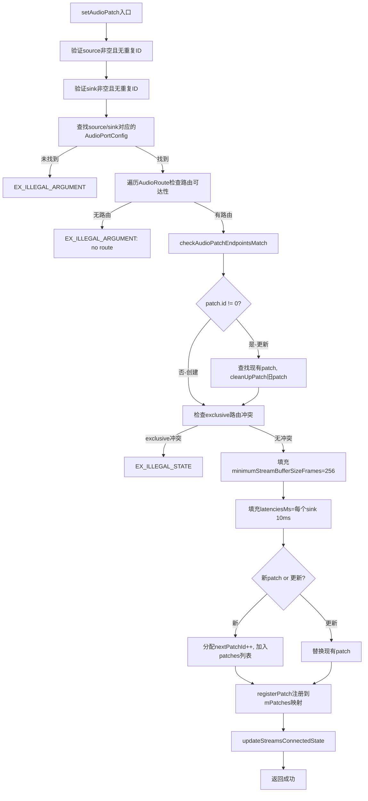
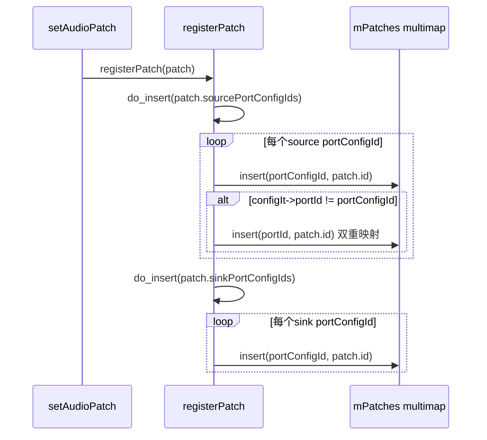
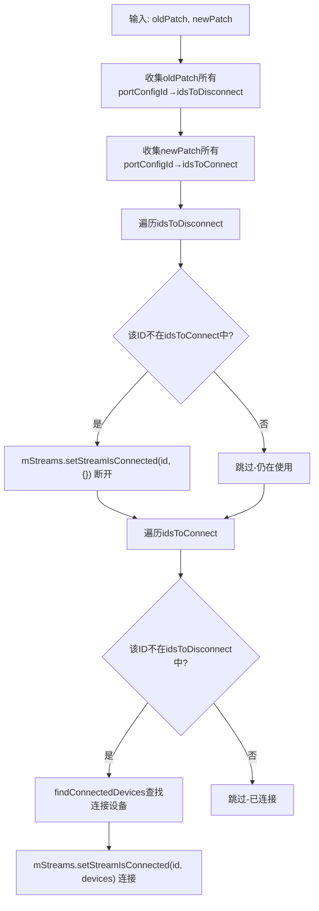
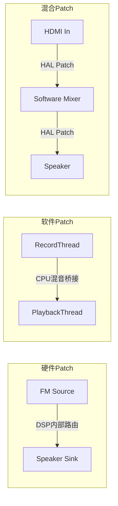
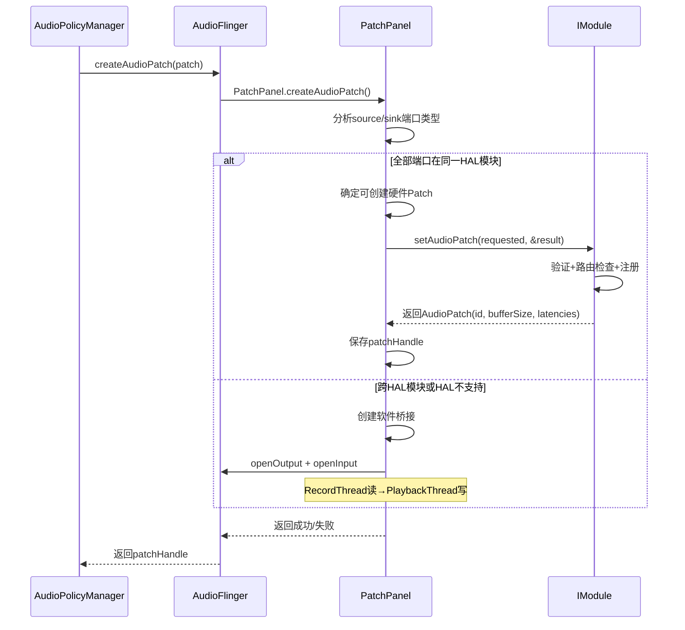
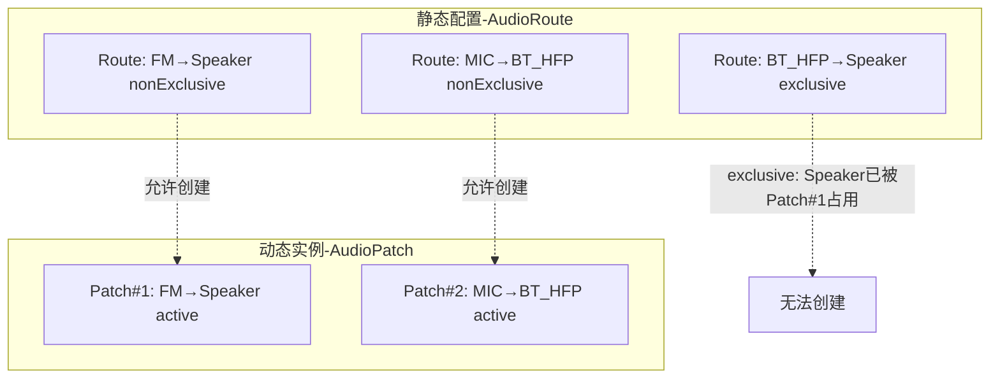

## 8.3 Audio Patch — 硬件路由

[← 上一个](08_8.2_StreamOutStreamIn-音频数据流.md) | [← 返回第8章](README.md) | [返回导航](../README.md) | [下一个 →](08_8.4_Audio_Port-音频端口模型.md)

---

> **核心源码**: [`Module.cpp::setAudioPatch()`](hardware/interfaces/audio/aidl/default/Module.cpp:744) | [`Module.cpp::resetAudioPatch()`](hardware/interfaces/audio/aidl/default/Module.cpp:991)
> **AIDL定义**: [`AudioPatch.aidl`](hardware/interfaces/audio/aidl/android/hardware/audio/core/AudioPatch.aidl)
> **AudioFlinger侧**: [`PatchPanel.cpp`](frameworks/av/services/audioflinger/PatchPanel.cpp)

### 8.3.1 AudioPatch数据结构

[`AudioPatch`](hardware/interfaces/audio/aidl/android/hardware/audio/core/AudioPatch.aidl:25)定义了source→sink的路由连接：

```java
parcelable AudioPatch {
    int id;                           // Patch唯一ID，HAL模块内唯一
    int[] sourcePortConfigIds;        // 源端口配置ID列表（至少1个，不可重复）
    int[] sinkPortConfigIds;          // 目标端口配置ID列表（至少1个，不可重复）
    int minimumStreamBufferSizeFrames; // HAL填充：流最小缓冲帧数
    int[] latenciesMs;                // HAL填充：每个sink的延迟(ms)
}
```

**关键字段说明**：
- `sourcePortConfigIds`/`sinkPortConfigIds`：引用AudioPortConfig.id，不是AudioPort.id
- `minimumStreamBufferSizeFrames`：由HAL在创建patch时填充，框架据此设置流缓冲大小
- `latenciesMs`：与sinkPortConfigIds一一对应，标称延迟值

### 8.3.2 Patch创建流程 — setAudioPatch深度解析

[`Module::setAudioPatch()`](hardware/interfaces/audio/aidl/default/Module.cpp:744)是AIDL HAL中创建/更新AudioPatch的核心方法，共104行实现：



**阶段1：输入验证**（源码L746-777）

| 检查项 | 错误码 | 说明 |
|--------|--------|------|
| sourcePortConfigIds为空 | EX_ILLEGAL_ARGUMENT | 至少需要1个source |
| source有重复ID | EX_ILLEGAL_ARGUMENT | 所有source ID必须唯一 |
| sinkPortConfigIds为空 | EX_ILLEGAL_ARGUMENT | 至少需要1个sink |
| sink有重复ID | EX_ILLEGAL_ARGUMENT | 所有sink ID必须唯一 |
| source/sink的portConfigId不存在 | EX_ILLEGAL_ARGUMENT | 必须引用已存在的配置 |

**阶段2：路由可达性检查**（源码L778-798）

遍历`AudioRoute`列表，检查source→sink是否有可用路由：
```cpp
// L782-792: 构建allowedSinkPorts映射
for (auto src : sources) {
    for (const auto& r : routes) {
        if (std::find(r.sourcePortIds.begin(), r.sourcePortIds.end(), src->portId) != r.sourcePortIds.end()) {
            if (!allowedSinkPorts[r.sinkPortId]) {  // 优先non-exclusive
                allowedSinkPorts[r.sinkPortId] = !r.isExclusive;
            }
        }
    }
}
```

**阶段3：Exclusive路由冲突检查**（源码L818-827）

如果sink端口标记为exclusive路由，且已被其他patch使用，则返回EX_ILLEGAL_STATE。

**阶段4：Patch注册与流状态更新**（源码L828-843）

```cpp
_aidl_return->minimumStreamBufferSizeFrames = kMinimumStreamBufferSizeFrames; // 256
_aidl_return->latenciesMs.insert(..., kLatencyMs); // 10ms per sink
registerPatch(*existing);
updateStreamsConnectedState(oldPatch, *_aidl_return);
```

### 8.3.3 registerPatch — Patch注册到映射表

[`Module::registerPatch()`](hardware/interfaces/audio/aidl/default/Module.cpp:325)将patch的source/sink端口配置ID映射到patch.id：



mPatches是`std::multimap<int32_t, int32_t>`，key为portConfigId/portId，value为patchId。用于快速查找某个端口被哪些patch使用。

### 8.3.4 updateStreamsConnectedState — 流连接状态更新

[`Module::updateStreamsConnectedState()`](hardware/interfaces/audio/aidl/default/Module.cpp:342)在patch变更时更新关联Stream的连接状态：



核心逻辑：旧patch中不在新patch中的端口→断开；新patch中不在旧patch中的端口→连接。

### 8.3.5 resetAudioPatch — 删除Patch

[`Module::resetAudioPatch()`](hardware/interfaces/audio/aidl/default/Module.cpp:991)：

```cpp
ndk::ScopedAStatus Module::resetAudioPatch(int32_t in_patchId) {
    auto& patches = getConfig().patches;
    auto patchIt = findById<AudioPatch>(patches, in_patchId);
    if (patchIt != patches.end()) {
        cleanUpPatch(patchIt->id);          // 清理mPatches映射
        updateStreamsConnectedState(*patchIt, AudioPatch{}); // 所有端口断开
        patches.erase(patchIt);             // 从配置中删除
        return ndk::ScopedAStatus::ok();
    }
    return ndk::ScopedAStatus::fromExceptionCode(EX_ILLEGAL_ARGUMENT);
}
```

### 8.3.6 硬件Patch vs 软件Patch



| 维度 | 硬件Patch | 软件Patch | 混合Patch |
|------|-----------|-----------|-----------|
| 路径 | HAL内部DSP直接路由 | AudioFlinger CPU处理 | 硬件+软件组合 |
| 延迟 | 极低（<1ms） | 较高（10-20ms） | 中等 |
| 功耗 | 低（DSP处理） | 高（CPU唤醒） | 中 |
| 场景 | FM→Speaker, BT_HFP→Speaker | 跨HAL模块路由 | HDMI In→软件处理→输出 |
| 条件 | HAL支持+路由可达 | 通用fallback | 部分硬件+部分软件 |
| AudioFlinger | PatchPanel直接调HAL | 创建Record+Playback线程 | 分段处理 |

### 8.3.7 AudioFlinger PatchPanel到HAL的调用链



### 8.3.8 AudioRoute与Patch的关系

AudioRoute定义了静态路由可达性，AudioPatch是动态路由实例：



| 概念 | AudioRoute | AudioPatch |
|------|-----------|------------|
| 性质 | 静态配置，声明路由可达性 | 动态实例，激活路由连接 |
| 定义位置 | audio_policy_configuration.xml | 运行时由APM创建 |
| exclusive | 声明是否独占sink | 检查exclusive约束 |
| 生命周期 | 配置加载时固定 | 动态创建/更新/删除 |

### 8.3.9 HIDL vs AIDL Patch对比

| 维度 | HIDL createAudioPatch | AIDL setAudioPatch |
|------|----------------------|-------------------|
| 方法签名 | createAudioPatch(sources, sinks, &patch) | setAudioPatch(requested, &result) |
| 更新语义 | 无，只能create+release | 支持id!=0时更新现有patch |
| 返回信息 | patchHandle | AudioPatch含bufferSize+latencies |
| 端点匹配 | HAL自行检查 | checkAudioPatchEndpointsMatch可覆盖 |
| reset | releaseAudioPatch(handle) | resetAudioPatch(patchId) |

---

[← 上一个](08_8.2_StreamOutStreamIn-音频数据流.md) | [← 返回第8章](README.md) | [返回导航](../README.md) | [下一个 →](08_8.4_Audio_Port-音频端口模型.md)