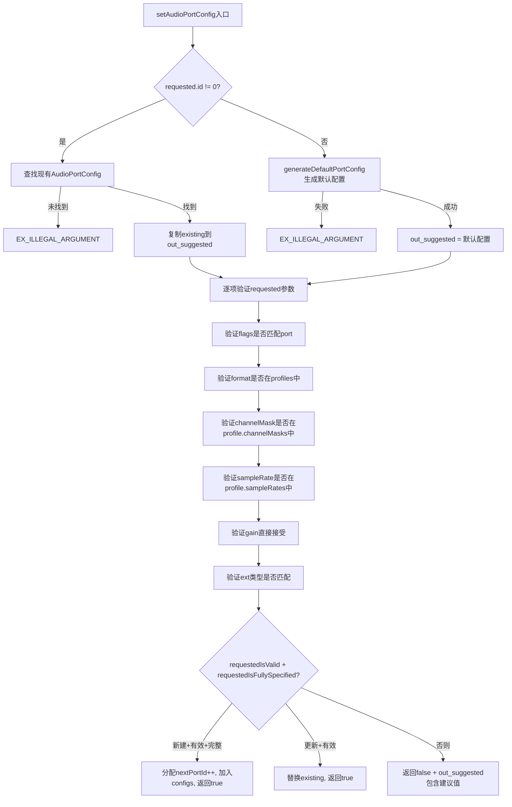
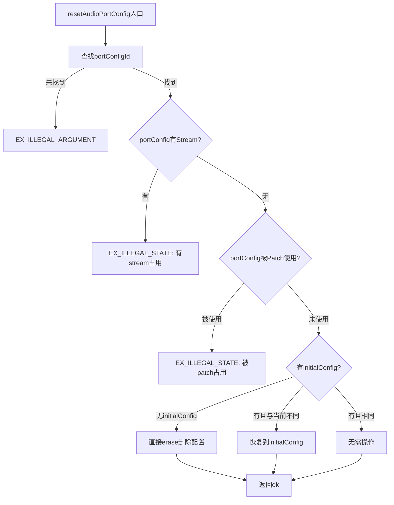
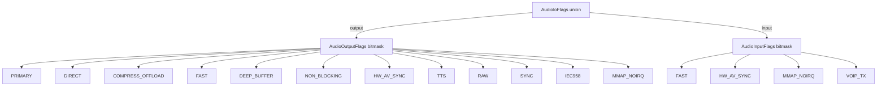
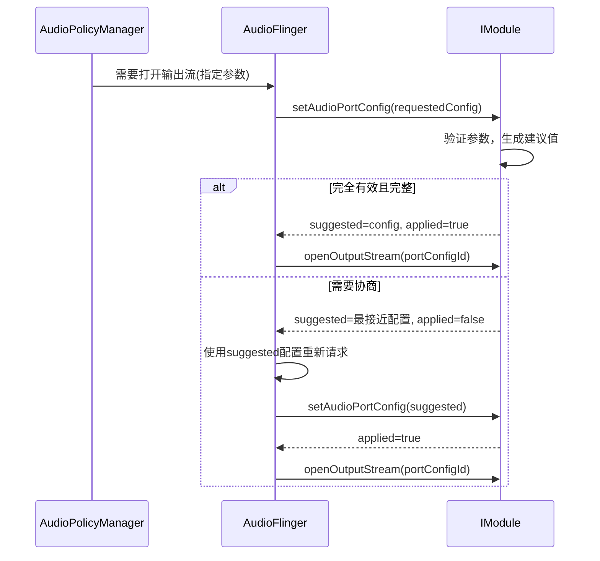

## 8.4 Audio Port — 音频端口模型

[← 上一个](08_8.3_Audio_Patch-硬件路由.md) | [← 返回第8章](README.md) | [返回导航](../README.md) | [下一个 →](08_8.5_HAL参数机制.md)

---

> **核心源码**: [`Module.cpp::setAudioPortConfig()`](hardware/interfaces/audio/aidl/default/Module.cpp:850) | [`Module.cpp::generateDefaultPortConfig()`](hardware/interfaces/audio/aidl/default/Module.cpp:68) | [`Module.cpp::resetAudioPortConfig()`](hardware/interfaces/audio/aidl/default/Module.cpp:1005)
> **AIDL定义**: `AudioPort` / `AudioPortConfig` / `AudioPortExt` 位于 `android.media.audio.common`

### 8.4.1 AudioPort数据结构

AudioPort是HAL音频端口的基础描述，定义了端口的静态能力：

```java
parcelable AudioPort {
    int id;                           // 端口唯一ID
    AudioIoFlags flags;               // 输入/输出标志位
    AudioProfile[] profiles;          // 支持的音频格式/profile列表
    AudioPortExt ext;                 // 端口扩展类型(DEVICE/MIX/SESSION)
    AudioGain[] gains;                // 增益控制列表
    String name;                      // 端口名称(可选)
    AudioPortDeviceExt[] connectedDevices; // DEVICE端口已连接设备列表
}
```

**端口扩展类型**（AudioPortExt）：

| Tag | 类型 | 说明 | 关键字段 |
|-----|------|------|---------|
| `device` | AudioPortDeviceExt | 物理设备端口 | deviceType, address |
| `mix` | AudioMixPortExt | 软件混音端口 | handle(openOutput/Input的句柄) |
| `session` | AudioPortSessionExt | 效果会话端口 | sessionType |

```mermaid
graph TB
    AP[AudioPort] --> FLAGS[AudioIoFlags]
    AP --> PROFILES[AudioProfile[]]
    AP --> EXT[AudioPortExt]
    AP --> GAINS[AudioGain[]]
    FLAGS -->|output| OUT_FLAG[AudioOutputFlags: PRIMARY, DIRECT, COMPRESS_OFFLOAD...]
    FLAGS -->|input| IN_FLAG[AudioInputFlags: FAST, HW_AV_SYNC...]
    PROFILES --> P_FMT[format: PCM_16_BIT, COMPRESSED...]
    PROFILES --> P_CH[channelMasks: STEREO, MONO, 5.1...]
    PROFILES --> P_SR[sampleRates: 48000, 44100...]
    EXT -->|device| DEV_EXT[deviceType + address]
    EXT -->|mix| MIX_EXT[handle]
    EXT -->|session| SES_EXT[sessionType]
    GAINS --> G_MODE[mode: JOINT, CHANNELS...]
    GAINS --> G_MIN[minValue: -9000 mB]
    GAINS --> G_MAX[maxValue: 0 mB]
    GAINS --> G_STEP[stepValue: 100 mB]
```

### 8.4.2 AudioPortConfig — 端口运行时配置

AudioPortConfig是AudioPort的运行时实例，描述端口的具体参数配置：

```java
parcelable AudioPortConfig {
    int id;                           // 配置唯一ID（HAL分配）
    int portId;                       // 关联的AudioPort.id
    OptionalAudioFormatDescription format;  // 选定的音频格式
    OptionalAudioChannelMask channelMask;   // 选定的通道掩码
    OptionalInt sampleRate;            // 选定的采样率
    OptionalAudioGainConfig gain;      // 选定的增益配置
    AudioIoFlags flags;               // 输入/输出标志
    AudioPortExt ext;                 // 端口扩展类型
}
```

**AudioPort vs AudioPortConfig关系**：

| 概念 | AudioPort | AudioPortConfig |
|------|-----------|-----------------|
| 性质 | 静态能力描述 | 动态运行时配置 |
| profiles | 列出所有支持的格式/通道/采样率组合 | 选定其中一组具体参数 |
| gains | 列出所有支持的增益模式 | 选定一组增益值 |
| 创建 | 配置文件加载/IModule添加 | setAudioPortConfig创建 |
| 数量 | 每个端口1个AudioPort | 每个端口可有多个AudioPortConfig |
| 生命周期 | 模块加载时创建 | 动态创建/更新/重置 |

### 8.4.3 setAudioPortConfig — 端口配置创建/更新

[`Module::setAudioPortConfig()`](hardware/interfaces/audio/aidl/default/Module.cpp:850)是AIDL HAL中设置端口配置的核心方法，共139行实现：



**关键设计：协商机制**

`setAudioPortConfig`实现了配置协商：如果requested参数不完全有效，不会直接报错，而是返回`out_suggested`包含建议的最接近配置，同时`_aidl_return`设为`false`。

| 场景 | requestedIsValid | requestedIsFullySpecified | _aidl_return | 说明 |
|------|-----------------|--------------------------|--------------|------|
| 新建+全部有效+全部指定 | true | true | true | 创建新配置 |
| 更新+全部有效 | true | 任意 | true | 更新现有配置 |
| 参数部分无效 | false | 任意 | false | out_suggested包含建议值 |
| 参数部分缺失 | true | false | false | out_suggested包含填充后的值 |

### 8.4.4 generateDefaultPortConfig — 默认配置生成

[`generateDefaultPortConfig()`](hardware/interfaces/audio/aidl/default/Module.cpp:68)从AudioPort的profiles中提取默认配置：

```cpp
bool generateDefaultPortConfig(const AudioPort& port, AudioPortConfig* config) {
    config->portId = port.id;
    const auto& profile = port.profiles.begin(); // 取第一个profile
    config->format = profile->format;             // 默认格式
    config->channelMask = *profile->channelMasks.begin(); // 默认通道
    Int sampleRate;
    sampleRate.value = *profile->sampleRates.begin();      // 默认采样率
    config->sampleRate = sampleRate;
    config->flags = port.flags;                   // 复制端口flags
    config->ext = port.ext;                       // 复制端口ext
    return true;
}
```

策略：取profiles列表第一个元素作为默认值。

### 8.4.5 resetAudioPortConfig — 端口配置重置

[`Module::resetAudioPortConfig()`](hardware/interfaces/audio/aidl/default/Module.cpp:1005)：



重置优先级：
1. 检查是否有Stream依赖 → EX_ILLEGAL_STATE
2. 检查是否有Patch依赖 → EX_ILLEGAL_STATE
3. 有initialConfig → 恢复到初始配置
4. 无initialConfig → 删除配置

### 8.4.6 IModule端口相关方法

| 方法 | 功能 | 返回值 |
|------|------|--------|
| `getAudioPort(portId)` | 查询单个端口 | AudioPort |
| `getAudioPorts()` | 获取所有端口 | AudioPort[] |
| `getAudioPortConfigs()` | 获取所有端口配置 | AudioPortConfig[] |
| `setAudioPortConfig(requested, &suggested, &applied)` | 创建/更新端口配置 | 建议值+是否应用 |
| `resetAudioPortConfig(portConfigId)` | 重置/删除端口配置 | OK |
| `getAudioRoutes()` | 获取所有路由 | AudioRoute[] |
| `getAudioRoutesForAudioPort(portId)` | 获取端口相关路由 | AudioRoute[] |

### 8.4.7 AudioProfile — 音频格式描述

AudioProfile描述端口支持的一组音频参数：

```java
parcelable AudioProfile {
    AudioFormatDescription format;      // 格式(PCM_16_BIT, AAC, COMPRESSED...)
    AudioChannelMask[] channelMasks;    // 通道掩码列表
    Int[] sampleRates;                  // 采样率列表
    AudioFormatDescription encoding;    // 编码格式(可选)
}
```

一个AudioPort可以有多个AudioProfile，每个Profile代表一种格式及其支持的通道/采样率组合。

**findAudioProfile**（源码L96-106）查找匹配格式的profile：
```cpp
bool findAudioProfile(const AudioPort& port, const AudioFormatDescription& format,
                      AudioProfile* profile) {
    return find_if(port.profiles.begin(), port.profiles.end(),
                   [&format](const auto& p) { return p.format == format; }) != port.profiles.end();
}
```

### 8.4.8 AudioIoFlags — 输入输出标志



**flags在setAudioPortConfig中的验证**（源码L892-902）：
- 如果requested指定了flags，必须与port的flags完全匹配
- 如果requested未指定flags，则标记为不完全指定(requestedIsFullySpecified=false)

### 8.4.9 AudioFlinger到HAL的端口配置流程



### 8.4.10 HIDL vs AIDL端口模型对比

| 维度 | HIDL | AIDL |
|------|------|------|
| 端口定义 | audio_port_v7固定结构体 | AudioPort parcelable |
| 端口配置 | 隐含在openOutput/openInput参数中 | 显式AudioPortConfig |
| 配置协商 | 无，直接尝试 | setAudioPortConfig返回建议值 |
| 动态端口 | addDevicePort/removeDevicePort | 仅通过connectExternalDevice |
| profiles | 简单数组 | AudioProfile[]结构化 |
| flags | uint32_t位掩码 | AudioIoFlags union |

---

[← 上一个](08_8.3_Audio_Patch-硬件路由.md) | [← 返回第8章](README.md) | [返回导航](../README.md) | [下一个 →](08_8.5_HAL参数机制.md)