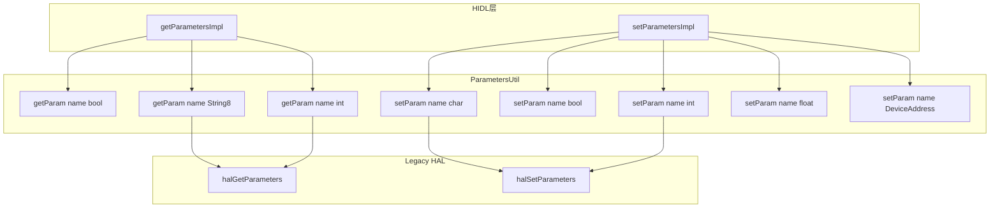
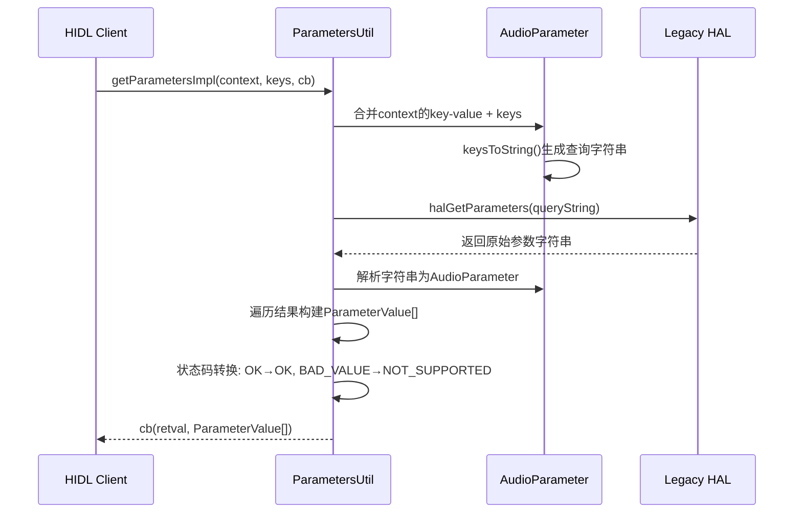
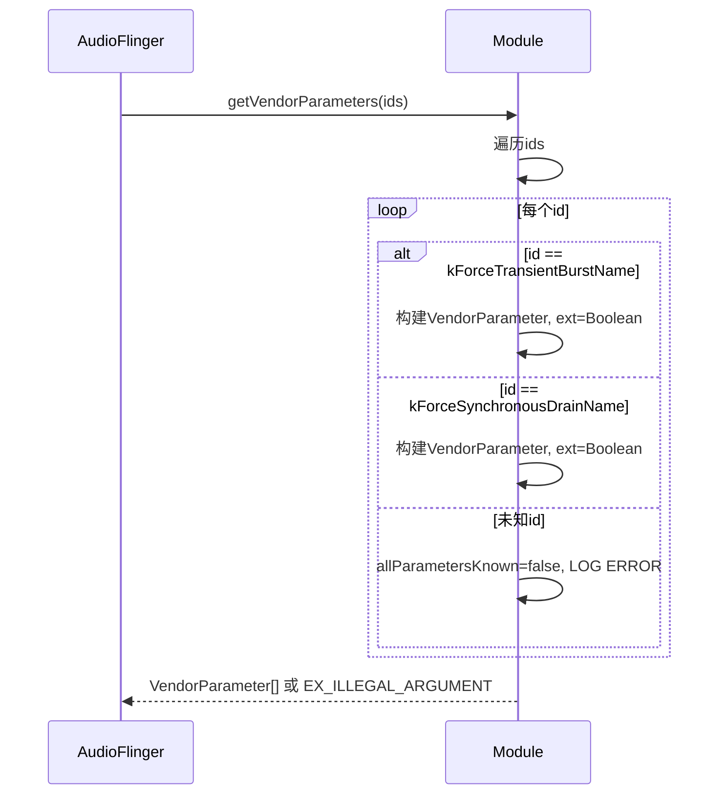
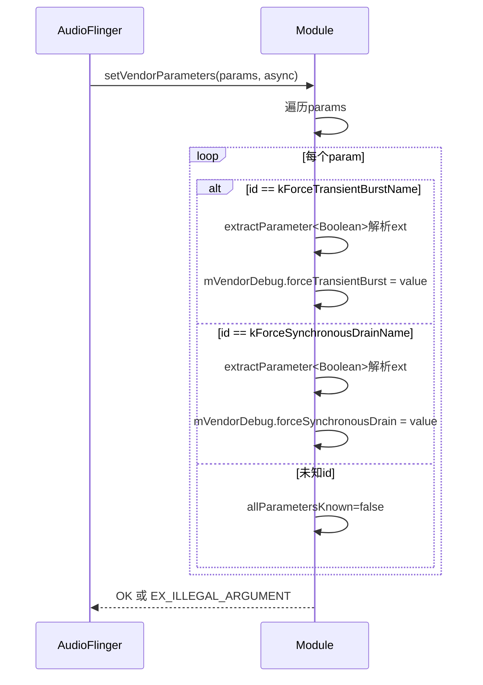
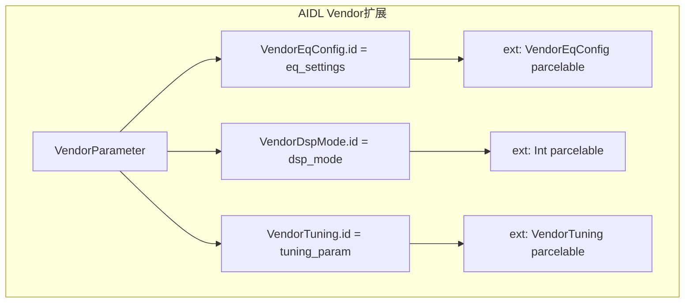
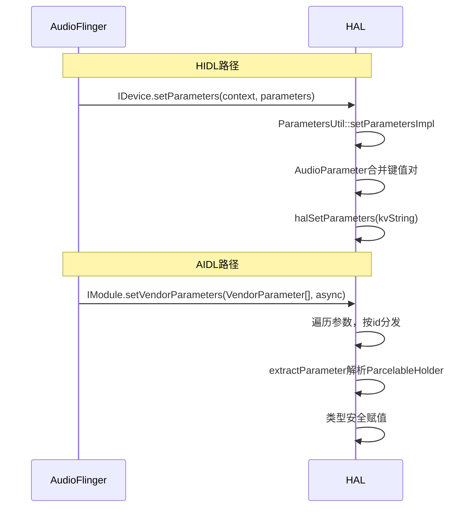

## 8.5 HAL参数机制

[← 上一个](08_8.4_Audio_Port-音频端口模型.md) | [← 返回第8章](README.md) | [返回导航](../README.md) | [下一个 →](08_8.6_Vendor实现要点.md)

---

> **HIDL源码**: [`ParametersUtil.cpp`](hardware/interfaces/audio/core/all-versions/default/ParametersUtil.cpp) (174行)
> **AIDL源码**: [`Module.cpp::getVendorParameters()`](hardware/interfaces/audio/aidl/default/Module.cpp:1137) | [`Module.cpp::setVendorParameters()`](hardware/interfaces/audio/aidl/default/Module.cpp:1176)
> **AIDL定义**: `VendorParameter` parcelable

### 8.5.1 HIDL参数机制 — 键值对范式

HIDL HAL使用`setParameters`/`getParameters`传递非标准参数，底层由[`ParametersUtil`](hardware/interfaces/audio/core/all-versions/default/ParametersUtil.cpp)实现。

**核心数据结构**：键值对`ParameterValue { key: string, value: string }`



### 8.5.2 getParametersImpl — 参数获取

[`ParametersUtil::getParametersImpl()`](hardware/interfaces/audio/core/all-versions/default/ParametersUtil.cpp:79)流程：

1. 合并context和keys到AudioParameter
2. 调用halGetParameters获取原始字符串
3. 解析AudioParameter返回键值对列表
4. 如果HAL返回空值→NOT_SUPPORTED



### 8.5.3 setParametersImpl — 参数设置

[`ParametersUtil::setParametersImpl()`](hardware/interfaces/audio/core/all-versions/default/ParametersUtil.cpp:138)流程：

1. 合合context和parameters到AudioParameter
2. 调用halSetParameters写入

**getParam重载方法**：

| 方法 | 参数类型 | 转换规则 |
|------|---------|---------|
| `getParam(name, bool*)` | bool | 空值→NOT_SUPPORTED, on/off字符串→true/false |
| `getParam(name, int*)` | int | 通过AudioParameter::getInt解析 |
| `getParam(name, String8*)` | String8 | 直接获取字符串值 |

**setParam重载方法**：

| 方法 | 参数类型 | 转换规则 |
|------|---------|---------|
| `setParam(name, char*)` | 字符串 | 直接add(name, value) |
| `setParam(name, bool)` | bool | true→"on", false→"off" |
| `setParam(name, int)` | int | 通过addInt(name, value) |
| `setParam(name, float)` | float | 通过addFloat(name, value) |
| `setParam(name, DeviceAddress)` | 设备地址 | 转换为HAL设备类型+地址 |

**常见HIDL参数键**：

| 键 | 类型 | 说明 |
|----|------|------|
| `routing` | int | 路由到设备ID |
| `bt_samplerate` | int | 蓝牙SCO采样率 |
| `screen_state` | bool | 屏幕开关状态 |
| `A2dpSuspended` | bool | A2DP挂起标志 |
| `hac_enable` | bool | HAC助听兼容 |
| `tty_mode` | int | TTY模式(0=OFF,1=HCO,2=VCO,3=FULL) |
| `hw_av_sync` | string | HW AV Sync ID |
| `closing_method` | int | 流关闭方法 |

### 8.5.4 状态码转换

[`getHalStatusToResult()`](hardware/interfaces/audio/core/all-versions/default/ParametersUtil.cpp:26)将legacy HAL的status_t转换为HIDL Result：

| status_t | Result | 说明 |
|----------|--------|------|
| OK | OK | 成功 |
| BAD_VALUE | NOT_SUPPORTED | HAL不支持该参数 |
| INVALID_OPERATION | INVALID_ARGUMENTS | 类型转换失败 |
| 其他 | INVALID_ARGUMENTS | 异常 |

### 8.5.5 AIDL VendorParameter — 类型化参数范式

AIDL HAL用`VendorParameter`替代HIDL的键值对，提供类型安全的参数扩展：

```java
parcelable VendorParameter {
    String id;                      // 参数唯一标识
    ParcelableHolder ext;           // 类型化值(Boolean, Int, Float等)
}
```

**VendorParameter vs HIDL键值对**：

| 维度 | HIDL ParameterValue | AIDL VendorParameter |
|------|--------------------|--------------------|
| 值类型 | string（无类型） | ParcelableHolder（类型化） |
| 类型安全 | 无，靠字符串解析 | 有，AIDL编译器保证 |
| 扩展性 | 添加新字符串键 | 添加新parcelable |
| 调用位置 | IDevice.set/getParameters | IModule.get/setVendorParameters |

### 8.5.6 AIDL VendorParameter实现

[`Module::getVendorParameters()`](hardware/interfaces/audio/aidl/default/Module.cpp:1137)和[`Module::setVendorParameters()`](hardware/interfaces/audio/aidl/default/Module.cpp:1176)：

默认实现支持两个调试参数：

| 参数ID | 类型 | 说明 |
|--------|------|------|
| `VendorDebug.kForceTransientBurstName` | Boolean | 模拟部分burst写入 |
| `VendorDebug.kForceSynchronousDrainName` | Boolean | 强制同步drain |

**getVendorParameters流程**：



**setVendorParameters流程**（源码L1176-1197）：



**extractParameter模板**（源码L1162-1172）：
```cpp
template <typename W>
bool extractParameter(const VendorParameter& p, decltype(W::value)* v) {
    std::optional<W> value;
    binder_status_t result = p.ext.getParcelable(&value);
    if (result == STATUS_OK && value.has_value()) {
        *v = value.value().value;
        return true;
    }
    return false;
}
```

### 8.5.7 Vendor扩展参数指南

Vendor需要扩展自己的参数时：

**HIDL方式**：
1. 在Vendor HAL实现中override `halGetParameters/halSetParameters`
2. 添加自定义字符串键和值
3. 无需修改接口定义

**AIDL方式**：
1. 定义新的parcelable类型（如`VendorEqConfig`）
2. 在getVendorParameters/setVendorParameters中识别自定义id
3. 使用ParcelableHolder传递类型化值
4. 可在Stream上也通过get/setVendorParameters传递



### 8.5.8 参数传递路径对比



---

[← 上一个](08_8.4_Audio_Port-音频端口模型.md) | [← 返回第8章](README.md) | [返回导航](../README.md) | [下一个 →](08_8.6_Vendor实现要点.md)