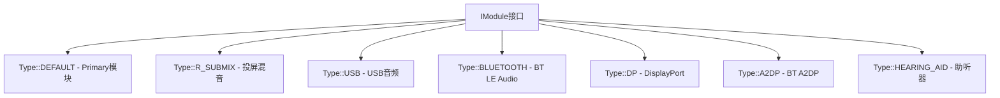
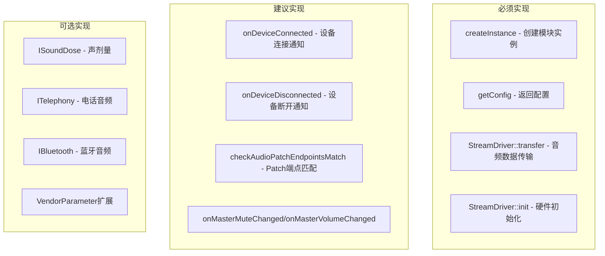
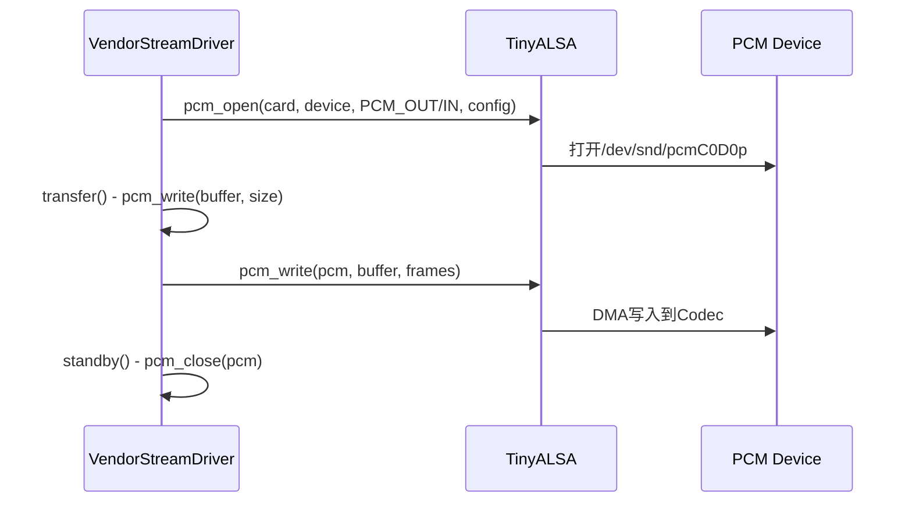
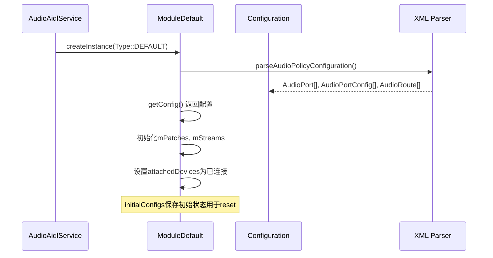
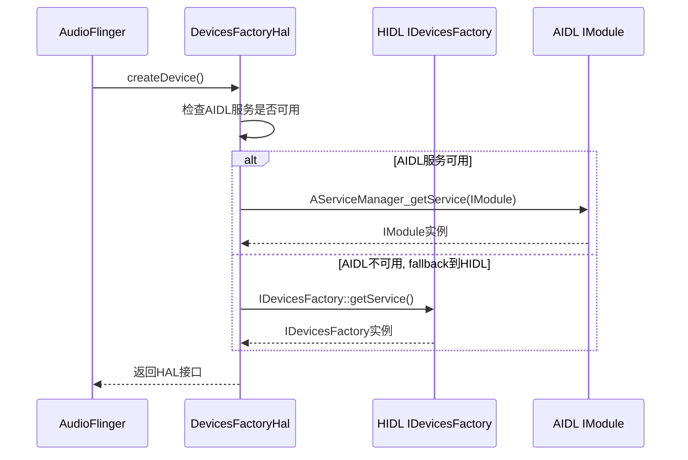

## 8.6 Vendor实现要点

[← 上一个](08_8.5_HAL参数机制.md) | [← 返回第8章](README.md) | [返回导航](../README.md) | [下一个 →](08_8.7_AudioGain-HAL增益控制模型.md)

---

> **核心源码**: [`Module.cpp`](hardware/interfaces/audio/aidl/default/Module.cpp) (1356行) | [`Module.h`](hardware/interfaces/audio/aidl/default/include/core-impl/Module.h)
> **配置参考**: [`audio_policy_configuration.xml`](frameworks/av/services/audiopolicy/config/audio_policy_configuration.xml)
> **HAL适配层**: [`FactoryHal.cpp`](frameworks/av/media/libaudiohal/FactoryHal.cpp)

### 8.6.1 多HAL模块配置

AIDL HAL通过`IModule`接口的`Type`区分不同模块类型：



[`Module::createInstance()`](hardware/interfaces/audio/aidl/default/Module.cpp:111)根据Type创建不同子类：

```cpp
std::shared_ptr<Module> Module::createInstance(Type type) {
    switch (type) {
        case Module::Type::USB:
            return ndk::SharedRefBase::make<ModuleUsb>(type);
        case Type::DEFAULT:
        case Type::R_SUBMIX:
            return ndk::SharedRefBase::make<ModuleDefault>(type);
        case Type::BLUETOOTH:
            return ndk::SharedRefBase::make<ModuleBluetooth>(type);
        // ... 其他类型
    }
}
```

### 8.6.2 audio_policy_configuration.xml配置

AIDL HAL模块配置从XML文件加载到Configuration对象：

```xml
<hal version="2.0" name="primary">
    <moduleConfig>
        <devicePorts>
            <devicePort tagName="Speaker" type="AUDIO_DEVICE_OUT_SPEAKER" role="sink">
                <profile name="primary" format="AUDIO_FORMAT_PCM_16_BIT"
                         samplingRates="48000" channelMasks="AUDIO_CHANNEL_OUT_STEREO"/>
                <gains>
                    <gain mode="AUDIO_GAIN_MODE_JOINT"
                          minValue="-9000" maxValue="0" stepValue="100"
                          defaultValue="-3000" minRampMs="50" maxRampMs="500"/>
                </gains>
            </devicePort>
        </devicePorts>
        <mixPorts>
            <mixPort name="primary_output" role="source">
                <profile .../>
            </mixPort>
        </mixPorts>
        <routes>
            <route type="mix" sink="Speaker" sources="primary_output"/>
        </routes>
        <attachedDevices>
            <attachedDevice>Speaker</attachedDevice>
        </attachedDevices>
        <defaultOutputDevice>Speaker</defaultOutputDevice>
    </moduleConfig>
</hal>
```

**配置元素映射**：

| XML元素 | AIDL类型 | 说明 |
|---------|---------|------|
| `<devicePort>` | AudioPort (ext=device) | 物理设备端口 |
| `<mixPort>` | AudioPort (ext=mix) | 软件混音端口 |
| `<profile>` | AudioProfile | 格式/采样率/通道 |
| `<gain>` | AudioGain | 增益配置 |
| `<route>` | AudioRoute | 静态路由 |
| `<attachedDevices>` | 初始连接设备 | 模块启动时已连接 |
| `<defaultOutputDevice>` | 默认输出设备 | 首次路由目标 |

### 8.6.3 Vendor必须实现的核心方法



**最小实现集**（继承ModuleDefault即可工作的方法）：

| 方法 | 默认实现 | Vendor需覆盖 | 说明 |
|------|---------|-------------|------|
| `setAudioPatch` | 路由检查+注册 | 可覆盖 | 默认仅检查路由可达性 |
| `openOutputStream` | 创建StreamContext+Stream | 可覆盖 | 默认用StreamStub |
| `openInputStream` | 同上 | 可覆盖 | 默认用StreamStub |
| `setAudioPortConfig` | 参数协商 | 可覆盖 | 默认实现完整协商 |
| `getVendorParameters` | 仅支持调试参数 | **需覆盖** | 添加Vendor参数 |
| `setVendorParameters` | 仅支持调试参数 | **需覆盖** | 添加Vendor参数 |
| `connectExternalDevice` | USB/BT默认 | 需覆盖 | Primary需自行处理 |
| `disconnectExternalDevice` | 同上 | 需覆盖 | 同上 |

### 8.6.4 StreamDriver实现指南

StreamDriver是Vendor实现音频数据传输的核心接口：

**最小StreamDriver实现**：

```cpp
class VendorStreamDriver : public StreamDriver {
    // 必须实现
    bool init() override {
        // 打开ALSA/Tinyalsa设备节点
        // 配置采样率/格式/通道
        return true;
    }
    
    bool transfer(const void* buffer, size_t frameCount,
                  int32_t* actualFrames, int32_t* latencyMs) override {
        // 写入/读取PCM数据到硬件
        // 返回实际传输帧数和延迟
        *latencyMs = 10; // 硬件延迟
        return true;
    }
    
    // 建议实现
    bool standby() override { /* 硬件低功耗 */ return true; }
    bool pause() override { /* 暂停DMA */ return true; }
    bool resume() override { /* 恢复DMA */ return true; }
    bool flush() override { /* 清空缓冲 */ return true; }
    bool drain(DrainMode mode) override { /* offload排水 */ return true; }
};
```

**ALSA/Tinyalsa典型实现路径**：



### 8.6.5 Configuration加载流程



**initialConfigs**的作用：resetAudioPortConfig时恢复到初始状态。Module在加载配置时保存一份`initialConfigs`副本。

### 8.6.6 libaudiohal适配层

[`FactoryHal`](frameworks/av/media/libaudiohal/FactoryHal.cpp)负责创建HAL接口实例：



### 8.6.7 Vendor HAL构建要点

**AIDL HAL构建配置**（Android.bp）：

```bp
cc_library_shared {
    name: "audio.primary.vendor",
    vendor: true,
    srcs: [
        "VendorModule.cpp",
        "VendorStreamDriver.cpp",
    ],
    shared_libs: [
        "android.hardware.audio.core-V3-ndk",
        "libbinder_ndk",
        "libcutils",
        "liblog",
    ],
}
```

**VINTF声明**（manifest.xml）：

```xml
<hal format="aidl">
    <name>android.hardware.audio.core</name>
    <fqname>IModule/default</fqname>
</hal>
```

**关键构建区别**：

| 维度 | HIDL HAL | AIDL HAL |
|------|----------|----------|
| 构建系统 | Android.mk/.bp + hidl_gen | Android.bp + aidl_gen |
| 库命名 | `audio.primary.xxx.so` | 同，但依赖ndk binder |
| 接口库 | `android.hardware.audio@2.x` | `android.hardware.audio.core-V3-ndk` |
| VINTF | `<hal format="hidl">` | `<hal format="aidl">` |
| 稳定性 | HIDL稳定 | AIDL+VintfStability |

### 8.6.8 Vendor常见陷阱与建议

| 陷阱 | 说明 | 建议 |
|------|------|------|
| transfer返回0帧 | 硬件未准备好 | 确保init()正确打开设备，transfer内处理EAGAIN |
| 不处理standby | 功耗过高 | standby中关闭PCM设备，start时重新打开 |
| 忽略latencyMs | AudioFlinger延迟补偿不准 | 精确计算硬件+缓冲延迟 |
| 不实现connectExternalDevice | USB/BT设备无法动态添加 | Primary模块需处理动态设备连接 |
| getVendorParameters返回EX_ILLEGAL_ARGUMENT | 对未知id直接报错 | 可部分成功部分失败，或自定义id |
| offload drain不实现 | COMPRESS_OFFLOAD流无法正常关闭 | drain(DRAIN_ALL)等待DSP完成 |
| setAudioPortConfig不考虑协商 | 配置失败时直接报错 | 实现建议值返回机制 |
| FMQ大小不合理 | 太小→频繁burst，太大→延迟高 | bufferSizeFrames >= 256，根据延迟计算 |

### 8.6.9 AAOS车载Vendor特殊要点

车载音频Vendor实现需考虑：

| 场景 | AIDL HAL要求 | 实现策略 |
|------|-------------|---------|
| 多输出Zone | 每个Zone一个AudioPort | 多个DEVICE端口+多个mix端口 |
| FM→Speaker硬件路由 | AudioPatch + AudioRoute | 配置FM→Speaker的非exclusive路由 |
| 电话音频降低媒体 | ITelephony + AudioGain | 实现ITelephony.switchAudioMode |
| 声剂量合规 | ISoundDose | 实现ISoundDose.registerSoundDoseCallback |
| DSP音效 | addDeviceEffect | 支持IEffect绑定到端口 |
| 外部设备(USB/BT) | connectExternalDevice | 动态添加AudioPort+AudioPortConfig |

---

[← 上一个](08_8.5_HAL参数机制.md) | [← 返回第8章](README.md) | [返回导航](../README.md) | [下一个 →](08_8.7_AudioGain-HAL增益控制模型.md)